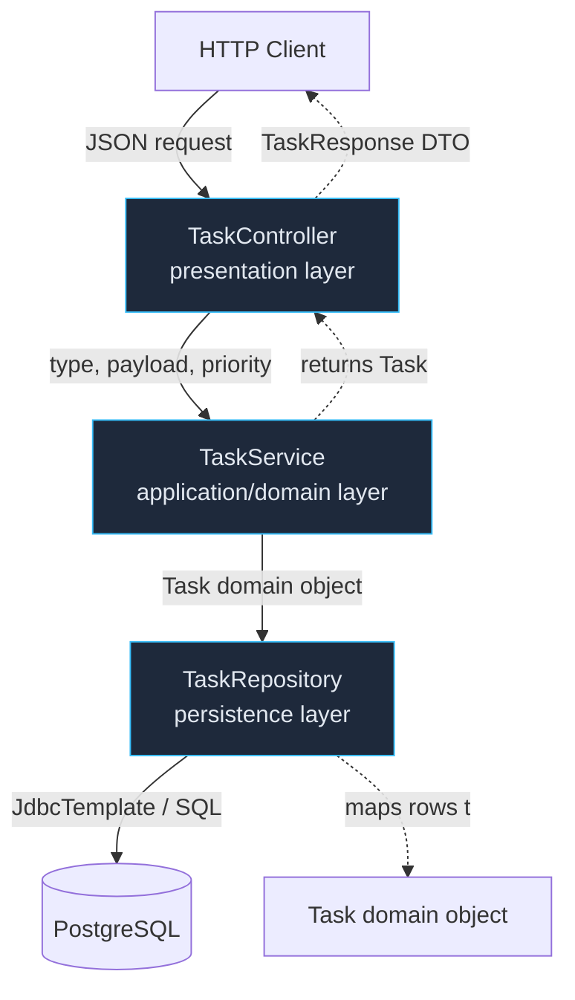
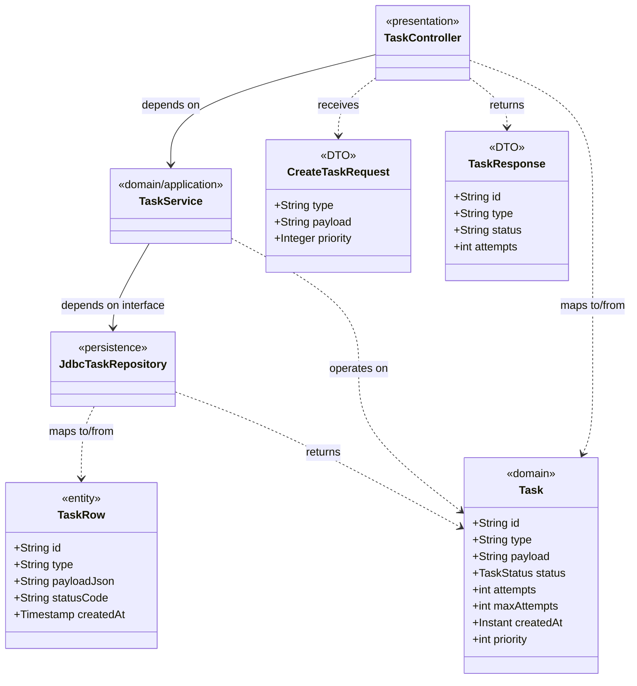

# Layered Architecture

> Where this fits in the project: when Phase 2 turns our in-memory prototype into a real Spring Boot service, requests arrive at an HTTP boundary, business rules decide what to do, and rows land in PostgreSQL. Layered architecture is the discipline that decides *which code is allowed to know about what*. It is the difference between a `TaskController` that quietly runs SQL and a clean stack where each layer has exactly one job. This chapter is the structural backbone for [`phase-2.md`](../09-project/phase-2.md).

---

## 1. Why this exists

Every backend, no matter how it is dressed up, does four things in order:

1. **Accept** input from the outside world (HTTP, gRPC, a queue, a CLI).
2. **Decide** what the input means and enforce business rules.
3. **Persist** or read state from a store.
4. **Return** a result the outside world can consume.

In a tiny program you can do all four in one method. That works for a weekend script and collapses the moment a second person, a second endpoint, or a second datastore shows up. The reasons it collapses are concrete:

- **Change amplification.** Renaming a database column should not force you to rewrite an HTTP serializer. If those two concerns live in the same method, every change touches everything.
- **Untestability.** You cannot unit-test a business rule if running it requires a live HTTP request *and* a live database connection.
- **Hidden coupling.** When the web layer talks straight to SQL, your URL routing becomes coupled to your table schema. You can no longer evolve one without the other.

> **Historical note.** Layering is old. The 1970s OSI network model stacked seven layers, each only talking to the layer directly below it. Eric Evans' *Domain-Driven Design* (2003) popularized the four-layer application stack — UI, application, domain, infrastructure — and Spring institutionalized the **Controller → Service → Repository** triad that dominates the JVM world today. The core idea never changed: **constrain who depends on whom so that change stays local.**

Layered architecture exists to give you a **dependency direction** you can reason about. Control flows down (controller calls service, service calls repository). Knowledge does not flow back up: the repository must never import a controller. That single rule buys you testability, swappability, and the ability to reason about one layer at a time.



---

## 2. The naive version

Here is the first thing almost everyone writes when they discover Spring. One class, all four responsibilities, talking straight to the database.

```java
// BAD: a "controller" that is secretly the entire application.
@RestController
@RequestMapping("/tasks")
public class TaskController {

    private final JdbcTemplate jdbc; // the web layer holds a raw DB handle

    public TaskController(JdbcTemplate jdbc) {
        this.jdbc = jdbc;
    }

    @PostMapping
    public Map<String, Object> create(@RequestBody Map<String, Object> body) {
        // 1. Parsing the request inline — no type safety, no validation.
        String type = (String) body.get("type");
        String payload = (String) body.get("payload");

        // 2. Business rule buried in the controller.
        int maxAttempts = type.equals("email") ? 5 : 3;

        // 3. SQL string concatenation — injection bug AND schema leak.
        String id = UUID.randomUUID().toString();
        jdbc.update(
            "INSERT INTO tasks (id, type, payload, status, attempts, max_attempts, priority) " +
            "VALUES ('" + id + "', '" + type + "', '" + payload + "', 'PENDING', 0, " + maxAttempts + ", 0)");

        // 4. Hand-built response — the DB schema leaks to the client as-is.
        Map<String, Object> resp = new HashMap<>();
        resp.put("id", id);
        resp.put("status", "PENDING");
        return resp;
    }
}
```

What is wrong here, ranked by how much it will hurt:

| Problem | Consequence |
|---|---|
| SQL string concatenation | SQL injection; a payload of `'); DROP TABLE tasks;--` is game over. |
| Business rule (`maxAttempts`) in controller | The same rule must be duplicated for every endpoint that creates tasks. |
| `Map<String, Object>` as request and response | No compile-time contract, no validation, silent `ClassCastException`s. |
| Web layer owns `JdbcTemplate` | You cannot unit-test the rule without a database; the schema is welded to the URL. |
| DB column names returned to client | Renaming a column is now a **breaking API change**. |

This code *runs*. It demos fine. It is also a liability that gets worse every week.

---

## 3. Improved version

Split responsibilities into three layers, each in its own class. Introduce a real domain object (`Task` from our canonical model) and a typed request object.

```java
// A typed request — no more Map<String,Object>.
public record CreateTaskRequest(String type, String payload, Integer priority) {}

// Presentation layer: HTTP in, HTTP out. Knows nothing about SQL.
@RestController
@RequestMapping("/tasks")
public class TaskController {
    private final TaskService taskService;

    public TaskController(TaskService taskService) {
        this.taskService = taskService;
    }

    @PostMapping
    public ResponseEntity<TaskResponse> create(@RequestBody CreateTaskRequest req) {
        Task created = taskService.submit(req.type(), req.payload(),
                                          req.priority() == null ? 0 : req.priority());
        return ResponseEntity.status(HttpStatus.CREATED).body(TaskResponse.from(created));
    }
}

// Application/domain layer: business rules. Knows nothing about HTTP.
@Service
public class TaskService {
    private final TaskRepository repository;

    public TaskService(TaskRepository repository) {
        this.repository = repository;
    }

    public Task submit(String type, String payload, int priority) {
        int maxAttempts = "email".equals(type) ? 5 : 3; // the business rule lives here, once.
        Task task = new Task(
            UUID.randomUUID().toString(), type, payload,
            TaskStatus.PENDING, 0, maxAttempts,
            Instant.now(), Instant.now(), priority);
        return repository.save(task);
    }
}

// Persistence layer: SQL only. Knows nothing about HTTP or business rules.
@Repository
public class JdbcTaskRepository implements TaskRepository {
    private final JdbcTemplate jdbc;

    public JdbcTaskRepository(JdbcTemplate jdbc) { this.jdbc = jdbc; }

    @Override
    public Task save(Task t) {
        jdbc.update("""
            INSERT INTO tasks (id, type, payload, status, attempts, max_attempts,
                               created_at, scheduled_at, priority)
            VALUES (?, ?, ?, ?, ?, ?, ?, ?, ?)
            """,
            t.id(), t.type(), t.payload(), t.status().name(),
            t.attempts(), t.maxAttempts(),
            Timestamp.from(t.createdAt()), Timestamp.from(t.scheduledAt()), t.priority());
        return t;
    }
    // findById, pollDue omitted for brevity — shown in the production version.
}
```

This is already a different universe:

- SQL is **parameterized** — injection is gone.
- The `maxAttempts` rule is in exactly one place and is unit-testable without a database (mock `TaskRepository`).
- The HTTP contract (`CreateTaskRequest` / `TaskResponse`) is decoupled from the DB schema.

But it is not yet production-grade. There is no validation, no error mapping, no separation between the *domain* `Task` and the row shape the database actually stores, and no explicit boundary type for what crosses the wire. That is the next step.

---

## 4. Production-quality version

A staff engineer ships layering with **explicit boundary types** at the top and bottom of the stack, validation at the edge, and centralized error translation. The three terms to nail down first:

- **DTO (Data Transfer Object):** the shape that crosses the *HTTP* boundary. Versioned with your API. Lives in the presentation layer. Examples: `CreateTaskRequest`, `TaskResponse`.
- **Domain object:** the shape your business logic reasons about. Rich, behavioral, framework-free. Our canonical `Task` and `TaskStatus`. Lives in the domain layer.
- **Entity / persistence model:** the shape the database stores. May differ from the domain object (column names, denormalization, audit columns). Lives in the persistence layer. Sometimes called a *row* or a `TaskEntity`.

Keeping these three distinct is the single most important production decision in layered design. The diagram below shows the mapping points — each arrow is a deliberate translation, not a leak.



The production stack, complete and compilable:

```java
// ---------- Presentation layer (web package) ----------

public record CreateTaskRequest(
        @NotBlank String type,
        @NotBlank String payload,
        @Min(0) @Max(9) Integer priority) {}

public record TaskResponse(String id, String type, String status,
                           int attempts, int maxAttempts, Instant createdAt) {
    public static TaskResponse from(Task t) {
        return new TaskResponse(t.id(), t.type(), t.status().name(),
                                t.attempts(), t.maxAttempts(), t.createdAt());
    }
}

@RestController
@RequestMapping("/tasks")
public class TaskController {
    private final TaskService taskService;

    public TaskController(TaskService taskService) { this.taskService = taskService; }

    @PostMapping
    public ResponseEntity<TaskResponse> create(@Valid @RequestBody CreateTaskRequest req) {
        int priority = req.priority() == null ? 0 : req.priority();
        Task created = taskService.submit(req.type(), req.payload(), priority);
        return ResponseEntity.status(HttpStatus.CREATED).body(TaskResponse.from(created));
    }

    @GetMapping("/{id}")
    public TaskResponse get(@PathVariable String id) {
        Task task = taskService.findById(id)
            .orElseThrow(() -> new TaskNotFoundException(id));
        return TaskResponse.from(task);
    }
}

// Centralized error translation — the ONLY place HTTP status codes get decided.
@RestControllerAdvice
public class ApiExceptionHandler {
    @ExceptionHandler(TaskNotFoundException.class)
    public ResponseEntity<ApiError> notFound(TaskNotFoundException ex) {
        return ResponseEntity.status(HttpStatus.NOT_FOUND)
            .body(new ApiError("TASK_NOT_FOUND", ex.getMessage()));
    }

    @ExceptionHandler(MethodArgumentNotValidException.class)
    public ResponseEntity<ApiError> invalid(MethodArgumentNotValidException ex) {
        String msg = ex.getBindingResult().getFieldErrors().stream()
            .map(e -> e.getField() + " " + e.getDefaultMessage())
            .collect(Collectors.joining("; "));
        return ResponseEntity.badRequest().body(new ApiError("VALIDATION_FAILED", msg));
    }
}

public record ApiError(String code, String message) {}

// A domain exception — note: no HTTP types here, it is framework-agnostic.
public class TaskNotFoundException extends RuntimeException {
    public TaskNotFoundException(String id) { super("No task with id " + id); }
}

// ---------- Domain / application layer (service package) ----------

@Service
public class TaskService {
    private final TaskRepository repository;
    private final Clock clock; // injected so tests can freeze time

    public TaskService(TaskRepository repository, Clock clock) {
        this.repository = repository;
        this.clock = clock;
    }

    @Transactional
    public Task submit(String type, String payload, int priority) {
        Instant now = clock.instant();
        Task task = new Task(
            UUID.randomUUID().toString(), type, payload,
            TaskStatus.PENDING, 0, maxAttemptsFor(type),
            now, now, priority);
        return repository.save(task);
    }

    public Optional<Task> findById(String id) {
        return repository.findById(id);
    }

    // Pure business rule: easy to unit-test in isolation.
    private int maxAttemptsFor(String type) {
        return switch (type) {
            case "email", "webhook" -> 5;
            case "report"           -> 2;
            default                 -> 3;
        };
    }
}

// ---------- Persistence layer (repository package) ----------

public interface TaskRepository {            // the PORT the domain depends on
    Task save(Task t);
    Optional<Task> findById(String id);
    List<Task> pollDue(int n);
}

@Repository
public class JdbcTaskRepository implements TaskRepository {
    private final JdbcTemplate jdbc;

    public JdbcTaskRepository(JdbcTemplate jdbc) { this.jdbc = jdbc; }

    @Override
    public Task save(Task t) {
        jdbc.update("""
            INSERT INTO tasks (id, type, payload, status, attempts, max_attempts,
                               created_at, scheduled_at, priority)
            VALUES (?, ?, ?, ?, ?, ?, ?, ?, ?)
            ON CONFLICT (id) DO UPDATE SET
                status = EXCLUDED.status, attempts = EXCLUDED.attempts
            """,
            t.id(), t.type(), t.payload(), t.status().name(),
            t.attempts(), t.maxAttempts(),
            Timestamp.from(t.createdAt()), Timestamp.from(t.scheduledAt()), t.priority());
        return t;
    }

    @Override
    public Optional<Task> findById(String id) {
        return jdbc.query(
            "SELECT * FROM tasks WHERE id = ?", this::mapRow, id)
            .stream().findFirst();
    }

    @Override
    public List<Task> pollDue(int n) {
        return jdbc.query("""
            SELECT * FROM tasks
            WHERE status = 'PENDING' AND scheduled_at <= now()
            ORDER BY priority DESC, scheduled_at ASC
            LIMIT ?
            """, this::mapRow, n);
    }

    // The mapping point: DB row -> domain object. The schema NEVER escapes this class.
    private Task mapRow(ResultSet rs, int rowNum) throws SQLException {
        return new Task(
            rs.getString("id"),
            rs.getString("type"),
            rs.getString("payload"),
            TaskStatus.valueOf(rs.getString("status")),
            rs.getInt("attempts"),
            rs.getInt("max_attempts"),
            rs.getTimestamp("created_at").toInstant(),
            rs.getTimestamp("scheduled_at").toInstant(),
            rs.getInt("priority"));
    }
}
```

Why this is the version to ship:

- **Validation at the edge** (`@Valid`, `@NotBlank`). Bad input never reaches the domain.
- **One place owns HTTP status codes** (`@RestControllerAdvice`). The service throws meaning (`TaskNotFoundException`), the web layer translates it to a number.
- **Three distinct shapes** with explicit mapping (`TaskResponse.from`, `mapRow`). Renaming a column changes only `mapRow`. Adding an API field changes only the DTO.
- **The domain depends on an interface** (`TaskRepository`), not on `JdbcTaskRepository`. That is the seam that lets Phase 4 swap in a distributed store — see [`dependency-injection.md`](./dependency-injection.md) and the port-and-adapter idea in [`hexagonal-architecture.md`](./hexagonal-architecture.md).

---

## 5. Code walkthrough

### Beginner: the smallest correct three-layer slice

Before Spring, prove the *shape* with plain Java. Three classes, dependency pointing one way.

```java
// Domain object (canonical model, simplest slice).
record Task(String id, String type, TaskStatus status) {}
enum TaskStatus { PENDING, SUCCEEDED, FAILED }

// Persistence layer: an in-memory map standing in for a database.
interface TaskRepository {
    Task save(Task t);
    Optional<Task> findById(String id);
}
class InMemoryTaskRepository implements TaskRepository {
    private final Map<String, Task> store = new ConcurrentHashMap<>();
    public Task save(Task t) { store.put(t.id(), t); return t; }
    public Optional<Task> findById(String id) { return Optional.ofNullable(store.get(id)); }
}

// Domain layer: the rule lives here.
class TaskService {
    private final TaskRepository repo;
    TaskService(TaskRepository repo) { this.repo = repo; }
    Task submit(String type) {
        return repo.save(new Task(UUID.randomUUID().toString(), type, TaskStatus.PENDING));
    }
}

// Presentation layer (here, a plain method instead of HTTP).
class TaskFacade {
    private final TaskService service;
    TaskFacade(TaskService service) { this.service = service; }
    String createAndReturnId(String type) { return service.submit(type).id(); }
}
```

Notice that `TaskFacade` knows about `TaskService`, `TaskService` knows about `TaskRepository`, and `InMemoryTaskRepository` knows about *nothing above it*. That one-directional knowledge is the whole point.

### Intermediate: adding a DTO boundary and a mapper

Now separate the wire shape from the domain shape, with an explicit mapper. This is where "DTO vs domain" stops being abstract.

```java
// DTO: what crosses the boundary. Flat, serialization-friendly, versioned with the API.
record TaskDto(String id, String type, String status, String displayLabel) {}

// Mapper: the only code allowed to know both shapes.
final class TaskMapper {
    static TaskDto toDto(Task t) {
        // A presentation-only concern: a human label that the domain has no business knowing.
        String label = switch (t.status()) {
            case PENDING   -> "Waiting to run";
            case SUCCEEDED -> "Done";
            case FAILED    -> "Failed";
        };
        return new TaskDto(t.id(), t.type(), t.status().name(), label);
    }
}

class TaskFacade {
    private final TaskService service;
    TaskFacade(TaskService service) { this.service = service; }

    TaskDto create(String type) {
        Task domain = service.submit(type);  // domain object stays inside
        return TaskMapper.toDto(domain);      // only the DTO leaves
    }
}
```

The `displayLabel` field is the teaching moment: presentation concerns (how to phrase a status for a UI) belong in the DTO, not in the domain. If `displayLabel` lived on `Task`, every worker, every queue, every retry handler would carry around UI copy it does not need.

### Production-inspired: testing each layer in isolation

The payoff of layering is that each layer is independently testable. JUnit 5 + AssertJ + Mockito:

```java
class TaskServiceTest {
    // Domain layer test: no Spring, no HTTP, no database. Just the rule.
    @Test
    void emailTasksGetFiveAttempts() {
        TaskRepository repo = Mockito.mock(TaskRepository.class);
        Mockito.when(repo.save(any())).thenAnswer(inv -> inv.getArgument(0));
        Clock fixed = Clock.fixed(Instant.parse("2026-01-01T00:00:00Z"), ZoneOffset.UTC);

        TaskService service = new TaskService(repo, fixed);
        Task result = service.submit("email", "{\"to\":\"a@b.com\"}", 5);

        assertThat(result.maxAttempts()).isEqualTo(5);
        assertThat(result.status()).isEqualTo(TaskStatus.PENDING);
        assertThat(result.createdAt()).isEqualTo(Instant.parse("2026-01-01T00:00:00Z"));
    }
}

@WebMvcTest(TaskController.class)
class TaskControllerTest {
    @Autowired MockMvc mvc;
    @MockBean TaskService taskService; // the service is mocked: we test ONLY the web layer

    @Test
    void rejectsBlankType() throws Exception {
        mvc.perform(post("/tasks")
                .contentType(MediaType.APPLICATION_JSON)
                .content("{\"type\":\"\",\"payload\":\"{}\"}"))
           .andExpect(status().isBadRequest())
           .andExpect(jsonPath("$.code").value("VALIDATION_FAILED"));
    }

    @Test
    void returns404ForMissingTask() throws Exception {
        Mockito.when(taskService.findById("nope")).thenReturn(Optional.empty());
        mvc.perform(get("/tasks/nope"))
           .andExpect(status().isNotFound())
           .andExpect(jsonPath("$.code").value("TASK_NOT_FOUND"));
    }
}
```

Each test exercises **one layer** with the others stubbed. The service test never touches HTTP; the controller test never touches a database. That isolation is impossible in the naive single-class version, and it is the single biggest practical reason layering is worth its overhead.

---

## 6. How this applies to our Task Queue project

Mapping the canonical model onto the three layers:

| Layer | Canonical classes | Responsibility | Must NOT know about |
|---|---|---|---|
| Presentation | `TaskController`, `CreateTaskRequest`, `TaskResponse`, `ApiError` | HTTP, JSON, status codes, validation | SQL, `JdbcTemplate`, table names |
| Domain / application | `TaskService`, `Task`, `TaskStatus`, `TaskResult`, `RetryPolicy`, `TaskScheduler` | Business rules: max attempts, scheduling, retry decisions | `HttpServletRequest`, `ResponseEntity`, `ResultSet` |
| Persistence | `TaskRepository` (port), `JdbcTaskRepository`, `PostgresTaskQueue` | Reading and writing rows, mapping rows to domain | HTTP, controllers, DTOs |

The worker side of the system (the [`blocking-queue`](../06-concurrency/blocking-queue.md)-backed `WorkerPool` and `Worker` from Phase 1) sits *beside* this stack, not below it. A `Worker` pulls a `Task` from a `TaskQueue`, looks up a `TaskHandler`, and calls back into the domain layer to record the outcome. Crucially, a `Worker` depends on the same domain types — `Task`, `TaskResult`, `RetryPolicy` — and never imports the web layer. Phase 2's [`task-queues`](../07-queues-and-messaging/task-queues.md) implementation backs the queue with PostgreSQL via the same `TaskRepository` port.

The golden rule for our project: **`Task` and `TaskStatus` are domain types and they flow freely between the service and persistence layers, but they stop at the controller.** The controller converts to and from `TaskResponse`/`CreateTaskRequest`. That keeps our public API stable even as the internal `Task` record grows new fields across phases.

---

## 7. Tradeoffs

| Dimension | Strict layering wins | Strict layering costs |
|---|---|---|
| Testability | Each layer mocks the one below; fast unit tests | More mock setup, more test classes |
| Change locality | Schema change touches only the repository | Adding one field can touch DTO + domain + entity + 2 mappers |
| Onboarding | Predictable structure; new devs know where code goes | Boilerplate that looks like ceremony for trivial CRUD |
| Swappability | Repository interface lets you change datastores | The interface is dead weight if you will *never* swap |
| Performance | Negligible overhead in the JVM | Extra object allocation at each mapping point |

**When layering becomes ceremony.** If your service method is `return repository.findById(id)` with no rule in between, the service layer is a pure pass-through that adds an indirection and a mock for zero benefit. Three honest signals you have over-layered:

1. Your `TaskService` methods are one-liners that only delegate.
2. Your DTO is field-for-field identical to your domain object *and* to your entity, and the three mappers are pure copies.
3. You added a `TaskRepository` interface with exactly one implementation that you will never replace.

The cure is **collapse, then re-expand on demand**. For a genuinely trivial read endpoint it is fine to call the repository from the controller, or to let the domain object *be* the entity (a single record annotated for persistence). Add a layer the moment a real rule or a second consumer appears — not before. This is the [`dry-kiss-yagni`](./dry-kiss-yagni.md) principle applied to architecture: do not build the seam until the change it absorbs is plausible.

---

## 8. Common mistakes and pitfalls

- **Leaking the entity to the client.** Returning a JPA `@Entity` straight from a controller. Fix: always map to a DTO. The entity is mutable, has lazy-loaded proxies, and welds your schema to your API.
- **Leaking HTTP into the service.** A `TaskService` method that takes an `HttpServletRequest` or returns a `ResponseEntity`. Fix: services speak in domain types and throw domain exceptions; the web layer translates.
- **The anemic-but-leaky controller.** Putting business logic (`if (priority > maxAttempts) ...`) inside the controller because "it's just a quick check." Fix: any rule, however small, belongs in the domain layer. Controllers only orchestrate.
- **Repository that returns DTOs.** A repository method `findTaskResponse(id)` couples persistence to the API shape. Fix: repositories return domain objects; mapping to DTOs happens in or above the controller.
- **Skipping the interface, then needing it.** Hard-wiring `new JdbcTaskRepository()` inside the service. Fix: depend on the `TaskRepository` interface and inject the implementation; see [`dependency-injection`](./dependency-injection.md).
- **Circular layer dependencies.** A repository that calls back into a service. Fix: dependencies point strictly downward; if you need an upward signal, use an event or a callback the domain owns.
- **One God-service.** A 2000-line `TaskService` doing submission, scheduling, retries, and metrics. Fix: split by [`cohesion`](./cohesion.md) — `SubmissionService`, `RetryService`, `SchedulingService` — each cohesive, loosely [`coupled`](./coupling.md).

---

## 9. Refactoring exercise

**Bad** — a controller that does everything, with a leaked entity:

```java
@RestController
public class OrderTaskController {
    @Autowired EntityManager em;

    @PostMapping("/run")
    public TaskJpaEntity run(@RequestBody TaskJpaEntity entity) {
        entity.setStatus("RUNNING");                 // business rule in the web layer
        if (entity.getType().equals("report"))
            entity.setMaxAttempts(2);                // another rule, also leaked
        em.persist(entity);                          // persistence in the web layer
        return entity;                               // JPA entity leaked to the client
    }
}
```

**Improved** — three layers, but the DTO and domain are still conflated:

```java
@RestController
public class TaskController {
    private final TaskService service;
    public TaskController(TaskService service) { this.service = service; }

    @PostMapping("/tasks")
    public Task run(@RequestBody Task task) {        // domain object used as the wire shape
        return service.submit(task);
    }
}

@Service
public class TaskService {
    private final TaskRepository repo;
    public TaskService(TaskRepository repo) { this.repo = repo; }
    public Task submit(Task task) {
        int max = "report".equals(task.type()) ? 2 : 3;   // rule now in the right layer
        Task ready = task.withStatus(TaskStatus.PENDING).withMaxAttempts(max);
        return repo.save(ready);
    }
}
```

**Production-quality** — explicit DTO boundary, validation, and a domain object the client never sees:

```java
public record SubmitTaskRequest(@NotBlank String type, @NotBlank String payload) {}

@RestController
@RequestMapping("/tasks")
public class TaskController {
    private final TaskService service;
    public TaskController(TaskService service) { this.service = service; }

    @PostMapping
    public ResponseEntity<TaskResponse> submit(@Valid @RequestBody SubmitTaskRequest req) {
        Task created = service.submit(req.type(), req.payload());
        return ResponseEntity.status(HttpStatus.CREATED).body(TaskResponse.from(created));
    }
}

@Service
public class TaskService {
    private final TaskRepository repo;
    private final Clock clock;
    public TaskService(TaskRepository repo, Clock clock) { this.repo = repo; this.clock = clock; }

    @Transactional
    public Task submit(String type, String payload) {
        int max = "report".equals(type) ? 2 : 3;
        Instant now = clock.instant();
        Task task = new Task(UUID.randomUUID().toString(), type, payload,
                             TaskStatus.PENDING, 0, max, now, now, 0);
        return repo.save(task);
    }
}
```

The progression is the lesson: rules migrate **down** into the domain, the wire shape gets its **own type**, and the client is fully insulated from both the domain and the database.

---

## 10. Exercises

### Easy

**E1 (knowledge check).** In a Controller → Service → Repository stack, which layer is allowed to import `org.springframework.http.ResponseEntity`, and which is allowed to import `java.sql.ResultSet`? State the dependency direction in one sentence.

**E2 (coding).** Given the domain `Task` record from the canonical model, write a `TaskResponse` DTO that exposes only `id`, `type`, `status` (as a `String`), and `attempts`, plus a static `from(Task)` factory.

### Medium

**M1 (refactoring).** Take this leaky controller and split it into three layers. The rule "DEAD tasks cannot be resubmitted" must end up in the service.

```java
@RestController
public class ResubmitController {
    @Autowired JdbcTemplate jdbc;
    @PostMapping("/tasks/{id}/resubmit")
    public String resubmit(@PathVariable String id) {
        String status = jdbc.queryForObject(
            "SELECT status FROM tasks WHERE id = ?", String.class, id);
        if (status.equals("DEAD")) return "cannot resubmit dead task";
        jdbc.update("UPDATE tasks SET status='PENDING', attempts=0 WHERE id=?", id);
        return "resubmitted";
    }
}
```

**M2 (design).** Your `TaskService.findById` currently returns a domain `Task` straight up to the controller, which maps it. A teammate proposes the repository return `TaskResponse` directly to "save a mapping step." List two concrete things this breaks and recommend a verdict.

### Hard

**H1 (interview-style).** A reviewer says: "This `TaskService` method is just `return repo.findById(id)`. Delete the service layer — it's ceremony." Argue both sides, then give a decision rule for when they are right.

**H2 (stretch).** Design the layering for a `POST /tasks/{id}/cancel` endpoint that must: (a) return 404 if the task does not exist, (b) return 409 if the task is already `SUCCEEDED` or `DEAD`, (c) otherwise set status to `FAILED` and publish a cancellation event. Show which layer owns each rule and which exceptions cross which boundary. (Events are introduced in Phase 4 via the `EventBus`; you may reference it by interface.)

---

## 11. Solutions

**E1.** Only the **presentation layer** (`TaskController` and its `@RestControllerAdvice`) imports `ResponseEntity`; only the **persistence layer** (`JdbcTaskRepository`) imports `ResultSet`. Dependency direction: controller depends on service, service depends on the repository interface, and nothing lower ever depends on anything higher.

**E2.**

```java
public record TaskResponse(String id, String type, String status, int attempts) {
    public static TaskResponse from(Task t) {
        return new TaskResponse(t.id(), t.type(), t.status().name(), t.attempts());
    }
}
```

`status().name()` converts the `TaskStatus` enum to its `String` wire form, keeping the enum a domain-internal type.

**M1.**

```java
// Presentation
@RestController
@RequestMapping("/tasks")
public class ResubmitController {
    private final TaskService service;
    public ResubmitController(TaskService service) { this.service = service; }

    @PostMapping("/{id}/resubmit")
    public ResponseEntity<TaskResponse> resubmit(@PathVariable String id) {
        Task task = service.resubmit(id); // throws domain exceptions, handled by @RestControllerAdvice
        return ResponseEntity.ok(TaskResponse.from(task));
    }
}

// Domain
@Service
public class TaskService {
    private final TaskRepository repo;
    public TaskService(TaskRepository repo) { this.repo = repo; }

    @Transactional
    public Task resubmit(String id) {
        Task task = repo.findById(id).orElseThrow(() -> new TaskNotFoundException(id));
        if (task.status() == TaskStatus.DEAD)
            throw new IllegalTaskStateException("cannot resubmit a DEAD task");
        Task reset = task.withStatus(TaskStatus.PENDING).withAttempts(0);
        return repo.save(reset);
    }
}

// Persistence: JdbcTaskRepository.findById / save already exist; no SQL leaks upward.
```

The rule about `DEAD` tasks now lives in the service as a domain exception, which the web layer maps to a 409 in the advice. The string `"cannot resubmit dead task"` is gone from the HTTP layer.

**M2.** Two concrete breakages: (1) **Coupling** — the repository now depends on a presentation type (`TaskResponse`), so any API field change forces a persistence-layer change, and you cannot reuse `findById` from the `Worker` (which needs a `Task`, not a `TaskResponse`). (2) **Lost behavior** — the domain `Task` carries fields and methods (e.g., `withStatus`) the worker and retry logic need; returning a flattened DTO throws that away, forcing a second query. **Verdict:** reject. The repository returns `Task`; mapping to `TaskResponse` stays at the controller. The "saved" mapping step is a few cheap lines that protect a load-bearing boundary.

**H1.** *For deletion:* a service method that only delegates adds an indirection, a class, and a mock for zero rule. By [KISS/YAGNI](./dry-kiss-yagni.md), do not pay for a seam you do not use; the controller can call the repository for trivial reads. *Against deletion:* the service is the **designated home for future rules** — the day you add authorization, caching, an audit log, or a second data source, you want one place to put it, and retrofitting a service across every caller is more expensive than keeping a thin one. **Decision rule:** keep the service when (a) more than one rule already exists, or (b) more than one caller exists, or (c) the method participates in a transaction/security boundary. Collapse it only for genuinely single-caller, single-statement, rule-free pass-throughs — and be ready to re-expand.

**H2.**

```java
// Domain exceptions — framework-free, they only carry meaning.
public class TaskNotFoundException extends RuntimeException { /* -> 404 */ }
public class IllegalTaskStateException extends RuntimeException { /* -> 409 */ }

// Domain layer owns ALL the rules.
@Service
public class TaskService {
    private final TaskRepository repo;
    private final EventBus eventBus; // Phase 4 interface; injected
    public TaskService(TaskRepository repo, EventBus eventBus) {
        this.repo = repo; this.eventBus = eventBus;
    }

    @Transactional
    public Task cancel(String id) {
        Task task = repo.findById(id)
            .orElseThrow(() -> new TaskNotFoundException(id));           // rule (a)
        if (task.status() == TaskStatus.SUCCEEDED || task.status() == TaskStatus.DEAD)
            throw new IllegalTaskStateException("task already terminal"); // rule (b)
        Task cancelled = task.withStatus(TaskStatus.FAILED);             // rule (c)
        repo.save(cancelled);
        eventBus.publish(new TaskEvent(id, "CANCELLED"));                // rule (c)
        return cancelled;
    }
}
```

Layer ownership: the **controller** owns nothing but mapping the two exceptions to 404/409 (via `@RestControllerAdvice`) and the success body to a `TaskResponse`. The **service** owns all three rules and the event publication. The **repository** owns only the row read/write. The exceptions cross the service→controller boundary; the `TaskEvent` crosses the service→event-bus boundary; the `Task` never crosses to the client.

---

## 12. Interview questions and takeaways

1. **Q: What is the difference between a DTO, a domain object, and an entity?**
   A DTO is the shape that crosses an external boundary (HTTP/JSON), versioned with the API. A domain object is the framework-free shape your business logic reasons about. An entity is the shape your datastore persists. They are often similar but diverge over time; keeping them separate localizes change.

2. **Q: Which direction do dependencies point in a layered architecture, and why?**
   Downward: presentation → domain → persistence. It means lower layers never know about higher ones, so a DB or web-framework change cannot ripple upward, and each layer is independently testable.

3. **Q: Why not just return the JPA entity from the controller?**
   The entity is mutable, may carry lazy proxies that blow up on serialization, and welds your table schema to your public API — a column rename becomes a breaking API change. A DTO decouples the two.

4. **Q: Where does validation belong, and where do business rules belong?**
   Structural/format validation (`@NotBlank`, ranges) belongs at the edge in the presentation layer. Business rules (max attempts, terminal-state checks) belong in the domain layer so they apply regardless of which entry point triggers them.

5. **Q: When is layering over-engineering?**
   When the service is a pure pass-through, the three shapes are identical, and the repository interface has exactly one implementation you will never replace. For trivial rule-free CRUD, collapse layers and re-expand when a real rule or second consumer appears.

6. **Q: How do you keep HTTP status codes out of the service layer?**
   The service throws domain exceptions (`TaskNotFoundException`); a single `@RestControllerAdvice` maps each exception type to a status code. The service never imports `ResponseEntity` or `HttpStatus`.

7. **Q: How does layering interact with transactions?**
   The service layer is the natural transaction boundary (`@Transactional`): it spans potentially several repository calls as one atomic unit. Controllers and repositories should not start transactions themselves.

8. **Q: A repository method returns a DTO. What's wrong?**
   It couples persistence to the presentation contract, prevents non-HTTP consumers (workers, schedulers) from reusing the query, and breaks the dependency direction. Repositories return domain objects.

---

## 13. Production considerations

- **Serialization gotchas at the boundary.** Returning entities with lazy associations (`LazyInitializationException`) or with bidirectional references (infinite-loop JSON) is a top-five production incident. DTOs sidestep both by being flat, eager, and explicit.
- **API versioning lives in the DTO.** When you must change the wire shape, introduce `TaskResponseV2` and a new mapper while keeping `TaskResponse` for old clients. Because the DTO is separate from the domain, you version the boundary without touching business logic.
- **Mapper performance.** Hand-written mappers are explicit and fast. Reflection-based mappers (some configurations of ModelMapper) can dominate CPU on hot paths; prefer compile-time mappers (MapStruct generates plain code) or hand-rolled `from()` factories on the request path.
- **Observability per layer.** Put timers at the service boundary (Micrometer `@Timed` on `TaskService` methods) so you can attribute latency to business logic vs. database round-trips separately. Conflating them in one controller method hides where time goes.
- **Transaction scope discipline.** Keep `@Transactional` on the service, and keep slow non-DB work (HTTP callouts, event publishing to an external broker) *outside* the transaction or it holds a DB connection open and starves the pool under load.
- **Error-shape consistency.** A single `ApiError` shape from one `@RestControllerAdvice` keeps clients sane. Scattering `try/catch` and ad-hoc maps across controllers produces inconsistent error bodies that break client retry logic — which matters once [`idempotency`](../08-distributed-systems/idempotency.md) and retries enter the picture.
- **Layer-leak detection in CI.** Enforce the dependency direction mechanically with ArchUnit (e.g., "no class in `..repository..` may depend on `..controller..`"). A rule that is only documented will be violated; a rule the build enforces will not.

---

## What We Can Improve In Our Project Using This Concept

Our Phase 1 prototype submits tasks through a thin facade that happily mixes queue access with task construction. Introducing explicit layering lets us:

- Split that facade into `TaskController` (HTTP), `TaskService` (rules: max-attempts policy, scheduling decisions), and `TaskRepository` (the seam between the in-memory queue today and `PostgresTaskQueue` in Phase 2).
- Give every endpoint a typed `CreateTaskRequest`/`TaskResponse` boundary so the `Task` record can grow new fields (priority, scheduledAt) across phases without breaking clients.
- Centralize error handling in one `@RestControllerAdvice`, replacing scattered status-code logic.

## Project Refactoring Task

Refactor the Phase 2 submission path into three packages: `web` (`TaskController`, `CreateTaskRequest`, `TaskResponse`, `ApiExceptionHandler`), `service` (`TaskService` with the `maxAttemptsFor` rule and a `Clock`), and `repository` (`TaskRepository` interface + `JdbcTaskRepository`). Move all SQL into the repository, all rules into the service, all HTTP concerns into the web package. Add an ArchUnit test asserting `repository` does not depend on `web`. Write one `@WebMvcTest` and one plain-JUnit service test proving each layer is independently testable.

## Git Commit For This Chapter

```text
refactor(api): split task submission into controller/service/repository layers

- add CreateTaskRequest/TaskResponse DTOs at the HTTP boundary
- move max-attempts rule from controller into TaskService
- extract TaskRepository port with JdbcTaskRepository implementation
- centralize error translation in ApiExceptionHandler (@RestControllerAdvice)
- add ArchUnit rule: repository must not depend on web

Files touched:
  web/TaskController.java, web/CreateTaskRequest.java, web/TaskResponse.java,
  web/ApiExceptionHandler.java, web/ApiError.java,
  service/TaskService.java, service/TaskNotFoundException.java,
  repository/TaskRepository.java, repository/JdbcTaskRepository.java,
  test/TaskServiceTest.java, test/TaskControllerTest.java, test/LayeringArchTest.java
```

## Architecture Impact

This establishes the **vertical structure** every later phase builds on. Phase 2 slots PostgreSQL behind the `TaskRepository` port without touching the controller or service. Phase 3's rate limiter and metrics attach at the service boundary. Phase 4's `EventBus` is published from the service layer, and a distributed broker replaces the repository implementation — all behind the same interfaces. Layering is what makes those swaps additive rather than rewrites. It is also the foundation the next chapters refine: [`hexagonal-architecture`](./hexagonal-architecture.md) turns the repository into a formal port-and-adapter, and [`clean-architecture`](./clean-architecture.md) inverts the dependency so even the domain stops importing the persistence package.

## Interview Takeaways

- Name the three boundary shapes precisely (DTO / domain / entity) and explain why keeping them separate localizes change.
- State the dependency direction in one breath: presentation → domain → persistence, never upward.
- Be ready to argue *both* sides of "is this layer ceremony?" and give a concrete decision rule (more than one rule, more than one caller, or a transaction/security boundary).
- Know the classic leaks cold: entity returned to client, HTTP types in the service, business logic in the controller, DTO returned from the repository.
