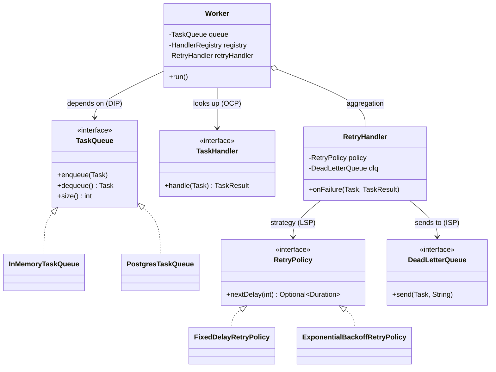

# SOLID Principles

> Where this fits in the project: SOLID is the design grammar of the whole Task Queue platform. Every class in the canonical model — `Worker`, `TaskQueue`, `RetryPolicy`, `DeadLetterQueue`, `TaskRepository` — is small, swappable, and testable *because* it obeys these five rules. Break SOLID and the platform calcifies into a god-class you cannot extend from Phase 1 to Phase 4. Honor it and every phase transition (in-memory queue → Postgres → distributed broker) becomes a localized change.

## Why This Exists

SOLID is five object-design principles, popularized by Robert C. Martin ("Uncle Bob") in the early 2000s and assembled into the mnemonic by Michael Feathers. The individual ideas are older: the Liskov Substitution Principle comes from Barbara Liskov's 1987 keynote on behavioral subtyping; Open/Closed traces to Bertrand Meyer's 1988 *Object-Oriented Software Construction*; Interface Segregation and Dependency Inversion crystallized from the structured-design work on [cohesion](cohesion.md) and [coupling](coupling.md) in the 1970s and 80s.

| Letter | Principle | One-line rule |
|--------|-----------|---------------|
| **S** | Single Responsibility | A class should have one reason to change. |
| **O** | Open/Closed | Open for extension, closed for modification. |
| **L** | Liskov Substitution | Subtypes must be usable wherever the base type is, without surprises. |
| **I** | Interface Segregation | No client should depend on methods it does not use. |
| **D** | Dependency Inversion | Depend on abstractions, not concretions. |

Why should a DSA-strong engineer who is new to OOD care? Because in competitive programming you are graded on *time and space complexity*, but production software is graded on **change cost**. The single largest driver of change cost is whether a new requirement is a *localized* edit (touch one class) or a *smeared* one (touch a god-class plus every dependent). SOLID is a set of five forces that keep changes localized. It is not dogma — every principle has a cost, and over-applying any of them produces a different mess (a fog of tiny interfaces). The skill is knowing *when* each force pays for itself.

SOLID is not five unrelated rules; they reinforce each other. SRP gives you small classes; small classes make ISP natural; ISP and DIP together let you invert dependencies onto narrow abstractions; OCP is what you *get* once dependencies are inverted; and LSP is the contract that keeps the substitutions OCP relies on from blowing up at runtime.


---

## The Naive Version

Here is a `TaskProcessor` that violates **all five** principles at once. It is the kind of class that grows when every new requirement is bolted onto whatever already existed. Read it once, then we will dismantle it principle by principle. It uses the canonical `Task` and `TaskStatus` model.

```java
// 04-oop-and-ood — DO NOT SHIP. Violates all five SOLID principles.
public class TaskProcessor {

    private final java.sql.Connection db;                         // persistence
    private final java.util.concurrent.BlockingQueue<Task> queue; // queueing
    private final java.util.Map<String, Integer> counters         // metrics
        = new java.util.concurrent.ConcurrentHashMap<>();

    public TaskProcessor(java.sql.Connection db,
                         java.util.concurrent.BlockingQueue<Task> queue) {
        this.db = db;
        this.queue = queue;
    }

    // SRP violation: validation + persistence + execution + retry + metrics in ONE method.
    public void process(Task task) throws Exception {
        // 1. validate
        if (task.type() == null || task.type().isBlank()) {
            throw new IllegalArgumentException("type required");
        }

        // 2. dispatch by type with a giant if/else  -> OCP violation
        TaskResult result;
        if (task.type().equals("email")) {
            result = sendEmail(task);
        } else if (task.type().equals("resize-image")) {
            result = resizeImage(task);
        } else if (task.type().equals("charge-card")) {
            result = chargeCard(task);
        } else {
            throw new IllegalStateException("unknown type " + task.type());
        }

        // 3. retry math inlined  -> OCP + LSP problems later
        if (!result.success() && result.retryable()) {
            long delayMs = (long) Math.pow(2, task.attempts()) * 1000; // hard-coded backoff
            Thread.sleep(delayMs);
            queue.put(task); // re-enqueue
        }

        // 4. persistence inlined
        try (var ps = db.prepareStatement("UPDATE tasks SET status=? WHERE id=?")) {
            ps.setString(1, result.success() ? "SUCCEEDED" : "FAILED");
            ps.setString(2, task.id());
            ps.executeUpdate();
        }

        // 5. metrics inlined
        counters.merge(task.type(), 1, Integer::sum);
    }

    private TaskResult sendEmail(Task t)   { /* ... */ return new TaskResult(true, "sent", false); }
    private TaskResult resizeImage(Task t) { /* ... */ return new TaskResult(true, "ok", false); }
    private TaskResult chargeCard(Task t)  { /* ... */ return new TaskResult(true, "charged", false); }
}
```

Its limitations, mapped to the five principles:

- **SRP:** `process` changes if the DB schema changes, if a new metric is added, if backoff math changes, or if validation rules change. Four reasons to change → four forces fighting in one method.
- **OCP:** adding a sixth task type means editing the `if/else` ladder *and* the `sendEmail`/`resizeImage` private methods. You cannot add behavior without modifying tested code.
- **LSP:** the retry math is hard-coded; you cannot substitute a different backoff strategy, and if you tried (via subclassing), a subclass that returned a *negative* delay would silently break `Thread.sleep`.
- **ISP:** any test or caller that just wants to *validate* a task must drag in a live JDBC `Connection` and a `BlockingQueue`. The class forces clients to depend on machinery they do not use.
- **DIP:** `TaskProcessor` depends on the *concrete* `java.sql.Connection` and `BlockingQueue`, not on the canonical `TaskRepository` and `TaskQueue` abstractions. The Phase 2 Postgres swap and the Phase 4 broker swap would both require rewriting this class.

---

## Improved Version

We tackle the five violations in turn, refactoring toward the canonical model. The order matters: fix SRP first (it unlocks the others), then DIP/ISP (they create the seams), then OCP and LSP (they are what you *get* from good seams).

### S — Single Responsibility: split the god `TaskProcessor`

> **A class should have one reason to change.** The crisp test: list the *actors* (people/roles) who could request a change. Each actor that can independently demand a change is a separate responsibility.

`TaskProcessor` had four actors: the DBA (schema), the SRE (metrics), the reliability team (retry policy), and the API team (validation). Split it so each actor touches exactly one class.

```java
// One responsibility each. Each class changes for one reason.

// Actor: API team — input validation.
final class TaskValidator {
    static final int MAX_PAYLOAD = 1_000_000;
    void validate(Task t) {
        if (t.type() == null || t.type().isBlank())
            throw new IllegalArgumentException("type required");
        if (t.payload() != null && t.payload().length() > MAX_PAYLOAD)
            throw new IllegalArgumentException("payload too large");
        if (t.priority() < 0 || t.priority() > 9)
            throw new IllegalArgumentException("priority 0..9");
    }
}

// Actor: reliability team — retry WORKFLOW (delegates the math to a RetryPolicy, see DIP).
final class RetryHandler {
    private final TaskQueue queue;
    private final RetryPolicy policy;
    private final DeadLetterQueue dlq;

    RetryHandler(TaskQueue queue, RetryPolicy policy, DeadLetterQueue dlq) {
        this.queue = queue; this.policy = policy; this.dlq = dlq;
    }

    void onFailure(Task task, TaskResult result) {
        if (!result.retryable() || task.attempts() >= task.maxAttempts()) {
            dlq.send(task, result.message());
            return;
        }
        policy.nextDelay(task.attempts())
              .ifPresent(d -> queue.enqueue(task)); // a scheduler applies the delay (see DIP)
    }
}
```

`TaskValidator` changes only when validation rules change. `RetryHandler` changes only when the retry *workflow* changes (the *math* lives in `RetryPolicy`). Persistence lives behind `TaskRepository`; metrics live in `MetricsCollector`. The `Worker` orchestrates them but contains none of their logic. See [cohesion.md](cohesion.md) for the deeper treatment — SRP is cohesion stated as a rule.

### D — Dependency Inversion: the worker depends on `TaskQueue`, not a `BlockingQueue`

> **High-level policy should not depend on low-level mechanism; both depend on an abstraction.** The `Worker` (policy: "pull a task, run it, handle the outcome") must not know *how* tasks are stored.

```java
// The abstraction (canonical model). Worker depends on THIS, never on a concrete impl.
public interface TaskQueue {
    void enqueue(Task t);
    Task dequeue() throws InterruptedException;
    int size();
}

// Phase 1 implementation.
public final class InMemoryTaskQueue implements TaskQueue {
    private final java.util.concurrent.BlockingQueue<Task> q =
        new java.util.concurrent.LinkedBlockingQueue<>();
    public void enqueue(Task t)                       { q.add(t); }
    public Task dequeue() throws InterruptedException { return q.take(); }
    public int size()                                 { return q.size(); }
}

// The worker depends ONLY on the abstraction.
public final class Worker implements Runnable {
    private final TaskQueue queue;            // <-- abstraction, not BlockingQueue
    private final HandlerRegistry registry;
    private final RetryHandler retryHandler;

    public Worker(TaskQueue queue, HandlerRegistry registry, RetryHandler retryHandler) {
        this.queue = java.util.Objects.requireNonNull(queue);
        this.registry = java.util.Objects.requireNonNull(registry);
        this.retryHandler = java.util.Objects.requireNonNull(retryHandler);
    }

    @Override public void run() {
        try {
            while (!Thread.currentThread().isInterrupted()) {
                Task task = queue.dequeue();
                TaskHandler handler = registry.handlerFor(task.type());
                try {
                    TaskResult result = handler.handle(task);
                    if (!result.success()) retryHandler.onFailure(task, result);
                } catch (Exception e) {
                    retryHandler.onFailure(task, new TaskResult(false, e.getMessage(), true));
                }
            }
        } catch (InterruptedException e) {
            Thread.currentThread().interrupt(); // restore the flag, exit cleanly
        }
    }
}
```

Now Phase 2 swaps `InMemoryTaskQueue` for `PostgresTaskQueue` and Phase 4 swaps in a distributed-broker queue — **the `Worker` does not change a single line.** That is DIP buying you cheap phase transitions. This is the runtime side of [dependency injection](dependency-injection.md): the abstraction is *received*, never `new`-ed inside the worker.

### O — Open/Closed: add task types and retry strategies without editing existing code

> **Open for extension, closed for modification.** New behavior arrives as new code, not edits to working code.

The naive `if/else` dispatch violated OCP. Replace it with a registry of `TaskHandler`s keyed by type. Adding a task type is *registering* a new handler — zero edits to `Worker` or the registry.

```java
// Canonical functional interface.
@FunctionalInterface
public interface TaskHandler {
    TaskResult handle(Task task) throws Exception;
}

public final class HandlerRegistry {
    private final java.util.Map<String, TaskHandler> handlers =
        new java.util.concurrent.ConcurrentHashMap<>();

    public void register(String type, TaskHandler handler) {
        handlers.put(type, java.util.Objects.requireNonNull(handler));
    }

    public TaskHandler handlerFor(String type) {
        TaskHandler h = handlers.get(type);
        if (h == null) throw new IllegalStateException("no handler for type " + type);
        return h;
    }
}
```

Adding a brand-new task type — `"charge-card"` — requires no change to any existing class:

```java
// New behavior = new code, registered at the composition root. Nothing existing is edited.
registry.register("email",        task -> { /* send mail */   return new TaskResult(true, "sent", false); });
registry.register("resize-image", task -> { /* resize */      return new TaskResult(true, "ok", false); });
registry.register("charge-card",  task -> { /* charge card */ return new TaskResult(true, "charged", false); });
```

The same pattern applies to **retry strategies**: `RetryPolicy` is an abstraction, and a new strategy is a new implementation — never an edit. This is the [Strategy pattern](../05-design-patterns/strategy.md), which is OCP made concrete.

### L — Liskov Substitution: `RetryPolicy` implementations must be interchangeable

> **A subtype must honor the contract of its supertype** — same or weaker preconditions, same or stronger postconditions, no surprising exceptions, no strengthened invariants. If client code that works with the base type breaks when handed a subtype, LSP is violated.

`RetryPolicy.nextDelay(attempt)` returns an `Optional<Duration>`. The *contract* is:

1. For an `attempt` below the cap, return a **present, non-negative** `Duration`.
2. Once retries are exhausted, return `Optional.empty()` (never throw, never return a negative delay).
3. `nextDelay` is a pure function: no side effects, no shared state.

Any implementation that respects this can be substituted into `RetryHandler` blindly.

```java
public interface RetryPolicy {
    /** Delay before the next attempt, or empty if no more retries. Never negative, never throws. */
    java.util.Optional<java.time.Duration> nextDelay(int attempt);
}

public final class FixedDelayRetryPolicy implements RetryPolicy {
    private final java.time.Duration delay;
    private final int maxAttempts;
    public FixedDelayRetryPolicy(java.time.Duration delay, int maxAttempts) {
        this.delay = delay; this.maxAttempts = maxAttempts;
    }
    public java.util.Optional<java.time.Duration> nextDelay(int attempt) {
        return attempt >= maxAttempts ? java.util.Optional.empty()
                                      : java.util.Optional.of(delay);
    }
}

public final class ExponentialBackoffRetryPolicy implements RetryPolicy {
    private final java.time.Duration base;
    private final java.time.Duration cap;
    private final int maxAttempts;
    private final java.util.random.RandomGenerator rng;

    public ExponentialBackoffRetryPolicy(java.time.Duration base, java.time.Duration cap,
                                         int maxAttempts, java.util.random.RandomGenerator rng) {
        this.base = base; this.cap = cap; this.maxAttempts = maxAttempts; this.rng = rng;
    }

    public java.util.Optional<java.time.Duration> nextDelay(int attempt) {
        if (attempt >= maxAttempts) return java.util.Optional.empty();
        long exp = base.toMillis() * (1L << Math.min(attempt, 30)); // 2^attempt, clamped
        long capped = Math.min(exp, cap.toMillis());
        long jittered = (long) (capped * (0.5 + rng.nextDouble() * 0.5)); // full jitter, >= 0
        return java.util.Optional.of(java.time.Duration.ofMillis(jittered)); // ALWAYS non-negative
    }
}
```

Both honor the same contract, so `RetryHandler` treats them identically. A subclass that returned a *negative* duration (for example, integer overflow on a large `attempt`) would violate LSP — `policy.nextDelay(...).ifPresent(d -> scheduler.schedule(task, d))` would feed a negative delay into a `ScheduledExecutorService`, which clamps it to zero and re-fires immediately, producing a retry storm. The `1L << Math.min(attempt, 30)` clamp and the `>= 0` jitter exist precisely to keep the substitution safe.

### I — Interface Segregation: split fat interfaces

> **No client should be forced to depend on methods it does not use.** Fat interfaces couple unrelated clients; a change for one client recompiles and re-tests them all.

Imagine a tempting "do-everything" `TaskStore`:

```java
// ISP violation: a fat interface that lumps four roles together.
interface TaskStore {
    void save(Task t);                             // writers
    java.util.Optional<Task> findById(String id);  // readers
    java.util.List<Task> pollDue(int n);           // the scheduler
    void purgeOlderThan(java.time.Instant cutoff);  // the janitor / retention job
    long countByStatus(TaskStatus s);               // the metrics exporter
}
```

The metrics exporter is now forced to implement (or mock) `pollDue` and `purgeOlderThan` even though it only reads counts. Split by client role into the canonical `TaskRepository` plus narrow companions:

```java
// Canonical model — exactly what the scheduler/worker path needs.
public interface TaskRepository {
    void save(Task t);
    java.util.Optional<Task> findById(String id);
    java.util.List<Task> pollDue(int n);
}

// Separate role: retention/cleanup. The worker path never sees it.
public interface TaskRetention {
    void purgeOlderThan(java.time.Instant cutoff);
}

// Separate role: metrics/reporting reads.
public interface TaskStats {
    long countByStatus(TaskStatus status);
}
```

A concrete `PostgresTaskRepository` can implement all three interfaces, but each *client* depends only on the slice it needs. The metrics exporter takes a `TaskStats`; the nightly cleanup job takes a `TaskRetention`; the `Worker` takes a `TaskQueue`. This mirrors role interfaces and keeps test doubles tiny.

---

## Production-Quality Version

The version a staff engineer ships wires all five principles together at a single composition root, uses Java 21 features (records, sealed types, virtual threads), and makes every canonical abstraction a swap point. Note how *no class dispatches on type* and *no class hard-codes a strategy*.

```java
// Canonical immutable domain (record + enum).
public enum TaskStatus { PENDING, SCHEDULED, RUNNING, SUCCEEDED, FAILED, RETRYING, DEAD }

public record Task(String id, String type, String payload, TaskStatus status,
                   int attempts, int maxAttempts,
                   java.time.Instant createdAt, java.time.Instant scheduledAt, int priority) {
    public Task withStatus(TaskStatus s) {
        return new Task(id, type, payload, s, attempts, maxAttempts, createdAt, scheduledAt, priority);
    }
    public Task incrementAttempt() {
        return new Task(id, type, payload, TaskStatus.RETRYING, attempts + 1, maxAttempts,
                        createdAt, scheduledAt, priority);
    }
}

public record TaskResult(boolean success, String message, boolean retryable) { }
```

```java
// The orchestrator: depends only on abstractions (DIP), dispatches via registry (OCP),
// delegates retry to RetryHandler (SRP), which uses an interchangeable RetryPolicy (LSP).
public final class Worker implements Runnable {

    private final TaskQueue queue;            // DIP
    private final HandlerRegistry registry;   // OCP
    private final RetryHandler retryHandler;  // SRP
    private final MetricsCollector metrics;   // SRP (ISP: narrow recorder interface)

    public Worker(TaskQueue queue, HandlerRegistry registry,
                  RetryHandler retryHandler, MetricsCollector metrics) {
        this.queue = java.util.Objects.requireNonNull(queue);
        this.registry = java.util.Objects.requireNonNull(registry);
        this.retryHandler = java.util.Objects.requireNonNull(retryHandler);
        this.metrics = java.util.Objects.requireNonNull(metrics);
    }

    @Override public void run() {
        try {
            while (!Thread.currentThread().isInterrupted()) {
                processOne(queue.dequeue());
            }
        } catch (InterruptedException e) {
            Thread.currentThread().interrupt();
        }
    }

    private void processOne(Task task) {
        long start = System.nanoTime();
        try {
            TaskHandler handler = registry.handlerFor(task.type());
            TaskResult result = handler.handle(task);
            if (result.success()) {
                metrics.recordSuccess(task.type());
            } else {
                retryHandler.onFailure(task, result);
            }
        } catch (Exception e) {
            retryHandler.onFailure(task, new TaskResult(false, e.getMessage(), true));
        } finally {
            metrics.recordLatencyNanos(task.type(), System.nanoTime() - start);
        }
    }
}
```

```java
// RetryHandler delegates the MATH to RetryPolicy and the WHEN to a TaskScheduler.
// It owns the WORKFLOW only — single responsibility.
public final class RetryHandler {
    private final RetryPolicy policy;       // LSP: any policy substitutes safely
    private final TaskScheduler scheduler;  // DIP: DelayQueue or ScheduledExecutorService
    private final DeadLetterQueue dlq;      // ISP: one method, send(task, reason)
    private final MetricsCollector metrics;

    public RetryHandler(RetryPolicy policy, TaskScheduler scheduler,
                        DeadLetterQueue dlq, MetricsCollector metrics) {
        this.policy = java.util.Objects.requireNonNull(policy);
        this.scheduler = java.util.Objects.requireNonNull(scheduler);
        this.dlq = java.util.Objects.requireNonNull(dlq);
        this.metrics = java.util.Objects.requireNonNull(metrics);
    }

    public void onFailure(Task task, TaskResult result) {
        if (!result.retryable()) {
            dlq.send(task.withStatus(TaskStatus.DEAD), "non-retryable: " + result.message());
            metrics.recordDead(task.type());
            return;
        }
        java.util.Optional<java.time.Duration> delay = policy.nextDelay(task.attempts());
        if (delay.isEmpty()) {
            dlq.send(task.withStatus(TaskStatus.DEAD), "max attempts exhausted");
            metrics.recordDead(task.type());
            return;
        }
        scheduler.schedule(task.incrementAttempt(), delay.get());
        metrics.recordRetry(task.type());
    }
}
```

```java
// The composition root: the ONLY place that knows concrete types. Swap impls here, nowhere else.
public final class AppContext {
    public static WorkerPool buildWorkerPool() {
        TaskQueue queue = new InMemoryTaskQueue();                 // Phase 2: new PostgresTaskQueue(ds)
        DeadLetterQueue dlq = new InMemoryDeadLetterQueue();
        MetricsCollector metrics = new MicrometerMetricsCollector(/* registry */);

        RetryPolicy policy = new ExponentialBackoffRetryPolicy(
            java.time.Duration.ofMillis(200), java.time.Duration.ofSeconds(30),
            5, java.util.random.RandomGenerator.getDefault());

        TaskScheduler scheduler = new DelayQueueScheduler(queue);

        HandlerRegistry registry = new HandlerRegistry();
        registry.register("email",        EmailHandler::handle);
        registry.register("resize-image", ImageResizeHandler::handle);
        // New task type later? Add a line HERE. No existing class changes (OCP).

        RetryHandler retry = new RetryHandler(policy, scheduler, dlq, metrics);

        // Java 21 virtual threads: I/O-bound handlers scale to thousands cheaply.
        return new WorkerPool(
            () -> new Worker(queue, registry, retry, metrics),
            java.util.concurrent.Executors.newVirtualThreadPerTaskExecutor());
    }
}
```

Rationale a staff engineer would give: the only file that imports concrete classes is `AppContext`. Everything downstream is wired through interfaces, so the Phase 2 Postgres swap and Phase 4 broker swap are *one-line edits in the composition root*. That property is the entire return on the SOLID investment.

---

## Code Walkthrough

### Beginner example — SRP in miniature

Split a tiny two-job class so each method's owner is obvious.

```java
// BEFORE: one class, two reasons to change (formatting rules AND I/O).
class TaskReporter {
    void report(Task t) {
        String line = t.id() + "," + t.type() + "," + t.status(); // formatting
        System.out.println(line);                                  // output
    }
}

// AFTER: one reason each.
record TaskLine(String value) { }
class TaskFormatter { TaskLine format(Task t) { return new TaskLine(t.id()+","+t.type()+","+t.status()); } }
class ConsoleSink   { void write(TaskLine line) { System.out.println(line.value()); } }
```

Now the CSV format can change without touching output, and you can swap `ConsoleSink` for a `FileSink` without touching formatting.

### Intermediate example — OCP via Strategy for `RetryPolicy`

```java
// Adding a "decorrelated jitter" policy requires NO edit to RetryHandler or existing policies.
public final class DecorrelatedJitterRetryPolicy implements RetryPolicy {
    private final java.time.Duration base, cap;
    private final int maxAttempts;
    private final java.util.random.RandomGenerator rng;
    private long previousMs;

    public DecorrelatedJitterRetryPolicy(java.time.Duration base, java.time.Duration cap,
                                         int maxAttempts, java.util.random.RandomGenerator rng) {
        this.base = base; this.cap = cap; this.maxAttempts = maxAttempts;
        this.rng = rng; this.previousMs = base.toMillis();
    }

    @Override public java.util.Optional<java.time.Duration> nextDelay(int attempt) {
        if (attempt >= maxAttempts) return java.util.Optional.empty();
        long next = Math.min(cap.toMillis(),
            base.toMillis() + (long) (rng.nextDouble() * (previousMs * 3 - base.toMillis())));
        previousMs = Math.max(base.toMillis(), next);
        return java.util.Optional.of(java.time.Duration.ofMillis(previousMs));
    }
}
```

> Note: this policy is *stateful* (`previousMs`), which subtly weakens the LSP contract — `nextDelay` is no longer pure and is not thread-safe. That is the tradeoff to call out in review: it must get a fresh instance per task, or be confined to a single thread. We discuss this exact pitfall under Common Mistakes.

### Production-inspired example — DIP + ISP with Spring (Phase 2)

```java
// Phase 2: the same Worker logic, now with a Postgres-backed queue injected by Spring.
// The Worker code is UNCHANGED — only the wiring (composition root) differs.
@org.springframework.context.annotation.Configuration
class QueueConfig {

    @org.springframework.context.annotation.Bean
    TaskQueue taskQueue(javax.sql.DataSource ds) {
        return new PostgresTaskQueue(ds); // DIP: Worker still depends on TaskQueue
    }

    @org.springframework.context.annotation.Bean
    RetryPolicy retryPolicy() {
        return new ExponentialBackoffRetryPolicy(
            java.time.Duration.ofMillis(200), java.time.Duration.ofSeconds(30),
            5, java.util.random.RandomGenerator.getDefault());
    }
}

// ISP in action: the controller depends ONLY on what it needs.
@org.springframework.web.bind.annotation.RestController
class TaskController {
    private final TaskQueue queue;       // it enqueues
    private final TaskRepository repo;    // it reads by id
    TaskController(TaskQueue queue, TaskRepository repo) { this.queue = queue; this.repo = repo; }

    @org.springframework.web.bind.annotation.PostMapping("/tasks")
    Task submit(@org.springframework.web.bind.annotation.RequestBody SubmitRequest req) {
        Task t = new Task(java.util.UUID.randomUUID().toString(), req.type(), req.payload(),
                TaskStatus.PENDING, 0, 5, java.time.Instant.now(), null, req.priority());
        repo.save(t);
        queue.enqueue(t);
        return t;
    }

    @org.springframework.web.bind.annotation.GetMapping("/tasks/{id}")
    Task get(@org.springframework.web.bind.annotation.PathVariable String id) {
        return repo.findById(id).orElseThrow();
    }
    record SubmitRequest(String type, String payload, int priority) { }
}
```

The controller never touches `pollDue` or `purgeOlderThan` — it depends on segregated interfaces, so a change to the retention job cannot break the controller's contract.

---

## How This Applies to Our Task Queue Project



Mapping each principle to a concrete part of the platform:

- **SRP** splits the god `TaskProcessor` into `TaskValidator`, `RetryHandler`, `MetricsCollector`, `TaskRepository`, and an orchestrating `Worker`.
- **OCP** turns task-type dispatch and retry-strategy selection into registration/injection — new types and strategies are new code, not edits.
- **LSP** guarantees `FixedDelayRetryPolicy` and `ExponentialBackoffRetryPolicy` are blind-swappable inside `RetryHandler`, and that any future `RateLimiter` or `DeadLetterQueue` impl upholds its contract.
- **ISP** keeps `TaskQueue` (3 methods), `DeadLetterQueue` (1 method), `RateLimiter` (1 method), and `TaskRepository` (3 methods) narrow, so each client depends only on what it uses.
- **DIP** makes the `Worker` depend on `TaskQueue` — enabling the Phase 1 → 2 → 4 queue swaps with zero worker edits.

---

## Tradeoffs

SOLID is not free. Each principle trades **change-flexibility** for **upfront indirection**. Apply it where change is likely; skip it where the code is stable and the abstraction would only add noise.

| Principle | What it buys | What it costs | When to skip |
|-----------|--------------|---------------|--------------|
| **SRP** | Localized changes, testable units | More classes, more wiring | One-off scripts; a class with a single genuine reason to change |
| **OCP** | Add behavior without touching tested code | An abstraction + indirection per extension point | Closed sets that genuinely never grow (use a `sealed` type + exhaustive `switch`) |
| **LSP** | Safe polymorphic substitution | Discipline to honor contracts; sometimes prefer composition over inheritance | Value types with no subtyping |
| **ISP** | Independent clients, tiny test doubles | Interface proliferation; more types to navigate | Small interface used by one client |
| **DIP** | Swappable mechanisms, test seams | Indirection; harder to "jump to implementation" | Leaf utilities (`Math`-like) with no policy/mechanism split |

The meta-tradeoff: **over-applying SOLID produces "abstraction soup"** — twelve one-method interfaces and five factories to send an email. The cure for a god-class is not a thousand tiny gods. Introduce an abstraction when you have (a) two real implementations or a near-certain second one, or (b) a test seam you actually need. "Speculative generality" is a real code smell ([dry-kiss-yagni](dry-kiss-yagni.md)).

---

## Common Mistakes and Pitfalls

- **Treating SRP as "one method per class."** SRP is *one reason to change*, an actor count — not a method count. A `RetryHandler` with three methods that all serve the reliability actor is fine. **Fix:** list the actors, not the methods.
- **OCP via deep inheritance.** Subclassing to extend behavior creates fragile hierarchies and LSP traps. **Fix:** prefer composition/strategy ([composition vs inheritance](../02-core-oop/chapter-17-composition-vs-inheritance.md)).
- **LSP broken by stateful strategies.** `DecorrelatedJitterRetryPolicy` keeps `previousMs`; sharing one instance across worker threads corrupts delays. **Fix:** make policies pure/stateless, or document and enforce per-task instances; never share a stateful policy across threads (see [atomics and thread safety](../06-concurrency/atomics-and-thread-safety.md)).
- **LSP broken by strengthened preconditions.** A subtype that rejects inputs the base accepts (for example, a `RetryPolicy` that throws on `attempt == 0`) breaks callers. **Fix:** subtypes may *weaken* preconditions and *strengthen* postconditions, never the reverse.
- **ISP faked with `UnsupportedOperationException`.** Implementing a fat interface but throwing on half the methods is an LSP *and* ISP violation in one. **Fix:** segregate the interface so the impl only declares methods it truly supports.
- **DIP "inversion" that still imports concretions.** Declaring an interface but `new`-ing the concrete impl inside the consumer defeats the purpose. **Fix:** inject the abstraction; confine `new`-for-collaborators to the [composition root](dependency-injection.md).
- **The abstraction points the wrong way.** Putting the `TaskQueue` interface in the *persistence* package makes high-level code depend on a low-level package. **Fix:** the abstraction belongs with the *policy* (domain) layer; the implementation depends on it ([clean architecture](clean-architecture.md)).
- **Premature DIP/ISP.** Inventing interfaces before a second implementation exists. **Fix:** wait for the second implementation or a real test seam; YAGNI applies ([dry-kiss-yagni](dry-kiss-yagni.md)).

---

## Refactoring Exercise

We refactor a `NotificationDispatcher` from bad → improved → production, exercising all five principles.

### Bad

```java
// Violates SRP (dispatch+format+send+log), OCP (if/else on channel), DIP (concrete SmtpClient).
class NotificationDispatcher {
    private final SmtpClient smtp = new SmtpClient("mail.internal", 25); // DIP violation
    void notify(Task task, String channel) {
        String body = "Task " + task.id() + " is " + task.status(); // formatting
        if (channel.equals("email")) {                              // OCP violation
            smtp.send("ops@corp.com", body);
        } else if (channel.equals("slack")) {
            new SlackClient().post("#alerts", body);                // DIP violation
        } else {
            throw new IllegalArgumentException("unknown channel");
        }
        System.out.println("notified via " + channel);              // SRP violation (logging)
    }
}
```

### Improved

```java
// ISP+DIP: a narrow channel abstraction. OCP: dispatch by map. SRP: formatting extracted.
interface NotificationChannel { void send(String message); }

final class NotificationFormatter {
    String format(Task t) { return "Task " + t.id() + " is " + t.status(); }
}

final class NotificationDispatcher {
    private final java.util.Map<String, NotificationChannel> channels;
    private final NotificationFormatter formatter;
    NotificationDispatcher(java.util.Map<String, NotificationChannel> channels,
                           NotificationFormatter formatter) {
        this.channels = channels; this.formatter = formatter;
    }
    void notify(Task task, String channel) {
        NotificationChannel c = channels.get(channel);
        if (c == null) throw new IllegalArgumentException("unknown channel " + channel);
        c.send(formatter.format(task)); // adding a channel = register a new impl (OCP)
    }
}
```

### Production-quality

```java
// All five: sealed result for exhaustive handling, injected channels, observability, no concretions leaked.
public interface NotificationChannel {
    /** Contract (LSP): never throws on a well-formed message; returns a result. */
    SendOutcome send(String message);
}

public sealed interface SendOutcome permits SendOutcome.Delivered, SendOutcome.Failed {
    record Delivered(String providerId) implements SendOutcome { }
    record Failed(String reason, boolean retryable) implements SendOutcome { }
}

public final class NotificationDispatcher {
    private final java.util.Map<String, NotificationChannel> channels; // OCP
    private final NotificationFormatter formatter;                     // SRP
    private final MetricsCollector metrics;                            // SRP + ISP

    public NotificationDispatcher(java.util.Map<String, NotificationChannel> channels,
                                  NotificationFormatter formatter, MetricsCollector metrics) {
        this.channels = java.util.Map.copyOf(channels);
        this.formatter = java.util.Objects.requireNonNull(formatter);
        this.metrics = java.util.Objects.requireNonNull(metrics);
    }

    public SendOutcome notify(Task task, String channelName) {
        NotificationChannel channel = channels.get(channelName);
        if (channel == null) throw new IllegalArgumentException("unknown channel " + channelName);
        SendOutcome outcome = channel.send(formatter.format(task));
        // Exhaustive switch over a sealed type — the compiler enforces all cases (Java 21).
        switch (outcome) {
            case SendOutcome.Delivered d -> metrics.recordSuccess("notify:" + channelName);
            case SendOutcome.Failed f    -> metrics.recordDead("notify:" + channelName);
        }
        return outcome;
    }
}
```

The production version is open for new channels (register an impl), depends only on the `NotificationChannel` abstraction, segregates formatting/metrics, and uses a sealed `SendOutcome` so adding an outcome variant forces every `switch` to be updated — compiler-enforced completeness.

---

## Exercises

### Easy

**E1 (Knowledge check).** State each SOLID letter in one sentence and name the canonical class in our project that best exemplifies it.

**E2 (Spot the violation).** Which principle does this break, and why?

```java
class TaskQueueImpl {
    void enqueue(Task t) { /* ... */ }
    Task dequeue() { /* ... */ return null; }
    int size() { return 0; }
    void exportPrometheusMetrics(java.io.Writer w) { /* ... */ } // <-- ?
}
```

**E3 (Coding).** Add a new task type `"send-sms"` to the platform *without editing any existing class*. Show only the code you add.

### Medium

**M1 (Refactoring).** The following violates SRP and OCP. Refactor it.

```java
class PriorityRouter {
    String route(Task t) {
        if (t.priority() >= 8) return "express-queue";
        else if (t.priority() >= 4) return "standard-queue";
        else return "bulk-queue";
    }
}
```

Make routing rules extensible (OCP) and separate the *decision* from the *queue lookup* (SRP).

**M2 (LSP).** Write a JUnit 5 + AssertJ contract test that any `RetryPolicy` must pass, and run it against both `FixedDelayRetryPolicy` and `ExponentialBackoffRetryPolicy`.

**M3 (Design).** The `TaskRepository` is about to gain `streamAll()` for a CSV export. Should it go on `TaskRepository`? Decide using ISP and justify.

### Hard

**H1 (Interview-style).** A teammate proposes one `TaskService` interface with 14 methods "so callers have one dependency." Argue for or against using ISP, DIP, and change-cost reasoning. Then sketch the segregated interfaces.

**H2 (Stretch).** Design a `RateLimiter` (canonical: `tryAcquire()` returning `boolean`) so that swapping `TokenBucketRateLimiter` for a future `RedisRateLimiter` (Phase 4) is a composition-root-only change. Identify which SOLID principles your design relies on and where LSP could silently break (hint: blocking vs non-blocking semantics).

---

## Solutions

### E1

- **S — SRP:** a class has one reason to change. Exemplar: `RetryHandler` (only the retry *workflow*) vs `RetryPolicy` (only the *math*).
- **O — OCP:** extend without editing. Exemplar: `HandlerRegistry` — new task types register new `TaskHandler`s.
- **L — LSP:** subtypes substitute safely. Exemplar: `FixedDelayRetryPolicy` and `ExponentialBackoffRetryPolicy` are blind-swappable in `RetryHandler`.
- **I — ISP:** clients depend only on what they use. Exemplar: `DeadLetterQueue` has the single method `send(Task, String)`.
- **D — DIP:** depend on abstractions. Exemplar: `Worker` depends on `TaskQueue`, not on `BlockingQueue` or `PostgresTaskQueue`.

### E2

It breaks **SRP** and **ISP**. `exportPrometheusMetrics` is a metrics-reporting concern bolted onto a queue. The queue now changes for two reasons (queueing semantics *and* metrics format), and every client of `TaskQueue` is forced to depend on a metrics method it does not use. Fix: move metrics export to a separate `TaskStats`/`MetricsCollector` type; keep `TaskQueue` to its three canonical methods.

### E3

```java
// New handler — a NEW class, no existing class touched (OCP).
final class SmsHandler {
    static TaskResult handle(Task task) {
        // parse task.payload() JSON, call SMS provider...
        return new TaskResult(true, "sms sent", false);
    }
}

// One added line at the composition root (AppContext). Nothing else changes.
registry.register("send-sms", SmsHandler::handle);
```

### M1

```java
// SRP: a Rule decides; the Router only iterates rules. OCP: add a rule = add a class/lambda.
@FunctionalInterface
interface RoutingRule {
    /** Returns the target queue name, or empty if this rule does not apply. */
    java.util.Optional<String> apply(Task task);
}

final class PriorityRouter {
    private final java.util.List<RoutingRule> rules;
    private final String fallback;
    PriorityRouter(java.util.List<RoutingRule> rules, String fallback) {
        this.rules = java.util.List.copyOf(rules); this.fallback = fallback;
    }
    String route(Task t) {
        return rules.stream()
                    .map(r -> r.apply(t))
                    .flatMap(java.util.Optional::stream)
                    .findFirst()
                    .orElse(fallback);
    }
}

// Wiring (composition root). A new tier = a new rule, no edit to PriorityRouter.
var router = new PriorityRouter(java.util.List.of(
    t -> t.priority() >= 8 ? java.util.Optional.of("express-queue") : java.util.Optional.empty(),
    t -> t.priority() >= 4 ? java.util.Optional.of("standard-queue") : java.util.Optional.empty()
), "bulk-queue");
```

The decision (`RoutingRule`) is separated from the iteration (`PriorityRouter`), and adding a tier never edits existing code.

### M2

```java
import org.junit.jupiter.api.*;
import static org.assertj.core.api.Assertions.*;
import java.time.Duration;
import java.util.Optional;
import java.util.random.RandomGenerator;

abstract class RetryPolicyContractTest {

    // Each concrete test supplies a policy with the given maxAttempts.
    abstract RetryPolicy newPolicy(int maxAttempts);

    @Test void returnsPresentNonNegativeDelayBeforeCap() {
        RetryPolicy p = newPolicy(3);
        for (int attempt = 0; attempt < 3; attempt++) {
            Optional<Duration> d = p.nextDelay(attempt);
            assertThat(d).as("attempt %d", attempt).isPresent();
            assertThat(d.get()).isGreaterThanOrEqualTo(Duration.ZERO); // LSP: never negative
        }
    }

    @Test void returnsEmptyOnceExhausted() {
        RetryPolicy p = newPolicy(3);
        assertThat(p.nextDelay(3)).isEmpty();    // at cap
        assertThat(p.nextDelay(99)).isEmpty();   // beyond cap, still empty, never throws
    }

    @Test void neverThrowsForLargeAttempt() {
        RetryPolicy p = newPolicy(3);
        assertThatNoException().isThrownBy(() -> p.nextDelay(1_000_000));
    }
}

class FixedDelayRetryPolicyTest extends RetryPolicyContractTest {
    RetryPolicy newPolicy(int max) { return new FixedDelayRetryPolicy(Duration.ofMillis(200), max); }
}

class ExponentialBackoffRetryPolicyTest extends RetryPolicyContractTest {
    RetryPolicy newPolicy(int max) {
        return new ExponentialBackoffRetryPolicy(
            Duration.ofMillis(200), Duration.ofSeconds(30), max, RandomGenerator.getDefault());
    }
}
```

A shared abstract contract test, subclassed per implementation, is the canonical way to *enforce* LSP in code: if a new policy fails any test in `RetryPolicyContractTest`, it is not substitutable.

### M3

`streamAll()` should **not** go on `TaskRepository`. The worker/scheduler path (the dominant client of `TaskRepository`) never streams the whole table; coupling them to a bulk-export method forces every implementation and every mock to deal with it, and a `Stream` resource leak in export code could surface in unrelated worker tests. Put it on a separate `TaskExport` interface that the CSV job depends on; `PostgresTaskRepository` may implement both, but the *clients* stay segregated (ISP). This also keeps the export's potentially huge, cursor-backed `Stream` out of the hot path's contract.

### H1

**Against the 14-method interface.** "One dependency" optimizes the wrong thing — import count — at the expense of change cost. With ISP/DIP reasoning:

- **ISP:** the controller (POST/GET), the worker (enqueue/dequeue), the scheduler (pollDue), the cleanup job (purge), and the metrics exporter (counts) are five different clients with five different reasons to change. A 14-method interface couples all of them: a signature change for the cleanup job recompiles and re-tests the controller.
- **DIP:** a fat interface usually leaks mechanism (it ends up shaped like one concrete implementation), so it stops being a true abstraction and the "inversion" is cosmetic.
- **Change cost:** mocks for tests become huge; every test double must stub 14 methods. Small role interfaces yield tiny doubles.

Segregated sketch:

```java
interface TaskQueue       { void enqueue(Task t); Task dequeue() throws InterruptedException; int size(); }
interface TaskRepository  { void save(Task t); java.util.Optional<Task> findById(String id); java.util.List<Task> pollDue(int n); }
interface TaskRetention   { void purgeOlderThan(java.time.Instant cutoff); }
interface TaskStats       { long countByStatus(TaskStatus status); }
interface DeadLetterQueue { void send(Task t, String reason); }
```

A single `PostgresTaskStore` class may implement several of these, but each consumer depends only on the role it needs.

### H2

```java
// Canonical abstraction.
public interface RateLimiter {
    /** Non-blocking: returns true if a permit was granted, false otherwise. NEVER blocks (contract). */
    boolean tryAcquire();
}

// Phase 3 impl: in-process token bucket.
public final class TokenBucketRateLimiter implements RateLimiter {
    private final long capacity;
    private final double refillPerNano;
    private double tokens;
    private long lastNanos;

    public TokenBucketRateLimiter(long capacity, double refillPerSecond) {
        this.capacity = capacity; this.refillPerNano = refillPerSecond / 1_000_000_000.0;
        this.tokens = capacity; this.lastNanos = System.nanoTime();
    }

    @Override public synchronized boolean tryAcquire() {
        long now = System.nanoTime();
        tokens = Math.min(capacity, tokens + (now - lastNanos) * refillPerNano);
        lastNanos = now;
        if (tokens >= 1.0) { tokens -= 1.0; return true; }
        return false;
    }
}
```

The `Worker`/`WorkerPool` depends on `RateLimiter`, never on `TokenBucketRateLimiter`, so the Phase 4 swap to a `RedisRateLimiter` (distributed, atomic via a Lua script) is a one-line composition-root edit (**DIP** + **OCP**).

**Where LSP could silently break:** the contract says `tryAcquire()` is **non-blocking** and returns immediately. A `RedisRateLimiter` that makes a network round-trip *appears* non-blocking but can take tens of milliseconds, and a careless implementation might *block* until a token is available — strengthening the implicit "fast, non-blocking" precondition. That would silently change the worker's throughput characteristics and could starve a thread pool. The fix is to make the timing/blocking behavior part of the documented contract (for example, `tryAcquire()` must return within a bounded time and never block), and to give the network impl a timeout that returns `false` on slow responses. The design relies on **DIP** (worker → abstraction), **OCP** (new limiter = new code), and **LSP** (both limiters honor the same non-blocking, fast-return contract). See [rate limiting](../08-distributed-systems/rate-limiting.md).

---

## Interview Questions and Takeaways

1. **What is the Single Responsibility Principle, really?**
   "One reason to change" — count the *actors* who could independently request a change, not the methods. Our `RetryHandler` (workflow) vs `RetryPolicy` (math) split is SRP: the reliability team changes the workflow, but the backoff math changes for a different reason.

2. **How is the Open/Closed Principle achieved in practice?**
   Through polymorphism: depend on an abstraction and add new implementations rather than editing existing code. `HandlerRegistry` plus `TaskHandler` makes new task types pure additions. The mechanism is usually the Strategy or Template Method pattern.

3. **Give a concrete LSP violation.**
   A `RetryPolicy` subtype that throws on `attempt == 0`, or one that returns a negative `Duration` due to overflow. Both break a `RetryHandler` written against the base contract — the substitution surprises the caller. The defense is a shared contract test.

4. **Isn't a Java `record` that extends nothing irrelevant to LSP?**
   LSP is about *subtyping*, which in Java includes interface implementation, not just class inheritance. Two `RetryPolicy` implementations are subtypes of the interface; LSP governs whether they are interchangeable behind that interface.

5. **When does ISP cross into over-engineering?**
   When you split an interface used by exactly one client, or create one-method interfaces speculatively. ISP pays off when *distinct clients* would otherwise be coupled. With one client, a single cohesive interface is fine (YAGNI).

6. **What is the difference between Dependency Inversion and Dependency Injection?**
   DIP is the *principle* (depend on abstractions; the abstraction belongs to the high-level layer). DI is the *mechanism* that supplies those abstractions at runtime (constructor injection, a container). You can satisfy DIP with plain constructor injection and no framework.

7. **Which way should the abstraction point?**
   Toward the high-level policy. The `TaskQueue` interface lives with the domain/worker code; `PostgresTaskQueue` (low-level) depends on it. If your interface sits in the persistence package, you have not inverted the dependency.

8. **How do all five reinforce each other?**
   SRP yields small classes; small classes make ISP natural; ISP + DIP create narrow abstractions to depend on; OCP is what you get once you depend on abstractions; LSP keeps the substitutions OCP relies on safe.

**Takeaways:** SOLID is five forces that keep *change cost* low by keeping changes *localized*. SRP and ISP shrink the blast radius of a change; DIP and OCP create swap points; LSP keeps those swaps safe at runtime. Apply each where change is likely; resist abstraction soup where the code is stable.

---

## Production Considerations

- **Startup wiring is the new compile error.** With DIP, the object graph is assembled at the composition root (manual `AppContext` or Spring `@Configuration`). A missing or ambiguous binding fails fast at boot — far better than a `NullPointerException` deep in request handling. Log the resolved wiring (queue type, retry policy, worker count) at startup so "what was this node wired with?" is one log line.
- **LSP failures are silent and load-dependent.** A retry policy that overflows to a negative delay only misbehaves at high `attempt` counts under sustained failure — exactly during an incident. Enforce contracts with shared `*ContractTest` suites in CI, and add a metric/alert for "retry delay == 0" as a runtime tripwire.
- **Thread-safety crosses the SOLID boundary.** A `Worker` is `Runnable` and runs on many (possibly virtual) threads. A *stateful* strategy that satisfies SOLID structurally can still be a data race (`DecorrelatedJitterRetryPolicy`'s `previousMs`). DIP/OCP do not make shared collaborators thread-safe; you still need [concurrent collections](../06-concurrency/concurrent-collections.md) and [atomics](../06-concurrency/atomics-and-thread-safety.md).
- **Abstraction has a runtime cost at the edges.** Megamorphic interface dispatch and reflection-based DI add measurable startup and per-call cost. For most backends it is negligible; for GraalVM-native or latency-critical paths, prefer compile-time/manual DI and keep hot-path interfaces monomorphic where possible.
- **Segregated interfaces ease horizontal scaling.** Because reads (`TaskStats`), the hot path (`TaskQueue`), and retention (`TaskRetention`) are separate roles, you can later move them to separate services or replicas without rewriting clients — ISP is a precondition for the Phase 4 split.
- **OCP must not become a config trap.** A registry of handlers is great until an *unregistered* type lands in production. Fail loudly (we throw in `handlerFor`), emit a metric, and route the orphan to the [dead-letter queue](../07-queues-and-messaging/dead-letter-queues.md) rather than crashing the worker.

---

## What We Can Improve In Our Project Using This Concept

- Delete the god `TaskProcessor` and replace it with the orchestrating `Worker` plus `TaskValidator`, `RetryHandler`, `MetricsCollector`, and `TaskRepository` (SRP).
- Replace any `if/else`/`switch` on `task.type()` with `HandlerRegistry` lookups so new task types are pure additions (OCP).
- Type every worker-side dependency as a canonical interface (`TaskQueue`, `RetryPolicy`, `DeadLetterQueue`, `TaskRepository`) so the Phase 2 Postgres and Phase 4 broker swaps are composition-root-only (DIP).
- Add a `RetryPolicyContractTest` (and a `DeadLetterQueueContractTest`) to CI so every implementation is provably substitutable (LSP).
- Audit interfaces for fatness: ensure `TaskQueue` stays at three methods and split any reporting/retention concerns into `TaskStats`/`TaskRetention` (ISP).

## Project Refactoring Task

Refactor the Phase 1 execution path to be SOLID end to end: (1) split the god `TaskProcessor` into `TaskValidator`, `Worker`, `RetryHandler`, and `MetricsCollector`, each with one reason to change; (2) introduce `HandlerRegistry` and convert all type dispatch to registration; (3) change `Worker` to depend on `TaskQueue` and `RetryHandler` to depend on `RetryPolicy` (constructor-injected, `Objects.requireNonNull`); (4) add a `RetryPolicyContractTest` run against both policies; (5) split any fat store interface into `TaskRepository` + `TaskStats` + `TaskRetention`; (6) wire everything in a single `AppContext` composition root using `Executors.newVirtualThreadPerTaskExecutor()`.

## Git Commit For This Chapter

```text
refactor(core): make the task execution path SOLID end to end

- Split god TaskProcessor into TaskValidator/Worker/RetryHandler/MetricsCollector (SRP)
- Replace type if/else with HandlerRegistry of TaskHandler; new types are additions (OCP)
- Worker depends on TaskQueue, RetryHandler depends on RetryPolicy via constructor injection (DIP)
- Add RetryPolicyContractTest enforcing substitutability of all RetryPolicy impls (LSP)
- Segregate fat store into TaskRepository + TaskStats + TaskRetention (ISP)
- Assemble the graph in AppContext with a virtual-thread executor

Files touched:
  src/main/java/.../TaskProcessor.java           (deleted)
  src/main/java/.../TaskValidator.java           (new)
  src/main/java/.../Worker.java
  src/main/java/.../RetryHandler.java             (new)
  src/main/java/.../HandlerRegistry.java          (new)
  src/main/java/.../RetryPolicy.java
  src/main/java/.../TaskRepository.java
  src/main/java/.../TaskStats.java                (new)
  src/main/java/.../TaskRetention.java            (new)
  src/main/java/.../AppContext.java
  src/test/java/.../RetryPolicyContractTest.java  (new)
```

## Architecture Impact

Applying SOLID converts the platform from a monolithic `TaskProcessor` into a graph of small, single-responsibility classes connected only through narrow abstractions. Every canonical interface becomes a swap point: `TaskQueue` evolves `InMemory → Postgres → broker` across phases, `RetryPolicy` is tuned per environment, and reporting/retention can later move to separate services — all without touching consumers. This is the structural precondition for [dependency injection](dependency-injection.md), [layered architecture](layered-architecture.md), [hexagonal architecture](hexagonal-architecture.md), and [clean architecture](clean-architecture.md), and it is what keeps [coupling](coupling.md) low and [cohesion](cohesion.md) high as the system scales horizontally in Phase 4.

## Interview Takeaways

- SOLID exists to minimize *change cost* by keeping changes localized; it is not aesthetic dogma.
- SRP = one *reason* (actor) to change, not one method per class.
- OCP is achieved by depending on abstractions and adding implementations, typically via Strategy/registry.
- LSP governs all subtyping (including interface impls); enforce it with shared contract tests.
- ISP shrinks test doubles and decouples distinct clients; skip it for single-client interfaces.
- DIP is the principle behind dependency injection: depend on abstractions owned by the high-level layer.
- Over-applying SOLID yields abstraction soup; introduce an abstraction only for a second impl or a real test seam.
