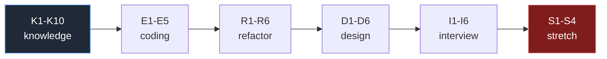
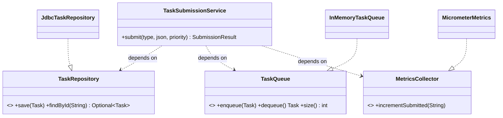
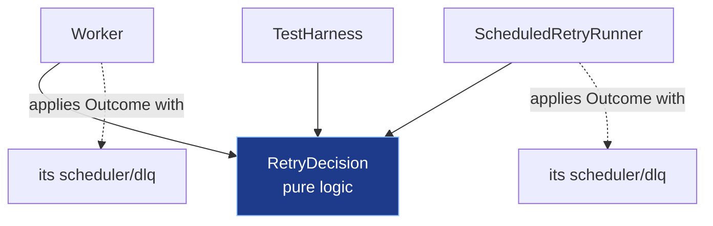
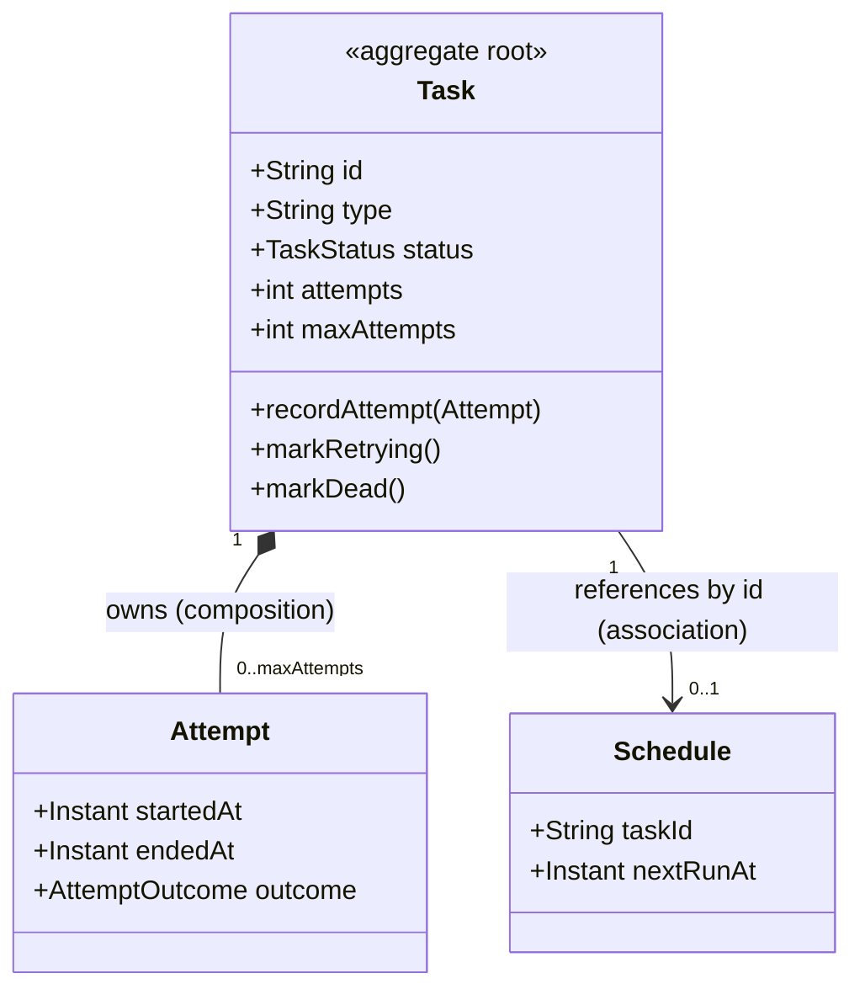
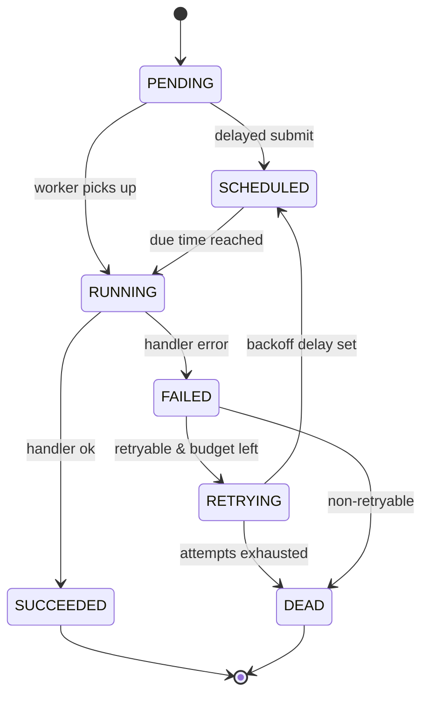
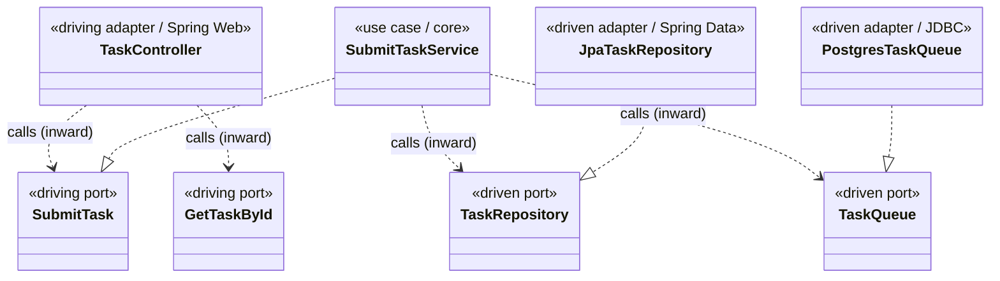
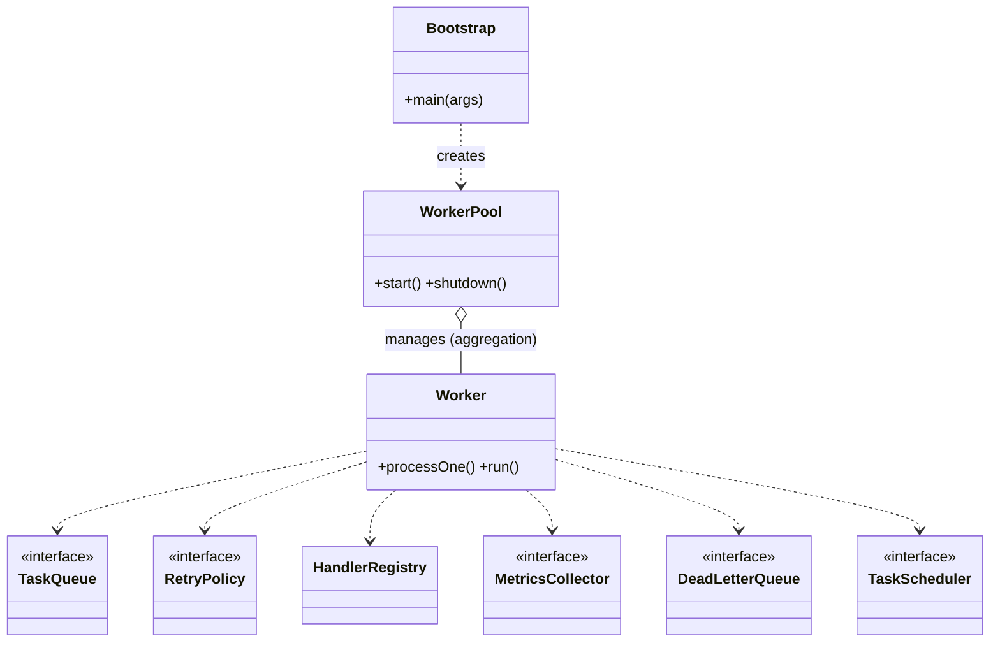
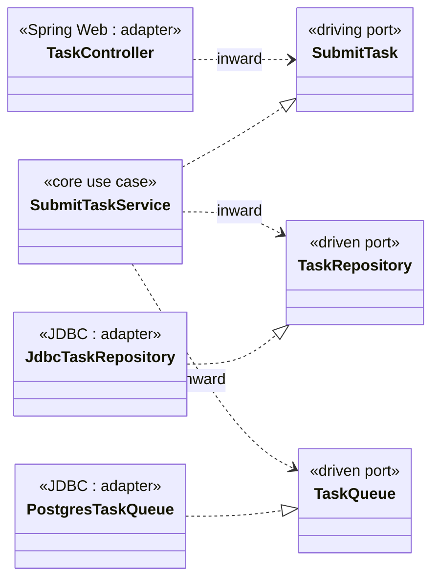
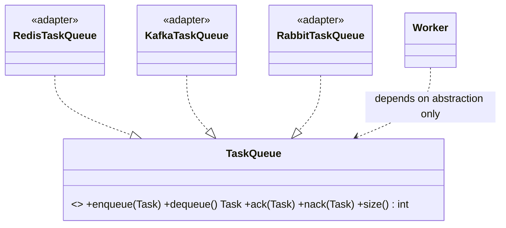

# OOP and OOD: Solutions

> Complete, compilable answers to every exercise in **[`./exercises.md`](./exercises.md)**, addressed by
> the **same IDs** the exercises use: Knowledge-Check `K1..K10`, Coding `E1..E5`, Refactoring `R1..R6`,
> Design `D1..D6`, Interview `I1..I6`, Stretch `S1..S4`.
>
> This module is about **design**, not syntax — cohesion, coupling, dependency injection, domain
> modeling, aggregates, the three architectures (layered, hexagonal, clean), SOLID, DRY/KISS/YAGNI, and
> the Law of Demeter. So most solutions are **before-and-after refactors with UML**: the unit of work is
> reshaping a design, not writing one method.

Every solution gives you three things:

1. **The code** (Java 21 — records, sealed interfaces, switch pattern matching, `var` where it reads
   well). Compiles under `javac --release 21`.
2. **The reasoning and tradeoffs** — *why* the staff-engineer shape is the way it is, not just that it
   works.
3. **Common wrong approaches** — the plausible answer that passes a smoke test but fails review, so you
   can grade your own design.

Everything builds our **Distributed Task Queue and Event Processing Platform**. Where solutions share
types (`Task`, `TaskStatus`, `TaskQueue`, `TaskHandler`, `RetryPolicy`, …) the **first** definition is
canonical; later solutions reference it rather than redefining it. Concepts cross-link to their chapters:
[cohesion](./cohesion.md), [coupling](./coupling.md), [dependency injection](./dependency-injection.md),
[domain modeling](./domain-modeling.md), [aggregates](./aggregates.md),
[layered architecture](./layered-architecture.md), [hexagonal architecture](./hexagonal-architecture.md),
[clean architecture](./clean-architecture.md), [SOLID](./solid.md), [DRY/KISS/YAGNI](./dry-kiss-yagni.md),
[Law of Demeter](./law-of-demeter.md).



---

## The canonical model used throughout

These types are assumed by later solutions. The `Task` here is the *validated* version from
[E1](#e1-easy--make-task-a-proper-value-object) — every refactor below uses it.

```java
package tq.domain;

import java.time.Instant;
import java.util.UUID;

public enum TaskStatus { PENDING, SCHEDULED, RUNNING, SUCCEEDED, FAILED, RETRYING, DEAD }

public record Task(
        String id, String type, String payload, TaskStatus status,
        int attempts, int maxAttempts,
        Instant createdAt, Instant scheduledAt, int priority) {

    public Task {                       // compact canonical constructor — validates invariants
        if (id == null || id.isBlank())   throw new IllegalArgumentException("id blank");
        if (type == null || type.isBlank()) throw new IllegalArgumentException("type blank");
        if (attempts < 0)                 throw new IllegalArgumentException("attempts < 0");
        if (maxAttempts < 1)              throw new IllegalArgumentException("maxAttempts < 1");
        if (priority < 0 || priority > 9) throw new IllegalArgumentException("priority not in [0,9]");
        if (attempts > maxAttempts)       throw new IllegalArgumentException("attempts > maxAttempts");
        if (status == null)               throw new IllegalArgumentException("status null");
        if (createdAt == null)            throw new IllegalArgumentException("createdAt null");
    }

    public Task withStatus(TaskStatus next) {
        return new Task(id, type, payload, next, attempts, maxAttempts, createdAt, scheduledAt, priority);
    }

    public Task incrementAttempt() {
        return new Task(id, type, payload, status, attempts + 1, maxAttempts, createdAt, scheduledAt, priority);
    }

    public boolean attemptsExhausted() { return attempts >= maxAttempts; }

    public static Task newPending(String type, String payload, int priority) {
        return new Task(UUID.randomUUID().toString(), type, payload, TaskStatus.PENDING,
                0, 3, Instant.now(), null, priority);
    }
}

@FunctionalInterface
public interface TaskHandler { TaskResult handle(Task task) throws Exception; }

public record TaskResult(boolean success, String message, boolean retryable) {}

public interface TaskQueue {
    void enqueue(Task t);
    Task dequeue() throws InterruptedException;
    int size();
}
```

---

# Part A — Knowledge-Check solutions

### K1 (Easy) — Cohesion vs coupling in one breath

**Cohesion** is the degree to which the members of a single module (a class, a package) participate in
one job — they touch the same state and change for the same reason. **Coupling** is the number and
strength of the assumptions one module makes about the internals of another — how much A must know about
B to use B.

"High cohesion, low coupling" is a *target*, not a rule you can always hit, because the two pull against
each other at the seams. Pushing a method into the class that "owns" the data it touches (raising
cohesion there) often forces *another* class to reach over and call it (raising coupling there). You are
trading where the dependency lives, not eliminating it.

**Concrete project example:** the retry decision — "compute the next delay, increment attempts, decide
DLQ vs requeue" — is most *cohesive* if it lives inside a single `RetryDecision` component
([R6](#r6-hard--dry-without-coupling-extract-the-retrybackoff-logic)). But the moment you extract it,
`Worker`, `ScheduledRetryRunner`, and the test harness all gain a dependency on `RetryDecision`. You
raised cohesion in the new component and *added* an outward coupling edge from three callers. The right
call is usually still to extract — three callers depending on one stable abstraction beats three copies —
but it is a real trade, not a free win.

> **Common wrong answer:** treating the two as independent dials you can max out simultaneously. They are
> coupled dials; the skill is knowing *which* coupling is cheap (depend on a stable interface) and which
> is expensive (depend on a volatile concrete class).

### K2 (Easy) — The five SOLID letters, mapped to the project

| Letter | Canonical example | Why |
| --- | --- | --- |
| **S**RP | `TaskSubmissionService` *only* orchestrates submit; persistence is in `TaskRepository`, enqueue in `TaskQueue` | one reason to change each. The god-class `TaskService` ([R1](#r1-medium--split-the-taskservice-god-class)) violates it: it changes when SQL, queueing, validation, *or* metrics change. |
| **O**CP | `RetryPolicy` with `FixedDelayRetryPolicy` / `ExponentialBackoffRetryPolicy` | adding a new backoff strategy means a **new class**, not editing existing code. Callers code against the interface. **This is the example in the prompt.** |
| **L**SP | every `TaskQueue` impl (`InMemoryTaskQueue`, `PostgresTaskQueue`) honors the same contract: `dequeue()` blocks, `enqueue` never silently drops | a `Worker` written against `TaskQueue` must work with *any* substitute. An impl that throws on `size()` would break LSP. |
| **I**SP | `TaskHandler` has *one* method; we did not bolt `onStart`/`onError`/`metrics` onto it | handlers depend only on what they use. A fat handler interface would force every lambda to implement methods it ignores. |
| **D**IP | `Worker` depends on `TaskQueue` (abstraction), not `InMemoryTaskQueue` (detail) | high-level policy (worker loop) and low-level detail (queue impl) both depend on the abstraction. See [K4](#k4-easy--dependency-direction). |

OCP is the letter the `RetryPolicy` example demonstrates: swappable implementations behind a stable
interface mean the system is *open for extension* (new policy) but *closed for modification* (no edits to
the worker or to existing policies).

### K3 (Easy) — Why is `TaskHandler` a functional interface?

(a) `@FunctionalInterface` is a **compile-time assertion**: the compiler fails the build if the interface
does not have exactly one abstract method. It documents intent and prevents a teammate from accidentally
adding a second abstract method (which would silently break every lambda call site).

(b) A single-method interface is the cleanest **Strategy**: each `type` of work is a different algorithm,
and a lambda or method reference *is* a strategy with zero ceremony —
`registry.register("email", task -> emailService.send(task))`. No anonymous-class boilerplate, no base
class.

(c) Downside of making *everything* functional: you lose **named, discoverable structure**. A lambda has
no name in a stack trace beyond `Lambda$42`, cannot easily hold per-strategy configuration or state, and
cannot be partially overridden. When a strategy needs lifecycle, dependencies, or its own tests, a named
class beats a lambda. Functional interfaces are for *behavior*, not for *components*.

### K4 (Easy) — Dependency direction

The **Dependency Inversion Principle**: high-level modules should not depend on low-level modules; both
should depend on abstractions — and abstractions should not depend on details, details on abstractions.
In plainer words: *point your source-code dependencies at interfaces you own, not at concrete classes
someone else owns.*

Here the **abstraction** is `TaskQueue` (a contract the domain owns). The **detail** is
`InMemoryTaskQueue` (one implementation, with a `BlockingQueue` inside). The `Worker` (high-level policy:
"pull, dispatch, handle outcome") and `InMemoryTaskQueue` (low-level detail) both point *at* `TaskQueue`.

If `Worker` imports `InMemoryTaskQueue` directly, concretely:

- You cannot swap in `PostgresTaskQueue` for Phase 2 without editing `Worker`.
- You cannot unit-test `Worker` with a fake queue — every test spins up the real one.
- The compile-time dependency now points *outward* from domain to infrastructure; the domain module can
  no longer be a Spring-free, infrastructure-free core ([S2](#s2-hard--hexagonal-phase-2-skeleton-with-spring-boot)).

### K5 (Medium) — Law of Demeter violation, spotted

```java
metrics.getRegistry().getCounter("tasks.processed").increment();
```

This is a **train wreck**: `Worker` reaches through `metrics` → `Registry` → `Counter`. The Law of
Demeter says a method should only talk to (1) itself, (2) its parameters, (3) objects it creates, and (4)
its direct fields — not the friends-of-friends it gets back from getters.

It is brittle because `Worker` now *knows* that a `MetricsCollector` has a `Registry`, that a `Registry`
hands out `Counter`s by string key, and that a `Counter` has `increment()`. Change any one of those three
internal shapes — rename the counter, swap Micrometer for a custom registry, make counters tag-based —
and `Worker` breaks even though *worker logic did not change*.

**Smallest fix that does not over-hide:** give `MetricsCollector` an intention-revealing method and let
it own its internals (Tell, Don't Ask):

```java
metrics.incrementProcessed("tasks.processed");
// inside MetricsCollector:
public void incrementProcessed(String name) { registry.getCounter(name).increment(); }
```

Now `Worker` depends on exactly one collaborator. We did *not* hide too much: the counter name still
crosses the boundary, so callers stay in control of *what* is measured, while *how* it is stored stays
inside `MetricsCollector`.

### K6 (Medium) — Aggregate root, defined

An **aggregate root** is the single entity through which all reads and writes to a cluster of related
objects must pass. It is the consistency boundary: outsiders hold a reference to the root and *only* the
root; the root guards the invariants over its internal members, and the whole cluster is loaded and saved
as one transactional unit.

In our domain, **`Task` should be the aggregate root**, with `Attempt` history as an internal member
([D1](#d1-medium--draw-the-task-aggregate-boundary)) and `Schedule` either internal or referenced by id.

The invariant the root protects: **`attempts <= maxAttempts`** and **status transitions follow the
allowed state machine** ([D2](#d2-medium--state-machine-for-taskstatus)). A free-floating
`task.setStatus(DEAD)` setter would let any caller jump `PENDING → DEAD` or push `attempts` past
`maxAttempts`, breaking the very rules the queue relies on (a `DEAD` task must never be redelivered). By
funnelling mutations through methods like `recordAttempt()` / `markRetrying()`, the root makes illegal
states *unrepresentable from outside*.

### K7 (Medium) — DRY vs premature abstraction

**Concrete example:** the validation in `TaskSubmissionService.submit(...)` checks `type` is non-blank,
and the validation inside the `Task` canonical constructor *also* checks `type` is non-blank. The two
blocks look identical. They should **not** be DRY-ed into one shared `validateType()` method, because
they exist for **different reasons**:

- The service-layer check is an **input-validation** concern: reject a bad API request early with a
  friendly 400 message.
- The constructor check is a **domain-invariant** concern: it is impossible to *construct* a malformed
  `Task` at all, even from a test or a future caller.

They will diverge: the API check might later add rate-limit-aware messaging, locale, or field-path
context for the response body; the domain check must stay minimal and dependency-free. Coupling them now
creates a shared method that both callers fight over.

**Rule of thumb:** DRY *knowledge*, not *coincidental text*. Ask, "if requirement X changes, do **both**
copies have to change together, always?" If yes, it is true duplication — extract it. If they can change
independently, the resemblance is a **coincidence**, and merging them is premature coupling (the "wrong
abstraction"). See [dry-kiss-yagni.md](./dry-kiss-yagni.md).

### K8 (Medium) — Ports vs adapters

| Element | Classification | Justification |
| --- | --- | --- |
| `TaskController` | **driving adapter** | it adapts an external trigger (an HTTP request) into a call on a driving port; Spring Web is the outside world. |
| `TaskRepository` | **driven port** | an interface the domain *owns and calls* to push data outward to storage; the implementation lives outside. |
| `PostgresTaskQueue` | **driven adapter** | a concrete implementation of the `TaskQueue` driven port that adapts the domain's call to JDBC/Postgres. |
| `TaskHandler` | **driving port** *(application-facing)* or strategy seam | it is the inbound contract the application invokes per task type; the registered handler is supplied from the outside, so the interface is a port and each concrete handler is a (driving-side) adapter to a subsystem (email, image, report). |

Mnemonic: **driving** = "actors that drive *the app*" (left side, request comes in); **driven** = "things
the app drives" (right side, app reaches out). **Ports** are interfaces (owned by the core); **adapters**
are implementations (live on the edge). See [hexagonal-architecture.md](./hexagonal-architecture.md).

### K9 (Medium) — Why constructor injection over field injection

For `Worker`:

1. **Immutability / final fields.** Constructor injection lets every collaborator be `private final`, so
   a fully-constructed `Worker` is always in a valid, complete state — no half-wired object, no NPE from
   a dependency that was never set.
2. **Explicit, honest dependencies.** The constructor signature *is* the dependency list. A `Worker(TaskQueue,
   RetryPolicy, HandlerRegistry, MetricsCollector, DeadLetterQueue, TaskScheduler, Clock)` that needs
   seven args is *telling you* it might be doing too much — field injection hides that smell behind
   `@Autowired` annotations scattered across the class ([I4](#i4-medium--constructor-vs-setter-vs-field-injection)).
3. **Testability without a container.** You can `new Worker(fakeQueue, fakePolicy, …)` in a plain JUnit
   test — no reflection, no Spring context, no `ReflectionTestUtils.setField`. Field injection forces
   either a running container or reflection hacks to populate private fields.

**When setter injection is genuinely right:** a truly **optional** dependency with a sensible default
(e.g. an optional `RateLimiter` that defaults to "allow all"), or to break an unavoidable **circular**
construction dependency between two beans where one must be set after construction. Even then, prefer
redesigning out the cycle ([R5](#r5-hard--break-a-cyclic-dependency)) before reaching for setters.

### K10 (Hard) — Cohesion metric judgment call

`WorkerPool` methods: `start()`, `shutdown()`, `enqueue(Task)`, `metricsSnapshot()`,
`setRateLimiter(RateLimiter)`, `reloadConfigFromDisk()`.

The single question to ask each method: **"does this exist to manage the lifecycle of a pool of workers,
and does it touch the pool's own state (the `ExecutorService`, the worker list)?"** That is the pool's one
responsibility.

| Method | Verdict | Reasoning |
| --- | --- | --- |
| `start()` | **belongs** | spins up the workers — core lifecycle, touches the executor. |
| `shutdown()` | **belongs** | graceful drain of the executor — core lifecycle. |
| `enqueue(Task)` | **smell** | enqueueing is the `TaskQueue`'s job. The pool *has* a queue; making it a pass-through proxy invites a Law-of-Demeter shortcut and blurs ownership. If it must exist for convenience, it should be a one-liner delegating to `queue.enqueue(t)` — but prefer letting callers hold the queue. |
| `metricsSnapshot()` | **smell** | reporting is the `MetricsCollector`'s job. The pool reading and exposing a snapshot mixes "manage workers" with "expose telemetry." Move it to `MetricsCollector.snapshot()`. |
| `setRateLimiter(...)` | **smell** | a setter that swaps a collaborator at runtime is a configuration concern and a mutability hazard. Inject the limiter via the constructor; it is not lifecycle. |
| `reloadConfigFromDisk()` | **strong smell** | file I/O and config parsing have *nothing* to do with managing threads. This is a separate `ConfigSource`/`ConfigReloader` responsibility. It changes for a totally different reason (config-format change vs concurrency bug). |

So `start()`/`shutdown()` are cohesive; the other four each answer "no" to the SRP question and pull the
class toward being a mini god-object. See [cohesion.md](./cohesion.md).

---

# Part B — Coding solutions

### E1 (Easy) — Make `Task` a proper value object

The validated `Task` record is the canonical one shown [above](#the-canonical-model-used-throughout).
Here are the three required tests.

```java
package tq.domain;

import org.junit.jupiter.api.Test;
import java.time.Instant;
import static org.assertj.core.api.Assertions.*;

class TaskTest {

    @Test
    void rejectsInvalidInvariants() {
        // priority out of range
        assertThatThrownBy(() ->
                new Task("id-1", "email", "{}", TaskStatus.PENDING, 0, 3, Instant.now(), null, 99))
                .isInstanceOf(IllegalArgumentException.class)
                .hasMessageContaining("priority");

        // attempts > maxAttempts
        assertThatThrownBy(() ->
                new Task("id-1", "email", "{}", TaskStatus.PENDING, 5, 3, Instant.now(), null, 1))
                .isInstanceOf(IllegalArgumentException.class)
                .hasMessageContaining("attempts > maxAttempts");

        // blank type
        assertThatThrownBy(() ->
                new Task("id-1", "  ", "{}", TaskStatus.PENDING, 0, 3, Instant.now(), null, 1))
                .isInstanceOf(IllegalArgumentException.class)
                .hasMessageContaining("type");
    }

    @Test
    void withStatusDoesNotMutateOriginal() {
        Task original = Task.newPending("email", "{}", 5);
        Task running = original.withStatus(TaskStatus.RUNNING);

        assertThat(original.status()).isEqualTo(TaskStatus.PENDING);   // unchanged
        assertThat(running.status()).isEqualTo(TaskStatus.RUNNING);
        assertThat(running.id()).isEqualTo(original.id());             // identity preserved
        assertThat(running).isNotSameAs(original);                     // new instance
    }

    @Test
    void factoryFillsDefaults() {
        Task t = Task.newPending("resize", "{\"w\":100}", 3);
        assertThat(t.id()).isNotBlank();
        assertThat(t.status()).isEqualTo(TaskStatus.PENDING);
        assertThat(t.attempts()).isZero();
        assertThat(t.maxAttempts()).isEqualTo(3);
        assertThat(t.createdAt()).isNotNull();
    }
}
```

**Reasoning.** Validation lives in the **compact canonical constructor**, so it runs on *every* path
that constructs a `Task` — the factory, `withStatus`, deserialization that goes through the canonical
constructor. That is the whole point of putting invariants in the type: malformed `Task`s become
unrepresentable, not merely "usually rejected." `withStatus` returns a *new* record because records are
immutable value objects; mutating in place would make `Task` aliasable and unsafe to share across worker
threads ([immutable-objects](../03-java-memory-model/immutable-objects.md)).

**Common wrong approaches.** (1) Putting validation in a separate `TaskValidator.validate(task)` called
by the service — now you can still construct an invalid `Task` and forget to validate it. (2) Adding
setters "for the ORM" — that re-opens mutation and defeats the value-object guarantee; map records with a
constructor-based mapper instead. (3) Throwing a checked exception from the constructor — constructors
cannot, and invariant violations are programmer errors, so `IllegalArgumentException` (unchecked) is
correct.

### E2 (Easy) — Strategy via `RetryPolicy`

```java
package tq.retry;

import java.time.Duration;
import java.util.Optional;
import java.util.concurrent.ThreadLocalRandom;

public interface RetryPolicy {
    /** Delay before attempt {@code attempt} (1-based), or empty when retries are exhausted. */
    Optional<Duration> nextDelay(int attempt);
}

public final class FixedDelayRetryPolicy implements RetryPolicy {
    private final Duration delay;
    private final int maxAttempts;

    public FixedDelayRetryPolicy(Duration delay, int maxAttempts) {
        if (delay.isNegative()) throw new IllegalArgumentException("delay < 0");
        if (maxAttempts < 1)    throw new IllegalArgumentException("maxAttempts < 1");
        this.delay = delay;
        this.maxAttempts = maxAttempts;
    }

    @Override public Optional<Duration> nextDelay(int attempt) {
        return attempt >= maxAttempts ? Optional.empty() : Optional.of(delay);
    }
}

public final class ExponentialBackoffRetryPolicy implements RetryPolicy {
    private final Duration base;
    private final double multiplier;
    private final Duration cap;
    private final int maxAttempts;

    public ExponentialBackoffRetryPolicy(Duration base, double multiplier, Duration cap, int maxAttempts) {
        if (base.isNegative() || base.isZero()) throw new IllegalArgumentException("base must be > 0");
        if (multiplier < 1.0)                   throw new IllegalArgumentException("multiplier < 1");
        if (cap.compareTo(base) < 0)            throw new IllegalArgumentException("cap < base");
        if (maxAttempts < 1)                    throw new IllegalArgumentException("maxAttempts < 1");
        this.base = base; this.multiplier = multiplier; this.cap = cap; this.maxAttempts = maxAttempts;
    }

    @Override public Optional<Duration> nextDelay(int attempt) {
        if (attempt >= maxAttempts) return Optional.empty();
        double raw = base.toMillis() * Math.pow(multiplier, attempt - 1);
        long capped = (long) Math.min(raw, cap.toMillis());
        // full jitter: pick uniformly in [0, capped]  (AWS "Exponential Backoff and Jitter")
        long jittered = ThreadLocalRandom.current().nextLong(capped + 1);
        return Optional.of(Duration.ofMillis(jittered));
    }
}
```

The `Worker`-side helper — note it takes the *interface*, so swapping policy needs **no edit** here:

```java
package tq.worker;

import tq.domain.Task;
import tq.retry.RetryPolicy;
import java.time.Duration;
import java.util.Optional;

public final class RetryHelper {
    /** Empty => task should be dead-lettered; present => sleep/schedule this delay then requeue. */
    public static Optional<Duration> decideRetry(Task t, RetryPolicy policy) {
        return policy.nextDelay(t.attempts() + 1);   // attempt about to be made is attempts+1
    }
}
```

**Open/Closed in action.** `decideRetry` references only `RetryPolicy`. Pass a `FixedDelayRetryPolicy`
or an `ExponentialBackoffRetryPolicy` (or a future `DecorrelatedJitterPolicy`) and the helper is
untouched. That is OCP: open for new policies, closed against editing the consumer.

> **Why full jitter, not fixed exponential.** Without jitter, a fleet of workers that fail at the same
> instant (a downstream blip) all retry at *exactly* the same future instant — a synchronized thundering
> herd that re-melts the downstream. Full jitter spreads retries uniformly across the window.

**Common wrong approaches.** (1) `base * multiplier^attempt` computed in `int`/`long` overflows fast —
compute in `double`, cap, *then* narrow. (2) Capping *before* applying jitter but using
`capped/2 + rand(capped/2)` ("equal jitter") is fine but is *not* full jitter; the exercise asks for full
jitter, `[0, capped]`. (3) Using `Math.random()` (shared, contended `Random`) instead of
`ThreadLocalRandom` hurts under concurrent workers.

### E3 (Medium) — Introduce a `MetricsCollector` seam

```java
package tq.metrics;

import java.time.Duration;
import java.util.Map;
import java.util.concurrent.ConcurrentHashMap;
import java.util.concurrent.atomic.LongAdder;

public interface MetricsCollector {
    void incrementProcessed(String taskType, boolean success);
    void recordLatency(String taskType, Duration d);
}

/** Thread-safe, allocation-light in-memory collector for tests and Phase-1. */
public final class InMemoryMetricsCollector implements MetricsCollector {
    private final Map<String, LongAdder> succeeded = new ConcurrentHashMap<>();
    private final Map<String, LongAdder> failed    = new ConcurrentHashMap<>();
    private final Map<String, LongAdder> latencySumMs = new ConcurrentHashMap<>();
    private final Map<String, LongAdder> latencyCount  = new ConcurrentHashMap<>();

    @Override public void incrementProcessed(String taskType, boolean success) {
        (success ? succeeded : failed).computeIfAbsent(taskType, k -> new LongAdder()).increment();
    }

    @Override public void recordLatency(String taskType, Duration d) {
        latencySumMs.computeIfAbsent(taskType, k -> new LongAdder()).add(d.toMillis());
        latencyCount.computeIfAbsent(taskType, k -> new LongAdder()).increment();
    }

    // intention-revealing read API (no leaking of internal maps -> Law of Demeter)
    public long succeeded(String type) { return value(succeeded, type); }
    public long failed(String type)    { return value(failed, type); }
    public double avgLatencyMs(String type) {
        long n = value(latencyCount, type);
        return n == 0 ? 0.0 : (double) value(latencySumMs, type) / n;
    }
    private static long value(Map<String, LongAdder> m, String type) {
        LongAdder a = m.get(type); return a == null ? 0L : a.sum();
    }
}

/** Null Object: zero-overhead, swallows everything. Ideal default and for unit tests. */
public final class NoOpMetricsCollector implements MetricsCollector {
    @Override public void incrementProcessed(String taskType, boolean success) { }
    @Override public void recordLatency(String taskType, Duration d) { }
}
```

The refactored `Worker.run()` — metrics injected via the constructor, **no `System.out`**:

```java
package tq.worker;

import tq.domain.*;
import tq.metrics.MetricsCollector;
import java.time.*;

public final class MeteredWorker {
    private final TaskQueue queue;
    private final HandlerRegistry handlers;
    private final MetricsCollector metrics;   // injected — no static, no System.out
    private final Clock clock;

    public MeteredWorker(TaskQueue queue, HandlerRegistry handlers,
                         MetricsCollector metrics, Clock clock) {
        this.queue = queue; this.handlers = handlers; this.metrics = metrics; this.clock = clock;
    }

    public void processOne() throws Exception {
        Task t = queue.dequeue();
        Instant start = clock.instant();
        TaskResult r = handlers.handlerFor(t.type()).handle(t);
        metrics.recordLatency(t.type(), Duration.between(start, clock.instant()));
        metrics.incrementProcessed(t.type(), r.success());
    }
}
```

Proof test using the in-memory collector:

```java
@Test
void processedCountsAreAsserted() throws Exception {
    var metrics = new InMemoryMetricsCollector();
    var queue = new InMemoryTaskQueue();
    var registry = new HandlerRegistry();
    registry.register("email", task -> new TaskResult(true, "ok", false));
    var worker = new MeteredWorker(queue, registry, metrics, Clock.systemUTC());

    queue.enqueue(Task.newPending("email", "{}", 5));
    worker.processOne();

    assertThat(metrics.succeeded("email")).isEqualTo(1);
    assertThat(metrics.failed("email")).isZero();
}
```

**Reasoning.** `LongAdder` beats `AtomicLong` under heavy write contention from many workers because it
shards the count across cells and sums on read — perfect when *writes* (increments) vastly outnumber
*reads* (the snapshot). The `NoOpMetricsCollector` is the **Null Object pattern**: tests that do not care
about metrics inject it and avoid null checks; it is also a safe production default.

**Common wrong approaches.** (1) A `static MetricsCollector INSTANCE` — reintroduces global state and
breaks test isolation (the spec calls this out explicitly). Inject it. (2) Returning the internal
`Map<String,LongAdder>` from a getter — that is a Law-of-Demeter leak; expose `succeeded(type)` instead.
(3) Using `HashMap` + `synchronized` blocks — correct but contended; `ConcurrentHashMap` +
`computeIfAbsent` is lock-striped and cleaner.

### E4 (Medium) — `TokenBucketRateLimiter`

```java
package tq.ratelimit;

public interface RateLimiter { boolean tryAcquire(); }

public final class TokenBucketRateLimiter implements RateLimiter {
    private final long capacity;
    private final double refillPerNano;   // tokens per nanosecond
    private double tokens;                 // current tokens (fractional)
    private long lastRefillNanos;

    public TokenBucketRateLimiter(int capacity, double refillPerSecond) {
        if (capacity < 1)          throw new IllegalArgumentException("capacity < 1");
        if (refillPerSecond <= 0)  throw new IllegalArgumentException("refillPerSecond <= 0");
        this.capacity = capacity;
        this.refillPerNano = refillPerSecond / 1_000_000_000.0;
        this.tokens = capacity;                 // start full
        this.lastRefillNanos = System.nanoTime();
    }

    @Override public synchronized boolean tryAcquire() {
        refill();
        if (tokens >= 1.0) { tokens -= 1.0; return true; }
        return false;
    }

    private void refill() {                       // lazy refill based on elapsed time
        long now = System.nanoTime();
        long elapsed = now - lastRefillNanos;
        if (elapsed <= 0) return;                 // monotonic guard
        tokens = Math.min(capacity, tokens + elapsed * refillPerNano);
        lastRefillNanos = now;
    }
}
```

Concurrency test — 1000 acquisitions across 8 threads, asserting against the theoretical bound:

```java
@Test
void grantsStayWithinTheoreticalBound() throws Exception {
    int capacity = 10;
    double refillPerSec = 100.0;
    var limiter = new TokenBucketRateLimiter(capacity, refillPerSec);

    var granted = new java.util.concurrent.atomic.AtomicInteger();
    long start = System.nanoTime();
    try (var pool = java.util.concurrent.Executors.newFixedThreadPool(8)) {
        var tasks = new java.util.ArrayList<java.util.concurrent.Callable<Void>>();
        for (int i = 0; i < 1000; i++) {
            tasks.add(() -> { if (limiter.tryAcquire()) granted.incrementAndGet(); return null; });
        }
        pool.invokeAll(tasks);
    }
    long elapsedNanos = System.nanoTime() - start;

    // upper bound = initial capacity + refill * elapsed-seconds, plus a small slack for timing
    double elapsedSec = elapsedNanos / 1_000_000_000.0;
    long bound = (long) Math.ceil(capacity + refillPerSec * elapsedSec) + 1;

    assertThat(granted.get()).isLessThanOrEqualTo((int) bound);
    assertThat(granted.get()).isGreaterThanOrEqualTo(capacity); // at least the initial burst
}
```

**Reasoning.** The bucket **refills lazily**: instead of a background timer thread, every `tryAcquire`
computes how many tokens *would have* accrued since the last call. This is cheaper, has no scheduling
jitter, and never exceeds `capacity` (clamped by `Math.min`). The whole method is `synchronized`, so the
read-modify-write of `tokens`/`lastRefillNanos` is atomic — no lost updates under 8-way contention. The
public surface is exactly `tryAcquire()`, so callers physically cannot peek at `tokens` or reset the
clock — encapsulation and Law of Demeter satisfied. See [rate-limiting](../08-distributed-systems/rate-limiting.md).

**Common wrong approaches.** (1) Storing `tokens` as `int` and refilling whole tokens only — at slow
refill rates you accrue *zero* tokens per call and starve; keep it fractional. (2) `System.currentTimeMillis()`
instead of `nanoTime()` — wall-clock can jump backwards (NTP), producing negative elapsed and spurious
grants; `nanoTime()` is monotonic. (3) A lock-free `AtomicReference<State>` CAS loop is *correct* and
scales better, but for a Phase-1 limiter `synchronized` is simpler and the contention is on a handful of
nanoseconds — KISS. (4) Refilling on a `ScheduledExecutorService` tick reintroduces a thread and timer
drift for no benefit here.

### E5 (Hard) — Sealed result hierarchy + exhaustive switch

```java
package tq.worker;

import tq.domain.*;
import tq.retry.RetryPolicy;
import tq.queue.DeadLetterQueue;
import tq.schedule.TaskScheduler;
import java.time.Duration;

public sealed interface Outcome
        permits Outcome.Succeeded, Outcome.RetryLater, Outcome.DeadLetter {
    record Succeeded(String message)        implements Outcome {}
    record RetryLater(Duration delay)       implements Outcome {}
    record DeadLetter(String reason)        implements Outcome {}
}

public final class OutcomeEngine {

    public Outcome classify(Task task, TaskResult result, RetryPolicy policy) {
        if (result.success()) {
            return new Outcome.Succeeded(result.message());
        }
        if (!result.retryable()) {
            return new Outcome.DeadLetter("non-retryable: " + result.message());
        }
        return policy.nextDelay(task.attempts() + 1)
                .<Outcome>map(Outcome.RetryLater::new)
                .orElseGet(() -> new Outcome.DeadLetter(
                        "exhausted after " + task.attempts() + " attempts"));
    }

    // Exhaustive switch: NO default branch. Adding a 4th Outcome variant makes this stop compiling.
    public void apply(Task t, Outcome o, TaskQueue queue,
                      TaskScheduler scheduler, DeadLetterQueue dlq) {
        switch (o) {
            case Outcome.Succeeded s ->
                    queue.markDone(t.withStatus(TaskStatus.SUCCEEDED), s.message());
            case Outcome.RetryLater r ->
                    scheduler.schedule(t.incrementAttempt().withStatus(TaskStatus.RETRYING), r.delay());
            case Outcome.DeadLetter d ->
                    dlq.send(t.withStatus(TaskStatus.DEAD), d.reason());
        }
    }
}
```

> **Why the compiler now catches a forgotten case.** `Outcome` is `sealed`, so the compiler knows the
> *complete* set of subtypes (`Succeeded`, `RetryLater`, `DeadLetter`). A `switch` over a sealed type with
> no `default` is checked for **exhaustiveness**: every permitted subtype must have a `case`. The moment
> you add `record Throttled(...) implements Outcome {}` to the `permits` clause, *this* `switch` fails to
> compile with "the switch statement does not cover all possible input values" — turning a latent runtime
> bug (an unhandled outcome silently doing nothing) into a **compile error** you cannot ship.

**Reasoning.** Booleans (`success`, `retryable`) encode a 2x2 of meanings that callers must re-derive
everywhere. A sealed `Outcome` names the three *decisions* directly, so `apply` reads like the spec. The
`classify`/`apply` split separates *deciding* (pure, trivially unit-testable) from *acting* (has side
effects on queue/scheduler/dlq).

**Common wrong approaches.** (1) Adding a `default -> {}` branch "to be safe" — this is **exhaustiveness
theatre**: it silences the compiler and reintroduces the exact bug the sealed type was meant to prevent
(the spec lists this under common mistakes). Drop the `default`. (2) Using an `enum` instead of a sealed
interface — an `enum` cannot carry per-case data (`RetryLater` needs a `Duration`, `DeadLetter` a
`reason`). (3) Returning `Outcome` but then doing `if (o instanceof Succeeded)` ladders — use the pattern
`switch` so exhaustiveness is enforced.

---

# Part C — Refactoring solutions (god classes & SOLID)

### R1 (Medium) — Split the `TaskService` god class

**1. Responsibilities this one class owns** (every one is a "reason to change"):

1. **Connection management** — `DriverManager.getConnection` in its constructor.
2. **Input validation** — the `type` blank check.
3. **Identity generation** — `UUID.randomUUID()`.
4. **Persistence / SQL** — inline `INSERT` with a hand-built `PreparedStatement`.
5. **Queueing** — `queue.add(...)`.
6. **Metrics / logging** — `System.out.println`.
7. **Handler registry** — `handlers.put(...)`, typed as `Object`.
8. **Task processing / dispatch / retry** — `processOne()` mixes poll, lookup, execute, status update.

Eight reasons to change in one class. Any of SQL dialect, queue impl, metrics backend, validation rules,
or dispatch logic forces an edit here — a textbook SRP and DIP violation.

**2. Improved version — extract collaborators behind interfaces, inject via constructor.**

```java
package tq.app;

import tq.domain.*;

public interface TaskRepository {
    void save(Task t);
    java.util.Optional<Task> findById(String id);
}

public interface MetricsCollector { void incrementSubmitted(String type); }

public final class HandlerRegistry {
    private final java.util.Map<String, TaskHandler> handlers = new java.util.concurrent.ConcurrentHashMap<>();
    public void register(String type, TaskHandler h) { handlers.put(type, h); }
    public TaskHandler handlerFor(String type) {
        TaskHandler h = handlers.get(type);
        if (h == null) throw new IllegalArgumentException("no handler for type: " + type);
        return h;
    }
}

public final class TaskSubmissionService {           // orchestrates only — NO sql, NO System.out
    private final TaskRepository repo;
    private final TaskQueue queue;
    private final MetricsCollector metrics;

    public TaskSubmissionService(TaskRepository repo, TaskQueue queue, MetricsCollector metrics) {
        this.repo = repo; this.queue = queue; this.metrics = metrics;   // injected, not constructed
    }

    public String submit(String type, String json, int priority) {
        Task t = Task.newPending(type, json, priority);   // validation lives in the domain (E1)
        repo.save(t);
        queue.enqueue(t);
        metrics.incrementSubmitted(type);
        return t.id();
    }
}
```

**3. Production version — domain result type, fail-fast registry, typed handlers.**

```java
public record SubmissionResult(String taskId, TaskStatus status) {}

public final class TaskSubmissionServiceProd {
    private final TaskRepository repo;
    private final TaskQueue queue;
    private final MetricsCollector metrics;

    public TaskSubmissionServiceProd(TaskRepository repo, TaskQueue queue, MetricsCollector metrics) {
        this.repo = java.util.Objects.requireNonNull(repo);
        this.queue = java.util.Objects.requireNonNull(queue);
        this.metrics = java.util.Objects.requireNonNull(metrics);
    }

    public SubmissionResult submit(String type, String json, int priority) {
        Task t = Task.newPending(type, json, priority);   // throws on invalid input -> 400 at the edge
        repo.save(t);
        queue.enqueue(t);
        metrics.incrementSubmitted(type);
        return new SubmissionResult(t.id(), t.status());
    }
}
```

The `HandlerRegistry` above already stores `TaskHandler` (not `Object`) and **fails fast** on an unknown
type. The JDBC `INSERT` moves into a `JdbcTaskRepository implements TaskRepository` adapter (Phase 2),
which is the *only* class that imports `java.sql.*`.

**4. `classDiagram` of the after state — dependency direction.**



The service points only at interfaces; concrete adapters point *up* at those interfaces. That is
inverted dependency direction.

**Acceptance:** `TaskSubmissionService` has zero `import java.sql.*` and zero `System.out`. ✔

**Common wrong approaches.** (1) Splitting into many classes but having the service `new
JdbcTaskRepository(url)` inside its constructor — that is **not** inversion; it still owns infrastructure.
Inject the interface. (2) Keeping `registerHandler(String, Object)` — the `Object` defeats type safety
and forces reflection in `processOne`. (3) Returning a raw `String id` forever — a `SubmissionResult`
gives room to add status/links without breaking callers.

### R2 (Medium) — Kill the `instanceof` ladder with polymorphism

```java
package tq.dispatch;

import tq.domain.*;
import java.util.Map;
import java.util.concurrent.ConcurrentHashMap;

public final class Dispatcher {
    private final Map<String, TaskHandler> handlers = new ConcurrentHashMap<>();
    private final TaskHandler fallback;

    public Dispatcher(TaskHandler fallback) { this.fallback = fallback; }

    public void register(String type, TaskHandler handler) { handlers.put(type, handler); }

    public TaskResult dispatch(Task t) throws Exception {
        return handlers.getOrDefault(t.type(), fallback).handle(t);
    }
}
```

Three handlers (lambdas) and a fallback strategy for unknown types:

```java
var dispatcher = new Dispatcher(
        // fallback: log + dead-letter unknown types instead of crashing the worker
        task -> new TaskResult(false, "unknown type: " + task.type(), false));

dispatcher.register("email",  task -> new TaskResult(sendEmail(task),    "email",  true));
dispatcher.register("resize", task -> new TaskResult(resizeImage(task),  "resize", true));
dispatcher.register("report", task -> new TaskResult(buildReport(task),  "report", false));
```

**OCP benefit gained.** Adding a new task type is now a *registration*, not a code edit to `dispatch`.
The dispatcher is closed for modification, open for extension; a new module can register its handler
without touching this file. Handlers are independently testable and can hold their own dependencies (a
named class `EmailHandler implements TaskHandler` can take an `EmailClient` in its constructor).

**What you gave up.** **Discoverability.** With the `if/else` ladder, every branch was visible in one
place; you could read all task types at a glance. With a registry, the set of handled types is assembled
at runtime across many registration sites, so "what types do we handle?" becomes a grep, not a read.
Mitigation: a single composition root ([D6](#d6-hard--introduce-di-without-a-framework-then-with-spring))
where all `register(...)` calls live, restoring one-place visibility. See [solid.md](./solid.md).

**Common wrong approaches.** (1) Replacing `if/else` with a `switch` on `t.type()` — slightly nicer, but
*still* requires editing the method for every new type; not OCP. (2) Throwing on unknown type instead of a
fallback — a single bad message can take down a worker thread; prefer routing the unknown to the DLQ.

### R3 (Medium) — Fix a Law-of-Demeter "train wreck"

**Before:**

```java
public void report(Worker w) {
    w.getPool().getRegistry().getCollector().getCounter("done").increment();
    long lag = w.getPool().getQueue().getClock().now().toEpochMilli()
             - w.getCurrentTask().createdAt().toEpochMilli();
    System.out.println("lag=" + lag);
}
```

This reaches through `Worker → WorkerPool → Registry → Collector → Counter`, and separately through
`Worker → WorkerPool → Queue → Clock`. The caller knows the internal shape of five objects.

**After — Tell, Don't Ask methods on the owners:**

```java
// On WorkerPool: it owns its registry/collector and its clock — let it do the telling.
public final class WorkerPool {
    private final MetricsCollector collector;
    private final java.time.Clock clock;
    // ...
    public void recordDone()            { collector.incrementProcessed("done", true); }
    public java.time.Instant now()      { return clock.instant(); }
}

// On Task: it knows its own createdAt — let it compute its own lag.
public record Task(/* ...fields... */) {
    public java.time.Duration lagFrom(java.time.Instant now) {
        return java.time.Duration.between(createdAt(), now);
    }
}

// On Worker: expose its one current task, don't make callers walk into the pool.
public final class Worker {
    private final WorkerPool pool;
    private volatile Task currentTask;
    public void recordDone()            { pool.recordDone(); }
    public java.time.Duration currentLag() {
        Task t = currentTask;
        return t == null ? java.time.Duration.ZERO : t.lagFrom(pool.now());
    }
}

// The reporter now talks to its direct collaborator only:
public void report(Worker w) {
    w.recordDone();
    long lagMs = w.currentLag().toMillis();
    // route through an injected logger/metrics, not System.out, in production
}
```

**Classes whose public API changed:**

- `WorkerPool` — gained `recordDone()` and `now()`.
- `Task` — gained `lagFrom(Instant)`.
- `Worker` — gained `recordDone()` and `currentLag()`; `getPool()` / `getCurrentTask()` getters can now
  be removed (or made package-private), shrinking its surface.

**Reasoning.** Each object now does the work it has the data for, and `report` depends only on `Worker`.
Internals of pool, registry, collector, counter, queue, and clock are free to change without breaking the
reporter. See [law-of-demeter.md](./law-of-demeter.md).

**Common wrong approaches.** (1) Adding a `getCounter()` convenience on `WorkerPool` — that just moves
the train wreck one hop; you still hand out a `Counter`. Tell the pool to record, don't ask it for a
counter. (2) Storing the lag computation in the reporter — `Task` owns `createdAt`, so `lagFrom` belongs
on `Task`.

### R4 (Hard) — Refactor the `Worker` to depend on abstractions only

**Tasks 1–3: inject every collaborator, schedule (no `Thread.sleep`), extract `processOne()`.**

```java
package tq.worker;

import tq.domain.*;
import tq.retry.RetryPolicy;
import tq.queue.DeadLetterQueue;
import tq.schedule.TaskScheduler;
import tq.metrics.MetricsCollector;
import java.time.*;
import java.util.Optional;

public final class Worker implements Runnable {
    private final TaskQueue queue;
    private final RetryPolicy retryPolicy;
    private final HandlerRegistry handlers;
    private final MetricsCollector metrics;
    private final DeadLetterQueue dlq;
    private final TaskScheduler scheduler;
    private final Clock clock;
    private volatile boolean running = true;

    public Worker(TaskQueue queue, RetryPolicy retryPolicy, HandlerRegistry handlers,
                  MetricsCollector metrics, DeadLetterQueue dlq,
                  TaskScheduler scheduler, Clock clock) {
        this.queue = queue; this.retryPolicy = retryPolicy; this.handlers = handlers;
        this.metrics = metrics; this.dlq = dlq; this.scheduler = scheduler; this.clock = clock;
    }

    @Override public void run() {
        while (running) {
            try { processOne(); }
            catch (InterruptedException e) { Thread.currentThread().interrupt(); return; }
            catch (Exception e) { /* a handler threw; processOne already routed the outcome */ }
        }
    }

    public void stop() { running = false; }

    /** One unit of work — directly unit-testable, no infinite loop, no sleep. */
    public void processOne() throws Exception {
        Task t = queue.dequeue();                       // blocks; fake returns immediately in tests
        Instant start = clock.instant();
        TaskResult result;
        try {
            result = handlers.handlerFor(t.type()).handle(t);
        } catch (Exception ex) {                        // handler exploded -> treat as retryable failure
            result = new TaskResult(false, ex.toString(), true);
        }
        metrics.recordLatency(t.type(), Duration.between(start, clock.instant()));
        metrics.incrementProcessed(t.type(), result.success());
        handleOutcome(t, result);
    }

    private void handleOutcome(Task t, TaskResult result) {
        if (result.success()) return;                   // done

        if (!result.retryable()) {                      // failed, non-retryable -> DLQ
            dlq.send(t.withStatus(TaskStatus.DEAD), "non-retryable: " + result.message());
            return;
        }
        Optional<Duration> delay = retryPolicy.nextDelay(t.attempts() + 1);
        if (delay.isEmpty()) {                           // exhausted attempts -> DLQ
            dlq.send(t.withStatus(TaskStatus.DEAD), "exhausted after " + t.attempts() + " attempts");
            return;
        }
        // retryable + budget left -> schedule a delayed re-enqueue (NO Thread.sleep)
        Task retrying = t.incrementAttempt().withStatus(TaskStatus.RETRYING);
        scheduler.schedule(retrying, delay.get());
    }
}
```

**Task 4: two tests with fakes for every interface.**

```java
class WorkerTest {

    // ---- minimal fakes (no Mockito needed) ----
    static final class OneShotQueue implements TaskQueue {
        private Task next; OneShotQueue(Task t) { this.next = t; }
        public void enqueue(Task t) { this.next = t; }
        public Task dequeue() throws InterruptedException {
            if (next == null) throw new InterruptedException("drained");
            Task t = next; next = null; return t;
        }
        public int size() { return next == null ? 0 : 1; }
    }
    static final class CapturingScheduler implements TaskScheduler {
        Task scheduled; Duration delay;
        public void schedule(Task t, Duration d) { this.scheduled = t; this.delay = d; }
    }
    static final class CapturingDlq implements DeadLetterQueue {
        Task sent; String reason;
        public void send(Task t, String reason) { this.sent = t; this.reason = reason; }
    }

    @Test
    void retryableFailureIsRescheduled() throws Exception {
        var task = new Task("id-1", "email", "{}", TaskStatus.PENDING, 0, 3, Instant.now(), null, 5);
        var queue = new OneShotQueue(task);
        var sched = new CapturingScheduler();
        var dlq = new CapturingDlq();
        var registry = new HandlerRegistry();
        registry.register("email", t -> new TaskResult(false, "smtp down", true));  // retryable fail

        var worker = new Worker(queue, new FixedDelayRetryPolicy(Duration.ofSeconds(1), 3),
                registry, new NoOpMetricsCollector(), dlq, sched, Clock.systemUTC());

        worker.processOne();

        assertThat(sched.scheduled).isNotNull();
        assertThat(sched.scheduled.status()).isEqualTo(TaskStatus.RETRYING);
        assertThat(sched.scheduled.attempts()).isEqualTo(1);
        assertThat(dlq.sent).isNull();
    }

    @Test
    void exhaustedTaskIsDeadLettered() throws Exception {
        // attempts already at maxAttempts-1 so the next attempt (3) exhausts a max-3 policy
        var task = new Task("id-2", "email", "{}", TaskStatus.RETRYING, 3, 3, Instant.now(), null, 5);
        var queue = new OneShotQueue(task);
        var sched = new CapturingScheduler();
        var dlq = new CapturingDlq();
        var registry = new HandlerRegistry();
        registry.register("email", t -> new TaskResult(false, "still down", true));

        var worker = new Worker(queue, new FixedDelayRetryPolicy(Duration.ofSeconds(1), 3),
                registry, new NoOpMetricsCollector(), dlq, sched, Clock.systemUTC());

        worker.processOne();

        assertThat(dlq.sent).isNotNull();
        assertThat(dlq.sent.status()).isEqualTo(TaskStatus.DEAD);
        assertThat(sched.scheduled).isNull();
    }
}
```

**Reasoning.** Every collaborator is an interface, so the tests inject in-memory fakes — no real queue, no
DB, no clock-based `sleep`. Extracting `processOne()` from the `while` loop is the key seam: the loop is
untestable (infinite), but one iteration is trivially testable. Replacing `Thread.sleep` with
`scheduler.schedule` means a worker thread never *blocks* on backoff — it returns to pulling the next
task, and the scheduler re-enqueues the retry when its delay elapses (far better throughput).

**Common wrong approaches.** (1) `Thread.sleep(delay)` in the worker — blocks the thread, wastes a worker
for the whole backoff, and is untestable without real time. Schedule instead. (2) `e.printStackTrace()` —
swallows failures with no routing; the DLQ/retry path is the actual outcome handling. (3) Catching
`InterruptedException` and ignoring it — you must restore the interrupt flag and exit, or shutdown hangs.
See [dependency-injection.md](./dependency-injection.md) and [coupling.md](./coupling.md).

### R5 (Hard) — Break a cyclic dependency

**Before — the cycle.** `WorkerPool` constructs and owns `Worker`s, and `Worker` calls
`WorkerPool.recordDone(task)`. Source-code dependencies point *both* ways.


**After — introduce a callback seam.** `Worker` depends on a small `WorkerListener` interface (or a
`Consumer<TaskEvent>`), not on `WorkerPool`. `WorkerPool` *implements* (or supplies) the listener. The
arrow from `Worker` now points at an abstraction the pool happens to satisfy; `Worker` no longer imports
`WorkerPool`.

```java
package tq.worker;

@FunctionalInterface
public interface WorkerListener {
    void onTaskDone(TaskEvent event);     // Worker depends on this, not on WorkerPool
}

public record TaskEvent(String taskId, String type, boolean success, java.time.Instant at) {}

public final class Worker implements Runnable {
    private final TaskQueue queue;
    private final HandlerRegistry handlers;
    private final WorkerListener listener;   // injected seam — no WorkerPool import
    private final java.time.Clock clock;

    public Worker(TaskQueue queue, HandlerRegistry handlers, WorkerListener listener, java.time.Clock clock) {
        this.queue = queue; this.handlers = handlers; this.listener = listener; this.clock = clock;
    }

    public void processOne() throws Exception {
        Task t = queue.dequeue();
        TaskResult r = handlers.handlerFor(t.type()).handle(t);
        listener.onTaskDone(new TaskEvent(t.id(), t.type(), r.success(), clock.instant()));
    }
    @Override public void run() { /* loop calling processOne */ }
}

public final class WorkerPool implements WorkerListener {     // pool supplies the seam to its workers
    private final java.util.List<Worker> workers = new java.util.ArrayList<>();
    private final MetricsCollector metrics;
    public WorkerPool(MetricsCollector metrics) { this.metrics = metrics; }

    public Worker newWorker(TaskQueue q, HandlerRegistry h, java.time.Clock c) {
        Worker w = new Worker(q, h, this, c);   // pass itself AS the listener
        workers.add(w);
        return w;
    }
    @Override public void onTaskDone(TaskEvent e) { metrics.incrementProcessed(e.type(), e.success()); }
}
```


**Reasoning.** The cycle is broken because the dependency that used to point `Worker → WorkerPool` now
points `Worker → WorkerListener` (an abstraction). `WorkerPool` still depends on `Worker` (it creates
them) and on `WorkerListener` (it implements it), but `Worker` has **no** compile-time edge back to
`WorkerPool`. The graph is acyclic. This is the seam Phase 4's `EventBus` generalizes — a `Worker` that
publishes `TaskEvent`s does not know who consumes them.

**Common wrong approaches.** (1) Merging the two classes "to remove the cycle" — that *hides* the cycle
inside one bigger class, lowering cohesion. (2) Making `WorkerListener` a fat interface with ten methods —
keep it to the one event the worker actually emits (ISP).

### R6 (Hard) — DRY without coupling: extract the retry/backoff logic

Three callers — `Worker`, `ScheduledRetryRunner`, a test harness — each copy "compute next delay,
increment attempts, decide DLQ vs requeue." This *is* one piece of knowledge (the retry policy of the
system); when it changes, all three must change together. So it is **good DRY** to extract.

The seam: a pure, side-effect-free **decision** component returning the `Outcome` sealed type from
[E5](#e5-hard--sealed-result-hierarchy--exhaustive-switch). Callers depend on `RetryDecision`; they do
**not** depend on each other.

```java
package tq.retry;

import tq.domain.*;
import tq.worker.Outcome;
import java.time.Duration;
import java.util.Optional;

/** One cohesive home for the retry knowledge. Pure: input -> decision, no I/O, no mutation. */
public final class RetryDecision {
    private final RetryPolicy policy;
    public RetryDecision(RetryPolicy policy) { this.policy = policy; }

    public Outcome decide(Task task, TaskResult result) {
        if (result.success())   return new Outcome.Succeeded(result.message());
        if (!result.retryable()) return new Outcome.DeadLetter("non-retryable: " + result.message());
        Optional<Duration> delay = policy.nextDelay(task.attempts() + 1);
        return delay.<Outcome>map(Outcome.RetryLater::new)
                    .orElseGet(() -> new Outcome.DeadLetter("exhausted: " + task.attempts()));
    }
}
```

Now `Worker`, `ScheduledRetryRunner`, and the harness each hold a `RetryDecision` and call `decide(...)`;
each *applies* the returned `Outcome` with its own collaborators (a worker uses its scheduler/dlq; the
runner uses its own). The shared thing is the **decision**, not the **action**.



**Why this is "good DRY" while K7's would be "bad DRY."** Here, all three copies encode the *same rule*
and are *guaranteed to change together* (change the backoff math once → every caller must agree, or the
system behaves inconsistently). In [K7](#k7-medium--dry-vs-premature-abstraction), the two `type`-blank
checks *look* identical but answer to **different masters** (API input validation vs domain invariant)
and are free to diverge — merging them couples two things that should evolve independently. The
discriminator: *forced-to-change-together* ⇒ extract; *coincidentally-similar-now* ⇒ leave separate. See
[dry-kiss-yagni.md](./dry-kiss-yagni.md).

**Common wrong approaches.** (1) Extracting into a base class `AbstractRetryingWorker` and making all
three *inherit* — that couples the callers' inheritance trees and drags in unrelated worker behavior;
prefer composition (each *has-a* `RetryDecision`). (2) Putting `decide` *and* `apply` in one method — that
re-couples decision to the caller's specific scheduler/dlq, defeating reuse from the test harness.

---

# Part D — Design solutions (aggregates, boundaries, modeling)

### D1 (Medium) — Draw the Task aggregate boundary

**Inside** the `Task` aggregate: the `Task` root plus its `Attempt` history (small, bounded by
`maxAttempts`, only meaningful relative to *this* task, must stay transactionally consistent with the
root's `attempts`/`status`). **Outside** (separate aggregate, referenced by id): anything that grows
unboundedly or is shared — e.g. the worker that ran an attempt (`workerId`), or a heavy `Schedule`
aggregate if scheduling becomes its own subsystem.



**Invariants the `Task` root enforces:**

- `attempts.size() <= maxAttempts` — you cannot record more attempts than allowed.
- Status transitions follow the allowed state machine ([D2](#d2-medium--state-machine-for-taskstatus));
  e.g. you cannot go `SUCCEEDED → RUNNING`.

Composition (filled diamond) shows `Attempt`s are *part of* the `Task` — created, loaded, and deleted
with it. Association (plain arrow) shows `Schedule` is a *separate* aggregate referenced by `taskId`, not
embedded. See [aggregates.md](./aggregates.md) and [domain-modeling.md](./domain-modeling.md).

**Common wrong approach.** Embedding `Schedule` *and* a full `WorkerNode` *and* a metrics history inside
`Task` — that balloons the aggregate, makes every status update lock a huge object graph, and forces giant
transactions ([I3](#i3-medium--how-do-you-decide-an-aggregate-boundary)).

### D2 (Medium) — State machine for `TaskStatus`



**Where to enforce it: in the aggregate root (`Task`), not the service layer.** The transition methods
live on `Task` (`markRunning()`, `markSucceeded()`, `markRetrying()`, `markDead()`), each checking the
current `status` and throwing `IllegalStateTransitionException` on an illegal move. Putting enforcement in
the service layer means *every* service path must remember to check — and the moment a second caller (a
retry runner, a Phase-2 REST handler, a test) mutates status directly, the rule is bypassed. The root is
the only place that *can* mutate status, so the rule is unbypassable.

```java
public Task markSucceeded() {
    if (status != TaskStatus.RUNNING)
        throw new IllegalStateException("cannot SUCCEED from " + status);
    return withStatus(TaskStatus.SUCCEEDED);
}
```

**Two illegal transitions the design must reject:** `SUCCEEDED → RUNNING` (a finished task must never
re-run — would double-execute side effects) and `DEAD → SCHEDULED` (a dead-lettered task must never be
silently redelivered — that is the whole point of a DLQ). See [domain-modeling.md](./domain-modeling.md).

### D3 (Medium) — Choose the seams: interfaces for Phase 2

The domain owns these **ports**; Phase-2 supplies adapters. All four are **driven ports** (the
application *calls outward* through them):

```java
public interface TaskRepository {                 // driven port
    void save(Task t);
    Optional<Task> findById(String id);
    List<Task> pollDue(int n);
}
// Phase-2 adapter: JdbcTaskRepository implements TaskRepository

public interface TaskQueue {                      // driven port
    void enqueue(Task t);
    Task dequeue() throws InterruptedException;
    int size();
}
// Phase-2 adapter: PostgresTaskQueue implements TaskQueue

public interface MetricsCollector {               // driven port
    void incrementProcessed(String taskType, boolean success);
    void recordLatency(String taskType, Duration d);
}
// Phase-2 adapter: MicrometerMetricsCollector implements MetricsCollector

public interface DeadLetterQueue {                // driven port
    void send(Task t, String reason);
}
// Phase-2 adapter: PostgresDeadLetterQueue implements DeadLetterQueue
```

**All four are driven ports** because the direction of *control* and *source dependency* is: domain →
port ← adapter. The domain never imports the adapter; the adapter imports the domain interface. The only
**driving** port in Phase 2 is the inbound use-case interface the `TaskController` calls
([D4](#d4-hard--convert-layered-to-hexagonal)). See [hexagonal-architecture.md](./hexagonal-architecture.md).

### D4 (Hard) — Convert layered to hexagonal

**1. Application core (use cases), no Spring imports:**

```java
package tq.app;                       // pure — no org.springframework.*, no jakarta.persistence.*

public interface SubmitTask {         // driving port (input)
    SubmissionResult handle(SubmitCommand cmd);
    record SubmitCommand(String type, String payload, int priority) {}
}

public interface GetTaskById {        // driving port (input)
    Optional<Task> handle(String id);
}

public final class SubmitTaskService implements SubmitTask {   // use-case implementation
    private final TaskRepository repo;     // driven port (output)
    private final TaskQueue queue;         // driven port (output)
    public SubmitTaskService(TaskRepository repo, TaskQueue queue) { this.repo = repo; this.queue = queue; }
    @Override public SubmissionResult handle(SubmitCommand cmd) {
        Task t = Task.newPending(cmd.type(), cmd.payload(), cmd.priority());
        repo.save(t); queue.enqueue(t);
        return new SubmissionResult(t.id(), t.status());
    }
}
```

**2. Ports.** Driving (input): `SubmitTask`, `GetTaskById`. Driven (output): `TaskRepository`,
`TaskQueue`. **3. Adapters on the outside:** `TaskController` (Spring Web) calls `SubmitTask`;
`JpaTaskRepository`/`PostgresTaskQueue` implement the driven ports. **4. Dependency rule:** arrows point
**inward** — adapters depend on ports/core; the core depends on nothing outward.



**What you can now test without Spring.** `SubmitTaskService` is a plain class with two interface
parameters; a unit test news it with in-memory fakes for `TaskRepository` and `TaskQueue` and asserts the
returned `SubmissionResult` — **no `@SpringBootTest`, no embedded Postgres, no application context**. The
slow, flaky, container-bound tests shrink to just the two adapter classes; all business logic tests run in
milliseconds. See [hexagonal-architecture.md](./hexagonal-architecture.md) and
[layered-architecture.md](./layered-architecture.md).

**Common wrong approach.** Letting `SubmitTaskService` return a JPA entity or accept a Spring
`Pageable` — that leaks the framework back into the core and re-couples it; the core speaks only in its
own types (`Task`, `SubmitCommand`, `SubmissionResult`).

### D5 (Hard) — Clean Architecture concentric model

| Class | Ring | Justification |
| --- | --- | --- |
| `Task` | **Entities** | enterprise-wide business object + invariants; no dependency on anything outer. |
| `TaskStatus` | **Entities** | part of the core domain vocabulary. |
| `RetryPolicy` | **Use Cases** *(arguable Entities)* | it is application policy (how *this* system retries). The *interface* sits at the use-case boundary; debatable — see below. |
| `SubmitTask` use case | **Use Cases** | application-specific business rule orchestrating entities and ports. |
| `TaskController` | **Interface Adapters** | converts HTTP ⇄ use-case commands; knows the delivery mechanism. |
| `PostgresTaskQueue` | **Frameworks & Drivers** | concrete JDBC/Postgres detail at the outermost ring. |
| `TokenBucketRateLimiter` | **Use Cases** *(or Interface Adapters)* | the *algorithm* is application policy; if it wraps a Redis script it slides outward — see below. |
| Micrometer `MeterRegistry` | **Frameworks & Drivers** | a third-party framework object; the domain talks to it only via the `MetricsCollector` port. |

**Hard-to-place / where the debate lives:**

- **`RetryPolicy`** — is "exponential backoff with jitter" an *entity-level* business rule or an
  *application* policy? If retry semantics are core to the product (a task queue's identity), it leans
  Entities; if they are tunable application config, Use Cases. Reasonable engineers disagree; what matters
  is that *no concrete `RetryPolicy` imports anything outer*.
- **`TokenBucketRateLimiter`** — the pure in-memory bucket is Use-Cases-level policy; the *instant* it
  becomes `RedisTokenBucket`, the Redis part is Frameworks & Drivers behind a `RateLimiter` port. The port
  stays inward; the adapter moves outward.

The rule that resolves every debate: **source dependencies point inward only.** As long as a class never
imports something from a more-outer ring, its exact ring label is a documentation choice, not a
correctness one. See [clean-architecture.md](./clean-architecture.md).

### D6 (Hard) — Introduce DI without a framework, then with Spring

**1. Pure-Java composition root** — the only place that `new`s infrastructure (the constructor call tree
is explicit):

```java
package tq;

public final class Bootstrap {
    public static void main(String[] args) {
        // leaves first, then compose upward
        TaskQueue queue            = new InMemoryTaskQueue();
        RetryPolicy retry          = new ExponentialBackoffRetryPolicy(
                                          Duration.ofMillis(200), 2.0, Duration.ofSeconds(30), 5);
        HandlerRegistry registry   = new HandlerRegistry();
        MetricsCollector metrics   = new InMemoryMetricsCollector();
        DeadLetterQueue dlq        = new InMemoryDeadLetterQueue();
        TaskScheduler scheduler    = new ExecutorTaskScheduler(queue);   // re-enqueues after delay
        Clock clock                = Clock.systemUTC();

        registry.register("email",  t -> new TaskResult(true,  "sent",   false));
        registry.register("flaky",  t -> new TaskResult(false, "retry",  true));
        registry.register("broken", t -> new TaskResult(false, "boom",   false));

        WorkerPool pool = new WorkerPool(4, () ->
                new Worker(queue, retry, registry, metrics, dlq, scheduler, clock));   // factory
        pool.start();
        Runtime.getRuntime().addShutdownHook(new Thread(pool::shutdown));
    }
}
```

Call tree: `Bootstrap` → `WorkerPool(4, workerFactory)` → each `Worker(queue, retry, registry, metrics,
dlq, scheduler, clock)`. Every dependency is an interface; the wiring is visible top-to-bottom in one
file.

**2. Spring Boot equivalent** (Phase 2) — `@Configuration` + `@Bean`:

```java
@Configuration
public class TaskQueueConfig {
    @Bean TaskQueue taskQueue() { return new InMemoryTaskQueue(); }
    @Bean RetryPolicy retryPolicy() {
        return new ExponentialBackoffRetryPolicy(Duration.ofMillis(200), 2.0, Duration.ofSeconds(30), 5);
    }
    @Bean HandlerRegistry handlerRegistry() { var r = new HandlerRegistry(); /* register */ return r; }
    @Bean MetricsCollector metrics(MeterRegistry mr) { return new MicrometerMetricsCollector(mr); }
    @Bean DeadLetterQueue dlq() { return new InMemoryDeadLetterQueue(); }
    @Bean TaskScheduler scheduler(TaskQueue q) { return new ExecutorTaskScheduler(q); }

    @Bean Worker worker(TaskQueue q, RetryPolicy rp, HandlerRegistry h,
                        MetricsCollector m, DeadLetterQueue d, TaskScheduler s) {
        return new Worker(q, rp, h, m, d, s, Clock.systemUTC());
    }
}
```

**What the container does for you:** it builds the dependency graph automatically by *type*, computes the
instantiation order topologically, manages bean lifecycle/scopes (singleton, prototype), and lets you
swap an impl with a `@Profile` or `@ConditionalOnProperty` without editing wiring code.

**The one thing hand-wiring makes *more* obvious:** the **construction order and the full object graph in
one readable place**. Spring's "magic by type" hides the graph; when two beans of the same type exist or a
cycle appears, you debug with `@Qualifier`/`@Primary` and stack traces. Hand-wiring fails *loudly at
compile time* and documents the graph as code. See [dependency-injection.md](./dependency-injection.md).

---

# Part E — Interview solutions

### I1 (Easy) — "Walk me through SRP with a real example"

> "SRP says a class should have one reason to change — one *actor* it answers to. Take the `TaskService`
> god class from [R1](#r1-medium--split-the-taskservice-god-class). It changes when the DBA changes the
> SQL schema, when ops swaps the metrics backend, when product changes validation rules, when the queue
> impl changes — four+ different actors, four+ reasons to change, all in one file. Every change risks
> breaking the others, and you can't test submission without a live DB.
>
> The split, naming each 'single reason to change':
> - `TaskSubmissionService` — changes when the *submission orchestration* changes (the order of save →
>   enqueue → metric). Nothing else.
> - `TaskRepository` (impl `JdbcTaskRepository`) — changes when *persistence* changes.
> - `TaskQueue` (impl `InMemoryTaskQueue`) — changes when *queueing* changes.
> - `MetricsCollector` — changes when *telemetry* changes.
> - `HandlerRegistry` — changes when *dispatch/lookup* changes.
> - `Task` factory — changes when *domain invariants* change.
>
> Now each actor edits exactly one class, the service has zero `java.sql` and zero `System.out`, and I can
> unit-test submission with fakes."

### I2 (Medium) — "When would you violate DRY on purpose?"

> "DRY is about *knowledge*, not *characters*. I'll violate textual DRY when two code blocks look alike
> but answer to different requirements that can change independently.
>
> **For:** the retry math — backoff, attempt budget, DLQ-vs-requeue — is one rule. Three copies in
> `Worker`, a retry runner, and a test harness *must* change together, so I extract a `RetryDecision`
> ([R6](#r6-hard--dry-without-coupling-extract-the-retrybackoff-logic)). That's good DRY.
>
> **Against:** API input-validation of `type` and the `Task` constructor's invariant check *look*
> identical but serve different masters — one shapes a 400 response, one guarantees the domain can't hold a
> bad value. Merge them and the first time the API needs locale-aware messages you're contorting a shared
> method, or you re-fork it anyway. That's a 'wrong abstraction', which Sandi Metz rightly says is more
> expensive than duplication.
>
> **Decision rule:** 'If requirement X changes, must *both* copies change, always?' Yes ⇒ DRY it. No ⇒
> leave them; the resemblance is a coincidence. And practically: I tolerate duplication until the third
> occurrence — two points don't reliably define the abstraction."

### I3 (Medium) — "How do you decide an aggregate boundary?"

> "An aggregate is a **transaction + invariant boundary**: the set of objects that must stay mutually
> consistent in one atomic write, fronted by a single root. I draw the line around what shares an invariant
> with `Task`: its `Attempt` history, because `attempts <= maxAttempts` and the status machine span both. I
> reference `Schedule` and worker identity *by id* across aggregate boundaries.
>
> Interviewer push — 'why not one big aggregate with everything?' Because the aggregate is also a
> **locking and contention** boundary. If `Task`, its full attempt log, its schedule, and a metrics history
> are one aggregate, every status update loads and locks that whole graph, every write contends, and the
> transaction gets large and slow. Worse, you'd be forced to keep all of it strongly consistent when most of
> it only needs eventual consistency. Small aggregates linked by id give you short transactions, less
> contention, and independent scaling — at the cost of cross-aggregate consistency being eventual, which I
> handle with events/idempotency, not one giant transaction." (See [aggregates.md](./aggregates.md).)

### I4 (Medium) — "Constructor vs setter vs field injection"

> "For `Worker` I default to **constructor injection**: all seven collaborators are `final`, the object is
> never half-built, the dependency list is honest and visible, and I can `new Worker(fakes...)` in a plain
> JUnit test with no container.
>
> **Setter** injection I reserve for genuinely optional deps with a default, or to break an unavoidable
> construction cycle. **Field** injection (`@Autowired` on a private field) I avoid: it hides dependencies,
> needs reflection or a container to populate in tests, and lets the class grow dependencies invisibly.
>
> Interviewer — 'our test is hard to write, what does that tell you?' That the *design* is wrong, not the
> test. Hard-to-test almost always means a missing seam: a hidden `new InMemoryTaskQueue()` inside the
> class, a `static` singleton, or a `Thread.sleep`. The fix is structural — invert that dependency to a
> constructor parameter, replace the static with an injected instance, replace `sleep` with an injected
> `Scheduler`/`Clock`. Testability is a *design signal*: when the test gets easy, the coupling got better." 

### I5 (Hard) — "Layered vs Hexagonal vs Clean — pick one and defend it"

> "For the Phase-2 service I'd pick **hexagonal (ports & adapters)**, and here's the tradeoff against the
> other two.
>
> *vs plain layered:* layered (Controller → Service → Repository) is fine until the Service starts
> importing Spring Data interfaces and the Controller returns JPA entities — then the 'core' is welded to
> the framework and every business test needs a container. Hexagonal costs me a few extra interfaces but
> buys a Spring-free core I can test in milliseconds and a clean path to swap Postgres for a broker in
> Phase 4.
>
> *vs full Clean Architecture:* Clean's extra concentric rings and DTO-mapping at every boundary are
> *more* ceremony than a single service needs right now — that's the **YAGNI** risk the interviewer is
> probing. Hexagonal gives me ~80% of Clean's decoupling (a pure core, inward-only dependencies) at ~50% of
> the boilerplate.
>
> So: hexagonal is the sweet spot for *this* size — enough seams to be testable and swappable, not so many
> that I'm hand-mapping objects across five rings for a CRUD-plus-queue service. If this grew into a
> multi-bounded-context platform, I'd revisit Clean." (See [dry-kiss-yagni.md](./dry-kiss-yagni.md).)

### I6 (Hard) — "Refactor this live"

> "Starting from the train wreck in [R3](#r3-medium--fix-a-law-of-demeter-train-wreck). I read it and see
> `Worker` walking into `WorkerPool`, then `Registry`, then `Collector`, then `Counter` — and separately
> into `Queue` then `Clock`. Five objects' internals leaking into one method.
>
> Move 1 — **Tell, Don't Ask** on the counter chain: I give `WorkerPool.recordDone()` so the pool
> increments its *own* counter. `report` now calls `w.recordDone()` (via a `Worker.recordDone()` that
> delegates to the pool). Counter, Collector, Registry internals vanish from the caller.
>
> Move 2 — the lag calculation belongs to the data owner. `createdAt` lives on `Task`, so I add
> `Task.lagFrom(Instant)`. And the 'now' belongs to whoever owns the clock — the pool — so `WorkerPool.now()`.
> `Worker.currentLag()` ties them: `currentTask.lagFrom(pool.now())`.
>
> Move 3 — `report` now reads `w.recordDone(); long lag = w.currentLag().toMillis();` and routes that
> through an injected metrics/logger, not `System.out`.
>
> **APIs that changed:** `WorkerPool` gained `recordDone()` and `now()`; `Task` gained `lagFrom(Instant)`;
> `Worker` gained `recordDone()` and `currentLag()` and can drop its `getPool()`/`getCurrentTask()`
> getters. `report` now depends on exactly one collaborator — `Worker` — done in under ten minutes."

---

# Part F — Stretch solutions

### S1 (Hard) — Build the Phase-1 object graph end to end

The full wired graph. `Bootstrap` is the only class that constructs infrastructure; every other class
depends on interfaces.

```java
package tq;

import tq.domain.*;
import tq.worker.*;
import tq.retry.*;
import tq.metrics.*;
import tq.queue.*;
import tq.schedule.*;
import java.time.*;
import java.util.concurrent.*;
import java.util.concurrent.atomic.AtomicInteger;

public final class Bootstrap {
    public static void main(String[] args) throws Exception {
        // ---- infrastructure: constructed ONLY here (the composition root) ----
        var queue     = new InMemoryTaskQueue();                          // BlockingQueue inside
        var registry  = new HandlerRegistry();
        var retry     = new ExponentialBackoffRetryPolicy(
                            Duration.ofMillis(50), 2.0, Duration.ofSeconds(2), 3);
        var dlq       = new InMemoryDeadLetterQueue();
        var scheduler = new ExecutorTaskScheduler(queue);                 // re-enqueues after delay
        var metrics   = new InMemoryMetricsCollector();
        var clock     = Clock.systemUTC();

        // three task types
        registry.register("ok",    t -> new TaskResult(true,  "done", false));
        var attempts = new ConcurrentHashMap<String, AtomicInteger>();
        registry.register("flaky", t -> {                                  // fail once, then succeed
            int n = attempts.computeIfAbsent(t.id(), k -> new AtomicInteger()).incrementAndGet();
            return n >= 2 ? new TaskResult(true, "recovered", false)
                          : new TaskResult(false, "transient", true);
        });
        registry.register("bad",   t -> new TaskResult(false, "permanent", true)); // always retryable-fail

        var pool = new WorkerPool(4, () ->
                new Worker(queue, retry, registry, metrics, dlq, scheduler, clock));
        pool.start();

        // submit 100 tasks across the three types
        for (int i = 0; i < 100; i++) {
            String type = switch (i % 3) { case 0 -> "ok"; case 1 -> "flaky"; default -> "bad"; };
            queue.enqueue(Task.newPending(type, "{\"n\":" + i + "}", 5));
        }

        // let the pool drain (in a real test, await a latch on processed count)
        Thread.sleep(2000);
        pool.shutdown();                  // shutdown() + awaitTermination drains in-flight
        scheduler.shutdown();

        System.out.println("succeeded(ok)    = " + metrics.succeeded("ok"));
        System.out.println("succeeded(flaky) = " + metrics.succeeded("flaky"));
        System.out.println("failed(bad)      = " + metrics.failed("bad"));
        System.out.println("dead-lettered    = " + dlq.size());
    }
}
```

Supporting infrastructure (the only `new`s of these live in `Bootstrap`):

```java
public final class InMemoryTaskQueue implements TaskQueue {
    private final BlockingQueue<Task> q = new LinkedBlockingQueue<>();
    public void enqueue(Task t) { q.offer(t); }
    public Task dequeue() throws InterruptedException { return q.take(); }   // blocks
    public int size() { return q.size(); }
}

public final class InMemoryDeadLetterQueue implements DeadLetterQueue {
    private final java.util.Queue<Task> dead = new ConcurrentLinkedQueue<>();
    public void send(Task t, String reason) { dead.add(t); }
    public int size() { return dead.size(); }
}

public final class ExecutorTaskScheduler implements TaskScheduler {
    private final ScheduledExecutorService exec = Executors.newSingleThreadScheduledExecutor();
    private final TaskQueue queue;
    public ExecutorTaskScheduler(TaskQueue queue) { this.queue = queue; }
    public void schedule(Task t, Duration delay) {
        exec.schedule(() -> queue.enqueue(t), delay.toMillis(), TimeUnit.MILLISECONDS);
    }
    public void shutdown() { exec.shutdown(); }
}

public final class WorkerPool {
    private final int size;
    private final java.util.function.Supplier<Worker> factory;
    private ExecutorService exec;
    private final java.util.List<Worker> workers = new java.util.ArrayList<>();
    public WorkerPool(int size, java.util.function.Supplier<Worker> factory) {
        this.size = size; this.factory = factory;
    }
    public void start() {
        exec = Executors.newFixedThreadPool(size);
        for (int i = 0; i < size; i++) { Worker w = factory.get(); workers.add(w); exec.submit(w); }
    }
    public void shutdown() {
        workers.forEach(Worker::stop);
        exec.shutdown();
        try { exec.awaitTermination(10, TimeUnit.SECONDS); }           // graceful drain
        catch (InterruptedException e) { Thread.currentThread().interrupt(); }
    }
}
```

**Acceptance checklist — met:**

- [x] No class except `Bootstrap` constructs infrastructure (all `new InMemory*`/`Executor*` are in
      `Bootstrap`; everything else takes interfaces).
- [x] `Worker.processOne()` is independently unit-tested with fakes
      ([R4](#r4-hard--refactor-the-worker-to-depend-on-abstractions-only)).
- [x] Shutting down drains in-flight tasks (`stop()` flag + `shutdown()` + `awaitTermination`).
- [x] A `classDiagram` documents the design (below).



**Common wrong approaches.** (1) Scattering `new InMemoryTaskQueue()` across `Worker` and `WorkerPool` —
breaks the "only Bootstrap news infra" rule and re-couples logic to impls. (2) Using `Thread.sleep` *in
the worker* for backoff instead of the scheduler — wastes worker threads (see
[R4](#r4-hard--refactor-the-worker-to-depend-on-abstractions-only)). (3) `exec.shutdownNow()` for "clean"
shutdown — that *interrupts* in-flight tasks rather than draining them; use `shutdown()` +
`awaitTermination`.

### S2 (Hard) — Hexagonal Phase-2 skeleton with Spring Boot

Take S1's core untouched and wrap it. The proof is a **separate Maven module with no Spring dependency**.

```text
backend-task-queue/
├── pom.xml                       (parent / aggregator)
├── tq-core/                      (NO Spring, NO JDBC on the classpath)
│   ├── pom.xml                   (deps: junit, assertj only)
│   └── src/main/java/tq/
│       ├── domain/   Task, TaskStatus, TaskResult, TaskHandler
│       ├── app/      SubmitTask, GetTaskById, SubmitTaskService   (use cases)
│       └── ports/    TaskRepository, TaskQueue, MetricsCollector, DeadLetterQueue
└── tq-adapters/                  (depends on tq-core + Spring Boot)
    ├── pom.xml                   (deps: tq-core, spring-boot-starter-web, spring-boot-starter-jdbc, postgresql, flyway)
    └── src/main/java/tq/adapters/
        ├── web/    TaskController            (driving adapter)
        ├── jdbc/   JdbcTaskRepository, PostgresTaskQueue   (driven adapters)
        └── config/ TaskQueueConfig           (@Configuration composition root)
```

`tq-core/pom.xml` declares **no** `org.springframework` dependency. Because Maven module boundaries are
compile-time walls, *a Spring import in core would not compile* — that is the enforcement mechanism, not a
convention. The driving adapter:

```java
package tq.adapters.web;

@RestController
@RequestMapping("/tasks")
public final class TaskController {
    private final SubmitTask submitTask;          // driving port from the core
    private final GetTaskById getTaskById;
    public TaskController(SubmitTask submitTask, GetTaskById getTaskById) {
        this.submitTask = submitTask; this.getTaskById = getTaskById;
    }
    @PostMapping
    public ResponseEntity<SubmissionResult> submit(@RequestBody SubmitRequest req) {
        var result = submitTask.handle(new SubmitTask.SubmitCommand(req.type(), req.payload(), req.priority()));
        return ResponseEntity.status(201).body(result);
    }
    @GetMapping("/{id}")
    public ResponseEntity<Task> get(@PathVariable String id) {
        return getTaskById.handle(id).map(ResponseEntity::ok).orElseGet(() -> ResponseEntity.notFound().build());
    }
    record SubmitRequest(String type, String payload, int priority) {}
}
```



Every arrow into the core points **inward**; `tq-core` has zero outward arrows. **Proof of decoupling:**
`cd tq-core && mvn test` runs the entire business-logic suite with Spring absent from the classpath. See
[hexagonal-architecture.md](./hexagonal-architecture.md).

### S3 (Hard) — Cohesion/coupling audit with a scorecard

Auditing S1's output. Cohesion: do the methods share fields (LCOM intuition — high share = high
cohesion)? Fan-out: count of distinct *types* the class depends on.

| Class | Methods share state? (cohesion) | Fan-out (distinct deps) | Verdict |
| --- | --- | --- | --- |
| `Task` | high — every method uses the record's fields | 1 (`TaskStatus`) | excellent |
| `RetryPolicy` impls | high — small, fields used by `nextDelay` | 0–1 | excellent |
| `InMemoryTaskQueue` | high — all methods touch `q` | 1 (`Task`) | excellent |
| `Worker` | medium — `processOne`/`handleOutcome` share fields | **7** (`TaskQueue`, `RetryPolicy`, `HandlerRegistry`, `MetricsCollector`, `DeadLetterQueue`, `TaskScheduler`, `Clock`) | **offender #1: high fan-out** |
| `Bootstrap` | low — `main` is procedural wiring | **~10** | **offender #2: high fan-out (acceptable — it's the composition root)** |
| `WorkerPool` | high — `start`/`shutdown` share `exec`/`workers` | 2 (`Worker`, `Supplier`) | good |

**Two worst offenders + refactor plan (no code):**

1. **`Worker` (fan-out 7).** Plan: collapse the three retry/DLQ collaborators (`RetryPolicy`,
   `TaskScheduler`, `DeadLetterQueue`) behind a single `RetryDecision` + `OutcomeApplier` seam (from
   [R6](#r6-hard--dry-without-coupling-extract-the-retrybackoff-logic) /
   [E5](#e5-hard--sealed-result-hierarchy--exhaustive-switch)). `Worker` then depends on `TaskQueue`,
   `HandlerRegistry`, `MetricsCollector`, `Clock`, and one `OutcomeApplier` — fan-out drops 7 → 5.
   **Tradeoff cost:** one extra indirection class and a slightly less-obvious call path; you trade a flat,
   readable 7-arg constructor for a smaller surface with a hidden hop.

2. **`Bootstrap` (fan-out ~10).** This high fan-out is *by design* — a composition root is *supposed* to
   know every concrete type; that is the whole point of concentrating coupling in one swappable place.
   Plan: do **not** "fix" it by spreading the `new`s around (that re-couples logic to impls). If it grows
   unwieldy, split into per-area `@Configuration`-style factory methods (`queueGraph()`, `workerGraph()`).
   **Tradeoff cost:** none structural; purely readability.

See [cohesion.md](./cohesion.md) and [coupling.md](./coupling.md).

### S4 (Hard) — Pluggable architecture via ports for Phase-4 brokers

`TaskQueue` becomes a **driven port** with three adapters. The domain and `Worker` must not change.



**Port contract (precise):**

```java
public interface TaskQueue {
    void enqueue(Task t);                 // at-least-once publish; returns after broker accepts
    Task dequeue() throws InterruptedException;  // blocks until a task is available; leases it (visibility timeout starts)
    void ack(Task t);                     // mark processed; broker removes / commits offset
    void nack(Task t);                    // processing failed; make visible again for redelivery
    int size();                           // best-effort depth (may be approximate)
}
```

Delivery semantics: **at-least-once** with explicit `ack`/`nack` and a **visibility timeout** (a leased
task becomes visible again if not acked in time). Consumers **must be idempotent** because redelivery is
guaranteed possible. See [idempotency](../08-distributed-systems/idempotency.md) and
[message-ordering](../08-distributed-systems/message-ordering.md).

**Where each broker forces the contract to leak — be honest:**

| Broker | Natural model | Leak |
| --- | --- | --- |
| **Redis** (Streams + consumer groups) | `XREADGROUP` + `XACK`, pending-entries list | `size()` and "visibility timeout" map to `XAUTOCLAIM` min-idle-time, not a true per-message lease; `nack` isn't native — you re-add or let claim re-deliver. Ordering only within a stream. |
| **Kafka** | partitioned log, **offset commit**, no per-message ack | there is **no `ack(single task)`** — you commit *offsets*, so `ack`/`nack` of one message out of order is a lie. Real semantics: ordered per partition, redelivery = re-consume from a committed offset; `size()` ≈ lag (consumer offset vs end offset). The port's per-message `ack` leaks badly here. |
| **RabbitMQ** | per-message `basicAck`/`basicNack`, prefetch, real visibility via unacked | cleanest fit for `ack`/`nack`/visibility; leak is **ordering** (no total order across consumers) and that `dequeue()` is really a push (`basicConsume`) adapted to a pull interface, needing an internal buffer. |

**The honest conclusion:** "depend on abstractions" holds for `Worker` — it never changes across brokers —
but the *port contract itself* is where messaging reality leaks. A per-message `ack` is a poor fit for
Kafka's offset model; a precise `size()` is impossible on most brokers; ordering guarantees differ. The
staff-engineer move is to make the port express the **weakest common contract** (at-least-once,
idempotent, best-effort size, no cross-consumer ordering) and document per-adapter strengthenings, rather
than pretend all three brokers are identical behind a leak-free interface. See
[hexagonal-architecture.md](./hexagonal-architecture.md) and [broker-comparison](../07-queues-and-messaging/broker-comparison.md).

---

## Exercises (meta — verify your own solutions)

> These check that you *understood the solutions*, not just copied them.

### Easy
- **K-self-1:** Without scrolling up, state the one-sentence rule for deciding good DRY vs bad DRY
  ([K7](#k7-medium--dry-vs-premature-abstraction) / [R6](#r6-hard--dry-without-coupling-extract-the-retrybackoff-logic)).
- **E-self-1:** Add a fourth `Outcome` variant `Throttled(Duration retryAfter)` to
  [E5](#e5-hard--sealed-result-hierarchy--exhaustive-switch) and watch the `apply` switch fail to compile;
  then make it compile.

### Medium
- **R-self-1:** Re-do [R1](#r1-medium--split-the-taskservice-god-class)'s split but introduce one *extra*
  responsibility (an audit log) and show where it belongs — a new port or an existing one?
- **D-self-1:** Add a `markScheduled()` transition to [D2](#d2-medium--state-machine-for-taskstatus) and
  list which existing transitions it makes redundant.

### Hard
- **S-self-1:** Extend [S1](#s1-hard--build-the-phase-1-object-graph-end-to-end) with a `JUnit` test that
  awaits a `CountDownLatch` of size 100 instead of `Thread.sleep(2000)`, and asserts exact
  succeeded/dead-lettered counts.

### Solutions to the meta-exercises
- **K-self-1:** "If a requirement change forces *both* copies to change *every* time, extract; if they can
  diverge, leave them."
- **E-self-1:** add `Throttled` to `permits` and as a record; the switch in `apply` stops compiling
  ("not exhaustive"); add `case Outcome.Throttled th -> scheduler.schedule(t, th.retryAfter());` — no
  `default`, preserving the compiler check.
- **R-self-1:** audit logging is a *new* `AuditLog` driven port (it changes for audit/compliance reasons,
  a distinct actor), not a method on `MetricsCollector` (different reason to change → different port).
- **D-self-1:** `markScheduled()` makes the direct `PENDING → RUNNING` edge optional for delayed tasks and
  the `RETRYING → SCHEDULED` edge its reuse target; `RUNNING` is now always reached *via* `SCHEDULED` for
  delayed work.
- **S-self-1:** wrap each handler so it `latch.countDown()`s on terminal outcome; `latch.await(5, SECONDS)`
  then assert `metrics.succeeded("ok") == 34`, etc. — deterministic, no sleeps.

---

## Common mistakes recap (grade your own answers)

- **"DI" without inversion** — injecting a *concrete* `InMemoryTaskQueue` parameter. Depend on the
  interface `TaskQueue`, or you inverted nothing.
- **Anemic refactor** — splitting a god class into ten classes that reach into each other's getters. Watch
  fan-out and Law of Demeter ([R3](#r3-medium--fix-a-law-of-demeter-train-wreck)).
- **Aggregate too big** — attempts + schedule + metrics inside one `Task`. Reference across boundaries by
  id ([D1](#d1-medium--draw-the-task-aggregate-boundary)).
- **Exhaustiveness theatre** — a `default` branch on a sealed-type switch defeats the compiler check
  ([E5](#e5-hard--sealed-result-hierarchy--exhaustive-switch)).
- **Over-abstracting for YAGNI** — building the Phase-4 broker port in Phase 1. Design the seam so it
  *can* appear cleanly ([S4](#s4-hard--pluggable-architecture-via-ports-for-phase-4-brokers)); add it when
  the second impl is real.
- **Hidden statics** — a `static MetricsCollector.INSTANCE` reintroduces global coupling. Inject it
  ([E3](#e3-medium--introduce-a-metricscollector-seam)).

---

## What We Can Improve In Our Project Using This Concept

Working these solutions converts the Phase-1 code from a procedural `TaskService` into a
dependency-inverted core: queue, repository, metrics, DLQ, and scheduler all sit behind ports, and the
**only** class that knows concrete implementations is `Bootstrap`. That is the precondition for Phase 2
(swap in PostgreSQL as a new adapter) and Phase 4 (swap in a real broker via the `TaskQueue` port from
[S4](#s4-hard--pluggable-architecture-via-ports-for-phase-4-brokers)) without touching domain logic.

## Project Refactoring Task

Land [R1](#r1-medium--split-the-taskservice-god-class) (split the god class) and
[R4](#r4-hard--refactor-the-worker-to-depend-on-abstractions-only) (invert `Worker`), then ship
[S1](#s1-hard--build-the-phase-1-object-graph-end-to-end) (the wired graph). Acceptance: no class except
`Bootstrap` constructs infrastructure; `Worker.processOne()` is unit-tested with fakes; a `classDiagram`
documents inward-only dependency direction. Track each as its own commit so the history reads as a guided
refactor.

## Git Commit For This Chapter

```text
docs(oop-ood): complete module solutions with before/after refactors and UML

- solve K1-K10, E1-E5, R1-R6, D1-D6, I1-I6, S1-S4 with compilable Java 21
- god-class split (R1), Worker DIP inversion (R4), cyclic-dep break (R5)
- sealed Outcome + exhaustive switch (E5); token-bucket limiter (E4)
- aggregate boundary + state machine (D1/D2); hexagonal & clean mapping (D4/D5)
- end-to-end Phase-1 object graph with fakes-based tests (S1); broker port leaks (S4)

Files touched:
  04-oop-and-ood/solutions.md
```

## Architecture Impact

These solutions flip the dependency direction of the entire Phase-1 module: domain and application code
stop importing infrastructure, and infrastructure starts implementing domain-owned ports. Fan-out on the
core classes drops, cohesion rises, and the object graph becomes acyclic
([R5](#r5-hard--break-a-cyclic-dependency)). This is the single most important structural change before
Phase 2 — it is what makes "add PostgreSQL" a new **adapter** rather than a rewrite, and it is the
foundation the [hexagonal](./hexagonal-architecture.md) and [clean-architecture](./clean-architecture.md)
chapters build on.

## Interview Takeaways

- "High cohesion, low coupling" is a *direction*, not an absolute — name a case where they trade off
  ([K1](#k1-easy--cohesion-vs-coupling-in-one-breath)).
- Spot an SRP violation by asking each method "for whose reason would this change?"
  ([I1](#i1-easy--walk-me-through-srp-with-a-real-example)).
- DI is about **inversion** (depend on interfaces), not merely passing arguments
  ([K4](#k4-easy--dependency-direction)).
- An aggregate boundary is a **transaction + invariant** boundary; cross-aggregate links are by id
  ([I3](#i3-medium--how-do-you-decide-an-aggregate-boundary)).
- Hard-to-test code is a *design smell* — usually a missing seam or a hidden `new`
  ([I4](#i4-medium--constructor-vs-setter-vs-field-injection)).
- Hexagonal/Clean is justified by **swap-ability and testability**, but YAGNI applies: introduce the seam
  when the second implementation is on the horizon, and design it so it fits cleanly
  ([I5](#i5-hard--layered-vs-hexagonal-vs-clean--pick-one-and-defend-it)).
