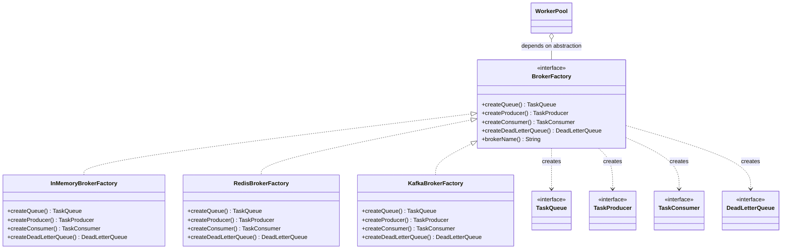

# Abstract Factory

> Where this fits in the project: in **Phase 4**, our Task Queue platform must run on top of *pluggable brokers* — Kafka in production, Redis in staging, an in-memory broker in tests. Each broker needs a **whole family** of cooperating components (a `TaskQueue`, a producer, a consumer, and a `DeadLetterQueue`) that must all come from the *same* broker. Abstract Factory is the pattern that lets us swap an entire family with a one-line config change while guaranteeing the parts are compatible.

This chapter builds directly on [Factory Method](./factory-method.md). Factory Method creates *one* product through a single overridable method. Abstract Factory creates a *family of products* through an object whose whole job is to manufacture the family. If Factory Method is "one method that makes one thing," Abstract Factory is "a factory of factories" — an object exposing several creation methods that are guaranteed to produce a mutually consistent set.

---

## 1. Why This Exists

In Phase 1 our broker was trivial: a single `InMemoryTaskQueue` backed by a `BlockingQueue`. There was nothing to choose. By Phase 4 the architecture is:

```text
Client -> API Layer -> Persistent Queue -> Distributed Workers -> Event Bus -> Monitoring -> Horizontal Scaling
```

The "Persistent Queue" is no longer one class. Depending on environment we want:

| Environment | Queue | Producer | Consumer | DLQ |
|-------------|-------|----------|----------|-----|
| Production | Kafka topic | `KafkaProducer` | `KafkaConsumer` (group) | Kafka DLQ topic |
| Staging / dev | Redis list | Redis `LPUSH` | Redis `BRPOP` | Redis DLQ list |
| Unit tests | `BlockingQueue` | direct add | direct take | in-memory list |

The components within a row are **not interchangeable across rows**. A `KafkaConsumer` cannot read from a Redis list. A Redis DLQ cannot accept the offset metadata a Kafka consumer wants to record. The parts form a *family* that only works when all four come from the same broker.

> The real problem: **how do we let the rest of the system create a consistent set of broker components without hard-coding which broker we use, and without ever accidentally mixing a Kafka consumer with a Redis queue?**

Historical note: the pattern was popularised by the Gang of Four (1994) with the example of a cross-platform UI toolkit — a `WidgetFactory` that produces a `Button`, `Checkbox`, and `ScrollBar` all styled for one OS (Motif vs Windows). The "family must match" constraint is identical to ours: you never want a Windows button next to a Motif scrollbar, just as you never want a Kafka consumer next to a Redis queue. The UI example is dated, but the constraint is exactly the broker problem.

---

## 2. The Naive Version

The first cut almost everyone writes is a giant `switch` (or a chain of `if`s) at every place that needs a component. Here is what it looks like once both Kafka and Redis exist.

```java
public enum BrokerType { IN_MEMORY, REDIS, KAFKA }

public class BrokerComponents {

    // Called from worker bootstrap.
    public static TaskQueue createQueue(BrokerType type, Config cfg) {
        return switch (type) {
            case IN_MEMORY -> new InMemoryTaskQueue();
            case REDIS     -> new RedisTaskQueue(cfg.redisUri(), cfg.queueKey());
            case KAFKA     -> new KafkaTaskQueue(cfg.bootstrapServers(), cfg.topic());
        };
    }

    // Called from the API layer that submits tasks.
    public static TaskProducer createProducer(BrokerType type, Config cfg) {
        return switch (type) {
            case IN_MEMORY -> new InMemoryTaskProducer();
            case REDIS     -> new RedisTaskProducer(cfg.redisUri(), cfg.queueKey());
            case KAFKA     -> new KafkaTaskProducer(cfg.bootstrapServers(), cfg.topic());
        };
    }

    // Called from the dead-letter handler.
    public static DeadLetterQueue createDlq(BrokerType type, Config cfg) {
        return switch (type) {
            case IN_MEMORY -> new InMemoryDeadLetterQueue();
            case REDIS     -> new RedisDeadLetterQueue(cfg.redisUri(), cfg.dlqKey());
            case KAFKA     -> new KafkaDeadLetterQueue(cfg.bootstrapServers(), cfg.dlqTopic());
        };
    }

    // ... and a fourth switch for consumers ...
}
```

It compiles, it works, and it rots. The limitations:

1. **The `BrokerType` switch is duplicated four times** — once per component. Adding RabbitMQ means editing four switches in lockstep. Miss one and you ship a half-RabbitMQ system.
2. **Nothing enforces family consistency.** Callers can write `createQueue(KAFKA, cfg)` in the API layer and `createConsumer(REDIS, cfg)` in the worker — two different enum values, no compile error, a runtime mystery where tasks vanish.
3. **The `BrokerType` parameter leaks everywhere.** Every call site needs the enum *and* the `Config`. The selection decision is smeared across the codebase instead of made once.
4. **Open/Closed violation.** Adding a broker forces edits to existing code in many places (see [SOLID](../04-oop-and-ood/solid.md)). Every switch is a place to forget a `case`.
5. **High coupling.** The API layer now knows the concrete types `RedisTaskProducer` and `KafkaTaskProducer`. See [coupling](../04-oop-and-ood/coupling.md) for why this hurts.

---

## 3. Intent, Motivation, Problem Statement, Participants

### Intent
> Provide an interface for creating **families of related or dependent objects** without specifying their concrete classes.

### Motivation
A subsystem needs several products that must be used together and must be consistent. We want to (a) decide the family once, at the edge of the system, and (b) let everything else depend only on abstractions. The factory object *is* the encapsulation of "which family."

### Problem Statement (our project)
Create a `TaskQueue`, `TaskProducer`, `TaskConsumer`, and `DeadLetterQueue` that all belong to the same broker, selected once at startup, with no call site needing to know the concrete broker — and with a compile-time guarantee that all four parts match.

### Participants

| GoF role | In our project | Responsibility |
|----------|----------------|----------------|
| `AbstractFactory` | `BrokerFactory` | Declares creation methods for each product in the family. |
| `ConcreteFactory` | `KafkaBrokerFactory`, `RedisBrokerFactory`, `InMemoryBrokerFactory` | Implements creation methods to produce one consistent family. |
| `AbstractProductA..D` | `TaskQueue`, `TaskProducer`, `TaskConsumer`, `DeadLetterQueue` | The product interfaces the rest of the code depends on. |
| `ConcreteProductA..D` | `KafkaTaskQueue`, `RedisTaskProducer`, ... | The broker-specific implementations. |
| `Client` | `WorkerPool`, `TaskController` | Uses only the abstract factory and abstract products. |

---

## 4. UML Class Diagram



The dashed arrows (`..>`) are *dependency / "creates"* relationships: the factory manufactures the products but does not own them for life. The `o--` (aggregation) shows `WorkerPool` holds a `BrokerFactory` reference but the factory can outlive or be shared.

---

## 5. Refactor the Naive Code Into the Pattern

First, the product interfaces (the canonical model, with the two new family members for Phase 4):

```java
import java.time.Instant;
import java.util.Optional;

public enum TaskStatus { PENDING, SCHEDULED, RUNNING, SUCCEEDED, FAILED, RETRYING, DEAD }

public record Task(
        String id, String type, String payload, TaskStatus status,
        int attempts, int maxAttempts, Instant createdAt, Instant scheduledAt, int priority) { }

// Existing canonical interfaces (abbreviated).
public interface TaskQueue {
    void enqueue(Task t);
    Task dequeue() throws InterruptedException;
    int size();
}

public interface DeadLetterQueue {
    void send(Task t, String reason);
}

// New Phase-4 family members. A producer writes tasks to the broker;
// a consumer pulls them with an ack handle so we can commit/redeliver.
public interface TaskProducer extends AutoCloseable {
    void publish(Task t);
    @Override void close();
}

public interface TaskConsumer extends AutoCloseable {
    /** Blocks for a record; ack() commits it, nack() requests redelivery. */
    Optional<Delivery> poll(java.time.Duration timeout) throws InterruptedException;
    @Override void close();
}

public interface Delivery {
    Task task();
    void ack();
    void nack();
}
```

Now the **abstract factory** — the single interface that defines the family:

```java
/** Manufactures a consistent family of components for ONE broker. */
public interface BrokerFactory {
    TaskQueue createQueue();
    TaskProducer createProducer();
    TaskConsumer createConsumer();
    DeadLetterQueue createDeadLetterQueue();
    String brokerName();
}
```

Each concrete factory produces exactly one broker's family. Because all four creation methods live in one class, *they cannot disagree about the broker.*

```java
import java.time.Duration;
import java.util.Optional;
import java.util.concurrent.LinkedBlockingQueue;
import java.util.concurrent.BlockingQueue;

/** Test/dev family: everything shares one in-process BlockingQueue. */
public final class InMemoryBrokerFactory implements BrokerFactory {

    // The whole family shares this — that is the consistency guarantee.
    private final BlockingQueue<Task> queue = new LinkedBlockingQueue<>();
    private final BlockingQueue<Task> dlq   = new LinkedBlockingQueue<>();

    @Override public TaskQueue createQueue() {
        return new InMemoryTaskQueue(queue);
    }
    @Override public TaskProducer createProducer() {
        return new InMemoryTaskProducer(queue);
    }
    @Override public TaskConsumer createConsumer() {
        return new InMemoryTaskConsumer(queue);
    }
    @Override public DeadLetterQueue createDeadLetterQueue() {
        return (t, reason) -> dlq.add(t);
    }
    @Override public String brokerName() { return "in-memory"; }
}
```

```java
/** Production family: Kafka. All parts share the same bootstrap/topic config. */
public final class KafkaBrokerFactory implements BrokerFactory {

    private final KafkaConfig cfg; // bootstrapServers, topic, dlqTopic, groupId

    public KafkaBrokerFactory(KafkaConfig cfg) { this.cfg = cfg; }

    @Override public TaskQueue createQueue() {
        return new KafkaTaskQueue(cfg.bootstrapServers(), cfg.topic());
    }
    @Override public TaskProducer createProducer() {
        return new KafkaTaskProducer(cfg.bootstrapServers(), cfg.topic());
    }
    @Override public TaskConsumer createConsumer() {
        return new KafkaTaskConsumer(cfg.bootstrapServers(), cfg.topic(), cfg.groupId());
    }
    @Override public DeadLetterQueue createDeadLetterQueue() {
        return new KafkaDeadLetterQueue(cfg.bootstrapServers(), cfg.dlqTopic());
    }
    @Override public String brokerName() { return "kafka"; }
}
```

The **selection** — the one and only `switch`, made once at startup:

```java
public enum BrokerType { IN_MEMORY, REDIS, KAFKA }

public final class BrokerFactories {
    private BrokerFactories() {}

    /** The single place where broker selection lives. */
    public static BrokerFactory of(BrokerType type, AppConfig cfg) {
        return switch (type) {
            case IN_MEMORY -> new InMemoryBrokerFactory();
            case REDIS     -> new RedisBrokerFactory(cfg.redis());
            case KAFKA     -> new KafkaBrokerFactory(cfg.kafka());
        };
    }
}
```

Every other component now depends only on `BrokerFactory`:

```java
public final class WorkerPool {
    private final BrokerFactory broker;
    private final TaskConsumer consumer;
    private final DeadLetterQueue dlq;

    public WorkerPool(BrokerFactory broker) {
        this.broker   = broker;
        this.consumer = broker.createConsumer();       // matched...
        this.dlq      = broker.createDeadLetterQueue(); // ...by construction
    }
    // start() / shutdown() omitted
}
```

There is now **no way** to pair a Kafka consumer with a Redis queue: a single `BrokerFactory` instance only knows how to make its own family.

---

## 6. Before and After

| Aspect | Naive (4 switches) | Abstract Factory |
|--------|--------------------|------------------|
| Where broker is chosen | Every call site | One method (`BrokerFactories.of`) |
| Adding RabbitMQ | Edit 4 switches | Add 1 class, add 1 `case` |
| Family consistency | None (runtime risk) | Guaranteed by construction |
| Call-site coupling | Knows concrete types + enum | Knows only `BrokerFactory` |
| Open/Closed | Violated repeatedly | Honoured (closed for modification) |
| Testability | Pass `IN_MEMORY` enum everywhere | Inject `InMemoryBrokerFactory` once |

Before, the *knowledge of which broker* was a value (`BrokerType`) passed around. After, it is an *object* (`BrokerFactory`) injected once. Turning a recurring decision into a single injected object is the heart of the pattern.

---

## 7. A Simple Java Example (warm-up)

Strip away the broker domain. A GUI theme produces a matching `Button` and `Checkbox`:

```java
interface Button   { String render(); }
interface Checkbox { String render(); }

interface ThemeFactory {            // <-- Abstract Factory
    Button createButton();
    Checkbox createCheckbox();
}

final class DarkButton   implements Button   { public String render() { return "[dark button]"; } }
final class DarkCheckbox implements Checkbox { public String render() { return "[dark checkbox]"; } }

final class DarkThemeFactory implements ThemeFactory {   // ConcreteFactory
    public Button   createButton()   { return new DarkButton(); }
    public Checkbox createCheckbox() { return new DarkCheckbox(); }
}

final class LightButton   implements Button   { public String render() { return "(light button)"; } }
final class LightCheckbox implements Checkbox { public String render() { return "(light checkbox)"; } }

final class LightThemeFactory implements ThemeFactory {
    public Button   createButton()   { return new LightButton(); }
    public Checkbox createCheckbox() { return new LightCheckbox(); }
}

// Client never names DarkButton/LightCheckbox — it gets a matched pair.
final class Dialog {
    private final Button button;
    private final Checkbox checkbox;
    Dialog(ThemeFactory factory) {
        this.button   = factory.createButton();
        this.checkbox = factory.createCheckbox();
    }
    String paint() { return button.render() + " " + checkbox.render(); }
}
```

```java
public static void main(String[] args) {
    ThemeFactory factory = args.length > 0 && args[0].equals("dark")
            ? new DarkThemeFactory() : new LightThemeFactory();
    System.out.println(new Dialog(factory).paint());
    // "dark"  -> [dark button] [dark checkbox]
    // default -> (light button) (light checkbox)
}
```

Notice you *cannot* end up with a dark button and a light checkbox: one factory gives one consistent family.

---

## 8. A Real-World Java Example You Already Use

You have used Abstract Factory without naming it. `javax.xml.parsers.DocumentBuilderFactory` is one: `newInstance()` resolves a *concrete* factory (Xerces, etc.) and `newDocumentBuilder()` produces parser products from that family. The JDK's `java.nio.charset.spi.CharsetProvider`, JDBC's `DataSource`, and the SLF4J `LoggerFactory`/binding mechanism all use the same shape.

A focused JDK-flavoured example: a `DbFactory` family abstraction (the shape JDBC's `DataSource` follows).

```java
import java.sql.Connection;

interface PreparedQuery   { String sql(); }
interface ConnectionPool  { Connection borrow(); void release(Connection c); }

/** One factory per database vendor; both products speak the same dialect. */
interface DbFactory {
    ConnectionPool createPool();
    PreparedQuery  createUpsertQuery();   // dialect-specific SQL
}

final class PostgresFactory implements DbFactory {
    public ConnectionPool createPool() { return new HikariBackedPool("jdbc:postgresql://..."); }
    public PreparedQuery  createUpsertQuery() {
        return () -> "INSERT INTO tasks (...) VALUES (...) ON CONFLICT (id) DO UPDATE SET ...";
    }
}

final class MySqlFactory implements DbFactory {
    public ConnectionPool createPool() { return new HikariBackedPool("jdbc:mysql://..."); }
    public PreparedQuery  createUpsertQuery() {
        return () -> "INSERT INTO tasks (...) VALUES (...) ON DUPLICATE KEY UPDATE ...";
    }
}
```

The pool and the SQL dialect must match the vendor — Postgres `ON CONFLICT` syntax would fail on MySQL. The factory keeps the pair consistent.

---

## 9. The Project-Integration Example (full, compilable slice)

Here is an end-to-end slice using only the canonical model. The in-memory family is fully implemented so it compiles and runs; the Redis/Kafka factories are sketched with the same interface so the structure is clear.

```java
import java.time.Duration;
import java.time.Instant;
import java.util.Optional;
import java.util.UUID;
import java.util.concurrent.BlockingQueue;
import java.util.concurrent.LinkedBlockingQueue;
import java.util.concurrent.TimeUnit;

// ---------- Product implementations (in-memory family) ----------

final class InMemoryTaskQueue implements TaskQueue {
    private final BlockingQueue<Task> q;
    InMemoryTaskQueue(BlockingQueue<Task> q) { this.q = q; }
    public void enqueue(Task t)        { q.add(t); }
    public Task dequeue() throws InterruptedException { return q.take(); }
    public int  size()                 { return q.size(); }
}

final class InMemoryTaskProducer implements TaskProducer {
    private final BlockingQueue<Task> q;
    InMemoryTaskProducer(BlockingQueue<Task> q) { this.q = q; }
    public void publish(Task t) { q.add(t); }
    public void close()         { /* nothing to release */ }
}

final class InMemoryTaskConsumer implements TaskConsumer {
    private final BlockingQueue<Task> q;
    InMemoryTaskConsumer(BlockingQueue<Task> q) { this.q = q; }

    public Optional<Delivery> poll(Duration timeout) throws InterruptedException {
        Task t = q.poll(timeout.toMillis(), TimeUnit.MILLISECONDS);
        if (t == null) return Optional.empty();
        return Optional.of(new Delivery() {
            public Task task() { return t; }
            public void ack()  { /* in-memory: poll() already removed it */ }
            public void nack() { q.add(t); } // redeliver by re-queuing
        });
    }
    public void close() { }
}

// ---------- Abstract Factory wiring (from section 5) ----------
// BrokerFactory, InMemoryBrokerFactory, KafkaBrokerFactory, BrokerFactories — as above.

// ---------- Client: a worker built purely on abstractions ----------

final class BrokerWorker implements Runnable {
    private final TaskConsumer consumer;
    private final DeadLetterQueue dlq;
    private final TaskHandlerRegistry handlers;
    private volatile boolean running = true;

    BrokerWorker(BrokerFactory broker, TaskHandlerRegistry handlers) {
        this.consumer = broker.createConsumer();          // family member 1
        this.dlq      = broker.createDeadLetterQueue();   // family member 2 (matched)
        this.handlers = handlers;
    }

    public void run() {
        while (running) {
            try {
                Optional<Delivery> d = consumer.poll(Duration.ofSeconds(1));
                if (d.isEmpty()) continue;
                Delivery delivery = d.get();
                Task task = delivery.task();
                try {
                    TaskResult r = handlers.lookup(task.type()).handle(task);
                    if (r.success())        delivery.ack();
                    else if (r.retryable()) delivery.nack();
                    else { dlq.send(task, r.message()); delivery.ack(); }
                } catch (Exception e) {
                    dlq.send(task, "handler threw: " + e.getMessage());
                    delivery.ack();
                }
            } catch (InterruptedException e) {
                Thread.currentThread().interrupt();
                running = false;
            }
        }
        consumer.close();
    }
    void stop() { running = false; }
}
```

Bootstrap — broker chosen once, family flows everywhere:

```java
public final class Phase4Bootstrap {
    public static void main(String[] args) {
        AppConfig cfg = AppConfig.load();              // reads broker.type=kafka|redis|in-memory
        BrokerFactory broker = BrokerFactories.of(cfg.brokerType(), cfg);

        // The API layer produces; the workers consume. Same family by construction.
        TaskProducer producer = broker.createProducer();
        var registry = TaskHandlerRegistry.defaults();

        Thread worker = Thread.ofVirtual().start(new BrokerWorker(broker, registry));

        producer.publish(new Task(
                UUID.randomUUID().toString(), "email", "{\"to\":\"a@b.com\"}",
                TaskStatus.PENDING, 0, 3, Instant.now(), Instant.now(), 5));

        System.out.println("Running on broker: " + broker.brokerName());
    }
}
```

Switching from in-memory tests to Kafka production is a single config value (`broker.type`). No call site changes. That is the payoff.

> Cross-link: the family members lean on concepts elsewhere — the in-memory queue is a [blocking queue](../06-concurrency/blocking-queue.md), and the DLQ semantics come from the [message queues](../07-queues-and-messaging/message-queues.md) chapter. The factory is injected, which is dependency injection in practice — see [dependency injection](../04-oop-and-ood/dependency-injection.md).

---

## 10. Tradeoffs

| Dimension | Benefit | Cost |
|-----------|---------|------|
| Consistency | Family members guaranteed compatible | Must add *every* product to the interface |
| Selection | Decided once, injected | Indirection: harder to "see" the concrete type while debugging |
| Open/Closed | New broker = new class | New *product type* = edit every factory (the rigid axis) |
| Coupling | Clients depend on abstractions only | More interfaces/classes (4 products x N brokers) |
| Testing | Trivial in-memory family | Easy to over-engineer when N=1 broker |

The pattern has **two axes** and trades them against each other:

- Adding a **new family** (broker) is cheap — add one `ConcreteFactory`. This is the axis Abstract Factory optimises.
- Adding a **new product** to the family (say, a `MetricsExporter` per broker) is expensive — you must touch the `BrokerFactory` interface *and every* concrete factory. This is the rigid axis.

Choose Abstract Factory when families change more often than the set of products. For brokers that is exactly true: we add brokers occasionally, but the four-part shape (queue/producer/consumer/DLQ) is stable.

### Abstract Factory vs Factory Method vs simple factory

| | Simple factory (`switch`) | [Factory Method](./factory-method.md) | Abstract Factory |
|--|---------------------------|---------------|------------------|
| Creates | One product | One product | A *family* of products |
| Mechanism | Static method + switch | Overridable method on a class | Object with several create methods |
| Family consistency | Not enforced | N/A (single product) | Enforced |
| When | Trivial, one kind | One varying product per subclass | Several products that must match |

A single `BrokerFactory.createQueue()` *is* a factory method; Abstract Factory is what you get when you group several related factory methods into one cohesive object.

---

## 11. Common Mistakes and Pitfalls

- **Returning concrete types from create methods.** `KafkaTaskQueue createQueue()` leaks the concrete type and re-couples clients. Return the interface (`TaskQueue`). Fix: declare every method's return as the product interface.
- **Letting `BrokerType` leak past `BrokerFactories.of`.** If any other class still takes a `BrokerType`, you have not centralised selection. Fix: only the factory selector sees the enum.
- **Sharing nothing when the family must share.** The in-memory family *must* share one `BlockingQueue` or the producer and consumer talk past each other. Fix: hold shared state in the concrete factory's fields (as we do).
- **Stateless factory that creates expensive resources twice.** Calling `createProducer()` repeatedly opening a new Kafka client each time exhausts connections. Fix: memoize within the factory if products are meant to be singletons, or document that callers must reuse.
- **Adding a product to the interface "just in case."** Every speculative method must be implemented by all N factories. Fix: apply YAGNI — only add products the system actually creates.
- **Confusing it with Builder.** Builder assembles *one* complex object step by step; Abstract Factory creates *several* simple objects in one shot. Different problems.
- **Forgetting `AutoCloseable`.** Broker producers/consumers hold sockets. If the factory creates them, decide who closes them. Fix: make products `AutoCloseable` and close in the owning client (as `BrokerWorker` does).

---

## 12. Refactoring Exercise (bad -> improved -> production)

**Bad** — selection logic duplicated, concrete types everywhere:

```java
class SubmitService {
    void submit(Task t, String broker) {
        TaskProducer p;
        if (broker.equals("kafka"))      p = new KafkaTaskProducer("k:9092", "tasks");
        else if (broker.equals("redis")) p = new RedisTaskProducer("redis://r:6379", "tasks");
        else                             p = new InMemoryTaskProducer(SharedQueues.MEM);
        p.publish(t);
    }
}
```

Problems: string-typed selection, concrete classes named in a business service, repeated in every service that touches the broker.

**Improved** — inject a `BrokerFactory`, selection done elsewhere:

```java
class SubmitService {
    private final TaskProducer producer;
    SubmitService(BrokerFactory broker) { this.producer = broker.createProducer(); }
    void submit(Task t) { producer.publish(t); }
}
```

Selection moves to the composition root:

```java
BrokerFactory broker = BrokerFactories.of(cfg.brokerType(), cfg);
var submit = new SubmitService(broker);
```

**Production-quality** — register factories so adding a broker needs zero edits to the selector, and make products reusable:

```java
import java.util.Map;
import java.util.function.Function;

public final class BrokerRegistry {
    private final Map<String, Function<AppConfig, BrokerFactory>> builders;

    private BrokerRegistry(Map<String, Function<AppConfig, BrokerFactory>> b) { this.builders = b; }

    public static BrokerRegistry standard() {
        return new BrokerRegistry(Map.of(
            "in-memory", c -> new InMemoryBrokerFactory(),
            "redis",     c -> new RedisBrokerFactory(c.redis()),
            "kafka",     c -> new KafkaBrokerFactory(c.kafka())
        ));
    }

    public BrokerFactory create(String name, AppConfig cfg) {
        var builder = builders.get(name);
        if (builder == null)
            throw new IllegalArgumentException("Unknown broker: " + name
                + " (known: " + builders.keySet() + ")");
        return builder.apply(cfg);
    }
}
```

Now `BrokerFactories.of`'s `switch` is gone; new brokers are registered, not switched. In Spring Boot this is exactly what a `Map<String, BrokerFactory>` injected from beans gives you for free — adding a broker is adding a `@Component`. The production version turns the *factory of factories* into a *registry of factories*: the natural endpoint of this pattern.

---

## 13. Exercises

### Easy

**E1 (knowledge-check).** In one sentence, what does Abstract Factory guarantee that four independent factory methods (in four classes) do not?

**E2 (pattern identification).** Which of these is Abstract Factory, which is Factory Method, which is neither?
```java
// A
TaskQueue q = TaskQueueFactory.create(BrokerType.KAFKA);
// B
abstract class Worker { abstract TaskHandler newHandler(); }
// C
interface BrokerFactory { TaskQueue createQueue(); TaskProducer createProducer(); }
```

**E3 (coding).** Implement a `NoOpBrokerFactory` whose products discard everything (useful for load tests that exercise only the API layer), and have its `brokerName()` return `"no-op"`.

### Medium

**M1 (coding).** Add a fifth product, `MetricsExporter` (with `void record(Task t, TaskStatus outcome)`), to the family. Implement it for the in-memory factory using a `Map<TaskStatus, AtomicLong>`. Note in a comment how many files you had to touch and why.

**M2 (refactoring).** Take the `BrokerComponents` naive class from section 2 and refactor it into the registry-based design from section 12. Keep all three brokers.

**M3 (design).** The in-memory family shares one `BlockingQueue`, so `createQueue()` and `createConsumer()` see the same data. The Kafka family does *not* share an object — each call opens its own client. Explain why both are still "consistent families" and what "consistency" means in each case.

### Hard

**H1 (interview-style).** Your platform must support a broker that has **no native DLQ** (e.g. a plain Redis list). How do you keep the `BrokerFactory` interface honest without forcing every broker to implement a real DLQ? Discuss at least two options and their tradeoffs.

**H2 (stretch).** Implement a `CompositeBrokerFactory` that delegates `createProducer()` to one broker (Kafka, for durability) but `createConsumer()` to another (in-memory, for a local cache replay). Is this still Abstract Factory? When is mixing families legitimate and when is it a bug?

**H3 (design).** Design how Abstract Factory composes with [Singleton](./singleton.md): you want exactly one `BrokerFactory` per JVM but the products (`TaskProducer`) shared as singletons too. Sketch the wiring and name the hazard if you get the scoping wrong.

---

## 14. Solutions

**E1.** That all created products belong to the **same** family/broker and are therefore mutually compatible — independent factories can be invoked with inconsistent selections (Kafka queue + Redis consumer); a single Abstract Factory instance physically cannot.

**E2.** A = simple/static factory (one product via a `switch`, not overridable, no family). B = Factory Method (`newHandler` is an overridable creation method for one product). C = Abstract Factory (one object, multiple related-product create methods).

**E3.**
```java
public final class NoOpBrokerFactory implements BrokerFactory {
    public TaskQueue createQueue() {
        return new TaskQueue() {
            public void enqueue(Task t) { }
            public Task dequeue() { throw new UnsupportedOperationException("no-op"); }
            public int  size()    { return 0; }
        };
    }
    public TaskProducer createProducer() {
        return new TaskProducer() {
            public void publish(Task t) { } // discard
            public void close() { }
        };
    }
    public TaskConsumer createConsumer() {
        return new TaskConsumer() {
            public java.util.Optional<Delivery> poll(java.time.Duration t) { return java.util.Optional.empty(); }
            public void close() { }
        };
    }
    public DeadLetterQueue createDeadLetterQueue() { return (t, reason) -> { }; }
    public String brokerName() { return "no-op"; }
}
```
Useful because the API layer can be benchmarked without any broker I/O, and nothing else in the codebase changes — you just inject this factory.

**M1.**
```java
public interface MetricsExporter { void record(Task t, TaskStatus outcome); }

// Added to the abstract factory:
//   MetricsExporter createMetricsExporter();

import java.util.EnumMap;
import java.util.Map;
import java.util.concurrent.atomic.AtomicLong;

final class InMemoryMetricsExporter implements MetricsExporter {
    private final Map<TaskStatus, AtomicLong> counts = new EnumMap<>(TaskStatus.class);
    InMemoryMetricsExporter() {
        for (TaskStatus s : TaskStatus.values()) counts.put(s, new AtomicLong());
    }
    public void record(Task t, TaskStatus outcome) { counts.get(outcome).incrementAndGet(); }
    public long get(TaskStatus s) { return counts.get(s).get(); }
}
```
Files touched: the `BrokerFactory` interface **plus all N concrete factories** (each must implement `createMetricsExporter`). That is the rigid axis from section 10 in action — adding a *product* is O(N factories), which is exactly why you only add products the system genuinely needs.

**M2.** Replace the four `switch` methods with a single selector that returns a `BrokerFactory`, then expose family members from the returned factory:
```java
public final class BrokerComponents {
    private final BrokerFactory factory;
    public BrokerComponents(String broker, AppConfig cfg) {
        this.factory = BrokerRegistry.standard().create(broker, cfg);
    }
    public TaskQueue       queue()    { return factory.createQueue(); }
    public TaskProducer    producer() { return factory.createProducer(); }
    public DeadLetterQueue dlq()      { return factory.createDeadLetterQueue(); }
}
```
The duplicated four-way switch collapses to one registry lookup; adding a broker no longer edits this class.

**M3.** "Consistent family" means *all products speak to the same broker instance and protocol*, not that they literally share a Java object. In-memory achieves consistency by **sharing one `BlockingQueue` reference** — the producer's `add` is the consumer's `poll`. Kafka achieves consistency by **sharing the same `bootstrapServers`/`topic` configuration** — separate client objects, but they read/write the identical Kafka topic. Both guarantee producer output reaches consumer input; the *mechanism* differs (shared object vs shared external resource), and the factory is the right place to encapsulate either mechanism.

**H1.** Options:
1. **Default method in the interface** providing an emulated DLQ (e.g. a second Redis list with a `:dlq` suffix). Pro: every broker gets a working DLQ; con: the emulation may have weaker delivery guarantees than callers assume — document it.
2. **Capability interface** — change the signature to `Optional<DeadLetterQueue> createDeadLetterQueue()` returning empty when unsupported, and have the worker fall back to logging+drop. Pro: honest about capability; con: pushes a branch onto every caller (an `Optional` leak through the family).
3. **Compose** an emulated DLQ on top of the producer (write dead tasks back to a dedicated topic/list via the same producer). Pro: reuses the family's own producer, stays consistent; con: couples DLQ to producer lifecycle.
Recommended: option 1 (emulated default) for Redis since a suffixed list is a real, durable DLQ — the abstraction stays honest because the emulation actually works. Reserve option 2 for brokers where *no* honest emulation exists.

**H2.**
```java
public final class CompositeBrokerFactory implements BrokerFactory {
    private final BrokerFactory producerSide; // e.g. Kafka
    private final BrokerFactory consumerSide; // e.g. in-memory
    public CompositeBrokerFactory(BrokerFactory p, BrokerFactory c) { producerSide = p; consumerSide = c; }
    public TaskQueue createQueue()             { return producerSide.createQueue(); }
    public TaskProducer createProducer()       { return producerSide.createProducer(); }
    public TaskConsumer createConsumer()       { return consumerSide.createConsumer(); }
    public DeadLetterQueue createDeadLetterQueue() { return producerSide.createDeadLetterQueue(); }
    public String brokerName() { return producerSide.brokerName() + "+" + consumerSide.brokerName(); }
}
```
It is *structurally* still Abstract Factory (one object, family of create methods), but it **deliberately breaks the family-consistency invariant** — the producer writes to Kafka while the consumer reads in-memory, so they do **not** talk to each other. That is a bug for a normal worker pipeline. It is legitimate only when the two sides are intentionally decoupled (e.g. producer is a durable audit log, consumer feeds a separate local replay tool). The lesson: the pattern enforces *structure*, not *semantics* — you can hand-build an inconsistent family, so treat `CompositeBrokerFactory` as a sharp tool to be used only with explicit justification.

**H3.**
```java
public enum BrokerProvider {
    INSTANCE;
    private volatile BrokerFactory factory;
    private volatile TaskProducer sharedProducer;

    public synchronized void init(BrokerFactory f) {
        if (factory != null) throw new IllegalStateException("already initialised");
        this.factory = f;
        this.sharedProducer = f.createProducer(); // one producer per JVM
    }
    public BrokerFactory factory()  { return factory; }
    public TaskProducer producer()  { return sharedProducer; }
}
```
Wiring: one `BrokerFactory` is created at startup and stored as a singleton; the heavyweight `TaskProducer` (sockets, batching threads) is created once and shared. **Hazard:** if you instead call `factory.createProducer()` per request, each opens a new Kafka client — you exhaust file descriptors and thread pools under load. The scoping rule: the *factory* is a singleton, and *connection-holding products* should be singleton-scoped too, while cheap value-like products can be created per use. See [Singleton](./singleton.md) for the thread-safety mechanics of the holder.

---

## 15. Interview Questions and Takeaways

1. **Q: Abstract Factory vs Factory Method?**
   A: Factory Method = one overridable method creating one product, varied by subclassing. Abstract Factory = an object exposing several create methods that produce a consistent *family*. Abstract Factory is often built from several factory methods.

2. **Q: What invariant does Abstract Factory protect?**
   A: Family consistency — every product from one factory instance belongs to the same family and is mutually compatible. You can't accidentally mix a Kafka consumer with a Redis queue.

3. **Q: What is the pattern's weakness?**
   A: Adding a new *product type* to the family forces edits to the interface and every concrete factory (O(N)). It optimises adding families, not adding products.

4. **Q: How does it relate to dependency injection?**
   A: The abstract factory is the canonical thing you inject. The composition root picks the concrete factory once; everything else depends on the interface. DI containers (Spring) often replace the manual `switch` with a bean lookup.

5. **Q: When would you NOT use it?**
   A: When there is only one family and no foreseeable second — a single `switch`/simple factory is enough (YAGNI). Also avoid it if the products don't actually need to be consistent; then independent factories are simpler.

6. **Q: Give a JDK example.**
   A: `DocumentBuilderFactory` / `SAXParserFactory`, JDBC `DataSource`, `javax.xml.transform.TransformerFactory` — all resolve a concrete factory and produce a family of parser/connection products.

7. **Q: How do you avoid the giant switch in the selector itself?**
   A: A registry: `Map<String, Function<Config, BrokerFactory>>`, or in Spring a `Map<String, BrokerFactory>` of beans. New broker = new entry/bean, no edit to the selector.

8. **Q: How do you test code that uses an abstract factory?**
   A: Inject an in-memory concrete factory whose family shares process-local state. No mocks needed; the family runs for real, fast, and deterministically.

---

## Production Considerations

- **Resource lifecycle.** Broker producers/consumers hold sockets and background threads. Decide ownership: the factory *creates*, the client *closes*. Leaking these is the #1 production failure with this pattern — a worker that recreates a Kafka producer per task will exhaust connections within minutes.
- **Config validation at startup.** `BrokerFactories.of` / the registry is the right place to fail fast on a missing `bootstrapServers` or an unknown broker name. A clear `IllegalArgumentException` at boot beats a `NullPointerException` deep in a worker at 3 a.m.
- **Observability.** Surface `broker.brokerName()` in a startup log line and as a Micrometer gauge/tag so dashboards show which broker each node is running. Mismatched brokers across a fleet (half Kafka, half Redis after a bad rollout) become visible immediately.
- **Where it's used in industry.** Spring's `ConnectionFactory` abstractions (JMS/AMQP), the JDK XML/JDBC factories, cloud SDK client builders that produce matched client/credential/retry objects, and feature-flag-driven broker swaps. The pattern is standard wherever a pluggable backend has more than one cooperating component.
- **When NOT to use it / anti-patterns.** Single fixed broker forever -> use a simple factory. "Abstract factory of one" with speculative product methods nobody implements -> YAGNI violation. A factory whose create methods quietly return *different* families (the `CompositeBrokerFactory` hazard) used by accident -> silent data loss. Returning concrete product types -> defeats the whole point.

---

## What We Can Improve In Our Project Using This Concept

Today (through Phase 3) the broker is effectively hard-wired to `InMemoryTaskQueue` plus ad-hoc `DeadLetterQueue` wiring. By introducing `BrokerFactory` we:
- Make the Phase 4 broker swap (Kafka / Redis / in-memory) a single config value.
- Guarantee the queue, producer, consumer, and DLQ on every node belong to the same broker.
- Remove all `BrokerType` switches from business code, centralising selection in one registry.
- Make every integration test run on a fast, real, in-memory family with zero mocks.

## Project Refactoring Task

1. Introduce `BrokerFactory` and the `TaskProducer` / `TaskConsumer` / `Delivery` product interfaces.
2. Implement `InMemoryBrokerFactory` (shared `BlockingQueue`) and stub `RedisBrokerFactory` / `KafkaBrokerFactory`.
3. Add `BrokerRegistry.standard()` and route all broker creation through it; delete every other `switch (BrokerType)`.
4. Refactor `WorkerPool` / `BrokerWorker` and the submit path to depend only on `BrokerFactory`.
5. Add a startup log + Micrometer tag for `brokerName()`. Add tests that run the full submit->consume->DLQ flow on the in-memory family.

## Git Commit For This Chapter

```bash
git commit -m "feat(broker): add BrokerFactory abstract factory for pluggable broker families

Introduce BrokerFactory (queue/producer/consumer/DLQ) with In-Memory,
Redis, and Kafka concrete factories selected via BrokerRegistry. Route
all broker component creation through the registry and depend only on
abstractions in WorkerPool and the submit path."
```
Files touched: `BrokerFactory.java`, `InMemoryBrokerFactory.java`, `RedisBrokerFactory.java`, `KafkaBrokerFactory.java`, `BrokerRegistry.java`, `TaskProducer.java`, `TaskConsumer.java`, `Delivery.java`, `WorkerPool.java`, `BrokerWorker.java`, `SubmitService.java`, and `BrokerFactoryTest.java`.

## Architecture Impact

The composition root gains a single, well-defined broker-selection seam. Business and worker code lose all knowledge of concrete brokers, so horizontal scaling and broker migration become configuration concerns, not code changes. The four-part broker family becomes a stable contract that future brokers must satisfy — which both constrains and documents what "a broker" means in this platform. The rigid axis (adding a new product to the family) is now an explicit, reviewable change touching every factory, making such additions deliberate.

## Interview Takeaways

- Abstract Factory creates a **family** of related products and guarantees they match; Factory Method creates one product.
- It optimises adding **families** (cheap) at the cost of adding **products** (touches every factory).
- The concrete factory is the natural unit of dependency injection; the selection `switch` belongs in exactly one place (or a registry).
- In-memory concrete factories make integration tests fast and mock-free.
- Watch resource lifecycle: factories create connection-holding products; someone must close them, and they usually want singleton scope.
