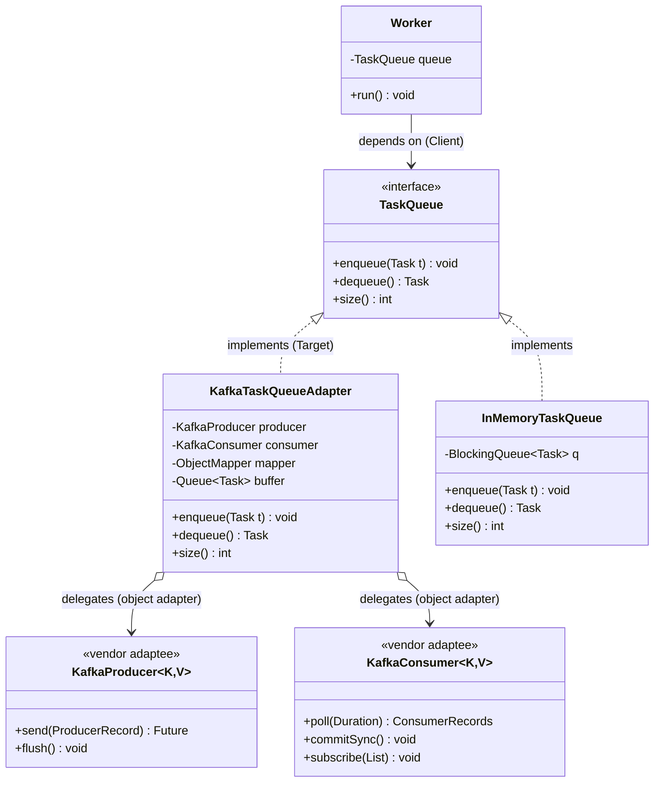
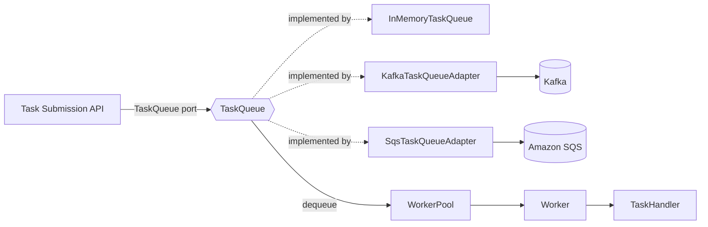

# Adapter

> Where this fits in the project: Adapter is the seam that lets our `TaskQueue` port stay broker-agnostic. When Phase 4 swaps the in-memory queue for Kafka, Redis Streams, or SQS, we do **not** rewrite `Worker`, `WorkerPool`, or the API layer. We write one small class — `KafkaTaskQueueAdapter` — that translates between our domain interface and the vendor SDK. This chapter builds that class and the discipline around it.

---

## 1. Why this exists — the real problem it solves

In Phase 1 our queue is a `BlockingQueue<Task>` wrapped in `InMemoryTaskQueue`. Everything downstream depends only on this tiny interface:

```java
public interface TaskQueue {
    void enqueue(Task t);
    Task dequeue() throws InterruptedException;
    int size();
}
```

`Worker`, `WorkerPool`, and the submission service speak `TaskQueue` and nothing else. That is the whole point of the port: the rest of the system does not know or care what is behind it.

Then Phase 4 arrives. We need durability, horizontal fan-out across machines, and ordering guarantees that a single-JVM `BlockingQueue` simply cannot provide. The decision is to put **Kafka** behind the queue. So we reach for the Kafka client:

```java
// Kafka's actual API — note it looks NOTHING like TaskQueue.
KafkaProducer<String, String> producer = new KafkaProducer<>(props);
producer.send(new ProducerRecord<>("tasks", task.id(), payloadJson));

KafkaConsumer<String, String> consumer = new KafkaConsumer<>(props);
consumer.subscribe(List.of("tasks"));
ConsumerRecords<String, String> records = consumer.poll(Duration.ofMillis(500));
for (ConsumerRecord<String, String> r : records) { /* ... */ }
```

The shapes do not match. Kafka has:

- `send(ProducerRecord)` instead of `enqueue(Task)` — and it serializes strings, not `Task` objects.
- `poll(Duration)` returning a **batch** instead of `dequeue()` returning **one** `Task` (with blocking semantics and offset bookkeeping).
- No `size()` at all — "queue depth" in Kafka is `latest offset − committed offset`, a computed thing.
- Its own threading model, its own exceptions (`WakeupException`, `SerializationException`), and a manual commit lifecycle.

We have a **type/shape mismatch** between an interface our system already owns (`TaskQueue`) and an interface a third party owns (`KafkaConsumer`/`KafkaProducer`) that we cannot change. The Adapter pattern is exactly the tool for closing that gap without leaking Kafka into the rest of the codebase.

> Historical note: the name comes from physical adapters — a three-prong-to-two-prong plug, a US-to-EU travel adapter. The wall socket (Kafka) and your laptop charger (`TaskQueue`) both work fine; they just can't connect directly. The adapter is a throwaway-cheap piece of glue that makes two correct-but-incompatible things interoperate. The Gang of Four formalized it in 1994 as one of the structural patterns.

---

## 2. The naive version — and its limitations

The naive move under deadline pressure: stop pretending Kafka is a `TaskQueue` and just sprinkle Kafka calls wherever a queue is used.

```java
// NAIVE: Kafka leaks into the worker. Do not do this.
public class Worker implements Runnable {
    private final KafkaConsumer<String, String> consumer; // <-- vendor type in our core
    private final KafkaProducer<String, String> producer;
    private final Map<String, TaskHandler> handlers;
    private final ObjectMapper mapper = new ObjectMapper();

    public Worker(KafkaConsumer<String, String> consumer,
                  KafkaProducer<String, String> producer,
                  Map<String, TaskHandler> handlers) {
        this.consumer = consumer;
        this.producer = producer;
        this.handlers = handlers;
    }

    @Override
    public void run() {
        consumer.subscribe(List.of("tasks"));
        while (!Thread.currentThread().isInterrupted()) {
            ConsumerRecords<String, String> records = consumer.poll(Duration.ofMillis(500));
            for (ConsumerRecord<String, String> rec : records) {
                try {
                    Task task = mapper.readValue(rec.value(), Task.class); // dedup logic, ugh
                    TaskHandler handler = handlers.get(task.type());
                    handler.handle(task);
                    consumer.commitSync(); // commit bookkeeping in the worker
                } catch (Exception e) {
                    // retry? produce to a retry topic? who knows, inline it
                    producer.send(new ProducerRecord<>("tasks", rec.key(), rec.value()));
                }
            }
        }
    }
}
```

What breaks:

- **Coupling explosion.** `Worker` now imports `org.apache.kafka.*`. So do its tests, which now need an embedded Kafka or Testcontainers to run at all. Phase 1's clean unit test is gone.
- **The port is dead.** `TaskQueue` still exists but nothing uses it. Every consumer of the queue must be rewritten if we ever move to SQS. We have re-coupled to a vendor — the exact thing the port was protecting us from.
- **Mixed concerns.** Serialization, offset commits, retry-topic routing, and business dispatch are tangled in one loop. None of it is independently testable.
- **Duplication.** Every place that touches the queue (the API submitter, the scheduler, the DLQ writer) repeats the Kafka boilerplate, each slightly differently.

The mismatch is real and won't go away. The question is only *where* we absorb it. The naive answer ("everywhere") is the worst one.

---

## 3. Pattern intent, motivation, problem statement, participants

**Intent (GoF).** Convert the interface of a class into another interface clients expect. Adapter lets classes work together that otherwise couldn't because of incompatible interfaces.

**Motivation.** We have a `TaskQueue` port our whole system depends on, and a `KafkaProducer`/`KafkaConsumer` we cannot modify (it's a library) that does the job but speaks a different language. We insert a translator so the client sees only `TaskQueue` while the work is done by Kafka.

**Problem statement.** Make an existing, unmodifiable class (the **Adaptee**) usable through an interface a client already depends on (the **Target**), without changing either the client or the adaptee.

**Participants.**

| Participant | In the GoF abstraction | In our project |
|---|---|---|
| **Target** | the interface the client expects | `TaskQueue` |
| **Client** | code that uses the Target | `Worker`, `WorkerPool`, submission service |
| **Adaptee** | the existing incompatible class | `KafkaProducer` / `KafkaConsumer` (the Kafka SDK) |
| **Adapter** | translates Target calls into Adaptee calls | `KafkaTaskQueueAdapter` |

Two structural flavors:

- **Object adapter** (composition): the adapter *holds a reference* to the adaptee and delegates. This is what Java idiomatically uses, because Java has single inheritance and you usually can't subclass a vendor's final client class anyway.
- **Class adapter** (inheritance): the adapter *extends* the adaptee and *implements* the target. Requires the language to allow it and the adaptee to be subclassable. Rare and often impossible in Java.

We'll build both and explain why the project ships the object form.

---

## 4. UML class diagram



The arrowheads matter: `Worker` depends on the **Target** abstraction only. The adapter *implements* the Target and *holds* (aggregation, hollow diamond) the vendor Adaptees. Nothing in core points at Kafka.

---

## 5. Refactor the naive code into the pattern

Step 1 — pull every Kafka call out of `Worker` and into one class that implements `TaskQueue`.

```java
import com.fasterxml.jackson.databind.ObjectMapper;
import org.apache.kafka.clients.consumer.ConsumerRecord;
import org.apache.kafka.clients.consumer.ConsumerRecords;
import org.apache.kafka.clients.consumer.KafkaConsumer;
import org.apache.kafka.clients.producer.KafkaProducer;
import org.apache.kafka.clients.producer.ProducerRecord;

import java.time.Duration;
import java.util.ArrayDeque;
import java.util.Deque;
import java.util.List;

/**
 * Object Adapter: implements our TaskQueue (Target) by delegating to the
 * Kafka client (Adaptee). All Kafka-isms are sealed inside this class.
 */
public final class KafkaTaskQueueAdapter implements TaskQueue {

    private final KafkaProducer<String, String> producer;
    private final KafkaConsumer<String, String> consumer;
    private final ObjectMapper mapper;
    private final String topic;
    private final Duration pollTimeout;

    // Bridges Kafka's "batch poll" to our "one task per dequeue" contract.
    private final Deque<Task> buffer = new ArrayDeque<>();

    public KafkaTaskQueueAdapter(KafkaProducer<String, String> producer,
                                 KafkaConsumer<String, String> consumer,
                                 ObjectMapper mapper,
                                 String topic,
                                 Duration pollTimeout) {
        this.producer = producer;
        this.consumer = consumer;
        this.mapper = mapper;
        this.topic = topic;
        this.pollTimeout = pollTimeout;
        this.consumer.subscribe(List.of(topic));
    }

    @Override
    public void enqueue(Task t) {
        try {
            String json = mapper.writeValueAsString(t);
            // Key by task id so all events for one task land on one partition (ordering).
            producer.send(new ProducerRecord<>(topic, t.id(), json));
        } catch (Exception e) {
            throw new TaskQueueException("Failed to enqueue task " + t.id(), e);
        }
    }

    @Override
    public Task dequeue() throws InterruptedException {
        // Refill the buffer from Kafka only when we've drained it.
        while (buffer.isEmpty()) {
            if (Thread.currentThread().isInterrupted()) {
                throw new InterruptedException("dequeue interrupted");
            }
            ConsumerRecords<String, String> records = consumer.poll(pollTimeout);
            for (ConsumerRecord<String, String> rec : records) {
                buffer.add(deserialize(rec.value()));
            }
            if (!records.isEmpty()) {
                consumer.commitSync(); // at-least-once: commit after buffering
            }
        }
        return buffer.poll();
    }

    @Override
    public int size() {
        // Kafka has no "size". Best-effort: what we've buffered locally.
        // A true lag metric belongs in MetricsCollector, not here. See note in §14.
        return buffer.size();
    }

    private Task deserialize(String json) {
        try {
            return mapper.readValue(json, Task.class);
        } catch (Exception e) {
            throw new TaskQueueException("Malformed task payload", e);
        }
    }
}
```

Step 2 — restore `Worker` to its Phase 1 shape. It speaks `TaskQueue` again and has zero Kafka imports.

```java
public final class Worker implements Runnable {
    private final TaskQueue queue;                 // <-- Target only, vendor-free
    private final Map<String, TaskHandler> handlers;

    public Worker(TaskQueue queue, Map<String, TaskHandler> handlers) {
        this.queue = queue;
        this.handlers = handlers;
    }

    @Override
    public void run() {
        while (!Thread.currentThread().isInterrupted()) {
            try {
                Task task = queue.dequeue();        // works for InMemory, Kafka, SQS...
                TaskHandler handler = handlers.get(task.type());
                if (handler == null) continue;      // unknown type handling lives elsewhere
                handler.handle(task);
            } catch (InterruptedException e) {
                Thread.currentThread().interrupt();
                return;
            } catch (Exception e) {
                // retry / DLQ routing handled by the outcome layer, not Kafka details
            }
        }
    }
}
```

And the dedicated exception so callers don't see vendor exceptions:

```java
public class TaskQueueException extends RuntimeException {
    public TaskQueueException(String message, Throwable cause) { super(message, cause); }
}
```

The mismatch hasn't vanished — it's been *moved* into exactly one well-named class. That's the whole pattern.

---

## 6. Before-and-after comparison

| Dimension | Naive (Kafka in `Worker`) | Adapter (`KafkaTaskQueueAdapter`) |
|---|---|---|
| `Worker` imports | `org.apache.kafka.*` | none — `TaskQueue` only |
| Unit-testing `Worker` | needs embedded Kafka / Testcontainers | plain JUnit + a fake `TaskQueue` |
| Swapping to SQS | rewrite every queue caller | write one new adapter, change wiring |
| Serialization logic | duplicated per call site | one place |
| Offset/commit handling | scattered in business loop | sealed in adapter |
| Vendor exceptions | leak everywhere | wrapped in `TaskQueueException` |
| Lines changed to add a broker | many, across modules | one class + one config line |

The "lines changed to add a broker" row is the business case. Adapter converts an O(call-sites) migration into an O(1) one.

---

## 7. A simple Java example

Strip away the project to see the mechanics. The classic "the client wants metric, the library speaks imperial" case.

```java
// Target: what our reporting code expects.
interface TemperatureSensor {
    double celsius();
}

// Adaptee: a sensor we bought; we cannot edit it. It speaks Fahrenheit.
final class FahrenheitThermometer {
    double readFahrenheit() { return 98.6; }
}

// Object Adapter: implements Target, holds Adaptee, translates.
final class FahrenheitToCelsiusAdapter implements TemperatureSensor {
    private final FahrenheitThermometer adaptee;
    FahrenheitToCelsiusAdapter(FahrenheitThermometer adaptee) { this.adaptee = adaptee; }

    @Override
    public double celsius() {
        return (adaptee.readFahrenheit() - 32) * 5.0 / 9.0;
    }
}

public class Demo {
    static void report(TemperatureSensor sensor) {       // client knows only Target
        System.out.printf("Temp: %.1f°C%n", sensor.celsius());
    }
    public static void main(String[] args) {
        report(new FahrenheitToCelsiusAdapter(new FahrenheitThermometer())); // Temp: 37.0°C
    }
}
```

The client (`report`) is sensor-agnostic. Buy a Kelvin sensor tomorrow? Write `KelvinToCelsiusAdapter`. Nothing else moves.

---

## 8. A real-world Java example (from the JDK itself)

You've used adapters in the standard library without naming them.

- **`java.util.Arrays.asList(T...)`** adapts a raw array (Adaptee) to the `List` interface (Target).
- **`InputStreamReader`** adapts a byte `InputStream` (Adaptee) to the character `Reader` interface (Target) — it even takes a `Charset`, which is the "translation rule."
- **`Collections.enumeration(...)`** adapts a modern `Iterator` to the legacy `Enumeration` interface for old APIs.

```java
import java.io.*;
import java.nio.charset.StandardCharsets;

public class JdkAdapterExample {
    public static void main(String[] args) throws IOException {
        byte[] bytes = "café".getBytes(StandardCharsets.UTF_8);
        InputStream byteStream = new ByteArrayInputStream(bytes); // Adaptee: byte-oriented

        // InputStreamReader is an ADAPTER: byte InputStream -> char Reader (Target),
        // with the Charset as the translation rule.
        try (Reader charReader = new InputStreamReader(byteStream, StandardCharsets.UTF_8)) {
            int c;
            while ((c = charReader.read()) != -1) {
                System.out.print((char) c); // café
            }
        }
    }
}
```

Recognizing these tells you the pattern is everywhere a "this speaks bytes, I need chars" / "this is an array, I need a List" mismatch exists.

---

## 9. The project-integration example (canonical model)

Now the production-grade version against our real domain, including a second adapter to prove the seam is genuinely broker-agnostic. First, the canonical types we're integrating against:

```java
public enum TaskStatus { PENDING, SCHEDULED, RUNNING, SUCCEEDED, FAILED, RETRYING, DEAD }

public record Task(
    String id, String type, String payload, TaskStatus status,
    int attempts, int maxAttempts,
    java.time.Instant createdAt, java.time.Instant scheduledAt, int priority) {}
```

### 9a. An SQS adapter — same Target, different Adaptee

```java
import software.amazon.awssdk.services.sqs.SqsClient;
import software.amazon.awssdk.services.sqs.model.*;
import com.fasterxml.jackson.databind.ObjectMapper;

import java.util.ArrayDeque;
import java.util.Deque;

/** Object Adapter for Amazon SQS. Note: identical Target, totally different Adaptee. */
public final class SqsTaskQueueAdapter implements TaskQueue {
    private final SqsClient sqs;
    private final String queueUrl;
    private final ObjectMapper mapper;
    private final Deque<Task> buffer = new ArrayDeque<>();
    // SQS deletes by receipt handle; pair each buffered Task with its handle.
    private final Deque<String> receiptHandles = new ArrayDeque<>();

    public SqsTaskQueueAdapter(SqsClient sqs, String queueUrl, ObjectMapper mapper) {
        this.sqs = sqs; this.queueUrl = queueUrl; this.mapper = mapper;
    }

    @Override
    public void enqueue(Task t) {
        try {
            sqs.sendMessage(SendMessageRequest.builder()
                .queueUrl(queueUrl)
                .messageBody(mapper.writeValueAsString(t))
                .messageGroupId(t.type())   // FIFO ordering by task type
                .build());
        } catch (Exception e) {
            throw new TaskQueueException("SQS enqueue failed for " + t.id(), e);
        }
    }

    @Override
    public Task dequeue() throws InterruptedException {
        while (buffer.isEmpty()) {
            if (Thread.currentThread().isInterrupted())
                throw new InterruptedException("dequeue interrupted");
            ReceiveMessageResponse resp = sqs.receiveMessage(ReceiveMessageRequest.builder()
                .queueUrl(queueUrl)
                .maxNumberOfMessages(10)
                .waitTimeSeconds(5)         // long-poll instead of busy-spin
                .build());
            for (Message m : resp.messages()) {
                buffer.add(deserialize(m.body()));
                receiptHandles.add(m.receiptHandle());
            }
        }
        Task task = buffer.poll();
        String handle = receiptHandles.poll();
        sqs.deleteMessage(DeleteMessageRequest.builder()      // ack = delete
            .queueUrl(queueUrl).receiptHandle(handle).build());
        return task;
    }

    @Override
    public int size() {
        GetQueueAttributesResponse a = sqs.getQueueAttributes(GetQueueAttributesRequest.builder()
            .queueUrl(queueUrl)
            .attributeNames(QueueAttributeName.APPROXIMATE_NUMBER_OF_MESSAGES)
            .build());
        return Integer.parseInt(
            a.attributes().get(QueueAttributeName.APPROXIMATE_NUMBER_OF_MESSAGES));
    }

    private Task deserialize(String json) {
        try { return mapper.readValue(json, Task.class); }
        catch (Exception e) { throw new TaskQueueException("Malformed SQS payload", e); }
    }
}
```

Notice `size()` here is a *real* SQS attribute call, whereas Kafka had to fake it. The adapter is where these vendor asymmetries get reconciled to one honest contract.

### 9b. Wiring — selecting the broker at the seam

In Phase 1 you `new InMemoryTaskQueue()`. In Phase 4 a single factory/config decides, and **nothing downstream changes** (this pairs naturally with [Abstract Factory](abstract-factory.md) and a Spring `@Bean`).

```java
public final class TaskQueueFactory {
    public static TaskQueue create(BrokerConfig cfg) {
        return switch (cfg.broker()) {
            case IN_MEMORY -> new InMemoryTaskQueue();
            case KAFKA -> new KafkaTaskQueueAdapter(
                    KafkaClients.producer(cfg), KafkaClients.consumer(cfg),
                    JsonMapper.shared(), cfg.topic(), java.time.Duration.ofMillis(500));
            case SQS -> new SqsTaskQueueAdapter(
                    SqsClient.create(), cfg.queueUrl(), JsonMapper.shared());
        };
    }
}
```

```java
// Spring Boot 3 style — the adapter chosen by config, injected as the port.
@Configuration
class QueueConfig {
    @Bean
    TaskQueue taskQueue(BrokerConfig cfg) {        // returns the Target type
        return TaskQueueFactory.create(cfg);       // concrete adapter hidden
    }
}
```

The submission service, `WorkerPool`, and `Worker` all receive a `TaskQueue`. They are now provably broker-agnostic — the type system enforces it because none of them can name a Kafka or SQS class.



This is the hexagonal-architecture idea made concrete: `TaskQueue` is a *port*, each adapter is an *adapter* in the literal ports-and-adapters sense. See [../04-oop-and-ood/hexagonal-architecture.md](../04-oop-and-ood/hexagonal-architecture.md).

---

## 10. Class adapter vs object adapter (and why we picked object)

A **class adapter** uses inheritance: extend the adaptee, implement the target.

```java
// CLASS ADAPTER — only possible when the adaptee is subclassable.
// Imagine a (non-final) legacy in-process queue we own:
class LegacyArrayQueue {
    protected void push(String json) { /* ... */ }
    protected String pull() { /* ... */ return null; }
    protected int count() { return 0; }
}

class ClassAdapter extends LegacyArrayQueue implements TaskQueue {
    private final ObjectMapper mapper = new ObjectMapper();

    @Override public void enqueue(Task t) {
        try { push(mapper.writeValueAsString(t)); }
        catch (Exception e) { throw new TaskQueueException("enqueue", e); }
    }
    @Override public Task dequeue() {
        try { return mapper.readValue(pull(), Task.class); }
        catch (Exception e) { throw new TaskQueueException("dequeue", e); }
    }
    @Override public int size() { return count(); }
}
```

Why the project ships the **object** adapter for Kafka/SQS:

| | Object adapter (composition) | Class adapter (inheritance) |
|---|---|---|
| Mechanism | holds a reference, delegates | `extends Adaptee implements Target` |
| Works with `final` vendor classes | yes | no (can't subclass `final`) |
| Adapt multiple adaptees at once | yes (hold several) | no (single inheritance in Java) |
| Couples to adaptee's internals | no — only public API | yes — sees protected members |
| Swap adaptee at runtime | yes (inject a different one) | no (baked into the type) |
| Our use | Kafka/SQS (final, vendor) | rarely usable in Java |

`KafkaConsumer` is effectively un-subclassable for our purposes, and we need to hold *both* a producer and a consumer — two adaptees — which single inheritance forbids. Object adapter wins decisively. This is the same "favor composition over inheritance" lesson as [../04-oop-and-ood/dependency-injection.md](../04-oop-and-ood/dependency-injection.md).

---

## 11. Production notes

**Where it's used in industry.**

- Spring's `JmsTemplate`, `KafkaTemplate`, and `RedisTemplate` are adapters from Spring's abstractions onto vendor clients.
- SLF4J is a giant adapter layer: one logging facade with adapters to Logback, Log4j2, `java.util.logging`.
- Hibernate `Dialect` classes adapt generic SQL to PostgreSQL/MySQL/Oracle specifics.
- Micrometer adapts one metrics API onto Prometheus, Datadog, CloudWatch backends — the same shape as our `MetricsCollector` seam.
- Cloud SDK migrations (on-prem RabbitMQ → managed SQS) almost always happen behind an adapter so the migration is incremental.

**When NOT to use it.**

- *You own both sides.* If the mismatch is between two of *your* classes, just fix one interface. Adapter is for code you can't (or shouldn't) change — third-party libs, legacy modules, public contracts.
- *Only one implementation will ever exist.* If you are certain you'll only ever use Kafka, an adapter is speculative generality (YAGNI). But "we'll never switch brokers" is a famously bad prediction; the seam is usually cheap insurance.
- *The interfaces are nearly identical.* If translation is a no-op pass-through, you've added a layer for nothing.

**Common anti-patterns.**

- **Leaky adapter.** The adapter's signatures still expose vendor types (`ConsumerRecords` in a return value). Then clients still couple to Kafka. The adapter must *fully* contain the vendor vocabulary — including exceptions.
- **Fat adapter / God adapter.** The adapter grows retry logic, DLQ routing, metrics, business rules. Keep it a *translator*. Cross-cutting behavior belongs in [Decorator](decorator.md) wrappers or the outcome layer, not inside the adapter.
- **Stateful surprises.** Our Kafka adapter buffers a batch. If a second thread calls `dequeue()` on the same adapter instance, the `ArrayDeque` corrupts. Document the threading contract (one consumer per thread/partition) or guard it. See [../06-concurrency/blocking-queue.md](../06-concurrency/blocking-queue.md).
- **Hidden semantic drift.** SQS `size()` is *approximate*; Kafka `size()` is *local buffer only*. If callers treat `size()` as exact, the adapter has lied. Either fix the contract's docs or expose lag separately.

---

## 12. Tradeoffs

| Benefit | Cost |
|---|---|
| Decouples core from vendors; broker swap is O(1) | One extra indirection layer to write and maintain |
| Each adapter independently unit-testable | Translation can hide performance cost (extra copies, buffering) |
| Vendor exceptions stay contained | Subtle semantic mismatches (`size()`, ordering, at-least-once) must be reconciled by hand |
| Enables parallel work: team A on core, team B on Kafka adapter | Risk of leaky abstraction if the Target is poorly designed |
| Test doubles trivial (`FakeTaskQueue implements TaskQueue`) | Over-eager adapters violate YAGNI when only one impl exists |

The single most important design lever is the **quality of the Target interface**. If `TaskQueue` is well-shaped (small, intention-revealing, vendor-neutral), adapters are clean. If the Target accidentally encodes Kafka assumptions, every other adapter fights it. Design the port for *all* brokers, not the first one.

---

## 13. Common mistakes and pitfalls

- **Designing the Target around the first adaptee.** If `TaskQueue` had a `commitOffset()` method, SQS would have to no-op it. Fix: derive the Target from the *client's* needs, never the vendor's API.
- **Adapter that throws vendor exceptions.** A `SerializationException` escaping `dequeue()` re-couples callers. Fix: catch-and-wrap in `TaskQueueException` (done above).
- **Forgetting the impedance for batch vs single.** Kafka polls batches; our contract is one task. Skipping the buffer means dropping records. Fix: the `Deque` buffer pattern shown in §5.
- **Putting business logic in the adapter.** Retry policy, DLQ routing, metrics. Fix: keep those in `RetryPolicy`, `DeadLetterQueue`, `MetricsCollector`; the adapter only translates I/O.
- **No `close()`/lifecycle.** Kafka clients hold sockets and threads. Fix: implement `AutoCloseable`, close producer and consumer, and wire it to Spring's bean destruction.
- **Assuming `size()` is cheap and exact.** It's a network call (SQS) or a fiction (Kafka). Fix: document semantics; never gate hot-path logic on it.

---

## 14. Refactoring exercise

**Bad** — vendor type leaks out of the adapter, so it isn't really an adapter:

```java
public class HalfBakedKafkaQueue implements TaskQueue {
    private final KafkaConsumer<String, String> consumer;
    // ... constructor ...

    @Override public void enqueue(Task t) { /* ... */ }

    // LEAK: returns Kafka's batch type; caller must import org.apache.kafka.*
    public ConsumerRecords<String, String> pollRaw() {
        return consumer.poll(Duration.ofMillis(500));
    }

    @Override public Task dequeue() { throw new UnsupportedOperationException(); }
    @Override public int size() { return 0; }
}
```

**Improved** — implement the real contract, no vendor types in the signature, but exceptions still leak and there's no lifecycle:

```java
public class ImprovedKafkaQueue implements TaskQueue {
    private final KafkaConsumer<String, String> consumer;
    private final ObjectMapper mapper;
    private final Deque<Task> buffer = new ArrayDeque<>();
    // ... constructor subscribes ...

    @Override public void enqueue(Task t) { /* producer.send(...) */ }

    @Override public Task dequeue() throws InterruptedException {
        while (buffer.isEmpty()) {
            for (var rec : consumer.poll(Duration.ofMillis(500)))
                buffer.add(mapper.readValue(rec.value(), Task.class)); // throws checked? leaks!
        }
        return buffer.poll();
    }

    @Override public int size() { return buffer.size(); }
}
```

**Production-quality** — fully contained, lifecycle-managed, honest semantics:

```java
public final class ProductionKafkaTaskQueueAdapter implements TaskQueue, AutoCloseable {
    private final KafkaProducer<String, String> producer;
    private final KafkaConsumer<String, String> consumer;
    private final ObjectMapper mapper;
    private final String topic;
    private final Duration pollTimeout;
    private final Deque<Task> buffer = new ArrayDeque<>();

    public ProductionKafkaTaskQueueAdapter(KafkaProducer<String, String> producer,
                                           KafkaConsumer<String, String> consumer,
                                           ObjectMapper mapper, String topic,
                                           Duration pollTimeout) {
        this.producer = producer; this.consumer = consumer; this.mapper = mapper;
        this.topic = topic; this.pollTimeout = pollTimeout;
        this.consumer.subscribe(List.of(topic));
    }

    @Override public void enqueue(Task t) {
        try {
            producer.send(new ProducerRecord<>(topic, t.id(), mapper.writeValueAsString(t)));
        } catch (Exception e) {                       // wrap, never leak
            throw new TaskQueueException("enqueue " + t.id(), e);
        }
    }

    @Override public Task dequeue() throws InterruptedException {
        while (buffer.isEmpty()) {
            if (Thread.currentThread().isInterrupted())
                throw new InterruptedException("dequeue interrupted");
            try {
                var records = consumer.poll(pollTimeout);
                for (var rec : records) buffer.add(deserialize(rec.value()));
                if (!records.isEmpty()) consumer.commitSync();
            } catch (org.apache.kafka.common.errors.WakeupException w) {
                throw new InterruptedException("consumer woken for shutdown");
            } catch (Exception e) {
                throw new TaskQueueException("poll failed", e);
            }
        }
        return buffer.poll();
    }

    @Override public int size() { return buffer.size(); } // local buffer only; lag is a metric

    @Override public void close() {                       // lifecycle for sockets/threads
        consumer.wakeup();
        try { consumer.close(); } finally { producer.close(); }
    }

    private Task deserialize(String json) {
        try { return mapper.readValue(json, Task.class); }
        catch (Exception e) { throw new TaskQueueException("malformed payload", e); }
    }
}
```

The progression: *don't leak types → don't leak exceptions → manage lifecycle and document semantics.*

---

## 15. Exercises

### Easy

**E1 (knowledge check).** Name the four Adapter participants and map each to a concrete class in our Phase 4 Kafka setup.

**E2 (pattern identification).** For each, say whether it is an Adapter and why: (a) `new InputStreamReader(in, UTF_8)`; (b) `Collections.unmodifiableList(list)`; (c) `Arrays.asList(arr)`; (d) a `RetryingTaskQueue` that wraps another `TaskQueue` and retries on failure.

**E3 (coding).** Write a `RedisTaskQueueAdapter implements TaskQueue` skeleton using Redis list ops `LPUSH` (enqueue) and `BRPOP` (blocking dequeue). You may stub the Redis client method calls.

### Medium

**M1 (coding).** Our Kafka adapter's `size()` only reports the local buffer. Add a separate method (not on `TaskQueue`) that returns true consumer lag = `endOffset − committedOffset`, summed across assigned partitions, and explain why this is *not* `size()`.

**M2 (refactoring).** Given `HalfBakedKafkaQueue` from §14, refactor it so no `org.apache.kafka.*` type appears in any public method signature, exceptions are wrapped, and it implements `AutoCloseable`.

**M3 (design).** The team wants metrics on every enqueue/dequeue regardless of broker. Should that go *inside* each adapter, or *around* it? Justify, and sketch the alternative using a wrapper.

### Hard

**H1 (design).** SQS gives at-least-once delivery; Kafka with `enable.auto.commit=false` and manual commit can give effectively-once-ish; our in-memory queue gives exactly-once within a JVM. The `TaskQueue` contract is silent on this. Propose how to reconcile these semantic differences without leaking broker details to `Worker`. Consider idempotency keys.

**H2 (interview-style).** Your `KafkaTaskQueueAdapter` works in tests but loses messages in production under load. Walk through how the batch-poll-vs-single-dequeue impedance, commit timing, and rebalancing could each cause loss, and how you'd fix each.

**H3 (stretch).** Design a `CompositeTaskQueue` that fronts *two* brokers (primary Kafka, fallback SQS) behind the single `TaskQueue` port, failing over on `TaskQueueException`. Which patterns combine here besides Adapter? (Hint: [Composite](composite.md), [Proxy](proxy.md).)

---

## 16. Solutions

**E1.** Target = `TaskQueue`. Client = `Worker`/`WorkerPool`/submission service. Adaptee = `KafkaProducer` + `KafkaConsumer`. Adapter = `KafkaTaskQueueAdapter`.

**E2.** (a) Adapter — byte `InputStream` adapted to char `Reader`, charset is the rule. (b) Not an Adapter — same `List` interface in and out; that's a Proxy/Decorator (protection). (c) Adapter — array adapted to `List`. (d) Not an Adapter — same `TaskQueue` in and out with added behavior; that's a **Decorator**. The discriminator: Adapter *changes the interface*; Decorator/Proxy *keep the interface, change behavior*.

**E3.**

```java
public final class RedisTaskQueueAdapter implements TaskQueue, AutoCloseable {
    private final RedisCommands redis;   // your Redis client (e.g., Lettuce sync commands)
    private final ObjectMapper mapper;
    private final String key;

    public RedisTaskQueueAdapter(RedisCommands redis, ObjectMapper mapper, String key) {
        this.redis = redis; this.mapper = mapper; this.key = key;
    }

    @Override public void enqueue(Task t) {
        try { redis.lpush(key, mapper.writeValueAsString(t)); }
        catch (Exception e) { throw new TaskQueueException("redis enqueue " + t.id(), e); }
    }

    @Override public Task dequeue() throws InterruptedException {
        // BRPOP blocks up to timeout; null means timed out -> loop again.
        while (true) {
            if (Thread.currentThread().isInterrupted())
                throw new InterruptedException("dequeue interrupted");
            String json = redis.brpop(2 /*seconds*/, key); // returns value or null
            if (json != null) {
                try { return mapper.readValue(json, Task.class); }
                catch (Exception e) { throw new TaskQueueException("malformed", e); }
            }
        }
    }

    @Override public int size() { return (int) redis.llen(key); } // O(1) in Redis

    @Override public void close() { redis.close(); }
}
```

Redis is the *easiest* adaptee here because `LLEN` is exact and O(1) and `BRPOP` already matches our blocking single-pop contract — far closer to `TaskQueue` than Kafka is.

**M1.**

```java
// NOT part of TaskQueue — exposed only to MetricsCollector, keeps the port honest.
public long consumerLag() {
    var assigned = consumer.assignment();
    var endOffsets = consumer.endOffsets(assigned);
    long lag = 0;
    for (var tp : assigned) {
        long committed = consumer.position(tp);
        lag += Math.max(0, endOffsets.get(tp) - committed);
    }
    return lag;
}
```

It is not `size()` because (a) it's a relatively expensive call (talks to the broker), (b) `TaskQueue.size()` is contractually "how many are queued locally for *this* consumer," whereas lag is a cluster-wide figure across all consumers of the group. Conflating them would make `InMemoryTaskQueue.size()` and Kafka's mean different things — a leaky contract.

**M2.** The `ProductionKafkaTaskQueueAdapter` in §14 is the reference solution: removed `pollRaw()`, all signatures vendor-free, exceptions wrapped in `TaskQueueException`, `WakeupException` mapped to `InterruptedException`, and `AutoCloseable.close()` closing both clients.

**M3.** *Around it*, via a Decorator, not inside each adapter. If metrics live inside `KafkaTaskQueueAdapter`, you duplicate the code in `SqsTaskQueueAdapter`, `RedisTaskQueueAdapter`, etc., and you've violated single-responsibility (the adapter now translates *and* measures).

```java
public final class MeteredTaskQueue implements TaskQueue {
    private final TaskQueue delegate;          // any adapter
    private final MetricsCollector metrics;

    public MeteredTaskQueue(TaskQueue delegate, MetricsCollector metrics) {
        this.delegate = delegate; this.metrics = metrics;
    }
    @Override public void enqueue(Task t) {
        metrics.increment("queue.enqueue", "type", t.type());
        delegate.enqueue(t);
    }
    @Override public Task dequeue() throws InterruptedException {
        long start = System.nanoTime();
        Task t = delegate.dequeue();
        metrics.recordNanos("queue.dequeue.wait", System.nanoTime() - start);
        return t;
    }
    @Override public int size() { return delegate.size(); }
}
```

Wire it as `new MeteredTaskQueue(TaskQueueFactory.create(cfg), metrics)`. One metrics implementation, every broker. This is Adapter (translate) and Decorator (cross-cut) cleanly separated.

**H1.** Make the *system* idempotent rather than demanding the queue be exactly-once. Every `Task` already has a unique `id`. Handlers (or a thin wrapper around `TaskHandler`) record processed ids in a dedup store (a Redis SET or a `processed_tasks` table with a unique constraint) and short-circuit duplicates. The `TaskQueue` contract then only needs to promise *at-least-once*, which every broker can honor, and `Worker` stays oblivious to broker semantics. This pushes the hard guarantee to the layer that can actually enforce it cheaply (the handler), and is the standard distributed-systems answer.

**H2.** Three loss modes:
1. *Commit-before-process.* If you `commitSync()` right after `poll()` but before the buffered tasks are handled, a crash loses everything still in the `Deque`. Fix: commit only after a task is fully processed (or checkpoint per-task), accepting at-least-once + dedup (see H1).
2. *Batch buffer dropped on shutdown.* The adapter holds a buffer; an abrupt kill discards it. Fix: drain/replay on restart from last committed offset — don't commit until buffered tasks are durably handled.
3. *Rebalancing.* If the consumer group rebalances mid-batch, partitions move and uncommitted work is reassigned/duplicated. Fix: implement `ConsumerRebalanceListener` to commit on `onPartitionsRevoked`, and keep handlers idempotent.

The throughline: the impedance buffer plus commit timing is the danger zone; make commits track *processing*, not *polling*, and rely on idempotency for the residual.

**H3.**

```java
public final class FailoverTaskQueue implements TaskQueue {
    private final TaskQueue primary, fallback;
    public FailoverTaskQueue(TaskQueue primary, TaskQueue fallback) {
        this.primary = primary; this.fallback = fallback;
    }
    @Override public void enqueue(Task t) {
        try { primary.enqueue(t); }
        catch (TaskQueueException e) { fallback.enqueue(t); }   // fail over
    }
    @Override public Task dequeue() throws InterruptedException {
        try { return primary.dequeue(); }
        catch (TaskQueueException e) { return fallback.dequeue(); }
    }
    @Override public int size() { return primary.size() + fallback.size(); }
}
```

Patterns combined: **Adapter** (each leg is `KafkaTaskQueueAdapter`/`SqsTaskQueueAdapter`), **Composite** (one `TaskQueue` fronting many), and arguably **Proxy** (the failover is a smart proxy adding routing). A real version also needs a circuit breaker so we stop hammering a dead primary, plus a [Decorator](decorator.md) for metrics — but those are other chapters.

---

## 17. Interview questions and takeaways

1. **What problem does Adapter solve, in one sentence?** It makes an existing class usable through an interface a client expects, without modifying either — closing an interface mismatch between code you own and code you don't.
2. **Object vs class adapter — when each?** Class adapter (inheritance) when you can subclass the adaptee and need to override/access protected behavior; object adapter (composition) otherwise — which is almost always in Java, because vendor clients are `final` and you often hold multiple adaptees.
3. **Adapter vs Facade?** Adapter changes one interface into a *specific expected* one (you don't choose the Target — the client dictates it). [Facade](facade.md) *invents* a new simpler interface over a complex subsystem to reduce coupling. Adapter retro-fits; Facade simplifies.
4. **Adapter vs Decorator vs Proxy?** All wrap an object. Adapter *changes the interface*; [Decorator](decorator.md) *keeps the interface, adds behavior*; [Proxy](proxy.md) *keeps the interface, controls access*. Same structure, different intent.
5. **A real Adapter in the JDK?** `InputStreamReader` (bytes→chars), `Arrays.asList` (array→List), `Collections.enumeration` (Iterator→Enumeration).
6. **How do you keep an adapter from leaking?** No vendor types in public signatures (params, returns, *thrown exceptions*). Wrap vendor exceptions; manage vendor lifecycle (`AutoCloseable`).
7. **Where does retry/metrics logic go — adapter or elsewhere?** Elsewhere. The adapter only translates. Cross-cutting behavior goes in Decorators or dedicated components, so it's shared across all adapters.
8. **What's the biggest design risk?** A Target interface shaped around the first adaptee. Design the port from the client's needs so *every* future adaptee fits.

**Takeaways.** Adapter is the cheapest possible insurance against vendor lock-in: one class per broker, written once. The discipline is total containment — types *and* exceptions *and* lifecycle. Keep it a translator; never let it grow business logic. The leverage point is the Target interface: design `TaskQueue` for all brokers, not just Kafka.

---

## 18. Production considerations

- **Lifecycle and graceful shutdown.** Kafka/SQS clients hold sockets and background threads. Implement `AutoCloseable`, register the adapter for ordered shutdown (Spring `@PreDestroy` or `WorkerPool.shutdown()`), and `wakeup()` the consumer before `close()` so a blocked `poll()` returns instead of hanging.
- **Serialization is a stability boundary.** A schema change to `Task` can break old in-flight messages. Use a tolerant `ObjectMapper` (`FAIL_ON_UNKNOWN_PROPERTIES = false`) and version the payload, or messages written by an old deploy will poison the new consumer.
- **Poison messages.** A record that always fails deserialization will spin forever if you re-poll the same offset. Route deserialization failures to the dead-letter queue and advance the offset; never let one bad message wedge the partition.
- **Monitoring.** Export `consumerLag` (M1) as a Micrometer gauge, plus enqueue/dequeue counters and dequeue-wait timers via `MeteredTaskQueue`. Lag is your single best signal that workers can't keep up.
- **Backpressure.** Kafka keeps delivering; if handlers are slow, the local buffer and unbounded fetch can OOM. Bound `max.poll.records` and pause partitions when the buffer is full rather than letting it grow without limit.
- **Threading contract.** A `KafkaConsumer` is not thread-safe. One adapter instance per consuming thread; never share a single adapter across the `WorkerPool`'s threads. Document this loudly — it's the most common production foot-gun.

---

## What We Can Improve In Our Project Using This Concept

Right now (Phases 1–3) `TaskQueue` has exactly one implementation, `InMemoryTaskQueue`. The improvement is to treat `TaskQueue` explicitly as a **port** and prepare the Phase-4 broker seam *before* we need it:

- Introduce `KafkaTaskQueueAdapter` (and a `RedisTaskQueueAdapter` for local dev) as object adapters, both fully containing vendor types and exceptions.
- Add `TaskQueueFactory` / a Spring `@Bean` so the broker is a single config switch.
- Wrap a `MeteredTaskQueue` decorator so observability is broker-independent from day one.
- Audit `Worker`, `WorkerPool`, and the submission service to confirm zero vendor imports — the compiler then guarantees broker-agnosticism.

## Project Refactoring Task

1. Add `TaskQueueException` and make every adapter wrap vendor exceptions in it.
2. Implement `KafkaTaskQueueAdapter implements TaskQueue, AutoCloseable` per §5/§14, including the batch→single buffer and `commitSync` after buffering.
3. Implement `SqsTaskQueueAdapter` (§9a) to prove the seam with a second broker.
4. Introduce `TaskQueueFactory` + `QueueConfig` `@Bean` selecting the adapter by config.
5. Add `MeteredTaskQueue` decorator (§16/M3) and wire it around the chosen adapter.
6. Write unit tests for `Worker` using a `FakeTaskQueue` (no broker), and integration tests for each adapter using Testcontainers (Kafka) / LocalStack (SQS).

## Git Commit For This Chapter

```text
feat(queue): add broker-agnostic TaskQueue adapters (Kafka, SQS) behind the port

- add KafkaTaskQueueAdapter + SqsTaskQueueAdapter implementing TaskQueue (object adapter)
- wrap vendor exceptions in TaskQueueException; implement AutoCloseable lifecycle
- add TaskQueueFactory + QueueConfig bean to select broker via config
- add MeteredTaskQueue decorator for broker-independent metrics
- keep Worker/WorkerPool vendor-free; add FakeTaskQueue for unit tests

Files touched:
  src/main/java/queue/TaskQueue.java
  src/main/java/queue/TaskQueueException.java
  src/main/java/queue/KafkaTaskQueueAdapter.java
  src/main/java/queue/SqsTaskQueueAdapter.java
  src/main/java/queue/MeteredTaskQueue.java
  src/main/java/queue/TaskQueueFactory.java
  src/main/java/config/QueueConfig.java
  src/test/java/queue/WorkerTest.java
  src/test/java/queue/KafkaTaskQueueAdapterIT.java
  src/test/java/queue/SqsTaskQueueAdapterIT.java
```

## Architecture Impact

The Adapter converts the Phase 4 broker decision from a cross-cutting rewrite into a localized, swappable component. `TaskQueue` becomes a true hexagonal port; brokers become interchangeable adapters selected at the composition root. Migration risk drops from "rewrite every queue caller" to "write one class and flip one config value." It also unlocks a failover composite (§16/H3) and per-broker integration testing in isolation. The cost is one indirection layer and the obligation to reconcile semantic differences (delivery guarantees, `size()` meaning) honestly inside each adapter rather than leaking them.

## Interview Takeaways

- Adapter = interface translation between code you own (`TaskQueue`) and code you don't (Kafka SDK), changing neither.
- Prefer the **object** adapter in Java (composition); class adapters need subclassable adaptees and single inheritance limits them.
- Total containment is the discipline: no vendor *types*, *exceptions*, or *lifecycle* may escape the adapter.
- Distinguish crisply from Facade (new simpler interface), Decorator (same interface + behavior), Proxy (same interface + access control).
- The leverage point is the Target/port design — shape it for all adaptees, not the first one — and push hard guarantees (idempotency, exactly-once) to the layer that can actually enforce them.
