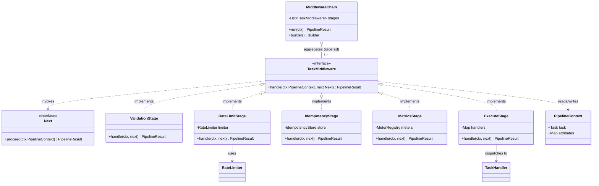
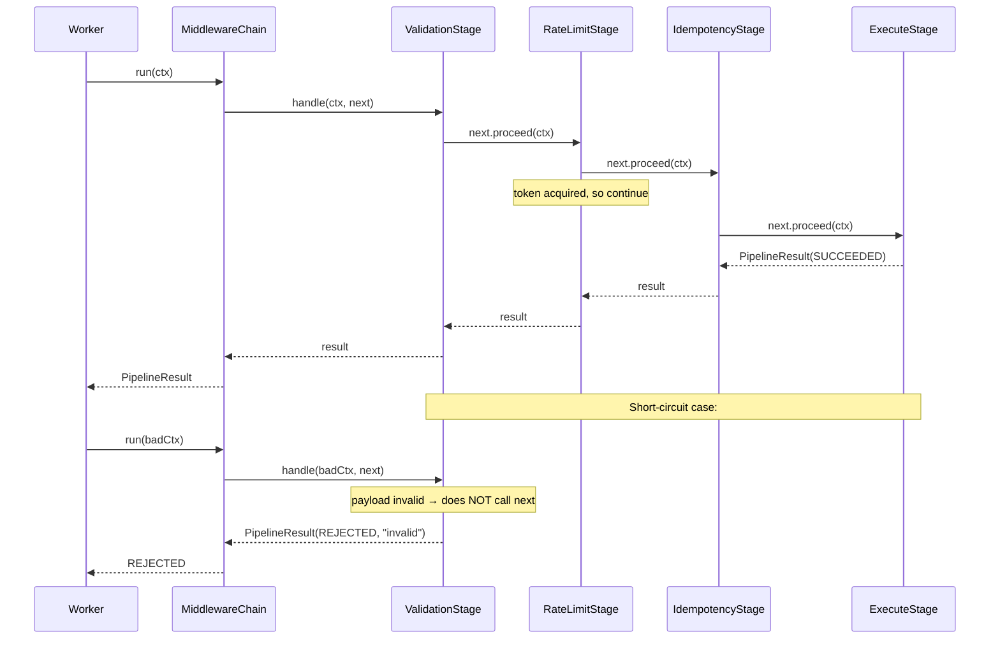

# Chain of Responsibility

> Where this fits in the project: every task that enters the platform must run a gauntlet before it touches business logic — **validate** the payload, **rate-limit** the tenant, **deduplicate / enforce idempotency**, **execute** the real handler, then **record metrics**. That gauntlet is a pipeline of small, independent steps. Chain of Responsibility is the pattern that lets us assemble that pipeline from interchangeable pieces, reorder it, insert a step in the middle, or short-circuit it — without rewriting the `Worker` or any `TaskHandler`. This is the chapter where "middleware" stops being a Spring/Express buzzword and becomes a thing you can build in 30 lines.

---

## 1. Why this exists — the real problem in our Task Queue

Recall the canonical contract from the SPEC. The `Worker` pulls a `Task`, finds the `TaskHandler` for `task.type()`, and calls it:

```java
@FunctionalInterface
public interface TaskHandler {
    TaskResult handle(Task task) throws Exception;
}

public record TaskResult(boolean success, String message, boolean retryable) {}
```

In Phase 1 the `Worker` did exactly that — look up, execute, done. But by Phase 3 the platform is multi-tenant and load-bearing, and *before* we execute the real handler we must do four things, in order, **for every task type**:

1. **Validate** — is the payload well-formed JSON? Are required fields present? Is `task.type()` one we actually have a handler for? Reject bad input *cheaply*, before it consumes a worker slot.
2. **Rate-limit** — tenant `acme` is allowed 100 tasks/second. If they exceed it, we must reject (or defer) so one noisy tenant cannot starve the others. This uses the canonical `RateLimiter` / `TokenBucketRateLimiter` (see [../08-distributed-systems/rate-limiting.md](../08-distributed-systems/rate-limiting.md)).
3. **Idempotency / dedupe** — the submitter retried the HTTP POST, so we received the same logical task twice with the same idempotency key. We must execute it **once** (see [../08-distributed-systems/idempotency.md](../08-distributed-systems/idempotency.md)).
4. **Metrics** — wrap the whole thing in a Micrometer timer and increment a counter, regardless of outcome, so Grafana shows throughput, latency, and reject rates per stage.

Here is the brutal truth about these four steps:

- They are **cross-cutting** — they apply to `EmailTaskHandler`, `ImageResizeHandler`, `ChargeCardHandler`, all of them, identically.
- They are **ordered** — validation must come before rate-limiting (no point burning a token on garbage), idempotency must come before execution (no point executing a duplicate), metrics must wrap everything.
- Each step can **short-circuit** the rest. A validation failure means "stop, do not rate-limit, do not execute." A rate-limit rejection means "stop, do not execute." This is the defining property.

That last bullet — *any step may decide the request goes no further* — is exactly what Chain of Responsibility exists to model. Decorator (the previous chapter, [decorator.md](decorator.md)) wraps behavior; but Decorator's mental model is "every layer always runs and delegates inward." Chain's mental model is "each link **chooses** whether to pass the request on." That difference drives the whole design, and we will hammer on it in §10.

> Historical note: Chain of Responsibility is a Gang of Four (1994) behavioral pattern. The canonical GoF example is GUI event handling — a click bubbles from a button to its panel to its window until something handles it. But the pattern's modern center of gravity is **server middleware**: Servlet `Filter` chains, Spring `HandlerInterceptor` and the Security `FilterChain`, Netty's `ChannelPipeline`, gRPC interceptors, Express/Koa `app.use()`, and the AWS SDK's request handler stack are all Chain of Responsibility. If you have ever written `app.use(rateLimiter)`, you have used this pattern.

---

## 2. The naive version — and why it bites

The fastest path is to inline all four steps into the `Worker`:

```java
public final class Worker implements Runnable {
    private final TaskQueue queue;
    private final Map<String, TaskHandler> handlers;
    private final RateLimiter rateLimiter;
    private final Set<String> seenIdempotencyKeys;     // dedupe store
    private final MeterRegistry meters;

    @Override
    public void run() {
        while (!Thread.currentThread().isInterrupted()) {
            try {
                Task task = queue.dequeue();

                // 1. validate
                if (task.payload() == null || task.payload().isBlank()) {
                    meters.counter("task.rejected", "reason", "invalid").increment();
                    continue;
                }
                TaskHandler handler = handlers.get(task.type());
                if (handler == null) {
                    meters.counter("task.rejected", "reason", "no_handler").increment();
                    continue;
                }

                // 2. rate limit
                if (!rateLimiter.tryAcquire()) {
                    meters.counter("task.rejected", "reason", "rate_limited").increment();
                    queue.enqueue(task);          // re-queue for later... maybe
                    continue;
                }

                // 3. idempotency
                String key = idempotencyKey(task);
                if (!seenIdempotencyKeys.add(key)) {
                    meters.counter("task.rejected", "reason", "duplicate").increment();
                    continue;
                }

                // 4. metrics + execute
                Timer.Sample sample = Timer.start(meters);
                try {
                    TaskResult result = handler.handle(task);
                    meters.counter("task.result", "success", String.valueOf(result.success())).increment();
                } catch (Exception e) {
                    meters.counter("task.result", "success", "false").increment();
                } finally {
                    sample.stop(meters.timer("task.duration", "type", task.type()));
                }
            } catch (InterruptedException e) {
                Thread.currentThread().interrupt();
                return;
            }
        }
    }

    private String idempotencyKey(Task task) { /* ... */ return task.id(); }
}
```

It works on day one. Then it rots:

- **The `Worker` knows everything.** It is coupled to validation rules, the rate limiter, the dedupe store, and Micrometer. Its single responsibility — pull from a queue and dispatch — has been buried under four other jobs. This violates SRP (see [../04-oop-and-ood/solid.md](../04-oop-and-ood/solid.md)).
- **Ordering is implicit and fragile.** The order lives in the literal sequence of `if` blocks. Want metrics to also count rate-limited tasks separately? You are editing the middle of a 60-line method and praying you do not break the `continue` flow.
- **You cannot reorder, add, or remove steps without editing `Worker`.** Adding a "tenant is suspended?" check in Phase 4 means another `if` block in the same method. The Open/Closed Principle is dead.
- **It is untestable in isolation.** To test the rate-limit branch you must stand up a `Worker`, a queue, a handler map, a meter registry, and drive a real `Task` through. There is no `RateLimitStage` object to unit-test on its own.
- **No reuse.** The HTTP `TaskController` (Phase 2) wants to run *validation and rate-limiting at submission time too*, so it rejects fast at the API edge. With this design it must copy-paste the `if` blocks.

The naive version conflates **what the pipeline does** with **how the pipeline is wired**. The pattern separates the two.

---

## 3. The pattern — Intent, Motivation, Problem, Participants

### Intent (GoF)

> Avoid coupling the sender of a request to its receiver by giving more than one object a chance to handle the request. Chain the receiving objects and pass the request along the chain until an object handles it.

For our pipeline use, the framing shifts slightly from the classic "exactly one handler handles it" toward **pipeline-style chaining**: each link does its bit and *decides whether to continue*. Both are Chain of Responsibility; the difference is whether links consume-or-pass (classic) or process-and-pass (pipeline/middleware). We use the pipeline flavor, which is by far the dominant one in modern backends.

### Motivation

We have a request (a `Task`) and a set of independent processing concerns. We want to:
- decouple the request producer (`Worker`/`TaskController`) from the set of processors,
- let the set of processors and their order be **configured**, not hard-coded,
- let any processor **short-circuit** the rest,
- and reuse the same processors in multiple call sites.

### Problem statement

*A request must pass through an ordered, configurable set of independent processing steps, any of which may stop the request from proceeding, without the originator knowing the steps or their order.*

### Participants

| Participant | Role in GoF terms | In our project |
|---|---|---|
| **Handler** | Declares the interface for handling a request and (optionally) holds the link to the successor | `TaskMiddleware` interface |
| **ConcreteHandler** | Handles requests it is responsible for; otherwise forwards to successor | `ValidationStage`, `RateLimitStage`, `IdempotencyStage`, `MetricsStage`, `ExecuteStage` |
| **Client** | Builds the chain and submits the request to the head | `MiddlewareChain` builder + the `Worker` |
| **Request / Context** | The thing flowing down the chain | `Task` plus a `PipelineContext` |
| **Next / successor** | The continuation passed to each link | a `Next` functional interface |

There are two common ways to implement the "link to successor":

1. **Linked successor (classic GoF):** each handler stores a reference to the next handler and calls it explicitly.
2. **Invoker-passes-`next` (modern middleware):** each handler receives a `next` callback and chooses whether to invoke it. This is what Servlet `FilterChain.doFilter(req, resp)` does, and it composes more cleanly. We will build the linked version first (it is the textbook one) and then show the middleware version, which is what we actually ship.

---

## 4. UML — the structure



Read the relationships precisely:
- `MiddlewareChain` **aggregates** an ordered list of `TaskMiddleware` (hollow diamond — the stages can outlive and be shared across chains; the chain does not own their lifecycle).
- Each `ConcreteHandler` **implements** `TaskMiddleware` (hollow triangle).
- A stage **depends on** `Next` (dashed arrow — it invokes it but does not own it).
- `RateLimitStage` **uses** the canonical `RateLimiter`; `ExecuteStage` **dispatches to** the canonical `TaskHandler`.

And the runtime flow, including the short-circuit, as a sequence:



---

## 5. Refactor the naive code into the pattern

### 5.1 The shared types

First, the request that flows down the chain. We carry the `Task` plus a scratchpad `attributes` map so stages can pass data forward (e.g., the metrics stage records a start time the execute stage never needs to know about).

```java
import java.time.Instant;
import java.util.HashMap;
import java.util.Map;

/** Mutable per-request context that flows down the chain. One instance per task run. */
public final class PipelineContext {
    private final Task task;
    private final Map<String, Object> attributes = new HashMap<>();
    private final Instant startedAt = Instant.now();

    public PipelineContext(Task task) { this.task = task; }

    public Task task() { return task; }
    public Instant startedAt() { return startedAt; }

    public void put(String key, Object value) { attributes.put(key, value); }

    @SuppressWarnings("unchecked")
    public <T> T get(String key) { return (T) attributes.get(key); }
}
```

The outcome. A sealed result makes the three states exhaustive and lets `switch` pattern-match without a `default`:

```java
/** The outcome of running the chain. Sealed so switches over it are exhaustive. */
public sealed interface PipelineResult
        permits PipelineResult.Completed, PipelineResult.Rejected {

    /** The task reached ExecuteStage and produced a TaskResult. */
    record Completed(TaskResult taskResult) implements PipelineResult {}

    /** A stage short-circuited the chain before execution. */
    record Rejected(String stage, String reason, boolean retryable) implements PipelineResult {}

    static PipelineResult ok(TaskResult r)            { return new Completed(r); }
    static PipelineResult reject(String s, String r)  { return new Rejected(s, r, false); }
    static PipelineResult defer(String s, String r)   { return new Rejected(s, r, true); }
}
```

The continuation and the middleware interface. `Next` is a functional interface so a lambda or method reference can be a continuation:

```java
/** The continuation: "run the rest of the chain on this context." */
@FunctionalInterface
public interface Next {
    PipelineResult proceed(PipelineContext ctx);
}

/** One link in the chain. It may do work, then call next, or short-circuit by not calling it. */
@FunctionalInterface
public interface TaskMiddleware {
    PipelineResult handle(PipelineContext ctx, Next next);
}
```

> Why `TaskMiddleware` is functional: simple stages can be written as lambdas, and — crucially — the same shape composes trivially. This is the design choice that separates a clean chain from a tangle.

### 5.2 The concrete stages

Each former `if` block becomes a tiny, independently testable class. Note the discipline: a stage that wants to continue **must call `next.proceed(ctx)`**; a stage that short-circuits simply **returns without calling next**.

```java
/** 1. Reject malformed tasks before they cost anything. */
public final class ValidationStage implements TaskMiddleware {
    private final java.util.Set<String> knownTypes;

    public ValidationStage(java.util.Set<String> knownTypes) {
        this.knownTypes = knownTypes;
    }

    @Override
    public PipelineResult handle(PipelineContext ctx, Next next) {
        Task t = ctx.task();
        if (t.payload() == null || t.payload().isBlank()) {
            return PipelineResult.reject("validation", "empty payload");
        }
        if (!knownTypes.contains(t.type())) {
            return PipelineResult.reject("validation", "no handler for type " + t.type());
        }
        return next.proceed(ctx);                 // valid → continue down the chain
    }
}
```

```java
/** 2. One noisy tenant must not starve the rest. Uses the canonical RateLimiter. */
public final class RateLimitStage implements TaskMiddleware {
    private final RateLimiter limiter;            // e.g. TokenBucketRateLimiter

    public RateLimitStage(RateLimiter limiter) { this.limiter = limiter; }

    @Override
    public PipelineResult handle(PipelineContext ctx, Next next) {
        if (!limiter.tryAcquire()) {
            // retryable=true: caller may re-enqueue with a delay rather than drop.
            return PipelineResult.defer("rate-limit", "no tokens available");
        }
        return next.proceed(ctx);
    }
}
```

```java
/** 3. Execute each idempotency key at most once. */
public final class IdempotencyStage implements TaskMiddleware {
    public interface IdempotencyStore {
        /** Returns true if this key was newly recorded; false if already seen. */
        boolean markIfAbsent(String key);
    }

    private final IdempotencyStore store;

    public IdempotencyStage(IdempotencyStore store) { this.store = store; }

    @Override
    public PipelineResult handle(PipelineContext ctx, Next next) {
        String key = ctx.task().id();             // in real life: a header-supplied idempotency key
        if (!store.markIfAbsent(key)) {
            // Treat a duplicate as a benign success — the original run already did the work.
            return PipelineResult.ok(new TaskResult(true, "duplicate ignored", false));
        }
        return next.proceed(ctx);
    }
}
```

```java
import io.micrometer.core.instrument.MeterRegistry;
import io.micrometer.core.instrument.Timer;

/** 4. Wraps EVERYTHING below it. Times the inner chain and counts outcomes. */
public final class MetricsStage implements TaskMiddleware {
    private final MeterRegistry meters;

    public MetricsStage(MeterRegistry meters) { this.meters = meters; }

    @Override
    public PipelineResult handle(PipelineContext ctx, Next next) {
        String type = ctx.task().type();
        Timer.Sample sample = Timer.start(meters);
        try {
            PipelineResult result = next.proceed(ctx);    // run the rest, time it
            String outcome = switch (result) {
                case PipelineResult.Completed c -> c.taskResult().success() ? "success" : "failure";
                case PipelineResult.Rejected r  -> "rejected:" + r.stage();
            };
            meters.counter("task.pipeline", "type", type, "outcome", outcome).increment();
            return result;
        } finally {
            sample.stop(meters.timer("task.pipeline.duration", "type", type));
        }
    }
}
```

```java
/** 5. The terminal stage: dispatch to the real TaskHandler. It is the end of the chain. */
public final class ExecuteStage implements TaskMiddleware {
    private final java.util.Map<String, TaskHandler> handlers;

    public ExecuteStage(java.util.Map<String, TaskHandler> handlers) {
        this.handlers = handlers;
    }

    @Override
    public PipelineResult handle(PipelineContext ctx, Next next) {
        // Terminal: we ignore `next` because there is nothing after us.
        Task task = ctx.task();
        TaskHandler handler = handlers.get(task.type());
        try {
            TaskResult result = handler.handle(task);
            return PipelineResult.ok(result);
        } catch (Exception e) {
            // retryable=true so the retry handler / DLQ machinery can decide.
            return new PipelineResult.Rejected("execute", e.getMessage(), true);
        }
    }
}
```

### 5.3 Wiring the chain

The chain folds the list of stages into a single `Next`, building it back-to-front so the head runs first. This is the same fold Express/Koa do internally:

```java
import java.util.List;

/** Holds an ordered list of middleware and runs a context through it. */
public final class MiddlewareChain {
    private final List<TaskMiddleware> stages;

    private MiddlewareChain(List<TaskMiddleware> stages) {
        this.stages = List.copyOf(stages);        // defensive immutable copy
    }

    public PipelineResult run(PipelineContext ctx) {
        // Build the continuation back-to-front. The innermost "next" is a no-op
        // (only reached if the terminal stage calls next, which it should not).
        Next chain = c -> PipelineResult.reject("chain", "fell off the end of the chain");
        for (int i = stages.size() - 1; i >= 0; i--) {
            TaskMiddleware stage = stages.get(i);
            Next nextInLine = chain;              // capture for the closure
            chain = c -> stage.handle(c, nextInLine);
        }
        return chain.proceed(ctx);
    }

    public static Builder builder() { return new Builder(); }

    public static final class Builder {
        private final java.util.ArrayList<TaskMiddleware> stages = new java.util.ArrayList<>();
        public Builder use(TaskMiddleware m) { stages.add(m); return this; }
        public MiddlewareChain build() { return new MiddlewareChain(stages); }
    }
}
```

### 5.4 The `Worker`, restored to one job

```java
public final class Worker implements Runnable {
    private final TaskQueue queue;
    private final MiddlewareChain chain;

    public Worker(TaskQueue queue, MiddlewareChain chain) {
        this.queue = queue;
        this.chain = chain;
    }

    @Override
    public void run() {
        while (!Thread.currentThread().isInterrupted()) {
            try {
                Task task = queue.dequeue();
                PipelineResult result = chain.run(new PipelineContext(task));
                if (result instanceof PipelineResult.Rejected r && r.retryable()) {
                    queue.enqueue(task);          // deferred: try again later
                }
                // (Completed and non-retryable Rejected need no re-enqueue here.)
            } catch (InterruptedException e) {
                Thread.currentThread().interrupt();
                return;
            }
        }
    }
}
```

And the assembly, done once at startup (this is the *Client* participant):

```java
MiddlewareChain chain = MiddlewareChain.builder()
        .use(new MetricsStage(meterRegistry))           // outermost: times everything below
        .use(new ValidationStage(handlers.keySet()))
        .use(new RateLimitStage(new TokenBucketRateLimiter(100, 100)))
        .use(new IdempotencyStage(idempotencyStore))
        .use(new ExecuteStage(handlers))                // terminal
        .build();

new Worker(queue, chain);
```

The order is now **data, declared in one readable place**. Want metrics to *also* count validation rejections? It already does — `MetricsStage` is outermost, so it observes every outcome. Want to drop a `TenantSuspendedStage` in front of `ExecuteStage` in Phase 4? Add one `.use(...)` line. `Worker` never changes.

---

## 6. Before and after

| Concern | Naive `Worker` | Chain of Responsibility |
|---|---|---|
| Where ordering lives | Sequence of `if` blocks in one method | A list literal in one builder call |
| Add/remove/reorder a step | Edit the 60-line `run()` method | Add/move one `.use(...)` line |
| Test a single step | Stand up the whole `Worker` | `new RateLimitStage(stub).handle(ctx, next)` |
| Reuse at API edge | Copy-paste the `if` blocks | Reuse the same stage objects |
| `Worker` responsibilities | Dequeue + validate + limit + dedupe + meter + execute | Dequeue + run chain |
| Short-circuit semantics | `continue` statements, easy to get wrong | "return without calling `next`" — one rule |
| Open/Closed | Closed to nothing, open to bugs | New behavior = new class, no edits |

---

## 7. A simple Java example (no project, just the pattern)

Classic GoF "consume or pass" flavor: an expense-approval chain where exactly one approver handles a request based on amount.

```java
abstract class Approver {
    private Approver next;
    Approver linkTo(Approver next) { this.next = next; return next; }   // returns next for fluent chaining

    final void approve(int amount) {
        if (canApprove(amount)) {
            System.out.println(getClass().getSimpleName() + " approved $" + amount);
        } else if (next != null) {
            next.approve(amount);                                       // pass it on
        } else {
            System.out.println("No one can approve $" + amount);
        }
    }
    abstract boolean canApprove(int amount);
}

class TeamLead   extends Approver { boolean canApprove(int a) { return a <= 1_000; } }
class Manager    extends Approver { boolean canApprove(int a) { return a <= 10_000; } }
class Director   extends Approver { boolean canApprove(int a) { return a <= 100_000; } }

public class Demo {
    public static void main(String[] args) {
        Approver lead = new TeamLead();
        lead.linkTo(new Manager()).linkTo(new Director());   // lead -> manager -> director

        lead.approve(500);       // TeamLead approved $500
        lead.approve(7_500);     // Manager approved $7500
        lead.approve(80_000);    // Director approved $80000
        lead.approve(500_000);   // No one can approve $500000
    }
}
```

This is the **linked-successor** form: each handler holds its own `next` and decides to consume or pass. Compare it to the **middleware** form in §5, where the chain owns the wiring and stages receive `next` as a parameter. Both are Chain of Responsibility; the middleware form scales better because stages are stateless about their position.

---

## 8. A real-world Java example — Servlet filters are this pattern

You have almost certainly used Chain of Responsibility without naming it. A Servlet `Filter` *is* a `TaskMiddleware`, and `FilterChain.doFilter()` *is* `next.proceed()`:

```java
import jakarta.servlet.*;
import jakarta.servlet.http.*;
import java.io.IOException;

public class RateLimitFilter implements Filter {
    private final RateLimiter limiter;
    public RateLimitFilter(RateLimiter limiter) { this.limiter = limiter; }

    @Override
    public void doFilter(ServletRequest req, ServletResponse res, FilterChain chain)
            throws IOException, ServletException {
        if (!limiter.tryAcquire()) {
            ((HttpServletResponse) res).sendError(429, "Too Many Requests");
            return;                                  // short-circuit: do NOT call chain.doFilter
        }
        chain.doFilter(req, res);                    // proceed to the next filter / the servlet
    }
}
```

The mapping is one-to-one:

| Our pipeline | Servlet API | Spring MVC |
|---|---|---|
| `TaskMiddleware` | `Filter` | `HandlerInterceptor` |
| `Next.proceed()` | `FilterChain.doFilter()` | `return true` from `preHandle` |
| short-circuit | return without `doFilter` | `return false` / write response |
| `MiddlewareChain` | the container's filter registry | `InterceptorRegistry` |

Recognizing that these are the *same pattern* is the payoff: once you can build the chain in §5 from scratch, every framework's middleware stops being magic.

---

## 9. The project-integration example — full, runnable

A self-contained `main` that wires the real chain and runs three tasks: one valid, one with an unknown type (validation short-circuits), and one duplicate (idempotency short-circuits).

```java
import io.micrometer.core.instrument.simple.SimpleMeterRegistry;
import java.time.Instant;
import java.util.*;
import java.util.concurrent.ConcurrentHashMap;

public class PipelineDemo {
    public static void main(String[] args) {
        // --- handlers (the real business logic; here, stubs) ---
        Map<String, TaskHandler> handlers = new HashMap<>();
        handlers.put("email", task -> new TaskResult(true, "email sent to " + task.payload(), false));

        // --- collaborators ---
        var meters = new SimpleMeterRegistry();
        var idempotency = new IdempotencyStage.IdempotencyStore() {
            private final Set<String> seen = ConcurrentHashMap.newKeySet();
            public boolean markIfAbsent(String key) { return seen.add(key); }
        };
        RateLimiter generous = () -> true;    // always grants a token for the demo

        // --- assemble the chain (Client participant) ---
        MiddlewareChain chain = MiddlewareChain.builder()
                .use(new MetricsStage(meters))
                .use(new ValidationStage(handlers.keySet()))
                .use(new RateLimitStage(generous))
                .use(new IdempotencyStage(idempotency))
                .use(new ExecuteStage(handlers))
                .build();

        // --- three tasks ---
        Task good      = newTask("t-1", "email", "alice@example.com");
        Task unknown   = newTask("t-2", "sms",   "+15551234");   // no handler → validation rejects
        Task duplicate = newTask("t-1", "email", "alice@example.com"); // same id → idempotency rejects

        System.out.println(chain.run(new PipelineContext(good)));
        System.out.println(chain.run(new PipelineContext(unknown)));
        System.out.println(chain.run(new PipelineContext(duplicate)));
    }

    static Task newTask(String id, String type, String payload) {
        return new Task(id, type, payload, TaskStatus.PENDING,
                0, 3, Instant.now(), Instant.now(), 0);
    }
}
```

Expected output:

```text
Completed[taskResult=TaskResult[success=true, message=email sent to alice@example.com, retryable=false]]
Rejected[stage=validation, reason=no handler for type sms, retryable=false]
Completed[taskResult=TaskResult[success=true, message=duplicate ignored, retryable=false]]
```

Note how the third task (`t-1` again) is short-circuited by `IdempotencyStage` and never reaches `ExecuteStage`, yet returns a benign success — exactly the idempotency contract from [../08-distributed-systems/idempotency.md](../08-distributed-systems/idempotency.md).

---

## 10. Chain of Responsibility vs Decorator — the comparison you came for

These two patterns produce *structurally similar* code — a stack of wrappers each holding the next thing. Engineers conflate them constantly. Here is the precise difference.

A Decorator (see [decorator.md](decorator.md)) wraps a `TaskHandler` and **always** delegates to the wrapped object:

```java
// DECORATOR: same interface in and out, always delegates, adds behavior around the call.
final class LoggingHandler implements TaskHandler {
    private final TaskHandler inner;
    LoggingHandler(TaskHandler inner) { this.inner = inner; }
    public TaskResult handle(Task t) throws Exception {
        log.info("start {}", t.id());
        TaskResult r = inner.handle(t);          // ALWAYS calls inner
        log.info("done {} -> {}", t.id(), r.success());
        return r;
    }
}
```

A Chain link **may choose not to** call the next thing — that is the entire point:

```java
// CHAIN: receives `next`, MAY short-circuit by returning without calling it.
final class RateLimitStage implements TaskMiddleware {
    public PipelineResult handle(PipelineContext ctx, Next next) {
        if (!limiter.tryAcquire()) return PipelineResult.defer("rate-limit", "no tokens");
        return next.proceed(ctx);                // MAY or MAY NOT call next
    }
}
```

| Axis | Decorator | Chain of Responsibility |
|---|---|---|
| Primary intent | **Add** behavior to a single object | **Route** a request through processors |
| Interface | Same as the wrapped type (`TaskHandler` in, `TaskHandler` out) | A distinct handler/middleware type |
| Does each layer always run the next? | **Yes** — delegation is the contract | **No** — a link may stop the request |
| Can a layer terminate the request? | No (it must return the inner result) | Yes (short-circuit) |
| Result type | Transparent — same as inner | Can encode "rejected" / "handled by me" |
| Who owns the wiring? | The caller nests constructors | A chain object / builder owns the order |
| Mental model | "decorate, then delegate" | "decide, then maybe forward" |

When does the choice actually matter? **The moment a step needs to say "no, this request stops here."** Validation, rate-limiting, auth, idempotency — all need to short-circuit, so they are Chain. Logging, timing, caching-the-result — all always delegate, so they are Decorator. In practice large systems use *both*: our `ExecuteStage` could dispatch to a `TaskHandler` that is itself wrapped in Decorators (retry, metrics-per-handler). The chain handles *gatekeeping*; decorators handle *augmentation*.

> Rule of thumb: if removing a step could change *whether* the core logic runs, it is a chain link. If it could only change *how* the core logic runs (or what gets logged around it), it is a decorator.

---

## 11. Tradeoffs — honest

**Strengths**
- **Single Responsibility per stage.** Each concern is one small, testable class.
- **Open/Closed.** New behavior = new stage + one `.use()` line; nothing existing is edited.
- **Reorderable and reusable.** Order is data; the same stages serve `Worker` and `TaskController`.
- **Short-circuit is first-class**, expressed by "don't call `next`."

**Costs**
- **Indirection.** A request flows through N objects; a stack trace is N frames deeper. Debugging "where did my task get dropped?" means knowing the chain.
- **No guarantee anyone handles it.** In the classic flavor, a request can fall off the end unhandled (we guard against it with the terminal "fell off the end" `Next`). Always have a terminal stage or a documented fallthrough.
- **Order is load-bearing and implicit in the list.** Putting `RateLimitStage` before `ValidationStage` burns tokens on garbage. Order correctness is *your* responsibility; the compiler will not catch it.
- **Shared mutable `PipelineContext`** is a coupling channel between stages — convenient, but stage A silently depending on a key stage B set is a maintenance trap.
- **Performance:** negligible for I/O-bound tasks (a few extra megamorphic virtual calls), but a hot, CPU-bound chain of dozens of trivial stages has measurable overhead versus a flat method.

---

## 12. Common mistakes and pitfalls

- **Forgetting to call `next`.** A stage that should continue but silently returns swallows the request. *Fix:* make "continue" explicit and reviewed; in tests, assert that a permissive stage actually reaches the terminal stage.
- **Calling `next` twice.** Double-executing the rest of the chain (double-charge a card!). *Fix:* treat `next.proceed()` like a `return` — call it once, on one code path.
- **Order-dependent bugs.** Rate-limiting before validation, or metrics *inside* the chain so it cannot see rejections. *Fix:* document the intended order next to the builder; add a test that asserts a rejected task is still counted by metrics.
- **Fat `PipelineContext`.** Stages dumping everything into the attributes map until it is a hidden god-object. *Fix:* prefer typed fields for stable data; reserve the map for genuinely cross-stage scratch.
- **Confusing it with Decorator** and giving links the same interface as the core object, then being surprised you cannot express "reject." *Fix:* use a distinct result type (`PipelineResult`) that can encode rejection.
- **Exceptions as control flow for "rejected."** Throwing to short-circuit is slow and conflates "this task is invalid" with "the JVM is on fire." *Fix:* return a `Rejected` result; reserve exceptions for genuine faults.
- **Stateful stages shared across threads** (e.g., a stage caching the last task). With virtual-thread workers many requests hit the same stage concurrently. *Fix:* keep stages stateless or use thread-safe collaborators (`ConcurrentHashMap.newKeySet()` in our idempotency store).

---

## 13. Refactoring exercise — bad → improved → production

**Bad.** A god-method routing notifications by channel with nested `if`s:

```java
void notify(String channel, String msg, User u) {
    if (channel.equals("email")) {
        if (u.emailVerified()) emailClient.send(u.email(), msg);
        else log.warn("unverified");
    } else if (channel.equals("sms")) {
        if (u.phone() != null) smsClient.send(u.phone(), msg);
        else log.warn("no phone");
    } else if (channel.equals("push")) {
        if (u.deviceToken() != null) pushClient.send(u.deviceToken(), msg);
        else log.warn("no device");
    } else {
        log.error("unknown channel " + channel);
    }
}
```

**Improved.** Linked-successor chain — each channel decides "is this mine? can I send it? else pass on":

```java
abstract class Notifier {
    private Notifier next;
    Notifier linkTo(Notifier n) { this.next = n; return n; }
    final void send(String channel, String msg, User u) {
        if (handles(channel)) doSend(msg, u);
        else if (next != null) next.send(channel, msg, u);
        else log.error("unknown channel " + channel);
    }
    abstract boolean handles(String channel);
    abstract void doSend(String msg, User u);
}
```

**Production-quality.** Middleware-style with a registry, a result type, and fallthrough handling — the form you would ship and unit-test:

```java
@FunctionalInterface
interface NotifierStage { Optional<SendResult> trySend(Notification n); }

final class NotifierChain {
    private final List<NotifierStage> stages;
    NotifierChain(List<NotifierStage> stages) { this.stages = List.copyOf(stages); }

    SendResult send(Notification n) {
        for (NotifierStage stage : stages) {
            Optional<SendResult> handled = stage.trySend(n);
            if (handled.isPresent()) return handled.get();   // first stage that claims it wins
        }
        return SendResult.unrouted(n.channel());             // explicit fallthrough, not a log-and-forget
    }
}
```

The production form returns an explicit `unrouted` result (callers can route it to a DLQ — see [../08-distributed-systems/dlq.md](../08-distributed-systems/dlq.md)), keeps each stage a testable lambda, and makes order a constructor argument.

---

## 14. Exercises

### Easy

**E1 (knowledge check).** In one sentence each, state the single property that distinguishes Chain of Responsibility from Decorator, and name two of our pipeline stages that *must* be chain links (not decorators) and explain why.

**E2 (coding).** Add a `LoggingStage` to the §5 chain that logs `task.id()` on entry and the `PipelineResult` on exit, *always* delegating to `next`. Where in the builder should it go to log every outcome including rejections, and why?

### Medium

**M1 (coding).** Implement a `PriorityShortCircuitStage` that, if `task.priority() >= 9`, *bypasses* `RateLimitStage` so urgent tasks are never throttled — but still runs validation, idempotency, and execute. Sketch how the builder order changes. (Hint: a stage cannot un-run an earlier stage; what does that imply about where it must sit?)

**M2 (refactoring).** Refactor `MetricsStage` so it also records, per stage, *which* stage short-circuited, using the `Rejected.stage()` field, without changing any other stage's code. Show the metric tags.

### Hard

**H1 (design).** The chain is currently synchronous and per-task. Design (interfaces + prose) an *asynchronous* chain where each `Next.proceed` returns a `CompletableFuture<PipelineResult>`, so a stage can do non-blocking I/O (e.g., a remote idempotency check). What changes in `MiddlewareChain.run`? What new failure modes appear (timeouts, partial completion)?

**H2 (interview-style).** You ship the §5 chain. A duplicate task is being executed twice in production roughly once a day. Walk through how you would localize the bug to a specific stage using only the metrics emitted by `MetricsStage`, then name the two most likely root causes and the fix for each.

---

## 15. Solutions

**E1.** *Distinguishing property:* a Chain link **may decline to call `next`**, terminating the request, whereas a Decorator **always delegates** to the wrapped object and only augments around the call. *Must-be-chain stages:* `ValidationStage` (a malformed task must stop before execution, so it has to be able to short-circuit) and `RateLimitStage` (when out of tokens it must defer/reject rather than execute). A Decorator could not express "do not run the inner handler."

**E2.**

```java
public final class LoggingStage implements TaskMiddleware {
    private static final System.Logger LOG = System.getLogger("pipeline");
    @Override public PipelineResult handle(PipelineContext ctx, Next next) {
        LOG.log(System.Logger.Level.INFO, "enter " + ctx.task().id());
        PipelineResult r = next.proceed(ctx);          // always delegates → it's a decorator-style stage
        LOG.log(System.Logger.Level.INFO, "exit " + ctx.task().id() + " -> " + r);
        return r;
    }
}
```

Place it **outermost** (first `.use(...)`, even before `MetricsStage`, or just inside it) so it wraps the whole chain and observes rejections from any inner stage. A stage only sees results produced *below* it; to log every outcome it must sit above every stage that can produce one.

**M1.**

```java
public final class PriorityShortCircuitStage implements TaskMiddleware {
    private final MiddlewareChain bypassChain;   // a chain WITHOUT the rate limiter
    public PriorityShortCircuitStage(MiddlewareChain bypassChain) { this.bypassChain = bypassChain; }
    @Override public PipelineResult handle(PipelineContext ctx, Next next) {
        if (ctx.task().priority() >= 9) {
            return bypassChain.run(ctx);   // route urgent tasks through a different sub-chain
        }
        return next.proceed(ctx);          // normal tasks continue down the rate-limited chain
    }
}
```

Key insight: a stage *cannot* un-run an earlier stage, so to "skip rate-limiting" the priority decision must happen **before** `RateLimitStage`. The cleanest model is a branch: a small dispatcher stage sits before the rate limiter and routes high-priority tasks into a separate sub-chain `[Validation → Idempotency → Execute]` while normal tasks fall through to `[RateLimit → Idempotency → Execute]`. Builder-wise, you build two chains and place the dispatcher in front. (An alternative — a context flag the rate limiter reads — also works but couples the limiter to priority semantics, which is worse.)

**M2.** `MetricsStage` already has the `Rejected` in scope; extend the tag set:

```java
String outcome = switch (result) {
    case PipelineResult.Completed c -> c.taskResult().success() ? "success" : "failure";
    case PipelineResult.Rejected r  -> "rejected";
};
String rejectStage = (result instanceof PipelineResult.Rejected r) ? r.stage() : "none";
meters.counter("task.pipeline", "type", type, "outcome", outcome, "reject_stage", rejectStage)
      .increment();
```

No other stage changes because the `stage` field already travels inside the `Rejected` result up to `MetricsStage`. Grafana can now break down rejections by `reject_stage` (validation vs rate-limit vs idempotency vs execute).

**H1.** Introduce async types:

```java
@FunctionalInterface interface AsyncNext { CompletableFuture<PipelineResult> proceed(PipelineContext ctx); }
@FunctionalInterface interface AsyncMiddleware { CompletableFuture<PipelineResult> handle(PipelineContext ctx, AsyncNext next); }
```

`MiddlewareChain.run` becomes a fold producing a `CompletableFuture<PipelineResult>`; the terminal continuation returns a completed future. A stage doing remote I/O returns `store.markIfAbsentAsync(key).thenCompose(fresh -> fresh ? next.proceed(ctx) : completedFuture(ok(...)))`. New failure modes: (1) **timeouts** — wrap each stage's future in `.orTimeout(d)` and map `TimeoutException` to a `Rejected("stage", "timeout", true)`; (2) **partial completion / leaks** — if a stage's I/O fails after a side effect (e.g., idempotency key written but execute never ran), you need compensation or an at-least-once + idempotent-execute contract; (3) **thread context** — `MDC`/tracing context does not propagate across `thenCompose` boundaries automatically, so logs lose the task id unless you propagate it explicitly. On modern Java, virtual threads (Loom) often make the *synchronous* chain the better answer — you get blocking-style code with async scalability and keep the simple §5 design.

**H2.** Using only `MetricsStage` output: the `task.pipeline` counter is tagged with `outcome`. A double-execution shows up as **two `Completed` increments for the same `task.id()`** within the duration window — but the counter is not tagged by id, so instead look at `task.pipeline{outcome="success"}` exceeding the count of *distinct* submitted ids, i.e., a small but nonzero gap between `task.submitted` and `task.pipeline{reject_stage="idempotency"}` + distinct successes. The two likely root causes: (1) **the idempotency store is per-`Worker`/per-node**, so two workers each see the key as new — fix by moving the dedupe store to a shared Redis/Postgres `INSERT ... ON CONFLICT DO NOTHING` so the check is global; (2) **a race in `markIfAbsent`** under concurrency where two threads both observe "absent" before either writes — fix by making the check-and-set atomic (`ConcurrentHashMap.newKeySet().add` *is* atomic in-JVM; the bug only survives if the store is not, e.g., a `HashSet` or a non-atomic DB read-then-write). The deeper lesson: in-process idempotency is a lie the moment you scale horizontally (Phase 4).

---

## 16. Interview questions and takeaways

1. **Q: What is the one property that defines Chain of Responsibility?**
   A: Each handler gets a chance and **decides whether to forward** the request; a handler can stop it. That choice is the pattern.

2. **Q: Chain of Responsibility vs Decorator?**
   A: Decorator always delegates and augments (same interface in/out); a Chain link may decline to delegate, terminating the request. Use Chain for gatekeeping (validate/rate-limit/auth), Decorator for augmentation (log/time/cache).

3. **Q: Name three production frameworks built on it.**
   A: Servlet `Filter`/`FilterChain`, Spring Security `FilterChain` and `HandlerInterceptor`, Netty `ChannelPipeline`; also Express/Koa middleware and gRPC interceptors.

4. **Q: How do you guarantee a request is handled?**
   A: Add a terminal handler that always handles (or returns an explicit "unrouted"/"fell off the chain" result). Never rely on a step silently catching it.

5. **Q: Where does ordering correctness live, and how do you protect it?**
   A: In the chain assembly (the list/builder). Protect it with a test that drives a known-bad task through and asserts the *expected stage* rejects it, plus a test that metrics observe rejections.

6. **Q: How does the pattern interact with concurrency / virtual threads?**
   A: Stages must be stateless or thread-safe because many virtual-thread workers share the same stage instances. The `PipelineContext` is per-request and therefore safe; shared collaborators (rate limiter, idempotency store) must be concurrency-safe.

7. **Q: When would you *not* use it?**
   A: When there is exactly one fixed processing path with no short-circuit and no configurability — a straight method is clearer. Or when steps are tightly interdependent and cannot be reordered; the indirection then only hides the coupling.

8. **Q: How do you short-circuit without exceptions?**
   A: Return a result type that encodes "rejected/handled by me" (our `PipelineResult.Rejected`) and have the chain stop forwarding. Reserve exceptions for genuine faults, not control flow.

---

## 17. Production considerations

- **Observability is non-negotiable.** Because a task can die in any stage, emit a counter tagged by `reject_stage` (M2) and a per-stage timer. Without it, "tasks are vanishing" is undebuggable. Tie into the metrics work in [../08-distributed-systems/rate-limiting.md](../08-distributed-systems/rate-limiting.md).
- **Idempotency must be global, not per-process.** The §5 in-memory store is correct for one JVM and wrong the instant you run two worker nodes (Phase 4). Back it with Redis `SET key val NX EX ttl` or Postgres unique constraints. This is the single most common scaling bug for this pattern.
- **Bound the chain.** A misconfigured chain that re-enqueues rate-limited tasks can create a hot loop. Add a max-retry count on deferral and route exhausted tasks to the DLQ ([../08-distributed-systems/dlq.md](../08-distributed-systems/dlq.md)).
- **Backpressure interplay.** `RateLimitStage` returning `defer` plus blind re-enqueue can amplify load under stress. Prefer dropping with a metric, or a bounded delay queue, over unbounded re-enqueue.
- **Tracing across stages.** Propagate a trace/span id through `PipelineContext` so a single task's journey through all stages is one trace. With async chains, propagate it manually across `CompletableFuture` boundaries.
- **Config-driven order at scale.** Large platforms make the stage list config (feature flags per tenant). Validate the config at startup (e.g., assert a terminal `ExecuteStage` exists, assert `validation` precedes `rate-limit`) so a bad order fails fast, not in production.

---

## What We Can Improve In Our Project Using This Concept

Today the `Worker` (and, in Phase 2, the `TaskController`) hand-rolls validation, rate-limiting, dedupe, metrics, and dispatch inline. Extracting these into a `MiddlewareChain` of `TaskMiddleware` stages:
- restores `Worker`'s single responsibility (dequeue → run chain → maybe re-enqueue),
- lets the **same** stages run at the API edge (fast-reject bad submissions before they ever hit the queue) and at the worker,
- makes the order of cross-cutting concerns explicit, configurable, and per-tenant-tunable in Phase 4,
- gives us per-stage metrics for free, which feeds the Grafana dashboards in Phase 3.

## Project Refactoring Task

1. Introduce `PipelineContext`, `PipelineResult` (sealed), `Next`, and `TaskMiddleware`.
2. Extract `ValidationStage`, `RateLimitStage` (using the canonical `RateLimiter`), `IdempotencyStage`, `MetricsStage`, and the terminal `ExecuteStage` (dispatching to the `TaskHandler` map).
3. Add `MiddlewareChain` with a `Builder` and the back-to-front fold.
4. Rewrite `Worker.run()` to call `chain.run(new PipelineContext(task))` and re-enqueue only on `Rejected{retryable=true}`.
5. Wire the chain once at startup; assert at build time that a terminal stage exists and that `validation` precedes `rate-limit`.
6. Add JUnit 5 + AssertJ tests: one per stage in isolation, plus a chain-level test asserting short-circuit (unknown type never reaches execute) and that metrics count rejections.

## Git Commit For This Chapter

```text
refactor(pipeline): replace inline worker checks with a middleware chain

Introduce TaskMiddleware / Next / PipelineContext / sealed PipelineResult and
extract Validation, RateLimit, Idempotency, Metrics, and Execute stages behind
a MiddlewareChain builder. Worker now only dequeues and runs the chain. Same
stages are reusable at the API edge. Adds per-stage metrics and unit tests.

Files:
  src/main/java/.../pipeline/PipelineContext.java        (new)
  src/main/java/.../pipeline/PipelineResult.java         (new)
  src/main/java/.../pipeline/Next.java                   (new)
  src/main/java/.../pipeline/TaskMiddleware.java         (new)
  src/main/java/.../pipeline/MiddlewareChain.java        (new)
  src/main/java/.../pipeline/stages/*.java               (new: 5 stages)
  src/main/java/.../worker/Worker.java                   (modified)
  src/test/java/.../pipeline/*Test.java                  (new)
```

## Architecture Impact

The chain becomes a reusable seam between the API/queue edge and business logic. In Phase 3 it is where rate limiting and metrics live; in Phase 4 it is where per-tenant, config-driven policies plug in, and where the idempotency stage is upgraded from in-process to a shared store. Crucially, it isolates cross-cutting policy from both transport (`TaskController`) and execution (`TaskHandler`), so each can evolve independently — the layered/hexagonal goal from [../04-oop-and-ood/hexagonal-architecture.md](../04-oop-and-ood/hexagonal-architecture.md).

## Interview Takeaways

- Chain of Responsibility = ordered handlers where **each decides whether to forward**; short-circuit is the defining feature.
- It is the pattern behind every middleware stack you have used (Servlet filters, Spring interceptors, Express).
- Distinguish it from Decorator: Decorator *always* delegates and augments; Chain *may* stop the request. Real systems use both — Chain for gatekeeping, Decorator for augmentation.
- The hard parts in production are **ordering correctness**, **a terminal/fallthrough handler**, **global (not per-process) idempotency**, and **per-stage observability**.
