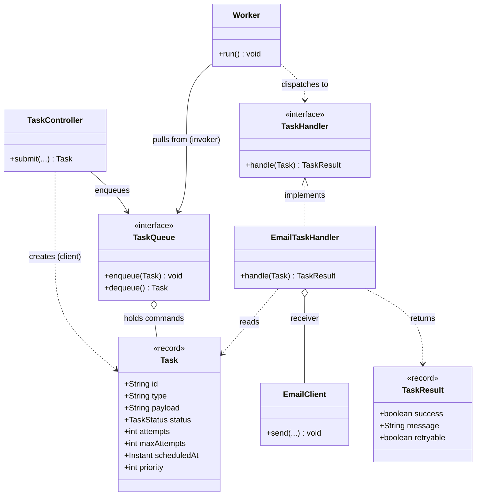
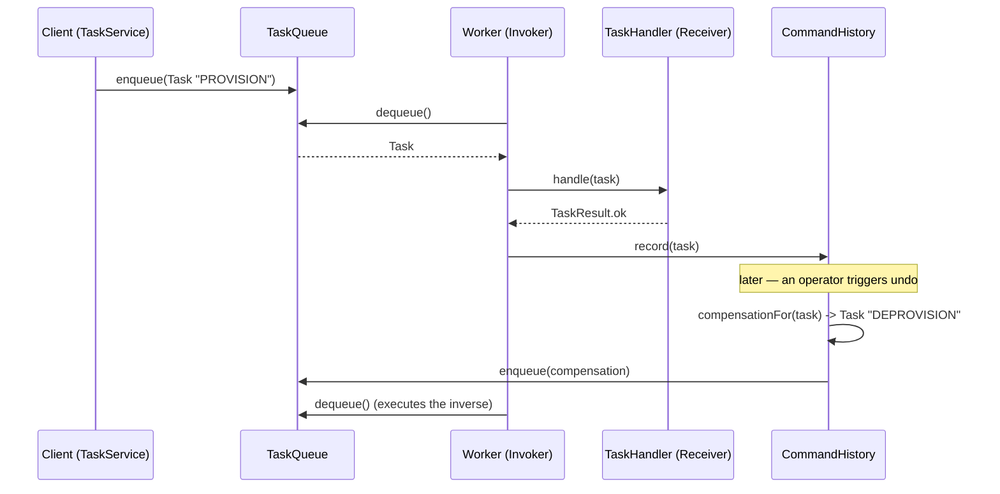

# Command

> Where this fits in the project: every other pattern in this module decorates, factories, or strategizes around the `Task`. This chapter reveals the deeper truth — **a `Task` _is_ a command.** It is a request that has been turned into a first-class object so it can be put on a queue, written to a database, shipped over a network, logged, retried, rescheduled, replayed, and — when we are brave enough — undone. The Command pattern is not "a pattern our task queue uses." It is the conceptual core that makes a task queue _possible_.

---

## 1. Why this exists — the real problem in our Task Queue

Start with the dumbest possible way to "process work." A caller wants to send an email, so they call the code that sends an email:

```java
public final class CheckoutService {
    private final EmailClient email;
    private final ImageService images;

    public void completeOrder(Order order) {
        // do the important work...
        email.send(order.customerEmail(), "Receipt", renderReceipt(order)); // (a)
        images.generateThumbnail(order.firstItemImage());                    // (b)
    }
}
```

Lines `(a)` and `(b)` are **direct method calls**. The request ("send this email") and its execution ("call `email.send` right now, on this thread") are welded together. That welding is fine until production asks for literally anything else:

1. **Defer it.** The thumbnail takes 4 seconds. We do not want the customer's HTTP request blocked for 4 seconds. We want to *say what to do* now and *do it* later, on a worker.
2. **Persist it.** If the JVM crashes between `(a)` and `(b)`, the thumbnail is lost forever. We need the request to survive a restart, which means it must be a row in PostgreSQL, not a stack frame.
3. **Retry it.** The SMTP server hiccups. We want to attempt the *same request* again — but a method call that has already returned is gone; there is nothing left to retry.
4. **Rate-limit it.** The image provider caps us at 100/sec. To throttle, something must hold the pending request and release it later.
5. **Log and audit it.** Compliance wants a record of every action taken and by whom. A method call leaves no record.
6. **Undo it.** A bad deploy enqueued 50,000 "delete account" actions. We want to reverse them. You cannot reverse a `void` method call.

Every one of those six requirements has the **same root cause**: the request is not an object. You cannot queue, store, retry, log, or undo a thing that only exists for the microsecond a method runs. The fix is to **reify the request** — turn the verb "send this email" into a noun, an object you can hold in your hand:

```java
Task t = new Task(/* type = */ "EMAIL", /* payload = */ "{\"to\":\"x@y.com\",...}", ...);
queue.enqueue(t);   // now the request is an OBJECT. Queue it, store it, retry it, log it.
```

That is the Command pattern, and our canonical `Task` is its embodiment.

> Historical note: Command is a Gang of Four (1994) behavioral pattern. Smalltalk-80's "do/undo" menu actions were the inspiration; it powers undo stacks in every editor (Photoshop, IntelliJ, Word), GUI toolkit action objects (`javax.swing.Action`), `java.lang.Runnable` (a command with no args and no return), Spring's `@Transactional` rollback logs, database write-ahead logs, event sourcing, and the redo log of every relational database. A task queue is Command-at-scale: commands serialized to durable storage and executed by a remote worker pool.

---

## 2. The naive version — and why it bites

Suppose we already accept that work should be deferred, but we have not discovered Command yet. The "obvious" way to queue work is to queue *closures* — `Runnable`s — straight onto an `ExecutorService`:

```java
public final class NaiveTaskService {
    private final ExecutorService pool = Executors.newFixedThreadPool(8);
    private final EmailClient email;
    private final ImageService images;

    public void submitEmail(String to, String subject, String body) {
        pool.submit(() -> email.send(to, subject, body));   // a Runnable closure
    }

    public void submitThumbnail(String imageUrl) {
        pool.submit(() -> images.generateThumbnail(imageUrl));
    }
}
```

This works on a laptop for about a day. Then the limits arrive, and every one of them is fatal:

- **It is not persistable.** A `Runnable` lambda is a chunk of JVM bytecode plus captured variables on the heap. You cannot write it to a PostgreSQL row, send it over Kafka, or recover it after a crash. The closure dies with the process. Everything in the queue is lost on restart.
- **It is not retryable in a controlled way.** The lambda has no `attempts`, no `maxAttempts`, no `status`. If it throws, the `ExecutorService` swallows the exception into a `Future` nobody reads. There is no place to record "attempt 2 of 5, retry after 4s."
- **It carries no metadata.** No `id` to correlate logs. No `type` to look up handlers or build per-type metrics. No `priority`, no `scheduledAt`. The command is opaque — you cannot inspect it, route it, or report on it.
- **It cannot be logged or audited.** `log.info("ran {}", runnable)` prints `NaiveTaskService$$Lambda$14/0x000...@6d06d69c`. Useless.
- **It cannot be undone.** A `Runnable` is fire-and-forget; it has no inverse.
- **The submission site is coupled to every dependency.** `NaiveTaskService` must hold an `EmailClient`, an `ImageService`, and one field per future work type. Adding "charge a card" edits this class and recompiles the producer. There is no separation between *who asks* and *what runs*.

The deep problem: a `Runnable` is a command whose **state is invisible and non-serializable**. We need a command that is *data* — inspectable, storable, transportable — with execution looked up separately. That is exactly the split the canonical model already encodes: a `Task` (the data) and a `TaskHandler` (the executor), wired by a `Worker`.

---

## 3. The pattern: Intent, Motivation, Problem Statement, Participants

**Intent (GoF).** Encapsulate a request as an object, thereby letting you parameterize clients with different requests, queue or log requests, and support undoable operations.

**Motivation.** Sometimes you must issue a request without knowing anything about the operation being requested or its receiver. Decoupling the object that invokes the operation from the one that knows how to perform it lets you queue, schedule, log, transmit, and reverse requests. The request becomes data you can manipulate like any other data.

**Problem statement (ours).** We must accept "do X" from an API thread, durably store it, and execute it later on a *different* thread (possibly a different *machine*), with retry, scheduling, rate limiting, auditing, and — where the operation is reversible — undo. A direct method call cannot survive a thread hop, let alone a process restart. We need the request as a self-describing, serializable object.

**Participants** (GoF names → our canonical classes):

| GoF participant | Role | Our class |
|---|---|---|
| `Command` | declares the execution interface | the `Task` record (the request-as-data) + the `TaskHandler` interface (the execution) |
| `ConcreteCommand` | binds a receiver to an action | a specific `(task.type, TaskHandler)` pair, e.g. `("EMAIL", EmailTaskHandler)` |
| `Receiver` | knows how to perform the work | `EmailClient`, `ImageService`, the actual business object |
| `Invoker` | asks the command to carry out the request | `Worker` (pulls from the queue and calls `handle`) |
| `Client` | creates a command and sets its receiver | `TaskController` / `TaskService` (builds a `Task` and enqueues it) |
| `CommandQueue`/`History` | stores commands for deferral/replay/undo | `TaskQueue`, `TaskRepository` |

> Two flavors of Command live in the wild. **Closure-style**: the command *contains* the code (`Runnable`). **Data-style**: the command is pure data and a *separate* dispatcher maps it to code (`Task` + `TaskHandler` registry). Distributed systems are forced into the data style — you cannot ship a closure over a network. Our project is data-style Command, which is why it scales.

---

## 4. UML class diagram



The `Task` is the command-as-data. The `TaskHandler` is the command-as-behavior, bound to a `Receiver` (`EmailClient`). The `Worker` is the invoker — it does not know what `EMAIL` means; it just dispatches. The `TaskController` is the client that builds commands. The `TaskQueue` is the command store that makes deferral possible.

---

## 5. Refactor the naive code into the pattern

Step one: define the command as data and the execution as a separate interface. We already have them from the SPEC.

```java
public enum TaskStatus { PENDING, SCHEDULED, RUNNING, SUCCEEDED, FAILED, RETRYING, DEAD }

public record Task(
        String id, String type, String payload, TaskStatus status,
        int attempts, int maxAttempts, Instant createdAt,
        Instant scheduledAt, int priority) {

    public static Task create(String type, String payload, int maxAttempts, int priority) {
        Instant now = Instant.now();
        return new Task(UUID.randomUUID().toString(), type, payload, TaskStatus.PENDING,
                0, maxAttempts, now, now, priority);
    }

    // records are immutable; "mutation" returns a new command (great for an undo/replay log)
    public Task withStatus(TaskStatus s) {
        return new Task(id, type, payload, s, attempts, maxAttempts, createdAt, scheduledAt, priority);
    }
    public Task incrementAttempts() {
        return new Task(id, type, payload, status, attempts + 1, maxAttempts, createdAt, scheduledAt, priority);
    }
}

@FunctionalInterface
public interface TaskHandler {           // the Command's execution interface
    TaskResult handle(Task task) throws Exception;
}

public record TaskResult(boolean success, String message, boolean retryable) {
    public static TaskResult ok(String msg)            { return new TaskResult(true, msg, false); }
    public static TaskResult retryable(String msg)     { return new TaskResult(false, msg, true); }
    public static TaskResult permanent(String msg)     { return new TaskResult(false, msg, false); }
}
```

Step two: ConcreteCommands are handlers bound to receivers. The handler reads the command (`Task`), acts on its receiver, and reports a result.

```java
public final class EmailTaskHandler implements TaskHandler {
    private final EmailClient client;                 // the Receiver
    public EmailTaskHandler(EmailClient client) { this.client = client; }

    @Override public TaskResult handle(Task task) throws Exception {
        EmailPayload p = EmailPayload.fromJson(task.payload());
        client.send(p.to(), p.subject(), p.body());   // perform on the receiver
        return TaskResult.ok("sent to " + p.to());
    }
}
```

Step three: a registry maps `task.type` → handler. This is the lookup table that replaces the giant `switch` and lets us register commands at startup.

```java
public final class HandlerRegistry {
    private final Map<String, TaskHandler> handlers = new ConcurrentHashMap<>();

    public void register(String type, TaskHandler handler) { handlers.put(type, handler); }

    public TaskHandler lookup(String type) {
        TaskHandler h = handlers.get(type);
        if (h == null) throw new IllegalStateException("No handler registered for type: " + type);
        return h;
    }
}
```

Step four: the `Worker` is the **invoker**. It is gloriously dumb — it pulls a command and dispatches it, knowing nothing about email, images, or cards.

```java
public final class Worker implements Runnable {
    private static final Logger log = LoggerFactory.getLogger(Worker.class);
    private final TaskQueue queue;
    private final HandlerRegistry registry;
    private volatile boolean running = true;

    public Worker(TaskQueue queue, HandlerRegistry registry) {
        this.queue = queue; this.registry = registry;
    }

    @Override public void run() {
        while (running && !Thread.currentThread().isInterrupted()) {
            try {
                Task task = queue.dequeue();                 // blocks until a command arrives
                TaskHandler handler = registry.lookup(task.type());
                log.info("executing task id={} type={} attempt={}", task.id(), task.type(), task.attempts());
                TaskResult result = handler.handle(task);    // invoke the command
                log.info("task id={} outcome success={} msg={}", task.id(), result.success(), result.message());
            } catch (InterruptedException e) {
                Thread.currentThread().interrupt();
                running = false;
            } catch (Exception e) {
                log.error("task execution failed", e);       // retry/DLQ wired in later chapters
            }
        }
    }
    public void stop() { running = false; }
}
```

Step five: the **client** builds a command and hands it to the store. The producer no longer holds an `EmailClient` or `ImageService` — it holds only a `TaskQueue`.

```java
public final class TaskService {
    private final TaskQueue queue;                    // that's it. No business deps.
    public TaskService(TaskQueue queue) { this.queue = queue; }

    public Task submitEmail(String to, String subject, String body) {
        String payload = EmailPayload.toJson(to, subject, body);
        Task command = Task.create("EMAIL", payload, /*maxAttempts*/ 5, /*priority*/ 0);
        queue.enqueue(command);                        // queue the request-as-object
        return command;                                // return id so the caller can poll status
    }
}
```

The request is now an object. It can be enqueued (deferral), saved to PostgreSQL (persistence), re-enqueued with `incrementAttempts()` (retry), held back by a rate limiter (throttling), logged by id (audit), and — section 9 — undone.

---

## 6. Before-and-after comparison

| Dimension | Naive `Runnable` closure | Command-as-data (`Task` + `TaskHandler`) |
|---|---|---|
| Request representation | opaque lambda bytecode | inspectable, immutable record |
| Survives JVM restart | no — heap-only | yes — serialize to a DB row / broker message |
| Retryable | no controlled state | yes — `attempts`, `maxAttempts`, re-enqueue |
| Schedulable / prioritizable | no | yes — `scheduledAt`, `priority` fields |
| Loggable / auditable | prints lambda hash | log by `id`, `type`; full audit trail |
| Undoable | impossible | yes — keep a history of executed commands |
| Producer coupling | holds every receiver | holds only a `TaskQueue` |
| New work type | edit producer, recompile | register a handler; producers untouched |
| Crosses a network / machine | no | yes — it is just bytes (JSON) |

The single line that changes everything: `pool.submit(() -> email.send(...))` becomes `queue.enqueue(Task.create("EMAIL", payload, 5, 0))`. The first ties you to one JVM forever. The second is the seed of a distributed system.

---

## 7. A simple Java example (the mental model)

The textbook Command with explicit `Command` objects and an undo stack — a remote control. This is the closure-style flavor; it makes undo obvious.

```java
interface Command {
    void execute();
    void undo();
}

final class Light {                       // Receiver
    private boolean on = false;
    void turnOn()  { on = true;  System.out.println("light ON"); }
    void turnOff() { on = false; System.out.println("light OFF"); }
    boolean isOn() { return on; }
}

final class TurnOnCommand implements Command {   // ConcreteCommand
    private final Light light;
    TurnOnCommand(Light light) { this.light = light; }
    public void execute() { light.turnOn();  }
    public void undo()    { light.turnOff(); }   // the inverse
}

final class RemoteControl {                // Invoker + history
    private final Deque<Command> history = new ArrayDeque<>();
    void press(Command c) { c.execute(); history.push(c); }
    void undoLast() { if (!history.isEmpty()) history.pop().undo(); }
}

// Client
var light = new Light();
var remote = new RemoteControl();
remote.press(new TurnOnCommand(light));   // light ON
remote.undoLast();                        // light OFF  (undo!)
```

Note the three jobs the invoker (`RemoteControl`) can now do _because the request is an object_: execute it, push it on a history stack, and pop-and-undo it. None of that is possible if `press` just called `light.turnOn()` directly.

---

## 8. A real-world Java example (the standard library)

You have been using Command for years without naming it. `java.lang.Runnable` is the GoF Command interface with the `undo()` removed and `execute()` renamed to `run()`:

```java
ExecutorService pool = Executors.newVirtualThreadPerTaskExecutor(); // Java 21 virtual threads

Runnable command = () -> System.out.println("I am a command object");
Future<?> f = pool.submit(command);   // the executor is the Invoker; it queues commands
```

`ExecutorService` is a textbook Command invoker: it accepts request-objects (`Runnable`/`Callable`), **queues** them on an internal `BlockingQueue`, and a worker thread dequeues and executes them — exactly our `Worker`/`TaskQueue` split, minus persistence. Other JDK Commands:

- `javax.swing.Action` — a command bound to a menu item / button, with enabled state.
- `java.security.PrivilegedAction` — "run this with these privileges."
- Database **write-ahead logs** and JPA's flush — each pending change is a command in a log, replayed on commit, rolled back on failure. Event sourcing is "store the command log forever and replay it."

The lesson: the moment a system needs to *defer*, *queue*, or *replay* work, Command appears. A task queue is the pattern's natural habitat.

---

## 9. Project-integration example: command history, undo, and replay

This is where the chapter earns its keep. Because a `Task` is a command-as-data, we can keep a **command history** (the audit log), **replay** it (re-run failed work), and — for reversible task types — **undo** it.

### 9a. Reversible commands via a compensating handler

Not all commands are reversible (you cannot un-send an email), so undo is *opt-in* via a sealed extension of `TaskHandler`. A `ReversibleTaskHandler` knows how to compute and run a *compensating action*.

```java
/** A handler whose effect can be reversed by a compensating task. */
public interface ReversibleTaskHandler extends TaskHandler {
    /** Returns a compensating command that undoes the effect of {@code original}, if reversal is possible. */
    Optional<Task> compensationFor(Task original);
}

/** Example: provisioning a resource is reversible by de-provisioning it. */
public final class ProvisionResourceHandler implements ReversibleTaskHandler {
    private final ResourceService resources;          // Receiver
    public ProvisionResourceHandler(ResourceService resources) { this.resources = resources; }

    @Override public TaskResult handle(Task task) throws Exception {
        String resourceId = resources.provision(task.payload());
        return TaskResult.ok("provisioned " + resourceId);
    }

    @Override public Optional<Task> compensationFor(Task original) {
        // the inverse command is itself a Task — Command all the way down
        return Optional.of(Task.create("DEPROVISION", original.payload(), 3, original.priority()));
    }
}
```

### 9b. The command history (audit log + undo source)

Every successfully executed command is appended to a `CommandHistory`. This *is* the audit trail, and it doubles as the undo/replay source. In Phase 2 this is the `tasks` table in PostgreSQL; here is the in-memory shape.

```java
public final class CommandHistory {
    private static final Logger log = LoggerFactory.getLogger(CommandHistory.class);
    private final Deque<Task> executed = new ConcurrentLinkedDeque<>();   // append-only log
    private final HandlerRegistry registry;
    private final TaskQueue queue;

    public CommandHistory(HandlerRegistry registry, TaskQueue queue) {
        this.registry = registry; this.queue = queue;
    }

    /** Record a command that ran successfully — this is the audit entry. */
    public void record(Task executedTask) {
        executed.addLast(executedTask.withStatus(TaskStatus.SUCCEEDED));
    }

    /** Undo the most recent reversible command by enqueueing its compensation. */
    public Optional<Task> undoLast() {
        Iterator<Task> it = executed.descendingIterator();
        while (it.hasNext()) {
            Task t = it.next();
            TaskHandler h = registry.lookup(t.type());
            if (h instanceof ReversibleTaskHandler r) {           // Java 21 pattern matching
                Optional<Task> comp = r.compensationFor(t);
                if (comp.isPresent()) {
                    executed.remove(t);
                    queue.enqueue(comp.get());                    // undo = enqueue the inverse command
                    log.info("undo: enqueued compensation {} for original {}", comp.get().id(), t.id());
                    return comp;
                }
            }
        }
        return Optional.empty();   // nothing reversible to undo
    }

    /** Replay: re-enqueue a previously executed command (e.g. after fixing a bug). */
    public void replay(String taskId) {
        executed.stream().filter(t -> t.id().equals(taskId)).findFirst().ifPresent(t -> {
            Task fresh = Task.create(t.type(), t.payload(), t.maxAttempts(), t.priority());
            queue.enqueue(fresh);
            log.info("replay: re-enqueued {} as new command {}", taskId, fresh.id());
        });
    }
}
```

### 9c. Wiring it through the Worker

The worker records each success into the history. Undo and replay are then operations on that history — the same machinery that makes a redo log work in a database.

```java
TaskResult result = handler.handle(task);
if (result.success()) history.record(task);     // build the audit / undo log as we go
```

Now the six production demands from section 1 are all satisfied by the **same** object: defer (enqueue), persist (save the `Task`), retry (`incrementAttempts()` and re-enqueue), rate-limit (gate the dequeue), audit (`CommandHistory`), undo (`undoLast()`). One reified request, six superpowers.



---

## 10. Tradeoffs

| You gain | You pay |
|---|---|
| Deferral, queuing, scheduling of requests | an extra layer of indirection (request ≠ call site) |
| Durability — commands survive restarts | serialization cost + a payload format to maintain (JSON schema) |
| Retry, rate-limit, audit "for free" once reified | command + handler + registry = more classes than a method call |
| Undo / replay / event sourcing become possible | undo needs *compensating* commands; many real actions are irreversible |
| Producer decoupled from receivers | indirection makes a single call harder to trace (use the `id` for correlation) |
| Easy to add new request types (register a handler) | a stringly-typed `type` field can drift from its handler if not validated at startup |

**When NOT to use Command.** If the request executes synchronously, in-process, right now, and never needs queuing, retry, audit, or undo — just call the method. Reifying a request that has none of those needs is ceremony for its own sake. The pattern pays off precisely when there is a *time, thread, or machine gap* between asking and doing.

---

## 11. Common mistakes and pitfalls

- **Putting business logic in the command data.** The `Task` record should be inert data; behavior lives in the `TaskHandler`. If you find yourself writing `task.execute()` with logic inside `Task`, you have fused data and behavior and lost serializability. (Closure-style is fine for in-process undo demos; data-style is mandatory for distributed queues.)
- **Non-serializable payloads.** Capturing a live `Connection`, a `Thread`, or a lambda in the payload makes the command un-persistable. Payloads must be plain data (a JSON `String`, per the SPEC).
- **Assuming everything is reversible.** Sending email, charging a card, firing a missile — irreversible. Undo must be *compensation* (refund the card), not literal reversal, and some commands have no compensation. Make undo opt-in (`ReversibleTaskHandler`), not assumed.
- **Mutable commands.** A mutable `Task` shared across threads or stored in history corrupts the audit log. Keep it an immutable record; "change" by returning a new instance (`withStatus`).
- **Fat invoker.** If your `Worker` grows a `switch (task.type)` with business logic, the invoker has stolen the receiver's job. The invoker must only *dispatch*; lookups go through the registry.
- **Losing idempotency on replay.** Replaying a command that is not idempotent double-charges, double-sends. Pair Command with idempotency keys (see ../08-distributed-systems/idempotency.md).
- **Unbounded history.** An in-memory `CommandHistory` is a memory leak; in production it is a DB table with retention/archival, not a `Deque`.

---

## 12. Refactoring exercise (bad → improved → production)

**Bad** — request welded to execution, no reification:

```java
class OrderService {
    EmailClient email; SmsClient sms;
    void notify(Order o) {
        email.send(o.email(), "Shipped", "...");   // direct call
        sms.send(o.phone(), "Shipped");             // direct call — can't defer, retry, or audit
    }
}
```

**Improved** — reify as data and enqueue, but execution still hardcoded in one switch:

```java
class OrderService {
    TaskQueue queue;
    void notify(Order o) {
        queue.enqueue(Task.create("EMAIL", emailJson(o), 5, 0));
        queue.enqueue(Task.create("SMS",   smsJson(o),   5, 0));
    }
}
class Worker {
    void run(Task t) {
        switch (t.type()) {                          // better, but the invoker knows every type
            case "EMAIL" -> email.send(...);
            case "SMS"   -> sms.send(...);
            default -> throw new IllegalStateException();
        }
    }
}
```

**Production** — full data-style Command: registry dispatch, immutable commands, audit/undo-ready:

```java
// startup wiring
var registry = new HandlerRegistry();
registry.register("EMAIL", new EmailTaskHandler(emailClient));
registry.register("SMS",   new SmsTaskHandler(smsClient));
registry.register("PROVISION", new ProvisionResourceHandler(resourceService)); // reversible

// producer holds only the queue — zero business dependencies
class OrderService {
    private final TaskQueue queue;
    OrderService(TaskQueue queue) { this.queue = queue; }
    void notify(Order o) {
        queue.enqueue(Task.create("EMAIL", emailJson(o), 5, 0));
        queue.enqueue(Task.create("SMS",   smsJson(o),   5, 1));
    }
}
// invoker is generic: dequeue -> lookup -> handle -> record. Adding "PUSH" never touches it.
```

---

## 13. Exercises

**Easy**
1. *(Knowledge check)* In our project, which class plays the GoF `Invoker`, and which plays the `Client`? Why does the invoker not need to know what `"EMAIL"` means?
2. *(Coding)* Implement a `LoggingTaskHandler` decorator-free wrapper is not needed — instead write a `NoOpTaskHandler` registered under type `"PING"` that returns `TaskResult.ok("pong")`. Register it and submit a `PING` task.

**Medium**
3. *(Coding)* Add a `priority` to dispatch: implement a `PriorityTaskQueue` (backed by a `PriorityBlockingQueue<Task>`) so higher-priority commands dequeue first. Commands are still data — only ordering changes.
4. *(Refactoring)* Take the **Bad** snippet in section 12 and refactor it to data-style Command with a registry. No business logic in `Worker`.

**Hard**
5. *(Design)* Design **macro commands** (a `BatchTask` that executes several sub-commands atomically with all-or-nothing undo). What happens if sub-command 3 of 5 fails after 1 and 2 succeeded? Sketch the compensation strategy.
6. *(Interview-style)* Explain how event sourcing is "Command persisted forever," and how our `CommandHistory` plus `replay` is a baby step toward it. What invariant must handlers satisfy for replay to be safe?

---

## 14. Solutions

**1.** The `Worker` is the Invoker; `TaskService`/`TaskController` is the Client. The invoker stays generic because dispatch goes through `HandlerRegistry.lookup(type)` — it calls `handle` polymorphically and never branches on type. This is what lets us add a `"PUSH"` handler without recompiling the worker or any producer.

**2.**
```java
public final class NoOpTaskHandler implements TaskHandler {
    @Override public TaskResult handle(Task task) { return TaskResult.ok("pong"); }
}
// wiring
registry.register("PING", new NoOpTaskHandler());
var t = Task.create("PING", "{}", 1, 0);
queue.enqueue(t);   // worker dequeues, looks up PING, returns pong
```

**3.**
```java
public final class PriorityTaskQueue implements TaskQueue {
    // higher priority first; tie-break by createdAt (FIFO) for fairness
    private final PriorityBlockingQueue<Task> q = new PriorityBlockingQueue<>(64,
        Comparator.comparingInt(Task::priority).reversed()
                  .thenComparing(Task::createdAt));
    @Override public void enqueue(Task t) { q.offer(t); }
    @Override public Task dequeue() throws InterruptedException { return q.take(); }
    @Override public int size() { return q.size(); }
}
```
The commands are untouched; only the store's ordering policy changed — proof that reified requests can be reordered, which a method call never could.

**4.**
```java
var registry = new HandlerRegistry();
registry.register("EMAIL", new EmailTaskHandler(emailClient));
registry.register("SMS",   new SmsTaskHandler(smsClient));

class OrderService {
    private final TaskQueue queue;
    OrderService(TaskQueue queue) { this.queue = queue; }
    void notify(Order o) {
        queue.enqueue(Task.create("EMAIL", emailJson(o), 5, 0));
        queue.enqueue(Task.create("SMS",   smsJson(o),   5, 0));
    }
}
// Worker: dequeue -> registry.lookup(type).handle(task). No switch, no business logic.
```

**5.** A macro command:
```java
public final class BatchTaskHandler implements ReversibleTaskHandler {
    private final HandlerRegistry registry;
    public BatchTaskHandler(HandlerRegistry registry) { this.registry = registry; }

    @Override public TaskResult handle(Task task) throws Exception {
        List<Task> subs = BatchPayload.parse(task.payload());   // sub-commands
        Deque<Task> done = new ArrayDeque<>();
        for (Task sub : subs) {
            TaskResult r = registry.lookup(sub.type()).handle(sub);
            if (!r.success()) {                                  // failure: compensate in reverse
                rollback(done);
                return TaskResult.permanent("batch failed at " + sub.type() + ": " + r.message());
            }
            done.push(sub);
        }
        return TaskResult.ok("batch of " + subs.size() + " complete");
    }

    private void rollback(Deque<Task> done) {
        while (!done.isEmpty()) {
            Task t = done.pop();                                 // undo in reverse order
            if (registry.lookup(t.type()) instanceof ReversibleTaskHandler r)
                r.compensationFor(t).ifPresent(c -> { try { registry.lookup(c.type()).handle(c); } catch (Exception ignored) {} });
        }
    }
    @Override public Optional<Task> compensationFor(Task original) { return Optional.empty(); }
}
```
If sub-command 3 fails after 1 and 2 succeeded, we run the *compensations* for 2 then 1 (reverse order). This is the **Saga** pattern — a distributed transaction built from compensating commands. The catch: compensations can themselves fail, so production sagas log each step durably and retry compensations (see ../08-distributed-systems/retries.md).

**6.** Event sourcing stores the full, ordered log of commands/events and treats current state as a *fold* over that log: `state = history.reduce(apply)`. Replay re-runs the log to rebuild state or recover from a bug. Our `CommandHistory` is the log; `replay(id)` re-enqueues a command. **Invariant for safe replay: handlers must be idempotent** — running the same command twice must produce the same end state (e.g. via an idempotency key on the `Task.id`), or replay double-applies side effects.

---

## 15. Interview questions and takeaways

1. **What does the Command pattern decouple?** The invoker (who triggers a request) from the receiver (who fulfills it), by reifying the request as an object. Enables queuing, logging, scheduling, retry, and undo.
2. **Why is a task queue "Command at scale"?** Because a queued task *is* an encapsulated request — serialized, stored, shipped to a remote worker, and executed later. Persistence + remote execution force the data-style Command (no closures over the wire).
3. **How do you implement undo for an irreversible action?** You cannot truly reverse it; you issue a *compensating command* (refund instead of un-charge). Many actions have no compensation — undo must be opt-in.
4. **Command vs Strategy?** Both wrap behavior in an object. Strategy parameterizes *how* one algorithm runs (interchangeable); Command parameterizes *what* request to run and *when* (deferrable, queueable, undoable). See ../05-design-patterns/strategy.md.
5. **Where is Command in the JDK?** `Runnable`/`Callable` + `ExecutorService`, `javax.swing.Action`, write-ahead logs. `ExecutorService` is literally an invoker that queues command objects.
6. **What is the relationship to event sourcing and CQRS?** Persist the command/event log forever; state is a replay of the log. CQRS splits the command (write) side from the query (read) side.
7. **Closure-style vs data-style Command — when each?** Closure for in-process undo/macro recording (simplest). Data-style when commands must persist, cross a network, or be inspected — i.e. any real task queue.

**Takeaways.** Reifying a request as an object is the single move that unlocks deferral, durability, retry, audit, scheduling, and undo. Keep the command as inert serializable data, the execution in a separate handler, the dispatch in a registry, and the invoker dumb. Undo is compensation, not magic.

---

## What We Can Improve In Our Project Using This Concept

- Replace any remaining direct `service.doX()` calls in producers with `queue.enqueue(Task.create("X", ...))`, so every unit of deferrable work is a first-class command.
- Introduce `HandlerRegistry` as the single dispatch point and delete any `switch (task.type)` that has crept into `Worker`.
- Add an opt-in `ReversibleTaskHandler` and a `CommandHistory` so reversible task types (provisioning, reservations) gain undo, and all types gain an audit trail.
- Make replay a first-class operator action (`replay(taskId)`) backed by the `tasks` table once Phase 2 lands PostgreSQL.

## Project Refactoring Task

Refactor `TaskService`/`Worker` to the full data-style Command structure: (1) producers depend only on `TaskQueue`; (2) all execution goes through `HandlerRegistry.lookup(type).handle(task)`; (3) add `ReversibleTaskHandler` + `CommandHistory` with `undoLast()` and `replay(id)`; (4) record each success into history; (5) write JUnit 5 + AssertJ tests asserting that an undone `PROVISION` enqueues a `DEPROVISION` compensation and that `replay` produces a fresh command with a new `id`.

## Git Commit For This Chapter

```bash
git add src/main/java/.../HandlerRegistry.java \
        src/main/java/.../ReversibleTaskHandler.java \
        src/main/java/.../CommandHistory.java \
        src/main/java/.../Worker.java \
        src/main/java/.../TaskService.java \
        src/test/java/.../CommandHistoryTest.java
git commit -m "refactor(core): model tasks as data-style commands with registry dispatch, undo, and replay

Reify deferrable work as Task commands dispatched via HandlerRegistry.
Add ReversibleTaskHandler + CommandHistory for compensation-based undo and replay.
Decouple producers from receivers (producers now depend only on TaskQueue)."
```

Files touched: `HandlerRegistry.java`, `ReversibleTaskHandler.java`, `CommandHistory.java`, `Worker.java`, `TaskService.java`, `CommandHistoryTest.java`.

## Architecture Impact

This is the load-bearing pattern of the entire platform. Reifying requests as `Task` commands is what makes deferral (Phase 1 in-memory queue), durability (Phase 2 PostgreSQL), retry/DLQ (Phase 3), and distributed execution over Kafka/RabbitMQ (Phase 4) all *possible* — each phase is the same command shipped to progressively more durable and distributed stores. The invoker/receiver split keeps producers and workers independently deployable and horizontally scalable: any worker can execute any command because the command carries everything it needs. See ../09-project/architecture.md and ../07-queues-and-messaging/task-queues.md.

## Interview Takeaways

- "A task queue is the Command pattern made durable and distributed" — say this and explain the invoker/receiver/store split.
- Command reifies a request so it can be queued, persisted, retried, audited, replayed, and undone — six capabilities, one object.
- Undo for irreversible actions = compensating commands (Saga), not literal reversal; make it opt-in.
- Data-style Command (data + handler registry) beats closure-style the moment commands must persist or cross a network.
