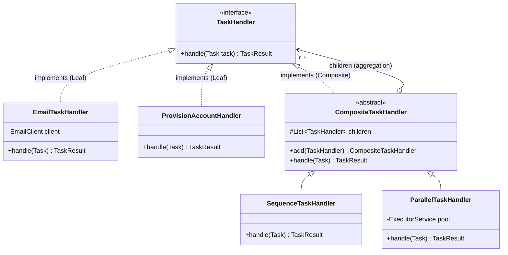

# Composite

> Where this fits in the project: real work is rarely one task. "Onboard a customer" is *provision the account, then send a welcome email, then warm the cache, then notify sales*. "Generate a report" is *fetch ten data sources in parallel, then merge, then render PDF, then upload*. Our `Worker` knows how to run **one** `TaskHandler`. The Composite pattern lets a *tree of tasks* — sequences, parallel fan-outs, nested workflows — be handled by the very same `Worker` calling the very same `handle(Task)` method, because a group of handlers **is itself** a handler. This is the chapter where a workflow DAG stops being a special case and becomes just another node.

---

## 1. Why this exists — the real problem in our Task Queue

Recall the canonical contract from the SPEC:

```java
@FunctionalInterface
public interface TaskHandler {
    TaskResult handle(Task task) throws Exception;
}

public record TaskResult(boolean success, String message, boolean retryable) {}
```

The `Worker` does exactly this, once per task:

```java
TaskHandler handler = registry.lookup(task.type());   // by task.type()
TaskResult result   = handler.handle(task);           // run it, branch on the outcome
```

One type, one handler, one result. Clean — until the product team files this ticket:

> "When a customer signs up, run the onboarding **workflow**: provision their account, then (only if that succeeds) send a welcome email and warm their cache **in parallel**, then notify the sales channel. If provisioning fails, abort the whole thing and dead-letter it."

That is not a task. It is a **tree**:

```text
onboard-customer            (sequence: run children in order, stop on first failure)
├── provision-account       (leaf)
├── fan-out                 (parallel: run children concurrently, all must succeed)
│   ├── send-welcome-email  (leaf)
│   └── warm-cache          (leaf)
└── notify-sales            (leaf)
```

Some nodes are real units of work (**leaves**). Other nodes are *containers* whose job is to orchestrate their children (**composites**: a sequence, a parallel group). The killer requirement is uniformity: the `Worker` must run the *root* of this tree exactly the way it runs a plain `send-email` task — `handler.handle(task)` — with **no idea** whether it is invoking one leaf or a 40-node DAG. And a composite must be able to contain other composites, to any depth, because "fan-out" today becomes "fan-out where one branch is itself a 3-step sequence" tomorrow.

That uniformity — *treat an individual object and a composition of objects the same way* — is the entire Composite pattern.

> Historical note: Composite is a Gang of Four (1994) structural pattern, born from GUI toolkits where a `Button` and a `Panel` (which *contains* buttons and other panels) both had to respond to `paint()` and `getSize()`. The same skeleton powers the DOM (a `Node` is a `Text` leaf or an `Element` that holds child nodes), filesystem trees (a path is a file or a directory of paths), and every workflow engine on earth — Airflow DAGs, Temporal child workflows, AWS Step Functions states. Each is "a thing, or a group of things, addressed identically."

---

## 2. The naive version — and why it bites

### Attempt A: the orchestrator with a giant `switch`

The fastest path is to add one "workflow" handler that hard-codes the tree and branches on structure by hand:

```java
public final class OnboardingWorkflowHandler implements TaskHandler {
    private final TaskHandler provision, email, cache, notify;
    private final ExecutorService pool;

    // constructor wires the four leaf handlers and a thread pool...

    @Override
    public TaskResult handle(Task task) throws Exception {
        // step 1: provision (sequential, must succeed)
        TaskResult r1 = provision.handle(task);
        if (!r1.success()) {
            return new TaskResult(false, "provisioning failed: " + r1.message(), r1.retryable());
        }

        // step 2: email + cache in parallel (both must succeed)
        Future<TaskResult> f1 = pool.submit(() -> email.handle(task));
        Future<TaskResult> f2 = pool.submit(() -> cache.handle(task));
        TaskResult r2 = f1.get(), r3 = f2.get();
        if (!r2.success() || !r3.success()) {
            return new TaskResult(false, "parallel step failed", true);
        }

        // step 3: notify (sequential, best-effort)
        notify.handle(task);
        return new TaskResult(true, "onboarded", false);
    }
}
```

It compiles. It even works for *this* workflow. Now count the ways it rots:

1. **Every new workflow is a new bespoke class.** "Generate report" needs the same sequential/parallel logic copy-pasted into `ReportWorkflowHandler`. The orchestration code (the *how to combine*) is fused to the business steps (the *what*).
2. **The structure is frozen in code.** Product wants to A/B test "email before provisioning" for one cohort? That is a code change, a PR, and a deploy — not a config edit.
3. **It is not recursive.** The moment "warm-cache" needs to become "warm-cache then invalidate-CDN" (a nested sequence inside the parallel branch), the flat `switch` has no answer. You start nesting `if`s and the cyclomatic complexity explodes.
4. **The `Worker` is now special.** Either it special-cases workflow tasks, or this handler smuggles a thread pool and a tree-walk into a class that pretends to be a single `TaskHandler`. The abstraction has a leak the size of a workflow engine.

The root cause: **the client (the `Worker`) is forced to distinguish "single step" from "group of steps."** Composite's promise is to delete that distinction.

---

## 3. The pattern — Intent, Motivation, Problem, Participants

**Intent (GoF):** *Compose objects into tree structures to represent part-whole hierarchies. Composite lets clients treat individual objects and compositions of objects uniformly.*

**Motivation in our project:** the `Worker` should call `handle(Task)` on the root of a workflow and get a single `TaskResult` back, never branching on whether it holds one handler or a hundred. Adding a new *combinator* (a "first-success" group, a "with-timeout" group) must not touch the `Worker` or the leaf handlers.

**Problem statement:** you have a part-whole hierarchy of objects; clients must operate on both the parts (leaves) and the wholes (composites) through one interface, and the hierarchy must nest arbitrarily.

**Participants:**

| Participant | Role | In our project |
|---|---|---|
| **Component** | The common interface for leaves and composites. Declares the operation clients call. | `TaskHandler` (already exists — `handle(Task)`) |
| **Leaf** | A node with no children; does the actual work. | `EmailTaskHandler`, `ProvisionAccountHandler`, any single-step handler |
| **Composite** | A node that holds child Components and implements the operation by delegating to them (in some order/policy). | `SequenceTaskHandler`, `ParallelTaskHandler` |
| **Client** | Manipulates objects through the Component interface, blind to leaf-vs-composite. | The `Worker` (and its `WorkerPool`) |

The crucial, non-obvious move: **the Composite implements the same `Component` interface it aggregates.** A `SequenceTaskHandler` *is* a `TaskHandler` *and* contains `TaskHandler`s. That self-reference is what makes the tree recursive and the client oblivious.

---

## 4. UML — Composite structure



Read the two arrows into `CompositeTaskHandler` together: it **implements** `TaskHandler` (so the `Worker` can call it) and it **aggregates** `TaskHandler` (so it can hold leaves *and other composites*). That loop is the pattern. The aggregation is a hollow diamond — children outlive the composite and can be shared — which we revisit under Tradeoffs.

```mermaid
sequenceDiagram
    participant W as Worker
    participant Seq as SequenceTaskHandler (root)
    participant Prov as ProvisionAccountHandler (leaf)
    participant Par as ParallelTaskHandler
    participant Em as EmailHandler (leaf)
    participant Ca as CacheHandler (leaf)

    W->>Seq: handle(task)
    Seq->>Prov: handle(task)
    Prov-->>Seq: success
    Seq->>Par: handle(task)
    par fan-out
        Par->>Em: handle(task)
        Em-->>Par: success
    and
        Par->>Ca: handle(task)
        Ca-->>Par: success
    end
    Par-->>Seq: success (all children ok)
    Seq-->>W: TaskResult(success, "onboarded")
```

The `Worker` made exactly one call. Everything below `Seq` is recursion the client never sees.

---

## 5. Refactor — the naive code becomes the pattern

We do not touch `TaskHandler`; it is already the Component. We add a Composite base and two combinators.

### The Composite base

```java
import java.util.ArrayList;
import java.util.List;

/**
 * Composite node: a TaskHandler that holds child TaskHandlers.
 * It IS a TaskHandler (so a Worker can run it) and HOLDS TaskHandlers
 * (so it can nest leaves and other composites to any depth).
 */
public abstract class CompositeTaskHandler implements TaskHandler {
    protected final List<TaskHandler> children = new ArrayList<>();

    /** Builder-style child management — returns this for fluent trees. */
    public CompositeTaskHandler add(TaskHandler child) {
        children.add(child);
        return this;
    }

    public List<TaskHandler> children() {
        return List.copyOf(children);   // defensive copy: no external mutation
    }

    // Subclasses define HOW children combine. That is the only varying part.
    @Override
    public abstract TaskResult handle(Task task) throws Exception;
}
```

### Combinator 1 — Sequence (run in order, stop on first failure)

```java
public final class SequenceTaskHandler extends CompositeTaskHandler {

    @Override
    public TaskResult handle(Task task) throws Exception {
        for (TaskHandler child : children) {
            TaskResult r = child.handle(task);
            if (!r.success()) {
                // Short-circuit: propagate the failing child's retryable flag.
                return new TaskResult(false,
                        "sequence aborted: " + r.message(), r.retryable());
            }
        }
        return new TaskResult(true, "sequence complete (" + children.size() + " steps)", false);
    }
}
```

### Combinator 2 — Parallel (fan out, all must succeed)

```java
import java.util.ArrayList;
import java.util.List;
import java.util.concurrent.*;

public final class ParallelTaskHandler extends CompositeTaskHandler {
    private final ExecutorService pool;

    public ParallelTaskHandler(ExecutorService pool) {
        this.pool = pool;   // injected — could be virtual-thread-per-task in Java 21
    }

    @Override
    public TaskResult handle(Task task) throws Exception {
        List<Future<TaskResult>> futures = new ArrayList<>(children.size());
        for (TaskHandler child : children) {
            futures.add(pool.submit(() -> child.handle(task)));
        }
        boolean retryable = false;
        String firstFailure = null;
        for (Future<TaskResult> f : futures) {
            try {
                TaskResult r = f.get();      // wait for each branch
                if (!r.success() && firstFailure == null) {
                    firstFailure = r.message();
                    retryable = r.retryable();
                }
            } catch (ExecutionException e) {
                if (firstFailure == null) firstFailure = e.getCause().getMessage();
                retryable = true;            // an exception is worth retrying
            }
        }
        return firstFailure == null
                ? new TaskResult(true, "all " + children.size() + " branches ok", false)
                : new TaskResult(false, "parallel failure: " + firstFailure, retryable);
    }
}
```

### Building the onboarding workflow — as data, not control flow

```java
ExecutorService pool = Executors.newVirtualThreadPerTaskExecutor();   // Java 21 Loom

TaskHandler onboarding =
    new SequenceTaskHandler()
        .add(new ProvisionAccountHandler())
        .add(new ParallelTaskHandler(pool)
                .add(new EmailTaskHandler(emailClient))
                .add(new WarmCacheHandler(cache)))
        .add(new NotifySalesHandler(slack));

// The Worker has no idea this is a tree. It just runs it:
TaskResult result = onboarding.handle(task);
```

Compare this to `OnboardingWorkflowHandler`: the orchestration logic (`SequenceTaskHandler`, `ParallelTaskHandler`) is written **once** and reused. The workflow shape is now a *value you assemble*, not control flow you hand-write. Want "email before provisioning" for a cohort? Build a different tree. No new class.

---

## 6. Before and after

| Dimension | Naive `OnboardingWorkflowHandler` | Composite |
|---|---|---|
| New workflow | New bespoke class, copy-pasted orchestration | Assemble existing combinators — zero new classes |
| Nesting depth | Flat; deeper nesting means more `if`s | Unlimited — a composite holds composites |
| Worker awareness | Must special-case workflows | Calls `handle(Task)`, blind to structure |
| Reuse of "sequential" / "parallel" logic | Duplicated per workflow | Written once in two combinators |
| Changing shape | Code change + deploy | Re-assemble the tree (can be config-driven) |
| Where complexity lives | Smeared across handlers | Isolated in `Sequence`/`Parallel` |
| Testability | Must mock the whole workflow | Unit-test each combinator with fake leaves |

The naive version optimized for *one* workflow shipping today. Composite optimizes for the *tenth* workflow shipping in six months — which is the one that actually decides whether the codebase is pleasant or a swamp.

---

## 7. A simple Java example — the canonical filesystem tree

Strip away the project to see the bare bones. A filesystem is the textbook Composite: a node is a **file** (leaf) or a **directory** (composite of nodes), and `size()` works on both.

```java
import java.util.ArrayList;
import java.util.List;

sealed interface FsNode permits FileNode, DirNode {
    String name();
    long size();             // the uniform operation — same call on leaf and composite
}

record FileNode(String name, long size) implements FsNode {}

final class DirNode implements FsNode {
    private final String name;
    private final List<FsNode> children = new ArrayList<>();

    DirNode(String name) { this.name = name; }
    DirNode add(FsNode n) { children.add(n); return this; }

    @Override public String name() { return name; }

    @Override
    public long size() {                          // recurse — children may be dirs
        return children.stream().mapToLong(FsNode::size).sum();
    }
}

// usage
FsNode root = new DirNode("/")
        .add(new FileNode("readme.md", 1_200))
        .add(new DirNode("logs")
                .add(new FileNode("app.log", 50_000))
                .add(new FileNode("err.log", 8_000)));

System.out.println(root.size());   // 59200 — client calls size() once, blind to the tree
```

Note the Java 21 `sealed interface`: it makes the *closed* set of node kinds explicit and lets `switch` exhaustiveness checks help us (useful later for the Visitor pattern over the same tree — see [visitor.md](visitor.md)).

---

## 8. A real-world Java example — a validation rule tree

A second domain to cement the shape: a form-validation tree. A validation rule is a leaf; an `AllOf`/`AnyOf` group is a composite. This is exactly how Bean Validation group sequences and rule engines work.

```java
import java.util.ArrayList;
import java.util.List;

@FunctionalInterface
interface Rule {
    boolean isValid(String input);          // Component
}

final class NotBlank implements Rule {       // Leaf
    public boolean isValid(String s) { return s != null && !s.isBlank(); }
}

final class MaxLength implements Rule {      // Leaf
    private final int max;
    MaxLength(int max) { this.max = max; }
    public boolean isValid(String s) { return s != null && s.length() <= max; }
}

final class AllOf implements Rule {          // Composite: every child must pass
    private final List<Rule> rules = new ArrayList<>();
    AllOf add(Rule r) { rules.add(r); return this; }
    public boolean isValid(String s) {
        return rules.stream().allMatch(r -> r.isValid(s));
    }
}

final class AnyOf implements Rule {          // Composite: at least one child must pass
    private final List<Rule> rules = new ArrayList<>();
    AnyOf add(Rule r) { rules.add(r); return this; }
    public boolean isValid(String s) {
        return rules.stream().anyMatch(r -> r.isValid(s));
    }
}

// usage — a tree of rules, applied through one isValid() call
Rule username = new AllOf()
        .add(new NotBlank())
        .add(new MaxLength(20))
        .add(new AnyOf()                      // nested composite
                .add(new MaxLength(3))        // short names ok...
                .add(new NotBlank()));        // ...or any non-blank

boolean ok = username.isValid("alice");
```

`AllOf`/`AnyOf` are the same combinators as `Sequence`/`Parallel`, just over booleans instead of `TaskResult`s. Once you see the shape, you see it everywhere — including `Predicate.and`/`Predicate.or` in the JDK, which build a Composite of predicates for you.

---

## 9. The project-integration example — a persistable workflow DAG

The combinators above are fine for code-defined trees. But production workflows live in the database (Phase 2's PostgreSQL), get versioned, and get assembled from a JSON definition submitted via `POST /tasks`. Here is the production-grade slice: a recursive workflow definition, a factory that builds the Composite tree from it, and a single handler that the `Worker` runs like any other task.

### The workflow definition (data)

```java
import java.util.List;

/** A node kind in the persisted DAG. Sealed → exhaustive, JSON-mappable. */
public sealed interface WorkflowNode
        permits WorkflowNode.LeafNode, WorkflowNode.SequenceNode, WorkflowNode.ParallelNode {

    record LeafNode(String taskType) implements WorkflowNode {}
    record SequenceNode(List<WorkflowNode> children) implements WorkflowNode {}
    record ParallelNode(List<WorkflowNode> children) implements WorkflowNode {}
}
```

### The factory — definition → Composite tree

```java
import java.util.concurrent.ExecutorService;

/** Turns a persisted WorkflowNode tree into an executable TaskHandler tree. */
public final class WorkflowFactory {
    private final HandlerRegistry registry;     // resolves leaf task types → handlers
    private final ExecutorService pool;

    public WorkflowFactory(HandlerRegistry registry, ExecutorService pool) {
        this.registry = registry;
        this.pool = pool;
    }

    public TaskHandler build(WorkflowNode node) {
        return switch (node) {                          // Java 21 pattern switch
            case WorkflowNode.LeafNode leaf ->
                    registry.lookup(leaf.taskType());   // a real leaf TaskHandler

            case WorkflowNode.SequenceNode seq -> {
                var c = new SequenceTaskHandler();
                seq.children().forEach(child -> c.add(build(child)));   // recurse
                yield c;
            }
            case WorkflowNode.ParallelNode par -> {
                var c = new ParallelTaskHandler(pool);
                par.children().forEach(child -> c.add(build(child)));   // recurse
                yield c;
            }
        };
    }
}
```

### Wiring into the Worker — one handler type for everything

```java
/** A single handler registered under the "workflow" task type. */
public final class WorkflowTaskHandler implements TaskHandler {
    private final WorkflowFactory factory;
    private final WorkflowStore store;          // loads the DAG by id from Postgres

    public WorkflowTaskHandler(WorkflowFactory factory, WorkflowStore store) {
        this.factory = factory;
        this.store = store;
    }

    @Override
    public TaskResult handle(Task task) throws Exception {
        WorkflowNode root = store.load(task.payload());   // payload = workflow id (JSON)
        TaskHandler tree = factory.build(root);           // assemble the Composite
        return tree.handle(task);                         // run it — Worker stays blind
    }
}
```

Now `registry.lookup("workflow")` returns a `WorkflowTaskHandler`, and the `Worker` runs a 40-node DAG with the exact same line of code it uses for `send-email`:

```java
TaskHandler handler = registry.lookup(task.type());
TaskResult result   = handler.handle(task);   // workflow or leaf — identical
```

This is Composite paying off across phases: the [worker pool / executor](../06-concurrency/executor-service.md) is untouched, the [REST/layered architecture](../04-oop-and-ood/layered-architecture.md) submits a `workflow` task like any other, and the tree composes with the [Decorator chapter's](decorator.md) cross-cutting wrappers — you can wrap the *whole tree* (or any subtree) in retries and metrics, because a decorated handler is still just a `TaskHandler`.

---

## 10. Production notes

### Where this is used in industry

- **Workflow engines.** Airflow DAGs, Temporal child workflows, Argo Workflows, AWS Step Functions — every one models a graph of steps where a "group" step is itself a step. That is Composite (with a topological ordering layered on top).
- **UI toolkits / the DOM.** A `View`/`Element` is a leaf or a container of views; `render()`/`measure()` work uniformly. React's component tree is Composite to its core.
- **Query and expression trees.** `AND(a, OR(b, c))` in a query planner; `Predicate` composition in Java (`Predicate::and`/`Predicate::or` build a Composite for you).
- **Build systems and `java.io`.** Maven/Gradle reactor modules; a `Path` is a file or a directory of paths.
- **Org charts, BOMs, menu trees, RBAC permission groups** — any part-whole hierarchy.

### When NOT to use Composite

- **The hierarchy is flat or fixed-depth.** If a "group" can never contain another group, you do not need recursion; a `List<TaskHandler>` and a loop is simpler. Do not invent a tree to hold two siblings.
- **Leaves and composites genuinely diverge.** Composite's whole value is a *uniform* interface. If a composite must expose `add()`/`remove()` that make no sense on a leaf, you face the classic dilemma (below) and may be better served by separate types.
- **The structure is really a general graph, not a tree.** Composite assumes a tree (one parent). A workflow DAG where one node has multiple parents (diamond dependencies) needs a real DAG executor with dependency edges, not naive parent-child recursion — otherwise a shared node runs twice.
- **Ordering/dependencies between non-parent-child nodes matter.** Composite captures part-whole, not "B depends on A and C." For arbitrary dependency edges, reach for a topological scheduler.

### Common anti-patterns

- **The transparency-vs-safety trap.** GoF's "transparent" Composite declares `add(child)`/`remove(child)` on the *Component* interface so clients treat all nodes identically — but then a `Leaf` must implement `add()`, usually by throwing `UnsupportedOperationException`. That is a [Liskov](../04-oop-and-ood/solid.md) violation: the leaf lies about its contract. The "safe" alternative (our choice) puts child management only on `CompositeTaskHandler`, so the compiler stops you from `add()`-ing to a leaf — at the cost of clients sometimes downcasting to add children. Prefer safety; assemble trees through composite-typed builders so the cast never happens.
- **Stateful leaves shared across the tree.** Aggregation lets a leaf be referenced by two composites. If that leaf carries mutable per-run state, two branches stomp on it. Keep leaves stateless (pass state through the `Task`), or use composition (each parent owns its child).
- **Swallowing partial failures.** A naive `ParallelTaskHandler` that returns `success` if *any* child succeeds hides real failures. Decide the policy explicitly (all-must-succeed vs best-effort) and report *which* child failed — observability dies otherwise.
- **Unbounded recursion / deep trees.** A pathologically deep `Sequence` of `Sequence`s can blow the stack. Cap depth at the factory, or convert recursion to an explicit work-stack for adversarial input.
- **Hidden thread-pool coupling.** A `ParallelTaskHandler` that `new`s its own pool leaks threads per workflow. Inject the pool (we do) so the platform owns lifecycle and sizing.

---

## 11. Exercises

### Easy

**E1 (knowledge check).** In Composite, what makes the structure *recursive* — i.e., which single design decision lets a workflow nest to arbitrary depth? Name the two relationships the Composite class has with the Component interface.

**E2 (coding).** Add a `FirstSuccessTaskHandler` composite: it runs children in order and returns `success` on the **first** child that succeeds, only failing if **all** children fail. (Think: "try the primary email provider, then the fallback.")

### Medium

**M1 (coding).** Add a `size()`-style operation to the tree: a method `int leafCount()` on `CompositeTaskHandler` and a default on `TaskHandler` that returns the number of leaf handlers in the (sub)tree. A leaf counts as 1; a composite is the sum of its children. Do it without `instanceof` chains in the calling code.

**M2 (refactoring).** Below is a `ReportWorkflowHandler` written in the naive style. Refactor it to use the `SequenceTaskHandler`/`ParallelTaskHandler` combinators. Show the assembled tree.

```java
public final class ReportWorkflowHandler implements TaskHandler {
    private final TaskHandler fetchA, fetchB, merge, render;
    private final ExecutorService pool;
    // ... constructor ...

    @Override
    public TaskResult handle(Task task) throws Exception {
        Future<TaskResult> a = pool.submit(() -> fetchA.handle(task));
        Future<TaskResult> b = pool.submit(() -> fetchB.handle(task));
        if (!a.get().success() || !b.get().success())
            return new TaskResult(false, "fetch failed", true);
        if (!merge.handle(task).success())
            return new TaskResult(false, "merge failed", false);
        return render.handle(task);
    }
}
```

### Hard

**H1 (design).** Our `ParallelTaskHandler` waits for *all* children even after one fails. Design a **fail-fast** variant that cancels the remaining in-flight children as soon as one fails, using Java 21's `StructuredTaskScope`. Discuss the failure semantics and what happens to a child that is mid-network-call when cancelled.

**H2 (pattern identification).** A teammate proposes representing the workflow as a `Map<String, List<String>>` of node-id → dependency-ids and running a topological sort. Is that Composite? When is their model *more* correct than ours, and when is it overkill? Give the decision rule.

---

## 12. Solutions

### E1

The recursive decision is that **the Composite implements the same Component interface it aggregates.** `CompositeTaskHandler` (a) `implements TaskHandler` and (b) holds a `List<TaskHandler>`. Because the list element type is the *interface*, a composite can hold leaves **and other composites** — that self-reference is exactly what makes the tree nest without bound. The two relationships: *realization* (implements `TaskHandler`) and *aggregation* (has-a `List<TaskHandler>`).

### E2

```java
public final class FirstSuccessTaskHandler extends CompositeTaskHandler {
    @Override
    public TaskResult handle(Task task) throws Exception {
        String lastMsg = "no children";
        boolean retryable = false;
        for (TaskHandler child : children) {
            TaskResult r = child.handle(task);
            if (r.success()) {
                return new TaskResult(true, "succeeded via fallback", false);
            }
            lastMsg = r.message();
            retryable = r.retryable();
        }
        return new TaskResult(false, "all candidates failed: " + lastMsg, retryable);
    }
}

// usage: primary provider, then fallback — both are leaves
TaskHandler resilientEmail = new FirstSuccessTaskHandler()
        .add(new EmailTaskHandler(sendgrid))
        .add(new EmailTaskHandler(ses));
```

Because it extends `CompositeTaskHandler`, it composes with everything else — you can nest a `FirstSuccess` inside a `Parallel` inside a `Sequence` for free.

### M1

Put a default on the Component so every leaf answers "1," and override in the Composite to recurse. No `instanceof` at the call site.

```java
@FunctionalInterface
public interface TaskHandler {
    TaskResult handle(Task task) throws Exception;

    default int leafCount() { return 1; }   // a leaf is one unit of work
}

// in CompositeTaskHandler:
@Override
public int leafCount() {
    return children.stream().mapToInt(TaskHandler::leafCount).sum();   // recurse
}
```

```java
int totalLeaves = onboarding.leafCount();   // 4, whatever the nesting — no casts
```

The recursion is invisible to the caller: a leaf returns 1, a composite sums its children (each of which is itself a leaf or composite). This is the same shape as the filesystem `size()` example — `leafCount` is just another *uniform operation* over the tree.

### M2

The bespoke `ReportWorkflowHandler` is a `parallel(fetchA, fetchB)` followed by `merge` followed by `render` — a sequence whose first step is a parallel group. Assembled with combinators:

```java
TaskHandler report =
    new SequenceTaskHandler()
        .add(new ParallelTaskHandler(pool)
                .add(fetchA)
                .add(fetchB))
        .add(merge)
        .add(render);

TaskResult result = report.handle(task);
```

The orchestration logic vanishes — `ReportWorkflowHandler` is now *data*, not a class. The `fetch failed` / `merge failed` reporting is handled by the combinators' message propagation, and `render`'s own `TaskResult` flows out of the sequence unchanged.

### H1

Use `StructuredTaskScope.ShutdownOnFailure`: it forks each child as a subtask and, the instant any subtask throws, *cancels the rest* (interrupts their carrier threads) and unblocks `join()`.

```java
import java.util.ArrayList;
import java.util.List;
import java.util.concurrent.StructuredTaskScope;

public final class FailFastParallelTaskHandler extends CompositeTaskHandler {
    @Override
    public TaskResult handle(Task task) throws Exception {
        try (var scope = new StructuredTaskScope.ShutdownOnFailure()) {
            List<StructuredTaskScope.Subtask<TaskResult>> subs = new ArrayList<>();
            for (TaskHandler child : children) {
                subs.add(scope.fork(() -> {
                    TaskResult r = child.handle(task);
                    if (!r.success()) {
                        throw new WorkflowStepException(r.message(), r.retryable());
                    }
                    return r;
                }));
            }
            scope.join();              // blocks until all done OR one fails
            scope.throwIfFailed();     // re-throws the first failure
            return new TaskResult(true, "all " + children.size() + " branches ok", false);
        } catch (WorkflowStepException e) {
            return new TaskResult(false, "fail-fast: " + e.getMessage(), e.retryable());
        }
    }
}
```

**Failure semantics:** the first failing child wins; siblings are *interrupted* (`Thread.interrupt()` on their virtual threads), so blocking I/O that respects interrupts (`InterruptedException`) unwinds promptly. A child mid-network-call that does **not** check interruption (e.g., a socket read with no timeout) will *not* stop instantly — interruption is cooperative. Practical guidance: give leaf handlers I/O timeouts so cancellation is effective, and make them **idempotent**, because a cancelled-but-already-sent request (e.g., the email left before the interrupt landed) may still have a side effect — see [idempotency.md](../08-distributed-systems/idempotency.md).

### H2

The `Map<id, List<dep-ids>>` model is **not** Composite — it is a **DAG with explicit dependency edges**, executed by a topological scheduler. The decision rule:

- **Use Composite** when the structure is a *tree* (each node has exactly one parent) and grouping is purely *part-whole*: "this sequence contains these steps." Most workflows that are nested sequences and parallel groups fit this cleanly, and Composite keeps the `Worker` blind to structure.
- **Use a DAG scheduler** when nodes have *cross-cutting dependencies* that are not parent-child — e.g., step D depends on both B and C, which live in different branches (a *diamond*). Composite cannot express "shared downstream join" without running the shared node twice or hacking in references.

Rule of thumb: **if you can draw the workflow as an indented outline, it is Composite; if you need arrows that cross between branches, it is a DAG.** Their model is *more correct* for diamond dependencies and shared joins; it is *overkill* (extra topological-sort machinery, harder to read, no natural recursion) for the common case of straight sequences and independent fan-outs. Many real engines layer both: Composite for the readable shape, a scheduler underneath for the edges.

---

## 13. Interview questions and takeaways

1. **What problem does Composite solve, in one sentence?**
   It lets clients treat an individual object and a tree of objects uniformly, by making the container implement the same interface as the things it contains.

2. **What is the single design move that makes Composite recursive?**
   The Composite *implements* the Component interface it *aggregates* — so a composite can contain leaves and other composites without limit.

3. **Transparency vs safety — explain the tradeoff.**
   Transparent Composite declares `add`/`remove` on the Component so all nodes look identical, but forces leaves to implement no-op/throwing child methods (Liskov violation). Safe Composite confines child management to the Composite type — compiler-enforced correctness, at the cost of occasional downcasts. Prefer safe; assemble via composite-typed builders.

4. **Composite vs Decorator — both wrap a Component. How do they differ?**
   Decorator wraps *exactly one* child to *add behavior* (a linear chain). Composite holds *many* children to *aggregate* them (a tree). Same Component interface, different cardinality and intent. They compose: decorate a composite, or put decorated leaves in a composite.

5. **Composite vs a plain `List` of handlers — when is the pattern justified?**
   A flat list and a loop suffice when there is no nesting. Composite earns its keep the moment a "group" can itself contain groups — i.e., when you need recursion and a uniform client.

6. **How would you compute an aggregate (total cost, leaf count, max depth) over a Composite tree?**
   Define the operation on the Component, return a base value in the leaf, and recurse-and-combine in the composite (sum/max/etc.). For many such operations over a stable structure, prefer Visitor to avoid bloating the Component interface — [visitor.md](visitor.md).

7. **Where does Composite appear in the JDK / common frameworks?**
   `Predicate.and/or` composition, Swing `Container`/`Component`, the DOM, file trees, and Airflow/Temporal/Step Functions workflow graphs.

**Takeaways:** Composite is "a thing, or a group of things, addressed the same way." The container implements *and* holds the Component interface — that loop is the whole pattern. Choose *safe* over *transparent* in typed languages. Know its boundary: trees yes, general DAGs no.

---

## 14. Production considerations

- **Partial-failure observability.** A composite must report *which* leaf failed and how far the tree got. Emit a span per node (OpenTelemetry) and a Micrometer counter per task type so a Grafana panel shows "onboarding workflows stuck at provision-account." A boolean `success` with no breadcrumb is an on-call nightmare.
- **Idempotency and retries.** When the [retry handler](../08-distributed-systems/retries.md) re-runs a failed workflow task, it re-runs the *whole tree*. Leaves that already succeeded will run **again**. Make leaves idempotent ([idempotency.md](../08-distributed-systems/idempotency.md)) or persist per-node progress and skip completed nodes on replay. This is the #1 production gotcha with composite workflows.
- **Thread-pool sizing for parallel nodes.** Nested `ParallelTaskHandler`s can fan out multiplicatively (a parallel of parallels). On platform threads this exhausts the pool and deadlocks (children waiting for threads the parents hold). Java 21 **virtual threads** (`newVirtualThreadPerTaskExecutor`) sidestep the deadlock — cheap threads, no pool starvation — but you still need [backpressure](../08-distributed-systems/backpressure.md) so a million-leaf workflow does not melt downstream services.
- **Timeouts and cancellation.** Give every leaf an I/O timeout; otherwise a hung child stalls its whole composite (and a fail-fast scope can't actually cancel an uninterruptible blocking call).
- **Depth and size limits.** Validate workflow definitions at submission (`POST /tasks`): cap node count and tree depth, reject cycles, reject diamonds if your executor can't handle them. A malicious or buggy definition should fail at the API, not at runtime in a `Worker`.
- **Versioning.** Persisted DAGs change. Pin a `workflowVersion` so an in-flight task replays against the *same* definition it started with, not whatever shipped this morning.

---

## What We Can Improve In Our Project Using This Concept

Today the `Worker` runs exactly one `TaskHandler` per `Task`, so any multi-step business process (onboarding, report generation, batch fan-out) has to be a hand-rolled orchestrator class. We can introduce `CompositeTaskHandler` with `SequenceTaskHandler` and `ParallelTaskHandler` combinators, register a single `WorkflowTaskHandler` under the `workflow` task type, and let workflows be *assembled* from a persisted, versioned `WorkflowNode` definition. The `Worker`, `WorkerPool`, and REST API stay untouched — a workflow is just another task. This unlocks DAG-shaped work without a bespoke class per workflow and composes cleanly with our Decorator-based retries/metrics.

## Project Refactoring Task

1. Add `CompositeTaskHandler` (abstract base with `add`/`children`) implementing `TaskHandler`.
2. Add `SequenceTaskHandler`, `ParallelTaskHandler` (pool injected), and `FirstSuccessTaskHandler`.
3. Add the sealed `WorkflowNode` (`LeafNode`/`SequenceNode`/`ParallelNode`), a `WorkflowFactory` that builds the tree via a Java 21 pattern `switch`, and a `WorkflowTaskHandler` registered under `"workflow"`.
4. Add submission-time validation (max depth, max nodes, no cycles) and a `leafCount()` default for metrics.
5. Tests (JUnit 5 + AssertJ): a `Sequence` short-circuits on first failure; a `Parallel` reports the first failing child; a nested tree (parallel-inside-sequence) runs leaves in the right order; the `WorkflowFactory` builds the expected tree from JSON.

## Git Commit For This Chapter

```text
feat(workflow): add Composite task handlers for nested sequence/parallel workflows

Introduce CompositeTaskHandler with Sequence/Parallel/FirstSuccess combinators so a
tree of TaskHandlers is itself a TaskHandler. Add sealed WorkflowNode definition,
WorkflowFactory (pattern-switch builder), and a WorkflowTaskHandler registered under
the "workflow" type — Worker and WorkerPool run a DAG via the same handle(Task) call.
Add submission-time depth/size/cycle validation and leafCount() for metrics.

Files:
  src/main/java/com/taskq/workflow/CompositeTaskHandler.java
  src/main/java/com/taskq/workflow/SequenceTaskHandler.java
  src/main/java/com/taskq/workflow/ParallelTaskHandler.java
  src/main/java/com/taskq/workflow/FirstSuccessTaskHandler.java
  src/main/java/com/taskq/workflow/WorkflowNode.java
  src/main/java/com/taskq/workflow/WorkflowFactory.java
  src/main/java/com/taskq/workflow/WorkflowTaskHandler.java
  src/main/java/com/taskq/handler/TaskHandler.java        (add default leafCount())
  src/test/java/com/taskq/workflow/CompositeTaskHandlerTest.java
  src/test/java/com/taskq/workflow/WorkflowFactoryTest.java
```

## Architecture Impact

Composite adds a recursive node layer *between* the `Worker` and the leaf handlers without changing either. The `Worker` still calls `registry.lookup(type).handle(task)`; for `type == "workflow"` it transparently drives a tree. This keeps the part-whole hierarchy out of the worker loop and isolates orchestration policy (sequential vs parallel vs first-success) in small, testable combinators. It interlocks with Decorator (wrap any node/subtree in retries/metrics), with the [scheduling queue](../07-queues-and-messaging/scheduling-queues.md) (a workflow can be a scheduled task), and sets up the boundary where, for true diamond-dependency DAGs, we would graduate to a topological scheduler. Risk surface concentrates in two places: parallel-node thread usage (mitigated by virtual threads + backpressure) and retry idempotency (mitigated by per-node progress tracking).

## Interview Takeaways

- Composite = "an object, or a tree of objects, used identically," achieved by the container implementing the same interface it aggregates.
- That self-reference (implements *and* holds the Component) is what makes the structure recursive and the client blind to depth.
- Prefer the *safe* variant (child management on the Composite, not the Component) over the *transparent* one to avoid Liskov violations on leaves.
- It is *not* a general DAG: trees with part-whole grouping yes, cross-branch dependency edges no — those need a topological scheduler.
- In production, the hard parts are partial-failure observability, retry idempotency over a whole tree, and bounding parallel fan-out — solve those before the structure itself.
