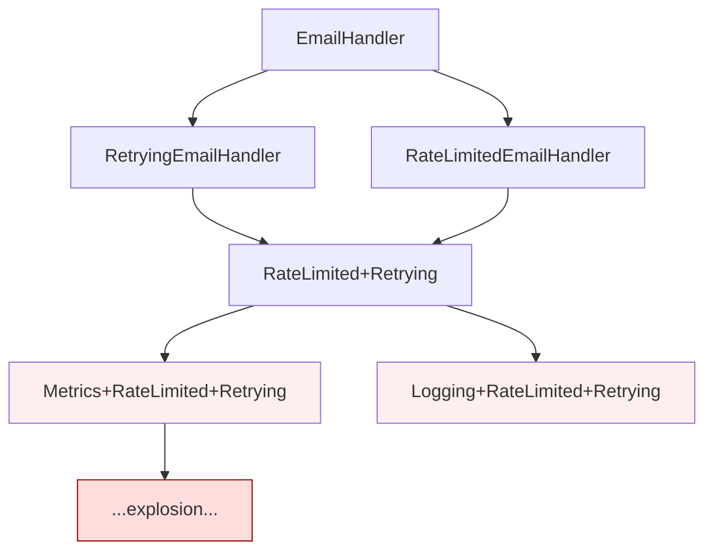
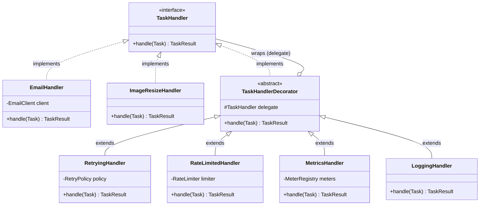
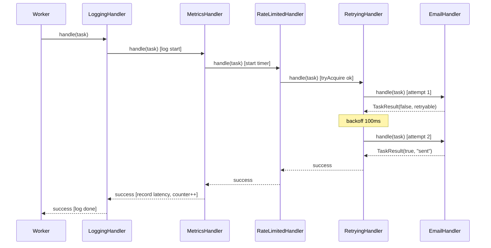

# Decorator

> Where this fits in the project: a `TaskHandler` does *one* job — execute the business logic for a task type (send an email, resize an image). But in production every handler also needs retries, rate limiting, metrics, logging, and timeouts wrapped *around* that logic. Decorator lets us add each of these as an independent, composable layer that wraps a handler at runtime, so a bare `EmailHandler` and a fully-armored production handler share the exact same `TaskHandler` interface. This is the concrete payoff of **composition over inheritance**.

In the Distributed Task Queue, the `Worker` looks up a `TaskHandler` by task type and calls `handle(task)`. The handler's *only* responsibility should be the domain work. Yet the platform demands cross-cutting behavior on *every* handler: retry on transient failure, refuse work when over the rate limit, time the execution and emit metrics, and log entry/exit with the task id. If we bake all of that into each handler — or build it with inheritance — we get either copy-paste or a combinatorial explosion of subclasses. Decorator dissolves the problem: each concern becomes a thin wrapper that implements `TaskHandler`, holds a reference to an inner `TaskHandler`, adds its behavior, and delegates. You stack them like Russian dolls: `MetricsHandler(RateLimitedHandler(RetryingHandler(new EmailHandler())))`.

---

## 1. Why This Exists — The Real Problem

Start from the canonical model. A `TaskHandler` is a functional interface; its whole contract is one method:

```java
public enum TaskStatus { PENDING, SCHEDULED, RUNNING, SUCCEEDED, FAILED, RETRYING, DEAD }

public record Task(
        String id,            // a UUID
        String type,          // e.g. "email.send", "image.resize"
        String payload,       // JSON string
        TaskStatus status,
        int attempts,
        int maxAttempts,
        Instant createdAt,
        Instant scheduledAt,
        int priority) {}

public record TaskResult(boolean success, String message, boolean retryable) {}

@FunctionalInterface
public interface TaskHandler {
    TaskResult handle(Task task) throws Exception;
}
```

A pristine domain handler is tiny and testable:

```java
public final class EmailHandler implements TaskHandler {
    private final EmailClient client;

    public EmailHandler(EmailClient client) {
        this.client = client;
    }

    @Override
    public TaskResult handle(Task task) throws Exception {
        // payload is JSON: {"to":"a@b.com","subject":"Hi","body":"..."}
        SendOutcome outcome = client.send(task.payload());
        return outcome.accepted()
                ? new TaskResult(true, "sent id=" + outcome.providerId(), false)
                : new TaskResult(false, "provider rejected: " + outcome.reason(), outcome.transient());
    }
}
```

Beautiful — for about a day. Then production asks for:

1. **Retry** transient failures with an [`ExponentialBackoffRetryPolicy`](strategy.md) instead of failing immediately.
2. **Rate limit** outbound email to protect the provider's quota (token bucket).
3. **Metrics**: count successes/failures, time each execution, expose to Prometheus.
4. **Logging**: log task id on entry and the outcome on exit, with timing.
5. **Timeout**: abort a handler that hangs longer than N seconds.

None of these are domain logic. All of them apply to *every* handler type (`EmailHandler`, `ImageResizeHandler`, `WebhookHandler`, …). The question is: **where does this behavior live, and how do we avoid writing it once per handler?**

### The forces in tension

| Force | What goes wrong if ignored |
|---|---|
| **Single Responsibility** | A handler that also retries, limits, times, and logs has five reasons to change. |
| **Open/Closed** | Adding "timeout" should *add* code, not edit every handler. |
| **Combinatorial growth** | 4 handlers × {retry?, limit?, metrics?, log?} = up to 64 behavior combinations. |
| **Per-task configuration** | The `image.resize` handler needs retries but no rate limit; `email.send` needs both. The combination must be chosen *at wiring time*, not compile time. |
| **Ordering** | Metrics must wrap retries (to count *all* attempts) but logging may wrap metrics. Order is a runtime decision. |

Decorator is the pattern that satisfies all five at once.

---

## 2. The Naive Version — and Why It Hurts

### Naive attempt A: stuff everything into the handler

```java
// ANTI-PATTERN: one handler does five jobs.
public final class EmailHandler implements TaskHandler {
    private final EmailClient client;
    private final RetryPolicy retryPolicy;
    private final RateLimiter rateLimiter;
    private final MeterRegistry meters;
    private static final System.Logger LOG = System.getLogger("EmailHandler");

    public EmailHandler(EmailClient client, RetryPolicy retryPolicy,
                        RateLimiter rateLimiter, MeterRegistry meters) {
        this.client = client;
        this.retryPolicy = retryPolicy;
        this.rateLimiter = rateLimiter;
        this.meters = meters;
    }

    @Override
    public TaskResult handle(Task task) throws Exception {
        LOG.log(System.Logger.Level.INFO, "start " + task.id());
        long start = System.nanoTime();
        if (!rateLimiter.tryAcquire()) {
            return new TaskResult(false, "rate limited", true);
        }
        int attempt = 0;
        while (true) {
            try {
                SendOutcome outcome = client.send(task.payload());
                if (outcome.accepted()) {
                    meters.counter("task.success", "type", task.type()).increment();
                    return new TaskResult(true, "sent", false);
                }
                if (!outcome.transient()) {
                    return new TaskResult(false, "permanent", false);
                }
            } catch (Exception e) {
                // fall through to retry decision
            }
            Optional<Duration> delay = retryPolicy.nextDelay(++attempt);
            if (delay.isEmpty()) {
                meters.counter("task.failure", "type", task.type()).increment();
                return new TaskResult(false, "exhausted", false);
            }
            Thread.sleep(delay.get().toMillis());
            meters.timer("task.latency").record(System.nanoTime() - start, TimeUnit.NANOSECONDS);
        }
    }
}
```

Problems, in order of severity:

- **Five responsibilities in one class.** It violates SRP (see [../04-oop-and-ood/solid.md](../04-oop-and-ood/solid.md)) and is brutal to unit-test: you cannot test "does retry stop after maxAttempts?" without a real `EmailClient`, `MeterRegistry`, and `RateLimiter`.
- **Copy-paste across handlers.** Every new handler (`ImageResizeHandler`, `WebhookHandler`) duplicates the retry/limit/metrics/log scaffolding. A bug in the retry loop must be fixed in N places.
- **No per-type configuration.** You cannot say "image.resize retries but isn't rate-limited" without editing the class.
- **Tangled ordering.** Metrics timing now spans the rate-limit check; logging is hardwired first. You cannot reorder without rewriting.

### Naive attempt B: inheritance (the subclass explosion)

"Use a base class," says the OOP reflex. Make `RetryingEmailHandler extends EmailHandler`, `RateLimitedEmailHandler extends EmailHandler`. Now you need retry *and* rate limit, so `RateLimitedRetryingEmailHandler`. Add metrics: `MetricsRateLimitedRetryingEmailHandler`. And you must repeat the whole tree for `ImageResizeHandler`.



For `k` independent concerns you need up to `2^k` subclasses **per handler type**, and inheritance is static — chosen at compile time, fixed forever, and impossible to reorder. This is the textbook scenario the Gang of Four invented Decorator to kill. See [../02-core-oop/chapter-17-composition-vs-inheritance.md](../02-core-oop/chapter-17-composition-vs-inheritance.md) for the general principle.

---

## 3. The Pattern — Intent, Motivation, Participants

> **Intent (GoF):** Attach additional responsibilities to an object dynamically. Decorators provide a flexible alternative to subclassing for extending functionality.

**Motivation in our project:** We want to layer retry, rate limiting, metrics, and logging onto any `TaskHandler` without modifying the handler and without creating a class per combination. Each layer is an object that *is-a* `TaskHandler` and *has-a* `TaskHandler`, adding behavior before/after delegating.

**Problem statement:** Given a stable interface (`TaskHandler`) with many concrete implementations and several orthogonal, cross-cutting behaviors, add any subset of those behaviors in any order to any implementation, choosing the combination at runtime.

**Participants:**

| GoF role | In our project | Responsibility |
|---|---|---|
| **Component** | `TaskHandler` | The common interface for both the core object and its wrappers. |
| **ConcreteComponent** | `EmailHandler`, `ImageResizeHandler` | The real domain logic being wrapped. |
| **Decorator** (abstract) | `TaskHandlerDecorator` | Holds a reference to a wrapped `TaskHandler` and conforms to its interface, delegating by default. |
| **ConcreteDecorator** | `RetryingHandler`, `RateLimitedHandler`, `MetricsHandler`, `LoggingHandler` | Adds one behavior around the delegate's `handle`. |

The key structural property: **a decorator is the same type as the thing it wraps.** That is why decorators stack — each one accepts and returns a `TaskHandler`.

### UML class diagram



Read the diagram carefully: `TaskHandlerDecorator` both **implements** `TaskHandler` (so it can be used anywhere a handler is) **and aggregates** a `TaskHandler` (the open-diamond `o--`, since the wrapped handler can exist independently). The recursion in that one relationship is the entire pattern.

---

## 4. Refactor — Building the Decorators

### The abstract base decorator

```java
/** Base class for all TaskHandler decorators: same type as what it wraps. */
public abstract class TaskHandlerDecorator implements TaskHandler {
    protected final TaskHandler delegate;

    protected TaskHandlerDecorator(TaskHandler delegate) {
        this.delegate = Objects.requireNonNull(delegate, "delegate");
    }

    // Default behavior is pure delegation; subclasses override to add behavior.
    @Override
    public TaskResult handle(Task task) throws Exception {
        return delegate.handle(task);
    }
}
```

The base class is optional but valuable: it captures the `delegate` field, the null check, and the default pass-through, so each concrete decorator only writes the *delta*. (Java also lets you skip the abstract base and have each decorator implement `TaskHandler` directly — see the functional shortcut in §14.)

### LoggingHandler — the simplest decorator

```java
public final class LoggingHandler extends TaskHandlerDecorator {
    private static final System.Logger LOG = System.getLogger("task.handler");

    public LoggingHandler(TaskHandler delegate) {
        super(delegate);
    }

    @Override
    public TaskResult handle(Task task) throws Exception {
        LOG.log(System.Logger.Level.INFO,
                "handle start id={0} type={1} attempt={2}",
                task.id(), task.type(), task.attempts());
        try {
            TaskResult result = delegate.handle(task);
            LOG.log(System.Logger.Level.INFO,
                    "handle done id={0} success={1} msg={2}",
                    task.id(), result.success(), result.message());
            return result;
        } catch (Exception e) {
            LOG.log(System.Logger.Level.ERROR, "handle threw id=" + task.id(), e);
            throw e;
        }
    }
}
```

### MetricsHandler — time and count, then delegate

```java
public final class MetricsHandler extends TaskHandlerDecorator {
    private final MeterRegistry meters;

    public MetricsHandler(TaskHandler delegate, MeterRegistry meters) {
        super(delegate);
        this.meters = Objects.requireNonNull(meters, "meters");
    }

    @Override
    public TaskResult handle(Task task) throws Exception {
        Timer.Sample sample = Timer.start(meters);
        String type = task.type();
        try {
            TaskResult result = delegate.handle(task);
            String outcome = result.success() ? "success"
                           : result.retryable() ? "retryable_failure"
                           : "permanent_failure";
            meters.counter("task.handle", "type", type, "outcome", outcome).increment();
            return result;
        } catch (Exception e) {
            meters.counter("task.handle", "type", type, "outcome", "error").increment();
            throw e;
        } finally {
            sample.stop(meters.timer("task.handle.latency", "type", type));
        }
    }
}
```

### RateLimitedHandler — admit or shed load

```java
public final class RateLimitedHandler extends TaskHandlerDecorator {
    private final RateLimiter limiter;

    public RateLimitedHandler(TaskHandler delegate, RateLimiter limiter) {
        super(delegate);
        this.limiter = Objects.requireNonNull(limiter, "limiter");
    }

    @Override
    public TaskResult handle(Task task) throws Exception {
        if (!limiter.tryAcquire()) {
            // Retryable so the task is re-queued, not dead-lettered.
            return new TaskResult(false, "rate limited for type=" + task.type(), true);
        }
        return delegate.handle(task);
    }
}
```

### RetryingHandler — the substantive decorator

```java
public final class RetryingHandler extends TaskHandlerDecorator {
    private final RetryPolicy policy;

    public RetryingHandler(TaskHandler delegate, RetryPolicy policy) {
        super(delegate);
        this.policy = Objects.requireNonNull(policy, "policy");
    }

    @Override
    public TaskResult handle(Task task) throws Exception {
        int attempt = 0;
        TaskResult last = new TaskResult(false, "not yet attempted", true);
        while (true) {
            try {
                TaskResult result = delegate.handle(task);
                if (result.success() || !result.retryable()) {
                    return result; // success or permanent failure: stop now
                }
                last = result;
            } catch (Exception e) {
                // Treat thrown exceptions as retryable failures.
                last = new TaskResult(false, "threw: " + e.getMessage(), true);
            }
            Optional<Duration> delay = policy.nextDelay(++attempt);
            if (delay.isEmpty()) {
                return new TaskResult(false,
                        "retries exhausted after " + attempt + " attempts; last=" + last.message(),
                        false); // not retryable anymore -> caller routes to DLQ
            }
            try {
                Thread.sleep(delay.get().toMillis());
            } catch (InterruptedException ie) {
                Thread.currentThread().interrupt();
                return new TaskResult(false, "interrupted during retry backoff", true);
            }
        }
    }
}
```

> **Loom note:** `Thread.sleep` here is cheap when the `Worker` runs on a virtual thread (Java 21). A blocked virtual thread unmounts from its carrier, so thousands of handlers can be in backoff sleep without pinning OS threads. See [../06-concurrency/executor-service.md](../06-concurrency/executor-service.md).

### Wiring it together

```java
RetryPolicy backoff = new ExponentialBackoffRetryPolicy(
        Duration.ofMillis(100), 2.0, Duration.ofSeconds(30), /*maxAttempts*/ 5);
RateLimiter emailLimiter = new TokenBucketRateLimiter(/*permitsPerSecond*/ 50, /*burst*/ 100);

TaskHandler email =
    new LoggingHandler(
        new MetricsHandler(
            new RateLimitedHandler(
                new RetryingHandler(
                    new EmailHandler(emailClient),
                    backoff),
                emailLimiter),
            meterRegistry));

// image.resize: retries + metrics, but NO rate limit. Same core idea, different stack.
TaskHandler imageResize =
    new MetricsHandler(
        new RetryingHandler(
            new ImageResizeHandler(),
            backoff),
        meterRegistry);
```

Read the email stack from the inside out — that is the *execution order*: `EmailHandler` does the work, `RetryingHandler` re-runs it on transient failure, `RateLimitedHandler` gates each *outer* call, `MetricsHandler` times the whole retried operation, `LoggingHandler` brackets it with logs. Reordering is a one-line change with no new classes.

---

## 5. Before and After

| Dimension | Naive (all-in-one / inheritance) | Decorator |
|---|---|---|
| Classes for 4 handlers × 4 concerns | up to 4 × 2⁴ = 64 subclasses | 4 handlers + 4 decorators + 1 base = 9 |
| Add a 5th concern (timeout) | edit every handler / add 2⁴ subclasses | add **1** class |
| Choose combination | compile time, fixed | runtime, per task type |
| Reorder concerns | rewrite | reorder constructor calls |
| Unit-test retry alone | needs full handler + clients | wrap a stub handler; pure |
| SRP | violated | each class = one concern |

The decorator column grows **linearly** (handlers + concerns) where the inheritance column grows **multiplicatively**. That asymmetry is the whole reason the pattern exists.

---

## 6. Code Walkthrough — Three Levels

### 6.1 Beginner: the idea on a trivial interface

Before touching the project, see the shape on something tiny. A `TextSource` produces a string; decorators transform it.

```java
@FunctionalInterface
interface TextSource {
    String read();
}

class PlainText implements TextSource {
    private final String text;
    PlainText(String text) { this.text = text; }
    public String read() { return text; }
}

// Decorator: same type, wraps another TextSource, adds behavior.
class UpperCase implements TextSource {
    private final TextSource inner;
    UpperCase(TextSource inner) { this.inner = inner; }
    public String read() { return inner.read().toUpperCase(); }
}

class Exclaim implements TextSource {
    private final TextSource inner;
    Exclaim(TextSource inner) { this.inner = inner; }
    public String read() { return inner.read() + "!"; }
}

// Stack them:
TextSource s = new Exclaim(new UpperCase(new PlainText("hello")));
System.out.println(s.read()); // HELLO!
```

Each wrapper *is-a* `TextSource` and *has-a* `TextSource`. That recursion is identical to what we will do with `TaskHandler`.

### 6.2 Intermediate: the canonical JDK example, `java.io`

You have already used Decorator without naming it — the entire `java.io` stream library is built on it:

```java
// Each wrapper is an InputStream that wraps an InputStream, adding one capability.
InputStream in =
    new BufferedInputStream(           // adds buffering
        new GZIPInputStream(           // adds decompression
            new FileInputStream("data.json.gz"))); // the core source

// And on the write side:
DataOutputStream out =
    new DataOutputStream(              // adds writeInt/writeUTF
        new BufferedOutputStream(      // adds buffering
            new FileOutputStream("out.bin")));
out.writeInt(42);
```

`FileInputStream` is the ConcreteComponent; `BufferedInputStream`/`GZIPInputStream` are ConcreteDecorators; `FilterInputStream` is the abstract Decorator (`TaskHandlerDecorator`'s JDK analog). Same with `Collections.unmodifiableList` (a decorator that intercepts mutators) and `synchronizedList` (a decorator that adds locking). When you grasp the project version, you understand all of these at once.

### 6.3 Production-inspired: registry + factory that builds decorated handlers

In Phase 1/2 the `Worker` resolves a handler by `task.type()`. We don't want call sites hand-stacking decorators; we want a `HandlerRegistry` that returns *already-decorated* handlers, with the decoration policy centralized.

```java
public final class HandlerRegistry {
    private final Map<String, TaskHandler> handlers = new ConcurrentHashMap<>();

    public void register(String type, TaskHandler handler) {
        handlers.put(type, Objects.requireNonNull(handler));
    }

    public Optional<TaskHandler> lookup(String type) {
        return Optional.ofNullable(handlers.get(type));
    }
}
```

```java
/** Centralizes the cross-cutting decoration policy so handlers stay pure. */
public final class HandlerFactory {
    private final MeterRegistry meters;
    private final RetryPolicy retryPolicy;

    public HandlerFactory(MeterRegistry meters, RetryPolicy retryPolicy) {
        this.meters = meters;
        this.retryPolicy = retryPolicy;
    }

    /** Standard stack: logging > metrics > retry > core. */
    public TaskHandler standard(TaskHandler core) {
        return new LoggingHandler(
                   new MetricsHandler(
                       new RetryingHandler(core, retryPolicy),
                       meters));
    }

    /** Outbound stack: also rate-limited. */
    public TaskHandler outbound(TaskHandler core, RateLimiter limiter) {
        return new LoggingHandler(
                   new MetricsHandler(
                       new RateLimitedHandler(
                           new RetryingHandler(core, retryPolicy),
                           limiter),
                       meters));
    }
}
```

```java
// Composition root (where the app wires itself up):
HandlerFactory factory = new HandlerFactory(meterRegistry,
        new ExponentialBackoffRetryPolicy(Duration.ofMillis(100), 2.0,
                Duration.ofSeconds(30), 5));
HandlerRegistry registry = new HandlerRegistry();

registry.register("email.send",
        factory.outbound(new EmailHandler(emailClient),
                new TokenBucketRateLimiter(50, 100)));
registry.register("image.resize",
        factory.standard(new ImageResizeHandler()));
```

```java
// The Worker never knows decorators exist — it just calls handle().
public final class Worker implements Runnable {
    private final TaskQueue queue;
    private final HandlerRegistry registry;
    private volatile boolean running = true;

    public Worker(TaskQueue queue, HandlerRegistry registry) {
        this.queue = queue;
        this.registry = registry;
    }

    @Override
    public void run() {
        while (running) {
            try {
                Task task = queue.dequeue();
                TaskHandler handler = registry.lookup(task.type())
                        .orElseThrow(() -> new IllegalStateException(
                                "no handler for type " + task.type()));
                TaskResult result = handler.handle(task); // retry/limit/metrics/log all inside
                // ... persist status / route to DLQ based on result ...
            } catch (InterruptedException e) {
                Thread.currentThread().interrupt();
                running = false;
            } catch (Exception e) {
                // a handler that throws despite decoration: log and continue
            }
        }
    }

    public void stop() { running = false; }
}
```

This is the production shape: handlers stay one-responsibility classes, the decoration *policy* lives in one factory, and the `Worker` and `WorkerPool` are blissfully unaware.

---

## 7. How This Applies to Our Task Queue Project

- **`TaskHandler` is the Component.** Every real handler (`EmailHandler`, `ImageResizeHandler`, `WebhookHandler`) is a ConcreteComponent kept minimal.
- **`RetryingHandler`** turns the [`RetryPolicy`](strategy.md) strategy into a wrapper, so retry logic lives in exactly one place and composes with everything. (Note: Decorator and Strategy collaborate — the decorator *uses* a strategy.)
- **`RateLimitedHandler`** wraps the [`RateLimiter`](strategy.md) (token bucket) to shed load gracefully; on rejection it returns a retryable `TaskResult` so the task re-queues rather than dies.
- **`MetricsHandler`** is where Phase 3's Micrometer counters/timers attach — without polluting any handler.
- **`LoggingHandler`** gives uniform structured logs keyed by `task.id()`.
- The whole stack is assembled in the **composition root** (`HandlerFactory`) and served by `HandlerRegistry` to the `Worker`.



---

## 8. Tradeoffs

| Aspect | Benefit of Decorator | Cost / caveat |
|---|---|---|
| Flexibility | Add/remove/reorder behavior at runtime | Order matters and is implicit in nesting; easy to get wrong |
| Class count | Linear in (handlers + concerns) | Many small classes; lots of constructors |
| Testability | Each decorator tested against a stub `TaskHandler` | Integration of the full stack needs its own test |
| Open/Closed | New concern = new class, no edits | Shared interface must stay stable; widening it touches all decorators |
| Debuggability | Each layer is one class | Deep stacks blur stack traces; identity tricks (`==`, `instanceof ConcreteType`) break through wrappers |
| Performance | Cheap (one virtual call per layer) | A 6-deep stack adds 6 indirections per `handle`; negligible vs. I/O but real in hot loops |

> **Decorator vs. Proxy vs. Chain of Responsibility — they look similar, intent differs:**
> - **Decorator** *adds behavior* and always delegates to exactly one wrapped object of the same type. See this file.
> - **Proxy** *controls access* (lazy load, remote, security) to a subject; the wrapper and subject share an interface but the proxy may *not* call through. See [proxy.md](proxy.md).
> - **Chain of Responsibility** passes a request along a chain where a link may *handle and stop* or pass on; not every link runs. See [chain-of-responsibility.md](chain-of-responsibility.md).
> - **Composite** builds part-whole trees of the same interface. See [composite.md](composite.md).

---

## 9. Common Mistakes and Pitfalls

- **Forgetting to delegate.** A decorator that does its thing but never calls `delegate.handle(task)` silently drops the core work. Always delegate (unless you are deliberately short-circuiting, like a rate-limit rejection — and then return a meaningful `TaskResult`).
- **Order confusion.** `RetryingHandler(RateLimitedHandler(core))` re-acquires a permit on *every* attempt and may count one logical task as many; `RateLimitedHandler(RetryingHandler(core))` acquires once and retries inside. Decide deliberately and document it.
- **Decorators that change the interface.** A decorator must return the *same type*. If `MetricsHandler` exposed a new `getCount()` method, callers can't reach it through the `TaskHandler` reference. Keep decorators interface-faithful; expose metrics via the `MeterRegistry`, not the handler.
- **Breaking identity/equality.** Wrapping defeats `==`, `instanceof EmailHandler`, and `equals`. Code that introspects the concrete handler type breaks. Prefer behavior over type-checks.
- **Stateful decorators shared unsafely.** A `RateLimitedHandler` holds a shared `RateLimiter`; that's fine *if the limiter is thread-safe* (the token bucket must be). A decorator with mutable, non-synchronized per-instance state called from many `Worker` threads is a race. Keep decorators stateless or thread-safe.
- **Swallowing `InterruptedException`.** In `RetryingHandler`'s backoff `Thread.sleep`, always restore the interrupt flag (`Thread.currentThread().interrupt()`); otherwise shutdown stalls.
- **Over-decoration.** Ten-layer stacks where two would do. Each layer is a virtual call and a stack frame; keep stacks shallow and meaningful.

---

## 10. Refactoring Exercise

**Bad code** — a webhook handler that bakes in retry and logging:

```java
public final class WebhookHandler implements TaskHandler {
    private final HttpClient http;
    public WebhookHandler(HttpClient http) { this.http = http; }

    @Override
    public TaskResult handle(Task task) throws Exception {
        for (int i = 0; i < 3; i++) {
            System.out.println("POST attempt " + (i + 1) + " for " + task.id());
            try {
                int code = http.post(task.payload());
                if (code < 500) {
                    return new TaskResult(code < 300, "http " + code, false);
                }
            } catch (Exception e) {
                // ignore, retry
            }
            Thread.sleep(1000); // hardcoded fixed delay
        }
        return new TaskResult(false, "gave up", false);
    }
}
```

**Improved** — pull the policy out, but it still mixes concerns via fields:

```java
public final class WebhookHandler implements TaskHandler {
    private final HttpClient http;
    private final RetryPolicy retryPolicy; // injected, better, but still here

    public WebhookHandler(HttpClient http, RetryPolicy retryPolicy) {
        this.http = http;
        this.retryPolicy = retryPolicy;
    }

    @Override
    public TaskResult handle(Task task) throws Exception {
        int attempt = 0;
        while (true) {
            try {
                int code = http.post(task.payload());
                if (code < 500) return new TaskResult(code < 300, "http " + code, false);
            } catch (Exception ignored) { }
            Optional<Duration> delay = retryPolicy.nextDelay(++attempt);
            if (delay.isEmpty()) return new TaskResult(false, "gave up", false);
            Thread.sleep(delay.get().toMillis());
        }
    }
}
```

**Production-quality** — pure core handler + decorators:

```java
// Core: just the domain call. One responsibility.
public final class WebhookHandler implements TaskHandler {
    private final HttpClient http;
    public WebhookHandler(HttpClient http) { this.http = http; }

    @Override
    public TaskResult handle(Task task) throws Exception {
        int code = http.post(task.payload());
        boolean serverError = code >= 500;          // transient -> retryable
        return new TaskResult(code < 300,
                "http " + code,
                serverError);                        // 5xx retryable, 4xx not
    }
}

// Wired with reusable decorators — zero retry/log code in the handler:
TaskHandler webhook =
    new LoggingHandler(
        new MetricsHandler(
            new RetryingHandler(
                new WebhookHandler(http),
                new ExponentialBackoffRetryPolicy(
                        Duration.ofSeconds(1), 2.0, Duration.ofSeconds(30), 3)),
            meterRegistry));
```

The final handler is six lines of pure domain logic. Retry, metrics, and logging are now shared with every other handler and configured at wiring time.

---

## 11. Exercises

### Easy

**E1 (knowledge check).** In one sentence each, state how a Decorator differs from a Proxy and from a subclass.

**E2 (coding).** Implement a `TimeoutHandler` decorator that runs the delegate on a separate (virtual) thread and returns `new TaskResult(false, "timeout", true)` if it does not finish within a given `Duration`. Use `ExecutorService`/`Future`.

**E3 (pattern identification).** Look at this JDK snippet and name the pattern and the four GoF roles:
```java
Reader r = new BufferedReader(new InputStreamReader(new FileInputStream("a.txt")));
```

### Medium

**M1 (coding).** Add an `IdempotencyHandler` decorator that, given a thread-safe `Set<String>` of seen task ids, returns a cached `TaskResult(true, "duplicate ignored", false)` for an already-processed id and otherwise delegates and records the id.

**M2 (refactoring).** Take the all-in-one `EmailHandler` from §2 (naive attempt A) and refactor it into a pure `EmailHandler` plus the four standard decorators. Show the wiring.

**M3 (design).** Your stack is `Logging(Metrics(RateLimited(Retrying(core))))`. A reviewer wants metrics to count *every* retry attempt, not just the outer call. Which two decorators do you reorder, and what is the new behavior? Justify.

### Hard

**H1 (design + coding).** Design a `CircuitBreakerHandler` decorator backed by a simple breaker (states CLOSED/OPEN/HALF_OPEN). When OPEN, short-circuit with `TaskResult(false, "circuit open", true)` without calling the delegate. Sketch the state transitions (consecutive failures opening the breaker, a cooldown moving to HALF_OPEN, a success closing it) and implement a thread-safe version.

**H2 (stretch).** Decorators add overhead per layer. Design a wiring-time abstraction: a `compose(List<Function<TaskHandler, TaskHandler>> layers, TaskHandler core)` that folds an ordered list of decorator factories over a core, so stacks are declared as data. Show it producing the standard email stack.

**H3 (interview-style).** You must add per-tenant rate limits (tenant id is in `task.payload()`), retries, and metrics, and tenants are added at runtime via config. Argue why Decorator (with a registry/factory) beats both inheritance and a giant `if/else` handler, and name one place Decorator is the *wrong* choice.

---

## 12. Solutions

**E1.** A *decorator* adds behavior while sharing the wrapped object's interface and always delegates (it augments). A *proxy* shares the interface to *control access* and may decide not to delegate (lazy/remote/security). A *subclass* extends at compile time and is fixed; a decorator composes at runtime and stacks.

**E2 — `TimeoutHandler`:**
```java
public final class TimeoutHandler extends TaskHandlerDecorator {
    private final Duration timeout;
    private final ExecutorService exec;

    public TimeoutHandler(TaskHandler delegate, Duration timeout, ExecutorService exec) {
        super(delegate);
        this.timeout = timeout;
        this.exec = exec; // e.g. Executors.newVirtualThreadPerTaskExecutor()
    }

    @Override
    public TaskResult handle(Task task) throws Exception {
        Future<TaskResult> f = exec.submit(() -> delegate.handle(task));
        try {
            return f.get(timeout.toMillis(), TimeUnit.MILLISECONDS);
        } catch (TimeoutException te) {
            f.cancel(true); // interrupt the delegate
            return new TaskResult(false, "timeout after " + timeout, true);
        } catch (ExecutionException ee) {
            Throwable cause = ee.getCause();
            if (cause instanceof Exception e) throw e;
            throw new RuntimeException(cause);
        }
    }
}
```
The delegate must honor interruption for `cancel(true)` to actually stop the work.

**E3.** Pattern: **Decorator**. `Reader` = Component; `FilterReader`/`BufferedReader` fill the abstract+concrete Decorator roles; `InputStreamReader` bridges to the ConcreteComponent (the `FileInputStream` byte source). `BufferedReader` adds buffering and `readLine()` to whatever `Reader` it wraps.

**M1 — `IdempotencyHandler`:**
```java
public final class IdempotencyHandler extends TaskHandlerDecorator {
    private final Set<String> seen; // e.g. ConcurrentHashMap.newKeySet()

    public IdempotencyHandler(TaskHandler delegate, Set<String> seen) {
        super(delegate);
        this.seen = seen;
    }

    @Override
    public TaskResult handle(Task task) throws Exception {
        if (!seen.add(task.id())) {                 // add returns false if already present
            return new TaskResult(true, "duplicate ignored", false);
        }
        try {
            return delegate.handle(task);
        } catch (Exception e) {
            seen.remove(task.id());                 // allow a genuine retry after a throw
            throw e;
        }
    }
}
```
`seen.add` is the atomic check-and-set; on a throw we *remove* so a real retry isn't blocked. (In production this set is Redis with a TTL, not an in-memory set — the decorator shape is identical.)

**M2 — refactor of naive `EmailHandler`:** the pure core is the §1 `EmailHandler` (just `client.send`), and the wiring is exactly the §4 "Wiring it together" block: `LoggingHandler(MetricsHandler(RateLimitedHandler(RetryingHandler(new EmailHandler(client), backoff), limiter), meters))`. Each of the five responsibilities now lives in its own tested class.

**M3.** Move `MetricsHandler` *inside* `RetryingHandler` so the stack becomes `Logging(RateLimited(Retrying(Metrics(core))))`. Now `MetricsHandler.handle` runs once per attempt because `RetryingHandler` calls its delegate (metrics) on each loop iteration, so the counter and timer record every individual attempt rather than the single outer call. Cost: a retried task now contributes multiple metric samples; rely on the `outcome=retryable_failure` tag so dashboards distinguish attempts from logical tasks.

**H1 — `CircuitBreakerHandler`:**
```java
public final class CircuitBreakerHandler extends TaskHandlerDecorator {
    private enum State { CLOSED, OPEN, HALF_OPEN }

    private final int failureThreshold;
    private final Duration cooldown;
    private final AtomicInteger consecutiveFailures = new AtomicInteger();
    private volatile State state = State.CLOSED;
    private volatile long openedAtNanos = 0L;

    public CircuitBreakerHandler(TaskHandler delegate, int failureThreshold, Duration cooldown) {
        super(delegate);
        this.failureThreshold = failureThreshold;
        this.cooldown = cooldown;
    }

    @Override
    public TaskResult handle(Task task) throws Exception {
        if (state == State.OPEN) {
            if (System.nanoTime() - openedAtNanos >= cooldown.toNanos()) {
                state = State.HALF_OPEN; // allow one trial request
            } else {
                return new TaskResult(false, "circuit open", true); // shed, retryable
            }
        }
        try {
            TaskResult r = delegate.handle(task);
            if (r.success()) { onSuccess(); } else if (r.retryable()) { onFailure(); }
            return r;
        } catch (Exception e) {
            onFailure();
            throw e;
        }
    }

    private void onSuccess() {
        consecutiveFailures.set(0);
        state = State.CLOSED; // HALF_OPEN trial succeeded -> close
    }

    private void onFailure() {
        if (state == State.HALF_OPEN
                || consecutiveFailures.incrementAndGet() >= failureThreshold) {
            state = State.OPEN;
            openedAtNanos = System.nanoTime();
        }
    }
}
```
Transitions: CLOSED → (failures ≥ threshold) → OPEN → (cooldown elapsed) → HALF_OPEN → (trial success → CLOSED | trial failure → OPEN). The `volatile`/`AtomicInteger` keep it correct across `Worker` threads; for production prefer Resilience4j over this teaching sketch.

**H2 — data-driven composition:**
```java
public TaskHandler compose(List<Function<TaskHandler, TaskHandler>> layers, TaskHandler core) {
    TaskHandler current = core;
    // Apply last-listed layer innermost so list order reads outermost-first.
    ListIterator<Function<TaskHandler, TaskHandler>> it = layers.listIterator(layers.size());
    while (it.hasPrevious()) {
        current = it.previous().apply(current);
    }
    return current;
}

// Usage: declare the email stack as data, outermost first.
TaskHandler email = compose(List.of(
        LoggingHandler::new,
        h -> new MetricsHandler(h, meters),
        h -> new RateLimitedHandler(h, emailLimiter),
        h -> new RetryingHandler(h, backoff)
), new EmailHandler(emailClient));
```
Stacks are now configuration, not nested constructor calls — you could read the layer list from YAML per task type.

**H3.** Decorator beats inheritance because per-tenant × {retry, limit, metrics} would explode into a subclass per combination, chosen at compile time, whereas tenants arrive at *runtime*. It beats the giant `if/else` handler because that handler violates SRP, is untestable in isolation, and must be edited for every new concern (Open/Closed violation). With a `HandlerFactory` + `HandlerRegistry`, a new tenant is a config entry that produces a freshly decorated `TaskHandler`; per-tenant rate limits become a `RateLimitedHandler` constructed with that tenant's `TokenBucketRateLimiter`. Decorator is the *wrong* choice when behaviors aren't orthogonal (a "layer" needs another layer's internals), when you must *control access* rather than add behavior (use Proxy), or when only one fixed combination ever exists (just write it directly — YAGNI, see [../04-oop-and-ood/dry-kiss-yagni.md](../04-oop-and-ood/dry-kiss-yagni.md)).

---

## 13. Interview Questions and Takeaways

1. **What problem does Decorator solve that inheritance can't?** Runtime, composable, reorderable extension without a subclass-per-combination explosion; behaviors chosen at wiring time, not compile time.
2. **Decorator vs. Proxy?** Same structure (wrap + share interface); Decorator *adds* behavior and always delegates, Proxy *controls access* and may not delegate.
3. **Why must a decorator implement the same interface as what it wraps?** So it can substitute for the wrapped object anywhere (Liskov), enabling transparent stacking.
4. **Give a JDK example.** `java.io` streams (`BufferedInputStream`, `GZIPInputStream`), `Collections.unmodifiableList`/`synchronizedList`.
5. **Does decorator order matter?** Yes — e.g., metrics inside vs. outside retry changes whether you count attempts or logical tasks; rate-limit inside vs. outside retry changes permit consumption.
6. **How do you test a single decorator?** Wrap a stub `TaskHandler` that returns canned `TaskResult`s and assert the decorator's added behavior.
7. **What breaks when you decorate?** Object identity, `instanceof` on concrete types, `equals` — anything reflecting on the concrete wrapped type.
8. **Decorator vs. Chain of Responsibility?** Decorator always runs every layer and delegates; CoR may stop at the first link that handles the request.

**Takeaways:** Decorator is *composition over inheritance* made concrete. Same interface in, same interface out, one wrapped object, behavior added around delegation. It turns a multiplicative class problem into an additive one and lets you choose and order cross-cutting concerns at runtime.

---

## 14. Production Considerations

- **Where it's used in industry:** servlet `Filter` chains, Spring's `HandlerInterceptor`/`@Aspect` advice, gRPC/Netty `ChannelHandler` pipelines, OkHttp/Feign `Interceptor`s, Micrometer-wrapped clients, and Resilience4j's decorators (`Retry.decorateSupplier`, `CircuitBreaker.decorateSupplier`) — which are *literally* this pattern as higher-order functions.
- **When NOT to use it:** when there is exactly one fixed behavior combination (just write it), when "layers" must know each other's internals (they aren't orthogonal), or when you need access control rather than behavior addition (use Proxy).
- **Monitoring:** make `MetricsHandler` the layer that owns counters/timers so dashboards see *all* handlers uniformly. Tag by `type` and `outcome`. Watch the `rate_limited` and `circuit_open` retryable-failure counters — a spike there is load shedding, not a bug.
- **Gotchas at scale:** deep stacks blur stack traces (consider naming layers in log MDC); shared stateful decorators (rate limiter, breaker) must be thread-safe because many `Worker`s share one handler instance; a decorator that swallows `InterruptedException` will stall graceful shutdown of the `WorkerPool`.
- **Functional shortcut:** since `TaskHandler` is a `@FunctionalInterface`, trivial decorators can be lambdas: `TaskHandler logged = t -> { log(t); return core.handle(t); };`. Use classes when the decorator has state or configuration; use lambdas for one-liners. See [../01-java-fundamentals/chapter-08-functional-interfaces.md](../01-java-fundamentals/chapter-08-functional-interfaces.md).

---

## What We Can Improve In Our Project Using This Concept

Today (Phase 1), retry and logging are likely tangled inside the `Worker` loop or individual handlers. We can extract them into `RetryingHandler`, `MetricsHandler`, `RateLimitedHandler`, and `LoggingHandler`, make every `TaskHandler` a pure single-responsibility class, and centralize the decoration policy in a `HandlerFactory`. This makes Phase 3's Micrometer metrics and rate limiting drop-in (a new wrapper, no handler edits) and prepares Phase 4's circuit breakers as just another decorator.

## Project Refactoring Task

1. Add `interface TaskHandler` (functional) and the abstract `TaskHandlerDecorator` to the handlers package.
2. Extract `RetryingHandler` (wrapping a `RetryPolicy`), `RateLimitedHandler` (wrapping a `RateLimiter`), `MetricsHandler`, and `LoggingHandler`.
3. Strip retry/log/metrics code out of existing handlers so they become pure (`EmailHandler`, `ImageResizeHandler`, `WebhookHandler`).
4. Introduce `HandlerFactory.standard(...)` and `HandlerFactory.outbound(...)`; register decorated handlers in `HandlerRegistry`.
5. Make `Worker` resolve handlers via the registry only; remove its inline retry loop.
6. Add unit tests: `RetryingHandlerTest` (stops after maxAttempts, stops on non-retryable), `RateLimitedHandlerTest` (returns retryable on rejection), `IdempotencyHandlerTest`.

## Git Commit For This Chapter

```text
refactor(handlers): introduce TaskHandler decorators for retry, rate-limit, metrics, logging

- add TaskHandlerDecorator base and Retrying/RateLimited/Metrics/Logging decorators
- strip cross-cutting concerns out of EmailHandler/ImageResizeHandler/WebhookHandler
- centralize decoration policy in HandlerFactory; serve via HandlerRegistry
- Worker now resolves pre-decorated handlers; remove inline retry loop
- tests for retry exhaustion, rate-limit shedding, idempotency

Files touched:
  src/main/java/.../handler/TaskHandler.java
  src/main/java/.../handler/TaskHandlerDecorator.java
  src/main/java/.../handler/RetryingHandler.java
  src/main/java/.../handler/RateLimitedHandler.java
  src/main/java/.../handler/MetricsHandler.java
  src/main/java/.../handler/LoggingHandler.java
  src/main/java/.../handler/EmailHandler.java
  src/main/java/.../handler/HandlerFactory.java
  src/main/java/.../handler/HandlerRegistry.java
  src/main/java/.../worker/Worker.java
  src/test/java/.../handler/RetryingHandlerTest.java
  src/test/java/.../handler/RateLimitedHandlerTest.java
  src/test/java/.../handler/IdempotencyHandlerTest.java
```

## Architecture Impact

Decorators establish the **cross-cutting concern boundary** for handler execution. The `Worker`/`WorkerPool` execution path stays thin and oblivious; all reliability behavior (retry, shedding, breaking) and observability (metrics, logs) live in composable layers owned by the composition root. This is what lets Phase 3 (metrics, rate limiting, circuit breakers) and Phase 4 (distributed workers) bolt on without rewriting handlers — each new concern is one more wrapper, keeping the system open for extension and closed for modification.

## Interview Takeaways

- Decorator = the concrete payoff of composition over inheritance: linear classes instead of `2^k` subclasses.
- Same interface in and out, one wrapped delegate, behavior added around delegation; stacks at runtime, reorderable.
- It collaborates with Strategy (a decorator *uses* `RetryPolicy`/`RateLimiter`) and is distinct from Proxy (access control) and Chain of Responsibility (may stop early).
- In our project: `RetryingHandler`, `RateLimitedHandler`, `MetricsHandler`, `LoggingHandler` around a pure `TaskHandler`, assembled by `HandlerFactory`.
