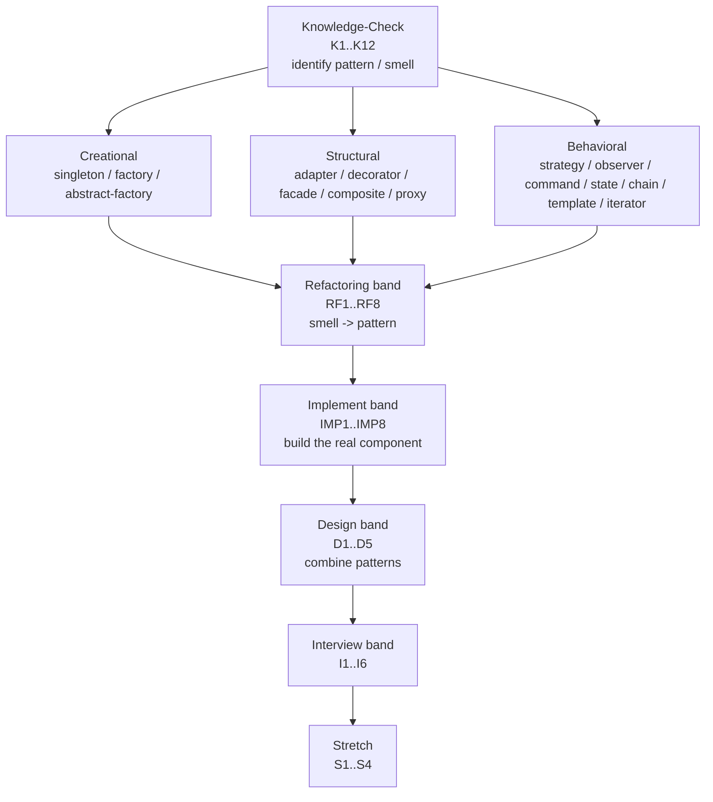

# Design Patterns: Exercises

> Module-level problem set for `05-design-patterns`. These exercises tie together the whole module:
> creational — [singleton](./singleton.md), [factory-method](./factory-method.md), [abstract-factory](./abstract-factory.md);
> structural — [adapter](./adapter.md), [decorator](./decorator.md), [facade](./facade.md), [composite](./composite.md), [proxy](./proxy.md);
> behavioral — [strategy](./strategy.md), [observer](./observer.md), [command](./command.md), [state](./state.md), [template-method](./template-method.md), [chain-of-responsibility](./chain-of-responsibility.md), [iterator](./iterator.md), [mediator](./mediator.md), [memento](./memento.md), [visitor](./visitor.md), [interpreter](./interpreter.md).
>
> **Solutions live in [`./solutions.md`](./solutions.md).** Do not peek until you have a compiling attempt.
> Every exercise is numbered (for example `E1`, `M3`, `H2`) so the solutions file can reference it directly.

This is a **pattern-fluency** set. You will: (a) *identify* a pattern or a code smell given a snippet of our
project, (b) *refactor toward a pattern* to kill that smell, and (c) *implement a pattern from scratch* to
build a real piece of the **Distributed Task Queue and Event Processing Platform**. The goal is not to
recite Gang-of-Four trivia — it is to reach for the right pattern reflexively when the code tells you it hurts.

> **Patterns are not the goal; they are vocabulary for tradeoffs.** Every problem here asks you to justify
> *why* a pattern earns its keep, or *why* it would be over-engineering (YAGNI). Naming a pattern without a
> reason is worth zero points.

---

## The canonical slice you need

Most exercises build on this minimum domain model. Copy it into a scratch project (`src/main/java`) so your
solutions compile.

```java
public enum TaskStatus { PENDING, SCHEDULED, RUNNING, SUCCEEDED, FAILED, RETRYING, DEAD }

public record Task(
        String id,            // a UUID
        String type,          // e.g. "email.send", "image.resize"
        String payload,       // JSON string
        TaskStatus status,
        int attempts,
        int maxAttempts,
        java.time.Instant createdAt,
        java.time.Instant scheduledAt,
        int priority) {}

@FunctionalInterface
public interface TaskHandler {
    TaskResult handle(Task task) throws Exception;
}

public record TaskResult(boolean success, String message, boolean retryable) {}

public interface TaskQueue {
    void enqueue(Task t);
    Task dequeue() throws InterruptedException;
    int size();
}

public interface RetryPolicy {
    java.util.Optional<java.time.Duration> nextDelay(int attempt);
}

public interface RateLimiter { boolean tryAcquire(); }

public interface DeadLetterQueue { void send(Task t, String reason); }
```

> **How to use this file.** Pick a difficulty band, read the exercise, then write real code or a real
> diagram in your own repo. The Knowledge-Check questions are warm-ups; the Refactoring and Implement
> bands are where pattern fluency is forged. Budget ~3–4 hours for Medium and a full day for Hard.

---

## Module map: which exercise drills which pattern



> **Legend for difficulty tags:** **[Easy]** = recall + one small edit; **[Medium]** = a real refactor or a
> component you could ship; **[Hard]** = combines patterns, threads, or distributed concerns and forces
> explicit tradeoffs.

---

# Part A — Knowledge-Check (pattern & smell identification)

> Short answers. For each, **name the pattern (or smell)** and give a **one-sentence justification**. Several
> snippets contain an *anti*-pattern — say so and name the fix.

### K1 [Easy] — Name the pattern

```java
public final class MetricsRegistry {
    private static final MetricsRegistry INSTANCE = new MetricsRegistry();
    private final java.util.concurrent.ConcurrentHashMap<String, java.util.concurrent.atomic.LongAdder> counters
            = new java.util.concurrent.ConcurrentHashMap<>();
    private MetricsRegistry() {}
    public static MetricsRegistry get() { return INSTANCE; }
    public void increment(String name) { counters.computeIfAbsent(name, k -> new java.util.concurrent.atomic.LongAdder()).increment(); }
}
```
Name the creational pattern. Is the eager-static-holder form thread-safe? What is the single biggest
testability objection to this design, and what would you swap it for in production code?

### K2 [Easy] — Name the pattern

```java
public interface RetryPolicy { java.util.Optional<java.time.Duration> nextDelay(int attempt); }

final class FixedDelayRetryPolicy implements RetryPolicy { /* ... */ }
final class ExponentialBackoffRetryPolicy implements RetryPolicy { /* ... */ }

// Worker chooses at construction time:
Worker worker = new Worker(queue, handlers, new ExponentialBackoffRetryPolicy(Duration.ofMillis(100), 6));
```
Which behavioral pattern is this? What `if/else`/`switch` does it eliminate from `Worker`?

### K3 [Easy] — Name the smell

```java
class Worker {
    void runOnce(Task t) {
        if (t.type().equals("email.send")) { sendEmail(t); }
        else if (t.type().equals("image.resize")) { resizeImage(t); }
        else if (t.type().equals("report.generate")) { generateReport(t); }
        else { throw new IllegalArgumentException("unknown type"); }
    }
}
```
Name the smell. Which two patterns together remove it? Why does this code violate the Open/Closed Principle?

### K4 [Easy] — Adapter or Facade?

```java
// Third-party SDK we cannot change:
class RabbitMqClient { void basicPublish(String exchange, String routingKey, byte[] body) { /* ... */ } }

// Our port:
interface TaskQueue { void enqueue(Task t); Task dequeue(); int size(); }

class RabbitTaskQueue implements TaskQueue {
    private final RabbitMqClient client;
    RabbitTaskQueue(RabbitMqClient c) { this.client = c; }
    public void enqueue(Task t) { client.basicPublish("tasks", t.type(), toBytes(t)); }
    /* ... */
}
```
Is this Adapter or Facade? Justify the distinction in one sentence.

### K5 [Easy] — Name the pattern

```java
interface TaskQueue { void enqueue(Task t); Task dequeue() throws InterruptedException; int size(); }

class RateLimitedQueue implements TaskQueue {
    private final TaskQueue delegate;
    private final RateLimiter limiter;
    RateLimitedQueue(TaskQueue d, RateLimiter l) { this.delegate = d; this.limiter = l; }
    public void enqueue(Task t) {
        while (!limiter.tryAcquire()) Thread.onSpinWait();
        delegate.enqueue(t);
    }
    public Task dequeue() throws InterruptedException { return delegate.dequeue(); }
    public int size() { return delegate.size(); }
}
```
Name the structural pattern. How does it differ from Proxy, given both wrap an object of the same interface?

### K6 [Medium] — Name the pattern and the bug

```java
class TaskService {
    private final List<TaskEventListener> listeners = new ArrayList<>();
    void subscribe(TaskEventListener l) { listeners.add(l); }
    void onCompleted(Task t) {
        for (TaskEventListener l : listeners) l.onEvent(new TaskEvent(t.id(), "SUCCEEDED"));
    }
}
```
Name the behavioral pattern. Identify the concurrency bug if `subscribe` and `onCompleted` run on
different threads, and give the one-line fix.

### K7 [Medium] — Pattern in `TaskStatus` transitions

```java
Task moved = switch (current.status()) {
    case PENDING   -> current.withStatus(TaskStatus.RUNNING);
    case RUNNING   -> result.success() ? current.withStatus(TaskStatus.SUCCEEDED)
                                       : current.withStatus(TaskStatus.RETRYING);
    case RETRYING  -> current.attempts() >= current.maxAttempts()
                                       ? current.withStatus(TaskStatus.DEAD)
                                       : current.withStatus(TaskStatus.SCHEDULED);
    default        -> throw new IllegalStateException("terminal: " + current.status());
};
```
This is a state machine written with `switch`. Name the pattern that would replace it with polymorphism.
When is the `switch` form *better* than the GoF pattern here? (Hint: number of states, allocation, immutability.)

### K8 [Medium] — Name the pattern

```java
interface Command { void execute(); void undo(); }
record EnqueueCommand(TaskQueue q, Task t) implements Command {
    public void execute() { q.enqueue(t); }
    public void undo() { /* mark task CANCELLED */ }
}
Deque<Command> history = new ArrayDeque<>();
```
Name the pattern. Name two production features it unlocks for our API layer.

### K9 [Medium] — Chain or Decorator?

```java
abstract class Validator {
    private Validator next;
    Validator setNext(Validator v) { this.next = v; return v; }
    final Optional<String> validate(Task t) {
        Optional<String> err = check(t);
        if (err.isPresent()) return err;
        return next == null ? Optional.empty() : next.validate(t);
    }
    protected abstract Optional<String> check(Task t);
}
```
Is this Chain of Responsibility or Decorator? What is the defining behavioral difference (hint: who stops the
flow, and when)?

### K10 [Medium] — Name the pattern and the leak

```java
class WorkerPool {
    public WorkerPool() {
        this.executor = Executors.newFixedThreadPool(8);
        for (int i = 0; i < 8; i++) executor.submit(new Worker(queue, handlers, retryPolicy));
        Runtime.getRuntime().addShutdownHook(new Thread(this::shutdown));
    }
}
```
This is a Singleton-flavored eager resource. Name the lifecycle smell when this is combined with a global
`static` registry, and explain why it makes integration tests flaky.

### K11 [Hard] — Identify three patterns in one snippet

```java
TaskQueue q = new RateLimitedQueue(
        new MetricsQueue(
                new InMemoryTaskQueue(),
                MetricsRegistry.get()),
        new TokenBucketRateLimiter(100, 200));
```
List every pattern visible here. Explain the order-of-wrapping question: should rate limiting be inside or
outside the metrics layer, and what does each choice measure?

### K12 [Hard] — Smell hunt

```java
class TaskProcessor {
    void process(Task t) {
        var db = DatabasePool.getInstance().getConnection();          // (a)
        var cfg = Config.INSTANCE;                                    // (b)
        if (t.type().equals("email")) new EmailSender().send(t);      // (c)
        else if (t.type().equals("sms")) new SmsSender().send(t);     // (c)
        for (var l : GlobalListeners.ALL) l.onEvent(toEvent(t));      // (d)
        Metrics.INSTANCE.increment("processed");                      // (b)
    }
}
```
Tag each lettered line with the smell it represents and the pattern (or principle) that fixes it. Which single
refactoring (dependency injection) addresses the most lines at once?

---

# Part B — Refactoring band (smell → pattern)

> Each gives you bad-but-plausible project code. Refactor it toward the named (or best-fit) pattern. Keep the
> public behavior identical; prove it with a JUnit 5 + AssertJ test.

### RF1 [Easy] — Strategy out of a `switch`

Given this `Worker.computeDelay`, extract a `RetryPolicy` strategy hierarchy so adding a new backoff algorithm
touches **zero** existing files.

```java
class Worker {
    Duration computeDelay(String policy, int attempt) {
        switch (policy) {
            case "fixed":   return Duration.ofMillis(500);
            case "linear":  return Duration.ofMillis(500L * attempt);
            case "expo":    return Duration.ofMillis((long) (500 * Math.pow(2, attempt)));
            default:        throw new IllegalArgumentException(policy);
        }
    }
}
```
Deliverable: the `RetryPolicy` interface (return `Optional<Duration>` so a policy can signal "give up"),
three implementations, and a `Worker` that takes one by constructor injection.

### RF2 [Easy] — Factory Method for handlers

This `if/else` selects a `TaskHandler` by type. Replace it with a registry-backed factory so handlers
register themselves.

```java
TaskHandler handlerFor(String type) {
    if (type.equals("email.send")) return new EmailHandler();
    if (type.equals("image.resize")) return new ImageResizeHandler();
    if (type.equals("report.generate")) return new ReportHandler();
    throw new IllegalArgumentException("no handler for " + type);
}
```
Deliverable: a `HandlerRegistry` exposing `register(String type, Supplier<TaskHandler>)` and
`TaskHandler create(String type)`. Show how `Worker` uses it. Bonus: explain why a `Supplier<TaskHandler>`
(prototype-style) is safer than caching a single handler instance when handlers hold per-task state.

### RF3 [Medium] — Decorator for cross-cutting queue concerns

You have an `InMemoryTaskQueue` and someone has bolted metrics and logging *into* it. Pull those concerns out
into stackable decorators so the base queue does one thing.

```java
class InMemoryTaskQueue implements TaskQueue {
    private final BlockingQueue<Task> q = new LinkedBlockingQueue<>();
    public void enqueue(Task t) {
        log.info("enqueue {}", t.id());                 // logging concern
        Metrics.INSTANCE.increment("enqueued");         // metrics concern
        q.add(t);
    }
    public Task dequeue() throws InterruptedException {
        Task t = q.take();
        Metrics.INSTANCE.increment("dequeued");         // metrics concern
        return t;
    }
    public int size() { return q.size(); }
}
```
Deliverable: a clean `InMemoryTaskQueue`, a `LoggingQueue` decorator, and a `MetricsQueue` decorator (taking a
`MeterRegistry`/`MetricsCollector` by constructor). Show the wiring. State one ordering tradeoff (does the
metrics decorator sit inside or outside the logging decorator?).

### RF4 [Medium] — Observer for task lifecycle events

`TaskService` currently hardcodes three side effects (audit log, metrics, webhook) directly into
`markSucceeded`. Refactor to the Observer pattern (our `EventBus` / `TaskEventListener`) so adding a fourth
side effect is a new listener, not an edit to `TaskService`.

```java
class TaskService {
    void markSucceeded(Task t) {
        repository.save(t.withStatus(TaskStatus.SUCCEEDED));
        auditLog.write("task " + t.id() + " succeeded");
        Metrics.INSTANCE.increment("succeeded");
        webhookClient.post(t);                 // tightly coupled
    }
}
```
Deliverable: `record TaskEvent(String taskId, TaskStatus status, Instant at)`, a `TaskEventListener`
functional interface, a small synchronous `EventBus`, and three listeners. Discuss sync vs async dispatch and
what happens to `markSucceeded`'s latency if a listener blocks.

### RF5 [Medium] — State pattern for `TaskStatus` transitions

The transition logic from K7 is scattered across `Worker` and `TaskService` as duplicated `switch` blocks.
Consolidate the rules behind a `TaskState` abstraction so illegal transitions are impossible to express.

```java
// scattered, duplicated, easy to get wrong:
if (t.status() == TaskStatus.RUNNING && result.success())  next = TaskStatus.SUCCEEDED;
if (t.status() == TaskStatus.RUNNING && !result.success()) next = TaskStatus.RETRYING;
// ... repeated elsewhere with subtle differences
```
Deliverable: a `sealed interface TaskState` (or a state map) that exposes `onSuccess`, `onFailure`,
`onMaxAttempts`, each returning the next `TaskStatus`. Decide explicitly: full GoF State (one class per state)
vs. a transition table. Justify your choice with the criteria from [`state.md`](./state.md).

### RF6 [Medium] — Chain of Responsibility for admission validation

Submission validation is one giant method. Convert it into a chain so each rule is independently testable and
reorderable.

```java
Optional<String> validate(Task t) {
    if (t.type() == null || t.type().isBlank()) return Optional.of("type required");
    if (t.payload() != null && t.payload().length() > 64_000) return Optional.of("payload too large");
    if (t.priority() < 0 || t.priority() > 9) return Optional.of("priority out of range");
    if (t.maxAttempts() < 1) return Optional.of("maxAttempts must be >= 1");
    return Optional.empty();
}
```
Deliverable: a `ValidationHandler` chain returning `Optional<String>` (first error wins), with each rule as
its own class. Show how the API layer assembles the chain. Note: contrast "first-error-wins" (CoR) with
"collect-all-errors" and say which our `POST /tasks` should use.

### RF7 [Hard] — Command pattern for an idempotent, auditable API

Our `TaskController` calls service methods directly, so we have no audit trail and no way to retry a failed
mutation safely. Reify each mutation as a `Command` with `execute`/`undo`, recorded in a command log.

```java
@PostMapping("/tasks")
ResponseEntity<TaskView> submit(@RequestBody SubmitRequest req) {
    Task t = service.create(req);     // direct call, no record, not idempotent
    return ResponseEntity.ok(TaskView.from(t));
}
```
Deliverable: a `Command` interface (`execute`, `undo`, `String idempotencyKey()`), an `EnqueueTaskCommand`, a
`CommandBus` that dedupes by idempotency key and appends to an in-memory `commandLog`. Explain how this gives
us crash-safe replay and at-most-once semantics, linking to
[idempotency](../08-distributed-systems/idempotency.md) and [retries](../08-distributed-systems/retries.md).

### RF8 [Hard] — Composite for grouped/batch tasks

Product wants "task groups": submit a parent that fans out to N child tasks and reports aggregate status.
Refactor `Task` handling so a group and a leaf share one interface (`TaskNode`) the `Worker` treats uniformly.

```java
// Today only leaf tasks exist; a "batch" is faked with a for-loop in the controller.
for (Task child : children) queue.enqueue(child);   // no parent, no aggregate status
```
Deliverable: a `sealed interface TaskNode permits LeafTask, TaskGroup`, where `TaskGroup` holds children and
computes aggregate `status()` (`SUCCEEDED` only if all children succeeded, `FAILED`/`DEAD` if any is dead).
Discuss the recursion depth limit and how you would cap it in production.

---

# Part C — Implement band (build the real component)

> Greenfield: implement the pattern from scratch as a shippable piece of the platform. Include a JUnit 5 +
> AssertJ test for each. These are the meat of the module.

### IMP1 [Easy] — `TokenBucketRateLimiter` (Strategy)

Implement `RateLimiter` as a thread-safe token bucket.

```java
public interface RateLimiter { boolean tryAcquire(); }
```
Requirements: constructor `TokenBucketRateLimiter(double permitsPerSecond, long burst)`; refill based on
elapsed nanos (`System.nanoTime()`); `tryAcquire()` returns `true` and consumes one token if available, else
`false`; must be correct under concurrent callers (synchronize or use a lock). Test: with 10 permits/sec and
burst 10, the 11th immediate `tryAcquire()` returns `false`; after ~1s, one more succeeds.

### IMP2 [Easy] — `ExponentialBackoffRetryPolicy` with jitter (Strategy)

Implement `RetryPolicy` with full jitter.

```java
public interface RetryPolicy { java.util.Optional<java.time.Duration> nextDelay(int attempt); }
```
Requirements: `nextDelay(attempt)` returns `Optional.empty()` once `attempt >= maxAttempts` (signal: give up);
otherwise `base * 2^attempt` capped at `maxDelay`, then multiplied by a random factor in `[0, 1]` (full
jitter). Inject a `Random`/`RandomGenerator` so the test is deterministic. Test: with a seeded RNG, delays are
monotonic-in-expectation and never exceed `maxDelay`; attempt `maxAttempts` yields empty.

### IMP3 [Medium] — `InMemoryEventBus` (Observer)

Implement the canonical `EventBus`.

```java
public record TaskEvent(String taskId, TaskStatus status, java.time.Instant at) {}
@FunctionalInterface public interface TaskEventListener { void onEvent(TaskEvent e); }
public interface EventBus { void publish(TaskEvent e); void subscribe(TaskEventListener l); }
```
Requirements: thread-safe subscription (`CopyOnWriteArrayList`), one slow/throwing listener must not block or
break others (catch per-listener, log, continue), and an optional async mode backed by an `ExecutorService`
(virtual threads via `Executors.newVirtualThreadPerTaskExecutor()` is fine). Test: a throwing listener does
not stop a second listener from receiving the event; counters prove both fired.

### IMP4 [Medium] — `HandlerRegistry` (Factory Method / Registry)

Implement a self-registering handler registry that `Worker` consults by task type.

Requirements: `register(String type, TaskHandler h)` (reject duplicates), `Optional<TaskHandler> find(String
type)`, and a `Worker.runOnce(Task)` that looks up the handler, executes, and on a retryable failure consults
a `RetryPolicy`. Bonus: support a `register(String type, Supplier<TaskHandler>)` overload for per-task
instances. Test: unknown type routes the task to a `DeadLetterQueue` with reason `"no handler"`.

### IMP5 [Medium] — `LoggingQueue` + `MetricsQueue` decorators (Decorator)

Implement two `TaskQueue` decorators that you can stack in any order around an `InMemoryTaskQueue`.

Requirements: both implement `TaskQueue` and hold a `TaskQueue delegate`; `MetricsQueue` increments
`enqueued`/`dequeued` counters and times `dequeue` latency; `LoggingQueue` logs at debug. The base queue must
remain decorator-agnostic. Test: stacking `new MetricsQueue(new LoggingQueue(base))` vs the reverse yields the
same `size()` and task ordering; metrics counters increment exactly once per op.

### IMP6 [Medium] — `TaskStateMachine` (State)

Implement the `TaskStatus` lifecycle as a state machine that rejects illegal transitions.

Requirements: a `boolean canTransition(TaskStatus from, TaskStatus to)` and a
`Task transition(Task t, TaskEventType event)` where `TaskEventType` is `{ START, SUCCESS, FAILURE,
SCHEDULE, EXHAUST }`. Encode rules: `PENDING -> RUNNING` (START); `RUNNING -> SUCCEEDED` (SUCCESS);
`RUNNING -> RETRYING` (FAILURE); `RETRYING -> SCHEDULED` (SCHEDULE) unless attempts exhausted, then
`RETRYING -> DEAD` (EXHAUST). `SUCCEEDED`/`DEAD` are terminal. Test: any transition out of a terminal state
throws `IllegalStateException`.

### IMP7 [Hard] — `RetryDecider` via Chain of Responsibility

Implement the failure-handling pipeline that decides what happens to a failed task. Build it as a chain so
each policy is independently testable and the order is explicit.

Requirements: chain links in order — `NonRetryableLink` (if `TaskResult.retryable()` is false → DEAD),
`MaxAttemptsLink` (if `attempts >= maxAttempts` → DEAD), `BackoffLink` (compute delay from a `RetryPolicy` →
RETRYING + schedule). Each link returns a sealed `Decision` (`Dead(reason)`, `Retry(delay)`,
`Pass`-to-next). Wire it so a `Worker` calls `decider.decide(task, result)` and acts on the `Decision`. Test:
a non-retryable result short-circuits to `Dead` without consulting backoff; an exhausted retryable result
also becomes `Dead`.

### IMP8 [Hard] — `PostgresTaskQueue` as a Proxy over `TaskRepository` (Proxy)

Implement a `TaskQueue` whose `enqueue`/`dequeue` are backed by a JDBC `TaskRepository`, fronted by a virtual
proxy that lazily opens the connection pool and a protection proxy that enforces a `RateLimiter` on `enqueue`.

```java
public interface TaskRepository {
    void save(Task t);
    java.util.Optional<Task> findById(String id);
    java.util.List<Task> pollDue(int n);
}
```
Requirements: `PostgresTaskQueue` implements `TaskQueue`; `enqueue` → `repository.save(t.withStatus(PENDING))`;
`dequeue` → `pollDue(1)` returning the first due task (block/poll if empty); a `RateLimitedTaskQueue` *proxy*
guards `enqueue`. You may stub `TaskRepository` with an in-memory map for the test (no real Postgres needed).
Test: with the in-memory repo, enqueue then dequeue round-trips the task and respects the rate limit. Note
where you would add a Testcontainers Postgres test later (link to
[`../09-project/phase-2.md`](../09-project/phase-2.md)).

---

# Part D — Design band (combine patterns)

> Paper or diagram answers (plus interface sketches). Show structure, name every pattern, and defend the
> tradeoffs. A correct Mermaid `classDiagram` is expected where structure matters.

### D1 [Medium] — Compose the Phase-3 queue stack

Design the full decorator/proxy stack for the Phase-3 ingress path:
`Client → API → [validation chain] → [rate limiter] → [metrics] → InMemoryTaskQueue → WorkerPool → DLQ`.
Deliver a `classDiagram` showing which layers are Decorators, which are Chain links, and which is the core.
Defend the *order* of the layers (why rate limiting before metrics, or after?).

### D2 [Medium] — Choose: Strategy vs Template Method for handlers

Every `TaskHandler` shares boilerplate (parse payload → do work → emit result) but differs in the middle step.
Compare two designs: (a) a `TemplateMethodHandler` abstract class with a `final handle()` calling an abstract
`doWork()`; (b) Strategy where the boilerplate lives in `Worker` and handlers are pure lambdas. Give a decision
table (extensibility, testability, lambda-friendliness, inheritance cost) and pick one for our project.

### D3 [Medium] — Abstract Factory for pluggable brokers

Phase 4 needs to swap the entire messaging backend (in-memory ↔ Redis ↔ Kafka ↔ RabbitMQ) as a unit: each
backend has its own `TaskQueue`, `DeadLetterQueue`, and `TaskScheduler`. Design a `BrokerFactory` abstract
factory (`createQueue()`, `createDlq()`, `createScheduler()`) with two concrete factories. Diagram it and
explain why Abstract Factory beats three independent Factory Methods here (family consistency).

### D4 [Hard] — Memento for worker checkpointing

A long-running handler (e.g. `report.generate` over 1M rows) must survive a worker restart. Design a `Memento`
that snapshots handler progress to the repository every N records and restores on restart, without exposing
the handler's internal cursor fields. Diagram originator/memento/caretaker roles and map them onto
`TaskHandler` / `ProgressSnapshot` / `TaskRepository`. Discuss snapshot frequency vs. write amplification.

### D5 [Hard] — Visitor over a `TaskNode` composite

Given the `TaskNode` composite from RF8, design a `TaskNodeVisitor` that computes, in one traversal:
total leaf count, max depth, and a flat list of DEAD leaves for the DLQ. Diagram the double-dispatch. Then
argue the honest downside: what breaks when product adds a new `TaskNode` subtype, and how does that compare
to the Composite-only approach without Visitor?

---

# Part E — Interview band

> Out-loud answers; aim for 3–5 crisp minutes each. Tie every answer back to our Task Queue.

- **I1 [Easy]** — "When would you *not* use Singleton, and what do you use instead?" Use our `MetricsRegistry`
  as the worked example; mention DI and test isolation.
- **I2 [Easy]** — Distinguish Strategy, Decorator, and Proxy. All three "wrap" — what is the *intent*
  difference? Give one example of each from our codebase (`RetryPolicy`, `MetricsQueue`, `RateLimitedQueue`).
- **I3 [Medium]** — "Walk me through refactoring a 200-line `switch` on `task.type()` into Open/Closed
  code." Name the patterns, the registration mechanism, and how you'd migrate without a big-bang rewrite.
- **I4 [Medium]** — Chain of Responsibility vs a list of `Predicate`s vs Decorator for a validation pipeline:
  when does each win? Use our `POST /tasks` validation as the anchor.
- **I5 [Medium]** — "Our `EventBus` listeners sometimes block the worker thread. Diagnose and fix." Cover
  sync vs async dispatch, isolation of slow listeners, and back-pressure (link to
  [`../08-distributed-systems/backpressure.md`](../08-distributed-systems/backpressure.md)).
- **I6 [Hard]** — "Design the pattern stack for a pluggable, observable, rate-limited, retrying task queue."
  This is D1+D3 combined out loud. Expect follow-ups on testing (Mockito) and on what you'd cut for YAGNI.

---

# Part F — Stretch challenges

> Multi-hour. Combine patterns with concurrency and distributed concerns. No hand-holding.

### S1 [Hard] — A mini DSL for retry policies (Interpreter)

Build a tiny `Interpreter` that parses a policy string such as
`"expo(base=100ms, max=30s, jitter=full) then fixed(5s) giveup after 7"` into a composed `RetryPolicy`. Define
a small grammar, an AST of sealed records, and an evaluator producing a `RetryPolicy`. Link to
[`interpreter.md`](./interpreter.md). Acceptance: a round-trip test parses and evaluates three sample
policies; an invalid string fails with a precise position-tagged error.

### S2 [Hard] — Lock-free `MetricsCollector` snapshot (Iterator + Memento)

Implement a `MetricsCollector` backed by `ConcurrentHashMap<String, LongAdder>` that exposes a consistent
point-in-time `snapshot()` (a Memento) and a custom `Iterator` over `(name, value)` pairs that does not throw
`ConcurrentModificationException` under concurrent writes. Measure throughput vs a `synchronized` baseline and
report the delta. Link to [`../06-concurrency/atomics-and-thread-safety.md`](../06-concurrency/atomics-and-thread-safety.md).

### S3 [Hard] — Hot-swappable strategy via `Mediator`

Build a `RetryMediator` that lets an operator change the active `RetryPolicy` at runtime (e.g. via an admin
endpoint) without restarting workers, while in-flight `nextDelay` calls remain consistent. Use a `Mediator` to
decouple workers from the config source and an `AtomicReference<RetryPolicy>` for the swap. Prove visibility
under concurrency and discuss the memory-model guarantee that makes it safe.

### S4 [Hard] — Compose the whole Phase-3 platform

Wire every component you built in Parts B–C into one runnable demo: validation Chain → `RateLimitedQueue`
proxy → `MetricsQueue`/`LoggingQueue` decorators → `InMemoryTaskQueue` → `WorkerPool` of `Worker`s →
`HandlerRegistry` → `RetryDecider` chain → `DeadLetterQueue`, with the `EventBus` observing every transition.
Submit 1,000 tasks (10% deliberately failing, 2% non-retryable), assert the final counts
(`SUCCEEDED + DEAD + RETRYING-in-flight == 1000`), and print a metrics snapshot. This is the capstone for the
whole module and the on-ramp to [`../09-project/phase-3.md`](../09-project/phase-3.md).

---

## Self-assessment rubric

| Band | You can... | Pattern fluency signal |
|------|-----------|------------------------|
| Knowledge-Check | Name a pattern/smell from a 10-line snippet in <30s | Recognize intent, not just shape |
| Refactoring | Turn a `switch`/god-method into Open/Closed code | Smell → pattern reflex |
| Implement | Ship a thread-safe, tested component | Pattern + concurrency + tests |
| Design | Combine 3+ patterns and defend the layering | Architecture-level thinking |
| Interview | Explain intent differences and tradeoffs aloud | Communicate, not just code |
| Stretch | Fuse patterns with distributed/concurrent concerns | Staff-level synthesis |

> **Pass bar for the module:** complete all Knowledge-Check, at least 5 Refactoring, at least 5 Implement
> (including IMP3, IMP6, IMP7), and one Design problem. Then attempt S4 — if your capstone's counts reconcile,
> you have internalized this module.

---

## What We Can Improve In Our Project Using This Concept

Working these exercises produces real, mergeable components: a thread-safe `TokenBucketRateLimiter`, an
`ExponentialBackoffRetryPolicy` with jitter, an `InMemoryEventBus`, a `HandlerRegistry`, stackable
`LoggingQueue`/`MetricsQueue` decorators, a `TaskStateMachine`, and a `RetryDecider` chain. Each replaces a
`switch` or a hardcoded side effect with an Open/Closed seam, so adding a new handler, backoff algorithm, or
listener becomes a *new file* rather than an *edit to a tested file*.

## Project Refactoring Task

Land the components from Part C in dependency order: IMP4 (`HandlerRegistry`) and IMP2/IMP1 (policies) first,
then IMP3 (`EventBus`) and IMP5 (decorators), then IMP6 (`TaskStateMachine`) and IMP7 (`RetryDecider`). Finish
with S4, which wires them into the Phase-3 platform. Keep each refactor behavior-preserving and guarded by the
tests specified in each exercise.

## Git Commit For This Chapter

```text
test(patterns): add module exercise set and reference components

- add graded pattern exercises (identify / refactor / implement)
- scaffold RetryPolicy, RateLimiter, EventBus, HandlerRegistry,
  queue decorators, TaskStateMachine, and RetryDecider chain
- wire Phase-3 capstone demo (S4)

Files: 05-design-patterns/exercises.md
       (solutions land in 05-design-patterns/solutions.md)
```

## Architecture Impact

These exercises convert the platform from a few god classes into a composition of small, swappable parts:
strategies for policies, decorators/proxies for cross-cutting queue concerns, a chain for failure handling, a
state machine for the lifecycle, and an event bus for side effects. The result is the Open/Closed,
DI-friendly architecture that Phases 3 and 4 depend on for pluggable brokers and horizontal scaling.

## Interview Takeaways

- Patterns are vocabulary for tradeoffs; name the *intent*, never just the shape.
- The most common real refactor is `switch on type` → Strategy + Registry (Factory) for Open/Closed.
- Decorator, Proxy, and Strategy all "wrap" — distinguish by intent: add behavior, control access, swap algorithm.
- Chain of Responsibility shines for ordered, short-circuiting pipelines (validation, failure handling).
- A State machine beats scattered `switch`es when illegal transitions must be unrepresentable.
- Always justify a pattern against YAGNI: the right amount of pattern is the least that keeps the change local.
