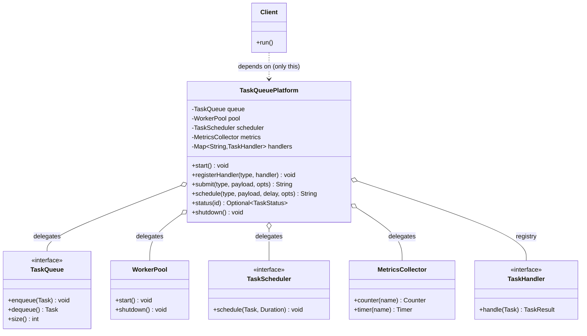
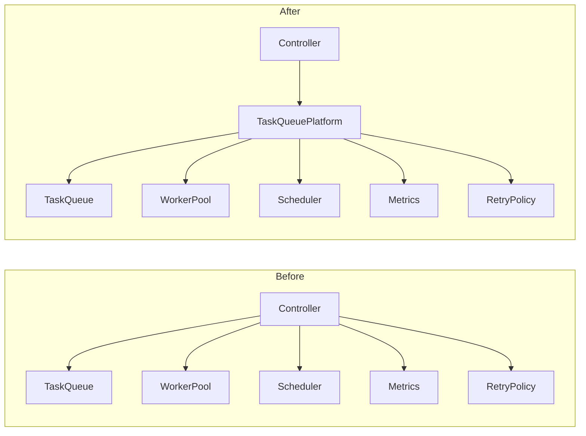

# Facade

> Where this fits in the project: the Facade is the single, friendly front door — `TaskQueuePlatform` — that clients (REST controllers, CLI tools, tests) use to submit, schedule, and inspect tasks without ever touching the `TaskQueue`, `WorkerPool`, `TaskScheduler`, `MetricsCollector`, or `RetryPolicy` directly.

---

## 1. Why This Exists — The Real Problem In Our Task Queue

By the end of Phase 1 our platform is a small constellation of cooperating objects. To actually *submit and run a task*, a caller has to:

1. Build a `Task` with a fresh UUID, the right `TaskStatus`, `attempts = 0`, a `maxAttempts`, timestamps, and a priority.
2. Decide whether it runs *now* or *later*: enqueue into the `TaskQueue` or hand it to the `TaskScheduler`.
3. Make sure a `WorkerPool` is started so something is actually draining the queue.
4. Register the matching `TaskHandler` for the task's `type`.
5. Wire a `RetryPolicy` so failed tasks come back instead of vanishing.
6. Increment the right counters in the `MetricsCollector` so submissions are observable.

Here is what that looks like when a controller does it all by hand — the **naive, no-facade** version:

```java
// AppEntryPoint.java — the caller has to know EVERYTHING about the subsystems.
public class AppEntryPoint {
    public static void main(String[] args) throws Exception {
        // 1. Stand up every subsystem manually.
        InMemoryTaskQueue queue = new InMemoryTaskQueue(10_000);
        MetricsCollector metrics = new MetricsCollector();
        RetryPolicy retryPolicy =
            new ExponentialBackoffRetryPolicy(Duration.ofSeconds(1), 2.0, Duration.ofMinutes(5));

        Map<String, TaskHandler> handlers = new ConcurrentHashMap<>();
        handlers.put("email", task -> {
            // ... send the email ...
            return new TaskResult(true, "sent", false);
        });

        TaskScheduler scheduler = new DelayQueueTaskScheduler(queue);
        WorkerPool pool = new WorkerPool(queue, handlers, retryPolicy, metrics, 8);
        pool.start();
        scheduler.start();

        // 2. To submit ONE task the caller repeats all of this boilerplate.
        Task t = new Task(
            UUID.randomUUID().toString(),
            "email",
            "{\"to\":\"a@b.com\"}",
            TaskStatus.PENDING,
            0,
            5,
            Instant.now(),
            null,
            5
        );
        metrics.counter("tasks.submitted").increment();
        queue.enqueue(t);

        // 3. To schedule a task, a DIFFERENT incantation, easy to get wrong.
        Task later = new Task(
            UUID.randomUUID().toString(), "report", "{}",
            TaskStatus.SCHEDULED, 0, 3, Instant.now(),
            Instant.now().plus(Duration.ofMinutes(10)), 1
        );
        metrics.counter("tasks.scheduled").increment();
        scheduler.schedule(later, Duration.ofMinutes(10));

        // 4. Shutdown order matters and the caller has to remember it.
        scheduler.shutdown();
        pool.shutdown();
    }
}
```

**Limitations of this approach:**

- **Leaky coupling.** Every caller depends on six concrete classes. Rename `MetricsCollector.counter(...)` or change the `Task` constructor signature and *every call site breaks*. This is exactly the high *efferent coupling* discussed in [../04-oop-and-ood/coupling.md](../04-oop-and-ood/coupling.md).
- **Repeated, error-prone wiring.** UUID generation, status selection, metric naming, and shutdown ordering are copy-pasted. One caller forgets `metrics.counter(...).increment()`; another forgets to `start()` the pool; a third schedules a task but sets `status = PENDING` instead of `SCHEDULED`.
- **No single place to enforce invariants.** Where do you validate that `maxAttempts > 0`? That a handler exists for the type *before* enqueuing? Nowhere — it is smeared across call sites.
- **Untestable.** A unit test of "submitting a task increments the counter and enqueues it" must construct the entire world.
- **The subsystem vocabulary leaks into business code.** Controllers should speak `submit(type, payload)`, not `BlockingQueue` and `DelayQueue`.

We need **one object** that callers talk to, that knows the correct choreography, and that hides the subsystems behind a small, intention-revealing API. That object is a **Facade**.

---

## 2. Pattern Intent, Motivation, Problem Statement, Participants

### Intent (GoF)

> Provide a unified interface to a set of interfaces in a subsystem. Facade defines a higher-level interface that makes the subsystem easier to use.

### Motivation

A subsystem made of many fine-grained classes is powerful but hard to use correctly. Most clients only need a few common workflows ("submit a task", "schedule a task", "get status"). The Facade gives them a small, high-level API for those workflows while still leaving the subsystem accessible to the rare client that needs fine control.

### Problem Statement (in our terms)

*Clients of the task platform must coordinate the `TaskQueue`, `WorkerPool`, `TaskScheduler`, `RetryPolicy`, and `MetricsCollector` to do anything useful. This couples every client to the internal structure of the platform, duplicates orchestration logic, and provides no central place for validation, metrics, and lifecycle management.*

The Facade solves this by introducing `TaskQueuePlatform` — a class whose methods (`submit`, `schedule`, `status`, `start`, `shutdown`) encapsulate the orchestration.

### Participants

| Participant | Role in GoF terms | In our project |
|---|---|---|
| **Facade** | Knows which subsystem classes handle a request; delegates client requests to the appropriate subsystem objects. | `TaskQueuePlatform` |
| **Subsystem classes** | Implement subsystem functionality; have no knowledge of the facade. | `InMemoryTaskQueue`, `WorkerPool`, `DelayQueueTaskScheduler`, `ExponentialBackoffRetryPolicy`, `MetricsCollector`, the `TaskHandler` registry |
| **Client** | Uses the facade instead of calling subsystem objects directly. | `TaskController` (Phase 2), CLI tools, integration tests |

> **Classification.** Facade is a **structural** pattern: it composes objects to form a larger structure with a simpler interface. Contrast it with [adapter.md](adapter.md) (changes *one* interface to match an expected one) and [proxy.md](proxy.md) (same interface, adds a control layer). Facade introduces a *new, simpler* interface over *many* objects.

---

## 3. UML Class Diagram



The key structural fact: **`Client` has exactly one arrow** — to the Facade. The five subsystem dependencies all live *inside* the Facade. That arrow-count is the whole point.

---

## 4. The Canonical Domain Model (recap)

So the code below compiles in your head, here are the slices we lean on, taken verbatim from the curriculum's canonical model.

```java
public enum TaskStatus { PENDING, SCHEDULED, RUNNING, SUCCEEDED, FAILED, RETRYING, DEAD }

public record Task(
    String id, String type, String payload, TaskStatus status,
    int attempts, int maxAttempts, Instant createdAt, Instant scheduledAt, int priority
) {
    // Convenience copy-with for status transitions; records are immutable.
    public Task withStatus(TaskStatus next) {
        return new Task(id, type, payload, next, attempts, maxAttempts, createdAt, scheduledAt, priority);
    }
}

@FunctionalInterface
public interface TaskHandler { TaskResult handle(Task task) throws Exception; }

public record TaskResult(boolean success, String message, boolean retryable) {}

public interface TaskQueue {
    void enqueue(Task t);
    Task dequeue() throws InterruptedException;
    int size();
}

public interface TaskScheduler { void schedule(Task t, Duration delay); }

public interface RetryPolicy { java.util.Optional<Duration> nextDelay(int attempt); }
```

`MetricsCollector` is a thin Micrometer-style facade-let we introduced earlier; here it just hands back named counters and timers.

---

## 5. Refactor — Introduce `TaskQueuePlatform`

### 5.1 The Facade

```java
import java.time.Duration;
import java.time.Instant;
import java.util.ArrayList;
import java.util.List;
import java.util.Map;
import java.util.Optional;
import java.util.UUID;
import java.util.concurrent.ConcurrentHashMap;

/**
 * Facade over the task-processing subsystem.
 *
 * Clients depend ONLY on this class. The queue, worker pool, scheduler,
 * retry policy, and metrics are implementation details hidden behind a
 * small, intention-revealing API.
 */
public final class TaskQueuePlatform implements AutoCloseable {

    private final TaskQueue queue;
    private final WorkerPool pool;
    private final TaskScheduler scheduler;
    private final MetricsCollector metrics;
    private final Map<String, TaskHandler> handlers = new ConcurrentHashMap<>();
    // A small status index so status(id) can answer without exposing the store.
    private final Map<String, TaskStatus> statusIndex = new ConcurrentHashMap<>();

    // Sensible defaults so the common path is one line; opts override per-call.
    private final int defaultMaxAttempts;
    private final int defaultPriority;

    private TaskQueuePlatform(Builder b) {
        this.queue = b.queue;
        this.scheduler = b.scheduler;
        this.metrics = b.metrics;
        this.defaultMaxAttempts = b.defaultMaxAttempts;
        this.defaultPriority = b.defaultPriority;
        // The pool needs the handler registry; we share the live map.
        this.pool = new WorkerPool(queue, handlers, b.retryPolicy, metrics, b.workerCount);
    }

    /** Idempotent start of the background machinery. */
    public void start() {
        pool.start();
        // The scheduler may itself be a Runnable draining a DelayQueue into the queue.
    }

    /** Register a handler for a task type. Must happen before submit/schedule of that type. */
    public void registerHandler(String type, TaskHandler handler) {
        handlers.put(type, handler);
    }

    /** Submit a task to run as soon as a worker is free. Returns the task id. */
    public String submit(String type, String payload) {
        return submit(type, payload, SubmitOptions.defaults());
    }

    public String submit(String type, String payload, SubmitOptions opts) {
        Task task = newTask(type, payload, TaskStatus.PENDING, null, opts);
        metrics.counter("tasks.submitted").increment();
        statusIndex.put(task.id(), TaskStatus.PENDING);
        queue.enqueue(task);
        return task.id();
    }

    /** Schedule a task to run after a delay. Returns the task id. */
    public String schedule(String type, String payload, Duration delay) {
        return schedule(type, payload, delay, SubmitOptions.defaults());
    }

    public String schedule(String type, String payload, Duration delay, SubmitOptions opts) {
        Instant runAt = Instant.now().plus(delay);
        Task task = newTask(type, payload, TaskStatus.SCHEDULED, runAt, opts);
        metrics.counter("tasks.scheduled").increment();
        statusIndex.put(task.id(), TaskStatus.SCHEDULED);
        scheduler.schedule(task, delay);
        return task.id();
    }

    /** Submit many tasks of the same type; metric increments once per task. */
    public List<String> submitBatch(String type, List<String> payloads) {
        List<String> ids = new ArrayList<>(payloads.size());
        for (String payload : payloads) {
            ids.add(submit(type, payload)); // reuse submit(): validation + metric inside
        }
        return ids;
    }

    /** Best-effort status lookup. In Phase 2 this delegates to TaskRepository. */
    public Optional<TaskStatus> status(String id) {
        return Optional.ofNullable(statusIndex.get(id));
    }

    public int pendingCount() {
        return queue.size();
    }

    @Override
    public void close() {
        shutdown();
    }

    /** Orderly shutdown: stop accepting, drain in-flight, then release threads. */
    public void shutdown() {
        // Shutdown ORDER is a real invariant — the facade owns it so callers can't get it wrong.
        if (scheduler instanceof AutoCloseable c) {
            try { c.close(); } catch (Exception ignored) { /* log in production */ }
        }
        pool.shutdown();
    }

    // ---- private helpers: the orchestration knowledge lives here, once. ----

    private Task newTask(String type, String payload, TaskStatus status,
                         Instant scheduledAt, SubmitOptions opts) {
        if (!handlers.containsKey(type)) {
            // Fail fast at the front door instead of silently dead-lettering later.
            throw new IllegalStateException("No handler registered for task type: " + type);
        }
        int maxAttempts = opts.maxAttempts() > 0 ? opts.maxAttempts() : defaultMaxAttempts;
        int priority = opts.priority() >= 0 ? opts.priority() : defaultPriority;
        return new Task(
            UUID.randomUUID().toString(),
            type,
            payload,
            status,
            0,
            maxAttempts,
            Instant.now(),
            scheduledAt,
            priority
        );
    }

    // ---- Builder keeps the constructor honest and the call site readable. ----

    public static Builder builder() { return new Builder(); }

    public static final class Builder {
        private TaskQueue queue = new InMemoryTaskQueue(10_000);
        private TaskScheduler scheduler;
        private MetricsCollector metrics = new MetricsCollector();
        private RetryPolicy retryPolicy =
            new ExponentialBackoffRetryPolicy(Duration.ofSeconds(1), 2.0, Duration.ofMinutes(5));
        private int workerCount = Runtime.getRuntime().availableProcessors();
        private int defaultMaxAttempts = 3;
        private int defaultPriority = 5;

        public Builder queue(TaskQueue q) { this.queue = q; return this; }
        public Builder scheduler(TaskScheduler s) { this.scheduler = s; return this; }
        public Builder metrics(MetricsCollector m) { this.metrics = m; return this; }
        public Builder retryPolicy(RetryPolicy r) { this.retryPolicy = r; return this; }
        public Builder workers(int n) { this.workerCount = n; return this; }
        public Builder defaultMaxAttempts(int n) { this.defaultMaxAttempts = n; return this; }
        public Builder defaultPriority(int p) { this.defaultPriority = p; return this; }

        public TaskQueuePlatform build() {
            if (scheduler == null) {
                scheduler = new DelayQueueTaskScheduler(queue);
            }
            return new TaskQueuePlatform(this);
        }
    }
}
```

```java
/** Per-call overrides. Defaults keep the common path to a single argument. */
public record SubmitOptions(int maxAttempts, int priority) {
    public static SubmitOptions defaults() { return new SubmitOptions(0, -1); }
    public static SubmitOptions maxAttempts(int n) { return new SubmitOptions(n, -1); }
    public SubmitOptions withPriority(int p) { return new SubmitOptions(maxAttempts, p); }
}
```

### 5.2 The caller, after

```java
public class AppEntryPoint {
    public static void main(String[] args) {
        try (TaskQueuePlatform platform = TaskQueuePlatform.builder()
                .workers(8)
                .defaultMaxAttempts(5)
                .build()) {

            platform.registerHandler("email", task -> new TaskResult(true, "sent", false));
            platform.registerHandler("report", task -> new TaskResult(true, "built", false));

            platform.start();

            // Submit now: one line, no subsystem knowledge.
            String id1 = platform.submit("email", "{\"to\":\"a@b.com\"}");

            // Schedule later: still one line; SCHEDULED status & metric handled inside.
            String id2 = platform.schedule("report", "{}", Duration.ofMinutes(10));

            System.out.println("submitted " + id1 + " status=" + platform.status(id1).orElseThrow());
            System.out.println("scheduled " + id2 + " status=" + platform.status(id2).orElseThrow());
        } // close() -> shutdown() in the correct order, automatically.
    }
}
```

The caller now depends on exactly **one** type (`TaskQueuePlatform`) plus the domain records it already knows (`TaskResult`). UUIDs, status selection, metric naming, handler-existence validation, and shutdown ordering are all *gone* from the call site.

---

## 6. Before-and-After Comparison

| Dimension | Naive (no facade) | With `TaskQueuePlatform` facade |
|---|---|---|
| Types a client imports | 6+ concrete classes | 1 (`TaskQueuePlatform`) + domain records |
| Lines to submit one task | ~12 | 1 |
| Where invariants live | Smeared across call sites | Centralized in `newTask` |
| Risk of wrong shutdown order | High (caller's job) | Eliminated (`close()` owns it) |
| Testability | Construct the whole world | Mock/stub the facade |
| Metrics coverage | Whoever remembers | Guaranteed on every submit/schedule |
| Swapping `InMemoryTaskQueue` → `PostgresTaskQueue` | Touch every call site | Change one line in the builder |



This collapse from "many client→subsystem edges" to "one client→facade edge" is the visual signature of the pattern. It is a direct application of the [Law of Demeter](../04-oop-and-ood/law-of-demeter.md): clients talk only to their immediate collaborator.

---

## 7. A Simple Java Example (warm-up)

You already use facades every day. A "home theater" is the canonical GoF example; here is a tiny one so the shape is unmistakable before we scale up.

```java
// Subsystem classes — fiddly, low-level, many of them.
class Amplifier { void on() {} void setVolume(int v) {} void off() {} }
class Projector { void on() {} void wideScreenMode() {} void off() {} }
class Lights { void dim(int pct) {} void on() {} }
class StreamingPlayer { void on() {} void play(String movie) {} void off() {} }

// Facade — one method per high-level workflow.
class HomeTheaterFacade {
    private final Amplifier amp = new Amplifier();
    private final Projector projector = new Projector();
    private final Lights lights = new Lights();
    private final StreamingPlayer player = new StreamingPlayer();

    void watchMovie(String movie) {
        lights.dim(10);
        projector.on();
        projector.wideScreenMode();
        amp.on();
        amp.setVolume(7);
        player.on();
        player.play(movie);
    }

    void endMovie() {
        player.off();
        amp.off();
        projector.off();
        lights.on();
    }
}

// Client: two methods instead of a dozen, in the right order, every time.
class Movie {
    public static void main(String[] args) {
        HomeTheaterFacade theater = new HomeTheaterFacade();
        theater.watchMovie("Dune");
        theater.endMovie();
    }
}
```

The ordering knowledge (lights *before* projector, player *last*) lives in the facade, not in every remote-control press.

---

## 8. A Real-World Java Example (you've seen these)

Facades are *everywhere* in mainstream Java — you've used them without naming them:

- **`org.slf4j.LoggerFactory` / `Logger`** is a facade. SLF4J literally stands for "Simple Logging Facade for Java." It hides Logback, Log4j2, `java.util.logging`, etc., behind `logger.info(...)`.
- **Spring's `JdbcTemplate`** is a facade over the raw JDBC subsystem (`Connection`, `Statement`, `ResultSet`, `try/finally` cleanup, `SQLException` translation).
- **`javax.faces.context.FacesContext`** in JSF — the name says it.
- **`java.net.http.HttpClient`** facades sockets, TLS handshakes, connection pools, and HTTP framing.

Here's the JDBC contrast, which mirrors our task-queue problem exactly:

```java
// WITHOUT the facade: raw JDBC subsystem — resource handling, exceptions, plumbing.
public Optional<String> findTaskTypeRaw(DataSource ds, String id) throws SQLException {
    try (Connection conn = ds.getConnection();
         PreparedStatement ps = conn.prepareStatement("SELECT type FROM tasks WHERE id = ?")) {
        ps.setString(1, id);
        try (ResultSet rs = ps.executeQuery()) {
            return rs.next() ? Optional.of(rs.getString("type")) : Optional.empty();
        }
    }
}

// WITH JdbcTemplate facade: the subsystem choreography disappears.
public Optional<String> findTaskType(JdbcTemplate jdbc, String id) {
    return jdbc.query(
        "SELECT type FROM tasks WHERE id = ?",
        ps -> ps.setString(1, id),
        rs -> rs.next() ? Optional.of(rs.getString("type")) : Optional.empty()
    );
}
```

`JdbcTemplate` owns connection acquisition, statement creation, `ResultSet` iteration, resource closing, and exception translation. That is precisely what `TaskQueuePlatform` does for *our* subsystem.

---

## 9. The Project-Integration Example — Phase 2 REST Controller

In Phase 2 the platform sits behind a Spring Boot `TaskController`. The controller is a *client* of the facade — it does HTTP, validation, and JSON, and nothing about queues or pools.

```java
import org.springframework.http.HttpStatus;
import org.springframework.http.ResponseEntity;
import org.springframework.web.bind.annotation.*;
import java.net.URI;
import java.time.Duration;

@RestController
@RequestMapping("/tasks")
public class TaskController {

    private final TaskQueuePlatform platform; // the ONLY collaborator

    public TaskController(TaskQueuePlatform platform) {
        this.platform = platform;
    }

    public record SubmitRequest(String type, String payload, Long delaySeconds,
                                Integer maxAttempts, Integer priority) {}

    @PostMapping
    public ResponseEntity<?> submit(@RequestBody SubmitRequest req) {
        SubmitOptions opts = new SubmitOptions(
            req.maxAttempts() == null ? 0 : req.maxAttempts(),
            req.priority() == null ? -1 : req.priority()
        );
        try {
            String id = (req.delaySeconds() == null || req.delaySeconds() <= 0)
                ? platform.submit(req.type(), req.payload(), opts)
                : platform.schedule(req.type(), req.payload(),
                                     Duration.ofSeconds(req.delaySeconds()), opts);
            return ResponseEntity.created(URI.create("/tasks/" + id))
                                 .body(new IdResponse(id));
        } catch (IllegalStateException e) {
            // e.g. "No handler registered for task type: ..." — fail fast, clear 400.
            return ResponseEntity.badRequest().body(e.getMessage());
        }
    }

    @GetMapping("/{id}")
    public ResponseEntity<?> status(@PathVariable String id) {
        return platform.status(id)
            .<ResponseEntity<?>>map(s -> ResponseEntity.ok(new StatusResponse(id, s)))
            .orElseGet(() -> ResponseEntity.status(HttpStatus.NOT_FOUND).build());
    }

    record IdResponse(String id) {}
    record StatusResponse(String id, TaskStatus status) {}
}
```

And the Spring wiring — the facade is a single bean, assembled from subsystem beans:

```java
import org.springframework.context.annotation.Bean;
import org.springframework.context.annotation.Configuration;
import java.time.Duration;

@Configuration
public class PlatformConfig {

    @Bean(destroyMethod = "shutdown")
    public TaskQueuePlatform taskQueuePlatform(MetricsCollector metrics) {
        TaskQueuePlatform platform = TaskQueuePlatform.builder()
            .queue(new InMemoryTaskQueue(50_000))   // Phase 2: swap for PostgresTaskQueue here
            .metrics(metrics)
            .retryPolicy(new ExponentialBackoffRetryPolicy(
                Duration.ofSeconds(1), 2.0, Duration.ofMinutes(5)))
            .workers(16)
            .defaultMaxAttempts(5)
            .build();

        platform.registerHandler("email", new EmailTaskHandler());
        platform.registerHandler("report", new ReportTaskHandler());
        platform.start();
        return platform;
    }
}
```

> **Phase 2 → Phase 4 evolution.** When we move from `InMemoryTaskQueue` to `PostgresTaskQueue` (Phase 2) and then to a distributed broker (Phase 4), **only the builder line changes**. The controller, every test, and every CLI tool keep compiling untouched. That stability is the facade earning its keep. The same applies when `status(id)` graduates from the in-memory `statusIndex` to a `TaskRepository.findById(id)` call — internal to the facade, invisible to clients.

This connects to [../04-oop-and-ood/dependency-injection.md](../04-oop-and-ood/dependency-injection.md): the facade is constructed once by the DI container and injected everywhere, so the *one* dependency clients have is also the *only* thing the container has to know how to build.

---

## 10. Tradeoffs — Honest Engineering

| Benefit | Cost / Risk |
|---|---|
| Decouples clients from subsystem internals | Adds an indirection layer to learn and maintain |
| Centralizes orchestration, validation, metrics | Can become a **god object** if every feature is bolted on |
| Lets you swap implementations behind it | Tempts you to *hide* the subsystem so hard that power users are blocked |
| Improves testability of clients | The facade itself needs thorough tests (it has real logic now) |
| Enforces correct call ordering / lifecycle | Risk of a "leaky facade" that exposes subsystem types in its signatures |

### Facade vs neighbors

| Pattern | What it provides | Interface change? | Number of objects wrapped |
|---|---|---|---|
| **Facade** | A *new, simpler* high-level API | New interface | Many |
| **Adapter** ([adapter.md](adapter.md)) | Makes one interface match an *expected* one | Converts | One (usually) |
| **Proxy** ([proxy.md](proxy.md)) | *Same* interface + access control / laziness | Same | One |
| **Mediator** ([mediator.md](mediator.md)) | Centralizes *peer-to-peer* communication | New | Many (colleagues talk *through* it) |

> **Facade is not Mediator.** A mediator's colleagues *know about* the mediator and route messages through it bidirectionally; the subsystem classes behind a facade have **no idea the facade exists** and never call back into it. Information flows one way: client → facade → subsystem.

> **Facade does not forbid direct subsystem access.** Unlike encapsulation behind `private`, a good facade leaves the subsystem classes *public* and usable. The 1% of clients who need to poll the raw `BlockingQueue` (see [../06-concurrency/blocking-queue.md](../06-concurrency/blocking-queue.md)) still can. The facade is a *convenience*, not a prison wall.

---

## 11. Common Mistakes and Pitfalls

- **The god-facade.** `TaskQueuePlatform` grows to 60 methods covering admin, metrics export, handler hot-reload, and tenant management. Fix: split into *role-based* facades — `TaskSubmissionApi`, `TaskAdminApi`, `TaskMetricsApi` — each a thin facade over the same subsystem. The Facade pattern says "a unified interface," not "a single class for the whole company."
- **Leaky facade signatures.** A method returns a raw `BlockingQueue` or accepts a `DelayQueue<Task>`. Now clients are coupled to the subsystem again *through* the facade. Fix: facade signatures use domain types (`Task`, `TaskStatus`, `String id`) only.
- **Facade with logic that belongs in the subsystem.** Retry-delay math creeps into the facade instead of staying in `RetryPolicy`. Fix: the facade *orchestrates*; it should not *reimplement* subsystem behavior. Keep it thin.
- **No way past the facade.** Making subsystem classes package-private "to force facade use" blocks legitimate advanced use and testing. Fix: keep subsystems public; let the facade be optional.
- **Stateful facade pretending to be stateless.** Our facade owns the `WorkerPool` lifecycle, so it is stateful (started/stopped). Treating it as a free-to-recreate utility leaks threads. Fix: single instance per process, managed by the DI container with a `destroyMethod`.
- **Facade that swallows errors.** Catching every exception and returning `null` hides real failures. Fix: validate up front (fail fast like `newTask` does), and let genuine subsystem failures propagate or map to clear results.

---

## 12. Refactoring Exercise — bad → improved → production

### Bad

```java
// A "helper" that is really a thin pass-through AND leaks subsystem types.
public class TaskUtil {
    public static void submit(InMemoryTaskQueue q, MetricsCollector m, Task t) {
        m.counter("tasks.submitted").increment();
        q.enqueue(t);  // caller still builds the Task by hand, still knows about the queue type
    }
}
```

Problems: static, leaks `InMemoryTaskQueue` and `MetricsCollector`, still forces the caller to construct `Task` (UUID, status, timestamps), no scheduling, no validation, no lifecycle.

### Improved

```java
// An instance facade that hides metrics + queue and builds the Task.
public class SimpleTaskFacade {
    private final TaskQueue queue;            // interface, not impl — good
    private final MetricsCollector metrics;

    public SimpleTaskFacade(TaskQueue queue, MetricsCollector metrics) {
        this.queue = queue;
        this.metrics = metrics;
    }

    public String submit(String type, String payload) {
        Task t = new Task(UUID.randomUUID().toString(), type, payload,
                          TaskStatus.PENDING, 0, 3, Instant.now(), null, 5);
        metrics.counter("tasks.submitted").increment();
        queue.enqueue(t);
        return t.id();
    }
}
```

Better: depends on the `TaskQueue` interface, builds the `Task`, returns an id. Still missing: scheduling, lifecycle (`start`/`shutdown`), handler validation, status lookup, configurable defaults.

### Production-quality

The `TaskQueuePlatform` from Section 5 — builder-assembled, `AutoCloseable`, validating handlers up front, owning shutdown order, exposing `submit` / `schedule` / `status` / `pendingCount`, swappable subsystems, and guaranteed metrics. That is the version a staff engineer ships.

---

## 13. Exercises

### Easy

**E1 (knowledge check).** In one sentence each, distinguish Facade from Adapter and from Proxy.

**E2 (coding).** Add a `submitBatch(String type, List<String> payloads)` method to `TaskQueuePlatform` that submits many tasks of the same type and returns their ids in order, incrementing `tasks.submitted` once per task. (We sketched it in Section 5 — write it and a JUnit test.)

### Medium

**M1 (coding).** Add a `cancel(String id)` method that, *if* the task is still `PENDING` or `SCHEDULED`, marks it `DEAD` in the `statusIndex` and returns `true`, otherwise returns `false`. (Assume actual de-queue removal is best-effort and out of scope.)

**M2 (refactoring).** The `TaskController` from Section 9 calls `platform.submit` and `platform.schedule` and branches on `delaySeconds`. Push that branch *into the facade* as a single `enqueue(type, payload, Optional<Duration> delay, opts)` method so the controller has one call. Discuss whether this is an improvement or god-facade creep.

### Hard

**H1 (design).** The platform must now support **multi-tenancy**: per-tenant metrics, per-tenant rate limits (`RateLimiter`), and per-tenant handler registries. Design the facade(s). Do you add a `tenantId` parameter to every method, create a `TaskQueuePlatform.forTenant(String)` sub-facade, or split into `TenantAdminApi` + `TaskSubmissionApi`? Justify against the god-facade risk.

**H2 (pattern identification).** Below is real-shaped code. Name the pattern(s) and explain.

```java
public final class NotificationGateway {
    private final EmailClient email;
    private final SmsClient sms;
    private final PushClient push;
    private final MetricsCollector metrics;

    public void notifyUser(String userId, String message, Set<Channel> channels) {
        if (channels.contains(Channel.EMAIL)) email.send(lookupEmail(userId), message);
        if (channels.contains(Channel.SMS))   sms.send(lookupPhone(userId), message);
        if (channels.contains(Channel.PUSH))  push.send(userId, message);
        metrics.counter("notifications.sent").increment(channels.size());
    }
}
```

---

## 14. Solutions

### E1

- **Facade vs Adapter:** A facade invents a *new, simpler* interface over *many* subsystem objects to make them easier to use; an adapter *converts* one existing interface into a *different expected* one, usually wrapping a single object, with no goal of simplification.
- **Facade vs Proxy:** A proxy implements the *same* interface as the object it wraps and adds a control concern (lazy init, access checks, caching); a facade exposes a *different, higher-level* interface and wraps a whole subsystem.

### E2

```java
public List<String> submitBatch(String type, List<String> payloads) {
    List<String> ids = new ArrayList<>(payloads.size());
    for (String payload : payloads) {
        ids.add(submit(type, payload));   // reuse submit(): metric + enqueue + validation already inside
    }
    return ids;
}
```

```java
import org.junit.jupiter.api.Test;
import java.util.List;
import static org.assertj.core.api.Assertions.assertThat;

class SubmitBatchTest {
    @Test
    void submitsEachPayloadAndReturnsDistinctIds() {
        var metrics = new MetricsCollector();
        try (var platform = TaskQueuePlatform.builder().metrics(metrics).workers(1).build()) {
            platform.registerHandler("email", t -> new TaskResult(true, "ok", false));

            List<String> ids = platform.submitBatch("email", List.of("{}", "{}", "{}"));

            assertThat(ids).hasSize(3).doesNotHaveDuplicates();
            assertThat(metrics.counter("tasks.submitted").count()).isEqualTo(3L);
        }
    }
}
```

Reusing `submit` keeps the metric and the handler-existence check in one place — no duplication.

### M1

```java
public boolean cancel(String id) {
    // computeIfPresent gives us an atomic read-modify-write on the status index.
    var result = new boolean[]{false};
    statusIndex.computeIfPresent(id, (k, current) -> {
        if (current == TaskStatus.PENDING || current == TaskStatus.SCHEDULED) {
            result[0] = true;
            return TaskStatus.DEAD;
        }
        return current; // RUNNING/SUCCEEDED/FAILED/etc. — cannot cancel
    });
    if (result[0]) metrics.counter("tasks.cancelled").increment();
    return result[0];
}
```

Using `computeIfPresent` avoids a check-then-act race on the concurrent map (see [../06-concurrency/concurrent-collections.md](../06-concurrency/concurrent-collections.md)).

### M2

```java
public String enqueue(String type, String payload, Optional<Duration> delay, SubmitOptions opts) {
    return delay
        .map(d -> schedule(type, payload, d, opts))
        .orElseGet(() -> submit(type, payload, opts));
}
```

```java
// Controller becomes one call:
String id = platform.enqueue(
    req.type(), req.payload(),
    Optional.ofNullable(req.delaySeconds()).filter(s -> s > 0).map(Duration::ofSeconds),
    opts);
```

**Is it an improvement?** Yes, *here* — "enqueue, maybe later" is a single coherent workflow, so unifying it is genuine simplification, not bloat. The litmus test for god-facade creep: does the new method express *one* client intention (good) or bundle *unrelated* responsibilities (bad)? This passes.

### H1 (sketch)

Prefer a **factory method returning a tenant-scoped sub-facade** over threading `tenantId` through every signature:

```java
public TenantTaskApi forTenant(String tenantId) {
    return new TenantTaskApi(tenantId, queue, scheduler,
                             metrics.scoped("tenant", tenantId),
                             rateLimiters.computeIfAbsent(tenantId, this::newLimiter),
                             handlersFor(tenantId));
}
```

`TenantTaskApi` is itself a small facade exposing `submit` / `schedule` / `status` with the tenant baked in. This avoids the god-facade (the root platform stays small, tenant logic is isolated), keeps signatures clean (no `tenantId` everywhere), and naturally carries per-tenant rate limiting (`RateLimiter`) and metric scoping. If admin operations grow, split them into a separate `TenantAdminApi` rather than fattening `TenantTaskApi` — *role-based facades over a shared subsystem*.

### H2

`NotificationGateway` is a **Facade** over the email/SMS/push subsystem (plus metrics): it offers one high-level `notifyUser` workflow that hides three clients and the metric increment. The `Set<Channel>` switch is a touch of **Strategy-by-flags** ([strategy.md](strategy.md)), but the dominant, intended pattern is Facade. It is *not* a Mediator: `EmailClient`/`SmsClient`/`PushClient` never call back into the gateway.

---

## 15. Interview Questions and Takeaways

1. **What problem does Facade solve, and how does it differ from Adapter?**
   Facade gives clients a simple, unified API over a *complex subsystem* of many classes, reducing coupling. Adapter makes *one* incompatible interface usable where a *specific* other interface is expected. Facade simplifies; Adapter converts.

2. **Does a Facade hide the subsystem completely?**
   No — and it shouldn't. A good facade is the *easy* path but leaves subsystem classes accessible for advanced clients. Hiding them entirely (package-private) blocks legitimate power use and is closer to plain encapsulation.

3. **How do you keep a Facade from becoming a god object?**
   Keep it thin (orchestrate, don't reimplement), use domain types in signatures, and split into *role-based* facades (`TaskSubmissionApi`, `TaskAdminApi`) over the same subsystem when responsibilities diverge.

4. **Is `Facade` a Singleton?**
   It often *lives* as a single instance (one per process, DI-managed), but that is a lifecycle decision, not part of the pattern. Conflating them is a common mistake — see [singleton.md](singleton.md).

5. **Give a JDK or framework facade you've used.**
   SLF4J `Logger` (the F is literally "Facade"), Spring `JdbcTemplate`, `java.net.http.HttpClient`, JSF `FacesContext`.

6. **Where does the facade put cross-cutting concerns like metrics and validation?**
   At the front door, once, so every client path is covered. In `TaskQueuePlatform`, every `submit`/`schedule` increments a counter and validates handler existence — clients cannot forget.

7. **Facade vs Mediator?**
   Mediator's colleagues know about and communicate *through* the mediator (bidirectional, peer coordination). A facade's subsystem objects are ignorant of it; flow is one-way client→facade→subsystem.

**Takeaways:** Facade trades a little indirection for a lot less coupling, centralized orchestration, and freedom to swap implementations. The two failure modes to name in interviews are the **god-facade** and the **leaky facade**.

---

## 16. Production Considerations

- **Lifecycle ownership is real state.** Our facade owns a `WorkerPool` (threads) and possibly a scheduler. In production, register `shutdown()` as a JVM shutdown hook or a Spring `destroyMethod` so in-flight tasks drain and threads are released on deploy. A leaked pool on every redeploy exhausts a host within hours.
- **Health and readiness.** Expose `pendingCount()` and pool liveness through the facade for `/actuator/health`. Don't make the health endpoint reach into the raw queue.
- **Backpressure at the front door.** The facade is the natural place to apply admission control: when `pendingCount()` exceeds a high-water mark, reject `submit` with a clear error rather than letting the queue grow unbounded. This ties into the distributed-systems concepts of backpressure and rate limiting (`TokenBucketRateLimiter`) covered in Module 08.
- **Observability is centralized — exploit it.** Because every submission flows through `submit`/`schedule`, the facade is the one place to emit submission rate, scheduled-vs-immediate ratio, and per-type counters. One instrumentation point, total coverage.
- **Thread safety.** `handlers` and `statusIndex` are `ConcurrentHashMap`s; `submit`/`schedule` are safe to call from many request threads. The facade must never assume single-threaded access — a controller serves concurrent requests by default.
- **Don't let the facade become a bottleneck.** Keep facade methods non-blocking beyond the enqueue itself; never run a `TaskHandler` *inside* `submit` (that's the worker pool's job). The facade accepts and hands off, then returns immediately.

---

## What We Can Improve In Our Project Using This Concept

- Introduce `TaskQueuePlatform` as the single client-facing entry point, removing direct subsystem references from `TaskController`, CLI tools, and integration tests.
- Centralize submission metrics and handler-existence validation so they can never be forgotten by a call site.
- Make subsystem swaps (in-memory → Postgres → distributed broker) a one-line builder change instead of a cross-cutting edit.
- Add front-door admission control (`pendingCount()` high-water mark) as a clean place for backpressure.

## Project Refactoring Task

1. Create `TaskQueuePlatform` (facade), its `Builder`, and `SubmitOptions`.
2. Replace all direct uses of `InMemoryTaskQueue`, `WorkerPool`, `DelayQueueTaskScheduler`, and `MetricsCollector` in client code with calls to the facade.
3. Wire the facade as a single Spring bean in `PlatformConfig` with `destroyMethod = "shutdown"`.
4. Refactor `TaskController` to depend only on `TaskQueuePlatform`.
5. Add the `submitBatch`, `cancel`, and `enqueue(..., Optional<Duration>)` methods from the exercises.
6. Add unit tests that mock the facade for controller tests and integration tests that exercise the real facade.

## Git Commit For This Chapter

```text
refactor(platform): introduce TaskQueuePlatform facade over queue/pool/scheduler/metrics

- add TaskQueuePlatform (Facade) with builder, SubmitOptions, AutoCloseable lifecycle
- centralize task creation, handler validation, submission metrics, shutdown order
- repoint TaskController and CLI to depend only on the facade
- register facade as a Spring bean with destroyMethod=shutdown

Files touched:
  src/main/java/.../platform/TaskQueuePlatform.java        (new)
  src/main/java/.../platform/SubmitOptions.java            (new)
  src/main/java/.../config/PlatformConfig.java             (new)
  src/main/java/.../web/TaskController.java                (modified)
  src/test/java/.../platform/TaskQueuePlatformTest.java    (new)
```

## Architecture Impact

The facade collapses the client→subsystem dependency graph from one edge per subsystem to a single edge per client, sharply lowering efferent coupling at the application boundary (see [../04-oop-and-ood/coupling.md](../04-oop-and-ood/coupling.md)). It establishes the application layer's public API in a [layered architecture](../04-oop-and-ood/layered-architecture.md): controllers and CLIs sit *above* the facade; queue, pool, and scheduler sit *below* it. This is the seam that lets Phases 2–4 swap persistence and brokers without disturbing clients, and the single point at which observability and backpressure are applied.

## Interview Takeaways

- Facade = unified, higher-level interface over a multi-class subsystem; **structural** pattern.
- It *reduces coupling* and *centralizes orchestration*; it does **not** convert interfaces (Adapter) or add same-interface control (Proxy).
- Keep it **thin** and **non-hiding**; name the two anti-patterns — **god-facade** and **leaky facade**.
- Real examples: SLF4J `Logger`, Spring `JdbcTemplate`, `HttpClient`. In our project: `TaskQueuePlatform`.
