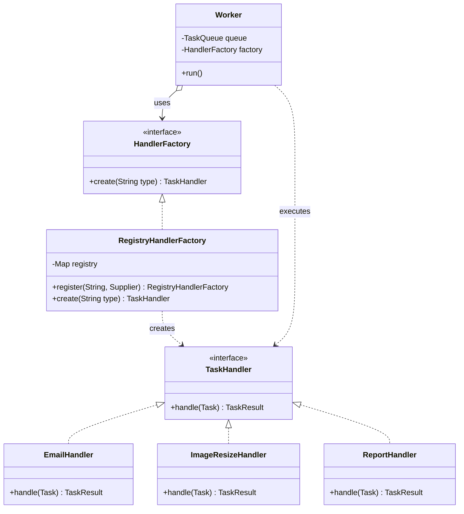

# Factory Method

> Where this fits in the project: a `Worker` pulls a `Task` off the queue, reads its `type` field ("email.send", "image.resize", "report.generate"), and must obtain the *right* `TaskHandler` to execute it. The naive answer — a giant `switch` that does `new EmailHandler()` — couples the worker to every concrete handler that exists and every one that will ever exist. Factory Method moves that decision behind a single overridable creation point, so *what gets created* varies without the *calling code* changing. In our codebase it shows up as a `HandlerFactory` keyed by task type, and as the seam that lets `WorkerPool` create an `InMemoryTaskQueue` today and a `PostgresTaskQueue` in Phase 2 without touching the worker loop.

The `Worker` knows it needs *a handler*. It does not, and must not, know how to construct an `EmailHandler` with its SMTP client, or an `ImageResizeHandler` with its thumbnail pipeline. Construction details are a different concern from execution. Factory Method is the pattern that draws that line: it defines an interface for creating an object but lets the implementor decide which class to instantiate, so a class defers instantiation to its subclasses or to a method designed to be overridden.

---

## 1. Why This Exists — The Real Problem

Open Phase 1. We have the canonical model:

```java
public enum TaskStatus { PENDING, SCHEDULED, RUNNING, SUCCEEDED, FAILED, RETRYING, DEAD }

public record Task(
        String id,            // a UUID
        String type,          // e.g. "email.send", "image.resize"
        String payload,       // JSON string
        TaskStatus status,
        int attempts,
        int maxAttempts,
        Instant createdAt,
        Instant scheduledAt,
        int priority) {}

public record TaskResult(boolean success, String message, boolean retryable) {}

@FunctionalInterface
public interface TaskHandler {
    TaskResult handle(Task task) throws Exception;
}
```

A `Worker` runs an infinite loop: dequeue a `Task`, find the handler for `task.type()`, execute it, deal with the outcome. The hard question is the middle step — **given a `String` type, produce the correct `TaskHandler`** — without the worker (a hot, well-tested, concurrency-sensitive loop) knowing every handler class in the system.

Three forces make this non-trivial:

1. **The set of handlers grows constantly.** Today: email, image resize. Tomorrow: report generation, webhook delivery, PDF rendering, ML inference. Each is a separate concrete class, often owned by a different team, with different dependencies (an SMTP client, an S3 client, a template engine).
2. **Construction is not free.** Some handlers are stateless singletons. Some need a connection pool injected. Some are expensive to build and should be reused. The *policy* for how a handler comes into existence is itself something we want to control in one place.
3. **The creation decision and the execution decision live in different layers.** The worker loop is infrastructure. "Email tasks map to `EmailHandler`" is domain wiring. Mixing them means every domain change forces a recompile of the concurrency core.

> Historical note: Factory Method is one of the original Gang of Four (1994) creational patterns. It generalized a recurring shape in C++ frameworks: a base `Application` class with a `createDocument()` method that subclasses override to return *their* document type. The framework calls `createDocument()` without knowing the concrete class. Java's `Iterable.iterator()`, `Collection.stream()`, and `ThreadFactory.newThread()` are all Factory Methods — the caller gets an object whose concrete type the implementor chose.

**Intent (GoF):** Define an interface for creating an object, but let the implementor decide which class to instantiate. Factory Method lets a class defer instantiation to a dedicated, overridable creation operation.

---

## 2. The Naive Version

The first cut everyone writes inlines a `switch` on the type, calling `new` per branch, right inside the worker.

```java
// NAIVE — construction logic welded into the worker loop.
public final class Worker implements Runnable {
    private final TaskQueue queue;

    public Worker(TaskQueue queue) { this.queue = queue; }

    @Override
    public void run() {
        while (!Thread.currentThread().isInterrupted()) {
            try {
                Task task = queue.dequeue();
                TaskHandler handler = createHandler(task.type()); // <-- the smell
                TaskResult result = handler.handle(task);
                // ... handle outcome (retry / succeed / dead-letter) ...
            } catch (InterruptedException e) {
                Thread.currentThread().interrupt();
                return;
            } catch (Exception e) {
                // ... log, mark failed ...
            }
        }
    }

    // The factory logic is trapped inside the worker.
    private TaskHandler createHandler(String type) {
        switch (type) {
            case "email.send":      return new EmailHandler(new SmtpClient("smtp.internal", 587));
            case "image.resize":    return new ImageResizeHandler(new S3Client("us-east-1"));
            case "report.generate": return new ReportHandler(new TemplateEngine());
            default: throw new IllegalArgumentException("Unknown task type: " + type);
        }
    }
}
```

It compiles and runs. Now count what is wrong:

- **The worker depends on every concrete handler and their dependencies.** `Worker.java` now imports `EmailHandler`, `SmtpClient`, `ImageResizeHandler`, `S3Client`, `ReportHandler`, `TemplateEngine`. The concurrency core can't compile until the entire handler universe compiles.
- **Open/Closed violation.** Adding `webhook.deliver` means editing this `switch` — editing the hottest, most safety-critical class in the system to add a domain feature (see [../04-oop-and-ood/solid.md](../04-oop-and-ood/solid.md)).
- **A new handler is built on every task.** `new EmailHandler(new SmtpClient(...))` per dequeue. We rebuild SMTP clients millions of times. The construction policy (reuse? pool? singleton?) is impossible to express here.
- **Untestable.** To unit-test the worker's outcome handling, you must drag real `SmtpClient` and `S3Client` constructors into the test classpath.
- **Configuration is hardcoded.** The SMTP host and S3 region are string literals buried in a branch.

The `switch` is the tell. Any time the *type of object to create* is decided by a branch on a string or enum, the creation decision is begging to be extracted behind a method.

---

## 3. Intent, Motivation, and Participants

**Problem statement.** A class (`Worker`) needs to obtain instances of a product (`TaskHandler`) but should not be coupled to the concrete product classes, and the *choice* of concrete product depends on runtime data (`task.type()`).

**Motivation.** Separate "I need a product" from "here is how the product is built and which concrete one to build." Put the construction decision behind a single, named, overridable/replaceable operation — the *factory method* — so callers depend only on the product interface, and adding a new product means adding a class plus a registration, never editing the caller.

**Participants (GoF vocabulary):**

| Participant | GoF role | In our project |
|---|---|---|
| **Product** | The interface of objects the factory method creates | `TaskHandler` |
| **ConcreteProduct** | An implementation of Product | `EmailHandler`, `ImageResizeHandler`, ... |
| **Creator** | Declares the factory method returning a Product; may contain core logic that *uses* the product | `HandlerFactory` (and the `Worker` that calls it) |
| **ConcreteCreator** | Overrides the factory method to return a specific ConcreteProduct | a subclass or, in our registry variant, the per-type supplier |

> Vocabulary precision. *Factory Method* (this chapter) is **one method that returns one product**, classically overridden by subclasses. A *static factory method* (e.g. `Task.of(...)`, `List.of(...)`) is a named static constructor — related idea, not the GoF pattern, no polymorphism. *Abstract Factory* (next chapter, [abstract-factory.md](abstract-factory.md)) is **an object with several factory methods** that together produce a *family* of related products. We compare all three in §10.

---

## 4. UML Class Diagram



The arrows that matter: `Worker` *uses* (aggregation, `o-->`) a `HandlerFactory` and depends only on the `TaskHandler` interface (`..>`). It has **no** dependency on `EmailHandler`. The creator (`RegistryHandlerFactory`) is the only place that knows concrete products exist.

---

## 5. Refactoring the Naive Code into the Pattern

Step 1: declare the Creator interface — the factory method.

```java
/** Creator: defines the factory method. */
public interface HandlerFactory {
    /**
     * @throws UnknownTaskTypeException if no handler is registered for {@code type}.
     */
    TaskHandler create(String type);
}

public final class UnknownTaskTypeException extends RuntimeException {
    public UnknownTaskTypeException(String type) {
        super("No handler registered for task type: " + type);
    }
}
```

Step 2: the classic GoF form is *subclass override*. Here is the pure pattern so you can recognize it in interviews — a `Creator` base class whose factory method subclasses override.

```java
// Pure GoF Factory Method: subclasses override the creation operation.
public abstract class TaskProcessor {

    // The "factory method" — the single overridable creation point.
    protected abstract TaskHandler createHandler();

    // Template logic that USES the product without knowing its concrete type.
    public final TaskResult process(Task task) throws Exception {
        TaskHandler handler = createHandler();   // defer instantiation to subclass
        return handler.handle(task);
    }
}

public final class EmailProcessor extends TaskProcessor {
    @Override
    protected TaskHandler createHandler() {
        return new EmailHandler(SmtpClientHolder.shared());
    }
}
```

That form is correct and worth knowing, but for our project a **registry-based creator** is the production-grade shape. One creator instance, products registered by key, no subclass explosion. This is the form that actually scales to dozens of task types.

```java
// Production-grade Creator: a registry keyed by task type.
public final class RegistryHandlerFactory implements HandlerFactory {

    // Supplier<TaskHandler> is the factory method, captured per type.
    private final Map<String, Supplier<TaskHandler>> registry = new ConcurrentHashMap<>();

    public RegistryHandlerFactory register(String type, Supplier<TaskHandler> creator) {
        Objects.requireNonNull(type, "type");
        Objects.requireNonNull(creator, "creator");
        registry.put(type, creator);
        return this; // fluent registration
    }

    @Override
    public TaskHandler create(String type) {
        Supplier<TaskHandler> creator = registry.get(type);
        if (creator == null) {
            throw new UnknownTaskTypeException(type);
        }
        return creator.get();
    }
}
```

Step 3: the `Worker` now depends only on `HandlerFactory` and `TaskHandler`. It imports zero concrete handlers.

```java
public final class Worker implements Runnable {
    private final TaskQueue queue;
    private final HandlerFactory factory;

    public Worker(TaskQueue queue, HandlerFactory factory) {
        this.queue = queue;
        this.factory = factory;
    }

    @Override
    public void run() {
        while (!Thread.currentThread().isInterrupted()) {
            try {
                Task task = queue.dequeue();
                TaskHandler handler = factory.create(task.type()); // creation is someone else's job
                TaskResult result = handler.handle(task);
                // ... outcome handling: succeed / retry / dead-letter ...
            } catch (InterruptedException e) {
                Thread.currentThread().interrupt();
                return;
            } catch (UnknownTaskTypeException e) {
                // ... dead-letter immediately: no handler will ever exist for this ...
            } catch (Exception e) {
                // ... log, mark failed, possibly retry ...
            }
        }
    }
}
```

Step 4: wiring lives in one composition-root location, not in the worker.

```java
// Composition root (Phase 1 main(); Phase 2 a Spring @Configuration).
HandlerFactory factory = new RegistryHandlerFactory()
    .register("email.send",      () -> new EmailHandler(SmtpClientHolder.shared()))
    .register("image.resize",    () -> new ImageResizeHandler(S3ClientHolder.shared()))
    .register("report.generate", () -> new ReportHandler(TemplateEngineHolder.shared()));

WorkerPool pool = new WorkerPool(queue, factory, /*threads=*/8);
pool.start();
```

> Notice that registering `() -> existingSingleton` reuses one instance, while `() -> new X()` builds a fresh one per task. The construction *policy* is now a one-line decision per type, exactly where it belongs.

---

## 6. Before-and-After Comparison

| Dimension | Naive `switch` in `Worker` | Factory Method (`HandlerFactory`) |
|---|---|---|
| `Worker` dependencies | Every concrete handler + their deps | Only `HandlerFactory` + `TaskHandler` |
| Add a new task type | Edit the worker loop, recompile core | Add a class + one `register(...)` line |
| Open/Closed | Violated (edit to extend) | Honored (extend by adding) |
| Construction policy | Hardcoded `new` per dequeue | One lambda per type; reuse/pool/new is a choice |
| Testability | Drags real clients into worker tests | Inject a `Map.of("email.send", () -> fakeHandler)` |
| Config of deps | String literals in branches | Centralized in composition root |
| Cyclomatic complexity of `Worker` | Grows with every type | Constant |

The decisive line: **adding a feature is now "add a class, add a line" instead of "edit the hot loop."** That is the Open/Closed Principle made physical.

---

## 7. A Simple Java Example

Strip away the project to see the bare bones. A `Dialog` creator with a factory method overridden by subclasses — the textbook GoF shape.

```java
interface Button { void render(); }

final class HtmlButton implements Button {
    public void render() { System.out.println("<button>OK</button>"); }
}
final class SwingButton implements Button {
    public void render() { System.out.println("[ OK ]"); }
}

abstract class Dialog {
    // The factory method.
    protected abstract Button createButton();

    // Code that uses the product without knowing the concrete class.
    public void renderDialog() {
        Button ok = createButton();
        ok.render();
    }
}

final class HtmlDialog extends Dialog {
    protected Button createButton() { return new HtmlButton(); }
}
final class SwingDialog extends Dialog {
    protected Button createButton() { return new SwingButton(); }
}

public class Demo {
    public static void main(String[] args) {
        Dialog dialog = "web".equals(System.getenv("UI")) ? new HtmlDialog() : new SwingDialog();
        dialog.renderDialog(); // renderDialog() never mentions a concrete Button
    }
}
```

`renderDialog()` is the Creator's logic; `createButton()` is the factory method; subclasses decide the concrete `Button`. The caller picks a `Dialog` once; everything downstream is polymorphic.

---

## 8. A Real-World Java Example (from the JDK)

You use Factory Method constantly in Java without naming it. Three canonical examples:

```java
import java.util.*;
import java.util.concurrent.*;

public class JdkFactoryMethods {
    public static void main(String[] args) {
        // 1) Iterable.iterator() — a factory method. ArrayList returns an
        //    ArrayList$Itr; LinkedList returns a different concrete Iterator.
        Iterator<Integer> it = List.of(1, 2, 3).iterator();

        // 2) ThreadFactory.newThread(Runnable) — caller gets a Thread whose
        //    concrete construction (name, daemon flag, priority) the factory decides.
        ThreadFactory tf = r -> {
            Thread t = new Thread(r, "worker-" + System.nanoTime());
            t.setDaemon(true);
            return t;
        };
        Thread t = tf.newThread(() -> System.out.println("running"));

        // 3) Collection.stream() / Calendar.getInstance() / NumberFormat.getInstance()
        //    all hand back an object whose concrete type the implementor chose.
        var stream = List.of("a", "b").stream();

        System.out.println(it.hasNext() + " " + t.getName() + " " + stream.count());
    }
}
```

`ThreadFactory` is the one we actually use in the project: our `WorkerPool`'s `ExecutorService` is built with a custom `ThreadFactory` so worker threads get meaningful names in stack traces and metrics. That is Factory Method paying rent in production. See [../06-concurrency/executor-service.md](../06-concurrency/executor-service.md) for the pool that consumes it.

---

## 9. Project-Integration Example (Canonical Domain Model)

The complete, compilable slice as it lives in Phase 1, including a handler that decides whether the result is retryable, and the `WorkerPool` that wires it all together.

```java
import java.time.Instant;
import java.util.*;
import java.util.concurrent.*;
import java.util.function.Supplier;

// --- Canonical model (trimmed to what this example needs) ---
enum TaskStatus { PENDING, SCHEDULED, RUNNING, SUCCEEDED, FAILED, RETRYING, DEAD }

record Task(String id, String type, String payload, TaskStatus status,
            int attempts, int maxAttempts, Instant createdAt,
            Instant scheduledAt, int priority) {}

record TaskResult(boolean success, String message, boolean retryable) {}

@FunctionalInterface
interface TaskHandler { TaskResult handle(Task task) throws Exception; }

interface TaskQueue {
    void enqueue(Task t);
    Task dequeue() throws InterruptedException;
    int size();
}

// --- Concrete products: each knows nothing about the factory ---
final class EmailHandler implements TaskHandler {
    public TaskResult handle(Task task) {
        // pretend to send email from task.payload()
        return new TaskResult(true, "sent email for " + task.id(), false);
    }
}

final class ImageResizeHandler implements TaskHandler {
    public TaskResult handle(Task task) {
        // pretend to resize; transient I/O failures are retryable
        boolean transientFailure = task.payload().contains("flaky");
        return transientFailure
            ? new TaskResult(false, "S3 timeout", true)   // retryable
            : new TaskResult(true, "resized " + task.id(), false);
    }
}

// --- Creator (Factory Method behind an interface) ---
final class UnknownTaskTypeException extends RuntimeException {
    UnknownTaskTypeException(String type) { super("No handler for task type: " + type); }
}

interface HandlerFactory { TaskHandler create(String type); }

final class RegistryHandlerFactory implements HandlerFactory {
    private final Map<String, Supplier<TaskHandler>> registry = new ConcurrentHashMap<>();

    RegistryHandlerFactory register(String type, Supplier<TaskHandler> creator) {
        registry.put(Objects.requireNonNull(type), Objects.requireNonNull(creator));
        return this;
    }

    public TaskHandler create(String type) {
        Supplier<TaskHandler> creator = registry.get(type);
        if (creator == null) throw new UnknownTaskTypeException(type);
        return creator.get();
    }
}

// --- Worker: depends only on the factory + the product interface ---
final class Worker implements Runnable {
    private final TaskQueue queue;
    private final HandlerFactory factory;

    Worker(TaskQueue queue, HandlerFactory factory) {
        this.queue = queue;
        this.factory = factory;
    }

    public void run() {
        while (!Thread.currentThread().isInterrupted()) {
            try {
                Task task = queue.dequeue();
                TaskHandler handler = factory.create(task.type());
                TaskResult result = handler.handle(task);
                System.out.printf("[%s] type=%s success=%s retryable=%s msg=%s%n",
                        Thread.currentThread().getName(), task.type(),
                        result.success(), result.retryable(), result.message());
            } catch (InterruptedException e) {
                Thread.currentThread().interrupt();
                return;
            } catch (UnknownTaskTypeException e) {
                System.err.println("dead-letter (no handler): " + e.getMessage());
            } catch (Exception e) {
                System.err.println("handler threw: " + e);
            }
        }
    }
}

// --- WorkerPool: receives the factory; never constructs handlers itself ---
final class WorkerPool {
    private final ExecutorService pool;
    private final TaskQueue queue;
    private final HandlerFactory factory;
    private final int threads;

    WorkerPool(TaskQueue queue, HandlerFactory factory, int threads) {
        this.queue = queue;
        this.factory = factory;
        this.threads = threads;
        ThreadFactory tf = new ThreadFactory() { // Factory Method, JDK flavor
            private int n = 0;
            public Thread newThread(Runnable r) {
                Thread t = new Thread(r, "worker-" + (n++));
                t.setDaemon(true);
                return t;
            }
        };
        this.pool = Executors.newFixedThreadPool(threads, tf);
    }

    void start() {
        for (int i = 0; i < threads; i++) pool.submit(new Worker(queue, factory));
    }

    void shutdown() { pool.shutdownNow(); }
}

final class InMemoryTaskQueue implements TaskQueue {
    private final BlockingQueue<Task> q;
    InMemoryTaskQueue(int capacity) { this.q = new LinkedBlockingQueue<>(capacity); }
    public void enqueue(Task t) { q.add(t); }
    public Task dequeue() throws InterruptedException { return q.take(); }
    public int size() { return q.size(); }
}

// --- Composition root ---
public class Phase1Demo {
    public static void main(String[] args) throws Exception {
        TaskQueue queue = new InMemoryTaskQueue(1000);

        HandlerFactory factory = new RegistryHandlerFactory()
            .register("email.send",   EmailHandler::new)        // fresh per task
            .register("image.resize", ImageResizeHandler::new); // (could reuse a singleton)

        WorkerPool pool = new WorkerPool(queue, factory, 4);
        pool.start();

        queue.enqueue(task("email.send",   "{\"to\":\"a@b.com\"}"));
        queue.enqueue(task("image.resize", "{\"flaky\":true}"));   // -> retryable failure
        queue.enqueue(task("pdf.render",   "{}"));                 // -> dead-letter, unknown type

        Thread.sleep(200);
        pool.shutdown();
    }

    static Task task(String type, String payload) {
        return new Task(UUID.randomUUID().toString(), type, payload,
                TaskStatus.PENDING, 0, 3, Instant.now(), Instant.now(), 0);
    }
}
```

Key payoff for the project: when Phase 4 introduces `webhook.deliver` and `ml.infer`, we write two classes and add two `register(...)` lines in the composition root. `Worker`, `WorkerPool`, and `TaskQueue` never change. The same seam lets us swap `InMemoryTaskQueue` for `PostgresTaskQueue` in Phase 2 — the *queue* is created behind a factory too. The blocking queue underneath is covered in [../06-concurrency/blocking-queue.md](../06-concurrency/blocking-queue.md).

### Spring Boot flavor (Phase 2 onward)

Once Spring is in the picture, the Spring container becomes the registry. Beans implementing `TaskHandler` self-register by type, and the framework injects the map for you.

```java
import org.springframework.stereotype.Component;
import org.springframework.stereotype.Service;
import java.util.Map;

@Component("email.send")          // bean name = task type
class EmailHandler implements TaskHandler {
    public TaskResult handle(Task t) { return new TaskResult(true, "sent", false); }
}

@Service
class SpringHandlerFactory implements HandlerFactory {
    private final Map<String, TaskHandler> handlers; // Spring injects beanName -> bean

    SpringHandlerFactory(Map<String, TaskHandler> handlers) { this.handlers = handlers; }

    public TaskHandler create(String type) {
        TaskHandler h = handlers.get(type);
        if (h == null) throw new UnknownTaskTypeException(type);
        return h;
    }
}
```

Spring injecting `Map<String, TaskHandler>` (bean name to bean) *is* the registry pattern, framework-provided. Adding a handler is now just dropping a `@Component("new.type")` class on the classpath — zero edits to the factory. This is dependency injection ([../04-oop-and-ood/dependency-injection.md](../04-oop-and-ood/dependency-injection.md)) doing the registration for you.

---

## 10. Tradeoffs

**Factory Method vs. static factory vs. Abstract Factory** — the three are constantly confused; here is the precise comparison.

| Aspect | Static factory method | Factory Method (GoF) | Abstract Factory |
|---|---|---|---|
| Shape | A `static` method returning the type, e.g. `Task.of(...)`, `List.of(...)` | An instance/overridable method on a Creator returning one Product | An object with *several* factory methods producing a *family* |
| Polymorphism | None — resolved at compile time | Yes — Creator/subclass or registry decides at runtime | Yes — pick a whole factory, get matching products |
| When | Replace a constructor with a named, cached, or subtype-flexible alternative | Choose one product by runtime data (our `task.type()`) | Need a *consistent set* (e.g. Postgres `TaskRepository` + `PostgresTaskQueue` together) |
| Our codebase | `Task.create(...)`, `TaskResult.ok()` | `HandlerFactory.create(type)` | the broker family in [abstract-factory.md](abstract-factory.md) |

> Rule of thumb: one product chosen by data → Factory Method. A *family* of products that must be consistent → Abstract Factory. A nicer constructor → static factory.

**Honest costs of Factory Method:**

- **Indirection.** One more interface and one more hop. For a system with exactly one product type forever, it is overkill — just call `new`.
- **Lost compile-time exhaustiveness.** A `switch` on a `sealed` interface gives compiler-checked completeness; a runtime registry trades that for an `UnknownTaskTypeException` you must handle. (For a *closed, small* product set, prefer a `sealed` interface + pattern-matching `switch` — see Common Mistakes.)
- **Registration must happen.** Someone has to wire `register(...)` or annotate the bean. Forget it and the type silently dead-letters at runtime instead of failing to compile.
- **Discoverability.** "What handlers exist?" is answered by reading the registry, not by Find Usages on a class. Mitigate by logging registered types on startup.

---

## 11. Common Mistakes and Pitfalls

- **Factory returns `Object` or a too-wide type.** Then callers downcast and you've reintroduced coupling. Return the narrowest useful product interface (`TaskHandler`).
- **The factory does too much.** A factory should *select and construct*, not execute business logic, log metrics, or mutate the task. Keep `create()` side-effect-free beyond construction.
- **Hidden global state.** `HandlerFactory.INSTANCE` as a mutable static is a Singleton smell that wrecks tests (see [singleton.md](singleton.md)). Inject the factory; don't reach for a global.
- **Using Factory Method when a `sealed` interface + `switch` is clearer.** If the product set is *closed and known at compile time*, modern Java gives you exhaustiveness for free:

  ```java
  sealed interface Notification permits Email, Sms, Push {}
  record Email(String to) implements Notification {}
  record Sms(String number) implements Notification {}
  record Push(String token) implements Notification {}

  // Compiler errors if you add a permit and forget a branch — no default needed.
  static TaskHandler handlerFor(Notification n) {
      return switch (n) {
          case Email e -> new EmailHandler();
          case Sms s   -> new SmsHandler();
          case Push p  -> new PushHandler();
      };
  }
  ```

  Use the registry factory when the set is *open* (plugins, runtime config); use `sealed` + `switch` when it is *closed* and you want compile-time safety.
- **Rebuilding expensive products per call.** `() -> new HeavyHandler(newConnectionPool())` per task exhausts resources. Capture a shared instance in the supplier, or have the supplier return a pooled object.
- **Swallowing the unknown-type case.** Returning `null` from `create()` forces every caller to null-check. Throw a typed exception; the worker turns it into a deliberate dead-letter.

---

## 12. Refactoring Exercise (bad → improved → production)

**Bad.** A scheduler picks a `RetryPolicy` with an inline `switch` on a config string, duplicated in three places:

```java
RetryPolicy policy;
switch (config.get("retry.strategy")) {
    case "fixed":       policy = new FixedDelayRetryPolicy(Duration.ofSeconds(2)); break;
    case "exponential": policy = new ExponentialBackoffRetryPolicy(Duration.ofSeconds(1), 2.0); break;
    default:            policy = new FixedDelayRetryPolicy(Duration.ofSeconds(1));
}
```

**Improved.** Extract a factory method so the branch lives once:

```java
final class RetryPolicyFactory {
    static RetryPolicy create(String strategy) {
        return switch (strategy) {
            case "fixed"       -> new FixedDelayRetryPolicy(Duration.ofSeconds(2));
            case "exponential" -> new ExponentialBackoffRetryPolicy(Duration.ofSeconds(1), 2.0);
            default            -> new FixedDelayRetryPolicy(Duration.ofSeconds(1));
        };
    }
}
```

**Production.** A registry creator that is open for extension, validated at startup, and injectable:

```java
public final class RetryPolicyFactory {
    private final Map<String, Supplier<RetryPolicy>> registry = new ConcurrentHashMap<>();
    private final Supplier<RetryPolicy> fallback;

    public RetryPolicyFactory(Supplier<RetryPolicy> fallback) {
        this.fallback = Objects.requireNonNull(fallback);
    }

    public RetryPolicyFactory register(String name, Supplier<RetryPolicy> s) {
        registry.put(name, s);
        return this;
    }

    public RetryPolicy create(String name) {
        return registry.getOrDefault(name, fallback).get();
    }

    public Set<String> known() { return Set.copyOf(registry.keySet()); }
}

// Wiring:
var policies = new RetryPolicyFactory(() -> new FixedDelayRetryPolicy(Duration.ofSeconds(1)))
    .register("fixed",       () -> new FixedDelayRetryPolicy(Duration.ofSeconds(2)))
    .register("exponential", () -> new ExponentialBackoffRetryPolicy(Duration.ofSeconds(1), 2.0));
// Log at startup: "registered retry policies: " + policies.known()
```

The strategies it produces are covered in [strategy.md](strategy.md); Factory Method is how we *select and build* one of them without a branch in the caller.

---

## 13. Exercises

### Easy

1. **Knowledge check.** In one sentence each, distinguish a *static factory method*, the *Factory Method pattern*, and *Abstract Factory*. Give a JDK example of each.
2. **Coding.** Add a `WebhookHandler` (task type `"webhook.deliver"`) that returns a retryable failure when the payload contains `"503"` and success otherwise. Register it in the Phase 1 composition root. Confirm `Worker` and `WorkerPool` need zero changes.

### Medium

3. **Refactoring.** You inherit a `TaskQueueBuilder` with a method `build(String kind)` containing `if ("memory".equals(kind)) ... else if ("postgres".equals(kind)) ...`. Refactor it into a `QueueFactory` interface with a registry creator so adding a `"redis"` queue is a one-line registration.
4. **Design.** The product set "task types" is *open* (plugins). The product set "the three supported queue backends" is *closed*. For each, decide between a registry factory and a `sealed` interface + `switch`, and justify in 2–3 sentences.

### Hard

5. **Interview-style.** Your `HandlerFactory.create()` is called on the hot path for every dequeue, millions of times per minute. Profiling shows `ConcurrentHashMap.get` plus lambda invocation is showing up. Propose two ways to cut the cost without losing extensibility, and state the tradeoff of each.
6. **Stretch.** Make the registry self-populating via Java's `ServiceLoader` so a handler in a separate JAR registers itself by dropping a `META-INF/services` entry — no central edit at all. Sketch the `TaskHandlerProvider` SPI and the `ServiceLoader`-backed factory.

### Pattern-identification

7. For each, name the pattern and say why: (a) `Calendar.getInstance()`; (b) `DocumentBuilderFactory.newDocumentBuilder()` where the factory also creates `Transformer` and `XPath` from the same family; (c) `Integer.valueOf(int)` returning a cached instance for small values.

---

## 14. Solutions

**1.** A *static factory method* is a `static` named constructor like `List.of(...)` — no runtime polymorphism, just a nicer/cached constructor. The *Factory Method pattern* is an overridable instance operation (or registry lookup) that returns one product chosen at runtime, e.g. `Iterable.iterator()`. *Abstract Factory* is an object exposing several factory methods that yield a consistent *family*, e.g. `DocumentBuilderFactory` producing matching parser components, or a JDBC `DataSource` family.

**2.**

```java
final class WebhookHandler implements TaskHandler {
    public TaskResult handle(Task task) {
        boolean serverError = task.payload().contains("503");
        return serverError
            ? new TaskResult(false, "downstream 503", true)
            : new TaskResult(true, "delivered " + task.id(), false);
    }
}

// In the composition root — the ONLY change:
factory.register("webhook.deliver", WebhookHandler::new);
```

`Worker`/`WorkerPool` are untouched because they depend on `HandlerFactory`, not on `WebhookHandler`. That is the whole point.

**3.**

```java
interface QueueFactory { TaskQueue create(String kind); }

final class RegistryQueueFactory implements QueueFactory {
    private final Map<String, Supplier<TaskQueue>> reg = new ConcurrentHashMap<>();
    RegistryQueueFactory register(String kind, Supplier<TaskQueue> s) { reg.put(kind, s); return this; }
    public TaskQueue create(String kind) {
        var s = reg.get(kind);
        if (s == null) throw new IllegalArgumentException("Unknown queue kind: " + kind);
        return s.get();
    }
}

QueueFactory queues = new RegistryQueueFactory()
    .register("memory",   () -> new InMemoryTaskQueue(1000))
    .register("postgres", () -> new PostgresTaskQueue(dataSource));
// Adding redis: one line — .register("redis", () -> new RedisTaskQueue(redisClient))
```

**4.** *Task types* are open and grow without recompiling the core → **registry factory**; new plugins register themselves, and the cost of losing compile-time exhaustiveness is acceptable because the type comes from external data anyway. *The three queue backends* are closed, security-sensitive, and chosen by ops config → **`sealed interface QueueBackend permits InMemory, Postgres, Redis` + `switch`**; the compiler then forces you to handle every backend, and a typo in config fails loudly rather than dead-lettering.

**5.** (a) **Memoize per type:** wrap the registry so `create(type)` caches the constructed handler in a `ConcurrentHashMap<String, TaskHandler>` when handlers are stateless and shareable — `get` is then a single map hit returning a cached instance, no lambda call. Tradeoff: only valid if handlers are thread-safe and stateless. (b) **Resolve once per worker:** if a given worker only ever processes one type (type-partitioned pools), resolve the handler at worker construction and keep it as a field, eliminating per-task lookup entirely. Tradeoff: requires partitioning the queue by type, reducing scheduling flexibility.

**6.**

```java
// SPI in the core module:
public interface TaskHandlerProvider {
    String type();              // e.g. "email.send"
    TaskHandler create();
}

// A provider in a plugin JAR:
public final class EmailHandlerProvider implements TaskHandlerProvider {
    public String type() { return "email.send"; }
    public TaskHandler create() { return new EmailHandler(); }
}
// File: META-INF/services/com.example.TaskHandlerProvider
//   com.example.email.EmailHandlerProvider

// ServiceLoader-backed factory — discovers providers on the classpath:
public final class ServiceLoaderHandlerFactory implements HandlerFactory {
    private final Map<String, TaskHandlerProvider> providers = new HashMap<>();

    public ServiceLoaderHandlerFactory() {
        for (TaskHandlerProvider p : ServiceLoader.load(TaskHandlerProvider.class)) {
            providers.put(p.type(), p);
        }
    }
    public TaskHandler create(String type) {
        var p = providers.get(type);
        if (p == null) throw new UnknownTaskTypeException(type);
        return p.create();
    }
}
```

Now a new handler JAR on the classpath registers itself with zero edits to the core — the ultimate Open/Closed payoff. This is exactly how JDBC drivers and SLF4J bindings work.

**7.** (a) `Calendar.getInstance()` — a *static factory method* (it returns a `GregorianCalendar` or locale-specific subclass; named, no polymorphic creator object). (b) `DocumentBuilderFactory` building `DocumentBuilder`, `Transformer`, `XPath` from one configured factory — *Abstract Factory* (a family of related products from one factory object). (c) `Integer.valueOf` — a *static factory method* with caching/flyweight behavior; it is not the GoF Factory Method (no overridable creator) but demonstrates why static factories beat raw constructors: they can return cached instances.

---

## 15. Interview Questions and Takeaways

1. **Q: What problem does Factory Method solve that a constructor cannot?** A: A constructor names a concrete class at the call site, coupling the caller to it. Factory Method lets the *concrete type* be chosen by an implementor or by runtime data, so the caller depends only on the product interface.
2. **Q: Factory Method vs. Abstract Factory?** A: Factory Method produces *one* product via one overridable/registry method; Abstract Factory is an object with *several* factory methods producing a *consistent family*. One product chosen by data → Factory Method; a matched set → Abstract Factory.
3. **Q: Is a static factory method the GoF Factory Method?** A: No. A static factory (e.g. `List.of`) is a named constructor with no polymorphism. The pattern requires that the creation operation be overridable/replaceable so the concrete product varies at runtime.
4. **Q: When would you NOT use it?** A: When there is exactly one product type, or when the set is closed and small — a `sealed` interface + `switch` gives compile-time exhaustiveness that a runtime registry sacrifices.
5. **Q: How does Factory Method support the Open/Closed Principle?** A: New products are added by writing a class and registering it; the caller and the creator's core logic are never edited. Extension without modification.
6. **Q: Give three JDK Factory Methods.** A: `Iterable.iterator()`, `Collection.stream()`, `ThreadFactory.newThread()` (also `Calendar.getInstance()`, `NumberFormat.getInstance()`).
7. **Q: How does Spring relate to this pattern?** A: Injecting `Map<String, TaskHandler>` (bean name → bean) is a container-provided registry factory; `@Component("type")` self-registers a product, so the framework is the creator.

**Takeaways:** Factory Method draws the line between *needing* an object and *constructing* it. A `switch` on a type string deciding what to `new` is the universal signal to apply it. In our codebase it is the `HandlerFactory` keyed by task type and the seam that lets queues, handlers, and (later) brokers be swapped without touching the worker loop.

---

## Production Considerations

- **Where it is used in industry.** JDBC `DriverManager`/`ServiceLoader` driver discovery, SLF4J binding selection, Spring's bean-name `Map` injection, Kafka's `Serializer`/`Deserializer` lookup by class config, Netty's `ChannelFactory`. All are registry-style factory methods keyed by config or class.
- **When NOT to use it.** Single product type forever; a closed small set better served by `sealed` + `switch`; or when a plain DI container already gives you the object — don't wrap a constructor you call once.
- **Common anti-patterns.** A "factory" that also runs business logic or mutates inputs; a god-factory with a hundred `if` branches (that is just the naive `switch` relocated); returning `null` instead of throwing for unknown types; a mutable static `INSTANCE` factory that defeats test isolation.
- **Monitoring.** Log the registered type set on startup so a missing registration is visible immediately. Emit a counter for `UnknownTaskTypeException` (via the `MetricsCollector` / Micrometer registry) — a spike means a producer is sending a type no consumer can handle, a real cross-team incident signal, and those tasks are silently dead-lettering.
- **Failure mode at scale.** If `create()` constructs an expensive object per call on a hot path, the factory becomes the bottleneck. Memoize stateless handlers or resolve per-worker. If registration is racy at startup, use an immutable map built once before workers start rather than mutating `ConcurrentHashMap` while workers read it.

---

## What We Can Improve In Our Project Using This Concept

Today (or in the naive draft), `Worker` constructs handlers via an inline `switch`, coupling the concurrency core to every domain handler and their I/O clients. We introduce a `HandlerFactory` interface with a `RegistryHandlerFactory` so:

- `Worker` and `WorkerPool` depend only on `HandlerFactory` + `TaskHandler`.
- Adding a task type is "write a class + one `register(...)` line" — Open/Closed honored.
- Construction policy (reuse a singleton vs. build fresh vs. pool) is one lambda per type in the composition root.
- Unknown types throw `UnknownTaskTypeException`, which the worker turns into a deliberate dead-letter instead of a crash.
- The same seam is reused for `QueueFactory` (InMemory today, Postgres in Phase 2, Redis/Kafka in Phase 4).

## Project Refactoring Task

1. Add interface `HandlerFactory` with method `TaskHandler create(String type)` and a `RegistryHandlerFactory` registry implementation.
2. Add `UnknownTaskTypeException`.
3. Change `Worker` to take a `HandlerFactory` constructor argument and call `factory.create(task.type())`; delete its private `createHandler` switch.
4. Move all handler wiring into the composition root (Phase 1 `main`; Phase 2 a Spring `@Configuration` or `Map<String, TaskHandler>` injection).
5. Add tests: a fake factory backed by `Map.of("email.send", () -> recordingHandler)` proving `Worker` needs no real I/O clients; a test asserting an unregistered type dead-letters.

## Git Commit For This Chapter

```text
refactor(worker): extract HandlerFactory; decouple Worker from concrete handlers

- add HandlerFactory interface + RegistryHandlerFactory (registry keyed by task type)
- add UnknownTaskTypeException; Worker dead-letters unknown types
- Worker/WorkerPool now depend only on HandlerFactory + TaskHandler
- move handler wiring to composition root
- tests: fake-factory worker test, unknown-type dead-letter test

Files touched:
  src/main/java/.../HandlerFactory.java           (new)
  src/main/java/.../RegistryHandlerFactory.java    (new)
  src/main/java/.../UnknownTaskTypeException.java   (new)
  src/main/java/.../Worker.java                     (modified)
  src/main/java/.../WorkerPool.java                 (modified)
  src/main/java/.../App.java                        (modified, composition root)
  src/test/java/.../WorkerFactoryTest.java          (new)
```

## Architecture Impact

The creation decision moves out of the concurrency core into a single composition root. This inverts a dependency: the worker loop no longer points *down* at concrete handlers; instead, the composition root points *down* at both. It is a small Dependency Inversion win ([../04-oop-and-ood/solid.md](../04-oop-and-ood/solid.md)) that compounds — every future product type (handlers, queues, brokers, retry policies) reuses the same registry seam, keeping the hot path stable while the domain grows. It also enables type-partitioned worker pools and `ServiceLoader`/plugin extensibility later without core changes.

## Interview Takeaways

- Factory Method separates *needing* an object from *constructing* it; a `switch` deciding what to `new` is the signal to apply it.
- It is not a static factory (no polymorphism) and not Abstract Factory (which produces a *family*).
- It enforces Open/Closed: extend by adding a class + registration, never by editing the caller.
- JDK proof points: `iterator()`, `stream()`, `ThreadFactory.newThread()`. Spring proof point: injected `Map<String, T>` of beans.
- Know when *not* to use it: a closed, small product set is better served by a `sealed` interface + exhaustive `switch`.
