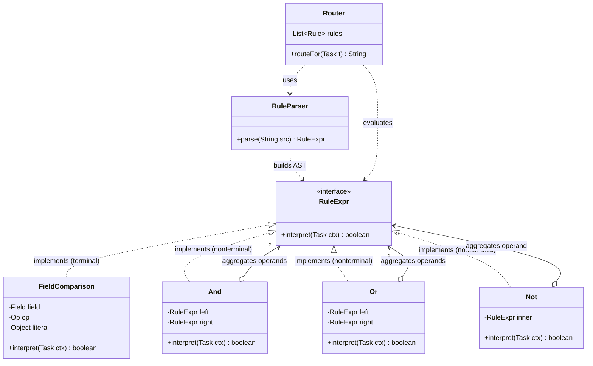
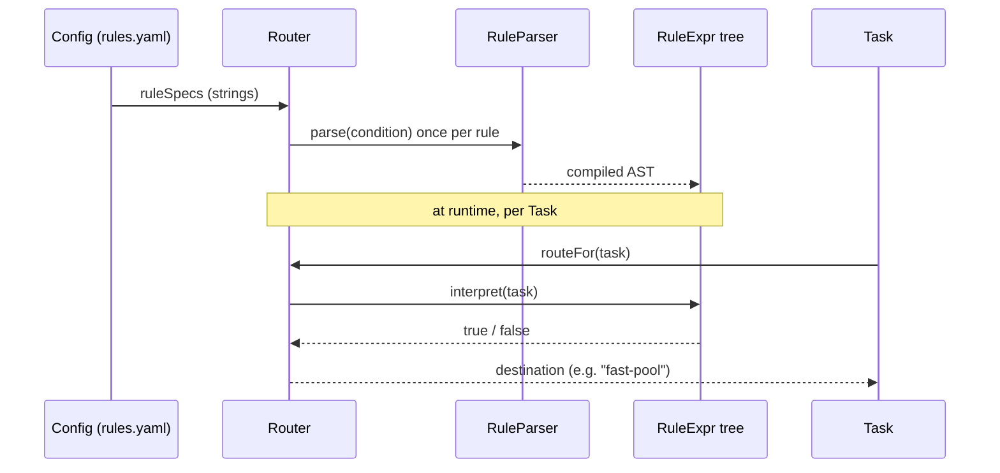

# Interpreter

> Where this fits in the project: by Phase 3 our platform routes thousands of heterogeneous `Task`s through workers, rate limiters, and dead-letter queues. Operators keep asking for *configurable* behavior — "send tasks of type `EMAIL` with priority above 5 to the fast pool," "dead-letter anything that has retried more than 3 times AND is older than an hour," "run this report every weekday at 02:00." Hard-coding each rule in Java means a deploy per rule. The Interpreter pattern lets us define a **tiny domain-specific language (DSL)** for these rules, parse it into an **expression tree**, and **evaluate** that tree against a `Task` at runtime. This chapter builds a real task-routing/filter DSL and a cron-like schedule matcher, then tells you — honestly — when to stop hand-rolling and reach for a real parser.

---

## 1. Why this exists — the real problem in our Task Queue

Phase 3 introduces a `Router` that decides where each task goes. The first version is a method full of `if` statements:

```java
public final class HardcodedRouter {
    public String routeFor(Task task) {
        if (task.type().equals("EMAIL") && task.priority() > 5) {
            return "fast-pool";
        }
        if (task.type().equals("REPORT") && task.attempts() >= 3) {
            return "dlq";
        }
        if (task.type().equals("IMAGE") && task.priority() <= 2) {
            return "batch-pool";
        }
        return "default-pool";
    }
}
```

This compiles and runs. The problem is **organizational, not technical**: every routing change is a code change, a code review, a CI build, and a production deploy. Operators — the people who actually understand the traffic at 3am — cannot touch it. They file a ticket; an engineer translates English ("route high-priority emails to the fast pool") into Java; the loop takes hours.

What operators *want* is to write the rule themselves in a config file or admin UI:

```text
type == "EMAIL" && priority > 5        -> fast-pool
type == "REPORT" && attempts >= 3      -> dlq
type == "IMAGE"  && priority <= 2      -> batch-pool
```

For this to work, **the rule must become data**: a string we read at runtime, turn into something executable, and apply to each `Task`. That "turn a string into something executable" step is exactly what the Interpreter pattern formalizes. You define a **grammar** for your little language, model each grammar construct as a **node class** (a "term" in the language), assemble the nodes into an **abstract syntax tree (AST)**, and then walk the tree to **interpret** (evaluate) it against a context — here, a `Task`.

> Historical note: Interpreter is a Gang of Four (1994) behavioral pattern, and the oldest idea in this whole module — it predates GoF by decades. It is how regular-expression engines, SQL `WHERE` clauses, spreadsheet formula bars, cron daemons, Spring Expression Language (SpEL), `javax.el`, log4j/logback filter expressions, AWS IAM policy conditions, Prometheus's PromQL, and feature-flag targeting rules all work. Each is a tiny language whose sentences are parsed into a tree and evaluated. The pattern shines for **small, stable grammars**; it famously does *not* scale to full programming languages (use a parser generator for that — section 11).

---

## 2. The naive version — a string-bashing evaluator

Suppose we accept "rules as strings" but have not discovered Interpreter yet. The obvious hack is to split the string and evaluate it inline, every time, with no intermediate representation:

```java
public final class NaiveRuleEvaluator {

    /** Evaluates a rule like: type == "EMAIL" && priority > 5 */
    public boolean matches(String rule, Task task) {
        String[] clauses = rule.split("&&");           // split on AND
        for (String clause : clauses) {
            if (!evalClause(clause.trim(), task)) {
                return false;                          // AND short-circuit
            }
        }
        return true;
    }

    private boolean evalClause(String clause, Task task) {
        String[] parts = clause.split(" ");            // ["type", "==", "\"EMAIL\""]
        String field = parts[0];
        String op = parts[1];
        String literal = parts[2].replace("\"", "");

        String actual = switch (field) {
            case "type"     -> task.type();
            case "priority" -> String.valueOf(task.priority());
            case "attempts" -> String.valueOf(task.attempts());
            default -> throw new IllegalArgumentException("unknown field " + field);
        };

        return switch (op) {
            case "==" -> actual.equals(literal);
            case ">"  -> Integer.parseInt(actual) > Integer.parseInt(literal);
            case ">=" -> Integer.parseInt(actual) >= Integer.parseInt(literal);
            case "<"  -> Integer.parseInt(actual) < Integer.parseInt(literal);
            case "<=" -> Integer.parseInt(actual) <= Integer.parseInt(literal);
            default -> throw new IllegalArgumentException("unknown op " + op);
        };
    }
}
```

This handles the three rules above on a good day. Then reality arrives, and every limitation is structural:

- **It re-parses on every evaluation.** For a hot path running millions of times per second, `String.split` plus `Integer.parseInt` on every call is pure waste. There is no compiled, reusable form of the rule.
- **It cannot express `||` (OR) or grouping.** `(a && b) || c` is impossible. Splitting on `&&` assumes a flat conjunction. Real rules need precedence and parentheses.
- **`split(" ")` is a fake parser.** `type == "high priority"` (a literal with a space) explodes. So does `priority>5` (no spaces). Whitespace handling is accidental, not designed.
- **Type handling is string-stringly-typed.** Comparing `priority` numerically requires re-parsing the int back out of a string you just stringified. Booleans, timestamps (`createdAt`), and enums (`status`) have no clean home.
- **No validation step.** A typo (`piority > 5`) is only discovered when a task happens to be evaluated against it in production — possibly hours after the operator saved it. There is no "compile the rule once, report errors immediately."
- **Logic and structure are fused.** Adding a new operator, a new field, or `NOT` means editing this one ever-growing method. There is no separation between *the shape of the language* and *the act of evaluating it*.

The root cause: **the rule never becomes a structured object.** It stays a flat string that we re-interpret textually each time. The fix is to parse the string *once* into a tree of typed nodes — and then evaluation is a trivial recursive walk over that tree. That tree is the Interpreter pattern.

---

## 3. The pattern: Intent, Motivation, Problem Statement, Participants

**Intent (GoF).** Given a language, define a representation for its grammar along with an interpreter that uses the representation to interpret sentences in the language.

**Motivation.** When a particular kind of problem recurs often enough, it can be worth expressing instances of the problem as sentences in a simple language. You then build an interpreter that solves the problem by interpreting these sentences. Our recurring problem is "decide whether a `Task` satisfies a boolean condition" (for routing, filtering, dead-lettering, alerting). Rather than write Java for each condition, we invent a small boolean-expression language and an interpreter for it.

**Problem statement.** We need end-users (operators) to author rules at runtime, without recompiling, in a notation more natural than Java. The grammar is small and stable (comparisons, AND/OR/NOT, parentheses). We must (a) parse a rule string into a reusable, validated representation and (b) evaluate that representation efficiently against many `Task`s.

**Participants.**

| Participant | Role | In our DSL |
| --- | --- | --- |
| **AbstractExpression** | Declares the `interpret(context)` operation common to all nodes in the AST. | `sealed interface RuleExpr { boolean interpret(Task ctx); }` |
| **TerminalExpression** | Implements `interpret` for terminal symbols of the grammar (leaves). | `FieldComparison` (`priority > 5`), `Literal` constants. |
| **NonterminalExpression** | Implements `interpret` for grammar rules that combine other expressions (composites). | `And`, `Or`, `Not`. |
| **Context** | Holds information global to the interpreter; the input being interpreted. | the `Task` being evaluated. |
| **Client** | Builds the AST (usually via a parser) and invokes `interpret`. | `Router` / `RuleParser`. |

Note the **deep relationship to Composite** (see [composite.md](composite.md)): the AST *is* a Composite tree — terminals are leaves, nonterminals are composites — and `interpret` is an operation defined uniformly over both. Interpreter = Composite + a domain-specific operation. The parser that produces the tree is a separate concern (the GoF pattern deliberately leaves parsing out of scope; in practice you always need one).

---

## 4. UML class diagram



The `And`, `Or`, and `Not` nodes **aggregate** child `RuleExpr` nodes (open diamond): the children are independent expressions that could be shared or reused, they are not owned-for-life sub-parts. The leaves (`FieldComparison`) hold only value-typed data. This is the Composite shape applied to a grammar.

---

## 5. Refactor — naive code into the pattern

We refactor in three moves: (1) model the grammar as a sealed tree of nodes, (2) write a small recursive-descent parser that turns a string into that tree once, (3) evaluate by walking the tree.

### 5.1 The grammar (written down explicitly)

Before any code, write the grammar. This is the single most important step — Interpreter without a written grammar is guessing.

```text
rule    := orExpr
orExpr  := andExpr ( "||" andExpr )*
andExpr := unary  ( "&&" unary  )*
unary   := "!" unary | primary
primary := "(" orExpr ")" | comparison
comparison := FIELD OP VALUE
FIELD   := "type" | "priority" | "attempts" | "status" | "maxAttempts"
OP      := "==" | "!=" | ">" | ">=" | "<" | "<="
VALUE   := STRING | NUMBER          (STRING is "double-quoted")
```

This is an **operator-precedence** grammar: `||` binds loosest, then `&&`, then `!`, then parentheses/comparisons — exactly like Java and SQL. Writing it as a grammar means precedence is *designed*, not accidental.

### 5.2 The AST nodes (AbstractExpression + Terminal + Nonterminal)

```java
import java.util.Set;

/** AbstractExpression: every node in the AST can interpret itself against a Task. */
public sealed interface RuleExpr
        permits FieldComparison, And, Or, Not {

    boolean interpret(Task ctx);
}

/** TerminalExpression: a leaf comparing one Task field to a literal. */
public record FieldComparison(Field field, Op op, Object literal) implements RuleExpr {

    public enum Field { TYPE, PRIORITY, ATTEMPTS, STATUS, MAX_ATTEMPTS }
    public enum Op    { EQ, NE, GT, GE, LT, LE }

    @Override
    public boolean interpret(Task ctx) {
        return switch (field) {
            case TYPE         -> compareStrings(ctx.type(), (String) literal);
            case STATUS       -> compareStrings(ctx.status().name(), (String) literal);
            case PRIORITY     -> compareInts(ctx.priority(), (int) literal);
            case ATTEMPTS     -> compareInts(ctx.attempts(), (int) literal);
            case MAX_ATTEMPTS -> compareInts(ctx.maxAttempts(), (int) literal);
        };
    }

    private boolean compareStrings(String actual, String expected) {
        // only EQ / NE make sense for strings; reject ordering ops at parse time ideally
        return switch (op) {
            case EQ -> actual.equals(expected);
            case NE -> !actual.equals(expected);
            default -> throw new IllegalStateException(
                    "operator " + op + " is not valid for a string field");
        };
    }

    private boolean compareInts(int actual, int expected) {
        return switch (op) {
            case EQ -> actual == expected;
            case NE -> actual != expected;
            case GT -> actual >  expected;
            case GE -> actual >= expected;
            case LT -> actual <  expected;
            case LE -> actual <= expected;
        };
    }
}

/** NonterminalExpression: logical AND of two subexpressions. */
public record And(RuleExpr left, RuleExpr right) implements RuleExpr {
    @Override public boolean interpret(Task ctx) {
        return left.interpret(ctx) && right.interpret(ctx);   // short-circuits
    }
}

/** NonterminalExpression: logical OR. */
public record Or(RuleExpr left, RuleExpr right) implements RuleExpr {
    @Override public boolean interpret(Task ctx) {
        return left.interpret(ctx) || right.interpret(ctx);
    }
}

/** NonterminalExpression: logical NOT. */
public record Not(RuleExpr inner) implements RuleExpr {
    @Override public boolean interpret(Task ctx) {
        return !inner.interpret(ctx);
    }
}
```

> Java 21 note: a `sealed interface` with `record` implementations is the *ideal* encoding of an AST. The `permits` clause names the entire grammar in one place, and exhaustive `switch` pattern matching over the sealed type (section 9) lets the compiler prove you handled every node kind. Records give you immutable, value-based nodes with free `equals`/`hashCode`/`toString` — perfect for an AST you build once and read many times.

### 5.3 The parser — string to AST, once

A recursive-descent parser mirrors the grammar one method per rule. First a tiny tokenizer:

```java
import java.util.ArrayList;
import java.util.List;

/** Splits a rule string into tokens: identifiers, operators, literals, parens. */
final class Lexer {
    private final String src;
    private int pos = 0;

    Lexer(String src) { this.src = src; }

    List<String> tokenize() {
        List<String> tokens = new ArrayList<>();
        while (pos < src.length()) {
            char c = src.charAt(pos);
            if (Character.isWhitespace(c)) { pos++; continue; }

            if (c == '"') {                              // quoted string literal
                tokens.add(readQuoted());
            } else if (c == '(' || c == ')') {
                tokens.add(String.valueOf(c)); pos++;
            } else if (isOpChar(c)) {                    // && || ! == != > >= < <=
                tokens.add(readOperator());
            } else if (Character.isLetterOrDigit(c)) {   // field name or number
                tokens.add(readWord());
            } else {
                throw new RuleParseException("unexpected character '" + c + "' at " + pos);
            }
        }
        return tokens;
    }

    private String readQuoted() {
        int start = ++pos;                               // skip opening quote
        while (pos < src.length() && src.charAt(pos) != '"') pos++;
        if (pos >= src.length()) throw new RuleParseException("unterminated string literal");
        String value = src.substring(start, pos);
        pos++;                                           // skip closing quote
        return '"' + value + '"';                        // keep quotes to mark it a string
    }

    private String readOperator() {
        char c = src.charAt(pos);
        // two-char operators first
        if (pos + 1 < src.length()) {
            String two = src.substring(pos, pos + 2);
            if (two.equals("&&") || two.equals("||") || two.equals("==")
                    || two.equals("!=") || two.equals(">=") || two.equals("<=")) {
                pos += 2; return two;
            }
        }
        pos++;
        return String.valueOf(c);                        // ! > <
    }

    private String readWord() {
        int start = pos;
        while (pos < src.length()
                && (Character.isLetterOrDigit(src.charAt(pos)) || src.charAt(pos) == '_')) {
            pos++;
        }
        return src.substring(start, pos);
    }

    private static boolean isOpChar(char c) {
        return c == '&' || c == '|' || c == '!' || c == '=' || c == '>' || c == '<';
    }
}
```

Then the recursive-descent parser, one method per grammar rule:

```java
import java.util.List;

public final class RuleParser {
    private List<String> tokens;
    private int pos;

    public RuleExpr parse(String source) {
        this.tokens = new Lexer(source).tokenize();
        this.pos = 0;
        RuleExpr expr = orExpr();
        if (pos != tokens.size()) {
            throw new RuleParseException("trailing tokens after " + peek());
        }
        return expr;
    }

    // orExpr := andExpr ( "||" andExpr )*
    private RuleExpr orExpr() {
        RuleExpr left = andExpr();
        while (match("||")) left = new Or(left, andExpr());
        return left;
    }

    // andExpr := unary ( "&&" unary )*
    private RuleExpr andExpr() {
        RuleExpr left = unary();
        while (match("&&")) left = new And(left, unary());
        return left;
    }

    // unary := "!" unary | primary
    private RuleExpr unary() {
        if (match("!")) return new Not(unary());
        return primary();
    }

    // primary := "(" orExpr ")" | comparison
    private RuleExpr primary() {
        if (match("(")) {
            RuleExpr inner = orExpr();
            expect(")");
            return inner;
        }
        return comparison();
    }

    // comparison := FIELD OP VALUE
    private RuleExpr comparison() {
        String field = expectWord();
        String op = expectOp();
        String value = next();
        return new FieldComparison(parseField(field), parseOp(op), parseValue(value));
    }

    // --- token helpers ---
    private String peek()  { return pos < tokens.size() ? tokens.get(pos) : null; }
    private String next()  {
        if (pos >= tokens.size()) throw new RuleParseException("unexpected end of input");
        return tokens.get(pos++);
    }
    private boolean match(String t) {
        if (t.equals(peek())) { pos++; return true; }
        return false;
    }
    private void expect(String t) {
        if (!match(t)) throw new RuleParseException("expected '" + t + "' but got " + peek());
    }
    private String expectWord() {
        String t = next();
        if (t.startsWith("\"") || !Character.isLetter(t.charAt(0)))
            throw new RuleParseException("expected a field name but got " + t);
        return t;
    }
    private String expectOp() {
        String t = next();
        return switch (t) {
            case "==", "!=", ">", ">=", "<", "<=" -> t;
            default -> throw new RuleParseException("expected a comparison operator but got " + t);
        };
    }

    // --- mapping tokens to typed enums / literals ---
    private FieldComparison.Field parseField(String f) {
        return switch (f) {
            case "type"        -> FieldComparison.Field.TYPE;
            case "priority"    -> FieldComparison.Field.PRIORITY;
            case "attempts"    -> FieldComparison.Field.ATTEMPTS;
            case "status"      -> FieldComparison.Field.STATUS;
            case "maxAttempts" -> FieldComparison.Field.MAX_ATTEMPTS;
            default -> throw new RuleParseException("unknown field '" + f + "'");
        };
    }
    private FieldComparison.Op parseOp(String o) {
        return switch (o) {
            case "==" -> FieldComparison.Op.EQ;
            case "!=" -> FieldComparison.Op.NE;
            case ">"  -> FieldComparison.Op.GT;
            case ">=" -> FieldComparison.Op.GE;
            case "<"  -> FieldComparison.Op.LT;
            case "<=" -> FieldComparison.Op.LE;
            default -> throw new RuleParseException("unknown operator '" + o + "'");
        };
    }
    private Object parseValue(String v) {
        if (v.startsWith("\"") && v.endsWith("\"")) {
            return v.substring(1, v.length() - 1);        // string literal
        }
        try {
            return Integer.parseInt(v);                   // numeric literal
        } catch (NumberFormatException e) {
            throw new RuleParseException("invalid literal '" + v + "'");
        }
    }
}
```

```java
/** Unchecked: a malformed rule is a programmer/operator error surfaced at parse time. */
public final class RuleParseException extends RuntimeException {
    public RuleParseException(String message) { super(message); }
}
```

---

## 6. Before-and-after comparison

| Aspect | Naive `NaiveRuleEvaluator` | Interpreter (`RuleExpr` AST + `RuleParser`) |
| --- | --- | --- |
| Parse cost | Re-parses on **every** evaluation | Parse **once**, evaluate the tree N times |
| Grouping / precedence | None — flat `&&` only | Full `(...)`, `&&`, `\|\|`, `!` with correct precedence |
| Validation | Errors found at runtime, per-task | Errors thrown at parse time, once, with position |
| Types | Everything stringified | Typed leaves (`int`, `String`, enum) |
| Extensibility | Edit one growing method | Add a node + a grammar rule; nothing else changes |
| Testability | Must build a `Task` to test anything | AST nodes test in isolation; parser tests separately |
| Reuse | None | Compiled AST is a first-class, cacheable object |

**Before** (one rule, awkwardly):

```java
boolean ok = new NaiveRuleEvaluator()
        .matches("type == \"EMAIL\" && priority > 5", task);   // re-parses every call
```

**After** (parse once at config load, evaluate cheaply forever):

```java
RuleExpr rule = new RuleParser().parse("type == \"EMAIL\" && (priority > 5 || attempts >= 3)");
boolean ok = rule.interpret(task);     // pure tree walk, no string work
```

---

## 7. A simple Java example — an arithmetic interpreter

The classic textbook Interpreter is arithmetic. It is the smallest possible illustration of "grammar to tree to evaluate," and it shows the terminal/nonterminal split with zero domain noise.

```java
sealed interface Expr permits Num, Add, Mul {
    int interpret();                         // context is empty here — pure expression
}

record Num(int value) implements Expr {      // terminal
    public int interpret() { return value; }
}
record Add(Expr l, Expr r) implements Expr { // nonterminal
    public int interpret() { return l.interpret() + r.interpret(); }
}
record Mul(Expr l, Expr r) implements Expr { // nonterminal
    public int interpret() { return l.interpret() * r.interpret(); }
}

public class ArithmeticDemo {
    public static void main(String[] args) {
        // AST for: 2 + 3 * 4   ==> 14 (precedence baked into tree shape)
        Expr ast = new Add(new Num(2), new Mul(new Num(3), new Num(4)));
        System.out.println(ast.interpret());   // 14
    }
}
```

The key insight, visible here: **precedence lives in the shape of the tree, not in the evaluator.** `Mul` is a child of `Add`, so it evaluates first. The interpreter is dumb — it just recurses. All the "smarts" went into building the right tree (the parser's job).

---

## 8. A real-world Java example — a cron-like schedule matcher

Our `TaskScheduler` (canonical model) needs to answer "should this recurring task fire at time T?" A cron expression like `0 2 * * MON-FRI` ("minute 0, hour 2, any day-of-month, any month, Monday-Friday") is itself a tiny language. Each field is a sub-expression; matching a `ZonedDateTime` is interpretation. This is Interpreter in production garb — and it is exactly how Quartz, `cron4j`, and Spring's `CronExpression` work internally.

```java
import java.time.ZonedDateTime;
import java.time.DayOfWeek;
import java.util.List;

/** AbstractExpression: a single cron field that can decide if a time matches. */
sealed interface CronField permits AnyField, ListField, RangeField, ExactField {
    boolean matches(int value);
}

record AnyField() implements CronField {                       // "*"
    public boolean matches(int value) { return true; }
}
record ExactField(int target) implements CronField {           // "2"
    public boolean matches(int value) { return value == target; }
}
record RangeField(int lo, int hi) implements CronField {       // "1-5"
    public boolean matches(int value) { return value >= lo && value <= hi; }
}
record ListField(List<CronField> parts) implements CronField { // "1,3,5-7" (nonterminal)
    public boolean matches(int value) {
        return parts.stream().anyMatch(p -> p.matches(value));
    }
}

/** Context = a ZonedDateTime. The whole cron expression is five CronFields. */
record CronExpression(CronField minute, CronField hour,
                      CronField dayOfMonth, CronField month, CronField dayOfWeek) {

    boolean matches(ZonedDateTime t) {
        return minute.matches(t.getMinute())
            && hour.matches(t.getHour())
            && dayOfMonth.matches(t.getDayOfMonth())
            && month.matches(t.getMonthValue())
            && dayOfWeek.matches(toCron(t.getDayOfWeek()));   // MON=1..SUN=7
    }

    private static int toCron(DayOfWeek d) { return d.getValue(); }
}
```

A small field parser builds each `CronField` from its text (`*`, `2`, `1-5`, `1,3,5`):

```java
final class CronFieldParser {
    static CronField parse(String field) {
        if (field.equals("*")) return new AnyField();
        if (field.contains(",")) {
            List<CronField> parts = java.util.Arrays.stream(field.split(","))
                    .map(CronFieldParser::parse)
                    .toList();
            return new ListField(parts);
        }
        if (field.contains("-")) {
            String[] r = field.split("-");
            return new RangeField(Integer.parseInt(r[0]), Integer.parseInt(r[1]));
        }
        return new ExactField(Integer.parseInt(field));
    }

    static CronExpression parseExpression(String cron) {
        String[] f = cron.trim().split("\\s+");
        if (f.length != 5) throw new RuleParseException("cron must have 5 fields: " + cron);
        return new CronExpression(parse(f[0]), parse(f[1]), parse(f[2]), parse(f[3]), parse(f[4]));
    }
}
```

```java
// "0 2 * * 1-5" -> minute 0, hour 2, any DoM, any month, Mon-Fri
CronExpression schedule = CronFieldParser.parseExpression("0 2 * * 1-5");
boolean fireNow = schedule.matches(ZonedDateTime.now());
```

Same pattern, different domain: write the grammar, model each construct as a node, parse once, interpret against a context. (For real numeric DOW handling like `MON-FRI` aliases and `*/15` steps, you would extend the field grammar — but the *shape* is identical.)

---

## 9. Project-integration example — the rule-driven `Router`

Now wire the rule AST into the Phase 3 `Router`, using the canonical `Task`. Rules are loaded from config once, compiled to ASTs once, and evaluated per task. We also add a `describe()` operation via exhaustive `switch` pattern matching over the sealed hierarchy — proving the second classic Interpreter operation (besides `interpret`): rendering the tree back to text for logs and admin UIs.

```java
import java.util.List;

/** One routing rule: a compiled condition plus the destination it routes to. */
public record Rule(RuleExpr condition, String destination) {

    public static Rule compile(String spec) {
        // spec form: "<condition> -> <destination>"
        int arrow = spec.indexOf("->");
        if (arrow < 0) throw new RuleParseException("rule must contain '->': " + spec);
        RuleExpr cond = new RuleParser().parse(spec.substring(0, arrow).trim());
        String dest = spec.substring(arrow + 2).trim();
        return new Rule(cond, dest);
    }
}

/** Evaluates rules in order; first match wins. Compiled once, reused for every Task. */
public final class Router {
    private final List<Rule> rules;
    private final String defaultDestination;

    public Router(List<String> ruleSpecs, String defaultDestination) {
        this.rules = ruleSpecs.stream().map(Rule::compile).toList();   // parse ONCE
        this.defaultDestination = defaultDestination;
    }

    public String routeFor(Task task) {
        for (Rule rule : rules) {
            if (rule.condition().interpret(task)) {     // cheap tree walk
                return rule.destination();
            }
        }
        return defaultDestination;
    }
}
```

A second operation over the same AST — pretty-printing — using Java 21 record-pattern `switch`:

```java
/** Renders an AST back to canonical text. Demonstrates a 2nd interpreter operation. */
public final class RulePrinter {
    public static String print(RuleExpr e) {
        return switch (e) {
            case FieldComparison c -> c.field().name().toLowerCase()
                    + " " + symbol(c.op()) + " " + literal(c.literal());
            case Not n  -> "!(" + print(n.inner()) + ")";
            case And a  -> "(" + print(a.left()) + " && " + print(a.right()) + ")";
            case Or  o  -> "(" + print(o.left()) + " || " + print(o.right()) + ")";
        };   // no default needed — sealed type makes this exhaustive; compiler-checked
    }

    private static String symbol(FieldComparison.Op op) {
        return switch (op) {
            case EQ -> "=="; case NE -> "!="; case GT -> ">";
            case GE -> ">="; case LT -> "<"; case LE -> "<=";
        };
    }
    private static String literal(Object o) {
        return (o instanceof String s) ? "\"" + s + "\"" : String.valueOf(o);
    }
}
```

Usage end to end:

```java
import java.time.Instant;
import java.util.List;

Router router = new Router(List.of(
        "type == \"EMAIL\" && priority > 5      -> fast-pool",
        "type == \"REPORT\" && attempts >= 3    -> dlq",
        "status == \"FAILED\" || priority <= 1  -> batch-pool"
), "default-pool");

Task t = new Task("a1b2", "EMAIL", "{}", TaskStatus.PENDING,
                  /*attempts*/ 0, /*maxAttempts*/ 5,
                  Instant.now(), /*scheduledAt*/ null, /*priority*/ 9);

System.out.println(router.routeFor(t));   // -> "fast-pool"
```



The relationship to the rest of the platform: the `Router` feeds the `WorkerPool` (which pool), the `DeadLetterQueue` (when to send via [dead-letter-queues.md](../07-queues-and-messaging/dead-letter-queues.md)), and the `RateLimiter` (which bucket, see [strategy.md](strategy.md)) — all driven by operator-authored rules instead of redeploys.

---

## 10. Tradeoffs

| Benefit | Cost / Liability |
| --- | --- |
| Operators change behavior without a deploy | You now own a language — grammar, parser, errors, docs, versioning |
| Each grammar construct is one small, testable class | A class explosion: large grammars mean dozens of node types |
| Precedence/grouping handled by tree shape | Recursive `interpret` can blow the stack on deeply nested input |
| Validate once at parse time, fail fast | Tree-walk interpretation is slower than compiled code (often fine) |
| Two operations (evaluate, pretty-print) over one tree | Adding a node type touches every visitor-style operation (see Visitor) |
| Self-documenting: the grammar *is* the spec | Security surface: untrusted rules can be a DoS or injection vector |

**The honest headline tradeoff:** Interpreter trades *engineering effort and a small runtime cost* for *runtime configurability and operator autonomy*. It is worth it only when (a) the grammar is small and stable, and (b) non-engineers genuinely need to author rules frequently. For a grammar that only engineers ever touch, plain Java predicates (or [strategy.md](strategy.md) with lambdas) are simpler and faster — no DSL required.

---

## 11. When to reach for a real parser instead

Hand-rolled recursive descent (section 5) is the right tool for our DSL: a handful of operators, fixed precedence, ~150 lines. **Stop hand-rolling and reach for a parser generator or expression library when any of these become true:**

- **The grammar grows past a page.** Once you have functions, variables, string interpolation, arithmetic *and* logic, your hand-written parser becomes the buggiest code in the repo. Use **ANTLR4** (generates a lexer + parser + visitor from a `.g4` grammar file) or a PEG library.
- **You need left-recursion, ambiguity handling, or error recovery.** Recursive descent handles these poorly; generated parsers handle them by design.
- **The "language" already exists.** Do not invent a boolean DSL when **Spring Expression Language (SpEL)**, **MVEL**, **JEXL**, or **CEL (Common Expression Language)** already parse and evaluate exactly these expressions, with sandboxing and a battle-tested grammar:

```java
// Using SpEL instead of our hand-rolled interpreter
import org.springframework.expression.*;
import org.springframework.expression.spel.standard.SpelExpressionParser;

ExpressionParser parser = new SpelExpressionParser();
Expression expr = parser.parseExpression("type == 'EMAIL' and priority > 5");
boolean ok = expr.getValue(new StandardEvaluationContext(task), Boolean.class);
```

- **You need to evaluate untrusted input safely.** A general-purpose engine like SpEL can call arbitrary Java methods — a remote-code-execution risk. **CEL** is explicitly designed to be non-Turing-complete and safe for untrusted rules; prefer it (or a tightly locked-down evaluator) for operator-supplied expressions.

**Rule of thumb:** GoF Interpreter is for grammars you can hold in your head. If it needs a railroad diagram, it needs a real parser.

---

## 12. Common mistakes and pitfalls

- **No written grammar.** People start coding nodes before defining the grammar, then bolt on precedence with `if`s. Fix: write the EBNF first (section 5.1); the parser falls out of it.
- **Re-parsing on the hot path.** Parsing in the per-task loop defeats the entire purpose. Fix: compile rules once at config load, cache the AST.
- **Conflating parsing with interpreting.** GoF Interpreter is *only* the tree + evaluation. The parser is your responsibility and is the harder half. Fix: keep `RuleParser` and `RuleExpr` in separate classes; test them independently.
- **Stack overflow on deep nesting.** A malicious `((((...))))` 100k deep recurses 100k frames. Fix: cap nesting depth in the parser; reject overly deep input.
- **Mutable AST nodes.** Sharing a mutable node between rules causes spooky action at a distance. Fix: make nodes immutable records (we did).
- **Swallowing parse errors.** Returning `null` or `false` on a bad rule hides operator typos. Fix: throw `RuleParseException` with the position; surface it in the admin UI at save time.
- **Reinventing SpEL/CEL.** Hand-rolling a full expression language because "patterns are fun." Fix: if a vetted library fits, use it (section 11).
- **Letting the grammar leak Java.** Allowing method calls (`task.delete()`) turns a filter language into arbitrary code execution. Fix: keep the grammar to pure, side-effect-free predicates.

---

## 13. Exercises

### Easy

**E1 (knowledge check).** Identify the four GoF participants in our DSL: which class is the AbstractExpression, which are TerminalExpressions, which are NonterminalExpressions, and what plays the role of Context?

**E2 (coding).** Add a `BooleanLiteral` terminal so a rule can be the constant `true` or `false` (useful for "match everything" / "match nothing" rules). Wire it into the parser's `primary()`.

### Medium

**M1 (coding).** Add an `IN` operator so operators can write `type IN ["EMAIL", "SMS", "PUSH"]`. Introduce a new terminal node and extend the lexer/parser to read the bracketed list.

**M2 (refactoring).** The `FieldComparison.interpret` method throws at runtime when an ordering operator (`>`) is applied to a string field (`type > "x"`). Move that check to **parse time** so the error surfaces when the rule is saved, not when a task is evaluated.

**M3 (pattern identification).** Here is a snippet from a logging library. Which pattern is it, and what are the terminal vs nonterminal expressions?

```java
Filter f = AndFilter.of(
    new LevelFilter(Level.ERROR),
    new OrFilter(new LoggerNameFilter("com.acme.pay"),
                 new MarkerFilter("AUDIT")));
boolean keep = f.decide(logEvent);
```

### Hard

**H1 (design).** Add a second operation over the AST — `Set<String> referencedFields(RuleExpr e)` — that returns every `Task` field a rule touches (for index planning when rules become SQL `WHERE` clauses). Implement it without modifying the node records. Which pattern does "add an operation without touching the node classes" point you toward, and what is the tradeoff?

**H2 (stretch).** Replace the hand-rolled `RuleParser` with an ANTLR4 grammar OR with SpEL. Compare: lines of code, error-message quality, and whether you would ship it. Write a 5-line verdict.

**H3 (interview-style).** Your rule DSL is exposed in a multi-tenant admin UI. A tenant saves `priority > 5 && (priority > 5 && (priority > 5 && ...))` nested 200,000 deep. What breaks, and what three defenses do you add?

---

## 14. Solutions

**E1.** AbstractExpression = `RuleExpr` (the `interpret` contract). TerminalExpression = `FieldComparison` (a leaf, no child expressions). NonterminalExpressions = `And`, `Or`, `Not` (they combine child `RuleExpr`s). Context = the `Task` passed to `interpret`. The `RuleParser` is the Client (it builds the AST).

**E2.**

```java
public record BooleanLiteral(boolean value) implements RuleExpr {
    @Override public boolean interpret(Task ctx) { return value; }
}
// add BooleanLiteral to: permits FieldComparison, And, Or, Not, BooleanLiteral
// in RuleParser.primary(), before falling through to comparison():
//   if (match("true"))  return new BooleanLiteral(true);
//   if (match("false")) return new BooleanLiteral(false);
// and add the new case to RulePrinter.print's switch: case BooleanLiteral b -> String.valueOf(b.value());
```

**M1.**

```java
import java.util.List;
import java.util.Set;

public record InExpr(FieldComparison.Field field, Set<String> values) implements RuleExpr {
    @Override public boolean interpret(Task ctx) {
        String actual = switch (field) {
            case TYPE   -> ctx.type();
            case STATUS -> ctx.status().name();
            default -> throw new IllegalStateException("IN supports string fields only");
        };
        return values.contains(actual);
    }
}
```

Lexer: treat `[`, `]`, and `,` as single-char tokens (add to the paren branch). Parser `comparison()`: after reading the field, if the next token is `IN`, expect `[`, read comma-separated quoted literals until `]`, and build `InExpr`. Validate at parse time that the field is a string field.

**M2.** Add validation in the parser's `comparison()` right after constructing the parts, before building the node:

```java
private void validate(FieldComparison.Field field, FieldComparison.Op op) {
    boolean stringField = field == FieldComparison.Field.TYPE
                       || field == FieldComparison.Field.STATUS;
    boolean orderingOp = switch (op) {
        case GT, GE, LT, LE -> true;
        case EQ, NE -> false;
    };
    if (stringField && orderingOp) {
        throw new RuleParseException(
            "operator " + op + " cannot be applied to string field " + field);
    }
}
```

Now `type > "x"` fails when the operator saves the rule, not three hours later when a matching task arrives. Failing fast at the boundary is the whole point of having a parse step.

**M3.** It is the **Interpreter / Composite** pattern. `AndFilter`/`OrFilter` are **NonterminalExpressions** (they combine child filters and short-circuit). `LevelFilter`, `LoggerNameFilter`, `MarkerFilter` are **TerminalExpressions** (leaves that inspect one attribute of the log event). The `LogEvent` is the **Context**, and `decide(...)` is `interpret(...)`. This is precisely how logback/log4j2 filter chains are built.

**H1.** Add the operation *outside* the records via exhaustive `switch` (the cheap way) or a Visitor (the GoF way). Switch version:

```java
import java.util.Set;
import java.util.HashSet;

public final class FieldCollector {
    public static Set<String> referencedFields(RuleExpr e) {
        Set<String> out = new HashSet<>();
        collect(e, out);
        return out;
    }
    private static void collect(RuleExpr e, Set<String> out) {
        switch (e) {
            case FieldComparison c -> out.add(c.field().name());
            case Not n -> collect(n.inner(), out);
            case And a -> { collect(a.left(), out); collect(a.right(), out); }
            case Or  o -> { collect(o.left(), out); collect(o.right(), out); }
        }
    }
}
```

"Add an operation without touching node classes" is the motivation for the **Visitor** pattern (see [visitor.md](visitor.md)). Tradeoff: with sealed types + switch, adding a *new operation* is easy (write one method) but adding a *new node type* forces every switch to update. Visitor makes new operations easy at the cost of more ceremony. For a small, stable grammar, the sealed `switch` approach (as above) is simpler and the compiler still enforces exhaustiveness.

**H2 (model verdict).** ANTLR4: the `.g4` grammar is ~25 lines and generates the lexer/parser/visitor; error messages are excellent ("line 1:14 mismatched input"); ship it once the grammar exceeds a page. SpEL: zero parser code, mature, but evaluates arbitrary Java method calls — only ship it for trusted (engineer-authored) rules, never untrusted tenant input. Hand-rolled: fewest dependencies, full control of error messages, but every grammar extension is risk. Verdict: hand-rolled for our 6-operator DSL today; migrate to ANTLR4 or CEL the day operators ask for functions or arithmetic.

**H3.** What breaks: the recursive-descent parser recurses once per `&&`/`(` and will throw `StackOverflowError`, taking down the request thread (and on a virtual thread, still a crash for that task). Three defenses: (1) **depth limit** — track nesting depth in `orExpr/primary` and throw `RuleParseException` past, say, 64 levels; (2) **input size cap** — reject rule strings over N kilobytes before lexing; (3) **per-tenant resource limits and validation at save time** — parse (and bound) the rule when it is saved, not at evaluation time, so a bad rule can never reach the hot path, plus rate-limit rule submissions. Bonus: evaluate on a worker thread with a timeout, and prefer an iterative/bounded evaluator for adversarial input.

---

## Interview Questions and Takeaways

1. **What problem does Interpreter solve, and how is it related to Composite?**
   It turns sentences of a small language into an evaluable object tree. The tree *is* a Composite (terminals are leaves, nonterminals are composites); Interpreter adds the domain operation `interpret(context)` over that tree.

2. **Where does precedence live in an Interpreter?**
   In the shape of the AST, not in the evaluator. The parser builds the tree so that higher-precedence operators sit lower (evaluated first). The evaluator just recurses.

3. **GoF Interpreter omits parsing. Why, and what does that mean in practice?**
   GoF defines only the tree + `interpret`. In practice you always need a parser to build the tree from text; it is usually the harder half and is your responsibility.

4. **When would you NOT use Interpreter?**
   When the grammar is large or unstable (use ANTLR/parser generators), when a vetted engine exists (SpEL/CEL/JEXL), or when only engineers author rules (plain predicates/Strategy are simpler and faster).

5. **How do you add a new operation (e.g., pretty-print, field-collection) over an existing AST?**
   With sealed types, an exhaustive `switch` per operation; with open hierarchies, the Visitor pattern. Sealed + switch makes new operations cheap but new node types touch every switch.

6. **What are the security risks of a rule DSL?**
   DoS via deep nesting (stack overflow) or huge input, and RCE if the language can call host methods. Defenses: depth/size caps, parse-and-validate at save time, and a non-Turing-complete evaluator (CEL) for untrusted input.

7. **Why is parsing once and evaluating many times important?**
   Parsing is O(n) string work; evaluation is a cheap pointer-chasing tree walk. On a hot path (every task), re-parsing per evaluation can be 10-100x slower and defeats the pattern's purpose.

---

## 15. Production Considerations

- **Compile-and-cache.** Parse every rule once at config load (or on admin-save) and store the AST keyed by rule version. Never parse in the per-task loop. Invalidate the cache on rule change.
- **Validate at the boundary.** Reject malformed rules when the operator saves them, with the exact position of the error, so production never sees a bad rule.
- **Bound the input.** Cap rule length and nesting depth; an unbounded grammar is a denial-of-service vector in a multi-tenant system.
- **Observe it.** Emit a Micrometer counter per rule (`rule.match.total{rule="r17"}`) and a timer for evaluation. A rule that suddenly matches everything (or nothing) is usually a bug or an attack.
- **Version the grammar.** When you add an operator, old rules must still parse. Treat the DSL like a public API: additive changes only, deprecate loudly.
- **Prefer a library for untrusted input.** For tenant-authored rules, CEL or a sandboxed evaluator beats a hand-rolled one on safety.
- **Where this lives in industry:** SQL `WHERE`, cron daemons, regex engines, SpEL/`javax.el`, log4j2/logback filters, PromQL alerting rules, AWS IAM policy conditions, feature-flag targeting (LaunchDarkly), and Open Policy Agent (Rego) are all Interpreter-pattern engines at scale.

---

## What We Can Improve In Our Project Using This Concept

Today the Phase 3 `Router`, dead-letter decision logic, and alert thresholds are hard-coded `if` chains scattered across classes. We can replace all of them with a single rule DSL: operators author conditions (`attempts >= maxAttempts && status != "DEAD" -> dlq`) in `rules.yaml` or an admin endpoint, the platform compiles them to `RuleExpr` ASTs at startup, and routing/dead-lettering/alerting become data-driven. This removes the "ticket -> code -> deploy" loop for behavior that changes weekly.

## Project Refactoring Task

1. Add the `RuleExpr` sealed hierarchy, `RuleParser`, `Lexer`, and `RuleParseException` to `routing/dsl`.
2. Introduce `Router` (section 9) reading rules from `application.yml` under `task.routing.rules`.
3. Replace `HardcodedRouter`'s `if` chain with `Router.routeFor(task)`; delete the hard-coded class.
4. Add the same DSL to the dead-letter decision: `DeadLetterPolicy` evaluates a `RuleExpr` to decide whether a failed task is dead-lettered vs retried.
5. Validate all rules at startup; fail the boot if any rule does not parse (fail fast, never ship a broken rule).
6. Add a `RulePrinter`-backed `GET /admin/rules` endpoint so operators can read the active, normalized rules.

## Git Commit For This Chapter

```text
feat(routing): rule DSL interpreter for task routing and dead-lettering

Introduce a small boolean DSL (FieldComparison/And/Or/Not) with a
recursive-descent parser, compiled once to an AST and evaluated per Task.
Replaces the hard-coded if-chain Router and DeadLetterPolicy with
operator-authored, config-driven rules validated at boot.

Files:
  src/main/java/com/taskqueue/routing/dsl/RuleExpr.java
  src/main/java/com/taskqueue/routing/dsl/FieldComparison.java
  src/main/java/com/taskqueue/routing/dsl/And.java
  src/main/java/com/taskqueue/routing/dsl/Or.java
  src/main/java/com/taskqueue/routing/dsl/Not.java
  src/main/java/com/taskqueue/routing/dsl/Lexer.java
  src/main/java/com/taskqueue/routing/dsl/RuleParser.java
  src/main/java/com/taskqueue/routing/dsl/RuleParseException.java
  src/main/java/com/taskqueue/routing/dsl/RulePrinter.java
  src/main/java/com/taskqueue/routing/Router.java
  src/main/java/com/taskqueue/routing/DeadLetterPolicy.java
  src/test/java/com/taskqueue/routing/dsl/RuleParserTest.java
  src/test/java/com/taskqueue/routing/RouterTest.java
  src/main/resources/application.yml
```

## Architecture Impact

The Router/DLQ decision logic moves from compiled Java into a tiny, versioned DSL. Behavior changes become config changes (no redeploy), shrinking the operational loop from hours to seconds. The cost is a new component to own — a grammar, parser, validator, and its security surface (depth/size limits, parse-at-save). The AST is a Composite tree, so it composes naturally with [composite.md](composite.md), and adding operations over it leans on sealed `switch` or [visitor.md](visitor.md). For grammars that outgrow a page, the architecture should pivot to ANTLR4 or adopt CEL/SpEL rather than scaling the hand-rolled parser.

## Interview Takeaways

- Interpreter = a written grammar + an AST of terminal/nonterminal nodes + an `interpret(context)` operation. The AST *is* a Composite.
- Precedence lives in tree shape; the evaluator just recurses. The parser does the hard work and is *not* part of GoF Interpreter.
- Parse once, evaluate many — never re-parse on the hot path.
- Use it only for small, stable grammars. Reach for ANTLR4, SpEL, or CEL when the grammar grows or input is untrusted.
- Adding operations: sealed `switch` for stable grammars, Visitor for open ones. Always bound input depth/size in production.
