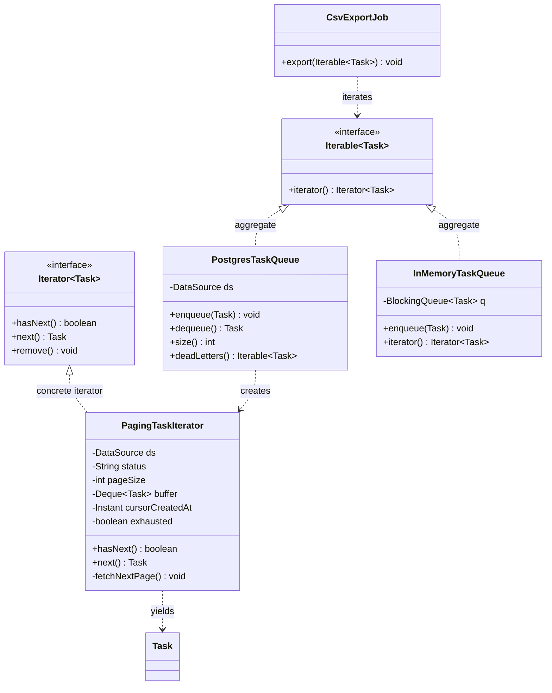

# Iterator

> Where this fits in the project: by Phase 2 our tasks no longer live in a single `BlockingQueue` in one JVM — they live in PostgreSQL, in the millions. An admin endpoint wants to "stream every `DEAD` task into a CSV export"; a reconciliation job wants to "walk all tasks scheduled before now in priority order"; a retry sweeper wants to "page through pending tasks 500 at a time." None of these callers should know whether the tasks come from an `ArrayList`, a `BlockingQueue`, a paged SQL cursor, or a Kafka topic. **Iterator** is the pattern that lets a caller traverse a collection of `Task`s element-by-element *without ever knowing how those tasks are stored*. This chapter builds a custom `Iterator`/`Iterable`, makes it fail-fast, paginates a `PostgresTaskQueue`, and connects it to Java Streams.

---

## 1. Why this exists — the real problem in our Task Queue

Recall two pieces of the canonical model:

```java
public enum TaskStatus { PENDING, SCHEDULED, RUNNING, SUCCEEDED, FAILED, RETRYING, DEAD }

public record Task(
        String id, String type, String payload, TaskStatus status,
        int attempts, int maxAttempts, java.time.Instant createdAt,
        java.time.Instant scheduledAt, int priority) { }
```

In Phase 1, "all the tasks" is a `BlockingQueue<Task>` inside one process. The natural thing a teammate writes the first time they need to scan it:

```java
// Reach into the queue's internals to count DEAD tasks.
ArrayBlockingQueue<Task> queue = pool.internalQueue(); // we exposed the field
int dead = 0;
for (Task t : queue) {               // works only because ABQ happens to be Iterable
    if (t.status() == TaskStatus.DEAD) dead++;
}
```

This compiles, and it is already a trap. The caller now depends on three facts that are *none of its business*: that the storage is an `ArrayBlockingQueue`, that we exposed it, and that it is in-memory and finite. The moment Phase 2 moves tasks to PostgreSQL, every one of those `for (Task t : queue)` loops breaks — there is no in-memory collection to loop over, and you cannot fit ten million rows in a `List`.

What every caller actually wants is narrow and stable:

> Give me the tasks **one at a time**, in some defined order, until there are no more — and do not make me care whether they come from a list, a blocking queue, or a database cursor.

That sentence is the **Intent of Iterator**: *provide a way to access the elements of an aggregate object sequentially without exposing its underlying representation.* The traversal becomes an object you can pass around, pause, and swap, decoupled from the collection it walks.

> Historical note: Iterator is a Gang of Four (1994) behavioral pattern, but the idea is older — it is the "cursor" of database systems and the "enumerator" of Lisp/Smalltalk. Java enshrined it: `java.util.Iterator` (1998, JDK 1.2) and `java.lang.Iterable` (2004, Java 5) are the backbone of the `for-each` loop and, since Java 8, the bridge to `Stream`. Every collection you have ever looped over is handing you an Iterator.

---

## 2. The naive version — and why it bites

Suppose we *do* expose the collection, or hand callers a `List<Task>`, and let them loop. Here is the "data access layer" a hurried Phase 2 might ship:

```java
// NAIVE: load everything into a List and return it. The collection IS the API.
public final class TaskDao {
    private final javax.sql.DataSource ds;
    public TaskDao(javax.sql.DataSource ds) { this.ds = ds; }

    // "Give me all DEAD tasks" — materializes the entire result set.
    public java.util.List<Task> findAllDead() throws java.sql.SQLException {
        var out = new java.util.ArrayList<Task>();
        var sql = "SELECT id, type, payload, status, attempts, max_attempts, "
                + "created_at, scheduled_at, priority FROM tasks WHERE status = 'DEAD'";
        try (var c = ds.getConnection();
             var ps = c.prepareStatement(sql);
             var rs = ps.executeQuery()) {
            while (rs.next()) out.add(map(rs));   // the whole table into the heap
        }
        return out;
    }
    // ... map(rs) omitted for now ...
}
```

A caller exports the dead tasks:

```java
for (Task t : dao.findAllDead()) {     // looks innocent
    csv.writeRow(t);
}
```

The limitations stack up fast, and they are exactly the ones Iterator was invented to remove:

- **Unbounded memory.** `findAllDead()` pulls every matching row into one `ArrayList`. With 12 million dead tasks you OOM the JVM before the first CSV row is written. The caller cannot start consuming until the whole set is in memory.
- **Representation leaks.** Returning `List<Task>` promises callers random access, `.size()`, mutation via `.add()`, and re-iteration. Tomorrow you want to back this with a streaming cursor and you cannot — the `List` contract has handcuffed you.
- **No uniform traversal.** The in-memory queue is looped one way (`for (Task t : queue)`), the database another way (`for (Task t : dao.findAllDead())`), Kafka a third way. Three different shapes of loop for "walk the tasks."
- **No lazy / early stop.** "Find the first dead task older than 30 days" still loads *all* of them; you cannot stop after the first match without already having paid to fetch everything.
- **Concurrent-modification surprises.** If you loop the in-memory queue while a worker mutates it, you get either a `ConcurrentModificationException` at a random later line or — worse — silent skipped/duplicated elements, with no defined behavior.

The root cause is that **the collection's representation is the traversal API**. Iterator splits the two apart: the collection stays in charge of *how it stores*, the iterator is in charge of *how you walk*.

---

## 3. The pattern: Intent, Motivation, Problem, Participants

**Intent.** Provide sequential access to the elements of an aggregate without exposing its underlying representation, and let multiple independent traversals coexist.

**Motivation in our project.** A `TaskQueue` may be an in-memory `BlockingQueue`, a Postgres table, or a Kafka topic. Callers — CSV export, reconciliation, retry sweeper — must traverse "the tasks" identically regardless of storage, lazily (one or one *page* at a time), and safely under concurrent mutation.

**Problem statement.** How do you let clients walk a collection element-by-element, in a defined order, possibly lazily and over a data source too large to fit in memory, without (a) exposing the collection's internals, (b) bloating the collection with traversal state, and (c) preventing two traversals at once?

**Participants** (GoF names, mapped to our code):

| GoF participant | Role | Our class |
|---|---|---|
| `Iterator` | Defines `hasNext()` / `next()` traversal interface | `java.util.Iterator<Task>` |
| `ConcreteIterator` | Tracks position, knows how to fetch the next element | `PagingTaskIterator`, in-memory snapshot iterator |
| `Aggregate` | Declares `iterator()` | `java.lang.Iterable<Task>` (our `TaskPage`, `TaskStream`) |
| `ConcreteAggregate` | Returns a matching `ConcreteIterator` | `PostgresTaskQueue`, `InMemoryTaskQueue` |
| `Client` | Uses the iterator via `for-each` / `Stream` | CSV export, reconciliation job |

Java gives us the `Iterator`/`Iterable` interfaces for free, so in Java the pattern is mostly about **implementing them well** — defining order, laziness, fail-fast behavior, and resource cleanup.

---

## 4. UML — structure of the pattern in our project



The arrows that matter: the `Client` (`CsvExportJob`) depends only on `Iterable<Task>`/`Iterator<Task>`, never on `PostgresTaskQueue` or `PagingTaskIterator`. The aggregate *creates* the concrete iterator (a factory-method relationship — see [factory-method.md](factory-method.md)).

---

## 5. Refactor — from "return a List" to a custom Iterator

We rebuild `findAllDead()` as a lazy, paginated `Iterable<Task>`. The collection no longer materializes; the iterator fetches one page of `pageSize` rows at a time, using a **keyset cursor** (`created_at`) rather than `OFFSET`, so page N+1 does not re-scan the first N pages.

```java
import java.sql.*;
import java.time.Instant;
import java.util.*;
import javax.sql.DataSource;

/** A lazy, paginated, read-only view of tasks in a given status. Implements Iterable. */
public final class PostgresTaskView implements Iterable<Task> {

    private final DataSource ds;
    private final TaskStatus status;
    private final int pageSize;

    public PostgresTaskView(DataSource ds, TaskStatus status, int pageSize) {
        if (pageSize <= 0) throw new IllegalArgumentException("pageSize must be > 0");
        this.ds = Objects.requireNonNull(ds);
        this.status = Objects.requireNonNull(status);
        this.pageSize = pageSize;
    }

    @Override
    public Iterator<Task> iterator() {
        return new PagingTaskIterator(ds, status.name(), pageSize);
    }

    /** The ConcreteIterator: holds the cursor + a one-page buffer. */
    private static final class PagingTaskIterator implements Iterator<Task> {

        private static final String SQL = """
                SELECT id, type, payload, status, attempts, max_attempts,
                       created_at, scheduled_at, priority
                FROM tasks
                WHERE status = ?
                  AND (created_at, id) > (?, ?)   -- keyset: strictly after the cursor
                ORDER BY created_at, id
                LIMIT ?
                """;

        private final DataSource ds;
        private final String status;
        private final int pageSize;

        private final Deque<Task> buffer = new ArrayDeque<>();
        private Instant cursorCreatedAt = Instant.EPOCH; // start before everything
        private String cursorId = "";                    // tie-break on id
        private boolean exhausted = false;

        PagingTaskIterator(DataSource ds, String status, int pageSize) {
            this.ds = ds; this.status = status; this.pageSize = pageSize;
        }

        @Override
        public boolean hasNext() {
            if (!buffer.isEmpty()) return true;
            if (exhausted) return false;
            fetchNextPage();
            return !buffer.isEmpty();
        }

        @Override
        public Task next() {
            if (!hasNext()) throw new NoSuchElementException("iteration finished");
            Task t = buffer.removeFirst();
            cursorCreatedAt = t.createdAt(); // advance the keyset cursor
            cursorId = t.id();
            return t;
        }

        private void fetchNextPage() {
            try (Connection c = ds.getConnection();
                 PreparedStatement ps = c.prepareStatement(SQL)) {
                ps.setString(1, status);
                ps.setTimestamp(2, Timestamp.from(cursorCreatedAt));
                ps.setString(3, cursorId);
                ps.setInt(4, pageSize);
                int rows = 0;
                try (ResultSet rs = ps.executeQuery()) {
                    while (rs.next()) { buffer.addLast(map(rs)); rows++; }
                }
                if (rows < pageSize) exhausted = true; // short page => last page
            } catch (SQLException e) {
                throw new IllegalStateException("paging tasks failed", e);
            }
        }

        private static Task map(ResultSet rs) throws SQLException {
            Timestamp scheduled = rs.getTimestamp("scheduled_at");
            return new Task(
                    rs.getString("id"),
                    rs.getString("type"),
                    rs.getString("payload"),
                    TaskStatus.valueOf(rs.getString("status")),
                    rs.getInt("attempts"),
                    rs.getInt("max_attempts"),
                    rs.getTimestamp("created_at").toInstant(),
                    scheduled == null ? null : scheduled.toInstant(),
                    rs.getInt("priority"));
        }
    }
}
```

The caller is now blissfully ignorant of paging, cursors, and SQL:

```java
var deadView = new PostgresTaskView(dataSource, TaskStatus.DEAD, 500);
for (Task t : deadView) {     // fetches 500 rows at a time, lazily, forever
    csv.writeRow(t);
}
```

Ten million dead tasks now stream through with at most 500 in memory at once, and the export starts emitting rows after the *first* page, not after the whole table loads.

---

## 6. Before and after

| Concern | Naive `findAllDead()` returning a `List` | `PostgresTaskView implements Iterable<Task>` |
|---|---|---|
| Memory | O(total rows) — whole result set on heap | O(pageSize) — one page buffered |
| Time-to-first-element | After the entire query materializes | After the first page (~`pageSize` rows) |
| Storage exposed? | Yes — caller gets a mutable `List` | No — caller sees only `Iterator`/`for-each` |
| Early stop ("first match") | Pays full cost regardless | Stops mid-page; later pages never fetched |
| Pagination cost | N/A (no paging) or `OFFSET` re-scans | Keyset cursor: each page is an index seek |
| Swap storage to Kafka? | Breaks every caller | Implement `Iterable<Task>`; callers unchanged |
| Composability with Streams | Wrap the list | Free via `StreamSupport.stream(view.spliterator(), false)` |

The pivotal win is the last-but-one row: callers depend on `Iterable<Task>`, so we can replace the entire backing store and not touch a single `for-each` loop.

---

## 7. A simple Java example — a custom range iterator

Before the project code, the smallest honest example: a custom `Iterable` over a numeric range. It shows the two methods that *are* the pattern (`hasNext`, `next`) and that the iterator — not the collection — holds the position.

```java
import java.util.*;

/** Iterable over [start, end) — produces ints without ever storing them. */
public final class IntRange implements Iterable<Integer> {
    private final int start, end;
    public IntRange(int start, int end) { this.start = start; this.end = end; }

    @Override
    public Iterator<Integer> iterator() {
        return new Iterator<>() {
            private int cursor = start;          // traversal state lives HERE
            @Override public boolean hasNext() { return cursor < end; }
            @Override public Integer next() {
                if (!hasNext()) throw new NoSuchElementException();
                return cursor++;
            }
        };
    }

    public static void main(String[] args) {
        long sum = 0;
        for (int n : new IntRange(0, 1_000_000)) sum += n; // no million-element list
        System.out.println(sum); // 499999500000
    }
}
```

There is no array of a million integers anywhere — the iterator *generates* each value on demand. That is laziness in its purest form, and it is exactly what the Postgres pager does, only with rows instead of ints.

---

## 8. A real-world Java example — a fail-fast snapshot iterator

The in-memory side has a different hazard: concurrency. Workers mutate the queue while an admin scans it. Two correct designs exist; show both.

**(a) Fail-fast** — detect concurrent structural modification and throw immediately, like `ArrayList`. Predictable failure beats silent corruption.

```java
import java.util.*;

/** A tiny in-memory task store with a fail-fast iterator (mirrors ArrayList's contract). */
public final class FailFastTaskStore implements Iterable<Task> {
    private final List<Task> tasks = new ArrayList<>();
    private int modCount = 0;                 // bumped on every structural change

    public void add(Task t)    { tasks.add(t); modCount++; }
    public void remove(Task t) { if (tasks.remove(t)) modCount++; }

    @Override
    public Iterator<Task> iterator() {
        return new Iterator<>() {
            private int idx = 0;
            private int expectedModCount = modCount;   // snapshot at creation

            @Override public boolean hasNext() { return idx < tasks.size(); }

            @Override public Task next() {
                checkForComodification();
                if (idx >= tasks.size()) throw new NoSuchElementException();
                return tasks.get(idx++);
            }
            private void checkForComodification() {
                if (modCount != expectedModCount)
                    throw new ConcurrentModificationException(
                        "store mutated during iteration");
            }
        };
    }
}
```

**(b) Snapshot (weakly consistent)** — copy the references once; the iterator then never throws and never sees later mutations. This is what `CopyOnWriteArrayList` and `ConcurrentHashMap` do. Better for admin scans that must not crash because a worker happened to dequeue a task mid-scan.

```java
import java.util.*;
import java.util.concurrent.*;

/** Concurrent task store whose iterator walks an immutable snapshot — never throws. */
public final class SnapshotTaskStore implements Iterable<Task> {
    private final BlockingQueue<Task> q = new LinkedBlockingQueue<>();

    public void enqueue(Task t) { q.add(t); }
    public Task dequeue() throws InterruptedException { return q.take(); }

    @Override
    public Iterator<Task> iterator() {
        // toArray() takes a consistent snapshot of references at this instant.
        Task[] snapshot = q.toArray(new Task[0]);
        return Arrays.asList(snapshot).iterator(); // immutable view, never mutated
    }
}
```

> Rule of thumb: **fail-fast** for single-threaded collections where a concurrent mutation is a *bug you want to surface*; **snapshot / weakly consistent** for concurrent collections where iteration must tolerate live mutation. Never write a "best-effort" iterator that silently skips or duplicates — that is the one outcome both alternatives exist to prevent.

---

## 9. Project-integration example — paging the `PostgresTaskQueue` and bridging to Streams

Now wire the pattern into the canonical model end to end. The `PostgresTaskQueue` (our Phase 2 `TaskQueue`) gains read-only **views** that are `Iterable<Task>`, and we expose those as `Stream<Task>` so callers get `filter`/`map`/`limit` for free.

```java
import java.time.Instant;
import java.util.Iterator;
import java.util.stream.Stream;
import java.util.stream.StreamSupport;
import javax.sql.DataSource;

public final class PostgresTaskQueue implements TaskQueue {

    private final DataSource ds;
    public PostgresTaskQueue(DataSource ds) { this.ds = ds; }

    // --- TaskQueue contract (enqueue/dequeue/size) omitted here for brevity ---
    @Override public void enqueue(Task t) { /* INSERT ... */ }
    @Override public Task dequeue() throws InterruptedException { /* SELECT ... FOR UPDATE SKIP LOCKED */ return null; }
    @Override public int size() { /* SELECT count(*) */ return 0; }

    /** Iterable view of every task in a status, paged lazily. */
    public Iterable<Task> view(TaskStatus status, int pageSize) {
        return new PostgresTaskView(ds, status, pageSize);
    }

    /** Stream view — Iterator under the hood, fluent API on top. */
    public Stream<Task> stream(TaskStatus status, int pageSize) {
        Iterator<Task> it = view(status, pageSize).iterator();
        // ORDERED + NONNULL: we yield rows in (created_at,id) order, never null.
        var spliterator = java.util.Spliterators.spliteratorUnknownSize(
                it, java.util.Spliterator.ORDERED | java.util.Spliterator.NONNULL);
        return StreamSupport.stream(spliterator, /* parallel */ false);
    }
}
```

Three real callers, each oblivious to paging and SQL:

```java
PostgresTaskQueue queue = new PostgresTaskQueue(dataSource);

// 1) CSV export of dead-letters — for-each over the Iterable view.
for (Task t : queue.view(TaskStatus.DEAD, 1_000)) {
    csv.writeRow(t.id(), t.type(), String.valueOf(t.attempts()));
}

// 2) Reconciliation: first 5 stale SCHEDULED tasks older than an hour — lazy, stops early.
Instant cutoff = Instant.now().minusSeconds(3600);
java.util.List<Task> stale = queue.stream(TaskStatus.SCHEDULED, 500)
        .filter(t -> t.scheduledAt() != null && t.scheduledAt().isBefore(cutoff))
        .limit(5)                       // pulls only enough pages to find 5
        .toList();

// 3) Metrics: count retrying tasks by type — Stream collectors over the same Iterator.
java.util.Map<String, Long> retryingByType = queue.stream(TaskStatus.RETRYING, 1_000)
        .collect(java.util.stream.Collectors.groupingBy(Task::type,
                 java.util.stream.Collectors.counting()));
```

Caller (2) is the payoff: `limit(5)` propagates through the `Stream` into the `Iterator`'s `hasNext()`/`next()`, so once five matches are found the pager stops issuing SQL. The same `Iterator` powers a `for-each`, a `Stream`, and a `collect` — one traversal abstraction, three idioms.

> Streams **are** iterators with a fluent skin: a `Stream` is built on a `Spliterator` (a splittable iterator that adds parallelism and characteristics like `ORDERED`/`SORTED`/`SIZED`). Anything you can make `Iterable`, you can turn into a `Stream` with `StreamSupport.stream(spliterator, false)`. See [../01-java-fundamentals/chapter-07-streams.md](../01-java-fundamentals/chapter-07-streams.md).

---

## 10. Production notes — where it is used, when NOT to, anti-patterns

**Where the pattern lives in industry**

- **JDBC / JPA cursors.** A forward-only, fetch-size-bounded `ResultSet` *is* the Iterator pattern; Hibernate's `ScrollableResults` and Spring Data's `Stream<T> findAllBy...()` expose it directly. Our `PagingTaskIterator` is the hand-rolled version with an explicit keyset cursor.
- **Kafka consumers.** `consumer.poll()` returning `ConsumerRecords` is an iterator over an effectively infinite, externally stored stream — the same "give me the next batch" shape.
- **Cloud SDK pagination.** AWS/GCP/Azure list APIs return a page plus a `nextPageToken`; their SDK "paginators" wrap that token loop in an `Iterable`, exactly like our `cursorCreatedAt`.
- **MongoDB / Cassandra drivers** return lazy server-side cursors you iterate.

**When NOT to use a custom iterator**

- The data is small and already in memory — just return an unmodifiable `List` or `Stream`; a hand-rolled iterator adds ceremony for nothing.
- You need random access, `size()`, or backward movement — `Iterator` is forward-only and sizeless; expose a `List` or a windowed API instead.
- A built-in already fits — `ConcurrentHashMap`, `CopyOnWriteArrayList`, `DelayQueue` give you weakly-consistent iterators for free. Don't re-implement `java.util`.

**Anti-patterns to avoid**

- **Stateful aggregate.** Storing `currentPosition` on the collection itself means only one traversal at a time and broken nested loops. State belongs on the *iterator*, never the aggregate.
- **Leaking the resource.** A DB-backed iterator that opens a `Connection`/`ResultSet` in the constructor and relies on the caller to "finish iterating" leaks connections on early `break`. Prefer per-page connections (as above) or make the iterator `AutoCloseable` and document `try`-with-resources.
- **`hasNext()` with side effects that `next()` repeats.** If `hasNext()` fetches a page, ensure `next()` consumes from the buffer, not refetches — otherwise you double-read or skip. Our buffer-then-drain design avoids this.
- **`OFFSET`-based paging at scale.** `LIMIT 500 OFFSET 5_000_000` re-scans five million rows per page — O(n²) overall. Keyset/seek pagination (`WHERE (created_at,id) > (?,?)`) is each an index seek.
- **Iterating an unstable in-memory collection without choosing a contract.** Decide explicitly: fail-fast or snapshot. "It usually works" is not a contract.

---

## 11. Common mistakes and pitfalls

- **Calling `next()` without `hasNext()`** and not throwing `NoSuchElementException` — the `Iterator` contract requires it; tooling and `for-each` rely on it.
- **Forgetting the keyset tie-breaker.** Paging only on `created_at` skips or duplicates rows when timestamps collide. Always include a unique tie-breaker (`id`) in both `ORDER BY` and the cursor comparison.
- **Implementing `Iterator` but not `Iterable`** (or vice versa). `for-each` needs `Iterable`; pass-around traversal needs `Iterator`. A collection should implement `Iterable` and *create* fresh `Iterator`s.
- **Returning the same `Iterator` from every `iterator()` call** — the second `for-each` finds it already exhausted. `iterator()` must return a *new* traversal each time.
- **Unsupported `remove()` throwing the wrong thing** — if you don't support removal, override `remove()` to throw `UnsupportedOperationException` (the default in Java 8+), don't leave it silently no-op.
- **Assuming `Stream` is reusable.** A `Stream` (and the `Spliterator`/`Iterator` under it) is single-use; consuming it twice throws `IllegalStateException`. Return a fresh `stream()` per use.

---

## 12. Refactoring exercise — bad → improved → production

**Bad.** Traversal state on the aggregate; single-use; storage fully exposed.

```java
public final class TaskBag {
    public final java.util.List<Task> items = new java.util.ArrayList<>(); // public!
    private int pos = 0;                                                    // shared state
    public boolean hasMore() { return pos < items.size(); }
    public Task nextOne()   { return items.get(pos++); }                    // not resettable
}
// Two loops over the same bag interfere; nested iteration is impossible.
```

**Improved.** Make it a proper `Iterable`; state moves to a fresh inner iterator each call; field made private.

```java
import java.util.*;

public final class TaskBag implements Iterable<Task> {
    private final List<Task> items = new ArrayList<>();
    public void add(Task t) { items.add(t); }

    @Override public Iterator<Task> iterator() {
        return new Iterator<>() {
            private int pos = 0;                            // per-iterator state
            @Override public boolean hasNext() { return pos < items.size(); }
            @Override public Task next() {
                if (!hasNext()) throw new NoSuchElementException();
                return items.get(pos++);
            }
        };
    }
}
```

**Production.** Fail-fast for safety, defensive copy of input, immutable read-only view, `Stream` bridge, and `remove()` explicitly unsupported.

```java
import java.util.*;
import java.util.stream.Stream;

public final class TaskBag implements Iterable<Task> {
    private final List<Task> items = new ArrayList<>();
    private int modCount = 0;

    public TaskBag(Collection<Task> initial) { items.addAll(initial); } // defensive copy
    public void add(Task t) { items.add(Objects.requireNonNull(t)); modCount++; }
    public boolean remove(Task t) { boolean r = items.remove(t); if (r) modCount++; return r; }
    public int size() { return items.size(); }

    @Override
    public Iterator<Task> iterator() {
        return new Iterator<>() {
            private int pos = 0;
            private int expectedModCount = modCount;
            @Override public boolean hasNext() { return pos < items.size(); }
            @Override public Task next() {
                if (modCount != expectedModCount)
                    throw new ConcurrentModificationException();
                if (pos >= items.size()) throw new NoSuchElementException();
                return items.get(pos++);
            }
            @Override public void remove() {
                throw new UnsupportedOperationException("read-only iterator");
            }
        };
    }

    /** Lazy Stream over a fresh iterator each call. */
    public Stream<Task> stream() {
        return java.util.stream.StreamSupport.stream(spliterator(), false);
    }
}
```

The progression mirrors §2→§9: pull traversal state off the aggregate, hide storage, then add the production concerns (fail-fast, immutability, `Stream` bridge).

---

## 13. Exercises

### Easy

**E1 (knowledge check).** Why does the `Iterator` pattern put the traversal state on the *iterator* and not on the collection? Give one concrete bug that the alternative causes.

**E2 (coding).** Implement `Iterable<Task>` over a fixed `Task[]` array called `TaskArrayView`, yielding tasks in reverse order. `next()` must throw `NoSuchElementException` past the end.

### Medium

**M1 (coding).** Write `FilteringIterator<T>` that wraps another `Iterator<T>` plus a `Predicate<T>` and yields only matching elements. Use it to iterate only `DEAD` tasks from any `Iterable<Task>`. Hint: `hasNext()` must look ahead and buffer the next match.

**M2 (refactoring).** You are given a DAO method `List<Task> page(int offset, int limit)`. Wrap it in an `Iterable<Task>` that transparently pages through *all* tasks, fetching `limit` rows at a time, without the caller seeing offsets. Note the `OFFSET` scaling caveat in a comment.

### Hard

**H1 (design).** Design a `MergingTaskIterator` that consumes two *already-sorted-by-priority* `Iterator<Task>` sources (e.g., a hot in-memory queue and a Postgres page stream) and yields a single stream sorted by descending `priority`. State the time complexity per element and how you break ties.

**H2 (interview-style).** Your keyset pager iterates while tasks are being inserted and deleted concurrently in Postgres. Explain precisely which tasks an in-flight iteration is and is not guaranteed to see, and how to make the export *idempotent* despite that.

---

## 14. Solutions

**E1.** Traversal state (the cursor position) is *per-walk*, not *per-collection*. If the position lives on the collection, two concurrent or nested traversals share one cursor and corrupt each other. Concrete bug: a nested loop `for (a : bag) for (b : bag)` — the inner loop advances the shared `pos` to the end, so the outer loop terminates after one element. Putting `pos` on a fresh iterator makes each `for-each` independent.

**E2.**

```java
import java.util.*;

public final class TaskArrayView implements Iterable<Task> {
    private final Task[] tasks;
    public TaskArrayView(Task[] tasks) { this.tasks = tasks.clone(); } // defensive copy

    @Override public Iterator<Task> iterator() {
        return new Iterator<>() {
            private int idx = tasks.length - 1;        // walk backwards
            @Override public boolean hasNext() { return idx >= 0; }
            @Override public Task next() {
                if (!hasNext()) throw new NoSuchElementException();
                return tasks[idx--];
            }
        };
    }
}
```

**M1.** Look-ahead with a buffered "next match" flag:

```java
import java.util.*;
import java.util.function.Predicate;

public final class FilteringIterator<T> implements Iterator<T> {
    private final Iterator<T> source;
    private final Predicate<T> keep;
    private T nextMatch;
    private boolean hasMatch = false;

    public FilteringIterator(Iterator<T> source, Predicate<T> keep) {
        this.source = source; this.keep = keep;
    }

    @Override public boolean hasNext() {
        if (hasMatch) return true;
        while (source.hasNext()) {
            T candidate = source.next();
            if (keep.test(candidate)) { nextMatch = candidate; hasMatch = true; return true; }
        }
        return false;
    }

    @Override public T next() {
        if (!hasNext()) throw new NoSuchElementException();
        T result = nextMatch;
        nextMatch = null; hasMatch = false;  // consume the buffered match
        return result;
    }
}

// Usage: only DEAD tasks from any Iterable<Task>.
Iterator<Task> deadOnly = new FilteringIterator<>(
        anyTaskIterable.iterator(), t -> t.status() == TaskStatus.DEAD);
```

The key is that `hasNext()` does the scanning and *buffers* the match; `next()` just hands back the buffer. This avoids the double-fetch pitfall from §11.

**M2.**

```java
import java.util.*;

public final class PagedDaoView implements Iterable<Task> {
    public interface Dao { List<Task> page(int offset, int limit); }

    private final Dao dao;
    private final int pageSize;
    public PagedDaoView(Dao dao, int pageSize) { this.dao = dao; this.pageSize = pageSize; }

    @Override public Iterator<Task> iterator() {
        return new Iterator<>() {
            private final Deque<Task> buf = new ArrayDeque<>();
            private int offset = 0;
            private boolean exhausted = false;

            @Override public boolean hasNext() {
                if (!buf.isEmpty()) return true;
                if (exhausted) return false;
                // CAVEAT: OFFSET grows linearly; page N re-scans N*pageSize rows.
                // For large tables prefer keyset pagination (see PagingTaskIterator).
                List<Task> page = dao.page(offset, pageSize);
                offset += page.size();
                buf.addAll(page);
                if (page.size() < pageSize) exhausted = true;
                return !buf.isEmpty();
            }
            @Override public Task next() {
                if (!hasNext()) throw new NoSuchElementException();
                return buf.removeFirst();
            }
        };
    }
}
```

**H1.** A 2-way merge. Keep one peeked element from each source; on each `next()`, compare the two heads and emit the one with higher `priority`, then refill that side.

```java
import java.util.*;

public final class MergingTaskIterator implements Iterator<Task> {
    private final Iterator<Task> a, b;
    private Task headA, headB;

    public MergingTaskIterator(Iterator<Task> a, Iterator<Task> b) {
        this.a = a; this.b = b;
        headA = a.hasNext() ? a.next() : null;
        headB = b.hasNext() ? b.next() : null;
    }

    @Override public boolean hasNext() { return headA != null || headB != null; }

    @Override public Task next() {
        if (!hasNext()) throw new NoSuchElementException();
        Task chosen;
        // Higher priority wins; on a tie, prefer source A for a deterministic order.
        if (headB == null || (headA != null && headA.priority() >= headB.priority())) {
            chosen = headA; headA = a.hasNext() ? a.next() : null;
        } else {
            chosen = headB; headB = b.hasNext() ? b.next() : null;
        }
        return chosen;
    }
}
```

Complexity: **O(1)** comparisons and refills per emitted element, **O(1)** extra memory (two peeked heads) — true streaming merge, never materializing either source. Ties are broken deterministically toward source A (`>=`). Generalizes to k sources with a `PriorityQueue` of heads, giving **O(log k)** per element.

**H2.** A keyset pager moving strictly forward through `(created_at, id)` gives **snapshot-per-page**, not snapshot-of-the-whole-scan. Guarantees: (a) any task whose `(created_at, id)` is *already behind* the cursor and was deleted will simply not appear — fine; (b) a task inserted *ahead* of the cursor (later `created_at`) *will* be seen when the cursor reaches it; (c) a task inserted *behind* the cursor (clock skew / backdated `created_at`) is **missed**; (d) a task you already emitted and was then deleted is still in your export — a phantom. To make the export idempotent: key the output by `task.id()` and upsert into the destination (dedup), and bound the scan to a *closed* time window (`created_at < export_start_ts`) so concurrent inserts land outside the window and are picked up by the next run. If exactly-once-at-this-instant is required, run the scan inside a `REPEATABLE READ` transaction so the whole iteration sees one MVCC snapshot — at the cost of holding a long-lived transaction.

---

## 15. Interview questions and takeaways

1. **Iterator vs Iterable — what's the difference?** `Iterable` is the *collection's* promise that it can produce iterators (`iterator()`); `Iterator` is a *single, stateful traversal* (`hasNext`/`next`). One `Iterable` mints many independent `Iterator`s. `for-each` requires `Iterable`.
2. **What is a fail-fast iterator and how is it implemented?** It detects concurrent structural modification via a `modCount` snapshot taken at iterator creation and re-checked in `next()`, throwing `ConcurrentModificationException`. It is best-effort (not guaranteed) and exists to surface bugs, not to provide thread safety.
3. **Fail-fast vs weakly consistent?** Fail-fast (`ArrayList`, `HashMap`) throws on concurrent mutation. Weakly consistent (`ConcurrentHashMap`, `CopyOnWriteArrayList`) iterates over a snapshot/at-creation view, never throws, may not reflect later mutations. Choose fail-fast to catch bugs, weakly consistent to tolerate live mutation.
4. **How does Iterator relate to Streams?** A `Stream` is layered on a `Spliterator` (splittable iterator with characteristics + parallel support). Any `Iterable` becomes a `Stream` via `StreamSupport.stream(spliterator(), false)`. Streams add laziness and fluent ops but are single-use, like the iterator beneath them.
5. **Why keyset pagination over `OFFSET`?** `OFFSET k` re-scans and discards the first `k` rows per page → O(n²) over a full walk. Keyset (`WHERE (sort_key) > last_seen`) turns each page into an index seek → O(n log n) overall and stable under inserts.
6. **Can one collection have multiple active iterators?** Yes, *if* state lives on the iterator. That is precisely why GoF keeps traversal state off the aggregate.
7. **How do you avoid leaking a DB connection in a lazy iterator?** Either fetch page-by-page with a short-lived connection per page (no long-held resource), or make the iterator `AutoCloseable` and require `try`-with-resources; never depend on the caller iterating to completion.

**Takeaways.** Iterator decouples *what you store* from *how you walk it*. In Java the interfaces are given — the craft is in defining order, choosing laziness, picking a concurrency contract (fail-fast vs snapshot), paging with keyset cursors, and bridging to `Stream`. The single most valuable property it buys our project: callers depend on `Iterable<Task>`, so storage can move from `BlockingQueue` to Postgres to Kafka with zero changes to the traversal code.

---

## What We Can Improve In Our Project Using This Concept

- Replace every `dao.findAll*()` returning a `List<Task>` with `Iterable<Task>`/`Stream<Task>` views so the admin CSV export, reconciliation sweep, and DLQ drain stream lazily instead of materializing whole result sets.
- Give `PostgresTaskQueue` a `view(status, pageSize)` and `stream(status, pageSize)` backed by a keyset `PagingTaskIterator`, eliminating `OFFSET`-based paging and unbounded heap use.
- Make `InMemoryTaskQueue`'s admin scans return a **snapshot** iterator (via `toArray()`), so a reconciliation pass cannot crash a running worker pool with a `ConcurrentModificationException`.
- Offer `FilteringIterator`/`Stream.filter` so callers express "only DEAD older than 30 days" declaratively over the same traversal abstraction.

## Project Refactoring Task

Refactor `PostgresTaskQueue` to implement read-only `Iterable<Task>` views:
1. Add `PostgresTaskView implements Iterable<Task>` with the keyset `PagingTaskIterator` from §5.
2. Add `view(TaskStatus, int pageSize)` and `stream(TaskStatus, int pageSize)` to `PostgresTaskQueue` (§9).
3. Rewrite `CsvExportJob` and the reconciliation sweeper to consume `Iterable<Task>`/`Stream<Task>` — delete the old `findAllDead()`-style `List` methods.
4. Add a snapshot iterator to `InMemoryTaskQueue` for admin scans.
5. Tests (JUnit 5 + AssertJ + Testcontainers): assert lazy paging (a 2 500-row table with `pageSize=500` issues 6 queries — five full pages + one short page), early-stop (`limit(5)` issues at most one query), and `NoSuchElementException` past the end. Use AssertJ's `assertThatThrownBy`.

## Git Commit For This Chapter

```text
feat(queue): expose tasks as lazy Iterable/Stream views via keyset paging iterator

- add PostgresTaskView implements Iterable<Task> with PagingTaskIterator (keyset cursor)
- add PostgresTaskQueue.view(status,pageSize) and stream(status,pageSize)
- add snapshot iterator to InMemoryTaskQueue for safe admin scans
- replace TaskDao.findAllDead() List with streaming views in CsvExportJob + reconciliation
- tests: lazy paging, early-stop via limit(), fail-fast vs snapshot semantics

Files: src/main/java/queue/PostgresTaskView.java,
       src/main/java/queue/PagingTaskIterator.java,
       src/main/java/queue/PostgresTaskQueue.java,
       src/main/java/queue/InMemoryTaskQueue.java,
       src/main/java/jobs/CsvExportJob.java,
       src/test/java/queue/PostgresTaskViewTest.java
```

## Architecture Impact

- **Memory profile:** traversal memory drops from O(result-set) to O(pageSize); the export service no longer needs a heap sized for the worst-case table.
- **Storage independence:** callers now depend on `Iterable<Task>`/`Stream<Task>`, so Phase 4 can back the same views with a Kafka/Redis cursor without touching consumers.
- **Read-path coupling:** the read side is decoupled from the write side — views are read-only and side-effect-free, which keeps them safe to call from monitoring and admin paths.
- **DB load:** keyset paging turns full scans into ordered index seeks, removing `OFFSET` re-scan amplification under reconciliation jobs.

## Interview Takeaways

- Iterator's one job: **sequential access without exposing representation.** In Java the interfaces are free; the engineering is order, laziness, concurrency contract, and resource cleanup.
- Know cold: `Iterator` vs `Iterable`, fail-fast vs weakly-consistent, `Spliterator`/`Stream` as iterators, and **keyset vs OFFSET** pagination (the single most common scaling mistake in DB traversal).
- The pattern's payoff is measured in *change isolation*: swapping `BlockingQueue` → Postgres → Kafka leaves every `for-each`/`Stream` consumer untouched.
- Cross-links: [../01-java-fundamentals/chapter-05-collections.md](../01-java-fundamentals/chapter-05-collections.md), [../01-java-fundamentals/chapter-07-streams.md](../01-java-fundamentals/chapter-07-streams.md), [factory-method.md](factory-method.md), [composite.md](composite.md).
