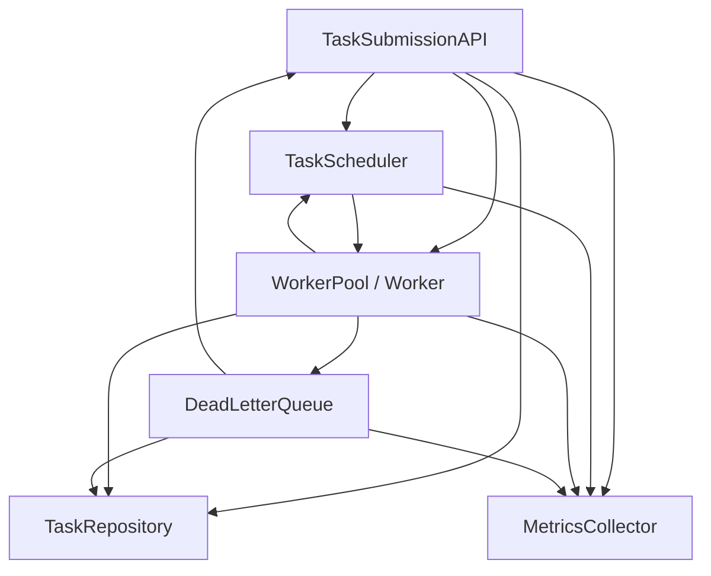
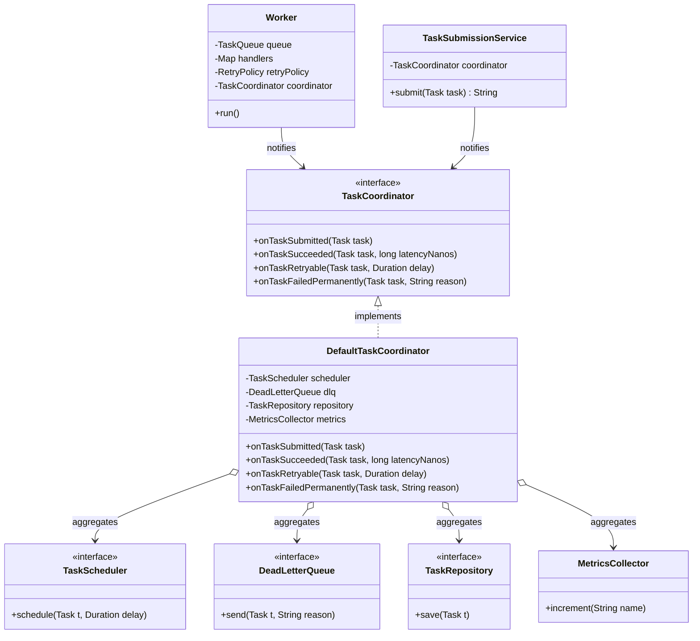

# Mediator

> Where this fits in the project: by Phase 3 our platform has four chatty subsystems — the **Task Submission API**, the **TaskScheduler**, the **WorkerPool**, and the **DeadLetterQueue** — plus a **MetricsCollector** and a **RateLimiter** watching everything. Left alone, each one starts calling the others directly: the worker pokes the scheduler, the scheduler pokes metrics, the API pokes the worker pool, the DLQ pokes the API to mark a task `DEAD`. That is an N×N tangle. The Mediator pattern introduces one coordinator object that every subsystem talks *to* instead of talking *to each other*, collapsing many-to-many coupling into many-to-one.

In the Distributed Task Queue, the moment a task fails its last retry, several things must happen: the scheduler must stop scheduling it, the DLQ must receive it with a reason, the repository must persist `status = DEAD`, and metrics must increment a counter. If the `Worker` that detected the failure knows about all four collaborators and calls each one, the worker becomes coupled to the scheduler, the DLQ, the repository, and the metrics registry. Multiply that by every subsystem that reacts to lifecycle changes and you get a dependency graph where touching one box ripples through five. Mediator is the pattern that says: *don't let the colleagues know each other; let them all know one mediator, and let the mediator know the orchestration.*

---

## 1. Why This Exists — The Real Problem

By Phase 3 the architecture is `Client -> API Layer -> Queue Layer -> Rate Limiter -> Worker Nodes -> Dead Letter Queue -> Metrics`. That is a *data* path. But there is also a *control* path: lifecycle events that fan out sideways. Consider what happens around a single task as it moves through its states:

```java
public enum TaskStatus { PENDING, SCHEDULED, RUNNING, SUCCEEDED, FAILED, RETRYING, DEAD }

public record Task(
        String id,            // a UUID
        String type,          // e.g. "email.send", "image.resize"
        String payload,       // JSON string
        TaskStatus status,
        int attempts,
        int maxAttempts,
        Instant createdAt,
        Instant scheduledAt,
        int priority) {}

public record TaskResult(boolean success, String message, boolean retryable) {}
```

The lifecycle transitions trigger cross-cutting reactions:

- **API accepts a task** → repository saves it, scheduler maybe schedules it (if `scheduledAt` is in the future), metrics increment `tasks.submitted`.
- **Worker finishes successfully** → repository updates `status = SUCCEEDED`, scheduler forgets it, metrics increment `tasks.succeeded` and record latency.
- **Worker fails retryably** → retry policy computes a delay, scheduler re-schedules, metrics increment `tasks.retried`.
- **Worker exhausts retries** → DLQ receives the task, repository updates `status = DEAD`, scheduler forgets it, metrics increment `tasks.dead`.

Every one of those bullets is a *web of who-calls-whom*. If each colleague holds references to the others, you get this:



Count the edges. With 6 colleagues a fully connected control graph can have up to `6 × 5 = 30` directed edges. Every new subsystem (say, an audit logger in Phase 4) adds edges to *everything it touches and everything that touches it*. Three forces make this painful:

1. **Coupling explodes super-linearly.** N colleagues that all talk to each other tend toward O(N²) relationships. See [../04-oop-and-ood/coupling.md](../04-oop-and-ood/coupling.md) — this is efferent coupling at its worst.
2. **No single place owns orchestration.** The "what happens when a task dies" logic is smeared across `Worker`, `DeadLetterQueue`, and the API. To understand the flow you must read all three.
3. **Reuse and testing collapse.** You cannot unit-test the `Worker` without standing up a scheduler, a DLQ, a repository, and a metrics registry, because the worker reaches out to all of them directly.

The Mediator pattern (GoF, 1994) targets exactly this: *Define an object that encapsulates how a set of objects interact.* It promotes loose coupling by keeping objects from referring to each other explicitly, and it lets you vary their interaction independently. Java Swing's `EventListenerList`-driven dialogs, JMS's `Topic`, Spring's `ApplicationEventPublisher`, and air-traffic-control textbook examples are all Mediator in spirit. The control tower is the canonical metaphor: planes don't negotiate landing slots with each other — they all talk to the tower.

---

## 2. The Naive Version

Here is the first cut almost everyone writes. The `Worker` directly holds and calls every collaborator it might need to notify.

```java
// NAIVE: Worker is coupled to five other subsystems.
public final class Worker implements Runnable {

    private final TaskQueue queue;
    private final Map<String, TaskHandler> handlers;
    private final RetryPolicy retryPolicy;

    // Smell: the worker drags in the whole world.
    private final TaskScheduler scheduler;
    private final DeadLetterQueue dlq;
    private final TaskRepository repository;
    private final MetricsCollector metrics;

    public Worker(TaskQueue queue,
                  Map<String, TaskHandler> handlers,
                  RetryPolicy retryPolicy,
                  TaskScheduler scheduler,
                  DeadLetterQueue dlq,
                  TaskRepository repository,
                  MetricsCollector metrics) {
        this.queue = queue;
        this.handlers = handlers;
        this.retryPolicy = retryPolicy;
        this.scheduler = scheduler;
        this.dlq = dlq;
        this.repository = repository;
        this.metrics = metrics;
    }

    @Override
    public void run() {
        try {
            while (!Thread.currentThread().isInterrupted()) {
                Task task = queue.dequeue();
                TaskHandler handler = handlers.get(task.type());
                long start = System.nanoTime();
                try {
                    TaskResult result = handler.handle(task);
                    if (result.success()) {
                        // The worker now orchestrates everyone:
                        repository.save(withStatus(task, TaskStatus.SUCCEEDED));
                        scheduler.cancel(task.id());            // tell scheduler
                        metrics.increment("tasks.succeeded");   // tell metrics
                        metrics.recordLatency("task.latency", System.nanoTime() - start);
                    } else if (result.retryable() && task.attempts() + 1 < task.maxAttempts()) {
                        Duration delay = retryPolicy.nextDelay(task.attempts() + 1).orElse(Duration.ZERO);
                        Task retrying = withStatus(bumpAttempts(task), TaskStatus.RETRYING);
                        repository.save(retrying);
                        scheduler.schedule(retrying, delay);    // tell scheduler
                        metrics.increment("tasks.retried");     // tell metrics
                    } else {
                        // exhausted retries → it must DIE
                        Task dead = withStatus(task, TaskStatus.DEAD);
                        repository.save(dead);
                        dlq.send(dead, result.message());       // tell DLQ
                        scheduler.cancel(task.id());            // tell scheduler
                        metrics.increment("tasks.dead");        // tell metrics
                    }
                } catch (Exception e) {
                    Task dead = withStatus(task, TaskStatus.DEAD);
                    repository.save(dead);
                    dlq.send(dead, "handler threw: " + e.getMessage());
                    metrics.increment("tasks.errored");
                }
            }
        } catch (InterruptedException e) {
            Thread.currentThread().interrupt();
        }
    }

    private static Task withStatus(Task t, TaskStatus s) { /* copy record */ return t; }
    private static Task bumpAttempts(Task t) { /* copy with attempts+1 */ return t; }
}
```

**What is wrong here:**

- The `Worker` imports and depends on `TaskScheduler`, `DeadLetterQueue`, `TaskRepository`, and `MetricsCollector`. Five constructor params just to *run a handler*.
- The orchestration policy ("a dead task notifies DLQ, repo, scheduler, and metrics in that order") lives inside the worker. The scheduler has the *same* policy duplicated when *it* discovers a due task that has been cancelled. The API has a third copy on submission.
- Adding an `AuditLogger` means editing the `Worker`, the scheduler, and the API — every place that reacts to lifecycle changes.
- Testing `Worker.run()` requires mocking four collaborators. The test is about *who gets called*, not *what the worker computes*.

This is the textbook smell Mediator removes: **many colleagues, each holding references to many others, each duplicating interaction logic.**

---

## 3. The Pattern — Intent, Motivation, Participants

> **Intent (GoF):** Define an object that encapsulates how a set of objects interact. Mediator promotes loose coupling by keeping objects from referring to each other explicitly, and it lets you vary their interaction independently.

**Motivation.** When many objects collaborate, the connections between them proliferate. In the worst case every object knows every other. Distributing the interaction logic among the objects makes them hard to reuse because they depend on the whole web. A mediator centralizes control: colleagues know only the mediator; the mediator knows the choreography.

**Problem statement (ours).** Six subsystems react to task-lifecycle transitions. Each transition (`SUCCEEDED`, `RETRYING`, `DEAD`) triggers a fixed fan-out of side effects. We want each subsystem to announce *what happened* and let one coordinator decide *what should follow*, so that (a) no colleague depends on another, (b) the orchestration lives in exactly one place, and (c) adding a new reacting subsystem touches only the coordinator.

**Participants:**

| Participant | GoF role | In our project |
|---|---|---|
| `Mediator` | declares the interface colleagues use to notify the mediator | `TaskCoordinator` interface with `notify(sender, TaskEvent, Task, ...)` |
| `ConcreteMediator` | implements cooperative behavior, knows and maintains its colleagues | `DefaultTaskCoordinator` — holds scheduler, DLQ, repo, metrics |
| `Colleague` | knows its mediator; communicates with it instead of other colleagues | `Worker`, `TaskSubmissionService` (the API), and any future reactor |
| `ConcreteColleague` | sends notifications to the mediator and reacts to mediator calls | concrete `Worker`, concrete API service |

The crucial distinction: a colleague does **not** call `dlq.send(...)`. It calls `coordinator.onTaskFailedPermanently(task, reason)`. The coordinator knows that "failed permanently" means *DLQ + repo + scheduler-cancel + metrics*.

---

## 4. UML Class Diagram



Note the shape: the colleagues (`Worker`, `TaskSubmissionService`) point **only** at the `TaskCoordinator` interface. All the wiring to scheduler/DLQ/repo/metrics is *aggregated inside the concrete mediator*. The arrows that used to crisscross now all funnel through one node.

---

## 5. Refactoring the Naive Code Into the Pattern

First, the mediator interface — phrased in terms of *lifecycle events*, not *commands to subsystems*:

```java
import java.time.Duration;

/**
 * Mediator. Colleagues (Worker, API service, etc.) announce *what happened*.
 * The coordinator decides *what should follow*. No colleague knows another.
 */
public interface TaskCoordinator {

    /** API accepted a new task. */
    void onTaskSubmitted(Task task);

    /** A worker completed a task successfully. */
    void onTaskSucceeded(Task task, long latencyNanos);

    /** A worker failed a task but it is retryable; delay already computed. */
    void onTaskRetryable(Task task, Duration delay);

    /** A worker exhausted retries or hit a non-retryable error. */
    void onTaskFailedPermanently(Task task, String reason);
}
```

The concrete mediator owns every collaborator and centralizes the choreography:

```java
import java.time.Duration;

public final class DefaultTaskCoordinator implements TaskCoordinator {

    private final TaskScheduler scheduler;
    private final DeadLetterQueue dlq;
    private final TaskRepository repository;
    private final MetricsCollector metrics;

    public DefaultTaskCoordinator(TaskScheduler scheduler,
                                  DeadLetterQueue dlq,
                                  TaskRepository repository,
                                  MetricsCollector metrics) {
        this.scheduler = scheduler;
        this.dlq = dlq;
        this.repository = repository;
        this.metrics = metrics;
    }

    @Override
    public void onTaskSubmitted(Task task) {
        repository.save(task);
        // If it is scheduled for the future, hand it to the scheduler now.
        if (task.status() == TaskStatus.SCHEDULED) {
            Duration delay = Duration.between(task.createdAt(), task.scheduledAt());
            scheduler.schedule(task, delay.isNegative() ? Duration.ZERO : delay);
        }
        metrics.increment("tasks.submitted");
    }

    @Override
    public void onTaskSucceeded(Task task, long latencyNanos) {
        repository.save(withStatus(task, TaskStatus.SUCCEEDED));
        scheduler.cancel(task.id());
        metrics.increment("tasks.succeeded");
        metrics.recordLatency("task.latency", latencyNanos);
    }

    @Override
    public void onTaskRetryable(Task task, Duration delay) {
        Task retrying = withStatus(task, TaskStatus.RETRYING);
        repository.save(retrying);
        scheduler.schedule(retrying, delay);
        metrics.increment("tasks.retried");
    }

    @Override
    public void onTaskFailedPermanently(Task task, String reason) {
        Task dead = withStatus(task, TaskStatus.DEAD);
        repository.save(dead);
        dlq.send(dead, reason);
        scheduler.cancel(task.id());
        metrics.increment("tasks.dead");
    }

    private static Task withStatus(Task t, TaskStatus s) {
        return new Task(t.id(), t.type(), t.payload(), s, t.attempts(),
                t.maxAttempts(), t.createdAt(), t.scheduledAt(), t.priority());
    }
}
```

Now the `Worker` collapses to its real job — run the handler and *announce the outcome*:

```java
import java.time.Duration;
import java.util.Map;

public final class Worker implements Runnable {

    private final TaskQueue queue;
    private final Map<String, TaskHandler> handlers;
    private final RetryPolicy retryPolicy;
    private final TaskCoordinator coordinator;   // the ONLY collaborator now

    public Worker(TaskQueue queue,
                  Map<String, TaskHandler> handlers,
                  RetryPolicy retryPolicy,
                  TaskCoordinator coordinator) {
        this.queue = queue;
        this.handlers = handlers;
        this.retryPolicy = retryPolicy;
        this.coordinator = coordinator;
    }

    @Override
    public void run() {
        try {
            while (!Thread.currentThread().isInterrupted()) {
                Task task = queue.dequeue();
                process(task);
            }
        } catch (InterruptedException e) {
            Thread.currentThread().interrupt();
        }
    }

    private void process(Task task) {
        TaskHandler handler = handlers.get(task.type());
        if (handler == null) {
            coordinator.onTaskFailedPermanently(task, "no handler for type: " + task.type());
            return;
        }
        long start = System.nanoTime();
        try {
            TaskResult result = handler.handle(task);
            long latency = System.nanoTime() - start;
            if (result.success()) {
                coordinator.onTaskSucceeded(task, latency);
            } else if (result.retryable() && task.attempts() + 1 < task.maxAttempts()) {
                Duration delay = retryPolicy.nextDelay(task.attempts() + 1).orElse(Duration.ZERO);
                coordinator.onTaskRetryable(bumpAttempts(task), delay);
            } else {
                coordinator.onTaskFailedPermanently(task, result.message());
            }
        } catch (Exception e) {
            coordinator.onTaskFailedPermanently(task, "handler threw: " + e.getMessage());
        }
    }

    private static Task bumpAttempts(Task t) {
        return new Task(t.id(), t.type(), t.payload(), t.status(), t.attempts() + 1,
                t.maxAttempts(), t.createdAt(), t.scheduledAt(), t.priority());
    }
}
```

And the API side — `TaskSubmissionService` — likewise knows only the coordinator:

```java
import java.time.Instant;
import java.util.UUID;

public final class TaskSubmissionService {

    private final TaskCoordinator coordinator;

    public TaskSubmissionService(TaskCoordinator coordinator) {
        this.coordinator = coordinator;
    }

    public String submit(String type, String payload, Instant scheduledAt, int priority) {
        Instant now = Instant.now();
        boolean future = scheduledAt != null && scheduledAt.isAfter(now);
        Task task = new Task(
                UUID.randomUUID().toString(),
                type,
                payload,
                future ? TaskStatus.SCHEDULED : TaskStatus.PENDING,
                0,
                3,
                now,
                future ? scheduledAt : now,
                priority);
        coordinator.onTaskSubmitted(task);   // announce; let the mediator wire it up
        return task.id();
    }
}
```

---

## 6. Before-and-After Comparison

| Dimension | Naive (no mediator) | With `TaskCoordinator` |
|---|---|---|
| `Worker` constructor params | 7 (queue, handlers, policy, scheduler, dlq, repo, metrics) | 4 (queue, handlers, policy, coordinator) |
| Subsystems `Worker` depends on | scheduler, DLQ, repo, metrics | coordinator only |
| Where "task died" orchestration lives | duplicated in Worker, scheduler, API | one method `onTaskFailedPermanently` |
| Adding an `AuditLogger` | edit Worker + scheduler + API | edit `DefaultTaskCoordinator` only |
| Unit-testing the Worker | mock 4 collaborators | mock 1 coordinator, assert it was called |
| Control-flow edges (6 subsystems) | up to ~30 | ~6 (each colleague → mediator) |

The diff that matters: the worker's `process` went from *imperative orchestration* ("save, then cancel, then send to DLQ, then increment") to *declarative announcement* ("this task failed permanently"). Coupling dropped from many-to-many to many-to-one.

---

## 7. A Simple Java Example (Outside the Project)

The smallest honest Mediator: a chat room. Users don't hold references to each other; they post to the room, and the room fans out.

```java
import java.util.ArrayList;
import java.util.List;

interface ChatMediator {
    void register(User user);
    void send(String from, String message);
}

final class ChatRoom implements ChatMediator {
    private final List<User> users = new ArrayList<>();

    @Override public void register(User user) { users.add(user); }

    @Override public void send(String from, String message) {
        for (User u : users) {
            if (!u.name().equals(from)) {       // don't echo to sender
                u.receive(from, message);
            }
        }
    }
}

final class User {
    private final String name;
    private final ChatMediator room;

    User(String name, ChatMediator room) {
        this.name = name;
        this.room = room;
        room.register(this);
    }

    String name() { return name; }
    void post(String message) { room.send(name, message); }
    void receive(String from, String message) {
        System.out.println("[" + name + "] " + from + ": " + message);
    }
}

public class ChatDemo {
    public static void main(String[] args) {
        ChatMediator room = new ChatRoom();
        User alice = new User("alice", room);
        User bob = new User("bob", room);
        User carol = new User("carol", room);

        alice.post("hello everyone");
        bob.post("hi alice");
        // alice never references bob or carol; the room mediates.
    }
}
```

`User` has zero references to other `User`s. Add a fourth user and nothing else changes — the room is the only thing that knows the membership.

---

## 8. A Real-World Java Example

A workflow you have certainly seen: a registration **dialog** where fields enable/disable each other. Without a mediator, the checkbox knows about the text field, which knows about the button, which knows about the checkbox — a cyclic tangle. Swing's recommended approach (and the original GoF example) routes all interaction through a mediator.

```java
interface DialogMediator {
    void changed(Widget source);
}

abstract class Widget {
    protected final DialogMediator mediator;
    protected Widget(DialogMediator mediator) { this.mediator = mediator; }
}

final class CheckBox extends Widget {
    private boolean checked;
    CheckBox(DialogMediator m) { super(m); }
    void setChecked(boolean v) { this.checked = v; mediator.changed(this); }
    boolean isChecked() { return checked; }
}

final class TextField extends Widget {
    private String text = "";
    private boolean enabled = true;
    TextField(DialogMediator m) { super(m); }
    void setEnabled(boolean e) { this.enabled = e; }
    void setText(String t) { this.text = t; mediator.changed(this); }
    String text() { return text; }
    boolean enabled() { return enabled; }
}

final class SubmitButton extends Widget {
    private boolean enabled;
    SubmitButton(DialogMediator m) { super(m); }
    void setEnabled(boolean e) { this.enabled = e; }
    boolean enabled() { return enabled; }
}

final class RegistrationDialog implements DialogMediator {
    private final CheckBox agreeToTerms = new CheckBox(this);
    private final TextField couponField  = new TextField(this);
    private final SubmitButton submit    = new SubmitButton(this);

    CheckBox agreeToTerms() { return agreeToTerms; }
    TextField couponField() { return couponField; }
    SubmitButton submit() { return submit; }

    @Override
    public void changed(Widget source) {
        // ALL inter-widget rules live here, in one place:
        if (source == agreeToTerms) {
            couponField.setEnabled(agreeToTerms.isChecked());
        }
        boolean canSubmit = agreeToTerms.isChecked()
                && (!couponField.enabled() || !couponField.text().isBlank());
        submit.setEnabled(canSubmit);
    }
}
```

Spring's `ApplicationEventPublisher` is a closely related production tool: beans publish events; the framework dispatches to `@EventListener` methods. It is Mediator with a generic, dynamic registry — which is exactly the boundary where Mediator blurs into an event bus (Section 12).

---

## 9. The Project-Integration Example (Canonical Model)

Here is the end-to-end wiring used in Phase 3, assembled in a small composition root. This is the version a staff engineer ships: the coordinator is the single place that knows the choreography, and everything else is injected.

```java
import io.micrometer.core.instrument.MeterRegistry;
import io.micrometer.prometheus.PrometheusConfig;
import io.micrometer.prometheus.PrometheusMeterRegistry;

import java.time.Duration;
import java.util.Map;
import java.util.concurrent.LinkedBlockingQueue;

public final class Phase3Wiring {

    public static void main(String[] args) {
        // --- Infrastructure colleagues (managed by the mediator) ---
        TaskQueue queue = new InMemoryTaskQueue(new LinkedBlockingQueue<>());
        TaskRepository repository = new InMemoryTaskRepository();
        DeadLetterQueue dlq = new InMemoryDeadLetterQueue();
        MeterRegistry meterRegistry = new PrometheusMeterRegistry(PrometheusConfig.DEFAULT);
        MetricsCollector metrics = new MicrometerMetricsCollector(meterRegistry);

        // Scheduler re-enqueues due tasks back onto the work queue.
        TaskScheduler scheduler = new DelayQueueTaskScheduler(queue);

        // --- The Mediator ---
        TaskCoordinator coordinator =
                new DefaultTaskCoordinator(scheduler, dlq, repository, metrics);

        // --- Colleagues that only know the coordinator ---
        Map<String, TaskHandler> handlers = Map.of(
                "email.send", task -> new TaskResult(true, "sent", false),
                "image.resize", task -> new TaskResult(false, "decoder oom", true)
        );
        RetryPolicy retryPolicy = new ExponentialBackoffRetryPolicy(
                Duration.ofMillis(200), 2.0, Duration.ofSeconds(30));

        WorkerPool pool = new WorkerPool(
                /* size */ 8,
                () -> new Worker(queue, handlers, retryPolicy, coordinator));
        pool.start();

        TaskSubmissionService api = new TaskSubmissionService(coordinator);

        // The API and the workers never reference scheduler, dlq, repo, or metrics.
        String id = api.submit("image.resize", "{\"w\":1024}", null, /* priority */ 5);
        System.out.println("submitted " + id);

        Runtime.getRuntime().addShutdownHook(new Thread(pool::shutdown));
    }
}
```

Two upgrades worth calling out for production:

1. **Rate limiting at the mediator boundary.** Because every submission funnels through `onTaskSubmitted`, that is the natural choke point for the `RateLimiter`. The coordinator can reject or shed before the task ever reaches a worker:

```java
@Override
public void onTaskSubmitted(Task task) {
    if (!rateLimiter.tryAcquire()) {
        metrics.increment("tasks.rejected");
        throw new RateLimitedException("submission rate exceeded for type " + task.type());
    }
    repository.save(task);
    if (task.status() == TaskStatus.SCHEDULED) {
        Duration delay = Duration.between(task.createdAt(), task.scheduledAt());
        scheduler.schedule(task, delay.isNegative() ? Duration.ZERO : delay);
    }
    metrics.increment("tasks.submitted");
}
```

2. **A sequence view of one failing task.** This is the choreography the mediator owns:

```mermaid
sequenceDiagram
    participant W as Worker (Colleague)
    participant C as DefaultTaskCoordinator (Mediator)
    participant R as TaskRepository
    participant D as DeadLetterQueue
    participant S as TaskScheduler
    participant M as MetricsCollector

    W->>C: onTaskFailedPermanently(task, "decoder oom")
    C->>R: save(task as DEAD)
    C->>D: send(task, "decoder oom")
    C->>S: cancel(task.id())
    C->>M: increment("tasks.dead")
    Note over W,M: Worker issued ONE call; the mediator fanned out four.
```

---

## 10. Tradeoffs

| Concern | Mediator | Direct calls (no pattern) | Observer / Event Bus |
|---|---|---|---|
| Coupling | many-to-one (colleagues → mediator) | many-to-many (O(N²)) | publishers → bus, listeners → bus |
| Where orchestration lives | one explicit place (good for reasoning) | smeared across colleagues | implicit, scattered across listeners |
| Control flow visibility | explicit, synchronous, easy to debug | explicit but tangled | implicit; hard to trace "who reacts" |
| Adding a reactor | edit the mediator | edit every caller | add a listener (no central edit) |
| Risk | mediator becomes a **god object** | unmaintainable web | ordering/causality become opaque |
| Best when | a *fixed, known* set of colleagues with *defined* interaction rules | never, past ~3 collaborators | *open-ended* set of independent reactors |

**The honest, central tradeoff:** Mediator does not eliminate complexity — it *relocates* it. The web of interactions moves out of the colleagues and into the mediator. If you keep piling responsibilities in, `DefaultTaskCoordinator` becomes a 1,000-line god object that knows everything and violates SRP (see [../04-oop-and-ood/cohesion.md](../04-oop-and-ood/cohesion.md) and [../04-oop-and-ood/solid.md](../04-oop-and-ood/solid.md)). The cure is to keep the mediator *thin*: it should encode *which colleague reacts to what*, delegating the actual work to the colleagues. The moment it starts doing the work itself, split it.

**Mediator vs. Observer/Event Bus — the comparison you were asked to make:**

- **Observer** ([when authored: ../05-design-patterns/observer.md]) is a one-to-many *broadcast*: one subject, many observers, observers don't coordinate. Mediator is many-to-many *coordination* funneled through a hub that *can* make decisions ("if X happened, tell Y but not Z"). Observer subjects are usually dumb ("something changed"); a mediator is smart ("something changed, here is the consequent choreography").
- **Event Bus** is essentially Observer scaled up with a dynamic, type-keyed registry and (often) asynchrony. In Phase 4 we introduce a real `EventBus` (`publish(TaskEvent)`, `subscribe(TaskEventListener)`). The difference from our coordinator is *coupling direction and knowledge*: the coordinator *knows its colleagues by name and decides the orchestration*; an event bus *knows nothing* — it just delivers `TaskEvent`s to whoever subscribed. Mediator gives you a single auditable place for "what happens next"; an event bus gives you decoupling and dynamism at the cost of an implicit, harder-to-trace control flow.

A useful rule of thumb: **use a Mediator when the coordination rules are a first-class concern you want to read in one file; use an event bus when reactors are open-ended, independently deployed, or must be asynchronous.** Phase 3 uses the coordinator (rules matter, set is fixed). Phase 4's distributed workers add an `EventBus` (reactors become open-ended across nodes).

---

## 11. Common Mistakes and Pitfalls

- **The god-object mediator.** The mediator absorbs business logic until it is the only class anyone edits. *Fix:* keep it to routing/choreography; push real work back into colleagues. Watch the line count — past ~200 lines or ~7 collaborators, split into sub-mediators.
- **Colleagues that still talk to each other "just this once."** A backdoor `worker.scheduler` reference defeats the whole pattern. *Fix:* make collaborators private to the mediator; colleagues receive only the mediator.
- **Phrasing the mediator API as commands, not events.** `coordinator.saveToRepoAndSendToDlq(task)` leaks the implementation. *Fix:* name methods after *what happened* (`onTaskFailedPermanently`), not *what to do*.
- **Synchronous mediator on a hot path.** If `onTaskSucceeded` does a blocking DB write inline, the worker thread stalls. *Fix:* let the mediator hand slow work to an executor or the `EventBus`, or make metrics non-blocking.
- **Hidden reentrancy.** A mediator method that triggers another colleague that calls back into the mediator can recurse or deadlock under a shared lock. *Fix:* keep mediator methods non-reentrant, or document and guard the call graph.
- **Confusing it with Facade.** A [Facade](../05-design-patterns/facade.md) simplifies access to a subsystem one-directionally (callers → facade → subsystem). A Mediator is bidirectional coordination among peers. If nothing calls *back*, you have a facade, not a mediator.
- **Over-applying it.** Two or three collaborators rarely justify a mediator. The indirection costs more than the coupling it removes below ~4 colleagues.

---

## 12. Production Notes — Where It Is Used, When Not To

**Where the industry uses it:**

- **Spring `ApplicationEventPublisher` / `@EventListener`** — a generic in-process mediator; beans never reference each other for lifecycle reactions.
- **Java Swing / JavaFX dialogs and `MVC` controllers** — controllers mediate between view widgets and the model.
- **Workflow/orchestration engines** (Temporal, AWS Step Functions, Camunda) — the orchestrator *is* a mediator: activities never call each other; the workflow definition encodes the choreography. This is the same idea our `TaskCoordinator` embodies for one task.
- **Air-traffic-control and message routers** — the canonical metaphor and the canonical production use.

**When NOT to use it:**

- Fewer than ~4 collaborators, or collaborators whose interactions are trivial and stable.
- When reactors must be **open-ended and independently deployable** — reach for an event bus or message broker (Kafka/RabbitMQ in Phase 4) instead. A central mediator that every team must edit becomes a contention point and a deployment bottleneck.
- When you need **asynchrony and durability** across processes — a mediator is an in-process construct. Cross-node coordination wants a broker, not a shared object.

**Anti-patterns to watch for in monitoring and review:**

- *God mediator*: track its file size and number of injected dependencies as a code-health signal.
- *Chatty mediator*: if one colleague event triggers a dozen synchronous downstream calls, latency and failure blast-radius concentrate in the mediator. Add a timer around each mediator method (Micrometer) and alert on tail latency.
- *Hidden coupling via the mediator*: colleagues that depend on *call ordering inside the mediator* are still coupled, just invisibly. Document ordering guarantees explicitly.

---

## 13. Exercises

### Easy

**E1 (knowledge check).** In one sentence, what does Mediator reduce, and to what does it reduce it? Name the two GoF participants a `Worker` plays and the role `DefaultTaskCoordinator` plays.

**E2 (pattern identification).** You see code where `EmailHandler` calls `smsHandler.send(...)`, which calls `pushHandler.notify(...)`, which calls back into `emailHandler.log(...)`. Which pattern would untangle this, and what is the smell called?

### Medium

**M1 (coding).** Add a new colleague, an `AuditLog`, that must record every permanent failure and every success. Wire it in *without touching `Worker` or `TaskSubmissionService`*. Show exactly which file changes.

**M2 (refactoring).** The naive `Worker` in Section 2 duplicates "mark DEAD" logic in both the `else` branch and the `catch` block. Refactor so the choreography exists once, using the coordinator.

### Hard

**H1 (design).** The single `DefaultTaskCoordinator` is growing: it now also handles cancellation requests, priority re-ordering, and circuit-breaker trips. It is 600 lines. Propose a design that keeps Mediator's benefits without the god object. Sketch the interfaces.

**H2 (interview-style).** Compare `TaskCoordinator` (Mediator) with the Phase 4 `EventBus` (`publish`/`subscribe`). Give two concrete situations where you would migrate a reaction *off* the mediator *onto* the event bus, and one where you would keep it on the mediator. Justify each with a coupling or operational argument.

---

## 14. Solutions

**E1.** Mediator reduces *many-to-many coupling among colleagues* to *many-to-one coupling (each colleague → the mediator)*. `Worker` plays `Colleague` / `ConcreteColleague`; `DefaultTaskCoordinator` plays `ConcreteMediator`.

**E2.** Mediator. The smell is **cyclic / many-to-many coupling** (here a literal dependency cycle among handlers). Route all cross-handler interaction through one mediator so handlers depend only on it.

**M1.** Define and wire the new colleague *inside the mediator only*:

```java
public interface AuditLog {
    void record(String taskId, String event, String detail);
}

public final class StdoutAuditLog implements AuditLog {
    @Override public void record(String taskId, String event, String detail) {
        System.out.printf("AUDIT task=%s event=%s detail=%s%n", taskId, event, detail);
    }
}
```

```java
public final class DefaultTaskCoordinator implements TaskCoordinator {
    private final TaskScheduler scheduler;
    private final DeadLetterQueue dlq;
    private final TaskRepository repository;
    private final MetricsCollector metrics;
    private final AuditLog audit;                 // NEW collaborator

    public DefaultTaskCoordinator(TaskScheduler scheduler, DeadLetterQueue dlq,
                                  TaskRepository repository, MetricsCollector metrics,
                                  AuditLog audit) {            // NEW param
        this.scheduler = scheduler; this.dlq = dlq;
        this.repository = repository; this.metrics = metrics;
        this.audit = audit;
    }

    @Override public void onTaskSucceeded(Task task, long latencyNanos) {
        repository.save(withStatus(task, TaskStatus.SUCCEEDED));
        scheduler.cancel(task.id());
        metrics.increment("tasks.succeeded");
        metrics.recordLatency("task.latency", latencyNanos);
        audit.record(task.id(), "SUCCEEDED", task.type());     // NEW
    }

    @Override public void onTaskFailedPermanently(Task task, String reason) {
        Task dead = withStatus(task, TaskStatus.DEAD);
        repository.save(dead);
        dlq.send(dead, reason);
        scheduler.cancel(task.id());
        metrics.increment("tasks.dead");
        audit.record(task.id(), "DEAD", reason);               // NEW
    }
    // onTaskSubmitted / onTaskRetryable / withStatus unchanged
    private static Task withStatus(Task t, TaskStatus s) {
        return new Task(t.id(), t.type(), t.payload(), s, t.attempts(),
                t.maxAttempts(), t.createdAt(), t.scheduledAt(), t.priority());
    }
}
```

*Files touched:* a new `AuditLog`/`StdoutAuditLog`, and `DefaultTaskCoordinator` (plus the composition root that constructs it). **`Worker` and `TaskSubmissionService` are untouched** — that is the payoff.

**M2.** The refactored `process` method (already shown in Section 5) replaces both the `else` branch and the `catch` block with a single `coordinator.onTaskFailedPermanently(...)` call. The "mark DEAD" choreography now exists exactly once, inside the mediator:

```java
private void process(Task task) {
    TaskHandler handler = handlers.get(task.type());
    if (handler == null) {
        coordinator.onTaskFailedPermanently(task, "no handler for type: " + task.type());
        return;
    }
    long start = System.nanoTime();
    try {
        TaskResult result = handler.handle(task);
        long latency = System.nanoTime() - start;
        if (result.success()) {
            coordinator.onTaskSucceeded(task, latency);
        } else if (result.retryable() && task.attempts() + 1 < task.maxAttempts()) {
            Duration delay = retryPolicy.nextDelay(task.attempts() + 1).orElse(Duration.ZERO);
            coordinator.onTaskRetryable(bumpAttempts(task), delay);
        } else {
            coordinator.onTaskFailedPermanently(task, result.message());   // one path
        }
    } catch (Exception e) {
        coordinator.onTaskFailedPermanently(task, "handler threw: " + e.getMessage()); // same path
    }
}
```

**H1.** Split the god mediator by *concern* while preserving the single-coordinator façade for colleagues. Introduce focused sub-mediators and have a thin top-level coordinator delegate to them:

```java
// Thin top-level mediator: pure routing, no business logic.
public final class CompositeTaskCoordinator implements TaskCoordinator {
    private final LifecycleCoordinator lifecycle;     // submit/succeed/retry/die
    private final ControlCoordinator control;         // cancel, priority re-order
    private final ResilienceCoordinator resilience;   // circuit-breaker trips

    public CompositeTaskCoordinator(LifecycleCoordinator lifecycle,
                                    ControlCoordinator control,
                                    ResilienceCoordinator resilience) {
        this.lifecycle = lifecycle; this.control = control; this.resilience = resilience;
    }
    @Override public void onTaskSubmitted(Task t) { lifecycle.onTaskSubmitted(t); }
    @Override public void onTaskSucceeded(Task t, long n) { lifecycle.onTaskSucceeded(t, n); }
    @Override public void onTaskRetryable(Task t, Duration d) { lifecycle.onTaskRetryable(t, d); }
    @Override public void onTaskFailedPermanently(Task t, String r) {
        lifecycle.onTaskFailedPermanently(t, r);
        resilience.recordFailure(t.type());           // cross-concern routing stays explicit
    }
}
```

Each sub-mediator (`LifecycleCoordinator`, `ControlCoordinator`, `ResilienceCoordinator`) is cohesive (~100 lines), independently testable, and owns one slice. Colleagues still see a single `TaskCoordinator`. This is *Mediator + composition*, trading one god object for a small, navigable family — restoring SRP without reintroducing many-to-many coupling.

**H2.** *Keep on the mediator:* the `SUCCEEDED → cancel scheduler + persist + metrics` choreography. It is a fixed, ordered, latency-sensitive set of in-process reactions whose ordering you want auditable in one file. *Migrate to the event bus:* (1) *fan-out to open-ended, independently-owned consumers* — e.g. a billing service and an analytics service in other teams/processes both want `TaskSucceeded`; putting them behind an `EventBus`/Kafka topic means neither team edits our coordinator and they deploy independently; (2) *asynchronous, non-critical-path side effects* — e.g. emitting a webhook on `DEAD` should not block the worker thread, so publish a `TaskEvent` and let a subscriber handle delivery with its own retries. The coupling argument for migrating: the mediator must *know* every collaborator; the bus does not, so open-ended/cross-process reactors belong on the bus. The argument for staying: when ordering and a single auditable control flow matter more than decoupling, the mediator wins.

---

## 15. Interview Questions and Takeaways

1. **Q: What problem does Mediator solve, in one sentence?** A: It replaces many-to-many coupling between collaborating objects with many-to-one coupling, by routing their interactions through a single coordinator that owns the choreography.
2. **Q: Mediator vs. Observer?** A: Observer is one-to-many broadcast with passive observers and a "dumb" subject; Mediator is many-to-many coordination through a hub that *decides* what reacts to what. Observers don't coordinate; a mediator does.
3. **Q: Mediator vs. Facade?** A: Facade is a one-directional simplifying entry point into a subsystem (callers → facade → subsystem). Mediator is bidirectional peer coordination — colleagues talk *to* it and it talks *back to* them.
4. **Q: When does Mediator become an anti-pattern?** A: When it grows into a god object that hoards business logic, violating SRP. The cure is to keep it thin (routing only) and split by concern when it grows.
5. **Q: When would you choose an event bus over a mediator?** A: When reactors are open-ended, independently deployed, or must be asynchronous/durable across processes — the bus knows nothing about subscribers, the mediator must know its colleagues.
6. **Q: How do you test a colleague under Mediator?** A: Inject a mock mediator and assert the colleague calls the right notification (`onTaskFailedPermanently`) with the right arguments — no need to stand up the real subsystems.
7. **Q: Where is Mediator in the JDK / Spring?** A: Spring's `ApplicationEventPublisher`, Swing dialog controllers, and any orchestration engine (Temporal, Step Functions). They centralize interaction so colleagues stay ignorant of each other.

**Takeaways:** Mediator centralizes *interaction*, not *work*. Its value is proportional to the number of collaborators and the complexity of their interplay; its danger is letting that central object grow without bound. Phrase its API in terms of *events that happened*, keep it thin, and graduate to an event bus when reactors become open-ended.

---

## What We Can Improve In Our Project Using This Concept

Today (pre-mediator) the `Worker` in Phase 1/early Phase 3 reaches directly into the scheduler, DLQ, repository, and metrics. We can introduce a `TaskCoordinator` mediator so that `Worker` and the API service announce lifecycle events and the coordinator owns the fan-out. This cuts the `Worker`'s collaborators from four to one, removes duplicated "mark DEAD" logic, and gives us a single, testable place to enforce rate limiting and emit metrics. It also creates the seam where Phase 4 swaps part of the coordination onto a real `EventBus`.

## Project Refactoring Task

1. Introduce `TaskCoordinator` (interface) and `DefaultTaskCoordinator` (concrete) with the four lifecycle methods.
2. Move all orchestration (`save`, `schedule`, `cancel`, `dlq.send`, metrics increments) out of `Worker` and `TaskSubmissionService` into the coordinator.
3. Reduce `Worker`'s constructor to `(queue, handlers, retryPolicy, coordinator)`; reduce `TaskSubmissionService` to `(coordinator)`.
4. Add the `RateLimiter` check inside `onTaskSubmitted` so admission control lives at the mediator boundary.
5. Add unit tests that inject a mock `TaskCoordinator` and assert each colleague emits the correct event; add a coordinator test asserting the fan-out per event.

## Git Commit For This Chapter

```text
refactor(coordination): introduce TaskCoordinator mediator to decouple Worker, API, scheduler, DLQ, and metrics

- add TaskCoordinator interface with onTaskSubmitted/Succeeded/Retryable/FailedPermanently
- add DefaultTaskCoordinator owning scheduler, dlq, repository, metrics
- slim Worker to (queue, handlers, retryPolicy, coordinator); remove duplicated DEAD logic
- slim TaskSubmissionService to (coordinator); move rate-limit check into onTaskSubmitted
- add unit tests for colleague-emits-event and mediator-fan-out

Files: src/main/java/.../coordination/TaskCoordinator.java,
       src/main/java/.../coordination/DefaultTaskCoordinator.java,
       src/main/java/.../worker/Worker.java,
       src/main/java/.../api/TaskSubmissionService.java,
       src/test/java/.../coordination/DefaultTaskCoordinatorTest.java,
       src/test/java/.../worker/WorkerTest.java
```

## Architecture Impact

The control-plane dependency graph collapses from up to O(N²) edges among subsystems to N edges (each colleague → the coordinator). Orchestration becomes a single auditable file, which is where we later attach rate limiting, circuit-breaker bookkeeping, and (Phase 4) the bridge to a distributed `EventBus`. The risk introduced is centralization: the coordinator is a hot path and a potential god object, so we monitor its per-method latency (Micrometer timers) and cap its scope by splitting into sub-mediators when it grows. See [../09-project/phase-3.md](../09-project/phase-3.md) for where this lands and [../09-project/architecture.md](../09-project/architecture.md) for the system-wide view.

## Interview Takeaways

- Mediator trades many-to-many coupling for many-to-one; it relocates interaction complexity into one explicit, testable place.
- Name mediator methods after events (`onTaskFailedPermanently`), not commands — that keeps colleagues ignorant of consequences.
- Its failure mode is the god object; keep it thin (routing only) and split by concern.
- Choose a Mediator for a fixed set of collaborators with coordination rules you want to read in one file; choose an event bus when reactors are open-ended, asynchronous, or independently deployed.
- Distinguish it cleanly from Facade (one-directional simplification) and Observer (one-to-many broadcast); Mediator is bidirectional, decision-making coordination.
