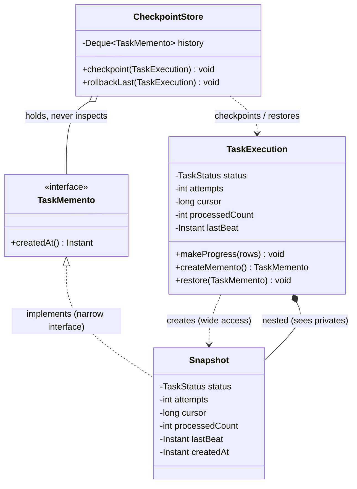
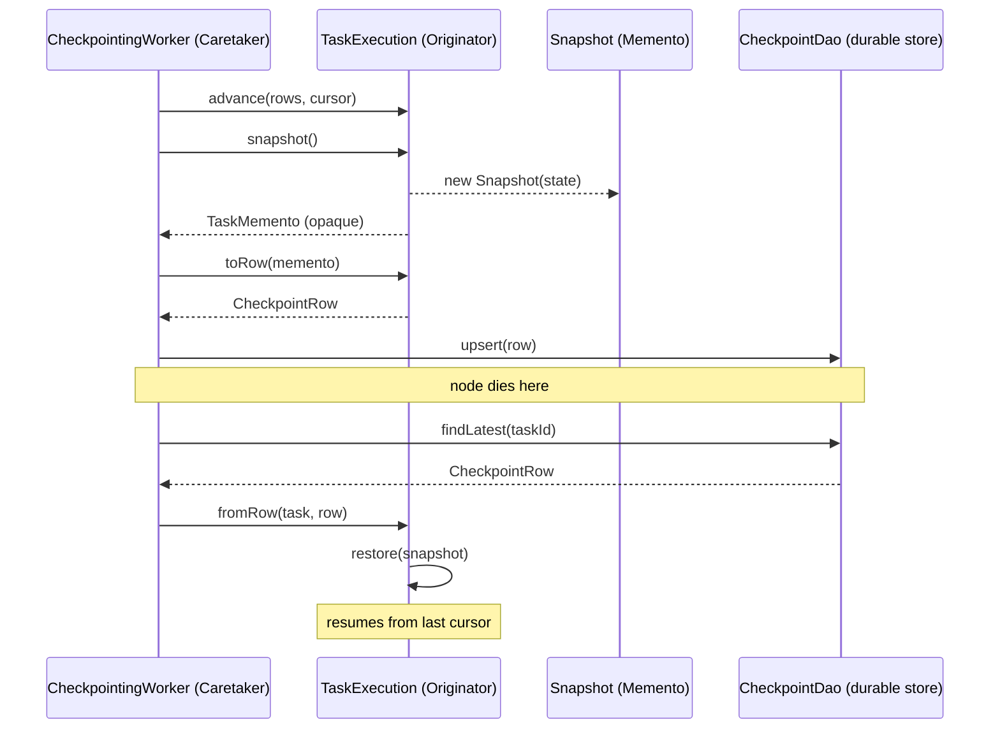

# Memento

> Where this fits in the project: a long-running `Task` must be checkpointed so a crashed or pre-empted worker can resume mid-flight, and a `Task` about to be retried must have its *pre-attempt* state captured so a failed attempt does not corrupt the next one. The Memento pattern lets us snapshot a `Task`'s internal state into an opaque token, stash it somewhere (memory, Postgres, the dead-letter record), and later restore it — **without leaking the `Task`'s internals to the code that does the saving.** This is the in-process seed of the checkpointing and replay machinery that, taken to its logical conclusion, becomes event sourcing in Phase 4.

In our Distributed Task Queue, a `Worker` pulls a `Task`, runs its `TaskHandler`, and updates state. Two recurring needs force us toward snapshot-and-restore:

1. **Checkpointing / replay.** A `report.generate` task may run for minutes, accumulating partial progress (rows processed, a cursor, an offset). If the worker node dies, we want to resume from the last checkpoint rather than re-run from zero. We need to *capture* the task's progress periodically and *restore* it on a new node.
2. **Pre-retry state capture.** Before a `Worker` mutates a `Task` for a new attempt (bumps `attempts`, flips `status` to `RETRYING`, rewrites `scheduledAt`), we want a snapshot of the state *as it was* so that if computing the next attempt throws, or if we later need to forensically compare "what the task looked like before attempt N," we have it.

The naive instinct is to reach inside the `Task`, read all its fields, copy them into a map or a parallel object, and reach back in to set them on restore. That instinct **breaks encapsulation**: the saving code now knows every field, and every time `Task` gains a field, the saving code must change. Memento answers: *let the object snapshot itself into an opaque token, and restore itself from that token — nobody else sees the internals.*

---

## 1. Why This Exists — The Real Problem

Recall the canonical model. The slice that matters here is `Task` and its in-flight, mutable execution state:

```java
public enum TaskStatus { PENDING, SCHEDULED, RUNNING, SUCCEEDED, FAILED, RETRYING, DEAD }

// Canonical Task — immutable record. (Memento shines even harder on the *mutable*
// execution-context object that wraps it, shown below.)
public record Task(
        String id,            // a UUID
        String type,          // e.g. "report.generate"
        String payload,       // JSON string
        TaskStatus status,
        int attempts,
        int maxAttempts,
        Instant createdAt,
        Instant scheduledAt,
        int priority) {}
```

A long-running handler doesn't just have a `Task`; it has *mutable progress* layered on top. Model that as an execution context:

```java
// The mutable thing whose state we want to snapshot mid-flight.
public final class TaskExecution {
    private final String taskId;
    private TaskStatus status;
    private int attempts;
    private long cursor;           // e.g. last-processed row offset
    private int processedCount;    // partial progress
    private Instant lastBeat;      // heartbeat timestamp

    // ... getters, and mutators the handler calls as it makes progress ...
}
```

The defining property: **its internal state evolves and we must be able to rewind it.** Three forces fight us if we get the rewind wrong:

1. **Encapsulation.** If the checkpoint store reads `status`, `attempts`, `cursor`, `processedCount` field-by-field, the store now *knows the shape of `TaskExecution`*. Add a field and you edit the store, the restore path, the DB column list, and the tests. The internals have leaked.
2. **Atomicity of restore.** A retry that fails halfway (status flipped, but `scheduledAt` not yet computed) leaves a half-mutated object. We want "snapshot before, restore on failure" to be all-or-nothing.
3. **Who owns the saved state.** The thing that *triggers* a save (a `CheckpointStore`, a `RetryHandler`) should be able to hold and pass around saved states without being able to *read or tamper with* them. Otherwise the snapshot becomes a second public API surface for the object's guts.

Historically, Memento is GoF (1994). The motivating example was an undo stack in a graphics editor: the editor wants to save a shape's state and restore it on Ctrl-Z, but it must not become coupled to the shape's private fields. The same shape of problem appears in database transaction savepoints (`SAVEPOINT` / `ROLLBACK TO`), in VM snapshots, in Git's working-tree stash, and — most relevant to us — in **checkpointing of streaming/batch jobs** (Flink, Spark) and **write-ahead logs**. Memento is the object-level expression of "save a recoverable point, restore to it later, don't expose the guts."

---

## 2. The Naive Version

The first cut reaches inside `TaskExecution` and copies fields by hand.

```java
// NAIVE — the store reaches into TaskExecution's internals.
public final class TaskExecution {
    private TaskStatus status;
    private int attempts;
    private long cursor;
    private int processedCount;
    private Instant lastBeat;

    // To support save/restore we are FORCED to expose everything:
    public TaskStatus getStatus()       { return status; }
    public void setStatus(TaskStatus s) { this.status = s; }
    public int getAttempts()            { return attempts; }
    public void setAttempts(int a)      { this.attempts = a; }
    public long getCursor()             { return cursor; }
    public void setCursor(long c)       { this.cursor = c; }
    public int getProcessedCount()      { return processedCount; }
    public void setProcessedCount(int p){ this.processedCount = p; }
    public Instant getLastBeat()        { return lastBeat; }
    public void setLastBeat(Instant t)  { this.lastBeat = t; }
}

// The caretaker that does checkpoint + rollback by hand.
public final class CheckpointStore {
    // Snapshot stored as a raw map — the worst kind of "structure".
    private final Map<String, Object> snapshot = new HashMap<>();

    public void save(TaskExecution ex) {
        // The store now KNOWS every field name and type of TaskExecution.
        snapshot.put("status", ex.getStatus());
        snapshot.put("attempts", ex.getAttempts());
        snapshot.put("cursor", ex.getCursor());
        snapshot.put("processedCount", ex.getProcessedCount());
        snapshot.put("lastBeat", ex.getLastBeat());
    }

    public void restore(TaskExecution ex) {
        ex.setStatus((TaskStatus) snapshot.get("status"));
        ex.setAttempts((int) snapshot.get("attempts"));
        ex.setCursor((long) snapshot.get("cursor"));
        ex.setProcessedCount((int) snapshot.get("processedCount"));
        ex.setLastBeat((Instant) snapshot.get("lastBeat"));
    }
}
```

What's wrong with it:

- **Encapsulation is destroyed.** To make state savable, `TaskExecution` exposed a public setter for *every field*. Anyone — not just the checkpoint code — can now mutate the cursor or backdate `attempts`. The class can no longer enforce its own invariants (see [../01-java-fundamentals/chapter-02-encapsulation.md](../01-java-fundamentals/chapter-02-encapsulation.md)).
- **The store knows the object's shape.** `CheckpointStore` hard-codes five field names and casts. Add a field to `TaskExecution` and the store silently *drops it* from snapshots — a subtle, untested data-loss bug. The two classes are welded together.
- **Type-unsafe stringly-typed bag.** `Map<String, Object>` with `(int)`/`(long)` casts throws `ClassCastException` at runtime, not compile time. A typo `"atempts"` compiles fine and silently corrupts restore.
- **No history, only "the last one".** A single `snapshot` map holds one state. We can't keep a checkpoint *every N rows*, or an undo *stack*. To add multiple checkpoints we'd duplicate the field-copying logic.
- **No defensive copying.** `lastBeat` is an `Instant` (immutable, fine), but if we stored a mutable collection the snapshot would alias live state — restoring would restore a reference that the live object kept mutating.

This is the moment the pattern earns its keep.

---

## 3. The Pattern — Intent, Motivation, Participants

### Intent (GoF)

> Without violating encapsulation, capture and externalize an object's internal state so that the object can be restored to this state later.

### Motivation

An object (the **Originator**) has internal state that must be saved and later restored — for undo, checkpointing, rollback, or replay. The code that *manages* those saved states (the **Caretaker**) must be able to store and shuttle them around **without ever reading or modifying the internals**. The trick: the Originator produces a **Memento** — an opaque token that the Originator can read back, but the Caretaker can only *hold*. Encapsulation is preserved because the *wide* interface (full state access) is available only to the Originator, while the Caretaker sees only a *narrow* interface (an opaque handle).

### Problem statement

How do we let a `CheckpointStore` / `RetryHandler` save and restore a `TaskExecution`'s evolving state without (a) exposing the execution's fields publicly, (b) coupling the store to the execution's field layout, and (c) preventing us from keeping a *history* of recoverable points?

### Participants

| Participant | Role in GoF | In our project |
|-------------|-------------|----------------|
| **Originator** | Creates a memento of its state; restores from one | `TaskExecution` — produces and consumes its own `Snapshot` |
| **Memento** | Opaque token holding the saved state; wide interface to Originator, narrow to Caretaker | `TaskExecution.Snapshot` (a nested, sealed/private record) |
| **Caretaker** | Holds mementos, never inspects their contents; decides *when* to save/restore | `CheckpointStore`, `RetryHandler`, an undo stack |
| **Narrow interface** | What the Caretaker is allowed to see (just "a token") | `TaskMemento` marker interface |
| **Wide interface** | What the Originator is allowed to see (full state) | private fields of the nested record |

The key design constraint: **the Memento exposes its full state only to the Originator.** In Java we get this for free with a *nested class* — an inner/nested type can access the enclosing type's privates, and we can make the Memento's accessors package-private or rely on it being a private nested type the Caretaker only handles via a marker interface.

---

## 4. UML Class Diagram



Read it as: `TaskExecution` (Originator) *creates* `Snapshot` instances and is the only type that can read their fields, because `Snapshot` is *nested inside* `TaskExecution`. The `CheckpointStore` (Caretaker) holds them only as `TaskMemento` (the narrow interface) — it sees a timestamp at most, never the saved fields.

---

## 5. Refactor — Applying the Pattern

```java
import java.time.Instant;

// ---- Narrow interface: all the Caretaker is ever allowed to see. ----
public interface TaskMemento {
    Instant createdAt();   // safe, non-state metadata for ordering/expiry
}
```

```java
import java.time.Instant;

// ---- Originator: owns its state AND the only code that can read a Snapshot. ----
public final class TaskExecution {

    private TaskStatus status;
    private int attempts;
    private long cursor;
    private int processedCount;
    private Instant lastBeat;

    public TaskExecution(String taskId, TaskStatus status, int attempts) {
        this.status = status;
        this.attempts = attempts;
        this.cursor = 0L;
        this.processedCount = 0;
        this.lastBeat = Instant.now();
    }

    // Normal business mutation the handler calls as it makes progress.
    public void makeProgress(int rows, long newCursor) {
        this.processedCount += rows;
        this.cursor = newCursor;
        this.lastBeat = Instant.now();
    }

    public void markRetrying() {
        this.status = TaskStatus.RETRYING;
        this.attempts++;
    }

    // ---- Memento creation: WIDE access lives here, inside the Originator. ----
    public TaskMemento createMemento() {
        return new Snapshot(status, attempts, cursor, processedCount, lastBeat, Instant.now());
    }

    // ---- Restore: only the Originator can read the Snapshot's fields. ----
    public void restore(TaskMemento memento) {
        // Downcast is safe because only WE create TaskMemento instances.
        if (!(memento instanceof Snapshot s)) {
            throw new IllegalArgumentException("Foreign memento: " + memento.getClass());
        }
        this.status = s.status;
        this.attempts = s.attempts;
        this.cursor = s.cursor;
        this.processedCount = s.processedCount;
        this.lastBeat = s.lastBeat;
    }

    // ---- The Memento itself: a PRIVATE nested record. ----
    // Caretakers receive it typed as TaskMemento and can never read these fields.
    private record Snapshot(
            TaskStatus status,
            int attempts,
            long cursor,
            int processedCount,
            Instant lastBeat,
            Instant createdAt) implements TaskMemento {
        // record gives value semantics + immutability for free.
    }
}
```

```java
import java.util.ArrayDeque;
import java.util.Deque;

// ---- Caretaker: keeps a HISTORY, but is structurally incapable of reading state. ----
public final class CheckpointStore {
    private final Deque<TaskMemento> history = new ArrayDeque<>();
    private final int maxDepth;

    public CheckpointStore(int maxDepth) { this.maxDepth = maxDepth; }

    public void checkpoint(TaskExecution ex) {
        history.push(ex.createMemento());
        while (history.size() > maxDepth) {
            history.removeLast();        // bound memory: keep the most recent N
        }
    }

    public void rollbackLast(TaskExecution ex) {
        TaskMemento m = history.peek();
        if (m != null) {
            ex.restore(m);               // hand it back; we never looked inside
        }
    }

    public int depth() { return history.size(); }
}
```

Notice what the Caretaker *cannot* do: there is no method on `TaskMemento` to read `cursor`, `attempts`, or `status`. The only thing escaping is `createdAt()`, which we deliberately chose to expose for ordering/expiry. `Snapshot` is `private` to `TaskExecution`, so even reflection-free downcasting by an outsider is impossible — they don't have the type name in scope.

---

## 6. Before and After

| Dimension | Naive (field-copying store) | Memento |
|-----------|-----------------------------|---------|
| Encapsulation | Destroyed — public setter per field | Intact — no setters needed for save/restore |
| Coupling | Store knows every field name + type | Store knows only `TaskMemento` |
| Adding a field | Edit store, restore, casts, tests | Edit only `TaskExecution` (and `Snapshot`) |
| Type safety | `Map<String,Object>` + casts | Compile-checked record fields |
| History / undo stack | One slot; duplicate logic to add more | `Deque<TaskMemento>` for free |
| Tamper resistance | Anyone can mutate live state | Snapshot opaque + immutable record |
| Atomic restore | Half-applied on partial failure | Single `restore(memento)` swap |

The refactor turns a leaky, stringly-typed, single-slot copy into an opaque, immutable, stackable token — and it *removed* public API from `TaskExecution` rather than adding it.

---

## 7. A Simple Java Example

Classic undo: an editor of a single text buffer.

```java
import java.util.ArrayDeque;
import java.util.Deque;

final class TextEditor {                       // Originator
    private final StringBuilder buffer = new StringBuilder();

    void type(String s) { buffer.append(s); }

    // Memento as a private nested record; outsiders see only the marker.
    interface Snapshot {}                       // narrow interface
    private record State(String text) implements Snapshot {}  // wide interface

    Snapshot save() { return new State(buffer.toString()); }

    void restore(Snapshot snap) {
        if (snap instanceof State st) {
            buffer.setLength(0);
            buffer.append(st.text());
        }
    }

    @Override public String toString() { return buffer.toString(); }
}

final class History {                           // Caretaker
    private final Deque<TextEditor.Snapshot> stack = new ArrayDeque<>();
    void push(TextEditor.Snapshot s) { stack.push(s); }
    TextEditor.Snapshot pop() { return stack.pop(); }
    boolean isEmpty() { return stack.isEmpty(); }
}

public class UndoDemo {
    public static void main(String[] args) {
        TextEditor editor = new TextEditor();
        History history = new History();

        editor.type("Hello");
        history.push(editor.save());            // checkpoint after "Hello"
        editor.type(", world");
        System.out.println(editor);             // Hello, world

        editor.restore(history.pop());          // undo
        System.out.println(editor);             // Hello
    }
}
```

The `History` never reads the text; it shuttles opaque `Snapshot` tokens. Adding a font, a cursor position, or a selection to the editor's state changes only `TextEditor` and `State` — `History` is untouched.

---

## 8. A Real-World Java Example

`Iterator` over a mutable collection with a "mark / reset to mark" facility — a stripped-down version of how `BufferedReader.mark()` / `reset()` and JDBC `Savepoint` work. Here, a parser walks tokens and can roll back to a remembered position when a grammar branch fails (the same idea our Phase 4 interpreter uses; see [interpreter.md](interpreter.md)).

```java
import java.util.List;

final class TokenStream {                        // Originator
    private final List<String> tokens;
    private int pos = 0;

    TokenStream(List<String> tokens) { this.tokens = List.copyOf(tokens); }

    boolean hasNext() { return pos < tokens.size(); }
    String next()     { return tokens.get(pos++); }

    // Narrow interface the parser holds; wide state hidden in the record.
    interface Mark {}
    private record PositionMark(int pos) implements Mark {}

    Mark mark()              { return new PositionMark(pos); }
    void reset(Mark mark) {
        if (mark instanceof PositionMark pm) this.pos = pm.pos();
    }
}

final class Parser {                             // Caretaker (uses marks, never reads pos)
    boolean tryParseOptional(TokenStream in, String expected) {
        TokenStream.Mark snapshot = in.mark();   // remember where we were
        if (in.hasNext() && in.next().equals(expected)) {
            return true;                         // consumed it
        }
        in.reset(snapshot);                      // branch failed → rewind
        return false;
    }
}

public class MarkResetDemo {
    public static void main(String[] args) {
        var stream = new TokenStream(List.of("SELECT", "*", "FROM", "tasks"));
        var parser = new Parser();
        System.out.println(parser.tryParseOptional(stream, "WITH"));   // false, rewound
        System.out.println(parser.tryParseOptional(stream, "SELECT")); // true, consumed
        System.out.println(stream.next());                              // *
    }
}
```

The `Parser` is the Caretaker. `Mark` is opaque — the parser cannot learn or fabricate a position, only ask the stream to remember and restore one. This is precisely how production parsers implement backtracking without exposing the buffer's index.

---

## 9. Project-Integration Example — Checkpoint + Pre-Retry Snapshot

Now the real thing, woven into the canonical model. We combine **both** motivating needs: a long-running handler periodically checkpoints, and the `RetryHandler` snapshots pre-retry state. We also show the **event-sourcing bridge** — persisting mementos as rows so a *different* node can resume.

```java
import java.time.Instant;
import java.util.Optional;

// Originator extended with explicit progress + the canonical TaskStatus lifecycle.
public final class TaskExecution {
    private final String taskId;
    private final String type;
    private TaskStatus status;
    private int attempts;
    private final int maxAttempts;
    private long cursor;            // resume point for long-running work
    private int processedCount;
    private Instant lastBeat;

    public TaskExecution(Task task) {
        this.taskId = task.id();
        this.type = task.type();
        this.status = TaskStatus.RUNNING;
        this.attempts = task.attempts();
        this.maxAttempts = task.maxAttempts();
        this.cursor = 0L;
        this.processedCount = 0;
        this.lastBeat = Instant.now();
    }

    public String taskId() { return taskId; }
    public long cursor()   { return cursor; }
    public TaskStatus status() { return status; }

    public void advance(int rows, long newCursor) {
        this.processedCount += rows;
        this.cursor = newCursor;
        this.lastBeat = Instant.now();
    }

    public boolean canRetry() { return attempts + 1 < maxAttempts; }

    public void beginRetry() {
        this.status = TaskStatus.RETRYING;
        this.attempts++;
    }

    public void markFailed() { this.status = TaskStatus.FAILED; }
    public void markSucceeded() { this.status = TaskStatus.SUCCEEDED; }

    // ---- Memento API (wide access stays inside the Originator) ----
    public TaskMemento snapshot() {
        return new Snapshot(taskId, status, attempts, cursor, processedCount, lastBeat, Instant.now());
    }

    public void restore(TaskMemento memento) {
        if (!(memento instanceof Snapshot s)) {
            throw new IllegalArgumentException("Foreign memento for " + taskId);
        }
        if (!s.taskId.equals(this.taskId)) {
            throw new IllegalStateException("Memento taskId mismatch: " + s.taskId + " != " + taskId);
        }
        this.status = s.status;
        this.attempts = s.attempts;
        this.cursor = s.cursor;
        this.processedCount = s.processedCount;
        this.lastBeat = s.lastBeat;
    }

    // Bridge to persistence/event-sourcing: only the Originator can flatten its own memento.
    public CheckpointRow toRow(TaskMemento memento) {
        if (!(memento instanceof Snapshot s)) throw new IllegalArgumentException("Foreign memento");
        return new CheckpointRow(s.taskId, s.status.name(), s.attempts, s.cursor, s.processedCount,
                                 s.lastBeat, s.createdAt);
    }

    // Reconstruct an Originator from a persisted row (used when a new node resumes).
    public static TaskExecution fromRow(Task task, CheckpointRow row) {
        TaskExecution ex = new TaskExecution(task);
        ex.restore(new Snapshot(row.taskId(), TaskStatus.valueOf(row.status()), row.attempts(),
                                row.cursor(), row.processedCount(), row.lastBeat(), row.createdAt()));
        return ex;
    }

    // PRIVATE nested memento — caretakers only ever hold it as TaskMemento.
    private record Snapshot(
            String taskId,
            TaskStatus status,
            int attempts,
            long cursor,
            int processedCount,
            Instant lastBeat,
            Instant createdAt) implements TaskMemento {}
}
```

```java
import java.time.Instant;

// Narrow interface + the flat persistence DTO (the event-sourcing record).
public interface TaskMemento { Instant createdAt(); /* metadata only */ }

public record CheckpointRow(
        String taskId, String status, int attempts, long cursor,
        int processedCount, Instant lastBeat, Instant createdAt) {}
```

```java
import java.time.Duration;
import java.util.Optional;

// RetryHandler as Caretaker: snapshot BEFORE mutating for retry, roll back on failure.
public final class RetryHandler {
    private final RetryPolicy policy;
    private final DeadLetterQueue dlq;
    private final TaskScheduler scheduler;

    public RetryHandler(RetryPolicy policy, DeadLetterQueue dlq, TaskScheduler scheduler) {
        this.policy = policy; this.dlq = dlq; this.scheduler = scheduler;
    }

    /** Attempt the retry transition; restore prior state if anything goes wrong mid-transition. */
    public void onFailure(TaskExecution ex, Task task, TaskResult result) {
        TaskMemento before = ex.snapshot();          // capture pre-retry state (opaque)
        try {
            if (!result.retryable() || !ex.canRetry()) {
                ex.markFailed();
                dlq.send(task, result.message());    // → DEAD path, see ../07-queues-and-messaging/dead-letter-queues.md
                return;
            }
            ex.beginRetry();                         // mutate: status=RETRYING, attempts++
            Optional<Duration> delay = policy.nextDelay(task.attempts() + 1);
            if (delay.isEmpty()) {                   // policy says "no more retries"
                ex.restore(before);                  // ATOMIC rollback to pre-retry state
                ex.markFailed();
                dlq.send(task, "retry budget exhausted");
                return;
            }
            scheduler.schedule(task, delay.get());   // re-enqueue after backoff
        } catch (RuntimeException e) {
            ex.restore(before);                      // any failure → no half-mutated state
            throw e;
        }
    }
}
```

```java
import java.time.Instant;

// Periodic checkpointing by a long-running handler, persisting mementos for cross-node resume.
public final class CheckpointingWorker {
    private final TaskRepository repo;                 // canonical repository
    private final CheckpointDao checkpoints;           // persists CheckpointRow
    private final int checkpointEveryRows;

    public CheckpointingWorker(TaskRepository repo, CheckpointDao checkpoints, int checkpointEveryRows) {
        this.repo = repo; this.checkpoints = checkpoints; this.checkpointEveryRows = checkpointEveryRows;
    }

    public void runLongTask(Task task) {
        // Resume from the last persisted checkpoint if one exists.
        TaskExecution ex = checkpoints.findLatest(task.id())
                .map(row -> TaskExecution.fromRow(task, row))
                .orElseGet(() -> new TaskExecution(task));

        long start = ex.cursor();
        for (long row = start; row < 1_000_000; row++) {
            processRow(row);                            // do real work
            if (row % checkpointEveryRows == 0) {
                ex.advance(checkpointEveryRows, row);
                checkpoints.upsert(ex.toRow(ex.snapshot()));   // durable checkpoint
            }
        }
        ex.markSucceeded();
        repo.save(taskWithStatus(task, ex.status()));
    }

    private void processRow(long row) { /* ... real handler logic ... */ }
    private Task taskWithStatus(Task t, TaskStatus s) {
        return new Task(t.id(), t.type(), t.payload(), s, t.attempts(), t.maxAttempts(),
                        t.createdAt(), t.scheduledAt(), t.priority());
    }
}
```

How the three players map back to the pattern:

- **Originator:** `TaskExecution` — the only code that can read a `Snapshot`. It also owns the *translation* between in-memory memento and the persisted `CheckpointRow`, keeping that wide access localized.
- **Memento:** the private `Snapshot` record (in-memory) and `CheckpointRow` (its on-disk projection). Both are immutable.
- **Caretaker:** `RetryHandler` (snapshot → mutate → roll back on failure) and `CheckpointingWorker` (snapshot → persist → resume on a new node). Neither reads the snapshot's fields directly.



---

## 10. Memento and Event Sourcing — The Relationship

Memento and **event sourcing** are two answers to "how do I reconstruct past state," and they sit on a spectrum:

| | Memento (snapshot) | Event sourcing |
|---|---|---|
| What you store | A *whole-state* snapshot at a point in time | An append-only *log of state-changing events* |
| Reconstruct by | Loading one snapshot | Replaying events from the start (or from a snapshot) |
| Storage cost | O(state size) per snapshot | O(number of events) |
| Audit / "why" | Lost — you see *what*, not *how* | Full history of *how* state evolved |
| Restore speed | O(1) — load and apply | O(n events) — replay |

They are not rivals; production systems **combine** them. Event-sourced systems take *periodic snapshots* (mementos!) so they don't replay the entire event log on every load — exactly what Kafka Streams, Flink, and Akka Persistence do. In our platform:

- The `CheckpointRow` is a **memento** persisted to Postgres.
- The Phase 4 `EventBus` (`TaskEvent` stream; see [observer.md](observer.md)) is the **event log** — `SUBMITTED`, `STARTED`, `RETRYING`, `DEAD`.
- To rebuild a task's state on a fresh node, we load the latest **snapshot** (fast) and replay only the **events** after its `createdAt` (correct). Memento makes event sourcing affordable.

This is the conceptual escalator: in-process Memento → persisted checkpoint → event-sourced replay with snapshots. Same idea, three scales.

---

## 11. Production Notes

**Where it shows up in industry:**

- **Stream/batch checkpointing:** Apache Flink's distributed snapshots (Chandy–Lamport), Spark Structured Streaming checkpoints, Kafka consumer offset commits — all "save a recoverable point, restore on failure."
- **Databases:** SQL `SAVEPOINT` / `ROLLBACK TO SAVEPOINT`; MVCC snapshots; WAL replay from a base backup (the base backup *is* a memento).
- **Editors & IDEs:** undo/redo stacks; IntelliJ's "Local History."
- **Infra:** VM/container snapshots, `git stash`, Terraform state versions.
- **Game engines:** save states, rollback netcode (snapshot frame, re-simulate).

**When NOT to use it:**

- **The object is already immutable and small.** Our canonical `Task` is an immutable record — to "snapshot" it you just keep the old reference. Memento earns its keep on *mutable* state (`TaskExecution`), not on records. Don't build a memento for something a `final` variable already preserves.
- **State is huge.** Snapshotting gigabytes per checkpoint is wasteful; prefer incremental/delta checkpoints or event sourcing. Flink does incremental RocksDB snapshots for exactly this reason.
- **You need the *history of changes*, not just past states.** Use event sourcing (or the Command pattern's undo, see [command.md](command.md)) — Memento tells you *what* state was, not *what changed*.
- **Frequent saves of a tiny field.** If you only ever rewind one field, a plain saved value is simpler than the ceremony.

**Common anti-patterns:**

- **Fat memento with a public API.** Exposing getters on the memento for the Caretaker turns it into a second public face of the Originator — the very thing the pattern forbids. Keep the Memento's state accessible *only* to the Originator (private nested type + narrow marker interface).
- **Shallow snapshots aliasing live state.** If the memento stores a reference to a mutable collection, restoring "rewinds" to an object the live code kept mutating. **Deep/defensive copy** mutable contents at snapshot time. Our records use immutable fields (`Instant`, primitives, enums), so this is safe — but watch out the moment a `List<String> partialResults` field appears.
- **Unbounded history.** An undo stack or checkpoint deque with no cap is a memory leak. Bound it (`maxDepth`) and/or expire by `createdAt`.
- **Serialization coupling.** Persisting a memento via Java serialization welds the on-disk format to the class shape, breaking on the next field change. Use an explicit DTO (`CheckpointRow`) + schema/migrations (Flyway) for durable mementos.
- **Restoring without validating identity.** Restoring memento for task A into task B corrupts state. We guard with the `taskId` check in `restore`.

---

## 12. Common Mistakes and Pitfalls

- **Adding setters "just to support restore."** That is the naive trap — it destroys encapsulation. Fix: nested memento gives the Originator field access without public setters.
- **Caretaker downcasts the memento to read it.** If the Caretaker can `(Snapshot) m`, the pattern failed. Fix: make `Snapshot` a *private nested* type so the Caretaker can't name it.
- **Mutable memento.** A memento whose fields can change after creation isn't a snapshot. Fix: use a `record` (immutable by construction).
- **No bound on stored mementos.** Fix: cap depth; evict oldest.
- **Snapshotting on every micro-mutation.** Excessive snapshots dominate latency and memory. Fix: checkpoint on an interval (rows, time) — see `checkpointEveryRows`.
- **Forgetting concurrency.** If a `Worker` thread mutates `TaskExecution` while another reads its snapshot, you get a torn read. Fix: confine a `TaskExecution` to one thread (our worker model does this; see [../06-concurrency/threads.md](../06-concurrency/threads.md)) or synchronize `snapshot()`/`restore()`.

---

## 13. Refactoring Exercise

**Bad code** — a `SessionState` undo built with a stringly-typed bag and public setters:

```java
public class SessionState {
    public Map<String, Object> data = new HashMap<>();   // wide open
}
public class UndoManager {
    private Map<String, Object> saved;
    void save(SessionState s)    { saved = new HashMap<>(s.data); }   // shallow copy
    void undo(SessionState s)    { s.data = new HashMap<>(saved); }   // manager owns shape
}
```

**Improved code** — encapsulate state, hand back an opaque memento, but the memento still exposes a getter (leaky):

```java
public final class SessionState {
    private int cartItems; private String coupon;
    public void addItem() { cartItems++; }
    public void applyCoupon(String c) { coupon = c; }

    public static final class Memento {
        private final int cartItems; private final String coupon;
        Memento(int c, String cp) { cartItems = c; coupon = cp; }
        public int cartItems() { return cartItems; }   // LEAK: caretaker can read state
        public String coupon() { return coupon; }
    }
    public Memento save() { return new Memento(cartItems, coupon); }
    public void restore(Memento m) { cartItems = m.cartItems; coupon = m.coupon; }
}
```

**Final production-quality code** — narrow marker interface + private nested record; the Caretaker is structurally blind to state and bounded:

```java
import java.time.Instant;
import java.util.ArrayDeque;
import java.util.Deque;

public interface Snapshot { Instant takenAt(); }   // narrow interface

public final class SessionState {                  // Originator
    private int cartItems; private String coupon;

    public void addItem()              { cartItems++; }
    public void applyCoupon(String c)  { coupon = c; }

    public Snapshot save() { return new State(cartItems, coupon, Instant.now()); }
    public void restore(Snapshot s) {
        if (s instanceof State st) { cartItems = st.cartItems; coupon = st.coupon; }
        else throw new IllegalArgumentException("foreign snapshot");
    }

    private record State(int cartItems, String coupon, Instant takenAt) implements Snapshot {}
}

public final class UndoManager {                   // Caretaker — cannot read state
    private final Deque<Snapshot> history = new ArrayDeque<>();
    private final int max;
    public UndoManager(int max) { this.max = max; }
    public void checkpoint(SessionState s) {
        history.push(s.save());
        while (history.size() > max) history.removeLast();
    }
    public void undo(SessionState s) { if (!history.isEmpty()) s.restore(history.pop()); }
}
```

The progression: leaky bag → encapsulated-but-readable memento → opaque, immutable, bounded memento.

---

## 14. Exercises

### Easy

**E1 (knowledge check).** In the Memento pattern, name the three participants and state, for each, exactly what it is and is *not* allowed to do with the saved state.

**E2 (coding).** Add an `undo()` to the simple `TextEditor` from §7 that is a no-op (does not throw) when the history is empty. Write a `main` that types three words, checkpoints between each, and undoes twice.

### Medium

**M3 (coding).** Extend `TaskExecution` (§9) with a `List<String> partialResults` field that the handler appends to via `addResult(String)`. Make `snapshot()` and `restore()` correct under mutation — i.e., a snapshot must NOT change when the live list is later mutated. State which line is the load-bearing fix and why.

**M4 (refactoring).** You are handed a `Game` class with `public int hp; public int level; public int[] inventory;` and a `SaveSlot` that copies those fields directly. Refactor to Memento so that (a) `Game`'s fields become private, (b) `SaveSlot` cannot read the saved values, and (c) snapshots survive later inventory mutation.

### Hard

**H5 (design).** Design checkpointing for a `report.generate` task that processes 50M rows across multiple worker nodes, where a node can die at any time. Specify: snapshot frequency, where mementos live, how a *different* node resumes, how you bound storage, and how this interacts with the Phase 4 `EventBus` event log. Discuss the snapshot-vs-event-sourcing tradeoff for this case.

**H6 (pattern identification).** For each snippet, name the pattern and justify in one sentence; if it is *not* Memento, say what it actually is.
1. A class returns an opaque `Mark` from `mark()` and rewinds via `reset(Mark)`.
2. A class wraps a `Task` and adds logging around `handle()` while implementing `TaskHandler`.
3. A `Deque<TaskMemento>` lets a Caretaker push and pop opaque tokens it cannot read.
4. A class records each user action as an object with `execute()`/`undo()` and replays them.

---

## 15. Solutions

**E1.**
- **Originator** (e.g. `TaskExecution`): owns the state; *creates* the memento (wide access) and *restores* from it. It is the only type allowed to read the memento's fields.
- **Memento** (e.g. `Snapshot`): an immutable, opaque token holding the saved state. It exposes a *wide* interface to the Originator and a *narrow* interface (a marker / metadata only) to everyone else.
- **Caretaker** (e.g. `CheckpointStore`): decides *when* to save and restore and *holds* mementos (possibly a history). It must *never* read or modify a memento's state — only pass it back to the Originator.

**E2.**

```java
final class History {
    private final java.util.Deque<TextEditor.Snapshot> stack = new java.util.ArrayDeque<>();
    void push(TextEditor.Snapshot s) { stack.push(s); }
    java.util.Optional<TextEditor.Snapshot> pop() {
        return stack.isEmpty() ? java.util.Optional.empty() : java.util.Optional.of(stack.pop());
    }
}

public class UndoTwice {
    public static void main(String[] args) {
        var editor = new TextEditor();
        var history = new History();
        for (String w : new String[]{"alpha ", "beta ", "gamma"}) {
            history.push(editor.save());     // checkpoint BEFORE each word
            editor.type(w);
        }
        System.out.println(editor);          // alpha beta gamma
        history.pop().ifPresent(editor::restore);   // undo "gamma"  -> alpha beta
        history.pop().ifPresent(editor::restore);   // undo "beta "  -> alpha
        System.out.println(editor);          // alpha
        history.pop().ifPresent(editor::restore);   // undo "alpha " -> ""
        history.pop().ifPresent(editor::restore);   // empty: no-op, no throw
        System.out.println("[" + editor + "]");
    }
}
```

The `Optional`-returning `pop()` makes empty-history a no-op via `ifPresent`, so `undo()` never throws.

**M3.** The fix is **defensive copying of the mutable list at snapshot and restore time**.

```java
public final class TaskExecution {
    private final java.util.List<String> partialResults = new java.util.ArrayList<>();

    public void addResult(String r) { partialResults.add(r); }

    public TaskMemento snapshot() {
        // load-bearing line: copy the list, do NOT alias it.
        return new Snapshot(java.util.List.copyOf(partialResults), java.time.Instant.now());
    }
    public void restore(TaskMemento m) {
        if (m instanceof Snapshot s) {
            partialResults.clear();
            partialResults.addAll(s.partialResults());   // s.partialResults() is already immutable
        }
    }
    private record Snapshot(java.util.List<String> partialResults, java.time.Instant createdAt)
            implements TaskMemento {}
}
```

`List.copyOf(partialResults)` is the load-bearing line: it produces an immutable copy, so later `addResult(...)` calls on the live list cannot mutate the captured snapshot. Storing the live `partialResults` reference directly would make the "snapshot" track future mutations — defeating the pattern.

**M4.**

```java
public interface GameSave { }   // narrow marker

public final class Game {       // Originator
    private int hp, level;
    private int[] inventory = new int[0];

    public void takeDamage(int d) { hp -= d; }
    public void levelUp()         { level++; }
    public void pickUp(int item) {
        inventory = java.util.Arrays.copyOf(inventory, inventory.length + 1);
        inventory[inventory.length - 1] = item;
    }

    public GameSave save() {
        return new Snapshot(hp, level, inventory.clone(), java.time.Instant.now()); // clone array!
    }
    public void load(GameSave s) {
        if (s instanceof Snapshot snap) {
            hp = snap.hp(); level = snap.level(); inventory = snap.inventory().clone();
        }
    }
    private record Snapshot(int hp, int level, int[] inventory, java.time.Instant at)
            implements GameSave {}
}

public final class SaveSlot {   // Caretaker — cannot read hp/level/inventory
    private GameSave slot;
    public void store(Game g) { slot = g.save(); }
    public void load(Game g)  { if (slot != null) g.load(slot); }
}
```

Fields are private (a); `SaveSlot` only holds `GameSave`, which has no accessors (b); `inventory.clone()` on both save and load means later `pickUp(...)` cannot corrupt the saved snapshot (c).

**H5 (design sketch).**
- **Frequency:** checkpoint on a *hybrid* trigger — every N rows (e.g. 50k) *and* at most every T seconds — to bound both replay work and snapshot overhead. Pure per-row is too costly; pure time-based loses too much on a stall.
- **Where mementos live:** persist `CheckpointRow` to Postgres keyed by `taskId`, `upsert`ing the latest (we don't need every checkpoint, only the most recent durable one). For very large state, store a pointer to object storage (S3) and keep only metadata + cursor in Postgres.
- **Cross-node resume:** on pickup, a worker calls `CheckpointDao.findLatest(taskId)`; if present, `TaskExecution.fromRow(...)` rehydrates and the loop resumes at `cursor`. Idempotency of `processRow` is required so re-processing the rows between the last checkpoint and the crash is safe (see [../08-distributed-systems/idempotency.md](../08-distributed-systems/idempotency.md)).
- **Bounding storage:** one row per task (upsert); delete on `SUCCEEDED`/`DEAD`. If retaining history for audit, TTL-expire by `createdAt`.
- **EventBus interaction:** the `TaskEvent` log records lifecycle transitions (`STARTED`, `CHECKPOINTED`, `RETRYING`, `DEAD`); the `CheckpointRow` is the *snapshot* that makes replay cheap — rebuild = latest snapshot + events after its `createdAt`.
- **Tradeoff:** pure event sourcing would replay 50M row-events to rebuild — too slow. Pure snapshots lose the audit trail. Combining a recent **memento** with a short **event suffix** gives O(1)-ish rebuild *and* a full audit history. This is the standard "snapshot + log" architecture.

**H6.**
1. **Memento** — opaque `Mark` saved and restored without exposing the position; the Caretaker can't read it. (This is the `mark`/`reset` idiom = Memento.)
2. **Not Memento — Decorator** — it wraps a `TaskHandler` and adds behavior around the same interface (see [decorator.md](decorator.md)).
3. **Memento (Caretaker role)** — a history of opaque tokens the holder cannot inspect.
4. **Not Memento — Command** — actions are reified objects with `execute`/`undo`; the undo is per-*command*, recording *changes*, not whole-state snapshots (see [command.md](command.md)).

---

## 16. Interview Questions and Takeaways

1. **Q: How does Memento preserve encapsulation if the Caretaker holds the state?**
   A: The memento has two interfaces. The *wide* one (full state) is visible only to the Originator — in Java via a private nested type that can read enclosing privates. The *narrow* one (a marker/metadata interface) is all the Caretaker sees, so it can hold and shuttle the token but never read or mutate the saved state.

2. **Q: Memento vs. just keeping a copy of the object?**
   A: For an immutable object, a saved reference *is* the snapshot — no pattern needed. Memento earns its keep on *mutable* objects where a naive copy would force public getters/setters and couple the saver to the field layout. Memento localizes that wide access inside the Originator.

3. **Q: How does Memento relate to event sourcing?**
   A: Memento stores *whole-state snapshots*; event sourcing stores an *append-only log of changes*. They combine: event-sourced systems take periodic snapshots (mementos) so replay starts from a recent state instead of the beginning. Snapshot = fast restore; event log = full audit/why.

4. **Q: What's the danger with a memento that holds a collection?**
   A: Shallow capture aliases live state — later mutations corrupt the "snapshot." Fix with defensive/deep copy (`List.copyOf`, `array.clone()`) at snapshot time, and immutable fields in the record.

5. **Q: How would you persist mementos durably without coupling to the class shape?**
   A: Don't serialize the class. Project the memento into an explicit DTO (`CheckpointRow`) with a stable schema and migrations (Flyway), and have the Originator own the translation both ways. The on-disk format then evolves independently of the in-memory class.

6. **Q: Memento vs. Command for undo?**
   A: Memento undoes by *restoring a saved whole state*; Command undoes by *reversing a recorded operation*. Memento is simpler when state is small and self-contained; Command scales better when state is large but each change is cheap to invert and you want a replayable action log.

7. **Q: Thread-safety concerns?**
   A: If one thread mutates the Originator while another snapshots it, you can get a torn read. Confine the Originator to a single thread (our per-task worker model) or guard `snapshot()`/`restore()` with the same lock as the mutators.

---

## 17. Production Considerations

- **Memory.** Unbounded checkpoint/undo histories leak. Bound depth and/or expire by age; for durable checkpoints, upsert the latest and delete on terminal status.
- **Snapshot cost vs. recovery cost.** More frequent snapshots = less replay on crash but more steady-state overhead. Tune with a hybrid rows/time trigger; measure with a Micrometer timer around `snapshot()` and a counter on resumes.
- **Schema evolution.** Durable mementos outlive code. Use a versioned DTO + Flyway migrations; never Java-serialize a live class.
- **Idempotency on resume.** Resuming re-processes work between the last checkpoint and the crash. The handler's effects must be idempotent or the checkpoint cursor must be transactionally committed *with* the side effects.
- **Observability.** Emit metrics: `checkpoints.written`, `checkpoints.bytes`, `resume.count`, `replay.rows`. Alert if resume rate spikes (a node is flapping) or if checkpoint lag grows (a task is stalled).
- **Security.** Mementos may contain payload data; encrypt at rest and scrub PII before persisting, the same as task payloads.

---

## What We Can Improve In Our Project Using This Concept

Our long-running handlers currently restart from zero on a crash, and the `RetryHandler` mutates a task in place with no clean rollback if the transition fails. Introduce a `TaskExecution` Originator with a private nested `Snapshot` memento and a `TaskMemento` narrow interface. Use it in two places: (1) the `RetryHandler` snapshots pre-retry state and rolls back atomically if computing the next attempt fails or the retry budget is exhausted mid-transition; (2) a `CheckpointingWorker` periodically persists a `CheckpointRow` memento so a *different* node can resume a half-finished `report.generate` from the last cursor. This removes the field-leaking copy code, keeps `TaskExecution` encapsulated, and pre-positions us for the Phase 4 snapshot-plus-event-log replay architecture.

## Project Refactoring Task

1. Add `TaskMemento` (narrow interface, metadata only) and `CheckpointRow` (durable DTO).
2. Add `TaskExecution` (Originator) with a private nested `Snapshot` record, plus `snapshot()`, `restore()`, `toRow()`, `fromRow()`.
3. Make `RetryHandler` a Caretaker: snapshot before mutating, `restore()` on any failure or exhausted budget, then DLQ.
4. Add `CheckpointDao` + `CheckpointingWorker` that upserts the latest `CheckpointRow` every N rows and resumes from it.
5. Defensive-copy any mutable memento fields; bound any in-memory history (`maxDepth`).
6. Tests: restore round-trips state; foreign/ mismatched memento rejected; mutation after snapshot does not change the snapshot; resume continues at the last cursor; failed retry leaves no half-mutated state.

## Git Commit For This Chapter

```text
feat(checkpoint): add Memento-based snapshot/restore for retries and resumable tasks

- add TaskMemento narrow interface + CheckpointRow durable DTO
- add TaskExecution originator with private nested Snapshot record (encapsulated)
- RetryHandler snapshots pre-retry state and rolls back atomically on failure
- add CheckpointDao + CheckpointingWorker for periodic durable checkpoints + cross-node resume
- defensive-copy mutable memento fields; bound in-memory undo history
- tests: round-trip restore, foreign-memento guard, snapshot immutability, resume-from-cursor

Files: domain/TaskExecution.java, memento/TaskMemento.java, memento/CheckpointRow.java,
       retry/RetryHandler.java, worker/CheckpointingWorker.java, persistence/CheckpointDao.java,
       test/MementoTest.java, test/RetryRollbackTest.java, test/CheckpointResumeTest.java
```

## Architecture Impact

`TaskExecution` becomes the single owner of its own state and the only code with wide access to its snapshots; every Caretaker (`RetryHandler`, `CheckpointingWorker`) operates through the opaque `TaskMemento`, so adding execution fields never ripples into the retry or checkpoint code. The persisted `CheckpointRow` is the seam where in-process recovery becomes *distributed* recovery — a crashed worker's task resumes on another node from the last durable cursor. Combined with the Phase 4 `EventBus` event log, this yields the standard "snapshot + log" recovery architecture: fast rebuild from a recent memento plus correctness from replaying only the trailing events, enabling horizontal scaling without losing in-flight progress.

## Interview Takeaways

- Memento = capture/restore an object's internal state **without breaking encapsulation**, via a token with a wide interface to the Originator and a narrow one to the Caretaker.
- In Java, a **private nested record** implementing a marker interface gives the Originator field access while keeping the Caretaker structurally blind.
- **Defensive-copy mutable fields** at snapshot time, make the memento **immutable**, and **bound** any history.
- It shines on **mutable** state; for immutable records, a saved reference already is the snapshot.
- Memento and **event sourcing** combine — periodic snapshots make event-log replay affordable; that is exactly how Flink/Kafka/Akka recover.
