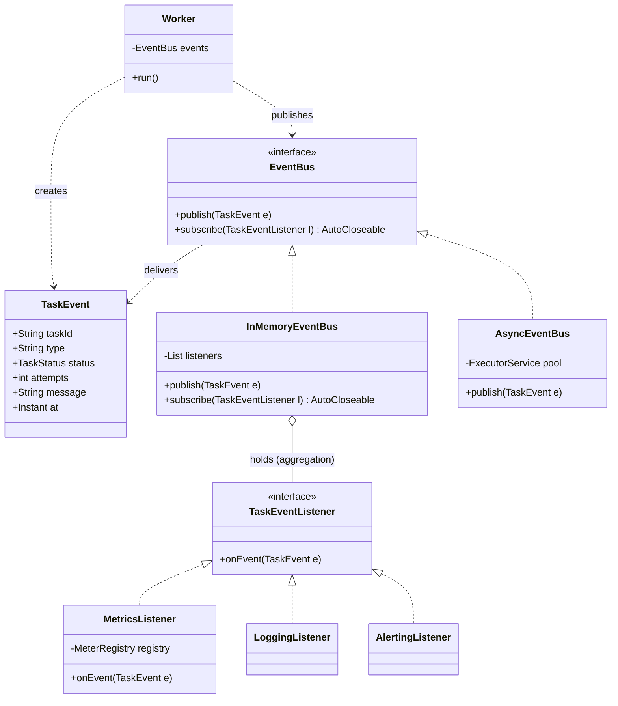
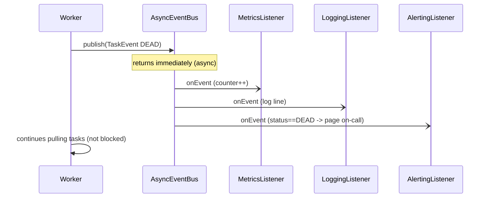

# Observer

> Where this fits in the project: when a `Task` succeeds, fails, retries, or dies, several unrelated subsystems must react — the metrics collector increments a counter, the structured logger writes a line, the alerter pages someone on a DEAD task, and (Phase 4) an external event bus fans the change out to other services. None of those concerns belong in the `Worker`. Observer lets the `Worker` *announce* "this task changed" once, and lets any number of listeners subscribe without the `Worker` knowing they exist. This is the in-process seed of the Phase 4 [`EventBus`](../09-project/phase-4.md).

The `Worker` has one job: pull a `Task`, run its `TaskHandler`, and record the outcome. The moment we let it also "increment a Prometheus counter, write a log line, and send a PagerDuty alert," it stops being a worker and becomes a tangle. Every new reaction to a task outcome forces a new edit to the hottest, most concurrency-sensitive class in the system. Observer is the pattern that breaks that coupling: the `Worker` publishes a `TaskEvent`; subscribers decide what to do with it. This chapter builds that mechanism from a naive hardcoded version to a thread-safe, async-capable, leak-free `EventBus` that mirrors what you would ship.

---

## 1. Why This Exists — The Real Problem

Recall the canonical model. A `Worker` pulls from a `TaskQueue`, finds the handler, runs it, and reacts to the `TaskResult`:

```java
public enum TaskStatus { PENDING, SCHEDULED, RUNNING, SUCCEEDED, FAILED, RETRYING, DEAD }

public record Task(
        String id,            // a UUID
        String type,          // e.g. "email.send"
        String payload,       // JSON string
        TaskStatus status,
        int attempts,
        int maxAttempts,
        Instant createdAt,
        Instant scheduledAt,
        int priority) {}

public record TaskResult(boolean success, String message, boolean retryable) {}

@FunctionalInterface
public interface TaskHandler {
    TaskResult handle(Task task) throws Exception;
}
```

Now product asks for the things every real platform needs:

- **Metrics**: count `tasks_succeeded_total`, `tasks_failed_total`, `tasks_dead_total`; time execution latency.
- **Logging**: a structured line per outcome with `taskId`, `type`, `attempts`.
- **Alerting**: page on-call when a task transitions to `DEAD` (exhausted retries).
- **Audit / event bus** (Phase 4): publish the state change so downstream services (billing, notifications) can react.

The forces that make this hard:

1. **The `Worker` is hot and concurrency-sensitive.** It runs on many threads. Every extra responsibility we bolt on is more code to get wrong under contention.
2. **The set of reactions is open-ended and varies by environment.** Dev wants console logs and no paging. Prod wants Prometheus, JSON logs, and PagerDuty. The `Worker` should not contain that branching.
3. **Reactions must not block task throughput.** Sending an alert over HTTP can take 500 ms. If that happens inline on the worker thread, throughput collapses.
4. **One outcome, many independent reactions.** This is a *one-to-many* relationship. The producer (worker) should not know the count or identity of consumers.

A one-to-many notification where the producer is decoupled from the consumers is the textbook trigger for **Observer**.

---

## 2. The Naive Version

The fastest thing that works: do everything inline in the `Worker`.

```java
// NAIVE — every reaction hardcoded into the worker
public final class Worker implements Runnable {
    private final TaskQueue queue;
    private final Map<String, TaskHandler> handlers;
    private final MeterRegistry meters;          // metrics dependency
    private final Logger log;                     // logging dependency
    private final PagerDutyClient pagerDuty;      // alerting dependency
    private volatile boolean running = true;

    Worker(TaskQueue queue, Map<String, TaskHandler> handlers,
           MeterRegistry meters, Logger log, PagerDutyClient pagerDuty) {
        this.queue = queue; this.handlers = handlers;
        this.meters = meters; this.log = log; this.pagerDuty = pagerDuty;
    }

    @Override public void run() {
        while (running) {
            try {
                Task task = queue.dequeue();
                TaskHandler handler = handlers.get(task.type());
                TaskResult result = handler.handle(task);

                if (result.success()) {
                    meters.counter("tasks_succeeded_total", "type", task.type()).increment();
                    log.info("task {} succeeded", task.id());
                } else if (task.attempts() + 1 >= task.maxAttempts()) {
                    // task is now DEAD
                    meters.counter("tasks_dead_total", "type", task.type()).increment();
                    log.error("task {} dead after {} attempts", task.id(), task.maxAttempts());
                    pagerDuty.alert("Task " + task.id() + " is DEAD: " + result.message()); // BLOCKS!
                } else {
                    meters.counter("tasks_retrying_total", "type", task.type()).increment();
                    log.warn("task {} will retry", task.id());
                }
            } catch (InterruptedException e) {
                Thread.currentThread().interrupt(); return;
            } catch (Exception e) {
                log.error("worker loop error", e);
            }
        }
    }
}
```

What's wrong with it:

- **Open/Closed violated.** Add "emit a Kafka event on success" and you edit the `Worker` again. The hottest class grows a new branch for every cross-cutting concern (see [../04-oop-and-ood/solid.md](../04-oop-and-ood/solid.md)).
- **Wide constructor / high coupling.** The `Worker` now depends on `MeterRegistry`, `Logger`, *and* `PagerDutyClient`. Each is a reason to recompile and a thing to mock in every worker test (see [../04-oop-and-ood/coupling.md](../04-oop-and-ood/coupling.md)).
- **Blocking I/O on the worker thread.** `pagerDuty.alert(...)` does a synchronous HTTP call. While it runs, this worker pulls zero tasks. Alerting latency directly throttles task throughput.
- **Untestable in isolation.** You cannot test "we page on DEAD" without spinning up a real `Worker`, queue, and handler.
- **Duplicated everywhere.** The `RetryHandler`, `Scheduler`, and `DeadLetterQueue` each need the same metrics/log/alert reactions. Copy-paste sprawl.

---

## 3. The Pattern — Intent, Motivation, Participants

> **Intent (GoF):** Define a one-to-many dependency between objects so that when one object changes state, all its dependents are notified and updated automatically.

**Motivation in our project.** The `Worker` produces task-outcome state changes. Metrics, logging, alerting, and the event bus *consume* them. We want the consumers to register interest at startup and the producer to fire a single notification, with neither side holding a hard reference to the other's concrete type.

**Problem statement.** A single event source must notify a *dynamic, environment-dependent, open-ended* set of reactors without (a) knowing how many there are, (b) depending on their concrete types, or (c) letting a slow reactor block the source.

**Participants (mapped to canonical names):**

| GoF role | Our type | Responsibility |
|---|---|---|
| Subject | `EventBus` | Holds the listener registry; `publish` / `subscribe` / `unsubscribe`. |
| Concrete Subject | `InMemoryEventBus`, `AsyncEventBus` | Sync vs. async fan-out implementations. |
| Observer | `TaskEventListener` | The subscriber contract: `onEvent(TaskEvent)`. |
| Concrete Observer | `MetricsListener`, `LoggingListener`, `AlertingListener` | One reaction each. |
| Event / state | `TaskEvent` | Immutable carrier of what changed (push model). |
| Publisher | `Worker`, `RetryHandler`, `DeadLetterQueue` | Calls `eventBus.publish(...)` and forgets. |

> Note: GoF's classic Observer has the Observer *pull* state back from the Subject. We instead **push** a self-contained immutable `TaskEvent`. We discuss push vs. pull in §8 — push fits an event-driven backend and is the bridge to Phase 4.

---

## 4. UML — Class Diagram



The `EventBus` *aggregates* listeners (open diamond: listeners outlive the bus and are owned elsewhere). The `Worker` only *depends on* the `EventBus` interface and the `TaskEvent` record — never on a concrete listener.

---

## 5. Refactor — Naive Into the Pattern

### 5.1 The event and the contract

```java
import java.time.Instant;

/** Immutable, self-contained snapshot of a task state change (push model). */
public record TaskEvent(
        String taskId,
        String type,
        TaskStatus status,   // SUCCEEDED, FAILED, RETRYING, DEAD, ...
        int attempts,
        String message,
        Instant at) {

    public static TaskEvent of(Task task, TaskStatus status, String message) {
        return new TaskEvent(task.id(), task.type(), status, task.attempts(), message, Instant.now());
    }
}

@FunctionalInterface
public interface TaskEventListener {
    void onEvent(TaskEvent event);
}
```

`TaskEventListener` is a functional interface, so simple subscribers can be lambdas (see [../01-java-fundamentals/chapter-08-functional-interfaces.md](../01-java-fundamentals/chapter-08-functional-interfaces.md)).

### 5.2 The Subject

The canonical model names `EventBus` with `publish` and `subscribe`. We make `subscribe` return an `AutoCloseable` *handle* so callers can unsubscribe deterministically — this is the antidote to the listener leak discussed in §14.

```java
public interface EventBus {
    void publish(TaskEvent event);

    /** Register a listener. Close the returned handle to unsubscribe. */
    AutoCloseable subscribe(TaskEventListener listener);
}
```

```java
import java.util.List;
import java.util.concurrent.CopyOnWriteArrayList;

/** Synchronous fan-out. Thread-safe via copy-on-write snapshot iteration. */
public final class InMemoryEventBus implements EventBus {
    private static final System.Logger LOG = System.getLogger(InMemoryEventBus.class.getName());
    private final List<TaskEventListener> listeners = new CopyOnWriteArrayList<>();

    @Override public AutoCloseable subscribe(TaskEventListener listener) {
        listeners.add(listener);
        return () -> listeners.remove(listener);   // closing the handle unsubscribes
    }

    @Override public void publish(TaskEvent event) {
        for (TaskEventListener l : listeners) {     // iterates a stable snapshot; safe under mutation
            try {
                l.onEvent(event);
            } catch (RuntimeException ex) {          // one bad listener must not break the others
                LOG.log(System.Logger.Level.WARNING,
                        "listener " + l.getClass().getSimpleName() + " failed for task " + event.taskId(), ex);
            }
        }
    }
}
```

Two production details already baked in: **listener isolation** (a throwing listener can't poison the fan-out or kill the publisher) and **thread-safe iteration** via `CopyOnWriteArrayList`, which we justify in §8.

### 5.3 The Concrete Observers

```java
import io.micrometer.core.instrument.MeterRegistry;

public final class MetricsListener implements TaskEventListener {
    private final MeterRegistry registry;
    public MetricsListener(MeterRegistry registry) { this.registry = registry; }

    @Override public void onEvent(TaskEvent e) {
        registry.counter("tasks_total", "type", e.type(), "status", e.status().name()).increment();
    }
}

public final class LoggingListener implements TaskEventListener {
    private static final System.Logger LOG = System.getLogger(LoggingListener.class.getName());
    @Override public void onEvent(TaskEvent e) {
        LOG.log(System.Logger.Level.INFO,
                () -> "task=%s type=%s status=%s attempts=%d msg=%s"
                        .formatted(e.taskId(), e.type(), e.status(), e.attempts(), e.message()));
    }
}

public final class AlertingListener implements TaskEventListener {
    private final PagerDutyClient pagerDuty;
    public AlertingListener(PagerDutyClient pagerDuty) { this.pagerDuty = pagerDuty; }

    @Override public void onEvent(TaskEvent e) {
        if (e.status() == TaskStatus.DEAD) {   // alert only on the events we care about
            pagerDuty.alert("Task " + e.taskId() + " is DEAD: " + e.message());
        }
    }
}
```

### 5.4 The slimmed-down Subject-publisher

```java
public final class Worker implements Runnable {
    private final TaskQueue queue;
    private final Map<String, TaskHandler> handlers;
    private final EventBus events;             // ONE new dependency, an interface
    private volatile boolean running = true;

    public Worker(TaskQueue queue, Map<String, TaskHandler> handlers, EventBus events) {
        this.queue = queue; this.handlers = handlers; this.events = events;
    }

    @Override public void run() {
        while (running) {
            try {
                Task task = queue.dequeue();
                TaskHandler handler = handlers.get(task.type());
                TaskResult result;
                try {
                    result = handler.handle(task);
                } catch (Exception ex) {
                    events.publish(TaskEvent.of(task, TaskStatus.FAILED, ex.toString()));
                    continue;
                }

                TaskStatus outcome = result.success() ? TaskStatus.SUCCEEDED
                        : (task.attempts() + 1 >= task.maxAttempts() ? TaskStatus.DEAD : TaskStatus.RETRYING);
                events.publish(TaskEvent.of(task, outcome, result.message()));   // announce once, forget
            } catch (InterruptedException e) {
                Thread.currentThread().interrupt(); return;
            }
        }
    }

    public void stop() { running = false; }
}
```

The `Worker` no longer imports `MeterRegistry`, `Logger`, or `PagerDutyClient`. It depends on `EventBus` and `TaskEvent`. New reactions are *new listeners*, not edits here.

---

## 6. Before vs. After

| Dimension | Naive (inline) | Observer |
|---|---|---|
| `Worker` dependencies | `MeterRegistry`, `Logger`, `PagerDutyClient` | `EventBus` only |
| Add a new reaction | Edit `Worker` (recompile hot path) | Add a listener, subscribe at wiring |
| Slow reaction (HTTP alert) | Blocks the worker thread | Async bus offloads it |
| One listener throws | Can crash the worker loop | Isolated, logged, others run |
| Test "we page on DEAD" | Need worker + queue + handler | Call `listener.onEvent(deadEvent)` |
| Reuse across `RetryHandler`, `DLQ` | Copy/paste each reaction | Same listeners, same bus |
| Open/Closed | Violated | Honored |

---

## 7. Three Worked Examples

### 7.1 Simple example — the mechanism in 30 lines

A weather-station style demo to expose the bare bones, then we never look back at toys.

```java
import java.util.ArrayList;
import java.util.List;

public class SimpleObserverDemo {
    interface Observer<T> { void update(T value); }

    static final class Subject<T> {
        private final List<Observer<T>> observers = new ArrayList<>();
        void subscribe(Observer<T> o) { observers.add(o); }
        void fire(T value) { observers.forEach(o -> o.update(value)); }
    }

    public static void main(String[] args) {
        Subject<Double> temperature = new Subject<>();
        temperature.subscribe(t -> System.out.println("Display: " + t + "C"));
        temperature.subscribe(t -> { if (t > 30) System.out.println("Fan ON"); });
        temperature.fire(22.0);   // Display: 22.0C
        temperature.fire(33.0);   // Display: 33.0C  +  Fan ON
    }
}
```

### 7.2 Real-world Java example — `PropertyChangeSupport` and friends

You have used Observer in the JDK without naming it. The classic (legacy) `java.util.Observer`/`Observable` was deprecated in Java 9 — don't use it (no generics, clunky `setChanged()` protocol). The modern JDK building block is `PropertyChangeSupport`:

```java
import java.beans.PropertyChangeListener;
import java.beans.PropertyChangeSupport;

public final class TaskStatusModel {
    private final PropertyChangeSupport pcs = new PropertyChangeSupport(this);
    private TaskStatus status = TaskStatus.PENDING;

    public void addListener(PropertyChangeListener l) { pcs.addPropertyChangeListener(l); }
    public void removeListener(PropertyChangeListener l) { pcs.removePropertyChangeListener(l); }

    public void setStatus(TaskStatus next) {
        TaskStatus old = this.status;
        this.status = next;
        pcs.firePropertyChange("status", old, next);   // fires only if old != next
    }
}
```

Other Observer instances you already rely on: Spring's `ApplicationEventPublisher` / `@EventListener`, `Flow.Publisher`/`Flow.Subscriber` (Reactive Streams, JDK 9+), Guava's `EventBus`, and every UI toolkit's `addActionListener`. Our `EventBus` is the same shape, scoped to task lifecycle.

### 7.3 Project-integration example — async bus, metrics, alerts, wiring

This is the version we ship. The async bus offloads listener work so a slow alert never throttles workers, and it shuts down cleanly.

```java
import java.util.List;
import java.util.concurrent.*;

/** Asynchronous fan-out: publish returns immediately; listeners run on a pool. */
public final class AsyncEventBus implements EventBus, AutoCloseable {
    private static final System.Logger LOG = System.getLogger(AsyncEventBus.class.getName());
    private final List<TaskEventListener> listeners = new CopyOnWriteArrayList<>();
    private final ExecutorService pool;

    public AsyncEventBus() {
        // Virtual threads (Java 21): cheap, perfect for listener I/O like HTTP alerts.
        this.pool = Executors.newVirtualThreadPerTaskExecutor();
    }

    @Override public AutoCloseable subscribe(TaskEventListener listener) {
        listeners.add(listener);
        return () -> listeners.remove(listener);
    }

    @Override public void publish(TaskEvent event) {
        for (TaskEventListener l : listeners) {
            pool.execute(() -> {                 // off the publisher thread
                try {
                    l.onEvent(event);
                } catch (RuntimeException ex) {
                    LOG.log(System.Logger.Level.WARNING,
                            "async listener failed for task " + event.taskId(), ex);
                }
            });
        }
    }

    @Override public void close() {
        pool.shutdown();                          // stop accepting; drain in-flight
        try {
            if (!pool.awaitTermination(5, TimeUnit.SECONDS)) pool.shutdownNow();
        } catch (InterruptedException e) {
            pool.shutdownNow(); Thread.currentThread().interrupt();
        }
    }
}
```

See [../06-concurrency/executor-service.md](../06-concurrency/executor-service.md) for the `ExecutorService` lifecycle this relies on. Wiring it up — Spring-style configuration where the only place listeners are chosen is the composition root:

```java
import org.springframework.context.annotation.*;
import io.micrometer.core.instrument.MeterRegistry;

@Configuration
public class EventConfig {

    @Bean(destroyMethod = "close")
    public EventBus eventBus(MeterRegistry registry, PagerDutyClient pagerDuty) {
        AsyncEventBus bus = new AsyncEventBus();
        // Subscribe environment-appropriate listeners here — the single wiring point.
        bus.subscribe(new MetricsListener(registry));
        bus.subscribe(new LoggingListener());
        bus.subscribe(new AlertingListener(pagerDuty));
        return bus;
    }
}
```

Now every publisher in the system — `Worker`, `RetryHandler` (when retries are exhausted), and the [`DeadLetterQueue`](../07-queues-and-messaging/dead-letter-queues.md) — reuses the same bus and listeners:

```java
public final class RetryHandler {
    private final TaskScheduler scheduler;
    private final DeadLetterQueue dlq;
    private final RetryPolicy policy;
    private final EventBus events;

    public void onFailure(Task task, TaskResult result) {
        policy.nextDelay(task.attempts())
              .ifPresentOrElse(
                  delay -> {
                      scheduler.schedule(task, delay);
                      events.publish(TaskEvent.of(task, TaskStatus.RETRYING, result.message()));
                  },
                  () -> {
                      dlq.send(task, result.message());
                      events.publish(TaskEvent.of(task, TaskStatus.DEAD, result.message()));
                  });
    }
}
```

The end-to-end fan-out for a failing task:



---

## 8. Tradeoffs

### Push vs. pull

| | Push (we use this) | Pull (classic GoF) |
|---|---|---|
| What's delivered | A complete, immutable `TaskEvent` | A "something changed" ping; observer queries the subject |
| Coupling | Observer depends only on the event shape | Observer depends on the subject's getters |
| Thread-safety | Easy — event is immutable, no shared read | Hard — observer reads live subject state across threads |
| Over-fetching | Observer may get fields it ignores | Observer fetches exactly what it needs |
| Fit for async / event bus | Excellent (event is a serializable message) | Poor (subject may have moved on by the time observer pulls) |

For a backend that will grow into a distributed event bus (Phase 4), **push wins**: an immutable `TaskEvent` is already a message you can serialize to JSON and put on Kafka.

### Sync vs. async fan-out

| | `InMemoryEventBus` (sync) | `AsyncEventBus` (async) |
|---|---|---|
| Latency to publisher | Sum of all listener times | ~0 (just submits tasks) |
| Ordering guarantee | Strict, per-publish | None across listeners; events may interleave |
| Slow/blocking listener | Throttles the publisher | Isolated on the pool |
| Backpressure | Implicit (publisher waits) | Must bound the pool/queue or you OOM |
| Error propagation | Caller-adjacent | Lost unless logged in the runnable |
| Use when | Listeners are fast & in-memory (metrics counter) | Listeners do I/O (alerts, Kafka, DB writes) |

A common production choice is **both**: sync for cheap in-memory listeners (metrics), async for I/O listeners (alerting). You can compose this by having an async listener wrap the I/O one.

### `CopyOnWriteArrayList` vs. `synchronized` list

Subscriptions happen rarely (at startup); `publish` happens constantly and on many threads. `CopyOnWriteArrayList` makes reads (iteration during `publish`) lock-free and gives each `publish` a stable snapshot — exactly the right read-heavy/write-rare profile (see [../06-concurrency/concurrent-collections.md](../06-concurrency/concurrent-collections.md)). A `synchronized` list would force every `publish` to lock.

---

## 9. Common Mistakes and Pitfalls

- **Listener leak (the big one).** A subscriber registers and is never removed; the `EventBus` holds a strong reference, so the subscriber (and everything it references) can never be GC'd. Over a long-running process this is a textbook memory leak. **Fix:** return an unsubscribe handle (we do) and close it; or use weak references for listeners whose lifecycle you don't own.
- **A throwing listener kills the fan-out.** If `publish` lets an exception escape, later listeners never run and the publisher may die. **Fix:** wrap each `onEvent` in try/catch (we do).
- **`ConcurrentModificationException`.** Iterating a plain `ArrayList` of listeners while another thread subscribes. **Fix:** `CopyOnWriteArrayList` or snapshot-then-iterate.
- **Blocking I/O on the publisher thread.** A synchronous bus + an HTTP-alerting listener = throttled workers. **Fix:** async bus, or async only the I/O listeners.
- **Unbounded async pool.** `newCachedThreadPool` (or an unbounded queue) under a publish storm spawns threads/queues without limit and OOMs. **Fix:** bounded pool with a rejection policy, or virtual threads with an upstream rate limit.
- **Re-entrant publish / notification cycles.** A listener that publishes another event that re-triggers it → infinite loop or stack overflow. **Fix:** forbid re-entrant publish, or detect cycles.
- **Ordering assumptions.** Code that assumes "metrics listener runs before logging listener." With async there's no such order. **Fix:** don't couple listeners; if you need a pipeline, model it as one listener.
- **Notifying before the state is committed.** Publishing `SUCCEEDED` before the DB row is updated lets a fast listener observe stale state. **Fix:** publish *after* the state transition is durable.

---

## 10. Refactoring Exercise (Bad → Improved → Production)

**Bad** — observer logic fused into the producer, single-threaded, fragile:

```java
class StatsEngine {
    private List<Runnable> hooks = new ArrayList<>();
    void onTaskDone(Task t) {
        System.out.println("done " + t.id());            // logging baked in
        Database.increment("done");                      // metrics baked in
        for (Runnable h : hooks) h.run();                // hooks get no event data
    }
}
```

**Improved** — extract an observer interface and pass the event:

```java
interface TaskDoneObserver { void taskDone(Task t); }

class StatsEngine {
    private final List<TaskDoneObserver> observers = new ArrayList<>();
    void register(TaskDoneObserver o) { observers.add(o); }
    void onTaskDone(Task t) {
        for (TaskDoneObserver o : observers) o.taskDone(t);
    }
}
```

**Production** — immutable event, thread-safe registry, isolation, unsubscribe, async-ready:

```java
public final class InMemoryEventBus implements EventBus {
    private static final System.Logger LOG = System.getLogger(InMemoryEventBus.class.getName());
    private final List<TaskEventListener> listeners = new CopyOnWriteArrayList<>();

    @Override public AutoCloseable subscribe(TaskEventListener l) {
        listeners.add(l);
        return () -> listeners.remove(l);
    }
    @Override public void publish(TaskEvent e) {
        for (TaskEventListener l : listeners) {
            try { l.onEvent(e); }
            catch (RuntimeException ex) {
                LOG.log(System.Logger.Level.WARNING, "listener failed: " + ex, ex);
            }
        }
    }
}
```

The journey: baked-in reactions → an observer interface with data → a thread-safe, leak-free, fault-isolated bus.

---

## 11. Exercises

### Easy

1. **Knowledge check.** In one sentence each, define Subject, Observer, and the difference between push and pull notification. Why does our `EventBus` push an immutable `TaskEvent` rather than pull from the `Worker`?
2. **Coding.** Add a `ConsoleListener implements TaskEventListener` that prints only `DEAD` and `FAILED` events. Subscribe it to an `InMemoryEventBus` and publish three events to prove the filter works.

### Medium

3. **Coding.** Make `subscribe` return an `AutoCloseable` (if it didn't) and write a test proving that after `handle.close()`, a subsequent `publish` does **not** reach the unsubscribed listener.
4. **Refactoring.** Take the naive inline `Worker` from §2 and refactor it to publish to an `EventBus`. Show the change in the `Worker` constructor and prove the metrics/alert behavior is preserved by attaching listeners.

### Hard

5. **Design + coding.** Implement an `AsyncEventBus` backed by a **bounded** `ThreadPoolExecutor` (not virtual threads) with a `CallerRunsPolicy`. Explain in a comment what happens to throughput when the pool saturates, and why `CallerRunsPolicy` provides natural backpressure.
6. **Pattern identification.** Given the snippet below, name the pattern, identify the smell, and state the refactor:

```java
class Notifier {
    void send(Task t) {
        if (config.metricsOn) metrics.inc(t.type());
        if (config.logsOn)    log.info(t.id());
        if (config.pageOn && t.status()==TaskStatus.DEAD) pager.page(t.id());
    }
}
```

---

## 12. Solutions

**1.** Subject = the object that holds state and a list of dependents; Observer = a dependent that reacts to changes; **push** sends the changed data with the notification, **pull** sends only a signal and the observer queries the subject afterward. We push because an immutable `TaskEvent` is thread-safe to hand across the async pool and serializable for the Phase 4 bus, whereas a pull would require listeners to read live `Worker`/`Task` state across threads after the worker has moved on.

**2.**

```java
public final class ConsoleListener implements TaskEventListener {
    @Override public void onEvent(TaskEvent e) {
        if (e.status() == TaskStatus.DEAD || e.status() == TaskStatus.FAILED) {
            System.out.println("[ALERT] " + e.status() + " task=" + e.taskId());
        }
    }
    public static void main(String[] args) {
        EventBus bus = new InMemoryEventBus();
        bus.subscribe(new ConsoleListener());
        Task t = new Task("id-1", "email.send", "{}", TaskStatus.RUNNING, 0, 3,
                java.time.Instant.now(), java.time.Instant.now(), 5);
        bus.publish(TaskEvent.of(t, TaskStatus.SUCCEEDED, "ok"));   // ignored
        bus.publish(TaskEvent.of(t, TaskStatus.FAILED, "smtp 500")); // printed
        bus.publish(TaskEvent.of(t, TaskStatus.DEAD, "exhausted"));  // printed
    }
}
```

**3.**

```java
@Test
void unsubscribeStopsDelivery() throws Exception {
    var bus = new InMemoryEventBus();
    var received = new java.util.concurrent.atomic.AtomicInteger();
    AutoCloseable handle = bus.subscribe(e -> received.incrementAndGet());

    Task t = new Task("id", "t", "{}", TaskStatus.RUNNING, 0, 3,
            Instant.now(), Instant.now(), 0);
    bus.publish(TaskEvent.of(t, TaskStatus.SUCCEEDED, "ok"));
    handle.close();                                   // unsubscribe
    bus.publish(TaskEvent.of(t, TaskStatus.FAILED, "x"));

    assertThat(received.get()).isEqualTo(1);          // only the first reached the listener
}
```

**4.** The `Worker` constructor shrinks from `(queue, handlers, meters, log, pagerDuty)` to `(queue, handlers, events)`. The body replaces the `if/else` of `meters.counter(...)`, `log.x(...)`, and `pagerDuty.alert(...)` with a single `events.publish(TaskEvent.of(task, outcome, msg))` (see §5.4). Behavior is preserved by subscribing `MetricsListener`, `LoggingListener`, and `AlertingListener` to the bus — the same reactions now live in listeners. A test attaches a counting listener and asserts one event per task, while `AlertingListener` is unit-tested directly with a mock `PagerDutyClient` on a `DEAD` event.

**5.**

```java
public final class BoundedAsyncEventBus implements EventBus, AutoCloseable {
    private final List<TaskEventListener> listeners = new CopyOnWriteArrayList<>();
    private final ThreadPoolExecutor pool = new ThreadPoolExecutor(
            4, 8, 60, TimeUnit.SECONDS,
            new ArrayBlockingQueue<>(1000),
            new ThreadPoolExecutor.CallerRunsPolicy());   // backpressure

    @Override public AutoCloseable subscribe(TaskEventListener l) {
        listeners.add(l); return () -> listeners.remove(l);
    }
    @Override public void publish(TaskEvent e) {
        for (TaskEventListener l : listeners)
            pool.execute(() -> { try { l.onEvent(e); } catch (RuntimeException ignore) {} });
    }
    @Override public void close() { pool.shutdown(); }
}
```

When the pool's 8 threads are busy and the 1000-slot queue fills, `CallerRunsPolicy` runs the listener **on the calling (publisher) thread**. That momentarily makes `publish` synchronous, which slows the publisher down — that slowdown *is* the backpressure: producers can't outrun consumers indefinitely, and the queue can't grow without bound, so memory stays bounded. The tradeoff is that a saturated bus degrades into a synchronous bus, throttling task throughput — a deliberate, safe failure mode versus an OOM.

**6.** Pattern: this is a **missing** Observer — a hand-rolled, config-flag-driven notifier (also a feature-flag smell). The smell is a closed `Notifier` that must be edited for every new reaction, with cross-cutting concerns and conditionals fused together. Refactor: introduce `TaskEventListener` and an `EventBus`; turn each `if` branch into a `MetricsListener`, `LoggingListener`, `AlertingListener`; subscribe only the listeners the environment enables (drop the boolean flags). The `Notifier` becomes `eventBus.publish(...)`.

---

## 13. Interview Questions and Takeaways

1. **Q: What is the Observer pattern and what coupling problem does it solve?**
   A: A one-to-many dependency where a Subject notifies registered Observers of state changes without knowing their concrete types or count. It decouples the producer of an event from its consumers, honoring Open/Closed: new reactions are new observers, not edits to the producer.

2. **Q: Push vs. pull observers — when do you use each?**
   A: Push delivers the changed data in the notification (good for immutability, async, serialization); pull delivers a signal and the observer queries the subject (good when observers need different subsets and the subject is the source of truth). Event-driven backends favor push because the event becomes a message.

3. **Q: How do listeners cause memory leaks, and how do you prevent them?**
   A: The Subject holds strong references to listeners; a listener that registers but never unregisters can never be collected, dragging its whole reference graph with it. Prevent it with explicit unsubscribe handles (`AutoCloseable`), or weak references for listeners whose lifecycle the bus doesn't own.

4. **Q: One observer throws during fan-out — what should happen?**
   A: The other observers must still be notified, and the publisher must not crash. Wrap each `onEvent` in try/catch, log the failure, and continue. Never let one listener's bug become a system-wide outage.

5. **Q: Observer vs. Mediator vs. Pub/Sub?**
   A: Observer is a *direct* one-to-many between a Subject and its Observers. [Mediator](mediator.md) centralizes *many-to-many* coordination so colleagues talk through a hub. Pub/Sub generalizes Observer with a broker/topic layer and typically async, network-spanning delivery — our `EventBus` is in-process Observer evolving toward Pub/Sub in Phase 4.

6. **Q: How does Observer relate to reactive streams?**
   A: Reactive Streams (`Flow.Publisher`/`Subscriber`, Project Reactor) is Observer plus **backpressure** and a richer lifecycle (`onSubscribe`/`onNext`/`onError`/`onComplete`). Plain Observer has no backpressure, which is exactly why our async bus needs a bounded pool.

7. **Q: Is Observer thread-safe by default?**
   A: No. You must protect the listener registry (e.g. `CopyOnWriteArrayList`) and decide sync vs. async delivery. The pattern says nothing about concurrency; that's an implementation responsibility.

**Takeaways:** Observer = decoupled one-to-many notification. Push immutable events for async/distributed fit. Always isolate listener failures, always provide unsubscribe, and never block the publisher on listener I/O.

---

## 14. Production Considerations

- **Where it's used in industry.** Spring's application events (`@EventListener`, `ApplicationEventPublisher`), Guava `EventBus`, Akka/actor messaging, Kafka consumer groups (Observer at network scale), DOM/UI event listeners, and database CDC streams. Observability stacks are Observer-shaped: emit an event, let exporters/loggers/tracers react (see [../10-system-design/observability-and-ops.md](../10-system-design/observability-and-ops.md)).
- **When NOT to use it.** If there's exactly one, fixed consumer, a direct method call is clearer than a bus. If consumers must run in a guaranteed order or transactionally with the producer, an explicit pipeline beats loose observers. If you need durability/replay across process restarts, you need a real broker (Phase 4), not an in-memory bus.
- **Anti-patterns.** "Event spaghetti" — events triggering events triggering events until no one can trace causality; observers that mutate the subject mid-notification; using events as disguised synchronous RPC (publish-then-block-waiting-for-a-reply).
- **Monitoring the bus itself.** Track listener execution time (slow listeners), async pool queue depth and rejection count (backpressure/saturation), and dropped-event count. A bus that silently drops events is worse than no bus.
- **Ordering & at-most/at-least-once.** In-memory sync = ordered, exactly-once within the process. Async = unordered, still in-process. Crossing to a broker introduces redelivery and reordering, which is why downstream listeners must be **idempotent** — the same concern as [idempotency](../08-distributed-systems/idempotency.md).
- **Graceful shutdown.** Drain the async pool on shutdown (`shutdown` + `awaitTermination`) so in-flight alerts/metrics aren't lost when the process exits.

---

## What We Can Improve In Our Project Using This Concept

Today the `Worker` (and any future `RetryHandler`/`Scheduler`) would have to embed metrics, logging, and alerting inline. Introducing `EventBus` + `TaskEventListener` lets every task-lifecycle reaction become an independently testable listener. Metrics (Phase 3), structured logging, and DEAD-task alerting all attach at one wiring point. Crucially, this is the in-process prototype of the Phase 4 distributed event bus: the `TaskEvent` we push is already message-shaped, so swapping `AsyncEventBus` for a Kafka/RabbitMQ-backed bus is a localized change.

## Project Refactoring Task

1. Add `TaskEvent` (record), `TaskEventListener` (functional interface), and `EventBus` (interface) to the canonical model.
2. Implement `InMemoryEventBus` (sync, `CopyOnWriteArrayList`, listener isolation, unsubscribe handle) and `AsyncEventBus` (virtual-thread pool, `AutoCloseable`).
3. Implement `MetricsListener`, `LoggingListener`, `AlertingListener`.
4. Refactor `Worker` to depend only on `EventBus`; publish a `TaskEvent` per outcome. Do the same in `RetryHandler` for RETRYING/DEAD.
5. Wire listeners in one `@Configuration` (`EventConfig`) with `destroyMethod = "close"`.
6. Tests: (a) fan-out reaches all listeners; (b) a throwing listener doesn't break others; (c) unsubscribe stops delivery; (d) async bus drains on `close()`; (e) `AlertingListener` pages only on `DEAD`.

## Git Commit For This Chapter

```text
feat(events): introduce EventBus + TaskEventListener (Observer) for task lifecycle

- add TaskEvent (immutable push event) and TaskEventListener functional interface
- add EventBus with InMemoryEventBus (CoW, fault-isolated) and AsyncEventBus (virtual threads, AutoCloseable)
- add MetricsListener, LoggingListener, AlertingListener (pages only on DEAD)
- refactor Worker and RetryHandler to publish TaskEvent instead of inline metrics/log/alert
- wire listeners in EventConfig (single composition point, destroyMethod=close)
- tests: fan-out, listener isolation, unsubscribe, async drain, alert-on-DEAD

Files touched:
  src/main/java/com/example/tq/events/TaskEvent.java
  src/main/java/com/example/tq/events/TaskEventListener.java
  src/main/java/com/example/tq/events/EventBus.java
  src/main/java/com/example/tq/events/InMemoryEventBus.java
  src/main/java/com/example/tq/events/AsyncEventBus.java
  src/main/java/com/example/tq/events/MetricsListener.java
  src/main/java/com/example/tq/events/LoggingListener.java
  src/main/java/com/example/tq/events/AlertingListener.java
  src/main/java/com/example/tq/worker/Worker.java
  src/main/java/com/example/tq/retry/RetryHandler.java
  src/main/java/com/example/tq/config/EventConfig.java
  src/test/java/com/example/tq/events/EventBusTest.java
```

## Architecture Impact

`EventBus` creates a clean seam between *what happened to a task* and *who reacts to it*. The `Worker` stays small and fast; cross-cutting concerns (metrics, logs, alerts, audit) become pluggable listeners chosen per environment at the composition root. Because `TaskEvent` is immutable and message-shaped, the sync/async in-memory bus is a drop-in stand-in for the Phase 4 broker-backed [event bus](../09-project/phase-4.md) — the listener contract is identical whether events arrive from an in-VM queue or Kafka. This is the backbone of the platform's observability and event-driven evolution.

## Interview Takeaways

- Observer = one-to-many, producer decoupled from consumers; new reactions are new observers, not edits to the producer (Open/Closed).
- Push immutable events for thread-safety, async delivery, and a clean path to a distributed bus; pull only when observers need different live subsets.
- Production must-haves: thread-safe registry (`CopyOnWriteArrayList`), per-listener fault isolation, explicit unsubscribe to avoid leaks, and async (bounded) delivery for I/O listeners.
- Distinguish Observer (direct Subject→Observers) from [Mediator](mediator.md) (centralized many-to-many) and from Pub/Sub (broker + topics, networked, durable).
- In our project, `EventBus` + `TaskEventListener` is the bridge from in-process notification to the Phase 4 distributed event bus.
