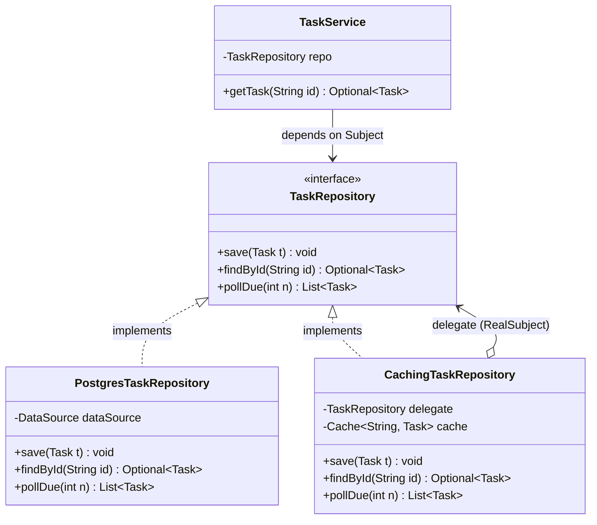
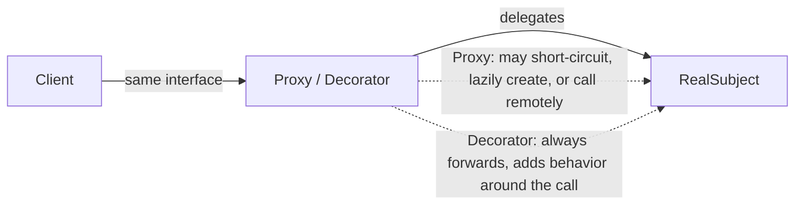

# Proxy

> Where this fits in the project: a Proxy is a stand-in object that controls access to a real object. In our Task Queue platform we use proxies to add caching in front of `TaskRepository`, to make a remote worker node look like a local object, and to enforce rate limits on `TaskQueue.enqueue` — all *without changing the callers or the real implementations*.

---

## 1. The real problem in our Task Queue project

By Phase 2 our platform persists tasks in PostgreSQL behind a `TaskRepository`. The hot path looks like this:

```java
public interface TaskRepository {
    void save(Task t);
    Optional<Task> findById(String id);
    List<Task> pollDue(int n);
}
```

Three problems surface in production:

1. **`findById` is hammered.** A status-polling dashboard calls `GET /tasks/{id}` thousands of times per second for a small set of "in-flight" tasks. Each call is a database round trip even though the row barely changes. We want a **cache** in front of the repository — but we do not want to pollute every controller and service with cache logic.

2. **A worker node lives on another machine.** In Phase 4 a `Worker` on node A needs to ask node B "are you healthy / how loaded are you?". We want node A's code to call `workerNode.dispatch(task)` as if `workerNode` were a local object, while behind the scenes it does an HTTP/gRPC call, serializes the `Task`, and handles timeouts.

3. **`enqueue` must be rate limited.** A misbehaving client floods the submission API. We want to throttle calls to `TaskQueue.enqueue` to protect downstream workers — again, without rewriting the queue or every caller.

All three are the *same shape of problem*: **we want to interpose behavior on the way to a real object, while keeping the real object's interface.** That is the Proxy pattern.

---

## 2. The naive version and its limitations

Suppose we want caching. The naive instinct is to bolt the cache straight into the service that uses the repository:

```java
public class TaskService {
    private final TaskRepository repo;        // the real Postgres-backed repo
    private final Map<String, Task> cache = new ConcurrentHashMap<>();

    public TaskService(TaskRepository repo) {
        this.repo = repo;
    }

    public Optional<Task> getTask(String id) {
        Task cached = cache.get(id);
        if (cached != null) {
            return Optional.of(cached);          // cache hit
        }
        Optional<Task> fromDb = repo.findById(id);
        fromDb.ifPresent(t -> cache.put(id, t)); // populate cache
        return fromDb;
    }

    public void updateTask(Task t) {
        repo.save(t);
        cache.put(t.id(), t);                    // keep cache coherent
    }
}
```

What is wrong with this?

- **Caching leaks into business logic.** `TaskService` now has two jobs: orchestrate task logic *and* manage a cache. That violates single responsibility (see [../04-oop-and-ood/cohesion.md](../04-oop-and-ood/cohesion.md)).
- **It does not compose.** A second service (`SchedulerService`, `MetricsService`) that also reads tasks gets its own private cache. Now we have N incoherent caches and stale reads across them.
- **Callers must know.** Anyone wanting cached reads must go through `TaskService.getTask`, not `repo.findById`. The `TaskRepository` abstraction no longer means what it says.
- **Untestable in isolation.** You cannot test "is caching correct?" without dragging in the whole service.

The fix: keep the *interface* `TaskRepository`, and slip a caching object **of the same type** between the caller and the real repository.

---

## 3. Pattern intent, motivation, problem, participants

> **Intent (GoF):** Provide a surrogate or placeholder for another object to control access to it.

**Motivation.** Sometimes you do not want a client to talk to an object directly. You want to delay its creation (it is expensive), or it lives elsewhere (remote), or access must be guarded (security, rate limit), or you want to cache/log/meter the calls. A proxy implements the *same interface* as the real object, so the client cannot tell the difference, and forwards (some) calls to the real object after doing extra work.

**Problem statement.** *How do you control access to an object — to add laziness, remoting, protection, caching, or metering — without changing the object's class and without changing its clients?*

**Common flavors:**

| Flavor | Controls | Example in our project |
|---|---|---|
| **Virtual / lazy proxy** | *when* the real object is created | Defer building an expensive `TaskHandler` (e.g. one that opens a DB pool) until the first task of that type arrives |
| **Remote proxy** | *where* the object lives | A local stand-in for a `WorkerNode` on another machine |
| **Protection proxy** | *who/how much* can call | A rate-limiting proxy for `TaskQueue.enqueue`; an auth proxy on the admin API |
| **Caching proxy** | *redundant* calls | A caching `TaskRepository` in front of Postgres |
| **Smart reference** | side effects on access | Reference counting, logging, lock acquisition, metrics |

**Participants:**

- **Subject** — the interface shared by the real object and the proxy. In our case `TaskRepository`, `TaskQueue`, or `WorkerNode`.
- **RealSubject** — the actual object doing the real work (`PostgresTaskRepository`).
- **Proxy** — holds a reference to a `RealSubject`, implements `Subject`, and controls access (cache, throttle, remote call) before/after delegating.
- **Client** — depends only on `Subject`; unaware it holds a proxy.

---

## 4. UML class diagram



The client (`TaskService`) sees only `TaskRepository`. The `CachingTaskRepository` *is-a* `TaskRepository` and *has-a* `TaskRepository`. Swapping cache on/off is a wiring decision, invisible to the client.

---

## 5. Refactoring the naive code into a Proxy

Pull caching out of `TaskService` and into a proxy that implements `TaskRepository`.

```java
import com.github.benmanes.caffeine.cache.Cache;
import com.github.benmanes.caffeine.cache.Caffeine;
import java.time.Duration;
import java.util.List;
import java.util.Optional;

/**
 * Caching proxy for TaskRepository.
 * Same interface as the real repo; the client never knows a cache exists.
 */
public final class CachingTaskRepository implements TaskRepository {

    private final TaskRepository delegate;          // RealSubject
    private final Cache<String, Task> cache;

    public CachingTaskRepository(TaskRepository delegate) {
        this.delegate = delegate;
        this.cache = Caffeine.newBuilder()
                .maximumSize(50_000)
                .expireAfterWrite(Duration.ofSeconds(30)) // bound staleness
                .build();
    }

    @Override
    public Optional<Task> findById(String id) {
        Task hit = cache.getIfPresent(id);
        if (hit != null) {
            return Optional.of(hit);                // served without touching Postgres
        }
        Optional<Task> loaded = delegate.findById(id);
        loaded.ifPresent(t -> cache.put(id, t));
        return loaded;
    }

    @Override
    public void save(Task t) {
        delegate.save(t);                           // write-through
        cache.put(t.id(), t);                       // keep the cached copy coherent
    }

    @Override
    public List<Task> pollDue(int n) {
        // Intentionally NOT cached: pollDue must always see fresh due-tasks,
        // and it mutates which rows are "claimed". A correct proxy knows
        // which operations are safe to cache.
        return delegate.pollDue(n);
    }
}
```

Now `TaskService` shrinks back to its real job:

```java
public class TaskService {
    private final TaskRepository repo;   // could be plain Postgres OR a caching proxy

    public TaskService(TaskRepository repo) {
        this.repo = repo;
    }

    public Optional<Task> getTask(String id) {
        return repo.findById(id);        // caching, if any, is invisible here
    }

    public void updateTask(Task t) {
        repo.save(t);
    }
}
```

Wiring decides whether caching is on:

```java
TaskRepository real    = new PostgresTaskRepository(dataSource);
TaskRepository cached  = new CachingTaskRepository(real);   // wrap once
TaskService service    = new TaskService(cached);           // client gets the proxy
```

This is dependency injection doing its job — see [../04-oop-and-ood/dependency-injection.md](../04-oop-and-ood/dependency-injection.md). The composition root chooses the proxy; nothing downstream notices.

---

## 6. Before and after

| Aspect | Naive (cache in service) | Proxy |
|---|---|---|
| Where caching lives | Tangled into `TaskService` | Isolated in `CachingTaskRepository` |
| Reuse across callers | Each service caches separately | One proxy shared by all callers |
| Caller awareness | Callers must use the special method | Callers use `TaskRepository` as-is |
| Turn caching off | Edit service code | Change one wiring line |
| Testability | Need whole service | Unit-test the proxy alone |
| Coherence | N incoherent caches | One write-through cache |

The interface is the contract; the proxy honors it while changing *how* access happens.

---

## 7. A simple Java example: a lazy (virtual) proxy

The classic textbook proxy: defer creating an expensive object until first use. Here a `TaskHandler` that needs a costly resource (say a pooled HTTP client) is only built when the first matching task runs.

```java
import java.util.function.Supplier;

/** Lazy proxy: builds the real handler on first handle() call, then memoizes it. */
public final class LazyTaskHandler implements TaskHandler {

    private final Supplier<TaskHandler> factory;
    private volatile TaskHandler real;   // null until first use

    public LazyTaskHandler(Supplier<TaskHandler> factory) {
        this.factory = factory;
    }

    @Override
    public TaskResult handle(Task task) throws Exception {
        TaskHandler h = real;
        if (h == null) {                          // double-checked locking
            synchronized (this) {
                h = real;
                if (h == null) {
                    h = factory.get();            // expensive construction happens here
                    real = h;
                }
            }
        }
        return h.handle(task);
    }
}

// usage: the pool is never opened if no email task ever arrives
TaskHandler emailHandler = new LazyTaskHandler(() -> {
    var pool = HttpClientPool.open(20);           // expensive
    return task -> new TaskResult(true, "emailed via " + pool, false);
});
```

> Why this matters: starting 40 handler types eagerly might open 40 connection pools at boot. The lazy proxy turns "pay at startup" into "pay on first use", spreading and sometimes avoiding the cost. `TaskHandler` is a functional interface, so the real handler can even be a lambda.

---

## 8. A real-world Java example: JDK dynamic proxies and AOP

You do not always hand-write a proxy class per interface. The JDK ships a runtime proxy generator (`java.lang.reflect.Proxy`) that builds a proxy for *any* interface at runtime. This is the engine behind Spring AOP, `@Transactional`, `@Cacheable`, and Mockito.

Here is a generic logging/timing proxy that works for *any* interface:

```java
import java.lang.reflect.InvocationHandler;
import java.lang.reflect.Method;
import java.lang.reflect.Proxy;

public final class TimingProxy {

    /** Returns a proxy of type T that times every method call on `target`. */
    @SuppressWarnings("unchecked")
    public static <T> T wrap(T target, Class<T> iface) {
        InvocationHandler handler = (proxy, method, args) -> {
            long start = System.nanoTime();
            try {
                return method.invoke(target, args);   // delegate to real object
            } finally {
                long micros = (System.nanoTime() - start) / 1_000;
                System.out.printf("%s.%s took %d us%n",
                        iface.getSimpleName(), method.getName(), micros);
            }
        };
        return (T) Proxy.newProxyInstance(
                iface.getClassLoader(),
                new Class<?>[]{ iface },
                handler);
    }
}

// usage — note: TimingProxy never knew about TaskRepository
TaskRepository real   = new PostgresTaskRepository(dataSource);
TaskRepository timed  = TimingProxy.wrap(real, TaskRepository.class);
timed.findById("abc");   // prints: TaskRepository.findById took 812 us
```

**How Spring uses this.** When you annotate a bean method with `@Transactional` or `@Cacheable`, Spring wraps the bean in a proxy. JDK dynamic proxies are used when the bean implements an interface; CGLIB subclass proxies are used otherwise. The proxy's `InvocationHandler` runs the cross-cutting logic (open transaction, check cache) and then delegates.

```java
@Service
public class TaskService {

    @Cacheable("tasks")              // Spring wraps this bean in a caching proxy
    public Optional<Task> getTask(String id) {
        return repo.findById(id);    // body only runs on a cache miss
    }
}
```

> Gotcha worth memorizing: because the proxy wraps the bean from *outside*, a `this.getTask(id)` self-invocation bypasses the proxy and the annotation does nothing. Self-invocation is the number-one "why isn't `@Transactional` working?" bug.

---

## 9. Project-integration examples (canonical model)

### 9a. Protection proxy — rate-limiting `TaskQueue.enqueue`

We want to throttle submissions without touching `InMemoryTaskQueue` or any caller. The proxy implements `TaskQueue` and consults a `RateLimiter` (a `TokenBucketRateLimiter`, covered in [../08-distributed-systems/rate-limiting.md](../08-distributed-systems/rate-limiting.md)).

```java
/** Protection proxy: drops/blocks enqueue calls that exceed the rate limit. */
public final class RateLimitedTaskQueue implements TaskQueue {

    private final TaskQueue delegate;       // RealSubject (e.g. InMemoryTaskQueue)
    private final RateLimiter limiter;      // TokenBucketRateLimiter

    public RateLimitedTaskQueue(TaskQueue delegate, RateLimiter limiter) {
        this.delegate = delegate;
        this.limiter = limiter;
    }

    @Override
    public void enqueue(Task t) {
        if (!limiter.tryAcquire()) {
            throw new RateLimitExceededException(
                "enqueue rejected for task " + t.id() + " (rate limit)");
        }
        delegate.enqueue(t);
    }

    @Override
    public Task dequeue() throws InterruptedException {
        return delegate.dequeue();          // reads are not throttled
    }

    @Override
    public int size() {
        return delegate.size();
    }
}

class RateLimitExceededException extends RuntimeException {
    RateLimitExceededException(String msg) { super(msg); }
}
```

Wiring — the `Worker` and `WorkerPool` never change:

```java
TaskQueue base    = new InMemoryTaskQueue();   // backed by a BlockingQueue
RateLimiter rl    = new TokenBucketRateLimiter(/* capacity */ 1000, /* refillPerSec */ 500);
TaskQueue queue   = new RateLimitedTaskQueue(base, rl);
// every component downstream just sees a TaskQueue
```

The `InMemoryTaskQueue` is the [blocking-queue](../06-concurrency/blocking-queue.md)-backed real subject; the proxy never has to know that.

### 9b. Remote proxy — a worker node on another machine

In Phase 4 a coordinator dispatches tasks to worker nodes over the network. The `WorkerNode` interface is the Subject; `RemoteWorkerNode` is the proxy that hides serialization, HTTP, and timeouts.

```java
import com.fasterxml.jackson.databind.ObjectMapper;
import java.io.IOException;
import java.net.URI;
import java.net.http.HttpClient;
import java.net.http.HttpRequest;
import java.net.http.HttpResponse;
import java.time.Duration;

public interface WorkerNode {
    boolean dispatch(Task task);   // accept a task for execution
    int load();                    // how many tasks currently running
}

/** Remote proxy: a local stand-in for a worker node on host:port. */
public final class RemoteWorkerNode implements WorkerNode {

    private final HttpClient http;
    private final URI base;
    private final ObjectMapper json;          // Jackson, for Task <-> JSON

    public RemoteWorkerNode(String host, int port) {
        this.http = HttpClient.newBuilder()
                .connectTimeout(Duration.ofSeconds(2))
                .build();
        this.base = URI.create("http://" + host + ":" + port);
        this.json = new ObjectMapper().findAndRegisterModules();
    }

    @Override
    public boolean dispatch(Task task) {
        try {
            String body = json.writeValueAsString(task);   // marshal the Task
            HttpRequest req = HttpRequest.newBuilder(base.resolve("/dispatch"))
                    .timeout(Duration.ofSeconds(5))
                    .header("Content-Type", "application/json")
                    .POST(HttpRequest.BodyPublishers.ofString(body))
                    .build();
            HttpResponse<Void> resp = http.send(req, HttpResponse.BodyHandlers.discarding());
            return resp.statusCode() == 202;                // 202 Accepted
        } catch (IOException e) {
            return false;                                   // remote failure -> not dispatched
        } catch (InterruptedException e) {
            Thread.currentThread().interrupt();
            return false;
        }
    }

    @Override
    public int load() {
        try {
            HttpRequest req = HttpRequest.newBuilder(base.resolve("/load"))
                    .timeout(Duration.ofSeconds(2)).GET().build();
            HttpResponse<String> resp = http.send(req, HttpResponse.BodyHandlers.ofString());
            return Integer.parseInt(resp.body().trim());
        } catch (Exception e) {
            return Integer.MAX_VALUE;     // treat unreachable node as fully loaded
        }
    }
}
```

The coordinator picks the least-loaded node and dispatches — caring only about the `WorkerNode` interface:

```java
WorkerNode best = nodes.stream()
        .min(Comparator.comparingInt(WorkerNode::load))   // could be local or remote
        .orElseThrow();
if (!best.dispatch(task)) {
    deadLetterQueue.send(task, "no node accepted the task");
}
```

> The remote proxy is where Proxy earns its GoF stripes: it makes a network call look like a method call. RMI, gRPC stubs, and Feign clients are all generated remote proxies.

### 9c. Stacking proxies

Because every proxy *is* a `TaskRepository`, you can stack them — order matters:

```java
TaskRepository repo =
    new MetricsTaskRepository(            // outermost: count + time everything
        new CachingTaskRepository(        // then: serve hits without DB
            new RetryingTaskRepository(   // then: retry transient DB errors
                new PostgresTaskRepository(dataSource))));  // innermost: real work
```

Each layer adds one concern (metrics, cache, retry) and forwards the rest. This is the same composition idea as [decorator.md](decorator.md) — discussed next.

---

## 10. Proxy vs Decorator

These two patterns look identical structurally — both implement an interface and wrap a same-typed object. The difference is **intent**, not shape.

| | **Proxy** | **Decorator** |
|---|---|---|
| Purpose | **Control access** to one specific object | **Add responsibilities/behavior** to an object |
| Who creates the wrapped object | Often the proxy itself (it *owns* lifecycle: lazy creation, remote endpoint) | The client passes the wrapped object in |
| How many wrappers | Usually one proxy per real object | Designed to be stacked freely |
| Relationship to subject | Same interface; proxy may *prevent* calls reaching the subject | Same interface; decorator *always* forwards, adding around it |
| Typical names | `CachingX`, `RemoteX`, `RateLimitedX`, `SecureX` | `BufferedInputStream`, `CompressingX`, `EncodingX` |
| Awareness of subject identity | Knows exactly which subject it stands for | Generic; wraps any conforming object |

Rule of thumb: if you are **standing in for** something (it might not even be created yet, or lives elsewhere, or you guard who reaches it), it is a Proxy. If you are **enhancing** something that already exists and you expect to layer many enhancements, it is a Decorator. In real code the line blurs — a `CachingTaskRepository` is a proxy by intent (controlling redundant access) but is implemented exactly like a decorator. Use the name that communicates *why*.



---

## 11. Production notes

**Where it shows up in industry**

- **Spring AOP** — `@Transactional`, `@Cacheable`, `@Async`, `@Retryable`, `@PreAuthorize` are all proxy-based.
- **Hibernate/JPA lazy loading** — `order.getItems()` returns a proxy collection; the SQL fires on first access (a virtual proxy).
- **gRPC / RMI / Feign / Thrift** — generated client stubs are remote proxies.
- **Service meshes (Envoy, Istio sidecars)** — process-level proxies adding retries, mTLS, rate limiting, and tracing to *every* call.
- **Mockito** — `mock(TaskRepository.class)` is a dynamic proxy that records and stubs calls.
- **API gateways / CDNs** — caching + protection proxies at the edge.

**When NOT to use a proxy**

- The added concern belongs *in* the object (it is core behavior, not cross-cutting). Do not proxy to hide bad cohesion.
- You only have one caller and one call site — a plain method call with the logic inline is clearer than a class.
- Latency budget is razor thin and the proxy adds reflection (JDK dynamic proxies) on the hottest path — prefer a hand-written proxy or no proxy.
- You need to wrap a concrete class with no interface *and* you cannot use CGLIB/subclassing (e.g. it is `final`).

**Common anti-patterns**

- **Leaky proxy:** the proxy exposes methods the subject does not, breaking substitutability (Liskov). Keep the interface identical.
- **Caching without invalidation:** a caching proxy that never expires or never write-throughs silently serves stale tasks. Always bound staleness and invalidate on `save`.
- **Swallowing remote failures:** a remote proxy that returns a fake "success" on timeout hides outages. Fail loud or route to the [DLQ](../07-queues-and-messaging/dead-letter-queues.md).
- **Hidden cost:** callers assume `findById` is cheap because the interface looks local; a remote proxy makes it a network call. Document timeouts and failure modes.
- **Self-invocation bypass** (Spring): calling another proxied method via `this` skips the proxy entirely.

---

## 12. Exercises

### Easy

**E1 (knowledge check).** Name the four participants of the Proxy pattern and give the concrete class from our project that plays each role in the caching example.

**E2 (pattern identification).** For each, say which proxy flavor it is — virtual/lazy, remote, protection, caching, or smart-reference:
1. Hibernate returning a placeholder for `task.getHandlerConfig()` that loads on first access.
2. `RateLimitedTaskQueue` rejecting `enqueue` over the limit.
3. A `RemoteWorkerNode` doing an HTTP POST inside `dispatch`.
4. A wrapper that increments a Micrometer counter on every `findById`.

### Medium

**M1 (coding).** Implement a `MetricsTaskRepository` proxy that wraps any `TaskRepository`, increments a counter `repo.findById.calls` and records a timer `repo.findById.latency` using a `MeterRegistry`, then delegates. It must not change behavior.

**M2 (refactoring).** You are given a `WorkerNode` whose `dispatch` does a raw network call with no timeout and rethrows checked exceptions, leaking infrastructure concerns to callers. Refactor it behind a remote proxy that bounds the call with a timeout and returns `false` on failure.

### Hard

**H1 (design + coding).** Build a `LazyConnectionTaskRepository`: a virtual proxy that does not open the JDBC `DataSource` until the first repository call, is thread-safe, and never opens the connection twice. Then explain one downside of laziness here.

**H2 (interview-style).** Spring's `@Cacheable` on a `public` method works, but adding `@Cacheable` to a `private` method or calling the method via `this.method()` does nothing. Explain precisely why, in terms of how the proxy is created and invoked, and give two ways to make the call go through the proxy.

---

## 13. Solutions

**E1.** Subject = `TaskRepository` (the interface). RealSubject = `PostgresTaskRepository`. Proxy = `CachingTaskRepository`. Client = `TaskService` (depends only on `TaskRepository`).

**E2.** 1 = virtual/lazy. 2 = protection. 3 = remote. 4 = smart-reference (a metering smart reference).

**M1.**

```java
import io.micrometer.core.instrument.MeterRegistry;
import io.micrometer.core.instrument.Timer;
import java.util.List;
import java.util.Optional;

public final class MetricsTaskRepository implements TaskRepository {

    private final TaskRepository delegate;
    private final MeterRegistry registry;

    public MetricsTaskRepository(TaskRepository delegate, MeterRegistry registry) {
        this.delegate = delegate;
        this.registry = registry;
    }

    @Override
    public Optional<Task> findById(String id) {
        registry.counter("repo.findById.calls").increment();
        Timer.Sample sample = Timer.start(registry);
        try {
            return delegate.findById(id);
        } finally {
            sample.stop(registry.timer("repo.findById.latency"));
        }
    }

    @Override
    public void save(Task t) {
        registry.counter("repo.save.calls").increment();
        delegate.save(t);
    }

    @Override
    public List<Task> pollDue(int n) {
        return delegate.pollDue(n);
    }
}
```

The proxy is behavior-preserving: it only observes. Stack it outside the caching proxy so it measures real traffic, not cache-filtered traffic.

**M2.** Bad version leaks `IOException` and can hang forever:

```java
// BAD
public boolean dispatch(Task t) throws IOException {
    var conn = (HttpURLConnection) new URL(endpoint).openConnection();
    conn.setRequestMethod("POST");
    // no timeout: a dead node hangs this thread indefinitely
    return conn.getResponseCode() == 202;
}
```

Refactored remote proxy bounds and contains failure:

```java
// GOOD — remote proxy
public final class RemoteWorkerNode implements WorkerNode {
    private final HttpClient http = HttpClient.newBuilder()
            .connectTimeout(Duration.ofSeconds(2)).build();
    private final URI dispatchUri;

    public RemoteWorkerNode(String host, int port) {
        this.dispatchUri = URI.create("http://" + host + ":" + port + "/dispatch");
    }

    @Override
    public boolean dispatch(Task t) {
        try {
            HttpRequest req = HttpRequest.newBuilder(dispatchUri)
                    .timeout(Duration.ofSeconds(5))     // bounded
                    .POST(HttpRequest.BodyPublishers.ofString(t.id()))
                    .build();
            return http.send(req, HttpResponse.BodyHandlers.discarding())
                       .statusCode() == 202;
        } catch (IOException e) {
            return false;                               // contained
        } catch (InterruptedException e) {
            Thread.currentThread().interrupt();
            return false;
        }
    }

    @Override public int load() { return 0; }
}
```

Callers now see a clean `boolean`; the timeout and exception handling are the proxy's job, not theirs.

**H1.**

```java
import javax.sql.DataSource;
import java.util.List;
import java.util.Optional;
import java.util.function.Supplier;

public final class LazyConnectionTaskRepository implements TaskRepository {

    private final Supplier<DataSource> dataSourceFactory;
    private volatile TaskRepository real;   // null until first use

    public LazyConnectionTaskRepository(Supplier<DataSource> dataSourceFactory) {
        this.dataSourceFactory = dataSourceFactory;
    }

    private TaskRepository real() {
        TaskRepository r = real;
        if (r == null) {                            // double-checked locking
            synchronized (this) {
                r = real;
                if (r == null) {
                    DataSource ds = dataSourceFactory.get();  // opens pool here, once
                    r = new PostgresTaskRepository(ds);
                    real = r;
                }
            }
        }
        return r;
    }

    @Override public void save(Task t)                  { real().save(t); }
    @Override public Optional<Task> findById(String id) { return real().findById(id); }
    @Override public List<Task> pollDue(int n)          { return real().pollDue(n); }
}
```

`volatile` + double-checked locking guarantees the pool opens exactly once even under concurrent first calls. **Downside:** the cost moves to request time. The first user after boot pays the connection-pool warm-up latency (a cold-start spike), and a configuration error (bad DB URL) is discovered at first request instead of at startup, which can let a broken node pass health checks until traffic hits it.

**H2.** Spring creates the proxy *around* the bean: the container stores a proxy object in the context, and only calls that go *through that proxy reference* run the advice (cache lookup, transaction). (1) `private` methods cannot be proxied — a JDK dynamic proxy only sees interface methods, and even a CGLIB subclass cannot override a `private` method, so `@Cacheable` on a private method is silently ignored. (2) `this.method()` is an internal call dispatched directly on the target instance, never on the proxy, so the advice never runs. Two fixes: **(a)** move the cached method into a separate bean and inject it, so calls cross the proxy boundary; or **(b)** inject a self-reference (`@Autowired` the bean into itself, or `AopContext.currentProxy()`) and invoke through that proxy reference.

---

## 14. Interview questions and takeaways

1. **What problem does Proxy solve, in one sentence?**
   It controls access to an object (laziness, remoting, protection, caching, metering) without changing the object or its clients, by sharing the object's interface.

2. **Proxy vs Decorator — how do you tell them apart?**
   Same structure; different intent. Proxy *controls access* (and often owns the subject's lifecycle/location and may short-circuit calls); Decorator *adds behavior* and is meant to be stacked. Use the name that conveys why.

3. **What is a JDK dynamic proxy and when can you not use one?**
   A runtime-generated proxy from `java.lang.reflect.Proxy` that implements interfaces and routes calls through an `InvocationHandler`. It only works for *interfaces*; to proxy a concrete class you need subclass-based proxying (CGLIB/ByteBuddy), which fails on `final` classes/methods.

4. **Why doesn't `@Transactional`/`@Cacheable` work on self-invocation?**
   The advice lives on the external proxy; an internal `this.x()` call bypasses the proxy and hits the raw target, so no advice runs.

5. **How does a caching proxy stay coherent?**
   Bound staleness (TTL/size), write-through or invalidate on mutating calls (`save`), and do not cache operations that must see fresh state or that mutate (like `pollDue`).

6. **Give a remote proxy from real systems.**
   gRPC/RMI/Feign stubs: a local object whose methods serialize args, do a network call, and deserialize the result — making remote calls look local. The risk is that callers assume local-call cost.

7. **What is a virtual proxy good and bad at?**
   Good: defers/avoids expensive construction (Hibernate lazy loading, connection pools). Bad: moves cost and failure to first-use, causing cold-start latency and late error discovery.

**Takeaways:** A proxy is a same-typed stand-in that interposes on access. Pick the flavor by what you are controlling — *when* (virtual), *where* (remote), *who/how much* (protection), or *redundancy* (caching). Keep the interface identical so clients stay oblivious, and be honest about hidden cost and failure.

---

## 15. Production considerations

- **Caching proxy correctness is the hard part, not the code.** Decide TTL and max size from real cardinality; for our dashboard, a 30s TTL over the in-flight set is plenty. Emit cache hit-ratio as a metric — a low ratio means the proxy is pure overhead. Always write-through or invalidate on `save` so a status change is never masked by a stale cached `Task`.
- **Remote proxies need every distributed-systems safeguard.** Bound connect *and* request timeouts, add retries with backoff for transient failures, and protect with a circuit breaker (Resilience4j) so a dead node does not stall the coordinator. Treat unreachable as "fully loaded / not accepted" and route to the DLQ rather than faking success.
- **Watch for proxy explosion.** Stacking metrics + cache + retry + circuit-breaker proxies is clean, but each adds a frame and (for dynamic proxies) reflection cost. On the hottest path, measure; collapse layers or hand-write a proxy if the per-call overhead matters.
- **Observability.** Tag metrics so you can tell the proxy layer from the real subject (e.g. `layer=cache` vs `layer=postgres`). When latency spikes, you must know whether it is the DB or the proxy.
- **Thread safety.** Virtual proxies (`volatile` + double-checked locking) and caching proxies (use a concurrent cache like Caffeine) must be safe under the worker pool's concurrency; a non-thread-safe cache here causes data races, not just slowness.

---

## What We Can Improve In Our Project Using This Concept

- Wrap `PostgresTaskRepository` in a `CachingTaskRepository` to absorb the dashboard's hot `findById` reads, cutting DB load on the status-polling path.
- Put a `RateLimitedTaskQueue` protection proxy in front of `InMemoryTaskQueue`/`PostgresTaskQueue` so a noisy client cannot overwhelm the worker pool, returning a clean 429 from `TaskController`.
- Introduce a `RemoteWorkerNode` remote proxy so the Phase 4 coordinator can treat local and remote workers uniformly behind one `WorkerNode` interface.
- Add a behavior-preserving `MetricsTaskRepository` so repository latency/throughput show up in Micrometer/Prometheus without touching the SQL code.

## Project Refactoring Task

1. Define no new domain interfaces — reuse `TaskRepository` and `TaskQueue` exactly.
2. Add `CachingTaskRepository`, `MetricsTaskRepository`, and `RateLimitedTaskQueue` proxies, each implementing the existing interface and holding a same-typed `delegate`.
3. Change only the composition root (the wiring/`@Configuration`): build `new MetricsTaskRepository(new CachingTaskRepository(new PostgresTaskRepository(ds)))` and inject that.
4. Confirm `TaskService`, `Worker`, and `WorkerPool` compile **unchanged** — proof the proxy is transparent.
5. Add unit tests: cache hit avoids the delegate (`verify(delegate, times(1)).findById(...)`), `save` invalidates/updates the cache, and over-limit `enqueue` throws `RateLimitExceededException`.

## Git Commit For This Chapter

```text
feat(repo,queue): add caching, metrics, and rate-limiting proxies

Introduce Proxy-pattern wrappers around the existing TaskRepository and
TaskQueue interfaces. CachingTaskRepository fronts Postgres with a
write-through Caffeine cache; MetricsTaskRepository records Micrometer
counters/timers; RateLimitedTaskQueue enforces a TokenBucket limit on
enqueue. Wiring changes only in the composition root; callers untouched.

Files touched:
  05-design-patterns/proxy.md                                (chapter)
  src/main/java/queue/repo/CachingTaskRepository.java
  src/main/java/queue/repo/MetricsTaskRepository.java
  src/main/java/queue/queue/RateLimitedTaskQueue.java
  src/main/java/queue/queue/RateLimitExceededException.java
  src/main/java/queue/config/PlatformConfig.java             (wiring)
  src/test/java/queue/repo/CachingTaskRepositoryTest.java
  src/test/java/queue/queue/RateLimitedTaskQueueTest.java
```

## Architecture Impact

- Adds a **transparent interception layer** between callers and real subjects without new abstractions — proxies share the existing interfaces, so coupling does not grow.
- Concentrates cross-cutting concerns (cache, metrics, throttling) at composition time, keeping core services cohesive (supports the layered/hexagonal boundaries in [../04-oop-and-ood/hexagonal-architecture.md](../04-oop-and-ood/hexagonal-architecture.md)).
- Enables Phase 4 horizontal scaling: the remote proxy lets the coordinator address remote workers through the same `WorkerNode` interface used for local ones.
- Caching introduces a **staleness window** the team must reason about; metrics and rate-limiting add a small fixed per-call overhead. These are explicit, localized tradeoffs.

## Interview Takeaways

- Proxy = same interface, controlled access; differs from [decorator.md](decorator.md) by *intent*, not structure.
- Flavors map to a question: *when* (virtual), *where* (remote), *who/how much* (protection), *redundant calls* (caching).
- JDK dynamic proxies (interfaces) and CGLIB (subclasses) power Spring AOP, `@Transactional`, `@Cacheable`, and Mockito — and explain the self-invocation gotcha.
- Keep the interface identical (Liskov), bound cache staleness, and never let a remote proxy fake success on failure — route to the [DLQ](../07-queues-and-messaging/dead-letter-queues.md) instead.
