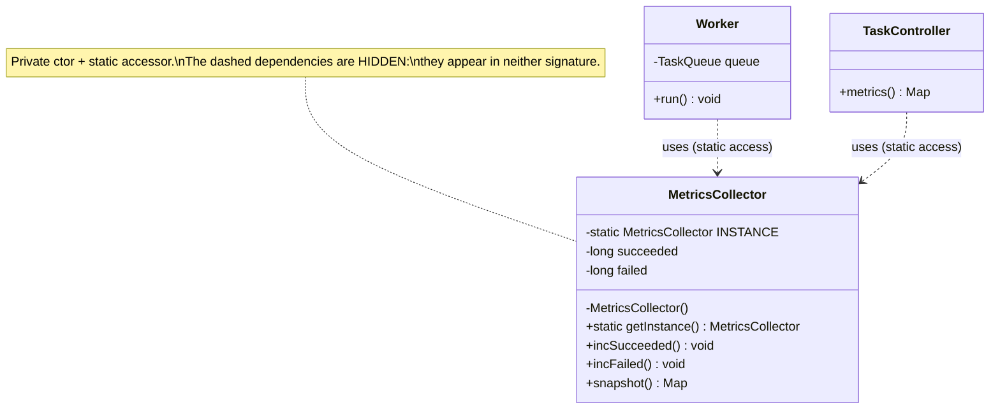

# Singleton

> Where this fits in the project: our Task Queue platform needs exactly one `MetricsCollector` aggregating counters across every `Worker`, and exactly one immutable `AppConfig`. Singleton is the pattern that promises "exactly one instance" — and the pattern most likely to quietly wreck your test suite and your concurrency. This chapter teaches the safe forms, and, more importantly, *when to delete it in favor of dependency injection*.

---

## 1. Why this exists — the real problem

Open Phase 1 of the project. We have a `WorkerPool` running N `Worker` instances. Each worker executes tasks and needs to record outcomes: tasks succeeded, tasks failed, tasks retried, execution latency. Later (Phase 3) these become Micrometer counters scraped by Prometheus. For now, picture a hand-rolled `MetricsCollector`.

The requirement that *forces* the pattern: **every worker must increment the same counters**. If each `Worker` constructs its own `MetricsCollector`, then `GET /metrics` reports one worker's numbers, not the platform's. The metrics are split across N objects and meaningless. We need a *single shared instance* reachable from code that does not own a reference to it.

The same shape appears for configuration. The `maxAttempts` default, the queue capacity, the rate-limit refill rate — these are read in dozens of places. Reading a config file or environment twice and getting two different snapshots is a class of bug nobody wants. One parsed, immutable `AppConfig`, shared everywhere.

> Historical note: Singleton is one of the original Gang of Four (1994) creational patterns. It predates dependency-injection containers (Spring arrived ~2003). In 1994, "how do I get one shared instance?" had no framework answer, so the pattern baked the lifecycle into the class itself. That coupling is exactly why modern code prefers DI — but you must understand classic Singleton to recognize it, fix it, and pass interviews.

**Intent (GoF):** Ensure a class has only one instance, and provide a global point of access to it.

That sentence hides two responsibilities glued together:
1. **Uniqueness** — only one instance can exist.
2. **Global access** — anyone can reach it without being handed a reference.

Responsibility (2) is the seed of the anti-pattern. Hold that thought.

---

## 2. The naive version — and why it bites

The textbook first cut: a private static field, a private constructor, a public accessor.

```java
public final class MetricsCollector {

    // Eagerly created when the class loads.
    private static final MetricsCollector INSTANCE = new MetricsCollector();

    private long succeeded;   // mutable, NOT thread-safe
    private long failed;
    private long retried;

    private MetricsCollector() { }            // no one else can construct

    public static MetricsCollector getInstance() {
        return INSTANCE;
    }

    public void incSucceeded() { succeeded++; }   // read-modify-write: a data race
    public void incFailed()    { failed++; }
    public void incRetried()   { retried++; }

    public long succeeded() { return succeeded; }
    public long failed()    { return failed; }
}
```

Usage from a worker:

```java
MetricsCollector.getInstance().incSucceeded();
```

This "works" in a single-threaded demo. In our project it has four real defects:

1. **Not thread-safe.** `succeeded++` is read-modify-write. With multiple `Worker` threads (the whole point of a `WorkerPool`), increments are lost. Counters under-report under load — the exact moment metrics matter.
2. **Untestable.** A unit test cannot inject a fake collector. Worse, the static field carries state *between tests*. Test A increments `succeeded`; test B reads a dirty value. Tests pass alone, fail in suite, and order-dependently. This is the single most common reason senior engineers ban Singletons.
3. **Hidden dependency.** A method calling `MetricsCollector.getInstance()` declares nothing in its signature. You cannot tell, from the API, that it touches global state. Coupling becomes invisible — see [coupling](../04-oop-and-ood/coupling.md).
4. **Eager init regardless of use.** The instance is built at class-load time. Fine for a cheap counter; wrong if construction is expensive (opens a connection, reads a file) and the dependency is sometimes unused.

We'll fix thread-safety and laziness with proper idioms (sections 5–6), then argue that for *this* project the real fix is DI (section 8).

---

## 3. Pattern: Intent, Motivation, Problem, Participants

**Motivation.** Some resources are intrinsically singular: a metrics registry, a connection pool, a parsed config, a thread-pool-backed scheduler. Creating two would be incorrect (double-counted metrics) or wasteful (two pools). The class itself enforces the cardinality so callers cannot get it wrong.

**Problem statement.** You must guarantee at most one instance of a type per JVM (or per relevant scope), control its creation precisely (lazy vs eager, thread-safe), and make it reachable without threading a reference through every constructor.

**Participants:**
- **Singleton** — the class that controls its own sole instance, hides the constructor, and exposes a static accessor.
- **Client** — code that calls the static accessor instead of constructing the object.

Two participants only. That sparseness is a clue: Singleton is structurally trivial; its difficulty is entirely in *lifecycle*, *concurrency*, and *consequences*.

---

## 4. UML class diagram



The dashed dependencies say it all: both `Worker` and `TaskController` depend on `MetricsCollector`, but nothing in their constructors records that. With DI those arrows become solid composition relationships visible in the constructor.

---

## 5. Refactor toward a better design — the safe idioms

### Idiom A: Enum singleton (the simplest correct one)

Josh Bloch, *Effective Java* Item 3: "a single-element enum type is the best way to implement a singleton." The JVM guarantees exactly one instance, lazily and thread-safely on class init, and it's serialization-safe and reflection-safe for free.

```java
public enum Config {
    INSTANCE;

    private final int maxAttempts;
    private final int queueCapacity;
    private final Duration defaultRetryDelay;

    Config() {
        // Read once, at first access of Config.INSTANCE.
        this.maxAttempts       = Integer.getInteger("tq.maxAttempts", 5);
        this.queueCapacity     = Integer.getInteger("tq.queueCapacity", 10_000);
        this.defaultRetryDelay = Duration.ofSeconds(
                Long.getLong("tq.retrySeconds", 2L));
    }

    public int maxAttempts()              { return maxAttempts; }
    public int queueCapacity()            { return queueCapacity; }
    public Duration defaultRetryDelay()   { return defaultRetryDelay; }
}
```

```java
int attempts = Config.INSTANCE.maxAttempts();
```

Use enum singleton when the instance is **immutable config or a stateless helper**. It is the right default for a fixed `AppConfig`. The downside: an enum cannot extend a class and is awkward when the single instance must be *swapped for a mock*, so it's a poor fit for collaborators you want to test in isolation.

### Idiom B: Lazy-holder (initialization-on-demand holder) — best for lazy + thread-safe, no locks

The cleanest lazy idiom. A private static nested class is not loaded until first referenced, and class initialization is thread-safe by the JLS. No synchronization in the hot path.

```java
public final class MetricsCollector {

    private final LongAdder succeeded = new LongAdder();   // contention-friendly
    private final LongAdder failed    = new LongAdder();
    private final LongAdder retried   = new LongAdder();

    private MetricsCollector() { }

    // Not loaded until getInstance() is first called.
    private static final class Holder {
        private static final MetricsCollector INSTANCE = new MetricsCollector();
    }

    public static MetricsCollector getInstance() {
        return Holder.INSTANCE;
    }

    public void incSucceeded() { succeeded.increment(); }
    public void incFailed()    { failed.increment(); }
    public void incRetried()   { retried.increment(); }

    public Map<String, Long> snapshot() {
        return Map.of(
            "succeeded", succeeded.sum(),
            "failed",    failed.sum(),
            "retried",   retried.sum());
    }
}
```

Two fixes versus the naive version: (1) `LongAdder` makes increments thread-safe and *faster under contention* than `synchronized` or even `AtomicLong` (it shards counters across cells — see [atomics and thread safety](../06-concurrency/atomics-and-thread-safety.md)); (2) the holder class defers construction to first use without a lock.

### Idiom C: Double-checked locking (DCL) — when you need lazy init with a *constructor argument*

The holder idiom can't take runtime parameters. When the single instance needs a value only known at runtime, DCL is the classic answer. It is correct **only** with a `volatile` field on Java 5+.

```java
public final class RateLimiterRegistry {

    private static volatile RateLimiterRegistry instance;   // volatile is mandatory
    private final int permitsPerSecond;

    private RateLimiterRegistry(int permitsPerSecond) {
        this.permitsPerSecond = permitsPerSecond;
    }

    public static RateLimiterRegistry init(int permitsPerSecond) {
        RateLimiterRegistry result = instance;     // read volatile once into local
        if (result == null) {                      // first check (no lock)
            synchronized (RateLimiterRegistry.class) {
                result = instance;
                if (result == null) {              // second check (with lock)
                    result = new RateLimiterRegistry(permitsPerSecond);
                    instance = result;
                }
            }
        }
        return result;
    }

    public int permitsPerSecond() { return permitsPerSecond; }
}
```

Why `volatile`? Without it, another thread can observe a *non-null but partially constructed* object — the reference is published before the constructor's writes are visible. `volatile` enforces the happens-before edge that makes the publication safe. Why the local `result`? It turns two volatile reads into one on the common path, a small but real win. DCL is fiddly and easy to get subtly wrong; prefer the holder idiom unless you genuinely need the constructor argument. See [locks](../06-concurrency/locks.md) for the memory-model details.

---

## 6. Production-quality version — what a staff engineer ships

For our project the staff-engineer answer has two layers.

**Layer 1 — make the type a normal, injectable object with an interface.** Decouple "there is one" from "the class enforces oneness." The class becomes plain; *the container* (or a tiny composition root) guarantees a single instance.

```java
public interface Metrics {
    void incSucceeded();
    void incFailed();
    void incRetried();
    Map<String, Long> snapshot();
}

public final class InMemoryMetrics implements Metrics {
    private final LongAdder succeeded = new LongAdder();
    private final LongAdder failed    = new LongAdder();
    private final LongAdder retried   = new LongAdder();

    @Override public void incSucceeded() { succeeded.increment(); }
    @Override public void incFailed()    { failed.increment(); }
    @Override public void incRetried()   { retried.increment(); }

    @Override public Map<String, Long> snapshot() {
        return Map.of("succeeded", succeeded.sum(),
                      "failed",    failed.sum(),
                      "retried",   retried.sum());
    }
}
```

`InMemoryMetrics` has **no static field, no private constructor, no global accessor**. It is trivially testable and you can have two in two tests. Oneness is now a *wiring decision*, not a baked-in property.

**Layer 2 — enforce oneness at the composition root.**

Phase 1 (no framework) — construct once in `main`, pass it down (constructor injection, the topic of [dependency injection](../04-oop-and-ood/dependency-injection.md)):

```java
public final class Application {
    public static void main(String[] args) {
        Metrics metrics = new InMemoryMetrics();          // the ONE instance
        TaskQueue queue = new InMemoryTaskQueue(Config.INSTANCE.queueCapacity());
        HandlerRegistry handlers = new HandlerRegistry();

        WorkerPool pool = new WorkerPool(queue, handlers, metrics, /*size*/ 8);
        pool.start();
        // ... wire HTTP, expose metrics.snapshot() at GET /metrics ...
    }
}
```

Phase 2+ (Spring Boot) — `@Component`/`@Bean` are **singleton-scoped by default**. Spring is a Singleton factory done right: one instance per container, injected explicitly, swappable in tests with `@MockBean`.

```java
@Configuration
class MetricsConfig {
    @Bean                                   // default scope = singleton
    Metrics metrics() {
        return new InMemoryMetrics();
    }
}

@Component
class Worker implements Runnable {
    private final TaskQueue queue;
    private final HandlerRegistry handlers;
    private final Metrics metrics;          // injected, visible, mockable

    Worker(TaskQueue queue, HandlerRegistry handlers, Metrics metrics) {
        this.queue = queue;
        this.handlers = handlers;
        this.metrics = metrics;
    }
    // ...
}
```

The rule of thumb: **use a classic Singleton idiom only for truly stateless or immutable globals you never need to mock** (e.g. an enum `Config`). For everything that collaborates and must be tested, use one instance wired by DI.

---

## 7. Before / after comparison

| Concern | Naive static singleton | Holder / enum idiom | DI single instance |
|---|---|---|---|
| One instance guaranteed | Yes | Yes (JVM) | Yes (container/root) |
| Thread-safe init | Eager only | Yes (lazy, lock-free) | N/A (built once) |
| Mutable state safe under load | No (`succeeded++`) | Only if fields are concurrent | Same — use `LongAdder` |
| Mockable in tests | No | Hard (enum: no) | Yes (interface) |
| Hidden dependency | Yes | Yes | No — in constructor |
| State leaks across tests | Yes | Yes | No (fresh per test) |
| Lazy initialization | No | Holder: yes | Lazy bean: yes |
| Takes constructor args | No | No (use DCL) | Yes |

The classic idioms fix *concurrency*. They do **not** fix *testability* or *hidden coupling* — only DI does. That distinction is the whole point of this chapter.

---

## 8. When DI beats Singleton (and when Singleton is fine)

```mermaid
flowchart TD
    A["Need a single shared instance"] --> B{Does it hold mutable state\nor have collaborators?}
    B -- No: immutable config /\nstateless helper --> C["enum singleton or\nlazy-holder is fine"]
    B -- Yes --> D{Do you control the\ncomposition root?\n(main / Spring)}
    D -- Yes --> E["Plain object + DI.\nContainer enforces oneness."]
    D -- "No (library, static util)" --> F{Must it be lazy with\nruntime args?}
    F -- Yes --> G["Double-checked locking\nwith volatile"]
    F -- No --> H["Lazy-holder idiom"]
```

**Prefer DI when** the object collaborates with others, carries mutable state, or must be faked in tests — which is *most* objects in a backend. DI keeps dependencies explicit, makes tests trivial, and lets you swap implementations (in-memory metrics in tests, Micrometer in prod) without touching call sites.

**Singleton idiom is acceptable when** the value is immutable and ubiquitous and mocking it adds zero value: an enum `Config`, a stateless `Clock`-like utility, a constant lookup table. Even then, prefer passing it where practical.

> **Anti-pattern: Singleton as global state.** The danger is responsibility (2) — global access. A globally reachable, *mutable* singleton is just a global variable wearing an OO costume. It creates spooky action at a distance: any code anywhere can mutate it, ordering bugs appear, and parallel tests corrupt each other. The cure is to keep singletons *immutable* (config) or *internally concurrent and side-effect-bounded* (a metrics counter), and to inject rather than reach for `getInstance()`.

---

## 9. Common mistakes and pitfalls

- **Mutable fields without synchronization.** `succeeded++` in a shared singleton loses updates. Fix: `LongAdder`/`AtomicLong`/concurrent collections.
- **DCL without `volatile`.** Compiles, "works" in tests, then leaks a half-built object on a weakly-ordered CPU under load. Fix: mark the field `volatile`, or just use the holder idiom.
- **`synchronized` on every `getInstance()`.** Correct but serializes a hot path. The holder idiom is correct *and* lock-free.
- **Forgetting serialization / reflection breaks classic singletons.** `readResolve()` and reflection can mint a second instance. Enum singletons are immune — another reason to prefer enums for the simple cases.
- **State leaking across tests.** Static singleton state survives between tests. Fix: don't use static state for testable collaborators; inject instead. If stuck, expose a package-private `reset()` used only in tests (a smell, but better than flaky CI).
- **Treating Spring beans like classic singletons.** A Spring singleton bean is still injected; never call a `getInstance()` you wrote inside a bean. Let the container wire it.
- **Per-classloader surprise.** "One per JVM" is really "one per classloader." In app servers/plugins with multiple classloaders you can get several. Rarely relevant for a single Spring Boot jar, but know it exists.

---

## 10. Refactoring exercise (bad → improved → production)

**Bad** — global mutable singleton, racy, untestable:

```java
public class Stats {
    public static Stats S = new Stats();   // public mutable static
    public int done;                       // no encapsulation, racy
    public static void hit() { S.done++; } // lost updates under threads
}
// callers: Stats.hit();  Stats.S.done;
```

**Improved** — proper idiom, thread-safe, encapsulated, but still global access:

```java
public final class Stats {
    private final LongAdder done = new LongAdder();
    private Stats() { }
    private static final class Holder { static final Stats I = new Stats(); }
    public static Stats getInstance() { return Holder.I; }
    public void hit()  { done.increment(); }
    public long done() { return done.sum(); }
}
// callers: Stats.getInstance().hit();
```

**Production** — interface + injected single instance; oneness enforced by the root:

```java
public interface Stats { void hit(); long done(); }

public final class InMemoryStats implements Stats {
    private final LongAdder done = new LongAdder();
    @Override public void hit()  { done.increment(); }
    @Override public long done() { return done.sum(); }
}

// composition root (Phase 1) or @Bean (Phase 2+) creates exactly one:
Stats stats = new InMemoryStats();
WorkerPool pool = new WorkerPool(queue, handlers, stats, 8);
// tests: pass a fresh InMemoryStats or a Mockito mock — no global state.
```

Each step removes a defect: encapsulation/concurrency, then hidden coupling/testability.

---

## 11. Exercises

**Easy**

- E1 (knowledge check): Classic Singleton couples two responsibilities. Name them, and say which one is the root of the "global state" anti-pattern.
- E2 (pattern identification): Which of these are appropriate Singletons? (a) parsed immutable `AppConfig`; (b) the current logged-in user; (c) a per-request `TaskController`; (d) a JDBC connection pool.
- E3 (coding): Write `Config` as an enum singleton exposing `maxAttempts()` defaulting to 5, read from system property `tq.maxAttempts`.

**Medium**

- M1 (coding): Implement `MetricsCollector` with the lazy-holder idiom and thread-safe counters for succeeded/failed/retried, plus a `snapshot()` returning an immutable map.
- M2 (refactoring): Given the racy `Stats` from section 10, refactor to DCL-with-`volatile` that takes a `String namespace` constructor argument. Explain why `volatile` is required.
- M3 (design): `Worker` currently calls `MetricsCollector.getInstance()`. Refactor `Worker` to receive `Metrics` via its constructor. List two concrete testing benefits.

**Hard**

- H1 (interview-style): Write a thread-safety test proving the *naive* `succeeded++` singleton loses updates under concurrency, using virtual threads.
- H2 (design): Phase 3 swaps `InMemoryMetrics` for a Micrometer-backed implementation. Show how DI makes this a one-line change at the composition root with zero changes to `Worker`. Contrast with what the static singleton would force.
- H3 (stretch): Explain the per-classloader caveat and sketch a scenario in a plugin-style app where a "JVM singleton" yields two instances.

---

## 12. Solutions

**E1.** (1) *Uniqueness* — only one instance exists. (2) *Global access* — any code can reach it via the static accessor. Global access is the root of the anti-pattern: it enables hidden, action-at-a-distance mutation. Uniqueness alone (enforced by DI) is harmless.

**E2.** (a) Good — immutable, ubiquitous. (d) Good — genuinely one pool. (b) Bad — varies per request/thread; a singleton "current user" is a notorious thread-safety bug. (c) Bad — controllers are stateless request handlers; one shared instance is fine in Spring but the *task itself* is per-request data, not a singleton.

**E3.**

```java
public enum Config {
    INSTANCE;
    private final int maxAttempts = Integer.getInteger("tq.maxAttempts", 5);
    public int maxAttempts() { return maxAttempts; }
}
```

**M1.**

```java
public final class MetricsCollector {
    private final LongAdder succeeded = new LongAdder();
    private final LongAdder failed    = new LongAdder();
    private final LongAdder retried   = new LongAdder();

    private MetricsCollector() { }
    private static final class Holder {
        private static final MetricsCollector I = new MetricsCollector();
    }
    public static MetricsCollector getInstance() { return Holder.I; }

    public void incSucceeded() { succeeded.increment(); }
    public void incFailed()    { failed.increment(); }
    public void incRetried()   { retried.increment(); }

    public Map<String, Long> snapshot() {
        return Map.of("succeeded", succeeded.sum(),
                      "failed",    failed.sum(),
                      "retried",   retried.sum());   // Map.of is immutable
    }
}
```

The holder is loaded lazily on first `getInstance()`; class-init is thread-safe per the JLS, so no lock is needed. `LongAdder` handles concurrent increments.

**M2.**

```java
public final class Stats {
    private static volatile Stats instance;
    private final String namespace;
    private final LongAdder done = new LongAdder();

    private Stats(String namespace) { this.namespace = namespace; }

    public static Stats init(String namespace) {
        Stats result = instance;
        if (result == null) {
            synchronized (Stats.class) {
                result = instance;
                if (result == null) {
                    result = new Stats(namespace);
                    instance = result;          // publish AFTER full construction
                }
            }
        }
        return result;
    }
    public void hit() { done.increment(); }
}
```

`volatile` is required because, without it, the write that publishes `instance` may become visible to another thread *before* the constructor's writes (the JMM permits reordering of the publication relative to the construction). A second thread could then read a non-null `instance` whose `namespace` is still `null`. `volatile` establishes the happens-before edge that forbids this.

**M3.**

```java
public final class Worker implements Runnable {
    private final TaskQueue queue;
    private final HandlerRegistry handlers;
    private final Metrics metrics;            // injected

    public Worker(TaskQueue queue, HandlerRegistry handlers, Metrics metrics) {
        this.queue = queue;
        this.handlers = handlers;
        this.metrics = metrics;
    }

    @Override public void run() {
        try {
            while (!Thread.currentThread().isInterrupted()) {
                Task t = queue.dequeue();
                TaskHandler h = handlers.lookup(t.type());
                try {
                    TaskResult r = h.handle(t);
                    if (r.success()) metrics.incSucceeded();
                    else             metrics.incFailed();
                } catch (Exception e) {
                    metrics.incFailed();
                }
            }
        } catch (InterruptedException e) {
            Thread.currentThread().interrupt();
        }
    }
}
```

Two benefits: (1) a test passes a Mockito `mock(Metrics.class)` and asserts `verify(metrics).incSucceeded()`; (2) no static state leaks between tests, so tests run in parallel and in any order without flaking.

**H1.**

```java
import org.junit.jupiter.api.Test;
import java.util.concurrent.*;
import static org.assertj.core.api.Assertions.assertThat;

class NaiveSingletonRaceTest {
    static class Naive {                 // intentionally racy
        static final Naive I = new Naive();
        long n;
        void inc() { n++; }              // read-modify-write, no sync
    }

    @Test
    void losesUpdatesUnderConcurrency() throws Exception {
        int threads = 1_000, perThread = 1_000;
        var latch = new CountDownLatch(threads);
        try (var exec = Executors.newVirtualThreadPerTaskExecutor()) {
            for (int i = 0; i < threads; i++) {
                exec.submit(() -> {
                    for (int j = 0; j < perThread; j++) Naive.I.inc();
                    latch.countDown();
                });
            }
            latch.await(10, TimeUnit.SECONDS);
        }
        // Correct total would be 1_000_000; the race drops some.
        assertThat(Naive.I.n).isLessThan((long) threads * perThread);
    }
}
```

The assertion that the count is *less than* the correct total demonstrates lost updates. Swap `long n` for a `LongAdder` and the count becomes exact.

**H2.** With DI the swap is one line at the root:

```java
// Phase 1
Metrics metrics = new InMemoryMetrics();
// Phase 3 — only this line changes; Worker code untouched
Metrics metrics = new MicrometerMetrics(meterRegistry);
```

```java
public final class MicrometerMetrics implements Metrics {
    private final Counter succeeded, failed, retried;
    public MicrometerMetrics(MeterRegistry r) {
        this.succeeded = r.counter("tasks", "outcome", "succeeded");
        this.failed    = r.counter("tasks", "outcome", "failed");
        this.retried   = r.counter("tasks", "outcome", "retried");
    }
    @Override public void incSucceeded() { succeeded.increment(); }
    @Override public void incFailed()    { failed.increment(); }
    @Override public void incRetried()   { retried.increment(); }
    @Override public Map<String,Long> snapshot() {
        return Map.of("succeeded", (long) succeeded.count(),
                      "failed",    (long) failed.count(),
                      "retried",   (long) retried.count());
    }
}
```

A static `MetricsCollector.getInstance()` returning a concrete class would force every call site to change (or a brittle internal `if (micrometer) ...` branch), plus there'd be no clean way to inject the `MeterRegistry`. DI localizes the change to the wiring.

**H3.** "One instance per JVM" is really "one per classloader that loads the class." A plugin host that loads each plugin in its own `URLClassLoader` will load `MetricsCollector` separately per plugin classloader, producing one static `INSTANCE` *each*. Metrics then split across plugins exactly like the original bug. Fix: load shared singletons from a common parent classloader, or (better) inject a single instance created by the host and handed to plugins.

---

## 13. Interview questions and takeaways

1. **Why is the double-checked locking field `volatile`?** Without it, the publishing write can be reordered before the constructor's writes, so another thread can see a non-null but partially-initialized object. `volatile` provides the happens-before guarantee.
2. **Best way to implement a singleton in Java and why?** A single-element enum (Bloch, Item 3): JVM-guaranteed uniqueness, thread-safe lazy init, serialization- and reflection-safe, no boilerplate. Caveat: can't extend a class or be mocked easily.
3. **Holder idiom vs synchronized `getInstance()`?** The holder is lazy *and* lock-free (class-init thread safety); `synchronized` serializes every access. Holder wins on the hot path.
4. **Why do many teams consider Singleton an anti-pattern?** Global mutable state: hidden dependencies, hard testing, state leaking across tests, action-at-a-distance. The cure is DI; reserve the idiom for immutable/stateless globals.
5. **How does Spring relate to Singleton?** Beans are singleton-scoped per container by default, but injected explicitly and mockable — Singleton's benefit (one instance) without its cost (global access).
6. **Make a singleton thread-safe for mutable counters?** Don't synchronize the accessor; make the *state* concurrent (`LongAdder`/`AtomicLong`/concurrent collections). Initialization safety and mutation safety are separate problems.
7. **Eager vs lazy initialization tradeoff?** Eager is simplest and fine for cheap objects; lazy (holder/DCL) defers expensive construction until first use at the cost of more machinery.

**Takeaways:** Singleton solves *uniqueness* but ships with *global access* for free, and that freebie is the trap. Use enum/holder idioms for immutable or stateless globals; use DI for everything that collaborates or must be tested.

---

## 14. Production considerations

- **At scale, the static singleton's lost-update bug is silent.** Metrics under-report under exactly the load you care about. Always back counters with `LongAdder`/Micrometer and verify with a concurrency test.
- **Monitoring:** expose `metrics.snapshot()` at `GET /metrics` (Phase 1) and migrate to a Micrometer `/actuator/prometheus` endpoint (Phase 3). Singleton-ness of the registry is then Spring's job.
- **Memory leaks:** a long-lived singleton holding references to short-lived objects (listeners, requests) is a classic leak. Keep singletons stateless or bounded.
- **Shutdown ordering:** singletons owning threads/connections (a `WorkerPool`, a scheduler) need deterministic shutdown. In Spring, lifecycle is managed; in plain `main`, register a shutdown hook and call `shutdown()` explicitly.
- **Multiple classloaders / multiple JVMs:** "one per JVM" never means "one across the cluster." In Phase 4, a metrics counter is per-node; cluster-wide totals require aggregation in Prometheus, not a Java singleton.

---

## What We Can Improve In Our Project Using This Concept

Right now (Phase 1) `Worker` and `TaskController` reach for `MetricsCollector.getInstance()`, hiding the dependency and blocking unit tests. We extract a `Metrics` interface with an `InMemoryMetrics` implementation, construct exactly one in the composition root, and inject it. `AppConfig` becomes an immutable enum singleton since it's read-only and never mocked. This kills the cross-test state leak and makes the metrics path swappable for Micrometer in Phase 3 without touching `Worker`.

## Project Refactoring Task

1. Add `interface Metrics` and `final class InMemoryMetrics implements Metrics` using `LongAdder`.
2. Delete the static accessor; give `Worker` and `WorkerPool` a `Metrics` constructor parameter.
3. Create one `InMemoryMetrics` in `Application.main` (Phase 1) or a `@Bean` (Phase 2+) and wire it through.
4. Convert config reads to an enum `Config` singleton.
5. Add `MetricsInjectionTest` asserting `verify(metrics).incSucceeded()` on a successful task, proving the dependency is now mockable.

## Git Commit For This Chapter

```text
refactor(metrics): replace static singleton with injected Metrics interface

- add Metrics interface + InMemoryMetrics (LongAdder, thread-safe)
- inject Metrics into Worker/WorkerPool via constructor; drop getInstance()
- introduce enum Config for immutable app configuration
- add MetricsInjectionTest verifying mockability

Files: src/main/java/.../metrics/Metrics.java,
       src/main/java/.../metrics/InMemoryMetrics.java,
       src/main/java/.../config/Config.java,
       src/main/java/.../worker/Worker.java,
       src/main/java/.../worker/WorkerPool.java,
       src/main/java/.../Application.java,
       src/test/java/.../metrics/MetricsInjectionTest.java
```

## Architecture Impact

Hidden static coupling becomes explicit constructor dependencies, so the dependency graph is visible and the composition root owns all lifecycles. The `Metrics` seam lets Phase 3 introduce Micrometer/Prometheus by changing one wiring line. Tests run in parallel without shared static state. See [SOLID](../04-oop-and-ood/solid.md) — this is Dependency Inversion applied to a would-be singleton.

## Interview Takeaways

- Singleton guarantees *uniqueness* but hands you *global access* for free — the latter is the anti-pattern.
- Know all four forms cold: naive static, enum (preferred for immutable globals), lazy-holder (preferred for lazy lock-free), DCL-with-`volatile` (when you need runtime args).
- For collaborators with state, prefer DI: it preserves "one instance" while restoring testability and explicit coupling. Spring beans are exactly this.
