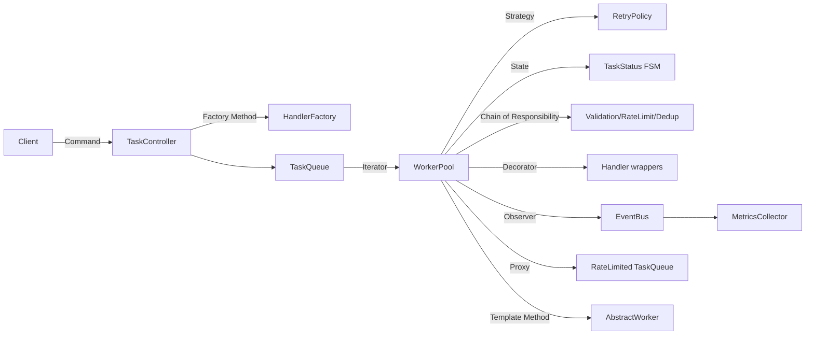
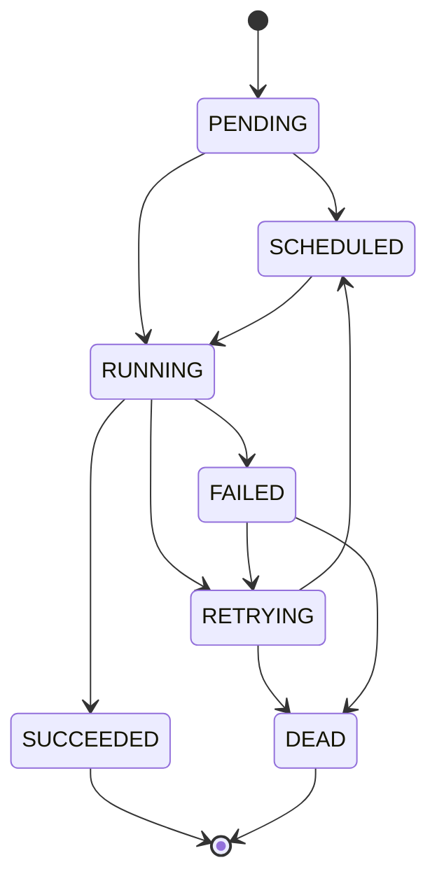

# Design Patterns: Solutions

> Where this fits in the project: this file is the answer key for [`./exercises.md`](./exercises.md). Every exercise here is solved against the **canonical Task Queue domain model** (`Task`, `TaskStatus`, `TaskHandler`, `TaskResult`, `TaskQueue`, `Worker`, `RetryPolicy`, `DeadLetterQueue`, `RateLimiter`, `TaskScheduler`, `EventBus`). Pattern choices are not academic — each one is a refactor we actually ship in Phase 1 through Phase 4.

This is a **module-level** solutions file. It mirrors `./exercises.md` one-to-one, using the same `E#` (Easy), `M#` (Medium), `H#` (Hard) numbering, grouped by pattern. Each solution gives:

1. **The restated prompt** (so this file is usable standalone).
2. **Complete, compilable Java 21 code** — no fragments, no `// TODO`.
3. **Reasoning and tradeoffs** — why this design, what it costs.
4. **Common wrong approaches** — the ones reviewers actually see.

If you have not attempted the exercise yet, stop and do it first. Reading a solution before struggling is the fastest way to learn nothing.

> All code assumes the shared model below. Where a chapter is referenced, see its file: [`singleton.md`](./singleton.md), [`factory-method.md`](./factory-method.md), [`abstract-factory.md`](./abstract-factory.md), [`adapter.md`](./adapter.md), [`decorator.md`](./decorator.md), [`facade.md`](./facade.md), [`composite.md`](./composite.md), [`proxy.md`](./proxy.md), [`strategy.md`](./strategy.md), [`observer.md`](./observer.md), [`command.md`](./command.md), [`state.md`](./state.md), [`template-method.md`](./template-method.md), [`chain-of-responsibility.md`](./chain-of-responsibility.md), [`iterator.md`](./iterator.md), [`mediator.md`](./mediator.md), [`memento.md`](./memento.md), [`visitor.md`](./visitor.md), [`interpreter.md`](./interpreter.md).

---

## Shared model used by all solutions

Every solution compiles against this slice. Copy it into a package `com.taskq.model` once.

```java
package com.taskq.model;

import java.time.Instant;

public enum TaskStatus {
    PENDING, SCHEDULED, RUNNING, SUCCEEDED, FAILED, RETRYING, DEAD
}
```

```java
package com.taskq.model;

import java.time.Instant;
import java.util.UUID;

/**
 * Canonical Task. A record so it is immutable and value-based; state transitions
 * return a NEW Task via the withX helpers (functional update), which keeps the
 * object safe to share across worker threads.
 */
public record Task(
        String id,
        String type,
        String payload,      // JSON string
        TaskStatus status,
        int attempts,
        int maxAttempts,
        Instant createdAt,
        Instant scheduledAt,
        int priority
) {
    public static Task of(String type, String payload) {
        Instant now = Instant.now();
        return new Task(UUID.randomUUID().toString(), type, payload,
                TaskStatus.PENDING, 0, 3, now, now, 0);
    }

    public Task withStatus(TaskStatus s) {
        return new Task(id, type, payload, s, attempts, maxAttempts, createdAt, scheduledAt, priority);
    }

    public Task incrementAttempts() {
        return new Task(id, type, payload, status, attempts + 1, maxAttempts, createdAt, scheduledAt, priority);
    }

    public Task withScheduledAt(Instant when) {
        return new Task(id, type, payload, TaskStatus.SCHEDULED, attempts, maxAttempts, createdAt, when, priority);
    }
}
```

```java
package com.taskq.model;

/** Result of executing a handler. retryable lets the handler veto a retry even with attempts left. */
public record TaskResult(boolean success, String message, boolean retryable) {
    public static TaskResult ok()                 { return new TaskResult(true, "ok", false); }
    public static TaskResult retry(String why)    { return new TaskResult(false, why, true); }
    public static TaskResult fail(String why)     { return new TaskResult(false, why, false); }
}
```

```java
package com.taskq.model;

/** Functional interface: a unit of work keyed by Task.type. */
@FunctionalInterface
public interface TaskHandler {
    TaskResult handle(Task task) throws Exception;
}
```

```java
package com.taskq.model;

public interface TaskQueue {
    void enqueue(Task t);
    Task dequeue() throws InterruptedException;
    int size();
}
```

A Mermaid map of which pattern lands in which collaborator — keep this picture in your head as you read the solutions.



---

# Creational patterns

## Singleton — [`singleton.md`](./singleton.md)

### E1 (knowledge check)

**Prompt.** Why is the field-initializer `private static final MetricsCollector INSTANCE = new MetricsCollector();` thread-safe without any `synchronized` keyword, and when does it still fail to be a good singleton?

**Solution.** Static field initializers run inside the class's `<clinit>` method. The JVM guarantees `<clinit>` runs **exactly once**, under a class-initialization lock, before any thread can touch the class. So the eager-holder field is published safely with a happens-before edge — no `synchronized`, no `volatile` needed. It still fails as a *good* singleton when (a) the constructor does heavy/IO work you do not always need (eager init wastes it), (b) you need lazy init keyed on runtime config, or (c) global mutable state hides dependencies and breaks tests. The fix for (c) is dependency injection: hold one instance in a Spring context, not a `static` field.

### E2 (coding)

**Prompt.** Implement a thread-safe, lazy `MetricsCollector` singleton using the **initialization-on-demand holder** idiom. Expose `increment(String counter)` and `count(String counter)`.

**Solution.**

```java
package com.taskq.metrics;

import java.util.concurrent.ConcurrentHashMap;
import java.util.concurrent.atomic.LongAdder;

public final class MetricsCollector {

    private final ConcurrentHashMap<String, LongAdder> counters = new ConcurrentHashMap<>();

    private MetricsCollector() { }   // no external construction

    // Holder is loaded lazily, on first getInstance() call, by the classloader — thread-safe.
    private static final class Holder {
        private static final MetricsCollector INSTANCE = new MetricsCollector();
    }

    public static MetricsCollector getInstance() {
        return Holder.INSTANCE;
    }

    public void increment(String counter) {
        counters.computeIfAbsent(counter, k -> new LongAdder()).increment();
    }

    public long count(String counter) {
        LongAdder a = counters.get(counter);
        return a == null ? 0L : a.sum();
    }
}
```

**Reasoning / tradeoffs.** The holder class is not initialized until `getInstance()` is first called, so initialization is lazy *and* free of locks on the hot path — the JVM's class-init guarantee does the synchronization for us. `LongAdder` beats `AtomicLong` under high write contention (per-thread cells) which is exactly what a metrics counter sees.

**Common wrong approaches.**
- **Double-checked locking without `volatile`** on the instance field: the half-constructed object can leak. If you insist on DCL, the field must be `volatile`.
- **`synchronized getInstance()`**: correct but serializes every read forever — measurable contention on a hot counter.
- **A plain `HashMap`** for counters: data race; lost increments and possible infinite loops on resize in older JDKs.

### M1 (coding + design)

**Prompt.** Singletons make tests hard. Refactor `MetricsCollector` so production uses one shared instance but tests can inject a fresh one — *without* a public setter that mutates global state.

**Solution.** Stop making it a singleton at the *type* level. Keep the type a normal collaborator and make it a singleton at the *wiring* level (Spring `@Bean`, or a single `new` in `main`).

```java
package com.taskq.metrics;

import java.util.concurrent.ConcurrentHashMap;
import java.util.concurrent.atomic.LongAdder;

/** No static state. Lifetime is controlled by whoever constructs it. */
public final class MetricsCollector {
    private final ConcurrentHashMap<String, LongAdder> counters = new ConcurrentHashMap<>();
    public void increment(String counter) {
        counters.computeIfAbsent(counter, k -> new LongAdder()).increment();
    }
    public long count(String counter) {
        LongAdder a = counters.get(counter);
        return a == null ? 0L : a.sum();
    }
}
```

```java
package com.taskq.config;

import com.taskq.metrics.MetricsCollector;
import org.springframework.context.annotation.Bean;
import org.springframework.context.annotation.Configuration;

@Configuration
class MetricsConfig {
    @Bean   // Spring guarantees one instance per context — "singleton" scope by default.
    MetricsCollector metricsCollector() {
        return new MetricsCollector();
    }
}
```

```java
// In a test: just construct your own. No global to reset between tests.
var metrics = new MetricsCollector();
var worker = new Worker(queue, handlers, metrics);
```

**Reasoning / tradeoffs.** "Singleton" should be a property of the *object graph*, not of the *class*. The container scope gives you one instance in production and isolation in tests. The cost is you must thread the dependency through constructors — that is a feature, because it makes the dependency explicit.

**Common wrong approach.** Adding `static void resetForTests()` to a static singleton. It works until two tests run in parallel and stomp each other; it also leaks test-only API into production code.

---

## Factory Method — [`factory-method.md`](./factory-method.md)

### E1 (knowledge check)

**Prompt.** What does a factory method *return* — a concrete type or an abstraction — and why does that choice matter for the worker that consumes it?

**Solution.** It returns the **abstraction** (`TaskHandler`), never a concrete handler type. The `Worker` depends only on `TaskHandler`, so adding an `EmailHandler` or `ReportHandler` never recompiles or edits the worker. This is the Dependency Inversion Principle made concrete: the high-level worker and the low-level handler both depend on the `TaskHandler` interface.

### E2 (coding)

**Prompt.** Implement a `HandlerFactory` with a factory method `create(String type)` returning a `TaskHandler`, supporting `"email"` and `"report"` types, and throwing for unknown types.

**Solution.**

```java
package com.taskq.handler;

import com.taskq.model.*;

public final class HandlerFactory {

    public TaskHandler create(String type) {
        return switch (type) {
            case "email"  -> new EmailHandler();
            case "report" -> new ReportHandler();
            default -> throw new IllegalArgumentException("No handler for type: " + type);
        };
    }

    static final class EmailHandler implements TaskHandler {
        public TaskResult handle(Task task) {
            // parse task.payload(), send email...
            return TaskResult.ok();
        }
    }

    static final class ReportHandler implements TaskHandler {
        public TaskResult handle(Task task) {
            return TaskResult.ok();
        }
    }
}
```

**Common wrong approach.** Returning `new EmailHandler()` typed as `EmailHandler` and letting callers `instanceof`-check it. That leaks concrete types and defeats the pattern.

### M1 (coding + design)

**Prompt.** The hard-coded `switch` means every new handler edits `HandlerFactory` (Open/Closed violation). Refactor to a **registry** so new handlers self-register and the factory never changes.

**Solution.**

```java
package com.taskq.handler;

import com.taskq.model.*;
import java.util.Map;
import java.util.concurrent.ConcurrentHashMap;
import java.util.function.Supplier;

/** Open for extension (register), closed for modification (no switch to edit). */
public final class HandlerRegistry {

    private final Map<String, Supplier<TaskHandler>> factories = new ConcurrentHashMap<>();

    public void register(String type, Supplier<TaskHandler> factory) {
        if (factories.putIfAbsent(type, factory) != null) {
            throw new IllegalStateException("Duplicate handler type: " + type);
        }
    }

    public TaskHandler create(String type) {
        Supplier<TaskHandler> f = factories.get(type);
        if (f == null) throw new IllegalArgumentException("No handler for type: " + type);
        return f.get();
    }

    public boolean supports(String type) { return factories.containsKey(type); }
}
```

```java
// Wiring (e.g. in main or a Spring @Configuration):
var registry = new HandlerRegistry();
registry.register("email",  HandlerFactory.EmailHandler::new);
registry.register("report", HandlerFactory.ReportHandler::new);
```

**Reasoning / tradeoffs.** Registration moves the type→handler decision out of the factory and into wiring, so adding `"video"` is a one-line `register` call. With Spring you go further: inject `Map<String, TaskHandler>` and Spring fills it by bean name — zero registration code. The tradeoff is that unknown types now fail at *runtime* (lookup) rather than *compile time* (a missing `switch` case the compiler can flag with exhaustiveness). For an open-ended plugin set, runtime is the right tradeoff.

**Common wrong approach.** Using a static `Map` initialized in a `static {}` block — back to global mutable state and ordering bugs when handlers live in different modules.

### H1 (design)

**Prompt.** Make handler creation pluggable across deployments: some nodes process `"email"`, others process `"report"`, decided by config. Design it so a node only registers the handlers it is allowed to run, and `Worker` refuses tasks it cannot handle.

**Solution.** Combine the registry (above) with a config-driven set of enabled types. The `Worker` consults `registry.supports(type)` before pulling — or, better, re-routes unsupported tasks back to the queue / DLQ.

```java
package com.taskq.worker;

import com.taskq.handler.HandlerRegistry;
import com.taskq.model.*;
import java.util.Set;

public final class Worker implements Runnable {
    private final TaskQueue queue;
    private final HandlerRegistry registry;
    private final Set<String> enabledTypes;   // from config
    private volatile boolean running = true;

    public Worker(TaskQueue queue, HandlerRegistry registry, Set<String> enabledTypes) {
        this.queue = queue;
        this.registry = registry;
        this.enabledTypes = Set.copyOf(enabledTypes);
    }

    @Override public void run() {
        while (running) {
            try {
                Task task = queue.dequeue();
                if (!enabledTypes.contains(task.type()) || !registry.supports(task.type())) {
                    queue.enqueue(task);     // not ours: let a capable node take it
                    Thread.sleep(50);        // avoid hot-spinning on the same task
                    continue;
                }
                registry.create(task.type()).handle(task);
            } catch (InterruptedException e) {
                Thread.currentThread().interrupt();
                running = false;
            } catch (Exception e) {
                // outcome handling lives in the real worker; omitted here
            }
        }
    }
}
```

**Reasoning / tradeoffs.** Capability is config; routing is behavior. Re-enqueuing is the simplest "not mine" strategy in Phase 1; in Phase 4 the broker does this with type-keyed topics so a node only ever *receives* tasks it can run, eliminating the busy re-enqueue. The Phase-1 version's tradeoff is wasted dequeues when no capable node is up — acceptable for a learning build, not for production throughput.

**Common wrong approach.** Letting the worker `try/catch` an unknown-type exception and drop the task silently — that is data loss disguised as error handling.

---

## Abstract Factory — [`abstract-factory.md`](./abstract-factory.md)

### E1 (knowledge check)

**Prompt.** What is the difference between Factory Method and Abstract Factory in one sentence, stated through our project?

**Solution.** Factory Method creates **one** product (a `TaskHandler`); Abstract Factory creates a **family of related products that must be consistent** (a `TaskQueue` + `DeadLetterQueue` + `TaskRepository` all backed by the same technology — all in-memory, or all Postgres, or all Redis).

### M1 (coding)

**Prompt.** Define an `InfraFactory` abstract factory that produces a matching `TaskQueue` and `DeadLetterQueue`. Provide an `InMemoryInfraFactory` and a sketch of `PostgresInfraFactory`. Make it impossible to mix an in-memory queue with a Postgres DLQ.

**Solution.**

```java
package com.taskq.infra;

import com.taskq.model.*;

public interface DeadLetterQueue {
    void send(Task t, String reason);
}

/** Abstract Factory: one method per product in the family. */
public interface InfraFactory {
    TaskQueue createTaskQueue();
    DeadLetterQueue createDeadLetterQueue();
}
```

```java
package com.taskq.infra;

import com.taskq.model.*;
import java.util.concurrent.LinkedBlockingQueue;
import java.util.concurrent.BlockingQueue;

public final class InMemoryInfraFactory implements InfraFactory {

    @Override public TaskQueue createTaskQueue() {
        return new TaskQueue() {
            private final BlockingQueue<Task> q = new LinkedBlockingQueue<>();
            public void enqueue(Task t) { q.add(t); }
            public Task dequeue() throws InterruptedException { return q.take(); }
            public int size() { return q.size(); }
        };
    }

    @Override public DeadLetterQueue createDeadLetterQueue() {
        return (t, reason) -> System.out.println("DLQ <- " + t.id() + " : " + reason);
    }
}
```

```java
package com.taskq.infra;

import com.taskq.model.*;
import javax.sql.DataSource;

/** Sketch — same family, all Postgres-backed, sharing one DataSource. */
public final class PostgresInfraFactory implements InfraFactory {
    private final DataSource ds;
    public PostgresInfraFactory(DataSource ds) { this.ds = ds; }

    @Override public TaskQueue createTaskQueue() {
        return new PostgresTaskQueue(ds);            // defined in Phase 2
    }
    @Override public DeadLetterQueue createDeadLetterQueue() {
        return new PostgresDeadLetterQueue(ds);      // same DataSource = consistent family
    }
}
```

**Reasoning / tradeoffs.** Because the application asks one `InfraFactory` for *both* products, it can never pair an in-memory queue with a Postgres DLQ — the family is constructed together. The cost is rigidity: adding a *new product* (say `TaskRepository`) to the family means editing the interface and every factory. That is the classic Abstract Factory tradeoff (easy to add families, hard to add products). For our 3 environments and small product set it is the right call.

**Common wrong approach.** A single mega-factory with `boolean usePostgres` flags scattered through it — you lose the compile-time guarantee that the family is consistent and re-introduce the conditionals the pattern exists to remove.

### H1 (design)

**Prompt.** Wire the abstract factory through Spring profiles so `--spring.profiles.active=postgres` selects `PostgresInfraFactory` and the default selects `InMemoryInfraFactory`, with no `if` in business code.

**Solution.**

```java
package com.taskq.config;

import com.taskq.infra.*;
import javax.sql.DataSource;
import org.springframework.context.annotation.*;

@Configuration
class InfraConfig {

    @Bean
    @Profile("!postgres")                 // default profile
    InfraFactory inMemoryInfra() {
        return new InMemoryInfraFactory();
    }

    @Bean
    @Profile("postgres")
    InfraFactory postgresInfra(DataSource ds) {
        return new PostgresInfraFactory(ds);
    }
}
```

```java
// Business code is profile-agnostic: it just needs the family.
@Component
class QueueBootstrap {
    QueueBootstrap(InfraFactory infra) {
        TaskQueue q = infra.createTaskQueue();
        DeadLetterQueue dlq = infra.createDeadLetterQueue();
        // ...
    }
}
```

**Reasoning / tradeoffs.** Spring's `@Profile` is the production-grade selector for an abstract factory — the conditional lives once, in config, and the object graph that gets built is internally consistent. Tradeoff: profile sprawl if you add many environments; mitigate by composing profiles, not multiplying factories.

---

# Structural patterns

## Adapter — [`adapter.md`](./adapter.md)

### E1 (knowledge check)

**Prompt.** Adapter vs Decorator: both wrap an object. What is the one-sentence distinction?

**Solution.** Adapter **changes the interface** of the wrapped object to one the client expects (incompatible → compatible); Decorator **keeps the same interface** and **adds behavior**. Adapter is about *shape*; Decorator is about *responsibility*.

### M1 (coding)

**Prompt.** A third-party `LegacyMailer` has `void post(String to, String body)`. Adapt it to our `TaskHandler` so the worker can run email tasks without knowing about `LegacyMailer`.

**Solution.**

```java
package com.taskq.handler;

import com.taskq.model.*;

/** Third-party class we cannot change. */
final class LegacyMailer {
    void post(String to, String body) { /* vendor SDK */ }
}

/** Object adapter: holds the adaptee, exposes our target interface (TaskHandler). */
public final class LegacyMailerAdapter implements TaskHandler {
    private final LegacyMailer mailer;

    public LegacyMailerAdapter(LegacyMailer mailer) { this.mailer = mailer; }

    @Override public TaskResult handle(Task task) {
        // Translate our Task.payload (JSON) into the adaptee's call shape.
        var p = EmailPayload.parse(task.payload());
        try {
            mailer.post(p.to(), p.body());
            return TaskResult.ok();
        } catch (RuntimeException e) {
            return TaskResult.retry("mailer failed: " + e.getMessage());
        }
    }

    record EmailPayload(String to, String body) {
        static EmailPayload parse(String json) {
            // real impl: Jackson. Stubbed for brevity but compilable shape.
            return new EmailPayload("user@example.com", "hi");
        }
    }
}
```

**Reasoning / tradeoffs.** We chose an **object adapter** (composition: hold a `LegacyMailer`) over a **class adapter** (inheritance) because Java has single inheritance and because composition lets one adapter wrap different mailer configs. The adapter is also where translation/error-mapping lives, so vendor exceptions become our `TaskResult`.

**Common wrong approaches.**
- Leaking `LegacyMailer` into the worker and translating inline — spreads vendor knowledge everywhere.
- Letting the vendor exception escape `handle` — the worker's outcome logic expects a `TaskResult` or a checked `Exception`, not a vendor `RuntimeException` with vendor semantics.

### H1 (design)

**Prompt.** Two brokers — Redis (`pushList`/`popList`) and Kafka (`produce`/`poll`) — must both present our `TaskQueue` interface for Phase 4. Design adapters and explain how the `dequeue()` blocking contract is honored differently per broker.

**Solution.**

```java
package com.taskq.broker;

import com.taskq.model.*;

public final class RedisTaskQueueAdapter implements TaskQueue {
    private final RedisClient redis;
    private final String key;
    public RedisTaskQueueAdapter(RedisClient redis, String key) { this.redis = redis; this.key = key; }

    public void enqueue(Task t) { redis.pushList(key, Serde.toJson(t)); }

    public Task dequeue() throws InterruptedException {
        // Redis BLPOP blocks server-side; honor the InterruptedException contract.
        String json = redis.bpopList(key, /*timeoutSeconds*/ 5);
        while (json == null) {                       // long-poll loop
            if (Thread.interrupted()) throw new InterruptedException();
            json = redis.bpopList(key, 5);
        }
        return Serde.fromJson(json);
    }

    public int size() { return (int) redis.llen(key); }
}
```

```java
package com.taskq.broker;

import com.taskq.model.*;
import java.util.ArrayDeque;
import java.util.Deque;

public final class KafkaTaskQueueAdapter implements TaskQueue {
    private final KafkaProducerClient producer;
    private final KafkaConsumerClient consumer;
    private final String topic;
    private final Deque<Task> buffer = new ArrayDeque<>();   // poll returns batches

    public KafkaTaskQueueAdapter(KafkaProducerClient p, KafkaConsumerClient c, String topic) {
        this.producer = p; this.consumer = c; this.topic = topic;
    }

    public void enqueue(Task t) { producer.produce(topic, t.id(), Serde.toJson(t)); }

    public Task dequeue() throws InterruptedException {
        while (buffer.isEmpty()) {
            if (Thread.interrupted()) throw new InterruptedException();
            consumer.poll(java.time.Duration.ofMillis(500))   // batch of records
                    .forEach(json -> buffer.add(Serde.fromJson(json)));
        }
        return buffer.poll();
    }

    public int size() { return buffer.size(); }
}
```

**Reasoning / tradeoffs.** Both adapters present the *same* blocking `dequeue()` contract but implement it with the broker's native primitive: Redis blocks server-side with `BLPOP`; Kafka does not block per-message, so the adapter buffers a polled batch and drains it. The adapter is exactly where these impedance mismatches are absorbed. Tradeoff: Kafka's at-least-once + offset-commit semantics are *not* fully captured by `TaskQueue.dequeue()` — a real Phase-4 adapter must expose ack/commit, which means `TaskQueue` itself eventually grows an `ack(Task)` method. Recognizing where the abstraction leaks is part of the exercise.

**Common wrong approach.** Returning `null` from `dequeue()` on timeout, breaking the "blocks until available" contract the worker relies on.

---

## Decorator — [`decorator.md`](./decorator.md)

### E1 (knowledge check)

**Prompt.** Why must a decorator implement the *same* interface as the thing it decorates, and what would break if it did not?

**Solution.** Because clients hold the interface type and a decorator must be a drop-in substitute (Liskov). If `LoggingHandler` did not implement `TaskHandler`, the `Worker` could not accept it, and you could not stack decorators (a decorator wrapping a decorator wrapping a handler) since each layer needs to be the same type.

### M1 (coding)

**Prompt.** Implement decorators `LoggingHandler`, `TimedHandler`, and `RetryAnnotatingHandler` over `TaskHandler`, and stack them so logging is outermost. Each adds one responsibility.

**Solution.**

```java
package com.taskq.handler;

import com.taskq.model.*;

abstract class HandlerDecorator implements TaskHandler {
    protected final TaskHandler delegate;
    protected HandlerDecorator(TaskHandler delegate) { this.delegate = delegate; }
}

public final class LoggingHandler extends HandlerDecorator {
    public LoggingHandler(TaskHandler d) { super(d); }
    @Override public TaskResult handle(Task task) throws Exception {
        System.out.println("START " + task.id());
        try {
            TaskResult r = delegate.handle(task);
            System.out.println("END " + task.id() + " success=" + r.success());
            return r;
        } catch (Exception e) {
            System.out.println("ERROR " + task.id() + " : " + e.getMessage());
            throw e;
        }
    }
}

final class TimedHandler extends HandlerDecorator {
    private final com.taskq.metrics.MetricsCollector metrics;
    TimedHandler(TaskHandler d, com.taskq.metrics.MetricsCollector m) { super(d); this.metrics = m; }
    @Override public TaskResult handle(Task task) throws Exception {
        long start = System.nanoTime();
        try { return delegate.handle(task); }
        finally {
            long micros = (System.nanoTime() - start) / 1_000;
            metrics.increment("handler.duration_micros." + task.type());   // simplistic
        }
    }
}

final class RetryAnnotatingHandler extends HandlerDecorator {
    RetryAnnotatingHandler(TaskHandler d) { super(d); }
    @Override public TaskResult handle(Task task) throws Exception {
        if (task.attempts() >= task.maxAttempts()) {
            return TaskResult.fail("exhausted attempts");   // veto further retries
        }
        return delegate.handle(task);
    }
}
```

```java
// Stacking: logging is outermost, then timing, then retry-annotation, then the real handler.
TaskHandler base = new HandlerFactory().create("email");
TaskHandler decorated =
    new LoggingHandler(
        new TimedHandler(
            new RetryAnnotatingHandler(base),
            MetricsCollector.getInstance()));
```

**Reasoning / tradeoffs.** Each decorator is single-responsibility and composable; you choose the cross-cutting concerns per handler without a subclass explosion (no `LoggedTimedRetryEmailHandler`). Order matters and is explicit: logging outermost means it brackets the *entire* timed+retried execution. Tradeoff: deep stacks produce confusing stack traces and a small per-layer overhead. In Spring you would often reach for AOP for these concerns — but AOP *is* decoration via dynamic proxies, so the mental model transfers.

**Common wrong approaches.**
- Putting cross-cutting logic by *subclassing each handler* — combinatorial explosion.
- Decorators that swallow exceptions (`catch` without rethrow), silently changing the contract and hiding failures from the worker's retry logic.

### H1 (refactoring)

**Prompt.** A `SuperHandler` does logging + timing + retry + rate-limit checks inside one 120-line `handle`. Refactor to decorators and show how this restores the Single Responsibility Principle and makes each concern unit-testable.

**Solution (before → after).**

```java
// BEFORE: one method, four reasons to change, untestable in isolation.
final class SuperHandler implements TaskHandler {
    public TaskResult handle(Task task) throws Exception {
        long t0 = System.nanoTime();
        System.out.println("start " + task.id());
        if (!RateLimiterHolder.GLOBAL.tryAcquire()) return TaskResult.retry("rate limited");
        if (task.attempts() >= task.maxAttempts()) return TaskResult.fail("exhausted");
        try {
            // ... 90 lines of actual email logic ...
            return TaskResult.ok();
        } finally {
            System.out.println("took " + (System.nanoTime() - t0));
        }
    }
}
```

```java
// AFTER: the real work is alone; concerns are decorators (reuse those from M1 + a RateLimitingHandler).
final class RateLimitingHandler extends HandlerDecorator {
    private final RateLimiter limiter;
    RateLimitingHandler(TaskHandler d, RateLimiter limiter) { super(d); this.limiter = limiter; }
    @Override public TaskResult handle(Task task) throws Exception {
        if (!limiter.tryAcquire()) return TaskResult.retry("rate limited");
        return delegate.handle(task);
    }
}

final class EmailHandlerCore implements TaskHandler {     // ONLY email logic now
    public TaskResult handle(Task task) {
        /* the 90 lines of actual work */ return TaskResult.ok();
    }
}

// Compose:
TaskHandler handler =
    new LoggingHandler(
        new TimedHandler(
            new RateLimitingHandler(
                new RetryAnnotatingHandler(new EmailHandlerCore()),
                tokenBucket),
            MetricsCollector.getInstance()));
```

```java
// Each concern is now a one-line unit test target, e.g.:
@Test void rateLimited_returnsRetry() {
    RateLimiter always = () -> false;
    var h = new RateLimitingHandler(t -> TaskResult.ok(), always);
    assertThat(h.handle(Task.of("email","{}")).retryable()).isTrue();
}
```

**Reasoning / tradeoffs.** Splitting restores SRP: `EmailHandlerCore` changes only when email logic changes; each decorator has one test. The interface (`RateLimiter` is a functional interface) makes stubbing trivial. Cost: more files and a visible composition site — worth it because the previous `SuperHandler` could not be tested without a real rate limiter and clock.

---

## Facade — [`facade.md`](./facade.md)

### E1 (knowledge check)

**Prompt.** Does a facade *restrict* access to subsystem classes? What is the facade's real job?

**Solution.** No — a facade does not hide or forbid the subsystem; clients can still use it directly. Its job is to provide a **simpler, task-oriented entry point** for the common case (e.g. "submit a task" rather than "validate, persist, enqueue, emit event"). It reduces coupling between the client and the many subsystem classes.

### M1 (coding)

**Prompt.** Build a `TaskSubmissionFacade` that hides validation + repository save + enqueue + metric increment behind a single `submit(type, payload)` returning a task id.

**Solution.**

```java
package com.taskq.api;

import com.taskq.model.*;
import com.taskq.metrics.MetricsCollector;
import com.taskq.infra.TaskRepository;

public final class TaskSubmissionFacade {
    private final TaskRepository repo;
    private final TaskQueue queue;
    private final MetricsCollector metrics;

    public TaskSubmissionFacade(TaskRepository repo, TaskQueue queue, MetricsCollector metrics) {
        this.repo = repo; this.queue = queue; this.metrics = metrics;
    }

    /** One call hides four subsystem interactions. */
    public String submit(String type, String payload) {
        validate(type, payload);
        Task task = Task.of(type, payload);
        repo.save(task);                 // 1. persist (Phase 2)
        queue.enqueue(task);             // 2. make it dequeuable
        metrics.increment("tasks.submitted." + type);  // 3. observe
        return task.id();
    }

    private void validate(String type, String payload) {
        if (type == null || type.isBlank()) throw new IllegalArgumentException("type required");
        if (payload == null) throw new IllegalArgumentException("payload required");
    }
}
```

**Reasoning / tradeoffs.** The `TaskController` (Phase 2) now depends on one collaborator instead of three, and the submit *sequence* lives in one place. Tradeoff: a facade can become a god-object if you keep stuffing unrelated operations in. Keep it cohesive — one facade per use-case cluster (submission, querying, admin), not one per application.

**Common wrong approach.** Putting this orchestration in the controller. Controllers should translate HTTP↔domain, not own multi-step domain workflows.

### H1 (design)

**Prompt.** The facade currently does save-then-enqueue non-atomically; a crash between them loses or double-runs a task. Redesign for Phase 2 using the transactional-outbox idea, and explain why the facade is still the right home for this.

**Solution.** Make the *repository write* and an *outbox row* one DB transaction; a separate relay moves outbox rows to the queue. The facade orchestrates the transactional save; it no longer enqueues directly.

```java
package com.taskq.api;

import com.taskq.model.*;
import org.springframework.transaction.annotation.Transactional;

public final class TaskSubmissionFacade {
    private final TaskRepository repo;
    private final OutboxRepository outbox;

    public TaskSubmissionFacade(TaskRepository repo, OutboxRepository outbox) {
        this.repo = repo; this.outbox = outbox;
    }

    @Transactional                       // both writes commit or neither does
    public String submit(String type, String payload) {
        Task task = Task.of(type, payload);
        repo.save(task);
        outbox.append(task.id());        // same TX: "this task needs enqueuing"
        return task.id();
    }
}
```

```java
// A separate scheduled relay (Phase 2/3) drains the outbox into the queue at-least-once.
@Component
class OutboxRelay {
    private final OutboxRepository outbox;
    private final TaskQueue queue;
    private final TaskRepository repo;
    OutboxRelay(OutboxRepository o, TaskQueue q, TaskRepository r) { outbox=o; queue=q; repo=r; }

    @Scheduled(fixedDelay = 500)
    void drain() {
        for (String id : outbox.pollUnsent(100)) {
            repo.findById(id).ifPresent(queue::enqueue);
            outbox.markSent(id);          // at-least-once: handlers must be idempotent
        }
    }
}
```

**Reasoning / tradeoffs.** Atomicity is now between two *DB* writes (trivially transactional), not between a DB write and a queue push (not transactional). The facade stays the home because submission is a single business operation and the outbox is an implementation detail of *how* we make it reliable — exactly the complexity a facade should encapsulate. Cost: at-least-once delivery, so downstream handlers must be **idempotent** (see [`../08-distributed-systems/idempotency.md`](../08-distributed-systems/idempotency.md)).

---

## Composite — [`composite.md`](./composite.md)

### E1 (knowledge check)

**Prompt.** In Composite, what must be true about the leaf and the composite for client code to treat them uniformly?

**Solution.** Both must implement the **same component interface**. A client calls `execute()` on a `TaskHandler` without caring whether it is a single handler (leaf) or a `CompositeHandler` that fans out to children (composite). Uniformity is the whole point.

### M1 (coding)

**Prompt.** Model a "task group" where running the group runs a list of sub-tasks. Implement a `CompositeTaskHandler` that implements `TaskHandler` and runs children in order, failing fast.

**Solution.**

```java
package com.taskq.handler;

import com.taskq.model.*;
import java.util.List;

/** Composite: a TaskHandler made of TaskHandlers. */
public final class CompositeTaskHandler implements TaskHandler {
    private final List<TaskHandler> children;
    public CompositeTaskHandler(List<TaskHandler> children) {
        this.children = List.copyOf(children);
    }

    @Override public TaskResult handle(Task task) throws Exception {
        for (TaskHandler child : children) {
            TaskResult r = child.handle(task);
            if (!r.success()) {
                return new TaskResult(false, "child failed: " + r.message(), r.retryable());
            }
        }
        return TaskResult.ok();
    }
}
```

```java
// Leaf and composite are interchangeable:
TaskHandler pipeline = new CompositeTaskHandler(List.of(
    new ValidateHandler(),                       // leaf
    new CompositeTaskHandler(List.of(            // nested composite
        new TransformHandler(), new EnrichHandler())),
    new PersistHandler()));                      // leaf
pipeline.handle(task);
```

**Reasoning / tradeoffs.** A tree of handlers expresses sub-workflows with the same type as a single handler, so the worker is none the wiser. Fail-fast keeps semantics simple. Tradeoffs: error attribution gets vaguer the deeper you nest, and partial side effects from earlier children are not rolled back — for at-least-once correctness, children must be idempotent or compensating. The classic Composite tension (transparency vs safety) appears here: a uniform interface means `add(child)` is meaningless on a leaf; we sidestep it by making composites immutable (children passed in the constructor).

**Common wrong approach.** Putting `add()`/`remove()` on the `TaskHandler` interface itself so leaves must throw `UnsupportedOperationException` — a Liskov violation. Keep mutation on the composite only.

### H1 (design)

**Prompt.** Add a `parallel` composite that runs children concurrently with virtual threads and aggregates results, while still being a `TaskHandler`. Discuss the failure-aggregation policy.

**Solution.**

```java
package com.taskq.handler;

import com.taskq.model.*;
import java.util.List;
import java.util.concurrent.*;

public final class ParallelTaskHandler implements TaskHandler {
    private final List<TaskHandler> children;
    public ParallelTaskHandler(List<TaskHandler> children) { this.children = List.copyOf(children); }

    @Override public TaskResult handle(Task task) throws Exception {
        try (var scope = Executors.newVirtualThreadPerTaskExecutor()) {
            List<Future<TaskResult>> futures = children.stream()
                .map(c -> scope.submit(() -> c.handle(task)))
                .toList();

            boolean anyRetryable = false;
            StringBuilder failures = new StringBuilder();
            for (Future<TaskResult> f : futures) {
                TaskResult r = f.get();                 // waits for all (no fail-fast cancel here)
                if (!r.success()) {
                    anyRetryable |= r.retryable();
                    failures.append(r.message()).append("; ");
                }
            }
            return failures.isEmpty()
                ? TaskResult.ok()
                : new TaskResult(false, failures.toString(), anyRetryable);
        }
    }
}
```

**Reasoning / tradeoffs.** Virtual threads make fan-out cheap (one thread per child, blocking is fine). The **aggregation policy** is the real design decision: this version is *all-must-succeed* and the group is retryable if *any* child wanted a retry — a conservative, idempotency-friendly choice. Alternatives: fail-fast with `StructuredTaskScope.ShutdownOnFailure` (cancel siblings on first failure — better latency, but leaves partial side effects), or quorum ("succeed if k of n"). State the policy explicitly because it changes retry behavior and at-least-once correctness.

**Common wrong approach.** Sharing a mutable accumulator across child threads without synchronization. Here each `Future` is read on the calling thread after `get()`, so there is no shared mutable state during execution — that is deliberate.

---

## Proxy — [`proxy.md`](./proxy.md)

### E1 (knowledge check)

**Prompt.** Name three proxy flavors and which one a rate limiter is.

**Solution.** Virtual proxy (lazy creation), protection proxy (access control), remote proxy (stands in for a remote object). A rate limiter in front of `enqueue`/`dequeue` is a **protection proxy** — it guards access to the real subject based on a policy.

### M1 (coding)

**Prompt.** Implement a `RateLimitedTaskQueue` proxy that wraps any `TaskQueue` and rejects (or blocks) `enqueue` when a `TokenBucketRateLimiter` is exhausted, while `dequeue`/`size` pass through unchanged.

**Solution.**

```java
package com.taskq.ratelimit;

@FunctionalInterface
public interface RateLimiter { boolean tryAcquire(); }
```

```java
package com.taskq.ratelimit;

import java.util.concurrent.atomic.AtomicLong;

/** Lazy-refill token bucket: tokens accrue at refillPerSec, capped at capacity. */
public final class TokenBucketRateLimiter implements RateLimiter {
    private final long capacity;
    private final double refillPerNano;
    private final AtomicLong tokens;          // scaled by 1000 to keep integer CAS cheap
    private final AtomicLong lastRefillNano;

    public TokenBucketRateLimiter(long capacity, double refillPerSec) {
        this.capacity = capacity;
        this.refillPerNano = refillPerSec / 1_000_000_000.0;
        this.tokens = new AtomicLong(capacity * 1000);
        this.lastRefillNano = new AtomicLong(System.nanoTime());
    }

    @Override public boolean tryAcquire() {
        refill();
        long cur;
        do {
            cur = tokens.get();
            if (cur < 1000) return false;             // < 1 token
        } while (!tokens.compareAndSet(cur, cur - 1000));
        return true;
    }

    private void refill() {
        long now = System.nanoTime();
        long last = lastRefillNano.get();
        long elapsed = now - last;
        if (elapsed <= 0) return;
        long add = (long) (elapsed * refillPerNano * 1000);
        if (add <= 0) return;
        if (lastRefillNano.compareAndSet(last, now)) {
            long max = capacity * 1000;
            long cur, next;
            do { cur = tokens.get(); next = Math.min(max, cur + add); }
            while (!tokens.compareAndSet(cur, next));
        }
    }
}
```

```java
package com.taskq.ratelimit;

import com.taskq.model.*;

/** Protection proxy: same TaskQueue interface, adds an admission gate on enqueue. */
public final class RateLimitedTaskQueue implements TaskQueue {
    private final TaskQueue delegate;
    private final RateLimiter limiter;

    public RateLimitedTaskQueue(TaskQueue delegate, RateLimiter limiter) {
        this.delegate = delegate; this.limiter = limiter;
    }

    @Override public void enqueue(Task t) {
        if (!limiter.tryAcquire()) {
            throw new RejectedExecutionException("rate limit exceeded for type " + t.type());
        }
        delegate.enqueue(t);
    }
    @Override public Task dequeue() throws InterruptedException { return delegate.dequeue(); }
    @Override public int size() { return delegate.size(); }

    static final class RejectedExecutionException extends RuntimeException {
        RejectedExecutionException(String m) { super(m); }
    }
}
```

**Reasoning / tradeoffs.** Because the proxy *is* a `TaskQueue`, the facade and workers are unchanged — admission control is a wrapping decision, not a code change. Lazy-refill avoids a background timer thread. Tradeoff: rejecting on `enqueue` pushes backpressure to the caller (HTTP 429), which is usually correct; an alternative is to *block* until a token frees, trading latency for zero rejection (see [`../08-distributed-systems/rate-limiting.md`](../08-distributed-systems/rate-limiting.md) and [`../08-distributed-systems/backpressure.md`](../08-distributed-systems/backpressure.md)).

**Common wrong approaches.**
- A non-atomic `tokens--` read-modify-write — lost updates under concurrency let more requests through than the limit.
- A background `ScheduledExecutorService` that refills — works, but burns a thread and adds drift; lazy refill is cheaper and exact.

### H1 (design)

**Prompt.** Add a *caching protection proxy* for `TaskRepository.findById` that serves hot tasks from a short-TTL cache but never serves stale terminal-state tasks. Explain the invalidation rule.

**Solution.**

```java
package com.taskq.infra;

import com.taskq.model.*;
import java.time.*;
import java.util.*;
import java.util.concurrent.ConcurrentHashMap;

public final class CachingTaskRepository implements TaskRepository {
    private record Entry(Task task, Instant expiresAt) {}
    private final TaskRepository delegate;
    private final Duration ttl;
    private final Clock clock;
    private final Map<String, Entry> cache = new ConcurrentHashMap<>();

    public CachingTaskRepository(TaskRepository delegate, Duration ttl, Clock clock) {
        this.delegate = delegate; this.ttl = ttl; this.clock = clock;
    }

    @Override public Optional<Task> findById(String id) {
        Instant now = clock.instant();
        Entry e = cache.get(id);
        if (e != null && now.isBefore(e.expiresAt())) return Optional.of(e.task());

        Optional<Task> fromDb = delegate.findById(id);
        fromDb.ifPresent(t -> {
            // Never cache terminal states with a long TTL; cache them with 0 TTL = effectively no cache,
            // because a terminal task will never change again and stale non-terminal reads are dangerous.
            if (!isTerminal(t.status())) {
                cache.put(id, new Entry(t, now.plus(ttl)));
            } else {
                cache.remove(id);
            }
        });
        return fromDb;
    }

    @Override public void save(Task t) {
        delegate.save(t);
        cache.remove(t.id());                 // write-invalidate: next read re-fetches truth
    }

    @Override public List<Task> pollDue(int n) { return delegate.pollDue(n); }

    private static boolean isTerminal(TaskStatus s) {
        return s == TaskStatus.SUCCEEDED || s == TaskStatus.FAILED || s == TaskStatus.DEAD;
    }
}
```

**Reasoning / tradeoffs.** The proxy adds caching transparently. The **invalidation rule** is the heart of it: *cache only non-terminal tasks for a short TTL, and invalidate on every `save`.* Serving a stale `RUNNING` when the task actually `SUCCEEDED` is the dangerous case, so writes invalidate. We *deliberately do not* long-cache terminal states here despite their immutability, because the more valuable cache hits are on hot, in-flight tasks being polled by clients; caching them with write-invalidation keeps reads correct. Tradeoff: a clock is injected so the TTL is testable.

---

# Behavioral patterns

## Strategy — [`strategy.md`](./strategy.md)

### E1 (knowledge check)

**Prompt.** Why is Strategy composition (Context holds a `RetryPolicy` field) rather than inheritance, and what does that buy at runtime?

**Solution.** The Context holds a *reference to the `RetryPolicy` interface*, not a subclass of the algorithm. Swapping behavior is a field assignment / different injection — no subclassing, no recompilation, and it can change *per task* at runtime. Inheritance would bind the algorithm at class-definition time.

### E2 (coding)

**Prompt.** Implement `LinearBackoffRetryPolicy` where `delay = base * attempt`, returning empty once `attempt > maxAttempts`.

**Solution.**

```java
package com.taskq.retry;

import java.time.Duration;
import java.util.Optional;

@FunctionalInterface
public interface RetryPolicy {
    Optional<Duration> nextDelay(int attempt);
}
```

```java
package com.taskq.retry;

import java.time.Duration;
import java.util.Optional;

public final class LinearBackoffRetryPolicy implements RetryPolicy {
    private final Duration base;
    private final int maxAttempts;

    public LinearBackoffRetryPolicy(Duration base, int maxAttempts) {
        this.base = base; this.maxAttempts = maxAttempts;
    }

    @Override public Optional<Duration> nextDelay(int attempt) {
        if (attempt <= 0 || attempt > maxAttempts) return Optional.empty();
        return Optional.of(base.multipliedBy(attempt));
    }
}
```

**Common wrong approaches.** Returning `Duration.ZERO` instead of `Optional.empty()` when exhausted — the worker then retries forever. Overflow on huge `attempt`: cap `attempt` or the multiplied duration.

### M1 (pattern identification + coding)

**Prompt.** Add **full jitter** to exponential backoff as a *separate* `RetryPolicy` (do not edit the existing class), and make it deterministically testable.

**Solution.**

```java
package com.taskq.retry;

import java.time.Duration;
import java.util.Optional;
import java.util.random.RandomGenerator;

/** delay = random(0, min(cap, base * 2^(attempt-1))). RNG is injected for determinism. */
public final class FullJitterBackoffRetryPolicy implements RetryPolicy {
    private final Duration base;
    private final Duration cap;
    private final int maxAttempts;
    private final RandomGenerator rng;

    public FullJitterBackoffRetryPolicy(Duration base, Duration cap, int maxAttempts, RandomGenerator rng) {
        this.base = base; this.cap = cap; this.maxAttempts = maxAttempts; this.rng = rng;
    }

    @Override public Optional<Duration> nextDelay(int attempt) {
        if (attempt <= 0 || attempt > maxAttempts) return Optional.empty();
        long exp = base.toMillis() * (1L << (attempt - 1));     // base * 2^(attempt-1)
        long ceiling = Math.min(exp, cap.toMillis());
        long jittered = rng.nextLong(ceiling + 1);              // [0, ceiling]
        return Optional.of(Duration.ofMillis(jittered));
    }
}
```

```java
package com.taskq.retry;

import org.junit.jupiter.api.Test;
import java.time.Duration;
import java.util.random.RandomGenerator;
import static org.assertj.core.api.Assertions.assertThat;

class FullJitterBackoffRetryPolicyTest {
    @Test void deterministicWithSeededRng() {
        RandomGenerator seeded = new java.util.Random(42);      // RandomGenerator since Java 17
        var p = new FullJitterBackoffRetryPolicy(
                Duration.ofMillis(100), Duration.ofSeconds(10), 5, seeded);
        // Same seed => same sequence; assert it is within bounds and reproducible.
        Duration d1 = p.nextDelay(3).orElseThrow();
        assertThat(d1).isBetween(Duration.ZERO, Duration.ofMillis(400));
        assertThat(p.nextDelay(99)).isEmpty();
    }
}
```

**Reasoning / tradeoffs.** Injecting `RandomGenerator` is the key move: production passes `RandomGenerator.getDefault()` (or `ThreadLocalRandom`), tests pass a seeded `Random` for reproducible delays. We did not touch `ExponentialBackoffRetryPolicy` — Open/Closed satisfied. Full jitter (vs equal/decorrelated) maximizes spread to avoid retry storms; the tradeoff is occasional near-zero delays.

### H1 (refactoring)

**Prompt.** A `ScheduledWorker.run()` picks delay via nested `if/else` on a `retryType` string and gating via `if/else` on a `rateLimitType` string. Refactor both to injected strategies plus one factory. Show before/after.

**Solution (before → after).**

```java
// BEFORE: two conditional ladders inlined in run().
final class ScheduledWorker {
    String retryType; String rateLimitType;
    void run(Task t) {
        long delay;
        if ("fixed".equals(retryType)) delay = 1000;
        else if ("exp".equals(retryType)) delay = 1000L << t.attempts();
        else delay = 0;

        boolean allowed;
        if ("token".equals(rateLimitType)) allowed = TokenBucketHolder.G.tryAcquire();
        else if ("none".equals(rateLimitType)) allowed = true;
        else allowed = false;
        // ...
    }
}
```

```java
// AFTER: two strategies, both chosen once by a factory.
final class ScheduledWorker {
    private final RetryPolicy retryPolicy;
    private final RateLimiter rateLimiter;
    ScheduledWorker(RetryPolicy rp, RateLimiter rl) { this.retryPolicy = rp; this.rateLimiter = rl; }

    void run(Task t) {
        if (!rateLimiter.tryAcquire()) return;                 // gating = one strategy
        retryPolicy.nextDelay(t.attempts() + 1)                // delay = another strategy
                   .ifPresent(d -> { /* schedule reattempt after d */ });
    }
}

final class WorkerStrategyFactory {
    static RetryPolicy retry(String type) {
        return switch (type) {
            case "fixed" -> new FixedDelayRetryPolicy(Duration.ofSeconds(1), 3);
            case "exp"   -> new FullJitterBackoffRetryPolicy(
                                Duration.ofSeconds(1), Duration.ofMinutes(1), 5,
                                java.util.random.RandomGenerator.getDefault());
            default -> attempt -> java.util.Optional.empty();   // no-retry default
        };
    }
    static RateLimiter rateLimiter(String type) {
        return switch (type) {
            case "token" -> new TokenBucketRateLimiter(100, 50);
            case "none"  -> () -> true;                         // always allow
            default      -> () -> false;                        // deny-by-default
        };
    }
}
```

**Reasoning / tradeoffs.** The worker's `run` is now linear and has zero knowledge of policy *types*; both string-to-strategy decisions are centralized in one factory (the only place a new policy edits). The worker is unit-testable by passing stub strategies. Cost: indirection — but it removes two conditional ladders that previously had to be edited in lockstep across copies.

---

## Observer — [`observer.md`](./observer.md)

### E1 (knowledge check)

**Prompt.** Why does Observer decouple the subject from its observers, and what is the risk of synchronous notification?

**Solution.** The subject (`EventBus`/`Worker`) knows only the `TaskEventListener` interface and a list of subscribers; it never names concrete observers. Adding a `MetricsListener` or `AuditListener` does not touch the subject. The risk of synchronous notification is that a slow or throwing observer **blocks or breaks** the subject's thread — one bad listener can stall task processing.

### M1 (coding)

**Prompt.** Implement `EventBus.publish(TaskEvent)` / `subscribe(TaskEventListener)` and two listeners (`MetricsListener`, `LoggingListener`). Make notification fail-isolated: one throwing listener must not stop the others.

**Solution.**

```java
package com.taskq.events;

import com.taskq.model.*;
import java.time.Instant;

public record TaskEvent(String taskId, String type, TaskStatus status, Instant at) {}

@FunctionalInterface
public interface TaskEventListener { void onEvent(TaskEvent e); }

public interface EventBus {
    void publish(TaskEvent e);
    void subscribe(TaskEventListener l);
}
```

```java
package com.taskq.events;

import java.util.List;
import java.util.concurrent.CopyOnWriteArrayList;

public final class SynchronousEventBus implements EventBus {
    private final List<TaskEventListener> listeners = new CopyOnWriteArrayList<>();
    private final System.Logger log = System.getLogger("EventBus");

    @Override public void subscribe(TaskEventListener l) { listeners.add(l); }

    @Override public void publish(TaskEvent e) {
        for (TaskEventListener l : listeners) {
            try {
                l.onEvent(e);                     // fail-isolated
            } catch (RuntimeException ex) {
                log.log(System.Logger.Level.WARNING,
                        "listener failed for " + e.taskId(), ex);
            }
        }
    }
}
```

```java
package com.taskq.events;

import com.taskq.metrics.MetricsCollector;

public final class MetricsListener implements TaskEventListener {
    private final MetricsCollector metrics;
    public MetricsListener(MetricsCollector m) { this.metrics = m; }
    @Override public void onEvent(TaskEvent e) {
        metrics.increment("task.status." + e.status());
    }
}

final class LoggingListener implements TaskEventListener {
    @Override public void onEvent(TaskEvent e) {
        System.out.println(e.at() + " " + e.taskId() + " -> " + e.status());
    }
}
```

**Reasoning / tradeoffs.** `CopyOnWriteArrayList` makes subscribe/iterate safe without locking the publish path (reads are lock-free; writes copy). Wrapping each `onEvent` in try/catch gives **fail isolation**. Tradeoff: synchronous publish still couples *latency* — a slow listener delays the worker. The async version (H1) fixes that.

**Common wrong approaches.**
- A plain `ArrayList` iterated while another thread subscribes → `ConcurrentModificationException`.
- No try/catch → one bad listener aborts notification for the rest and can poison the worker loop.

### H1 (design)

**Prompt.** Make the `EventBus` asynchronous and bounded so a slow listener cannot block workers or cause unbounded memory growth. Discuss backpressure and ordering.

**Solution.**

```java
package com.taskq.events;

import java.util.List;
import java.util.concurrent.*;

public final class AsyncEventBus implements EventBus, AutoCloseable {
    private final List<TaskEventListener> listeners = new CopyOnWriteArrayList<>();
    private final BlockingQueue<TaskEvent> queue;
    private final ExecutorService dispatcher;
    private final System.Logger log = System.getLogger("AsyncEventBus");
    private volatile boolean running = true;

    public AsyncEventBus(int capacity) {
        this.queue = new ArrayBlockingQueue<>(capacity);             // bounded => backpressure
        this.dispatcher = Executors.newSingleThreadExecutor(r -> {  // 1 thread => global ordering
            Thread t = new Thread(r, "eventbus-dispatch"); t.setDaemon(true); return t;
        });
        dispatcher.submit(this::loop);
    }

    @Override public void subscribe(TaskEventListener l) { listeners.add(l); }

    @Override public void publish(TaskEvent e) {
        if (!queue.offer(e)) {                 // non-blocking: drop + count rather than stall workers
            log.log(System.Logger.Level.WARNING, "eventbus full, dropping event " + e.taskId());
        }
    }

    private void loop() {
        while (running || !queue.isEmpty()) {
            try {
                TaskEvent e = queue.poll(200, TimeUnit.MILLISECONDS);
                if (e == null) continue;
                for (TaskEventListener l : listeners) {
                    try { l.onEvent(e); }
                    catch (RuntimeException ex) {
                        log.log(System.Logger.Level.WARNING, "listener failed", ex);
                    }
                }
            } catch (InterruptedException ie) { Thread.currentThread().interrupt(); break; }
        }
    }

    @Override public void close() { running = false; dispatcher.shutdown(); }
}
```

**Reasoning / tradeoffs.** A bounded queue + single dispatcher thread gives three properties: workers never block on listeners (publish is non-blocking `offer`), memory is bounded (capacity), and events are delivered **in order** (single consumer thread). The cost is the **drop-on-full** policy — under sustained overload we shed events rather than stall task processing, and emit a metric so the loss is visible. Alternatives: block on `put` (backpressure to workers — usually wrong for observability), or per-listener queues (ordering per listener, more threads). In Phase 4 this becomes a real broker topic. See [`../06-concurrency/blocking-queue.md`](../06-concurrency/blocking-queue.md) and [`../08-distributed-systems/message-ordering.md`](../08-distributed-systems/message-ordering.md).

---

## Command — [`command.md`](./command.md)

### E1 (knowledge check)

**Prompt.** What does turning "process this task" into a `Command` object enable that a direct method call cannot?

**Solution.** A command is a **reified request**: it can be queued, logged, retried, scheduled, undone, and serialized. Our entire `TaskQueue` is Command at scale — a `Task` + its handler is a command we persist and run later, possibly on another node. Direct method calls cannot be stored, delayed, or replayed.

### M1 (coding)

**Prompt.** Define a `Command` interface with `execute()` and `undo()`, implement `EnqueueCommand` and `CancelCommand`, and a `CommandInvoker` that keeps a history for undo.

**Solution.**

```java
package com.taskq.command;

import com.taskq.model.*;
import java.util.ArrayDeque;
import java.util.Deque;

public interface Command {
    void execute();
    void undo();
}
```

```java
package com.taskq.command;

import com.taskq.model.*;

public final class EnqueueCommand implements Command {
    private final TaskQueue queue;
    private final Task task;
    public EnqueueCommand(TaskQueue queue, Task task) { this.queue = queue; this.task = task; }
    @Override public void execute() { queue.enqueue(task); }
    @Override public void undo() {
        // Best-effort: real impl marks the task CANCELLED in the repo; in-memory we cannot pull arbitrary items.
        // We model undo as a tombstone the worker checks before running.
        CancelRegistry.cancel(task.id());
    }
}

final class CancelCommand implements Command {
    private final String taskId;
    CancelCommand(String taskId) { this.taskId = taskId; }
    @Override public void execute() { CancelRegistry.cancel(taskId); }
    @Override public void undo() { CancelRegistry.uncancel(taskId); }
}

final class CancelRegistry {
    private static final java.util.Set<String> CANCELLED =
        java.util.concurrent.ConcurrentHashMap.newKeySet();
    static void cancel(String id)   { CANCELLED.add(id); }
    static void uncancel(String id) { CANCELLED.remove(id); }
    static boolean isCancelled(String id) { return CANCELLED.contains(id); }
}
```

```java
package com.taskq.command;

import java.util.ArrayDeque;
import java.util.Deque;

public final class CommandInvoker {
    private final Deque<Command> history = new ArrayDeque<>();

    public void run(Command c) { c.execute(); history.push(c); }

    public void undoLast() {
        Command c = history.poll();
        if (c != null) c.undo();
    }
}
```

**Reasoning / tradeoffs.** The invoker is decoupled from *what* each command does — it only knows `execute`/`undo`. Undo for an enqueue is genuinely hard in a fire-and-forget queue, so we model it honestly as a cancellation tombstone the worker checks, not as "remove from queue" (which a `BlockingQueue` does not support efficiently). Tradeoff: the tombstone is eventually consistent — a task already `RUNNING` cannot be un-run; undo only prevents *future* execution. That honesty is the lesson: not every command is cleanly invertible.

**Common wrong approach.** Pretending `undo()` can yank an item out of a live `BlockingQueue` by index — it cannot, and racing the worker that already took it is a bug.

### H1 (design)

**Prompt.** Make commands persistable so a crash mid-processing replays them. Sketch a serialized command log and explain idempotency.

**Solution.** Persist a command as a row: `(seq, type, payloadJson, status)`. On startup, replay un-acked rows. Because replay re-executes, every command must be **idempotent** keyed by a stable id.

```java
package com.taskq.command;

import com.taskq.model.*;

public sealed interface PersistableCommand permits EnqueueCmd, CancelCmd {
    String idempotencyKey();
    void apply(TaskQueue queue);
}
record EnqueueCmd(Task task) implements PersistableCommand {
    public String idempotencyKey() { return "enqueue:" + task.id(); }
    public void apply(TaskQueue queue) { queue.enqueue(task); }
}
record CancelCmd(String taskId) implements PersistableCommand {
    public String idempotencyKey() { return "cancel:" + taskId; }
    public void apply(TaskQueue queue) { CancelRegistry.cancel(taskId); }
}
```

```java
package com.taskq.command;

import com.taskq.model.*;
import java.util.*;

public final class CommandLogReplayer {
    private final TaskQueue queue;
    private final Set<String> appliedKeys = java.util.concurrent.ConcurrentHashMap.newKeySet();

    public CommandLogReplayer(TaskQueue queue) { this.queue = queue; }

    /** At-least-once replay made safe by idempotency keys. */
    public void replay(List<PersistableCommand> log) {
        for (PersistableCommand c : log) {
            if (appliedKeys.add(c.idempotencyKey())) {   // add() returns false if already present
                c.apply(queue);
            }
        }
    }
}
```

**Reasoning / tradeoffs.** A persisted command log turns the queue into a durable, replayable system — the foundation of Phase 2 (`PostgresTaskQueue`) and Phase 4 (Kafka). The `sealed interface` makes the command set exhaustive, so a `switch` over command kinds is compile-time checked. The non-negotiable cost is **idempotency**: replay is at-least-once, so `apply` must tolerate re-execution; here a key set dedupes within a process, and in production a unique constraint on `idempotencyKey` in the DB does it across crashes. See [`../08-distributed-systems/idempotency.md`](../08-distributed-systems/idempotency.md).

---

## State — [`state.md`](./state.md)

### E1 (knowledge check)

**Prompt.** How does the State pattern remove the giant `switch (status)` from the worker, and what invariant does it enforce?

**Solution.** Each `TaskStatus` becomes (or maps to) a state object that knows its own legal transitions and behavior; the worker delegates `onSuccess`/`onFailure` to the current state instead of branching on the enum. The enforced invariant is that **only legal transitions happen** — a `DEAD` task can never go back to `RUNNING` because the `DEAD` state simply does not offer that transition.

### M1 (coding)

**Prompt.** Implement the task lifecycle as a transition function that rejects illegal moves. Use it to compute the next `Task` after a success/failure.

**Solution.**

```java
package com.taskq.state;

import com.taskq.model.*;
import java.util.*;

/** Single source of truth for legal TaskStatus transitions. */
public final class TaskStateMachine {
    private static final Map<TaskStatus, Set<TaskStatus>> LEGAL = Map.of(
        TaskStatus.PENDING,   EnumSet.of(TaskStatus.SCHEDULED, TaskStatus.RUNNING),
        TaskStatus.SCHEDULED, EnumSet.of(TaskStatus.RUNNING),
        TaskStatus.RUNNING,   EnumSet.of(TaskStatus.SUCCEEDED, TaskStatus.FAILED, TaskStatus.RETRYING),
        TaskStatus.RETRYING,  EnumSet.of(TaskStatus.SCHEDULED, TaskStatus.RUNNING, TaskStatus.DEAD),
        TaskStatus.FAILED,    EnumSet.of(TaskStatus.RETRYING, TaskStatus.DEAD),
        TaskStatus.SUCCEEDED, EnumSet.noneOf(TaskStatus.class),   // terminal
        TaskStatus.DEAD,      EnumSet.noneOf(TaskStatus.class)    // terminal
    );

    public Task transition(Task task, TaskStatus to) {
        Set<TaskStatus> allowed = LEGAL.getOrDefault(task.status(), Set.of());
        if (!allowed.contains(to)) {
            throw new IllegalStateException(
                "Illegal transition " + task.status() + " -> " + to + " for task " + task.id());
        }
        return task.withStatus(to);
    }

    public boolean isTerminal(TaskStatus s) { return LEGAL.get(s).isEmpty(); }
}
```



**Reasoning / tradeoffs.** Centralizing transitions in one map makes the FSM auditable and prevents illegal moves at the only place state changes. Using `EnumSet` is compact and fast. Tradeoff: a map-based FSM is data, not polymorphism — fine when transitions are simple. When each state needs *rich behavior* (different retry decisions, side effects), promote states to objects (M2/H1).

### M2 (coding — state objects)

**Prompt.** Replace the map with state objects implementing a `TaskState` interface that decides the next state on `onResult(TaskResult, RetryPolicy)`. Show `RunningState`.

**Solution.**

```java
package com.taskq.state;

import com.taskq.model.*;
import com.taskq.retry.RetryPolicy;

public interface TaskState {
    TaskStatus status();
    Task onResult(Task task, TaskResult result, RetryPolicy policy);
}

public final class RunningState implements TaskState {
    @Override public TaskStatus status() { return TaskStatus.RUNNING; }

    @Override public Task onResult(Task task, TaskResult result, RetryPolicy policy) {
        if (result.success()) {
            return task.withStatus(TaskStatus.SUCCEEDED);
        }
        boolean canRetry = result.retryable()
                && task.attempts() + 1 < task.maxAttempts()
                && policy.nextDelay(task.attempts() + 1).isPresent();
        if (canRetry) {
            return task.incrementAttempts().withStatus(TaskStatus.RETRYING);
        }
        return task.incrementAttempts().withStatus(TaskStatus.DEAD);   // exhausted or non-retryable
    }
}
```

**Reasoning / tradeoffs.** Behavior now lives in the state object, so the worker calls `state.onResult(...)` with no branching. Adding a new state (e.g. `PausedState`) is a new class, not an edited `switch` (Open/Closed). Tradeoff: more classes; only worth it once states carry real behavior, which `RUNNING` does (it owns the retry/dead decision).

### H1 (design)

**Prompt.** Persist the FSM so a worker on node B can resume a task node A left in `RETRYING`. What concurrency hazard appears and how do you guard it?

**Solution.** Persist `status` and `attempts` in the DB; guard transitions with an **optimistic-lock / compare-and-set** on status so two workers cannot both move the same task out of `RUNNING`.

```sql
-- Phase 2 transition: only succeeds if the row is still in the expected state.
UPDATE tasks
   SET status = :to, attempts = :newAttempts, version = version + 1
 WHERE id = :id AND status = :from AND version = :expectedVersion;
-- 0 rows updated => someone else transitioned it first; re-read and decide.
```

```java
package com.taskq.state;

import com.taskq.model.*;

public final class PersistentTransition {
    private final TaskRepository repo;     // backed by the SQL above
    public PersistentTransition(TaskRepository repo) { this.repo = repo; }

    /** Returns true iff THIS caller won the transition. */
    public boolean tryTransition(String id, TaskStatus from, TaskStatus to, int newAttempts, long version) {
        int updated = repo.compareAndSetStatus(id, from, to, newAttempts, version);
        return updated == 1;   // CAS guard: at most one winner
    }
}
```

**Reasoning / tradeoffs.** The hazard is a **lost update / double processing**: nodes A and B both read `RETRYING`, both try to claim it, both run the handler. The fix is to make the *transition itself* conditional in the database (`WHERE status = :from AND version = :expectedVersion`) — a compare-and-set; the loser sees 0 rows updated and backs off. This is the same optimistic-concurrency idea as `AtomicReference.compareAndSet`, lifted into SQL. Pessimistic `SELECT ... FOR UPDATE` is the alternative — simpler reasoning, lower throughput under contention. See [`../08-distributed-systems/distributed-locks.md`](../08-distributed-systems/distributed-locks.md).

---

## Template Method — [`template-method.md`](./template-method.md)

### E1 (knowledge check)

**Prompt.** Template Method vs Strategy: both vary behavior. What is the structural difference?

**Solution.** Template Method varies behavior via **inheritance** — a base class fixes the algorithm skeleton and subclasses override hook steps (compile-time, one shape). Strategy varies behavior via **composition** — an injected object swappable at runtime. Template Method is "inversion within a class hierarchy"; Strategy is "delegation to a collaborator."

### M1 (coding)

**Prompt.** Build an `AbstractWorker` whose `run()` fixes the loop skeleton (dequeue → before → handle → outcome → after) and leaves `beforeHandle`/`afterHandle` hooks for subclasses. Implement a `MeteredWorker`.

**Solution.**

```java
package com.taskq.worker;

import com.taskq.model.*;
import com.taskq.handler.HandlerRegistry;

public abstract class AbstractWorker implements Runnable {
    protected final TaskQueue queue;
    protected final HandlerRegistry registry;
    private volatile boolean running = true;

    protected AbstractWorker(TaskQueue queue, HandlerRegistry registry) {
        this.queue = queue; this.registry = registry;
    }

    public final void stop() { running = false; }

    @Override public final void run() {              // final: the skeleton is invariant
        while (running) {
            Task task;
            try { task = queue.dequeue(); }
            catch (InterruptedException e) { Thread.currentThread().interrupt(); return; }

            beforeHandle(task);                       // hook
            TaskResult result;
            try {
                result = registry.create(task.type()).handle(task);
            } catch (Exception e) {
                result = TaskResult.retry("threw: " + e.getMessage());
            }
            onOutcome(task, result);                  // hook (default provided)
            afterHandle(task, result);                // hook
        }
    }

    // Hooks: protected, overridable, with sensible defaults so subclasses override only what they need.
    protected void beforeHandle(Task task) { }
    protected void afterHandle(Task task, TaskResult result) { }
    protected void onOutcome(Task task, TaskResult result) {
        // default: do nothing; subclasses or a state machine handle persistence
    }
}
```

```java
package com.taskq.worker;

import com.taskq.metrics.MetricsCollector;
import com.taskq.model.*;
import com.taskq.handler.HandlerRegistry;

public final class MeteredWorker extends AbstractWorker {
    private final MetricsCollector metrics;
    private final ThreadLocal<Long> startNanos = new ThreadLocal<>();

    public MeteredWorker(TaskQueue q, HandlerRegistry r, MetricsCollector m) { super(q, r); this.metrics = m; }

    @Override protected void beforeHandle(Task task) {
        metrics.increment("worker.dequeued");
        startNanos.set(System.nanoTime());
    }
    @Override protected void afterHandle(Task task, TaskResult result) {
        metrics.increment("worker.result." + (result.success() ? "ok" : "fail"));
        startNanos.remove();
    }
}
```

**Reasoning / tradeoffs.** `run()` is `final` so subclasses cannot break the loop's invariants (dequeue order, interrupt handling); they extend only via hooks. Defaults mean `MeteredWorker` overrides two methods, not five. Tradeoff: inheritance is rigid — a worker can only be one subclass, and deep hierarchies are fragile. When you need to mix-and-match concerns freely, prefer decorators/strategy (composition). Here a fixed skeleton with a couple of variable steps is exactly what Template Method is for.

**Common wrong approaches.**
- Making `run()` non-final and letting subclasses re-implement the loop — they will drop interrupt handling and re-introduce the bugs the skeleton prevents.
- Abstract hooks with no default, forcing every subclass to implement steps it does not care about.

### H1 (design)

**Prompt.** You need both "metered" and "rate-limited" workers and any combination. Template Method gives you a class explosion. Refactor to compose the cross-cutting steps instead, and say what you keep from Template Method.

**Solution.** Keep the *skeleton* as Template Method but make the variable steps **injected strategies/decorators** rather than overrides — i.e. invert from inheritance hooks to composed collaborators.

```java
package com.taskq.worker;

import com.taskq.model.*;
import com.taskq.handler.HandlerRegistry;
import java.util.List;

/** One worker class; behavior is composed from interceptors. */
public final class ComposableWorker implements Runnable {
    public interface Interceptor {
        default void before(Task t) {}
        default void after(Task t, TaskResult r) {}
    }
    private final TaskQueue queue;
    private final HandlerRegistry registry;
    private final List<Interceptor> interceptors;
    private volatile boolean running = true;

    public ComposableWorker(TaskQueue q, HandlerRegistry r, List<Interceptor> i) {
        queue = q; registry = r; interceptors = List.copyOf(i);
    }

    @Override public void run() {
        while (running) {
            Task task;
            try { task = queue.dequeue(); } catch (InterruptedException e) { Thread.currentThread().interrupt(); return; }
            interceptors.forEach(x -> x.before(task));
            TaskResult result;
            try { result = registry.create(task.type()).handle(task); }
            catch (Exception e) { result = TaskResult.retry(e.getMessage()); }
            interceptors.forEach(x -> x.after(task, result));
        }
    }
}
```

```java
// Mix freely — no subclass explosion:
var worker = new ComposableWorker(queue, registry, List.of(
    new MeteringInterceptor(metrics),
    new RateLimitInterceptor(tokenBucket)));
```

**Reasoning / tradeoffs.** We keep Template Method's *skeleton-is-fixed* guarantee, but the *steps* are now a list of composed interceptors, so N concerns yield N classes you combine, not 2^N subclasses. This is the inheritance→composition refactor the SPEC's composition-vs-inheritance chapter teaches ([`../02-core-oop/chapter-17-composition-vs-inheritance.md`](../02-core-oop/chapter-17-composition-vs-inheritance.md)). The tradeoff is a tiny per-step iteration cost and slightly less compile-time rigidity than overrides — well worth the flexibility.

---

## Chain of Responsibility — [`chain-of-responsibility.md`](./chain-of-responsibility.md)

### E1 (knowledge check)

**Prompt.** In a Chain of Responsibility, who decides whether to stop or pass along, and why is that powerful for request preprocessing?

**Solution.** **Each handler** decides — it either handles/short-circuits or calls the next link. That lets you assemble a pipeline (validate → dedup → rate-limit → enqueue) where any stage can reject early, and you can reorder/insert stages without touching the others.

### M1 (coding)

**Prompt.** Build a submission pipeline of `Middleware` links: `ValidationMiddleware`, `DeduplicationMiddleware`, `RateLimitMiddleware`. Each may reject; the terminal link enqueues.

**Solution.**

```java
package com.taskq.pipeline;

import com.taskq.model.*;

public sealed interface Outcome permits Outcome.Accepted, Outcome.Rejected {
    record Accepted(String taskId) implements Outcome {}
    record Rejected(String reason) implements Outcome {}
}

public interface Middleware {
    Outcome handle(Task task, Chain next);
    interface Chain { Outcome proceed(Task task); }
}
```

```java
package com.taskq.pipeline;

import com.taskq.model.*;
import com.taskq.ratelimit.RateLimiter;
import java.util.*;

public final class ValidationMiddleware implements Middleware {
    public Outcome handle(Task t, Chain next) {
        if (t.type() == null || t.type().isBlank()) return new Outcome.Rejected("missing type");
        if (t.payload() == null) return new Outcome.Rejected("missing payload");
        return next.proceed(t);
    }
}

final class DeduplicationMiddleware implements Middleware {
    private final Set<String> seen = java.util.concurrent.ConcurrentHashMap.newKeySet();
    public Outcome handle(Task t, Chain next) {
        if (!seen.add(t.id())) return new Outcome.Rejected("duplicate " + t.id());
        return next.proceed(t);
    }
}

final class RateLimitMiddleware implements Middleware {
    private final RateLimiter limiter;
    RateLimitMiddleware(RateLimiter l) { this.limiter = l; }
    public Outcome handle(Task t, Chain next) {
        if (!limiter.tryAcquire()) return new Outcome.Rejected("rate limited");
        return next.proceed(t);
    }
}
```

```java
package com.taskq.pipeline;

import com.taskq.model.*;
import java.util.List;

/** Builds the chain from a list; terminal link enqueues. */
public final class Pipeline {
    private final List<Middleware> chain;
    private final TaskQueue queue;
    public Pipeline(List<Middleware> chain, TaskQueue queue) { this.chain = List.copyOf(chain); this.queue = queue; }

    public Outcome submit(Task task) {
        return link(0).proceed(task);
    }
    private Middleware.Chain link(int i) {
        if (i == chain.size()) {
            return t -> { queue.enqueue(t); return new Outcome.Accepted(t.id()); };  // terminal
        }
        return t -> chain.get(i).handle(t, link(i + 1));
    }
}
```

**Reasoning / tradeoffs.** Each middleware is single-purpose and reorderable; the `link` recursion wires them so any stage can short-circuit with a `Rejected`. Returning a `sealed` `Outcome` makes the result exhaustively matchable. Tradeoffs: deep chains are harder to trace, and an accidental "forgot to call next" silently drops the request — mitigate by making the terminal link explicit (as above) and testing each link in isolation. This is exactly the Phase-3 admission path.

**Common wrong approaches.**
- A middleware that mutates and returns `void`, losing the accept/reject signal.
- Building the chain with mutable `next` pointers set after construction — easy to leave a null `next` and NPE mid-chain.

### H1 (design)

**Prompt.** Add an `IdempotencyMiddleware` that makes resubmitting the same logical request return the prior result instead of enqueuing twice. Where does it sit in the chain and why?

**Solution.** It sits **before** dedup/enqueue but **after** validation (no point caching invalid requests), keyed by a client-supplied idempotency key, backed by a store with a TTL.

```java
package com.taskq.pipeline;

import com.taskq.model.*;
import java.time.*;
import java.util.*;
import java.util.concurrent.ConcurrentHashMap;

public final class IdempotencyMiddleware implements Middleware {
    private record Cached(Outcome outcome, Instant expiresAt) {}
    private final Map<String, Cached> store = new ConcurrentHashMap<>();
    private final Duration ttl;
    private final Clock clock;
    public IdempotencyMiddleware(Duration ttl, Clock clock) { this.ttl = ttl; this.clock = clock; }

    public Outcome handle(Task t, Chain next) {
        String key = idempotencyKey(t);
        Instant now = clock.instant();
        Cached c = store.get(key);
        if (c != null && now.isBefore(c.expiresAt())) {
            return c.outcome();                       // replay prior result, do NOT re-enqueue
        }
        Outcome out = next.proceed(t);
        if (out instanceof Outcome.Accepted) {        // only cache successful submissions
            store.put(key, new Cached(out, now.plus(ttl)));
        }
        return out;
    }
    private static String idempotencyKey(Task t) { return t.type() + ":" + t.payload().hashCode(); }
}
```

**Reasoning / tradeoffs.** Placement matters: validation first (cheap reject), then idempotency (so a retried client call gets the same `Accepted(taskId)` without a second enqueue), then dedup/rate-limit, then enqueue. Only `Accepted` outcomes are cached so a transient rate-limit rejection can be retried. Tradeoffs: the in-memory store is per-node; in production it is Redis with the *same* TTL so idempotency holds across the fleet. Choosing the key (client header vs payload hash) is a correctness decision — payload hashing risks false collisions; a client-supplied key is safer. See [`../08-distributed-systems/idempotency.md`](../08-distributed-systems/idempotency.md).

---

## Iterator — [`iterator.md`](./iterator.md)

### E1 (knowledge check)

**Prompt.** Why expose an `Iterator` over queue contents instead of returning the internal collection?

**Solution.** Returning the internal collection leaks the representation and lets callers mutate it (breaking invariants/thread-safety). An iterator exposes *traversal* without exposing *structure*, so you can change `BlockingQueue` to a priority structure later without breaking callers — and you control snapshot vs live semantics.

### M1 (coding)

**Prompt.** Implement an `Iterable` view over a `TaskQueue` snapshot for an admin endpoint that lists pending tasks, with **fail-safe** semantics (snapshot, not live).

**Solution.**

```java
package com.taskq.admin;

import com.taskq.model.*;
import java.util.*;

/** A read-only, point-in-time view. Does not expose or mutate the live queue. */
public final class PendingTasksView implements Iterable<Task> {
    private final List<Task> snapshot;

    private PendingTasksView(List<Task> snapshot) { this.snapshot = snapshot; }

    public static PendingTasksView of(Collection<Task> liveContents) {
        return new PendingTasksView(List.copyOf(liveContents));   // defensive copy = fail-safe
    }

    @Override public Iterator<Task> iterator() {
        Iterator<Task> it = snapshot.iterator();
        return new Iterator<>() {
            public boolean hasNext() { return it.hasNext(); }
            public Task next() { return it.next(); }
            public void remove() { throw new UnsupportedOperationException("read-only view"); }
        };
    }
}
```

```java
// Usage in an admin controller:
for (Task t : PendingTasksView.of(queueSnapshot)) {
    System.out.println(t.id() + " " + t.status());
}
```

**Reasoning / tradeoffs.** A snapshot copy gives **fail-safe** iteration — concurrent enqueues during traversal cannot throw `ConcurrentModificationException` because we iterate our own copy. `remove()` is disabled to keep the view read-only. Tradeoff: the snapshot can be slightly stale and costs a copy (O(n) memory) — fine for an admin list of bounded size, wrong for streaming millions (then page from the DB). This mirrors the JDK's own choice: `CopyOnWriteArrayList`/`ConcurrentHashMap` give weakly-consistent, fail-safe iterators.

### H1 (design)

**Prompt.** Design a *lazy, paged* iterator over `PostgresTaskQueue` that streams due tasks in batches without loading all rows. Show the batching iterator and discuss the consistency model.

**Solution.**

```java
package com.taskq.infra;

import com.taskq.model.*;
import java.util.*;

/** Pulls from the DB in pages of `pageSize`; never holds more than one page in memory. */
public final class PagedDueTaskIterator implements Iterator<Task> {
    private final TaskRepository repo;
    private final int pageSize;
    private Iterator<Task> page = Collections.emptyIterator();
    private boolean exhausted = false;

    public PagedDueTaskIterator(TaskRepository repo, int pageSize) {
        this.repo = repo; this.pageSize = pageSize;
    }

    @Override public boolean hasNext() {
        if (page.hasNext()) return true;
        if (exhausted) return false;
        List<Task> next = repo.pollDue(pageSize);   // claims up to pageSize due tasks
        if (next.isEmpty()) { exhausted = true; return false; }
        if (next.size() < pageSize) exhausted = true;
        page = next.iterator();
        return page.hasNext();
    }

    @Override public Task next() {
        if (!hasNext()) throw new NoSuchElementException();
        return page.next();
    }
}
```

**Reasoning / tradeoffs.** Memory is bounded to one page regardless of table size — essential when "due tasks" can be millions. `pollDue` is assumed to *claim* rows (e.g. `UPDATE ... RETURNING` with `FOR UPDATE SKIP LOCKED`) so two pollers do not return the same task. The **consistency model is weak by design**: tasks that become due *during* iteration may or may not appear, which is correct for a worker draining a queue (it will see them next sweep). Tradeoff: a long iteration holds many short transactions, not one long one — better for lock contention, but no global snapshot. See [`../07-queues-and-messaging/scheduling-queues.md`](../07-queues-and-messaging/scheduling-queues.md).

---

## Mediator — [`mediator.md`](./mediator.md)

### E1 (knowledge check)

**Prompt.** What problem does Mediator solve that Observer does not, and how do they relate?

**Solution.** Observer is one-to-many *notification*; Mediator is many-to-many *coordination* that removes direct references between colleagues by routing all interaction through a hub. They compose: a Mediator often *uses* Observer internally to talk to colleagues. Mediator's value is collapsing an O(n^2) web of peer references into n→hub references.

### M1 (coding)

**Prompt.** Introduce a `WorkerCoordinator` mediator so `WorkerPool`, `RateLimiter`, `MetricsCollector`, and `DeadLetterQueue` no longer reference each other directly; they all talk to the coordinator.

**Solution.**

```java
package com.taskq.coordination;

import com.taskq.model.*;

public interface WorkerCoordinator {
    boolean admit(Task task);                 // asks rate limiter
    void reportResult(Task task, TaskResult result);
    void sendToDeadLetter(Task task, String reason);
}
```

```java
package com.taskq.coordination;

import com.taskq.model.*;
import com.taskq.metrics.MetricsCollector;
import com.taskq.ratelimit.RateLimiter;
import com.taskq.infra.DeadLetterQueue;

public final class DefaultWorkerCoordinator implements WorkerCoordinator {
    private final RateLimiter limiter;
    private final MetricsCollector metrics;
    private final DeadLetterQueue dlq;

    public DefaultWorkerCoordinator(RateLimiter l, MetricsCollector m, DeadLetterQueue d) {
        this.limiter = l; this.metrics = m; this.dlq = d;
    }

    @Override public boolean admit(Task task) {
        boolean ok = limiter.tryAcquire();
        metrics.increment(ok ? "admit.ok" : "admit.rejected");
        return ok;
    }
    @Override public void reportResult(Task task, TaskResult result) {
        metrics.increment("result." + (result.success() ? "ok" : "fail"));
    }
    @Override public void sendToDeadLetter(Task task, String reason) {
        dlq.send(task, reason);
        metrics.increment("dlq.sent");
    }
}
```

```java
// The Worker now depends on ONE collaborator, not four:
final class CoordinatedWorker {
    private final TaskQueue queue;
    private final WorkerCoordinator coordinator;
    CoordinatedWorker(TaskQueue q, WorkerCoordinator c) { queue = q; coordinator = c; }
    void step() throws InterruptedException {
        Task t = queue.dequeue();
        if (!coordinator.admit(t)) { queue.enqueue(t); return; }
        // ... run handler, then:
        coordinator.reportResult(t, TaskResult.ok());
    }
}
```

**Reasoning / tradeoffs.** Colleague references collapse from a tangle into "everyone knows the coordinator." Workers become trivially testable with a stub coordinator. Tradeoff: the mediator can grow into a **god object** that hoards logic — the classic Mediator smell. Keep it a *router/coordinator*, not a place where business rules accrete; if `DefaultWorkerCoordinator` starts making retry decisions, push those back into the state machine. See coupling/cohesion ([`../04-oop-and-ood/coupling.md`](../04-oop-and-ood/coupling.md)).

### H1 (design)

**Prompt.** The mediator is now a single-threaded bottleneck under high worker concurrency. Make `admit`/`reportResult` non-blocking without losing the decoupling.

**Solution.** Keep the mediator interface, but make its internals lock-free: rate-limit via the atomic token bucket (no lock), metrics via `LongAdder`, and route DLQ sends through an async bus so the worker thread never blocks on I/O.

```java
package com.taskq.coordination;

import com.taskq.model.*;
import com.taskq.events.AsyncEventBus;
import com.taskq.events.TaskEvent;
import com.taskq.ratelimit.TokenBucketRateLimiter;
import com.taskq.metrics.MetricsCollector;
import java.time.Instant;

public final class NonBlockingCoordinator implements WorkerCoordinator {
    private final TokenBucketRateLimiter limiter;   // atomic CAS, no lock
    private final MetricsCollector metrics;         // LongAdder counters
    private final AsyncEventBus bus;                // DLQ + listeners off the worker thread

    public NonBlockingCoordinator(TokenBucketRateLimiter l, MetricsCollector m, AsyncEventBus b) {
        this.limiter = l; this.metrics = m; this.bus = b;
    }
    @Override public boolean admit(Task t) {
        boolean ok = limiter.tryAcquire();          // lock-free
        metrics.increment(ok ? "admit.ok" : "admit.rejected");
        return ok;
    }
    @Override public void reportResult(Task t, TaskResult r) {
        metrics.increment("result." + (r.success() ? "ok" : "fail"));
        bus.publish(new TaskEvent(t.id(), t.type(), t.status(), Instant.now()));  // non-blocking offer
    }
    @Override public void sendToDeadLetter(Task t, String reason) {
        bus.publish(new TaskEvent(t.id(), t.type(), TaskStatus.DEAD, Instant.now()));
    }
}
```

**Reasoning / tradeoffs.** The decoupling (everyone → mediator) is preserved; only the mediator's *implementation* changed to lock-free primitives and async fan-out, so no worker thread blocks on a shared lock or I/O. Tradeoff: DLQ delivery becomes asynchronous (at-least-once, possibly slightly delayed), which is acceptable for dead-lettering. This is the recurring theme: keep the interface (decoupling) stable, swap the implementation (performance).

---

## Memento — [`memento.md`](./memento.md)

### E1 (knowledge check)

**Prompt.** What is the memento's role and why must its internal state be opaque to the caretaker?

**Solution.** A memento captures an object's internal state so it can be restored later, *without* exposing that state (encapsulation). The caretaker (whoever holds the memento) can store and hand it back but cannot read/modify the internals — only the originator can. Opacity prevents the caretaker from corrupting the snapshot or coupling to private fields.

### M1 (coding)

**Prompt.** Add checkpoint/restore to a long-running `Task` processor: snapshot progress so a crash resumes from the last checkpoint. Implement `TaskMemento`, an originator, and a caretaker.

**Solution.**

```java
package com.taskq.checkpoint;

import com.taskq.model.*;

/** Opaque memento: fields are private; only the originator constructs and reads it. */
public final class TaskMemento {
    private final TaskStatus status;
    private final int attempts;
    private final int progressStep;          // domain-specific progress
    private final long capturedAtEpochMs;

    private TaskMemento(TaskStatus status, int attempts, int progressStep, long capturedAtEpochMs) {
        this.status = status; this.attempts = attempts;
        this.progressStep = progressStep; this.capturedAtEpochMs = capturedAtEpochMs;
    }

    // Package-private factory + accessors: only the originator (same package) touches internals.
    static TaskMemento create(TaskStatus s, int a, int p) {
        return new TaskMemento(s, a, p, System.currentTimeMillis());
    }
    TaskStatus status()    { return status; }
    int attempts()         { return attempts; }
    int progressStep()     { return progressStep; }
}
```

```java
package com.taskq.checkpoint;

import com.taskq.model.*;

/** Originator: a stateful processor that can save/restore its own progress. */
public final class ResumableTaskProcessor {
    private Task task;
    private int progressStep = 0;

    public ResumableTaskProcessor(Task task) { this.task = task; }

    public void advance() { progressStep++; /* do one unit of work */ }
    public int progress() { return progressStep; }

    public TaskMemento checkpoint() {
        return TaskMemento.create(task.status(), task.attempts(), progressStep);
    }
    public void restore(TaskMemento m) {
        this.task = task.withStatus(m.status());
        this.progressStep = m.progressStep();
    }
}
```

```java
package com.taskq.checkpoint;

import java.util.ArrayDeque;
import java.util.Deque;

/** Caretaker: stores mementos but never inspects their internals. */
public final class CheckpointCaretaker {
    private final Deque<TaskMemento> history = new ArrayDeque<>();
    public void save(TaskMemento m) { history.push(m); }
    public TaskMemento latest() { return history.peek(); }   // opaque token to hand back
}
```

**Reasoning / tradeoffs.** The caretaker holds `TaskMemento` as an opaque token — it cannot read `progressStep` because accessors are package-private to the originator's package. Restore puts the processor back to a known-good step. Tradeoffs: in-memory mementos die with the process, so for *crash* recovery you must persist them (serialize to the DB) — at which point the memento becomes a checkpoint row, and you trade encapsulation purity for durability. Capture is also a copy cost; checkpoint at meaningful boundaries, not every step.

**Common wrong approach.** Making memento fields public or giving the caretaker setters — then anyone can forge or mutate a snapshot, defeating the pattern's whole purpose.

### H1 (design)

**Prompt.** Persist mementos so a worker on another node resumes a half-done task. Compare memento-based checkpointing to re-running from scratch with idempotency.

**Solution.** Serialize the memento to a `task_checkpoint` row keyed by task id; on resume, load it and `restore`. Compare with the simpler idempotent-replay approach.

```sql
CREATE TABLE task_checkpoint (
    task_id      VARCHAR(36) PRIMARY KEY,
    status       VARCHAR(16) NOT NULL,
    attempts     INT NOT NULL,
    progress     INT NOT NULL,
    captured_at  TIMESTAMPTZ NOT NULL
);
```

```java
package com.taskq.checkpoint;

import com.taskq.model.*;

public final class PersistentCheckpointStore {
    private final org.springframework.jdbc.core.JdbcTemplate jdbc;
    public PersistentCheckpointStore(org.springframework.jdbc.core.JdbcTemplate jdbc) { this.jdbc = jdbc; }

    public void save(String taskId, TaskMemento m) {
        jdbc.update("""
            INSERT INTO task_checkpoint(task_id,status,attempts,progress,captured_at)
            VALUES (?,?,?,?, now())
            ON CONFLICT (task_id) DO UPDATE
              SET status=excluded.status, attempts=excluded.attempts,
                  progress=excluded.progress, captured_at=now()
            """, taskId, m.status().name(), m.attempts(), m.progressStep());
    }
}
```

**Reasoning / tradeoffs.** Persisted memento checkpointing lets a job resume from step *k* instead of step 0 — valuable when steps are expensive (a 1-hour report at 95% should not restart). The alternative — **re-run from scratch with idempotent steps** — needs no checkpoint table and no resume logic, but wastes the work already done. Rule of thumb: cheap, fast, naturally-idempotent tasks → just re-run (simpler, fewer moving parts); expensive multi-step tasks → checkpoint. Checkpointing adds write amplification and a consistency question (the checkpoint must not claim more progress than was durably committed), so checkpoint *after* each step's side effects are persisted, never before.

---

## Visitor — [`visitor.md`](./visitor.md)

### E1 (knowledge check)

**Prompt.** What kind of change is Visitor *good* at and what kind is it *bad* at?

**Solution.** Visitor makes adding a new **operation** over a fixed set of types easy (one new visitor class, no edits to the types). It makes adding a new **type** hard (every visitor must add a method). This is the dual of the OO default and is the "expression problem." Use Visitor when types are stable but operations multiply.

### M1 (coding)

**Prompt.** Model task *events* as a sealed hierarchy and write two visitors — `MetricsVisitor` and `AuditVisitor` — over them without editing the event classes for each new operation.

**Solution.** With Java 21, the idiomatic Visitor is a `sealed` interface + exhaustive `switch` pattern matching — no `accept`/double-dispatch boilerplate.

```java
package com.taskq.events;

import java.time.Instant;

public sealed interface TaskEventV
        permits TaskEventV.Submitted, TaskEventV.Succeeded, TaskEventV.Failed, TaskEventV.DeadLettered {
    String taskId();
    record Submitted(String taskId, String type, Instant at) implements TaskEventV {}
    record Succeeded(String taskId, long durationMs, Instant at) implements TaskEventV {}
    record Failed(String taskId, String reason, int attempt, Instant at) implements TaskEventV {}
    record DeadLettered(String taskId, String reason, Instant at) implements TaskEventV {}
}
```

```java
package com.taskq.events;

import com.taskq.metrics.MetricsCollector;

/** Visitor #1: one new operation = one class; the event types are untouched. */
public final class MetricsVisitor {
    private final MetricsCollector metrics;
    public MetricsVisitor(MetricsCollector m) { this.metrics = m; }

    public void visit(TaskEventV e) {
        switch (e) {                                  // exhaustive: compiler enforces all cases
            case TaskEventV.Submitted s   -> metrics.increment("events.submitted." + s.type());
            case TaskEventV.Succeeded s   -> metrics.increment("events.succeeded");
            case TaskEventV.Failed f      -> metrics.increment("events.failed");
            case TaskEventV.DeadLettered d-> metrics.increment("events.dead");
        }
    }
}
```

```java
package com.taskq.events;

/** Visitor #2: completely separate operation, same types. */
public final class AuditVisitor {
    public String visit(TaskEventV e) {
        return switch (e) {
            case TaskEventV.Submitted s    -> "AUDIT submit " + s.taskId() + " type=" + s.type();
            case TaskEventV.Succeeded s    -> "AUDIT done " + s.taskId() + " in " + s.durationMs() + "ms";
            case TaskEventV.Failed f       -> "AUDIT fail " + f.taskId() + " attempt=" + f.attempt();
            case TaskEventV.DeadLettered d -> "AUDIT dead " + d.taskId() + " reason=" + d.reason();
        };
    }
}
```

**Reasoning / tradeoffs.** The `sealed` hierarchy + exhaustive `switch` *is* the modern Visitor: adding `MetricsVisitor`/`AuditVisitor` never touches the event records, and the compiler forces every visitor to handle every case (the safety the classic double-dispatch Visitor bought with boilerplate). Tradeoff: adding a *new event type* (e.g. `Retried`) makes the compiler flag every `switch` that must handle it — exactly Visitor's "hard to add types" cost, now surfaced as compile errors rather than runtime bugs. That is a *good* failure mode.

**Common wrong approaches.**
- A `default ->` branch in these switches — it silences the exhaustiveness check, so adding a new event type compiles but silently does the wrong thing. Omit `default` for sealed types.
- Classic `accept(Visitor)` double dispatch in Java 21 — still valid, but more boilerplate than sealed + `switch` with no extra safety.

### H1 (design)

**Prompt.** You need both "add operations easily" *and* "add types occasionally." Visitor optimizes the first and punishes the second. Propose a pragmatic structure and state the tradeoff explicitly.

**Solution.** Keep the `sealed` event hierarchy with `switch`-based visitors for operations, and accept the deliberate, compiler-guided cost when a rare new type lands — but isolate visitors behind a small interface so a *registry* can dispatch them, so adding a type touches only the switch bodies, not the call sites.

```java
package com.taskq.events;

import java.util.List;

public interface EventOperation<R> { R apply(TaskEventV e); }

public final class OperationRunner {
    private final List<EventOperation<?>> ops;
    public OperationRunner(List<EventOperation<?>> ops) { this.ops = List.copyOf(ops); }
    public void runAll(TaskEventV e) { ops.forEach(op -> op.apply(e)); }
}
```

```java
// MetricsVisitor/AuditVisitor implement EventOperation<Void>/<String>; new ops just join the list.
// Adding a new event TYPE forces a compile error in each EventOperation's switch — that's the bill, paid loudly.
```

**Reasoning / tradeoffs.** This keeps operation-addition cheap (the common case) while making type-addition a *guided* change: the compiler lists exactly which switches need a new branch. The explicit tradeoff: you are betting that operations change far more often than the event taxonomy — true for observability/audit, false for, say, an AST where node types grow constantly. State that assumption in the design doc; if it inverts, prefer the OO default (methods on types) over Visitor.

---

# Interpreter — [`interpreter.md`](./interpreter.md)

### E1 (knowledge check)

**Prompt.** When is Interpreter worth it for our queue, and when is it overkill?

**Solution.** Worth it when you have a small, stable *grammar* you must evaluate repeatedly — e.g. a task-routing/filter DSL like `type == "email" && priority > 5`. Overkill when a couple of `if`s or a config map would do, or when the grammar is large/evolving (then use a real parser generator, not hand-rolled Interpreter).

### M1 (coding)

**Prompt.** Build a tiny boolean expression interpreter to decide whether a `Task` matches a routing rule. Support `and`, `or`, comparisons on `type` and `priority`.

**Solution.**

```java
package com.taskq.routing;

import com.taskq.model.Task;

/** AST node: each implements interpret() against a Task context. (Interpreter pattern.) */
public sealed interface Expr permits And, Or, TypeEquals, PriorityGreaterThan, Not {
    boolean interpret(Task task);
}
record And(Expr left, Expr right) implements Expr {
    public boolean interpret(Task t) { return left.interpret(t) && right.interpret(t); }
}
record Or(Expr left, Expr right) implements Expr {
    public boolean interpret(Task t) { return left.interpret(t) || right.interpret(t); }
}
record Not(Expr inner) implements Expr {
    public boolean interpret(Task t) { return !inner.interpret(t); }
}
record TypeEquals(String type) implements Expr {
    public boolean interpret(Task t) { return type.equals(t.type()); }
}
record PriorityGreaterThan(int threshold) implements Expr {
    public boolean interpret(Task t) { return t.priority() > threshold; }
}
```

```java
package com.taskq.routing;

import com.taskq.model.*;

public final class RoutingExample {
    public static void main(String[] args) {
        // Rule: type == "email" AND priority > 5
        Expr rule = new And(new TypeEquals("email"), new PriorityGreaterThan(5));

        Task hi = new Task("1","email","{}", TaskStatus.PENDING,0,3,
                java.time.Instant.now(), java.time.Instant.now(), 9);
        Task lo = hi.withScheduledAt(java.time.Instant.now());   // still priority 9? build a low one:
        Task low = new Task("2","email","{}", TaskStatus.PENDING,0,3,
                java.time.Instant.now(), java.time.Instant.now(), 1);

        System.out.println(rule.interpret(hi));   // true
        System.out.println(rule.interpret(low));  // false (priority not > 5)
    }
}
```

**Reasoning / tradeoffs.** Each grammar rule is one small class with one method; composing them builds arbitrary boolean trees evaluated against a `Task`. The `sealed` hierarchy keeps the node set closed and lets a parser/visitor be exhaustive. Tradeoffs: hand-rolled Interpreter scales badly past a handful of rules — class-per-rule becomes a lot of classes, and you still need a *parser* to turn text into this AST. For anything beyond a tiny DSL, reach for ANTLR or a expression library. Here it earns its keep because routing rules are few and rarely change.

### H1 (design)

**Prompt.** Add a parser that turns the string `type == "email" && priority > 5` into the AST above, and discuss why parsing and evaluation should stay separate.

**Solution.** A minimal recursive-descent parser produces `Expr`; evaluation stays in `interpret`. Separation lets you cache/validate ASTs once and evaluate them millions of times.

```java
package com.taskq.routing;

import java.util.*;

/** Tiny recursive-descent parser: grammar = or; or = and ("||" and)*; and = primary ("&&" primary)*. */
public final class RuleParser {
    private final List<String> tokens;
    private int pos = 0;

    private RuleParser(List<String> tokens) { this.tokens = tokens; }

    public static Expr parse(String src) {
        RuleParser p = new RuleParser(tokenize(src));
        Expr e = p.or();
        if (p.pos != p.tokens.size()) throw new IllegalArgumentException("trailing tokens");
        return e;
    }

    private Expr or() {
        Expr e = and();
        while (match("||")) e = new Or(e, and());
        return e;
    }
    private Expr and() {
        Expr e = primary();
        while (match("&&")) e = new And(e, primary());
        return e;
    }
    private Expr primary() {
        if (match("(")) { Expr e = or(); expect(")"); return e; }
        String field = next();
        String op = next();
        String value = next();
        return switch (field) {
            case "type" -> {
                if (!op.equals("==")) throw new IllegalArgumentException("type supports ==");
                yield new TypeEquals(unquote(value));
            }
            case "priority" -> {
                if (!op.equals(">")) throw new IllegalArgumentException("priority supports >");
                yield new PriorityGreaterThan(Integer.parseInt(value));
            }
            default -> throw new IllegalArgumentException("unknown field " + field);
        };
    }

    private boolean match(String t) { if (pos < tokens.size() && tokens.get(pos).equals(t)) { pos++; return true; } return false; }
    private void expect(String t) { if (!match(t)) throw new IllegalArgumentException("expected " + t); }
    private String next() { if (pos >= tokens.size()) throw new IllegalArgumentException("unexpected end"); return tokens.get(pos++); }
    private static String unquote(String s) { return s.replace("\"", ""); }

    private static List<String> tokenize(String src) {
        // Whitespace-delimited; keeps quoted strings as one token. Good enough for the DSL.
        List<String> out = new ArrayList<>();
        var m = java.util.regex.Pattern.compile("\"[^\"]*\"|\\(|\\)|&&|\\|\\||==|>|\\S+").matcher(src);
        while (m.find()) out.add(m.group());
        return out;
    }
}
```

```java
Expr rule = RuleParser.parse("type == \"email\" && priority > 5");
boolean match = rule.interpret(someTask);
```

**Reasoning / tradeoffs.** Splitting **parse** (text → AST, done once) from **interpret** (AST → boolean, done per task) means you validate the rule at config time and pay zero parsing cost on the hot path — you can even cache compiled `Expr`s by rule string. The parser is the fragile part; keeping it isolated lets you swap it for ANTLR later without touching `interpret`. Tradeoff: a hand-rolled parser has limited error messages and no operator precedence beyond what the grammar encodes — acceptable for a 2-field DSL, not for a general query language.

---

## Cross-cutting tradeoffs table

| Pattern | Adds extensibility for… | Costs you… | In our project |
|---|---|---|---|
| Singleton | one shared instance | testability, hidden deps | `MetricsCollector` (prefer DI scope) |
| Factory Method | new product types | runtime (not compile) type errors | `HandlerRegistry` |
| Abstract Factory | new product *families* | hard to add new *products* | `InfraFactory` (in-mem/Postgres/Redis) |
| Adapter | integrating foreign APIs | a translation layer to maintain | broker + legacy mailer adapters |
| Decorator | stackable cross-cutting behavior | deep stacks, trace noise | handler logging/timing/rate-limit |
| Facade | a simple entry point | god-object risk | `TaskSubmissionFacade` |
| Composite | tree-shaped work | vague error attribution | task groups / parallel groups |
| Proxy | access control / caching | indirection, cache invalidation | `RateLimitedTaskQueue`, caching repo |
| Strategy | swappable algorithms | indirection | `RetryPolicy`, `RateLimiter` |
| Observer | decoupled fan-out | sync-listener latency/failure | `EventBus` |
| Command | queue/log/undo/replay | undo is hard for fire-and-forget | the queue itself |
| State | legal-only transitions | more classes/CAS for persistence | `TaskStatus` FSM |
| Template Method | fixed skeleton, variable steps | inheritance rigidity | `AbstractWorker` |
| Chain of Responsibility | reorderable pipeline | "forgot next" drops requests | submission middleware |
| Iterator | traversal without leaking structure | snapshot cost / staleness | admin views, paged DB scan |
| Mediator | collapse peer references | god-object risk | `WorkerCoordinator` |
| Memento | checkpoint/restore | persistence + write amplification | resumable tasks |
| Visitor | new operations over fixed types | hard to add types | event metrics/audit (sealed + switch) |
| Interpreter | a small evaluable DSL | scales poorly past tiny grammars | routing rules |

---

## Exercises

These are *additional* synthesis exercises that span multiple patterns. Solutions follow immediately.

### Easy

**SE1 (knowledge check).** Two patterns both let you add behavior to a `TaskHandler` without editing it: Decorator and Proxy. Give the one-line rule for choosing between them.

**SE2 (coding).** Combine Factory Method and Decorator: write a single method `buildHandler(String type, MetricsCollector m)` that creates the right handler via the registry and wraps it in `LoggingHandler` + `TimedHandler`.

### Medium

**SM1 (design).** The Phase-3 admission path needs validation, idempotency, dedup, and rate limiting. Which pattern composes these, in what order, and what is the failure mode if a stage forgets to pass control on?

**SM2 (coding + tests).** Write an AssertJ test proving that the `State` machine rejects a `DEAD -> RUNNING` transition and allows `RUNNING -> RETRYING`.

### Hard

**SH1 (architecture).** Phase 4 introduces an `EventBus`. Justify why it is Observer at small scale and a message broker at large scale, and what stays the same across that swap.

**SH2 (refactoring).** A worker uses a `switch (task.status())` *and* a `switch (task.type())` *and* an `if`-ladder for retries. Name the three patterns that each `switch`/ladder should become, and give the resulting collaborator list for the worker.

### Solutions

**SE1.** Use **Decorator** when you are *adding behavior* while keeping the same contract (logging, timing, retry-annotation). Use **Proxy** when you are *controlling access* to the subject (rate-limiting, lazy creation, caching, remoting). Both share the interface; the intent differs — augment vs. gatekeep.

**SE2.**

```java
package com.taskq.handler;

import com.taskq.metrics.MetricsCollector;
import com.taskq.model.TaskHandler;

public final class HandlerBuilder {
    private final HandlerRegistry registry;
    public HandlerBuilder(HandlerRegistry registry) { this.registry = registry; }

    public TaskHandler buildHandler(String type, MetricsCollector m) {
        TaskHandler base = registry.create(type);          // Factory Method
        return new LoggingHandler(new TimedHandler(base, m)); // Decorator stack
    }
}
```

Reasoning: creation (factory) and augmentation (decorator) are orthogonal concerns; composing them in one builder gives callers a fully-wrapped handler without knowing either pattern. Wrong approach: subclassing each handler to add logging/timing — combinatorial explosion the decorator avoids.

**SM1.** **Chain of Responsibility** composes them, in the order: validation → idempotency → deduplication → rate limiting → (terminal) enqueue. Order rationale: reject cheap-invalid first; serve idempotent replays before doing any work; dedup before consuming a rate-limit token; rate-limit last so only otherwise-acceptable requests count against the budget. Failure mode if a stage forgets to call `next.proceed(...)`: the request is **silently dropped** (neither accepted nor rejected) — guard against it by making the terminal link the only place that enqueues and unit-testing each link in isolation.

**SM2.**

```java
package com.taskq.state;

import com.taskq.model.*;
import org.junit.jupiter.api.Test;
import static org.assertj.core.api.Assertions.*;

class TaskStateMachineTest {
    private final TaskStateMachine fsm = new TaskStateMachine();

    @Test void rejectsDeadToRunning() {
        Task dead = Task.of("email","{}").withStatus(TaskStatus.DEAD);
        assertThatThrownBy(() -> fsm.transition(dead, TaskStatus.RUNNING))
            .isInstanceOf(IllegalStateException.class)
            .hasMessageContaining("Illegal transition DEAD -> RUNNING");
    }

    @Test void allowsRunningToRetrying() {
        Task running = Task.of("email","{}").withStatus(TaskStatus.RUNNING);
        Task next = fsm.transition(running, TaskStatus.RETRYING);
        assertThat(next.status()).isEqualTo(TaskStatus.RETRYING);
    }
}
```

Reasoning: the FSM is the single guard for transitions, so these two tests pin the most important invariant (no resurrection of dead tasks) and the core retry path. Wrong approach: scattering `if (status == DEAD)` checks across the worker — untestable and easy to miss one.

**SH1.** At small scale, in-process **Observer** (`SynchronousEventBus`/`AsyncEventBus`) is enough: one JVM, listeners are objects, publish is a method call. At large scale it becomes a **message broker** (Kafka/RabbitMQ) because observers live in *other processes/nodes*, must survive restarts (durability), and need replay and partitioned ordering — things an in-memory list cannot give. What stays the same: the *interface* (`EventBus.publish/subscribe`) and the producers' code; only the implementation behind it changes (in-memory list → broker client). That stable seam is precisely why we coded to the `EventBus` interface from Phase 1. See [`../07-queues-and-messaging/broker-comparison.md`](../07-queues-and-messaging/broker-comparison.md).

**SH2.** The three transformations:
- `switch (task.status())` → **State** (`TaskState`/`TaskStateMachine` owns transitions).
- `switch (task.type())` → **Factory Method / registry** (`HandlerRegistry.create(type)` returns the right `TaskHandler`).
- retry `if`-ladder → **Strategy** (`RetryPolicy.nextDelay(attempt)`).

Resulting worker collaborator list: `TaskQueue queue`, `HandlerRegistry registry`, `TaskStateMachine fsm` (or `TaskState`), `RetryPolicy retryPolicy`, plus a `WorkerCoordinator`/`MetricsCollector` for cross-cutting concerns. The worker's `run()` becomes a linear pipeline with zero branching on `status`/`type`/`retryType` — each decision is delegated to its pattern. This is the central refactor the whole module builds toward.

---

## What We Can Improve In Our Project Using This Concept

Applying these solutions, the Phase-1 worker stops being a branchy monolith: type-dispatch moves to a `HandlerRegistry` (Factory Method), status-dispatch to a `TaskStateMachine` (State), retry math to a `RetryPolicy` (Strategy), cross-cutting concerns to decorators, and admission to a Chain of Responsibility. The `EventBus` (Observer) and `WorkerCoordinator` (Mediator) decouple observability and coordination so Phase 3/4 can add metrics, DLQ, and rate limiting without touching the worker loop.

## Project Refactoring Task

Refactor `Worker.run()` to remove all three of its conditionals: (1) replace `switch (task.type())` with `registry.create(task.type())`; (2) replace `switch (task.status())` with `state.onResult(task, result, retryPolicy)`; (3) replace the retry `if`-ladder with an injected `RetryPolicy`. Then wrap the resolved handler with `LoggingHandler` + `TimedHandler`, and publish a `TaskEvent` to the `EventBus` after each outcome. Add the `TaskStateMachineTest` from SM2 and the `FullJitterBackoffRetryPolicyTest` from M1. Target: `Worker.run()` has zero `switch`/`if` on domain fields.

## Git Commit For This Chapter

```text
refactor(worker): replace branching with pattern-based collaborators

- introduce HandlerRegistry (Factory Method) for type dispatch
- introduce TaskStateMachine (State) for legal-only transitions
- inject RetryPolicy (Strategy) for backoff; add FullJitter policy
- wrap handlers with Logging/Timed decorators
- publish TaskEvent via EventBus (Observer) after each outcome
- add chain-of-responsibility submission pipeline
- tests: state transitions + jittered backoff

files:
  05-design-patterns/solutions.md
  src/main/java/com/taskq/worker/Worker.java
  src/main/java/com/taskq/handler/HandlerRegistry.java
  src/main/java/com/taskq/state/TaskStateMachine.java
  src/main/java/com/taskq/retry/FullJitterBackoffRetryPolicy.java
  src/main/java/com/taskq/events/{EventBus,SynchronousEventBus,AsyncEventBus}.java
  src/main/java/com/taskq/pipeline/*.java
  src/test/java/com/taskq/state/TaskStateMachineTest.java
  src/test/java/com/taskq/retry/FullJitterBackoffRetryPolicyTest.java
```

## Architecture Impact

The worker becomes an orchestration shell whose every decision is a pluggable collaborator. This is what makes the four-phase evolution possible: swapping `InMemoryTaskQueue` for `PostgresTaskQueue` (Abstract Factory), in-process `EventBus` for a broker (Observer→broker), and adding rate limiting (Proxy) or DLQ (Mediator) are all wiring changes, not rewrites. Coupling drops, cohesion rises, and each concern gains an isolated test.

## Interview Takeaways

- Name the pattern *and* the tradeoff: Factory Method moves type errors from compile to runtime; State trades branches for classes/CAS; Visitor optimizes operations over types and punishes new types.
- "A `switch` on a type/status field" is a pattern smell: type→Factory, status→State, algorithm→Strategy.
- Decorator vs Proxy: add behavior vs control access — same interface, different intent.
- Observer at small scale is a message broker at large scale; code to the `EventBus` seam so the swap is a wiring change.
- Idempotency is the price of every replay/at-least-once pattern (Command log, outbox, async observer) — make it explicit.
