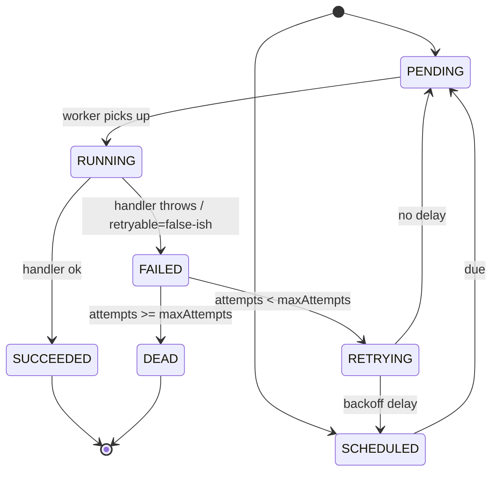
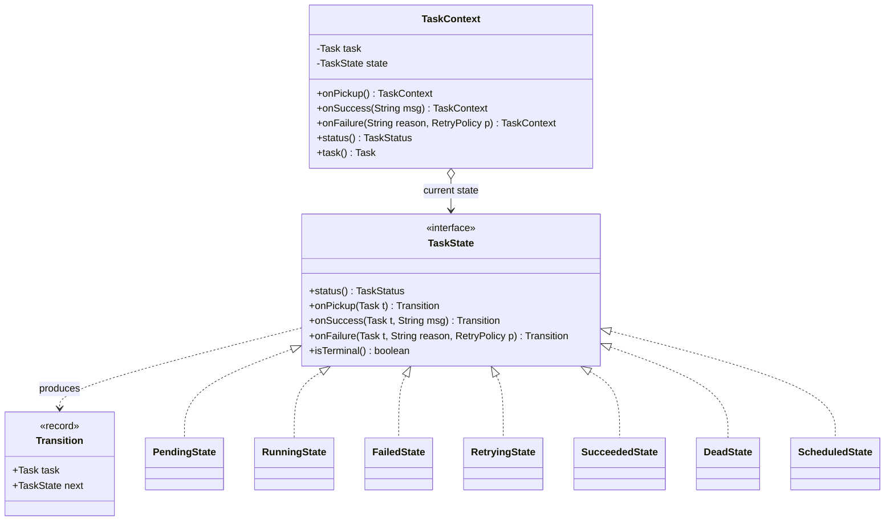

# State

> Where this fits in the project: every `Task` in our platform marches through a lifecycle — `PENDING` to `RUNNING` to `SUCCEEDED` or `FAILED`, then maybe `RETRYING`, then `DEAD`. The behavior of "what can this task do next?" and "what happens when a worker reports an outcome?" depends *entirely* on the current status. The State pattern makes each status an object that owns its own legal transitions, so the rules live in one obvious place instead of being smeared across `if`/`switch` blocks in the `Worker`, the `RetryHandler`, and the `TaskController`.

---

## 1. Why this exists — the real problem in our Task Queue

Recall the canonical status enum from the SPEC:

```java
public enum TaskStatus {
    PENDING, SCHEDULED, RUNNING, SUCCEEDED, FAILED, RETRYING, DEAD
}
```

These are not seven independent flags. They form a **state machine** with strict rules:

- A `PENDING` task can be picked up by a worker (`-> RUNNING`) or scheduled for later (`-> SCHEDULED`).
- A `SCHEDULED` task becomes due and goes `-> PENDING` (back into the ready queue).
- A `RUNNING` task either finishes (`-> SUCCEEDED`) or throws (`-> FAILED`).
- A `FAILED` task with attempts left goes `-> RETRYING`; one with no attempts left goes `-> DEAD`.
- A `RETRYING` task, once its backoff elapses, goes `-> PENDING` (or `-> SCHEDULED`).
- `SUCCEEDED` and `DEAD` are **terminal** — nothing transitions out of them.

Now think about the bugs that hurt in production. A worker crashes mid-task and a *second* worker tries to run the same task: we must reject `RUNNING -> RUNNING`. A retry handler fires after a task already `SUCCEEDED` (a duplicate event): we must reject `SUCCEEDED -> RETRYING`. A buggy admin endpoint tries to "re-queue" a `DEAD` task without resetting attempts: we must reject `DEAD -> PENDING` unless an explicit, audited reset happens.



The question every transition asks is: *given where I am, is this move legal, and what side effect should happen?* That logic has to live **somewhere**. The whole chapter is about choosing where.

---

## 2. The naive version — an enum and a pile of `switch`

The first thing a Java newcomer reaches for is to do the transition logic inline wherever a status changes. Here is the `Worker` doing it by hand:

```java
public final class Worker implements Runnable {
    private final TaskQueue queue;
    private final HandlerRegistry handlers;
    private final RetryHandler retryHandler;

    // ... constructor ...

    @Override
    public void run() {
        try {
            while (!Thread.currentThread().isInterrupted()) {
                Task task = queue.dequeue();

                // transition: PENDING -> RUNNING
                if (task.status() != TaskStatus.PENDING && task.status() != TaskStatus.RETRYING) {
                    // someone already grabbed it? skip
                    continue;
                }
                task = task.withStatus(TaskStatus.RUNNING);

                TaskHandler handler = handlers.lookup(task.type());
                try {
                    TaskResult result = handler.handle(task);
                    if (result.success()) {
                        // transition: RUNNING -> SUCCEEDED
                        task = task.withStatus(TaskStatus.SUCCEEDED);
                    } else if (result.retryable()) {
                        // transition: RUNNING -> FAILED -> RETRYING/DEAD
                        handleFailure(task);
                    } else {
                        task = task.withStatus(TaskStatus.FAILED).withStatus(TaskStatus.DEAD);
                    }
                } catch (Exception e) {
                    handleFailure(task);
                }
            }
        } catch (InterruptedException e) {
            Thread.currentThread().interrupt();
        }
    }

    private void handleFailure(Task task) {
        Task failed = task.withStatus(TaskStatus.FAILED).withAttempts(task.attempts() + 1);
        if (failed.attempts() < failed.maxAttempts()) {
            failed = failed.withStatus(TaskStatus.RETRYING);
            retryHandler.scheduleRetry(failed);
        } else {
            failed = failed.withStatus(TaskStatus.DEAD);
            // ... send to DLQ ...
        }
    }
}
```

Looks fine in isolation. Now multiply it. The `TaskController` (REST layer) has its *own* copy of "can this be cancelled?" logic. The `RetryHandler` re-checks attempts. The admin "requeue" endpoint has a third copy. The scheduler has a fourth. Each copy is *slightly* different. Here is what breaks:

1. **The legal-transition rules are nowhere and everywhere.** There is no single function you can read to learn the state machine. To answer "can a `DEAD` task go back to `PENDING`?" you must `grep` for `DEAD` across the codebase and read every `if`.
2. **Illegal transitions are silently allowed.** `task.withStatus(TaskStatus.RUNNING)` will happily set a `SUCCEEDED` task to `RUNNING`. Nothing stops it. The double-`withStatus` line (`FAILED` then `DEAD`) even skips `RETRYING` entirely — a real bug hiding in plain sight.
3. **Per-state behavior is duplicated.** "What side effect on entering `DEAD`?" (send to DLQ, emit metric, log) is copy-pasted and drifts.
4. **Adding a state is shotgun surgery.** Suppose we add `PAUSED`. You now edit every `switch`/`if` in five files and hope you found them all.

The naive version fails the most important test of a state machine: **you cannot enforce that only legal transitions happen, and you cannot read the rules in one place.**

---

## 3. A first improvement — the enum-with-`switch` (centralize the rules)

Before jumping to full State pattern objects, there is a real, pragmatic middle step: keep the enum, but make the enum itself own the transition rules. This is the single best refactor for *small* state machines and you should know it cold, because for many tasks it is the *right* answer.

```java
public enum TaskStatus {
    PENDING, SCHEDULED, RUNNING, SUCCEEDED, FAILED, RETRYING, DEAD;

    private static final Map<TaskStatus, Set<TaskStatus>> ALLOWED = Map.of(
        PENDING,   EnumSet.of(RUNNING, SCHEDULED),
        SCHEDULED, EnumSet.of(PENDING),
        RUNNING,   EnumSet.of(SUCCEEDED, FAILED),
        FAILED,    EnumSet.of(RETRYING, DEAD),
        RETRYING,  EnumSet.of(PENDING, SCHEDULED),
        SUCCEEDED, EnumSet.noneOf(TaskStatus.class),   // terminal
        DEAD,      EnumSet.noneOf(TaskStatus.class)    // terminal
    );

    public boolean canTransitionTo(TaskStatus next) {
        return ALLOWED.get(this).contains(next);
    }

    public boolean isTerminal() {
        return ALLOWED.get(this).isEmpty();
    }
}
```

Now there is exactly **one** place that knows the legal edges. The `Task` record enforces it on every change:

```java
public record Task(
    String id, String type, String payload, TaskStatus status,
    int attempts, int maxAttempts, Instant createdAt, Instant scheduledAt, int priority
) {
    /** Returns a new Task in {@code next}, or throws if the transition is illegal. */
    public Task transitionTo(TaskStatus next) {
        if (!status.canTransitionTo(next)) {
            throw new IllegalStateTransitionException(id, status, next);
        }
        return new Task(id, type, payload, next, attempts, maxAttempts,
                        createdAt, scheduledAt, priority);
    }

    // --- "wither" copy helpers used throughout this chapter ---------------
    // Records are immutable, so every change returns a fresh Task. These are
    // the low-level copy methods; the State objects below build on them.
    public Task withStatus(TaskStatus s) {
        return new Task(id, type, payload, s, attempts, maxAttempts,
                        createdAt, scheduledAt, priority);
    }
    public Task withAttempts(int a) {
        return new Task(id, type, payload, status, a, maxAttempts,
                        createdAt, scheduledAt, priority);
    }
    public Task withScheduledAt(Instant when) {
        return new Task(id, type, payload, status, attempts, maxAttempts,
                        createdAt, when, priority);
    }
}
```

> Note on the withers: a Java `record` does **not** generate `withX` copy methods (that proposal is still in preview as of Java 21), so we declare them explicitly. They each rebuild the record with one field changed — the immutable-object idiom from [../03-java-memory-model/immutable-objects.md](../03-java-memory-model/immutable-objects.md). Every `withStatus(...)` / `withAttempts(...)` / `withScheduledAt(...)` call in the rest of this chapter resolves to one of these. The naive `Worker` above uses the raw `withStatus`, which is exactly why it can produce illegal transitions; the State objects below route every change through a state that vets it first.

```java
public final class IllegalStateTransitionException extends RuntimeException {
    public IllegalStateTransitionException(String taskId, TaskStatus from, TaskStatus to) {
        super("Task %s: illegal transition %s -> %s".formatted(taskId, from, to));
    }
}
```

This is a huge step up. Illegal transitions now throw. The rules are in one table. For a state machine with a handful of states and *no per-state behavior beyond "is this edge legal?"*, **stop here** — this is production-grade and you should not over-engineer it.

What this version still cannot do cleanly:

- **Per-state behavior** ("on enter `DEAD`, send to DLQ + emit `task.dead` metric; on enter `RUNNING`, set a lease/heartbeat"). You would bolt a second `switch` onto the side, and now behavior and the transition table live apart.
- **Per-state decisions that need context** ("from `FAILED`, do I go to `RETRYING` or `DEAD`?" depends on `attempts` vs `maxAttempts` *and* on the `RetryPolicy`). A static table can't express "it depends."
- **Open/closed extension.** Adding a state still means editing the central enum (acceptable) *and* every behavior `switch` (not acceptable at scale).

When behavior — not just legality — varies per state, that is exactly the smell the State pattern was invented for.

---

## 4. The pattern — Intent, Motivation, Participants

> **Intent (GoF):** Allow an object to alter its behavior when its internal state changes. The object will appear to change its class.

**Motivation.** When an object's behavior depends on its state, and it must change behavior at runtime depending on that state, the naive solution is large conditionals that select behavior by an explicit state field. The State pattern instead represents each state as a **separate class implementing a common interface**, and delegates state-dependent behavior to the current state object. Transitions become "swap the state object." Because each state is its own class, per-state behavior and the set of legal next states are co-located and closed for modification but open for extension.

**Problem statement for us.** Each `TaskStatus` should answer the same set of questions — *can a worker start me? what happens when the handler succeeds? when it fails? am I terminal?* — but answer them **differently**, and own its **own** legal transitions and side effects. We want to add a state (say `PAUSED`) by writing one new class, not by editing six `switch` statements.

**Participants (mapped to our domain):**

| GoF role | In our Task Queue | Responsibility |
|----------|-------------------|----------------|
| `Context` | `TaskContext` (wraps a `Task`) | Holds the current state object; delegates requests to it; exposes a clean API to `Worker`/`RetryHandler`. |
| `State` | `TaskState` interface | Declares the state-dependent operations: `onSuccess`, `onFailure`, `onPickup`, `canTransitionTo`, `name`. |
| `ConcreteState` | `PendingState`, `RunningState`, `FailedState`, `RetryingState`, `SucceededState`, `DeadState`, `ScheduledState` | Each implements behavior for one status and decides the next state. |
| Trigger of transitions | the `ConcreteState`s (or the `Context`) | A state returns the next state; the context swaps it in. |

A note that separates seniors from juniors: **who triggers the transition?** Two valid designs. (a) The `Context` changes its own state based on a value the state returns. (b) The `ConcreteState` calls back into the `Context` to set the next state. We use (a) — states are *pure functions* `current -> outcome -> next`, which makes them trivially testable and (importantly) safe to use with our **immutable** `Task` record.

---

## 5. UML — the State pattern for tasks



> The `TaskContext` *aggregates* a `TaskState` (open diamond): the context holds a reference to a state object but does not own its lifecycle — states are stateless, shareable singletons. Each `ConcreteState` *realizes* the `TaskState` interface (hollow triangle). States *produce* `Transition` records (dependency, dashed arrow).

---

## 6. Refactor the naive code into the pattern

### The `State` abstraction

A transition is "the new `Task` plus the new state object." Modeling it as a record keeps states pure.

```java
public record Transition(Task task, TaskState next) {}

public interface TaskState {

    TaskStatus status();

    default boolean isTerminal() { return false; }

    /** A worker has dequeued this task and wants to run it. */
    default Transition onPickup(Task t) {
        throw new IllegalStateTransitionException(t.id(), status(), TaskStatus.RUNNING);
    }

    /** The handler returned success. */
    default Transition onSuccess(Task t, String message) {
        throw new IllegalStateTransitionException(t.id(), status(), TaskStatus.SUCCEEDED);
    }

    /** The handler failed (threw, or returned success=false). */
    default Transition onFailure(Task t, String reason, RetryPolicy policy) {
        throw new IllegalStateTransitionException(t.id(), status(), TaskStatus.FAILED);
    }
}
```

The `default` methods are the **secret weapon**: by default *every* operation in *every* state is illegal and throws. A concrete state only overrides the operations it actually permits. This makes illegal transitions impossible to reach by accident — the opposite of the naive version where everything was permitted by default.

### Concrete states

```java
public final class PendingState implements TaskState {
    public static final PendingState INSTANCE = new PendingState();
    private PendingState() {}

    @Override public TaskStatus status() { return TaskStatus.PENDING; }

    @Override
    public Transition onPickup(Task t) {
        Task running = t.withStatus(TaskStatus.RUNNING);
        return new Transition(running, RunningState.INSTANCE);
    }
}
```

```java
public final class RunningState implements TaskState {
    public static final RunningState INSTANCE = new RunningState();
    private RunningState() {}

    @Override public TaskStatus status() { return TaskStatus.RUNNING; }

    @Override
    public Transition onSuccess(Task t, String message) {
        Task done = t.withStatus(TaskStatus.SUCCEEDED);
        return new Transition(done, SucceededState.INSTANCE);
    }

    @Override
    public Transition onFailure(Task t, String reason, RetryPolicy policy) {
        // Move to FAILED first, bumping the attempt count.
        Task failed = t.withStatus(TaskStatus.FAILED).withAttempts(t.attempts() + 1);
        // FailedState decides RETRYING vs DEAD, using the policy.
        return FailedState.INSTANCE.onFailure(failed, reason, policy);
    }
}
```

```java
public final class FailedState implements TaskState {
    public static final FailedState INSTANCE = new FailedState();
    private FailedState() {}

    @Override public TaskStatus status() { return TaskStatus.FAILED; }

    @Override
    public Transition onFailure(Task t, String reason, RetryPolicy policy) {
        Optional<Duration> delay = policy.nextDelay(t.attempts());
        if (delay.isPresent() && t.attempts() < t.maxAttempts()) {
            Instant when = Instant.now().plus(delay.get());
            Task retrying = t.withStatus(TaskStatus.RETRYING).withScheduledAt(when);
            return new Transition(retrying, RetryingState.INSTANCE);
        }
        Task dead = t.withStatus(TaskStatus.DEAD);
        return new Transition(dead, DeadState.INSTANCE);
    }
}
```

```java
public final class RetryingState implements TaskState {
    public static final RetryingState INSTANCE = new RetryingState();
    private RetryingState() {}

    @Override public TaskStatus status() { return TaskStatus.RETRYING; }

    /** Backoff elapsed; the task is ready to be picked up again. */
    @Override
    public Transition onPickup(Task t) {
        Task running = t.withStatus(TaskStatus.RUNNING);
        return new Transition(running, RunningState.INSTANCE);
    }
}
```

```java
public final class SucceededState implements TaskState {
    public static final SucceededState INSTANCE = new SucceededState();
    private SucceededState() {}
    @Override public TaskStatus status() { return TaskStatus.SUCCEEDED; }
    @Override public boolean isTerminal() { return true; }
    // inherits all-throwing defaults: nothing transitions out of SUCCEEDED
}

public final class DeadState implements TaskState {
    public static final DeadState INSTANCE = new DeadState();
    private DeadState() {}
    @Override public TaskStatus status() { return TaskStatus.DEAD; }
    @Override public boolean isTerminal() { return true; }
}
```

```java
public final class ScheduledState implements TaskState {
    public static final ScheduledState INSTANCE = new ScheduledState();
    private ScheduledState() {}

    @Override public TaskStatus status() { return TaskStatus.SCHEDULED; }

    /** The scheduled time arrived; release into the ready queue. */
    @Override
    public Transition onPickup(Task t) {
        Task pending = t.withStatus(TaskStatus.PENDING);
        return new Transition(pending, PendingState.INSTANCE);
    }
}
```

### The `Context`

The context wires a `Task` to its state object and exposes a clean, *total* API. It is the only thing `Worker` talks to.

```java
public final class TaskContext {
    private final Task task;
    private final TaskState state;

    private TaskContext(Task task, TaskState state) {
        this.task = task;
        this.state = state;
    }

    /** Rehydrate a context from a persisted Task (e.g. loaded from Postgres). */
    public static TaskContext of(Task task) {
        return new TaskContext(task, TaskStates.forStatus(task.status()));
    }

    public TaskContext onPickup() {
        Transition tr = state.onPickup(task);
        return new TaskContext(tr.task(), tr.next());
    }

    public TaskContext onSuccess(String message) {
        Transition tr = state.onSuccess(task, message);
        return new TaskContext(tr.task(), tr.next());
    }

    public TaskContext onFailure(String reason, RetryPolicy policy) {
        Transition tr = state.onFailure(task, reason, policy);
        return new TaskContext(tr.task(), tr.next());
    }

    public Task task() { return task; }
    public TaskStatus status() { return state.status(); }
    public boolean isTerminal() { return state.isTerminal(); }
}
```

```java
/** Maps a persisted TaskStatus back to its singleton state object. */
final class TaskStates {
    private TaskStates() {}

    static TaskState forStatus(TaskStatus s) {
        return switch (s) {
            case PENDING   -> PendingState.INSTANCE;
            case SCHEDULED -> ScheduledState.INSTANCE;
            case RUNNING   -> RunningState.INSTANCE;
            case FAILED    -> FailedState.INSTANCE;
            case RETRYING  -> RetryingState.INSTANCE;
            case SUCCEEDED -> SucceededState.INSTANCE;
            case DEAD      -> DeadState.INSTANCE;
        };
    }
}
```

> Yes — there is *one* `switch` left, in `forStatus`. That is the **boundary** `switch`: it maps a persisted primitive (a DB column) back to a state object exactly once, when we rehydrate from storage. The exhaustive switch over a sealed enum is compile-time-checked: add a status and the compiler forces you to handle it here. This is the single legitimate `switch` in a State design, and it is intentional.

### The `Worker`, now trivial

```java
@Override
public void run() {
    try {
        while (!Thread.currentThread().isInterrupted()) {
            Task dequeued = queue.dequeue();
            TaskContext ctx = TaskContext.of(dequeued).onPickup();   // -> RUNNING (throws if illegal)
            TaskHandler handler = handlers.lookup(ctx.task().type());
            try {
                TaskResult result = handler.handle(ctx.task());
                ctx = result.success()
                    ? ctx.onSuccess(result.message())
                    : ctx.onFailure(result.message(), retryPolicy);
            } catch (Exception e) {
                ctx = ctx.onFailure(e.toString(), retryPolicy);      // -> RETRYING or DEAD
            }
            repository.save(ctx.task());
            if (ctx.status() == TaskStatus.RETRYING) {
                scheduler.schedule(ctx.task(), Duration.between(Instant.now(), ctx.task().scheduledAt()));
            } else if (ctx.status() == TaskStatus.DEAD) {
                deadLetterQueue.send(ctx.task(), "max attempts exhausted");
            }
        }
    } catch (InterruptedException e) {
        Thread.currentThread().interrupt();
    }
}
```

The `Worker` no longer knows *any* transition rules. It says "pick up," "succeeded," "failed," and the states decide. The `RETRYING`-vs-`DEAD` branch that was a bug magnet in the naive code now lives in exactly one place: `FailedState.onFailure`.

---

## 7. Before-and-after comparison

| Concern | Naive (`if`/`switch` everywhere) | Enum + transition table | State pattern |
|---|---|---|---|
| Where are the legal transitions? | Scattered across 5+ files | One `Map` in the enum | One method per state class |
| Illegal transition | Silently allowed | Throws | Throws (default methods) |
| Per-state *behavior* (side effects) | Duplicated | Bolted-on second `switch` | Co-located in the state class |
| "It depends" transitions (`FAILED`→`RETRYING`/`DEAD`) | Inline `if (attempts...)` | Hard to express in a static map | Natural: `FailedState` decides |
| Add a new state (`PAUSED`) | Edit every `switch` | Edit the table + behavior switch | Add one class + one line in `forStatus` |
| Unit-testable in isolation | No (need a `Worker`) | Partly | Yes — each state is a pure function |
| Lines of code | Fewest | Few | Most (more classes) |
| Best for | nothing | small machines, legality-only | rich per-state behavior, growth |

The honest takeaway is in the last two rows: **the State pattern costs you classes.** For a 3-state, legality-only machine, the enum table wins. For our 7-state machine with real per-state side effects and a `FAILED` node whose next hop *depends on context*, the State pattern earns its keep.

---

## 8. A simple Java example — a turnstile

Strip away the domain to see the bones. A subway turnstile is `LOCKED` or `UNLOCKED`; inserting a coin or pushing behaves differently per state.

```java
sealed interface TurnstileState permits Locked, Unlocked {
    TurnstileState coin();   // insert a coin
    TurnstileState push();   // push the arm
}

final class Locked implements TurnstileState {
    static final Locked INSTANCE = new Locked();
    public TurnstileState coin() { System.out.println("unlocked"); return Unlocked.INSTANCE; }
    public TurnstileState push() { System.out.println("denied (locked)"); return this; }
}

final class Unlocked implements TurnstileState {
    static final Unlocked INSTANCE = new Unlocked();
    public TurnstileState coin() { System.out.println("thanks, already unlocked"); return this; }
    public TurnstileState push() { System.out.println("you may pass"); return Locked.INSTANCE; }
}

final class Turnstile {
    private TurnstileState state = Locked.INSTANCE;
    void coin() { state = state.coin(); }
    void push() { state = state.push(); }
}
```

```java
Turnstile t = new Turnstile();
t.push();   // denied (locked)
t.coin();   // unlocked
t.push();   // you may pass   -> back to Locked
```

Notice: *no `if` on the state field anywhere.* The current object *is* the behavior. The `sealed interface` makes the set of states closed and lets the compiler verify exhaustive `switch` if you ever need one.

---

## 9. A real-world Java example — an order lifecycle

You have already used the State pattern without naming it. `java.lang.Thread.State`, TCP connection states, and Spring Statemachine are all instances. Here is a familiar e-commerce order, the canonical interview example:

```java
sealed interface OrderState permits Created, Paid, Shipped, Delivered, Cancelled {
    default OrderState pay()    { throw illegal("pay"); }
    default OrderState ship()   { throw illegal("ship"); }
    default OrderState deliver(){ throw illegal("deliver"); }
    default OrderState cancel() { throw illegal("cancel"); }
    default IllegalStateException illegal(String op) {
        return new IllegalStateException(op + " not allowed in " + getClass().getSimpleName());
    }
}

record Created()   implements OrderState {
    public OrderState pay()    { return new Paid(); }
    public OrderState cancel() { return new Cancelled(); }
}
record Paid()      implements OrderState {
    public OrderState ship()   { return new Shipped(); }
    public OrderState cancel() { return new Cancelled(); }   // refund handled elsewhere
}
record Shipped()   implements OrderState {
    public OrderState deliver(){ return new Delivered(); }
}
record Delivered() implements OrderState {}   // terminal: all ops throw
record Cancelled() implements OrderState {}   // terminal
```

Same shape as the task machine: an interface with all-throwing defaults, one record per state, transitions returning the next state. The records carry no fields here, but in a richer design `Paid` could hold a `paymentId` that only the `Paid` state knows about — a thing the flat enum could never express.

---

## 10. Production notes — where it's used, when NOT to, anti-patterns

**Where the industry uses it.**

- **Workflow / job engines.** Temporal, AWS Step Functions, Camunda, and Netflix Conductor are state machines at their core. Every durable task framework — including ours — is a state machine over a status column.
- **Protocol handlers.** TCP (`LISTEN`/`SYN_SENT`/`ESTABLISHED`/...), TLS handshakes, and HTTP/2 stream states are textbook State machines.
- **UI and editors.** Document state (`draft`/`review`/`published`), media players (`stopped`/`playing`/`paused`).
- **Spring Statemachine** and **XState** (JS) exist purely to formalize this pattern with guards, actions, and persistence.

**When NOT to use it.**

- **Few states, no per-state behavior.** If the only question is "is this edge legal?", the enum transition table from Section 3 is simpler and just as correct. Do not create seven classes to replace a seven-line `Map`.
- **States that don't change behavior, only data.** If `RUNNING` and `SUCCEEDED` run the *same* code with a different flag, you don't have a state machine — you have a boolean. Use a field.
- **Explosive state graphs.** If transitions depend on *combinations* of several independent variables, you get a combinatorial blowup of classes. Reach for **hierarchical/orthogonal states** (statecharts) or a rules engine instead.

**Anti-patterns to avoid.**

- **Leaking transition logic back out.** If `Worker` still says `if (status == DEAD)` to decide a transition, you've split the brain. The context's API should be verbs (`onFailure`), not status checks. (Reading status for *side-effect routing* — like "send to DLQ" — is fine; *deciding the next state* outside the state is not.)
- **Stateful state objects.** Our states are singletons precisely because they hold no per-task data — all data lives on the immutable `Task`. If a state object holds mutable fields, you've reintroduced the shared-mutable-state bugs the pattern was supposed to kill, and singletons become unsafe.
- **Bidirectional context↔state coupling.** Letting the state mutate the context, which calls the state, which mutates the context... is a debugging nightmare. Prefer pure states that *return* the next state (our `Transition` record).
- **Forgetting persistence rehydration.** In Phase 2 the `Task` lives in Postgres as a `status` string. You must map that string back to a state object on load (`TaskStates.forStatus`). Forgetting this is the #1 production bug with this pattern.

---

## 11. How this applies to our Task Queue project

- The `TaskState` interface + concrete states own the `TaskStatus` lifecycle. The `Worker` (canonical `class Worker implements Runnable`) delegates outcomes through `TaskContext`.
- `FailedState` consults the canonical `RetryPolicy` (`Optional<Duration> nextDelay(int attempt)`) to choose `RETRYING` vs `DEAD`, then the `Worker` routes `DEAD` tasks to the `DeadLetterQueue` (`send(Task t, String reason)`). The State pattern decides *what* the next state is; the surrounding services decide *what side effects* fire on entering it.
- In **Phase 2**, `TaskRepository.save(Task t)` persists `status` as a column; `TaskContext.of(task)` rehydrates the right state on load. Flyway migration adds a `CHECK` constraint mirroring the legal transitions as a defense-in-depth (DB-level guard against bugs that bypass the app).
- In **Phase 4**, state changes become `TaskEvent`s published on the `EventBus` (`publish(TaskEvent e)`): `onSuccess` emits a `TaskSucceeded`, `onFailure` emits `TaskFailed`/`TaskDead`. The state machine becomes the *source of truth* for the event stream.
- Cross-links: the `RetryPolicy` is detailed in [../08-distributed-systems/retries.md](../08-distributed-systems/retries.md); the DLQ in [../07-queues-and-messaging/dead-letter-queues.md](../07-queues-and-messaging/dead-letter-queues.md); the `BlockingQueue` the `Worker` pulls from in [../06-concurrency/blocking-queue.md](../06-concurrency/blocking-queue.md). This pattern is the natural companion to [./command.md](./command.md) (each transition can be a command) and [./observer.md](./observer.md) (state changes notify observers).

---

## 12. Tradeoffs

| Axis | State pattern | Verdict |
|---|---|---|
| Readability of rules | Each state's rules are local and obvious | + |
| Open/closed | Add a state = add a class | + |
| Illegal-transition safety | Default-throw makes illegal moves impossible by accident | + |
| Testability | States are pure functions; trivial to unit test | + |
| Class count | One class per state (7 here) | − |
| Indirection | A reader must jump between state classes to see the whole graph | − |
| Concurrency | Singletons + immutable `Task` = thread-safe by construction | + |
| Persistence | Needs an explicit status↔state mapping at the boundary | − (one-time cost) |

**The single most important tradeoff:** State trades *more classes and more indirection* for *localized, enforceable, extensible per-state behavior*. Pay it when behavior genuinely varies per state and the machine will grow. Skip it (use the enum table) when it won't.

---

## 13. Common mistakes and pitfalls

- **Mutating the `Task` in place.** Our `Task` is an immutable record; `withStatus` returns a *new* `Task`. If you `task.status = X` (you can't, but conceptually), you lose the audit trail and break concurrency. *Fix: always return a new `Task` from a transition.*
- **Putting side effects inside states.** A state deciding `-> DEAD` should not itself call `deadLetterQueue.send(...)`. That couples the pure transition logic to infrastructure and makes states untestable. *Fix: states return the next state; the `Worker`/orchestrator performs side effects based on the resulting status.*
- **Allowing transitions by default.** If your base interface returns a value instead of throwing for unhandled operations, every state silently permits everything. *Fix: default methods throw `IllegalStateTransitionException`.*
- **Forgetting terminal states.** `SUCCEEDED`/`DEAD` must reject *all* operations. Inheriting the throwing defaults gives this for free. *Fix: don't override anything in terminal states; add `isTerminal() { return true; }` for callers that want to ask.*
- **Two sources of truth.** Keeping both a `TaskStatus status` field *and* a `TaskState` object that can disagree. *Fix: derive `status()` from the state object, or rehydrate the state from `status` — never let them drift.*
- **Concurrent transition on the same task.** Two workers grab the same row. *Fix: combine the pattern with optimistic locking — `UPDATE tasks SET status='RUNNING', version=version+1 WHERE id=? AND version=? AND status='PENDING'`. The app-level pattern and the DB guard are complementary, not redundant.*

---

## 14. Refactoring exercise — bad to better to production

**Bad** — behavior selected by a giant `switch`, illegal moves allowed:

```java
Task advance(Task t, String event) {
    switch (t.status()) {
        case PENDING:
            if (event.equals("pickup")) return t.withStatus(TaskStatus.RUNNING);
            break;
        case RUNNING:
            if (event.equals("success")) return t.withStatus(TaskStatus.SUCCEEDED);
            if (event.equals("failure")) return t.withStatus(TaskStatus.FAILED);
            break;
        // ... and so on, with FAILED->? logic copy-pasted, terminals unguarded ...
    }
    return t.withStatus(TaskStatus.valueOf(event.toUpperCase())); // anything goes!
}
```

**Better** — the enum transition table from Section 3 (centralized legality, throws on illegal). Good enough for legality-only machines.

**Production** — the full State pattern from Section 6: an interface with throwing defaults, one immutable singleton per state, `FailedState` consulting the `RetryPolicy`, a `TaskContext` exposing verb methods, and one boundary `switch` in `forStatus` for rehydration. Behavior and legal edges are co-located; illegal moves throw; adding `PAUSED` is one new class.

---

## 15. Exercises

### Easy

**E1 (knowledge check).** In the State pattern, what is the role of the `Context` versus a `ConcreteState`? Why do we make our concrete states singletons?

**E2 (pattern identification).** Look at this code. Which pattern is it, and what's the smell that says "refactor me"?

```java
String render(String docStatus) {
    if (docStatus.equals("DRAFT")) return renderDraft();
    else if (docStatus.equals("REVIEW")) return renderReview();
    else if (docStatus.equals("PUBLISHED")) return renderPublished();
    else throw new IllegalArgumentException(docStatus);
}
// ... and 4 other methods with the identical if/else chain ...
```

### Medium

**M1 (coding).** Add a `PausedState` to our task machine. Rules: a `RUNNING` or `PENDING` task can be paused (`-> PAUSED`); a `PAUSED` task can be resumed (`-> PENDING`) or cancelled (`-> DEAD`). Add the needed methods to `TaskState`, the new class, and the `forStatus` mapping. List every file you touch.

**M2 (refactoring).** The naive `Worker` in Section 2 has a real bug: the line `task.withStatus(TaskStatus.FAILED).withStatus(TaskStatus.DEAD)` skips `RETRYING` even when attempts remain. Show how the State pattern makes this bug unrepresentable, and explain why.

### Hard

**H1 (design).** We need a full audit trail: every transition must record `(taskId, from, to, timestamp, reason)`. Design how to capture this *without* polluting each state class with logging. Sketch the API.

**H2 (interview-style).** A reviewer says "this is over-engineered — just use an enum with a transition map." Argue *for* and *against* the State pattern for our specific 7-state task machine. When are they right?

---

## 16. Solutions

**E1.** The `Context` (`TaskContext`) holds the current state, delegates state-dependent operations to it, and gives the rest of the system a clean, total API (verb methods like `onSuccess`). A `ConcreteState` (e.g. `RunningState`) implements behavior for exactly one status and decides the next state. We make states **singletons** because they are *stateless* — all per-task data lives on the immutable `Task`. One immutable, shared instance per state is thread-safe, allocation-free, and lets us compare states by identity.

**E2.** It is a **state machine implemented as scattered conditionals** — the naive anti-pattern this chapter targets. The smell: the *same* `if/else` chain over `docStatus` is duplicated across multiple methods (`render`, presumably `canEdit`, `availableActions`, ...). Refactor to the State pattern: a `DocumentState` interface with `Draft`/`Review`/`Published` classes, each implementing `render`/`canEdit`/etc. for its own status.

**M1.** Touched files: `TaskState.java` (add `onPause`/`onResume`/`onCancel` defaults that throw), `PendingState.java` and `RunningState.java` (override `onPause`), new `PausedState.java`, `TaskStates.java` (add the `case PAUSED`), and the `TaskStatus` enum (add `PAUSED`).

```java
// In TaskState — new throwing defaults
default Transition onPause(Task t)  { throw new IllegalStateTransitionException(t.id(), status(), TaskStatus.PAUSED); }
default Transition onResume(Task t) { throw new IllegalStateTransitionException(t.id(), status(), TaskStatus.PENDING); }
default Transition onCancel(Task t) { throw new IllegalStateTransitionException(t.id(), status(), TaskStatus.DEAD); }
```

```java
public final class PausedState implements TaskState {
    public static final PausedState INSTANCE = new PausedState();
    private PausedState() {}
    @Override public TaskStatus status() { return TaskStatus.PAUSED; }

    @Override public Transition onResume(Task t) {
        return new Transition(t.withStatus(TaskStatus.PENDING), PendingState.INSTANCE);
    }
    @Override public Transition onCancel(Task t) {
        return new Transition(t.withStatus(TaskStatus.DEAD), DeadState.INSTANCE);
    }
}
```

```java
// PendingState and RunningState each add:
@Override public Transition onPause(Task t) {
    return new Transition(t.withStatus(TaskStatus.PAUSED), PausedState.INSTANCE);
}
```

```java
// TaskStates.forStatus — add the arm; the exhaustive switch won't compile until you do
case PAUSED -> PausedState.INSTANCE;
```

The point of the exercise: adding a state was **one new class + a handful of overrides**, with the compiler forcing you to handle the new enum value in `forStatus`. No `switch` hunting across the codebase.

**M2.** In the State design, `RunningState.onFailure` delegates to `FailedState.onFailure`, which is the *only* code that decides `RETRYING` vs `DEAD`, and it does so by consulting `RetryPolicy` and `attempts < maxAttempts`. There is no way to write `withStatus(FAILED).withStatus(DEAD)` because (a) callers never call `withStatus` directly — they call `ctx.onFailure(...)`, and (b) `SucceededState`/`DeadState` reject every operation via the throwing defaults. The bug is *unrepresentable* because the only path to `DEAD` runs through the single decision point in `FailedState`. The naive code allowed it because `withStatus` is an unguarded primitive that any caller can chain arbitrarily.

**H1.** Don't log inside states — keep them pure. Capture audit at the **`TaskContext` seam**, the one place every transition flows through. Have each transition produce its outcome, then record `(from, to)` before returning the new context:

```java
public TaskContext onFailure(String reason, RetryPolicy policy) {
    TaskStatus from = state.status();
    Transition tr = state.onFailure(task, reason, policy);
    auditLog.record(new TransitionRecord(task.id(), from, tr.next().status(), Instant.now(), reason));
    return new TaskContext(tr.task(), tr.next());
}
```

```java
public record TransitionRecord(String taskId, TaskStatus from, TaskStatus to, Instant at, String reason) {}

public interface TransitionAuditLog { void record(TransitionRecord r); }
```

States stay pure and testable; one place — the context — owns auditing. In Phase 4 `TransitionAuditLog` becomes a thin adapter that publishes a `TaskEvent` on the `EventBus`. Alternative: wrap `TaskContext` in a logging **decorator** (see [./decorator.md](./decorator.md)) so even the context stays audit-free.

**H2.** *For the pattern:* our machine has 7 states, real **per-state side-effect surface** (DLQ on `DEAD`, scheduling on `RETRYING`, leasing on `RUNNING`), and a `FAILED` node whose next hop **depends on context** (`RetryPolicy`, `attempts`) — a static map cannot express "it depends." We expect growth (`PAUSED`, `CANCELLED`, manual-requeue). State gives default-throw safety, per-state co-location, and pure-function testability. *Against:* it costs ~7 classes and more indirection; a reader must hop between files to see the whole graph; and a boundary `switch` survives anyway. *The reviewer is right when* behavior is legality-only and the machine is small/stable — then the enum table in Section 3 is the better engineering choice. The deciding question is never "which is more clever" but **"does behavior vary per state, and will the machine grow?"** For *this* machine: yes and yes, so State wins. For a 3-state `draft/published/archived` flag: no, use the enum.

---

## 17. Interview questions and takeaways

1. **What problem does the State pattern solve?** Behavior that depends on an object's internal state, where conditionals selecting behavior by a state field grow unmanageable. It makes the object "appear to change its class" by delegating to a state object.
2. **State vs Strategy — they look identical. What's the difference?** Structurally identical (both delegate to an interface). *Intent* differs: Strategy is chosen by the *client* and is independent of object lifecycle; State objects *swap themselves* as the context evolves, and states know about each other (a state returns the next state). See [./strategy.md](./strategy.md).
3. **How do you enforce only legal transitions?** Base interface defaults throw; each concrete state overrides only its permitted operations. Optionally back it with a DB `CHECK` constraint or optimistic locking.
4. **Who triggers the transition — context or state?** Either is valid. We let states *return* the next state (pure functions), and the context swaps it. Avoids bidirectional coupling and is safe with immutable data.
5. **How does this survive persistence/restart?** Persist the `status` primitive; rehydrate the state object via a boundary `switch` (`forStatus`). The state objects themselves are stateless singletons.
6. **When would you NOT use it?** Few states with legality-only rules — use an enum transition map. Behavior that varies by data, not state — use a field.
7. **How do you avoid a class explosion?** Hierarchical/orthogonal states (statecharts) for combinatorial graphs; or a rules/transition-table engine when the graph is data, not code.

**Takeaways:** one class per state, throwing defaults for safety, pure states + immutable data for concurrency, a single boundary `switch` for rehydration, and the discipline to *not* reach for it when an enum table suffices.

---

## 18. Production considerations

- **Concurrency at scale.** The app-level state machine prevents *logic* bugs but not *races*. Two workers can still both load a `PENDING` task. Pair the pattern with optimistic locking (a `version` column) or a `SELECT ... FOR UPDATE SKIP LOCKED` claim so only one worker wins the `PENDING -> RUNNING` edge.
- **Defense in depth at the DB.** Add a Flyway migration with a `CHECK` or a trigger that mirrors the legal edges, so a buggy or rogue writer cannot persist `SUCCEEDED -> RUNNING`.

```sql
ALTER TABLE tasks ADD CONSTRAINT chk_status
  CHECK (status IN ('PENDING','SCHEDULED','RUNNING','SUCCEEDED','FAILED','RETRYING','DEAD'));
```

- **Observability.** Emit a counter per transition (`task_transition_total{from,to}` via Micrometer) and a gauge of tasks per state. A sudden spike in `RUNNING -> FAILED` or a growing `DEAD` count is your earliest signal of a broken handler. See [../10-system-design/observability-and-ops.md](../10-system-design/observability-and-ops.md).
- **Stuck-state detection.** A task stuck in `RUNNING` past a lease timeout means a worker died. A reaper job transitions stale `RUNNING` tasks back to `PENDING` (or `FAILED`) — itself a legal transition you must add to the machine.
- **Schema evolution.** Renaming or removing a status is a data migration, not just a code change. The boundary `switch` will fail to compile (good), but the DB still holds old values — migrate them first.

---

## What We Can Improve In Our Project Using This Concept

Today the `Worker` and `RetryHandler` both contain inline status logic. We can extract a `TaskState` interface with one `ConcreteState` per `TaskStatus`, route all outcomes through a `TaskContext`, and delete the duplicated `if (status == ...)` branches. `FailedState` becomes the single owner of the `RETRYING`-vs-`DEAD` decision (consulting `RetryPolicy`), and terminal states (`SUCCEEDED`, `DEAD`) become un-exitable by construction. This kills a whole class of "illegal transition slipped through" bugs and makes adding states (`PAUSED`, `CANCELLED`) a one-class change.

## Project Refactoring Task

1. Add `TaskState` (interface, throwing defaults), `Transition` (record), and the seven `ConcreteState` singletons.
2. Add `TaskContext` with verb methods (`onPickup`, `onSuccess`, `onFailure`) and `TaskStates.forStatus`.
3. Rewrite `Worker.run()` to delegate through `TaskContext`; remove all inline transition `if`s.
4. Move the `RETRYING`/`DEAD` decision out of `RetryHandler` into `FailedState`.
5. Add `IllegalStateTransitionException` and a unit test per state asserting that illegal operations throw.
6. (Phase 2) Add `TaskContext.of` rehydration and a Flyway `CHECK` constraint.

## Git Commit For This Chapter

```text
refactor(task-state): model TaskStatus lifecycle with the State pattern

- add TaskState interface with throwing defaults (illegal-by-default)
- add Pending/Scheduled/Running/Failed/Retrying/Succeeded/Dead states as singletons
- add TaskContext + Transition; move RETRYING-vs-DEAD decision into FailedState
- rewrite Worker to delegate outcomes via TaskContext; delete inline transition switches
- add IllegalStateTransitionException + per-state unit tests

Files: src/main/java/.../task/state/TaskState.java,
       src/main/java/.../task/state/{Pending,Scheduled,Running,Failed,Retrying,Succeeded,Dead}State.java,
       src/main/java/.../task/state/{TaskContext,Transition,TaskStates}.java,
       src/main/java/.../worker/Worker.java,
       src/main/java/.../retry/RetryHandler.java,
       src/test/java/.../task/state/TaskStateTest.java
```

## Architecture Impact

The status lifecycle becomes a first-class, single-source-of-truth subsystem. `Worker`, `RetryHandler`, `TaskController`, and the scheduler all stop owning transition rules and instead ask `TaskContext`. This is the foundation for Phase 4's event-driven design: each transition is the natural place to publish a `TaskEvent` on the `EventBus`, so the state machine becomes the authoritative producer of the platform's event stream. It also localizes the place where DB-level guards (optimistic locking, `CHECK` constraints) attach.

## Interview Takeaways

- The State pattern turns "behavior depends on a status field" into "behavior lives on a state object"; the object appears to change its class.
- Throwing defaults make illegal transitions impossible by accident — the inverse of the everything-allowed naive version.
- It is *structurally* identical to Strategy; the difference is intent — states swap themselves and know each other; strategies are chosen by the client.
- Don't reach for it when an enum transition map suffices (few states, legality only). Reach for it when per-state *behavior* varies and the machine will grow.
- In production, pair it with optimistic locking / DB constraints (races) and per-transition metrics (observability); persist the primitive and rehydrate the state at the boundary.
