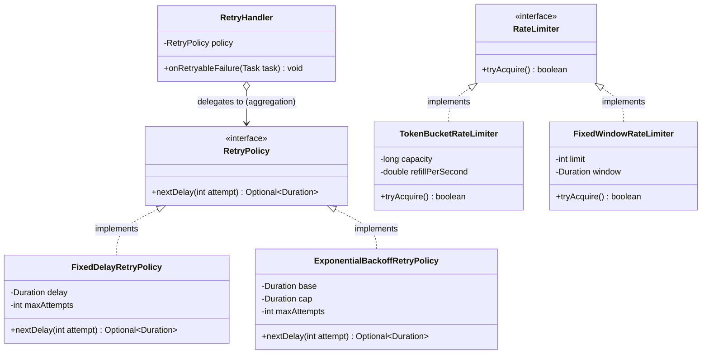
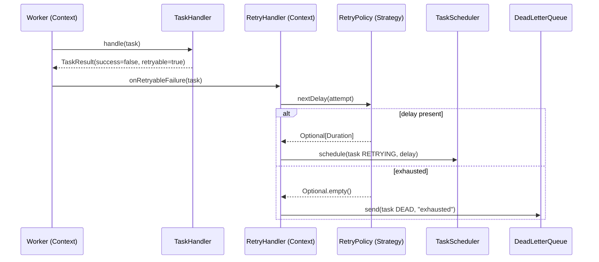

# Strategy

> Where this fits in the project: the Strategy pattern is how our Task Queue swaps **retry policies** (fixed delay vs exponential backoff with jitter) and **rate-limiting algorithms** at runtime without touching the `Worker`, `RetryHandler`, or API layer. It is, by a wide margin, the single most-used pattern in this codebase.

If you internalize exactly one design pattern from this module, make it this one. Strategy is the pattern that turns "a giant `if/else` on a type field" into "a small interface plus interchangeable implementations." In a backend that must support multiple retry behaviors, multiple rate limiters, multiple serialization formats, and multiple broker drivers, Strategy is the load-bearing wall.

---

## 1. The real problem in our Task Queue

A `Worker` pulls a `Task` from the queue, runs its `TaskHandler`, and gets back a `TaskResult`. When the result says "failed but retryable," something has to decide: **do we retry, and if so, after how long?**

Different task types need different answers:

- A `send-email` task hits a flaky SMTP relay. We want **exponential backoff with jitter** so a thousand failing workers do not all retry in lockstep and create a thundering herd.
- A `generate-report` task talks to an internal service with a fixed SLA. A **fixed 5-second delay** is fine and predictable.
- A `webhook-callback` task should retry a few times fast, then give up.

Separately, on the ingress side, the API must throttle submissions. Sometimes we want a **token bucket** (allow bursts up to a cap, refill at a steady rate); sometimes a strict **fixed-window** counter is good enough; later we may want a **sliding window** for smoother behavior.

In both cases we have **one algorithm slot** with **many interchangeable algorithms**, and the choice must be configurable per task type, per tenant, or per environment — ideally without redeploying. That is the textbook trigger for Strategy.

Recall the canonical contracts from the spec we are working against:

```java
public record TaskResult(boolean success, String message, boolean retryable) {}

public interface RetryPolicy {
    /** Returns the delay before attempt number {@code attempt}, or empty if we should stop retrying. */
    Optional<Duration> nextDelay(int attempt);
}

public interface RateLimiter {
    boolean tryAcquire();
}
```

Notice these interfaces are *already* strategies. The whole point of this chapter is to understand **why** they look like that, and how to wield the pattern deliberately instead of by accident.

---

## 2. The naive version (and why it rots)

Here is the first cut a lot of engineers write. The retry decision lives inside the `RetryHandler` as a switch on a `policyType` string, and the rate limiter does the same.

```java
// NAIVE: branching on a type field. Don't ship this.
public final class RetryHandler {

    private final String policyType;       // "FIXED" or "EXPONENTIAL"
    private final long baseMillis;
    private final int maxAttempts;

    public RetryHandler(String policyType, long baseMillis, int maxAttempts) {
        this.policyType = policyType;
        this.baseMillis = baseMillis;
        this.maxAttempts = maxAttempts;
    }

    public Optional<Duration> nextDelay(int attempt) {
        if (attempt >= maxAttempts) {
            return Optional.empty();
        }
        if (policyType.equals("FIXED")) {
            return Optional.of(Duration.ofMillis(baseMillis));
        } else if (policyType.equals("EXPONENTIAL")) {
            long delay = baseMillis * (long) Math.pow(2, attempt);
            // someone will add jitter here later... by copy-pasting
            return Optional.of(Duration.ofMillis(delay));
        } else if (policyType.equals("EXPONENTIAL_JITTER")) {
            long base = baseMillis * (long) Math.pow(2, attempt);
            long jitter = ThreadLocalRandom.current().nextLong(base / 2);
            return Optional.of(Duration.ofMillis(base / 2 + jitter));
        }
        throw new IllegalArgumentException("Unknown policy: " + policyType);
    }
}
```

What is wrong with this? It compiles, it passes a happy-path test, and it will *absolutely* haunt you:

- **Open/Closed violation.** Every new policy (decorrelated jitter, capped exponential, Fibonacci backoff) means editing this class and re-testing every existing branch. The class never stops changing. See [SOLID](../04-oop-and-ood/solid.md).
- **The class has many responsibilities.** It computes fixed delays, exponential delays, jitter math, *and* the stop condition. Cohesion is low.
- **Stringly-typed dispatch.** `"EXPONENTAIL"` (typo) fails at runtime, not compile time. The `else throw` is a landmine.
- **Untestable in isolation.** You cannot unit-test "exponential backoff" without constructing the whole handler and steering it through the right branch.
- **Configuration sprawl.** Each algorithm needs different parameters (`baseMillis`, `cap`, `jitterFactor`), so the constructor accumulates nullable fields that only matter for some branches.
- **Duplication across the codebase.** The rate limiter will grow an identical `switch (algorithm)` block, and so will the serializer, and so will the broker driver.

The rate-limiter version of the same smell:

```java
// NAIVE: the exact same anti-pattern, second verse.
public final class IngressLimiter {
    private final String algorithm; // "TOKEN_BUCKET" | "FIXED_WINDOW"
    // ... a soup of fields, some used only by one branch ...

    public boolean tryAcquire() {
        if (algorithm.equals("TOKEN_BUCKET")) {
            return tokenBucketAcquire();   // refill + consume logic inline
        } else if (algorithm.equals("FIXED_WINDOW")) {
            return fixedWindowAcquire();
        }
        throw new IllegalStateException("unknown algorithm");
    }
    // ...two unrelated algorithms entangled in one class...
}
```

Two classes, same disease. Whenever you see "branch on a type field, and each branch is a self-contained algorithm," Strategy is the cure.

---

## 3. Pattern definition

**Intent.** Define a family of algorithms, encapsulate each one behind a common interface, and make them interchangeable. Strategy lets the algorithm vary independently from the clients that use it.

**Motivation.** A class often needs to do *one thing* (decide a retry delay, limit a rate) but in *several different ways*. Hard-coding all the variants into the class with conditionals couples unrelated algorithms together and forces the class to change every time a variant is added. Strategy pulls each algorithm into its own object so the using class holds a reference to "some algorithm" rather than "all algorithms with a selector."

**Problem statement.** You have a behavior with multiple interchangeable implementations chosen at configuration time or runtime, and you want to:
1. add new variants without modifying existing code,
2. test each variant in isolation, and
3. let the client be ignorant of which variant it holds.

**Participants.**

| Participant | Role in the GoF vocabulary | In our project |
| --- | --- | --- |
| `Strategy` | The common interface for all variants | `RetryPolicy`, `RateLimiter` |
| `ConcreteStrategy` | An implementation of the algorithm | `FixedDelayRetryPolicy`, `ExponentialBackoffRetryPolicy`, `TokenBucketRateLimiter` |
| `Context` | Holds a `Strategy` and delegates to it | `RetryHandler`, `Worker`, `IngressGate` |
| `Client` | Configures the context with a concrete strategy | the wiring/config layer (Spring `@Configuration` later) |

The key relationship: the **Context delegates to the Strategy through the interface and never knows the concrete class**. Selection happens once, at construction/wiring time, not on every call.

---

## 4. UML class diagram



The open arrow (`o-->`) from `RetryHandler` to `RetryPolicy` is **aggregation**: the handler holds a policy but the policy can live independently and be shared. The dashed `<|..` arrows are **interface realization** (implements).

---

## 5. Refactor the naive code into the pattern

Now extract each branch into a `ConcreteStrategy`. Each one is small, focused, independently testable, and carries exactly the parameters it needs.

```java
import java.time.Duration;
import java.util.Optional;
import java.util.concurrent.ThreadLocalRandom;

public interface RetryPolicy {
    Optional<Duration> nextDelay(int attempt);   // attempt is 1-based: 1 = first retry
}
```

```java
/** Same delay every time, up to a maximum number of attempts. Predictable, SLA-friendly. */
public final class FixedDelayRetryPolicy implements RetryPolicy {

    private final Duration delay;
    private final int maxAttempts;

    public FixedDelayRetryPolicy(Duration delay, int maxAttempts) {
        if (delay.isNegative()) throw new IllegalArgumentException("delay must be >= 0");
        if (maxAttempts < 1)    throw new IllegalArgumentException("maxAttempts must be >= 1");
        this.delay = delay;
        this.maxAttempts = maxAttempts;
    }

    @Override
    public Optional<Duration> nextDelay(int attempt) {
        return attempt <= maxAttempts ? Optional.of(delay) : Optional.empty();
    }
}
```

```java
/**
 * Exponential backoff with full jitter, capped. delay = random(0, min(cap, base * 2^(attempt-1))).
 * "Full jitter" is the AWS-recommended default: it minimizes contention while keeping the mean low.
 */
public final class ExponentialBackoffRetryPolicy implements RetryPolicy {

    private final Duration base;
    private final Duration cap;
    private final int maxAttempts;

    public ExponentialBackoffRetryPolicy(Duration base, Duration cap, int maxAttempts) {
        this.base = base;
        this.cap = cap;
        this.maxAttempts = maxAttempts;
    }

    @Override
    public Optional<Duration> nextDelay(int attempt) {
        if (attempt > maxAttempts) return Optional.empty();
        long exp = base.toMillis() * (1L << (attempt - 1));       // base * 2^(attempt-1)
        long ceiling = Math.min(exp, cap.toMillis());
        long jittered = ThreadLocalRandom.current().nextLong(ceiling + 1); // full jitter in [0, ceiling]
        return Optional.of(Duration.ofMillis(jittered));
    }
}
```

And the `Context` shrinks to almost nothing. It holds a policy and delegates — it has no idea which algorithm it is using:

```java
public final class RetryHandler {

    private final RetryPolicy policy;          // a Strategy reference, not a concrete type
    private final TaskScheduler scheduler;
    private final DeadLetterQueue deadLetters;

    public RetryHandler(RetryPolicy policy, TaskScheduler scheduler, DeadLetterQueue deadLetters) {
        this.policy = policy;
        this.scheduler = scheduler;
        this.deadLetters = deadLetters;
    }

    /** Called by a Worker when a TaskResult is a retryable failure. */
    public void onRetryableFailure(Task task) {
        int nextAttempt = task.attempts() + 1;
        Optional<Duration> delay = policy.nextDelay(nextAttempt);
        if (delay.isPresent()) {
            Task retrying = task.withStatus(TaskStatus.RETRYING).withAttempts(nextAttempt);
            scheduler.schedule(retrying, delay.get());
        } else {
            deadLetters.send(task.withStatus(TaskStatus.DEAD), "max retry attempts exhausted");
        }
    }
}
```

The `if/else` on policy type is **gone**. Adding decorrelated-jitter backoff later means writing one new class and zero edits to `RetryHandler`. That is the Open/Closed Principle paying rent.

---

## 6. Before and after

| Dimension | Naive (`if/else` on type) | Strategy |
| --- | --- | --- |
| Add a new algorithm | Edit the context, re-test every branch | Add one class, edit nothing |
| Unit-test one algorithm | Steer the whole context into a branch | Instantiate and assert directly |
| Per-task-type config | Nullable fields for "the other branches" | Each strategy carries only its own params |
| Compile-time safety | Stringly-typed, fails at runtime | Type is the implementation |
| Cohesion of the context | Low (knows every algorithm) | High (knows only "an algorithm") |
| Risk when changing one algo | Can break the others (shared method) | Isolated to one class |

> The single sentence to remember: **Strategy replaces "select-then-branch" with "inject-then-delegate."**

---

## 7. Simple Java example

Strip the domain away to see the pure shape: a `Comparator` is the JDK's most famous strategy. `List.sort` is the context; the comparator is the swappable algorithm.

```java
import java.util.*;

public class SimpleStrategyDemo {

    // Strategy interface: how to compute a discount.
    interface DiscountStrategy {
        long applyCents(long priceCents);
    }

    public static void main(String[] args) {
        DiscountStrategy none       = price -> price;
        DiscountStrategy tenPercent = price -> price - price / 10;
        DiscountStrategy flatFive   = price -> Math.max(0, price - 500);

        // Context picks a strategy at runtime; checkout logic doesn't change.
        for (DiscountStrategy s : List.of(none, tenPercent, flatFive)) {
            System.out.println(checkout(2_000, s));   // 2000, 1800, 1500
        }
    }

    static long checkout(long priceCents, DiscountStrategy strategy) {
        return strategy.applyCents(priceCents);   // delegate, never branch
    }
}
```

Because `DiscountStrategy` is a single-method (functional) interface, the three strategies are just lambdas. More on that in §9.

---

## 8. Real-world Java example

Strategies are everywhere in production Java. A few you have already used:

```java
// 1. Comparator IS Strategy — the sorting algorithm is fixed, the ordering varies.
tasks.sort(Comparator.comparingInt(Task::priority).reversed()
                     .thenComparing(Task::createdAt));

// 2. java.util.concurrent rejection policies are strategies for "what to do when the pool is full."
ThreadPoolExecutor pool = new ThreadPoolExecutor(
        4, 4, 60, TimeUnit.SECONDS,
        new LinkedBlockingQueue<>(1000),
        new ThreadPoolExecutor.CallerRunsPolicy());   // swap for AbortPolicy, DiscardPolicy, ...

// 3. Spring's PasswordEncoder, Spring Retry's BackOffPolicy, Resilience4j's IntervalFunction —
//    all the same pattern: an interface with interchangeable implementations injected via config.
```

A real-world retry strategy with **decorrelated jitter** (the variant AWS recommends when even full jitter clusters too much) — note that adding it required *no change anywhere else*:

```java
/** Decorrelated jitter: sleep = min(cap, random(base, prevSleep * 3)). */
public final class DecorrelatedJitterRetryPolicy implements RetryPolicy {

    private final Duration base;
    private final Duration cap;
    private final int maxAttempts;

    public DecorrelatedJitterRetryPolicy(Duration base, Duration cap, int maxAttempts) {
        this.base = base; this.cap = cap; this.maxAttempts = maxAttempts;
    }

    @Override
    public Optional<Duration> nextDelay(int attempt) {
        if (attempt > maxAttempts) return Optional.empty();
        // Approximate previous sleep as base * 3^(attempt-1); good enough for stateless callers.
        long prev  = base.toMillis() * (long) Math.pow(3, attempt - 1);
        long upper = Math.min(cap.toMillis(), Math.max(base.toMillis() + 1, prev));
        long sleep = ThreadLocalRandom.current().nextLong(base.toMillis(), upper);
        return Optional.of(Duration.ofMillis(sleep));
    }
}
```

---

## 9. Lambdas as strategies (the modern Java idiom)

Because `RetryPolicy` and `RateLimiter` are **single-method interfaces**, Java 21 lets you supply a strategy as a lambda or method reference — no class needed. This is the most important practical upgrade Strategy got since the GoF book. See [functional interfaces](../01-java-fundamentals/chapter-08-functional-interfaces.md).

```java
// A constant "never retry" policy — perfect as a lambda.
RetryPolicy noRetry = attempt -> Optional.empty();

// A one-off fixed policy for a test, inline.
RetryPolicy threeFastTries = attempt ->
        attempt <= 3 ? Optional.of(Duration.ofMillis(200)) : Optional.empty();

// Method reference: reuse an existing static helper as the strategy.
RetryPolicy fromConfig = RetryPolicies::lookupFromYaml;
```

When should a strategy be a **lambda** vs a **named class**?

| Use a lambda when... | Use a named class when... |
| --- | --- |
| The logic is one short expression | The algorithm carries fields / construction params |
| It is local to one call site or a test | It is reused and needs a name in stack traces |
| No state, no validation needed | You need constructor validation or `equals`/`toString` |
| Throwaway / configuration glue | It is part of the public API surface |

A pragmatic hybrid: keep parameterized policies as named classes for clarity and good stack traces, but expose trivial ones as static constants built from lambdas:

```java
public final class RetryPolicies {
    private RetryPolicies() {}

    public static final RetryPolicy NEVER     = attempt -> Optional.empty();
    public static final RetryPolicy IMMEDIATE = attempt -> Optional.of(Duration.ZERO);

    public static RetryPolicy fixed(Duration d, int max) {
        return new FixedDelayRetryPolicy(d, max);
    }
    public static RetryPolicy expo(Duration base, Duration cap, int max) {
        return new ExponentialBackoffRetryPolicy(base, cap, max);
    }

    static Optional<Duration> lookupFromYaml(int attempt) { /* ... */ return Optional.empty(); }
}
```

---

## 10. Project-integration example (canonical model)

Here is the strategy pattern woven through the actual Task Queue: a `RateLimiter` strategy on ingress, a `RetryPolicy` strategy on the failure path, both selected by configuration, both swappable without touching the `Worker`.

```java
import java.time.Duration;
import java.util.Optional;
import java.util.concurrent.atomic.AtomicLong;

/* ---------- RateLimiter strategy family ---------- */

public interface RateLimiter {
    boolean tryAcquire();
}

/** Token bucket: allows bursts up to capacity, refills at a steady rate. The project default. */
public final class TokenBucketRateLimiter implements RateLimiter {

    private final long capacity;
    private final double refillPerSecond;
    private final AtomicLong tokensMicro;   // tokens * 1_000_000 to avoid floating drift
    private long lastRefillNanos;

    public TokenBucketRateLimiter(long capacity, double refillPerSecond) {
        this.capacity = capacity;
        this.refillPerSecond = refillPerSecond;
        this.tokensMicro = new AtomicLong(capacity * 1_000_000L);
        this.lastRefillNanos = System.nanoTime();
    }

    @Override
    public synchronized boolean tryAcquire() {
        refill();
        if (tokensMicro.get() >= 1_000_000L) {
            tokensMicro.addAndGet(-1_000_000L);
            return true;
        }
        return false;
    }

    private void refill() {
        long now = System.nanoTime();
        double elapsedSec = (now - lastRefillNanos) / 1_000_000_000.0;
        long add = (long) (elapsedSec * refillPerSecond * 1_000_000L);
        if (add > 0) {
            long capMicro = capacity * 1_000_000L;
            tokensMicro.set(Math.min(capMicro, tokensMicro.get() + add));
            lastRefillNanos = now;
        }
    }
}

/** Fixed window: at most {@code limit} acquisitions per {@code window}. Simpler, but bursty at boundaries. */
public final class FixedWindowRateLimiter implements RateLimiter {

    private final int limit;
    private final long windowNanos;
    private long windowStart = System.nanoTime();
    private int count = 0;

    public FixedWindowRateLimiter(int limit, Duration window) {
        this.limit = limit;
        this.windowNanos = window.toNanos();
    }

    @Override
    public synchronized boolean tryAcquire() {
        long now = System.nanoTime();
        if (now - windowStart >= windowNanos) {
            windowStart = now;
            count = 0;
        }
        if (count < limit) { count++; return true; }
        return false;
    }
}
```

The ingress gate (context) and the worker failure path (another context) both delegate blindly:

```java
/** Context #1: the API submission gate. Knows "a RateLimiter", not which one. */
public final class IngressGate {
    private final RateLimiter limiter;
    private final TaskRepository repository;

    public IngressGate(RateLimiter limiter, TaskRepository repository) {
        this.limiter = limiter;
        this.repository = repository;
    }

    public SubmitResult submit(Task task) {
        if (!limiter.tryAcquire()) {
            return SubmitResult.throttled("rate limit exceeded; retry later");
        }
        repository.save(task.withStatus(TaskStatus.PENDING));
        return SubmitResult.accepted(task.id());
    }
}

/** Context #2: the worker uses the retry strategy through RetryHandler (from §5). */
public final class Worker implements Runnable {
    private final TaskQueue queue;
    private final HandlerRegistry handlers;
    private final RetryHandler retryHandler;   // wraps a RetryPolicy strategy

    public Worker(TaskQueue queue, HandlerRegistry handlers, RetryHandler retryHandler) {
        this.queue = queue; this.handlers = handlers; this.retryHandler = retryHandler;
    }

    @Override public void run() {
        while (!Thread.currentThread().isInterrupted()) {
            try {
                Task task = queue.dequeue();                 // blocks; see ../06-concurrency/blocking-queue.md
                TaskHandler handler = handlers.lookup(task.type());
                TaskResult result = handler.handle(task);
                if (!result.success() && result.retryable()) {
                    retryHandler.onRetryableFailure(task);   // strategy decides delay or DLQ
                }
            } catch (InterruptedException e) {
                Thread.currentThread().interrupt();
                return;
            } catch (Exception e) {
                // non-retryable handler crash: route to DLQ inside retryHandler in real code
            }
        }
    }
}
```

The flow of control:



Configuration selects the strategy in one place (later this becomes a Spring `@Bean`; see [dependency injection](../04-oop-and-ood/dependency-injection.md)):

```java
RetryPolicy emailPolicy  = new ExponentialBackoffRetryPolicy(
        Duration.ofMillis(500), Duration.ofSeconds(30), 6);
RetryPolicy reportPolicy = new FixedDelayRetryPolicy(Duration.ofSeconds(5), 3);

RateLimiter ingress = "token".equals(env.algo())
        ? new TokenBucketRateLimiter(1000, 200.0)
        : new FixedWindowRateLimiter(1000, Duration.ofSeconds(1));
```

Per-type retry policies can themselves be a tiny strategy lookup — a `Map<String, RetryPolicy>` — which is Strategy + a registry, the exact same idea applied one level up.

---

## 11. Production notes

**Where this is used in industry.**
- **AWS SDK `RetryPolicy`**, **Spring Retry `BackOffPolicy`**, **Resilience4j `IntervalFunction` and `SlidingWindowType`**, **gRPC retry configs**, **Kafka `Partitioner`**, **Netty `EventExecutorChooser`** — all Strategy.
- Payment processors swap **fraud-scoring strategies** per region; CDNs swap **cache-eviction strategies** (LRU/LFU/ARC); compilers swap **register-allocation strategies**.

**When NOT to use Strategy.**
- **There is exactly one algorithm and no realistic second one.** Do not add an interface "in case." That is speculative generality (YAGNI). Inline the logic; extract the interface the moment the *second* variant appears.
- **The variation is data, not behavior.** If "the difference" between cases is just a number, use a parameter or config value, not a class per value.
- **The branches must share heavy mutable state.** Strategies should be cohesive units; if every strategy needs to reach back into the context's internals, you have coupling that the pattern will not fix — reconsider the boundary.
- **The behavior changes based on the object's own lifecycle, not external choice.** That is the [State](./state.md) pattern, which is structurally identical but semantically different (transitions are internal).

**Common anti-patterns.**
- **The leaky context.** Passing the whole `Context` into `Strategy.execute(context)` so the strategy mutates context internals. This re-couples them. Pass *only the data the algorithm needs* (we pass an `int attempt`, not the `Worker`).
- **The enum-with-a-switch "strategy."** `enum Policy { FIXED, EXPO; Duration delay(int a) { switch(this){...} } }` looks clever but recreates the central `if/else` inside the enum and prevents per-instance parameters. Fine for two trivial cases; a trap as it grows.
- **Strategy explosion.** Creating a class for every micro-variation. Use lambdas and parameterized strategies to keep the count sane.
- **Stateful strategies shared across threads without care.** Our rate limiters hold mutable state and use `synchronized`; a careless implementation here is a data race. Retry *policies* should be stateless and therefore trivially shareable.

---

## 12. Tradeoffs

| Benefit | Cost |
| --- | --- |
| Open/Closed: add variants without editing the context | More types/files to navigate |
| Each algorithm is independently unit-testable | Client must know enough to pick a strategy |
| Eliminates sprawling conditionals | Tiny indirection cost (a virtual call) |
| Strategies compose with [Decorator](./decorator.md) (e.g., a logging wrapper) | Risk of over-engineering one-off behavior |
| Lambdas make trivial strategies nearly free | Lambda strategies have worse stack traces |

The runtime cost — one interface dispatch — is negligible against the I/O and scheduling work a retry or rate-limit decision sits next to. Choose Strategy for design clarity, not performance.

---

## 13. Common mistakes and pitfalls

- **Selecting the strategy on every call.** `nextDelay()` should *be* the algorithm, not re-dispatch to one. Select once at wiring time. Fix: inject the strategy through the constructor.
- **Putting the stop condition only in the context.** If `RetryHandler` decides "max attempts" but each policy *also* implies a max, the truth lives in two places. Fix: let the policy own `nextDelay` returning empty as the single source of truth.
- **Mutable shared state in retry policies.** Backoff math should be pure. Fix: keep policies stateless; the *attempt count* lives on the `Task`, not the policy.
- **Forgetting jitter.** A pure exponential policy still synchronizes retries into waves. Fix: always add jitter to backoff in distributed systems.
- **Overflow in `base * 2^attempt`.** `1L << attempt` overflows past 63. Fix: cap before shifting, or clamp `attempt`.
- **Strategy that secretly needs context internals.** Fix: if the algorithm needs context data, pass that data as a method argument; if it needs *behavior*, you probably want [Template Method](./template-method.md) or a callback, not Strategy.

---

## 14. Exercises

### Easy

**E1 (knowledge check).** In one sentence, what is the difference between Strategy and the [State](./state.md) pattern, given they share the same class structure?

**E2 (coding).** Implement a `LinearBackoffRetryPolicy` where the delay is `base * attempt` (so base, 2·base, 3·base, ...), capped at `maxAttempts`. It must implement `RetryPolicy` without changing any other class.

**E3 (pattern identification).** For each snippet, name the pattern and justify in one line:
1. `pool = new ThreadPoolExecutor(..., new CallerRunsPolicy());`
2. `list.sort(Comparator.comparing(Task::priority));`
3. A `Task` that changes its own `status` field from `RUNNING` to `SUCCEEDED` inside its own method as work completes.

### Medium

**M1 (coding).** Implement a `CompositeRateLimiter` that wraps two `RateLimiter` strategies and returns `true` from `tryAcquire()` only if *both* allow it (e.g., a per-tenant bucket AND a global bucket). It must itself implement `RateLimiter`.

**M2 (refactoring).** You are handed the naive `RetryHandler` from §2. Refactor it to Strategy *and* show how a unit test for exponential backoff becomes possible. Include one JUnit 5 + AssertJ test.

**M3 (design).** Tasks of type `webhook` need a *bounded* exponential backoff that also gives up early if a `TaskResult.message()` contains `"4xx"` (client errors are not worth retrying). Decide: does the message belong in `nextDelay`, or should that decision live elsewhere?

### Hard

**H1 (coding).** Implement `DecorrelatedJitterRetryPolicy` as a **stateful per-attempt** strategy that remembers the previous sleep across calls within one task's retry chain, while remaining safe to *construct* per task. Explain why a shared singleton instance would be wrong here, unlike `FixedDelayRetryPolicy`.

**H2 (design + interview).** Design a configuration system where retry policy is chosen per `Task.type()` at runtime from a YAML file, hot-reloadable without restart. Which patterns combine here, and where exactly does Strategy sit? What concurrency hazard appears during reload, and how do you fix it?

---

## 15. Solutions

**E1.** Strategy: the algorithm is chosen *externally* by the client and stays fixed; State: the behavior is chosen *internally* by the object based on its own current state, and the object transitions itself between states. Same structure, opposite locus of control.

**E2.**

```java
public final class LinearBackoffRetryPolicy implements RetryPolicy {
    private final Duration base;
    private final int maxAttempts;

    public LinearBackoffRetryPolicy(Duration base, int maxAttempts) {
        this.base = base; this.maxAttempts = maxAttempts;
    }

    @Override public Optional<Duration> nextDelay(int attempt) {
        if (attempt > maxAttempts) return Optional.empty();
        return Optional.of(base.multipliedBy(attempt));
    }
}
```
Zero edits elsewhere — that is the Open/Closed win.

**E3.** (1) Strategy — `CallerRunsPolicy` is an interchangeable `RejectedExecutionHandler`. (2) Strategy — the `Comparator` is the swappable ordering algorithm. (3) State — the object changes its *own* behavior/representation based on internal lifecycle, not an externally injected algorithm.

**M1.**

```java
public final class CompositeRateLimiter implements RateLimiter {
    private final RateLimiter a;
    private final RateLimiter b;

    public CompositeRateLimiter(RateLimiter a, RateLimiter b) { this.a = a; this.b = b; }

    @Override public boolean tryAcquire() {
        if (!a.tryAcquire()) return false;
        if (!b.tryAcquire()) {
            // NOTE: 'a' already consumed a token. In production, prefer a two-phase
            // try/refund or order limiters so the scarcer gate is checked first and
            // a token is only spent once both pass.
            return false;
        }
        return true;
    }
}
```
This is Strategy + [Composite](./composite.md): a strategy that is itself composed of strategies.

**M2.** Refactor = exactly §3–§5 (extract `FixedDelayRetryPolicy` and `ExponentialBackoffRetryPolicy`, slim down `RetryHandler`). The payoff is testability:

```java
import org.junit.jupiter.api.Test;
import java.time.Duration;
import java.util.Optional;
import static org.assertj.core.api.Assertions.assertThat;

class ExponentialBackoffRetryPolicyTest {

    @Test
    void delayStaysWithinCappedJitterBound() {
        var policy = new ExponentialBackoffRetryPolicy(
                Duration.ofMillis(100), Duration.ofSeconds(2), 5);

        for (int attempt = 1; attempt <= 5; attempt++) {
            long ceiling = Math.min(100L << (attempt - 1), 2000L);
            Optional<Duration> d = policy.nextDelay(attempt);
            assertThat(d).isPresent();
            assertThat(d.get().toMillis()).isBetween(0L, ceiling);
        }
    }

    @Test
    void stopsAfterMaxAttempts() {
        var policy = new ExponentialBackoffRetryPolicy(
                Duration.ofMillis(100), Duration.ofSeconds(2), 5);
        assertThat(policy.nextDelay(6)).isEmpty();
    }
}
```
With the naive version you could not test the exponential branch without constructing the entire handler and forcing the `policyType` string — and even then you could not assert the jitter bound cleanly.

**M3.** The "is this retryable?" decision is **not** a delay computation, so do **not** overload `nextDelay` with message inspection — that would couple two responsibilities. Keep `RetryPolicy` about *timing*. The retryability of a `4xx` belongs in the `TaskHandler`/`TaskResult` (the handler should return `retryable=false` for client errors). Then `RetryHandler.onRetryableFailure` is only invoked when retryable, and the strategy purely answers "how long to wait." Clean separation: handler decides *whether*, strategy decides *how long*.

```java
// Inside the webhook handler:
if (statusCode >= 400 && statusCode < 500) {
    return new TaskResult(false, "client error " + statusCode + " (4xx)", false); // not retryable
}
return new TaskResult(false, "upstream 5xx", true);  // retryable -> strategy decides delay
```

**H1.**

```java
public final class DecorrelatedJitterRetryPolicy implements RetryPolicy {
    private final long baseMillis;
    private final long capMillis;
    private final int maxAttempts;
    private long prevSleep;     // mutable state across the SAME task's retry chain

    public DecorrelatedJitterRetryPolicy(Duration base, Duration cap, int maxAttempts) {
        this.baseMillis = base.toMillis();
        this.capMillis = cap.toMillis();
        this.maxAttempts = maxAttempts;
        this.prevSleep = baseMillis;
    }

    @Override public synchronized Optional<Duration> nextDelay(int attempt) {
        if (attempt > maxAttempts) return Optional.empty();
        long upper = Math.min(capMillis, Math.max(baseMillis + 1, prevSleep * 3));
        long sleep = ThreadLocalRandom.current().nextLong(baseMillis, upper);
        prevSleep = sleep;                       // remember for next call
        return Optional.of(Duration.ofMillis(sleep));
    }
}
```
A shared singleton would be **wrong** because this strategy is *stateful*: `prevSleep` is meaningful only within one task's retry chain. Two tasks sharing the instance would corrupt each other's sequence. So this strategy must be constructed **per task** (or per retry chain). `FixedDelayRetryPolicy` is *stateless*, so a single shared instance is correct and even preferable. The lesson: **shareability of a strategy is determined by whether it holds mutable per-use state**, and that should be a deliberate, documented design decision.

**H2.** Patterns that combine: **Strategy** (each `RetryPolicy` is a strategy), **Factory** (a `RetryPolicyFactory` builds a policy from a YAML node; see [factory method](./factory-method.md)), and a **registry/Map** keyed by `Task.type()`. Strategy sits at the leaf: the value stored in the map *is* a strategy. Hot reload introduces a **visibility/atomicity hazard**: a worker thread may read the map while the config thread rebuilds it. Fix: hold the whole map in a single `AtomicReference<Map<String, RetryPolicy>>` and **swap the entire immutable map atomically** on reload — never mutate the live map in place. Readers always see a fully-built, consistent snapshot. This is copy-on-write configuration.

```java
private final AtomicReference<Map<String, RetryPolicy>> policies = new AtomicReference<>(load());

RetryPolicy forType(String type) {
    return policies.get().getOrDefault(type, RetryPolicies.NEVER);
}
void reload() { policies.set(load()); }   // atomic swap of an immutable map
```

---

## 16. Interview questions and takeaways

1. **Q: What problem does Strategy solve?**
   A: It removes conditional logic that selects among interchangeable algorithms by encapsulating each algorithm behind a common interface, so the client delegates instead of branches, and new variants are added without modifying existing code (Open/Closed).

2. **Q: Strategy vs State — they look identical. How do you tell them apart?**
   A: Structurally identical; semantically opposite. In Strategy the client picks the algorithm and it stays put. In State the object changes its *own* behavior by transitioning between states internally. Different intent, different reason to change.

3. **Q: How do lambdas relate to Strategy in modern Java?**
   A: Any single-method (functional) strategy interface can be implemented inline as a lambda or method reference, eliminating boilerplate concrete-strategy classes for trivial variants. `Comparator`, `Runnable`, `RejectedExecutionHandler` are all lambda-friendly strategies.

4. **Q: When is Strategy the wrong choice?**
   A: When there is genuinely one algorithm (YAGNI), when the variation is data rather than behavior (use a parameter), or when behavior changes by internal lifecycle (use State).

5. **Q: Can a strategy be stateful, and what changes if so?**
   A: Yes (e.g., decorrelated-jitter backoff, token-bucket limiter). Then it must not be shared across independent uses without synchronization or per-use construction; stateless strategies are freely shareable singletons.

6. **Q: How does Strategy interact with dependency injection?**
   A: Perfectly — the strategy is just a bean of the interface type, selected by configuration/profile and injected into the context. DI frameworks make strategy selection a wiring concern, exactly where it belongs.

**Takeaways.** Strategy = an interface + interchangeable implementations + a context that delegates. It is the antidote to "switch on a type field." In a backend it shows up as retry policies, rate limiters, serializers, partitioners, and eviction policies — everywhere there is "one slot, many algorithms."

---

## 17. Production considerations

- **Observability.** Tag metrics with the active strategy (`retry_policy="exponential"`, `rate_limiter="token_bucket"`) so dashboards explain behavior changes after a config flip. Without this, a backoff regression looks like a mysterious latency spike.
- **Hot reload safety.** As in H2: swap immutable strategy maps atomically; never mutate live config.
- **Default strategy.** Always have a safe fallback (`RetryPolicies.NEVER` or a conservative fixed delay) for unknown task types, so an unrecognized type degrades gracefully instead of NPE-ing.
- **Jitter is mandatory at scale.** A thousand workers on pure exponential backoff retry in synchronized waves and hammer the failing dependency. Full or decorrelated jitter spreads them out — this is the difference between recovery and an outage amplification loop.
- **Bound everything.** A strategy that can return an unbounded delay (no cap) can park a task for hours. Cap delays and cap attempts; route exhausted tasks to the dead-letter queue.
- **Beware boundary bursts in fixed-window limiters.** Two adjacent windows can allow `2 × limit` in a short span; prefer token bucket or sliding window when smoothness matters.

---

## What We Can Improve In Our Project Using This Concept

Today our retry behavior is effectively hard-coded. By introducing the `RetryPolicy` strategy family (`FixedDelayRetryPolicy`, `ExponentialBackoffRetryPolicy`, and later decorrelated jitter) and the `RateLimiter` strategy family (`TokenBucketRateLimiter`, `FixedWindowRateLimiter`), we make both behaviors configurable per task type and per environment, fully unit-tested in isolation, and extensible without touching `Worker`, `RetryHandler`, or the API. We also gain a clean seam to inject test doubles (a deterministic `RetryPolicy` for repeatable tests).

## Project Refactoring Task

1. Define `RetryPolicy` and `RateLimiter` interfaces exactly per the spec.
2. Delete the `if/else`-on-`policyType` block in `RetryHandler`; inject a `RetryPolicy` instead.
3. Implement `FixedDelayRetryPolicy` and `ExponentialBackoffRetryPolicy` (full jitter, capped).
4. Implement `TokenBucketRateLimiter`; add `FixedWindowRateLimiter` as an alternative.
5. Add a `Map<String, RetryPolicy>` registry keyed by `Task.type()` with a safe default.
6. Add unit tests asserting jitter bounds, the stop condition, and the DLQ routing on exhaustion.

## Git Commit For This Chapter

```text
refactor(retry,ratelimit): replace policy-type conditionals with Strategy pattern

- add RetryPolicy interface + FixedDelayRetryPolicy, ExponentialBackoffRetryPolicy (full jitter, capped)
- add RateLimiter interface + TokenBucketRateLimiter, FixedWindowRateLimiter
- inject RetryPolicy into RetryHandler; delete stringly-typed if/else dispatch
- add per-type RetryPolicy registry with NEVER default
- tests: jitter bounds, stop condition, DLQ-on-exhaustion

Files touched:
  src/main/java/.../retry/RetryPolicy.java
  src/main/java/.../retry/FixedDelayRetryPolicy.java
  src/main/java/.../retry/ExponentialBackoffRetryPolicy.java
  src/main/java/.../retry/RetryHandler.java
  src/main/java/.../ratelimit/RateLimiter.java
  src/main/java/.../ratelimit/TokenBucketRateLimiter.java
  src/main/java/.../ratelimit/FixedWindowRateLimiter.java
  src/test/java/.../retry/ExponentialBackoffRetryPolicyTest.java
```

## Architecture Impact

This refactor introduces a stable extension point at two of the system's most volatile decision points — *how long to wait before retrying* and *how fast to admit work*. Future phases plug into these seams: Phase 3 adds Resilience4j-backed and Micrometer-instrumented strategies; Phase 4 adds broker-specific rate limiters. Because the contexts (`Worker`, `RetryHandler`, `IngressGate`) depend only on the interfaces, none of them change as the strategy set grows — the dependency graph stays shallow and the blast radius of new policies stays at one file.

## Interview Takeaways

- Strategy replaces "select-then-branch" with "inject-then-delegate"; it is the most common pattern in service code.
- It is the same structure as [State](./state.md) but the opposite locus of control (external choice vs internal transition).
- Single-method strategy interfaces become lambdas in modern Java; reserve named classes for parameterized or reused algorithms.
- Stateful strategies (decorrelated jitter, token bucket) must be scoped per use or synchronized; stateless ones are shareable singletons.
- In distributed systems, retry strategies must include jitter and caps — pure exponential backoff amplifies outages.
