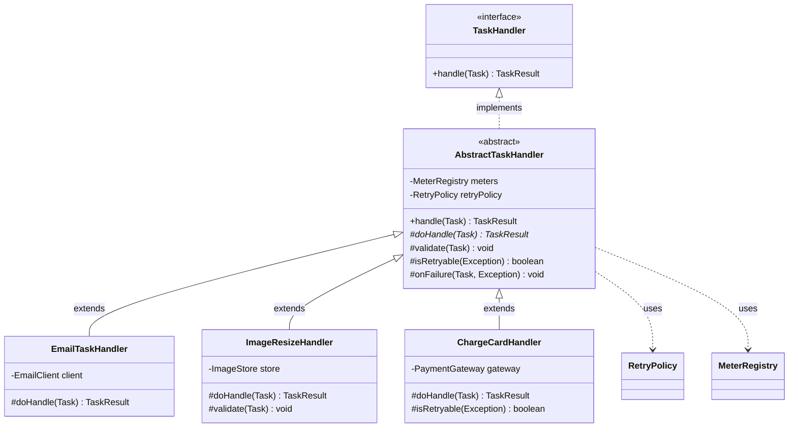
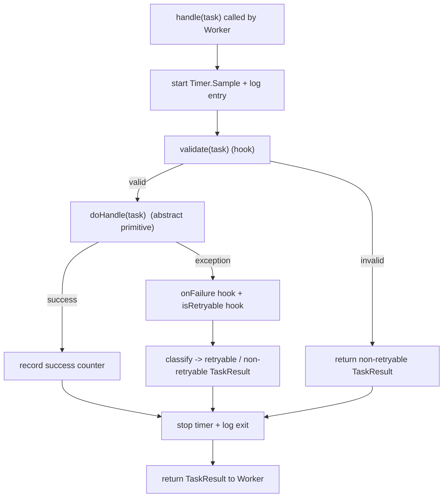

# Template Method

> Where this fits in the project: every task in our platform runs through the *same* execution ceremony — start a timer, log entry, run the actual business step, classify the outcome, fire the retry hook, record metrics, log exit. Only the middle step changes per task type. Template Method nails the invariant skeleton into a base class once and leaves a single hole — `doHandle()` — for the variable business logic. It is the inheritance-shaped answer to the same question [Decorator](decorator.md) answers with composition.

---

## 1. Why this exists — the real problem in our Task Queue

Recall the canonical handler contract from the SPEC:

```java
@FunctionalInterface
public interface TaskHandler {
    TaskResult handle(Task task) throws Exception;
}

public record TaskResult(boolean success, String message, boolean retryable) {}
```

A handler is the smallest unit of business logic. The `Worker` looks one up by `task.type()` and calls `handle()`. The pure business slice is tiny:

```java
// The ONLY thing that is actually different between handlers:
EmailPayload p = EmailPayload.fromJson(task.payload());
client.send(p.to(), p.subject(), p.body());
```

But the `Worker` cannot call that naked. Around every single handle, production demands an identical sequence of operations:

1. **Time it** — start a `Timer.Sample` so Micrometer can record latency per type.
2. **Log entry** — a structured line with `task.id()` and `task.type()` for correlation.
3. **Validate the payload** — fail fast with a non-retryable result if the JSON is malformed.
4. **Run the business step** — the one line that differs per type.
5. **Classify the outcome** — turn a thrown exception into a `TaskResult`, deciding `retryable`.
6. **Fire the retry hook** — bump `attempts`, ask the `RetryPolicy` for a delay if it failed.
7. **Record metrics** — increment success/failure counters; stop the timer.
8. **Log exit** — success or failure, with the elapsed time.

Steps 1, 2, 3, 5, 6, 7, 8 are *identical* for the email handler, the image-resize handler, the charge-card handler, the webhook handler — every handler that exists or ever will. Only step 4 changes.

So where does that ceremony live? If we copy it into every handler, we have eight lines of boilerplate wrapped around one line of logic, repeated `N` times, and the day we add a ninth ceremony step (say, a trace span) we touch `N` files. That is the problem Template Method exists to kill.

> Historical note: Template Method is a Gang of Four (1994) behavioral pattern, and it is arguably the oldest idea in object-oriented reuse — it is "the Hollywood Principle" in pattern form: *don't call us, we'll call you*. The base class owns control flow; subclasses fill in the variable parts. You have already met it without knowing: `java.util.AbstractList`, `java.io.InputStream.read(byte[])` (which calls the abstract `read()`), `Spring`'s `JdbcTemplate`, and JUnit's `@BeforeEach`/`@Test`/`@AfterEach` lifecycle are all Template Method.

---

## 2. The naive version — and why it bites

### Attempt A: copy the ceremony into every handler

```java
public final class EmailTaskHandler implements TaskHandler {
    private static final Logger log = LoggerFactory.getLogger(EmailTaskHandler.class);
    private final EmailClient client;
    private final MeterRegistry meters;

    public EmailTaskHandler(EmailClient client, MeterRegistry meters) {
        this.client = client;
        this.meters = meters;
    }

    @Override
    public TaskResult handle(Task task) throws Exception {
        Timer.Sample sample = Timer.start(meters);          // (1) time
        log.info("start type={} id={}", task.type(), task.id()); // (2) log entry
        try {
            EmailPayload p = EmailPayload.fromJson(task.payload());  // (3) validate
            client.send(p.to(), p.subject(), p.body());              // (4) THE JOB
            meters.counter("task.success", "type", task.type()).increment();   // (7)
            sample.stop(meters.timer("task.latency", "type", task.type()));
            log.info("ok type={} id={}", task.type(), task.id());    // (8) log exit
            return new TaskResult(true, "sent", false);              // (5) classify
        } catch (TransientMailException e) {
            meters.counter("task.failure", "type", task.type()).increment();   // (7)
            sample.stop(meters.timer("task.latency", "type", task.type()));
            log.warn("retryable-fail type={} id={} err={}", task.type(), task.id(), e.toString());
            return new TaskResult(false, e.getMessage(), true);      // (5) retryable
        } catch (Exception e) {
            meters.counter("task.failure", "type", task.type()).increment();   // (7)
            sample.stop(meters.timer("task.latency", "type", task.type()));
            log.error("fatal-fail type={} id={} err={}", task.type(), task.id(), e.toString());
            return new TaskResult(false, e.getMessage(), false);     // (5) non-retryable
        }
    }
}
```

Now copy-paste that into `ImageResizeHandler`, `ChargeCardHandler`, `WebhookHandler`. Count what just happened:

- **~22 lines of boilerplate** wrapping **1 line of business logic** in every handler.
- The metric names, log format, and exception-to-`TaskResult` mapping are duplicated `N` times. They *will* drift — one handler will say `task.success`, another `tasks.succeeded`, and your Grafana dashboard quietly shows half the traffic.
- Add a tracing span tomorrow and you edit every handler. Forget one and you have a blind spot in production at 3 a.m.
- The thing you actually want to read — *what does this handler do?* — is buried under ceremony.

This is the **DRY violation** that Template Method was invented to fix (see [DRY/KISS/YAGNI](../04-oop-and-ood/dry-kiss-yagni.md)).

### Attempt B: a static helper

You might reach for a static utility: `HandlerSupport.runWithCeremony(task, meters, () -> { ... })`. That is genuinely better — it is the *composition* route (a higher-order function). Hold that thought; it is exactly the Strategy/lambda alternative we compare against in §11. But it has two friction points that push many teams toward Template Method first: the business step often needs **protected hooks** (an overridable `validate()`, an overridable `onFailure()`), and the per-type configuration (max attempts, which exceptions are retryable) reads more naturally as **subclass identity** than as a bag of parameters. Template Method makes the variation points *named, typed, and discoverable* via the class hierarchy.

---

## 3. Pattern intent, motivation, problem statement, participants

**Intent (GoF):** *Define the skeleton of an algorithm in an operation, deferring some steps to subclasses. Template Method lets subclasses redefine certain steps of an algorithm without changing the algorithm's structure.*

**Motivation:** When several classes share an identical multi-step procedure but differ in one or two steps, you want the *control flow written once*. The invariant parts live in a concrete method (the "template method"); the variant parts are abstract methods (or optional "hooks" with default bodies) that subclasses override. The template method is usually `final` so subclasses cannot accidentally rewrite the skeleton.

**Problem statement (ours):** Every handler must run an identical execution skeleton — timing, logging, validation, outcome classification, retry hook, metrics — while doing a different business step in the middle. We need to write the skeleton exactly once and let each task type plug in only its business step (and, optionally, override a hook or two).

**Participants:**

| Participant | GoF role | In our project |
| --- | --- | --- |
| **AbstractClass** | declares abstract *primitive operations* and a concrete `final` *template method* that calls them in order | `AbstractTaskHandler` with `final TaskResult handle(Task)` calling `abstract doHandle(Task)` |
| **Template method** | the invariant algorithm skeleton | `handle()` — times, logs, validates, runs, classifies, fires retry hook, records metrics |
| **Primitive operation** | abstract step the subclass *must* implement | `doHandle(Task task)` — the business logic |
| **Hook** | step with a default body the subclass *may* override | `validate(Task)`, `isRetryable(Exception)`, `onFailure(Task, Exception)` |
| **ConcreteClass** | implements the primitive operations | `EmailTaskHandler`, `ImageResizeHandler`, `ChargeCardHandler` |

---

## 4. UML class diagram



The italicized `doHandle(Task)*` is the abstract primitive operation; the `#`-prefixed methods are `protected` (the overridable surface); `handle()` is the `public final` template method.

And the control flow of the template method itself:



---

## 5. Refactor the naive code into the pattern

### The abstract class — skeleton written once

```java
package com.taskqueue.handler;

import com.taskqueue.model.Task;
import com.taskqueue.model.TaskResult;
import io.micrometer.core.instrument.MeterRegistry;
import io.micrometer.core.instrument.Timer;
import org.slf4j.Logger;
import org.slf4j.LoggerFactory;

/**
 * Template Method: handle() is the invariant execution skeleton.
 * Subclasses fill in doHandle() and may override the validate/isRetryable/onFailure hooks.
 */
public abstract class AbstractTaskHandler implements TaskHandler {

    private final Logger log = LoggerFactory.getLogger(getClass()); // logs as the subclass
    protected final MeterRegistry meters;

    protected AbstractTaskHandler(MeterRegistry meters) {
        this.meters = meters;
    }

    /** THE TEMPLATE METHOD. final: subclasses cannot rewrite the skeleton. */
    @Override
    public final TaskResult handle(Task task) {
        Timer.Sample sample = Timer.start(meters);
        log.info("start type={} id={} attempt={}", task.type(), task.id(), task.attempts());
        try {
            validate(task);                      // hook (default: no-op)
            TaskResult result = doHandle(task);  // primitive operation (abstract)
            recordOutcome(task, sample, result.success());
            log.info("done type={} id={} success={}", task.type(), task.id(), result.success());
            return result;
        } catch (Exception e) {
            onFailure(task, e);                  // hook (default: no-op)
            boolean retryable = isRetryable(e);  // hook (default: true)
            recordOutcome(task, sample, false);
            log.warn("fail type={} id={} retryable={} err={}",
                    task.type(), task.id(), retryable, e.toString());
            return new TaskResult(false, e.getMessage(), retryable);
        }
    }

    private void recordOutcome(Task task, Timer.Sample sample, boolean success) {
        meters.counter(success ? "task.success" : "task.failure", "type", task.type()).increment();
        sample.stop(meters.timer("task.latency", "type", task.type()));
    }

    /** PRIMITIVE OPERATION: the one step every concrete handler must supply. */
    protected abstract TaskResult doHandle(Task task) throws Exception;

    // ---- HOOKS: overridable, with sensible defaults ----

    /** Override to reject malformed payloads early. Default: accept anything. */
    protected void validate(Task task) { /* no-op */ }

    /** Override to declare which exceptions are worth retrying. Default: retry everything. */
    protected boolean isRetryable(Exception e) { return true; }

    /** Override for type-specific failure side effects (alerting, compensation). Default: nothing. */
    protected void onFailure(Task task, Exception e) { /* no-op */ }
}
```

### The concrete handler — only the business step

```java
public final class EmailTaskHandler extends AbstractTaskHandler {
    private final EmailClient client;

    public EmailTaskHandler(EmailClient client, MeterRegistry meters) {
        super(meters);
        this.client = client;
    }

    @Override
    protected TaskResult doHandle(Task task) throws Exception {
        EmailPayload p = EmailPayload.fromJson(task.payload());
        client.send(p.to(), p.subject(), p.body());
        return new TaskResult(true, "sent", false);
    }

    @Override
    protected boolean isRetryable(Exception e) {
        return e instanceof TransientMailException; // a 4xx config error must NOT loop forever
    }
}
```

From ~22 lines of ceremony per handler down to the business step plus one focused hook. The skeleton exists in exactly one place; adding a trace span tomorrow is a one-line edit in `AbstractTaskHandler` that every handler inherits.

---

## 6. Before-and-after comparison

| Dimension | Naive (copy ceremony per handler) | Template Method |
| --- | --- | --- |
| Lines per handler | ~22 (ceremony) + ~3 (logic) | ~5 (logic) + optional hook |
| Where the skeleton lives | duplicated `N` times | one `final` method |
| Add a step (e.g. trace span) | edit `N` files, risk drift | edit 1 file |
| Metric/log consistency | drifts across handlers | guaranteed identical |
| What a new dev reads | logic buried in boilerplate | logic only |
| Risk of skipping a step | high (easy to forget) | impossible (skeleton is `final`) |
| Coupling | each handler couples to `MeterRegistry`, `Logger`, exception mapping | concentrated in the base |

The single most underrated win: the skeleton is `final`, so **no handler can accidentally forget to record metrics or stop the timer**. The structure is enforced by the compiler, not by code review.

---

## 7. A simple Java example (warm-up, no project deps)

The classic teaching example — a beverage prep skeleton with one variable step:

```java
abstract class Beverage {
    /** Template method: the fixed recipe. */
    public final void prepare() {
        boilWater();
        brew();               // primitive: differs per beverage
        pourInCup();
        if (wantsCondiments()) addCondiments(); // hook with a default
    }

    private void boilWater()  { System.out.println("Boiling water"); }
    private void pourInCup()  { System.out.println("Pouring into cup"); }

    protected abstract void brew();             // must implement
    protected abstract void addCondiments();    // must implement
    protected boolean wantsCondiments() { return true; } // hook: overridable default
}

final class Tea extends Beverage {
    @Override protected void brew()          { System.out.println("Steeping the tea"); }
    @Override protected void addCondiments() { System.out.println("Adding lemon"); }
    @Override protected boolean wantsCondiments() { return false; } // I take it plain
}

final class Coffee extends Beverage {
    @Override protected void brew()          { System.out.println("Dripping coffee"); }
    @Override protected void addCondiments() { System.out.println("Adding milk and sugar"); }
}
```

`prepare()` is the immutable algorithm; `brew()`/`addCondiments()` are primitives; `wantsCondiments()` is a hook. The caller never sees the steps — *don't call us, we'll call you*.

---

## 8. A real-world Java example you already use

Spring's `JdbcTemplate` is Template Method in production-grade form. `execute()` owns the invariant ceremony — acquire a connection, create a statement, handle exceptions/translation, **always** close resources — and defers the variable bit (what to do with the `PreparedStatement`/`ResultSet`) to a callback:

```java
// Conceptual sketch of what JdbcTemplate.query(...) does internally:
public <T> T execute(StatementCallback<T> action) {
    Connection con = DataSourceUtils.getConnection(dataSource); // invariant
    Statement stmt = null;
    try {
        stmt = con.createStatement();                            // invariant
        return action.doInStatement(stmt);                       // <-- variable step
    } catch (SQLException ex) {
        throw translateException(ex);                            // invariant
    } finally {
        JdbcUtils.closeStatement(stmt);                          // invariant: always runs
        DataSourceUtils.releaseConnection(con, dataSource);      // invariant
    }
}
```

> Note: Spring here uses a *callback object* (`StatementCallback`) instead of subclassing — the "Template Method via composition" variant, sometimes called the **Template Callback** pattern. Same skeleton-with-a-hole intent, hole filled by a strategy object rather than a subclass. We discuss exactly this tradeoff in §11 and §13. Other JDK examples: `InputStream.read(byte[], int, int)` calls the abstract `read()`; `AbstractList.iterator()` builds on abstract `get(int)`/`size()`; `Thread.run()` defers to your `Runnable`; servlet `HttpServlet.service()` dispatches to `doGet`/`doPost`.

---

## 9. Project-integration example — the full canonical model

Here is the version a staff engineer would ship in Phase 3, wiring the canonical `RetryPolicy` ([Strategy](strategy.md) lives *inside* the template) and a payment handler that overrides multiple hooks. Note how Template Method and Strategy compose: the skeleton is fixed by inheritance, but the *retry delay computation* is injected as a strategy object.

```java
package com.taskqueue.handler;

import com.taskqueue.model.Task;
import com.taskqueue.model.TaskResult;
import com.taskqueue.retry.RetryPolicy;
import io.micrometer.core.instrument.MeterRegistry;
import io.micrometer.core.instrument.Timer;
import org.slf4j.Logger;
import org.slf4j.LoggerFactory;

import java.time.Duration;
import java.util.Optional;

public abstract class AbstractTaskHandler implements TaskHandler {

    private final Logger log = LoggerFactory.getLogger(getClass());
    protected final MeterRegistry meters;
    private final RetryPolicy retryPolicy;        // Strategy injected into the template

    protected AbstractTaskHandler(MeterRegistry meters, RetryPolicy retryPolicy) {
        this.meters = meters;
        this.retryPolicy = retryPolicy;
    }

    @Override
    public final TaskResult handle(Task task) {
        Timer.Sample sample = Timer.start(meters);
        log.info("start type={} id={} attempt={}/{}",
                task.type(), task.id(), task.attempts(), task.maxAttempts());
        try {
            validate(task);
            TaskResult result = doHandle(task);
            recordOutcome(task, sample, result.success());
            log.info("done type={} id={} success={}", task.type(), task.id(), result.success());
            return result;
        } catch (Exception e) {
            onFailure(task, e);
            boolean retryable = isRetryable(e) && hasAttemptsLeft(task);
            if (retryable) {
                Optional<Duration> delay = retryPolicy.nextDelay(task.attempts());
                log.warn("retry type={} id={} in={} err={}",
                        task.type(), task.id(), delay.orElse(Duration.ZERO), e.toString());
            } else {
                log.error("dead type={} id={} err={}", task.type(), task.id(), e.toString());
            }
            recordOutcome(task, sample, false);
            return new TaskResult(false, e.getMessage(), retryable);
        }
    }

    private boolean hasAttemptsLeft(Task task) {
        return task.attempts() < task.maxAttempts()
                && retryPolicy.nextDelay(task.attempts()).isPresent();
    }

    private void recordOutcome(Task task, Timer.Sample sample, boolean success) {
        meters.counter(success ? "task.success" : "task.failure", "type", task.type()).increment();
        sample.stop(meters.timer("task.latency", "type", task.type()));
    }

    protected abstract TaskResult doHandle(Task task) throws Exception;

    protected void validate(Task task) { /* no-op */ }
    protected boolean isRetryable(Exception e) { return true; }
    protected void onFailure(Task task, Exception e) { /* no-op */ }
}
```

A concrete handler that uses two hooks plus the primitive:

```java
public final class ChargeCardHandler extends AbstractTaskHandler {
    private static final Logger ALERT = LoggerFactory.getLogger("PAYMENT-ALERT");
    private final PaymentGateway gateway;

    public ChargeCardHandler(PaymentGateway gateway, MeterRegistry meters, RetryPolicy retryPolicy) {
        super(meters, retryPolicy);
        this.gateway = gateway;
    }

    @Override
    protected void validate(Task task) {
        ChargePayload p = ChargePayload.fromJson(task.payload());
        if (p.amountCents() <= 0) {
            throw new IllegalArgumentException("non-positive amount: " + p.amountCents());
        }
    }

    @Override
    protected TaskResult doHandle(Task task) throws Exception {
        ChargePayload p = ChargePayload.fromJson(task.payload());
        // Idempotency key = task.id() makes the retry safe (see distributed-systems/idempotency.md)
        gateway.charge(p.customerId(), p.amountCents(), task.id());
        return new TaskResult(true, "charged " + p.amountCents() + "c", false);
    }

    @Override
    protected boolean isRetryable(Exception e) {
        // Network blips retry; a declined card or validation error must NOT.
        return e instanceof GatewayTimeoutException;
    }

    @Override
    protected void onFailure(Task task, Exception e) {
        if (!(e instanceof GatewayTimeoutException)) {
            ALERT.error("permanent payment failure id={} err={}", task.id(), e.toString());
        }
    }
}
```

And the `Worker` is blissfully unaware of all the ceremony — it just calls the template method:

```java
public final class Worker implements Runnable {
    private final TaskQueue queue;
    private final Map<String, TaskHandler> handlers; // type -> AbstractTaskHandler subclass

    public Worker(TaskQueue queue, Map<String, TaskHandler> handlers) {
        this.queue = queue;
        this.handlers = handlers;
    }

    @Override
    public void run() {
        try {
            while (!Thread.currentThread().isInterrupted()) {
                Task task = queue.dequeue();                 // blocks
                TaskHandler handler = handlers.get(task.type());
                if (handler == null) {
                    // no handler registered: route to DLQ rather than spin
                    continue;
                }
                TaskResult result = handler.handle(task);    // template method runs the whole skeleton
                // ... requeue with delay if result.retryable(), else mark SUCCEEDED/DEAD ...
            }
        } catch (InterruptedException e) {
            Thread.currentThread().interrupt();
        }
    }
}
```

---

## 10. Production notes — where it lives, when NOT to use it, anti-patterns

**Where it shows up in industry:**

- **Frameworks defining lifecycles:** Spring's `JdbcTemplate`/`RestTemplate`/`TransactionTemplate`, `AbstractController`; JUnit's `@BeforeEach`/`@Test`/`@AfterEach`; the Servlet `service()` dispatch; Android's `Activity` lifecycle; Kafka Streams' `Processor` hooks.
- **Batch/ETL pipelines:** Spring Batch `Tasklet`/`ItemProcessor` steps slot into a fixed read-process-write skeleton.
- **Request pipelines:** any "open resource → do work → always close" pattern (the `try-with-resources` shape generalized into a class).

**When NOT to use it:**

- **The variable part is a single behavior with no hooks.** If all you need is one swappable step and no protected lifecycle, prefer **Strategy** (inject a `TaskHandler` lambda) or a higher-order function. Template Method drags in an inheritance hierarchy you may not need.
- **Variation needs to combine at runtime.** Retries × rate-limiting × metrics are *orthogonal and stackable* — that is Decorator's job, not Template Method's. Template Method gives you *one* hole per algorithm; trying to express N combinable concerns as a class hierarchy explodes into 2ⁿ subclasses (the exact trap [Decorator](decorator.md) avoids).
- **You need to swap the algorithm at runtime.** You cannot change an object's superclass after construction; Strategy can swap its delegate any time.

**Anti-patterns to avoid:**

- **Non-`final` template method.** If `handle()` is overridable, a subclass can silently bypass the metrics/timer. Make it `final`. This is the #1 Template Method bug in real code.
- **The "explosion of hooks."** A base class with 14 `protected` hooks is a confession that you don't know your variation points. Keep the overridable surface tiny (one primitive, two or three hooks).
- **Calling overridable methods from the constructor.** If `AbstractTaskHandler`'s constructor called `validate()` or any overridable method, it would run *before the subclass fields are initialized* — a classic Java footgun (the subclass field is still `null`). Only the template method, invoked after construction, may call hooks.
- **Subclasses depending on call order between siblings.** If `EmailTaskHandler.validate()` must run before `doHandle()` reads a field it set — that is hidden coupling through mutable state. Keep hooks pure or pass data explicitly.
- **Inheritance for code reuse only.** If subclasses are *not* genuine "is-a" specializations of the algorithm, you are abusing inheritance; reach for composition instead (see [composition vs inheritance](../02-core-oop/chapter-17-composition-vs-inheritance.md)).

---

## 11. Template Method vs Strategy vs Decorator — the composition tradeoff

These three are constantly confused in interviews. They answer related questions differently:

| | Template Method | Strategy | Decorator |
| --- | --- | --- | --- |
| **Mechanism** | inheritance (override steps) | composition (inject a behavior) | composition (wrap the same interface) |
| **What varies** | *steps inside* a fixed algorithm | the *whole* algorithm/behavior | *added* cross-cutting concerns |
| **Binding time** | compile time (subclass) | runtime (swap delegate) | runtime (build the wrapper stack) |
| **How many variations** | one hole per algorithm | one swappable slot | N stackable layers |
| **Our example** | `doHandle()` inside `handle()` skeleton | `RetryPolicy` swapped in | `MetricsHandler` wrapping a handler |
| **Reuse axis** | "same recipe, different filling" | "same context, different algorithm" | "same object, more behavior" |

The deep point: **Template Method is the inheritance answer; Strategy is its composition twin.** You can refactor almost any Template Method into Strategy by turning the abstract primitive into an injected functional interface:

```java
// Template Method via COMPOSITION (the "Template Callback" / higher-order-function form):
public final class CeremonialHandler implements TaskHandler {
    private final MeterRegistry meters;
    private final TaskHandler businessStep;   // the injected "primitive operation"

    public CeremonialHandler(MeterRegistry meters, TaskHandler businessStep) {
        this.meters = meters;
        this.businessStep = businessStep;
    }

    @Override
    public TaskResult handle(Task task) {
        Timer.Sample sample = Timer.start(meters);     // skeleton...
        try {
            TaskResult r = businessStep.handle(task);  // ...with the hole filled by a lambda
            meters.counter("task.success", "type", task.type()).increment();
            return r;
        } catch (Exception e) {
            meters.counter("task.failure", "type", task.type()).increment();
            return new TaskResult(false, e.getMessage(), true);
        } finally {
            sample.stop(meters.timer("task.latency", "type", task.type()));
        }
    }
}

// usage: new CeremonialHandler(meters, t -> { client.send(...); return new TaskResult(true,"sent",false); });
```

**When to prefer which:**

- **Reach for the composition form** when the variable part is a single behavior, you want to swap it at runtime, you want to test the skeleton and the step independently, or Java's single-inheritance is in your way. This is the modern default — *favor composition over inheritance*.
- **Reach for classic Template Method (subclassing)** when there are *several named variation points* (a primitive plus a few hooks like `validate`/`onFailure`), the variants form a genuine type hierarchy, and per-type identity/config reads better as a class than as a parameter bag. Frameworks lean this way because the subclass name *is* the documentation.

In our platform we use **both**: Template Method for the per-type handler ceremony (`AbstractTaskHandler`), and Decorator for the orthogonal cross-cutting stack (retry/rate-limit/metrics wrappers). They are not rivals; they sit at different layers.

---

## 12. Common mistakes and pitfalls

- **Forgetting `final` on the template method** → subclasses override the whole algorithm and skip the invariants. *Fix:* make `handle()` `final`.
- **Too many abstract methods** → every subclass must implement steps it doesn't care about. *Fix:* prefer hooks (default-bodied) over abstract methods for optional steps.
- **Leaking the skeleton's helpers as `public`/`protected`** → callers invoke `recordOutcome()` out of band. *Fix:* keep skeleton internals `private`; only primitives/hooks are `protected`.
- **Deep inheritance chains** (`AbstractHandler` → `AbstractRetryingHandler` → `AbstractValidatingEmailHandler`) → fragile base class problem. *Fix:* keep the hierarchy one level deep; push extra behavior into injected collaborators.
- **Calling hooks from the constructor** → runs before subclass init. *Fix:* only the template method calls hooks.
- **Using Template Method when you need stackable concerns** → 2ⁿ subclass explosion. *Fix:* use Decorator.
- **Hooks that mutate shared state to communicate** → hidden temporal coupling. *Fix:* pass data through method arguments/return values.

---

## 13. Interview questions and model answers

1. **What is Template Method and what problem does it solve?**
   A behavioral pattern that puts an algorithm's invariant skeleton in a `final` method on a base class and defers the variable steps to abstract/overridable methods subclasses implement. It eliminates duplicated control flow when many classes share a procedure but differ in a step.

2. **Template Method vs Strategy — what's the real difference?**
   Mechanism and granularity. Template Method varies *steps inside* a fixed algorithm via inheritance, bound at compile time, one hole per algorithm. Strategy varies the *whole* behavior via composition, swappable at runtime. Template Method's natural refactor target is Strategy (turn the abstract primitive into an injected functional interface).

3. **Why is the template method usually `final`?**
   So subclasses cannot rewrite the control flow and accidentally skip invariants (metrics, resource cleanup, timing). `final` makes the skeleton a compiler-enforced contract.

4. **What's the difference between a primitive operation and a hook?**
   A primitive operation is `abstract` — subclasses *must* implement it. A hook has a default (often empty or `return true`) body — subclasses *may* override it. Hooks are how you make optional steps optional without forcing every subclass to write boilerplate.

5. **Give a JDK / Spring example.**
   `InputStream.read(byte[])` calls the abstract `read()`; `HttpServlet.service()` dispatches to `doGet`/`doPost`; `JdbcTemplate.execute()` owns connect/close and defers the statement work to a callback; JUnit's `@BeforeEach`/`@Test`/`@AfterEach` lifecycle.

6. **Why can calling an overridable method from a constructor be dangerous in Java?**
   The superclass constructor runs *before* the subclass's field initializers, so an overridden method invoked from the constructor sees the subclass's fields still at their defaults (e.g. `null`). Template Method avoids this because the template method runs after construction.

7. **When would you NOT use Template Method?**
   When you need runtime swapping (use Strategy), when concerns are orthogonal and stackable (use Decorator), when there is exactly one variable step and no hooks (a higher-order function is simpler), or when subclasses aren't true "is-a" specializations.

8. **How does Template Method relate to the Hollywood Principle?**
   "Don't call us, we'll call you" — the base class controls flow and calls down into subclass-provided steps, inverting the usual direction of control. It is a small-scale inversion of control.

---

## 14. Production considerations

- **Observability is built into the skeleton.** Because timing, counters, and structured logs live in the `final` template method, every handler is automatically observable with consistent metric names — exactly what Phase 3's Prometheus/Grafana stack needs. No handler can ship without metrics.
- **The fragile base class problem is real at scale.** A change to `handle()` ripples to *every* subclass. Treat the abstract class as a published API: cover the skeleton with tests against a fake subclass, and never break a hook's contract without a major version bump.
- **Testing strategy.** Test the skeleton once via a trivial `TestHandler` subclass (assert timing/metrics/exception-mapping). Test each concrete handler's `doHandle()`/hooks in isolation. You do *not* re-test the ceremony per handler — that is the whole point.
- **Virtual threads (Java 21).** The template method holds no thread-affine state, so handlers run unchanged on a virtual-thread-per-task `Worker` pool. Keep the skeleton free of `ThreadLocal` that assumes platform threads.
- **What breaks:** if a subclass's `doHandle()` blocks indefinitely, the skeleton's timer never stops and the `Worker` thread is parked — add a timeout (a `CompletableFuture.orTimeout` or a circuit breaker) *in the skeleton* so the protection is universal. This is where the pattern pays off: one place to add the guard.

---

## 15. Exercises

### Easy

**E1 (knowledge check).** In `AbstractTaskHandler`, which method is the template method, which is the primitive operation, and which are hooks? Why is the template method `final`?

**E2 (coding).** Add a `WebhookTaskHandler` extending `AbstractTaskHandler`. Its `doHandle()` POSTs `task.payload()` to a URL from the payload; override `isRetryable()` so 5xx responses retry and 4xx do not.

### Medium

**M1 (pattern identification).** Look at `java.io.InputStream`. Which method is the template, which is the primitive, and how does it relate to `BufferedInputStream`? Is `BufferedInputStream` Template Method or Decorator?

**M2 (refactoring).** You are given three handlers that each duplicate a `validate → execute → audit` ceremony. Refactor them into a Template Method base. Show the base and one concrete handler.

### Hard

**H1 (design).** The product team wants per-type *timeouts* enforced uniformly. Add timeout support to the skeleton without changing any concrete handler, using a hook for the per-type timeout value. Then argue whether Strategy or Decorator would have been a better fit and why.

**H2 (stretch).** Convert `AbstractTaskHandler` from inheritance-based Template Method to the composition-based "Template Callback" form, preserving the `validate`/`isRetryable`/`onFailure` hooks as injected functional interfaces. Discuss what you gained and lost.

---

## 16. Solutions

**E1.** Template method: `handle()`. Primitive operation: `doHandle()` (abstract — every subclass must implement). Hooks: `validate()`, `isRetryable()`, `onFailure()` (default bodies, optional overrides). `handle()` is `final` so subclasses cannot rewrite the skeleton and skip timing/metrics/logging — the invariants are compiler-enforced.

**E2.**

```java
public final class WebhookTaskHandler extends AbstractTaskHandler {
    private final HttpClient http;

    public WebhookTaskHandler(HttpClient http, MeterRegistry meters, RetryPolicy retryPolicy) {
        super(meters, retryPolicy);
        this.http = http;
    }

    @Override
    protected TaskResult doHandle(Task task) throws Exception {
        WebhookPayload p = WebhookPayload.fromJson(task.payload());
        HttpRequest req = HttpRequest.newBuilder(URI.create(p.url()))
                .POST(HttpRequest.BodyPublishers.ofString(p.body()))
                .header("Content-Type", "application/json")
                .build();
        HttpResponse<String> resp = http.send(req, HttpResponse.BodyHandlers.ofString());
        int code = resp.statusCode();
        if (code >= 200 && code < 300) return new TaskResult(true, "delivered " + code, false);
        // throw so the skeleton classifies via isRetryable():
        throw new WebhookFailedException(code, resp.body());
    }

    @Override
    protected boolean isRetryable(Exception e) {
        return e instanceof WebhookFailedException w && w.statusCode() >= 500; // 5xx retry, 4xx don't
    }
}
```

**M1.** In `InputStream`, the template-ish method is `read(byte[] b, int off, int len)`, whose default implementation loops calling the abstract primitive `read()` (the single-byte read). Subclasses supply `read()`; the bulk read is reused. `BufferedInputStream`, however, is **Decorator**, not Template Method: it *wraps another `InputStream`* (composition, same interface) to add buffering — it does not fill a hole in a parent's algorithm. The distinction: Template Method = override steps via inheritance; Decorator = wrap an instance via composition.

**M2.**

```java
abstract class AbstractAuditedHandler implements TaskHandler {
    @Override
    public final TaskResult handle(Task task) {
        validate(task);                       // step 1
        try {
            TaskResult r = execute(task);     // step 2 (primitive)
            audit(task, "ok");                // step 3
            return r;
        } catch (Exception e) {
            audit(task, "fail: " + e.getMessage());
            return new TaskResult(false, e.getMessage(), true);
        }
    }
    protected void validate(Task task) { /* default */ }
    protected abstract TaskResult execute(Task task) throws Exception;
    protected void audit(Task task, String outcome) {
        System.out.printf("AUDIT id=%s type=%s %s%n", task.id(), task.type(), outcome);
    }
}

final class ReportHandler extends AbstractAuditedHandler {
    @Override protected TaskResult execute(Task task) {
        return new TaskResult(true, "report generated", false);
    }
}
```

The `validate → execute → audit` ceremony now lives once; each handler supplies only `execute()`.

**H1.**

```java
// In AbstractTaskHandler, add a hook for the per-type timeout and enforce it in the skeleton:
protected Duration timeout() { return Duration.ofSeconds(30); } // hook, overridable default

@Override
public final TaskResult handle(Task task) {
    Timer.Sample sample = Timer.start(meters);
    try {
        validate(task);
        // run doHandle on a bounded future so a hung handler can't park the worker forever:
        TaskResult result = CompletableFuture
                .supplyAsync(() -> safeDoHandle(task))
                .orTimeout(timeout().toMillis(), TimeUnit.MILLISECONDS)
                .join();
        recordOutcome(task, sample, result.success());
        return result;
    } catch (CompletionException ce) {
        recordOutcome(task, sample, false);
        boolean retryable = ce.getCause() instanceof TimeoutException || isRetryable((Exception) ce.getCause());
        return new TaskResult(false, String.valueOf(ce.getCause()), retryable);
    }
}

private TaskResult safeDoHandle(Task task) {
    try { return doHandle(task); }
    catch (Exception e) { throw new CompletionException(e); }
}
```

A concrete handler overrides only `timeout()` when it needs a different bound; everything else is unchanged. **Why Template Method here over Strategy/Decorator:** the timeout is one more *step in the same fixed skeleton* that benefits every handler uniformly and must not be skippable — that is precisely Template Method's sweet spot. Decorator would also work (a `TimeoutHandler` wrapper) and is arguably cleaner if you want to *toggle* timeouts per handler at composition time; Strategy doesn't fit because there is no algorithm to swap, just a value plus enforcement. The honest answer in an interview: "Template Method if the timeout is universal and built-in; Decorator if it must be opt-in and stackable with other concerns."

**H2.**

```java
public final class CallbackHandler implements TaskHandler {
    @FunctionalInterface interface Step { TaskResult run(Task t) throws Exception; }

    private final MeterRegistry meters;
    private final Step doHandle;                       // injected primitive
    private final Consumer<Task> validate;             // injected hooks...
    private final Predicate<Exception> isRetryable;
    private final BiConsumer<Task, Exception> onFailure;

    public CallbackHandler(MeterRegistry meters, Step doHandle,
                           Consumer<Task> validate, Predicate<Exception> isRetryable,
                           BiConsumer<Task, Exception> onFailure) {
        this.meters = meters; this.doHandle = doHandle;
        this.validate = validate; this.isRetryable = isRetryable; this.onFailure = onFailure;
    }

    @Override
    public TaskResult handle(Task task) {
        Timer.Sample sample = Timer.start(meters);
        try {
            validate.accept(task);
            TaskResult r = doHandle.run(task);
            meters.counter("task.success", "type", task.type()).increment();
            return r;
        } catch (Exception e) {
            onFailure.accept(task, e);
            meters.counter("task.failure", "type", task.type()).increment();
            return new TaskResult(false, e.getMessage(), isRetryable.test(e));
        } finally {
            sample.stop(meters.timer("task.latency", "type", task.type()));
        }
    }
}
```

**Gained:** no inheritance, so it composes with Decorator freely and dodges single-inheritance limits; the skeleton and each step are independently unit-testable; steps can be swapped at runtime; lambdas read concisely for simple handlers. **Lost:** the subclass-as-documentation benefit (a class name like `ChargeCardHandler` is gone — you build a config object instead); the wiring is more verbose for handlers with several hooks; an overzealous builder of these can become a "god factory." This is the same Template-Method-vs-Strategy tradeoff from §11, made concrete.

---

## What We Can Improve In Our Project Using This Concept

Right now (Phase 1) each handler that wants metrics or logging would have to write its own ceremony, and the `Worker` has no guarantee that every handler is observable. Introducing `AbstractTaskHandler` as a Template Method base centralizes the execution skeleton — timing, structured logging, validation, outcome classification, the retry hook, and Micrometer counters — so every current and future handler is consistent and observable *by construction*. Concrete handlers shrink to their business step plus, occasionally, a `validate`/`isRetryable`/`onFailure` override. This directly sets up Phase 3's metrics requirements and pairs cleanly with the orthogonal cross-cutting [Decorator](decorator.md) stack.

## Project Refactoring Task

1. Add `AbstractTaskHandler` implementing `TaskHandler` with a `final handle()` template method that times (Micrometer `Timer.Sample`), logs entry/exit, calls `validate()`, runs the abstract `doHandle()`, classifies the outcome via `isRetryable()`, fires `onFailure()`, and records success/failure counters.
2. Define the hooks: `protected void validate(Task)`, `protected boolean isRetryable(Exception)` (default `true`), `protected void onFailure(Task, Exception)`.
3. Migrate `EmailTaskHandler`, `ImageResizeHandler`, and `ChargeCardHandler` to extend `AbstractTaskHandler`, deleting all inline ceremony and keeping only `doHandle()` plus needed hooks.
4. Inject the canonical `RetryPolicy` into the base and use `task.attempts()` / `task.maxAttempts()` to decide retryability (see [retries](../08-distributed-systems/retries.md)).
5. Add tests: one `TestHandler` subclass asserting the skeleton (timer stopped, counters incremented, exception mapped); per-handler tests for `doHandle()` and hooks in isolation.

## Git Commit For This Chapter

```text
refactor(handler): introduce AbstractTaskHandler Template Method for execution skeleton

- add AbstractTaskHandler with final handle() template method (timing, logging, metrics, retry hook)
- expose doHandle() primitive and validate/isRetryable/onFailure hooks
- migrate Email/ImageResize/ChargeCard handlers to extend the base; delete inline ceremony
- inject RetryPolicy and use task.attempts/maxAttempts for retry classification
- tests: skeleton test via TestHandler subclass + per-handler doHandle/hook tests

Files touched:
  src/main/java/com/taskqueue/handler/AbstractTaskHandler.java
  src/main/java/com/taskqueue/handler/EmailTaskHandler.java
  src/main/java/com/taskqueue/handler/ImageResizeHandler.java
  src/main/java/com/taskqueue/handler/ChargeCardHandler.java
  src/main/java/com/taskqueue/worker/Worker.java
  src/test/java/com/taskqueue/handler/AbstractTaskHandlerTest.java
```

## Architecture Impact

The execution skeleton moves out of individual handlers into a single `final` template method, making every handler observable and retry-aware by construction and impossible to ship without metrics. This tightens the boundary in our [layered architecture](../04-oop-and-ood/layered-architecture.md): the abstract base owns the operational ceremony; concrete handlers own pure domain logic. It complements the [Decorator](decorator.md) stack (orthogonal, stackable concerns) — Template Method handles the per-type *recipe*, Decorator handles cross-cutting *layers*. The single insertion point for skeleton-wide guards (timeouts, trace spans, circuit breakers) makes Phase 3 observability and Phase 4 distributed concerns additive rather than per-handler rewrites.

## Interview Takeaways

- Template Method = invariant algorithm skeleton in a `final` base method, variable steps deferred to subclasses via abstract primitives and optional hooks. It is the Hollywood Principle: "don't call us, we'll call you."
- It is the *inheritance* twin of *Strategy* (composition); almost any Template Method refactors into Strategy by injecting the primitive as a functional interface. Be ready to defend which you'd pick and why.
- Distinguish it cleanly from Decorator: Template Method = one hole per algorithm via inheritance; Decorator = N stackable layers via composition wrapping the same interface.
- Know the JDK/Spring examples (`InputStream.read`, `HttpServlet.service`, `JdbcTemplate`, JUnit lifecycle) and the two footguns: non-`final` template methods and calling overridable methods from constructors.
