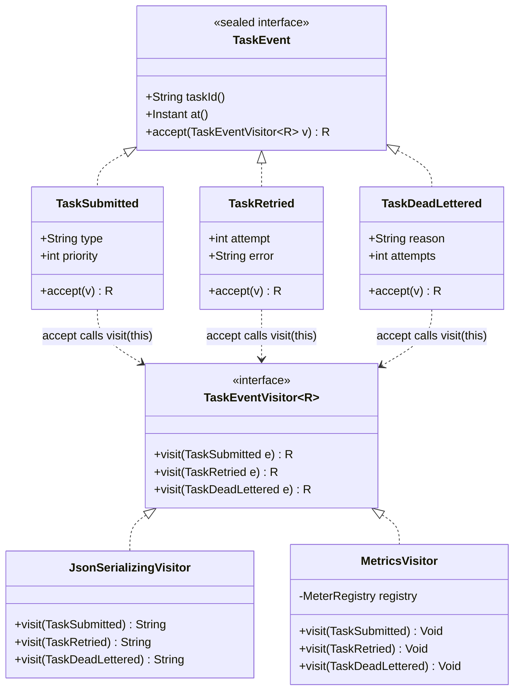
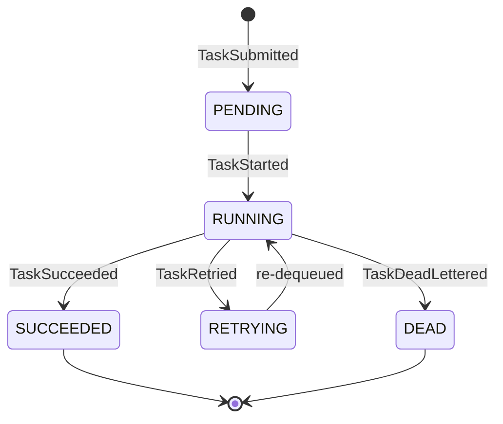

# Visitor

> Where this fits in the project: in **Phase 4** our platform emits a stream of `TaskEvent`s (a task was submitted, started, retried, dead-lettered, succeeded). Many independent subsystems — a JSON serializer for the audit log, a metrics router, a compliance auditor, a webhook dispatcher — each need to do *something different per event type*. The Visitor pattern lets us add those operations **without touching the event classes**, and it forces the compiler to remind us when a new event type appears. We will also weigh it honestly against Java 21 **sealed types + switch pattern matching**, which often wins in modern Java.

---

## 1. Why This Exists — The Real Problem

In Phase 4 the `EventBus` (see [../07-queues-and-messaging/message-queues.md](../07-queues-and-messaging/message-queues.md) for the queue side, and [observer.md](observer.md) for the publish/subscribe mechanics) carries a closed family of events:

```text
TaskSubmitted      — a Task entered the system
TaskStarted        — a Worker picked it up
TaskSucceeded      — handler returned success
TaskRetried        — handler failed but is retryable
TaskDeadLettered   — exhausted maxAttempts, moved to the DLQ
```

This is a **closed hierarchy**: we control all the event types, and they rarely change. But the set of *operations* over them grows constantly:

- **Serialize** each event to a stable JSON line for the audit log.
- **Route metrics**: increment a Micrometer counter named after the event, with the right tags.
- **Audit for compliance**: only `TaskDeadLettered` and `TaskRetried` matter, and they need a human-readable reason.
- **Dispatch webhooks**: only terminal events (`TaskSucceeded`, `TaskDeadLettered`) fire customer callbacks.

The naive instinct is a giant `if (e instanceof ...)` ladder inside each subsystem. That ladder gets copy-pasted four times, drifts out of sync, and — worst of all — when a fifth event type (`TaskScheduled`) is added, **nothing tells you which ladders forgot to handle it**. The bug surfaces at 3am as a dropped webhook.

> The core tension: **data types are stable, operations are volatile.** Visitor (and its modern rival, sealed + switch) is the toolkit for exactly that shape. Contrast with [strategy.md](strategy.md), where operations are stable but you swap *which* algorithm runs at one call site.

---

## 2. The Naive Version

First, the event family as plain classes (we will improve this to records + a sealed interface shortly):

```java
// Naive: a marker interface, no compiler help.
public interface TaskEvent {
    String taskId();
    Instant at();
}

public final class TaskSubmitted implements TaskEvent {
    private final String taskId; private final Instant at; private final String type; private final int priority;
    public TaskSubmitted(String taskId, Instant at, String type, int priority) {
        this.taskId = taskId; this.at = at; this.type = type; this.priority = priority;
    }
    public String taskId() { return taskId; } public Instant at() { return at; }
    public String type() { return type; } public int priority() { return priority; }
}

public final class TaskRetried implements TaskEvent {
    private final String taskId; private final Instant at; private final int attempt; private final String error;
    public TaskRetried(String taskId, Instant at, int attempt, String error) {
        this.taskId = taskId; this.at = at; this.attempt = attempt; this.error = error;
    }
    public String taskId() { return taskId; } public Instant at() { return at; }
    public int attempt() { return attempt; } public String error() { return error; }
}

public final class TaskDeadLettered implements TaskEvent {
    private final String taskId; private final Instant at; private final String reason; private final int attempts;
    public TaskDeadLettered(String taskId, Instant at, String reason, int attempts) {
        this.taskId = taskId; this.at = at; this.reason = reason; this.attempts = attempts;
    }
    public String taskId() { return taskId; } public Instant at() { return at; }
    public String reason() { return reason; } public int attempts() { return attempts; }
}
// ...TaskStarted, TaskSucceeded similar.
```

Now the audit serializer — the dreaded `instanceof` ladder:

```java
// Naive: instanceof chain, repeated in every subsystem.
public final class AuditLogger {

    public String toJsonLine(TaskEvent e) {
        if (e instanceof TaskSubmitted s) {
            return """
                {"event":"submitted","taskId":"%s","type":"%s","priority":%d}"""
                .formatted(s.taskId(), s.type(), s.priority());
        } else if (e instanceof TaskRetried r) {
            return """
                {"event":"retried","taskId":"%s","attempt":%d,"error":"%s"}"""
                .formatted(r.taskId(), r.attempt(), r.error());
        } else if (e instanceof TaskDeadLettered d) {
            return """
                {"event":"dead","taskId":"%s","reason":"%s","attempts":%d}"""
                .formatted(d.taskId(), d.reason(), d.attempts());
        }
        // TaskStarted? TaskSucceeded? Forgot them. Silent gap.
        return "{}"; // <-- the bug that drops events
    }
}
```

And the metrics router copies the same shape with different bodies:

```java
public final class MetricsRouter {
    private final MeterRegistry registry;
    public MetricsRouter(MeterRegistry registry) { this.registry = registry; }

    public void route(TaskEvent e) {
        if (e instanceof TaskSubmitted s) {
            registry.counter("tasks.submitted", "type", s.type()).increment();
        } else if (e instanceof TaskRetried r) {
            registry.counter("tasks.retried").increment();
        } else if (e instanceof TaskDeadLettered d) {
            registry.counter("tasks.dead", "reason", d.reason()).increment();
        }
        // again — silent fall-through for the rest.
    }
}
```

### What is wrong here

| Problem | Consequence |
|---|---|
| `instanceof` ladders duplicated per subsystem | Four copies of the same dispatch logic drift apart |
| No exhaustiveness check | Add `TaskScheduled`, and every ladder silently ignores it — `return "{}"` |
| Casting is verbose and order-sensitive | Put a superclass branch first and subclass branches become dead code |
| Operation logic is scattered across files | "How do we serialize events?" has no single home |
| Open `interface TaskEvent` | Anyone can add a subtype anywhere; you cannot reason about the full set |

The root cause: the language gives you **single dispatch** (the method you call is chosen by the receiver's runtime type), but here the behavior depends on the *event's* runtime type while the *operation* (serialize / route / audit) is the stable axis. We need a second axis of dispatch.

---

## 3. The Pattern — Intent, Motivation, Problem Statement, Participants

**Intent (GoF).** Represent an operation to be performed on the elements of an object structure. Visitor lets you define a new operation without changing the classes of the elements on which it operates.

**Motivation.** When a class hierarchy is *stable* but the *operations over it grow*, putting every operation as a method on each element class bloats the elements and couples them to concerns (serialization, metrics, webhooks) they should not know about. Visitor pulls each operation into its own class and dispatches it across all element types via **double dispatch**.

**Problem statement.** Add `serialize`, `routeMetrics`, `audit`, and `dispatchWebhook` over `{TaskSubmitted, TaskStarted, TaskSucceeded, TaskRetried, TaskDeadLettered}` such that (a) the event classes stay free of those concerns, (b) adding a new operation touches no event class, and (c) the compiler flags any operation that forgets an event type.

**Double dispatch.** A virtual call `event.accept(visitor)` resolves on the *event's* type (first dispatch). Inside `accept`, the event calls back `visitor.visit(this)` where `this` is statically the concrete event type, so overload resolution picks the right `visit` overload (second dispatch). Two runtime/static type decisions combine to select one method — behavior chosen by *two* types at once, which plain virtual dispatch cannot do.

**Participants.**

| Participant | Role | In our project |
|---|---|---|
| `Element` | declares `accept(Visitor)` | `TaskEvent` |
| `ConcreteElement` | implements `accept`, calls back the matching `visit` | `TaskSubmitted`, `TaskRetried`, ... |
| `Visitor` | declares one `visit(ConcreteElement)` per element type | `TaskEventVisitor<R>` |
| `ConcreteVisitor` | one operation across all elements | `JsonSerializingVisitor`, `MetricsVisitor`, `AuditVisitor` |
| `ObjectStructure` | iterates elements, applies a visitor | the `EventBus` subscriber loop |

---

## 4. UML — Mermaid Class Diagram



Note the dashed `..>` dependencies: each concrete element *uses* the visitor inside `accept` — that is the second dispatch made visible. The solid `<|..` lines are realization (interface implementation, a form of inheritance).

---

## 5. Refactor — Naive Code Into the Pattern

First, lock the hierarchy down with a **sealed interface** so the compiler knows the full set, and use records to kill the boilerplate:

```java
import java.time.Instant;

public sealed interface TaskEvent
        permits TaskSubmitted, TaskStarted, TaskSucceeded, TaskRetried, TaskDeadLettered {

    String taskId();
    Instant at();

    // Double-dispatch entry point. Generic R lets visitors return any type.
    <R> R accept(TaskEventVisitor<R> visitor);
}

public record TaskSubmitted(String taskId, Instant at, String type, int priority) implements TaskEvent {
    @Override public <R> R accept(TaskEventVisitor<R> v) { return v.visit(this); }
}
public record TaskStarted(String taskId, Instant at, String workerId) implements TaskEvent {
    @Override public <R> R accept(TaskEventVisitor<R> v) { return v.visit(this); }
}
public record TaskSucceeded(String taskId, Instant at, long durationMillis) implements TaskEvent {
    @Override public <R> R accept(TaskEventVisitor<R> v) { return v.visit(this); }
}
public record TaskRetried(String taskId, Instant at, int attempt, String error) implements TaskEvent {
    @Override public <R> R accept(TaskEventVisitor<R> v) { return v.visit(this); }
}
public record TaskDeadLettered(String taskId, Instant at, String reason, int attempts) implements TaskEvent {
    @Override public <R> R accept(TaskEventVisitor<R> v) { return v.visit(this); }
}
```

The visitor interface — **one `visit` per event type**. Adding a method here is what forces every concrete visitor to handle the new event (the compiler will refuse to compile until they do):

```java
public interface TaskEventVisitor<R> {
    R visit(TaskSubmitted e);
    R visit(TaskStarted e);
    R visit(TaskSucceeded e);
    R visit(TaskRetried e);
    R visit(TaskDeadLettered e);
}
```

Now each operation is a self-contained class. The serializer, with **no casts and no fall-through bug**:

```java
public final class JsonSerializingVisitor implements TaskEventVisitor<String> {

    @Override public String visit(TaskSubmitted e) {
        return """
            {"event":"submitted","taskId":"%s","type":"%s","priority":%d}"""
            .formatted(e.taskId(), e.type(), e.priority());
    }
    @Override public String visit(TaskStarted e) {
        return """
            {"event":"started","taskId":"%s","worker":"%s"}"""
            .formatted(e.taskId(), e.workerId());
    }
    @Override public String visit(TaskSucceeded e) {
        return """
            {"event":"succeeded","taskId":"%s","durationMs":%d}"""
            .formatted(e.taskId(), e.durationMillis());
    }
    @Override public String visit(TaskRetried e) {
        return """
            {"event":"retried","taskId":"%s","attempt":%d,"error":"%s"}"""
            .formatted(e.taskId(), e.attempt(), e.error());
    }
    @Override public String visit(TaskDeadLettered e) {
        return """
            {"event":"dead","taskId":"%s","reason":"%s","attempts":%d}"""
            .formatted(e.taskId(), e.reason(), e.attempts());
    }
}
```

The metrics router becomes a `Void`-returning visitor (a *visitor with side effects* — common in practice):

```java
import io.micrometer.core.instrument.MeterRegistry;

public final class MetricsVisitor implements TaskEventVisitor<Void> {
    private final MeterRegistry registry;
    public MetricsVisitor(MeterRegistry registry) { this.registry = registry; }

    @Override public Void visit(TaskSubmitted e) {
        registry.counter("tasks.submitted", "type", e.type()).increment(); return null;
    }
    @Override public Void visit(TaskStarted e) {
        registry.counter("tasks.started").increment(); return null;
    }
    @Override public Void visit(TaskSucceeded e) {
        registry.timer("tasks.duration").record(java.time.Duration.ofMillis(e.durationMillis())); return null;
    }
    @Override public Void visit(TaskRetried e) {
        registry.counter("tasks.retried").increment(); return null;
    }
    @Override public Void visit(TaskDeadLettered e) {
        registry.counter("tasks.dead", "reason", e.reason()).increment(); return null;
    }
}
```

The call site is now uniform and dispatch is automatic:

```java
TaskEvent event = new TaskDeadLettered("t-7", Instant.now(), "timeout", 5);

String json = event.accept(new JsonSerializingVisitor());   // double dispatch picks visit(TaskDeadLettered)
event.accept(metricsVisitor);                                // same event, different operation
```

> The bug from Section 2 — adding `TaskScheduled` and silently dropping it — is now a **compile error** in `JsonSerializingVisitor`, `MetricsVisitor`, and every other visitor, because each must implement the new `visit(TaskScheduled)`. The compiler becomes your safety net.

---

## 6. Before-and-After Comparison

| Aspect | Naive `instanceof` ladders | Visitor |
|---|---|---|
| Add a new **operation** | Add a new ladder somewhere | Add one new `ConcreteVisitor` class — zero element edits |
| Add a new **event type** | Edit every ladder, hope you find them all | Add a `visit` overload; compiler flags every visitor |
| Exhaustiveness | None — silent fall-through | Enforced by the interface |
| Casts | Manual, order-sensitive | None — overloads pick the type |
| Where operation logic lives | Scattered across subsystems | One cohesive class per operation |
| Reading one event type | Jump across N files | Jump across N visitors (the tradeoff — see Section 9) |

---

## 7. Code Walkthroughs

### 7a. Beginner — the bare Visitor mechanism (shapes, no project noise)

This isolates *only* the double-dispatch idea so you can see the machinery.

```java
sealed interface Shape permits Circle, Square {
    <R> R accept(ShapeVisitor<R> v);
}
record Circle(double radius) implements Shape {
    public <R> R accept(ShapeVisitor<R> v) { return v.visit(this); }
}
record Square(double side) implements Shape {
    public <R> R accept(ShapeVisitor<R> v) { return v.visit(this); }
}

interface ShapeVisitor<R> {
    R visit(Circle c);
    R visit(Square s);
}

final class AreaVisitor implements ShapeVisitor<Double> {
    public Double visit(Circle c) { return Math.PI * c.radius() * c.radius(); }
    public Double visit(Square s) { return s.side() * s.side(); }
}

public class Demo {
    public static void main(String[] args) {
        Shape s = new Circle(2.0);          // static type Shape
        double a = s.accept(new AreaVisitor()); // accept -> visit(Circle): 12.566...
        System.out.println(a);
    }
}
```

Trace the dispatch: `s.accept(...)` resolves on `s`'s runtime type `Circle` → `Circle.accept` runs → calls `v.visit(this)` where `this` is statically `Circle` → overload `visit(Circle)` is chosen. Two type decisions, one method.

### 7b. Intermediate — a real-world Java example you have already seen

The JDK ships a Visitor in `javax.lang.model` / `java.nio.file.FileVisitor`. Here is `FileVisitor`, which is conceptually a visitor over the filesystem element hierarchy (files vs directories):

```java
import java.nio.file.*;
import java.nio.file.attribute.BasicFileAttributes;
import java.io.IOException;

public final class JavaSourceCounter {
    public static long countLines(Path root) throws IOException {
        var total = new long[1];
        Files.walkFileTree(root, new SimpleFileVisitor<Path>() {
            @Override
            public FileVisitResult visitFile(Path file, BasicFileAttributes attrs) throws IOException {
                if (file.toString().endsWith(".java")) {
                    total[0] += Files.lines(file).count();
                }
                return FileVisitResult.CONTINUE;   // the visitor steers traversal
            }
            @Override
            public FileVisitResult visitFileFailed(Path file, IOException exc) {
                return FileVisitResult.CONTINUE;   // skip unreadable files
            }
        });
        return total[0];
    }
}
```

`Files.walkFileTree` is the **ObjectStructure** that drives traversal; your anonymous `SimpleFileVisitor` is the **ConcreteVisitor**. Note how the visitor returns a `FileVisitResult` to control the walk — visitors frequently carry *both* a result and accumulated state. (The XML/DOM `NodeVisitor` and the ASM bytecode `ClassVisitor`/`MethodVisitor` are the other famous JDK-adjacent examples.)

### 7c. Production-inspired — typed results, accumulating state, and a default visitor

Real visitors rarely need *every* event. Provide a `default`-method base so a visitor can override only what it cares about, defaulting the rest. This is the **Compliance auditor** that only reacts to failure events:

```java
import java.util.ArrayList;
import java.util.List;

/** Base with sensible no-op defaults so concrete visitors override only what they need. */
public interface DefaultTaskEventVisitor<R> extends TaskEventVisitor<R> {
    R defaultValue();
    @Override default R visit(TaskSubmitted e)    { return defaultValue(); }
    @Override default R visit(TaskStarted e)      { return defaultValue(); }
    @Override default R visit(TaskSucceeded e)    { return defaultValue(); }
    @Override default R visit(TaskRetried e)      { return defaultValue(); }
    @Override default R visit(TaskDeadLettered e) { return defaultValue(); }
}

/** Accumulates a compliance trail; only failure-ish events matter. */
public final class ComplianceAuditVisitor implements DefaultTaskEventVisitor<List<String>> {
    private final List<String> trail = new ArrayList<>();

    @Override public List<String> defaultValue() { return trail; }

    @Override public List<String> visit(TaskRetried e) {
        trail.add("RETRY taskId=%s attempt=%d error=%s at=%s"
            .formatted(e.taskId(), e.attempt(), e.error(), e.at()));
        return trail;
    }
    @Override public List<String> visit(TaskDeadLettered e) {
        trail.add("DEAD taskId=%s reason=%s attempts=%d at=%s"
            .formatted(e.taskId(), e.reason(), e.attempts(), e.at()));
        return trail;
    }
    public List<String> trail() { return List.copyOf(trail); }
}
```

> **Tradeoff warning baked into this design:** the `default`-method base re-introduces the silent-gap risk. If you add `TaskScheduled`, the base supplies a no-op default, so `ComplianceAuditVisitor` compiles *and silently ignores* the new event. Use defaults only where "ignore unknown events" is genuinely the right behavior (auditors, filters), and keep the *strict* `TaskEventVisitor` for visitors where missing a case is a bug (serializers, routers).

Driving it from the `EventBus` subscriber (the ObjectStructure):

```java
public final class AuditSubscriber implements TaskEventListener {
    private final ComplianceAuditVisitor auditor = new ComplianceAuditVisitor();
    private final JsonSerializingVisitor serializer = new JsonSerializingVisitor();
    private final System.Logger log = System.getLogger("audit");

    @Override public void onEvent(TaskEvent e) {
        e.accept(auditor);                     // accumulate compliance trail
        log.log(System.Logger.Level.INFO, e.accept(serializer)); // and write the audit line
    }
}
```

---

## 8. How This Applies to Our Task Queue Project

Concrete wiring against the canonical model:

- `TaskEvent` is the sealed event family published on the `EventBus` (`publish(TaskEvent e)` / `subscribe(TaskEventListener l)`), introduced in Phase 4.
- `Worker` produces events as it runs: `TaskStarted` when it dequeues, then `TaskSucceeded` / `TaskRetried` / `TaskDeadLettered` based on the `TaskResult` and the `RetryPolicy`.
- The `RetryHandler` consults `RetryPolicy.nextDelay(attempt)`; when it returns `Optional.empty()`, the task goes to the `DeadLetterQueue.send(task, reason)` and a `TaskDeadLettered` is published.
- Visitors are the *sinks*: `JsonSerializingVisitor` → audit log, `MetricsVisitor` → `MeterRegistry`, `WebhookVisitor` → customer callbacks, `ComplianceAuditVisitor` → retention store.

A `WebhookVisitor` that only fires on terminal events shows the pattern's selectivity:

```java
public final class WebhookVisitor implements DefaultTaskEventVisitor<Void> {
    private final WebhookClient client;
    public WebhookVisitor(WebhookClient client) { this.client = client; }

    @Override public Void defaultValue() { return null; }

    @Override public Void visit(TaskSucceeded e) {
        client.post("/task-succeeded", e.taskId()); return null;
    }
    @Override public Void visit(TaskDeadLettered e) {
        client.post("/task-failed", e.taskId() + ":" + e.reason()); return null;
    }
}
```

Mapping events to lifecycle states (`TaskStatus`):



---

## 9. Tradeoffs

The honest, Java-21-aware comparison. **In modern Java, Visitor is no longer the default answer** — sealed types + `switch` pattern matching cover most cases more cleanly. Here is when each wins.

| Dimension | Visitor (double dispatch) | Sealed types + `switch` pattern matching |
|---|---|---|
| Add an **operation** | Add a class; no element edits | Add a `switch` expression somewhere |
| Add an **element type** | Add `visit` overload → compiler flags all visitors | Add a `permits` entry → compiler flags all *exhaustive* switches (no `default`) |
| Exhaustiveness | Enforced by interface | Enforced by the compiler for sealed types **only if you omit `default`** |
| Boilerplate | High: `accept` in every element + a visitor interface | Low: just `switch` |
| Operation logic locality | One class per operation (good for big operations) | Inline at the call site (good for small ones) |
| Carrying state across elements | Natural (visitor fields) | Awkward (external accumulator) |
| Works on types you do **not** own | Yes if they expose `accept` | No — `permits` must list all subtypes you control |
| Stack-safe deep traversal | You control recursion | Same |

**Decision rule:**
- Reach for **sealed + switch** when the operation is small, lives at one call site, and you own the hierarchy (Java 21). This is the modern default and what most new code should do.
- Reach for **Visitor** when the operation is large/stateful (a full serializer, a tree-walking analyzer), when one operation spans many element types and you want it cohesive in a class, when you need a return type generic over visitors, or when you want a *reusable* default-base so dozens of operations can opt into a subset of cases.

The same serializer as a sealed `switch` — notice how compact it is, and that the compiler enforces exhaustiveness with no `default`:

```java
static String toJson(TaskEvent e) {
    return switch (e) {                         // no default -> compiler checks exhaustiveness
        case TaskSubmitted s -> """
            {"event":"submitted","taskId":"%s","type":"%s","priority":%d}"""
            .formatted(s.taskId(), s.type(), s.priority());
        case TaskStarted st -> """
            {"event":"started","taskId":"%s","worker":"%s"}"""
            .formatted(st.taskId(), st.workerId());
        case TaskSucceeded su -> """
            {"event":"succeeded","taskId":"%s","durationMs":%d}"""
            .formatted(su.taskId(), su.durationMillis());
        case TaskRetried r -> """
            {"event":"retried","taskId":"%s","attempt":%d,"error":"%s"}"""
            .formatted(r.taskId(), r.attempt(), r.error());
        case TaskDeadLettered d -> """
            {"event":"dead","taskId":"%s","reason":"%s","attempts":%d}"""
            .formatted(d.taskId(), d.reason(), d.attempts());
    };
}
```

With **record deconstruction patterns** (Java 21) it gets even tighter:

```java
static String summarize(TaskEvent e) {
    return switch (e) {
        case TaskSubmitted(var id, var at, var type, var prio) -> id + " submitted as " + type;
        case TaskRetried(var id, var at, var n, var err)       -> id + " retry #" + n + ": " + err;
        case TaskDeadLettered(var id, var at, var reason, var n) -> id + " dead after " + n + " (" + reason + ")";
        case TaskStarted s   -> s.taskId() + " started";
        case TaskSucceeded s -> s.taskId() + " ok";
    };
}
```

> **Why does Visitor still exist in 2026?** Visitor pre-dates sealed types by 25 years; it was the *only* way to get type-safe exhaustive dispatch in languages without pattern matching. In Java today its niche shrank but did not vanish: large stateful operations, reusable default bases, return types generic over the operation, and codebases not yet on Java 21. Know both; default to `switch`; reach for Visitor with eyes open.

---

## 10. Common Mistakes and Pitfalls

- **Adding a `default` case "just in case."** It defeats the entire point — exhaustiveness checking dies, and a new element type slips through silently. For strict visitors and strict switches, omit the catch-all.
- **Open (non-sealed) element hierarchies.** Without `sealed`, neither the visitor interface nor a `switch` can be reasoned about as complete. Seal the family.
- **Forgetting that overload resolution is static.** Inside `accept`, if you write `visitor.visit((TaskEvent) this)` you lose the concrete type and may not compile (or pick the wrong overload). Always `visitor.visit(this)`.
- **Putting business state on the element to "help" the visitor.** Keep elements as dumb data (records). State belongs in the visitor.
- **Cyclic or deep object graphs.** Recursive visitors over deep trees blow the stack; for unbounded depth use an explicit work-stack inside the visitor.
- **Using Visitor when you actually have stable operations and volatile data** — that is the *expression problem*'s other half; a plain interface with one method per type (polymorphism) is better there.
- **Mutating shared visitor state from multiple threads.** A `MetricsVisitor` is fine if its `MeterRegistry` is thread-safe; an accumulating `ComplianceAuditVisitor` with an `ArrayList` is not — use one instance per subscriber thread or a concurrent structure.

---

## 11. Refactoring Exercise

**Bad** — a routing decision smeared across an `instanceof` chain with a cast bug:

```java
public void route(TaskEvent e, Router router) {
    if (e instanceof TaskEvent te) {                 // useless cast, matches everything
        if (e.getClass().getSimpleName().equals("TaskDeadLettered")) {  // string-typing!
            router.toDlqTopic(e.taskId());
        } else if (e instanceof TaskSucceeded) {
            router.toResultsTopic(e.taskId());
        }
        // everything else silently dropped
    }
}
```

**Improved** — sealed `switch`, exhaustive, no strings, no casts:

```java
public void route(TaskEvent e, Router router) {
    switch (e) {
        case TaskDeadLettered d -> router.toDlqTopic(d.taskId());
        case TaskSucceeded s    -> router.toResultsTopic(s.taskId());
        case TaskSubmitted s    -> router.toIntakeTopic(s.taskId());
        case TaskStarted s      -> { /* not routed */ }
        case TaskRetried r      -> { /* not routed */ }
    }
}
```

**Production-quality** — a reusable `RoutingVisitor` so the routing operation is cohesive, testable in isolation, and shared by both the live `EventBus` and a replay tool:

```java
public final class RoutingVisitor implements TaskEventVisitor<Void> {
    private final Router router;
    public RoutingVisitor(Router router) { this.router = router; }

    @Override public Void visit(TaskSubmitted e)    { router.toIntakeTopic(e.taskId());  return null; }
    @Override public Void visit(TaskStarted e)      { return null; }   // explicit no-op, on purpose
    @Override public Void visit(TaskSucceeded e)    { router.toResultsTopic(e.taskId()); return null; }
    @Override public Void visit(TaskRetried e)      { return null; }
    @Override public Void visit(TaskDeadLettered e) { router.toDlqTopic(e.taskId());     return null; }
}
// Usage: event.accept(routingVisitor);
```

Either the `switch` form or the visitor form is production-grade here — pick `switch` for one call site, the visitor when routing is reused. Both are exhaustive; both removed the string-typing and the silent drop.

---

## 12. Exercises

### Easy

1. **Knowledge check.** Explain "double dispatch" in one sentence and name the two type decisions involved.
2. **Pattern identification.** Given `accept(v)` methods on a sealed hierarchy and an interface with one `visit` per subtype, name the pattern and its participants.
3. **Coding.** Add a `CountByTypeVisitor implements TaskEventVisitor<Void>` that maintains a `Map<Class<? extends TaskEvent>, Integer>` of how many of each event type it has seen.

### Medium

4. **Refactoring.** Convert this `instanceof` ladder into (a) a sealed `switch` and (b) a Visitor; state which you'd ship and why:

```java
String label(TaskEvent e) {
    if (e instanceof TaskSubmitted) return "in";
    if (e instanceof TaskSucceeded) return "ok";
    if (e instanceof TaskDeadLettered) return "dead";
    return "other";
}
```

5. **Design.** A fifth event `TaskScheduled(String taskId, Instant at, Instant runAt)` is added. Describe exactly which files break under (a) the Visitor design and (b) the sealed-`switch` design, and why that is a *feature*.

### Hard

6. **Coding + design.** Implement a `MetricsVisitor` and a `JsonSerializingVisitor`, then build a `CompositeVisitor<R>` that applies a *list* of `TaskEventVisitor<Void>` to each event so the `EventBus` can fan one event out to metrics + audit + webhooks in one `accept`. Make it thread-safe for concurrent events.

---

## 13. Solutions

**1.** Double dispatch selects a method using *two* types: the runtime type of the receiver (`event` in `event.accept(v)`) chooses `accept`, and the static type of `this` inside `accept` chooses the `visit` overload on the visitor. One method is picked by two type decisions.

**2.** It is the **Visitor** pattern. Participants: `Element` = the sealed `TaskEvent` (declares `accept`); `ConcreteElement` = each record (implements `accept`, calls `visit(this)`); `Visitor` = the `...Visitor` interface (one `visit` per element); `ConcreteVisitor` = each operation class; `ObjectStructure` = the loop that applies the visitor.

**3.**

```java
import java.util.HashMap;
import java.util.Map;

public final class CountByTypeVisitor implements TaskEventVisitor<Void> {
    private final Map<Class<? extends TaskEvent>, Integer> counts = new HashMap<>();

    private Void bump(TaskEvent e) { counts.merge(e.getClass(), 1, Integer::sum); return null; }

    @Override public Void visit(TaskSubmitted e)    { return bump(e); }
    @Override public Void visit(TaskStarted e)      { return bump(e); }
    @Override public Void visit(TaskSucceeded e)    { return bump(e); }
    @Override public Void visit(TaskRetried e)      { return bump(e); }
    @Override public Void visit(TaskDeadLettered e) { return bump(e); }

    public Map<Class<? extends TaskEvent>, Integer> counts() { return Map.copyOf(counts); }
}
```

**4.** Sealed `switch`:

```java
String label(TaskEvent e) {
    return switch (e) {
        case TaskSubmitted s    -> "in";
        case TaskSucceeded s    -> "ok";
        case TaskDeadLettered d -> "dead";
        case TaskStarted s      -> "other";
        case TaskRetried r      -> "other";
    };
}
```

Visitor:

```java
final class LabelVisitor implements TaskEventVisitor<String> {
    public String visit(TaskSubmitted e)    { return "in"; }
    public String visit(TaskStarted e)      { return "other"; }
    public String visit(TaskSucceeded e)    { return "ok"; }
    public String visit(TaskRetried e)      { return "other"; }
    public String visit(TaskDeadLettered e) { return "dead"; }
}
```

Ship the **`switch`**: one tiny call site, no state, Java 21 — the visitor's boilerplate buys nothing here. The original `return "other"` default is the bug both fixes remove: it would have hidden a new event type.

**5.** With **Visitor**: adding `TaskScheduled` to the `permits` clause and writing its record forces a new `visit(TaskScheduled)` on `TaskEventVisitor`, which makes *every* strict `ConcreteVisitor` fail to compile until handled. With **sealed `switch`**: every exhaustive `switch` (one without `default`) over `TaskEvent` fails to compile until a `case TaskScheduled` is added. In both cases the breakage is a *feature* — the compiler enumerates exactly the sites that must decide what to do with the new event, eliminating the 3am dropped-event class of bug. (Visitors built on the `default`-method base do *not* break — which is precisely why that base is dangerous for strict operations.)

**6.**

```java
import java.util.List;
import java.time.Duration;
import io.micrometer.core.instrument.MeterRegistry;

final class MetricsVisitor implements TaskEventVisitor<Void> {
    private final MeterRegistry r;
    MetricsVisitor(MeterRegistry r) { this.r = r; }
    public Void visit(TaskSubmitted e)    { r.counter("tasks.submitted", "type", e.type()).increment(); return null; }
    public Void visit(TaskStarted e)      { r.counter("tasks.started").increment(); return null; }
    public Void visit(TaskSucceeded e)    { r.timer("tasks.duration").record(Duration.ofMillis(e.durationMillis())); return null; }
    public Void visit(TaskRetried e)      { r.counter("tasks.retried").increment(); return null; }
    public Void visit(TaskDeadLettered e) { r.counter("tasks.dead", "reason", e.reason()).increment(); return null; }
}

final class JsonSerializingVisitor implements TaskEventVisitor<String> {
    public String visit(TaskSubmitted e)    { return "{\"event\":\"submitted\",\"taskId\":\"" + e.taskId() + "\"}"; }
    public String visit(TaskStarted e)      { return "{\"event\":\"started\",\"taskId\":\"" + e.taskId() + "\"}"; }
    public String visit(TaskSucceeded e)    { return "{\"event\":\"succeeded\",\"taskId\":\"" + e.taskId() + "\"}"; }
    public String visit(TaskRetried e)      { return "{\"event\":\"retried\",\"taskId\":\"" + e.taskId() + "\"}"; }
    public String visit(TaskDeadLettered e) { return "{\"event\":\"dead\",\"taskId\":\"" + e.taskId() + "\"}"; }
}

/** Fans one event out to many side-effecting visitors. Thread-safe: visitors are stateless or thread-safe,
 *  and the list is immutable, so concurrent accept() calls do not race. */
final class CompositeVisitor implements TaskEventVisitor<Void> {
    private final List<TaskEventVisitor<Void>> delegates;
    CompositeVisitor(List<TaskEventVisitor<Void>> delegates) { this.delegates = List.copyOf(delegates); }

    private Void fanOut(TaskEvent e) { for (var v : delegates) e.accept(v); return null; }

    public Void visit(TaskSubmitted e)    { return fanOut(e); }
    public Void visit(TaskStarted e)      { return fanOut(e); }
    public Void visit(TaskSucceeded e)    { return fanOut(e); }
    public Void visit(TaskRetried e)      { return fanOut(e); }
    public Void visit(TaskDeadLettered e) { return fanOut(e); }
}
```

Thread-safety notes: `MetricsVisitor` is safe because `MeterRegistry` is concurrent; `delegates` is copied into an immutable list so no reader sees a partially mutated set; the composite holds no per-event mutable state. An accumulating visitor (like the compliance auditor) would need one instance per subscriber thread or a concurrent collection — do not share it.

---

## 14. Interview Questions and Takeaways

1. **What problem does Visitor solve, and what is the "expression problem"?**
   Visitor makes adding *operations* over a stable type hierarchy cheap (one class, no element edits) at the cost of making adding *types* expensive (touch every visitor). The expression problem is the impossibility, in many languages, of cheaply extending *both* axes at once; Visitor picks the "operations grow" side.

2. **Explain double dispatch and why single dispatch is insufficient.**
   Single dispatch chooses a method by one runtime type (the receiver). Here behavior depends on the *element* type while the operation is the stable axis; `accept`/`visit` chains two dispatches so the concrete element and the concrete operation jointly select the method.

3. **When would you choose sealed types + `switch` over Visitor in Java 21?**
   Small, single-site, stateless operations on a hierarchy you own — the `switch` is exhaustively checked, far less boilerplate, and reads top-to-bottom. Choose Visitor for large/stateful operations, return types generic over the operation, or reusable default bases.

4. **How does Visitor give you compile-time exhaustiveness?**
   Adding a `visit` overload to the visitor interface forces every implementer to handle the new element. A `default` case or default-method base removes that guarantee.

5. **Name two Visitors in the JDK or common libraries.**
   `java.nio.file.FileVisitor` / `SimpleFileVisitor`, `javax.lang.model.element.ElementVisitor` (annotation processing), ASM's `ClassVisitor`/`MethodVisitor`, and DOM `NodeVisitor` patterns.

6. **What is the main downside of Visitor and how do you mitigate it?**
   Adding an element type ripples to every visitor. Mitigate by sealing the hierarchy (so the compiler enumerates the breakage), and only adopt Visitor when element types are genuinely stable.

7. **Where do visitors get thread-unsafe?**
   When they accumulate mutable state (lists, maps) and are shared across threads. Use per-thread instances or concurrent collections; stateless or registry-backed visitors are fine.

**Takeaways.** Visitor = double dispatch to add operations without editing a stable, sealed type family, with compiler-enforced exhaustiveness. In Java 21 it competes directly with sealed + `switch`; default to `switch`, reach for Visitor when operations are large, stateful, or reusable.

---

## What We Can Improve In Our Project Using This Concept

Our Phase 4 event sinks currently risk the `instanceof`-ladder anti-pattern as we add webhooks, metrics, and compliance. We can:

- Seal `TaskEvent` and add `accept` so every sink dispatches type-safely.
- Replace each subsystem's ad-hoc dispatch with a `TaskEventVisitor` (or, where the operation is one small call site, a sealed `switch`).
- Add a `CompositeVisitor` so the `EventBus` fans one event to all sinks in a single `accept`, keeping the subscriber loop trivial.
- Gain a compile error — not a 3am incident — whenever a new event type is introduced.

## Project Refactoring Task

1. Convert `TaskEvent` into a `sealed interface` with `permits` listing all five events; make each event a `record` implementing `<R> R accept(TaskEventVisitor<R> v)`.
2. Introduce `TaskEventVisitor<R>` and the `DefaultTaskEventVisitor<R>` base.
3. Reimplement the audit serializer as `JsonSerializingVisitor`, metrics as `MetricsVisitor`, and add `WebhookVisitor` and `ComplianceAuditVisitor`.
4. Wire a `CompositeVisitor` into the `EventBus` subscriber so `onEvent(e)` becomes `e.accept(composite)`.
5. Add a `TaskScheduled` event and confirm the compiler flags exactly the strict visitors that must handle it.

## Git Commit For This Chapter

```text
feat(events): add Visitor over sealed TaskEvent hierarchy for serialize/metrics/audit

- seal TaskEvent; convert events to records with accept(TaskEventVisitor)
- add TaskEventVisitor<R> + DefaultTaskEventVisitor<R> base
- add JsonSerializingVisitor, MetricsVisitor, WebhookVisitor, ComplianceAuditVisitor
- add CompositeVisitor and wire it into EventBus subscriber loop
- replace instanceof ladders in audit/metrics sinks

Files touched:
  src/main/java/com/taskqueue/events/TaskEvent.java
  src/main/java/com/taskqueue/events/TaskSubmitted.java (+ Started/Succeeded/Retried/DeadLettered)
  src/main/java/com/taskqueue/events/visitor/TaskEventVisitor.java
  src/main/java/com/taskqueue/events/visitor/DefaultTaskEventVisitor.java
  src/main/java/com/taskqueue/events/visitor/JsonSerializingVisitor.java
  src/main/java/com/taskqueue/events/visitor/MetricsVisitor.java
  src/main/java/com/taskqueue/events/visitor/WebhookVisitor.java
  src/main/java/com/taskqueue/events/visitor/ComplianceAuditVisitor.java
  src/main/java/com/taskqueue/events/visitor/CompositeVisitor.java
  src/main/java/com/taskqueue/events/AuditSubscriber.java
  src/test/java/com/taskqueue/events/visitor/VisitorTest.java
```

## Architecture Impact

The event layer gains a clean seam between *event data* (sealed records) and *event operations* (visitors). The `EventBus` subscriber loop becomes a one-liner `e.accept(composite)`, and new sinks are additive — a new `ConcreteVisitor` class with no edits to events or the bus. Exhaustiveness moves to compile time, shrinking a class of production incidents. The cost is that adding an event type now ripples to every strict visitor; since `TaskEvent` is a deliberately stable, sealed family, that ripple is acceptable and compiler-guided. For single-site operations we keep sealed `switch` instead of a visitor to avoid boilerplate.

## Interview Takeaways

- Visitor adds *operations* to a stable hierarchy without editing the types, via **double dispatch**, with **compile-time exhaustiveness** when the family is sealed.
- It picks the "operations grow" side of the **expression problem**; adding *types* is the expensive axis.
- In **Java 21**, prefer **sealed types + `switch` pattern matching** for small, single-site, stateless operations; reach for Visitor for large, stateful, or reusable operations and visitor-generic return types.
- Never add a `default`/catch-all when you want exhaustiveness — it silently swallows new types.
- Real-world examples: `FileVisitor`, annotation-processing `ElementVisitor`, ASM `ClassVisitor`. See also [observer.md](observer.md) (how events get delivered) and [strategy.md](strategy.md) (swap one algorithm vs. dispatch across many types).
