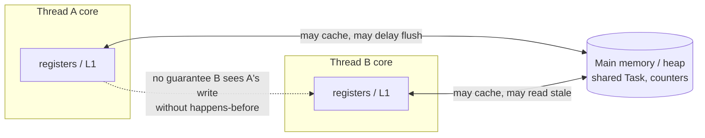
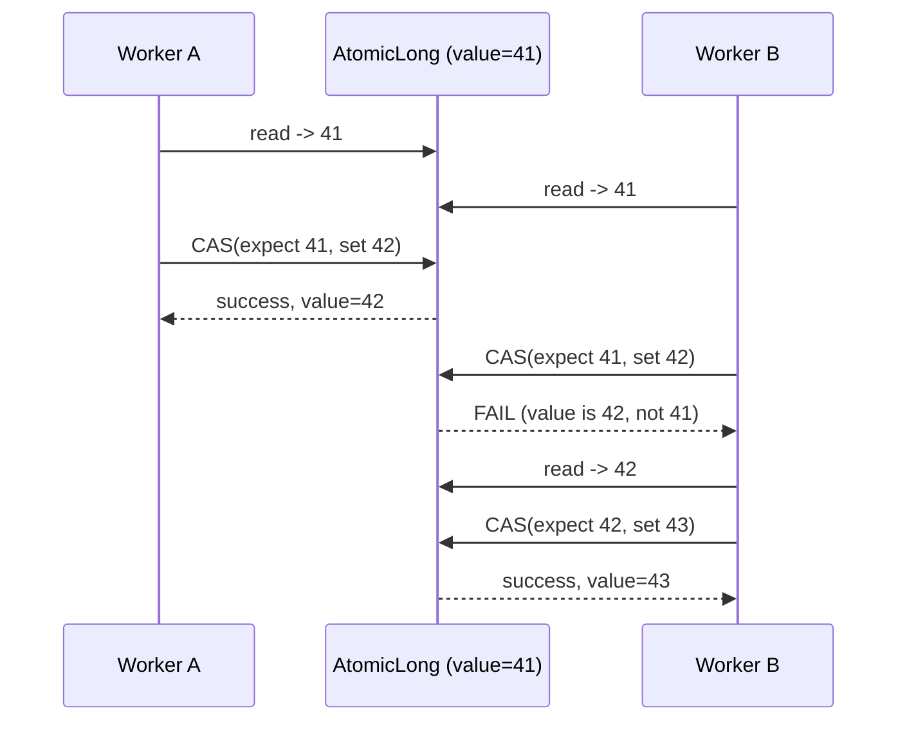
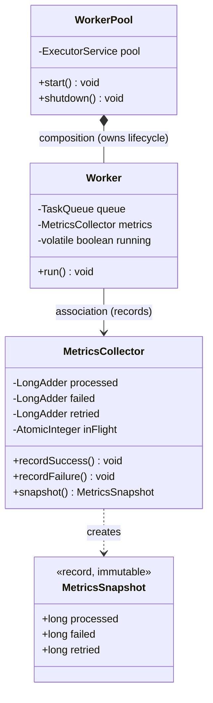

# Atomics, the Java Memory Model and Thread Safety

> Where this fits: this is the chapter that explains *why* multi-threaded code in our Task Queue breaks in ways that look impossible. We have `Worker` threads pulling from a `TaskQueue`, and we want to count "tasks processed", "tasks failed", and "tasks retried" for our `MetricsCollector`. The naive `counter++` loses updates and — worse — one thread may never *see* another thread's writes at all. This chapter teaches the Java Memory Model (JMM), `volatile`, happens-before, compare-and-swap, the `java.util.concurrent.atomic` family (`AtomicInteger`, `AtomicLong`, `AtomicReference`, `LongAdder`), and the cheapest form of thread safety there is: immutability.

---

## 1. Why this exists — the real problem it solves

In [threads.md](./threads.md) we gave our platform real parallelism: many `Worker` instances run concurrently, each pulling `Task` objects from a shared `TaskQueue`. The instant two threads touch the *same* mutable data, two distinct hazards appear, and they are genuinely different problems:

1. **Atomicity** — a single logical operation (`count = count + 1`) is actually three machine steps (read, add, write). Two threads interleaving these steps lose updates. This is a *race condition*.
2. **Visibility** — a write made by thread A may sit in a CPU register or a per-core cache and *never become visible* to thread B. The JIT compiler and CPU are free to reorder and cache your writes unless you tell them not to. This is a *memory visibility* problem, and it is the one that destroys engineers' sanity because the code "looks correct".

> Atomicity is "did my update get clobbered?" Visibility is "did my update get *seen at all*?" You can have one without the other. You need to solve both.

**Historical context (one paragraph that earns its place).** Before Java 5 (JSR-133, 2004), Java's memory model was under-specified and effectively unusable — the famous "double-checked locking is broken" article was a direct consequence. JSR-133 gave the JVM a *precise* memory model built on the **happens-before** relation, defined the semantics of `volatile` and `final`, and is the reason the patterns in this chapter are portable across x86, ARM, and every other CPU the JVM targets. x86 has a relatively strong memory model (it rarely reorders stores), so buggy code *appears* to work on your laptop and then corrupts data in production on ARM (Graviton, Apple Silicon, most modern cloud). The JMM exists so you reason about *the abstract machine*, not your particular CPU.

The concept we need: a contract that says "if I do X, then thread B is guaranteed to see Y." That contract is the Java Memory Model, and `volatile`, locks ([locks.md](./locks.md)), and atomics are the tools that create the guarantees within it.

---

## 2. The Java Memory Model in one mental model

Picture every thread as having its own *working memory* (registers + per-core caches) sitting in front of *main memory* (the shared heap). Without synchronization, a thread is allowed to:

- keep a field in a register and never re-read it from main memory,
- buffer a write and flush it later (or coalesce many writes into one),
- and the compiler/CPU may **reorder** independent reads and writes for speed.



The JMM does **not** promise sequential consistency for unsynchronized programs. It promises something narrower and more useful: **if action X *happens-before* action Y, then the effects of X (all its writes) are visible to Y.** Your entire job in concurrent Java is to establish enough happens-before edges that your program's behavior is well-defined.

### Happens-before: the edges you actually get

You do not memorize the JMM; you memorize the handful of edges it gives you:

| Rule | The happens-before edge |
|---|---|
| **Program order** | Within one thread, statement *n* happens-before statement *n+1*. |
| **Monitor lock** | Unlocking a monitor happens-before any subsequent lock of the *same* monitor. (`synchronized`, `ReentrantLock`.) |
| **Volatile** | A write to a `volatile` field happens-before every subsequent read of that *same* field. |
| **Thread start** | `t.start()` happens-before any action in thread `t`. |
| **Thread join** | Every action in thread `t` happens-before `t.join()` returns. |
| **Final fields** | A correctly constructed object's `final` fields are visible without synchronization (the JLS "freeze"). |
| **Transitivity** | If A hb B and B hb C, then A hb C. |

Atomics and concurrent collections are built on the **volatile** and **CAS** rules: an atomic write has volatile-write semantics, an atomic read has volatile-read semantics, so they publish data safely *and* update it atomically. That combination is what makes `java.util.concurrent.atomic` so valuable.

---

## 3. The naive version — `count++` from our metrics collector

Phase 1 needs metrics. Every `Worker` that finishes a `Task` increments a "processed" counter. The first cut:

```java
// BAD: not thread-safe, and not even visible.
public class NaiveMetrics {
    private long processed;          // plain field
    private long failed;

    public void recordSuccess() { processed++; }   // read-modify-write, NOT atomic
    public void recordFailure() { failed++; }

    public long processed() { return processed; }   // may read a stale value forever
    public long failed()    { return failed; }
}
```

Two independent bugs live here:

1. **`processed++` is three operations.** Decompiled it is roughly: `tmp = processed; tmp = tmp + 1; processed = tmp`. With two `Worker` threads interleaving, both read the same `tmp`, both write `tmp+1`, and one increment vanishes. Run eight threads incrementing a `long` a million times each and you will reliably end up well under 8,000,000.

2. **No visibility guarantee.** Even the `processed()` reader thread may have cached `processed` and never see *any* increments. There is no happens-before edge between the writer and the reader.

Let's prove the lost-update bug is real, not theoretical:

```java
public class LostUpdateDemo {
    static long counter = 0;                  // plain long

    public static void main(String[] args) throws InterruptedException {
        Runnable job = () -> { for (int i = 0; i < 1_000_000; i++) counter++; };
        Thread a = new Thread(job), b = new Thread(job);
        a.start(); b.start();
        a.join();  b.join();
        System.out.println(counter);          // almost never 2_000_000
    }
}
```

> Typical output: `1342877`, `1551203`, ... different every run. The "missing" ~660k increments are lost updates.

---

## 4. Improved version — `synchronized` (correct but coarse)

The first *correct* fix is to make the read-modify-write happen under a lock. The monitor-lock happens-before rule fixes **both** atomicity and visibility in one stroke:

```java
public class SyncMetrics {
    private long processed;
    private long failed;

    public synchronized void recordSuccess() { processed++; }
    public synchronized void recordFailure() { failed++; }

    public synchronized long processed() { return processed; }
    public synchronized long failed()    { return failed; }
}
```

This is correct. The unlock of `recordSuccess` happens-before the next lock, so increments are atomic and every read sees the latest value. But it has costs:

- **Contention.** Every counter update serializes on one monitor. With 64 `Worker` threads hammering one counter, threads queue up and we have turned a parallel system into a single-file line. This is the classic *hot lock*.
- **Blocking.** A thread that can't get the lock parks. We pay context-switch and scheduling overhead for what is morally a single `+1`.
- **It locks the whole object.** `processed` and `failed` share the same intrinsic monitor, so a success update needlessly blocks a failure update.

We can reduce the surface (separate lock objects per counter), but we are still using a *blocking* mutual-exclusion primitive to protect a single arithmetic operation. That is overkill.

---

## 5. Production-quality version — atomics and CAS

A single counter does not need mutual exclusion; it needs an **atomic read-modify-write**. Modern CPUs provide exactly that as a single instruction (`LOCK XADD` / `CAS` on x86, `LDADD`/`LL-SC` on ARM). Java exposes it through `java.util.concurrent.atomic`.

```java
import java.util.concurrent.atomic.AtomicLong;

public class AtomicMetrics {
    private final AtomicLong processed = new AtomicLong();
    private final AtomicLong failed    = new AtomicLong();
    private final AtomicLong retried   = new AtomicLong();

    public void recordSuccess() { processed.incrementAndGet(); } // lock-free, atomic, visible
    public void recordFailure() { failed.incrementAndGet(); }
    public void recordRetry()   { retried.incrementAndGet(); }

    public long processed() { return processed.get(); }
    public long failed()    { return failed.get(); }
    public long retried()   { return retried.get(); }
}
```

`incrementAndGet()` is **atomic** (no lost updates) and has **volatile semantics** (every reader sees the latest value), with no blocking. Internally it is a *compare-and-swap (CAS) loop*.

### Compare-and-swap, the engine under every atomic

CAS is a single hardware instruction with the semantics: "set this memory location to *new* **only if** it currently equals *expected*; tell me whether you succeeded." In Java:

```java
AtomicInteger v = new AtomicInteger(10);
boolean ok = v.compareAndSet(10, 11); // true: was 10, now 11
boolean no = v.compareAndSet(10, 12); // false: it's 11 now, not 10; value unchanged
```

`incrementAndGet` is built on a retry loop around CAS:

```java
// Conceptual implementation of incrementAndGet (the real one uses VarHandle/Unsafe intrinsics).
public long incrementAndGet() {
    long cur, next;
    do {
        cur  = get();          // volatile read
        next = cur + 1;
    } while (!compareAndSet(cur, next)); // retry if someone beat us to it
    return next;
}
```

This is **optimistic, lock-free** concurrency. No thread is ever blocked. If two threads collide, one wins the CAS and the other simply loops and retries with the fresh value. Under low-to-moderate contention this is dramatically faster than a lock because there is no parking, no context switch, no kernel involvement.



> **The ABA problem.** CAS checks *value equality*, not *identity of history*. If a value goes A → B → A, a CAS expecting A succeeds even though the world changed underneath it. For plain counters this is harmless (a number is a number). For pointer-based lock-free structures it matters; the JDK's answer is `AtomicStampedReference` (value + monotonic stamp) or `AtomicMarkableReference`. We'll only need this in Phase 4's lock-free structures; flagging it here so the term isn't a surprise.

---

## 6. Code walkthrough — beginner, intermediate, production

### 6.1 Beginner — `volatile` for a visibility-only flag

The single most common correct use of `volatile` is a **stop flag**. Our `WorkerPool` needs to tell a long-running `Worker` loop to stop. The flag is written by one thread and read by another; it is never read-modify-written, so we need *visibility*, not atomicity. That is exactly what `volatile` provides — and nothing more.

```java
public class StoppableWorker implements Runnable {
    private volatile boolean running = true;   // visibility across threads

    public void run() {
        while (running) {                       // re-reads from main memory each iteration
            // pull a Task, handle it... (elided)
        }
    }

    public void stop() { running = false; }     // write becomes visible to run()
}
```

Without `volatile`, the JIT is allowed to hoist `running` into a register and compile `while (running)` into `while (true)` — the worker would loop forever after `stop()`. `volatile` forbids that optimization and forces a fresh read each time, with a happens-before edge from the write to the read.

> `volatile` does **not** make `count++` atomic. It makes a *single read* and a *single write* visible. A read-modify-write is two operations, so `volatile int count; count++;` still loses updates. This is the #1 misconception about `volatile`.

### 6.2 Intermediate — `AtomicReference` to swap whole objects atomically

Our metrics often need to be read as a *consistent snapshot*: "give me processed, failed, and retried all measured at the same instant" so a dashboard isn't internally inconsistent. We model the snapshot as an **immutable record** and swap it atomically with `AtomicReference`.

```java
import java.util.concurrent.atomic.AtomicReference;

// Immutable snapshot — see ../03-java-memory-model/immutable-objects.md
public record MetricsSnapshot(long processed, long failed, long retried) {
    MetricsSnapshot withSuccess() { return new MetricsSnapshot(processed + 1, failed, retried); }
    MetricsSnapshot withFailure() { return new MetricsSnapshot(processed, failed + 1, retried); }
    MetricsSnapshot withRetry()   { return new MetricsSnapshot(processed, failed, retried + 1); }
}

public class SnapshotMetrics {
    private final AtomicReference<MetricsSnapshot> ref =
        new AtomicReference<>(new MetricsSnapshot(0, 0, 0));

    public void recordSuccess() { ref.updateAndGet(MetricsSnapshot::withSuccess); }
    public void recordFailure() { ref.updateAndGet(MetricsSnapshot::withFailure); }
    public void recordRetry()   { ref.updateAndGet(MetricsSnapshot::withRetry); }

    /** A globally consistent snapshot — all three numbers from the same instant. */
    public MetricsSnapshot snapshot() { return ref.get(); }
}
```

`updateAndGet(fn)` is a CAS loop: it reads the current reference, builds a *new immutable snapshot*, and swaps it in only if no one else changed `ref` in the meantime; otherwise it retries. Because `MetricsSnapshot` is immutable, the function passed to `updateAndGet` **must be side-effect-free and idempotent** — it can be invoked multiple times on retry. This is the cleanest pattern for "atomically evolve a small immutable value".

> Use this for *small* values. If many threads update `ref` under contention, every failed CAS throws away an allocated snapshot. For three monotonically-increasing counters, three `AtomicLong`s (or a `LongAdder`, below) are cheaper. Use `AtomicReference` when the thing you swap is a *compound state that must change all-or-nothing* — e.g. swapping the active config, the current leader, or a whole immutable routing table.

### 6.3 Production — `LongAdder` for high-throughput metric counters

Under *heavy* contention, a single `AtomicLong` becomes a bottleneck: every thread CASes the *same* memory location, they invalidate each other's cache lines (false sharing / cache-line ping-pong), and CAS failure rates climb. For counters that are **written constantly and read rarely** — exactly our metrics use case — `LongAdder` is the right tool.

`LongAdder` spreads the count across an internal array of cells. Each thread updates a *different* cell (chosen by a per-thread probe), so threads rarely collide. `sum()` adds the cells up when you actually need the total. This trades a tiny bit of read cost and memory for enormous write scalability.

```java
import java.util.concurrent.atomic.LongAdder;

/** Production metrics collector for our Task Queue. High write rate, occasional scrape. */
public final class TaskMetrics {
    private final LongAdder processed = new LongAdder();
    private final LongAdder failed    = new LongAdder();
    private final LongAdder retried   = new LongAdder();
    private final LongAdder dead       = new LongAdder();

    public void recordSuccess() { processed.increment(); }   // contention-friendly
    public void recordFailure() { failed.increment(); }
    public void recordRetry()   { retried.increment(); }
    public void recordDead()    { dead.increment(); }

    /** Called by the metrics scrape (Prometheus) — sums the cells. Eventually consistent. */
    public MetricsSnapshot snapshot() {
        return new MetricsSnapshot(processed.sum(), failed.sum(), retried.sum());
    }

    public long deadCount() { return dead.sum(); }
}
```

> **`AtomicLong` vs `LongAdder` decision rule.** Need an exact, monotonic value *and* read often or use the return value of `incrementAndGet()` for logic? Use `AtomicLong`. Pure write-heavy statistics where you only read totals occasionally (metrics, counters, rate sampling)? Use `LongAdder`. `LongAdder.sum()` is **not atomic with concurrent updates** — it can miss updates in-flight, which is perfectly fine for metrics but wrong if you need a precise instantaneous value.

In Phase 3 these `LongAdder`s feed [Micrometer](../10-system-design/observability-and-ops.md). Micrometer's own `Counter` is itself backed by a striped adder for the same reason — we are reproducing what the production library does.

---

## 7. How this applies to our Task Queue project

Concretely, here is where each tool from this chapter lands in the canonical model:

| Need in the platform | Tool | Why |
|---|---|---|
| `WorkerPool` stop signal | `volatile boolean running` | one writer, many readers, no compound update — visibility only |
| Count processed/failed/retried/dead `Task`s | `LongAdder` (in `MetricsCollector`) | write-heavy, read-rarely |
| Generate a unique sequence for task ordering / dedup | `AtomicLong.incrementAndGet()` | need the *returned* monotonic value |
| Track current in-flight task count for backpressure | `AtomicInteger` | bounded, read often, exact value used in logic |
| Hot-swap the active `RateLimiter` config or broker | `AtomicReference<Config>` | all-or-nothing swap of an immutable value |
| `Task` as a value passed between threads | `record Task(...)` immutable | safe publication for free — no synchronization needed to share |

The deepest point: our `Task` record is **immutable**, and that is the simplest thread-safety strategy in existence. An immutable object, once safely published (via a `final` field, a `volatile`, an atomic, or a concurrent collection), can be shared across any number of `Worker` threads with **zero** synchronization, because there is nothing to race on. Every "state change" of a task — `PENDING` → `RUNNING` → `SUCCEEDED` — produces a *new* `Task` rather than mutating the old one. See [../03-java-memory-model/immutable-objects.md](../03-java-memory-model/immutable-objects.md). This is why we modeled `Task`, `TaskResult`, and `TaskEvent` as records from day one.

```java
// Our canonical model, used here. A status transition returns a NEW Task — no mutation, no races.
public record Task(
        String id, String type, String payload, TaskStatus status,
        int attempts, int maxAttempts,
        java.time.Instant createdAt, java.time.Instant scheduledAt, int priority) {

    public Task running()         { return withStatus(TaskStatus.RUNNING); }
    public Task succeeded()       { return withStatus(TaskStatus.SUCCEEDED); }
    public Task failedAttempt()   { return new Task(id, type, payload, TaskStatus.RETRYING,
                                          attempts + 1, maxAttempts, createdAt, scheduledAt, priority); }

    private Task withStatus(TaskStatus s) {
        return new Task(id, type, payload, s, attempts, maxAttempts, createdAt, scheduledAt, priority);
    }
}

public enum TaskStatus { PENDING, SCHEDULED, RUNNING, SUCCEEDED, FAILED, RETRYING, DEAD }
```



---

## 8. Tradeoffs

| Approach | Atomicity | Visibility | Blocking? | Best for | Cost |
|---|---|---|---|---|---|
| plain field | no | no | n/a | nothing shared | data corruption |
| `volatile` field | **no** (single r/w only) | yes | no | flags, one-writer publication | no atomic RMW |
| `synchronized` / `ReentrantLock` | yes | yes | **yes** | compound invariants over multiple fields | contention, parking |
| `AtomicInteger`/`AtomicLong` | yes | yes | no (CAS) | single counter, need the value | spins under high contention |
| `LongAdder` | yes (per-cell) | yes | no | write-heavy stats | `sum()` not atomic, more memory |
| `AtomicReference<Immutable>` | yes | yes | no (CAS) | all-or-nothing swap of compound state | retry allocates garbage |
| **immutability** | n/a (no mutation) | yes (safe publication) | no | values shared across threads | must allocate on change |

Key tradeoff narratives:

- **Lock-free is not free.** CAS scales beautifully *until* contention is high; then threads burn CPU spinning on failed CAS. A `synchronized` block that parks a contended thread can actually outperform a wildly-contended atomic, because parking yields the CPU instead of spinning. Measure; don't assume lock-free wins.
- **`LongAdder` trades read latency and memory for write throughput.** If you read as often as you write, `AtomicLong` is simpler and just as good.
- **Immutability trades allocation for the *elimination* of an entire class of bugs.** With a modern generational GC, short-lived snapshot objects are cheap (TLAB allocation + young-gen collection). The bug elimination is almost always worth it. See [../03-java-memory-model/garbage-collection.md](../03-java-memory-model/garbage-collection.md).

---

## 9. Common mistakes and pitfalls

- **Thinking `volatile` makes `count++` atomic.** It does not. Use an atomic or a lock. *Fix:* `AtomicLong.incrementAndGet()`.
- **Marking the *reference* volatile and mutating the *object* it points to.** `volatile List<Task> list` makes the *reference* visible; calling `list.add(...)` from multiple threads is still unsafe. *Fix:* a concurrent collection ([concurrent-collections.md](./concurrent-collections.md)) or an immutable list swapped via `AtomicReference`.
- **CAS-update functions with side effects.** `updateAndGet`/`accumulateAndGet` may call your function multiple times on retry. A function that increments a logger counter or writes a file will do it more than once. *Fix:* keep the update function pure.
- **Reading `LongAdder.sum()` and treating it as exact under concurrent writes.** It's eventually consistent. *Fix:* accept it for metrics; use `AtomicLong` when you need a precise instantaneous value.
- **Compound atomicity illusion.** Two separate atomics do not give you a *joint* invariant. `if (a.get() > 0) b.incrementAndGet();` is a check-then-act race across two variables. *Fix:* put the joint state in *one* `AtomicReference<ImmutableState>` and CAS the whole thing, or use a lock.
- **Forgetting safe publication of an immutable object.** Immutable-but-published-via-a-plain-field can still be seen as `null` (or partially constructed in pre-`final` designs). *Fix:* publish via `final`, `volatile`, an atomic, or a concurrent collection.
- **Sharing `Random` / `SimpleDateFormat`-style mutable helpers across threads.** They have internal mutable state. *Fix:* `ThreadLocalRandom`, `DateTimeFormatter` (immutable).
- **Assuming x86 behavior is portable.** Code that "works" on your Intel laptop may reorder on ARM. *Fix:* reason via happens-before, test on the target arch, run with `-XX:+StressLCM -XX:+StressGCM` or jcstress for real concurrency testing.

---

## 10. Refactoring exercise — counter, three stages

**Bad** — lost updates and invisible writes:

```java
public class Counter {
    public long value;
    public void inc() { value++; }
    public long get() { return value; }
}
```

**Improved** — correct but coarse (whole-object lock, blocks):

```java
public class Counter {
    private long value;
    public synchronized void inc() { value++; }
    public synchronized long get() { return value; }
}
```

**Production** — lock-free, and split by read/write profile:

```java
import java.util.concurrent.atomic.AtomicLong;
import java.util.concurrent.atomic.LongAdder;

/** Use AtomicLong when you need the returned value; LongAdder when you only read totals. */
public final class Counter {
    private final AtomicLong sequence = new AtomicLong();  // returns the value -> AtomicLong
    private final LongAdder  hits     = new LongAdder();   // write-heavy stat -> LongAdder

    public long nextId()  { return sequence.incrementAndGet(); } // monotonic id for tasks
    public void hit()     { hits.increment(); }
    public long hitTotal(){ return hits.sum(); }
}
```

The rationale chain: plain field → *data race*; `synchronized` → *correct but blocking and coarse*; atomics → *lock-free and matched to the access pattern (returned value vs. pure accumulation)*.

---

## 11. Exercises

### Easy

**E1 (knowledge check).** Explain in two sentences the difference between an *atomicity* bug and a *visibility* bug, and name one tool that fixes only visibility and one that fixes both.

**E2 (coding).** Write a `StopFlag` class with a `volatile boolean` that a worker loop polls and a controller can set. Demonstrate (in a `main`) that with `volatile` the worker stops and explain why removing `volatile` risks an infinite loop.

### Medium

**M1 (coding).** Implement a thread-safe `IdGenerator` that hands out strictly increasing `long` ids to many threads, using exactly one atomic. Prove uniqueness with 8 threads × 100k ids by collecting them in a `Set` (use a concurrent set) and asserting the size.

**M2 (refactoring).** You are given a `Stats` class using a `synchronized` block to update a hit counter that is incremented millions of times per second but read once per scrape. Refactor it to remove the lock and explain which atomic type you chose and why.

### Hard

**H1 (design).** Design a thread-safe `RollingCounter` that exposes both `increment()` and `incrementAndGetCurrent()` *and* a consistent `snapshot()` returning `(success, failure)` measured at the same instant. Decide between (a) two `AtomicLong`s, (b) one `AtomicReference` to an immutable pair, or (c) a lock. Justify with respect to the "compound atomicity" pitfall.

**H2 (interview-style).** Implement a lock-free `compareAndIncrementIfBelow(long limit)` on top of `AtomicLong` that increments only if the current value is `< limit`, returning whether it incremented. This is the core of a token-bucket-style guard. Explain why a naive `if (get() < limit) incrementAndGet()` is wrong.

**H3 (stretch).** Explain the ABA problem with a concrete `Task`-pointer example, then implement a tiny lock-free Treiber stack of `Task` ids using `AtomicReference`, and state precisely why ABA is *not* a correctness problem for that particular stack but *would* be for a free-list reuse scheme.

---

## 12. Solutions

### E1

Atomicity bug: a compound read-modify-write (`count++`) interleaves across threads and loses updates — the update gets *clobbered*. Visibility bug: a write made by one thread is cached and *never seen* by another — the update is *invisible*. `volatile` fixes visibility only; `AtomicLong.incrementAndGet()` (or a lock) fixes both atomicity and visibility.

### E2

```java
public class StopFlag {
    private volatile boolean stopped = false;
    public void stop()      { stopped = true; }
    public boolean stopped(){ return stopped; }

    public static void main(String[] args) throws InterruptedException {
        StopFlag flag = new StopFlag();
        Thread worker = new Thread(() -> {
            long spins = 0;
            while (!flag.stopped()) { spins++; }       // polls a volatile -> sees the write
            System.out.println("worker stopped after " + spins + " spins");
        });
        worker.start();
        Thread.sleep(50);
        flag.stop();                                   // becomes visible to worker
        worker.join();
    }
}
```

Without `volatile`, the JIT may hoist the read of `stopped` out of the loop (it is loop-invariant from the compiler's single-threaded view), compiling `while (!stopped)` into `while (true)`. There is then no happens-before edge from `stop()` to the loop's read, so the worker can spin forever.

### M1

```java
import java.util.Collections;
import java.util.Set;
import java.util.concurrent.ConcurrentHashMap;
import java.util.concurrent.atomic.AtomicLong;

public final class IdGenerator {
    private final AtomicLong next = new AtomicLong(0);
    public long nextId() { return next.incrementAndGet(); }  // atomic + returns the value

    public static void main(String[] args) throws InterruptedException {
        IdGenerator gen = new IdGenerator();
        Set<Long> seen = Collections.newSetFromMap(new ConcurrentHashMap<>());
        int threads = 8, perThread = 100_000;
        Thread[] ts = new Thread[threads];
        for (int t = 0; t < threads; t++) {
            ts[t] = new Thread(() -> {
                for (int i = 0; i < perThread; i++) seen.add(gen.nextId());
            });
            ts[t].start();
        }
        for (Thread t : ts) t.join();
        // 8 * 100_000 = 800_000 unique ids, none lost or duplicated.
        System.out.println("unique=" + seen.size() + " expected=" + (threads * perThread));
        assert seen.size() == threads * perThread;
    }
}
```

One atomic suffices because `incrementAndGet()` is a single atomic operation that both mutates and returns; there is no check-then-act gap to race in.

### M2

```java
import java.util.concurrent.atomic.LongAdder;

public final class Stats {
    private final LongAdder hits = new LongAdder();   // chosen: write-heavy, read-rare
    public void hit()      { hits.increment(); }       // lock-free, scales across cores
    public long total()    { return hits.sum(); }      // eventually consistent, fine for scrape
}
```

`LongAdder` over `AtomicLong` because the access pattern is millions of writes to one logical counter and a single read per scrape. `LongAdder` stripes the count across cells so concurrent `increment()`s rarely contend the same cache line, whereas an `AtomicLong` would funnel every thread through one CAS target. We don't use the return value of the increment, and we don't need an exact instantaneous value, so the only tradeoff — `sum()` being eventually consistent — costs us nothing.

### H1

```java
import java.util.concurrent.atomic.AtomicReference;

public final class RollingCounter {
    public record Counts(long success, long failure) {}
    private final AtomicReference<Counts> ref = new AtomicReference<>(new Counts(0, 0));

    public void incrementSuccess() {
        ref.updateAndGet(c -> new Counts(c.success() + 1, c.failure()));   // pure function
    }
    public void incrementFailure() {
        ref.updateAndGet(c -> new Counts(c.success(), c.failure() + 1));
    }
    /** Consistent: both numbers come from the SAME immutable Counts instance. */
    public Counts snapshot() { return ref.get(); }
}
```

Chosen **(b)** one `AtomicReference` to an immutable pair. Two separate `AtomicLong`s (a) would make each *individual* counter atomic but the `snapshot()` would read them in two steps, so success and failure could come from different instants — the compound-atomicity pitfall. A lock (c) is correct but blocks; here the state is small and immutable, so a CAS swap of the whole `Counts` is lock-free and gives an all-or-nothing, internally consistent snapshot. The update functions are pure so CAS retries are safe.

### H2

```java
import java.util.concurrent.atomic.AtomicLong;

public final class BoundedCounter {
    private final AtomicLong value = new AtomicLong(0);

    /** Atomically increments only if current < limit. Returns true iff it incremented. */
    public boolean compareAndIncrementIfBelow(long limit) {
        while (true) {
            long cur = value.get();
            if (cur >= limit) return false;                 // at/over the cap, give up
            if (value.compareAndSet(cur, cur + 1)) return true; // won the race
            // else: someone else moved it; loop and re-check the (possibly now-full) limit
        }
    }
}
```

A naive `if (get() < limit) incrementAndGet()` is a **check-then-act** race: between the `get()` that observes `cur < limit` and the `incrementAndGet()`, another thread can also pass the check and increment, pushing the value *past* `limit`. The CAS loop closes the gap — it only commits the increment if the value is *still* the `cur` it validated against; otherwise it re-reads and re-checks the limit. This is exactly the atomic primitive behind a token-bucket [RateLimiter](../08-distributed-systems/rate-limiting.md).

### H3

```java
import java.util.concurrent.atomic.AtomicReference;

/** Lock-free Treiber stack of Task ids. */
public final class TaskIdStack {
    private static final class Node {
        final String taskId; final Node next;
        Node(String taskId, Node next) { this.taskId = taskId; this.next = next; }
    }
    private final AtomicReference<Node> head = new AtomicReference<>();

    public void push(String taskId) {
        Node n;
        Node newHead;
        do {
            n = head.get();
            newHead = new Node(taskId, n);
        } while (!head.compareAndSet(n, newHead));   // CAS in the new head
    }

    public String pop() {
        while (true) {
            Node cur = head.get();
            if (cur == null) return null;
            if (head.compareAndSet(cur, cur.next)) return cur.taskId; // ABA-relevant CAS
        }
    }
}
```

**ABA scenario:** thread T1 in `pop()` reads `head == nodeA` and computes `cur.next == nodeB`. T1 stalls. T2 pops `nodeA`, pops `nodeB`, then pushes a *new* node that happens to be allocated at the *same address* as the old `nodeA` (`A → B → A` by reference). T1 resumes; its `compareAndSet(nodeA, nodeB)` *succeeds* because the head pointer equals `nodeA` again — but `nodeB` may no longer be in the stack, corrupting it.

**Why it's not a correctness problem here:** because we **always allocate a fresh `Node` on `push`** and never reuse `Node` objects, the JVM's GC guarantees a *live* `nodeA` reference cannot be recycled to a *different* logical node while T1 still holds it. The address cannot be reused for a new node until no reference exists, so the A→B→A-by-identity case cannot arise. ABA *would* return if we maintained our own free-list and recycled `Node` instances (a common C/C++ lock-free optimization); then `AtomicStampedReference<Node>` — pairing the pointer with a monotonically increasing stamp so A-then-A is distinguishable — would be required.

---

## 13. Interview questions and takeaways

1. **Why isn't `i++` atomic?**
   It compiles to read-modify-write (three steps). Two threads can read the same value, both add one, both write back the same result — one increment is lost. Use an atomic or a lock.

2. **What does `volatile` guarantee, and what does it *not*?**
   Guarantees: a write is immediately visible to subsequent reads (a happens-before edge), and reads/writes aren't reordered across the volatile access. Does not: make compound operations atomic. `volatile count; count++` still races.

3. **What is happens-before and why do we care?**
   A partial order over actions; if A happens-before B, A's writes are visible to B. It's the *only* thing that makes inter-thread visibility well-defined. You build correctness by establishing happens-before edges via locks, volatiles, atomics, thread start/join, and final fields.

4. **How does `AtomicInteger.incrementAndGet()` work without a lock?**
   A CAS retry loop: read current, compute next, `compareAndSet(current, next)`; if another thread won, re-read and retry. Lock-free, no blocking, backed by a single hardware CAS instruction.

5. **`AtomicLong` vs `LongAdder` — when each?**
   `AtomicLong` for exact values you read often or whose `incrementAndGet()` return you use. `LongAdder` for write-heavy, read-rare stats; it stripes across cells to avoid cache-line contention, but `sum()` is eventually consistent.

6. **What is the ABA problem and how do you fix it?**
   A CAS sees the value return to its expected state (A→B→A) and succeeds though history changed. Harmless for counters; dangerous for pointer reuse. Fix with `AtomicStampedReference` (value + version stamp).

7. **Is an immutable object automatically thread-safe?**
   Yes for *reads* once **safely published** — its `final` fields are visible without synchronization. You still need safe publication (final/volatile/atomic/concurrent collection) so other threads see a fully-constructed reference.

8. **When does lock-free lose to a lock?**
   Under very high contention: failed CAS spins burn CPU, whereas a lock parks the loser and frees the core. Always measure; "lock-free" is a property, not a guarantee of speed.

9. **Why does correct-looking concurrent code fail on ARM but not x86?**
   x86 has a strong memory model (rarely reorders stores), so missing happens-before edges are often masked. ARM reorders more aggressively, exposing the latent bug. Reason via the JMM, not your CPU.

---

## 14. Production considerations

- **Metrics counters are write-hot.** A single `AtomicLong` shared by 64 `Worker` threads is a measurable bottleneck under load. Use `LongAdder` (or Micrometer's `Counter`, which stripes internally). Watch for *false sharing*: pad or rely on the JDK's `@Contended` (used inside `LongAdder` cells).
- **Don't reach for atomics when you have a *compound* invariant.** Atomics protect *one* variable. The moment correctness depends on two variables changing together, you need one `AtomicReference<ImmutableState>` or a lock. Mixing several atomics to fake a joint invariant is a classic production data-corruption bug.
- **Safe publication on startup.** Config loaded once at boot and read by all workers should be `final` or behind a `volatile`/`AtomicReference`. A plain field set in a constructor and read from another thread can be seen as `null`.
- **Testing concurrency.** Unit tests rarely surface races. Use [jcstress](https://github.com/openjdk/jcstress) for memory-model tests, run stress loops (`-XX:+StressLCM -XX:+StressGCM`), and test on ARM (Graviton/Apple Silicon), not just x86, since x86's strong ordering hides bugs.
- **Observability of contention.** Async-profiler or JFR (`jdk.JavaMonitorEnter`, `jdk.ThreadPark`) tells you whether a counter or lock is hot. If you see threads parking on a counter, you used a lock where an atomic belongs; if you see high CAS-retry CPU, you used an atomic where a `LongAdder` belongs.
- **Virtual threads (Loom) change the calculus, not the rules.** Millions of virtual threads still share the same heap; the JMM, atomics, and immutability apply unchanged. But pinning a contended `synchronized` block can hurt more with virtual threads — prefer atomics/`ReentrantLock` for hot paths (see [locks.md](./locks.md)).

---

## What We Can Improve In Our Project Using This Concept

Our Phase 1 `MetricsCollector` currently (after [threads.md](./threads.md)) uses plain `long` fields updated from multiple `Worker` threads — it under-counts and may report stale values. We replace them with `LongAdder`s for the high-write counters (`processed`, `failed`, `retried`, `dead`), an `AtomicInteger` for `inFlight` (read in backpressure logic), and an `AtomicLong` sequence generator for ordering/dedup. The `WorkerPool` stop signal becomes a single `volatile boolean`. Crucially, we lean on the fact that `Task`, `TaskResult`, and `TaskEvent` are **immutable records**, so passing them between the `TaskQueue`, `Worker`s, and (Phase 4) the `EventBus` needs no locking at all.

## Project Refactoring Task

Refactor `MetricsCollector` to be lock-free and correct under concurrency:
1. Replace plain `long processed/failed/retried/dead` with `LongAdder`.
2. Add `AtomicInteger inFlight` incremented when a `Worker` dequeues a `Task` and decremented in a `finally` after `handle`.
3. Add `MetricsSnapshot snapshot()` returning an immutable record of the four totals, used by the (future) Prometheus scrape.
4. Replace the `WorkerPool`'s shutdown flag with `volatile boolean running` and confirm every `Worker` loop polls it.
5. Add a JUnit 5 test that spins N threads each recording M successes and asserts `snapshot().processed() == N*M` — the test must fail against the old plain-`long` version and pass against the new one.

## Git Commit For This Chapter

```text
refactor(metrics): make MetricsCollector lock-free and thread-safe

- Replace plain long counters with LongAdder (processed/failed/retried/dead)
- Add AtomicInteger inFlight for backpressure accounting
- Add immutable MetricsSnapshot record for consistent reads
- Use volatile boolean running for WorkerPool shutdown signal
- Add concurrency test proving no lost updates under 8 threads

Files touched:
  src/main/java/com/taskqueue/metrics/MetricsCollector.java
  src/main/java/com/taskqueue/metrics/MetricsSnapshot.java
  src/main/java/com/taskqueue/worker/Worker.java
  src/main/java/com/taskqueue/worker/WorkerPool.java
  src/test/java/com/taskqueue/metrics/MetricsCollectorConcurrencyTest.java
```

## Architecture Impact

This is a *correctness* change with near-zero architectural footprint: we swap field types and a flag, but the class boundaries, the `Worker`/`WorkerPool` relationship, and the public API of `MetricsCollector` are unchanged. The downstream impact is that metrics become trustworthy enough to drive **autoscaling and backpressure** in Phase 3/4 — you cannot scale on a number that's silently wrong. The immutability of `Task`/`TaskResult`/`TaskEvent` becomes a load-bearing invariant the distributed phases depend on: an immutable value can cross thread, queue, and (serialized) network boundaries without a synchronization story.

## Interview Takeaways

- Atomicity ≠ visibility; name both bugs and the tool for each (`volatile` = visibility only; atomics/locks = both).
- `i++` is read-modify-write, hence not atomic; `volatile` does not fix it.
- Happens-before is the contract; you build correctness by establishing its edges (lock, volatile, atomic, start/join, final).
- Atomics are CAS loops — lock-free, but they spin under contention; `LongAdder` stripes for write-heavy counters.
- Immutability + safe publication is the cheapest, most scalable thread-safety strategy; it's why our domain model is records.
