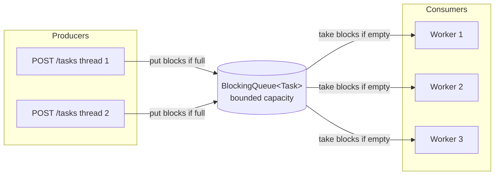
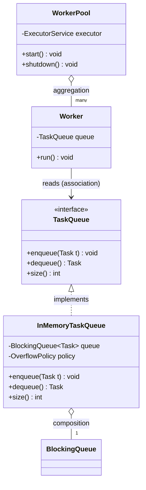

# BlockingQueue and the Producer-Consumer Core

> Where this fits in the project: `BlockingQueue` is the literal beating heart of our Phase 1 platform. `InMemoryTaskQueue` — the canonical `TaskQueue` implementation that the Submission API writes into and the `WorkerPool` reads from — is a thin, opinionated wrapper around a `BlockingQueue`. Get this right and the rest of Phase 1 falls into place.

---

## 1. Why This Exists

Our platform has two populations of threads that must hand work between them:

- **Producers** — the request threads behind `POST /tasks`. They accept a `Task`, validate it, and need to *hand it off* and return `202 Accepted` immediately.
- **Consumers** — the `Worker` threads in the `WorkerPool` that pull a `Task`, look up its `TaskHandler`, and execute it.

The producers and consumers run at different, *uncorrelated* speeds. A traffic spike can submit 50,000 tasks in a second; the workers might only drain 2,000/s. Something has to sit between them, hold the backlog, and coordinate the handoff **safely** across threads.

Historically people built this by hand: a plain `ArrayList` or `LinkedList` guarded by a `synchronized` block, plus `Object.wait()` / `Object.notify()` to make consumers sleep when the list is empty and wake when something arrives. This is *notoriously* hard to get right — missed signals, spurious wakeups, lost notifications, and the dreaded "I called `notify()` but the wrong thread woke up" bugs. It is the canonical interview question precisely because almost nobody writes it correctly under pressure.

`java.util.concurrent.BlockingQueue` (Java 5, 2004, from Doug Lea's `util.concurrent`) solves this once, correctly, in the JDK. It is a queue where:

- `put(e)` **blocks** the producer if the queue is full (for bounded queues).
- `take()` **blocks** the consumer if the queue is empty, until an element arrives.

That blocking behavior is not a limitation — it is the entire feature. It gives us **backpressure** for free: when consumers fall behind, producers naturally slow down instead of exploding memory.



This chapter is the bridge from raw [threads](./threads.md) and the [executor service](./executor-service.md) into the [producer-consumer pattern](../07-queues-and-messaging/producer-consumer.md) that the rest of the curriculum builds on.

---

## 2. The Naive Version

First instinct, fresh from a DSA background: "a queue is just a list, and thread safety is just `synchronized`."

```java
// BAD: do not ship this. It is here to be criticized.
public final class NaiveTaskQueue {
    private final java.util.Deque<Task> tasks = new java.util.ArrayDeque<>();

    public synchronized void enqueue(Task t) {
        tasks.addLast(t);
    }

    public synchronized Task dequeue() {
        if (tasks.isEmpty()) {
            return null; // caller has to figure out what to do
        }
        return tasks.pollFirst();
    }

    public synchronized int size() {
        return tasks.size();
    }
}
```

What is wrong with this?

1. **`dequeue()` returns `null` when empty.** The `Worker` is now forced to **busy-wait**: `while ((t = q.dequeue()) == null) { /* spin */ }`. That spinning pegs a CPU core to 100% doing nothing. With 8 idle workers you've burned 8 cores to wait.
2. **No bound.** There is no capacity limit, so a producer flood grows `tasks` until the JVM throws `OutOfMemoryError`. No backpressure whatsoever.
3. **`synchronized` on the whole object** serializes `enqueue`, `dequeue`, and even `size()`. A producer and a consumer can never touch the queue at the same time, even though they operate on opposite ends.
4. **It re-implements something the JDK already ships**, badly, and you now own the bugs.

The "fix" people reach for next is `wait()`/`notify()`:

```java
// STILL BAD: subtly broken in three classic ways.
public synchronized Task dequeue() throws InterruptedException {
    if (tasks.isEmpty()) {
        wait();            // pitfall 1: 'if' not 'while' -> spurious wakeup bug
    }
    return tasks.pollFirst();
    // pitfall 2: no capacity check on enqueue -> still unbounded
    // pitfall 3: notify() vs notifyAll() -> can wake the wrong waiter and deadlock
}
```

The `if (empty) wait()` instead of `while (empty) wait()` is the single most common concurrency bug in existence. After `wait()` returns you must **re-check the condition**, because the JVM is allowed to wake you spuriously and another consumer may have stolen the element. We can do better by not writing this code at all.

---

## 3. Improved Version

Use the JDK. `LinkedBlockingQueue` gives us correct, lock-based blocking semantics with zero hand-rolled coordination.

```java
import java.util.concurrent.BlockingQueue;
import java.util.concurrent.LinkedBlockingQueue;

public final class InMemoryTaskQueue implements TaskQueue {
    private final BlockingQueue<Task> queue = new LinkedBlockingQueue<>();

    @Override public void enqueue(Task t) {
        queue.offer(t);                  // non-blocking; unbounded so always succeeds
    }

    @Override public Task dequeue() throws InterruptedException {
        return queue.take();             // blocks until an element is available
    }

    @Override public int size() {
        return queue.size();
    }
}
```

This already fixes the worst problems: consumers `take()` and block efficiently (the thread parks, consuming zero CPU) instead of spinning, and the coordination is correct. The `Worker` loop becomes clean:

```java
while (!Thread.currentThread().isInterrupted()) {
    Task t = queue.dequeue();   // sleeps for free when idle
    process(t);
}
```

But there is still a flaw: a default `LinkedBlockingQueue` is **effectively unbounded** (`Integer.MAX_VALUE` capacity). Under a flood it still grows until OOM. We have correctness but no backpressure.

---

## 4. Production-Quality Version

A staff engineer ships a **bounded** queue with an explicit overflow policy, configurable capacity, observability hooks, and a deliberate choice between `ArrayBlockingQueue` and `LinkedBlockingQueue`.

```java
import java.time.Duration;
import java.util.Objects;
import java.util.concurrent.ArrayBlockingQueue;
import java.util.concurrent.BlockingQueue;
import java.util.concurrent.TimeUnit;

/**
 * Phase 1 canonical TaskQueue: a bounded, observable, backpressuring
 * in-memory queue built on an ArrayBlockingQueue.
 */
public final class InMemoryTaskQueue implements TaskQueue {

    /** What to do when enqueue() hits a full queue. */
    public enum OverflowPolicy { BLOCK, REJECT }

    private final BlockingQueue<Task> queue;
    private final OverflowPolicy policy;
    private final Duration offerTimeout;

    public InMemoryTaskQueue(int capacity, OverflowPolicy policy, Duration offerTimeout) {
        if (capacity <= 0) throw new IllegalArgumentException("capacity must be > 0");
        this.queue = new ArrayBlockingQueue<>(capacity);   // bounded, single lock, predictable memory
        this.policy = Objects.requireNonNull(policy);
        this.offerTimeout = Objects.requireNonNull(offerTimeout);
    }

    public static InMemoryTaskQueue boundedBlocking(int capacity) {
        return new InMemoryTaskQueue(capacity, OverflowPolicy.BLOCK, Duration.ofSeconds(2));
    }

    @Override
    public void enqueue(Task t) {
        Objects.requireNonNull(t, "task");
        try {
            boolean accepted = switch (policy) {
                case BLOCK  -> offerWithTimeout(t);
                case REJECT -> queue.offer(t);             // returns immediately, true/false
            };
            if (!accepted) {
                throw new QueueFullException(t.id(), queue.size());
            }
        } catch (InterruptedException e) {
            Thread.currentThread().interrupt();            // restore the flag, never swallow
            throw new QueueFullException(t.id(), queue.size());
        }
    }

    private boolean offerWithTimeout(Task t) throws InterruptedException {
        // BLOCK policy still bounds how long a request thread can hang,
        // so POST /tasks never blocks forever and can return 503 instead.
        return queue.offer(t, offerTimeout.toMillis(), TimeUnit.MILLISECONDS);
    }

    @Override
    public Task dequeue() throws InterruptedException {
        return queue.take();                               // blocks until work arrives
    }

    @Override
    public int size() {
        return queue.size();
    }

    public int remainingCapacity() {
        return queue.remainingCapacity();                  // for backpressure metrics
    }
}
```

With a tiny domain exception:

```java
public final class QueueFullException extends RuntimeException {
    public QueueFullException(String taskId, int currentSize) {
        super("Queue full (size=" + currentSize + "), rejected task " + taskId);
    }
}
```

Why this is the shippable version:

- **Bounded by `ArrayBlockingQueue`** — fixed memory footprint, no OOM under flood.
- **Explicit overflow policy.** `REJECT` lets the API return `503 Service Unavailable` so clients can retry with backoff. `BLOCK` (with a timeout) applies upstream backpressure. The choice is a product decision, now configurable.
- **Bounded blocking.** Even in `BLOCK` mode we use `offer(t, timeout)` so a request thread never hangs indefinitely — critical for keeping the API responsive.
- **Interrupt hygiene.** We restore the interrupt flag and never silently swallow it.
- **Observable.** `remainingCapacity()` and `size()` feed straight into a [`MetricsCollector`](../08-distributed-systems/backpressure.md) gauge.

---

## 5. Code Walkthrough

### 5.1 Beginner: the smallest correct producer-consumer

```java
import java.util.concurrent.ArrayBlockingQueue;
import java.util.concurrent.BlockingQueue;

public class HelloBlockingQueue {
    public static void main(String[] args) throws InterruptedException {
        BlockingQueue<String> q = new ArrayBlockingQueue<>(4);

        Thread producer = new Thread(() -> {
            try {
                for (int i = 1; i <= 6; i++) {
                    q.put("task-" + i);                // blocks when 4 are buffered
                    System.out.println("produced task-" + i + " (size=" + q.size() + ")");
                }
                q.put("POISON");                       // sentinel to stop the consumer
            } catch (InterruptedException e) {
                Thread.currentThread().interrupt();
            }
        });

        Thread consumer = new Thread(() -> {
            try {
                String item;
                while (!"POISON".equals(item = q.take())) {   // blocks when empty
                    System.out.println("    consumed " + item);
                    Thread.sleep(150);                  // pretend work is slow
                }
            } catch (InterruptedException e) {
                Thread.currentThread().interrupt();
            }
        });

        consumer.start();
        producer.start();
        producer.join();
        consumer.join();
    }
}
```

Run it and watch: the producer races ahead to 4 items, then **stalls on `put`** until the slow consumer drains a slot. That stall *is* backpressure. Note the **poison pill** — a sentinel value that tells the consumer to stop; this is the standard clean-shutdown trick for blocking queues.

### 5.2 Intermediate: many producers, many consumers, graceful drain

```java
import java.util.List;
import java.util.concurrent.*;

public class MultiProducerConsumer {
    private static final Task POISON =
        new Task("POISON", "stop", "", TaskStatus.PENDING, 0, 1,
                 java.time.Instant.now(), java.time.Instant.now(), 0);

    public static void main(String[] args) throws InterruptedException {
        BlockingQueue<Task> q = new LinkedBlockingQueue<>(1000);
        int producers = 3, consumers = 4, perProducer = 50;

        ExecutorService pool = Executors.newFixedThreadPool(producers + consumers);

        for (int p = 0; p < producers; p++) {
            final int id = p;
            pool.submit(() -> {
                for (int i = 0; i < perProducer; i++) {
                    q.put(sampleTask(id + "-" + i));
                }
                return null;
            });
        }

        ConcurrentHashMap<String, Integer> counts = new ConcurrentHashMap<>();
        for (int c = 0; c < consumers; c++) {
            pool.submit(() -> {
                while (true) {
                    Task t = q.take();
                    if (t == POISON) { q.put(POISON); break; }   // re-insert so peers also stop
                    counts.merge("done", 1, Integer::sum);
                }
                return null;
            });
        }

        // wait until all real work is enqueued, then send one poison pill
        Thread.sleep(200);
        while (q.size() > 0) Thread.sleep(10);
        q.put(POISON);

        pool.shutdown();
        pool.awaitTermination(5, TimeUnit.SECONDS);
        System.out.println("processed: " + counts.get("done") + " expected " + producers * perProducer);
    }

    static Task sampleTask(String suffix) {
        return new Task(java.util.UUID.randomUUID().toString(), "email", "{}",
                        TaskStatus.PENDING, 0, 3,
                        java.time.Instant.now(), java.time.Instant.now(), 5);
    }
}
```

The **re-insert-the-poison-pill** idiom (`if (poison) { q.put(poison); break; }`) is how one sentinel cascades to shut down `N` consumers cleanly without a per-consumer counter.

### 5.3 Production-inspired: `InMemoryTaskQueue` wired to a `WorkerPool`

This is the real Phase 1 wiring, using the canonical model verbatim.

```java
import java.time.Duration;
import java.util.concurrent.*;

public class WorkerPool {
    private final TaskQueue queue;
    private final TaskHandlerRegistry registry;     // maps task.type() -> TaskHandler
    private final ExecutorService executor;
    private final int workerCount;
    private volatile boolean running = false;

    public WorkerPool(TaskQueue queue, TaskHandlerRegistry registry, int workerCount) {
        this.queue = queue;
        this.registry = registry;
        this.workerCount = workerCount;
        // Virtual threads (Java 21): each Worker mostly blocks on take()/IO,
        // so one carrier thread can host thousands of cheap virtual workers.
        this.executor = Executors.newThreadPerTaskExecutor(
            Thread.ofVirtual().name("worker-", 0).factory());
    }

    public void start() {
        running = true;
        for (int i = 0; i < workerCount; i++) {
            executor.submit(new Worker(queue, registry, () -> running));
        }
    }

    public void shutdown() {
        running = false;
        executor.shutdownNow();                      // interrupts threads parked in take()
        try {
            executor.awaitTermination(10, TimeUnit.SECONDS);
        } catch (InterruptedException e) {
            Thread.currentThread().interrupt();
        }
    }
}
```

```java
public final class Worker implements Runnable {
    private final TaskQueue queue;
    private final TaskHandlerRegistry registry;
    private final java.util.function.BooleanSupplier running;

    public Worker(TaskQueue queue, TaskHandlerRegistry registry,
                  java.util.function.BooleanSupplier running) {
        this.queue = queue;
        this.registry = registry;
        this.running = running;
    }

    @Override
    public void run() {
        while (running.getAsBoolean()) {
            Task task;
            try {
                task = queue.dequeue();              // <-- BlockingQueue.take(); parks when idle
            } catch (InterruptedException e) {
                Thread.currentThread().interrupt();  // shutdownNow() interrupted us: exit loop
                return;
            }
            execute(task);
        }
    }

    private void execute(Task task) {
        TaskHandler handler = registry.lookup(task.type());
        if (handler == null) {
            System.err.println("No handler for type " + task.type() + ", dropping " + task.id());
            return;
        }
        try {
            TaskResult result = handler.handle(task);
            if (result.success()) {
                System.out.println("SUCCEEDED " + task.id());
            } else if (result.retryable()) {
                System.out.println("RETRYING " + task.id() + ": " + result.message());
                // Phase 2: re-enqueue with backoff via RetryPolicy + TaskScheduler
            } else {
                System.out.println("FAILED " + task.id() + ": " + result.message());
            }
        } catch (Exception e) {
            System.err.println("Handler threw for " + task.id() + ": " + e.getMessage());
        }
    }
}
```

The single line `task = queue.dequeue();` — which is `BlockingQueue.take()` underneath — is what makes the entire worker pool efficient. Idle workers cost nothing; busy workers run flat out; the queue does all the coordination.

---

## 6. How This Applies to Our Task Queue Project

Mapping the canonical model onto `BlockingQueue`:

| Canonical type | Role | Built on |
| --- | --- | --- |
| `TaskQueue` | interface: `enqueue`, `dequeue`, `size` | abstraction over the broker |
| `InMemoryTaskQueue` | Phase 1 implementation | `ArrayBlockingQueue<Task>` (bounded) |
| `Worker` (`Runnable`) | calls `dequeue()` in a loop | `BlockingQueue.take()` |
| `WorkerPool` | manages N `Worker`s | `ExecutorService` |
| Submission API | calls `enqueue()` | `BlockingQueue.put`/`offer` |



In **Phase 2** the same `TaskQueue` interface is re-implemented as `PostgresTaskQueue` (durable, survives restarts). In **Phase 4** it becomes a distributed broker (Redis/Kafka). The interface stays identical — that is the payoff of programming to `TaskQueue`, not to `BlockingQueue`. See [task-queues](../07-queues-and-messaging/task-queues.md) for the evolution.

### Preview: `DelayQueue` and `PriorityBlockingQueue`

Two specialized `BlockingQueue` implementations matter to our roadmap:

- **`PriorityBlockingQueue<Task>`** — an *unbounded* heap-ordered blocking queue. Order by `task.priority()`, and high-priority tasks jump the line. This is the basis of [priority-queues](../07-queues-and-messaging/priority-queues.md). Note: it is **unbounded**, so it gives ordering but **not** backpressure — a tradeoff you must manage.

  ```java
  Comparator<Task> byPriority = Comparator.comparingInt(Task::priority).reversed();
  BlockingQueue<Task> pq = new PriorityBlockingQueue<>(64, byPriority);
  pq.put(highPriorityTask);   // bubbles to the front
  Task next = pq.take();      // always the highest priority currently present
  ```

- **`DelayQueue<DelayedTask>`** — a queue whose elements only become available via `take()` once their delay has elapsed. This is exactly how `TaskScheduler.schedule(Task, Duration)` is implemented for `SCHEDULED` tasks and how the `RetryPolicy` re-enqueues with backoff. Covered in depth in [delayed-queues](../07-queues-and-messaging/delayed-queues.md) and [scheduling-queues](../07-queues-and-messaging/scheduling-queues.md).

  ```java
  // element must implement java.util.concurrent.Delayed
  record DelayedTask(Task task, long fireAtMillis) implements Delayed {
      public long getDelay(TimeUnit unit) {
          return unit.convert(fireAtMillis - System.currentTimeMillis(), TimeUnit.MILLISECONDS);
      }
      public int compareTo(Delayed o) {
          return Long.compare(getDelay(TimeUnit.MILLISECONDS), o.getDelay(TimeUnit.MILLISECONDS));
      }
  }
  ```

---

## 7. Tradeoffs

### `ArrayBlockingQueue` vs `LinkedBlockingQueue`

| Dimension | `ArrayBlockingQueue` | `LinkedBlockingQueue` |
| --- | --- | --- |
| Backing structure | Pre-allocated array (ring buffer) | Linked nodes, allocated per element |
| Bound | **Always bounded** (capacity in constructor) | Optional; default `Integer.MAX_VALUE` (effectively unbounded) |
| Locking | **Single** lock for put and take | **Two** locks (`putLock`, `takeLock`) — higher concurrency |
| Memory | Fixed, predictable; allocates whole array up front | Grows/shrinks; per-node object overhead and GC churn |
| Throughput | Better at small/medium capacity, low contention | Better under high producer+consumer contention |
| Fairness | Optional `fair=true` (FIFO thread ordering, slower) | No fairness option |
| Our default | **Preferred for `InMemoryTaskQueue`** (bounded = backpressure) | Use only when you genuinely need two-lock throughput |

> **Rule of thumb:** default to `ArrayBlockingQueue` because *bounded-by-construction* is the safer default. Reach for `LinkedBlockingQueue` only when profiling shows lock contention on a single-lock array queue, and even then set an explicit capacity.

### Backpressure strategy

| Policy | Producer behavior on full | Use when | Downside |
| --- | --- | --- | --- |
| `put` (block forever) | Blocks until space | Internal pipelines | Can hang a request thread indefinitely |
| `offer(t, timeout)` | Blocks up to timeout | API request threads | Needs a sensible timeout |
| `offer(t)` (reject) | Returns `false` immediately | Load shedding, return 503 | Drops work; client must retry |
| Unbounded queue | Never blocks | Almost never | OOM under flood — *anti-pattern* |

---

## 8. Common Mistakes and Pitfalls

- **Using an unbounded queue "to be safe."** It is the opposite of safe — it converts a load spike into an `OutOfMemoryError`. *Fix:* always set a capacity; choose an overflow policy.
- **Calling `add()` instead of `put`/`offer`.** `add()` throws `IllegalStateException` on a full bounded queue (it inherits `Queue` semantics, not blocking semantics). *Fix:* use `put` (block) or `offer` (boolean), never `add` on a `BlockingQueue` you expect to fill.
- **Swallowing `InterruptedException`.** Catching it and doing nothing breaks cancellation and clean shutdown. *Fix:* `Thread.currentThread().interrupt();` to restore the flag, then exit or propagate.
- **`if (empty) wait()` instead of `while`** — only relevant if you hand-roll, but worth knowing: spurious wakeups are real. *Fix:* use `BlockingQueue` and never write this.
- **`poll()` in a tight loop (busy-wait).** `while ((t = q.poll()) == null) {}` pegs a CPU. *Fix:* use `take()` (parks the thread) or `poll(timeout, unit)`.
- **`size()` for control-flow decisions.** `size()` is a *racy* snapshot; between checking and acting it changes. *Fix:* never do `if (q.size() < cap) q.put(...)`; just call `offer` and react to its result atomically.
- **Forgetting that `PriorityBlockingQueue` is unbounded.** You get ordering but no backpressure. *Fix:* add an external semaphore or `Semaphore`-gated `enqueue` if you need a bound.
- **Not stopping consumers on shutdown.** Threads parked in `take()` never return. *Fix:* `executor.shutdownNow()` (interrupts them) or a poison pill.

---

## 9. Refactoring Exercise

**Bad** — busy-waiting, unbounded, swallowed interrupts:

```java
public class BadQueue {
    private final java.util.List<Task> list = new java.util.ArrayList<>();

    public void enqueue(Task t) {
        synchronized (list) { list.add(t); }       // unbounded
    }

    public Task dequeue() {
        while (true) {
            synchronized (list) {
                if (!list.isEmpty()) return list.remove(0);  // O(n) removal!
            }
            // busy spin: burns a CPU core doing nothing
        }
    }
}
```

**Improved** — JDK blocking queue, but still unbounded:

```java
public class ImprovedQueue implements TaskQueue {
    private final java.util.concurrent.BlockingQueue<Task> q =
        new java.util.concurrent.LinkedBlockingQueue<>();

    public void enqueue(Task t) { q.offer(t); }
    public Task dequeue() throws InterruptedException { return q.take(); }
    public int size() { return q.size(); }
}
```

**Production-quality** — bounded, policy-driven, interrupt-safe, observable:

```java
import java.time.Duration;
import java.util.Objects;
import java.util.concurrent.*;

public final class InMemoryTaskQueue implements TaskQueue {
    public enum OverflowPolicy { BLOCK, REJECT }

    private final BlockingQueue<Task> q;
    private final OverflowPolicy policy;
    private final long offerMillis;

    public InMemoryTaskQueue(int capacity, OverflowPolicy policy, Duration offerTimeout) {
        this.q = new ArrayBlockingQueue<>(capacity);
        this.policy = Objects.requireNonNull(policy);
        this.offerMillis = offerTimeout.toMillis();
    }

    @Override public void enqueue(Task t) {
        Objects.requireNonNull(t);
        try {
            boolean ok = (policy == OverflowPolicy.BLOCK)
                ? q.offer(t, offerMillis, TimeUnit.MILLISECONDS)
                : q.offer(t);
            if (!ok) throw new QueueFullException(t.id(), q.size());
        } catch (InterruptedException e) {
            Thread.currentThread().interrupt();
            throw new QueueFullException(t.id(), q.size());
        }
    }

    @Override public Task dequeue() throws InterruptedException { return q.take(); }
    @Override public int size() { return q.size(); }
    public int remainingCapacity() { return q.remainingCapacity(); }
}
```

The transformation: **O(n) array removal + spin + unbounded** → **O(1) ring buffer + park + bounded + policy**.

---

## 10. Exercises

> Solutions are in [Section 11](#11-solutions). Try before peeking.

### Easy

- **E1 (knowledge check).** Explain in one sentence each: what does `put()` do on a full bounded queue, and what does `take()` do on an empty queue? Why is this better than returning `null`?
- **E2 (coding).** Write a `WordCounter` where one producer thread reads 10 hard-coded sentences into an `ArrayBlockingQueue<String>(5)` and one consumer thread tallies word counts into a `HashMap`. Use a poison pill to terminate.

### Medium

- **M1 (coding).** Implement `InMemoryTaskQueue` with a `REJECT` overflow policy that throws `QueueFullException`. Write a JUnit 5 + AssertJ test that fills the queue and asserts the exception is thrown.
- **M2 (refactoring).** Given `BadQueue` from Section 9, refactor it to use a bounded `BlockingQueue`, eliminate busy-waiting, and add a graceful `drainAndStop()` that uses a poison pill.

### Hard

- **H1 (design).** You need both **priority** (high-priority tasks first) **and** a hard capacity bound (backpressure). `PriorityBlockingQueue` is unbounded. Design a `BoundedPriorityTaskQueue` that combines a `PriorityBlockingQueue<Task>` with a `Semaphore` to enforce capacity. Sketch the class and explain the invariant.
- **H2 (interview-style).** Two producers fill an `ArrayBlockingQueue(2)`; two consumers drain it slowly. Trace what happens to a third `put` while the queue is full and the consumers are asleep. Then explain how `shutdownNow()` unblocks everyone.
- **H3 (stretch).** Implement a `DelayedTask`-backed scheduler using `DelayQueue` so that `schedule(task, Duration.ofSeconds(2))` makes `take()` return the task only after 2 seconds. Prove correctness with a timing assertion.

---

## 11. Solutions

### E1

> `put()` **blocks the calling thread** until a slot frees up (it never loses the element and never throws on full). `take()` **blocks until an element is available** (it never returns `null`). This is better than returning `null` because the consumer parks (zero CPU) instead of busy-spinning, and the producer gets natural backpressure instead of silently dropping or overflowing memory.

### E2

```java
import java.util.HashMap;
import java.util.Map;
import java.util.concurrent.ArrayBlockingQueue;
import java.util.concurrent.BlockingQueue;

public class WordCounter {
    private static final String POISON = "POISON";

    public static void main(String[] args) throws InterruptedException {
        String[] sentences = {
            "the task queue runs", "the worker takes a task", "queue blocks when full",
            "worker parks when empty", "the queue is fair", "tasks have priority",
            "the worker pool scales", "blocking is backpressure", "the queue is bounded",
            "tasks succeed or fail"
        };
        BlockingQueue<String> q = new ArrayBlockingQueue<>(5);
        Map<String, Integer> counts = new HashMap<>();

        Thread producer = new Thread(() -> {
            try {
                for (String s : sentences) q.put(s);
                q.put(POISON);
            } catch (InterruptedException e) { Thread.currentThread().interrupt(); }
        });

        Thread consumer = new Thread(() -> {
            try {
                String s;
                while (!POISON.equals(s = q.take())) {
                    for (String w : s.split(" ")) counts.merge(w, 1, Integer::sum);
                }
            } catch (InterruptedException e) { Thread.currentThread().interrupt(); }
        });

        consumer.start(); producer.start();
        producer.join(); consumer.join();
        System.out.println("the -> " + counts.get("the") + ", queue -> " + counts.get("queue"));
    }
}
```

The consumer never sees the queue empty as a problem — `take()` simply parks until the next sentence (or the poison pill) arrives.

### M1

```java
import java.time.Duration;
import java.util.concurrent.ArrayBlockingQueue;
import java.util.concurrent.BlockingQueue;

public final class InMemoryTaskQueue implements TaskQueue {
    private final BlockingQueue<Task> q;
    public InMemoryTaskQueue(int capacity) { this.q = new ArrayBlockingQueue<>(capacity); }

    @Override public void enqueue(Task t) {
        if (!q.offer(t)) throw new QueueFullException(t.id(), q.size());  // REJECT policy
    }
    @Override public Task dequeue() throws InterruptedException { return q.take(); }
    @Override public int size() { return q.size(); }
}
```

```java
import org.junit.jupiter.api.Test;
import java.util.UUID;
import java.time.Instant;
import static org.assertj.core.api.Assertions.*;

class InMemoryTaskQueueTest {
    private Task task() {
        return new Task(UUID.randomUUID().toString(), "email", "{}",
            TaskStatus.PENDING, 0, 3, Instant.now(), Instant.now(), 0);
    }

    @Test void rejectsWhenFull() {
        var queue = new InMemoryTaskQueue(2);
        queue.enqueue(task());
        queue.enqueue(task());                       // now full
        assertThatThrownBy(() -> queue.enqueue(task()))
            .isInstanceOf(QueueFullException.class)
            .hasMessageContaining("Queue full");
        assertThat(queue.size()).isEqualTo(2);
    }

    @Test void fifoOrder() throws InterruptedException {
        var queue = new InMemoryTaskQueue(4);
        Task a = task(), b = task();
        queue.enqueue(a); queue.enqueue(b);
        assertThat(queue.dequeue().id()).isEqualTo(a.id());   // FIFO
        assertThat(queue.dequeue().id()).isEqualTo(b.id());
    }
}
```

### M2

```java
import java.util.concurrent.*;

public final class GoodQueue implements TaskQueue {
    private static final Task POISON = poison();
    private final BlockingQueue<Task> q;

    public GoodQueue(int capacity) { this.q = new ArrayBlockingQueue<>(capacity); }

    @Override public void enqueue(Task t) {
        try { q.put(t); }                            // bounded -> blocks, no busy-wait
        catch (InterruptedException e) { Thread.currentThread().interrupt(); }
    }
    @Override public Task dequeue() throws InterruptedException { return q.take(); }
    @Override public int size() { return q.size(); }

    /** Inserts a poison pill so a consumer loop can exit cleanly. */
    public void drainAndStop() throws InterruptedException { q.put(POISON); }
    public static boolean isPoison(Task t) { return t == POISON; }

    private static Task poison() {
        return new Task("POISON", "stop", "", TaskStatus.PENDING, 0, 1,
                        java.time.Instant.now(), java.time.Instant.now(), 0);
    }
}
```

Consumer loop:

```java
Task t;
while (!GoodQueue.isPoison(t = q.dequeue())) {
    process(t);
}
```

The O(n) `list.remove(0)` and the CPU-burning spin are both gone; removal is O(1) and idle consumers park.

### H1

```java
import java.util.Comparator;
import java.util.concurrent.PriorityBlockingQueue;
import java.util.concurrent.Semaphore;
import java.util.concurrent.TimeUnit;

public final class BoundedPriorityTaskQueue implements TaskQueue {
    private final PriorityBlockingQueue<Task> heap;
    private final Semaphore permits;                 // models free capacity

    public BoundedPriorityTaskQueue(int capacity) {
        // higher priority value = served first
        this.heap = new PriorityBlockingQueue<>(capacity,
            Comparator.comparingInt(Task::priority).reversed());
        this.permits = new Semaphore(capacity, true); // fair
    }

    @Override public void enqueue(Task t) {
        try {
            if (!permits.tryAcquire(2, TimeUnit.SECONDS))   // backpressure
                throw new QueueFullException(t.id(), capacityUsed());
            heap.put(t);                              // unbounded heap, but gated by permits
        } catch (InterruptedException e) {
            Thread.currentThread().interrupt();
            throw new QueueFullException(t.id(), capacityUsed());
        }
    }

    @Override public Task dequeue() throws InterruptedException {
        Task t = heap.take();                         // highest priority present
        permits.release();                            // free one slot AFTER removing
        return t;
    }

    @Override public int size() { return heap.size(); }
    private int capacityUsed() { return heap.size(); }
}
```

**Invariant:** the number of permits acquired equals the number of elements in the heap. A permit is acquired *before* `heap.put` and released *after* `heap.take`, so the heap can never exceed `capacity`. The `Semaphore` supplies the bound that `PriorityBlockingQueue` lacks, while the heap supplies the priority ordering the queue's FIFO lacks. This is the exact pattern behind a bounded priority [task queue](../07-queues-and-messaging/priority-queues.md).

### H2

> With `ArrayBlockingQueue(2)` full and both consumers asleep, the third `put` call **blocks the producer thread** — it parks on the queue's `notFull` condition. It does not throw, spin, or drop the task; the element is held by the calling thread, not yet in the queue. When a consumer wakes and calls `take()`, it removes one element and signals `notFull`; the parked producer wakes, inserts its element, and returns. If instead we call `executor.shutdownNow()`, the executor **interrupts** every worker thread. A thread blocked in `put` or `take` throws `InterruptedException`, unparks, and (if we handle it correctly) restores the interrupt flag and exits its loop. That is precisely why our `Worker.run()` catches `InterruptedException` from `dequeue()` and returns — `shutdownNow()` is the clean way to release threads parked in a blocking queue.

### H3

```java
import java.util.concurrent.*;

public final class DelayScheduler {
    record DelayedTask(Task task, long fireAt) implements Delayed {
        public long getDelay(TimeUnit u) {
            return u.convert(fireAt - System.currentTimeMillis(), TimeUnit.MILLISECONDS);
        }
        public int compareTo(Delayed o) {
            return Long.compare(getDelay(TimeUnit.MILLISECONDS), o.getDelay(TimeUnit.MILLISECONDS));
        }
    }

    private final DelayQueue<DelayedTask> dq = new DelayQueue<>();

    public void schedule(Task t, java.time.Duration delay) {
        dq.put(new DelayedTask(t, System.currentTimeMillis() + delay.toMillis()));
    }
    public Task take() throws InterruptedException { return dq.take().task(); }

    public static void main(String[] args) throws InterruptedException {
        var s = new DelayScheduler();
        Task t = new Task("t1", "email", "{}", TaskStatus.SCHEDULED, 0, 3,
                          java.time.Instant.now(), java.time.Instant.now(), 0);
        long start = System.currentTimeMillis();
        s.schedule(t, java.time.Duration.ofSeconds(2));
        Task got = s.take();                          // blocks ~2s
        long elapsed = System.currentTimeMillis() - start;
        assert elapsed >= 2000 : "should not return early, was " + elapsed;
        System.out.println("returned after " + elapsed + " ms: " + got.id());
    }
}
```

`DelayQueue.take()` returns an element only once `getDelay() <= 0`, so the task is unavailable until its 2-second deadline — the foundation of `TaskScheduler` and retry backoff. See [delayed-queues](../07-queues-and-messaging/delayed-queues.md).

---

## 12. Interview Questions and Takeaways

1. **Q: What is the difference between `add`, `offer`, and `put` on a `BlockingQueue`?**
   A: `add` throws `IllegalStateException` if full; `offer` returns `false` (or `offer(timeout)` waits then returns boolean); `put` blocks until space is available. For consumption: `remove` throws, `poll` returns `null`/waits-with-timeout, `take` blocks. Use `put`/`take` for blocking semantics.

2. **Q: `ArrayBlockingQueue` vs `LinkedBlockingQueue` — when do you pick which?**
   A: `ArrayBlockingQueue` is always bounded with a single lock and fixed memory — my default. `LinkedBlockingQueue` uses two locks (separate put/take) so it scales better under heavy simultaneous producer+consumer contention, but defaults to unbounded — dangerous. Pick `Array` for predictability, `Linked` (with explicit capacity) when profiling shows single-lock contention.

3. **Q: How does `BlockingQueue` give you backpressure?**
   A: A bounded queue blocks producers (`put`) when full. That slows the upstream to match consumer throughput, instead of buffering without limit. Without a bound you have no backpressure and risk OOM.

4. **Q: Why not just use `synchronized` + `wait`/`notify`?**
   A: You can, but it is error-prone: you must loop on the condition (spurious wakeups), choose `notifyAll` correctly, and bound the structure yourself. `BlockingQueue` is the JDK's correct, tested implementation of exactly that. Don't reinvent it.

5. **Q: How do you cleanly shut down consumers blocked on `take()`?**
   A: Two ways. (a) Poison pill: enqueue a sentinel; each consumer re-inserts it for peers and exits. (b) Interruption: `shutdownNow()` interrupts the threads, `take()` throws `InterruptedException`, and the worker restores the flag and returns. Often both are combined.

6. **Q: Is `size()` safe to base decisions on?**
   A: No — it's a racy snapshot, stale the instant it returns. Use it for metrics/logging only. For capacity decisions, act atomically via `offer`'s return value, not `if (size < cap)`.

7. **Q: What's special about `PriorityBlockingQueue` and `DelayQueue`?**
   A: `PriorityBlockingQueue` orders by a comparator (heap), unbounded — gives ordering, not backpressure. `DelayQueue` releases elements only after their per-element delay elapses — ideal for schedulers and retry backoff. Both are full `BlockingQueue`s.

**Takeaways:** `BlockingQueue` is producer-consumer solved correctly. Bounded by default. `put`/`take` to block, `offer`/`poll` to react. Backpressure is the feature, not a bug. Never busy-wait; never go unbounded.

---

## 13. Production Considerations

- **Capacity is a tuning knob with real consequences.** Too small → producers block, API latency climbs, you shed load early. Too large → you hide a chronic consumer shortfall behind a deep buffer and your p99 task latency silently grows. Size it from `throughput x acceptable_latency` (Little's Law: `L = λ × W`). For 2,000 tasks/s with a 1s acceptable queue wait, ~2,000 capacity is the ballpark; instrument and adjust.
- **Monitor depth and remaining capacity.** Export `queue.size()` and `remainingCapacity()` as Micrometer gauges. A queue that is persistently near-full is your earliest warning that workers can't keep up. Alert before it saturates. See [observability-and-ops](../10-system-design/observability-and-ops.md).
- **Rejections are signal, not noise.** Count `QueueFullException` as a metric. A rising rejection rate means you must scale workers or shed load deliberately — wire it to the [rate limiter](../08-distributed-systems/rate-limiting.md) and [backpressure](../08-distributed-systems/backpressure.md) strategy.
- **In-memory means non-durable.** A JVM crash with 2,000 buffered tasks loses all of them — they were never persisted. This is *the* reason Phase 2 moves to `PostgresTaskQueue`. Never promise at-least-once delivery from an in-memory `BlockingQueue`.
- **Virtual threads change the calculus.** With Java 21 virtual threads, a worker blocked in `take()` costs almost nothing, so you can run thousands of workers. The bottleneck shifts from thread count to the downstream the handlers call. Bound *that* with a `Semaphore` or the [rate limiter](../08-distributed-systems/rate-limiting.md).
- **Fairness has a cost.** `new ArrayBlockingQueue<>(cap, true)` guarantees FIFO thread ordering but reduces throughput. Default `false` unless starvation is observed.
- **Graceful drain on deploy.** On `SIGTERM`, stop accepting new tasks (close the API), let workers drain the queue, then `shutdownNow()` after a grace period. Losing in-flight tasks during a routine deploy is avoidable.

---

## What We Can Improve In Our Project Using This Concept

Today (if we started naive) the queue might be unbounded and the workers might busy-wait. Switching `InMemoryTaskQueue` to a **bounded `ArrayBlockingQueue`** with an explicit `OverflowPolicy` gives us backpressure, a fixed memory ceiling, and a clean `503` path. Replacing any `poll()`-spin in `Worker` with `dequeue()` (`take()`) drops idle CPU to zero. Exposing `size()` and `remainingCapacity()` as metrics gives us the first real observability signal in Phase 1.

## Project Refactoring Task

1. Implement `InMemoryTaskQueue` on `ArrayBlockingQueue<Task>` with constructor params `(int capacity, OverflowPolicy policy, Duration offerTimeout)`.
2. Add `QueueFullException` and have the Submission API translate it to `503 Service Unavailable` (Phase 2: a `@ControllerAdvice`).
3. Rewrite `Worker.run()` to call `dequeue()` and handle `InterruptedException` by restoring the flag and exiting.
4. Wire `WorkerPool.shutdown()` to `executor.shutdownNow()` so parked workers unblock.
5. Add `queueDepth` and `queueRemainingCapacity` gauges.
6. Write JUnit 5 + AssertJ tests: FIFO order, reject-when-full, and concurrent producer/consumer drains all tasks.

## Git Commit For This Chapter

```bash
feat(phase1): bounded InMemoryTaskQueue with backpressure and clean shutdown

- Implement InMemoryTaskQueue on ArrayBlockingQueue with OverflowPolicy
- Add QueueFullException for load shedding (-> 503)
- Worker.run uses blocking dequeue(); restores interrupt flag on shutdown
- WorkerPool.shutdown uses shutdownNow to unblock parked workers
- Expose queueDepth / queueRemainingCapacity gauges
- Tests: FIFO, reject-when-full, multi-producer/consumer drain
```

Files touched: `src/main/java/.../queue/TaskQueue.java`, `InMemoryTaskQueue.java`, `QueueFullException.java`, `worker/Worker.java`, `worker/WorkerPool.java`, `src/test/java/.../queue/InMemoryTaskQueueTest.java`.

## Architecture Impact

The `BlockingQueue` is the seam between the API tier and the worker tier. Programming `Worker` and the API against the `TaskQueue` *interface* (not `BlockingQueue` directly) means Phase 2 can swap in `PostgresTaskQueue` and Phase 4 a distributed broker with **zero changes** to `Worker`/`WorkerPool`. Bounding the queue introduces backpressure as a first-class architectural property, propagating it up to the API (503s) and laying the groundwork for the [rate limiter](../08-distributed-systems/rate-limiting.md) and [backpressure](../08-distributed-systems/backpressure.md) chapters.

## Interview Takeaways

- `BlockingQueue` *is* the producer-consumer pattern, implemented correctly by the JDK — don't hand-roll `wait`/`notify`.
- `put`/`take` block; `offer`/`poll` react. Bounded queues give backpressure; unbounded queues give OOM.
- Default to `ArrayBlockingQueue` (bounded, single lock); reach for `LinkedBlockingQueue` only under measured contention.
- Clean shutdown of blocked consumers: poison pill and/or `shutdownNow()` + interrupt handling.
- `PriorityBlockingQueue` (ordering, unbounded) and `DelayQueue` (time-released) are the specialized variants powering priority and scheduling later in the roadmap.
