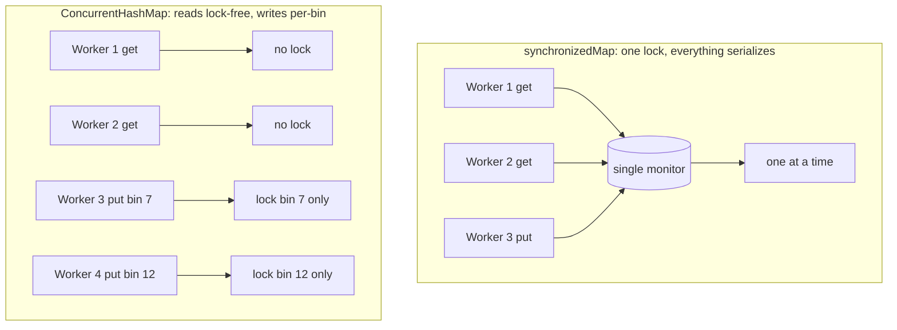
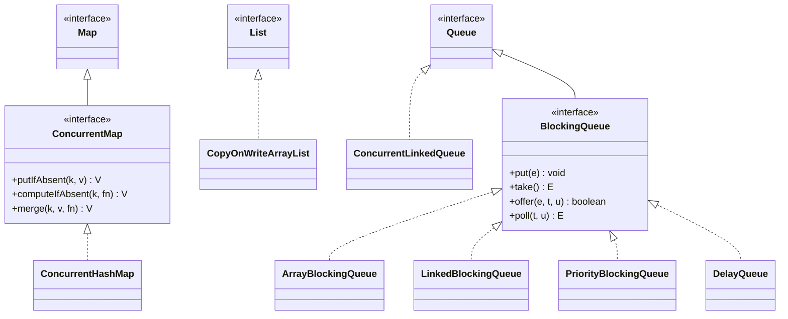
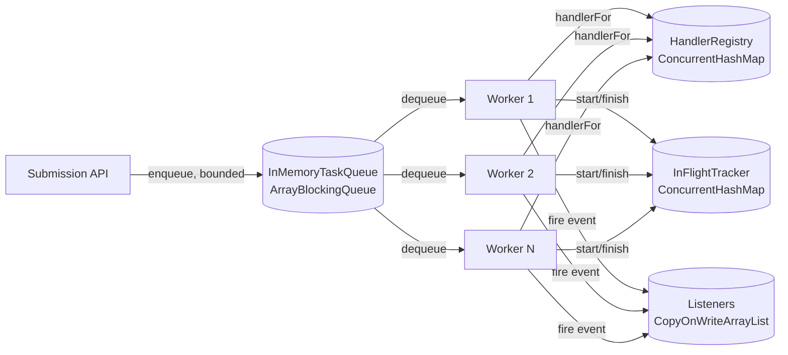

# Concurrent Collections

> Where this fits: this is the chapter where our Phase 1 `Worker` pool stops corrupting shared state. Workers need to look up `TaskHandler`s by task type and track which `Task`s are currently in-flight — both are *shared, mutable maps* read and written by many threads at once. A plain `HashMap` here is a data-corruption bug waiting to happen. This chapter gives us the right tools: `ConcurrentHashMap`, `CopyOnWriteArrayList`, `ConcurrentLinkedQueue`, and the concurrent `BlockingQueue` family. It builds directly on [atomics-and-thread-safety.md](atomics-and-thread-safety.md) and [locks.md](locks.md), and feeds [blocking-queue.md](blocking-queue.md).

---

## 1. Why this exists — the real problem it solves

Our Phase 1 architecture is:

```text
Client -> Task Submission API -> In-Memory Queue -> Worker Pool -> Task Execution
```

The `WorkerPool` runs N `Worker` threads. Each `Worker` does three things on a hot loop:

1. `dequeue()` a `Task` from the shared `TaskQueue`.
2. Look up the right `TaskHandler` for `task.type()` in a **shared registry** (a `Map<String, TaskHandler>`).
3. Mark the task as in-flight in a **shared in-flight map** (a `Map<String, Task>`), execute it, then remove it.

Every one of those shared structures is touched concurrently by every worker thread. The registry is mostly read (lots of lookups) but occasionally written (a new handler type is registered at startup or via an admin endpoint). The in-flight map is written and read constantly — a task is added when it starts and removed when it finishes.

Here is the brutal fact about `java.util.HashMap`: **it is not thread-safe, and concurrent writes can do worse than lose data — they can corrupt the internal structure.** In Java 7 and earlier, a concurrent `put` during a resize could splice the bucket linked list into a cycle, and a future `get` would *spin forever* at 100% CPU. Java 8 changed the resize algorithm so the infinite loop is mostly gone, but you can still get lost updates, `null` returns for keys that are present, `size()` returning nonsense, and `ConcurrentModificationException` thrown from iteration. None of these are theoretical; they show up under load and are nightmarish to reproduce.

**Historical context (worth one paragraph).** The original JDK 1.0 collections (`Vector`, `Hashtable`) were thread-safe by synchronizing *every* method on the object's monitor. That made them correct but slow: every read blocked every other read, and you still couldn't safely do compound operations like "get, and if absent, put". JDK 1.2 introduced the un-synchronized `HashMap`/`ArrayList` for single-threaded speed, plus `Collections.synchronizedMap(...)` wrappers to bolt locking back on — which inherited all of `Hashtable`'s problems. The real fix arrived in Java 5 (`java.util.concurrent`, designed by Doug Lea): `ConcurrentHashMap` with lock striping, `CopyOnWriteArrayList`, and the `BlockingQueue` family. These are *purpose-built* concurrent data structures, not synchronized wrappers around single-threaded ones, and that distinction is the whole point of this chapter.

The concept we need: collections that are **correct under concurrency without us holding an external lock around every access**, and that scale to many threads instead of serializing them.

---

## 2. Why `Collections.synchronized*` is not enough

It is tempting to think "I'll just wrap my `HashMap`":

```java
Map<String, TaskHandler> registry = Collections.synchronizedMap(new HashMap<>());
```

This makes each individual method call atomic, but it has three serious problems.

**Problem 1: compound operations are still races.** The classic "check-then-act" bug:

```java
// BROKEN even with a synchronized map.
if (!registry.containsKey(type)) {   // call 1: holds lock, releases it
    registry.put(type, handler);     // call 2: holds lock again
}
// Between call 1 and call 2 another thread can put(type, ...).
// Both threads see "absent" and both write. Lost update.
```

Each method is individually locked, but the *gap between them* is not. To make this safe with a synchronized map you must hold the wrapper's lock yourself across both calls — which is exactly the manual locking we wanted to avoid, and which almost nobody remembers to do.

**Problem 2: iteration is not safe.** The wrapper synchronizes methods but the iterator is not protected. You must manually synchronize on the wrapper for the *entire* loop or risk `ConcurrentModificationException`:

```java
// Required, and almost always forgotten:
synchronized (registry) {
    for (var e : registry.entrySet()) { /* ... */ }
}
```

**Problem 3: it doesn't scale.** Every operation — even pure reads — acquires the single object monitor. With 32 worker threads, your registry lookups are fully serialized. You have turned a parallel system into a queue at the lock. `ConcurrentHashMap` reads, by contrast, are essentially lock-free.



> **Takeaway:** `Collections.synchronizedMap` gives you per-call atomicity, not per-*operation* atomicity, doesn't make iteration safe, and serializes everything. The `java.util.concurrent` types fix all three.

---

## 3. The naive version — a plain `HashMap` registry

Here is the first-cut handler registry a beginner writes for the `WorkerPool`. (Recall the canonical model: `interface TaskHandler { TaskResult handle(Task task) throws Exception; }` and `record TaskResult(boolean success, String message, boolean retryable)`.)

```java
import java.util.HashMap;
import java.util.Map;

// NAIVE: not thread-safe. Looks fine in a single-threaded test, corrupts under load.
public final class HandlerRegistry {
    private final Map<String, TaskHandler> handlers = new HashMap<>();

    public void register(String type, TaskHandler handler) {
        handlers.put(type, handler);            // write race
    }

    public TaskHandler handlerFor(String type) {
        return handlers.get(type);              // can return null for a present key, mid-resize
    }
}
```

Limitations, in order of how badly they bite:

- **Data corruption.** If `register(...)` is called (even once, e.g. an admin hot-loads a new handler type) while workers are calling `handlerFor(...)`, the map can be observed in a half-resized state: a `get` returns `null` for a key that is definitely present, or worse.
- **Visibility.** Without the happens-before guarantees of a concurrent structure, a handler registered by thread A may never become visible to worker thread B (see [atomics-and-thread-safety.md](atomics-and-thread-safety.md) for the memory-model reasons).
- **No safe iteration.** An admin endpoint that lists registered types (`handlers.keySet()`) can throw `ConcurrentModificationException` if a registration races with it.

The naive version "works" in tests because tests rarely register and look up concurrently. It fails in production precisely when traffic is highest.

---

## 4. Improved version — synchronize, but understand the cost

The minimal correct fix is to make the registry thread-safe with explicit synchronization:

```java
import java.util.HashMap;
import java.util.Map;
import java.util.Set;

public final class HandlerRegistry {
    private final Map<String, TaskHandler> handlers = new HashMap<>();

    public synchronized void register(String type, TaskHandler handler) {
        handlers.put(type, handler);
    }

    public synchronized TaskHandler handlerFor(String type) {
        return handlers.get(type);
    }

    public synchronized Set<String> registeredTypes() {
        return Set.copyOf(handlers.keySet());   // defensive copy under lock
    }
}
```

This is **correct**. It is also a bottleneck: every lookup on the worker hot path acquires the same monitor, so 32 workers looking up handlers contend on one lock. For a registry that is read thousands of times per second and written a handful of times at startup, paying a full mutual-exclusion lock on every read is the wrong trade. We are optimizing for the rare write at the expense of the common read.

This is the right moment to reach for a purpose-built concurrent collection that makes reads cheap.

---

## 5. Production-quality version — `ConcurrentHashMap` with atomic operations

```java
import java.util.Set;
import java.util.concurrent.ConcurrentHashMap;
import java.util.concurrent.ConcurrentMap;

/**
 * Thread-safe handler registry for the Worker pool.
 * Reads (the hot path) are lock-free. Writes lock only the affected bin.
 */
public final class HandlerRegistry {

    private final ConcurrentMap<String, TaskHandler> handlers = new ConcurrentHashMap<>();

    /** Idempotent, atomic register-if-absent. Returns false if the type was already registered. */
    public boolean register(String type, TaskHandler handler) {
        // putIfAbsent returns the PREVIOUS value (null if it was absent).
        return handlers.putIfAbsent(type, handler) == null;
    }

    /** Forcefully (re)bind a type to a handler, e.g. a hot redeploy. */
    public void replace(String type, TaskHandler handler) {
        handlers.put(type, handler);
    }

    public TaskHandler handlerFor(String type) {
        return handlers.get(type);              // lock-free read
    }

    /** Lazily create-and-cache a handler the first time a type is seen. */
    public TaskHandler computeHandlerFor(String type) {
        return handlers.computeIfAbsent(type, HandlerRegistry::buildDefault);
    }

    /** A weakly-consistent snapshot — never throws ConcurrentModificationException. */
    public Set<String> registeredTypes() {
        return Set.copyOf(handlers.keySet());
    }

    private static TaskHandler buildDefault(String type) {
        return task -> new TaskResult(false, "no handler for type " + type, false);
    }
}
```

Why this is what a staff engineer ships:

- **Lock-free reads.** `get` never blocks; it reads from `volatile` fields and tolerates concurrent writers. With 32 workers, lookups truly run in parallel.
- **Atomic compound operations.** `putIfAbsent` and `computeIfAbsent` are *single atomic operations* — they close the check-then-act race that `synchronizedMap` left open. No external lock needed.
- **Per-bin write locking.** A `put` locks only the one bin (bucket) it touches, so two registrations to different keys proceed in parallel. This is the "lock striping" idea (one lock per bin in Java 8+, refined from the fixed segment array of Java 5–7).
- **Safe, weakly-consistent iteration.** Iterators reflect the map at some point at or since creation and **never throw `ConcurrentModificationException`**. `keySet()`/`values()` are live views; we copy when we want a stable snapshot.

> **One sharp rule about `computeIfAbsent`:** the mapping function runs *while the bin is locked*. It must be short and must **not** call back into the same map (e.g. another `computeIfAbsent` on the same key), or you can deadlock / get an `IllegalStateException`. Keep the function pure and fast — building a handler from a factory is fine; doing I/O inside it is not.

---

## 6. Code walkthrough — three levels

### Beginner: atomic counting with `merge` and `getOrDefault`

A very common need: count how many tasks of each type we've processed, across all worker threads.

```java
import java.util.concurrent.ConcurrentHashMap;
import java.util.concurrent.ConcurrentMap;

public class TypeCounters {
    private final ConcurrentMap<String, Long> counts = new ConcurrentHashMap<>();

    public void recordProcessed(String type) {
        // BROKEN under concurrency: get-then-put is two operations.
        // counts.put(type, counts.getOrDefault(type, 0L) + 1);

        // CORRECT: merge is a single atomic read-modify-write.
        counts.merge(type, 1L, Long::sum);
    }

    public long countFor(String type) {
        return counts.getOrDefault(type, 0L);
    }
}
```

The commented-out line is the canonical concurrency bug: two threads both read `5`, both write `6`, and one increment is lost. `merge(key, 1L, Long::sum)` performs the read-modify-write atomically per bin. (For pure counters, `LongAdder` in a map — `ConcurrentHashMap<String, LongAdder>` — scales even better under heavy contention; see [atomics-and-thread-safety.md](atomics-and-thread-safety.md).)

### Intermediate: an in-flight task map and a listener list

The `WorkerPool` needs to know which tasks are currently executing (for a `/status` endpoint, for graceful shutdown, for detecting stuck workers). It also wants to notify listeners (metrics, logging) about lifecycle events. Two different concurrent structures, chosen for two different access patterns.

```java
import java.util.Collection;
import java.util.List;
import java.util.concurrent.ConcurrentHashMap;
import java.util.concurrent.ConcurrentMap;
import java.util.concurrent.CopyOnWriteArrayList;

@FunctionalInterface
interface TaskLifecycleListener {
    void onEvent(String taskId, TaskStatus status);
}

public final class InFlightTracker {

    // Written/read constantly: ConcurrentHashMap.
    private final ConcurrentMap<String, Task> inFlight = new ConcurrentHashMap<>();

    // Read on every event, written almost never: CopyOnWriteArrayList.
    private final List<TaskLifecycleListener> listeners = new CopyOnWriteArrayList<>();

    public void addListener(TaskLifecycleListener l) {
        listeners.add(l);                       // copies the backing array; rare, so fine
    }

    public void markRunning(Task task) {
        inFlight.put(task.id(), task);
        fire(task.id(), TaskStatus.RUNNING);
    }

    public void markDone(String taskId, TaskStatus terminal) {
        inFlight.remove(taskId);
        fire(taskId, terminal);
    }

    public int activeCount() {
        return inFlight.size();                  // O(1)-ish, weakly consistent estimate
    }

    public Collection<Task> snapshot() {
        return List.copyOf(inFlight.values());   // safe to iterate elsewhere
    }

    private void fire(String taskId, TaskStatus status) {
        // Iterating a CopyOnWriteArrayList needs no synchronization and never throws CME,
        // even if addListener runs concurrently.
        for (TaskLifecycleListener l : listeners) {
            l.onEvent(taskId, status);
        }
    }
}
```

The key design decision is matching the structure to the **read/write ratio**:

- `inFlight` is read and written on every task — `ConcurrentHashMap`.
- `listeners` is read on every event but written maybe a dozen times at startup — `CopyOnWriteArrayList`, whose reads are pure array indexing with zero locking, at the cost of an expensive copy on every write.

### Production-inspired: `Worker` wiring the registry, tracker, and a `ConcurrentLinkedQueue` for buffered results

```java
import java.util.concurrent.ConcurrentLinkedQueue;
import java.util.concurrent.Queue;

public final class Worker implements Runnable {

    private final TaskQueue queue;               // the BlockingQueue-backed in-memory queue
    private final HandlerRegistry registry;
    private final InFlightTracker tracker;
    // Unbounded, lock-free, non-blocking buffer for results we ship to metrics in batches.
    private final Queue<TaskResult> resultBuffer = new ConcurrentLinkedQueue<>();
    private volatile boolean running = true;

    public Worker(TaskQueue queue, HandlerRegistry registry, InFlightTracker tracker) {
        this.queue = queue;
        this.registry = registry;
        this.tracker = tracker;
    }

    @Override
    public void run() {
        while (running && !Thread.currentThread().isInterrupted()) {
            try {
                Task task = queue.dequeue();     // blocks until work is available
                process(task);
            } catch (InterruptedException e) {
                Thread.currentThread().interrupt();
                break;                           // honor interruption -> graceful shutdown
            }
        }
    }

    private void process(Task task) {
        TaskHandler handler = registry.handlerFor(task.type());
        if (handler == null) {
            resultBuffer.offer(new TaskResult(false, "no handler: " + task.type(), false));
            return;
        }
        tracker.markRunning(task);
        try {
            TaskResult result = handler.handle(task);
            resultBuffer.offer(result);
            tracker.markDone(task.id(),
                    result.success() ? TaskStatus.SUCCEEDED : TaskStatus.FAILED);
        } catch (Exception e) {
            resultBuffer.offer(new TaskResult(false, e.getMessage(), true));
            tracker.markDone(task.id(), TaskStatus.FAILED);
        }
    }

    /** Called by a single metrics thread; drains without blocking the workers. */
    public java.util.List<TaskResult> drainResults() {
        var drained = new java.util.ArrayList<TaskResult>();
        TaskResult r;
        while ((r = resultBuffer.poll()) != null) {  // lock-free poll
            drained.add(r);
        }
        return drained;
    }

    public void stop() { running = false; }
}
```

`ConcurrentLinkedQueue` is the right pick for `resultBuffer`: many producer worker threads `offer()`, one consumer thread `poll()`s in batches, and **no thread should ever block** — if there's nothing to drain, `poll()` returns `null` immediately. It's an unbounded, lock-free (Michael–Scott) queue. Contrast this with a `BlockingQueue`, which we use for the *task* queue precisely because there we *want* workers to block when there's no work.

---

## 7. The full concurrent-collection toolbox (and when to use each)



| Structure | Use it when… | In our project | Reads | Writes |
|---|---|---|---|---|
| `ConcurrentHashMap` | mostly-read or read-write shared map | `HandlerRegistry`, `InFlightTracker` | lock-free | per-bin lock |
| `CopyOnWriteArrayList` | read-mostly list, very rare writes | listener/subscriber lists, `EventBus` subscribers | lock-free | copies whole array |
| `ConcurrentLinkedQueue` | unbounded, non-blocking hand-off | result/metrics buffer | lock-free | lock-free (CAS) |
| `ArrayBlockingQueue` | **bounded** producer/consumer with backpressure | the Phase 1 `InMemoryTaskQueue` | lock | lock |
| `LinkedBlockingQueue` | high-throughput producer/consumer, optional bound | alternative `TaskQueue` backing | two locks (head/tail) | two locks |
| `PriorityBlockingQueue` | tasks consumed by `priority` order, unbounded | priority task dispatch (see [../07-queues-and-messaging/priority-queues.md](../07-queues-and-messaging/priority-queues.md)) | lock | lock |
| `DelayQueue` | release elements only after a delay | `TaskScheduler` for `scheduledAt` (see [../07-queues-and-messaging/delayed-queues.md](../07-queues-and-messaging/delayed-queues.md)) | lock | lock |

### The `BlockingQueue` family and `InMemoryTaskQueue`

This is the backbone of Phase 1. Our canonical `TaskQueue` interface (`enqueue`, `dequeue() throws InterruptedException`, `size()`) maps one-to-one onto a `BlockingQueue`:

```java
import java.util.concurrent.ArrayBlockingQueue;
import java.util.concurrent.BlockingQueue;

public final class InMemoryTaskQueue implements TaskQueue {

    // Bounded: this is the backpressure knob. When full, producers block (or we reject).
    private final BlockingQueue<Task> queue;

    public InMemoryTaskQueue(int capacity) {
        this.queue = new ArrayBlockingQueue<>(capacity);
    }

    @Override
    public void enqueue(Task t) {
        // offer returns false instead of blocking forever if the queue is full.
        if (!queue.offer(t)) {
            throw new IllegalStateException("task queue full (capacity reached)");
        }
    }

    @Override
    public Task dequeue() throws InterruptedException {
        return queue.take();          // blocks until an element is available
    }

    @Override
    public int size() {
        return queue.size();
    }
}
```

Why a *bounded* `ArrayBlockingQueue` and not an unbounded one? Because **an unbounded queue defers your failure**: if producers outrun consumers, an unbounded `LinkedBlockingQueue` grows until you hit `OutOfMemoryError` and take the whole JVM down. A bounded queue turns "infinite memory growth" into "explicit backpressure" — we either block the producer or fast-fail with a clear error. This is the core lesson that [blocking-queue.md](blocking-queue.md) and [../08-distributed-systems/backpressure.md](../08-distributed-systems/backpressure.md) develop in depth.

`PriorityBlockingQueue` and `DelayQueue` are the same `BlockingQueue` contract with different ordering rules — perfect for our `priority` field and `scheduledAt` field respectively. We'll use them when we build the `TaskScheduler` and priority dispatch.

---

## 8. Tradeoffs

| Decision | Pro | Con | When it's wrong |
|---|---|---|---|
| `ConcurrentHashMap` vs `synchronizedMap` | lock-free reads, atomic compounds, scales | weakly-consistent `size()`/iteration; no map-wide lock | when you need a consistent snapshot across many keys at once |
| `CopyOnWriteArrayList` vs `synchronizedList` | zero-lock reads, safe iteration | every write copies the whole array — O(n) | write-heavy lists (it'll thrash GC and CPU) |
| `ConcurrentLinkedQueue` vs `LinkedBlockingQueue` | never blocks, fully lock-free | unbounded (no backpressure); `size()` is O(n) and racy | producer/consumer where you *want* blocking and bounds |
| Bounded vs unbounded blocking queue | backpressure, bounded memory | producers can block / tasks rejected | when loss is unacceptable and you have durable storage instead |
| Atomic ops (`merge`, `computeIfAbsent`) | close check-then-act races in one call | the function runs under a bin lock — must be fast & non-reentrant | doing I/O or recursive map access inside the function |

Two gotchas worth their own line, because interviewers love them:

- **`ConcurrentHashMap.size()` is a weakly-consistent estimate.** It is computed without locking the whole map and can be momentarily off while writes are in flight. Never use it for a correctness decision (e.g. "if size == capacity, reject"); use it for metrics and dashboards.
- **`CopyOnWriteArrayList` iterators are snapshots.** An iterator reflects the array at the moment iteration began; later `add`/`remove` are invisible to it, and the iterator does **not** support `remove()`. That's a feature for listener fan-out (you iterate a stable set) but a trap if you expected to see live updates.

---

## 9. Common mistakes and pitfalls

- **Wrapping `HashMap` with `synchronizedMap` and thinking compound ops are safe.** They're not — use `putIfAbsent`/`compute`/`merge` on a `ConcurrentMap`. *Fix:* switch to `ConcurrentHashMap` and use its atomic methods.
- **Doing check-then-act manually:** `if (!map.containsKey(k)) map.put(k, v);`. Two threads both pass the check. *Fix:* `map.putIfAbsent(k, v)` or `map.computeIfAbsent(k, fn)`.
- **`get`-then-`put` for counters:** `map.put(k, map.get(k) + 1)` loses updates. *Fix:* `map.merge(k, 1L, Long::sum)`.
- **Calling back into the same `ConcurrentHashMap` inside `computeIfAbsent`.** The bin is locked; you can deadlock or throw. *Fix:* keep the function pure and self-contained.
- **Using `CopyOnWriteArrayList` for a write-heavy list.** Each `add` copies the entire array — quadratic cost for bulk inserts. *Fix:* use a `ConcurrentLinkedQueue`, or a `ConcurrentHashMap`-backed set, or guard an `ArrayList` with a `ReentrantReadWriteLock`.
- **Putting `null` keys/values into a `ConcurrentHashMap`.** Unlike `HashMap`, it forbids `null` (ambiguous with "absent" in concurrent reads) and throws `NullPointerException`. *Fix:* use a sentinel or `Optional` value; never `null`.
- **Choosing an unbounded `BlockingQueue` for the task queue.** Hides the overload, then `OutOfMemoryError`. *Fix:* bound it and apply backpressure.
- **Trusting `size()` for control flow.** It's weakly consistent on the concurrent collections. *Fix:* use it for observability only.

---

## 10. Refactoring exercise — the in-flight tracker

**Bad** (data race + lost-update + check-then-act, all in one):

```java
public class InFlightTracker {
    private final Map<String, Task> inFlight = new HashMap<>();
    private int max = 0;

    public void start(Task t) {
        inFlight.put(t.id(), t);               // race
        if (inFlight.size() > max) {           // read torn from write
            max = inFlight.size();             // lost update
        }
    }
    public void finish(String id) { inFlight.remove(id); }  // race
}
```

**Improved** (correct via a single coarse lock — fine, but serializes everything):

```java
public class InFlightTracker {
    private final Map<String, Task> inFlight = new HashMap<>();
    private int max = 0;

    public synchronized void start(Task t) {
        inFlight.put(t.id(), t);
        max = Math.max(max, inFlight.size());
    }
    public synchronized void finish(String id) { inFlight.remove(id); }
    public synchronized int peakConcurrency() { return max; }
}
```

**Production-quality** (concurrent map for the hot path; a striped atomic for the high-water mark):

```java
import java.util.concurrent.ConcurrentHashMap;
import java.util.concurrent.ConcurrentMap;
import java.util.concurrent.atomic.AtomicInteger;

public final class InFlightTracker {
    private final ConcurrentMap<String, Task> inFlight = new ConcurrentHashMap<>();
    private final AtomicInteger peak = new AtomicInteger(0);

    public void start(Task t) {
        inFlight.put(t.id(), t);
        // ConcurrentHashMap.size() is an estimate; good enough for a high-water mark.
        peak.accumulateAndGet(inFlight.size(), Math::max);
    }

    public void finish(String id) {
        inFlight.remove(id);
    }

    public int active()          { return inFlight.size(); }
    public int peakConcurrency() { return peak.get(); }
}
```

The hot-path `start`/`finish` no longer hold a global lock, so workers run in parallel; the only atomic coordination is the high-water mark, done with a lock-free `accumulateAndGet` (see [atomics-and-thread-safety.md](atomics-and-thread-safety.md)).

---

## 11. Exercises

### Easy

- **E1 (knowledge check).** Explain in two sentences why `Collections.synchronizedMap(new HashMap<>())` does **not** make `if (!m.containsKey(k)) m.put(k, v);` safe, and give the one-line fix.
- **E2 (coding).** Write a thread-safe `processedCount(String type)` counter backed by a `ConcurrentHashMap<String, Long>` with two methods: `record(String type)` and `count(String type)`. No external locks.

### Medium

- **M1 (coding).** Implement `HandlerRegistry.registerIfAbsent(String type, TaskHandler h)` that returns `true` only if it actually inserted (i.e. the type was new), using a single atomic call. Then write a JUnit 5 + AssertJ test that launches 100 threads all trying to register the same type and asserts exactly one of them got `true`.
- **M2 (refactoring).** Take the **Bad** `InFlightTracker` from §10 and turn it into a version that also tracks, per task `type`, how many are currently in flight (`activeByType("email")`), keeping everything lock-free on the hot path.

### Hard

- **H1 (design + coding).** Design a `SubscriberRegistry` for the Phase 4 `EventBus` (canonical `subscribe(TaskEventListener l)`) that supports thousands of `publish` calls per second and rare `subscribe`/`unsubscribe`. Justify your collection choice, then implement `publish` so that an exception thrown by one listener does not prevent the others from being notified.
- **H2 (interview-style).** You observe a production `ConcurrentHashMap` whose `size()` on a dashboard sometimes reads higher than the number of distinct keys you can enumerate a second later. Is this a bug? Explain precisely what `size()` guarantees and what it does not, and what you'd put on the dashboard instead.
- **H3 (stretch).** Replace the `ConcurrentLinkedQueue` result buffer in `Worker` with a bounded `ArrayBlockingQueue` and add backpressure: if the metrics consumer falls behind, workers should *not* block forever. Implement a policy (drop-oldest vs drop-newest vs short timed offer) and explain which you chose for a metrics pipeline and why.

---

## 12. Solutions

### E1

`synchronizedMap` locks each method call individually, so `containsKey` and `put` are two separate atomic operations with an unguarded gap between them; two threads can both observe "absent" and both `put`, losing one update. Fix: `m.putIfAbsent(k, v)` on a `ConcurrentHashMap` (a single atomic operation).

### E2

```java
import java.util.concurrent.ConcurrentHashMap;
import java.util.concurrent.ConcurrentMap;

public final class ProcessedCounters {
    private final ConcurrentMap<String, Long> counts = new ConcurrentHashMap<>();

    public void record(String type) {
        counts.merge(type, 1L, Long::sum);   // atomic read-modify-write
    }

    public long count(String type) {
        return counts.getOrDefault(type, 0L);
    }
}
```

### M1

```java
import java.util.concurrent.ConcurrentHashMap;
import java.util.concurrent.ConcurrentMap;

public final class HandlerRegistry {
    private final ConcurrentMap<String, TaskHandler> handlers = new ConcurrentHashMap<>();

    /** True only if THIS call inserted the mapping. */
    public boolean registerIfAbsent(String type, TaskHandler h) {
        return handlers.putIfAbsent(type, h) == null;
    }

    public TaskHandler handlerFor(String type) {
        return handlers.get(type);
    }
}
```

Test:

```java
import static org.assertj.core.api.Assertions.assertThat;

import java.util.concurrent.CountDownLatch;
import java.util.concurrent.atomic.AtomicInteger;
import org.junit.jupiter.api.Test;

class HandlerRegistryTest {

    @Test
    void exactlyOneThreadWinsTheRegistration() throws InterruptedException {
        var registry = new HandlerRegistry();
        TaskHandler noop = task -> new TaskResult(true, "ok", false);

        int threads = 100;
        var start = new CountDownLatch(1);
        var done = new CountDownLatch(threads);
        var winners = new AtomicInteger(0);

        for (int i = 0; i < threads; i++) {
            new Thread(() -> {
                try {
                    start.await();                       // line everyone up
                    if (registry.registerIfAbsent("email", noop)) {
                        winners.incrementAndGet();
                    }
                } catch (InterruptedException e) {
                    Thread.currentThread().interrupt();
                } finally {
                    done.countDown();
                }
            }).start();
        }

        start.countDown();                               // fire them all at once
        done.await();

        assertThat(winners.get()).isEqualTo(1);
        assertThat(registry.handlerFor("email")).isSameAs(noop);
    }
}
```

### M2

```java
import java.util.concurrent.ConcurrentHashMap;
import java.util.concurrent.ConcurrentMap;
import java.util.concurrent.atomic.AtomicInteger;

public final class InFlightTracker {
    private final ConcurrentMap<String, Task> inFlight = new ConcurrentHashMap<>();
    private final ConcurrentMap<String, AtomicInteger> byType = new ConcurrentHashMap<>();

    public void start(Task t) {
        inFlight.put(t.id(), t);
        byType.computeIfAbsent(t.type(), k -> new AtomicInteger()).incrementAndGet();
    }

    public void finish(Task t) {
        if (inFlight.remove(t.id()) != null) {
            // Only decrement if we actually removed it, to avoid double-finish underflow.
            byType.computeIfAbsent(t.type(), k -> new AtomicInteger()).decrementAndGet();
        }
    }

    public int active()                    { return inFlight.size(); }
    public int activeByType(String type)   {
        var c = byType.get(type);
        return c == null ? 0 : c.get();
    }
}
```

`computeIfAbsent(... new AtomicInteger())` atomically gives every type exactly one counter object; subsequent `incrementAndGet`/`decrementAndGet` are lock-free. The hot path never holds a global lock.

### H1

Collection choice: `CopyOnWriteArrayList<TaskEventListener>`. The workload is read-mostly (thousands of publishes, rare subscribes), iteration must be safe without locking, and an in-progress `publish` should iterate a stable snapshot. The O(n) copy on `subscribe` is irrelevant because subscribes are rare.

```java
import java.util.List;
import java.util.concurrent.CopyOnWriteArrayList;

public final class SubscriberRegistry {
    private final List<TaskEventListener> listeners = new CopyOnWriteArrayList<>();

    public void subscribe(TaskEventListener l)   { listeners.addIfAbsent(l); }
    public void unsubscribe(TaskEventListener l) { listeners.remove(l); }

    public void publish(TaskEvent e) {
        for (TaskEventListener l : listeners) {  // snapshot iteration, no lock, no CME
            try {
                l.onEvent(e);
            } catch (RuntimeException ex) {
                // Isolate failures: one bad listener must not starve the others.
                System.getLogger("EventBus")
                      .log(System.Logger.Level.WARNING, "listener failed", ex);
            }
        }
    }
}
```

### H2

It is **not a bug**. `ConcurrentHashMap.size()` is *weakly consistent*: it sums per-bin counts (Java 8+ uses an internal `LongAdder`-style counter) without taking a global lock, so it reflects a state the map passed through but never a transactionally consistent snapshot relative to a later `keySet()` enumeration. Between the `size()` read and your enumeration a second later, entries can be removed. `size()` guarantees an approximate, eventually-correct count under quiescence; it does **not** guarantee consistency with any concurrent iteration or with the exact instant you read it. On a dashboard, prefer an explicitly maintained metric you control — e.g. an `AtomicLong`/`LongAdder` incremented on `put` and decremented on `remove`, or a Micrometer gauge bound to `inFlight::size` clearly labeled as an estimate.

### H3

```java
import java.util.List;
import java.util.concurrent.ArrayBlockingQueue;
import java.util.concurrent.BlockingQueue;
import java.util.concurrent.TimeUnit;

public final class ResultBuffer {
    private final BlockingQueue<TaskResult> buffer = new ArrayBlockingQueue<>(10_000);

    /** Drop-oldest: a metrics pipeline values freshness over completeness. */
    public void offer(TaskResult r) {
        // Try once without blocking.
        if (!buffer.offer(r)) {
            buffer.poll();              // drop the oldest sample
            buffer.offer(r);            // make room for the newest
        }
    }

    public List<TaskResult> drain() {
        var out = new java.util.ArrayList<TaskResult>();
        buffer.drainTo(out);
        return out;
    }
}
```

Choice: **drop-oldest**. For a metrics/telemetry pipeline, the newest samples are the most actionable, and we must never block a `Worker`'s execution path on a slow metrics consumer (that would let a monitoring hiccup degrade real task throughput — a classic "monitoring caused the outage"). Drop-newest would be appropriate if old data were canonical (e.g. an audit log where you'd rather reject new writes than lose history); a short timed `offer(r, 5, TimeUnit.MILLISECONDS)` is a middle ground when brief blocking is acceptable. We deliberately do **not** use an unbounded queue, because that trades a dropped metric for an eventual `OutOfMemoryError`.

---

## 13. Interview questions and takeaways

1. **Why is `ConcurrentHashMap` better than `Collections.synchronizedMap`?** Lock-free reads, atomic compound operations (`putIfAbsent`/`compute`/`merge`) that close check-then-act races, per-bin write locking that lets concurrent writes to different keys proceed, and iterators that never throw `ConcurrentModificationException`. The synchronized wrapper serializes every call on one monitor and leaves compound operations and iteration unsafe.
2. **How does `ConcurrentHashMap` achieve concurrency internally?** Java 8+ uses a single bin (bucket) array; reads are lock-free over `volatile` fields; writes `synchronized` on the bin's head node, so they lock only the affected bin. Resizing is cooperative (multiple threads help transfer). It abandoned the fixed `Segment` array of Java 5–7 for finer granularity.
3. **Why can't a `ConcurrentHashMap` hold `null` keys or values?** In a concurrent read, a `null` from `get` is ambiguous: it could mean "absent" or "present and mapped to null." Forbidding `null` removes the ambiguity (you'd otherwise need `containsKey`, which can race). It throws `NullPointerException` on `null`.
4. **When would you pick `CopyOnWriteArrayList`?** Read-mostly with very rare writes and a need for lock-free, CME-free iteration — listener/observer lists, an `EventBus` subscriber set. Never for write-heavy lists; each write copies the whole array.
5. **`ConcurrentLinkedQueue` vs `LinkedBlockingQueue`?** The former is unbounded, lock-free, and **never blocks** (`poll` returns `null` when empty) — good for non-blocking hand-off. The latter is a `BlockingQueue`: `take` blocks when empty, `put` blocks when full (if bounded), giving you producer/consumer coordination and backpressure.
6. **Is `ConcurrentHashMap.size()` reliable?** No — it's a weakly-consistent estimate computed without a global lock. Use it for metrics, never for correctness decisions.
7. **What does "weakly consistent iterator" mean?** The iterator reflects the collection's state at or after its creation, tolerates concurrent modification, never throws CME, but may or may not reflect modifications made after it was created.
8. **Why bound the task queue?** A bounded `BlockingQueue` converts unbounded memory growth under overload into explicit backpressure (block or reject), preventing `OutOfMemoryError`. Unbounded queues just defer the failure.

**Takeaways:** purpose-built concurrent collections beat synchronized wrappers on correctness *and* scalability; choose by read/write ratio and blocking semantics; use atomic compound operations instead of manual check-then-act; treat `size()` as an estimate; and always bound the queues that carry real workload.

---

## 14. Production considerations

- **Memory under load with `CopyOnWriteArrayList`.** If something accidentally writes to it on a hot path, each write allocates a new array; you'll see GC pressure and CPU spikes. Alarm on allocation rate and keep COW lists strictly read-mostly.
- **`computeIfAbsent` blocking time.** Because the mapping function runs under the bin lock, a slow function (accidental I/O, a synchronized call) blocks *all* operations hashing to that bin. Keep it microsecond-cheap; do expensive construction outside and then `putIfAbsent`.
- **Bounded queues need a rejection strategy.** When the task queue is full, decide deliberately: block the producer (backpressure to the API caller), reject with HTTP 429/503, or shed load. Expose queue depth and rejection count as metrics (Micrometer gauges/counters — see [../10-system-design/observability-and-ops.md](../10-system-design/observability-and-ops.md)).
- **`size()` on dashboards.** Bind gauges to `inFlight::size` but label them "approximate." For exact counts maintain a `LongAdder` you increment/decrement yourself.
- **Iteration cost.** Iterating a large `ConcurrentHashMap`'s `entrySet()` for an admin endpoint is O(n) and competes with workers for memory bandwidth; paginate or snapshot off the hot path.
- **Virtual threads (Java 21).** With Loom you may run thousands of virtual-thread workers. The same concurrent collections work, but contention patterns change: lock-free reads still scale, while a `CopyOnWriteArrayList` written from thousands of carriers will hurt. Re-measure when you switch worker models (see [threads.md](threads.md)).

---

## What We Can Improve In Our Project Using This Concept

Our Phase 1 `WorkerPool` currently keeps the handler registry and any bookkeeping in plain `HashMap`s implicitly guarded by hope. We can:

- Replace the handler registry with a `ConcurrentHashMap`-backed `HandlerRegistry` exposing atomic `registerIfAbsent` and lock-free `handlerFor`.
- Introduce an `InFlightTracker` backed by `ConcurrentHashMap` to power a `/status` endpoint and graceful shutdown (drain in-flight tasks before exit).
- Use a `CopyOnWriteArrayList` for task-lifecycle listeners, paving the way for the Phase 4 `EventBus`.
- Confirm `InMemoryTaskQueue` uses a **bounded** `ArrayBlockingQueue` so overload becomes backpressure, not `OutOfMemoryError`.

## Project Refactoring Task

1. Add `HandlerRegistry` (`ConcurrentHashMap`) and route `Worker` lookups through it.
2. Add `InFlightTracker` (`ConcurrentHashMap` + per-type `AtomicInteger`) and call `start`/`finish` around `handler.handle(...)`.
3. Add a `CopyOnWriteArrayList<TaskLifecycleListener>` and fire `RUNNING`/`SUCCEEDED`/`FAILED` events.
4. Make `InMemoryTaskQueue` bounded with an explicit rejection path on `enqueue`.
5. Write the concurrency test from M1 and a shutdown test that asserts no task is lost while draining `inFlight`.

## Git Commit For This Chapter

```text
feat(worker-pool): thread-safe handler registry and in-flight tracker via concurrent collections

- replace HashMap registry with ConcurrentHashMap-backed HandlerRegistry (atomic registerIfAbsent)
- add InFlightTracker (ConcurrentHashMap + per-type AtomicInteger) for /status and graceful drain
- add CopyOnWriteArrayList task-lifecycle listeners
- bound InMemoryTaskQueue (ArrayBlockingQueue) with explicit rejection on overload
- tests: 100-thread register race, no-loss shutdown drain

Files: src/main/java/queue/HandlerRegistry.java,
       src/main/java/queue/InFlightTracker.java,
       src/main/java/queue/Worker.java,
       src/main/java/queue/InMemoryTaskQueue.java,
       src/test/java/queue/HandlerRegistryTest.java
```

## Architecture Impact

The `WorkerPool` becomes correct under true parallelism: handler lookups and in-flight bookkeeping no longer serialize on a global lock, so adding workers actually adds throughput. The bounded queue introduces a defined backpressure point at the boundary between the Submission API and the Worker Pool — the first place our architecture explicitly handles overload, a theme that recurs in Phase 3 rate limiting and Phase 4 distributed brokers. The listener list is the seed of the Phase 4 `EventBus`.



## Interview Takeaways

- Reach for `java.util.concurrent` collections, not `Collections.synchronized*` wrappers — the latter are correct-but-slow and still leave compound operations and iteration unsafe.
- Choose by read/write ratio (`ConcurrentHashMap` for read-write maps, `CopyOnWriteArrayList` for read-mostly lists) and by blocking semantics (`ConcurrentLinkedQueue` for non-blocking hand-off, `BlockingQueue` for producer/consumer with backpressure).
- Use atomic compound operations (`putIfAbsent`, `computeIfAbsent`, `merge`) to eliminate check-then-act races in a single call.
- Treat `size()` as a weakly-consistent estimate; never branch on it for correctness.
- Bound the queues that carry real workload so overload becomes backpressure, not `OutOfMemoryError`.
