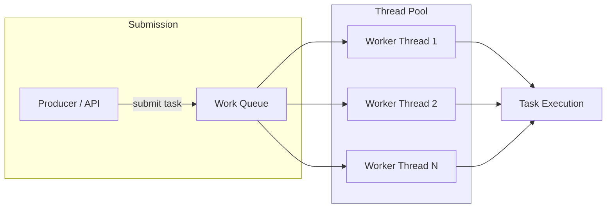
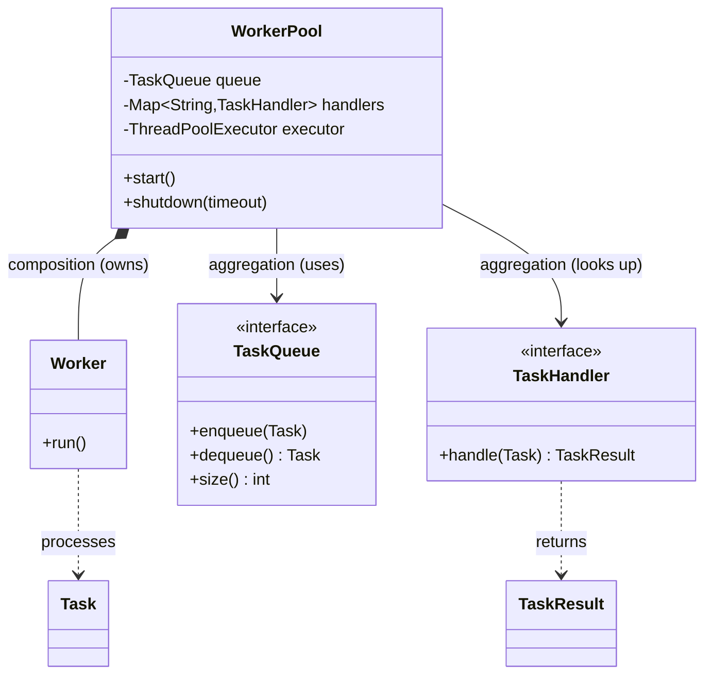

# ExecutorService and Thread Pools

> Where this fits: in Phase 1 our `WorkerPool` must run many `Worker` instances that pull from a `TaskQueue` and execute `TaskHandler`s. Raw `Thread` objects (see [threads.md](./threads.md)) do not scale — `ExecutorService` and thread pools are how we run, size, and gracefully shut down that worker fleet.

## Why this exists — the real problem it solves

In [threads.md](./threads.md) we learned to create a `Thread`, give it a `Runnable`, and call `start()`. That works for one or two threads. Our Task Queue platform needs to process a *stream* of tasks, potentially thousands per second, for the lifetime of the process. If we naively spawn one `Thread` per task we hit four walls:

1. **Creation cost.** A platform thread costs roughly 1 MB of stack plus kernel scheduling state. Creating and destroying one per task burns CPU on bookkeeping instead of work. At 10k tasks/sec you are creating 10k threads/sec.
2. **Unbounded concurrency.** One thread per task means 10k concurrent threads. The OS scheduler thrashes (context-switch storms), memory blows up, and downstream systems (Postgres, HTTP services) get hammered with no limit. There is no natural backpressure.
3. **No lifecycle control.** You cannot cleanly wait for in-flight work to finish, you cannot reject new work when overloaded, and you cannot reuse threads.
4. **No result handling.** A bare `Thread` returns nothing. Our `TaskHandler` returns a `TaskResult` — we want to capture it (covered fully in [futures-and-completablefuture.md](./futures-and-completablefuture.md)).

Historically, Java 1.0–1.4 forced you to hand-roll pools. Java 5 (2004) introduced `java.util.concurrent` (Doug Lea's library), giving us `Executor`, `ExecutorService`, `ThreadPoolExecutor`, and the `Executors` factory. The core idea: **decouple task submission from thread management.** You submit *what* to do; the executor decides *which thread* runs it and *when*. Java 21 (2023) added **virtual-thread executors**, which change the sizing math entirely for IO-bound work.



The pool is a **bounded set of reusable worker threads** feeding off a **shared work queue**. Submission is cheap and non-blocking (until the queue/pool fills); execution is throttled to the pool size. That throttle *is* our concurrency limit and our first line of backpressure.

## The naive version — one thread per task

Here is the first-cut `WorkerPool` a beginner writes. It "works" in a demo and falls over in production.

```java
// BAD: thread-per-task, no limits, no shutdown.
import java.util.ArrayList;
import java.util.List;

public class NaiveWorkerPool {
    private final TaskQueue queue;

    public NaiveWorkerPool(TaskQueue queue) {
        this.queue = queue;
    }

    public void start() {
        // Spawn a brand-new thread for every dequeue, forever.
        while (true) {
            try {
                Task task = queue.dequeue();              // blocks until a task arrives
                Thread t = new Thread(() -> runTask(task)); // NEW thread per task
                t.start();                                  // fire and forget
            } catch (InterruptedException e) {
                Thread.currentThread().interrupt();
                return;
            }
        }
    }

    private void runTask(Task task) {
        // ... look up handler, execute, ignore the result ...
        System.out.println("Running " + task.id());
    }
}
```

Limitations, called out honestly:

- **Unbounded thread count.** A burst of 50k queued tasks spawns 50k threads. `OutOfMemoryError: unable to create new native thread` is a matter of *when*, not *if*.
- **No reuse.** Every task pays full thread-creation cost.
- **No shutdown.** `start()` loops forever; there is no way to stop accepting work and drain in-flight tasks. `kill -9` is your only "graceful" shutdown.
- **No result, no rejection, no metrics.** We throw away the `TaskResult` and have no hook for retries, rate limiting, or instrumentation.

## Improved version — a fixed thread pool via Executors

Hand the thread management to an `ExecutorService` with a *fixed* number of reusable threads. Submission and execution are now decoupled.

```java
// BETTER: fixed pool, reuse, real shutdown. Still missing tuning + rejection policy.
import java.util.concurrent.ExecutorService;
import java.util.concurrent.Executors;
import java.util.concurrent.TimeUnit;

public class FixedWorkerPool {
    private final TaskQueue queue;
    private final ExecutorService executor;
    private final int poolSize;
    private volatile boolean running = true;

    public FixedWorkerPool(TaskQueue queue, int poolSize) {
        this.queue = queue;
        this.poolSize = poolSize;
        this.executor = Executors.newFixedThreadPool(poolSize);
    }

    public void start() {
        // Each of the poolSize threads runs a long-lived loop pulling from the queue.
        for (int i = 0; i < poolSize; i++) {
            executor.submit(this::workerLoop);
        }
    }

    private void workerLoop() {
        while (running && !Thread.currentThread().isInterrupted()) {
            try {
                Task task = queue.dequeue();
                runTask(task);
            } catch (InterruptedException e) {
                Thread.currentThread().interrupt();
                return; // exit on interrupt so shutdown can complete
            }
        }
    }

    private void runTask(Task task) {
        System.out.println("Running " + task.id() + " on " + Thread.currentThread().getName());
    }

    public void shutdown() throws InterruptedException {
        running = false;
        executor.shutdownNow();                          // interrupt the blocked dequeue() calls
        executor.awaitTermination(10, TimeUnit.SECONDS); // wait for loops to exit
    }
}
```

This is a real improvement: bounded concurrency (`poolSize` threads), thread reuse, and a `shutdown()`. The remaining gaps are *tuning* (why `poolSize`? CPU or IO bound?), the *rejection policy* (what happens when overloaded?), and *observability*. Those are where staff-level thinking lives — and where we need to understand what `Executors.newFixedThreadPool` actually builds underneath.

## Production-quality version — explicit ThreadPoolExecutor

`Executors.newFixedThreadPool(n)` is convenient but opaque. Under the hood it constructs a `ThreadPoolExecutor` with an **unbounded** `LinkedBlockingQueue`. That unbounded queue is a hidden landmine: under sustained overload tasks pile up in memory until OOM, and you never get backpressure. The staff-engineer move is to construct `ThreadPoolExecutor` directly so every knob is explicit.

```java
// PRODUCTION: explicit ThreadPoolExecutor, bounded queue, named threads,
// caller-runs backpressure, observable. This is what we ship.
import java.util.concurrent.ArrayBlockingQueue;
import java.util.concurrent.ThreadFactory;
import java.util.concurrent.ThreadPoolExecutor;
import java.util.concurrent.TimeUnit;
import java.util.concurrent.atomic.AtomicInteger;

public final class WorkerExecutors {

    private WorkerExecutors() {}

    /** Builds a tuned, observable executor for CPU/IO mixed task execution. */
    public static ThreadPoolExecutor build(String poolName, int coreSize, int maxSize, int queueCapacity) {
        ThreadFactory factory = namedDaemonFactory(poolName);

        ThreadPoolExecutor executor = new ThreadPoolExecutor(
                coreSize,                              // core threads kept alive
                maxSize,                               // max threads under load
                60L, TimeUnit.SECONDS,                 // idle keep-alive for non-core threads
                new ArrayBlockingQueue<>(queueCapacity), // BOUNDED queue => real backpressure
                factory,
                new ThreadPoolExecutor.CallerRunsPolicy() // overflow => caller executes, slows producer
        );
        // Let core threads die when idle so an idle service does not hold N threads forever.
        executor.allowCoreThreadTimeOut(true);
        return executor;
    }

    private static ThreadFactory namedDaemonFactory(String poolName) {
        AtomicInteger counter = new AtomicInteger(1);
        return runnable -> {
            Thread t = new Thread(runnable, poolName + "-worker-" + counter.getAndIncrement());
            t.setDaemon(true); // do not block JVM exit on these threads
            t.setUncaughtExceptionHandler((thread, ex) ->
                System.err.println("Uncaught in " + thread.getName() + ": " + ex));
            return t;
        };
    }
}
```

Why each choice matters:

- **Bounded `ArrayBlockingQueue`.** Caps queued work; combined with a rejection policy, this is backpressure. An unbounded queue trades a fast failure for a slow OOM.
- **`CallerRunsPolicy`.** When the pool *and* queue are full, the submitting thread runs the task itself. The producer is throttled at the source — elegant, free backpressure. (Alternatives in the tradeoffs table.)
- **Named, daemon threads with an uncaught-exception handler.** Named threads make thread dumps readable (`worker-pool-worker-7` beats `Thread-42`). Daemon threads do not keep a dying JVM alive. The handler ensures a thrown exception is logged, not silently swallowed.
- **`allowCoreThreadTimeOut(true)`.** An idle service releases threads instead of pinning `coreSize` forever.

## Code walkthrough

### Beginner example — submit a Runnable and a Callable

```java
import java.util.concurrent.Callable;
import java.util.concurrent.ExecutorService;
import java.util.concurrent.Executors;
import java.util.concurrent.Future;

public class FirstExecutor {
    public static void main(String[] args) throws Exception {
        ExecutorService pool = Executors.newFixedThreadPool(3);

        // submit(Runnable): fire-and-forget unit of work, returns Future<?>
        pool.submit(() -> System.out.println("Hello from " + Thread.currentThread().getName()));

        // submit(Callable<V>): returns a value via Future<V>
        Future<Integer> future = pool.submit((Callable<Integer>) () -> 21 + 21);
        System.out.println("Result = " + future.get()); // blocks until done -> 42

        pool.shutdown(); // stop accepting new tasks; let queued ones finish
    }
}
```

`Runnable` is a no-result task; `Callable<V>` returns a `V` (and may throw checked exceptions). Both come back wrapped in a `Future`. We go deep on `Future` and `CompletableFuture` in [futures-and-completablefuture.md](./futures-and-completablefuture.md).

### Intermediate example — the four executor flavours

```java
import java.time.Duration;
import java.util.concurrent.*;

public class ExecutorFlavours {
    public static void main(String[] args) {
        // 1. Fixed: N threads, unbounded queue. Steady, predictable concurrency.
        ExecutorService fixed = Executors.newFixedThreadPool(4);

        // 2. Cached: 0..Integer.MAX_VALUE threads, SynchronousQueue (no buffering),
        //    60s idle reaping. Great for bursty short IO tasks; dangerous unbounded.
        ExecutorService cached = Executors.newCachedThreadPool();

        // 3. Scheduled: runs tasks after a delay or on a fixed schedule.
        ScheduledExecutorService scheduled = Executors.newScheduledThreadPool(2);
        scheduled.schedule(() -> System.out.println("ran after 1s"), 1, TimeUnit.SECONDS);
        scheduled.scheduleAtFixedRate(
                () -> System.out.println("heartbeat"), 0, 5, TimeUnit.SECONDS);

        // 4. Virtual-thread-per-task (Java 21): a new virtual thread PER task.
        //    Cheap (~few KB each), millions feasible. Ideal for blocking IO.
        ExecutorService virtual = Executors.newVirtualThreadPerTaskExecutor();
        virtual.submit(() -> blockingIo());

        // Always shut pools down. (try-with-resources works in Java 19+ since
        // ExecutorService is AutoCloseable and close() awaits termination.)
        for (ExecutorService es : new ExecutorService[]{fixed, cached, scheduled, virtual}) {
            es.shutdown();
        }
    }

    static void blockingIo() {
        try { Thread.sleep(Duration.ofMillis(100)); } // simulate a DB / HTTP call
        catch (InterruptedException e) { Thread.currentThread().interrupt(); }
    }
}
```

> Note: since Java 19, `ExecutorService implements AutoCloseable`. You can write `try (var pool = Executors.newFixedThreadPool(4)) { ... }` and `close()` performs an orderly shutdown plus `awaitTermination`. We use explicit `shutdown()`/`awaitTermination` in long-lived services where the pool outlives a single scope.

### Production-inspired example — the real WorkerPool on an ExecutorService

This is the `WorkerPool` from our canonical model, rebuilt on the tuned executor. Each submitted `Worker` runs a long-lived loop pulling `Task`s from the `TaskQueue`, finds the matching `TaskHandler` by `task.type()`, executes, and acts on the `TaskResult`. Retry/DLQ wiring is stubbed here and fleshed out in [task-queues.md](../07-queues-and-messaging/task-queues.md) and [dead-letter-queues.md](../07-queues-and-messaging/dead-letter-queues.md).

```java
import java.util.Map;
import java.util.concurrent.ThreadPoolExecutor;
import java.util.concurrent.TimeUnit;
import java.util.concurrent.atomic.LongAdder;

/** Manages an ExecutorService of Worker loops over a shared TaskQueue. */
public final class WorkerPool {

    private final TaskQueue queue;
    private final Map<String, TaskHandler> handlers; // task type -> handler
    private final ThreadPoolExecutor executor;
    private final int workerCount;
    private final LongAdder processed = new LongAdder();
    private volatile boolean running = false;

    public WorkerPool(TaskQueue queue,
                      Map<String, TaskHandler> handlers,
                      int workerCount,
                      int queueCapacity) {
        this.queue = queue;
        this.handlers = Map.copyOf(handlers);
        this.workerCount = workerCount;
        // core == max: a fixed bank of long-lived worker loops.
        this.executor = WorkerExecutors.build("worker-pool", workerCount, workerCount, queueCapacity);
        this.executor.allowCoreThreadTimeOut(false); // workers are permanent
    }

    public void start() {
        running = true;
        for (int i = 0; i < workerCount; i++) {
            executor.submit(new Worker());
        }
    }

    /** Runnable that loops: dequeue -> handle -> record outcome. */
    private final class Worker implements Runnable {
        @Override
        public void run() {
            while (running && !Thread.currentThread().isInterrupted()) {
                Task task;
                try {
                    task = queue.dequeue();            // blocks; interruptible
                } catch (InterruptedException e) {
                    Thread.currentThread().interrupt();
                    return;                            // clean exit on shutdownNow
                }
                handle(task);
            }
        }

        private void handle(Task task) {
            TaskHandler handler = handlers.get(task.type());
            if (handler == null) {
                System.err.println("No handler for type=" + task.type() + " id=" + task.id());
                return;
            }
            try {
                TaskResult result = handler.handle(task);
                if (result.success()) {
                    // mark SUCCEEDED in repository (Phase 2); here we just count.
                    processed.increment();
                } else if (result.retryable()) {
                    // re-enqueue with backoff via RetryPolicy (see retries chapter).
                    System.out.println("Retryable failure: " + result.message());
                } else {
                    // non-retryable -> DeadLetterQueue.send(task, result.message()).
                    System.out.println("Dead-lettering: " + result.message());
                }
            } catch (Exception ex) {
                // unexpected throw == retryable infra error by default.
                System.err.println("Handler threw for id=" + task.id() + ": " + ex);
            }
        }
    }

    /** Graceful shutdown: stop loops, interrupt blocked dequeues, drain in-flight. */
    public void shutdown(long timeoutSeconds) {
        running = false;
        executor.shutdown(); // stop accepting; let workers notice running == false
        try {
            if (!executor.awaitTermination(timeoutSeconds, TimeUnit.SECONDS)) {
                executor.shutdownNow(); // force: interrupt the blocked dequeue() calls
                if (!executor.awaitTermination(5, TimeUnit.SECONDS)) {
                    System.err.println("WorkerPool did not terminate cleanly");
                }
            }
        } catch (InterruptedException e) {
            executor.shutdownNow();
            Thread.currentThread().interrupt();
        }
    }

    public long processedCount() { return processed.sum(); }
    public int queueDepth()      { return queue.size(); }
}
```

Notice the **two-phase shutdown**: `shutdown()` flips `running` false and stops accepting new submissions, we wait for workers to finish the current task and notice the flag, then `shutdownNow()` interrupts any thread still blocked in `dequeue()`. This is the canonical drain-then-force pattern.

## How this applies to our Task Queue project



Mapping to the canonical model:

- **`WorkerPool`** owns the `ThreadPoolExecutor` and the `Worker` instances (composition — they die with the pool). It *uses* the `TaskQueue` and the `TaskHandler` map (aggregation — those outlive the pool).
- **`Worker implements Runnable`** is submitted to the executor; the executor decides which OS/virtual thread runs each loop.
- The executor *is* our concurrency governor: `workerCount` caps in-flight tasks, the bounded queue plus `CallerRunsPolicy` gives backpressure that protects Postgres in Phase 2.
- In Phase 4, the same `WorkerPool` abstraction runs on every worker node; horizontal scaling = more nodes, each with its own tuned executor.

## Tradeoffs

### Choosing a pool type

| Pool / Executor | Threads | Work queue | Best for | Danger |
|---|---|---|---|---|
| `newFixedThreadPool(n)` | exactly `n` | **unbounded** `LinkedBlockingQueue` | steady CPU-bound load | unbounded queue → OOM under overload |
| `newCachedThreadPool()` | `0..MAX_VALUE` | `SynchronousQueue` (handoff) | bursty, short IO tasks | unbounded threads → resource exhaustion |
| `newScheduledThreadPool(n)` | `n` core | `DelayedWorkQueue` | delays, periodic jobs | tasks must be short; one slow job delays others |
| `newSingleThreadExecutor()` | 1 | unbounded | strict serial ordering | single point of throughput; no parallelism |
| explicit `ThreadPoolExecutor` | tuned | **you choose (bounded!)** | production services | you must size it correctly |
| `newVirtualThreadPerTaskExecutor()` | 1 virtual / task | none (per-task) | massively blocking IO | CPU-bound work gains nothing; pinning on `synchronized` |

### Choosing a rejection (saturation) policy

| Policy | Behaviour when pool + queue full | Use when |
|---|---|---|
| `AbortPolicy` (default) | throws `RejectedExecutionException` | caller can handle/retry; you want fast failure |
| `CallerRunsPolicy` | submitting thread runs the task | you want automatic producer-side backpressure |
| `DiscardPolicy` | silently drops the task | task loss is acceptable (e.g. best-effort metrics) |
| `DiscardOldestPolicy` | drops head of queue, retries submit | newest data matters most (e.g. live telemetry) |

### Sizing the pool — the formula that matters

The classic guidance (Brian Goetz, *Java Concurrency in Practice*):

```text
threads = cores * targetUtilization * (1 + waitTime / computeTime)
```

- **CPU-bound work** (`waitTime ≈ 0`): `threads ≈ cores` (or `cores + 1` to cover the occasional page fault). More threads just add context-switch overhead.
- **IO-bound work** (`waitTime >> computeTime`): you want many more threads than cores, because each is mostly parked waiting on the network/disk. A task that spends 90 ms waiting and 10 ms computing wants `cores * (1 + 90/10) = cores * 10` threads.

For heavily-blocking IO, the modern answer is to *stop sizing at all* and use a **virtual-thread executor** — one virtual thread per task, the JVM multiplexes them onto a small carrier pool. Our `WorkerPool` can swap its executor for `Executors.newVirtualThreadPerTaskExecutor()` when handlers are dominated by blocking calls (HTTP, JDBC), turning "pick the right N" into "the runtime handles it."

```java
// Same WorkerPool, IO-heavy handlers: one virtual thread per concurrent task.
ExecutorService vexec = Executors.newVirtualThreadPerTaskExecutor();
// No coreSize/maxSize/queue to tune; virtual threads are cheap and the
// scheduler parks them on blocking IO instead of holding an OS thread.
```

> Rule of thumb: **CPU-bound → small fixed platform pool (~cores). IO-bound → large pool *or* virtual threads.** Mixed → measure; isolate CPU and IO stages into separate executors so a slow IO stage cannot starve CPU work.

## Common mistakes and pitfalls

- **Using `Executors.newFixedThreadPool` in production without realizing the queue is unbounded.** Fix: construct `ThreadPoolExecutor` with an `ArrayBlockingQueue` and a rejection policy.
- **Forgetting to shut the pool down.** Non-daemon pool threads keep the JVM alive forever. Fix: `shutdown()` + `awaitTermination`, or use daemon threads, or try-with-resources.
- **Calling `shutdownNow()` and assuming tasks stopped.** It only *interrupts* threads; tasks that ignore interruption keep running. Fix: make `dequeue()`/handlers interruption-aware.
- **Swallowing exceptions thrown by submitted tasks.** With `submit()`, the exception is captured in the `Future` and is invisible until you call `get()`. With `execute()` it goes to the thread's uncaught handler. Fix: set an `UncaughtExceptionHandler` and/or inspect every `Future`.
- **Sizing an IO-bound pool to `cores`.** Throughput collapses because threads sit idle waiting on IO while the queue backs up. Fix: use the wait/compute formula or virtual threads.
- **Sharing one pool for CPU and blocking IO.** A flood of slow IO tasks starves CPU tasks. Fix: separate executors per workload (bulkheading).
- **Using virtual threads for CPU-bound work and expecting speedups.** Virtual threads do not add cores. Fix: keep CPU-bound work on a small platform pool.
- **`synchronized` blocks around blocking calls under virtual threads → carrier pinning.** Fix: prefer `ReentrantLock` (see [locks.md](./locks.md)) so the carrier thread can be released.

## Refactoring exercise

**Bad** — a logging "pool" that leaks threads and hides failures:

```java
// BAD
public class AuditLogger {
    public void log(String line) {
        new Thread(() -> {
            // blocking write to a remote log sink
            writeToSink(line);
        }).start();
    }
    private void writeToSink(String line) { /* ... network call ... */ }
}
```

Problems: one thread per log line, unbounded, no backpressure, no shutdown, exceptions vanish.

**Improved** — a single reusable executor with a bounded queue:

```java
// IMPROVED
import java.util.concurrent.*;

public class AuditLogger {
    private final ExecutorService pool = new ThreadPoolExecutor(
            2, 4, 30, TimeUnit.SECONDS,
            new ArrayBlockingQueue<>(1000),
            new ThreadPoolExecutor.CallerRunsPolicy());

    public void log(String line) {
        pool.submit(() -> writeToSink(line));
    }
    public void shutdown() throws InterruptedException {
        pool.shutdown();
        pool.awaitTermination(5, TimeUnit.SECONDS);
    }
    private void writeToSink(String line) { /* ... */ }
}
```

**Production** — named daemon threads, observability, and graceful close, suited to many blocking sink writes:

```java
// PRODUCTION
import java.util.concurrent.*;
import java.util.concurrent.atomic.AtomicInteger;

public final class AuditLogger implements AutoCloseable {
    private final ExecutorService pool;
    private final AtomicInteger dropped = new AtomicInteger();

    public AuditLogger() {
        ThreadFactory tf = r -> {
            Thread t = new Thread(r, "audit-logger");
            t.setDaemon(true);
            return t;
        };
        // IO-bound writes: virtual threads avoid sizing a big platform pool.
        this.pool = Executors.newThreadPerTaskExecutor(tf == null
                ? Thread.ofVirtual().factory()
                : Thread.ofVirtual().factory());
    }

    public void log(String line) {
        try {
            pool.submit(() -> writeToSink(line));
        } catch (RejectedExecutionException e) {
            dropped.incrementAndGet(); // observable, not silent
        }
    }

    public int droppedCount() { return dropped.get(); }

    @Override public void close() {
        pool.shutdown();
        try {
            if (!pool.awaitTermination(5, TimeUnit.SECONDS)) pool.shutdownNow();
        } catch (InterruptedException e) {
            pool.shutdownNow();
            Thread.currentThread().interrupt();
        }
    }

    private void writeToSink(String line) { /* network call */ }
}
```

The production version trades the bounded-queue backpressure of the improved version for virtual-thread cheapness (appropriate when the sink itself, not memory, is the bottleneck) and makes drops *observable*. Pick based on whether your constraint is memory (bound the queue) or the downstream sink (virtual threads + drop counting).

## Exercises

### Easy

**E1 (knowledge check).** What is the *one* hidden difference between `Executors.newFixedThreadPool(4)` and `new ThreadPoolExecutor(4, 4, 0L, MILLISECONDS, new ArrayBlockingQueue<>(100))` that most affects production safety?

**E2 (coding).** Write a method `sumInParallel(List<Integer> nums)` that splits the list into 4 chunks, submits each to a fixed pool of 4 threads, and returns the total sum. Shut the pool down before returning.

### Medium

**M1 (coding).** Implement `boundedPool(int core, int max, int queueCap)` returning a `ThreadPoolExecutor` that uses `CallerRunsPolicy`, names its threads `task-worker-N`, and makes them daemon threads.

**M2 (refactoring).** Given a `ScheduledExecutorService` running a periodic health check with `scheduleAtFixedRate`, the check occasionally throws and the schedule silently stops. Refactor so a thrown exception is logged and the schedule keeps running.

### Hard

**H1 (design).** Our `WorkerPool` mixes CPU-bound (compute a hash) and IO-bound (call an HTTP API) `TaskHandler`s in one executor. Design a two-executor "bulkhead" scheme so slow IO tasks cannot starve CPU tasks. Describe how tasks are routed and how you size each pool.

**H2 (interview-style).** Explain, with the `threads = cores * (1 + wait/compute)` formula, how many threads you would configure for: (a) image-thumbnailing (mostly CPU), (b) a service that calls 3 downstream HTTP APIs per request averaging 80 ms each with ~5 ms of CPU. Then state when you'd reach for virtual threads instead.

**H3 (stretch).** Convert the `WorkerPool` to support *graceful drain with deadline*: on `shutdown(deadline)`, stop accepting new tasks, finish in-flight ones, but if any task runs past the deadline, interrupt it and re-enqueue it as `RETRYING`. Sketch the code.

## Solutions

### E1

`Executors.newFixedThreadPool(4)` uses an **unbounded** `LinkedBlockingQueue`. Under sustained overload, tasks accumulate without limit until `OutOfMemoryError`. The explicit `ThreadPoolExecutor` with an `ArrayBlockingQueue(100)` is **bounded**, so it applies backpressure (via its rejection policy) instead of silently growing memory. Bounded-vs-unbounded queue is the production-critical difference.

### E2

```java
import java.util.List;
import java.util.concurrent.*;

public class ParallelSum {
    public static long sumInParallel(List<Integer> nums) throws Exception {
        int parts = 4;
        ExecutorService pool = Executors.newFixedThreadPool(parts);
        try {
            int chunk = (nums.size() + parts - 1) / parts; // ceil division
            Future<Long>[] futures = new Future[parts];
            for (int i = 0; i < parts; i++) {
                int from = Math.min(i * chunk, nums.size());
                int to = Math.min(from + chunk, nums.size());
                List<Integer> sub = nums.subList(from, to);
                futures[i] = pool.submit(() ->
                        sub.stream().mapToLong(Integer::longValue).sum());
            }
            long total = 0;
            for (Future<Long> f : futures) total += f.get();
            return total;
        } finally {
            pool.shutdown(); // always release threads
        }
    }
}
```

We submit `Callable<Long>`s, collect the `Future`s, then sum the partial results. `shutdown()` in `finally` guarantees cleanup even if a chunk throws.

### M1

```java
import java.util.concurrent.*;
import java.util.concurrent.atomic.AtomicInteger;

public final class Pools {
    public static ThreadPoolExecutor boundedPool(int core, int max, int queueCap) {
        AtomicInteger n = new AtomicInteger(1);
        ThreadFactory tf = r -> {
            Thread t = new Thread(r, "task-worker-" + n.getAndIncrement());
            t.setDaemon(true);
            return t;
        };
        return new ThreadPoolExecutor(
                core, max, 60L, TimeUnit.SECONDS,
                new ArrayBlockingQueue<>(queueCap),
                tf,
                new ThreadPoolExecutor.CallerRunsPolicy());
    }
}
```

### M2

The bug: in `scheduleAtFixedRate`, **an uncaught exception cancels all future executions**. Wrap the body so exceptions never escape the scheduled task:

```java
import java.util.concurrent.*;

public class HealthCheck {
    private final ScheduledExecutorService scheduler = Executors.newScheduledThreadPool(1);

    public void start() {
        scheduler.scheduleAtFixedRate(this::safeCheck, 0, 10, TimeUnit.SECONDS);
    }

    private void safeCheck() {
        try {
            doHealthCheck(); // may throw
        } catch (Exception e) {
            System.err.println("Health check failed (continuing): " + e.getMessage());
            // swallow so the periodic schedule survives
        }
    }

    private void doHealthCheck() { /* ping dependencies */ }
}
```

Key insight: the scheduler treats a thrown exception as a signal to stop repeating. Catch inside the task to keep the heartbeat alive.

### H1

Create **two executors** and route by a flag on the handler:

```java
import java.util.concurrent.*;

public final class BulkheadWorkerPool {
    private final ExecutorService cpuPool;   // ~ #cores platform threads
    private final ExecutorService ioPool;    // virtual threads (or large fixed pool)

    public BulkheadWorkerPool() {
        int cores = Runtime.getRuntime().availableProcessors();
        this.cpuPool = Executors.newFixedThreadPool(cores);          // CPU-bound
        this.ioPool  = Executors.newVirtualThreadPerTaskExecutor();  // IO-bound
    }

    /** TaskHandler advertises whether it is IO-bound. */
    public void submit(Task task, TaskHandler handler, boolean ioBound) {
        ExecutorService target = ioBound ? ioPool : cpuPool;
        target.submit(() -> handler.handle(task));
    }
}
```

Sizing: the CPU pool ≈ number of cores (more threads only add context-switch overhead for compute work). The IO pool uses virtual threads so thousands of blocked HTTP calls cost almost nothing and never compete for the few CPU threads. The bulkhead guarantees that a surge of slow HTTP tasks cannot consume the threads needed for CPU work — they live in separate pools. (We could add a `boolean ioBound()` default method to `TaskHandler` so routing is intrinsic to the handler.)

### H2

- **(a) Image thumbnailing — CPU-bound.** `wait ≈ 0`, so `threads ≈ cores` (use `cores` or `cores + 1`). On an 8-core box, configure ~8 threads. More threads just thrash the scheduler.
- **(b) 3 HTTP calls × 80 ms + ~5 ms CPU.** If calls are sequential, `wait ≈ 240 ms`, `compute ≈ 5 ms`, ratio ≈ 48. `threads = cores * (1 + 48) = cores * 49`. On 8 cores that is ~392 threads to keep the CPUs busy — a strong signal that the *number itself is the smell*. This is exactly where **virtual threads** win: use `newVirtualThreadPerTaskExecutor()` and let the runtime park each thread on the blocking call, with the small carrier pool (≈ cores) doing the actual CPU work. You reach for virtual threads whenever wait/compute is large and the handlers block on IO rather than spin on CPU.

### H3

```java
public void shutdown(long deadlineSeconds) {
    running = false;
    executor.shutdown(); // no new tasks; in-flight continue
    try {
        if (!executor.awaitTermination(deadlineSeconds, java.util.concurrent.TimeUnit.SECONDS)) {
            // Past deadline: forcibly interrupt remaining tasks.
            executor.shutdownNow();
            // Tasks that detect interruption must re-enqueue themselves.
        }
    } catch (InterruptedException e) {
        executor.shutdownNow();
        Thread.currentThread().interrupt();
    }
}

// Inside Worker.handle, wrap execution so an interrupted task is requeued:
private void handle(Task task) {
    TaskHandler handler = handlers.get(task.type());
    if (handler == null) return;
    try {
        TaskResult result = handler.handle(task);
        // ... normal success/retry/dead-letter handling ...
    } catch (InterruptedException e) {
        Thread.currentThread().interrupt();
        Task retrying = task.withStatus(TaskStatus.RETRYING); // record withers
        queue.enqueue(retrying);                              // re-enqueue for next run
    } catch (Exception ex) {
        // treat as retryable infra failure
    }
}
```

The deadline-aware drain gives in-flight tasks a grace window; anything still running when the deadline passes is interrupted and, if the handler honours interruption, re-enqueued as `RETRYING` so no work is lost across a restart. This depends on handlers being interruption-aware (checking `Thread.interrupted()` in long loops and not swallowing `InterruptedException`).

## Interview questions and takeaways

1. **Q: What does `ThreadPoolExecutor` do step-by-step when you submit a task?**
   A: (1) If fewer than `corePoolSize` threads exist, start a new core thread for it. (2) Else try to enqueue it in the work queue. (3) If the queue is full, start a new thread up to `maximumPoolSize`. (4) If that also fails (queue full *and* max threads reached), invoke the rejection policy. Core threads are created lazily; the queue is preferred over growing past core size.

2. **Q: Why is `Executors.newFixedThreadPool` risky in production?**
   A: Its work queue is an unbounded `LinkedBlockingQueue`, so `maximumPoolSize` is effectively ignored and overload silently grows memory until OOM. Construct `ThreadPoolExecutor` with a bounded queue and an explicit rejection policy.

3. **Q: How do you size a thread pool?**
   A: `threads = cores * targetUtilization * (1 + wait/compute)`. CPU-bound → ~cores; IO-bound → many more, scaled by the wait/compute ratio; for heavily-blocking IO, prefer virtual threads and stop sizing manually.

4. **Q: Difference between `shutdown()` and `shutdownNow()`?**
   A: `shutdown()` is graceful: it stops accepting new tasks but runs already-queued ones to completion. `shutdownNow()` stops accepting *and* enqueued tasks, attempts to interrupt running threads, and returns the list of never-started tasks. Neither blocks; pair with `awaitTermination`.

5. **Q: What are virtual threads and when do they replace a thread pool?**
   A: Java 21 user-mode threads scheduled by the JVM onto a small pool of carrier (OS) threads. A blocking call parks the virtual thread and frees the carrier. Use one-virtual-thread-per-task for IO-bound work (thousands/millions of blocked tasks are cheap). They do **not** speed up CPU-bound work — that still needs ~cores platform threads.

6. **Q: What happens to an exception thrown by a task submitted via `submit()` vs `execute()`?**
   A: `submit()` captures it inside the returned `Future`; it surfaces only when you call `Future.get()` (as `ExecutionException`). `execute()` propagates it to the thread's `UncaughtExceptionHandler`. A common bug is losing exceptions because nobody calls `get()`.

7. **Q: What is `CallerRunsPolicy` good for?**
   A: Backpressure. When the pool and queue are saturated, the submitting thread runs the task itself, which slows the producer down to the rate the pool can sustain — no task loss, no unbounded growth.

8. **Q: Why name your pool threads and make them daemon?**
   A: Named threads make thread dumps and logs diagnosable. Daemon threads do not prevent JVM exit, so a forgotten or stuck pool does not hang shutdown.

## Production considerations

- **Always bound the queue and choose a rejection policy.** Unbounded queues turn an overload into an OOM crash instead of graceful shedding. A bounded queue + `CallerRunsPolicy`/`AbortPolicy` is your in-process backpressure (paired with the broader [backpressure](../08-distributed-systems/backpressure.md) and [rate-limiting](../08-distributed-systems/rate-limiting.md) strategy).
- **Instrument the executor.** Export `getPoolSize()`, `getActiveCount()`, `getQueue().size()`, `getCompletedTaskCount()`, and rejection counts to Micrometer/Prometheus (Phase 3). A growing queue depth is your earliest overload signal; alert on it.
- **Separate pools per workload (bulkheading).** One pool for CPU work, one for blocking IO, so a slow dependency cannot starve unrelated tasks. This is the in-process cousin of the distributed bulkhead.
- **Graceful shutdown on SIGTERM.** Register a JVM shutdown hook (or Spring's `@PreDestroy`) that calls `WorkerPool.shutdown(deadline)` so in-flight tasks drain before the container is killed. Without this, Kubernetes rolling deploys drop in-flight work.
- **Watch for thread leaks.** Every `ExecutorService` you create must be shut down. Leaked non-daemon pools keep the JVM alive and accumulate across hot reloads. Audit with thread dumps.
- **Virtual-thread gotchas.** Pinning: a virtual thread inside a `synchronized` block or a native call cannot unmount from its carrier; under load this serializes work. Migrate hot `synchronized` sections to `ReentrantLock` ([locks.md](./locks.md)). Also avoid pooling virtual threads — create one per task.
- **Tune keep-alive and `allowCoreThreadTimeOut`.** For bursty traffic, letting idle threads die reduces baseline footprint; for steady traffic, keep core threads warm to avoid ramp-up latency.

## What We Can Improve In Our Project Using This Concept

Replace the Phase 1 thread-per-task or single-thread loop with a real `WorkerPool` backed by a tuned `ThreadPoolExecutor`: bounded `ArrayBlockingQueue`, `CallerRunsPolicy` backpressure, named daemon threads, and a two-phase graceful `shutdown`. Add an `ioBound()` hint to `TaskHandler` so we can route IO-heavy handlers to a virtual-thread executor and CPU-heavy handlers to a small platform pool (bulkheading). Expose executor metrics (pool size, active count, queue depth, completed, rejected) so Phase 3 observability has real numbers to graph.

## Project Refactoring Task

1. Add `WorkerExecutors.build(...)` and the explicit `ThreadPoolExecutor` factory.
2. Refactor `WorkerPool` to construct workers as `Runnable` loops submitted to the executor (not raw `Thread`s).
3. Implement two-phase `shutdown(timeoutSeconds)` with drain-then-`shutdownNow`.
4. Add a `boolean ioBound()` default method to `TaskHandler` and route to a CPU pool or a virtual-thread pool accordingly.
5. Add a `MetricsCollector` hook (or expose getters) for `activeCount`, `queueDepth`, `completedTaskCount`, and `rejectedCount`.
6. Write a JUnit 5 + AssertJ test that submits 1000 tasks, asserts `processedCount() == 1000`, and asserts the pool terminates within the deadline.

## Git Commit For This Chapter

```text
feat(worker-pool): run WorkerPool on a tuned ThreadPoolExecutor with graceful shutdown

- replace thread-per-task with bounded ThreadPoolExecutor (ArrayBlockingQueue + CallerRunsPolicy)
- add WorkerExecutors factory with named daemon threads and uncaught handler
- implement two-phase drain-then-shutdownNow in WorkerPool.shutdown(timeout)
- add TaskHandler.ioBound() routing to a virtual-thread executor for IO-bound work
- expose executor metrics (active, queueDepth, completed, rejected)

Files touched:
  src/main/java/.../WorkerExecutors.java   (new)
  src/main/java/.../WorkerPool.java
  src/main/java/.../TaskHandler.java
  src/test/java/.../WorkerPoolTest.java     (new)
```

## Architecture Impact

The executor becomes the project's **concurrency governor and first backpressure boundary**. `workerCount` is now the explicit knob for in-flight parallelism; the bounded queue plus rejection policy decides what happens under overload before any distributed rate limiter is involved. Bulkheaded CPU/IO pools isolate failure domains inside a node. In Phase 4, each horizontally-scaled worker node runs this same `WorkerPool`, so total cluster throughput = (per-node executor capacity) × (node count) — making capacity planning a simple, measurable multiplication.

## Interview Takeaways

- Decouple *what* to run (task) from *which thread* runs it (executor); that decoupling is the whole point of `ExecutorService`.
- Know `ThreadPoolExecutor`'s submit algorithm cold: core → queue → max → reject.
- The hidden danger of `newFixedThreadPool`/`newCachedThreadPool` is the *queue and thread bounds*; ship explicit `ThreadPoolExecutor`s.
- Size by workload: CPU-bound ≈ cores; IO-bound scales with wait/compute, or use virtual threads and stop sizing.
- Always bound the queue, choose a rejection policy, name + daemonize threads, and shut down in two phases.
- Virtual threads revolutionize IO-bound concurrency but do nothing for CPU-bound work and can pin on `synchronized`.
