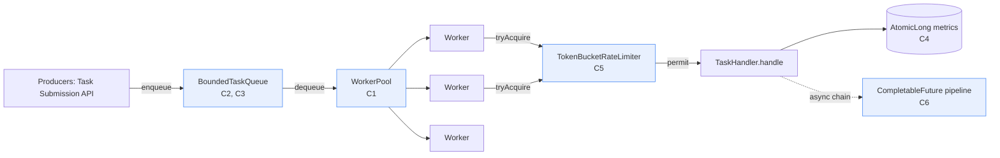
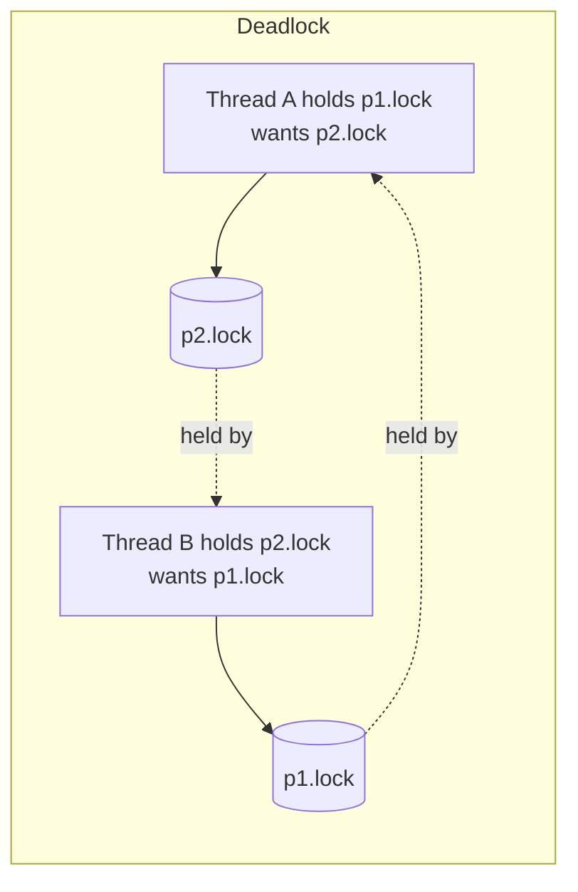
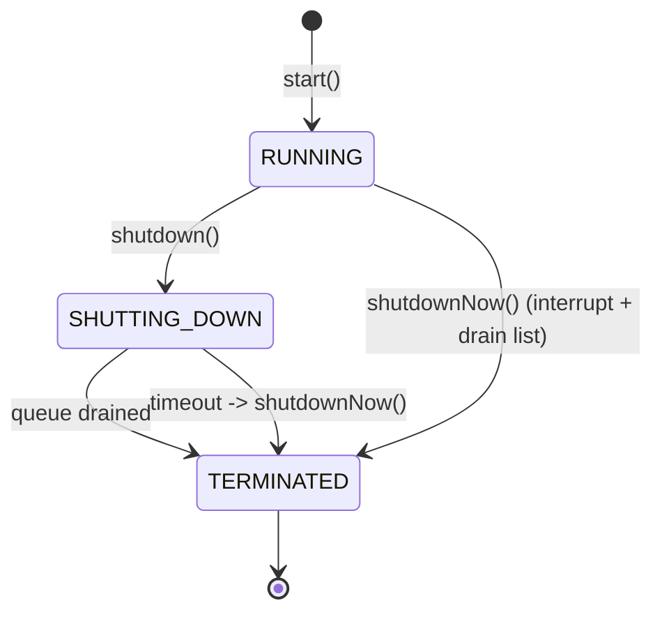
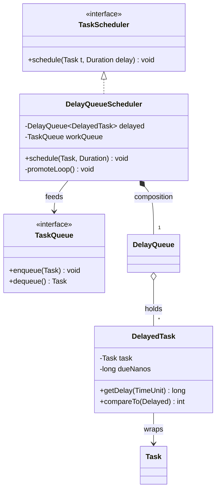

# Concurrency: Exercises

> Where this fits: this is the module-wide problem set for **Phase 1 concurrency** of the Task Queue platform. Every chapter in `06-concurrency/` taught one primitive; here you wire them together into the actual machinery — a real `WorkerPool`, a thread-safe queue, a `TokenBucketRateLimiter`, and a `CompletableFuture` pipeline. Solutions live in **[./solutions.md](./solutions.md)** — try each problem before peeking.

These exercises assume you have read, or can refer to:

- [./threads.md](./threads.md) — `Thread`, `Runnable`, `Callable`, the memory model.
- [./executor-service.md](./executor-service.md) — `ExecutorService`, `ThreadPoolExecutor`, sizing, shutdown.
- [./futures-and-completablefuture.md](./futures-and-completablefuture.md) — `Future`, `CompletableFuture` pipelines.
- [./blocking-queue.md](./blocking-queue.md) — `BlockingQueue`, bounded producer-consumer.
- [./locks.md](./locks.md) — `synchronized`, `ReentrantLock`, deadlock.
- [./semaphores.md](./semaphores.md) — `Semaphore`, permits, bounded concurrency.
- [./atomics-and-thread-safety.md](./atomics-and-thread-safety.md) — `AtomicLong`, CAS, visibility.
- [./concurrent-collections.md](./concurrent-collections.md) — `ConcurrentHashMap`, `CopyOnWriteArrayList`.

---

## How to use this file

- Exercises are numbered by **category prefix + difficulty**: `K` = Knowledge-Check, `C` = Coding, `R` = Refactoring, `D` = Design, `I` = Interview, `S` = Stretch.
- Each is tagged **Easy / Medium / Hard**. Work top-to-bottom within a category, or jump to a primitive you want to drill.
- The canonical domain model is shared across the whole repo. The slice you need for this module:

```java
// The slice of the canonical model used throughout these exercises.
enum TaskStatus { PENDING, SCHEDULED, RUNNING, SUCCEEDED, FAILED, RETRYING, DEAD }

record Task(String id, String type, String payload, TaskStatus status,
            int attempts, int maxAttempts,
            java.time.Instant createdAt, java.time.Instant scheduledAt, int priority) {}

@FunctionalInterface
interface TaskHandler { TaskResult handle(Task task) throws Exception; }

record TaskResult(boolean success, String message, boolean retryable) {}

interface TaskQueue {
    void enqueue(Task t);
    Task dequeue() throws InterruptedException;
    int size();
}

interface RateLimiter { boolean tryAcquire(); }
```

> Do not change these signatures unless an exercise explicitly tells you to. Consistency with the other 129 files matters — the same `Task`/`TaskQueue`/`Worker` appears in Phases 2–4.

Here is the dependency map of what you are building in the **Coding** section, so you can see the whole picture before diving in:



---

## Part 1 — Knowledge-Check (conceptual, short answers)

> Goal: confirm you can *reason* about the primitives before you build with them. Write a 2–4 sentence answer to each. Solutions in [./solutions.md](./solutions.md) under the same id.

### K1 (Easy) — Runnable vs Callable

Your `Worker` loop pulls a `Task` and runs a `TaskHandler`. The handler signature is `TaskResult handle(Task) throws Exception`. Explain why you would submit work as a `Callable<TaskResult>` rather than a `Runnable` when you want the *result* of execution, and what an `ExecutorService` gives you back in each case.

### K2 (Easy) — `start()` vs `run()`

A teammate writes `new Thread(worker).run();` and is confused that all tasks execute on the main thread, one at a time. What did they get wrong, and what is the one-character-conceptual fix? What does `start()` actually do that `run()` does not?

### K3 (Easy) — Visibility

```java
class Flag {
    private boolean stop = false;          // not volatile
    void stop() { stop = true; }
    void loop() { while (!stop) { /* spin */ } }
}
```

A `Worker` spins in `loop()` on one thread; another thread calls `stop()`. The worker may never stop. Explain the *visibility* problem (not a race on a compound action — purely visibility). Give two correct fixes and state which you'd pick for a single flag.

### K4 (Easy) — Why `BlockingQueue` over `synchronized` + `wait/notify`

Phase 1 backs `InMemoryTaskQueue` with a `BlockingQueue`. State three concrete things `LinkedBlockingQueue`/`ArrayBlockingQueue` handle for you that a hand-rolled `synchronized` queue with `wait()`/`notify()` forces you to get right yourself.

### K5 (Medium) — `submit` algorithm

Given a `ThreadPoolExecutor(corePoolSize=4, maximumPoolSize=8, queue=ArrayBlockingQueue(100))`, describe the exact order of decisions the executor makes when `execute(task)` is called. At what queue/thread state does a new (5th) thread get created? At what point is a task rejected?

### K6 (Medium) — Atomicity vs visibility

`volatile long counter; counter++;` is still broken under concurrency even though `counter` is volatile. Explain why, and name the single-line fix using a class from `java.util.concurrent.atomic`. Why is `AtomicLong.incrementAndGet()` correct where `volatile`+`++` is not?

### K7 (Medium) — Deadlock conditions

State the four Coffman conditions for deadlock. For each, give one concrete technique that *breaks* that condition in a worker that needs to lock two `Task` rows (e.g., `lockA` and `lockB`) at once.

### K8 (Hard) — Happens-before across the queue boundary

A producer thread mutates a `Task`'s fields, then `enqueue(task)`s it into a `LinkedBlockingQueue`; a consumer `dequeue()`s and reads those fields. Explain why the consumer is *guaranteed* to see the producer's writes even without the `Task` being `volatile` or `synchronized`. Which happens-before edge makes this safe? Now explain why mutating the `Task` *after* enqueue is a data race. (This is the argument for our `Task` being an immutable `record`.)

### K9 (Hard) — `CompletableFuture` thread semantics

For `cf.thenApply(f).thenApplyAsync(g, pool)`, explain which thread runs `f` and which runs `g`, and what happens to that answer when `cf` is already completed at the moment `thenApply` is called. Why does mixing blocking calls into `thenApply` (non-async) stages risk starving the common `ForkJoinPool`?

### K10 (Hard) — Token bucket vs fixed window

A `RateLimiter` for our task submission endpoint can be a fixed-window counter or a token bucket. Explain the "burst at the window boundary" problem of fixed windows (the 2x burst), and how a token bucket's continuous refill avoids it while still permitting controlled bursts up to the bucket capacity.

---

## Part 2 — Coding exercises (build the Task Queue concurrency core)

> These six problems compose into a working Phase 1 concurrency core. Each is self-contained and compilable; later ones reuse earlier types. Use **Java 21**, JUnit 5 + AssertJ for tests.

### C1 (Medium) — Build a `WorkerPool` on a tuned `ThreadPoolExecutor`

Implement `WorkerPool` per the canonical model: it manages an `ExecutorService` of `Worker`s with `start()` and `shutdown()`. A `Worker` implements `Runnable`, pulls from a `TaskQueue`, looks up a `TaskHandler` by `task.type()` in a registry, executes it, and records the outcome.

Requirements:

1. Construct the executor explicitly as a `ThreadPoolExecutor` (no `Executors.newFixedThreadPool`), with:
   - a bounded `ArrayBlockingQueue` of capacity 100,
   - a `ThreadFactory` producing **named daemon** threads (`task-worker-1`, `task-worker-2`, …),
   - `CallerRunsPolicy` as the rejection policy.
2. `start()` submits `workerCount` `Worker` runnables that loop: `dequeue()` → handler lookup → `handle` → outcome.
3. `shutdown(timeout)` performs a **two-phase** shutdown: `shutdown()`, await the timeout, then `shutdownNow()` if not terminated. The worker loop must exit cleanly on interrupt (`InterruptedException` from `dequeue()`).
4. Unknown `task.type()` (no handler registered) must not kill the worker — log and continue.

Starter skeleton (fill in the bodies):

```java
import java.util.Map;
import java.util.concurrent.*;
import java.util.concurrent.atomic.AtomicInteger;

public final class WorkerPool {
    private final TaskQueue queue;
    private final Map<String, TaskHandler> handlers;
    private final int workerCount;
    private final ThreadPoolExecutor executor;

    public WorkerPool(TaskQueue queue, Map<String, TaskHandler> handlers, int workerCount) {
        this.queue = queue;
        this.handlers = handlers;
        this.workerCount = workerCount;
        // TODO: build the ThreadPoolExecutor per the requirements above.
        this.executor = null;
    }

    public void start() {
        // TODO: submit `workerCount` Worker runnables.
    }

    public boolean shutdown(long timeout, TimeUnit unit) throws InterruptedException {
        // TODO: two-phase shutdown; return true if terminated cleanly.
        return false;
    }

    final class Worker implements Runnable {
        public void run() {
            // TODO: loop until interrupted: dequeue -> lookup handler -> handle -> record outcome.
        }
    }
}
```

Acceptance test to satisfy:

```java
@Test
void processesAllSubmittedTasks() throws Exception {
    var queue = new InMemoryTaskQueue(1000);      // from C2
    var done = new java.util.concurrent.atomic.AtomicInteger();
    TaskHandler ok = t -> { done.incrementAndGet(); return new TaskResult(true, "ok", false); };
    var pool = new WorkerPool(queue, Map.of("noop", ok), 4);
    pool.start();
    for (int i = 0; i < 1000; i++) {
        queue.enqueue(new Task("id-" + i, "noop", "{}", TaskStatus.PENDING,
                0, 3, java.time.Instant.now(), java.time.Instant.now(), 0));
    }
    // give workers time, then shut down and assert
    Thread.sleep(500);
    assertThat(pool.shutdown(5, TimeUnit.SECONDS)).isTrue();
    assertThat(done.get()).isEqualTo(1000);
}
```

> Hint: see the `WorkerExecutors` factory pattern in [./executor-service.md](./executor-service.md). Catch `InterruptedException` in the loop, restore the interrupt flag, and `return` to exit.

---

### C2 (Easy) — Implement `InMemoryTaskQueue` (bounded, blocking)

Implement the canonical `TaskQueue` for Phase 1, backed by a `BlockingQueue<Task>`.

Requirements:

1. Constructor `InMemoryTaskQueue(int capacity)` → back it with an `ArrayBlockingQueue<Task>(capacity)`.
2. `enqueue(Task)` blocks if full (use `put`, not `offer`) — this is in-process backpressure.
3. `dequeue()` blocks if empty (use `take`) and declares `throws InterruptedException`.
4. `size()` returns the current number of queued tasks.

```java
import java.util.concurrent.*;

public final class InMemoryTaskQueue implements TaskQueue {
    private final BlockingQueue<Task> queue;
    public InMemoryTaskQueue(int capacity) { this.queue = new ArrayBlockingQueue<>(capacity); }
    public void enqueue(Task t) { /* TODO: blocking put, handle interrupt */ }
    public Task dequeue() throws InterruptedException { /* TODO */ return null; }
    public int size() { return queue.size(); }
}
```

> Decision point: `enqueue` is `void` and can't throw `InterruptedException` per the interface. If `put` is interrupted, what do you do? (Answer in solutions: restore the interrupt flag and throw an unchecked exception or drop with a logged warning — discuss the tradeoff.)

---

### C3 (Hard) — Build a bounded producer-consumer queue **from scratch** (no `BlockingQueue`)

To prove you understand the primitive, reimplement a bounded blocking queue using only a `ReentrantLock` and two `Condition`s — `notFull` and `notEmpty`. Do **not** use any `java.util.concurrent` queue.

```java
import java.util.concurrent.locks.*;

public final class BoundedBuffer<E> {
    private final Object[] items;
    private int head, tail, count;
    private final ReentrantLock lock = new ReentrantLock();
    private final Condition notFull  = lock.newCondition();
    private final Condition notEmpty = lock.newCondition();

    public BoundedBuffer(int capacity) { items = new Object[capacity]; }

    public void put(E e) throws InterruptedException {
        // TODO: lock; while (count == items.length) notFull.await();
        //       enqueue; signal notEmpty; unlock in finally.
    }

    @SuppressWarnings("unchecked")
    public E take() throws InterruptedException {
        // TODO: lock; while (count == 0) notEmpty.await();
        //       dequeue; signal notFull; unlock in finally.
        return null;
    }

    public int size() { lock.lock(); try { return count; } finally { lock.unlock(); } }
}
```

Requirements:

1. `put` waits on `notFull` while the buffer is full; `take` waits on `notEmpty` while empty.
2. Use a **`while`** loop around `await()`, never an `if` (guard against spurious wakeups and stolen signals).
3. Signal the *other* condition after each operation (`put` signals `notEmpty`, `take` signals `notFull`).
4. Always `unlock()` in a `finally`.
5. Write a test: 4 producers each `put` 1000 items, 4 consumers each `take` 1000 items, assert all 4000 items are consumed exactly once and `size() == 0` at the end.

> The `while`-not-`if` rule is the single most common bug in hand-rolled producer-consumer code. If you use `if`, a thread can wake on a stale condition and corrupt the buffer. See [./blocking-queue.md](./blocking-queue.md) and [./locks.md](./locks.md).

---

### C4 (Easy) — Thread-safe metrics with atomics

The pool needs counters that multiple workers update concurrently: `submitted`, `succeeded`, `failed`, `retried`, `dead`. Implement a lock-free `MetricsCollector`.

Requirements:

1. Back each counter with an `AtomicLong` (or a `LongAdder` for high-contention counters — discuss the difference).
2. Methods: `incSucceeded()`, `incFailed()`, etc., plus a `snapshot()` returning an immutable record.
3. No `synchronized`, no locks. Increments must be atomic.

```java
import java.util.concurrent.atomic.LongAdder;

public final class MetricsCollector {
    private final LongAdder submitted = new LongAdder();
    private final LongAdder succeeded = new LongAdder();
    private final LongAdder failed    = new LongAdder();
    // TODO: retried, dead

    public void incSubmitted() { submitted.increment(); }
    // TODO: the rest

    public record Snapshot(long submitted, long succeeded, long failed, long retried, long dead) {}
    public Snapshot snapshot() { /* TODO: sum() each adder into a Snapshot */ return null; }
}
```

> `LongAdder` beats `AtomicLong` under heavy write contention (it stripes across cells) but `sum()` is not a perfectly consistent instant. For a metrics counter that tradeoff is fine; for a value you must read-modify-write atomically (like a token count), use `AtomicLong`. Explain this in your solution.

---

### C5 (Hard) — Build a `TokenBucketRateLimiter`

Implement the canonical `RateLimiter` interface with a thread-safe token bucket. This protects our task submission endpoint (and, in Phase 3, throttles per-tenant task execution).

Requirements:

1. Constructor `TokenBucketRateLimiter(double ratePerSecond, long capacity)`.
2. `tryAcquire()` returns `true` and consumes one token if available, else `false` (non-blocking).
3. Refill is **lazy / continuous**: compute tokens to add based on elapsed nanos since the last refill (`elapsedNanos * rate / 1e9`), capped at `capacity`. Do not use a background thread.
4. Thread-safe under concurrent callers. Two acceptable designs:
   - **(a)** a `synchronized` method or a `ReentrantLock` around refill+consume (simple, correct);
   - **(b)** a lock-free CAS loop over an `AtomicLong` packed state (advanced — implement this for full credit).
5. Use `System.nanoTime()` (monotonic), never `currentTimeMillis()` (wall clock can jump).

Starter (the simple locked version — you should also attempt the CAS version):

```java
public final class TokenBucketRateLimiter implements RateLimiter {
    private final double ratePerNano;
    private final double capacity;
    private double tokens;
    private long lastRefillNanos;

    public TokenBucketRateLimiter(double ratePerSecond, long capacity) {
        this.ratePerNano = ratePerSecond / 1_000_000_000.0;
        this.capacity = capacity;
        this.tokens = capacity;
        this.lastRefillNanos = System.nanoTime();
    }

    public synchronized boolean tryAcquire() {
        long now = System.nanoTime();
        // TODO: refill: tokens = min(capacity, tokens + (now - lastRefillNanos) * ratePerNano)
        // TODO: lastRefillNanos = now
        // TODO: if tokens >= 1 -> tokens -= 1; return true; else return false
        return false;
    }
}
```

Test to satisfy (a rate/burst assertion):

```java
@Test
void allowsBurstThenThrottlesToRate() throws Exception {
    var rl = new TokenBucketRateLimiter(10, 5);   // 10/s refill, burst of 5
    int immediate = 0;
    for (int i = 0; i < 5; i++) if (rl.tryAcquire()) immediate++;
    assertThat(immediate).isEqualTo(5);           // full burst granted
    assertThat(rl.tryAcquire()).isFalse();        // bucket empty
    Thread.sleep(250);                            // ~2.5 tokens refilled
    int after = 0;
    for (int i = 0; i < 5; i++) if (rl.tryAcquire()) after++;
    assertThat(after).isBetween(2, 3);            // only the refilled tokens
}
```

> Cross-link: this primitive returns in the distributed setting in [../08-distributed-systems/rate-limiting.md](../08-distributed-systems/rate-limiting.md), where the bucket lives in Redis so it is shared across nodes.

---

### C6 (Medium) — A `CompletableFuture` task-execution pipeline

Build an async execution pipeline for a single task that demonstrates composition, timeout, and error recovery — the shape Phase 4's event-driven path uses.

The pipeline for one `Task`:

1. **fetch** the handler config (simulated I/O) → `supplyAsync` on a bounded `ioPool`.
2. **execute** the `TaskHandler.handle` → `thenApplyAsync` on a `cpuPool`, producing a `TaskResult`.
3. **timeout** the whole chain at 2 seconds → `orTimeout(2, SECONDS)`.
4. **recover** failures → `exceptionally`: map any exception (including `TimeoutException`) to a failed, retryable `TaskResult`.
5. **side-effect** → `thenAccept`: update metrics (`succeeded`/`failed`) based on the result.

```java
import java.util.concurrent.*;
import static java.util.concurrent.TimeUnit.SECONDS;

public final class TaskPipeline {
    private final ExecutorService ioPool;
    private final ExecutorService cpuPool;
    private final TaskHandler handler;
    private final MetricsCollector metrics;          // from C4

    public TaskPipeline(ExecutorService ioPool, ExecutorService cpuPool,
                        TaskHandler handler, MetricsCollector metrics) {
        this.ioPool = ioPool; this.cpuPool = cpuPool;
        this.handler = handler; this.metrics = metrics;
    }

    public CompletableFuture<TaskResult> run(Task task) {
        return CompletableFuture
            .supplyAsync(() -> loadConfig(task), ioPool)
            .thenApplyAsync(cfg -> execute(task), cpuPool)   // TODO body
            .orTimeout(2, SECONDS)
            .exceptionally(ex -> /* TODO: map to failed retryable TaskResult */ null)
            .whenComplete((res, ex) -> /* TODO: record metrics */ {});
    }

    private String loadConfig(Task t) { /* simulate IO */ return "{}"; }

    private TaskResult execute(Task t) {
        try { return handler.handle(t); }
        catch (Exception e) { throw new CompletionException(e); }  // unchecked-wrap for the chain
    }
}
```

Requirements:

1. `loadConfig` runs on `ioPool`, `execute` runs on `cpuPool` (prove it by logging `Thread.currentThread().getName()`).
2. A checked exception from `handler.handle` must be wrapped in `CompletionException` so it propagates to `exceptionally`.
3. `orTimeout` must turn a slow handler into a `TimeoutException` routed to `exceptionally`.
4. Write a test with three handlers: one that succeeds, one that throws, and one that sleeps 3 seconds — assert the results are SUCCEEDED-ish, failed+retryable, and failed+retryable (timeout), respectively.

> Why two pools? Mixing blocking I/O into the common `ForkJoinPool` (what plain `supplyAsync` uses) starves CPU work. See K9 and [./futures-and-completablefuture.md](./futures-and-completablefuture.md).

---

## Part 3 — Refactoring exercises (fix broken concurrent code)

> Each problem ships intentionally broken code. Diagnose the bug class, then rewrite it. Solutions show bad → improved → production-quality.

### R1 (Medium) — Fix the race condition on a shared counter

This worker tries to enforce `maxAttempts` and count successes, but loses updates under concurrency.

```java
// BROKEN: data races on `processed` and the check-then-act on the map.
public final class RacyWorker implements Runnable {
    private final TaskQueue queue;
    private final Map<String, Integer> attemptsByType = new HashMap<>(); // not thread-safe
    public long processed = 0;                                           // not atomic

    public void run() {
        while (true) {
            try {
                Task t = queue.dequeue();
                int a = attemptsByType.getOrDefault(t.type(), 0);        // read
                attemptsByType.put(t.type(), a + 1);                     // write (lost updates)
                processed++;                                             // lost updates
            } catch (InterruptedException e) { return; }
        }
    }
}
```

Tasks:

1. Identify **two** distinct race conditions (the `processed++` and the get-then-put on the `HashMap`).
2. Fix `processed` with an atomic.
3. Fix `attemptsByType` so the increment is atomic — use `ConcurrentHashMap` + `merge`/`compute` (a `synchronized` block is a fallback worth contrasting).
4. Justify why `ConcurrentHashMap.merge(key, 1, Integer::sum)` is atomic but `get` then `put` is not.

---

### R2 (Hard) — Detect and break a deadlock

This "transfer between two task partitions" code deadlocks under load because two threads acquire the same two locks in opposite orders.

```java
// BROKEN: lock-ordering deadlock.
final class Partition {
    final int id;
    final Object lock = new Object();
    long pending;
    Partition(int id) { this.id = id; }
}

void rebalance(Partition from, Partition to, long n) {
    synchronized (from.lock) {                 // Thread A: lock(p1) then lock(p2)
        synchronized (to.lock) {               // Thread B: lock(p2) then lock(p1)  -> DEADLOCK
            from.pending -= n;
            to.pending  += n;
        }
    }
}
```

Tasks:

1. Reproduce the deadlock: two threads, one calling `rebalance(p1, p2, …)` in a loop, the other `rebalance(p2, p1, …)`. Confirm with a thread dump (`jstack`) that you see `BLOCKED` on monitors with a cycle.
2. Fix it by **imposing a global lock order**: always lock the partition with the smaller `id` first. Show the corrected `rebalance`.
3. Provide a second fix using `ReentrantLock.tryLock(timeout)` with backoff (no global order needed) and explain the tradeoff (livelock risk, retries).
4. Draw the lock-wait cycle as a Mermaid diagram and the fixed (acyclic) ordering.



> The classic real-world version of this is the dining philosophers / bank-transfer deadlock. The global-ordering fix breaks the **circular wait** Coffman condition (see K7).

---

### R3 (Medium) — Replace `Thread.sleep` busy-wait with proper blocking

This consumer polls and sleeps, burning CPU and adding latency.

```java
// BROKEN: busy-poll wastes CPU and adds up-to-50ms latency per task.
Task t;
while ((t = nonBlockingQueue.poll()) == null) {
    Thread.sleep(50);
}
process(t);
```

Tasks:

1. Replace with a `BlockingQueue.take()` so the thread parks until an item arrives (zero CPU while idle, near-zero latency).
2. If a poll-with-timeout is genuinely needed (e.g., to check a shutdown flag periodically), show `poll(1, TimeUnit.SECONDS)` in a loop and explain why that is *not* the same as `sleep`.
3. Quantify: at 10k idle workers, estimate the wasted wakeups/second of the busy-wait version vs the blocking version.

---

### R4 (Easy) — Make a config object safely published and immutable

```java
// BROKEN: mutable, shared config read by workers while a control thread mutates it.
public final class WorkerConfig {
    public int maxAttempts;          // mutable public field, no safe publication
    public int rateLimitPerSec;
}
```

Tasks:

1. Convert to an immutable Java `record` (final fields, set once in the constructor).
2. Publish it through a `volatile` reference or an `AtomicReference<WorkerConfig>` so a config swap is atomically visible to all workers (copy-on-write of the whole config).
3. Explain why "immutable object behind a volatile reference" gives you safe, lock-free config reloads — the workers always see either the old config or the new one, never a torn half-updated state. Link the reasoning to [../03-java-memory-model/immutable-objects.md](../03-java-memory-model/immutable-objects.md).

---

## Part 4 — Design exercises (object modeling under concurrency)

> No single right answer. Produce: a short prose design, a Mermaid `classDiagram`, key interfaces, and a tradeoff table.

### D1 (Medium) — Design `WorkerPool` shutdown semantics

Design the shutdown contract for `WorkerPool`. Cover:

1. **Graceful** (`shutdown`): stop accepting new tasks, let in-flight + queued tasks drain, then terminate.
2. **Immediate** (`shutdownNow`): interrupt workers, return the list of un-started tasks for re-enqueue or DLQ.
3. The state machine: `RUNNING → SHUTTING_DOWN → TERMINATED`, with what each transition allows.
4. How a SIGTERM (Kubernetes pod stop) maps onto this via a JVM shutdown hook, and the 30-second grace window.

Provide a `stateDiagram-v2` for the lifecycle:



Deliverable: the `WorkerPool` public API (method signatures + Javadoc-style contract), and a table comparing graceful vs immediate (latency to terminate, task loss risk, use case).

---

### D2 (Hard) — Design a concurrency-safe in-process scheduler

Design `TaskScheduler` (canonical: `schedule(Task t, Duration delay)`) backed by a `DelayQueue` or a single `ScheduledExecutorService`, feeding due tasks into the `TaskQueue` for workers.

Address:

1. Data structure choice: `DelayQueue<DelayedTask>` (one consumer thread moves due tasks to the work queue) vs `ScheduledExecutorService.schedule` (one timer thread per task callback). Compare for 1M scheduled tasks.
2. Thread-safety of the "promote due tasks" path — exactly-once handoff into the `TaskQueue` (no double-enqueue, no drop).
3. How `priority` (canonical `Task.priority`) interacts with scheduled-time ordering.
4. The boundary to Phase 2/4 where scheduling moves to PostgreSQL `pollDue(n)` / a broker — what stays the same in the interface.

Provide a `classDiagram` showing `TaskScheduler`, `DelayedTask` (`implements Delayed`), `DelayQueue`, and the `TaskQueue` it feeds. Show the *composition* relationship (scheduler owns its `DelayQueue`) correctly.



> Cross-links for context: [../07-queues-and-messaging/delayed-queues.md](../07-queues-and-messaging/delayed-queues.md) and [../07-queues-and-messaging/scheduling-queues.md](../07-queues-and-messaging/scheduling-queues.md).

---

### D3 (Medium) — Bulkhead the worker pools

Design a bulkheading scheme so a slow downstream (e.g., a flaky email provider) cannot starve unrelated task types. Decide:

1. One executor per task-type class (CPU-bound vs IO-bound vs "slow-external"), or a `Semaphore`-bounded concurrency cap per task type within a shared pool.
2. How `TaskHandler` signals its class (e.g., a default method `boolean ioBound()` or an enum hint), so the router picks the right pool.
3. What happens when one bulkhead is saturated (reject/shed vs queue), and how that interacts with the `TokenBucketRateLimiter` from C5.

Deliverable: a routing diagram and a table of pool sizing per class with the formula you'd use (`N_cpu ≈ cores`; `N_io ≈ cores * (1 + wait/compute)`).

---

## Part 5 — Interview exercises (whiteboard / discussion style)

> Practice explaining out loud. Each expects a crisp model answer; full answers in [./solutions.md](./solutions.md).

### I1 (Easy) — "Walk me through what happens when I call `executor.submit(callable)`."

Trace the lifecycle: where the task goes (queue vs new thread vs reject), what the returned `Future` represents, and how/when `future.get()` blocks and surfaces exceptions (`ExecutionException` wrapping).

### I2 (Medium) — "How would you cap concurrent calls to a downstream to 20, regardless of pool size?"

Expected: a `Semaphore(20)` acquired around the downstream call (with `tryAcquire(timeout)` for bounded waiting and a `finally release()`), and the contrast with simply sizing a separate pool to 20. Discuss fairness and what happens on interrupt.

### I3 (Medium) — "`volatile` vs `synchronized` vs `Atomic*` — when each?"

Expected: `volatile` = visibility + ordering for a single field, no atomic compound updates. `synchronized`/`Lock` = mutual exclusion for multi-step invariants. `Atomic*` = lock-free single-variable read-modify-write via CAS. Give the token-bucket and the `processed` counter as concrete examples of each.

### I4 (Hard) — "Find and fix the deadlock in this code." (live)

Be handed R2-style two-lock code. Expected: name the four Coffman conditions, identify the **circular wait**, propose global lock ordering as the primary fix and `tryLock` with backoff as the alternative, and mention `jstack` deadlock detection as the diagnostic.

### I5 (Hard) — "Design a rate limiter for 100k req/s across 50 nodes."

Expected: start with a local token bucket per node (C5), discuss why per-node limits don't enforce a global limit, then move to a centralized/sharded counter (Redis token bucket / sliding window) with the latency and single-point-of-failure tradeoffs. Mention approximate/eventually-consistent limiting as the pragmatic answer. Bridge to [../08-distributed-systems/rate-limiting.md](../08-distributed-systems/rate-limiting.md).

### I6 (Medium) — "Why are virtual threads a big deal for this system, and where do they *not* help?"

Expected: virtual threads (Loom) make blocking I/O cheap — one virtual thread per task, millions of them, no pool sizing for IO-bound handlers. They do **nothing** for CPU-bound work (you still need ≈ `cores` carriers) and can **pin** on `synchronized`/native calls, serializing work. Prescribe `ReentrantLock` over `synchronized` in hot paths.

---

## Part 6 — Stretch challenges (extended, multi-concept)

> Bigger builds that combine several primitives. Treat each as a mini-project; commit incrementally.

### S1 (Hard) — Work-stealing priority worker pool

Build a worker pool where each worker has its own local deque (`ArrayDeque` under a lock, or `ConcurrentLinkedDeque`) and **steals** from other workers' tails when its own is empty. Honor `Task.priority` within each local queue (highest priority first). Measure throughput vs the single shared `ArrayBlockingQueue` design from C1 under (a) uniform load and (b) skewed load where one producer dominates. Report where work-stealing wins and where the contention on a single queue is actually fine. Reference how `ForkJoinPool` implements this.

### S2 (Hard) — Lock-free `TokenBucketRateLimiter` via CAS

Take C5's locked bucket and make it fully lock-free. Pack `(tokens, lastRefillNanos)` into the state and update it with a `compareAndSet` retry loop on an `AtomicReference<State>` (or pack into a single `long` with bit manipulation if tokens are integral). Prove correctness under contention: 16 threads hammering `tryAcquire`, assert the total granted over a fixed window never exceeds `capacity + rate * windowSeconds` (the bucket invariant). Benchmark grants/sec vs the `synchronized` version and report the crossover point where CAS wins.

### S3 (Hard) — End-to-end Phase 1 concurrency core, with a `CompletableFuture` retry chain

Wire C1–C6 together into a runnable `Phase1App`:

1. `InMemoryTaskQueue` (C2) feeds a `WorkerPool` (C1).
2. Each worker runs tasks through the `TaskPipeline` (C6) and is gated by the `TokenBucketRateLimiter` (C5) — if `tryAcquire()` fails, re-enqueue with a small delay.
3. On a failed+retryable `TaskResult`, retry up to `maxAttempts` using a `CompletableFuture` delay (`CompletableFuture.delayedExecutor(backoff, MILLIS)`) with exponential backoff + jitter; on exhaustion, mark `DEAD` (foreshadowing the DLQ in [../07-queues-and-messaging/dead-letter-queues.md](../07-queues-and-messaging/dead-letter-queues.md)).
4. Export `MetricsCollector` (C4) snapshots every second.
5. Load test: 100k tasks across a mix of handlers (10% always fail, 5% intermittently fail, 85% succeed). Assert: every task reaches a terminal state (`SUCCEEDED` or `DEAD`), `succeeded + dead == 100000`, no thread leaks (pool terminates), and the limiter held the configured rate. This is essentially Phase 1 of the project — capture the numbers, you'll compare them to Phase 2's Postgres-backed queue.

### S4 (Medium) — Concurrency stress test harness

Build a reusable JUnit 5 test utility `Concurrently.run(int threads, int iterationsEach, Runnable body)` using a `CyclicBarrier` (so all threads start simultaneously and maximize contention) and a `CountDownLatch` (to await completion). Use it to stress-test `BoundedBuffer` (C3), `MetricsCollector` (C4), and `TokenBucketRateLimiter` (C5). Add an assertion helper that fails the test if any thread threw. Explain why `CyclicBarrier` start-gating surfaces races that sequential or staggered tests miss.

---

## What We Can Improve In Our Project Using This Concept

Completing the **Coding** and **Stretch** sections *is* the Phase 1 concurrency core: a real `WorkerPool` on a tuned `ThreadPoolExecutor`, a bounded blocking `InMemoryTaskQueue` for in-process backpressure, lock-free `MetricsCollector`, a thread-safe `TokenBucketRateLimiter` guarding submission/execution, and a `CompletableFuture` pipeline with timeout, recovery, and retry-with-backoff. Together they replace any naive single-thread or thread-per-task loop with a governed, observable, gracefully-shutdownable execution engine.

## Project Refactoring Task

1. Land `InMemoryTaskQueue` (C2) and `BoundedBuffer` (C3, as a learning artifact / fallback) under `concurrency/`.
2. Land `WorkerPool` + `Worker` (C1) with two-phase graceful shutdown (D1) and a JVM shutdown hook.
3. Add `MetricsCollector` (C4) and wire counters into the worker outcome path.
4. Add `TokenBucketRateLimiter` (C5) in front of `enqueue` (submission) and inside the worker (execution gate).
5. Add `TaskPipeline` (C6) and the retry-with-backoff chain (S3).
6. Add the `Concurrently` stress harness (S4) and tests covering C1–C6 with AssertJ.

## Git Commit For This Chapter

```text
feat(concurrency): land Phase 1 concurrency core (pool, queue, limiter, pipeline)

- add InMemoryTaskQueue (ArrayBlockingQueue) and from-scratch BoundedBuffer
- add WorkerPool on a tuned ThreadPoolExecutor with two-phase graceful shutdown
- add lock-free MetricsCollector (LongAdder) and outcome wiring
- add TokenBucketRateLimiter (locked + CAS variants) guarding submit/execute
- add CompletableFuture TaskPipeline with orTimeout/exceptionally + retry backoff
- add Concurrently stress harness and JUnit 5 + AssertJ tests for C1-C6

Files touched:
  src/main/java/.../concurrency/InMemoryTaskQueue.java   (new)
  src/main/java/.../concurrency/BoundedBuffer.java        (new)
  src/main/java/.../concurrency/WorkerPool.java           (new)
  src/main/java/.../concurrency/MetricsCollector.java     (new)
  src/main/java/.../concurrency/TokenBucketRateLimiter.java (new)
  src/main/java/.../concurrency/TaskPipeline.java         (new)
  src/test/java/.../concurrency/Concurrently.java         (new)
  src/test/java/.../concurrency/*Test.java                (new)
```

## Architecture Impact

These exercises crystallize the **concurrency governor** of the platform: the `WorkerPool`'s worker count is the explicit in-flight parallelism knob; the bounded queue plus `CallerRunsPolicy` is the first backpressure boundary; the `TokenBucketRateLimiter` is the first admission-control valve; the `CompletableFuture` pipeline establishes the async-composition and timeout/recovery pattern that Phase 4's event-driven path inherits. Every horizontally-scaled worker node in Phase 4 runs exactly this core, so cluster throughput becomes per-node executor capacity × node count — a measurable, plannable multiplication.

## Interview Takeaways

- Decouple *job* (`Runnable`/`Callable`) from *executor* (the thread that runs it); never subclass `Thread` to describe work.
- `volatile` = visibility, `synchronized`/`Lock` = mutual exclusion for multi-step invariants, `Atomic*`/CAS = lock-free single-variable updates — pick by the invariant you must protect.
- Deadlock needs all four Coffman conditions; break **circular wait** with a global lock order, or use `tryLock` with backoff.
- Bounded blocking queues give you correct producer-consumer *and* in-process backpressure for free — reach for them before hand-rolling `wait`/`notify`.
- A token bucket gives smooth, burst-tolerant rate limiting via continuous refill; `nanoTime` not `currentTimeMillis`.
- `CompletableFuture` composes async stages; use `*Async` with an explicit pool for blocking work, `orTimeout` for deadlines, and `exceptionally` for recovery.
- Virtual threads transform IO-bound concurrency but not CPU-bound work, and pin on `synchronized` — prefer `ReentrantLock` in hot paths.
