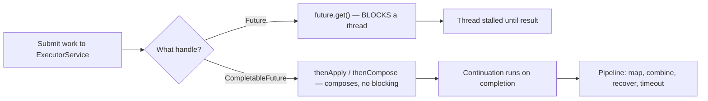
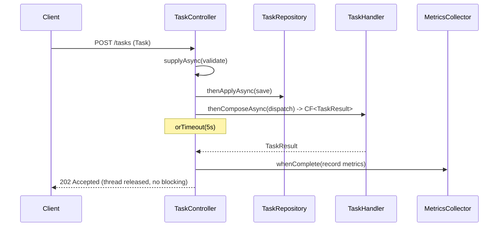

# Futures and CompletableFuture

> Where this fits: in our Distributed Task Queue, `Worker` threads execute `TaskHandler`s, but the API layer, schedulers, and fan-out aggregations need to *kick off work and stitch results together without blocking a thread per call*. `Future` and `CompletableFuture` are the primitives that let us model an in-flight `TaskResult` as a value, compose pipelines over it, and apply timeouts, retries, and error handling declaratively.

This chapter assumes you already understand [threads](threads.md) and the [ExecutorService](executor-service.md). We build directly on top of those: a `Future` is what an `ExecutorService.submit` hands back, and `CompletableFuture` is the composable evolution of it.

---

## 2. Why this exists — the real problem it solves

You have a thread pool. You submit work. Now you need the **answer**.

The first question every concurrent program hits: *"I started a computation on another thread — how do I get its result back, and how do I know when it's done?"* The naive answers are all bad:

- **Shared mutable variable + polling** — race conditions, busy-waiting, no completion signal.
- **`wait()`/`notify()` on a lock** — correct but verbose, error-prone, and you reinvent it every time.
- **Callbacks** — work, but compose into "callback hell": deeply nested lambdas where error handling and ordering become impossible to reason about.

Java 5 (2004) introduced `java.util.concurrent.Future<V>` as the standard handle to a pending result. It solved *"give me the value when it's ready"* but had a fatal limitation: the **only** way to read a `Future` is to call `get()`, which **blocks** the calling thread until the result arrives. You cannot say "when this finishes, do X next" without a thread sitting and waiting. You cannot combine two futures. You cannot register a recovery path. `Future` is a mailbox you have to stand in front of.

Java 8 (2014) introduced `CompletableFuture<V>`, which implements both `Future` and a new `CompletionStage` interface. It is a **promise** you can complete manually *and* a **composable pipeline node**: you attach continuations (`thenApply`, `thenCompose`), combine multiple stages (`thenCombine`, `allOf`, `anyOf`), and handle failures (`exceptionally`, `handle`) — all **without blocking a thread**. This is the foundation of non-blocking, reactive-style code in plain Java.

> The mental shift: `Future` is *"a value I will eventually pull"*. `CompletableFuture` is *"a value I will eventually push through a pipeline"*. Pull blocks. Push composes.



---

## 3. The naive version — blocking `Future.get()` everywhere

Here is the first cut a Java newcomer writes when they want to run a `TaskHandler` asynchronously and report the `TaskResult` back to the API caller.

```java
import java.util.concurrent.*;

public class NaiveTaskRunner {
    private final ExecutorService pool = Executors.newFixedThreadPool(8);

    // Returns the result of running a single task. BLOCKS the caller.
    public TaskResult run(Task task, TaskHandler handler) throws Exception {
        Future<TaskResult> future = pool.submit(() -> handler.handle(task));
        return future.get(); // <-- the caller's thread is now parked here
    }

    // Run several tasks and collect results. O(n) blocking, sequentially observed.
    public List<TaskResult> runAll(List<Task> tasks, TaskHandler handler) throws Exception {
        List<Future<TaskResult>> futures = new ArrayList<>();
        for (Task t : tasks) {
            futures.add(pool.submit(() -> handler.handle(t)));
        }
        List<TaskResult> results = new ArrayList<>();
        for (Future<TaskResult> f : futures) {
            results.add(f.get()); // blocks on each in submission order
        }
        return results;
    }
}
```

**What's wrong:**

1. **`get()` blocks a thread.** If this runs inside a web request handler with a bounded thread pool (the classic Spring MVC scenario), every in-flight task pins a request thread. 200 concurrent tasks needs 200 parked threads. This is exactly the thread-per-request scaling wall.
2. **No composition.** Want to log the result, then enqueue a follow-up task, then update metrics? You write blocking, imperative glue after each `get()`.
3. **Error handling is exceptions only.** A failed task throws `ExecutionException` (wrapping the real cause) out of `get()`. There is no path to "on failure, fall back to a default" without try/catch noise.
4. **No timeout discipline.** `get()` with no argument waits *forever*. One stuck handler hangs the caller indefinitely.
5. **Head-of-line blocking in `runAll`.** We observe results strictly in submission order; a slow task #1 delays our reaction to a fast task #2 that already finished.

`Future` is fine as a *handle*, but using it as your *programming model* forces blocking. We need composition.

---

## 4. Improved version — `CompletableFuture` with non-blocking continuations

`CompletableFuture.supplyAsync` runs the supplier on an executor and returns a future you can *chain* on. We never call `get()` in the pipeline; we attach continuations instead.

```java
import java.util.concurrent.*;

public class ImprovedTaskRunner {
    private final ExecutorService pool = Executors.newFixedThreadPool(8);

    // Returns a future that completes with the result — caller does NOT block here.
    public CompletableFuture<TaskResult> run(Task task, TaskHandler handler) {
        return CompletableFuture.supplyAsync(() -> {
            try {
                return handler.handle(task);
            } catch (Exception e) {
                // wrap checked exception so it surfaces as completion failure
                throw new CompletionException(e);
            }
        }, pool);
    }

    // Compose: run, then transform the result, then recover on failure — all async.
    public CompletableFuture<String> runAndDescribe(Task task, TaskHandler handler) {
        return run(task, handler)
            .thenApply(result -> "task " + task.id() + " -> success=" + result.success())
            .exceptionally(ex -> "task " + task.id() + " -> FAILED: " + ex.getMessage());
    }
}
```

**What improved:**

- `run` returns immediately with a `CompletableFuture`. The caller can attach behavior or pass it along; no thread parks.
- `thenApply` transforms the value when it arrives, on a pool thread, not the caller's.
- `exceptionally` provides a recovery path — the failure stays inside the pipeline as a value, not an escaping exception.

Still missing for production: timeouts, a *dedicated* executor (we'll see why the common pool bites you), structured fan-out/fan-in, and metrics. That's next.

---

## 5. Production-quality version — bounded executor, timeouts, fan-out/fan-in, recovery

A staff engineer ships this: an async runner with an explicit executor, per-task timeouts, structured exception handling that maps to our domain (`TaskResult`), and a fan-out/fan-in that aggregates results without head-of-line blocking.

```java
import java.time.Duration;
import java.util.*;
import java.util.concurrent.*;
import java.util.stream.Collectors;

/**
 * Production-inspired async runner for the Task Queue.
 * - Dedicated, named, bounded executor (never the common ForkJoinPool for blocking I/O).
 * - Per-task timeout via orTimeout, mapped to a retryable TaskResult.
 * - Failures captured as TaskResult, not escaping exceptions.
 * - Fan-out/fan-in over a batch with allOf, preserving all results.
 */
public final class AsyncTaskRunner implements AutoCloseable {

    private final ExecutorService executor;
    private final Duration perTaskTimeout;

    public AsyncTaskRunner(int parallelism, Duration perTaskTimeout) {
        this.executor = Executors.newFixedThreadPool(parallelism, namedFactory("async-task"));
        this.perTaskTimeout = perTaskTimeout;
    }

    /** Run one task; the future always completes with a TaskResult (never exceptionally). */
    public CompletableFuture<TaskResult> run(Task task, TaskHandler handler) {
        return CompletableFuture
            .supplyAsync(() -> invoke(task, handler), executor)
            // orTimeout completes exceptionally with TimeoutException if not done in time
            .orTimeout(perTaskTimeout.toMillis(), TimeUnit.MILLISECONDS)
            // handle BOTH the success and failure branches into a single TaskResult
            .handle((result, ex) -> {
                if (ex == null) return result;
                Throwable cause = unwrap(ex);
                boolean retryable = cause instanceof TimeoutException
                                 || cause instanceof RejectedExecutionException;
                return new TaskResult(false, cause.getClass().getSimpleName()
                        + ": " + cause.getMessage(), retryable);
            });
    }

    /** Fan-out a batch, fan-in all results. No head-of-line blocking. */
    public CompletableFuture<Map<String, TaskResult>> runBatch(
            List<Task> tasks, TaskHandler handler) {

        // 1. fan-out: one future per task
        Map<String, CompletableFuture<TaskResult>> futures = tasks.stream()
            .collect(Collectors.toMap(Task::id, t -> run(t, handler),
                     (a, b) -> a, LinkedHashMap::new));

        // 2. a single future that completes when ALL are done
        CompletableFuture<Void> all =
            CompletableFuture.allOf(futures.values().toArray(CompletableFuture[]::new));

        // 3. fan-in: when all complete, read each (now non-blocking) result
        return all.thenApply(ignored -> futures.entrySet().stream()
            .collect(Collectors.toMap(Map.Entry::getKey,
                     e -> e.getValue().join(),       // safe: already complete
                     (a, b) -> a, LinkedHashMap::new)));
    }

    private static TaskResult invoke(Task task, TaskHandler handler) {
        try {
            return handler.handle(task);
        } catch (Exception e) {
            throw new CompletionException(e); // surface as completion failure
        }
    }

    private static Throwable unwrap(Throwable t) {
        return (t instanceof CompletionException || t instanceof ExecutionException)
                && t.getCause() != null ? t.getCause() : t;
    }

    private static ThreadFactory namedFactory(String prefix) {
        var counter = new java.util.concurrent.atomic.AtomicInteger();
        return r -> {
            Thread th = new Thread(r, prefix + "-" + counter.incrementAndGet());
            th.setDaemon(true);
            return th;
        };
    }

    @Override
    public void close() {
        executor.shutdown();
        try {
            if (!executor.awaitTermination(30, TimeUnit.SECONDS)) {
                executor.shutdownNow();
            }
        } catch (InterruptedException e) {
            executor.shutdownNow();
            Thread.currentThread().interrupt();
        }
    }
}
```

Why this is the version to ship:

- **`handle` over `exceptionally`** — `handle((value, throwable) -> ...)` sees *both* branches and always produces one normalized `TaskResult`, so callers never juggle exceptions. It maps timeouts and rejections to `retryable=true`, feeding directly into our [retry policy](../08-distributed-systems/retries.md).
- **Explicit timeout** — `orTimeout` guarantees the pipeline can't hang on a stuck handler.
- **Fan-out/fan-in with `allOf`** — we observe completion of the slowest task only once, then read all results with `join()` (safe because every future is already done). No head-of-line blocking.
- **Dedicated daemon executor** — named threads for debugging, bounded parallelism for backpressure, daemon so it never blocks JVM shutdown. We never silently borrow the common pool.

---

## 6. Code walkthrough — beginner, intermediate, production

### Beginner: `Future` vs `CompletableFuture` side by side

```java
import java.util.concurrent.*;

public class FutureVsCompletable {
    public static void main(String[] args) throws Exception {
        ExecutorService pool = Executors.newFixedThreadPool(2);

        // --- Old way: Future. The ONLY way to read it is the blocking get(). ---
        Future<Integer> f = pool.submit(() -> {
            Thread.sleep(100);
            return 21;
        });
        int doubled = f.get() * 2;          // blocks the main thread for ~100ms
        System.out.println("Future result: " + doubled); // 42

        // --- New way: CompletableFuture. Attach a continuation; no blocking. ---
        CompletableFuture<Integer> cf = CompletableFuture
            .supplyAsync(() -> { sleep(100); return 21; }, pool)
            .thenApply(x -> x * 2)          // runs when the value is ready
            .thenApply(x -> x + 1);         // chains again
        cf.thenAccept(r -> System.out.println("CF result: " + r)); // 43, async

        cf.join();                          // wait at the end of main only, to see output
        pool.shutdown();
    }

    static void sleep(long ms) {
        try { Thread.sleep(ms); } catch (InterruptedException e) { Thread.currentThread().interrupt(); }
    }
}
```

The key difference: with `Future`, `get()` is the *first* thing you do and it stalls the thread. With `CompletableFuture`, `join()`/`get()` is the *last* thing (often never, in a server) — everything in between is composed.

### Intermediate: `thenApply` vs `thenCompose`, and combining two stages

A constant source of confusion. Use this rule:

- **`thenApply(fn)`** — `fn` returns a *plain value*. Like `Stream.map`.
- **`thenCompose(fn)`** — `fn` returns *another `CompletableFuture`*. Like `Stream.flatMap`. Use it to avoid a nested `CompletableFuture<CompletableFuture<T>>`.

```java
import java.util.concurrent.*;

public class ComposeExamples {
    static final ExecutorService POOL = Executors.newFixedThreadPool(4);

    // Simulates loading a Task by id from the repository, asynchronously.
    static CompletableFuture<Task> loadTask(String id) {
        return CompletableFuture.supplyAsync(
            () -> new Task(id, "email", "{}", TaskStatus.PENDING, 0, 3,
                           java.time.Instant.now(), null, 5), POOL);
    }

    // Simulates running a handler against a Task, asynchronously.
    static CompletableFuture<TaskResult> execute(Task t) {
        return CompletableFuture.supplyAsync(
            () -> new TaskResult(true, "sent " + t.id(), false), POOL);
    }

    public static void main(String[] args) {
        // WRONG SHAPE with thenApply: nested future you'd have to unwrap.
        CompletableFuture<CompletableFuture<TaskResult>> nested =
            loadTask("t1").thenApply(ComposeExamples::execute);  // CF<CF<...>>

        // RIGHT: thenCompose flattens the dependent async step.
        CompletableFuture<TaskResult> flat =
            loadTask("t1").thenCompose(ComposeExamples::execute); // CF<TaskResult>

        // thenCombine: two INDEPENDENT futures, merge when BOTH complete.
        CompletableFuture<Task> a = loadTask("a");
        CompletableFuture<Task> b = loadTask("b");
        CompletableFuture<String> merged =
            a.thenCombine(b, (ta, tb) -> ta.id() + " + " + tb.id());

        System.out.println(flat.join());     // TaskResult[...]
        System.out.println(merged.join());   // "a + b"
        nested.join().join();
        POOL.shutdown();
    }
}
```

> Mnemonic: **`thenApply` = map**, **`thenCompose` = flatMap**, **`thenCombine` = zip two**.

### Production-inspired: a non-blocking task pipeline with timeout and recovery

This models a real API path: receive a submission, validate, persist, dispatch to a handler, and produce a response — each step async, with a timeout and a fallback.

```java
import java.time.Duration;
import java.util.concurrent.*;

public class TaskPipeline {

    private final ExecutorService io;       // for I/O-bound stages (DB, network)
    private final TaskRepository repository;
    private final TaskHandler handler;

    public TaskPipeline(ExecutorService io, TaskRepository repository, TaskHandler handler) {
        this.io = io;
        this.repository = repository;
        this.handler = handler;
    }

    public CompletableFuture<String> submitAndRun(Task incoming) {
        return CompletableFuture
            .supplyAsync(() -> validate(incoming), io)            // 1. validate
            .thenApplyAsync(this::persist, io)                    // 2. persist (returns saved Task)
            .thenComposeAsync(this::dispatch, io)                 // 3. dispatch -> CF<TaskResult>
            .orTimeout(5, TimeUnit.SECONDS)                       // pipeline-wide deadline
            .thenApply(result -> "OK id=" + incoming.id()
                       + " success=" + result.success())
            .exceptionally(ex -> "ERROR id=" + incoming.id()
                       + " reason=" + rootCause(ex).getMessage());
    }

    private Task validate(Task t) {
        if (t.payload() == null || t.payload().isBlank()) {
            throw new IllegalArgumentException("empty payload");
        }
        return t;
    }

    private Task persist(Task t) {
        repository.save(t);
        return t;
    }

    private CompletableFuture<TaskResult> dispatch(Task t) {
        return CompletableFuture.supplyAsync(() -> {
            try { return handler.handle(t); }
            catch (Exception e) { throw new CompletionException(e); }
        }, io);
    }

    private static Throwable rootCause(Throwable t) {
        Throwable c = t;
        while ((c instanceof CompletionException || c instanceof ExecutionException)
                && c.getCause() != null) {
            c = c.getCause();
        }
        return c;
    }
}
```

Note the `*Async` suffix on `thenApplyAsync`/`thenComposeAsync`: it forces the continuation onto our `io` executor rather than running on whatever thread completed the previous stage. For I/O-bound chains you almost always want the `Async` variants with an explicit executor — never inherit a thread you don't control.

---

## 7. How this applies to our Task Queue project

Every async seam in the platform is a `CompletableFuture` opportunity:

| Component (canonical model) | How Futures/CompletableFuture apply |
|---|---|
| `TaskController` POST `/tasks` | Validate + persist + acknowledge as a non-blocking pipeline; return `CompletableFuture<ResponseEntity>` so the request thread is released (Spring MVC supports this). |
| `Worker` / `WorkerPool` | Submit `handler.handle(task)` and wrap with a timeout future; map outcome to `TaskResult` via `handle`. |
| `TaskScheduler.schedule` | `CompletableFuture.delayedExecutor` or `supplyAsync` after a delay for fire-and-forget scheduled dispatch. |
| `RetryPolicy` | After a `retryable` `TaskResult`, schedule the next attempt with `delayedExecutor(nextDelay)` — no blocking sleep. |
| Fan-out aggregation | A "batch submit" endpoint runs N tasks with `allOf` and returns a per-task `Map<String, TaskResult>`. |
| `MetricsCollector` | `whenComplete((res, ex) -> metrics.record(...))` taps every stage to record latency and success/failure counters. |



---

## 8. Tradeoffs

| Dimension | `Future` (Java 5) | `CompletableFuture` (Java 8+) | Virtual threads (Java 21) |
|---|---|---|---|
| Read result | Blocking `get()` only | `get`/`join` *or* compose with continuations | Blocking `get()` — but blocking is cheap |
| Composition | None | Rich: map/flatMap/combine/allOf/anyOf | Write straight-line blocking code |
| Manual completion | No | Yes (`complete`, `completeExceptionally`) | N/A |
| Error handling | `try/catch` around `get` | `exceptionally`/`handle`/`whenComplete` | ordinary `try/catch` |
| Timeout | `get(timeout, unit)` only | `orTimeout`, `completeOnTimeout` | external scheduling |
| Readability of complex flows | poor | medium (chains can sprawl) | excellent (looks synchronous) |
| Best for | legacy / simple submit | CPU + async I/O composition, fan-out/fan-in | high-concurrency blocking I/O |

**The Java 21 nuance worth internalizing:** with [virtual threads](threads.md), the cost of a blocking `get()` collapses — you can have a million virtual threads each blocked on a `Future` for cents. So the *anti-blocking* motivation for `CompletableFuture` weakens. But its *composition* value (declarative fan-out, `allOf`, timeouts, recovery as data) stands on its own. Modern advice: use virtual threads for straight-line concurrency, reach for `CompletableFuture` when you genuinely need to *combine* independent async results.

---

## 9. Common mistakes and pitfalls

- **Using the common ForkJoinPool for blocking I/O.** `supplyAsync(fn)` with no executor runs on `ForkJoinPool.commonPool()`, sized to CPU count. Block on I/O there and you starve every other parallel stream and parallel-stream user in the JVM. **Fix:** always pass an explicit, bounded executor for blocking work.
- **Forgetting that exceptions are wrapped.** A failure inside a stage surfaces as `CompletionException` (or `ExecutionException` from `get()`). Checking `ex instanceof IOException` fails because the real cause is one level down. **Fix:** unwrap with `ex.getCause()` (see `rootCause`/`unwrap` above).
- **Swallowing failures by not chaining a handler.** If you never attach `exceptionally`/`handle`/`whenComplete` and never `join`, an exception in the pipeline vanishes silently. **Fix:** terminate every pipeline with a failure-aware stage, or log in `whenComplete`.
- **`get()` without a timeout.** `future.get()` waits forever. **Fix:** `get(timeout, unit)` or `orTimeout` on the future.
- **`thenApply` where `thenCompose` is needed.** Returns `CompletableFuture<CompletableFuture<T>>` and now you have two layers to unwrap. **Fix:** use `thenCompose` for async dependent steps.
- **Assuming `thenApply` runs on a background thread.** Non-`Async` continuations run on *whatever thread completed the previous stage* — possibly your caller's thread if the future was already complete. **Fix:** use `*Async` with an explicit executor when thread affinity matters.
- **`cancel(true)` does not interrupt a running `CompletableFuture` task.** `CompletableFuture.cancel` only completes the future exceptionally; it does **not** interrupt the underlying running computation. **Fix:** don't rely on it for hard cancellation; design handlers to check interruption / deadlines.
- **Unbounded fan-out.** `allOf` over 100,000 futures all submitted to a fixed pool is fine for the *aggregation* but can overwhelm downstream. **Fix:** add a [semaphore](semaphores.md) or [rate limiter](../08-distributed-systems/rate-limiting.md) to bound concurrency.

---

## 10. Refactoring exercise

**Bad** — blocking, no timeout, leaks exceptions, sequential observation:

```java
public List<TaskResult> processBatch(List<Task> tasks, TaskHandler handler)
        throws Exception {
    ExecutorService pool = Executors.newFixedThreadPool(4);
    List<TaskResult> out = new ArrayList<>();
    for (Task t : tasks) {
        Future<TaskResult> f = pool.submit(() -> handler.handle(t));
        out.add(f.get());   // blocks per task, in order; one hang stalls all
    }
    pool.shutdown();
    return out;
}
```

**Improved** — fan-out with `CompletableFuture`, recovery per task, but still calls `join` at the end:

```java
public List<TaskResult> processBatch(List<Task> tasks, TaskHandler handler,
                                     ExecutorService pool) {
    List<CompletableFuture<TaskResult>> futures = tasks.stream()
        .map(t -> CompletableFuture
            .supplyAsync(() -> safeHandle(t, handler), pool)
            .exceptionally(ex -> new TaskResult(false, ex.getMessage(), true)))
        .toList();
    return futures.stream().map(CompletableFuture::join).toList();
}

private TaskResult safeHandle(Task t, TaskHandler h) {
    try { return h.handle(t); }
    catch (Exception e) { throw new CompletionException(e); }
}
```

**Production** — timeout per task, `allOf` aggregation, returns a future (caller decides when/if to block), metrics tap:

```java
public CompletableFuture<List<TaskResult>> processBatch(
        List<Task> tasks, TaskHandler handler,
        ExecutorService pool, MetricsCollector metrics, Duration timeout) {

    List<CompletableFuture<TaskResult>> futures = tasks.stream()
        .map(t -> CompletableFuture
            .supplyAsync(() -> safeHandle(t, handler), pool)
            .orTimeout(timeout.toMillis(), TimeUnit.MILLISECONDS)
            .handle((res, ex) -> {
                if (ex == null) { metrics.recordSuccess(t.type()); return res; }
                metrics.recordFailure(t.type());
                Throwable c = (ex.getCause() != null) ? ex.getCause() : ex;
                boolean retryable = c instanceof TimeoutException;
                return new TaskResult(false, c.getMessage(), retryable);
            }))
        .toList();

    return CompletableFuture
        .allOf(futures.toArray(CompletableFuture[]::new))
        .thenApply(ignored -> futures.stream()
            .map(CompletableFuture::join)   // safe: all complete
            .toList());
}
```

The arc: from "block on each, in order, no safety net" to "non-blocking fan-out, per-task timeout and recovery, metrics, and a future the caller composes further."

---

## 11. Exercises

### Easy

**E1 (knowledge check).** Explain in one sentence each: why `Future.get()` is a scalability problem in a thread-per-request server, and what `CompletableFuture` changes about it.

**E2 (coding).** Write a method `square(int n, ExecutorService pool)` returning `CompletableFuture<Integer>` that computes `n*n` asynchronously, then chains a `thenApply` to add 1, and a `thenAccept` to print the result. No `get()` until the very end.

### Medium

**M1 (coding — fan-out/fan-in).** Given `List<Task>` and a `TaskHandler`, write `CompletableFuture<Long> countSuccesses(...)` that runs every task asynchronously and completes with the *count* of successful `TaskResult`s, without blocking until the final `allOf`.

**M2 (refactoring).** This code uses `thenApply` where it should use `thenCompose`. Fix it so the return type is `CompletableFuture<TaskResult>`, not nested.

```java
CompletableFuture<CompletableFuture<TaskResult>> result =
    loadTask(id).thenApply(task -> dispatchAsync(task));
```

### Hard

**H1 (design).** Implement `firstSuccessful(List<Supplier<CompletableFuture<TaskResult>>> attempts)` that returns a `CompletableFuture<TaskResult>` completing with the **first** attempt whose result has `success == true`, trying them concurrently, and completing exceptionally only if *all* fail. (Hint: `anyOf` alone is not enough — it completes on the first to *finish*, not the first to *succeed*.)

**H2 (interview-style).** Add a timeout to H1 so that if no attempt succeeds within a `Duration`, the future completes with a synthetic failed, retryable `TaskResult` instead of hanging.

---

## 12. Solutions

### E1

`Future.get()` blocks the calling thread until the result is ready, so in a thread-per-request server every outstanding async call pins a finite request thread and you hit a concurrency ceiling. `CompletableFuture` lets you attach continuations (`thenApply`, `thenCompose`, etc.) that run *when* the result arrives, so the request thread is released immediately and work is stitched together without anyone blocking.

### E2

```java
import java.util.concurrent.*;

static CompletableFuture<Integer> square(int n, ExecutorService pool) {
    return CompletableFuture
        .supplyAsync(() -> n * n, pool)
        .thenApply(x -> x + 1)
        .whenComplete((x, ex) -> System.out.println("result = " + x));
}

public static void main(String[] args) {
    ExecutorService pool = Executors.newFixedThreadPool(2);
    square(6, pool).join();   // prints "result = 37"
    pool.shutdown();
}
```

### M1

```java
import java.util.*;
import java.util.concurrent.*;

CompletableFuture<Long> countSuccesses(List<Task> tasks, TaskHandler handler,
                                       ExecutorService pool) {
    List<CompletableFuture<TaskResult>> futures = tasks.stream()
        .map(t -> CompletableFuture.supplyAsync(() -> {
            try { return handler.handle(t); }
            catch (Exception e) { return new TaskResult(false, e.getMessage(), true); }
        }, pool))
        .toList();

    return CompletableFuture
        .allOf(futures.toArray(CompletableFuture[]::new))
        .thenApply(ignored -> futures.stream()
            .map(CompletableFuture::join)          // all complete now
            .filter(TaskResult::success)
            .count());
}
```

We fan out one future per task, wait once with `allOf`, then fold the already-complete results into a count. Nothing blocks before `allOf`.

### M2

```java
CompletableFuture<TaskResult> result =
    loadTask(id).thenCompose(task -> dispatchAsync(task));
```

`dispatchAsync` returns a `CompletableFuture`, so the dependent step is a `thenCompose` (flatMap), which flattens `CF<CF<TaskResult>>` into `CF<TaskResult>`.

### H1

```java
import java.util.*;
import java.util.concurrent.*;
import java.util.function.Supplier;

CompletableFuture<TaskResult> firstSuccessful(
        List<Supplier<CompletableFuture<TaskResult>>> attempts) {

    CompletableFuture<TaskResult> winner = new CompletableFuture<>();
    AtomicInteger remaining = new AtomicInteger(attempts.size());

    if (attempts.isEmpty()) {
        winner.completeExceptionally(new IllegalArgumentException("no attempts"));
        return winner;
    }

    for (Supplier<CompletableFuture<TaskResult>> attempt : attempts) {
        attempt.get().whenComplete((res, ex) -> {
            if (ex == null && res != null && res.success()) {
                winner.complete(res);                    // first success wins (idempotent)
            } else if (remaining.decrementAndGet() == 0 && !winner.isDone()) {
                winner.completeExceptionally(
                    new RuntimeException("all attempts failed"));
            }
        });
    }
    return winner;
}
```

The trick `anyOf` can't do: we complete `winner` only on a *successful* result. `CompletableFuture.complete` is idempotent — the first success wins, later ones are no-ops. We track `remaining` so that if *every* attempt fails, we complete exceptionally exactly once.

### H2

```java
import java.time.Duration;
import java.util.*;
import java.util.concurrent.*;
import java.util.function.Supplier;

CompletableFuture<TaskResult> firstSuccessfulWithTimeout(
        List<Supplier<CompletableFuture<TaskResult>>> attempts, Duration timeout) {

    return firstSuccessful(attempts)
        .completeOnTimeout(
            new TaskResult(false, "no attempt succeeded within " + timeout, true),
            timeout.toMillis(), TimeUnit.MILLISECONDS)
        .exceptionally(ex ->
            new TaskResult(false, "all attempts failed: " + ex.getMessage(), true));
}
```

`completeOnTimeout` supplies a fallback *value* (not an exception) if the deadline passes — perfect for producing a retryable `TaskResult`. The trailing `exceptionally` converts the "all failed" exceptional completion into a domain `TaskResult` too, so the returned future *always* yields a `TaskResult`.

---

## 13. Interview questions and takeaways

1. **Q: Difference between `Future` and `CompletableFuture`?**
   A: `Future` is a read-only handle whose only retrieval is the blocking `get()`. `CompletableFuture` adds manual completion, non-blocking composition (`thenApply`/`thenCompose`/`thenCombine`), combinators (`allOf`/`anyOf`), exception handling (`exceptionally`/`handle`), and timeouts (`orTimeout`/`completeOnTimeout`).

2. **Q: `thenApply` vs `thenCompose`?**
   A: `thenApply` maps a value to a value (like `map`); `thenCompose` maps a value to *another future* and flattens it (like `flatMap`). Use `thenCompose` for dependent async steps to avoid a nested future.

3. **Q: What thread runs a continuation?**
   A: For non-`Async` variants, the thread that completed the previous stage — possibly the caller's thread if the prior future was already complete. For `*Async` variants, a thread from the supplied executor (or the common ForkJoinPool if none given).

4. **Q: Why avoid the common ForkJoinPool for I/O?**
   A: It's sized to CPU count and shared JVM-wide (parallel streams use it too). Blocking on I/O there starves unrelated parallel work. Pass a dedicated bounded executor.

5. **Q: How do exceptions propagate through a chain?**
   A: A throwing stage completes the future exceptionally; downstream `thenApply`/`thenCompose` are skipped and the failure flows to the next `exceptionally`/`handle`/`whenComplete`. The cause is wrapped in `CompletionException` (or `ExecutionException` via `get`), so unwrap with `getCause()`.

6. **Q: Does `CompletableFuture.cancel(true)` interrupt the running task?**
   A: No. It only completes the future exceptionally with `CancellationException`; the underlying computation keeps running. Design for cooperative cancellation (deadline/interrupt checks).

7. **Q: How do you implement fan-out/fan-in?**
   A: Create one future per item, combine with `allOf(...)`, then in the resulting stage `join()` each (now-complete) future to collect results. This blocks at most once, on the slowest item, with no head-of-line ordering.

8. **Q: `whenComplete` vs `handle`?**
   A: `whenComplete((v, e) -> ...)` observes the outcome but does *not* transform it — the original result/exception passes through (good for logging/metrics). `handle((v, e) -> ...)` *transforms* both branches into a new value, recovering from failure.

9. **Q: When would you prefer virtual threads over `CompletableFuture`?**
   A: For straight-line, high-concurrency blocking I/O where readability matters — virtual threads make `get()` cheap, so synchronous-style code scales. Keep `CompletableFuture` for genuine async *composition* (combining independent results, declarative timeouts/fallbacks).

---

## 14. Production considerations

- **Bound everything.** Use a named, bounded executor per workload class (CPU vs I/O). Unbounded fan-out + a fixed pool can build a huge backlog of pending `Runnable`s and exhaust memory. Combine with a [semaphore](semaphores.md) or [rate limiter](../08-distributed-systems/rate-limiting.md) for [backpressure](../08-distributed-systems/backpressure.md).
- **Always set a deadline.** Every external call gets an `orTimeout`/`completeOnTimeout`. A pipeline without a timeout is a latent hang. Pair with [circuit breakers](../08-distributed-systems/circuit-breakers.md) so repeated timeouts trip open instead of piling up.
- **Make timeouts retryable, not fatal.** Map `TimeoutException` to `TaskResult(success=false, retryable=true)` and route through the [retry policy](../08-distributed-systems/retries.md); only non-retryable failures go to the [dead-letter queue](../07-queues-and-messaging/dead-letter-queues.md).
- **Instrument with `whenComplete`.** Tap every pipeline with a `whenComplete` that records latency (a Micrometer `Timer`) and increments success/failure counters. Async stages otherwise hide their timing.
- **Don't lose context.** Thread-local context (MDC for logging, trace IDs) does **not** automatically propagate across `*Async` hops. Capture context at submission and re-establish it inside continuations, or use a context-propagating executor wrapper.
- **Beware silent swallowing.** A pipeline whose terminal stage neither handles the exception nor is `join`ed will drop failures. Standardize on a terminal `whenComplete` that logs unexpected throwables.
- **`cancel` won't free resources.** Since cancellation doesn't interrupt the running task, a cancelled-but-still-running DB call still holds a connection. Enforce deadlines at the resource (JDBC query timeout, HTTP client read timeout), not just on the future.
- **Memory of completed stages.** Long chains hold references along the chain until terminal completion; for very large fan-outs prefer streaming/batching over holding 100k+ live futures.

---

## What We Can Improve In Our Project Using This Concept

- Replace blocking `Future.get()` in any batch-processing path with a `CompletableFuture` fan-out/fan-in that returns a `Map<String, TaskResult>` keyed by `Task.id`.
- Give `Worker` a timeout-wrapped dispatch so a hung `TaskHandler` can't pin a worker thread indefinitely; map the `TimeoutException` to a retryable `TaskResult`.
- Make the `TaskController` POST path non-blocking by returning a `CompletableFuture<ResponseEntity>` from the validate→persist→ack pipeline, freeing the request thread.
- Implement scheduled retries with `CompletableFuture.delayedExecutor(nextDelay, unit)` instead of blocking sleeps, feeding from the `RetryPolicy.nextDelay`.
- Add a `whenComplete` metrics tap on every dispatch to feed the `MetricsCollector`.

## Project Refactoring Task

Introduce `AsyncTaskRunner` (from section 5) into the worker layer. Refactor `Worker` so that instead of synchronously calling `handler.handle(task)`, it delegates to `AsyncTaskRunner.run(task, handler)` and registers a `whenComplete` callback that: (1) on success updates `TaskStatus` to `SUCCEEDED`; (2) on a retryable `TaskResult` transitions to `RETRYING` and schedules the next attempt via `RetryPolicy` + `delayedExecutor`; (3) on a non-retryable failure transitions to `DEAD` and calls `DeadLetterQueue.send`. Add a `runBatch` endpoint exercising fan-out/fan-in and assert with JUnit 5 + AssertJ that all task ids appear in the result map and that timeouts produce retryable results.

## Git Commit For This Chapter

```text
feat(concurrency): add CompletableFuture async task runner with timeouts and fan-out

- introduce AsyncTaskRunner (bounded executor, orTimeout, handle -> TaskResult)
- non-blocking validate->persist->dispatch pipeline in TaskPipeline
- fan-out/fan-in runBatch returning Map<String, TaskResult>
- map TimeoutException/RejectedExecutionException to retryable TaskResult
- whenComplete metrics tap for MetricsCollector

Files touched:
  06-concurrency/futures-and-completablefuture.md
  src/main/java/com/taskqueue/async/AsyncTaskRunner.java
  src/main/java/com/taskqueue/async/TaskPipeline.java
  src/main/java/com/taskqueue/worker/Worker.java
  src/test/java/com/taskqueue/async/AsyncTaskRunnerTest.java
```

## Architecture Impact

Adopting `CompletableFuture` pipelines turns the worker and API layers from *thread-per-blocking-call* into *non-blocking composition*, which is the precondition for horizontal scalability in Phase 3 and Phase 4. The timeout-and-recover pattern wires cleanly into the `RetryPolicy` → `DeadLetterQueue` flow, and the `whenComplete` taps give the `MetricsCollector` the per-stage latency signals needed for the observability work in [observability-and-ops](../10-system-design/observability-and-ops.md). It also decouples *starting* work from *consuming* its result, which is exactly what an [event-driven](../08-distributed-systems/message-ordering.md) architecture needs.

## Interview Takeaways

- `Future` = blocking pull; `CompletableFuture` = composable push. Know the four pillars: compose (`thenApply`/`thenCompose`), combine (`thenCombine`/`allOf`/`anyOf`), recover (`exceptionally`/`handle`), and bound (`orTimeout`/`completeOnTimeout`).
- Never block on I/O in the common ForkJoinPool; always supply a bounded executor and use `*Async` variants when thread affinity matters.
- Exceptions are wrapped in `CompletionException` — unwrap the cause. `cancel` does not interrupt running work.
- Fan-out/fan-in = one future per item + `allOf` + `join` the completed results; blocks at most once on the slowest item.
- In Java 21, prefer virtual threads for straight-line blocking concurrency and `CompletableFuture` for genuine async composition.
