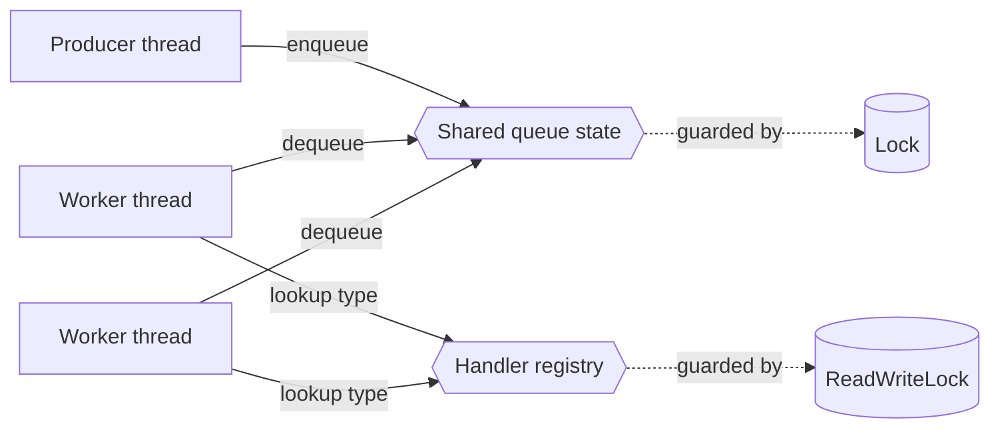
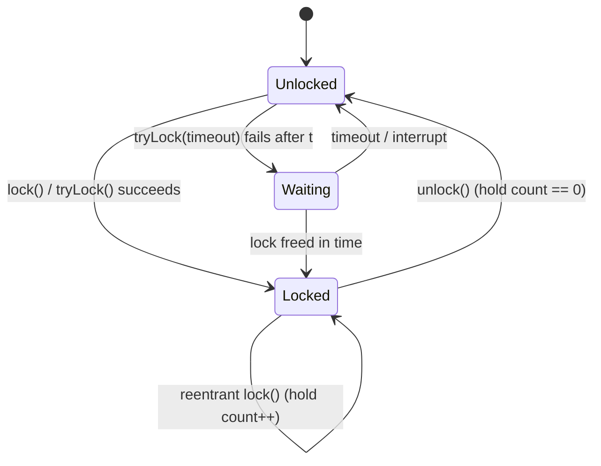
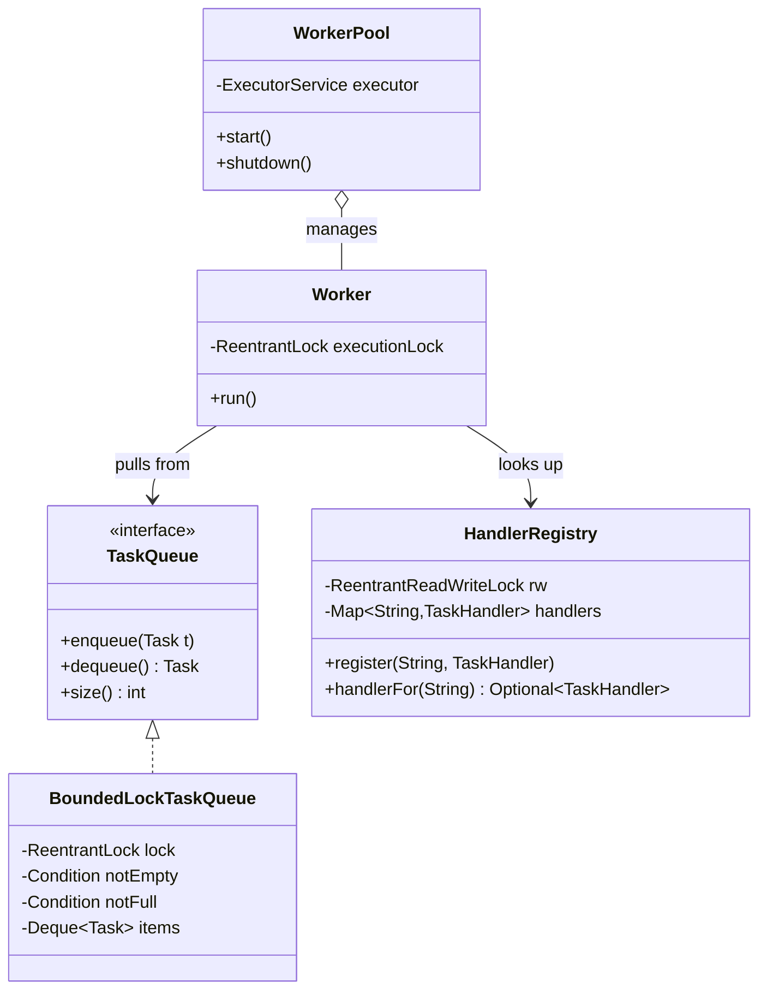
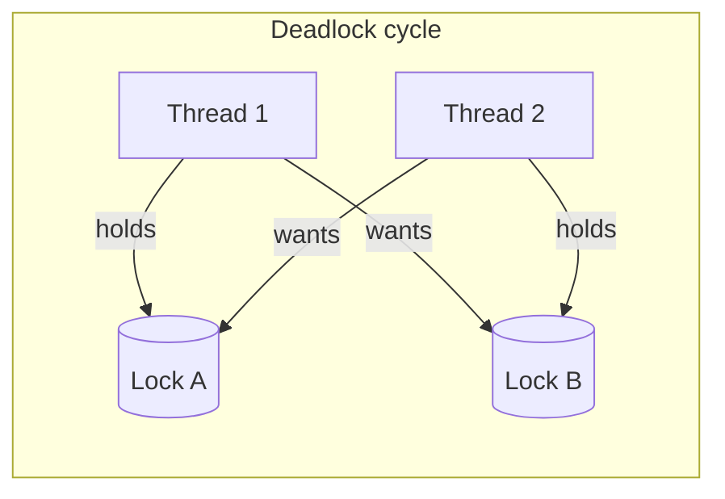

# Locks: synchronized, ReentrantLock, ReadWriteLock

> Where this fits: our worker pool, in-memory queue, and handler registry are all touched by many threads at once. Locks are how we keep their shared mutable state from corrupting under concurrency. This chapter gives us the mutual-exclusion toolbox we lean on for the rest of Phase 1 — before we hand off to lock-free atomics, [concurrent collections](./concurrent-collections.md), and [blocking queues](./blocking-queue.md).

---

## 1. Why this exists — the real problem

A lock is a tool for **mutual exclusion**: it guarantees that at most one thread executes a *critical section* at a time, and — just as importantly — it establishes a **happens-before** relationship so that writes made under the lock are visible to the next thread that takes it.

Why do we need this at all? Because on modern hardware, three things conspire against us:

1. **Non-atomic operations.** `count++` is read-modify-write: load, increment, store. Two threads can both read `5`, both write `6`, and you've lost an increment. Even a single `long` write is not guaranteed atomic on the JVM without `volatile` (it can tear into two 32-bit writes).
2. **Visibility / caching.** Each core caches values. A write by thread A may sit in A's store buffer indefinitely; thread B keeps reading a stale value. There is no guarantee B *ever* sees A's write without a memory barrier.
3. **Reordering.** The compiler and CPU reorder instructions for speed. Without synchronization, the order you wrote code is not the order another thread observes.

The Java Memory Model (JMM) ties all three together: **releasing a lock happens-before a subsequent acquire of the same lock.** Everything you wrote before the release is visible to whoever acquires next. (See [stack vs heap](../03-java-memory-model/stack-vs-heap.md) and [immutable objects](../03-java-memory-model/immutable-objects.md) for the alternative — never sharing mutable state at all.)

Historically, Java shipped with one lock primitive in 1.0: the `synchronized` keyword, backed by an **intrinsic lock** (a.k.a. monitor) present on *every* object. It was simple but rigid. Java 5 (2004) added `java.util.concurrent.locks` — `ReentrantLock`, `ReadWriteLock`, `Condition` — giving us timeouts, interruptibility, fairness, and multiple wait-sets. We use both, deliberately.

In our project, the concrete pain points are:
- A **handler registry** (`Map<String, TaskHandler>`) read on every task execution, written rarely at startup — a perfect read-heavy case.
- A naive in-memory queue's internal list, mutated by producers and consumers.
- Per-task counters and status transitions that must not interleave.



---

## 2. The naive version — and why it's broken

Here is a first-cut in-memory queue and registry with **no synchronization at all**. It compiles. It "works" in a single-threaded test. It is wrong.

```java
import java.util.*;

// BROKEN: not thread-safe
public class NaiveTaskQueue {
    private final List<Task> items = new ArrayList<>();
    private final Map<String, TaskHandler> registry = new HashMap<>();

    public void enqueue(Task t) {
        items.add(t);             // ArrayList.add is not atomic; can corrupt internal array
    }

    public Task dequeue() {
        if (items.isEmpty()) return null;  // check-then-act race
        return items.remove(0);            // two threads both pass the check, one throws
    }

    public int size() {
        return items.size();      // may read a torn size during a resize
    }

    public void register(String type, TaskHandler h) {
        registry.put(type, h);    // concurrent put can infinite-loop / lose entries
    }

    public TaskHandler handlerFor(String type) {
        return registry.get(type); // may see half-constructed map state
    }
}
```

What actually breaks:
- **`ArrayList`** resizes by allocating a new array and copying. Two concurrent `add`s can leave the array in a torn state, drop elements, or throw `ArrayIndexOutOfBoundsException`.
- **Check-then-act** (`isEmpty()` then `remove(0)`) is a classic race: both threads see one element, both call `remove(0)`, the second throws `IndexOutOfBoundsException`.
- **`HashMap.put`** under concurrency historically caused infinite loops on resize (Java 7) and still silently loses writes / produces inconsistent reads.
- **Visibility:** even reads of `size()` can return stale or torn values.

This is not a "rare flaky test" problem. Under a real worker pool of 8 threads it fails within milliseconds.

---

## 3. Improved version — `synchronized`

The smallest correct fix: guard every access with the object's **intrinsic lock** using `synchronized`. The lock is *reentrant* (a thread already holding it can re-acquire it), and exiting a `synchronized` block always releases it — even on exception.

```java
import java.util.*;

public class SynchronizedTaskQueue {
    private final List<Task> items = new ArrayList<>();
    private final Map<String, TaskHandler> registry = new HashMap<>();

    public synchronized void enqueue(Task t) {   // locks on 'this'
        items.add(t);
    }

    public synchronized Task dequeue() {
        return items.isEmpty() ? null : items.remove(0);
    }

    public synchronized int size() {
        return items.size();
    }

    public synchronized void register(String type, TaskHandler h) {
        registry.put(type, h);
    }

    public synchronized TaskHandler handlerFor(String type) {
        return registry.get(type);
    }
}
```

`synchronized void m()` is shorthand for `synchronized (this) { ... }`. A `static synchronized` method locks on the **`Class` object**, not an instance.

What we fixed: every critical section now runs under one lock, so operations are atomic relative to each other, and the release→acquire edge gives us visibility. What we did **not** fix:
- **One lock for everything.** The queue and the registry share `this`. A worker looking up a handler blocks a producer enqueuing — unrelated operations contend.
- **Reads block reads.** Two threads just *reading* `size()` or `handlerFor` serialize, even though concurrent reads are safe.
- **No timeout, no interruptibility.** If a critical section hangs, callers wait forever; you cannot bail out.

> **Pitfall:** never `synchronized` on a field you reassign, on a boxed `Integer`/`String` (interned, shared globally), or on `this` when the class is exposed publicly (callers could lock on your instance and deadlock you). Prefer a **private final lock object**: `private final Object lock = new Object();`.

---

## 4. Production-quality version — `ReentrantLock` + `ReadWriteLock` + `Condition`

A staff engineer separates concerns:
- The **queue** needs *blocking* dequeue (wait when empty) and *bounded* enqueue (wait when full) — a job for a `Condition` (or just use a `BlockingQueue`; we build it by hand here to learn the primitive).
- The **registry** is read-mostly: a `ReentrantReadWriteLock` lets many readers proceed in parallel and only blocks them when a write happens.

```java
import java.util.*;
import java.util.concurrent.locks.*;

/** Bounded, blocking, hand-built queue using an explicit lock + conditions. */
public final class BoundedLockTaskQueue implements TaskQueue {
    private final Deque<Task> items = new ArrayDeque<>();
    private final int capacity;

    private final ReentrantLock lock = new ReentrantLock();      // non-fair by default
    private final Condition notEmpty = lock.newCondition();
    private final Condition notFull  = lock.newCondition();

    public BoundedLockTaskQueue(int capacity) {
        if (capacity <= 0) throw new IllegalArgumentException("capacity > 0");
        this.capacity = capacity;
    }

    @Override
    public void enqueue(Task t) {
        Objects.requireNonNull(t);
        lock.lock();
        try {
            while (items.size() == capacity) {
                notFull.await();                 // releases lock, waits, re-acquires
            }
            items.addLast(t);
            notEmpty.signal();                   // wake one waiting consumer
        } catch (InterruptedException e) {
            Thread.currentThread().interrupt();  // restore the flag
            throw new RuntimeException("enqueue interrupted", e);
        } finally {
            lock.unlock();                       // ALWAYS in finally
        }
    }

    @Override
    public Task dequeue() throws InterruptedException {
        lock.lock();
        try {
            while (items.isEmpty()) {
                notEmpty.await();
            }
            Task t = items.removeFirst();
            notFull.signal();
            return t;
        } finally {
            lock.unlock();
        }
    }

    @Override
    public int size() {
        lock.lock();
        try { return items.size(); }
        finally { lock.unlock(); }
    }
}
```

Two rules that matter:
1. **Always wait in a `while` loop, never an `if`.** A thread can wake up *spuriously*, or another thread may have stolen the slot between `signal()` and your re-acquire. Re-check the condition after waking.
2. **`unlock()` lives in `finally`.** Unlike `synchronized`, explicit locks are *not* auto-released. Forget the `finally` and an exception leaks the lock forever — every other thread hangs.

And the read-mostly registry:

```java
import java.util.*;
import java.util.concurrent.locks.*;

public final class HandlerRegistry {
    private final Map<String, TaskHandler> handlers = new HashMap<>();
    private final ReadWriteLock rw = new ReentrantReadWriteLock();
    private final Lock read  = rw.readLock();
    private final Lock write = rw.writeLock();

    public void register(String type, TaskHandler h) {
        write.lock();
        try { handlers.put(type, h); }
        finally { write.unlock(); }
    }

    public Optional<TaskHandler> handlerFor(String type) {
        read.lock();                       // many readers concurrently
        try { return Optional.ofNullable(handlers.get(type)); }
        finally { read.unlock(); }
    }
}
```

> In real production, a read-mostly map is often better served by `ConcurrentHashMap` or a `CopyOnWriteArrayList` (see [concurrent collections](./concurrent-collections.md)), which avoid lock contention entirely on reads. We use `ReadWriteLock` here when the read critical section must be compound (read several entries consistently) and you genuinely want reader parallelism with exclusive writes.

---

## 5. `tryLock`, timeouts, fairness, and interruptibility

`ReentrantLock` gives you knobs `synchronized` cannot:

```java
import java.util.concurrent.TimeUnit;
import java.util.concurrent.locks.ReentrantLock;

ReentrantLock lock = new ReentrantLock();

// 1) Non-blocking attempt — back off instead of waiting forever.
if (lock.tryLock()) {
    try { /* critical section */ }
    finally { lock.unlock(); }
} else {
    // do something else, or report contention as a metric
}

// 2) Bounded wait — fail fast, surface as a 503 / shed load.
if (lock.tryLock(50, TimeUnit.MILLISECONDS)) {   // throws InterruptedException
    try { /* ... */ } finally { lock.unlock(); }
} else {
    throw new IllegalStateException("lock contended for 50ms; backpressure");
}

// 3) Interruptible — let a shutdown signal cancel a waiting thread.
lock.lockInterruptibly();   // throws InterruptedException if interrupted while waiting
try { /* ... */ } finally { lock.unlock(); }
```

| Capability | `synchronized` | `ReentrantLock` |
|---|---|---|
| Acquire | implicit, block-scoped | explicit `lock()` / `unlock()` |
| Auto-release on exception | yes | only if you use `finally` |
| `tryLock()` (non-blocking) | no | yes |
| Timed acquire | no | yes |
| Interruptible acquire | no (`lockInterruptibly`) | yes |
| Fairness option | no (intrinsically unfair) | yes (`new ReentrantLock(true)`) |
| Multiple condition wait-sets | one per object | many via `newCondition()` |
| JVM-optimized (biased/lightweight) | yes, very | good, but more overhead |

**Fairness.** `new ReentrantLock(true)` grants the lock in FIFO order, preventing starvation but costing throughput (often 2-10x slower under contention) because it disables barging. Default (non-fair) lets a thread that's already running "barge" past the queue — higher throughput, possible starvation. **Default to non-fair**; use fair only when you measure starvation hurting latency tails.



---

## 6. Code walkthrough — three levels

**Beginner — a thread-safe attempt counter on a Task processor.** The whole point: `count++` is not atomic, so we guard it.

```java
public class TaskAttemptCounter {
    private final Object lock = new Object();   // private, final, dedicated
    private long totalAttempts = 0;

    public void recordAttempt() {
        synchronized (lock) {
            totalAttempts++;                    // read-modify-write, now atomic
        }
    }

    public long total() {
        synchronized (lock) {
            return totalAttempts;               // lock on read too, for visibility
        }
    }
}
```

> Reading under the same lock matters: without it, a reader might never see the latest write. For a single counter you'd reach for `AtomicLong` instead — see [atomics and thread safety](./atomics-and-thread-safety.md). We use the lock here to make the visibility rule explicit.

**Intermediate — status transition guard.** A `Task` must move PENDING → RUNNING → SUCCEEDED/FAILED without two workers grabbing the same task. We use `tryLock` so a worker that loses the race moves on rather than blocking.

```java
import java.util.concurrent.locks.ReentrantLock;

public class GuardedTask {
    private final ReentrantLock lock = new ReentrantLock();
    private TaskStatus status = TaskStatus.PENDING;

    /** Returns true if THIS worker claimed the task. */
    public boolean claimForRunning() {
        if (!lock.tryLock()) return false;       // someone else is transitioning it
        try {
            if (status != TaskStatus.PENDING && status != TaskStatus.RETRYING) {
                return false;                    // already taken / done
            }
            status = TaskStatus.RUNNING;
            return true;
        } finally {
            lock.unlock();
        }
    }

    public void complete(boolean success) {
        lock.lock();
        try {
            status = success ? TaskStatus.SUCCEEDED : TaskStatus.FAILED;
        } finally {
            lock.unlock();
        }
    }

    public TaskStatus status() {
        lock.lock();
        try { return status; }
        finally { lock.unlock(); }
    }
}
```

**Production-inspired — a `Worker` that respects shutdown via interruptible, timed locking and clean lock discipline.** This is the shape we run in Phase 1.

```java
import java.util.concurrent.TimeUnit;
import java.util.concurrent.locks.ReentrantLock;

public final class Worker implements Runnable {
    private final TaskQueue queue;
    private final HandlerRegistry registry;
    private final MetricsCollector metrics;
    private final ReentrantLock executionLock = new ReentrantLock();

    public Worker(TaskQueue queue, HandlerRegistry registry, MetricsCollector metrics) {
        this.queue = queue;
        this.registry = registry;
        this.metrics = metrics;
    }

    @Override
    public void run() {
        while (!Thread.currentThread().isInterrupted()) {
            try {
                Task task = queue.dequeue();              // blocks until work or interrupt
                process(task);
            } catch (InterruptedException e) {
                Thread.currentThread().interrupt();       // honor shutdown, exit loop
                break;
            }
        }
    }

    private void process(Task task) {
        // Serialize side-effecting bookkeeping for this worker, but fail fast if contended.
        boolean acquired = false;
        try {
            acquired = executionLock.tryLock(100, TimeUnit.MILLISECONDS);
            if (!acquired) {
                metrics.incrementCounter("worker.lock.contended");
                return;
            }
            TaskHandler handler = registry.handlerFor(task.type())
                    .orElseThrow(() -> new IllegalStateException("no handler: " + task.type()));
            TaskResult result = handler.handle(task);
            metrics.incrementCounter(result.success() ? "task.succeeded" : "task.failed");
        } catch (InterruptedException e) {
            Thread.currentThread().interrupt();
        } catch (Exception e) {
            metrics.incrementCounter("task.error");
        } finally {
            if (acquired) executionLock.unlock();
        }
    }
}
```

Note the discipline: `acquired` is set *before* the work, checked in `finally`, so we never `unlock()` a lock we didn't take (which throws `IllegalMonitorStateException`).

---

## 7. How this applies to our Task Queue project

| Canonical type | Shared state | Lock choice | Why |
|---|---|---|---|
| `InMemoryTaskQueue` | internal deque, size | `ReentrantLock` + `Condition` (or a `BlockingQueue`) | needs blocking wait/signal on empty/full |
| `HandlerRegistry` (lookup by `type`) | `Map<String, TaskHandler>` | `ReadWriteLock` or `ConcurrentHashMap` | read-mostly, written at startup |
| `Task` status transitions | `status`, `attempts` | `ReentrantLock.tryLock` | claim-once semantics; losers back off |
| `WorkerPool` lifecycle | `started`/`stopped` flags, worker list | `synchronized` or `ReentrantLock` | infrequent, simple critical sections |
| `TokenBucketRateLimiter` | token count, last-refill time | `ReentrantLock` | compound read-modify-write of two fields |
| `MetricsCollector` | counters | prefer `AtomicLong` / `LongAdder` | hot path; avoid lock contention |



---

## 8. Tradeoffs

| Dimension | `synchronized` | `ReentrantLock` | `ReadWriteLock` |
|---|---|---|---|
| Simplicity | highest (auto-release) | medium (manual `finally`) | medium |
| Throughput, low contention | excellent (biased/thin locks) | good | good |
| Throughput, read-heavy | poor (readers serialize) | poor | **excellent** |
| Timeout / interrupt / `tryLock` | none | full | full |
| Fairness control | none | optional | optional |
| Multiple condition queues | one | many | n/a directly |
| Risk of leaked lock | none | high if `finally` forgotten | high |
| Debuggability | thread dumps show monitor | `getOwner`/`getQueueLength` introspection | introspection |

**Rules of thumb:**
- Reach for `synchronized` first — it's simplest, JVM-optimized, and impossible to leak. Use it for short, uncontended critical sections.
- Upgrade to `ReentrantLock` when you need a timeout, interruptibility, `tryLock`, fairness, or multiple `Condition`s.
- Use `ReadWriteLock` only when reads vastly outnumber writes **and** the read section is non-trivial; otherwise a concurrent collection or atomic is faster and harder to get wrong.
- `ReadWriteLock` has a sharp edge: under heavy *write* load it's slower than a plain lock, and the classic `ReentrantReadWriteLock` cannot upgrade read→write (you must release the read lock first). `StampedLock` (Java 8) offers optimistic reads but is non-reentrant and easy to misuse.

---

## 9. Common mistakes and pitfalls

- **Forgetting `finally` on explicit locks.** Lock leaks freeze the whole system. Fix: every `lock()` is immediately followed by `try { } finally { unlock(); }`.
- **`unlock()` without owning the lock** → `IllegalMonitorStateException`. Fix: track an `acquired` boolean for `tryLock`, unlock only if `true`.
- **Locking on a mutable/shared/boxed object.** `synchronized (this)` exposes your lock; `synchronized (someInteger)` shares a global interned lock. Fix: `private final Object lock = new Object();`.
- **`if` instead of `while` around `await()`.** Spurious wakeups and stolen signals corrupt invariants. Fix: always re-check the condition in a loop.
- **`signal()` vs `signalAll()`.** With multiple distinct conditions on one lock, `signal()` may wake the wrong waiter. When in doubt, or when waiters await different predicates on the *same* condition, use `signalAll()`.
- **Holding a lock across slow/blocking work** (I/O, network, `handler.handle()`). Fix: copy what you need under the lock, release, then do the slow work.
- **Inconsistent lock ordering** → deadlock (next section). Fix: a global order.
- **Lock granularity too coarse** (one lock for unrelated state) kills throughput; too fine multiplies deadlock risk. Find the balance per-aggregate.
- **Calling foreign/overridable code while holding a lock** (callbacks, listeners) — they may re-enter your lock or take another, causing deadlock. Fix: invoke callbacks after releasing.

---

## 10. Deadlock, livelock, and lock ordering

### The four Coffman conditions

A deadlock can occur **only if all four** hold simultaneously. Break any one and deadlock is impossible:

1. **Mutual exclusion** — a resource is held exclusively.
2. **Hold and wait** — a thread holds one lock while waiting for another.
3. **No preemption** — locks can't be forcibly taken away.
4. **Circular wait** — a cycle of threads each waiting on the next.

The cheapest one to attack in app code is **circular wait**: impose a **global lock ordering**.

```java
// BROKEN: two transfers can deadlock when called with swapped accounts.
void transfer(Account a, Account b, long amount) {
    synchronized (a) {
        synchronized (b) {            // T1: lock A then B;  T2: lock B then A -> cycle
            a.debit(amount);
            b.credit(amount);
        }
    }
}
```

```java
// FIXED: always acquire in a consistent global order (by id).
void transfer(Account a, Account b, long amount) {
    Account first  = a.id().compareTo(b.id()) < 0 ? a : b;
    Account second = first == a ? b : a;
    synchronized (first) {
        synchronized (second) {       // every thread locks lower id first -> no cycle
            a.debit(amount);
            b.credit(amount);
        }
    }
}
```

A more robust technique uses `tryLock` with timeout and **backoff**, breaking the *hold-and-wait* condition:

```java
import java.util.concurrent.TimeUnit;
import java.util.concurrent.locks.ReentrantLock;

boolean transfer(ReentrantLock la, ReentrantLock lb, Runnable body) throws InterruptedException {
    while (true) {
        if (la.tryLock(50, TimeUnit.MILLISECONDS)) {
            try {
                if (lb.tryLock(50, TimeUnit.MILLISECONDS)) {
                    try { body.run(); return true; }
                    finally { lb.unlock(); }
                }
            } finally { la.unlock(); }   // release la if we failed to get lb
        }
        Thread.sleep((long) (Math.random() * 20));   // randomized backoff
    }
}
```



### Livelock

A **livelock** is two threads that keep *responding* to each other and making no progress — they're not blocked, they're busy being polite. Example: two people stepping aside in a hallway, repeatedly mirroring. In code, naive retry-on-conflict without randomized backoff can livelock: both threads grab lock 1, fail on lock 2, both release, both retry in lockstep, forever. The fix above — **randomized backoff** — breaks the symmetry. Livelock is sneakier than deadlock because CPU is busy and thread dumps show running threads, not blocked ones.

### Detecting these in production

- `jstack <pid>` (or a thread dump from the JVM) prints `Found one Java-level deadlock` with the cycle when intrinsic locks deadlock.
- `ThreadMXBean.findDeadlockedThreads()` does it programmatically — wire it into a health check.
- For livelock, watch CPU pegged at 100% with zero throughput; profile to find the spinning loop.

---

## 11. Refactoring exercise — bad → improved → production

**Bad: a rate limiter with a torn read-modify-write and a leaked lock path.**

```java
// BAD
public class BadRateLimiter implements RateLimiter {
    private int tokens = 10;
    private long lastRefillNanos = System.nanoTime();
    private final ReentrantLock lock = new ReentrantLock();

    public boolean tryAcquire() {
        lock.lock();
        refill();                 // if refill() throws, lock leaks: no finally!
        if (tokens > 0) {
            tokens--;
            lock.unlock();        // unlock only on this path -> leak on the else path
            return true;
        }
        return false;             // BUG: returns while still holding the lock
    }
    private void refill() { /* ... mutate tokens, lastRefillNanos ... */ }
}
```

**Improved: correct `finally`, but still coarse and not capped.**

```java
// IMPROVED
public class OkRateLimiter implements RateLimiter {
    private double tokens;
    private long lastRefillNanos;
    private final int capacity;
    private final double refillPerNano;
    private final ReentrantLock lock = new ReentrantLock();

    public OkRateLimiter(int capacity, double refillPerSecond) {
        this.capacity = capacity;
        this.tokens = capacity;
        this.refillPerNano = refillPerSecond / 1_000_000_000d;
        this.lastRefillNanos = System.nanoTime();
    }

    public boolean tryAcquire() {
        lock.lock();
        try {
            refill();
            if (tokens >= 1) { tokens -= 1; return true; }
            return false;
        } finally {
            lock.unlock();        // released on every path
        }
    }

    private void refill() {
        long now = System.nanoTime();
        double added = (now - lastRefillNanos) * refillPerNano;
        if (added > 0) {
            tokens = Math.min(capacity, tokens + added);
            lastRefillNanos = now;
        }
    }
}
```

**Production: bounded wait via `tryLock` so we never block a request thread unbounded, plus interruptibility and metrics hooks.**

```java
// PRODUCTION
import java.util.concurrent.TimeUnit;
import java.util.concurrent.locks.ReentrantLock;

public final class TokenBucketRateLimiter implements RateLimiter {
    private double tokens;
    private long lastRefillNanos;
    private final int capacity;
    private final double refillPerNano;
    private final ReentrantLock lock = new ReentrantLock();   // non-fair: throughput first

    public TokenBucketRateLimiter(int capacity, double refillPerSecond) {
        this.capacity = capacity;
        this.tokens = capacity;
        this.refillPerNano = refillPerSecond / 1_000_000_000d;
        this.lastRefillNanos = System.nanoTime();
    }

    @Override
    public boolean tryAcquire() {
        // The critical section is microseconds; if we can't get the lock in 1ms,
        // the system is pathologically contended — shed load rather than queue.
        try {
            if (!lock.tryLock(1, TimeUnit.MILLISECONDS)) return false;
        } catch (InterruptedException e) {
            Thread.currentThread().interrupt();
            return false;
        }
        try {
            refill();
            if (tokens >= 1) { tokens -= 1; return true; }
            return false;
        } finally {
            lock.unlock();
        }
    }

    private void refill() {
        long now = System.nanoTime();
        double added = (now - lastRefillNanos) * refillPerNano;
        if (added > 0) {
            tokens = Math.min(capacity, tokens + added);
            lastRefillNanos = now;
        }
    }
}
```

This is the limiter we plug into the API layer in Phase 3 (see [rate limiting](../08-distributed-systems/rate-limiting.md) for the distributed version).

---

## 12. Exercises

### Easy

**E1 (knowledge check).** What two distinct guarantees does releasing a lock provide, and which one is *not* about preventing two threads running at once?

**E2 (coding).** Implement a thread-safe `Counter` with `increment()` and `get()` using a private final lock object. No atomics allowed.

**E3 (spot the bug).** Why is `synchronized (Integer.valueOf(1))` dangerous as a lock?

### Medium

**M1 (coding).** Build a `SafeStack<T>` (`push`, `pop` that blocks when empty) using one `ReentrantLock` and one `Condition`. Use a `while` loop around `await()`.

**M2 (refactoring).** The `BadRateLimiter` from §11 leaks its lock. Rewrite `tryAcquire()` so the lock is always released, without changing the public method signature.

**M3 (design).** Our `HandlerRegistry` is read on *every* task execution but written only at startup. Argue for one of: `synchronized`, `ReadWriteLock`, `ConcurrentHashMap`. State the read/write ratio assumption that decides it.

### Hard

**H1 (deadlock).** Two methods `transferAtoB` and `transferBtoA` each lock two `ReentrantLock`s in opposite order. Demonstrate the deadlock, then fix it via global lock ordering by a comparable key.

**H2 (interview-style).** Implement a bounded blocking queue (`put`/`take`) using a single `ReentrantLock` and **two** `Condition`s. Explain why two conditions beat one, and why `signal()` is safe here while it sometimes isn't.

**H3 (stretch).** Replace the `ReadWriteLock` in `HandlerRegistry` with a `StampedLock` optimistic read. Show the optimistic read path, the validation step, and the fallback to a full read lock. Note one footgun of `StampedLock`.

---

## 13. Solutions

**E1.** Releasing a lock provides (a) **mutual exclusion** — only one thread in the critical section — and (b) a **happens-before / visibility** edge: everything written before the release is visible to the next acquirer. The visibility guarantee is *not* about preventing concurrent execution; it's about memory consistency, and it's why even reads sometimes need the lock.

**E2.**
```java
public final class Counter {
    private final Object lock = new Object();
    private long value = 0;
    public void increment() { synchronized (lock) { value++; } }
    public long get()       { synchronized (lock) { return value; } }
}
```
Reading under the lock guarantees the latest value is visible; without it a reader could see a stale cached copy.

**E3.** `Integer.valueOf(1)` returns a **cached, interned** instance shared across the whole JVM (the boxing cache covers -128..127). Unrelated code that also locks on `Integer.valueOf(1)` shares *your* lock, causing surprise contention or deadlock. Locks must be private and dedicated.

**M1.**
```java
import java.util.*;
import java.util.concurrent.locks.*;

public final class SafeStack<T> {
    private final Deque<T> items = new ArrayDeque<>();
    private final ReentrantLock lock = new ReentrantLock();
    private final Condition notEmpty = lock.newCondition();

    public void push(T item) {
        Objects.requireNonNull(item);
        lock.lock();
        try {
            items.push(item);
            notEmpty.signal();
        } finally {
            lock.unlock();
        }
    }

    public T pop() throws InterruptedException {
        lock.lock();
        try {
            while (items.isEmpty()) {      // while, not if
                notEmpty.await();
            }
            return items.pop();
        } finally {
            lock.unlock();
        }
    }
}
```

**M2.**
```java
public boolean tryAcquire() {
    lock.lock();
    try {
        refill();
        if (tokens > 0) { tokens--; return true; }
        return false;
    } finally {
        lock.unlock();
    }
}
```
The single `try/finally` makes the unlock unconditional and covers the exception path through `refill()`.

**M3.** With a read/write ratio in the millions-to-one (read on every execution, write only at startup), the contending question is reader parallelism. `synchronized` serializes readers — wrong for a hot path. `ReadWriteLock` lets readers run in parallel but still has acquire/release overhead and writer-starvation considerations. **`ConcurrentHashMap` wins** here: lock-free reads, no per-read lock acquisition, and our reads are single-key `get`s (no need for a compound consistent snapshot). Choose `ReadWriteLock` only if a read must consistently observe *several* entries together. Threshold: if writes ever become frequent (say > a few percent), re-measure — `ReadWriteLock` degrades and a plain lock may win.

**H1.**
```java
import java.util.concurrent.locks.ReentrantLock;

class Account {
    final String id;
    final ReentrantLock lock = new ReentrantLock();
    long balance;
    Account(String id, long balance) { this.id = id; this.balance = balance; }
}

// Deadlocks: caller order determines lock order.
void unsafeTransfer(Account from, Account to, long amt) {
    from.lock.lock();
    try {
        to.lock.lock();                 // T1: A->B, T2: B->A  => cycle
        try { from.balance -= amt; to.balance += amt; }
        finally { to.lock.unlock(); }
    } finally { from.lock.unlock(); }
}

// Fixed: order locks by a stable comparable key.
void safeTransfer(Account from, Account to, long amt) {
    Account first  = from.id.compareTo(to.id) < 0 ? from : to;
    Account second = (first == from) ? to : from;
    first.lock.lock();
    try {
        second.lock.lock();
        try { from.balance -= amt; to.balance += amt; }
        finally { second.lock.unlock(); }
    } finally { first.lock.unlock(); }
}
```
Every thread now acquires the lower-id lock first, so no circular wait can form (we broke Coffman condition 4). (Guard against `from.id.equals(to.id)` separately if self-transfer is possible.)

**H2.**
```java
import java.util.*;
import java.util.concurrent.locks.*;

public final class BoundedBlockingQueue<T> {
    private final Object[] buf;
    private int head, tail, count;
    private final ReentrantLock lock = new ReentrantLock();
    private final Condition notFull  = lock.newCondition();
    private final Condition notEmpty = lock.newCondition();

    public BoundedBlockingQueue(int capacity) { buf = new Object[capacity]; }

    public void put(T x) throws InterruptedException {
        lock.lock();
        try {
            while (count == buf.length) notFull.await();
            buf[tail] = x;
            tail = (tail + 1) % buf.length;
            count++;
            notEmpty.signal();          // wake exactly one consumer
        } finally { lock.unlock(); }
    }

    @SuppressWarnings("unchecked")
    public T take() throws InterruptedException {
        lock.lock();
        try {
            while (count == 0) notEmpty.await();
            T x = (T) buf[head];
            buf[head] = null;
            head = (head + 1) % buf.length;
            count--;
            notFull.signal();           // wake exactly one producer
            return x;
        } finally { lock.unlock(); }
    }
}
```
**Why two conditions:** producers wait on `notFull`, consumers on `notEmpty`. With a *single* condition you'd have to `signalAll()` and wake everyone (including threads that can't proceed) — a "thundering herd". Two conditions let you `signal()` exactly the kind of thread that can make progress. **Why `signal()` is safe here:** every waiter on `notEmpty` is waiting for the *same* predicate (`count > 0`), so waking any one is correct. `signal()` is unsafe when waiters on one condition await *different* predicates — then the woken one may not be the one that can proceed, and the others never get re-signaled. (This is exactly `ArrayBlockingQueue`'s design.)

**H3.**
```java
import java.util.*;
import java.util.concurrent.locks.StampedLock;

public final class StampedHandlerRegistry {
    private final Map<String, TaskHandler> handlers = new HashMap<>();
    private final StampedLock sl = new StampedLock();

    public void register(String type, TaskHandler h) {
        long stamp = sl.writeLock();
        try { handlers.put(type, h); }
        finally { sl.unlockWrite(stamp); }
    }

    public Optional<TaskHandler> handlerFor(String type) {
        long stamp = sl.tryOptimisticRead();           // no lock acquired; just a version
        TaskHandler h = handlers.get(type);            // read without locking
        if (!sl.validate(stamp)) {                     // a writer intervened?
            stamp = sl.readLock();                     // fall back to a real read lock
            try { h = handlers.get(type); }
            finally { sl.unlockRead(stamp); }
        }
        return Optional.ofNullable(h);
    }
}
```
Optimistic reads avoid acquiring any lock when there's no concurrent writer — near-free reads. **Footgun:** `StampedLock` is **not reentrant** and does **not** support `Condition`; re-entering or calling `unlockRead` with a write stamp throws or corrupts state. Also, the optimistic read body must not dereference shared mutable structure unsafely (here a single `get` on a `HashMap` is fine because we re-validate, but reading *through* an inconsistent structure could see a torn `HashMap` mid-resize — keep optimistic bodies tiny and side-effect-free).

---

## 14. Interview questions and takeaways

1. **What does `synchronized` guarantee beyond mutual exclusion?** A happens-before edge: writes before the monitor release are visible after a subsequent acquire of the same monitor. It's both an exclusion and a memory-visibility tool.

2. **`synchronized` vs `ReentrantLock` — when pick which?** Default to `synchronized` (simpler, auto-released, JVM-optimized). Switch to `ReentrantLock` for timeouts, `tryLock`, interruptibility, fairness, or multiple `Condition` wait-sets.

3. **What is reentrancy and why does it matter?** A thread already holding a lock can re-acquire it without deadlocking itself; the lock tracks a hold count. Matters when a synchronized method calls another synchronized method on the same object — without reentrancy, that self-deadlocks.

4. **Why must you wait in a `while`, not an `if`?** Spurious wakeups and stolen signals: between `signal()` and your re-acquiring the lock, another thread may invalidate the condition. Re-check after waking.

5. **Explain fairness in `ReentrantLock`.** Fair mode grants the lock FIFO, preventing starvation at a throughput cost (no barging). Non-fair (default) allows barging — higher throughput, possible starvation.

6. **Name the four conditions for deadlock and the cheapest to break.** Mutual exclusion, hold-and-wait, no preemption, circular wait. In app code, break **circular wait** with a global lock ordering; or break **hold-and-wait** with `tryLock` + backoff.

7. **Deadlock vs livelock?** Deadlock: threads blocked forever in a cycle (CPU idle). Livelock: threads actively running, repeatedly reacting to each other, making no progress (CPU busy). Fix livelock with randomized backoff.

8. **When is `ReadWriteLock` the wrong choice?** Under frequent writes (it degrades below a plain lock), for trivial single-key reads (a `ConcurrentHashMap`/atomic is faster), or when you need read→write upgrade (classic `ReentrantReadWriteLock` can't).

9. **Why prefer a private final lock object over `this`?** Encapsulation: external code can `synchronized (yourInstance)` and interfere with or deadlock your internal locking. A private lock can't be acquired by anyone else.

10. **How do you detect a deadlock in a running JVM?** `jstack`/thread dump reports the cycle; programmatically, `ThreadMXBean.findDeadlockedThreads()` wired into a health endpoint.

**Takeaways:** Locks buy correctness, not speed — every lock is a serialization point. Hold them for the shortest possible span, never across I/O, always release in `finally`, and pick the *weakest* tool that's correct (atomic < concurrent collection < lock).

---

## 15. Production considerations

- **Contention is the silent killer.** A correct-but-coarse lock turns an 8-core box into a 1-core box under load. Measure lock hold time and contention (`ReentrantLock` exposes `getQueueLength`, `isLocked`, `getHoldCount`; async-profiler has a lock profile). Export contention as a metric.
- **Never hold a lock across blocking calls.** `handler.handle(task)` may do network I/O for seconds. Holding the registry or queue lock through it stalls every worker. Snapshot under the lock, release, then call out.
- **Lock + thread dump hygiene.** Name your threads (`worker-3`) so deadlock dumps are readable. Wire `ThreadMXBean.findDeadlockedThreads()` into a liveness probe; a deadlocked pool should fail the probe and get restarted.
- **Fairness and tail latency.** Non-fair locks can starve a thread for seconds, inflating p99. If a single unlucky task type sees huge tail latency, a fair lock (or a fair queue) may be the fix — at throughput cost. Decide with data.
- **Virtual threads (Loom).** Java 21 virtual threads work with locks, but a thread *pinned* inside a `synchronized` block holding the carrier thread used to hurt scalability under heavy blocking. Prefer `ReentrantLock` over `synchronized` in code that runs on virtual threads and may block, so the carrier can be released. (See [threads](./threads.md).)
- **Lock leaks are catastrophic, not flaky.** A single missing `finally` deadlocks the system permanently. Code review and static analysis (SpotBugs `UL_UNRELEASED_LOCK`) should gate this.
- **Prefer not to lock at all.** For counters use `LongAdder`; for maps use `ConcurrentHashMap`; for queues use `BlockingQueue`. Reserve hand-rolled locks for genuinely compound invariants. See [atomics and thread safety](./atomics-and-thread-safety.md) and [concurrent collections](./concurrent-collections.md).

---

## What We Can Improve In Our Project Using This Concept

Right now (Phase 1) our `InMemoryTaskQueue` and `HandlerRegistry` may be relying on either no synchronization or a single coarse `synchronized` block. We can: (1) back the queue with a proper `BlockingQueue` or our `BoundedLockTaskQueue` so `dequeue()` blocks correctly and producers respect capacity (backpressure); (2) move the read-mostly `HandlerRegistry` to `ConcurrentHashMap` for lock-free lookups on the hot path; (3) give `Task` claim-once semantics via `tryLock` so two workers can never run the same task; (4) make the `TokenBucketRateLimiter` use a bounded `tryLock` so a contended limiter sheds load instead of blocking request threads.

## Project Refactoring Task

Replace the `HandlerRegistry`'s `synchronized` map with a `ConcurrentHashMap`, and refactor `InMemoryTaskQueue` to implement `TaskQueue` over a `LinkedBlockingQueue` (capacity-bounded). Add a `claimForRunning()` guard to `Task` using `ReentrantLock.tryLock`. Add a `WorkerPool` shutdown path that interrupts workers so their `dequeue()` unblocks cleanly. Add a JUnit 5 + AssertJ test that launches 8 workers against a shared queue and asserts no task is processed twice and `size()` returns to zero.

## Git Commit For This Chapter

```text
feat(concurrency): introduce lock-based thread safety for queue and registry

- Add BoundedLockTaskQueue (ReentrantLock + notEmpty/notFull Conditions)
- Move HandlerRegistry to ReadWriteLock / ConcurrentHashMap for read-mostly lookups
- Add Task.claimForRunning() claim-once guard via ReentrantLock.tryLock
- Bound TokenBucketRateLimiter acquisition with tryLock(1, MILLISECONDS)
- Enforce global lock ordering in multi-lock paths; add deadlock health check

Files: src/main/java/queue/BoundedLockTaskQueue.java,
       src/main/java/registry/HandlerRegistry.java,
       src/main/java/model/Task.java,
       src/main/java/ratelimit/TokenBucketRateLimiter.java,
       src/test/java/queue/ConcurrentWorkerTest.java
```

## Architecture Impact

Locks define our thread-safety boundaries within a single JVM (Phase 1-3). They are an *in-process* primitive: as we scale horizontally in Phase 4, intra-JVM locks no longer coordinate across nodes, and we graduate to **distributed locks** (Redis/Zookeeper-based) — see [distributed locks](../08-distributed-systems/distributed-locks.md). Getting lock discipline right now (short critical sections, no I/O under lock, consistent ordering) is what lets us later swap the in-memory queue for a [message broker](../07-queues-and-messaging/message-queues.md) without rethinking correctness.

## Interview Takeaways

- A lock provides both mutual exclusion and a happens-before visibility edge; reads sometimes need the lock too.
- Default to `synchronized`; reach for `ReentrantLock` only when you need timeout, `tryLock`, interrupt, fairness, or multiple conditions.
- Always `unlock()` in `finally`; always `await()` in a `while`.
- Deadlock needs all four Coffman conditions — break circular wait with global lock ordering, or hold-and-wait with `tryLock` + randomized backoff.
- Prefer atomics and concurrent collections over hand-rolled locks; locks serialize and serialization caps scalability.
