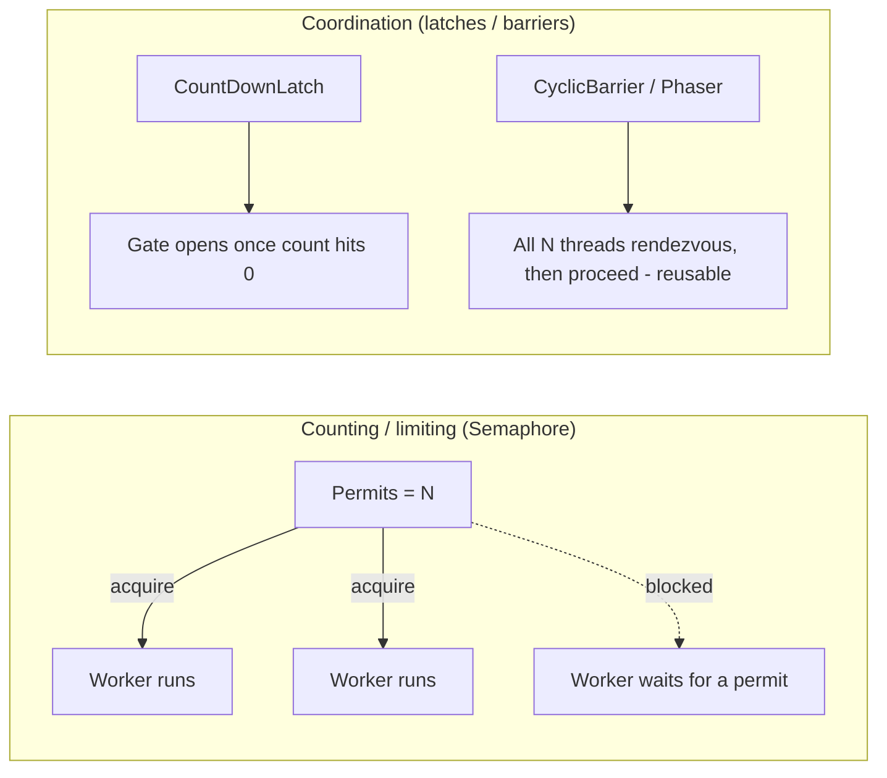
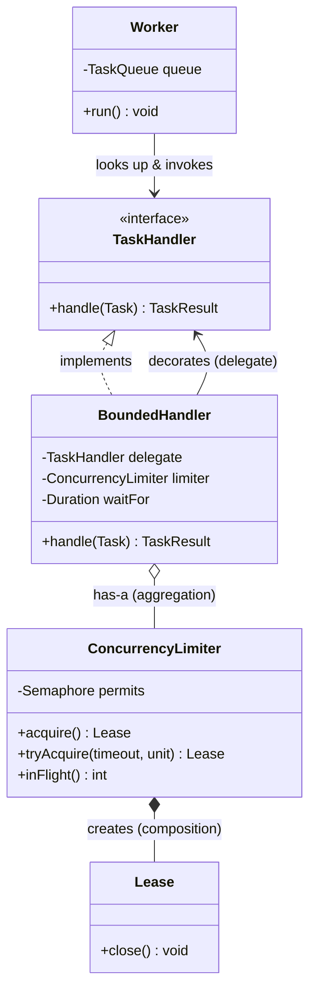

# Semaphores and Coordination

> Where this fits: this is the sixth chapter of **Phase 1 concurrency**. Our `WorkerPool` can now run many `Worker`s in parallel (see [threads.md](./threads.md) and [executor-service.md](./executor-service.md)). But "many" is not "unbounded": every worker that calls a downstream API, opens a DB connection, or holds a file handle consumes a *bounded* resource. This chapter is about **counting** — letting at most N things happen at once — and about **coordination** — making threads wait for each other at well-defined points. The four tools are `Semaphore`, `CountDownLatch`, `CyclicBarrier`, and `Phaser`. We will build a real concurrency limiter for our task handlers with them.

---

## 1. Why this exists — the real problem it solves

A [lock](./locks.md) (or `synchronized`) enforces a count of **one**: exactly one thread in the critical section. That is the right tool when the invariant is "this data structure must be mutated by one thread at a time."

But many production constraints are not "one" — they are "at most N":

- Our PostgreSQL pool (Phase 2) has, say, **20** connections. If 200 workers all call `repository.save(task)` at once, 180 of them block inside the JDBC driver — or worse, the driver throws `SQLTransientConnectionException: connection is not available`. We want at most 20 in-flight DB calls.
- A downstream payment API allows **50** concurrent requests per client; exceed it and you get HTTP 429 and a throttling penalty.
- A task type that decodes video holds ~500 MB of heap each. With 8 GB of headroom you can safely run **~12** of them concurrently, no matter how many CPUs you have.

None of these is a mutual-exclusion problem. They are **bounded-resource** problems, and the classic primitive for them is the **counting semaphore**, invented by Edsger Dijkstra in 1965 (his original operations were `P` — *proberen*, "to test", acquire — and `V` — *verhogen*, "to increment", release). A semaphore holds an integer count of available *permits*. `acquire()` blocks until a permit is free, then decrements; `release()` increments and wakes a waiter. A semaphore initialized with 1 permit is a (non-reentrant) mutex; with N permits it is a concurrency limiter.

Separately, we frequently need threads to **rendezvous** — to agree "everyone has reached this point, now proceed." Examples in our platform:

- On startup, the main thread must not accept API traffic until **all** worker threads have warmed up and registered their handlers. That's a **`CountDownLatch`**: wait for N one-time events to complete.
- A parallel batch job splits 1,000 tasks across 8 threads, and each thread must finish *phase A* (validation) before *any* thread starts *phase B* (execution), repeatedly. That's a **`CyclicBarrier`** or a **`Phaser`**: a reusable meeting point.



The mental model: **a semaphore counts permits across threads; a latch counts down to a one-time gate; a barrier counts threads into a reusable rendezvous.**

---

## 2. The naive version — hand-rolling a limiter with `synchronized`

Suppose we want at most 20 concurrent DB writes. A learner new to Java often reaches for a shared counter guarded by `synchronized` and a busy-wait:

```java
// BAD: hand-rolled concurrency limiter. Do not ship this.
public final class HomemadeLimiter {
    private int inFlight = 0;
    private final int max;

    public HomemadeLimiter(int max) { this.max = max; }

    public synchronized void acquire() {
        // Spin until there is room. This burns a CPU core doing nothing.
        while (inFlight >= max) {
            // We hold the monitor here, so NO other thread can ever call
            // release() either -> classic self-inflicted deadlock.
        }
        inFlight++;
    }

    public synchronized void release() {
        inFlight--;
    }
}
```

Problems, in order of severity:

1. **Deadlock.** `acquire()` spins *while holding the monitor*. `release()` is also `synchronized`, so it can never enter. The first thread that has to wait freezes the whole limiter forever.
2. **Busy-waiting wastes CPU.** Even if we fixed the deadlock by spinning outside the lock, a spin loop pegs a core at 100% doing no work.
3. **No fairness, no timeout, no interruptibility.** A waiting thread cannot be told "give up after 2 seconds" or "you've been interrupted, abort."
4. **Leaks on exception.** Callers must remember to call `release()` in a `finally`. Nothing enforces it.

We could fix the deadlock with `wait()`/`notify()`:

```java
// Less bad, but still hand-rolled and easy to get subtly wrong.
public final class WaitNotifyLimiter {
    private int inFlight = 0;
    private final int max;
    public WaitNotifyLimiter(int max) { this.max = max; }

    public synchronized void acquire() throws InterruptedException {
        while (inFlight >= max) {
            wait();              // releases the monitor, parks the thread
        }
        inFlight++;
    }

    public synchronized void release() {
        inFlight--;
        notify();                // wake one waiter
    }
}
```

This is correct-ish, but it is exactly the code that `java.util.concurrent.Semaphore` already gives you — battle-tested, with fairness modes, timeouts, interruptibility, and `tryAcquire`. **Reinventing it is a code smell.** Use the library.

---

## 3. Improved version — `java.util.concurrent.Semaphore`

`Semaphore` does all of the above correctly. The canonical pattern is **acquire, work in `try`, release in `finally`**:

```java
import java.util.concurrent.Semaphore;

public final class DbCallLimiter {
    private final Semaphore permits;

    public DbCallLimiter(int maxConcurrent) {
        this.permits = new Semaphore(maxConcurrent);
    }

    public <T> T limited(java.util.concurrent.Callable<T> dbCall) throws Exception {
        permits.acquire();            // blocks if all permits are taken
        try {
            return dbCall.call();
        } finally {
            permits.release();        // ALWAYS release, even on exception
        }
    }
}
```

This is already a usable concurrency limiter. The `finally` guarantees the permit goes back even if the DB call throws — the single most important rule with semaphores.

Two refinements production code almost always wants:

**Timeouts** — never block forever. If you can't get a permit in 2 seconds, fail fast and shed load (this is [backpressure](../08-distributed-systems/backpressure.md)):

```java
import java.util.concurrent.TimeUnit;

if (!permits.tryAcquire(2, TimeUnit.SECONDS)) {
    throw new ResourceExhaustedException("DB limiter saturated; shedding load");
}
try {
    return dbCall.call();
} finally {
    permits.release();
}
```

**Non-blocking probe** — `tryAcquire()` with no timeout returns immediately. This is exactly the shape of our canonical `RateLimiter.tryAcquire()` interface, which we revisit in [rate-limiting.md](../08-distributed-systems/rate-limiting.md). Note the difference, though: a semaphore limits **concurrency** (how many at once); a token bucket limits **rate** (how many per second). They are complementary, not interchangeable.

---

## 4. Production-quality version — a reusable `ConcurrencyLimiter`

A staff engineer ships a limiter that is (a) generic, (b) leak-proof via `AutoCloseable` so callers can use try-with-resources, (c) observable, and (d) configured with a **fair** semaphore when starvation matters.

```java
package com.taskqueue.concurrency;

import java.util.concurrent.Semaphore;
import java.util.concurrent.TimeUnit;
import java.util.concurrent.atomic.LongAdder;

/**
 * Bounds the number of concurrent operations to {@code maxConcurrency}.
 * Acquire returns an AutoCloseable "lease"; closing it releases the permit,
 * so callers cannot forget to release when they use try-with-resources.
 */
public final class ConcurrencyLimiter {

    /** A held permit. Closing it returns the permit exactly once. */
    public final class Lease implements AutoCloseable {
        private boolean released = false;
        @Override public void close() {
            if (!released) {        // idempotent: double-close must not over-release
                released = true;
                permits.release();
                inUse.decrement();
            }
        }
    }

    private final Semaphore permits;
    private final LongAdder inUse = new LongAdder();   // for a gauge
    private final LongAdder rejected = new LongAdder();
    private final int max;

    public ConcurrencyLimiter(int maxConcurrency, boolean fair) {
        if (maxConcurrency < 1) throw new IllegalArgumentException("max >= 1");
        this.max = maxConcurrency;
        this.permits = new Semaphore(maxConcurrency, fair);
    }

    /** Blocks (interruptibly) until a permit is free, then returns a Lease. */
    public Lease acquire() throws InterruptedException {
        permits.acquire();
        inUse.increment();
        return new Lease();
    }

    /** Returns a Lease, or null if no permit became free within the timeout. */
    public Lease tryAcquire(long timeout, TimeUnit unit) throws InterruptedException {
        if (!permits.tryAcquire(timeout, unit)) {
            rejected.increment();
            return null;
        }
        inUse.increment();
        return new Lease();
    }

    public int inFlight()       { return inUse.intValue(); }
    public int available()      { return permits.availablePermits(); }
    public long rejectedCount() { return rejected.sum(); }
    public int capacity()       { return max; }
}
```

Usage is now leak-proof and reads cleanly:

```java
ConcurrencyLimiter dbLimiter = new ConcurrencyLimiter(20, /*fair=*/true);

// at most 20 of these run concurrently, no matter how many workers call it:
try (var lease = dbLimiter.acquire()) {     // lease auto-released
    repository.save(task);
}                                            // permit returned here, even on throw
```

Why **fair** for a DB limiter? An unfair semaphore (the default) is barge-friendly: a thread calling `acquire()` may jump ahead of threads already queued, which maximizes throughput but can **starve** an unlucky worker indefinitely under sustained load. For latency-sensitive, per-task work where every task must eventually run, fairness (FIFO grant order) trades a little throughput for a bounded wait. For pure throughput maximization (background batch crunching), leave it unfair.

> **Callout — permits are not owned.** Unlike a `ReentrantLock`, a semaphore permit has *no owning thread*. Thread A can `acquire()` and thread B can `release()`. This is a feature (it lets you model resource handoff) and a footgun (release-without-acquire silently inflates the permit count). The `Lease` pattern above closes that hole.

---

## 5. Code walkthrough — beginner, intermediate, production

### 5.1 Beginner — the simplest possible semaphore

Three permits, five threads racing for them. Watch at most three run at once.

```java
import java.util.concurrent.Semaphore;

public class SemaphoreBasics {
    static final Semaphore SEATS = new Semaphore(3);   // 3 seats in the room

    public static void main(String[] args) {
        for (int i = 1; i <= 5; i++) {
            int person = i;
            new Thread(() -> {
                try {
                    SEATS.acquire();
                    System.out.println("Person " + person + " sat down. Free seats: "
                            + SEATS.availablePermits());
                    Thread.sleep(500);                  // pretend to work
                    System.out.println("Person " + person + " left.");
                } catch (InterruptedException e) {
                    Thread.currentThread().interrupt();
                } finally {
                    SEATS.release();                    // give the seat back
                }
            }).start();
        }
    }
}
```

Output (order varies, but never more than 3 seated at once):

```text
Person 1 sat down. Free seats: 2
Person 2 sat down. Free seats: 1
Person 3 sat down. Free seats: 0
Person 1 left.
Person 4 sat down. Free seats: 0
...
```

### 5.2 Intermediate — `CountDownLatch`, `CyclicBarrier`, and `Phaser`

**`CountDownLatch` — wait for a one-time set of events.** The count only goes down; once it hits zero, the gate is open forever. Use it for "wait until startup is done" or "wait until N parallel sub-tasks finish."

```java
import java.util.concurrent.CountDownLatch;

public class StartupGate {
    public static void main(String[] args) throws InterruptedException {
        int workerCount = 4;
        CountDownLatch warmedUp = new CountDownLatch(workerCount);

        for (int i = 0; i < workerCount; i++) {
            int id = i;
            new Thread(() -> {
                warmUpCaches(id);              // load handler registry, JIT, etc.
                warmedUp.countDown();          // "I'm ready" -> count 4->3->2->1->0
            }).start();
        }

        warmedUp.await();                       // main thread blocks until count == 0
        System.out.println("All workers warm. Opening the API for traffic.");
    }

    static void warmUpCaches(int id) {
        try { Thread.sleep(100L * (id + 1)); } catch (InterruptedException e) {
            Thread.currentThread().interrupt();
        }
        System.out.println("Worker " + id + " warmed up.");
    }
}
```

A second, common use of `CountDownLatch` is the **start gate**: a latch with count 1 that you `countDown()` once to release many threads simultaneously (great for benchmarks where you don't want thread-creation jitter to skew results).

**`CyclicBarrier` — a reusable rendezvous for a fixed number of threads.** Every thread calls `await()`; the barrier releases all of them only when the last one arrives, then *resets* so it can be used again for the next round. Optionally runs a "barrier action" once when the barrier trips.

```java
import java.util.concurrent.BrokenBarrierException;
import java.util.concurrent.CyclicBarrier;

public class ParallelPhases {
    public static void main(String[] args) {
        int workers = 3;
        // barrier action runs once, on the last-arriving thread, between phases:
        CyclicBarrier barrier = new CyclicBarrier(workers,
                () -> System.out.println("--- all validated; begin execution phase ---"));

        for (int i = 0; i < workers; i++) {
            int id = i;
            new Thread(() -> {
                try {
                    validate(id);
                    barrier.await();           // wait for the other two to validate
                    execute(id);               // no one executes until everyone validated
                } catch (InterruptedException | BrokenBarrierException e) {
                    Thread.currentThread().interrupt();
                }
            }).start();
        }
    }
    static void validate(int id) { System.out.println("validate " + id); }
    static void execute(int id)  { System.out.println("execute " + id); }
}
```

> **Latch vs barrier in one line:** a `CountDownLatch` is counted down by *any* threads (often a different set than the waiters) and is **one-shot**; a `CyclicBarrier` is tripped by the *participating* threads themselves and is **reusable**.

**`Phaser` — a barrier whose party count can change at runtime.** `CyclicBarrier` needs a fixed N up front. `Phaser` lets threads `register()` and `arriveAndDeregister()` dynamically, which fits a worker pool that grows and shrinks. It also tracks a *phase number* so you can run an arbitrary number of synchronized rounds.

```java
import java.util.concurrent.Phaser;

public class DynamicPhases {
    public static void main(String[] args) {
        Phaser phaser = new Phaser(1);          // "1" = the main thread registers itself
        for (int i = 0; i < 3; i++) {
            int id = i;
            phaser.register();                  // each worker joins the party dynamically
            new Thread(() -> {
                for (int round = 0; round < 2; round++) {
                    doRound(id, round);
                    phaser.arriveAndAwaitAdvance();   // wait for all parties this round
                }
                phaser.arriveAndDeregister();   // leave the party for good
            }).start();
        }
        phaser.arriveAndDeregister();           // main thread leaves; workers run on
    }
    static void doRound(int id, int round) {
        System.out.println("worker " + id + " finished round " + round);
    }
}
```

### 5.3 Production-inspired — a `BoundedHandler` decorator for our Task Queue

Here is the payoff. We wrap any `TaskHandler` so that no more than N invocations of *that handler type* run at once — without the handler author writing a single line of concurrency code. This is the [Decorator pattern](../05-design-patterns/decorator.md) applied to our canonical `TaskHandler`.

```java
package com.taskqueue.execution;

import java.time.Duration;
import java.util.concurrent.TimeUnit;
import com.taskqueue.concurrency.ConcurrencyLimiter;
import com.taskqueue.model.Task;
import com.taskqueue.model.TaskResult;

/**
 * Wraps a TaskHandler so at most {@code maxConcurrency} of its invocations
 * run simultaneously. Tasks that cannot acquire a permit within {@code waitFor}
 * fail as RETRYABLE, so the retry policy reschedules them later (backpressure).
 */
public final class BoundedHandler implements TaskHandler {

    private final TaskHandler delegate;
    private final ConcurrencyLimiter limiter;
    private final Duration waitFor;

    public BoundedHandler(TaskHandler delegate, int maxConcurrency, Duration waitFor) {
        this.delegate = delegate;
        this.limiter = new ConcurrencyLimiter(maxConcurrency, /*fair=*/false);
        this.waitFor = waitFor;
    }

    @Override
    public TaskResult handle(Task task) throws Exception {
        ConcurrencyLimiter.Lease lease =
                limiter.tryAcquire(waitFor.toMillis(), TimeUnit.MILLISECONDS);
        if (lease == null) {
            // Saturated. Tell the worker this is retryable, not a real failure.
            return new TaskResult(false,
                    "handler '" + task.type() + "' saturated (" + limiter.capacity()
                            + " in flight); will retry", /*retryable=*/true);
        }
        try (lease) {                       // try-with-resources -> permit always returns
            return delegate.handle(task);
        }
    }

    public int inFlight() { return limiter.inFlight(); }
}
```

Wiring it into the worker's handler lookup (Phase 1 registry):

```java
// In the WorkerPool's handler registry setup:
TaskHandler rawEmailHandler = task -> {
    emailService.send(task.payload());                 // calls a downstream API
    return new TaskResult(true, "sent", false);
};

// Cap concurrent emails at 50 (the provider's limit); wait up to 250 ms for a slot:
handlers.put("email", new BoundedHandler(rawEmailHandler, 50, Duration.ofMillis(250)));
```

Now the platform can have 500 workers, but the email provider never sees more than 50 concurrent calls — and excess work is *retried*, not dropped or 429'd. The handler author still just wrote "send the email."

---

## 6. How this applies to our Task Queue project

Mapping the primitives onto the canonical model:

| Primitive | Where it lives in our platform | What it bounds / coordinates |
|---|---|---|
| `Semaphore` | `ConcurrencyLimiter`, `BoundedHandler`, DB-call guard around `TaskRepository.save` | At most N concurrent handler invocations / DB calls / downstream API calls |
| `CountDownLatch` | `WorkerPool.start()` returning only after all `Worker`s register; graceful-shutdown "drain" wait | One-time "everyone is ready" / "everyone has drained" gate |
| `CyclicBarrier` | Batch reprocessing of a DLQ: phase the work (scan, then replay) across a fixed worker set | Reusable per-round rendezvous of a fixed crew |
| `Phaser` | Elastic worker pools (Phase 4) where workers join/leave between phases | Same as barrier, but party count changes at runtime |

A `classDiagram` of the limiter integration:



The relationships matter: `BoundedHandler` **decorates** another `TaskHandler` (association to the delegate), **aggregates** a `ConcurrencyLimiter` (it's handed/owns one but the limiter could outlive a single call), and the `ConcurrencyLimiter` **composes** its `Lease` objects (a lease has no meaning without its limiter).

---

## 7. Tradeoffs

| Concern | Semaphore | Lock / `synchronized` | `CountDownLatch` | `CyclicBarrier` | `Phaser` |
|---|---|---|---|---|---|
| Permits / count | N (configurable) | 1 (mutual exclusion) | counts down to 0 | trips at fixed N | dynamic parties |
| Reusable | yes (permits cycle) | yes | **no** (one-shot) | yes | yes |
| Owner-bound | **no** (any thread releases) | yes (reentrant, owned) | n/a | n/a | n/a |
| Who triggers progress | acquirer/releaser | lock holder | external `countDown()` | participants' `await()` | participants' `arrive*()` |
| Fairness option | yes (`new Semaphore(n, true)`) | yes (`ReentrantLock(true)`) | n/a | FIFO-ish | FIFO-ish |
| Best for | bounded concurrency / resources | protecting mutable state | startup / shutdown gates | fixed-crew phased work | elastic phased work |

Key tradeoffs to internalize:

- **Concurrency limit vs rate limit.** A semaphore caps *simultaneous* work; a [token bucket](../08-distributed-systems/rate-limiting.md) caps *throughput per unit time*. A slow downstream can be under your concurrency cap yet still over its rate cap, and vice versa. Production systems often need both.
- **Fair vs unfair.** Fair = bounded wait, lower throughput. Unfair = higher throughput, possible starvation. Default to unfair for background work, fair for per-request work.
- **Blocking acquire vs `tryAcquire`-with-timeout.** Unbounded blocking can pile up threads and convert a downstream slowdown into a full-system stall. Timed acquire turns saturation into a clean, observable rejection (backpressure). Prefer timed acquire on any path that touches the network.
- **Latch vs barrier.** If the waiting set differs from the signalling set, or you need it only once, use a latch. If the same crew loops through phases, use a barrier/phaser.

---

## 8. Common mistakes and pitfalls

- **Releasing without acquiring** (or releasing more than you acquired). A semaphore happily lets `release()` raise the permit count *above* the initial value — silently destroying the limit. Fix: use the `Lease`/`AutoCloseable` pattern so each acquire releases exactly once.
- **No `finally` (or no try-with-resources).** If the guarded code throws and you didn't release in `finally`, that permit is gone forever; the limiter slowly drains to zero and the system wedges. This is the #1 semaphore bug. Always `try { ... } finally { release(); }`.
- **Treating a semaphore as reentrant.** It is **not**. If the same thread `acquire()`s twice (e.g., a recursive call), it consumes two permits and can deadlock against itself. Use a `ReentrantLock` for re-entrancy.
- **`CountDownLatch` reuse.** Once it hits zero it stays zero forever; `await()` returns immediately thereafter. You cannot reset it. If you need a reusable gate, use `CyclicBarrier` or `Phaser`.
- **Forgetting to count down on the error path.** If a worker throws before calling `latch.countDown()`, `await()` blocks forever. Count down in `finally`.
- **`CyclicBarrier` breakage.** If one participating thread is interrupted or times out at the barrier, the barrier becomes *broken* and every other waiter throws `BrokenBarrierException`. You must handle it and usually `barrier.reset()`.
- **Sizing the limit by guesswork.** "N = number of CPUs" is wrong for I/O-bound work. Size a *DB* limiter to the connection-pool size; size a *downstream* limiter to that service's documented concurrency budget; size a *memory-bound* limiter by `availableHeap / perTaskFootprint`.
- **Permit leak under interrupt.** `acquire()` throws `InterruptedException` *before* taking a permit (good), but if you catch and swallow it without restoring the interrupt flag, callers above you lose cancellation. Restore with `Thread.currentThread().interrupt()`.

---

## 9. Refactoring exercise — bad → improved → production

**Bad.** A worker that calls the DB with no bound, no `finally`, and a hand-rolled counter:

```java
// BAD
public class DbWorker {
    private static int inFlight = 0;     // not even volatile; data race
    private final TaskRepository repo;
    public DbWorker(TaskRepository repo) { this.repo = repo; }

    public void persist(Task t) {
        while (inFlight >= 20) { /* spin, burning CPU */ }
        inFlight++;
        repo.save(t);                    // if this throws, inFlight is never decremented
        inFlight--;
    }
}
```

**Improved.** Use a real `Semaphore` with `finally`:

```java
// IMPROVED
import java.util.concurrent.Semaphore;
public class DbWorker {
    private final Semaphore dbPermits = new Semaphore(20, true);
    private final TaskRepository repo;
    public DbWorker(TaskRepository repo) { this.repo = repo; }

    public void persist(Task t) throws InterruptedException {
        dbPermits.acquire();
        try {
            repo.save(t);
        } finally {
            dbPermits.release();         // always returns the permit
        }
    }
}
```

**Production.** Inject the shared limiter (don't hide it as a field; the DB pool is a process-wide resource), add a timeout for backpressure, and make it observable:

```java
// PRODUCTION
import java.util.concurrent.TimeUnit;
import com.taskqueue.concurrency.ConcurrencyLimiter;

public final class DbWorker {
    private final ConcurrencyLimiter dbLimiter;   // shared, sized to the pool, injected
    private final TaskRepository repo;
    private final io.micrometer.core.instrument.Counter rejected;

    public DbWorker(ConcurrencyLimiter dbLimiter, TaskRepository repo,
                    io.micrometer.core.instrument.MeterRegistry registry) {
        this.dbLimiter = dbLimiter;
        this.repo = repo;
        this.rejected = registry.counter("db.persist.rejected");
        registry.gauge("db.persist.inflight", dbLimiter, ConcurrencyLimiter::inFlight);
    }

    /** @return true if persisted, false if the limiter shed the load (caller should retry). */
    public boolean persist(Task t) throws InterruptedException {
        var lease = dbLimiter.tryAcquire(200, TimeUnit.MILLISECONDS);
        if (lease == null) { rejected.increment(); return false; }
        try (lease) {
            repo.save(t);
            return true;
        }
    }
}
```

What improved across the three: data race removed, busy-wait removed, leak-on-exception fixed, the resource is now a shared injected dependency (testable, right-sized), and saturation is surfaced as a metric instead of an invisible stall.

---

## 10. Exercises

### Easy

**E1 (knowledge check).** A `Semaphore` is created with `new Semaphore(3)`. Thread X calls `acquire()` three times, then thread Y calls `release()` once (Y never acquired). How many permits are now available, and why is this dangerous?

**E2 (coding).** Write a method `runAtMost(int n, List<Runnable> tasks)` that runs all tasks on their own threads but lets at most `n` run concurrently, using a `Semaphore`. Block until all tasks complete.

### Medium

**M1 (coding).** Implement `awaitAllWorkersReady`: start 5 worker threads, each sleeping a random 0–200 ms to simulate warm-up, and have the calling thread return only after all 5 have signalled readiness. Use a `CountDownLatch`. Print total warm-up time.

**M2 (refactoring).** The `BoundedHandler` from §5.3 uses `tryAcquire` with a fixed timeout. Refactor it so the wait timeout is derived from the task's `priority` field (higher priority waits longer for a permit; priority 0 fails immediately with `tryAcquire()` no-arg). Keep it leak-proof.

### Hard

**H1 (design + coding).** Build a `PhasedBatchProcessor` that processes a `List<Task>` across a fixed pool of `W` threads in two synchronized phases per batch — **validate all**, then **execute all** — looping over multiple batches. No thread may start executing batch *k* until every thread has finished validating batch *k*, and no thread may validate batch *k+1* until every thread has finished executing batch *k*. Use a `CyclicBarrier`. Explain why a `CountDownLatch` cannot do this.

**H2 (interview-style).** You have one global `Semaphore` of 100 permits shared by two task types: `email` (cheap, should never be starved) and `video` (expensive, can wait). Under load, video tasks barge ahead and starve email. Describe two distinct fixes — one using semaphore *fairness* and one using *separate* semaphores — and state the tradeoff of each. Then implement the separate-semaphores approach as a `WeightedLimiter` that reserves a minimum share for `email`.

---

## 11. Solutions

### E1

`release()` raised the count from 0 to **1**, even though Y never acquired a permit. There are now **1 available**, but the limiter's effective cap has silently risen to **4** (the original 3 plus the spurious release). Semaphores do not track ownership, so a stray or duplicated `release()` permanently inflates the limit and breaks the very bound you wanted. The fix is the `Lease`/`AutoCloseable` pattern that releases exactly once per acquire.

### E2

```java
import java.util.List;
import java.util.concurrent.CountDownLatch;
import java.util.concurrent.Semaphore;

public final class BoundedRunner {
    public static void runAtMost(int n, List<Runnable> tasks) throws InterruptedException {
        Semaphore permits = new Semaphore(n);
        CountDownLatch done = new CountDownLatch(tasks.size());
        for (Runnable task : tasks) {
            permits.acquire();                         // throttle the *launch* rate
            Thread.ofVirtual().start(() -> {           // virtual threads: cheap to spawn
                try {
                    task.run();
                } finally {
                    permits.release();
                    done.countDown();
                }
            });
        }
        done.await();                                  // wait for all to finish
    }
}
```

Acquiring *before* starting the thread caps both how many threads exist and how many run at once. `countDown()` in `finally` guarantees the latch reaches zero even if a task throws.

### M1

```java
import java.util.concurrent.CountDownLatch;
import java.util.concurrent.ThreadLocalRandom;

public final class WorkerReadiness {
    public static void awaitAllWorkersReady() throws InterruptedException {
        int workers = 5;
        CountDownLatch ready = new CountDownLatch(workers);
        long start = System.nanoTime();
        for (int i = 0; i < workers; i++) {
            int id = i;
            new Thread(() -> {
                try {
                    Thread.sleep(ThreadLocalRandom.current().nextInt(0, 200));
                    System.out.println("worker " + id + " ready");
                } catch (InterruptedException e) {
                    Thread.currentThread().interrupt();
                } finally {
                    ready.countDown();                 // signal readiness even on failure
                }
            }).start();
        }
        ready.await();
        long ms = (System.nanoTime() - start) / 1_000_000;
        System.out.println("All workers ready in " + ms + " ms");
    }
}
```

Total time equals the *slowest* worker's warm-up (they run in parallel), not the sum.

### M2

```java
import java.time.Duration;
import java.util.concurrent.TimeUnit;
import com.taskqueue.concurrency.ConcurrencyLimiter;
import com.taskqueue.model.Task;
import com.taskqueue.model.TaskResult;

public final class PriorityBoundedHandler implements TaskHandler {
    private final TaskHandler delegate;
    private final ConcurrencyLimiter limiter;
    private final Duration perPriorityUnit;   // extra wait granted per priority point

    public PriorityBoundedHandler(TaskHandler delegate, int maxConcurrency,
                                  Duration perPriorityUnit) {
        this.delegate = delegate;
        this.limiter = new ConcurrencyLimiter(maxConcurrency, false);
        this.perPriorityUnit = perPriorityUnit;
    }

    @Override
    public TaskResult handle(Task task) throws Exception {
        long waitMs = (long) task.priority() * perPriorityUnit.toMillis();
        ConcurrencyLimiter.Lease lease = (waitMs <= 0)
                ? limiter.tryAcquire(0, TimeUnit.MILLISECONDS)   // priority 0: fail fast
                : limiter.tryAcquire(waitMs, TimeUnit.MILLISECONDS);
        if (lease == null) {
            return new TaskResult(false, "saturated; retry (priority "
                    + task.priority() + ")", true);
        }
        try (lease) {
            return delegate.handle(task);
        }
    }
}
```

Higher `priority` buys a longer permit wait, so important tasks are more patient under saturation while low-priority work sheds immediately. The `Lease` keeps it leak-proof regardless of which branch ran.

### H1

```java
import java.util.List;
import java.util.concurrent.BrokenBarrierException;
import java.util.concurrent.CyclicBarrier;
import com.taskqueue.model.Task;

public final class PhasedBatchProcessor {
    private final int workers;

    public PhasedBatchProcessor(int workers) { this.workers = workers; }

    public void process(List<List<Task>> batches) throws InterruptedException {
        // One barrier reused across every phase boundary.
        CyclicBarrier barrier = new CyclicBarrier(workers);
        Thread[] threads = new Thread[workers];
        for (int w = 0; w < workers; w++) {
            int slot = w;
            threads[w] = new Thread(() -> {
                try {
                    for (List<Task> batch : batches) {
                        for (int i = slot; i < batch.size(); i += workers) validate(batch.get(i));
                        barrier.await();    // gate 1: all validated before any execute
                        for (int i = slot; i < batch.size(); i += workers) execute(batch.get(i));
                        barrier.await();    // gate 2: all executed before next batch validates
                    }
                } catch (InterruptedException e) {
                    Thread.currentThread().interrupt();
                } catch (BrokenBarrierException e) {
                    throw new IllegalStateException("barrier broken", e);
                }
            });
            threads[w].start();
        }
        for (Thread t : threads) t.join();
    }

    private void validate(Task t) { /* check payload, status, etc. */ }
    private void execute(Task t)  { /* run the handler */ }
}
```

A `CountDownLatch` cannot do this because it is **one-shot**: after the first phase boundary its count is zero and stays zero, so the second batch (and the execute→validate boundary) would never block. The whole point here is a **reusable** rendezvous that the *same* crew hits repeatedly — exactly what `CyclicBarrier` (or `Phaser`) provides and a latch does not.

### H2

Two fixes:

1. **Fair single semaphore** — `new Semaphore(100, true)` grants permits FIFO, so a queued `email` thread is served before a later-arriving `video` thread. Pro: one line, no per-type config. Con: lower throughput, and it bounds *only the order of waiting*, not the *share* — a long run of video submissions can still occupy most permits at any instant.
2. **Separate (weighted) semaphores** — give each type its own reserved budget so neither can consume the other's. Pro: hard guarantee that `email` always has slots. Con: you must size the split, and reserved-but-idle slots can underutilize the pool.

Weighted implementation reserving a minimum share for `email`:

```java
import java.util.concurrent.Semaphore;
import java.util.concurrent.TimeUnit;

public final class WeightedLimiter {
    private final Semaphore email;   // reserved minimum for cheap, latency-sensitive work
    private final Semaphore video;   // the rest, for expensive work

    /** total permits split so email is guaranteed at least {@code emailReserved}. */
    public WeightedLimiter(int total, int emailReserved) {
        if (emailReserved >= total) throw new IllegalArgumentException("leave room for video");
        this.email = new Semaphore(emailReserved, true);
        this.video = new Semaphore(total - emailReserved, false);
    }

    public boolean acquire(String type, long timeoutMs) throws InterruptedException {
        Semaphore s = "email".equals(type) ? email : video;
        return s.tryAcquire(timeoutMs, TimeUnit.MILLISECONDS);
    }

    public void release(String type) {
        ("email".equals(type) ? email : video).release();
    }
}
```

Now a flood of video can saturate only the `video` semaphore; `email` always retains its reserved permits and is never starved. (A more advanced version lets `video` *borrow* idle email permits and return them, trading the hard guarantee for higher utilization.)

---

## 12. Interview questions and takeaways

1. **What's the difference between a semaphore and a lock?**
   A lock enforces a count of one with an *owning* thread and re-entrancy; a counting semaphore enforces a count of N with *no* owner — any thread can release a permit acquired by another. Use a lock for mutual exclusion of mutable state, a semaphore for bounding access to N interchangeable resources.

2. **Is `Semaphore` reentrant?**
   No. The same thread acquiring twice consumes two permits and can deadlock against itself. Use `ReentrantLock` if you need re-entrancy.

3. **`CountDownLatch` vs `CyclicBarrier`?**
   Latch: counts down to a one-time gate; the signallers can be a different set than the waiters; not reusable. Barrier: a fixed set of threads rendezvous and proceed together; reusable; tripping is done by the participants themselves; supports an optional barrier action.

4. **When would you choose `Phaser` over `CyclicBarrier`?**
   When the number of participating threads must change at runtime (dynamic `register`/`arriveAndDeregister`) or when you want a built-in phase number across many rounds. `CyclicBarrier` needs a fixed party count at construction.

5. **How do you make a semaphore fair, and what does it cost?**
   `new Semaphore(n, true)` grants permits in FIFO order, bounding worst-case wait and preventing starvation, at the cost of throughput (no barging). Default is unfair for max throughput.

6. **What's the single most common semaphore bug?**
   Failing to `release()` on the exception path, leaking permits until the limiter drains to zero and the system wedges. Always release in `finally` / use try-with-resources.

7. **Semaphore vs token-bucket rate limiter — when each?**
   Semaphore bounds *concurrency* (in-flight count). Token bucket bounds *rate* (events per second). They solve different problems and are often combined. See [rate-limiting.md](../08-distributed-systems/rate-limiting.md).

8. **How would you implement a bounded blocking queue using a semaphore?**
   Two semaphores: `items` (initialized 0) and `space` (initialized capacity). `put` does `space.acquire()` then add then `items.release()`; `take` does `items.acquire()` then remove then `space.release()`. (This is the classic producer–consumer construction — see [producer-consumer.md](../07-queues-and-messaging/producer-consumer.md).)

**Takeaways:** semaphores *count*, latches *gate once*, barriers *rendezvous repeatedly*. Never hand-roll any of these. Always release in `finally`. Size limits to the actual scarce resource, not the CPU count.

---

## 13. Production considerations

- **Right-sizing is operational, not theoretical.** Tie the DB limiter to your HikariCP `maximumPoolSize`, the downstream limiter to that service's documented concurrency budget, the memory limiter to `heap / per-task footprint`. Re-tune after every capacity change; make the limit a config property, not a constant.
- **Make saturation observable.** Export `available()`, `inFlight()`, and `rejectedCount()` (or a Micrometer gauge/counter). A limiter sitting at zero available permits with a growing reject count is your early-warning signal that a downstream is degrading — long before users notice.
- **Always prefer timed acquire on network paths.** Unbounded `acquire()` converts a slow downstream into thread pile-up and, eventually, a full stall. Timed `tryAcquire` turns it into clean, measurable [backpressure](../08-distributed-systems/backpressure.md).
- **Virtual threads change the calculus, not the need.** With Project Loom you can have a million cheap virtual threads (see [threads.md](./threads.md)), so the limiter is no longer about saving OS threads — it's about protecting the *downstream resource*. The semaphore is still essential; sizing it correctly is now *more* important, because you can no longer rely on a small OS-thread pool to implicitly cap concurrency.
- **Permit leaks are slow-motion outages.** A single missing `release()` on a rare error path leaks one permit per occurrence; the limiter degrades over hours and looks like a "mysterious gradual slowdown." Add an assertion or periodic log when `available()` stays below a floor for too long.
- **Beware deadlock across multiple limiters.** If a task acquires limiter A then needs limiter B while another acquires B then needs A, you have a classic deadlock. Acquire limiters in a globally consistent order, or use timed acquires and back off.
- **Shutdown drains, not aborts.** During graceful shutdown, stop issuing new permits and use a `CountDownLatch` (or `Phaser`) to wait for in-flight leases to drain before closing the DB pool.

---

## What We Can Improve In Our Project Using This Concept

Today every `Worker` calls handlers and `TaskRepository.save` with no concurrency ceiling — 200 workers can stampede a 20-connection pool. We will introduce a shared `ConcurrencyLimiter` for DB writes and a `BoundedHandler` decorator so each task type can declare its own concurrency cap (email = 50, video = 12). Saturation will surface as a retryable `TaskResult` plus a Micrometer gauge, turning silent stalls into clean backpressure. We will also use a `CountDownLatch` so `WorkerPool.start()` only returns once every worker has registered its handlers, eliminating the startup race where the API accepted traffic before workers were ready.

## Project Refactoring Task

1. Add `com.taskqueue.concurrency.ConcurrencyLimiter` (with the `Lease`/`AutoCloseable` pattern) and unit-test that double-close never over-releases and that exceptions don't leak permits.
2. Add `BoundedHandler` decorating `TaskHandler`; register `email` and `video` handlers wrapped with appropriate caps.
3. Inject a process-wide DB `ConcurrencyLimiter` sized to the connection-pool size into the persistence path; convert saturation to a retryable outcome.
4. Replace the ad-hoc startup sleep in `WorkerPool.start()` with a `CountDownLatch` that the main thread `await()`s.
5. Export `inFlight`, `available`, and `rejected` as metrics.

## Git Commit For This Chapter

```text
feat(concurrency): add ConcurrencyLimiter + BoundedHandler and gate worker startup with a latch

- add ConcurrencyLimiter with AutoCloseable Lease (leak-proof, observable)
- add BoundedHandler decorator to cap per-type concurrency (email=50, video=12)
- bound TaskRepository.save with a shared, pool-sized DB limiter (timed acquire -> retryable)
- gate WorkerPool.start() on a CountDownLatch until all workers register handlers
- export inflight/available/rejected metrics

Files touched:
  06-concurrency/semaphores.md
  src/main/java/com/taskqueue/concurrency/ConcurrencyLimiter.java
  src/main/java/com/taskqueue/execution/BoundedHandler.java
  src/main/java/com/taskqueue/worker/WorkerPool.java
  src/test/java/com/taskqueue/concurrency/ConcurrencyLimiterTest.java
```

## Architecture Impact

Concurrency limiting becomes an explicit, first-class layer between the `WorkerPool` and external resources (DB, downstream APIs). The platform gains a uniform backpressure mechanism: when a resource saturates, work is retried rather than dropped or piled up, which keeps tail latency bounded and protects downstreams from overload. The `CountDownLatch` startup gate removes a class of cold-start races. These primitives also prefigure Phase 3's [rate limiting](../08-distributed-systems/rate-limiting.md) and [circuit breakers](../08-distributed-systems/circuit-breakers.md) — concurrency limiting is the simplest member of that family.

## Interview Takeaways

- Semaphores **count permits** (no owner, not reentrant); locks enforce a count of one (owned, reentrant).
- `CountDownLatch` is a **one-shot gate**; `CyclicBarrier`/`Phaser` are **reusable rendezvous** (Phaser allows dynamic parties).
- The cardinal rule: **release in `finally`** (or use try-with-resources) — leaked permits are slow-motion outages.
- Fair = bounded wait, lower throughput; unfair = higher throughput, possible starvation.
- Concurrency limit (semaphore) and rate limit (token bucket) are **different and complementary**.
- Size the limit to the **scarce resource** (pool size, downstream budget, memory), never the CPU count.
