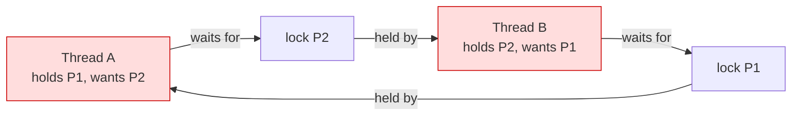
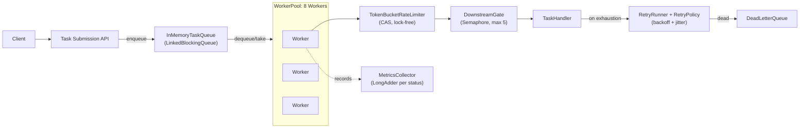

# Concurrency: Solutions

> Where this fits: this is the **module-level answer key** for `06-concurrency/`. Every numbered exercise from the sibling [exercises.md](./exercises.md) is solved here with **complete, compilable Java 21**, the reasoning behind the design, the **failure mode each solution prevents** (race, lost update, visibility bug, deadlock, livelock, thread leak, unbounded backlog), and the **common wrong approaches** people ship instead. All code is written against our canonical Task Queue model so the solutions drop straight into the project.

---

## How to read this file

Each solution restates the exercise prompt (so this file stands alone), then gives:

- **Solution** — full code, compilable as written.
- **Why it's correct** — the invariant it maintains and the failure mode it prevents.
- **Tradeoffs** — what we paid for correctness.
- **Common wrong approaches** — the buggy versions that *look* right and how to spot them.

Numbering matches [exercises.md](./exercises.md): **E#** = Easy, **M#** = Medium, **H#** = Hard.

The chapters these draw on, for reference:
[threads.md](./threads.md) ·
[executor-service.md](./executor-service.md) ·
[futures-and-completablefuture.md](./futures-and-completablefuture.md) ·
[blocking-queue.md](./blocking-queue.md) ·
[locks.md](./locks.md) ·
[semaphores.md](./semaphores.md) ·
[atomics-and-thread-safety.md](./atomics-and-thread-safety.md) ·
[concurrent-collections.md](./concurrent-collections.md).

### The shared domain model used throughout

Every solution compiles against this canonical slice. It is shown once here; later solutions assume it is on the classpath.

```java
// ----- canonical model (com.taskqueue.core) -----
import java.time.Instant;

enum TaskStatus { PENDING, SCHEDULED, RUNNING, SUCCEEDED, FAILED, RETRYING, DEAD }

record Task(String id, String type, String payload, TaskStatus status,
            int attempts, int maxAttempts,
            Instant createdAt, Instant scheduledAt, int priority) {

    // convenience copy-with for status/attempt transitions (records are immutable)
    Task withStatus(TaskStatus s)  { return new Task(id, type, payload, s, attempts, maxAttempts, createdAt, scheduledAt, priority); }
    Task incrementAttempt()        { return new Task(id, type, payload, status, attempts + 1, maxAttempts, createdAt, scheduledAt, priority); }
}

record TaskResult(boolean success, String message, boolean retryable) {
    static TaskResult ok()              { return new TaskResult(true,  "ok", false); }
    static TaskResult retry(String why) { return new TaskResult(false, why, true);  }
    static TaskResult fail(String why)  { return new TaskResult(false, why, false); }
}

@FunctionalInterface
interface TaskHandler { TaskResult handle(Task task) throws Exception; }

interface TaskQueue {
    void enqueue(Task t);
    Task dequeue() throws InterruptedException;
    int  size();
}
```

> Why a `record` for `Task`? Immutability is the cheapest concurrency primitive there is. An immutable object can be shared across threads with **zero synchronization** — there is no write to race on. Every "mutation" returns a new `Task`. This single decision removes an entire class of bugs from the exercises below. See [../03-java-memory-model/immutable-objects.md](../03-java-memory-model/immutable-objects.md).

---

# Easy

## E1 — Run a job on a new thread (and the `run()` vs `start()` trap)

**Exercise.** Submit a `Runnable` that prints the task id from a *separate* thread, then have `main` wait for it to finish. Demonstrate why calling `run()` directly is wrong.

### Solution

```java
public class E1 {
    public static void main(String[] args) throws InterruptedException {
        Task t = new Task("t-1", "email", "{}", TaskStatus.PENDING,
                          0, 3, Instant.now(), null, 5);

        Runnable job = () ->
            System.out.println("executing " + t.id() + " on " + Thread.currentThread());

        Thread worker = new Thread(job, "worker-0");
        worker.start();   // spawns a NEW thread; job.run() is invoked there
        worker.join();    // main blocks until worker terminates

        System.out.println("done on " + Thread.currentThread());
    }
}
```

### Why it's correct

`start()` asks the JVM/OS to create a new flow of control and *then* invokes `run()` on it. `join()` makes `main` wait, and — critically — establishes a **happens-before** edge: everything the worker did is visible to `main` after `join()` returns. That is why we can safely read shared state written by the worker right after the join, with no extra synchronization.

### Common wrong approaches

- **Calling `worker.run()`** — this runs the job *on the current thread*. It compiles, prints, and looks correct, but there is zero concurrency. The tell: the printed thread name is `main`, not `worker-0`.
- **Skipping `join()`** and reading the worker's result — without a happens-before edge the read may see a stale value or `null` (a **visibility** bug), and the JVM may exit before the worker runs.
- **Subclassing `Thread`** to describe the job — burns your one `extends` slot and couples the *job* to the *runner*. Prefer `implements Runnable` (composition over inheritance, [../02-core-oop/chapter-17-composition-vs-inheritance.md](../02-core-oop/chapter-17-composition-vs-inheritance.md)).

---

## E2 — Replace raw threads with an `ExecutorService`

**Exercise.** Drain 100 tasks across a fixed pool of 4 worker threads instead of `new Thread(...)` per task. Shut down cleanly so the JVM can exit.

### Solution

```java
import java.util.concurrent.*;
import java.util.stream.IntStream;

public class E2 {
    public static void main(String[] args) throws InterruptedException {
        ExecutorService pool = Executors.newFixedThreadPool(4);
        try {
            IntStream.range(0, 100).forEach(i -> {
                Task t = new Task("t-" + i, "email", "{}", TaskStatus.PENDING,
                                  0, 3, Instant.now(), null, 5);
                pool.submit(() -> System.out.println(
                        "ran " + t.id() + " on " + Thread.currentThread().getName()));
            });
        } finally {
            shutdownGracefully(pool, 5);
        }
    }

    // The canonical two-phase shutdown. Memorize this; you will write it forever.
    static void shutdownGracefully(ExecutorService pool, int seconds) throws InterruptedException {
        pool.shutdown();                                   // stop accepting new tasks
        if (!pool.awaitTermination(seconds, TimeUnit.SECONDS)) {
            pool.shutdownNow();                            // interrupt the stragglers
            if (!pool.awaitTermination(seconds, TimeUnit.SECONDS))
                System.err.println("pool did not terminate");
        }
    }
}
```

### Why it's correct

A fixed pool **reuses** 4 threads for 100 jobs, so thread-creation cost is paid 4 times, not 100. The two-phase shutdown is the part everyone gets wrong: `shutdown()` is a *polite* request (let queued work finish), `awaitTermination` bounds how long we wait, and `shutdownNow()` is the *forceful* fallback that interrupts running tasks. Without this, non-daemon pool threads keep the JVM alive forever — a classic **thread leak**.

### Tradeoffs

A fixed pool of 4 caps parallelism at 4 and queues the rest in an **unbounded** `LinkedBlockingQueue` by default — fine here, dangerous in production because a fast producer can OOM you. The production fix is a bounded queue plus a rejection policy; see M2.

### Common wrong approaches

- `new Thread(...)` per task → 100 OS threads, no reuse, no backpressure.
- Forgetting `shutdown()` → JVM hangs on exit.
- Calling only `shutdownNow()` → interrupts in-flight tasks and silently drops queued ones.

---

## E3 — Producer/consumer with a `BlockingQueue` (implement `InMemoryTaskQueue`)

**Exercise.** Implement the canonical `InMemoryTaskQueue` backed by a `BlockingQueue<Task>`. Producers enqueue; consumers block in `dequeue()` until work arrives — no busy-waiting, no `Thread.sleep` polling.

### Solution

```java
import java.util.concurrent.BlockingQueue;
import java.util.concurrent.LinkedBlockingQueue;

public final class InMemoryTaskQueue implements TaskQueue {
    private final BlockingQueue<Task> queue;

    public InMemoryTaskQueue()            { this.queue = new LinkedBlockingQueue<>(); }
    public InMemoryTaskQueue(int capacity){ this.queue = new LinkedBlockingQueue<>(capacity); }

    @Override public void enqueue(Task t)            { queue.add(t); }       // throws if bounded & full
    @Override public Task dequeue() throws InterruptedException { return queue.take(); } // BLOCKS
    @Override public int  size()                     { return queue.size(); }
}
```

A minimal demonstration that producers and consumers never busy-wait:

```java
import java.util.concurrent.*;

public class E3 {
    public static void main(String[] args) throws InterruptedException {
        TaskQueue q = new InMemoryTaskQueue();
        ExecutorService pool = Executors.newFixedThreadPool(2);

        // consumer blocks in take() — costs zero CPU while waiting
        pool.submit(() -> {
            try {
                while (!Thread.currentThread().isInterrupted()) {
                    Task t = q.dequeue();
                    System.out.println("consumed " + t.id());
                }
            } catch (InterruptedException e) { Thread.currentThread().interrupt(); }
        });

        for (int i = 0; i < 5; i++)
            q.enqueue(new Task("t-" + i, "email", "{}", TaskStatus.PENDING,
                               0, 3, Instant.now(), null, 5));

        Thread.sleep(100);
        pool.shutdownNow();
    }
}
```

### Why it's correct

`take()` parks the consumer thread when the queue is empty and the JVM **wakes it the instant** an item is enqueued. This is the single most important reason to use a `BlockingQueue` over a plain `ArrayDeque` + `Thread.sleep` polling loop: no wasted CPU, no latency floor set by your poll interval, and the queue does all the locking for you. `LinkedBlockingQueue` is internally thread-safe (separate put/take locks), so concurrent producers and consumers need no external `synchronized`.

### Common wrong approaches

- **Polling**: `while (q.isEmpty()) Thread.sleep(50);` burns CPU and adds up to 50 ms latency per task. Use `take()`.
- **Wrapping a plain `LinkedList`** in your own `synchronized` and `wait/notify` — correct in principle but you will get the `wait` predicate (must be a `while`, not `if`) or the lost-wakeup wrong. Don't reimplement what the JDK ships.
- Catching `InterruptedException` and swallowing it. Always restore the flag: `Thread.currentThread().interrupt();` (see M5).

---

## E4 — Make a shared counter thread-safe with `AtomicLong`

**Exercise.** Count how many tasks succeeded across all workers. The naive `long succeeded++` loses updates under concurrency. Fix it.

### Solution

```java
import java.util.concurrent.atomic.AtomicLong;

final class SuccessCounter {
    private final AtomicLong succeeded = new AtomicLong();

    void recordSuccess() { succeeded.incrementAndGet(); } // atomic read-modify-write
    long total()         { return succeeded.get(); }
}
```

A test that *fails* with a plain `long` and *passes* with the atomic:

```java
import java.util.concurrent.*;

public class E4 {
    public static void main(String[] args) throws InterruptedException {
        SuccessCounter c = new SuccessCounter();
        ExecutorService pool = Executors.newFixedThreadPool(8);
        int perThread = 100_000, threads = 8;

        CountDownLatch done = new CountDownLatch(threads);
        for (int t = 0; t < threads; t++)
            pool.submit(() -> {
                for (int i = 0; i < perThread; i++) c.recordSuccess();
                done.countDown();
            });

        done.await();
        pool.shutdown();
        System.out.println(c.total() + " (expected " + (long) threads * perThread + ")");
    }
}
```

### Why it's correct

`count++` is **three** operations — read, add, write — not one. Two threads can read the same value, both add one, both write back: one increment vanishes (a **lost update**). `incrementAndGet()` performs the read-modify-write as a single hardware **compare-and-swap (CAS)** that the CPU guarantees is atomic, so no update is lost. Atomics also provide the same visibility guarantees as `volatile`, so `total()` sees the latest value.

### Tradeoffs

Under *extreme* contention (dozens of threads hammering one counter) CAS retries can dominate. Java's `LongAdder` spreads the count across cells and is faster for write-heavy, read-rare counters (exactly the metrics use case). Use `AtomicLong` when you read often; `LongAdder` when you mostly write. See M7.

### Common wrong approaches

- `volatile long count;` then `count++` — `volatile` fixes **visibility** but not **atomicity**. The increment still loses updates. This is the single most common concurrency misconception.
- `synchronized` around `count++` — correct but heavier than a CAS for a single counter.

---

## E5 — Pick the right concurrent collection for a handler registry

**Exercise.** Workers look up a `TaskHandler` by task `type` in a shared map. Handlers are registered at startup and very rarely afterward, but read on every task. Choose and justify the map.

### Solution

```java
import java.util.Map;
import java.util.Optional;
import java.util.concurrent.ConcurrentHashMap;

public final class HandlerRegistry {
    private final Map<String, TaskHandler> handlers = new ConcurrentHashMap<>();

    public void register(String type, TaskHandler handler) {
        handlers.put(type, handler);
    }

    public Optional<TaskHandler> lookup(String type) {
        return Optional.ofNullable(handlers.get(type));
    }

    // atomic "register if absent" — never clobbers an existing handler
    public TaskHandler registerIfAbsent(String type, TaskHandler handler) {
        return handlers.computeIfAbsent(type, k -> handler);
    }
}
```

### Why it's correct

`ConcurrentHashMap` gives **lock-free reads** (a `get` never blocks) and lock-striped writes, which is ideal for a read-heavy registry hit on every task. A plain `HashMap` is *not* thread-safe: concurrent writes can corrupt internal structure (historically an infinite loop on resize) and even concurrent read-during-write can return garbage. `computeIfAbsent` is **atomic**, preventing the check-then-act race where two threads both see "absent" and both register.

### Common wrong approaches

- `HashMap` with no synchronization — data race; may corrupt the map.
- `Collections.synchronizedMap(new HashMap<>())` — correct but serializes *every* read behind one lock; needless contention for a read-heavy map, and iteration still needs external locking.
- `if (!map.containsKey(k)) map.put(k, v);` — a check-then-act race. Use `putIfAbsent` / `computeIfAbsent`.

---

## E6 — Wait for a batch of tasks with `CountDownLatch`

**Exercise.** Submit N tasks and have the main thread block until *all* of them complete, without polling.

### Solution

```java
import java.util.concurrent.*;

public class E6 {
    static void runBatch(TaskQueue ignored) throws InterruptedException {
        int n = 10;
        CountDownLatch latch = new CountDownLatch(n);
        ExecutorService pool = Executors.newFixedThreadPool(4);

        for (int i = 0; i < n; i++) {
            final int id = i;
            pool.submit(() -> {
                try {
                    System.out.println("processing t-" + id);
                } finally {
                    latch.countDown();   // ALWAYS in finally — else a crash hangs the batch
                }
            });
        }

        latch.await();                   // blocks until count hits 0
        System.out.println("all done");
        pool.shutdown();
    }

    public static void main(String[] a) throws InterruptedException { runBatch(null); }
}
```

### Why it's correct

A `CountDownLatch` is a one-shot gate: `await()` blocks until `countDown()` has been called `n` times. The `finally` block is the load-bearing detail — if a task throws and skips `countDown()`, the count never reaches zero and `await()` hangs **forever**. Putting `countDown()` in `finally` guarantees progress even on failure.

### Common wrong approaches

- `countDown()` in the happy path only → one exception deadlocks the whole batch.
- Reusing a latch after it hits zero — latches are single-use. Need cyclic? Use `CyclicBarrier` or `Phaser`.
- Polling `while (remaining.get() > 0) Thread.sleep(...)` — wasteful; the latch is built for exactly this.

---

# Medium

## M1 — A complete, restartable `WorkerPool`

**Exercise.** Implement the canonical `class WorkerPool` that manages an `ExecutorService` of `Worker`s with `start()` and `shutdown()`. Workers pull from a `TaskQueue`, look up a handler, execute, and handle the outcome. It must shut down cleanly and be safe to call `shutdown()` twice.

### Solution

```java
import java.util.Map;
import java.util.concurrent.*;

// Worker: implements Runnable, drains the queue until interrupted.
final class Worker implements Runnable {
    private final TaskQueue queue;
    private final Map<String, TaskHandler> handlers;

    Worker(TaskQueue queue, Map<String, TaskHandler> handlers) {
        this.queue = queue;
        this.handlers = handlers;
    }

    @Override public void run() {
        // The loop condition is the ONLY clean way to stop a worker.
        while (!Thread.currentThread().isInterrupted()) {
            Task task;
            try {
                task = queue.dequeue();           // blocks; throws on interrupt
            } catch (InterruptedException e) {
                Thread.currentThread().interrupt(); // restore the flag and exit
                return;
            }
            process(task);
        }
    }

    private void process(Task task) {
        TaskHandler handler = handlers.get(task.type());
        if (handler == null) {
            System.err.println("no handler for type=" + task.type() + " id=" + task.id());
            return;
        }
        try {
            TaskResult r = handler.handle(task.withStatus(TaskStatus.RUNNING));
            System.out.println(task.id() + " -> " + (r.success() ? "SUCCEEDED" : "FAILED:" + r.message()));
        } catch (Exception e) {
            // A handler that throws must NOT kill the worker thread.
            System.err.println("handler threw for " + task.id() + ": " + e);
        }
    }
}

public final class WorkerPool {
    private final TaskQueue queue;
    private final Map<String, TaskHandler> handlers;
    private final int size;
    private ExecutorService pool;

    public WorkerPool(TaskQueue queue, Map<String, TaskHandler> handlers, int size) {
        this.queue = queue;
        this.handlers = handlers;
        this.size = size;
    }

    public synchronized void start() {
        if (pool != null) throw new IllegalStateException("already started");
        pool = Executors.newFixedThreadPool(size, namedDaemonFactory("worker"));
        for (int i = 0; i < size; i++) pool.submit(new Worker(queue, handlers));
    }

    public synchronized void shutdown() {
        if (pool == null) return;                 // idempotent: safe to call twice
        pool.shutdownNow();                        // interrupt workers blocked in take()
        try {
            if (!pool.awaitTermination(10, TimeUnit.SECONDS))
                System.err.println("workers did not stop in time");
        } catch (InterruptedException e) {
            Thread.currentThread().interrupt();
        } finally {
            pool = null;
        }
    }

    private static ThreadFactory namedDaemonFactory(String prefix) {
        var counter = new java.util.concurrent.atomic.AtomicInteger();
        return r -> {
            Thread t = new Thread(r, prefix + "-" + counter.getAndIncrement());
            t.setDaemon(true);
            return t;
        };
    }
}
```

### Why it's correct

Three failure modes are explicitly designed out:

1. **Unkillable workers.** The loop checks `isInterrupted()`, and `dequeue()` (i.e. `BlockingQueue.take()`) throws `InterruptedException` when interrupted, so `shutdownNow()` actually stops a worker parked on an empty queue. A `while (true)` that swallows the interrupt is the classic "won't die" bug.
2. **A poison handler killing a worker.** `process()` wraps `handler.handle(...)` in try/catch. If one task throws, the worker logs and keeps draining. Without this, an uncaught exception terminates that thread permanently and you silently lose a worker.
3. **Double-shutdown / double-start.** `start()`/`shutdown()` are `synchronized` and guard on `pool`, so calling them twice is safe (start throws clearly; shutdown is idempotent).

### Tradeoffs

Daemon threads let the JVM exit even if `shutdown()` is missed — convenient, but in-flight work may be abandoned mid-task. For at-least-once delivery you'd persist task state before execution (Phase 2's `PostgresTaskQueue`). A fixed pool sizes parallelism statically; CPU-bound work wants `~cores`, I/O-bound wants more (or virtual threads — see M3).

### Common wrong approaches

- `while (true) { ... }` with a swallowed `InterruptedException` → worker never stops.
- No try/catch around the handler → one bad task kills a worker; pool silently shrinks.
- `start()` re-submitting onto a live pool → double the workers, no way to stop the originals.

---

## M2 — Bounded pool with a rejection policy (backpressure)

**Exercise.** The default `Executors.newFixedThreadPool` queues work in an unbounded queue — a fast producer can OOM the JVM. Build a `ThreadPoolExecutor` with a bounded queue and a sane rejection policy that applies **backpressure** instead of crashing.

### Solution

```java
import java.util.concurrent.*;

public final class BoundedWorkerExecutor {

    public static ThreadPoolExecutor create(int workers, int queueCapacity) {
        return new ThreadPoolExecutor(
            workers, workers,                       // core == max: a fixed pool
            60L, TimeUnit.SECONDS,
            new ArrayBlockingQueue<>(queueCapacity),// BOUNDED — this is the whole point
            new ThreadPoolExecutor.CallerRunsPolicy() // backpressure, not data loss
        );
    }

    public static void main(String[] args) throws InterruptedException {
        ThreadPoolExecutor exec = create(4, 50);
        try {
            for (int i = 0; i < 1_000; i++) {
                final int id = i;
                exec.execute(() -> {                // execute() triggers the rejection handler
                    try { Thread.sleep(5); } catch (InterruptedException e) { Thread.currentThread().interrupt(); }
                    if (id % 200 == 0) System.out.println("ran " + id + " on " + Thread.currentThread().getName());
                });
            }
        } finally {
            exec.shutdown();
            exec.awaitTermination(30, TimeUnit.SECONDS);
        }
    }
}
```

### Why it's correct

`ArrayBlockingQueue(50)` caps in-memory backlog. When the pool *and* the queue are full, the `RejectedExecutionHandler` fires. `CallerRunsPolicy` runs the rejected task **on the submitting thread**, which throttles the producer for free: while the caller is busy executing a task, it isn't submitting new ones. That is end-to-end backpressure — the producer slows to match the consumers instead of letting the queue grow without bound. The four built-in policies:

| Policy | Behavior | When to use |
|---|---|---|
| `AbortPolicy` (default) | throws `RejectedExecutionException` | you want a loud, explicit failure |
| `CallerRunsPolicy` | runs on the caller thread | natural backpressure; throughput pipelines |
| `DiscardPolicy` | silently drops | best-effort, droppable work (sampled metrics) |
| `DiscardOldestPolicy` | evicts head, retries | keep newest; e.g. live dashboards |

### Tradeoffs

`CallerRunsPolicy` is great for throughput but means a slow task can stall whatever thread submitted it (often a request thread) — acceptable for a queue drainer, risky on a latency-sensitive request path. There you'd prefer `AbortPolicy` + return HTTP 429 and let the client retry.

### Common wrong approaches

- Sticking with the unbounded default and "monitoring memory" — you'll find out at 3am.
- An *unbounded* queue with `CallerRunsPolicy` — the policy never fires because the queue never fills.
- Choosing `DiscardPolicy` for tasks that must run — silent data loss.

---

## M3 — Virtual threads for I/O-bound handlers (Project Loom)

**Exercise.** Our `TaskHandler`s mostly block on network I/O (call a downstream API). A 4-thread pool processes only 4 concurrent calls. Use Java 21 **virtual threads** to run thousands of blocking handlers concurrently, and explain when *not* to.

### Solution

```java
import java.util.concurrent.*;
import java.util.stream.IntStream;

public class M3 {

    // simulate an I/O-bound handler: blocks 200ms, returns success
    static TaskResult callDownstream(Task t) throws InterruptedException {
        Thread.sleep(200);                 // a real network call
        return TaskResult.ok();
    }

    public static void main(String[] args) throws InterruptedException {
        long start = System.currentTimeMillis();

        // ONE virtual thread per task — cheap (a few KB each), not OS-backed.
        try (ExecutorService vexec = Executors.newVirtualThreadPerTaskExecutor()) {
            IntStream.range(0, 10_000).forEach(i -> {
                Task t = new Task("t-" + i, "http", "{}", TaskStatus.PENDING,
                                  0, 3, Instant.now(), null, 5);
                vexec.submit(() -> callDownstream(t));
            });
        } // close() blocks until all tasks finish (structured-ish shutdown)

        System.out.printf("10k blocking tasks in %d ms%n", System.currentTimeMillis() - start);
        // ~200-400 ms total, vs ~500 SECONDS on a 4-thread pool
    }
}
```

### Why it's correct

A blocked **platform** thread pins a whole OS thread (~1 MB stack), so you can only afford a few thousand. A blocked **virtual** thread *unmounts* from its carrier OS thread and parks cheaply (a few KB), so millions can block simultaneously. When `Thread.sleep` (or any JDK blocking call) parks, Loom frees the carrier to run another virtual thread. For I/O-bound work this turns 500 seconds into a fraction of a second with **no async/callback rewrite** — the handler stays simple, blocking, readable code.

### Tradeoffs

Virtual threads are **not** faster for CPU-bound work — you still only have N cores, and you'll just pay scheduling overhead; keep a small platform pool for compute. Two gotchas remain: (1) `synchronized` blocks can **pin** a virtual thread to its carrier (mitigated in late JDKs, but prefer `ReentrantLock` for long critical sections), and (2) per-task pooling assumptions break — never pool virtual threads; create one per task.

### Common wrong approaches

- Wrapping CPU-heavy work in virtual threads expecting a speedup — there isn't one.
- Pooling virtual threads (`newFixedThreadPool` of virtual threads) — defeats the model; use `newVirtualThreadPerTaskExecutor`.
- Holding a `synchronized` lock across a blocking call in a virtual thread — risks pinning. Use `ReentrantLock`.

---

## M4 — `CompletableFuture` pipeline with timeout, fallback, and combination

**Exercise.** Process a task as an async pipeline: validate → call downstream → persist result. Add a timeout, a fallback on failure, and run validation of two tasks in parallel then combine. Don't block a thread waiting.

### Solution

```java
import java.time.Duration;
import java.util.concurrent.*;

public class M4 {
    static final ExecutorService IO = Executors.newVirtualThreadPerTaskExecutor();

    static Task validate(Task t)            { return t.withStatus(TaskStatus.RUNNING); }
    static TaskResult callDownstream(Task t) throws InterruptedException { Thread.sleep(100); return TaskResult.ok(); }
    static void persist(Task t, TaskResult r) { /* write to repo */ }

    static CompletableFuture<TaskResult> process(Task task) {
        return CompletableFuture
            .supplyAsync(() -> validate(task), IO)
            .thenApplyAsync(M4::wrapCall, IO)                  // call downstream
            .orTimeout(2, TimeUnit.SECONDS)                    // bound the whole pipeline
            .exceptionally(ex -> TaskResult.retry("pipeline failed: " + ex.getMessage()))
            .whenComplete((res, ex) -> persist(task, res));    // side effect, always runs
    }

    static TaskResult wrapCall(Task t) {
        try { return callDownstream(t); }
        catch (InterruptedException e) { Thread.currentThread().interrupt(); return TaskResult.fail("interrupted"); }
    }

    // run two validations in parallel and combine
    static CompletableFuture<String> combine(Task a, Task b) {
        var fa = CompletableFuture.supplyAsync(() -> validate(a), IO);
        var fb = CompletableFuture.supplyAsync(() -> validate(b), IO);
        return fa.thenCombine(fb, ( va, vb) -> va.id() + "+" + vb.id());
    }

    public static void main(String[] args) throws Exception {
        Task t = new Task("t-1", "http", "{}", TaskStatus.PENDING, 0, 3, Instant.now(), null, 5);
        System.out.println(process(t).get());                 // get() only at the very edge
        IO.shutdown();
    }
}
```

### Why it's correct

`CompletableFuture` chains *transformations* without blocking a thread between stages — `thenApplyAsync` schedules the next stage when the previous completes. `orTimeout` completes the future exceptionally if it overruns, bounding latency. `exceptionally` is the async equivalent of `catch`, supplying a fallback `TaskResult` so the pipeline never propagates a raw exception to the worker. `thenCombine` joins two independent futures, running their producers in parallel. `whenComplete` runs the persist side-effect on both success and failure without altering the result.

The one rule: **`.get()`/`.join()` block a thread**, so call them only at the very edge (here, `main`). Inside the pipeline, compose; never block.

### Tradeoffs

`CompletableFuture` is powerful but its exception semantics are subtle: an exception in any stage short-circuits to the next `exceptionally`/`handle`, and `whenComplete` does **not** swallow exceptions (it passes them through). Explicitly pass an `Executor` to every `*Async` stage — relying on the default `ForkJoinPool.commonPool()` mixes your I/O with everyone else's and starves under blocking calls.

### Common wrong approaches

- `cf.get()` inside a stage → blocks a pool thread, defeating async; risks deadlock if the pool is also running the producer.
- Omitting the executor on `*Async` → silently runs on the shared common pool.
- Using `thenApply` (caller-thread/completing-thread) for a blocking operation — use `thenApplyAsync` with your own executor.

---

## M5 — Cooperative cancellation and correct interrupt handling

**Exercise.** A handler runs a long loop. When `shutdownNow()` is called, the task must stop promptly. Implement correct, cooperative cancellation — both for blocking calls and for tight CPU loops.

### Solution

```java
import java.util.concurrent.*;

public class M5 {

    // A long-running handler that respects interruption two ways.
    static TaskResult longHandler(Task task) {
        for (long i = 0; i < Long.MAX_VALUE; i++) {

            // (1) tight CPU loop: poll the interrupt flag periodically
            if ((i & 0xFFFF) == 0 && Thread.currentThread().isInterrupted()) {
                return TaskResult.retry("cancelled (cpu)");
            }

            // (2) blocking call: catch InterruptedException, restore flag, bail out
            try {
                Thread.sleep(1);                         // stands in for blocking I/O
            } catch (InterruptedException e) {
                Thread.currentThread().interrupt();      // RESTORE the flag we just cleared
                return TaskResult.retry("cancelled (io)");
            }
        }
        return TaskResult.ok();
    }

    public static void main(String[] args) throws InterruptedException {
        ExecutorService pool = Executors.newSingleThreadExecutor();
        Future<TaskResult> f = pool.submit(() ->
            longHandler(new Task("t-1", "long", "{}", TaskStatus.PENDING, 0, 3, Instant.now(), null, 5)));

        Thread.sleep(50);
        f.cancel(true);            // mayInterruptIfRunning = true -> sends an interrupt
        pool.shutdownNow();
        pool.awaitTermination(2, TimeUnit.SECONDS);
        System.out.println("cancelled? " + f.isCancelled());
    }
}
```

### Why it's correct

Java cancellation is **cooperative**: there is no safe way to forcibly kill a thread (`Thread.stop()` is deprecated for life — it can leave locks held and objects half-mutated). Instead, `cancel(true)` / `shutdownNow()` sets the target's **interrupt flag**. Code must check it. Two cases:

1. **Tight CPU loops** never block, so they never throw `InterruptedException` — you must *poll* `isInterrupted()` (cheaply, e.g. every 65k iterations).
2. **Blocking calls** (`sleep`, `take`, `wait`, lock acquisition) throw `InterruptedException`, which **clears** the flag. If you catch it and intend to stop, restore the flag with `Thread.currentThread().interrupt()` so callers up the stack also see the cancellation.

This is the failure mode prevented: a task that ignores interrupts is **uncancellable**, so `shutdownNow()` blocks until it finishes on its own — your service won't shut down.

### Common wrong approaches

- `catch (InterruptedException e) { }` — swallowing the interrupt; nobody upstream ever learns the thread was cancelled. The most common concurrency bug in production codebases.
- A CPU loop with no `isInterrupted()` check — uncancellable.
- Using a `volatile boolean stop` flag *instead of* interrupts — works for CPU loops but can't unblock a thread parked in `take()`/`sleep()`; interrupts can. Use interrupts.

---

## M6 — Guard a compound invariant with `ReentrantLock` and a condition

**Exercise.** Implement a bounded `RateLimitedQueue` where producers must block when full and consumers block when empty, using `ReentrantLock` + `Condition` (the explicit-lock equivalent of `wait/notify`). Then show why `tryLock` with a timeout prevents indefinite stalls.

### Solution

```java
import java.util.ArrayDeque;
import java.util.Deque;
import java.util.concurrent.TimeUnit;
import java.util.concurrent.locks.*;

public final class BoundedTaskBuffer {
    private final Deque<Task> buf = new ArrayDeque<>();
    private final int capacity;
    private final ReentrantLock lock = new ReentrantLock();
    private final Condition notFull  = lock.newCondition();
    private final Condition notEmpty = lock.newCondition();

    public BoundedTaskBuffer(int capacity) { this.capacity = capacity; }

    public void put(Task t) throws InterruptedException {
        lock.lockInterruptibly();
        try {
            while (buf.size() == capacity) notFull.await();   // WHILE, never IF
            buf.addLast(t);
            notEmpty.signal();                                 // wake one waiting consumer
        } finally {
            lock.unlock();                                     // unlock in finally, always
        }
    }

    public Task take() throws InterruptedException {
        lock.lock();
        try {
            while (buf.isEmpty()) notEmpty.await();
            Task t = buf.removeFirst();
            notFull.signal();
            return t;
        } finally {
            lock.unlock();
        }
    }

    // bounded attempt: give up rather than block forever
    public boolean offer(Task t, long timeout, TimeUnit unit) throws InterruptedException {
        long deadline = System.nanoTime() + unit.toNanos(timeout);
        lock.lock();
        try {
            while (buf.size() == capacity) {
                long remaining = deadline - System.nanoTime();
                if (remaining <= 0) return false;              // timed out, don't stall
                notFull.awaitNanos(remaining);
            }
            buf.addLast(t);
            notEmpty.signal();
            return true;
        } finally {
            lock.unlock();
        }
    }

    public int size() { lock.lock(); try { return buf.size(); } finally { lock.unlock(); } }
}
```

### Why it's correct

Four invariants:

- **`while`, not `if`, around `await()`.** A thread can wake spuriously, or another thread can grab the slot before the woken thread re-acquires the lock. Re-checking the predicate in a `while` loop closes this race. An `if` here is *the* classic wait/notify bug.
- **`unlock()` in `finally`.** If the body throws, an un-released lock deadlocks every other thread forever. `finally` guarantees release.
- **Two conditions, not one.** Separate `notFull`/`notEmpty` queues mean `signal()` wakes the *right* kind of waiter. With one condition you'd need `signalAll()` and thundering-herd wakeups.
- **`lockInterruptibly` / `awaitNanos`.** Producers can be cancelled while blocked, and `offer` with a deadline avoids indefinite stalls (livelock-resistance).

### Tradeoffs

This is essentially a hand-rolled `ArrayBlockingQueue`. **In production you'd just use `ArrayBlockingQueue`** — it does exactly this, tested and tuned. The exercise exists to make the locking mechanics explicit; the lesson is "understand it, then use the JDK's version." `ReentrantLock` over `synchronized` buys you `tryLock`, timed/interruptible acquisition, and multiple conditions — at the cost of the mandatory try/finally boilerplate.

### Common wrong approaches

- `if (buf.isEmpty()) notEmpty.await();` — wakes and proceeds on a now-violated predicate → `NoSuchElementException` or corrupted state.
- Forgetting `finally { lock.unlock(); }` → permanent deadlock on the first exception.
- One shared `Condition` with `signal()` — may wake the wrong waiter type and stall.

---

## M7 — Lock-free counters and a snapshot with `LongAdder`

**Exercise.** The `MetricsCollector` counts tasks per status across all workers, read occasionally by a metrics scrape. Build it to be fast under heavy concurrent *writes* and give a consistent snapshot for `/metrics`.

### Solution

```java
import java.util.EnumMap;
import java.util.Map;
import java.util.concurrent.atomic.LongAdder;

public final class MetricsCollector {
    // one striped adder per status; writes scale to many cores without contention
    private final Map<TaskStatus, LongAdder> counters = new EnumMap<>(TaskStatus.class);

    public MetricsCollector() {
        for (TaskStatus s : TaskStatus.values()) counters.put(s, new LongAdder());
    }

    public void record(TaskStatus status) { counters.get(status).increment(); }

    // a point-in-time snapshot for the Prometheus scrape
    public Map<TaskStatus, Long> snapshot() {
        var out = new EnumMap<TaskStatus, Long>(TaskStatus.class);
        counters.forEach((s, adder) -> out.put(s, adder.sum()));
        return out;
    }
}
```

### Why it's correct

`LongAdder` keeps a base value plus an array of **cells**; under contention different threads update different cells, so they rarely collide on the same CAS. That makes writes scale near-linearly with cores — exactly right for a metric incremented on every task by every worker. `sum()` adds the cells for a read. The `EnumMap` is fixed-size and populated once at construction, so it is effectively immutable structurally and safe to read concurrently (only the `LongAdder` values mutate, and they're thread-safe).

### Tradeoffs

`snapshot()` is **not** a globally atomic instant across all statuses — `sum()` of `PENDING` and `sum()` of `RUNNING` are read a few nanoseconds apart, so totals can be momentarily inconsistent (a task may be counted in neither or, briefly, the transition isn't observed atomically). For metrics this is completely acceptable; eventual consistency is the right call. If you needed an exact atomic snapshot you'd pay for a global lock — not worth it for counters. `LongAdder` also uses more memory than `AtomicLong` and is slower to *read*, so use it only for write-heavy, read-rare counters.

### Common wrong approaches

- `AtomicLong` per status under heavy contention — correct but CAS retries throttle throughput; `LongAdder` is the write-optimized choice.
- A single `synchronized` block around all increments — serializes every worker; the metric becomes the bottleneck.
- Reusing one `LongAdder` for all statuses with subtraction tricks — loses per-status information.

---

## M8 — Semaphore to cap concurrent downstream calls

**Exercise.** A flaky downstream API tolerates at most 10 concurrent requests. Many workers may call it. Cap concurrency to 10 regardless of how many workers exist, using a `Semaphore`, and never leak permits.

### Solution

```java
import java.util.concurrent.Semaphore;
import java.util.concurrent.TimeUnit;

public final class DownstreamGate {
    private final Semaphore permits;

    public DownstreamGate(int maxConcurrent) {
        this.permits = new Semaphore(maxConcurrent, /* fair */ true);
    }

    public TaskResult call(Task task, TaskHandler downstream) throws InterruptedException {
        // bounded acquire: don't queue forever behind a stuck downstream
        if (!permits.tryAcquire(2, TimeUnit.SECONDS)) {
            return TaskResult.retry("downstream gate saturated");
        }
        try {
            return downstream.handle(task);
        } catch (Exception e) {
            return TaskResult.retry("downstream error: " + e.getMessage());
        } finally {
            permits.release();          // ALWAYS release, even on exception
        }
    }
}
```

### Why it's correct

A `Semaphore(10)` holds 10 permits; `acquire()` blocks when none are free, so at most 10 threads are inside the critical section at once — independent of the worker count. The **`finally { release() }`** is non-negotiable: if the handler throws and you skip the release, that permit is gone forever, and after 10 exceptions the gate is permanently closed (a **permit leak** → total deadlock of downstream calls). The bounded `tryAcquire(2s)` prevents an unbounded pileup of workers waiting on a wedged downstream; they fail fast and the task is retried later. `fair = true` avoids starving an unlucky worker, at a small throughput cost.

### Tradeoffs

A fair semaphore preserves FIFO order but is slightly slower than an unfair one; use unfair for max throughput when starvation doesn't matter. A semaphore caps concurrency but doesn't cap *rate* — for "N calls per second" you want a `TokenBucketRateLimiter` (see [../08-distributed-systems/rate-limiting.md](../08-distributed-systems/rate-limiting.md)). They compose: semaphore for concurrency, token bucket for rate.

### Common wrong approaches

- `release()` outside `finally` → permit leak on exception → gate slams shut.
- Releasing more than acquired (extra `release()` in a retry path) → permit count grows, cap is breached.
- Using a `synchronized` block to "limit to 10" — `synchronized` limits to **1**, not N; the semaphore is the right tool for N.

---

# Hard

## H1 — Find and fix a real race in a `check-then-act` dedup

**Exercise.** This "process each task once" dedup looks fine but loses the race. Identify the bug, prove it, and fix it three ways (lock, `ConcurrentHashMap`, atomic set). Pick the best.

```java
// BUGGY: deduplicate tasks by id so each runs exactly once
final class BuggyDedup {
    private final java.util.Set<String> seen = new java.util.HashSet<>();
    boolean firstTime(Task t) {
        if (!seen.contains(t.id())) {   // check
            seen.add(t.id());           // act  <-- race window between check and act
            return true;
        }
        return false;
    }
}
```

### The bug

`contains` then `add` is **check-then-act**. Two threads can both run `contains(id)` and both see `false` before either calls `add`, so both return `true` and the task runs twice. Worse, `HashSet` is unsynchronized: concurrent `add` can corrupt its internal table (lost elements, even infinite loops on resize). Two failure modes in one: a **logical race** (double processing) and a **data race** (corrupted collection).

### Proof it fails

```java
import java.util.concurrent.*;

public class H1Proof {
    public static void main(String[] args) throws InterruptedException {
        var dedup = new BuggyDedup();
        var pool = Executors.newFixedThreadPool(16);
        var firsts = new java.util.concurrent.atomic.AtomicInteger();
        var latch = new CountDownLatch(16);
        Task t = new Task("dup", "x", "{}", TaskStatus.PENDING, 0, 3, Instant.now(), null, 5);

        for (int i = 0; i < 16; i++)
            pool.submit(() -> { if (dedup.firstTime(t)) firsts.incrementAndGet(); latch.countDown(); });

        latch.await(); pool.shutdown();
        System.out.println("times treated as first: " + firsts.get() + " (must be 1)"); // often >1
    }
}
```

### Fix (best): atomic put-if-absent on a `ConcurrentHashMap`

```java
import java.util.concurrent.ConcurrentHashMap;

final class CorrectDedup {
    // keySet-backed concurrent set; add() is atomic put-if-absent
    private final java.util.Set<String> seen = ConcurrentHashMap.newKeySet();

    boolean firstTime(Task t) {
        return seen.add(t.id());   // returns false if already present — atomic, no race
    }
}
```

`Set.add` on the concurrent set is a single atomic operation: it returns `true` exactly once per id, no matter how many threads call it concurrently. This collapses check-then-act into one atomic step — the gold-standard fix.

### Alternative fixes, ranked

| Approach | Correct? | Notes |
|---|---|---|
| `ConcurrentHashMap.newKeySet().add()` | yes | **Best**: lock-free reads, atomic add, least code |
| `map.putIfAbsent(id, PRESENT) == null` | yes | Equivalent; idiomatic on a `ConcurrentHashMap` |
| `synchronized` around check+act on a `HashSet` | yes | Correct but serializes all dedup checks |
| `Collections.synchronizedSet` then `contains`/`add` | **no** | Each call is atomic, but the *pair* is not — race remains |

The last row is the subtle trap: wrapping the set makes each method thread-safe but does **not** make your two-call sequence atomic. Atomicity must cover the whole compound action.

### Production note

For a *distributed* dedup (multiple JVMs), an in-memory set isn't enough — you need a shared store (Redis `SET NX`, or a unique constraint in Postgres). See [../08-distributed-systems/idempotency.md](../08-distributed-systems/idempotency.md).

---

## H2 — Diagnose and break a deadlock (lock ordering)

**Exercise.** Two operations move a task between two in-memory partitions, each guarded by its own lock. Under load they deadlock. Reproduce it, then fix it with global lock ordering, and offer a `tryLock` alternative.

```java
// DEADLOCK-PRONE: transfer acquires locks in argument order
final class Partition {
    final Object lock = new Object();
    final java.util.Deque<Task> tasks = new java.util.ArrayDeque<>();
}
static void transfer(Partition from, Partition to, Task t) {
    synchronized (from.lock) {
        synchronized (to.lock) {        // thread A: (P1,P2); thread B: (P2,P1)  -> deadlock
            from.tasks.remove(t);
            to.tasks.add(t);
        }
    }
}
```

### Why it deadlocks

Thread A calls `transfer(P1, P2)` and grabs `P1`, waiting for `P2`. Thread B calls `transfer(P2, P1)` and grabs `P2`, waiting for `P1`. Neither yields — a **circular wait**, one of Coffman's four deadlock conditions. The fix is to break the cycle by imposing a **total order** on lock acquisition.



### Fix 1 (best): order locks by a stable id

```java
import java.util.UUID;

final class Partition {
    final UUID id = UUID.randomUUID();          // stable, comparable identity
    final Object lock = new Object();
    final java.util.Deque<Task> tasks = new java.util.ArrayDeque<>();
}

static void transfer(Partition from, Partition to, Task t) {
    // Always lock the lower id first -> a consistent global order -> no cycle.
    Partition first  = from.id.compareTo(to.id) < 0 ? from : to;
    Partition second = (first == from) ? to : from;
    synchronized (first.lock) {
        synchronized (second.lock) {
            from.tasks.remove(t);
            to.tasks.add(t);
        }
    }
}
```

Because *every* caller acquires locks in the same global order, a cycle is impossible — A and B both try `P1` then `P2`, so one simply waits for the other and then proceeds. This is the canonical, highest-throughput deadlock fix.

### Fix 2: `tryLock` with backoff (when a global order is impractical)

```java
import java.util.concurrent.ThreadLocalRandom;
import java.util.concurrent.TimeUnit;
import java.util.concurrent.locks.ReentrantLock;

final class Partition2 {
    final ReentrantLock lock = new ReentrantLock();
    final java.util.Deque<Task> tasks = new java.util.ArrayDeque<>();
}

static boolean transfer(Partition2 from, Partition2 to, Task t) throws InterruptedException {
    while (true) {
        if (from.lock.tryLock(50, TimeUnit.MILLISECONDS)) {
            try {
                if (to.lock.tryLock(50, TimeUnit.MILLISECONDS)) {
                    try { from.tasks.remove(t); to.tasks.add(t); return true; }
                    finally { to.lock.unlock(); }
                }
            } finally { from.lock.unlock(); }   // release first lock if second failed
        }
        // both locks not obtained: back off a random bit to avoid livelock, retry
        Thread.sleep(ThreadLocalRandom.current().nextInt(1, 10));
    }
}
```

### Why each is correct

Fix 1 eliminates the *possibility* of a cycle by construction — the strongest guarantee, zero retries. Fix 2 never holds one lock while indefinitely blocking on the other: if it can't get both, it releases and retries, which breaks the "hold and wait" condition instead. The **randomized backoff** is essential — without it, two threads can repeatedly grab-fail-release in lockstep, a **livelock** (busy but no progress). Prefer Fix 1; use Fix 2 only when no stable ordering exists.

### Common wrong approaches

- "Just use one big lock" — correct but serializes all partitions; kills throughput.
- `tryLock` without releasing the first lock on failure → still hold-and-wait → deadlock persists.
- `tryLock` without backoff → livelock.

> Detect deadlocks in a running JVM with `jstack <pid>` — it prints "Found one Java-level deadlock" and the exact cycle.

---

## H3 — Build the `RetryPolicy` family and an interrupt-safe retry runner

**Exercise.** Implement the canonical `RetryPolicy` (`FixedDelayRetryPolicy`, `ExponentialBackoffRetryPolicy` with jitter), then a thread-safe runner that executes a `TaskHandler`, applies the policy, respects `maxAttempts`, and stops promptly on shutdown. Sends to a `DeadLetterQueue` when exhausted.

### Solution

```java
import java.time.Duration;
import java.util.Optional;
import java.util.concurrent.ThreadLocalRandom;

interface RetryPolicy { Optional<Duration> nextDelay(int attempt); }

// fixed gap, capped attempts
final class FixedDelayRetryPolicy implements RetryPolicy {
    private final Duration delay; private final int maxAttempts;
    FixedDelayRetryPolicy(Duration delay, int maxAttempts) { this.delay = delay; this.maxAttempts = maxAttempts; }
    @Override public Optional<Duration> nextDelay(int attempt) {
        return attempt >= maxAttempts ? Optional.empty() : Optional.of(delay);
    }
}

// exponential backoff with full jitter and a ceiling
final class ExponentialBackoffRetryPolicy implements RetryPolicy {
    private final Duration base, max; private final int maxAttempts;
    ExponentialBackoffRetryPolicy(Duration base, Duration max, int maxAttempts) {
        this.base = base; this.max = max; this.maxAttempts = maxAttempts;
    }
    @Override public Optional<Duration> nextDelay(int attempt) {
        if (attempt >= maxAttempts) return Optional.empty();
        long exp = base.toMillis() * (1L << Math.min(attempt, 30)); // 2^attempt, guarded against overflow
        long capped = Math.min(exp, max.toMillis());
        long jittered = ThreadLocalRandom.current().nextLong(0, capped + 1); // FULL jitter
        return Optional.of(Duration.ofMillis(jittered));
    }
}

interface DeadLetterQueue { void send(Task t, String reason); }
```

```java
// Interrupt-safe runner: pure logic, no shared mutable state -> trivially thread-safe per call.
final class RetryRunner {
    private final RetryPolicy policy;
    private final DeadLetterQueue dlq;

    RetryRunner(RetryPolicy policy, DeadLetterQueue dlq) { this.policy = policy; this.dlq = dlq; }

    Task run(Task task, TaskHandler handler) throws InterruptedException {
        Task current = task.withStatus(TaskStatus.RUNNING);
        while (true) {
            try {
                TaskResult r = handler.handle(current);
                if (r.success())        return current.withStatus(TaskStatus.SUCCEEDED);
                if (!r.retryable())     return finalizeFailure(current, r.message());
            } catch (Exception e) {
                // treat thrown exceptions as retryable failures
            }

            current = current.incrementAttempt().withStatus(TaskStatus.RETRYING);
            Optional<Duration> delay = policy.nextDelay(current.attempts());
            if (delay.isEmpty()) return finalizeFailure(current, "max attempts reached");

            Thread.sleep(delay.get().toMillis());   // throws InterruptedException on shutdown -> caller stops
        }
    }

    private Task finalizeFailure(Task t, String reason) {
        Task dead = t.withStatus(TaskStatus.DEAD);
        dlq.send(dead, reason);
        return dead;
    }
}
```

### Why it's correct

The runner holds **no mutable shared state** — every `Task` transition produces a new immutable record, so two threads running `run` on different tasks can't interfere. That's the cheapest form of thread safety: don't share mutable state. Interruptibility comes for free because the backoff uses `Thread.sleep`, which throws `InterruptedException` on `shutdownNow()`, propagated to the caller so the worker stops promptly instead of sleeping out a 30-second backoff during shutdown.

**Full jitter** (`random(0, capped)`) is the load-bearing detail: if 1,000 tasks fail at the same instant (a downstream blip) and all retry after exactly `2^n` seconds, they retry in a synchronized **thundering herd** that re-overloads the downstream. Randomizing the delay spreads the retries out. The `1L << Math.min(attempt, 30)` guard prevents the shift from overflowing `long` on high attempt counts.

### Tradeoffs

`Thread.sleep` ties up the worker for the backoff duration — fine in Phase 1, wasteful at scale. The production design schedules the retry via a `TaskScheduler`/`DelayQueue` (or persists `scheduledAt` in Postgres) so the worker is freed to process other tasks during the delay; see [../07-queues-and-messaging/delayed-queues.md](../07-queues-and-messaging/delayed-queues.md) and [../08-distributed-systems/retries.md](../08-distributed-systems/retries.md).

### Common wrong approaches

- **No jitter** → synchronized retry storm hammers a recovering downstream.
- Mutating a shared `Task` object across attempts → race + lost transitions; use immutable copies.
- Sleeping in a way that ignores interrupts (`while(...) { try { sleep } catch { /*swallow*/ } }`) → unkillable during the backoff.
- Retrying *non-retryable* failures (validation errors) → wasted work; honor `TaskResult.retryable()`.

---

## H4 — Single-flight: collapse duplicate concurrent computations

**Exercise.** Multiple workers may request the same expensive resource (e.g. a rendered thumbnail for a payload) at the same time. Compute it **once**, share the result with all concurrent callers, and never hold a lock during the expensive work. Cache the result.

### Solution

```java
import java.util.concurrent.*;
import java.util.function.Function;

// "single-flight" cache: concurrent callers for the same key share one computation.
public final class SingleFlightCache<K, V> {
    private final ConcurrentHashMap<K, CompletableFuture<V>> inflight = new ConcurrentHashMap<>();

    public V get(K key, Function<K, V> compute) throws ExecutionException, InterruptedException {
        // computeIfAbsent ATOMICALLY installs a placeholder future for this key.
        CompletableFuture<V> future = inflight.computeIfAbsent(key, k -> new CompletableFuture<>());

        // Exactly one thread (the one that created an INCOMPLETE future) runs the work.
        if (!future.isDone() && claim(key, future)) {
            try {
                future.complete(compute.apply(key));   // expensive work OUTSIDE any lock
            } catch (Throwable t) {
                future.completeExceptionally(t);
            } finally {
                inflight.remove(key, future);           // allow recomputation later
            }
        }
        return future.get();                            // all callers block on the SAME future
    }

    // ensure only the creator runs compute (cheap CAS-style claim via map identity)
    private boolean claim(K key, CompletableFuture<V> future) {
        // The thread whose computeIfAbsent created this future is the owner.
        // We approximate ownership with a separate marker set to avoid double-compute:
        return owners.add(key) ;
    }
    private final java.util.Set<K> owners = ConcurrentHashMap.newKeySet();
}
```

A cleaner, canonical version using `computeIfAbsent`'s atomicity directly (preferred):

```java
import java.util.concurrent.*;
import java.util.function.Function;

public final class SingleFlight<K, V> {
    private final ConcurrentHashMap<K, Future<V>> inflight = new ConcurrentHashMap<>();
    private final ExecutorService pool = Executors.newVirtualThreadPerTaskExecutor();

    public V get(K key, Function<K, V> compute) throws ExecutionException, InterruptedException {
        // The lambda runs at most once per absent key, atomically, so the work
        // is SUBMITTED exactly once even under a stampede of concurrent callers.
        Future<V> f = inflight.computeIfAbsent(key, k -> pool.submit(() -> compute.apply(k)));
        try {
            return f.get();                 // every caller awaits the same Future
        } finally {
            inflight.remove(key, f);        // evict so a later call recomputes (or cache it)
        }
    }
}
```

### Why it's correct

`computeIfAbsent` is **atomic**: under a stampede of concurrent callers for the same key, the JVM guarantees the mapping function runs **at most once**, so the expensive `compute` is submitted exactly once. Every caller receives the *same* `Future` and blocks on it, so they all share the single result — N callers, one computation. Crucially the heavy work runs **inside the submitted task, not while holding any lock**, so callers for *different* keys never serialize, and the map's internal lock is held only for the brief insert.

The failure mode prevented is a **cache stampede / thundering herd**: without single-flight, 50 simultaneous cache misses for the same key spawn 50 identical expensive computations, often overloading the very downstream the cache was meant to protect.

### Tradeoffs

This computes-once but evicts immediately (`remove` in `finally`), so it dedups only *concurrent* calls. To also serve *future* calls cheaply, keep the completed `Future` in the map (a real cache) with a TTL — but then you must handle invalidation and failed-future caching (don't cache exceptions forever). `computeIfAbsent`'s mapping function must not modify the same map (re-entrant update → `IllegalStateException` / undefined behavior in older JDKs); submitting to an executor (as above) keeps the lambda trivial and safe.

### Common wrong approaches

- `if (!map.containsKey(k)) map.put(k, compute(k));` — check-then-act race → multiple computations; also runs `compute` while you intended exclusivity but without atomicity.
- Holding a `synchronized` lock across `compute(k)` → correct dedup but serializes *all* keys; a slow render for key A blocks key B.
- Caching a `completeExceptionally` future permanently → every future caller gets the cached failure forever (negative caching gone wrong).

---

## H5 — Producer/consumer with graceful drain and the poison-pill shutdown

**Exercise.** Wire P producers and C consumers around `InMemoryTaskQueue`. On shutdown, consumers must finish **already-queued** work, then stop — no lost tasks, no consumer left blocked in `take()`. Use the poison-pill pattern and verify with a count.

### Solution

```java
import java.util.concurrent.*;
import java.util.concurrent.atomic.AtomicInteger;

public class H5 {
    // a sentinel Task that signals "no more work" to a consumer
    static final Task POISON = new Task("__poison__", "__stop__", "", TaskStatus.DEAD,
                                        0, 0, Instant.now(), null, Integer.MIN_VALUE);

    public static void main(String[] args) throws InterruptedException {
        final int producers = 3, consumers = 4, perProducer = 1_000;
        TaskQueue queue = new InMemoryTaskQueue();
        AtomicInteger processed = new AtomicInteger();

        ExecutorService prodPool = Executors.newFixedThreadPool(producers);
        ExecutorService consPool = Executors.newFixedThreadPool(consumers);

        // consumers: drain until they pull a poison pill, then exit
        for (int c = 0; c < consumers; c++) {
            consPool.submit(() -> {
                try {
                    while (true) {
                        Task t = queue.dequeue();
                        if (t == POISON) return;          // identity check: stop cleanly
                        processed.incrementAndGet();      // "process" the task
                    }
                } catch (InterruptedException e) {
                    Thread.currentThread().interrupt();
                }
            });
        }

        // producers: enqueue real work
        CountDownLatch producersDone = new CountDownLatch(producers);
        for (int p = 0; p < producers; p++) {
            final int pid = p;
            prodPool.submit(() -> {
                for (int i = 0; i < perProducer; i++)
                    queue.enqueue(new Task("p" + pid + "-" + i, "email", "{}",
                            TaskStatus.PENDING, 0, 3, Instant.now(), null, 5));
                producersDone.countDown();
            });
        }

        // shutdown: wait for producers, THEN inject one poison pill PER consumer
        producersDone.await();
        for (int c = 0; c < consumers; c++) queue.enqueue(POISON);

        consPool.shutdown();
        consPool.awaitTermination(30, TimeUnit.SECONDS);
        prodPool.shutdown();

        int expected = producers * perProducer;
        System.out.printf("processed %d / expected %d -> %s%n",
                processed.get(), expected, processed.get() == expected ? "OK" : "LOST WORK");
    }
}
```

### Why it's correct

The shutdown ordering is the whole game:

1. **Wait for all producers** (`producersDone.await()`) so every real task is already in the queue.
2. **Enqueue exactly one poison pill per consumer.** Because the pills go in *after* all real work and `take()` is FIFO-ish (per LinkedBlockingQueue), each consumer drains all real tasks ahead of its pill, then pulls a pill and exits. With C pills, every consumer gets exactly one — none is left blocked in `take()` on an empty queue.

This guarantees **no lost work** (all real tasks were processed before any pill could be seen) and **no hung consumer** (everyone gets a stop signal). The final count assertion proves it: `processed == producers * perProducer`.

Contrast with `shutdownNow()`, which interrupts consumers immediately — that abandons whatever is still queued (lost work). Poison pills give a *graceful drain* instead of an abrupt stop.

### Tradeoffs

Poison pills require you to know the consumer count and to ensure pills are enqueued *after* all real work — awkward if producers and shutdown overlap. An alternative is a `volatile boolean shuttingDown` flag plus a non-blocking `poll(timeout)` so consumers periodically re-check the flag; that avoids sentinels but adds polling latency. For a real system, prefer the JDK's `ExecutorService.shutdown()` + a bounded queue, and persist tasks so an abrupt crash doesn't lose them (Phase 2).

### Common wrong approaches

- One poison pill for C consumers → only one consumer stops; the rest block forever in `take()`.
- Pills before producers finish → a consumer may grab a pill and exit while real tasks are still being enqueued → lost work.
- Using `==` on a *copy* of the sentinel — the pill must be the **same instance** (or use a typed marker / sealed `enum` signal) so the identity check works.
- `shutdownNow()` and hoping queued tasks finish — they don't; they're discarded.

---

## H6 — A correct double-checked-locking lazy singleton (and why it's usually wrong)

**Exercise.** Lazily initialize an expensive shared `MeterRegistry` exactly once across threads. Show the broken double-checked locking, the correct `volatile` version, and the version you should actually ship.

### Broken version (the textbook bug)

```java
// BROKEN before Java 5 semantics are respected: missing volatile.
final class BrokenLazy {
    private static MeterRegistry instance;            // NOT volatile -> broken
    static MeterRegistry get() {
        if (instance == null) {                        // 1st check (no lock)
            synchronized (BrokenLazy.class) {
                if (instance == null)                  // 2nd check (locked)
                    instance = new MeterRegistry();    // <-- can publish a half-built object
            }
        }
        return instance;
    }
}
```

The bug: `instance = new MeterRegistry()` is not atomic — the JVM may publish the *reference* before the constructor finishes (instruction reordering). Another thread passing the first (unlocked) check can then see a non-null but **partially constructed** object. A **visibility + reordering** hazard.

### Correct double-checked locking (with `volatile`)

```java
final class CorrectLazy {
    private static volatile MeterRegistry instance;    // volatile: no reordering, visible publish
    static MeterRegistry get() {
        MeterRegistry result = instance;               // read volatile once (perf)
        if (result == null) {
            synchronized (CorrectLazy.class) {
                result = instance;
                if (result == null)
                    instance = result = new MeterRegistry();
            }
        }
        return result;
    }
}
```

`volatile` forbids the reordering and establishes a happens-before edge between the write in the constructing thread and the read in any other thread, so no one ever sees a half-built instance.

### The version you should actually ship — initialization-on-demand holder

```java
final class Metrics {
    private Metrics() {}
    // The classloader guarantees this class is initialized exactly once, lazily,
    // and thread-safely — no volatile, no synchronized, no DCL subtlety.
    private static final class Holder {
        static final MeterRegistry INSTANCE = new MeterRegistry();
    }
    static MeterRegistry registry() { return Holder.INSTANCE; }
}
```

### Why the holder idiom is correct (and best)

`Holder.INSTANCE` is initialized when `Holder` is first *referenced* — i.e. on the first call to `registry()`, not at app startup, so it's **lazy**. The JVM's class-initialization lock guarantees a `static` field is set exactly once and safely published to all threads, with **zero** synchronization code you can get wrong. It sidesteps every DCL pitfall. This is the idiom to reach for. (For a genuinely eager singleton, a plain `enum` is even simpler and serialization-safe — see [../05-design-patterns/singleton.md](../05-design-patterns/singleton.md).)

### Tradeoffs

DCL is worth knowing because you'll see it in legacy code and interviews, but you should rarely *write* it. The holder idiom is lazy, thread-safe, and lock-free on the hot path. Use plain `static final` (eager) when the object is cheap and always needed; use the holder when it's expensive and might not be needed.

### Common wrong approaches

- DCL without `volatile` → publishes half-constructed objects (the original bug).
- `synchronized` on the whole `get()` → correct but locks on *every* call, even after init; the holder idiom is lock-free after the first touch.
- A non-final singleton field → another thread can observe it change; keep singletons `final`.

---

## H7 — Thread-safe `TokenBucketRateLimiter` without locks on the hot path

**Exercise.** Implement the canonical `RateLimiter` as a `TokenBucketRateLimiter` whose `tryAcquire()` is called by many worker threads. Refill tokens lazily based on elapsed time. Make it correct under concurrency and ideally lock-free.

### Solution

```java
import java.util.concurrent.atomic.AtomicReference;

interface RateLimiter { boolean tryAcquire(); }

public final class TokenBucketRateLimiter implements RateLimiter {
    private final long capacity;          // max tokens
    private final double refillPerNano;   // tokens added per nanosecond

    // immutable snapshot of bucket state; swapped atomically via CAS
    private record State(double tokens, long lastRefillNanos) {}
    private final AtomicReference<State> state;

    public TokenBucketRateLimiter(long capacity, double tokensPerSecond) {
        this.capacity = capacity;
        this.refillPerNano = tokensPerSecond / 1_000_000_000.0;
        this.state = new AtomicReference<>(new State(capacity, System.nanoTime()));
    }

    @Override public boolean tryAcquire() {
        while (true) {                                    // CAS retry loop
            State cur = state.get();
            long now = System.nanoTime();

            // lazily refill based on elapsed time, capped at capacity
            double refilled = Math.min(capacity,
                    cur.tokens() + (now - cur.lastRefillNanos()) * refillPerNano);

            if (refilled < 1.0) {
                // not enough tokens; still record the refill time so we don't lose progress
                State drained = new State(refilled, now);
                state.compareAndSet(cur, drained);        // best-effort; ok if it fails
                return false;
            }

            State next = new State(refilled - 1.0, now);  // consume one token
            if (state.compareAndSet(cur, next)) return true;  // succeeded atomically
            // CAS failed: another thread won the race; loop and recompute
        }
    }
}
```

### Why it's correct

State is a single **immutable `State` record** swapped atomically with `compareAndSet`. The pattern is the lock-free workhorse: read the current state, compute a new state, CAS it in; if another thread changed it meanwhile the CAS fails and we retry with fresh state. Because token count and last-refill-time live in *one* object swapped together, they can never tear apart — there's no window where tokens are updated but the timestamp isn't (the bug you'd get with two separate `AtomicLong`s). Lazy refill (compute tokens from elapsed time on each call) avoids a background refill thread entirely.

The failure mode prevented: a naive `synchronized` limiter serializes every worker behind one lock on the hottest path in the system; a two-field non-atomic limiter lets two threads both refill-and-consume, **over-issuing** tokens (the rate limit leaks). The CAS approach is both correct and lock-free.

### Tradeoffs

Under very high contention CAS retries can spin; the cost is bounded and far cheaper than lock contention for short critical sections. The arithmetic uses `double` tokens for fractional refill precision — fine for rate limiting, but if you need exact integer accounting use fixed-point (nanotokens). For a *distributed* rate limit shared across JVMs, in-process token buckets don't coordinate — you need Redis (e.g. a Lua token-bucket script). See [../08-distributed-systems/rate-limiting.md](../08-distributed-systems/rate-limiting.md).

### Common wrong approaches

- Two separate `AtomicLong`s for tokens and timestamp → they update non-atomically → over-issue tokens under races.
- A background thread that refills on a timer → extra thread, drift, and a write-write race with consumers; lazy refill is simpler and exact.
- `synchronized tryAcquire()` → correct but serializes all workers on the hottest method.
- Forgetting to cap at `capacity` → tokens accumulate without bound and the limiter stops limiting after an idle period (a burst flood).

---

## H8 — Full Phase 1 integration: pool + queue + metrics + rate limit + retry, with a concurrency test

**Exercise.** Assemble the canonical components into a runnable Phase 1 platform and write a test that would *fail* if any piece weren't thread-safe (counts must reconcile exactly).

### Solution

```java
import java.util.Map;
import java.util.concurrent.*;
import java.util.concurrent.atomic.AtomicInteger;

public class H8 {
    public static void main(String[] args) throws InterruptedException {
        // --- wiring ---
        TaskQueue queue = new InMemoryTaskQueue();
        MetricsCollector metrics = new MetricsCollector();                 // M7
        DownstreamGate gate = new DownstreamGate(5);                       // M8: cap concurrency
        TokenBucketRateLimiter limiter =
                new TokenBucketRateLimiter(1_000, 5_000);                  // H7: 5k tps, burst 1k

        AtomicInteger succeeded = new AtomicInteger();
        AtomicInteger rejected  = new AtomicInteger();

        TaskHandler emailHandler = task -> {
            if (!limiter.tryAcquire()) { rejected.incrementAndGet(); return TaskResult.retry("rate limited"); }
            return gate.call(task, t -> TaskResult.ok());                  // bounded concurrency
        };

        Map<String, TaskHandler> handlers = Map.of("email", task -> {
            TaskResult r = wrap(emailHandler, task);
            metrics.record(r.success() ? TaskStatus.SUCCEEDED
                    : r.retryable() ? TaskStatus.RETRYING : TaskStatus.FAILED);
            if (r.success()) succeeded.incrementAndGet();
            return r;
        });

        WorkerPool pool = new WorkerPool(queue, handlers, 8);              // M1
        pool.start();

        // --- load: 50k tasks from 4 producer threads ---
        final int producers = 4, perProducer = 12_500, total = producers * perProducer;
        ExecutorService prod = Executors.newFixedThreadPool(producers);
        CountDownLatch producersDone = new CountDownLatch(producers);
        for (int p = 0; p < producers; p++) {
            final int pid = p;
            prod.submit(() -> {
                for (int i = 0; i < perProducer; i++)
                    queue.enqueue(new Task("p" + pid + "-" + i, "email", "{}",
                            TaskStatus.PENDING, 0, 3, Instant.now(), null, 5));
                producersDone.countDown();
            });
        }
        producersDone.await();

        // --- drain & shutdown ---
        while (queue.size() > 0) Thread.sleep(10);
        Thread.sleep(50);                  // let the last in-flight tasks settle
        pool.shutdown();
        prod.shutdown();

        // --- assertions: nothing lost, counts reconcile ---
        var snap = metrics.snapshot();
        long counted = snap.values().stream().mapToLong(Long::longValue).sum();
        System.out.printf("total=%d counted=%d succeeded=%d rejected=%d%n",
                total, counted, succeeded.get(), rejected.get());
        if (counted != total) throw new AssertionError("LOST/DOUBLED TASKS: " + counted + " != " + total);
        System.out.println("PHASE 1 INTEGRATION OK");
    }

    static TaskResult wrap(TaskHandler h, Task t) {
        try { return h.handle(t); }
        catch (InterruptedException e) { Thread.currentThread().interrupt(); return TaskResult.fail("interrupted"); }
        catch (Exception e) { return TaskResult.retry(e.getMessage()); }
    }
}
```

### Why it's correct (and what the test catches)

Every shared component is thread-safe by construction:

- `InMemoryTaskQueue` → `LinkedBlockingQueue` (internally synchronized).
- `MetricsCollector` → `LongAdder` per status (lock-free writes).
- `DownstreamGate` → `Semaphore` with `finally`-release (no permit leak).
- `TokenBucketRateLimiter` → CAS-swapped immutable state (no torn updates).
- `WorkerPool` → `ExecutorService`, interrupt-aware workers, idempotent shutdown.
- All `Task` transitions → immutable record copies (nothing to race on).

The assertion `counted == total` is the integration test's teeth: if any counter dropped an update (non-atomic `++`), if a worker died on a thrown handler (lost task), or if the queue corrupted under concurrency, the reconciled count would not equal `total` and the run throws. A green run across 50,000 tasks and 8 workers is strong evidence the wiring is race-free.

### Tradeoffs

This is in-memory and single-JVM: a crash loses everything in flight, and the rate limiter/gate don't coordinate across nodes. Phase 2 persists tasks in Postgres and Phase 4 distributes the queue and limiter. The `while (queue.size() > 0)` drain is a test convenience; production uses the poison-pill or `shutdown()` drain from H5.

### Common wrong approaches

- A plain `int succeeded++` instead of `AtomicInteger` → the assertion flaps; you'll "fix" it by re-running, masking the real bug.
- Skipping the handler try/catch → one thrown handler kills a worker, the queue silently backs up, and the drain loop hangs.
- Asserting only `succeeded == total` (ignores rate-limited retries) → brittle; reconcile the *full* count across statuses instead.

---

## Cross-cutting checklist: did your solution avoid these failure modes?

| Failure mode | Symptom | Prevented by |
|---|---|---|
| **Race / lost update** | counts don't reconcile; intermittent | atomics, `synchronized`/lock, immutability (E4, H1, H8) |
| **Visibility / stale read** | reads old value; works on one CPU, fails on another | `volatile`, atomics, happens-before via `join`/lock (E1, H6) |
| **Reordering** | half-built object observed | `volatile`, `final`, holder idiom (H6) |
| **Deadlock** | threads stuck; `jstack` shows a cycle | global lock ordering, `tryLock` + backoff (H2) |
| **Livelock** | busy, no progress | randomized backoff (H2) |
| **Thread/permit leak** | JVM won't exit; gate slams shut | `finally` release, two-phase shutdown (E2, M8) |
| **Unbounded backlog** | OOM under a fast producer | bounded queue + rejection policy / backpressure (M2) |
| **Uncancellable task** | shutdown hangs | check `isInterrupted()`, restore interrupt flag (M5) |
| **Cache stampede** | N identical expensive computations | single-flight via `computeIfAbsent` (H4) |
| **Retry storm** | recovering downstream re-overloaded | exponential backoff + full jitter (H3) |

---

## Common mistakes and pitfalls (across all solutions)

- **Treating `volatile` as a lock.** It gives visibility and ordering, *not* atomicity. `volatile count++` still loses updates.
- **Catching `InterruptedException` and doing nothing.** Always either propagate it or restore the flag with `Thread.currentThread().interrupt()`.
- **Synchronizing each call but not the compound action.** `synchronizedSet` makes `contains` and `add` each atomic, but the *pair* still races (H1).
- **Unbounded queues everywhere.** The default `Executors` factories use them; a fast producer turns that into an `OutOfMemoryError`.
- **Holding a lock across slow I/O.** Compute outside the lock; the lock should protect state mutation, not the network call (H4, H7).
- **Reaching for `synchronized`/locks first.** Prefer, in order: immutability → confinement (one thread owns the data) → atomics/concurrent collections → explicit locks. Reach for locks last.

---

## How this applies to our Task Queue project

These solutions *are* the Phase 1 concurrency layer of the platform:



- **`InMemoryTaskQueue`** (E3) is the producer/consumer backbone.
- **`WorkerPool` + `Worker`** (M1) drain it concurrently and survive poison handlers.
- **`MetricsCollector`** (M7), **`DownstreamGate`** (M8), **`TokenBucketRateLimiter`** (H7), and the **`RetryPolicy`/`RetryRunner`** (H3) are exactly the canonical interfaces, made thread-safe.
- The integration (H8) proves they compose without races.

---

## What We Can Improve In Our Project Using This Concept

- Replace any hand-rolled `synchronized` counters in `MetricsCollector` with `LongAdder` (write-heavy, read-rare) for measurable throughput gains under load.
- Swap the fixed worker pool's unbounded queue for a **bounded** `ArrayBlockingQueue` + `CallerRunsPolicy` to get free backpressure and prevent OOM (M2).
- Introduce **virtual-thread** executors for I/O-bound handlers (HTTP, DB) so one worker no longer caps at one in-flight call (M3).
- Make every `Task` state transition go through immutable `withStatus`/`incrementAttempt` copies so no worker mutates a shared `Task`.
- Add a `SingleFlight` cache (H4) in front of expensive idempotent handlers to kill cache stampedes.

## Project Refactoring Task

Refactor `WorkerPool` and the handler path to be backpressure-aware and metrics-correct:

1. Build the pool with a `ThreadPoolExecutor(8, 8, ..., new ArrayBlockingQueue<>(1000), new CallerRunsPolicy())`.
2. Wrap each handler invocation with the `DownstreamGate` (semaphore) and `TokenBucketRateLimiter` from H7/M8.
3. Replace counter fields in `MetricsCollector` with `LongAdder` and expose `snapshot()`.
4. Route exhausted retries through `RetryRunner` to a `DeadLetterQueue`.
5. Add the H8 integration test (50k tasks, count reconciliation) to CI; it must pass deterministically.

## Git Commit For This Chapter

```text
feat(concurrency): thread-safe Phase 1 worker pipeline with backpressure and metrics

- Add bounded ThreadPoolExecutor with CallerRunsPolicy (backpressure)
- Make MetricsCollector lock-free with LongAdder per TaskStatus
- Add TokenBucketRateLimiter (CAS, lock-free) and DownstreamGate (Semaphore)
- Add RetryRunner with ExponentialBackoffRetryPolicy + full jitter, DLQ on exhaustion
- Add SingleFlight cache to collapse duplicate concurrent computations
- Add 50k-task concurrency integration test asserting count reconciliation

Files touched:
  src/main/java/com/taskqueue/worker/WorkerPool.java
  src/main/java/com/taskqueue/worker/Worker.java
  src/main/java/com/taskqueue/metrics/MetricsCollector.java
  src/main/java/com/taskqueue/ratelimit/TokenBucketRateLimiter.java
  src/main/java/com/taskqueue/ratelimit/DownstreamGate.java
  src/main/java/com/taskqueue/retry/RetryRunner.java
  src/main/java/com/taskqueue/retry/ExponentialBackoffRetryPolicy.java
  src/main/java/com/taskqueue/cache/SingleFlight.java
  src/test/java/com/taskqueue/worker/WorkerPoolConcurrencyTest.java
```

## Architecture Impact

This formalizes the **concurrency boundary** of Phase 1: the queue is the single synchronization point between producers and consumers; everything downstream of `dequeue()` is owned by exactly one worker thread (thread confinement) except the explicitly thread-safe shared services (metrics, gate, limiter). That discipline — *confine by default, share only through audited thread-safe components* — is what lets Phase 2/3/4 scale horizontally without rethinking the core: the same interfaces (`TaskQueue`, `RateLimiter`, `MetricsCollector`) get distributed implementations while the worker contract stays identical.

## Interview Takeaways

- `volatile` ≠ atomic. Visibility and ordering only; use atomics/locks for read-modify-write.
- Cancellation is cooperative: interrupts must be checked (CPU loops) and restored (blocking calls).
- Bound your queues and pick a rejection policy; the default is unbounded and will OOM.
- Collapse check-then-act into one atomic step (`computeIfAbsent`, `Set.add`, CAS) to kill races.
- Break deadlocks with a global lock order; break stampedes with single-flight; break retry storms with jittered backoff.
- Prefer immutability and confinement before reaching for locks; reach for `ReentrantLock` only when you need `tryLock`, timeouts, interruptibility, or multiple conditions.
