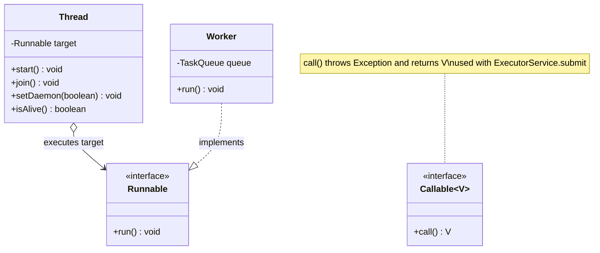
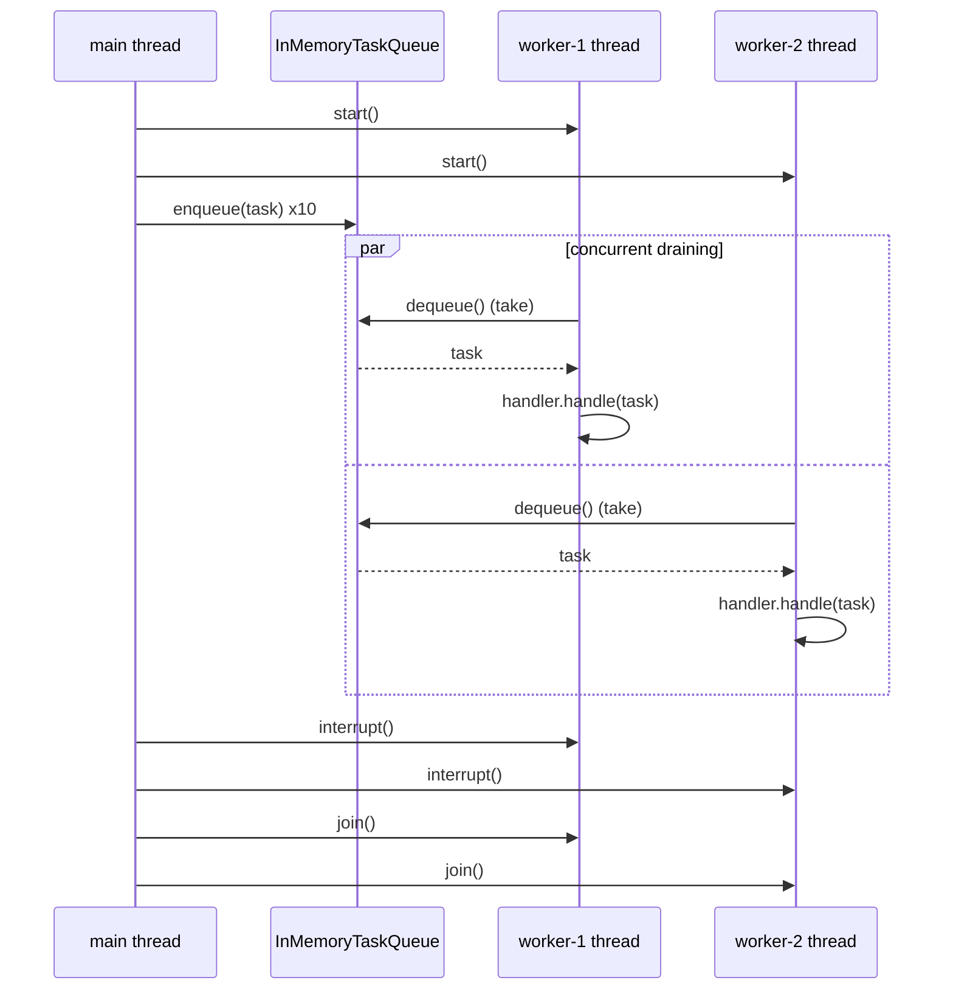
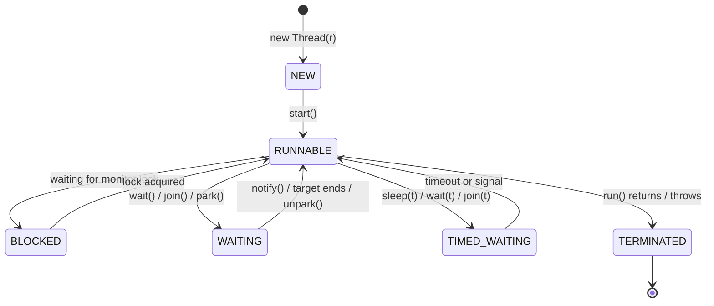

# Threads, Runnable and Callable

> Where this fits: this is the first chapter of **Phase 1 concurrency**. Until now our Task Queue ran tasks one at a time on the main thread. Here we give it real parallelism — the first multi-threaded `Worker` pulling from a `TaskQueue` — and meet the hazards (race conditions, visibility) that the rest of `06-concurrency/` exists to tame.

---

## 1. Why this exists — the real problem it solves

Our Phase 1 architecture is:

```text
Client -> Task Submission API -> In-Memory Queue -> Worker Pool -> Task Execution
```

The whole point of a task queue is **decoupling submission from execution**. A client submits a task and gets an immediate acknowledgement; the actual work (sending an email, resizing an image, calling a slow downstream API) happens later, off the request path. That "later, off the request path" requires a second flow of control — a **thread**.

A single-threaded program has exactly one call stack and one program counter. It does one thing at a time. If your `handle(task)` blocks for 300 ms on network I/O, your entire system stalls for 300 ms. With 10,000 queued tasks, single-threaded execution is a 50-minute backlog at best.

**Historical context (worth one paragraph).** Early servers used a *process per request* model (classic CGI, Apache prefork). Processes are heavyweight: separate address space, expensive context switches, no shared memory. Threads arrived as "lightweight processes" sharing one address space, so they're cheap to create relative to a process and can share data directly. Java baked threads into the language from day one (`java.lang.Thread`, the `synchronized` keyword, a defined memory model). That shared memory is exactly what makes threads powerful *and* dangerous — sharing data without coordination is where race conditions are born. Java 21 then added **virtual threads** (Project Loom) to fix the "OS threads are still too expensive to have millions of them" problem we hit at the end of this chapter.

The concept we need: a way to say "run this code concurrently with the rest of my program." Java gives us three layers — `Thread`, `Runnable`, and `Callable` — and we need to understand all three.

---

## 2. The mental model: Thread vs Runnable vs Callable

Keep these three crisp, because beginners conflate them constantly:

| Abstraction | What it is | Returns a value? | Can throw checked exceptions? | Role |
|---|---|---|---|---|
| `Runnable` | A unit of work: `void run()` | No | No | **What** to run |
| `Callable<V>` | A unit of work that produces a result: `V call() throws Exception` | Yes (`V`) | Yes | **What** to run, with a result |
| `Thread` | An OS-backed flow of control that *executes* a `Runnable` | No | No | **Where/how** it runs |

The single most important idea: **a `Thread` is a worker; a `Runnable`/`Callable` is the job.** Don't subclass `Thread` to describe a job — pass the job *to* a thread (or, better, to an executor). This is composition over inheritance applied to concurrency (see [../02-core-oop/chapter-17-composition-vs-inheritance.md](../02-core-oop/chapter-17-composition-vs-inheritance.md)).

`Runnable` and `Callable` are both **functional interfaces** ([../01-java-fundamentals/chapter-08-functional-interfaces.md](../01-java-fundamentals/chapter-08-functional-interfaces.md)), so a lambda is a valid job:

```java
Runnable job = () -> System.out.println("running on " + Thread.currentThread());
Callable<Integer> sum = () -> 2 + 2; // can return and can throw
```



---

## 3. The naive version — subclass Thread (don't do this)

A first cut, the way most newcomers write it. We want a worker that drains our queue:

```java
// BAD: a Worker that IS-A Thread.
import java.util.concurrent.BlockingQueue;

class BadWorker extends Thread {
    private final BlockingQueue<Task> queue;

    BadWorker(BlockingQueue<Task> queue) {
        this.queue = queue;
    }

    @Override
    public void run() {
        while (true) {                 // never stops
            try {
                Task task = queue.take();
                System.out.println("executing " + task.id());
                // ... execute somehow ...
            } catch (InterruptedException e) {
                // swallowed: the thread can never be cleanly stopped
            }
        }
    }
}
```

```java
BadWorker w = new BadWorker(queue);
w.run();   // <-- THE classic bug: runs on the CURRENT thread, no concurrency at all!
```

**Why this is bad:**

1. **`run()` vs `start()` confusion.** Calling `run()` directly just invokes a method on the current thread — zero parallelism. You *must* call `start()` to spawn a new thread. This is the number-one beginner mistake and it produces code that "works" but is secretly serial.
2. **Inheritance burns your one extends slot.** `BadWorker` can no longer extend anything else, and it permanently couples the *job* to the *threading mechanism*. You can never hand the same job to an `ExecutorService` or a virtual thread.
3. **No clean shutdown.** `while (true)` plus a swallowed `InterruptedException` means the thread is unkillable — a daemon-by-accident that survives shutdown.
4. **You inherit ~40 `Thread` methods** you don't want as part of `Worker`'s API surface.

---

## 4. Improved version — implement Runnable, hand it to a Thread

Separate the job from the runner. `Worker` describes *what to do*; a `Thread` decides *that it runs concurrently*. This already matches our canonical model: **`class Worker implements Runnable`**.

```java
import java.util.concurrent.BlockingQueue;

final class Worker implements Runnable {
    private final BlockingQueue<Task> queue;
    private volatile boolean running = true; // visibility: see section 11

    Worker(BlockingQueue<Task> queue) {
        this.queue = queue;
    }

    @Override
    public void run() {
        while (running && !Thread.currentThread().isInterrupted()) {
            try {
                Task task = queue.take();            // blocks until work arrives
                System.out.println(Thread.currentThread().getName()
                        + " executing " + task.id());
            } catch (InterruptedException e) {
                Thread.currentThread().interrupt();  // restore the flag, then exit
                break;
            }
        }
    }

    void stop() { running = false; }
}
```

```java
Worker worker = new Worker(queue);
Thread t = new Thread(worker, "worker-1");
t.start();          // <-- spawns a NEW thread; run() executes there
// ... later ...
t.interrupt();      // ask it to stop
t.join();           // wait for it to actually finish
```

Now the same `Worker` can run on a raw `Thread`, an `ExecutorService`, or a virtual thread without changing a line. We restored the interrupt flag instead of swallowing it, so shutdown actually works.

---

## 5. Production-quality version — what a staff engineer ships

Raw `new Thread(...)` is fine for learning but you almost never create threads by hand in production — you use an [`ExecutorService`](./executor-service.md). Still, the *worker* itself should be production-grade: it looks up a `TaskHandler` by task type, executes it, handles the outcome, and shuts down cleanly. Here is the version we'll carry forward, written against the **canonical domain model**.

```java
import java.util.Map;
import java.util.concurrent.atomic.AtomicLong;

/**
 * A Worker pulls Tasks from a TaskQueue, finds the right TaskHandler by type,
 * executes it, and records the outcome. Implements Runnable so it can run on a
 * raw Thread (this chapter), an ExecutorService, or a virtual thread.
 */
public final class Worker implements Runnable {

    private final TaskQueue queue;
    private final Map<String, TaskHandler> handlers;   // type -> handler
    private final AtomicLong processed = new AtomicLong(); // thread-safe counter
    private volatile boolean running = true;

    public Worker(TaskQueue queue, Map<String, TaskHandler> handlers) {
        this.queue = queue;
        this.handlers = handlers;
    }

    @Override
    public void run() {
        Thread self = Thread.currentThread();
        while (running && !self.isInterrupted()) {
            final Task task;
            try {
                task = queue.dequeue();   // BlockingQueue.take under the hood
            } catch (InterruptedException e) {
                self.interrupt();         // honor the interrupt and stop
                break;
            }
            execute(task);
        }
    }

    private void execute(Task task) {
        TaskHandler handler = handlers.get(task.type());
        if (handler == null) {
            System.err.println("no handler for type=" + task.type()
                    + " task=" + task.id());
            return; // a later chapter routes this to the dead-letter queue
        }
        try {
            TaskResult result = handler.handle(task);
            if (result.success()) {
                processed.incrementAndGet();
            } else if (result.retryable()) {
                // retry/backoff handled in 08-distributed-systems/retries.md
                System.out.println("retryable failure: " + result.message());
            } else {
                System.out.println("permanent failure: " + result.message());
            }
        } catch (Exception e) {
            // NEVER let an exception escape run(): it would kill the worker thread.
            System.err.println("handler threw for task=" + task.id() + ": " + e);
        }
    }

    public void stop()        { running = false; }
    public long processed()   { return processed.get(); }
}
```

Key production decisions, with rationale:

- **`implements Runnable`, not `extends Thread`** — so the same worker runs on any execution mechanism. This is *the* extensibility win.
- **Catch `Exception` inside `execute`, never inside `run`'s loop condition.** An uncaught exception propagating out of `run()` terminates that thread permanently — your worker silently dies and the queue stops draining. Swallowing at the task boundary keeps the worker alive for the next task.
- **Restore the interrupt flag** (`self.interrupt()`) and break. Interruption is *cooperative*: it's a request, not a kill. Eating the flag breaks the chain that lets the pool above us shut down.
- **`AtomicLong` for the counter** — multiple workers may share metrics; a plain `long++` would race (section 10).
- **`volatile boolean running`** — a write on one thread must be *visible* to the worker thread (section 11).

---

## 6. Code walkthrough — beginner, intermediate, production

### 6a. Beginner: start, join, and the run() trap

```java
public class HelloThreads {
    public static void main(String[] args) throws InterruptedException {
        Runnable job = () -> {
            for (int i = 0; i < 3; i++) {
                System.out.println(Thread.currentThread().getName() + " tick " + i);
            }
        };

        Thread t = new Thread(job, "tick-thread");

        t.run();    // WRONG: prints "main tick 0..2" — runs on main, serial
        t.start();  // RIGHT: prints "tick-thread tick 0..2" — new thread
        t.join();   // main waits here until tick-thread finishes

        System.out.println("done on " + Thread.currentThread().getName());
    }
}
```

`join()` is how `main` waits for a worker. Without it, `main` can exit (or print "done") before the thread completes. `join()` blocks the *caller* until the *target* thread terminates.

### 6b. Intermediate: Callable returns a result; daemon threads

`Runnable.run()` returns `void` and can't throw checked exceptions, so it can't directly hand a value back. `Callable<V>` fixes both. You run a `Callable` through an executor and get a `Future<V>` (see [./futures-and-completablefuture.md](./futures-and-completablefuture.md)).

```java
import java.util.concurrent.*;

public class CallableDemo {
    public static void main(String[] args) throws Exception {
        Callable<Integer> countPending = () -> {
            // imagine this queries our queue; can throw, can return a value
            Thread.sleep(50);
            return 42;
        };

        ExecutorService pool = Executors.newSingleThreadExecutor();
        Future<Integer> future = pool.submit(countPending);
        Integer pending = future.get();    // blocks, returns 42, rethrows exceptions
        System.out.println("pending tasks: " + pending);
        pool.shutdown();
    }
}
```

**Daemon threads.** A daemon thread does not keep the JVM alive. When all *non-daemon* (user) threads finish, the JVM exits even if daemon threads are still running. Use daemon threads for background chores (metrics flushing, a scheduler heartbeat) that should never block shutdown. Use user threads for work that must complete.

```java
Thread heartbeat = new Thread(() -> {
    while (true) { /* emit a metric */ }
}, "metrics-heartbeat");
heartbeat.setDaemon(true);   // MUST be set before start()
heartbeat.start();
// JVM can now exit without waiting for heartbeat to finish.
```

> Pitfall: `setDaemon(true)` after `start()` throws `IllegalThreadStateException`. Set it first.

### 6c. Production-inspired: a runnable multi-worker mini queue

This is a complete, compilable Phase 1 slice using the canonical model. It spins up two raw-thread workers draining one `InMemoryTaskQueue`. (In the next chapter we replace the raw threads with a `WorkerPool` over an `ExecutorService`.)

```java
import java.time.Instant;
import java.util.*;
import java.util.concurrent.*;

// ---- canonical model (minimal Phase-1 slice) ----
enum TaskStatus { PENDING, SCHEDULED, RUNNING, SUCCEEDED, FAILED, RETRYING, DEAD }

record Task(String id, String type, String payload, TaskStatus status,
            int attempts, int maxAttempts, Instant createdAt,
            Instant scheduledAt, int priority) {
    static Task of(String type, String payload) {
        return new Task(UUID.randomUUID().toString(), type, payload,
                TaskStatus.PENDING, 0, 3, Instant.now(), Instant.now(), 0);
    }
}

record TaskResult(boolean success, String message, boolean retryable) {
    static TaskResult ok()                 { return new TaskResult(true, "ok", false); }
    static TaskResult retry(String why)    { return new TaskResult(false, why, true); }
}

@FunctionalInterface
interface TaskHandler { TaskResult handle(Task task) throws Exception; }

interface TaskQueue {
    void enqueue(Task t);
    Task dequeue() throws InterruptedException;
    int size();
}

final class InMemoryTaskQueue implements TaskQueue {
    private final BlockingQueue<Task> q = new LinkedBlockingQueue<>();
    public void enqueue(Task t)               { q.offer(t); }
    public Task dequeue() throws InterruptedException { return q.take(); }
    public int size()                         { return q.size(); }
}
// ---- end model slice ----

public class MiniQueueDemo {
    public static void main(String[] args) throws InterruptedException {
        TaskQueue queue = new InMemoryTaskQueue();
        Map<String, TaskHandler> handlers = Map.of(
            "email", t -> { System.out.println("sent email for " + t.id()); return TaskResult.ok(); },
            "image", t -> { Thread.sleep(20); return TaskResult.ok(); }
        );

        List<Thread> threads = new ArrayList<>();
        List<Worker> workers = new ArrayList<>();
        for (int i = 1; i <= 2; i++) {
            Worker w = new Worker(queue, handlers);
            Thread t = new Thread(w, "worker-" + i);
            t.start();
            workers.add(w);
            threads.add(t);
        }

        for (int i = 0; i < 10; i++) {
            queue.enqueue(Task.of(i % 2 == 0 ? "email" : "image", "{\"n\":" + i + "}"));
        }

        Thread.sleep(300);                 // let the workers drain (demo only)
        workers.forEach(Worker::stop);
        threads.forEach(Thread::interrupt);
        for (Thread t : threads) t.join(); // wait for clean exit

        long total = workers.stream().mapToLong(Worker::processed).sum();
        System.out.println("processed " + total + " tasks; remaining " + queue.size());
    }
}
```



---

## 7. The thread lifecycle

A Java thread moves through six states, exposed by `Thread.State`:



| State | Meaning |
|---|---|
| `NEW` | Created but `start()` not yet called. |
| `RUNNABLE` | Eligible to run; may be running or waiting for a CPU. (Java does not distinguish "running" from "ready".) |
| `BLOCKED` | Waiting to acquire a `synchronized` monitor lock held by another thread. |
| `WAITING` | Waiting indefinitely for a signal (`Object.wait()`, `Thread.join()`, `LockSupport.park()`). |
| `TIMED_WAITING` | Waiting with a deadline (`sleep`, `wait(ms)`, `join(ms)`). |
| `TERMINATED` | `run()` finished (normally or via uncaught exception). A terminated thread cannot be restarted. |

> A `Thread` object is single-use. Once `TERMINATED`, calling `start()` again throws `IllegalThreadStateException`. This is *exactly* why pooling exists: reuse the thread, replace the job.

---

## 8. How this applies to our Task Queue project

Direct mapping to the canonical model:

- **`Worker implements Runnable`** — the job is "drain the queue and execute handlers." Implementing `Runnable` (not extending `Thread`) is what lets us later drop it into a `WorkerPool`'s `ExecutorService` ([./executor-service.md](./executor-service.md)) and, in Phase 4, onto virtual threads — zero rewrite.
- **`TaskHandler` as a functional interface** returning `TaskResult` — exactly a `Callable`-shaped contract (`handle(Task) throws Exception` returns a value). The parallel is deliberate.
- **`TaskQueue.dequeue() throws InterruptedException`** — blocking dequeue is the natural rendezvous point where a worker parks until work arrives, and the natural place interruption unblocks it for shutdown. Backed by a `BlockingQueue` (next: [./blocking-queue.md](./blocking-queue.md)).
- **Metrics counters** (`processed`) foreshadow the `MetricsCollector` of Phase 3 and force us to confront thread-safe counting (`AtomicLong`) immediately.

---

## 9. Why raw threads don't scale (and a Loom preview)

A *platform thread* in Java is a thin wrapper over an **OS thread**. OS threads are expensive:

- **Memory:** each reserves a stack (commonly ~1 MB by default). 10,000 threads ≈ ~10 GB of stack reservation. You run out of memory long before you run out of work.
- **Scheduling:** the OS scheduler context-switches between them; thousands of runnable threads thrash the scheduler and the CPU caches.
- **Creation cost:** spawning an OS thread is a syscall — far too slow to do per task.

So the classic answer is **pooling** a small number of threads (chapter [./executor-service.md](./executor-service.md)). A pool sized to the number of cores is great for *CPU-bound* work. But for *I/O-bound* work — our handlers often call slow downstream services — a pooled platform thread spends most of its life *blocked*, holding a 1 MB stack while doing nothing. Throughput is capped by pool size, not by the work.

**Virtual threads (Project Loom, stable in Java 21)** change the economics. A virtual thread is scheduled by the *JVM* onto a small pool of *carrier* platform threads. When a virtual thread blocks on I/O, the JVM **unmounts** it from its carrier and parks it cheaply (a few hundred bytes), freeing the carrier to run another virtual thread. You can have **millions** of them.

```java
// One virtual thread per task — fine even at huge scale for I/O-bound work.
try (var executor = Executors.newVirtualThreadPerTaskExecutor()) {
    for (Task task : tasks) {
        executor.submit(() -> handle(task));  // blocks freely; cheap to block
    }
} // close() waits for all submitted tasks
```

The beautiful part for *us*: because `Worker` is a plain `Runnable`, switching from platform threads to virtual threads is a one-line change at the executor. Same code, radically different scaling profile. We adopt this fully in Phase 4. **Rule of thumb:** virtual threads for I/O-bound, blocking work (most task handlers); a bounded platform-thread pool for CPU-bound work.

---

## 10. Race conditions — the dark side of shared memory

Threads share the heap. Two threads touching the same mutable field *without coordination* race. The canonical example is a non-atomic increment:

```java
class UnsafeCounter {
    int count = 0;
    void inc() { count++; } // NOT atomic: read, add, write — three steps
}
```

`count++` compiles to *read `count`, add 1, write `count`*. With two threads interleaving, both can read the same old value and both write the same new value — one increment is lost.

```java
import java.util.concurrent.*;

public class RaceDemo {
    public static void main(String[] args) throws InterruptedException {
        UnsafeCounter c = new UnsafeCounter();
        ExecutorService pool = Executors.newFixedThreadPool(4);
        for (int i = 0; i < 4; i++) {
            pool.submit(() -> { for (int j = 0; j < 100_000; j++) c.inc(); });
        }
        pool.shutdown();
        pool.awaitTermination(5, TimeUnit.SECONDS);
        System.out.println(c.count); // EXPECTED 400000; you'll see less, e.g. 287433
    }
}
```

The fix — three options, cheapest first:

```java
// 1. Atomics: lock-free, best for a single counter (see atomics-and-thread-safety.md)
import java.util.concurrent.atomic.AtomicLong;
AtomicLong count = new AtomicLong();
count.incrementAndGet();

// 2. synchronized: a monitor lock makes the whole method mutually exclusive
synchronized void inc() { count++; }

// 3. explicit Lock: more control (tryLock, fairness) — see locks.md
```

This is why `Worker.processed` is an `AtomicLong`, not a `long`. Deeper treatment lives in [./atomics-and-thread-safety.md](./atomics-and-thread-safety.md) and [./locks.md](./locks.md).

---

## 11. Visibility — the subtler bug

Even single-writer code can break. Without synchronization, the Java Memory Model gives **no guarantee** that a write by thread A is ever *visible* to thread B. The JVM and CPU may cache values in registers or reorder operations. Consider a naive stop flag:

```java
class Spinner implements Runnable {
    boolean stop = false;          // NOT volatile — broken!
    public void run() {
        while (!stop) { /* spin */ }   // JIT may hoist 'stop' into a register => infinite loop
        System.out.println("stopped");
    }
}
```

Another thread setting `spinner.stop = true` may **never** be seen by the spinning thread, which can loop forever. The fix is a *happens-before* relationship. The cheapest is `volatile`:

```java
private volatile boolean running = true;   // every read sees the latest write
```

`volatile` guarantees visibility (and prevents reordering across the access) but **not** atomicity — `volatile int x; x++;` is still a race. For "visibility only" flags like `running`, `volatile` is exactly right; for compound updates, use atomics or locks. That's precisely why our `Worker` uses `volatile boolean running` *and* `AtomicLong processed`. Full memory-model details are in [./atomics-and-thread-safety.md](./atomics-and-thread-safety.md).

| Need | Use |
|---|---|
| Visibility of a simple flag | `volatile` |
| Atomic counter / CAS | `java.util.concurrent.atomic.*` |
| Mutual exclusion of a code block | `synchronized` or `Lock` |
| Coordinated multi-field invariant | `synchronized` / `Lock` |

---

## 12. Tradeoffs

| Choice | Pros | Cons | When |
|---|---|---|---|
| `extends Thread` | One fewer object | Burns the single inheritance slot; couples job to runner; no executor/Loom reuse | Almost never |
| `implements Runnable` | Decouples job from runner; reusable everywhere | One more object (trivial) | The default for jobs with no return |
| `Callable<V>` | Returns a value; can throw checked exceptions | Needs an executor + `Future` to run | When the job produces a result or may fail |
| Raw `new Thread()` | Simple to reason about; no pool config | No reuse, no backpressure, no naming/error policy; doesn't scale | Demos, one-shot background jobs |
| Pooled platform threads | Bounded resource use; reuse | Throughput capped by pool size; blocked threads waste stacks | CPU-bound work, controlled concurrency |
| Virtual threads (Loom) | Millions of cheap threads; blocking is fine | Don't help CPU-bound work; pinning gotchas with `synchronized` over I/O | I/O-bound task handlers (Phase 4) |

---

## 13. Common mistakes and pitfalls

- **Calling `run()` instead of `start()`.** Runs serially on the current thread; no concurrency. *Fix:* always `start()`.
- **Swallowing `InterruptedException`.** Breaks cooperative shutdown. *Fix:* either propagate it, or call `Thread.currentThread().interrupt()` to restore the flag, then exit the loop.
- **Letting an exception escape `run()`.** It silently kills the thread; the queue stops draining and nobody notices. *Fix:* catch at the task boundary; log; optionally route to the dead-letter queue.
- **Non-volatile stop flags.** The writer's update may never be seen. *Fix:* `volatile`, or use interruption.
- **`long count; count++;` across threads.** Lost updates. *Fix:* `AtomicLong` / `synchronized`.
- **`setDaemon` after `start()`.** Throws `IllegalThreadStateException`. *Fix:* set before starting.
- **Restarting a terminated thread.** `start()` on a `TERMINATED` thread throws. *Fix:* create a new thread or, better, pool.
- **`Thread.sleep` to "fix" a race.** It only makes the bug rarer (Heisenbug). *Fix:* real synchronization.
- **Forgetting `join()`.** `main` exits or reads results before the worker finishes. *Fix:* `join()` (or `Future.get()`).
- **Creating a thread per task with raw threads.** OOM at scale. *Fix:* pool, or virtual threads.

---

## 14. Refactoring exercise — bad → improved → production

**Bad** (subclasses `Thread`, calls `run()`, swallows interrupts, races on the counter):

```java
class CounterWorker extends Thread {
    static int total = 0;                 // shared, unsynchronized
    BlockingQueue<Task> q;
    CounterWorker(BlockingQueue<Task> q) { this.q = q; }
    public void run() {
        while (true) {
            try { q.take(); total++; }    // race on total
            catch (InterruptedException e) { } // swallowed
        }
    }
}
// usage
CounterWorker w = new CounterWorker(q);
w.run();                                  // serial — no thread spawned!
```

**Improved** (implements `Runnable`, honors interrupts, restores the flag):

```java
class CounterWorker implements Runnable {
    static final AtomicLong total = new AtomicLong();
    private final BlockingQueue<Task> q;
    CounterWorker(BlockingQueue<Task> q) { this.q = q; }
    public void run() {
        while (!Thread.currentThread().isInterrupted()) {
            try { q.take(); total.incrementAndGet(); }
            catch (InterruptedException e) { Thread.currentThread().interrupt(); break; }
        }
    }
}
// usage
Thread t = new Thread(new CounterWorker(q), "counter-1");
t.start();                                // real concurrency
```

**Production** (the canonical `Worker` from section 5): handler lookup by type, exception isolation per task, `volatile` stop flag, `AtomicLong` metric, clean cooperative shutdown, and decoupled from the runner so it drops straight into an `ExecutorService` or a virtual-thread executor.

---

## 15. Exercises

### Easy

**E1 (knowledge check).** Explain in two sentences the difference between `Thread`, `Runnable`, and `Callable`. Which one can return a value and which can throw a checked exception?

**E2 (coding).** Write a program that starts three threads, each printing its name 5 times, and have `main` wait for all three before printing `"all done"`.

### Medium

**M1 (coding).** Demonstrate a race condition: two threads each increment a shared `int` 1,000,000 times. Print the (wrong) result. Then fix it two ways — once with `AtomicLong`, once with `synchronized` — and show both print 2,000,000.

**M2 (refactoring).** Take the `BadWorker extends Thread` from section 3 and refactor it to `implements Runnable` with cooperative interruption-based shutdown and a `volatile` stop flag.

### Hard

**H1 (design).** Our `Worker` does blocking I/O in each handler. Sketch (in prose + a small code skeleton) how you'd run 50,000 concurrent I/O-bound tasks with (a) a fixed platform-thread pool and (b) virtual threads. State the resource and throughput tradeoffs.

**H2 (interview-style).** A teammate reports a worker that "randomly stops draining the queue under load." No exceptions in the logs. Give three plausible root causes tied to this chapter and how you'd confirm each.

**H3 (stretch).** Implement a `gracefulShutdown(workers, threads, timeout)` helper: it signals stop, interrupts, `join`s each thread up to a deadline, and reports any threads still alive after the timeout.

---

## 16. Solutions

**E1.** `Runnable` is a job with `void run()` — no return, no checked exceptions. `Callable<V>` is a job with `V call() throws Exception` — it returns a value and may throw checked exceptions. `Thread` is the OS-backed flow of control that *executes* a `Runnable`. Only `Callable` returns a value; only `Callable` can throw checked exceptions.

**E2.**

```java
public class ThreeThreads {
    public static void main(String[] args) throws InterruptedException {
        Runnable job = () -> {
            String name = Thread.currentThread().getName();
            for (int i = 0; i < 5; i++) System.out.println(name + " " + i);
        };
        Thread[] ts = new Thread[3];
        for (int i = 0; i < 3; i++) { ts[i] = new Thread(job, "t-" + i); ts[i].start(); }
        for (Thread t : ts) t.join();
        System.out.println("all done");
    }
}
```

**M1.**

```java
import java.util.concurrent.atomic.AtomicLong;

public class RaceFix {
    static int unsafe = 0;
    static final AtomicLong atomic = new AtomicLong();
    static int sync = 0;
    static synchronized void incSync() { sync++; }

    public static void main(String[] args) throws InterruptedException {
        run(() -> { for (int i = 0; i < 1_000_000; i++) unsafe++; });
        System.out.println("unsafe = " + unsafe + " (expected 2000000, usually less)");

        run(() -> { for (int i = 0; i < 1_000_000; i++) atomic.incrementAndGet(); });
        System.out.println("atomic = " + atomic.get());

        run(() -> { for (int i = 0; i < 1_000_000; i++) incSync(); });
        System.out.println("sync = " + sync);
    }

    static void run(Runnable body) throws InterruptedException {
        Thread a = new Thread(body), b = new Thread(body);
        a.start(); b.start(); a.join(); b.join();
    }
}
```

The `unsafe` line prints something less than 2,000,000 due to lost updates; `atomic` and `sync` both print exactly 2,000,000.

**M2.**

```java
import java.util.concurrent.BlockingQueue;

final class GoodWorker implements Runnable {
    private final BlockingQueue<Task> queue;
    private volatile boolean running = true;

    GoodWorker(BlockingQueue<Task> queue) { this.queue = queue; }

    @Override public void run() {
        while (running && !Thread.currentThread().isInterrupted()) {
            try {
                Task task = queue.take();
                System.out.println(Thread.currentThread().getName() + " did " + task.id());
            } catch (InterruptedException e) {
                Thread.currentThread().interrupt();  // restore flag
                break;                                // exit cleanly
            }
        }
    }
    void stop() { running = false; }
}
// usage
// Thread t = new Thread(new GoodWorker(queue), "worker-1"); t.start();
// ... t.interrupt(); t.join();
```

**H1.**

```java
import java.util.concurrent.*;

// (a) Fixed platform-thread pool: bounded; throughput capped by pool size.
// 50k blocking tasks on, say, 200 threads => at most 200 in flight at once.
// Each blocked thread still holds ~1 MB of stack: 200 threads ~ 200 MB. Safe,
// but if each task blocks 100 ms on I/O, wall time >= 50000/200 * 100ms = 25s.
ExecutorService fixed = Executors.newFixedThreadPool(200);

// (b) Virtual threads: ~50k cheap threads, JVM unmounts on block.
// Memory measured in MBs, not GBs; throughput limited by the downstream
// service / connection pool, NOT by thread count. Same code, just close()
// waits for all tasks.
try (var vt = Executors.newVirtualThreadPerTaskExecutor()) {
    for (Task t : tasks) vt.submit(() -> handle(t));
}
```

Tradeoff: the fixed pool gives predictable, bounded concurrency and natural backpressure but underutilizes when work is I/O-bound (threads sit blocked). Virtual threads maximize concurrency for blocking I/O at minimal memory cost, but provide *no* backpressure by themselves (you can overwhelm the downstream), and they don't speed up CPU-bound work — you'd still cap CPU-bound concurrency near the core count, e.g. with a `Semaphore`.

**H2.** Three plausible causes:
1. **An exception escaped `run()`**, terminating the worker thread. *Confirm:* set an `UncaughtExceptionHandler` or a try/catch that logs and counts; watch the active-thread gauge drop. (Logs were empty because the original code swallowed or never logged.)
2. **Swallowed/incorrect interrupt handling** left the worker blocked in `take()` (or the stop flag isn't `volatile`, so the loop never sees the update) — it's parked in `WAITING` forever. *Confirm:* take a thread dump (`jstack`) and look for workers stuck in `WAITING` at `LinkedBlockingQueue.take`.
3. **Deadlock or lock contention** if handlers grab locks; the worker is `BLOCKED`. *Confirm:* thread dump shows `BLOCKED` state and "waiting to lock" with a cycle.

**H3.**

```java
import java.util.*;

static List<String> gracefulShutdown(List<Worker> workers,
                                      List<Thread> threads,
                                      long timeoutMillis) throws InterruptedException {
    workers.forEach(Worker::stop);          // 1. ask nicely
    threads.forEach(Thread::interrupt);     // 2. unblock anyone parked in dequeue()
    long deadline = System.currentTimeMillis() + timeoutMillis;
    for (Thread t : threads) {
        long remaining = deadline - System.currentTimeMillis();
        if (remaining > 0) t.join(remaining);   // 3. wait, but not past the deadline
    }
    List<String> stillAlive = new ArrayList<>();
    for (Thread t : threads) if (t.isAlive()) stillAlive.add(t.getName());
    return stillAlive;                      // 4. report stragglers for escalation
}
```

---

## 17. Interview questions and takeaways

1. **Why prefer `implements Runnable` over `extends Thread`?** Decouples the job from the execution mechanism, preserves the single inheritance slot, and lets the same job run on a raw thread, an executor, or a virtual thread. Composition over inheritance.
2. **`start()` vs `run()`?** `start()` spawns a new thread that then invokes `run()`; calling `run()` directly executes it on the current thread — no concurrency.
3. **`Runnable` vs `Callable`?** `Callable<V>` returns a value and can throw checked exceptions; `Runnable` returns `void` and cannot. `Callable` runs via an executor and yields a `Future`.
4. **What's a daemon thread?** One that doesn't keep the JVM alive; the JVM exits when only daemon threads remain. Set it before `start()`. Good for background chores.
5. **Walk the thread lifecycle.** NEW → RUNNABLE → (BLOCKED/WAITING/TIMED_WAITING) → TERMINATED; terminated threads can't restart.
6. **What is a race condition, and how is `count++` one?** Two threads interleave a non-atomic read-modify-write, losing updates. Fix with atomics, `synchronized`, or a lock.
7. **`volatile` vs `synchronized`?** `volatile` guarantees visibility/ordering of a single variable but not atomicity of compound ops; `synchronized` provides both mutual exclusion *and* visibility for a block.
8. **How does interruption work?** Cooperative: `interrupt()` sets a flag (and throws `InterruptedException` from blocking calls). Code must check the flag / handle the exception and restore it; nothing is force-killed.
9. **Why don't raw threads scale, and what does Loom change?** Platform threads are OS threads (~1 MB stacks, costly switches). Virtual threads are JVM-scheduled, unmounted on block, so millions are feasible for I/O-bound work.
10. **Why catch exceptions inside the worker loop?** An uncaught exception terminates the thread, silently halting queue draining; catching at the task boundary keeps the worker alive.

---

## 18. Production considerations

- **Name your threads** (`new Thread(r, "worker-1")` or a `ThreadFactory`). Unnamed `Thread-23` names make thread dumps and metrics useless. In production you'll always go through a `ThreadFactory` via the executor.
- **Always set an `UncaughtExceptionHandler`** (per-thread or default) so a dying worker is logged and alerted, never silent.
- **Thread dumps are your friend.** `jstack <pid>` (or a JFR recording) shows every thread's state and stack — the first tool for "stuck workers."
- **Expose liveness metrics:** active workers, queue depth, tasks/sec. A drop in active workers with a rising queue depth is the classic "a worker died" signature (→ Phase 3 `MetricsCollector`, [../10-system-design/observability-and-ops.md](../10-system-design/observability-and-ops.md)).
- **Bound your concurrency.** Raw `new Thread` per task has no backpressure; under load it OOMs. Use a pool ([./executor-service.md](./executor-service.md)) or virtual threads *with* a `Semaphore`/bounded queue for backpressure ([../08-distributed-systems/backpressure.md](../08-distributed-systems/backpressure.md)).
- **Virtual-thread pinning.** A virtual thread that blocks inside a `synchronized` block (over I/O) *pins* its carrier and can't unmount, eroding the benefit. Prefer `ReentrantLock` over `synchronized` around blocking calls in Loom-heavy code.
- **Graceful shutdown is a feature, not an afterthought.** Drain in-flight tasks, stop accepting new ones, then `join` with a timeout (see H3). A worker killed mid-task with no idempotency loses or double-runs work (→ [../08-distributed-systems/idempotency.md](../08-distributed-systems/idempotency.md)).

---

## What We Can Improve In Our Project Using This Concept

Our Phase 1 executor ran tasks serially on the main thread — submission and execution were coupled, so a slow handler stalled everything. Introducing `Worker implements Runnable` and running multiple workers concurrently delivers the core promise of a task queue: parallel draining with submission decoupled from execution. We also harden the worker for production from the start — exception isolation per task (a bad handler can't kill the worker), cooperative interruption for clean shutdown, a `volatile` stop flag for visibility, and an `AtomicLong` for safe metrics — which removes the most common "worker silently died" and "lost-update" classes of bug before they ever appear.

## Project Refactoring Task

1. Add `class Worker implements Runnable` with constructor `(TaskQueue queue, Map<String, TaskHandler> handlers)` as in section 5.
2. Make `InMemoryTaskQueue.dequeue()` block (`BlockingQueue.take`) and declare `throws InterruptedException`.
3. In `Main`/bootstrap, start N workers as named raw threads (we'll replace this with `WorkerPool` next chapter).
4. Implement cooperative shutdown: `volatile boolean running`, `stop()`, `interrupt()`, then `join()` with a timeout.
5. Add a thread-safe `processed` counter (`AtomicLong`) and print throughput on shutdown.
6. Write a JUnit 5 + AssertJ test that enqueues 100 tasks, runs 2 workers, shuts down, and asserts all 100 were processed.

## Git Commit For This Chapter

```text
feat(worker): add multi-threaded Worker draining the in-memory queue

- Worker implements Runnable (decoupled from the runner)
- handler lookup by task type; per-task exception isolation
- cooperative shutdown via volatile flag + interrupt + join
- AtomicLong processed counter for safe metrics

Files touched:
  src/main/java/com/taskqueue/worker/Worker.java        (new)
  src/main/java/com/taskqueue/queue/InMemoryTaskQueue.java (dequeue now blocks)
  src/main/java/com/taskqueue/Main.java                 (start/stop workers)
  src/test/java/com/taskqueue/worker/WorkerTest.java    (new)
```

## Architecture Impact

```text
Before:  Client -> API -> InMemoryQueue -> [main thread executes tasks serially]
After:   Client -> API -> InMemoryQueue -> [worker-1, worker-2, ... drain concurrently] -> Task Execution
```

This is the first point where the system is genuinely concurrent. It establishes the `Runnable`-based worker contract that the entire rest of `06-concurrency/` builds on: the next chapter ([./executor-service.md](./executor-service.md)) replaces the hand-rolled threads with a managed `WorkerPool`, and Phase 4 swaps in virtual threads — both without touching `Worker`'s logic, because the job is cleanly separated from the runner.

## Interview Takeaways

- "A thread is a worker; a `Runnable`/`Callable` is the job" — implement `Runnable`, don't extend `Thread`.
- `start()` spawns; `run()` doesn't. `Callable` returns/throws; `Runnable` doesn't.
- Shared mutable state needs coordination: `volatile` for visibility, atomics/`synchronized` for atomicity.
- Interruption is cooperative; never swallow `InterruptedException` — restore the flag and exit.
- Raw platform threads don't scale (≈1 MB stacks); pool for CPU-bound, use virtual threads for I/O-bound.
- Never let an exception escape `run()` — it silently kills your worker and stalls the queue.
