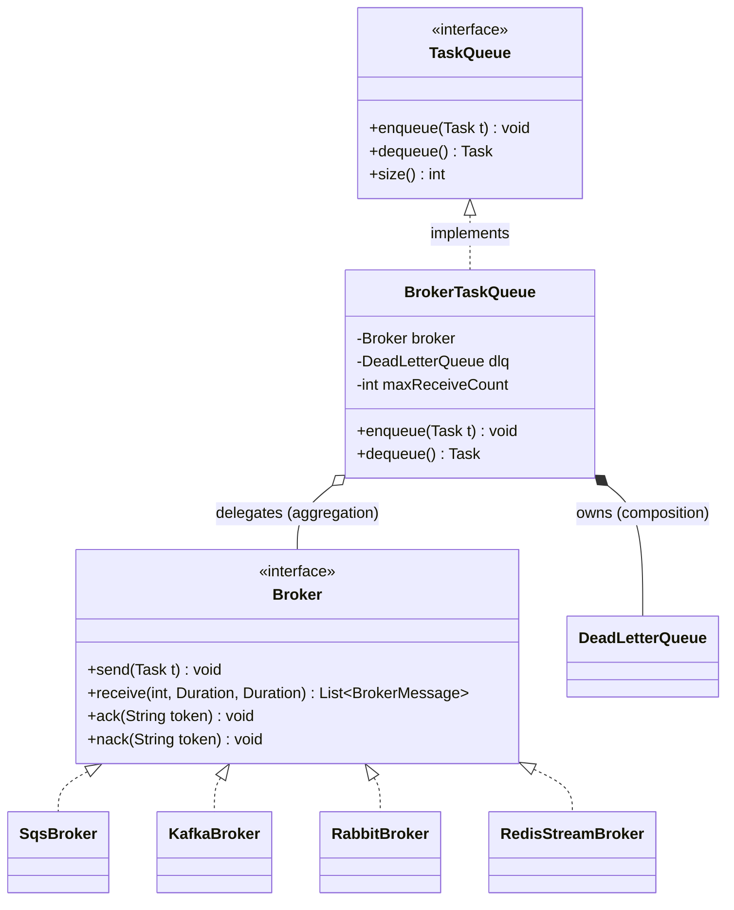

# Broker Comparison: RabbitMQ vs Kafka vs Redis Streams vs SQS

> Where this fits: In Phase 4 our `TaskQueue` port stops being an in-process `BlockingQueue` and becomes an adapter over a real distributed broker. This is the document you read *before* you type `docker-compose up` on RabbitMQ, Kafka, Redis, or before you create an SQS queue in the AWS console. The goal is not to memorize feature matrices — it is to reason about which broker's *semantics* match the `Task` workload, and to defend that choice in a design review or an interview.

This is a system-design chapter. We treat "pick a broker for the Task Queue platform" as a design problem: we write down the functional and non-functional requirements, do a capacity estimate, sketch the architecture, compare the four candidates along the axes that actually matter (throughput, ordering, durability, delivery guarantees, consumer model, retention, ops cost), produce a decision matrix, choose one, and then map the choice back onto our canonical `TaskQueue` interface so the rest of the codebase does not change.

---

## Why This Comparison Exists — The Real Problem

By Phase 4 the platform must accept tasks via an API that returns `202 Accepted` in single-digit milliseconds, persist each `Task` durably, and process it asynchronously across a *fleet* of worker nodes that can be scaled, deployed, and crashed independently. The in-memory `InMemoryTaskQueue` from [task-queues.md](./task-queues.md) cannot do this: it lives in one JVM's heap, so a restart loses every in-flight task and a second worker node has no way to pull from it.

The fix is to pull the queue out into a separate, durable, networked process — a **message broker** — as motivated in [message-queues.md](./message-queues.md). But "use a broker" is not a decision; it is the *start* of a decision. The four mainstream choices — RabbitMQ, Apache Kafka, Redis Streams, and Amazon SQS — descend from genuinely different lineages and make genuinely different tradeoffs. Picking the wrong one is one of the most expensive mistakes in backend engineering because the broker sits on the hot path of every task and migrating off it later means a dual-write, dual-read, drain-and-cutover migration under production load.

> **Historical lineage (each broker is a different idea about what a queue *is*).**
> - **RabbitMQ (2007, AMQP):** the broker is a *smart router*. Exchanges route messages to queues by binding rules; the broker tracks per-message acks and redelivers. Mailbox model — once consumed and acked, a message is gone.
> - **Kafka (2011, LinkedIn):** the broker is a *replicated, append-only log*. Consumers track their own offset into an immutable, partitioned, replayable stream. Nothing is deleted on read; data ages out by time/size.
> - **Redis Streams (2018, Redis 5.0):** an *in-memory log* (`XADD`/`XREADGROUP`) with consumer groups and a pending-entries list (PEL) for acks. Log-like semantics with Redis's speed, optionally persisted.
> - **SQS (2006, AWS):** a *managed, infinitely scalable mailbox* with the **visibility-timeout** model. You never run a server; you pay per request. Standard queues are at-least-once + best-effort ordering; FIFO queues add exactly-once-ish and per-group ordering.

---

## Requirements For Our Broker (Functional and Non-Functional)

Before comparing, write down what the *Task Queue platform* actually needs. A broker that is "better" on a benchmark but fails a hard requirement is the wrong broker.

**Functional requirements**

- **F1 — Point-to-point task delivery.** Exactly one worker should *successfully* run a given `Task`. (Delivery may happen more than once on failure; *success* must be idempotent — see [../08-distributed-systems/idempotency.md](../08-distributed-systems/idempotency.md).)
- **F2 — Durable enqueue.** Once `POST /tasks` returns `202`, the `Task` must survive a broker restart.
- **F3 — Redelivery on failure.** If a worker crashes mid-task (no ack), the task must become visible again for another worker. This is the ack / visibility-timeout machinery from [message-queues.md](./message-queues.md).
- **F4 — Dead-lettering.** After `maxAttempts` redeliveries a task moves to a `DeadLetterQueue` (see [dead-letter-queues.md](./dead-letter-queues.md)) instead of looping forever.
- **F5 — Delay / scheduling.** A `Task` with a future `scheduledAt` must not be delivered early (see [delayed-queues.md](./delayed-queues.md) and [scheduling-queues.md](./scheduling-queues.md)).
- **F6 — Priority (nice-to-have).** Higher-`priority` tasks should be preferred (see [priority-queues.md](./priority-queues.md)). Most brokers do *not* support this natively; we usually emulate it with separate queues.
- **F7 — Pub/sub for lifecycle events.** The Phase 4 `EventBus` fans `TaskEvent`s out to many `TaskEventListener`s — a *different* communication pattern than task delivery.

**Non-functional requirements**

- **N1 — Latency:** producer enqueue p99 < 10 ms (so the API returns fast). End-to-end task pickup latency target < 100 ms under normal load.
- **N2 — Throughput:** must handle our peak (estimated below) with headroom.
- **N3 — Durability:** no acknowledged task may be silently lost. Target: survive single-node failure with zero loss.
- **N4 — Operability:** a small team must be able to run it. Managed > self-hosted unless self-hosting buys something specific.
- **N5 — Cost:** predictable and proportional to load.
- **N6 — Horizontal scale:** add worker nodes without reconfiguring the broker; partition/shard the workload (see [../08-distributed-systems/sharding.md](../08-distributed-systems/sharding.md)).

---

## Capacity Estimate (Back of the Envelope)

You cannot pick a broker without knowing the order of magnitude of load. Assume a mid-size SaaS:

- **Submission rate:** 200 tasks/sec average, 2,000 tasks/sec peak (10x burst factor for promotions, batch jobs, retries).
- **Task payload:** the `Task.payload` JSON is ~1 KB; the full envelope (id, type, status, timestamps, headers) ~2 KB on the wire.
- **Retention need:** failed/retrying tasks may linger; we want ~7 days of replay-ability for debugging and reprocessing.
- **Fan-out for events:** each task produces ~3 `TaskEvent`s (enqueued, started, completed), so the *event* stream is ~3x the task rate.

**Derived numbers**

| Quantity | Calculation | Result |
| --- | --- | --- |
| Peak ingress bandwidth | 2,000 msg/s x 2 KB | ~4 MB/s (32 Mbps) |
| Avg messages/day | 200 msg/s x 86,400 s | ~17.3 M/day |
| Storage for 7-day retention | 17.3M/day x 7 x 2 KB | ~242 GB |
| Event stream peak | 3 x 2,000 = 6,000 msg/s | ~12 MB/s |
| In-flight at any moment | 2,000 msg/s x ~5 s avg processing | ~10,000 in-flight |

**What this tells us:** 2,000–6,000 msg/s and a few hundred GB of retention is *small* by every one of these brokers' standards — all four can do it. So throughput is **not** the deciding factor at this scale; **operability, delivery semantics, retention/replay, and cost** are. (If peak were 500,000 msg/s — a clickstream or IoT firehose — Kafka would win on throughput alone and the conversation would be over.) Always do this estimate first; it tells you which axis the decision actually turns on. See [../10-system-design/capacity-estimation.md](../10-system-design/capacity-estimation.md).

---

## High-Level Architecture (Where the Broker Sits)

```mermaid
flowchart LR
  subgraph Client
    C[HTTP Client]
  end
  subgraph API["API Layer (Spring Boot)"]
    TC[TaskController\nPOST /tasks]
    RL[RateLimiter\ntoken bucket]
  end
  subgraph Broker["Broker (the pluggable choice)"]
    TQ[(Task Queue / Topic\nRabbitMQ | Kafka | Redis | SQS)]
    DLQ[(Dead Letter Queue)]
  end
  subgraph Workers["Worker Fleet (horizontally scaled)"]
    W1[Worker node 1]
    W2[Worker node 2]
    W3[Worker node N]
  end
  subgraph Events["Event Plane"]
    EB{{EventBus topic}}
    L1[MetricsListener]
    L2[AuditListener]
  end
  DB[(PostgreSQL\nsystem of record)]

  C --> TC --> RL -->|enqueue Task| TQ
  TC -->|save| DB
  TQ -->|dequeue/poll| W1 & W2 & W3
  W1 & W2 & W3 -->|redelivery on no-ack| TQ
  W1 & W2 & W3 -->|maxAttempts exceeded| DLQ
  W1 & W2 & W3 -->|publish TaskEvent| EB
  EB --> L1 & L2
```

Two distinct planes, deliberately: a **point-to-point task plane** (one worker per task) and a **pub/sub event plane** (many listeners per event). Some brokers do both well; some force you to run two systems. That is itself a selection criterion.

---

## The Four Brokers, Axis by Axis

### Architecture and mental model

| Broker | Core abstraction | What "consume" means | Server model |
| --- | --- | --- | --- |
| **RabbitMQ** | Exchange routes to **queues**; broker pushes to consumers | Broker deletes message after ack | Self-hosted cluster (or CloudAMQP) |
| **Kafka** | **Partitioned append-only log** (topics); consumer pulls by offset | Advance your offset; data stays until retention | Self-hosted cluster (or MSK/Confluent) |
| **Redis Streams** | In-memory **log** with consumer groups + PEL | `XACK` removes from your pending list | Self-hosted Redis (or Elasticache/Upstash) |
| **SQS** | Managed **mailbox** with visibility timeout | `DeleteMessage` after processing | Fully managed by AWS (no servers) |

### Throughput and latency

| Broker | Typical single-cluster throughput | Producer enqueue latency | Notes |
| --- | --- | --- | --- |
| **RabbitMQ** | ~20K–50K msg/s/node (more without durability) | ~1–5 ms | Throughput drops with persistence + manual acks; classic queues are memory-bound |
| **Kafka** | **Millions msg/s** per cluster; designed for firehoses | ~1–10 ms (batched) | Sequential disk writes + zero-copy; throughput is its headline feature |
| **Redis Streams** | ~100K+ ops/s (in-memory) | **sub-ms** | Limited by single-threaded core + memory; AOF/RDB persistence adds latency |
| **SQS** | Standard: nearly unlimited (auto-scales). FIFO: 300 msg/s (3,000 batched) | ~10–30 ms (network round trip to AWS) | Higher base latency because every op is an HTTPS API call |

> For our 2,000–6,000 msg/s peak, all four clear the bar. SQS's per-message HTTPS latency (~20 ms) is the only one that grazes our N1 enqueue budget — mitigated with batched `SendMessageBatch` (up to 10/call).

### Ordering

| Broker | Ordering guarantee |
| --- | --- |
| **RabbitMQ** | Per-queue FIFO with a **single** consumer; lost as soon as you add consumers or use redelivery (a nacked message jumps back ahead of newer ones) |
| **Kafka** | **Strict per-partition ordering.** Choose the partition key = ordering key. This is Kafka's superpower for ordered streams |
| **Redis Streams** | Per-stream insertion order; with a consumer group, ordering across consumers is not guaranteed |
| **SQS** | Standard: **best-effort** (can reorder). FIFO: **strict per `MessageGroupId`** |

For our `Task` workload, *global* ordering is not required — tasks are independent. We only need **per-key ordering** when, say, all tasks for one `accountId` must run in submission order. Kafka (partition by `accountId`) or SQS FIFO (`MessageGroupId = accountId`) give that cleanly. See [../08-distributed-systems/message-ordering.md](../08-distributed-systems/message-ordering.md).

### Durability and delivery guarantees

| Broker | Durability | Default delivery | Exactly-once? |
| --- | --- | --- | --- |
| **RabbitMQ** | Durable queues + persistent messages + publisher confirms; quorum queues replicate via Raft | At-least-once (with manual acks) | No (idempotent consumer required) |
| **Kafka** | Replicated log (`replication.factor=3`, `acks=all`, `min.insync.replicas=2`) | At-least-once | **Yes**, within Kafka (idempotent producer + transactions); not across external side-effects |
| **Redis Streams** | AOF `appendfsync everysec` (≤1 s loss window) or `always` (slow); replicas can lose un-replicated writes on failover | At-least-once (PEL + `XACK`) | No |
| **SQS** | Managed, replicated across AZs; messages stored redundantly | Standard: at-least-once. FIFO: exactly-once *delivery* within the dedup window (5 min) | FIFO: effectively, with `MessageDeduplicationId` |

**Key truth for interviews:** *exactly-once* end-to-end (including the worker's side-effect on PostgreSQL or a payment API) is **impossible** to get from the broker alone. Even Kafka's exactly-once is within Kafka's own log. The moment your `TaskHandler` calls an external system, you need an **idempotent handler keyed by `Task.id`**. So we design every handler to be idempotent and treat the broker as **at-least-once** regardless of which one we pick. See [../08-distributed-systems/idempotency.md](../08-distributed-systems/idempotency.md) and [../08-distributed-systems/retries.md](../08-distributed-systems/retries.md).

### Consumer model (push vs pull) and backpressure

| Broker | Model | Backpressure mechanism |
| --- | --- | --- |
| **RabbitMQ** | **Push** (`basic.consume`) with prefetch limit | Set `prefetch` so the broker doesn't flood a slow worker |
| **Kafka** | **Pull** (poll loop) | Natural — consumer pulls only when ready; `max.poll.records` bounds a batch |
| **Redis Streams** | **Pull** (`XREADGROUP BLOCK`) | Natural — blocking read with count limit |
| **SQS** | **Pull** (long-poll `ReceiveMessage`) | Natural — workers poll on their own cadence |

Our canonical `TaskQueue.dequeue()` is a **pull** API — a `Worker` pulls only when free, giving automatic backpressure without flow-control machinery (see [../08-distributed-systems/backpressure.md](../08-distributed-systems/backpressure.md)). Kafka, Redis, and SQS map onto this directly. RabbitMQ is push-native, so the adapter must set a conservative prefetch and translate pushed deliveries into a bounded internal buffer that `dequeue()` drains.

### Retention and replay

| Broker | Retention model | Replay? |
| --- | --- | --- |
| **RabbitMQ** | Until acked (then gone) | No — a consumed message is deleted. Replay requires re-publishing |
| **Kafka** | Time/size based (e.g. 7 days, 1 TB) regardless of consumption | **Yes** — reset offset and re-read. This is huge for debugging and reprocessing |
| **Redis Streams** | Capped by `MAXLEN`/`MINID` (you trim it); kept in RAM | Yes within the retained window, but RAM-bounded |
| **SQS** | Up to 14 days; deleted after `DeleteMessage` or expiry | No replay of processed messages |

Retention/replay is where Kafka separates from the pack. For a task platform, the ability to *replay last Tuesday's failed payment tasks* after fixing a bug is operationally golden — and it is exactly the "replayable log" idea Kafka was built on.

### Delay, scheduling, priority

| Broker | Native delay | Native priority |
| --- | --- | --- |
| **RabbitMQ** | Via TTL + dead-letter-exchange, or the delayed-message plugin | **Yes** — `x-max-priority` queues (rare among brokers) |
| **Kafka** | No native delay; emulate with a tumbling delay topic or external scheduler | No |
| **Redis Streams** | No native delay; emulate with a sorted set (ZSET scored by due time) feeding the stream | No |
| **SQS** | **Yes** — `DelaySeconds` up to 15 min per message; queue-level delay | No |

For F5 (delay), SQS and RabbitMQ are most convenient. With Kafka/Redis we keep the **`TaskScheduler` from our domain model** (backed by a `DelayQueue`/`ScheduledExecutorService`, see [delayed-queues.md](./delayed-queues.md)) and only push to the broker when a task is *due* — which keeps scheduling logic in our code and out of the broker. For F6 (priority), only RabbitMQ is native; elsewhere we run **separate high/low queues** and have workers prefer the high queue (see [priority-queues.md](./priority-queues.md)).

### Operational cost and complexity

| Broker | Ops burden | Cost shape |
| --- | --- | --- |
| **RabbitMQ** | Medium — cluster, quorum queues, mirroring, partition handling; well-trodden | Self-host infra, or CloudAMQP per-node pricing |
| **Kafka** | **High** — brokers + (historically) ZooKeeper/KRaft, partitions, consumer-group rebalancing, retention tuning; powerful but heavy | Self-host (significant), or MSK/Confluent (premium) |
| **Redis Streams** | Low–medium if you already run Redis; single-threaded core limits scale-up | Cheap RAM-bound; Elasticache/Upstash managed |
| **SQS** | **Lowest** — zero servers, zero patching, auto-scales | Pay per request (~$0.40 per million); cheap at our volume |

For a small team at 2,000–6,000 msg/s, the *ops* column dominates: Kafka's power is real but its operational tax is the highest, and we are not using its headline feature (firehose throughput).

---

## Decision Matrix

Weighted scoring against *our* requirements (weights reflect what the Task Queue platform actually values; 1 = poor, 5 = excellent). Your weights will differ for a different workload — that is the point.

| Criterion (weight) | RabbitMQ | Kafka | Redis Streams | SQS |
| --- | :---: | :---: | :---: | :---: |
| Durability (x5) | 4 | 5 | 3 | 5 |
| At-least-once + redelivery (x5) | 5 | 4 | 4 | 5 |
| Operability for small team (x4) | 3 | 2 | 3 | **5** |
| Native delay/scheduling (x3) | 4 | 2 | 2 | 5 |
| Native priority (x2) | **5** | 1 | 1 | 1 |
| Replay/retention (x3) | 2 | **5** | 3 | 2 |
| Per-key ordering (x2) | 2 | **5** | 3 | 4 |
| Throughput headroom (x2) | 3 | **5** | 4 | 4 |
| Cost predictability (x3) | 3 | 2 | 4 | 4 |
| Pub/sub for EventBus (x3) | 4 | **5** | 3 | 3 (needs SNS) |
| **Weighted total (max 160)** | **107** | **120** | **99** | **128** |

Read the matrix honestly: **SQS wins on operability/durability/delay/cost** (it is the pragmatic default for a small team on AWS), while **Kafka wins on replay/ordering/throughput/pub-sub** (the choice if you expect to grow into a streaming platform or need replay). RabbitMQ is the balanced middle with the unique priority-queue feature. Redis Streams is the "I already run Redis and want it fast and simple" option but its RAM-bound durability is the weakest fit for financial tasks.

---

## Ideal Use Cases (When Each Is the Right Answer)

> Pick the broker whose *design center* matches your workload, not the one with the longest feature list.

- **RabbitMQ** — Complex routing (topic/fanout/header exchanges), per-message **priority**, RPC-style request/reply, moderate throughput, you want a battle-tested traditional broker. Classic fit for *task/work queues* with rich routing.
- **Kafka** — High-throughput **event streaming**, **replay**ability, multiple independent consumer groups reading the same data, strict per-key ordering, log/CDC/analytics pipelines. Overkill for a simple work queue; perfect when the queue *is* the data backbone.
- **Redis Streams** — You already run Redis, want **sub-ms** latency, modest durability needs, simple consumer groups, and low operational appetite. Great for ephemeral or near-real-time work; risky as the durable system of record.
- **SQS** — You are on AWS, want **zero ops**, at-least-once with built-in visibility-timeout redelivery, native delay and DLQ, and pay-per-use. The default cloud work queue; pair with **SNS** for fan-out.

---

## Which Broker We Pick For the Task Queue — and Why

Our decision is **stage-dependent**, and saying so out loud is the senior move:

1. **Phase 4 default — start with SQS (or RabbitMQ if not on AWS).** At 2,000–6,000 msg/s with a small team, SQS satisfies F1–F5 out of the box: durable, at-least-once, native visibility-timeout redelivery (F3), native `DelaySeconds` (F5), native DLQ via redrive policy (F4), zero servers. It scores highest on *our* weighted matrix because our bottleneck is operability and delivery semantics, **not** throughput. Off AWS, **RabbitMQ** gives the same semantics plus native priority (F6) at the cost of running a cluster.

2. **Phase 4+ — add Kafka when replay, multi-consumer fan-out, or ordering become first-class.** The instant the platform needs to (a) **replay** historical tasks after a bug fix, (b) feed the same task stream into *several* independent consumers (workers + analytics + audit), or (c) guarantee **per-key ordering** at high volume, Kafka earns its operational tax. It also makes the Phase 4 **`EventBus`** trivial: lifecycle `TaskEvent`s become a Kafka topic with many consumer groups.

3. **A common production shape is hybrid:** **SQS/RabbitMQ for the task plane** (point-to-point work with visibility-timeout redelivery) and **Kafka for the event plane** (replayable, multi-subscriber `TaskEvent` stream). Each plane uses the broker whose design center matches it.

Because our domain depends only on the `TaskQueue` *interface*, none of this leaks into business logic — and that is the entire point of the port-and-adapter design we set up in [message-queues.md](./message-queues.md) and [../04-oop-and-ood/hexagonal-architecture.md](../04-oop-and-ood/hexagonal-architecture.md).

---

## Mapping Each Broker Onto Our `TaskQueue` Port

Our canonical port never changes:

```java
public interface TaskQueue {
    void enqueue(Task t);
    Task dequeue() throws InterruptedException;
    int size();
}
```

We already defined (in [message-queues.md](./message-queues.md)) a narrow `Broker` SPI so the production `BrokerTaskQueue` adapter is broker-agnostic. Here is that SPI plus a concrete adapter per technology — this is the "pluggable broker" the SPEC calls for in Phase 4.

```java
/** A message as the broker hands it back: payload plus the token needed to ack/nack. */
public record BrokerMessage(String ackToken, Task task, int receiveCount) {}

/** Minimal broker SPI; one implementation per technology. The domain never sees this. */
public interface Broker {
    void send(Task t);
    List<BrokerMessage> receive(int max, Duration waitFor, Duration visibility) throws InterruptedException;
    void ack(String ackToken);
    void nack(String ackToken);   // make visible again immediately
    int approximateSize();
}
```

### SQS adapter (visibility-timeout model)

```java
import software.amazon.awssdk.services.sqs.SqsClient;
import software.amazon.awssdk.services.sqs.model.*;

public final class SqsBroker implements Broker {
    private final SqsClient sqs;
    private final String queueUrl;
    private final ObjectMapper json;   // Task <-> JSON

    public SqsBroker(SqsClient sqs, String queueUrl, ObjectMapper json) {
        this.sqs = sqs; this.queueUrl = queueUrl; this.json = json;
    }

    @Override public void send(Task t) {
        var req = SendMessageRequest.builder()
            .queueUrl(queueUrl)
            .messageBody(toJson(t))
            // F5: native per-message delay, capped at 900 s.
            .delaySeconds((int) Math.min(900, secondsUntil(t.scheduledAt())))
            .build();
        sqs.sendMessage(req);                         // durable, at-least-once
    }

    @Override public List<BrokerMessage> receive(int max, Duration waitFor, Duration visibility)
            throws InterruptedException {
        var resp = sqs.receiveMessage(ReceiveMessageRequest.builder()
            .queueUrl(queueUrl)
            .maxNumberOfMessages(Math.min(10, max))   // SQS batch cap
            .waitTimeSeconds((int) waitFor.toSeconds())          // long-poll
            .visibilityTimeout((int) visibility.toSeconds())     // F3 redelivery clock
            .messageAttributeNames("All")
            .build());
        return resp.messages().stream()
            .map(m -> new BrokerMessage(
                m.receiptHandle(),                    // the ack token
                fromJson(m.body()),
                receiveCountOf(m)))                   // ApproximateReceiveCount
            .toList();
    }

    @Override public void ack(String ackToken) {
        sqs.deleteMessage(b -> b.queueUrl(queueUrl).receiptHandle(ackToken));
    }

    @Override public void nack(String ackToken) {
        // Set visibility to 0 -> immediately redeliverable.
        sqs.changeMessageVisibility(b -> b.queueUrl(queueUrl)
            .receiptHandle(ackToken).visibilityTimeout(0));
    }

    @Override public int approximateSize() {
        var a = sqs.getQueueAttributes(b -> b.queueUrl(queueUrl)
            .attributeNames(QueueAttributeName.APPROXIMATE_NUMBER_OF_MESSAGES));
        return Integer.parseInt(a.attributes()
            .getOrDefault(QueueAttributeName.APPROXIMATE_NUMBER_OF_MESSAGES, "0"));
    }
    // toJson/fromJson/secondsUntil/receiveCountOf omitted for brevity.
}
```

> Note: with SQS we configure the **redrive policy** (a `RedrivePolicy` pointing at a dead-letter queue with `maxReceiveCount`) in infrastructure, so F4 dead-lettering happens *in the broker* once `receiveCount` exceeds the limit — our adapter doesn't have to implement it.

### Kafka adapter (offset-commit model)

```java
import org.apache.kafka.clients.consumer.*;
import org.apache.kafka.clients.producer.*;

public final class KafkaBroker implements Broker {
    private final KafkaProducer<String, String> producer;
    private final KafkaConsumer<String, String> consumer;   // one per Worker thread
    private final String topic;
    private final ObjectMapper json;

    @Override public void send(Task t) {
        // Partition by a stable key for F-ordering (e.g. accountId from payload),
        // else by Task.id for even spread. acks=all + idempotent producer = durable.
        producer.send(new ProducerRecord<>(topic, partitionKey(t), toJson(t)));
    }

    @Override public List<BrokerMessage> receive(int max, Duration waitFor, Duration visibility)
            throws InterruptedException {
        ConsumerRecords<String, String> recs = consumer.poll(waitFor);   // pull model
        var out = new ArrayList<BrokerMessage>();
        for (var r : recs) {
            // ackToken encodes topic-partition-offset; ack = commit that offset.
            String token = r.topic() + ":" + r.partition() + ":" + r.offset();
            out.add(new BrokerMessage(token, fromJson(r.value()), 0));
            if (out.size() >= max) break;
        }
        return out;
    }

    @Override public void ack(String ackToken) {
        var p = ackToken.split(":");
        var tp = new TopicPartition(p[0], Integer.parseInt(p[1]));
        long offset = Long.parseLong(p[2]);
        consumer.commitSync(Map.of(tp, new OffsetAndMetadata(offset + 1)));
    }

    @Override public void nack(String ackToken) {
        // Kafka has no per-message nack: seek back to re-read on next poll.
        var p = ackToken.split(":");
        consumer.seek(new TopicPartition(p[0], Integer.parseInt(p[1])), Long.parseLong(p[2]));
    }

    @Override public int approximateSize() { return -1; /* lag, not size; query via admin/JMX */ }
    // producer config: enable.idempotence=true, acks=all, retries=Integer.MAX_VALUE
    // consumer config: enable.auto.commit=false, max.poll.records=max
}
```

> Kafka's redelivery is **coarser**: a "nack" rewinds the offset and re-reads everything after it, so dead-lettering and per-message retry must be implemented in *our* code (a retry topic + a `DeadLetterQueue.send` after `maxAttempts`). This is more work than SQS — the price of replayability and ordering.

### RabbitMQ and Redis Streams (sketch)

```java
// RabbitMQ: push -> bounded internal buffer; ack token = delivery tag.
//   channel.basicQos(prefetch);                       // backpressure for push model
//   channel.basicConsume(queue, false, deliverCallback, cancelCallback);
//   ack(token)  -> channel.basicAck(deliveryTag, false);
//   nack(token) -> channel.basicNack(deliveryTag, false, true);  // requeue=true
//   F5 delay   -> x-delayed-message exchange or TTL+DLX; F6 priority -> x-max-priority queue.

// Redis Streams: log + consumer group + pending-entries list (PEL).
//   send(t)        -> XADD tasks * id <id> payload <json>
//   receive(...)   -> XREADGROUP GROUP workers <consumer> BLOCK <ms> COUNT <max> STREAMS tasks >
//   ack(entryId)   -> XACK tasks workers <entryId>
//   redelivery     -> XAUTOCLAIM reclaims PEL entries idle past the visibility window
//   F5 delay       -> ZADD due <dueEpoch> <taskId>; a sweeper XADDs entries whose score <= now.
```

Each adapter implements the *same* `Broker` SPI; the domain-facing `BrokerTaskQueue` (durable, at-least-once, DLQ-aware) from [message-queues.md](./message-queues.md) wraps any of them unchanged. Swapping brokers is a Spring `@Bean` change plus config — exactly the extensibility hexagonal architecture promises.



---

## Tradeoffs (Honest, Cross-Cutting)

| Dimension | What you gain | What you pay |
| --- | --- | --- |
| **Managed (SQS) vs self-hosted (Kafka/RabbitMQ/Redis)** | Zero ops, auto-scale, AZ-redundant | Vendor lock-in, per-request cost, less control over internals, ~20 ms base latency |
| **Log (Kafka/Redis) vs mailbox (RabbitMQ/SQS)** | Replay, multi-consumer fan-out, ordering | Manual per-message retry/DLQ, offset/PEL management, more consumer-side code |
| **At-least-once (all) vs exactly-once (Kafka-internal)** | Simplicity, no lost work | Duplicates -> handlers MUST be idempotent on `Task.id` |
| **Push (RabbitMQ) vs pull (rest)** | Push = lower latency | Push needs prefetch/flow control to avoid overwhelming slow workers |
| **In-memory (Redis) vs disk/replicated (rest)** | Sub-ms latency | Durability is RAM-bound; failover can drop un-replicated writes |
| **One broker for everything vs broker-per-plane** | Fewer systems to run | One broker rarely excels at both point-to-point work *and* replayable fan-out |

> The single most important tradeoff: **delivery semantics are not free and exactly-once does not exist end-to-end.** Design idempotent handlers and treat every broker as at-least-once. Then the broker choice becomes about ops, cost, replay, and ordering — not about correctness, which you own.

---

## Common Mistakes and Pitfalls

- **Choosing Kafka because it is "the standard."** Kafka is a streaming *log*, not a *work queue*. Using it as a simple task queue means hand-rolling per-message acks, retries, and DLQs that SQS/RabbitMQ give for free. Fix: match the broker's design center to the workload.
- **Assuming exactly-once because the docs say so.** Kafka EOS is *within Kafka*; the moment your handler writes to PostgreSQL or calls Stripe, you are at-least-once. Fix: idempotency keyed by `Task.id`.
- **Forgetting visibility-timeout tuning (SQS/Redis).** Too short -> a slow task is redelivered while still running (duplicate work); too long -> a crashed worker's task is stuck for ages. Fix: set visibility ≈ p99 processing time x safety factor, and **extend it** (heartbeat) for long tasks.
- **Push without prefetch (RabbitMQ).** Default unlimited prefetch floods one consumer; it grabs thousands of messages, then crashes and they all redeliver. Fix: `basicQos(prefetch)` sized to concurrency.
- **Unbounded Redis stream.** `XADD` forever exhausts RAM and OOM-kills Redis. Fix: `XADD ... MAXLEN ~ N` or a trimming sweeper.
- **Ignoring consumer-group rebalancing (Kafka).** Adding/removing workers triggers a rebalance that pauses consumption; long `max.poll.interval.ms` tasks get the consumer kicked out. Fix: keep processing under the poll interval or use cooperative rebalancing / background processing.
- **Expecting ordering with multiple consumers.** Per-queue FIFO (RabbitMQ) and best-effort (SQS standard) evaporate with concurrency. Fix: Kafka partition key or SQS FIFO `MessageGroupId` when you truly need per-key order.
- **No DLQ.** A poison message redelivers forever, burning CPU and blocking the queue head. Fix: redrive policy / `maxAttempts` -> `DeadLetterQueue` (see [dead-letter-queues.md](./dead-letter-queues.md)).

---

## Refactoring Exercise: From Hardcoded Broker to Pluggable Port

**Bad — business logic talks to the SDK directly (broker is welded into the service):**

```java
public class TaskSubmissionService {
    private final SqsClient sqs = SqsClient.create();   // hardwired vendor
    private final String url = "https://sqs.../tasks";

    public void submit(Task t) {
        sqs.sendMessage(b -> b.queueUrl(url).messageBody(t.payload()));  // leaks SQS everywhere
    }
}
```

Problems: cannot test without AWS, cannot switch brokers, vendor types leak into the domain, no durability/retry policy in one place.

**Improved — depend on the `TaskQueue` port; inject the implementation:**

```java
public class TaskSubmissionService {
    private final TaskQueue queue;   // port, not a vendor SDK
    public TaskSubmissionService(TaskQueue queue) { this.queue = queue; }
    public void submit(Task t) { queue.enqueue(t); }   // broker-agnostic
}
```

**Production — wire the adapter via Spring config, selectable by property:**

```java
@Configuration
public class QueueConfig {
    @Bean @ConditionalOnProperty(name = "broker", havingValue = "sqs")
    TaskQueue sqsQueue(SqsClient sqs, @Value("${queue.url}") String url,
                       DeadLetterQueue dlq, ObjectMapper json) {
        return new BrokerTaskQueue(new SqsBroker(sqs, url, json), dlq,
                /* maxReceiveCount */ 5, Duration.ofSeconds(30), Duration.ofSeconds(20));
    }

    @Bean @ConditionalOnProperty(name = "broker", havingValue = "kafka")
    TaskQueue kafkaQueue(KafkaProducer<String,String> p, KafkaConsumer<String,String> c,
                         @Value("${topic}") String topic, DeadLetterQueue dlq, ObjectMapper json) {
        return new BrokerTaskQueue(new KafkaBroker(p, c, topic, json), dlq,
                5, Duration.ofSeconds(30), Duration.ofSeconds(20));
    }
}
```

Now `broker=sqs` vs `broker=kafka` in `application.yml` swaps the entire backbone with zero domain code changes. That is the payoff of designing to the port.

---

## Exercises

### Easy

1. **Knowledge check.** For each broker (RabbitMQ, Kafka, Redis Streams, SQS), state its core abstraction in one phrase and whether a consumed message is *deleted* or *retained*.
2. **Coding.** Add a `RabbitBroker implements Broker` skeleton with correct `ack`/`nack` semantics (`basicAck` / `basicNack(requeue=true)`) and a `basicQos` prefetch in the constructor.

### Medium

3. **Refactoring.** Take the "bad" `TaskSubmissionService` above and refactor it to the port, then write a JUnit 5 + Mockito test that verifies `submit` calls `queue.enqueue` exactly once — *without any real broker*.
4. **Design.** Our workload needs per-`accountId` ordering for 5% of tasks but no ordering for the rest. Propose a topology that gives ordering only where needed (a) on Kafka and (b) on SQS FIFO, and explain the throughput cost of each.

### Hard

5. **Interview-style.** You must support **replay of the last 7 days of tasks** after a bug fix, **and** keep visibility-timeout redelivery for the live task plane, **and** run with a 3-person team. Design the broker topology. Justify single-broker vs hybrid, name the brokers, and state the failure modes you accept.
6. **Stretch.** Implement an *idempotent consumer* wrapper: given any `Broker`, dedupe by `Task.id` using a PostgreSQL `processed_tasks(id PRIMARY KEY, processed_at)` table so a redelivered task's side-effect runs at most once. Handle the race where two workers receive the same redelivered task concurrently.

---

## Solutions

**1.** RabbitMQ — *smart router with per-message acks*; **deleted** on ack. Kafka — *partitioned append-only log*; **retained** until retention expiry (offset advances, data stays). Redis Streams — *in-memory log with consumer groups + PEL*; **retained** until trimmed (`XACK` removes from your PEL, not the stream). SQS — *managed mailbox with visibility timeout*; **deleted** on `DeleteMessage`/expiry.

**2.**

```java
public final class RabbitBroker implements Broker {
    private final Channel channel;
    private final String queue;
    private final ObjectMapper json;
    private final BlockingQueue<BrokerMessage> buffer = new LinkedBlockingQueue<>();

    public RabbitBroker(Channel channel, String queue, int prefetch, ObjectMapper json) throws IOException {
        this.channel = channel; this.queue = queue; this.json = json;
        channel.basicQos(prefetch);   // backpressure: cap unacked messages per consumer
        channel.basicConsume(queue, false /* manual ack */,
            (tag, delivery) -> buffer.offer(new BrokerMessage(
                String.valueOf(delivery.getEnvelope().getDeliveryTag()),
                fromJson(new String(delivery.getBody(), StandardCharsets.UTF_8)),
                0)),
            tag -> {});
    }

    @Override public void send(Task t) throws IOException {
        channel.basicPublish("", queue,
            MessageProperties.PERSISTENT_TEXT_PLAIN,           // durable message
            toJson(t).getBytes(StandardCharsets.UTF_8));
    }

    @Override public List<BrokerMessage> receive(int max, Duration waitFor, Duration vis)
            throws InterruptedException {
        var out = new ArrayList<BrokerMessage>();
        BrokerMessage first = buffer.poll(waitFor.toMillis(), TimeUnit.MILLISECONDS);
        if (first != null) { out.add(first); buffer.drainTo(out, max - 1); }
        return out;
    }

    @Override public void ack(String token) throws IOException {
        channel.basicAck(Long.parseLong(token), false);
    }
    @Override public void nack(String token) throws IOException {
        channel.basicNack(Long.parseLong(token), false, true /* requeue */);
    }
    @Override public int approximateSize() throws IOException {
        return channel.messageCount(queue);
    }
    // toJson/fromJson omitted.
}
```

The push-to-pull bridge (consumer callback fills a `BlockingQueue` that `receive` drains) makes RabbitMQ's push model satisfy our pull-shaped `Broker` SPI; `basicQos` provides the backpressure that pull brokers get for free.

**3.**

```java
class TaskSubmissionServiceTest {
    @Test void submitEnqueuesExactlyOnce() {
        TaskQueue queue = mock(TaskQueue.class);
        var service = new TaskSubmissionService(queue);
        Task t = new Task(UUID.randomUUID().toString(), "email", "{}",
                TaskStatus.PENDING, 0, 5, Instant.now(), Instant.now(), 0);

        service.submit(t);

        verify(queue, times(1)).enqueue(t);
        verifyNoMoreInteractions(queue);
    }
}
```

No broker needed — the port made the service unit-testable in microseconds. This is the testability argument for hexagonal architecture made concrete.

**4.** **(a) Kafka:** create the topic with N partitions; produce ordering-sensitive tasks with `key = accountId` (Kafka guarantees per-partition order, and one key always maps to one partition), and ordering-agnostic tasks with `key = Task.id` (even spread). Cost: per-key ordering caps that key's throughput to one partition's consumer; a hot `accountId` is a hot partition. **(b) SQS FIFO:** put ordered tasks on a **FIFO** queue with `MessageGroupId = accountId` (strict order per group, parallel across groups) and unordered tasks on a cheaper, faster **standard** queue. Cost: FIFO caps at 300 msg/s (3,000 batched) per queue and is pricier; splitting planes keeps the bulk on the standard queue.

**5.** **Hybrid topology.** Task plane on **SQS** (standard queue + redrive policy to a DLQ): native visibility-timeout redelivery, native delay, native DLQ, zero ops — ideal for a 3-person team. Event/replay plane on **Kafka**: every task lifecycle transition is published as a `TaskEvent` to a Kafka topic with **7-day retention**, so "replay the last 7 days" = reset a consumer group's offset and reprocess. Single-broker alternatives fail: SQS alone cannot replay processed messages; Kafka alone forces you to hand-build visibility-timeout, per-message retry, and DLQ logic the small team cannot afford to maintain. **Accepted failure modes:** at-least-once on both planes (handlers idempotent on `Task.id`); SQS ~20 ms base latency (fine vs our 100 ms target); Kafka requires running a cluster (or MSK) — the one piece of ops we accept *because replay is a hard requirement*.

**6.**

```java
public final class IdempotentBroker implements Broker {
    private final Broker delegate;
    private final DataSource ds;
    public IdempotentBroker(Broker delegate, DataSource ds) { this.delegate = delegate; this.ds = ds; }

    @Override public void send(Task t) throws Exception { delegate.send(t); }
    @Override public List<BrokerMessage> receive(int m, Duration w, Duration v) throws InterruptedException, Exception {
        return delegate.receive(m, w, v);
    }
    @Override public void ack(String token) throws Exception { delegate.ack(token); }
    @Override public void nack(String token) throws Exception { delegate.nack(token); }
    @Override public int approximateSize() throws Exception { return delegate.approximateSize(); }

    /** Call inside the Worker BEFORE running the handler. Returns true if THIS worker
     *  won the right to process this task; false if it was already processed. */
    public boolean claim(Task t) {
        // INSERT ... ON CONFLICT DO NOTHING is atomic: exactly one of N racing
        // workers inserts the row; the rest get 0 rows affected and skip.
        String sql = "INSERT INTO processed_tasks(id, processed_at) VALUES (?, now()) "
                   + "ON CONFLICT (id) DO NOTHING";
        try (var c = ds.getConnection(); var ps = c.prepareStatement(sql)) {
            ps.setString(1, t.id());
            return ps.executeUpdate() == 1;   // 1 = we inserted = we own it
        } catch (SQLException e) { throw new RuntimeException(e); }
    }
}
```

The race is resolved by the database primary key: `INSERT ... ON CONFLICT DO NOTHING` is atomic, so among concurrent redeliveries exactly one worker's insert succeeds (returns 1) and proceeds; the others get 0 and skip the side-effect, then ack. For the strongest guarantee, perform `claim` and the side-effect in the **same transaction** so a crash between them rolls back the claim and the task safely redelivers.

---

## Interview Questions and Takeaways

1. **"Kafka or RabbitMQ for a task queue?"** — RabbitMQ if you want a *work queue* with per-message acks, routing, priority, and moderate throughput. Kafka if you need *replay*, *per-key ordering at scale*, or multiple independent consumer groups on one stream. Kafka as a plain work queue means rebuilding acks/retries/DLQ yourself.
2. **"Can a broker give exactly-once delivery?"** — Not end-to-end. Kafka offers exactly-once *within Kafka*; the instant a handler touches an external system you are at-least-once. Correctness comes from **idempotent handlers keyed by `Task.id`**, not from the broker.
3. **"What is a visibility timeout and how do you tune it?"** — After `receive`, a message is hidden for the visibility window; if not deleted/acked before it expires, it redelivers. Set it ≈ p99 processing time x safety factor; for long tasks, heartbeat-extend it. Too short = duplicate work; too long = slow recovery from crashes.
4. **"Push vs pull — which and why?"** — Pull (Kafka/SQS/Redis) gives natural backpressure: consumers fetch when ready. Push (RabbitMQ) is lower-latency but needs prefetch/flow control so a slow consumer isn't flooded. Our `TaskQueue.dequeue()` is deliberately pull.
5. **"How do you get replay?"** — Use a log-structured broker (Kafka or Redis Streams) and reset the consumer offset to re-read retained data. Mailbox brokers (RabbitMQ/SQS) delete on ack, so replay requires re-publishing from a separate system of record (our PostgreSQL).
6. **"Single broker or one per communication pattern?"** — Often one per pattern: a mailbox broker for point-to-point work (visibility-timeout redelivery) and a log broker for replayable multi-subscriber events. One broker rarely excels at both.
7. **"How do you choose under real constraints?"** — Write requirements, do a capacity estimate to find which axis the decision turns on, weight a matrix by *your* values, and pick the broker whose design center matches — then defend the tradeoffs you accepted.

**Takeaways:** (a) match the broker's *design center* to the workload, not the feature list; (b) capacity estimate first — it reveals whether throughput even matters; (c) treat every broker as at-least-once and own idempotency; (d) hide the choice behind the `TaskQueue` port so it is reversible.

---

## Production Considerations

- **Monitoring.** Track queue **depth/lag** (SQS `ApproximateNumberOfMessages`, Kafka consumer lag, Redis stream length, RabbitMQ `messageCount`), **redelivery/receive-count**, **DLQ size** (alert on any growth), and **age of oldest message** (the real "are we falling behind" signal). Wire these into Micrometer -> Prometheus -> Grafana as in [../10-system-design/observability-and-ops.md](../10-system-design/observability-and-ops.md).
- **Poison messages.** A handler that always throws will redeliver forever and can wedge a partition/queue head. The redrive policy / `maxAttempts` -> DLQ is non-negotiable; alert on DLQ growth and have a redrive runbook.
- **Rebalancing storms (Kafka).** Rolling deploys trigger consumer-group rebalances that pause consumption; use cooperative sticky assignment and keep per-record processing well under `max.poll.interval.ms`, or process off the poll thread.
- **Cost cliffs (SQS).** Pay-per-request means a tight empty-poll loop or chatty per-message ops costs real money; use long-polling and `SendMessageBatch`/`ReceiveMessage` batching. At very high volume re-evaluate vs self-hosted.
- **Memory limits (Redis).** Streams live in RAM; cap with `MAXLEN` and watch `used_memory` or risk an OOM that takes down everything else on that Redis.
- **Multi-AZ / replication.** Kafka `replication.factor>=3` with `min.insync.replicas=2`; RabbitMQ quorum queues; SQS is multi-AZ by default; Redis needs replicas + sane failover or you lose un-replicated writes.
- **Schema evolution.** Tasks outlive code. Version `Task.payload` (a `schemaVersion` field) so old in-flight or replayed messages still deserialize after a deploy.

---

## What We Can Improve In Our Project Using This Concept

Today Phase 1 uses `InMemoryTaskQueue` (heap, lost on crash). Using this comparison we introduce a `Broker` SPI and `BrokerTaskQueue` adapter so Phase 4 can run on a real durable broker without touching domain code. We pick **SQS** (or **RabbitMQ** off-AWS) for the task plane to get durability, visibility-timeout redelivery, native delay, and native DLQ for near-zero ops, and reserve **Kafka** for the `EventBus` / replay plane. The `TaskController`, `Worker`, and `WorkerPool` keep depending only on the `TaskQueue` interface, so the choice stays reversible.

## Project Refactoring Task

1. Add the `Broker` SPI and `BrokerMessage` record to the project.
2. Implement `SqsBroker` (full) and `KafkaBroker` (full); add `RabbitBroker`/`RedisStreamBroker` skeletons.
3. Wrap any `Broker` in the existing `BrokerTaskQueue` (durable, at-least-once, DLQ-aware) so it satisfies the `TaskQueue` port.
4. Add `QueueConfig` with `@ConditionalOnProperty(name="broker")` beans selecting the adapter from `application.yml`.
5. Add an `IdempotentBroker`/idempotent-handler layer keyed by `Task.id` backed by a `processed_tasks` table.
6. Configure a DLQ + redrive (`maxReceiveCount`/`maxAttempts`) and a Grafana dashboard for depth, lag, redeliveries, and DLQ size.

## Git Commit For This Chapter

```text
feat(queue): add pluggable Broker SPI with SQS/Kafka adapters behind TaskQueue port

- introduce Broker SPI + BrokerMessage record (ack/nack/visibility model)
- implement SqsBroker (visibility timeout, DelaySeconds, redrive DLQ)
- implement KafkaBroker (offset-commit acks, partition-key ordering)
- add RabbitBroker/RedisStreamBroker skeletons
- wire BrokerTaskQueue + QueueConfig (@ConditionalOnProperty broker=sqs|kafka)
- add IdempotentBroker (processed_tasks dedup keyed by Task.id)

Files: src/main/java/.../queue/Broker.java, BrokerMessage.java,
       SqsBroker.java, KafkaBroker.java, RabbitBroker.java, RedisStreamBroker.java,
       IdempotentBroker.java, config/QueueConfig.java,
       src/main/resources/application.yml, db/migration/V7__processed_tasks.sql
```

## Architecture Impact

The broker becomes the durable backbone connecting the API layer to a horizontally scalable worker fleet (Phase 4). Decoupling via a broker lets producers and consumers scale independently and survive restarts, at the cost of choosing delivery semantics explicitly (we choose at-least-once + idempotent handlers). The port-and-adapter boundary keeps the choice reversible and the domain broker-agnostic; a hybrid task-plane/event-plane topology lets each communication pattern use the broker whose design center fits. See [../09-project/phase-4.md](../09-project/phase-4.md) and [../10-system-design/scaling-the-platform.md](../10-system-design/scaling-the-platform.md).

## Interview Takeaways

- Match the broker's *design center* to the workload; don't pick Kafka for a simple work queue or SQS for a replayable stream.
- Do a capacity estimate first — it reveals whether throughput, ops, replay, or cost is the deciding axis (for us, ops + semantics, not throughput).
- Exactly-once doesn't exist end-to-end; design idempotent handlers keyed by `Task.id` and treat every broker as at-least-once.
- Hide the broker behind the `TaskQueue` port so the decision is reversible and unit-testable without any broker running.
