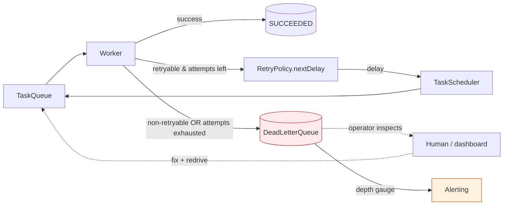
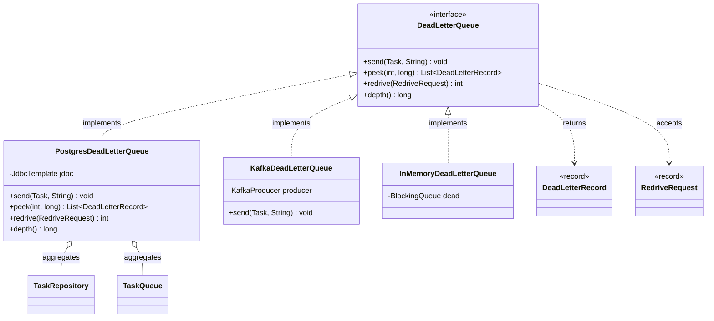

# Dead Letter Queues

> Where this fits: our Task Queue platform retries failures, but some `Task`s will *never* succeed — bad payloads, a permanently-removed downstream, a bug in a `TaskHandler`. Retrying them forever wastes capacity and can wedge the whole pipeline. This chapter builds the **dead-letter queue (DLQ)**: the quarantine where exhausted and unprocessable tasks go to `DEAD`, plus the operational machinery around it — max-attempts policy, redrive/reprocessing, and alerting on DLQ depth. We define the `DeadLetterQueue` port and ship Postgres and Kafka implementations.

This chapter sits downstream of [retries](../08-distributed-systems/retries.md) and [scheduling queues](./scheduling-queues.md): a task is retried with backoff until it either succeeds or *exhausts* its attempts, and exhaustion is the moment it becomes dead. The distributed-systems angle (cross-service DLQs, redrive at fleet scale, idempotent reprocessing) is deepened in [the distributed DLQ chapter](../08-distributed-systems/dlq.md); here we focus on the queue mechanics and the port-and-adapter design.

---

## 1. Why this exists — the real problem it solves

A queue's contract is "deliver this message until it's processed." That contract has a fatal gap: **what if it can never be processed?** Three failure shapes force the issue.

1. **Poison messages.** A `Task` whose `payload` is malformed JSON, references a deleted account, or trips a deterministic bug in its `TaskHandler`. Every attempt fails the same way. With naive at-least-once redelivery, the broker hands it back forever. Worse, if the broker preserves ordering per partition (Kafka, SQS FIFO), one poison message at the head blocks *every* message behind it — a **head-of-line block** that can stall an entire partition.

2. **Exhausted retries.** A transient failure (timeout, 503) that simply does not recover within `maxAttempts`. The `RetryPolicy` returns `Optional.empty()` on the final attempt; the task has nowhere to go. Dropping it silently loses data; re-enqueuing it loops forever.

3. **Permanently-failing dependency.** A downstream that's been decommissioned, a credential that was revoked, a feature flag turned off. Thousands of tasks fail identically. We need to *park* them, alert a human, and replay them in bulk once the dependency is fixed — not lose them and not retry-storm the dead endpoint.

A **dead letter queue** is the answer to all three: a separate destination for messages that have exceeded their delivery/processing budget, so the main pipeline stays healthy while failures are preserved for inspection, debugging, and deliberate reprocessing.



### A little history

The term is old. IBM MQ (1990s) shipped a **dead-letter queue** (a.k.a. *undeliverable-message queue*) as a first-class system object: any message the queue manager could not route landed there with a *dead-letter header* recording why. JMS standardized the idea; ActiveMQ has `ActiveMQ.DLQ`, RabbitMQ added per-queue `x-dead-letter-exchange` arguments, AWS SQS exposes a `RedrivePolicy` with `maxReceiveCount` and a redrive API, and Kafka ecosystems (Kafka Connect, Spring Kafka's `DeadLetterPublishingRecoverer`) publish failures to a `<topic>.DLT` topic. The vocabulary differs but the pattern is identical: **a side channel for messages that broke the happy path, with enough metadata to debug and replay them.**

> **The one-sentence framing:** a DLQ is not an error log — it is a *retryable backlog of failures you chose to stop retrying automatically*, kept so a human (or a smarter automated policy) can decide what to do next.

---

## 2. The naive version — drop it and log

The first instinct when a task can't be processed: catch, log, move on.

```java
// NAIVE: failures vanish into log files. Do not ship this.
class NaiveWorker implements Runnable {
    private final TaskQueue queue;
    private final Map<String, TaskHandler> handlers;

    NaiveWorker(TaskQueue queue, Map<String, TaskHandler> handlers) {
        this.queue = queue;
        this.handlers = handlers;
    }

    @Override
    public void run() {
        while (!Thread.currentThread().isInterrupted()) {
            try {
                Task task = queue.dequeue();
                TaskHandler handler = handlers.get(task.type());
                TaskResult result = handler.handle(task);
                if (!result.success()) {
                    // Where does the failure go? Into a log line nobody reads.
                    System.err.println("Task " + task.id() + " failed: " + result.message());
                }
            } catch (InterruptedException e) {
                Thread.currentThread().interrupt();
                return;
            } catch (Exception e) {
                // Poison message: handler threw. Task is gone forever.
                System.err.println("Task blew up: " + e.getMessage());
            }
        }
    }
}
```

What's wrong:

- **Data loss.** A failed task is gone. There is no payload to inspect, no way to replay it. When a customer asks "where did my job go?", the answer is "in last week's rotated log, maybe."
- **No retry at all.** Even transient failures (a 1-second blip) are permanent. That's worse than retrying forever.
- **No signal.** `System.err` is not a metric. Nobody is paged when 40% of tasks start failing.
- **Poison handling is "swallow the exception."** A handler bug silently eats every task of that type.

---

## 3. Improved version — a max-attempts loop with an in-memory DLQ

Add the two missing ideas: bounded retries via `maxAttempts`, and a *place* for the dead ones. Start with an in-memory `DeadLetterQueue` so the design is clear before persistence muddies it.

```java
// IMPROVED: bounded retries + an explicit DLQ destination. Still single-node / volatile.
record DeadLetter(Task task, String reason, Instant deadAt) {}

interface DeadLetterQueue {
    void send(Task task, String reason);
}

final class InMemoryDeadLetterQueue implements DeadLetterQueue {
    private final BlockingQueue<DeadLetter> dead = new LinkedBlockingQueue<>();

    @Override
    public void send(Task task, String reason) {
        Task buried = task.withStatus(TaskStatus.DEAD); // immutable copy
        dead.add(new DeadLetter(buried, reason, Instant.now()));
    }

    public int depth() { return dead.size(); }
    public List<DeadLetter> drain() { return List.copyOf(dead); }
}
```

```java
// IMPROVED Worker: retry up to maxAttempts, then dead-letter.
final class RetryingWorker implements Runnable {
    private final TaskQueue queue;
    private final Map<String, TaskHandler> handlers;
    private final DeadLetterQueue dlq;

    RetryingWorker(TaskQueue queue, Map<String, TaskHandler> handlers, DeadLetterQueue dlq) {
        this.queue = queue;
        this.handlers = handlers;
        this.dlq = dlq;
    }

    @Override
    public void run() {
        while (!Thread.currentThread().isInterrupted()) {
            Task task;
            try {
                task = queue.dequeue();
            } catch (InterruptedException e) {
                Thread.currentThread().interrupt();
                return;
            }
            process(task);
        }
    }

    private void process(Task task) {
        TaskHandler handler = handlers.get(task.type());
        if (handler == null) {
            // Unknown type can NEVER succeed — straight to the DLQ. No retries.
            dlq.send(task, "no handler registered for type=" + task.type());
            return;
        }
        try {
            TaskResult result = handler.handle(task);
            if (result.success()) {
                return; // SUCCEEDED
            }
            if (!result.retryable()) {
                dlq.send(task, "non-retryable: " + result.message());
                return;
            }
            retryOrBury(task, result.message());
        } catch (Exception e) {
            // Treat thrown exceptions as retryable by default — they're usually transient.
            retryOrBury(task, "exception: " + e.getClass().getSimpleName() + ": " + e.getMessage());
        }
    }

    private void retryOrBury(Task task, String reason) {
        if (task.attempts() + 1 >= task.maxAttempts()) {
            dlq.send(task, "exhausted after " + task.maxAttempts() + " attempts; last: " + reason);
        } else {
            queue.enqueue(task.withIncrementedAttempt()); // re-enqueue (no backoff yet)
        }
    }
}
```

Now failures are *captured*, retries are *bounded*, and unprocessable types short-circuit straight to the DLQ. This is already shippable for a single-node demo. What's still missing:

- **Durability.** `InMemoryDeadLetterQueue` dies with the process. A crash loses every dead letter — exactly the data we promised to keep.
- **No backoff.** Re-enqueue is immediate, so a flaky downstream gets hammered. (Fixed by routing through the [scheduler](./scheduling-queues.md) / [RetryPolicy](../08-distributed-systems/retries.md).)
- **No metadata for debugging.** We store a reason string, but not the stack trace, the worker host, the attempt history, or the original queue.
- **No redrive.** Once dead, tasks are stuck. There's no supported way to replay them after a fix.

---

## 4. Production-quality version — a durable DLQ port with rich metadata, redrive, and metrics

A staff engineer ships the DLQ as a **hexagonal port** ([hexagonal architecture](../04-oop-and-ood/hexagonal-architecture.md)) with swappable adapters, captures enough metadata to debug *without re-running the task*, exposes a **redrive** operation, and emits a **depth gauge** for alerting.

### 4.1 The port and the dead-letter record

```java
package com.taskqueue.dlq;

import java.time.Instant;
import java.util.List;

/**
 * Port: where tasks go when they can no longer be processed automatically.
 * Implementations: Postgres (durable, queryable), Kafka (.DLT topic), in-memory (tests).
 */
public interface DeadLetterQueue {

    /** Bury a task. Implementations MUST be idempotent on task id + attempt. */
    void send(Task task, String reason);

    /** Operator surface: page through dead letters for inspection. */
    List<DeadLetterRecord> peek(int limit, long offsetId);

    /** Redrive: re-submit up to {@code limit} dead letters back to the main pipeline. */
    int redrive(RedriveRequest request);

    /** Current number of dead letters — the single most important alerting signal. */
    long depth();
}
```

```java
package com.taskqueue.dlq;

import java.time.Instant;

/**
 * Everything an operator needs to debug a failure WITHOUT re-running it.
 * We deliberately denormalize the Task fields so the DLQ is self-contained
 * even if the original task row is later archived.
 */
public record DeadLetterRecord(
        long id,                 // DLQ-local sequence, used for stable pagination
        String taskId,           // original Task.id (UUID)
        String type,
        String payload,          // the original JSON — the raw material for replay
        int attempts,
        int maxAttempts,
        String reason,           // human-readable cause
        String errorClass,       // e.g. "JsonParseException" — groupable for triage
        String stackTrace,       // first N frames, truncated
        String workerHost,       // which node buried it (skew/host-specific bugs)
        String originQueue,      // where it came from (multi-queue systems)
        Instant firstFailedAt,
        Instant deadAt,
        boolean redriven) {      // has it already been replayed? prevents double-redrive
}
```

```java
package com.taskqueue.dlq;

import java.util.Set;

/** A bounded, filtered redrive command. Never "redrive everything" by accident. */
public record RedriveRequest(
        int limit,               // hard cap — redrive in controlled batches
        Set<String> types,       // null/empty => any type
        String errorClassFilter, // null => any; lets you replay only the fixed failure class
        boolean resetAttempts) { // true => fresh maxAttempts budget after the fix

    public static RedriveRequest ofType(String type, int limit) {
        return new RedriveRequest(limit, Set.of(type), null, true);
    }
}
```

> **Why so much metadata?** The whole point of a DLQ is *triage*. With `errorClass` you can `GROUP BY` and see "9,800 of 10,000 dead letters are `ConnectTimeoutException` to `payments-svc`" in one query — that's a dependency outage, redrive after it heals. The other 200 are `JsonParseException` — those are genuinely poison, never redrive them, fix the producer. Without the metadata you're grepping logs.

### 4.2 The Postgres adapter

Postgres is the right *default* DLQ for our platform: it's already the [task repository](../08-distributed-systems/idempotency.md) backing store, it's transactional (we can move a task to DEAD and insert the dead-letter row atomically), and it's *queryable* — `peek` and `redrive` filters become plain SQL.

```sql
-- Flyway: V7__dead_letter_queue.sql
CREATE TABLE dead_letters (
    id              BIGSERIAL PRIMARY KEY,
    task_id         UUID        NOT NULL,
    type            TEXT        NOT NULL,
    payload         JSONB       NOT NULL,
    attempts        INT         NOT NULL,
    max_attempts    INT         NOT NULL,
    reason          TEXT        NOT NULL,
    error_class     TEXT,
    stack_trace     TEXT,
    worker_host     TEXT,
    origin_queue    TEXT,
    first_failed_at TIMESTAMPTZ NOT NULL,
    dead_at         TIMESTAMPTZ NOT NULL DEFAULT now(),
    redriven        BOOLEAN     NOT NULL DEFAULT FALSE,
    -- Idempotency: a given (task, attempt) is buried at most once.
    CONSTRAINT uq_dead_task_attempt UNIQUE (task_id, attempts)
);

-- Alerting query hits this constantly: count of un-redriven dead letters.
CREATE INDEX idx_dead_active   ON dead_letters (dead_at) WHERE redriven = FALSE;
-- Triage: "how many of each failure class?"
CREATE INDEX idx_dead_errclass ON dead_letters (error_class) WHERE redriven = FALSE;
```

```java
package com.taskqueue.dlq;

import org.springframework.jdbc.core.JdbcTemplate;
import org.springframework.transaction.annotation.Transactional;
import java.time.Instant;
import java.util.List;

public final class PostgresDeadLetterQueue implements DeadLetterQueue {

    private final JdbcTemplate jdbc;
    private final TaskRepository tasks;     // to flip status -> DEAD and to re-save on redrive
    private final TaskQueue mainQueue;      // redrive target
    private final String host;

    public PostgresDeadLetterQueue(JdbcTemplate jdbc, TaskRepository tasks,
                                   TaskQueue mainQueue, String host) {
        this.jdbc = jdbc;
        this.tasks = tasks;
        this.mainQueue = mainQueue;
        this.host = host;
    }

    @Override
    @Transactional // mark DEAD and insert the dead-letter row atomically
    public void send(Task task, String reason) {
        FailureContext ctx = FailureContext.current(); // ThreadLocal set by the worker
        tasks.save(task.withStatus(TaskStatus.DEAD));
        // ON CONFLICT DO NOTHING => idempotent: a redelivery can't double-insert.
        jdbc.update("""
            INSERT INTO dead_letters
              (task_id, type, payload, attempts, max_attempts, reason,
               error_class, stack_trace, worker_host, origin_queue,
               first_failed_at, dead_at)
            VALUES (?,?,?::jsonb,?,?,?,?,?,?,?,?,?)
            ON CONFLICT (task_id, attempts) DO NOTHING
            """,
            task.id(), task.type(), task.payload(), task.attempts(), task.maxAttempts(),
            truncate(reason, 2000), ctx.errorClass(), truncate(ctx.stackTrace(), 8000),
            host, ctx.originQueue(), java.sql.Timestamp.from(ctx.firstFailedAt()),
            java.sql.Timestamp.from(Instant.now()));
    }

    @Override
    public List<DeadLetterRecord> peek(int limit, long offsetId) {
        return jdbc.query("""
            SELECT * FROM dead_letters
            WHERE id > ? AND redriven = FALSE
            ORDER BY id ASC
            LIMIT ?
            """, this::map, offsetId, limit);
    }

    @Override
    @Transactional
    public int redrive(RedriveRequest req) {
        // SKIP LOCKED so two operators (or two redrive jobs) never grab the same row.
        List<DeadLetterRecord> batch = jdbc.query("""
            SELECT * FROM dead_letters
            WHERE redriven = FALSE
              AND (?::text IS NULL OR error_class = ?)
            ORDER BY id ASC
            LIMIT ?
            FOR UPDATE SKIP LOCKED
            """, this::map,
            req.errorClassFilter(), req.errorClassFilter(), req.limit());

        int count = 0;
        for (DeadLetterRecord r : batch) {
            if (req.types() != null && !req.types().isEmpty() && !req.types().contains(r.type())) {
                continue;
            }
            Task revived = tasks.findById(r.taskId())
                .orElseGet(() -> Task.fromDeadLetter(r))   // rebuild if archived
                .withStatus(TaskStatus.PENDING)
                .withAttempts(req.resetAttempts() ? 0 : r.attempts());
            tasks.save(revived);
            mainQueue.enqueue(revived);
            jdbc.update("UPDATE dead_letters SET redriven = TRUE WHERE id = ?", r.id());
            count++;
        }
        return count;
    }

    @Override
    public long depth() {
        Long n = jdbc.queryForObject(
            "SELECT count(*) FROM dead_letters WHERE redriven = FALSE", Long.class);
        return n == null ? 0L : n;
    }

    private DeadLetterRecord map(java.sql.ResultSet rs, int rowNum) throws java.sql.SQLException {
        return new DeadLetterRecord(
            rs.getLong("id"), rs.getString("task_id"), rs.getString("type"),
            rs.getString("payload"), rs.getInt("attempts"), rs.getInt("max_attempts"),
            rs.getString("reason"), rs.getString("error_class"), rs.getString("stack_trace"),
            rs.getString("worker_host"), rs.getString("origin_queue"),
            rs.getTimestamp("first_failed_at").toInstant(),
            rs.getTimestamp("dead_at").toInstant(), rs.getBoolean("redriven"));
    }

    private static String truncate(String s, int max) {
        if (s == null) return null;
        return s.length() <= max ? s : s.substring(0, max);
    }
}
```

> **Why `FOR UPDATE SKIP LOCKED` on redrive?** Redrive is an operator action that may be triggered from a UI button *and* a scheduled cleanup job at the same time. Locking the rows we're about to redrive and skipping already-locked ones makes concurrent redrives safe and non-blocking — the same pattern used for [scheduling-queue polling](./scheduling-queues.md).

### 4.3 The Kafka adapter

In an event-driven Phase 4 deployment, the broker *is* the queue. The idiomatic DLQ is a **dead-letter topic** — conventionally `<source-topic>.DLT`. The original record is republished there with failure metadata in headers, so the source topic's consumer offset can advance past the poison message (clearing the head-of-line block).

```java
package com.taskqueue.dlq;

import org.apache.kafka.clients.producer.KafkaProducer;
import org.apache.kafka.clients.producer.ProducerRecord;
import org.apache.kafka.common.header.internals.RecordHeader;
import java.nio.charset.StandardCharsets;
import java.time.Instant;

/**
 * Publishes failed records to "<sourceTopic>.DLT" with failure metadata in headers.
 * Keying by task id keeps a task's history in one partition (ordered, co-located).
 */
public final class KafkaDeadLetterQueue implements DeadLetterQueue {

    private final KafkaProducer<String, String> producer;
    private final String sourceTopic;
    private final String host;

    public KafkaDeadLetterQueue(KafkaProducer<String, String> producer,
                                String sourceTopic, String host) {
        this.producer = producer;
        this.sourceTopic = sourceTopic;
        this.host = host;
    }

    @Override
    public void send(Task task, String reason) {
        FailureContext ctx = FailureContext.current();
        String dltTopic = sourceTopic + ".DLT";
        var record = new ProducerRecord<>(dltTopic, task.id(), task.payload());
        var headers = record.headers();
        headers.add(h("dlt.reason", reason));
        headers.add(h("dlt.task-type", task.type()));
        headers.add(h("dlt.error-class", ctx.errorClass()));
        headers.add(h("dlt.attempts", String.valueOf(task.attempts())));
        headers.add(h("dlt.origin-topic", sourceTopic));
        headers.add(h("dlt.worker-host", host));
        headers.add(h("dlt.dead-at", Instant.now().toString()));
        // Synchronous send: we must NOT advance the source offset until the DLT write is durable.
        try {
            producer.send(record).get(); // block; commit source offset only after this returns
        } catch (Exception e) {
            throw new DeadLetterException("failed to publish to " + dltTopic, e);
        }
    }

    @Override
    public List<DeadLetterRecord> peek(int limit, long offsetId) {
        // Kafka topics aren't randomly queryable; operators inspect via a consumer
        // (kcat / Kafka UI) or a sink that lands the .DLT into Postgres for querying.
        throw new UnsupportedOperationException(
            "peek the .DLT via a consumer or a JDBC sink; Kafka is not a query store");
    }

    @Override
    public int redrive(RedriveRequest req) {
        // Redrive = consume from .DLT and re-produce to the source topic.
        // Done by a dedicated redrive consumer (see notes) so this stays a pure producer port.
        throw new UnsupportedOperationException("run the DLT-redrive consumer job");
    }

    @Override
    public long depth() {
        // Depth = sum of (logEndOffset - committedOffset) across .DLT partitions = consumer lag.
        // Exposed by Kafka itself; scrape via the admin client / Burrow / kafka_consumergroup metrics.
        return -1; // sentinel: ask the broker, not this object
    }

    private static RecordHeader h(String k, String v) {
        return new RecordHeader(k, (v == null ? "" : v).getBytes(StandardCharsets.UTF_8));
    }
}
```

The Kafka adapter exposes a sharp truth about ports: **not every backend supports every operation natively.** Postgres makes `peek`/`redrive`/`depth` trivial SQL; Kafka makes `send` trivial but pushes `peek`, `redrive`, and `depth` onto separate consumers/tooling. That asymmetry is real and we model it honestly (throwing `UnsupportedOperationException` with a pointer) rather than faking a leaky query API on top of a log.



---

## 5. Code walkthrough — three escalating examples

### 5.1 Beginner — the max-attempts decision in isolation

The single most important rule: a task becomes dead when it is **non-retryable** *or* has **exhausted its attempts**. Encode it as one pure function and unit-test it.

```java
enum Outcome { RETRY, DEAD, DONE }

final class DeadLetterPolicy {
    /** Pure decision: given a task and its result, what happens next? */
    static Outcome decide(Task task, TaskResult result) {
        if (result.success()) {
            return Outcome.DONE;
        }
        if (!result.retryable()) {
            return Outcome.DEAD;             // poison: don't waste attempts
        }
        boolean lastAttempt = task.attempts() + 1 >= task.maxAttempts();
        return lastAttempt ? Outcome.DEAD : Outcome.RETRY;
    }
}
```

```java
// A handful of cases nails the contract.
import static org.assertj.core.api.Assertions.assertThat;
import org.junit.jupiter.api.Test;

class DeadLetterPolicyTest {
    private Task task(int attempts, int max) {
        return new Task("id", "email", "{}", TaskStatus.RUNNING,
                attempts, max, Instant.now(), Instant.now(), 0);
    }

    @Test void success_is_done() {
        assertThat(DeadLetterPolicy.decide(task(0, 3), new TaskResult(true, "ok", false)))
            .isEqualTo(Outcome.DONE);
    }
    @Test void non_retryable_is_dead_immediately() {
        assertThat(DeadLetterPolicy.decide(task(0, 3), new TaskResult(false, "bad json", false)))
            .isEqualTo(Outcome.DEAD);
    }
    @Test void retryable_with_budget_retries() {
        assertThat(DeadLetterPolicy.decide(task(1, 3), new TaskResult(false, "503", true)))
            .isEqualTo(Outcome.RETRY);
    }
    @Test void retryable_last_attempt_is_dead() {
        assertThat(DeadLetterPolicy.decide(task(2, 3), new TaskResult(false, "503", true)))
            .isEqualTo(Outcome.DEAD); // attempts 0,1,2 used => the 3rd failure buries it
    }
}
```

### 5.2 Intermediate — wiring the DLQ into the failure handler

The decision function above plugs into a `FailureHandler` that owns the retry-vs-bury routing, keeping the `Worker` thin. This is the [strategy pattern](../05-design-patterns/strategy.md) for failure handling.

```java
final class FailureHandler {
    private final RetryPolicy retryPolicy;
    private final TaskScheduler scheduler;
    private final DeadLetterQueue dlq;

    FailureHandler(RetryPolicy retryPolicy, TaskScheduler scheduler, DeadLetterQueue dlq) {
        this.retryPolicy = retryPolicy;
        this.scheduler = scheduler;
        this.dlq = dlq;
    }

    /** Called by the Worker for every non-success outcome. */
    void onFailure(Task task, TaskResult result) {
        switch (DeadLetterPolicy.decide(task, result)) {
            case DONE -> { /* unreachable here; Worker handles success */ }
            case DEAD -> dlq.send(task, result.message());
            case RETRY -> {
                Task next = task.withIncrementedAttempt().withStatus(TaskStatus.RETRYING);
                // nextDelay may still say "give up" (e.g., max elapsed time) -> bury.
                retryPolicy.nextDelay(next.attempts())
                    .ifPresentOrElse(
                        delay -> scheduler.schedule(next, delay),
                        ()    -> dlq.send(task, "retry policy exhausted: " + result.message()));
            }
        }
    }
}
```

> Note the belt-and-suspenders: even when `DeadLetterPolicy` says `RETRY`, the `RetryPolicy` gets a final veto via `Optional.empty()` (used for time-budget caps, not just attempt counts). Two independent budgets — attempts *and* wall-clock — both route to the DLQ. See [retries](../08-distributed-systems/retries.md).

### 5.3 Production-inspired — DLQ depth gauge + redrive endpoint with Micrometer

The DLQ is useless if nobody knows it's filling up. Wire a **gauge** (sampled depth) and a **counter** (deaths over time), then expose a guarded redrive endpoint.

```java
import io.micrometer.core.instrument.MeterRegistry;
import io.micrometer.core.instrument.Counter;

final class MeteredDeadLetterQueue implements DeadLetterQueue {
    private final DeadLetterQueue delegate;     // decorator over Postgres/Kafka impl
    private final Counter deaths;

    MeteredDeadLetterQueue(DeadLetterQueue delegate, MeterRegistry registry) {
        this.delegate = delegate;
        this.deaths = Counter.builder("dlq.deaths.total")
            .description("tasks dead-lettered")
            .register(registry);
        // Gauge polls depth() on each scrape — cheap because depth() is an indexed count.
        registry.gauge("dlq.depth", delegate, DeadLetterQueue::depth);
    }

    @Override public void send(Task task, String reason) {
        delegate.send(task, reason);
        deaths.increment();
    }
    @Override public List<DeadLetterRecord> peek(int l, long o) { return delegate.peek(l, o); }
    @Override public int redrive(RedriveRequest r) { return delegate.redrive(r); }
    @Override public long depth() { return delegate.depth(); }
}
```

```java
import org.springframework.web.bind.annotation.*;

@RestController
@RequestMapping("/admin/dlq")
final class DeadLetterController {
    private final DeadLetterQueue dlq;

    DeadLetterController(DeadLetterQueue dlq) { this.dlq = dlq; }

    @GetMapping("/depth")
    long depth() { return dlq.depth(); }

    @GetMapping
    List<DeadLetterRecord> peek(@RequestParam(defaultValue = "50") int limit,
                                @RequestParam(defaultValue = "0") long after) {
        return dlq.peek(Math.min(limit, 200), after); // cap to protect the DB
    }

    // Deliberately a separate, audited endpoint. Redrive mutates the live pipeline.
    @PostMapping("/redrive")
    Map<String, Integer> redrive(@RequestBody RedriveRequest request) {
        int n = dlq.redrive(new RedriveRequest(
            Math.min(request.limit(), 500), // never redrive more than 500 at once
            request.types(), request.errorClassFilter(), request.resetAttempts()));
        return Map.of("redriven", n);
    }
}
```

A Prometheus alert on the gauge closes the loop:

```yaml
# prometheus/alerts.yml
groups:
  - name: dlq
    rules:
      - alert: DLQDepthHigh
        expr: dlq_depth > 100
        for: 5m
        labels: { severity: warning }
        annotations:
          summary: "Dead-letter queue depth {{ $value }} (>100 for 5m)"
          runbook: "https://wiki/runbooks/dlq#triage"
      - alert: DLQDeathRateSpike
        # A sudden burst usually means a dependency just broke.
        expr: rate(dlq_deaths_total[5m]) > 1
        for: 2m
        labels: { severity: critical }
        annotations:
          summary: "Tasks dying at {{ $value }}/s — likely a downstream outage"
```

> **Depth vs rate, and why you alert on both.** A high *depth* tells you a backlog exists (something has been broken a while). A high *death rate* tells you something *just* broke. Depth is the standing-water alarm; rate is the smoke detector. Page on rate; ticket on depth.

---

## 6. How this applies to our Task Queue project

Concrete mapping onto the canonical model:

| Canonical element | Role in the DLQ story |
|---|---|
| `TaskStatus.DEAD` | The terminal state a task enters when buried. `FAILED` is "this attempt failed"; `DEAD` is "we gave up." |
| `Task.attempts` / `Task.maxAttempts` | The retry budget. Exhaustion (`attempts + 1 >= maxAttempts`) is the trigger to dead-letter. |
| `TaskResult.retryable` | `false` ⇒ poison ⇒ straight to DLQ, no attempts wasted. `true` ⇒ eligible for retry until budget runs out. |
| `RetryPolicy.nextDelay` | Returns `Optional.empty()` as a *second* exhaustion signal (time-budget cap) that also routes to the DLQ. |
| `DeadLetterQueue.send` | The port. `PostgresDeadLetterQueue` (Phase 2/3), `KafkaDeadLetterQueue` (Phase 4), `InMemoryDeadLetterQueue` (tests). |
| `Worker` / `FailureHandler` | The `Worker` delegates every non-success outcome to the `FailureHandler`, which calls `dlq.send(...)` or `scheduler.schedule(...)`. |
| `MetricsCollector` / `MeterRegistry` | Hosts `dlq.depth` (gauge) and `dlq.deaths.total` (counter) for alerting. |
| `TaskController` / `DeadLetterController` | Operator surface for `peek` and `redrive`. |

The `DEAD` status is what makes the DLQ a true *state*, not a side bucket: a task in `DEAD` is excluded from `pollDue` and from worker dequeue, so it can't be picked up by accident — only an explicit redrive flips it back to `PENDING`.

---

## 7. Tradeoffs

| Decision | Option A | Option B | When to pick which |
|---|---|---|---|
| **DLQ backend** | Postgres table | Kafka `.DLT` topic | Postgres when you need queryable triage, atomic status+bury, and easy redrive (most apps). Kafka when the broker *is* the pipeline and you need the source partition unblocked at high throughput. |
| **Same store vs separate** | DLQ rows in the tasks DB | Dedicated DLQ infra | Same store = atomic transitions, one place to query, simpler. Separate = blast-radius isolation (a DLQ flood can't bloat the hot tasks table). Start same-store; split when volume demands. |
| **Redrive trigger** | Manual (operator clicks) | Automatic (timer re-tries DLQ) | Manual by default — DLQ exists *because* auto-retry failed; auto-redrive risks an infinite loop. Automate only with a strict cap (e.g., "redrive `ConnectTimeout` once after the dependency's health check passes"). |
| **Reset attempts on redrive** | Reset to 0 | Keep prior count | Reset when the *root cause was fixed* (dependency back up). Keep when redriving speculatively, so a still-broken task doesn't get a full fresh budget and storm again. |
| **Metadata depth** | Just task + reason | Full context (stack, host, error class) | Full context. The marginal storage is trivial; the triage speedup is enormous. The one exception: never store secrets from the payload — redact first. |
| **Poison detection** | `retryable=false` from handler | Attempt-count heuristic | Prefer explicit `retryable=false` — the handler knows a `JsonParseException` is hopeless. Fall back to attempt count for failures the handler can't classify. |

**Complexity / cost notes.** `send` is O(1) (one indexed insert). `depth()` is O(1) with the partial index `WHERE redriven = FALSE`. `peek` is O(limit) keyset pagination (`id > offset`), not OFFSET-based — important so page 10,000 is as fast as page 1. `redrive` is O(limit) with row locks; bound the batch.

---

## 8. Common mistakes and pitfalls

- **Treating the DLQ as a log.** A log is for reading; a DLQ is for *acting*. If your DLQ has no redrive path, it's a graveyard, not a queue. Fix: always ship `peek` + `redrive` together with `send`.
- **No max-attempts cap.** Retrying forever turns one poison message into a permanent CPU/throughput tax and (with ordering) a head-of-line block. Fix: every task carries `maxAttempts`; exhaustion is mandatory.
- **Retrying non-retryable failures.** Burning 5 attempts on malformed JSON that can *never* parse. Fix: honor `TaskResult.retryable=false` and skip straight to the DLQ.
- **Losing the original payload.** Storing only a stack trace means you can't replay. Fix: the DLQ record carries the full original `payload` (redacted of secrets).
- **No alerting on depth.** A silently-filling DLQ is discovered when a customer complains a week later. Fix: gauge + Prometheus alert on both depth and death-*rate*.
- **Non-idempotent `send`.** At-least-once delivery means the same task can be buried twice. Fix: `UNIQUE (task_id, attempts)` + `ON CONFLICT DO NOTHING`.
- **Redrive storms.** Redriving 1M dead letters at once re-floods the broken downstream and re-DLQs them all. Fix: bounded batches, filter by `error_class`, and redrive only *after* the dependency's health check is green.
- **Double-redrive.** Replaying an already-redriven record creates a duplicate. Fix: the `redriven` flag + `SKIP LOCKED`.
- **Kafka: committing the source offset before the `.DLT` write is durable.** A crash between the two loses the message. Fix: synchronous `producer.send().get()` *before* committing the source offset.

---

## 9. Refactoring exercise

**Bad** — failures swallowed, no bound, no destination:

```java
void process(Task task, TaskHandler handler) {
    try {
        handler.handle(task);
    } catch (Exception e) {
        log.error("failed", e); // gone. no retry, no DLQ, no metric.
    }
}
```

**Improved** — bounded retries and an explicit bury, but volatile and metadata-poor:

```java
void process(Task task, TaskHandler handler) {
    try {
        TaskResult r = handler.handle(task);
        if (r.success()) return;
        if (!r.retryable() || task.attempts() + 1 >= task.maxAttempts()) {
            dlq.send(task, r.message());   // in-memory dlq, reason-only
        } else {
            queue.enqueue(task.withIncrementedAttempt());
        }
    } catch (Exception e) {
        if (task.attempts() + 1 >= task.maxAttempts()) dlq.send(task, e.toString());
        else queue.enqueue(task.withIncrementedAttempt());
    }
}
```

**Production** — single decision function, backoff via scheduler, durable DLQ with captured context, metered:

```java
void process(Task task, TaskHandler handler) {
    FailureContext.begin(task);                 // records firstFailedAt, originQueue
    try {
        TaskResult r = handler.handle(task);
        if (r.success()) { task.markSucceeded(); return; }
        FailureContext.note(r.message(), null);
        failureHandler.onFailure(task, r);       // routes RETRY (scheduler) vs DEAD (dlq)
    } catch (Exception e) {
        FailureContext.note(e.getMessage(), e);  // captures error class + stack
        failureHandler.onFailure(task, new TaskResult(false, e.toString(), true));
    } finally {
        FailureContext.clear();
    }
}
```

The final version pushes *all* routing into `FailureHandler` + `DeadLetterPolicy` (testable in isolation), captures context once at the call site, and makes the DLQ durable and observable.

---

## 10. Exercises

### Easy

**E1 (knowledge check).** Explain the difference between `TaskStatus.FAILED` and `TaskStatus.DEAD`. Why have both?

**E2 (coding).** Implement `InMemoryDeadLetterQueue` with a working `depth()` and `peek(limit, offset)` using an `ArrayList<DeadLetterRecord>` plus an `AtomicLong` id sequence.

### Medium

**M1 (coding).** Write `DeadLetterPolicy.decide` (from §5.1) and a parameterized JUnit 5 test covering: success, non-retryable, retryable-with-budget, retryable-last-attempt, and `attempts == maxAttempts` already.

**M2 (refactoring).** Given the **Bad** snippet from §9, refactor it so the poison case (`retryable=false`) never consumes an attempt and the exhausted case dead-letters with a reason that includes the attempt count.

### Hard

**H1 (design).** Design redrive for a Kafka `.DLT` deployment where you must (a) replay only records whose `dlt.error-class=ConnectTimeoutException`, (b) cap to 1,000/run, and (c) never replay a record twice. What component consumes from `.DLT`, how do you filter by header, and how do you guarantee at-most-once redrive?

**H2 (interview-style).** Your service has 3 replicas. A bug dead-lettered 200,000 tasks overnight. The fix is deployed. Walk through redriving safely without taking down the (now-healthy) downstream. Include batch size, rate, ordering, and idempotency.

**H3 (stretch).** Implement an `AutoRedriveJob` that, every 5 minutes, redrives up to 200 dead letters of a given `error_class` **only if** a supplied `HealthCheck` for that error class passes — and that backs off (doubling the interval) each time a redriven batch immediately re-DLQs.

---

## 11. Solutions

**E1.** `FAILED` is *per-attempt*: a single execution of the task failed, but it may be retried — it's a transient, recoverable state. `DEAD` is *terminal*: the task has either been classified non-retryable or has exhausted its attempt/time budget, and the system will not run it again automatically. Both exist because operators need to distinguish "currently struggling" (FAILED/RETRYING — watch it) from "given up, needs human decision" (DEAD — triage and redrive). Only `DEAD` tasks appear in the DLQ.

**E2.**

```java
final class InMemoryDeadLetterQueue implements DeadLetterQueue {
    private final List<DeadLetterRecord> store =
        java.util.Collections.synchronizedList(new java.util.ArrayList<>());
    private final java.util.concurrent.atomic.AtomicLong seq = new java.util.concurrent.atomic.AtomicLong();

    @Override public void send(Task task, String reason) {
        long id = seq.incrementAndGet();
        store.add(new DeadLetterRecord(id, task.id(), task.type(), task.payload(),
            task.attempts(), task.maxAttempts(), reason, null, null, "test-host",
            "in-memory", java.time.Instant.now(), java.time.Instant.now(), false));
    }
    @Override public List<DeadLetterRecord> peek(int limit, long offsetId) {
        synchronized (store) {
            return store.stream()
                .filter(r -> r.id() > offsetId && !r.redriven())
                .limit(limit)
                .toList();
        }
    }
    @Override public int redrive(RedriveRequest request) {
        throw new UnsupportedOperationException("redrive needs a target queue; out of scope for E2");
    }
    @Override public long depth() {
        synchronized (store) { return store.stream().filter(r -> !r.redriven()).count(); }
    }
}
```

**M1.**

```java
import org.junit.jupiter.params.ParameterizedTest;
import org.junit.jupiter.params.provider.Arguments;
import org.junit.jupiter.params.provider.MethodSource;
import java.util.stream.Stream;
import static org.assertj.core.api.Assertions.assertThat;

class DeadLetterPolicyParamTest {
    static Task t(int attempts, int max) {
        return new Task("id", "email", "{}", TaskStatus.RUNNING, attempts, max,
            java.time.Instant.now(), java.time.Instant.now(), 0);
    }
    static Stream<Arguments> cases() {
        return Stream.of(
            Arguments.of(t(0, 3), new TaskResult(true,  "ok",  false), Outcome.DONE),
            Arguments.of(t(0, 3), new TaskResult(false, "bad", false), Outcome.DEAD),
            Arguments.of(t(1, 3), new TaskResult(false, "503", true),  Outcome.RETRY),
            Arguments.of(t(2, 3), new TaskResult(false, "503", true),  Outcome.DEAD),
            Arguments.of(t(3, 3), new TaskResult(false, "503", true),  Outcome.DEAD));
    }
    @ParameterizedTest
    @MethodSource("cases")
    void decide(Task task, TaskResult result, Outcome expected) {
        assertThat(DeadLetterPolicy.decide(task, result)).isEqualTo(expected);
    }
}
```

The `t(3,3)` case proves we never under-count: even if a task somehow arrives with `attempts == maxAttempts`, the next failure buries it rather than re-enqueuing.

**M2.**

```java
void process(Task task, TaskHandler handler) {
    try {
        TaskResult r = handler.handle(task);
        if (r.success()) return;
        if (!r.retryable()) {                       // poison: 0 attempts wasted
            dlq.send(task, "non-retryable: " + r.message());
            return;
        }
        if (task.attempts() + 1 >= task.maxAttempts()) {
            dlq.send(task, "exhausted after " + task.maxAttempts()
                + " attempts; last: " + r.message());
        } else {
            queue.enqueue(task.withIncrementedAttempt());
        }
    } catch (Exception e) {                          // thrown => treat as retryable
        if (task.attempts() + 1 >= task.maxAttempts()) {
            dlq.send(task, "exhausted after " + task.maxAttempts()
                + " attempts; threw: " + e);
        } else {
            queue.enqueue(task.withIncrementedAttempt());
        }
    }
}
```

**H1 (design answer).** A dedicated **redrive consumer** (its own consumer group, e.g. `dlt-redrive`) subscribes to `orders.DLT`. For each record it inspects `record.headers().lastHeader("dlt.error-class")` and processes only `ConnectTimeoutException`, skipping (committing past) others. It re-produces matching records to the source topic `orders`, then commits its `.DLT` offset. Bound the run by stopping after 1,000 republished records. **At-most-once** is guaranteed two ways: (1) the consumer commits `.DLT` offsets only *after* the source re-produce succeeds (synchronous send), so it never re-reads a record it already moved; (2) downstream consumers are idempotent on `task.id` (the Kafka key), so even a duplicate republish is absorbed. A redrive job that processes once per record and advances offsets monotonically cannot replay the same record twice within a run.

**H2 (interview answer).** (1) **Don't redrive all 200k at once** — that re-floods the downstream. (2) Redrive in **bounded batches** (e.g. 500) with a **rate limiter** ([token bucket](../08-distributed-systems/rate-limiting.md)) sized to the downstream's known capacity (say 200 tasks/s with headroom). (3) Use `FOR UPDATE SKIP LOCKED` so the 3 replicas (or 3 redrive workers) partition the work without overlap and without double-processing. (4) **Reset attempts to 0** since the root cause is fixed — they deserve a fresh budget. (5) **Idempotency** on `task.id` protects against any double-enqueue across replicas. (6) Watch `dlq.depth` drain and the downstream error rate; if errors climb, *pause* (the dependency wasn't as healthy as thought). (7) Mark each redriven row `redriven = TRUE` so a restart resumes, never restarts. Ordering generally doesn't matter for independent tasks; if it does, redrive per-key in id order.

**H3 (stretch).**

```java
final class AutoRedriveJob {
    private final DeadLetterQueue dlq;
    private final String errorClass;
    private final java.util.function.BooleanSupplier healthCheck;
    private volatile java.time.Duration interval = java.time.Duration.ofMinutes(5);
    private static final java.time.Duration MAX_INTERVAL = java.time.Duration.ofHours(1);
    private final java.util.concurrent.ScheduledExecutorService exec =
        java.util.concurrent.Executors.newSingleThreadScheduledExecutor();

    AutoRedriveJob(DeadLetterQueue dlq, String errorClass, java.util.function.BooleanSupplier hc) {
        this.dlq = dlq; this.errorClass = errorClass; this.healthCheck = hc;
    }

    void start() { schedule(); }

    private void schedule() {
        exec.schedule(this::tick, interval.toMillis(), java.util.concurrent.TimeUnit.MILLISECONDS);
    }

    private void tick() {
        try {
            if (!healthCheck.getAsBoolean()) { schedule(); return; } // dependency still down
            long before = dlq.depth();
            int redriven = dlq.redrive(new RedriveRequest(200, null, errorClass, true));
            long after = dlq.depth();
            // If the batch immediately re-died (depth didn't fall by ~redriven), back off.
            boolean reDied = redriven > 0 && (before - after) < redriven / 2;
            if (reDied) {
                interval = min(interval.multipliedBy(2), MAX_INTERVAL); // exponential backoff
            } else {
                interval = java.time.Duration.ofMinutes(5);             // success: reset
            }
        } finally {
            schedule();
        }
    }
    private static java.time.Duration min(java.time.Duration a, java.time.Duration b) {
        return a.compareTo(b) <= 0 ? a : b;
    }
}
```

The job self-throttles: a clean drain keeps the 5-minute cadence; a batch that re-DLQs doubles the interval up to an hour, preventing a redrive/re-die storm while the dependency flaps.

---

## 12. Interview questions and takeaways

1. **What is a dead letter queue and what problem does it solve?**
   A side destination for messages that can't be processed — poison messages or retry-exhausted ones. It keeps the main pipeline flowing (no head-of-line block, no infinite retry tax) while preserving failures for triage and replay.

2. **When does a message go to the DLQ?**
   When it's classified non-retryable (e.g. malformed payload) *or* it exhausts its retry budget (attempt count or time cap). In SQS that's `maxReceiveCount`; for us it's `attempts + 1 >= maxAttempts` or `RetryPolicy.nextDelay() == empty`.

3. **What's a poison message and why is it dangerous in an ordered queue?**
   A message that deterministically fails every attempt. In a partition-ordered system (Kafka, SQS FIFO) it sits at the head and blocks everything behind it until it's moved to the DLQ — head-of-line blocking that can stall a whole partition.

4. **How do you reprocess (redrive) dead letters safely?**
   Bounded batches, rate-limited to downstream capacity, filtered by error class, idempotent on message id, with a `redriven` flag (or offset commit) so you never replay twice — and only *after* the root cause is fixed.

5. **DLQ in the same database as the main queue, or separate infra?**
   Same store gives atomic status transitions and one place to query (simpler, fine for most). Separate gives blast-radius isolation so a DLQ flood can't bloat the hot path. Start together; split on volume.

6. **How do you make `send` idempotent under at-least-once delivery?**
   Unique key on `(task_id, attempt)` + `ON CONFLICT DO NOTHING` (Postgres), or key by id and dedupe downstream (Kafka). The same message buried twice must produce one record.

7. **What should you monitor on a DLQ?**
   Depth (gauge — standing backlog) and death rate (counter — sudden breakage). Alert on rate for paging, depth for tickets. Also redrive success ratio and oldest-dead-letter age.

8. **Kafka `.DLT` vs an SQS-style redrive policy — contrast them.**
   `.DLT` is a literal topic you publish to and re-consume from; depth = consumer lag; redrive = a consumer job. SQS attaches a `RedrivePolicy` with `maxReceiveCount` and offers a native redrive API; the queue counts receives for you. Both implement the same pattern with different ergonomics.

---

## 13. Production considerations

- **Redaction before storage.** Payloads land in the DLQ in plaintext and persist long after the task. Strip PII/secrets (card numbers, tokens) before `send`, or store an encrypted blob and a redacted summary.
- **Retention and growth.** DLQ rows accumulate. Set a retention policy (e.g. archive to object storage after 30 days, hard-delete after 90) and a size alert. An unbounded DLQ table eventually degrades the hot tasks DB if co-located.
- **Redrive blast radius.** The most common DLQ-related outage is a careless redrive of millions of messages that re-kills the just-healed downstream. Always cap batch size, rate-limit, and gate behind a dependency health check.
- **Oldest-message age.** Alert on the age of the oldest un-redriven dead letter, not just count — a small but week-old DLQ is a forgotten, unactioned failure.
- **Exactly-once is a myth here.** Redrive is at-least-once delivery into an at-least-once pipeline; rely on downstream idempotency ([idempotency](../08-distributed-systems/idempotency.md)), not on never producing a duplicate.
- **Kafka offset ordering.** Always make the `.DLT` write durable (sync send) *before* committing the source offset; otherwise a crash between them silently drops the poison message you were trying to quarantine.
- **Operator audit trail.** Redrive mutates the live system — log who/when/what-filter/how-many for every redrive. Make it a distinct, permissioned admin endpoint.
- **Self-DLQ loops.** Ensure a task that fails *during* redrive can't be re-buried with a fresh full budget forever. Track total lifetime redrives, not just per-cycle attempts.

---

## What We Can Improve In Our Project Using This Concept

Today our `FailureHandler` retries with backoff but has no terminal sink — an exhausted task is effectively dropped. Introducing the `DeadLetterQueue` port lets us:

- Give exhausted and non-retryable tasks a real home (`TaskStatus.DEAD`) instead of losing them.
- Preserve the original `payload` plus failure context (error class, stack, host) for triage.
- Stop poison messages from looping or head-of-line-blocking the pipeline.
- Expose `peek`/`redrive` so operators can replay failures after a fix, in bounded batches.
- Alert on `dlq.depth` and `dlq.deaths.total` so failures surface in minutes, not customer tickets.

## Project Refactoring Task

1. Add the `DeadLetterQueue` port, `DeadLetterRecord`, and `RedriveRequest` records.
2. Implement `InMemoryDeadLetterQueue` (tests) and `PostgresDeadLetterQueue` (Flyway `V7__dead_letter_queue.sql` with `UNIQUE (task_id, attempts)`).
3. Extract `DeadLetterPolicy.decide` and route the `Worker` failure path through `FailureHandler` (`RETRY` → scheduler, `DEAD` → dlq).
4. Wrap the impl in `MeteredDeadLetterQueue`; register the `dlq.depth` gauge and `dlq.deaths.total` counter.
5. Add `DeadLetterController` (`GET /admin/dlq`, `GET /admin/dlq/depth`, `POST /admin/dlq/redrive`) with batch caps.
6. (Phase 4) Add `KafkaDeadLetterQueue` publishing to `<topic>.DLT` and a `DltRedriveConsumer`.
7. Tests: policy table-test, idempotent double-`send`, redrive flips status + sets `redriven`, two concurrent redrives don't double-process (Testcontainers + `SKIP LOCKED`).

## Git Commit For This Chapter

```text
feat(dlq): add DeadLetterQueue port with Postgres + Kafka adapters, redrive, and depth alerting

- add DeadLetterQueue port, DeadLetterRecord, RedriveRequest
- add InMemoryDeadLetterQueue (tests) and PostgresDeadLetterQueue (atomic DEAD + insert)
- extract DeadLetterPolicy.decide; route Worker failures via FailureHandler (RETRY vs DEAD)
- add MeteredDeadLetterQueue: dlq.depth gauge + dlq.deaths.total counter
- add DeadLetterController (peek/depth/redrive) with batch caps
- (phase 4) add KafkaDeadLetterQueue (.DLT topic) and DltRedriveConsumer
- Flyway V7__dead_letter_queue.sql with UNIQUE(task_id, attempts) + partial indexes

Files touched:
  src/main/java/.../dlq/DeadLetterQueue.java
  src/main/java/.../dlq/DeadLetterRecord.java
  src/main/java/.../dlq/RedriveRequest.java
  src/main/java/.../dlq/PostgresDeadLetterQueue.java
  src/main/java/.../dlq/KafkaDeadLetterQueue.java
  src/main/java/.../dlq/MeteredDeadLetterQueue.java
  src/main/java/.../worker/DeadLetterPolicy.java
  src/main/java/.../worker/FailureHandler.java
  src/main/java/.../api/DeadLetterController.java
  src/main/resources/db/migration/V7__dead_letter_queue.sql
  prometheus/alerts.yml
  src/test/java/.../dlq/PostgresDeadLetterQueueTest.java
```

## Architecture Impact

The DLQ adds a **terminal failure sink** parallel to the success path, completing the worker's outcome triad: succeed, retry-with-backoff, or die. It converts an implicit, lossy failure mode (drop + log) into an explicit, durable, *actionable* state (`DEAD`) with an operator surface (peek/redrive) and a monitoring surface (depth/rate). Because the Postgres adapter shares the tasks store, status transitions stay atomic; because the port is hexagonal, Phase 4 can swap to Kafka `.DLT` without touching the `Worker`. This is the precondition for the deeper distributed treatment in [the distributed DLQ chapter](../08-distributed-systems/dlq.md) and pairs with [rate limiting](../08-distributed-systems/rate-limiting.md) to make redrive safe at scale.

## Interview Takeaways

- A DLQ is a **retryable backlog of failures you stopped retrying automatically** — not a log; it must support redrive.
- Two triggers to bury: **non-retryable** (poison) or **budget exhausted** (attempts or time).
- Poison messages cause **head-of-line blocking** in ordered queues; the DLQ frees the partition.
- Make `send` **idempotent** (`UNIQUE(task_id, attempts)`); make redrive **bounded, rate-limited, idempotent, and health-gated**.
- Alert on both **depth** (standing backlog) and **death rate** (sudden breakage); page on rate, ticket on depth.
- Postgres DLQ = queryable + atomic + easy redrive; Kafka `.DLT` = unblocks partitions at throughput, redrive via a consumer job.
