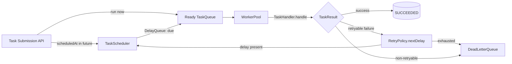
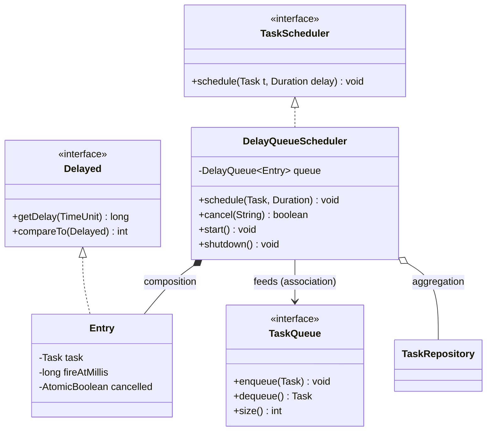

# Delayed Queues

> Where this fits in the project: our Task Queue needs to run some tasks *later*, not *now* — a retry after a backoff, a task whose `scheduledAt` is in the future, or a "visibility delay" so a dequeued-but-not-yet-acked task does not get reprocessed immediately. This chapter builds that "do it later" machinery: Java's `DelayQueue`, a DB-poll alternative, and an overview of timer wheels for when you have millions of pending timers.

---

## 1. Why this exists

Almost every realistic backend eventually needs to say: *"not yet."*

- A `TaskHandler` failed transiently (a 503 from a downstream service). The right move is to retry — but **not immediately**. We want exponential backoff: wait 1s, then 2s, then 4s, with jitter, so we don't hammer the dependency and synchronize a thundering herd.
- A client submits a `Task` with `scheduledAt = now + 30 minutes` ("send this reminder email at 2pm"). The task must sit idle and become eligible exactly when its time arrives.
- In a distributed broker, when a worker picks up a message, the broker hides it for a **visibility timeout**. If the worker crashes without acking, the message reappears after the delay so another worker can take it. That is a delayed *re-delivery*.

The naive answer — "spawn a thread that sleeps" — falls apart immediately. A thread that sleeps for 30 minutes is a thread you cannot use; with 100,000 scheduled tasks you'd need 100,000 sleeping threads. We need a data structure that holds many delayed items efficiently and hands them back **exactly when they are due, soonest first**.

Historically this is the *priority-queue-keyed-on-time* problem. Operating systems solved it for process timers decades ago (callout tables, timer wheels in BSD/Linux). Message brokers re-solved it (SQS visibility timeouts, RabbitMQ delayed-message plugin, Kafka's lack of native delays and the workarounds people build). Java handed us a small, sharp tool for the in-process case: `java.util.concurrent.DelayQueue`.

> A delayed queue is just a priority queue ordered by *fire time*, with a blocking `take()` that refuses to hand you an element until that element's time has actually come.

This builds directly on [the BlockingQueue contract](../06-concurrency/blocking-queue.md) and the [producer–consumer pattern](producer-consumer.md). It is the foundation for [scheduling queues](scheduling-queues.md), feeds [retries](../08-distributed-systems/retries.md), and works alongside [dead-letter queues](dead-letter-queues.md).

---

## 2. The naive version

First cut: a thread per delayed task that sleeps. Drawn straight from a first attempt at our retry path.

```java
// NAIVE — do not ship this.
public class SleepingRetryScheduler {

    private final TaskQueue queue; // re-enqueue target

    public SleepingRetryScheduler(TaskQueue queue) {
        this.queue = queue;
    }

    public void retryAfter(Task task, Duration delay) {
        // One whole platform thread, parked for the entire delay.
        Thread t = new Thread(() -> {
            try {
                Thread.sleep(delay.toMillis());
                queue.enqueue(task);
            } catch (InterruptedException e) {
                Thread.currentThread().interrupt();
            }
        });
        t.start();
    }
}
```

Why this is bad:

- **One thread per pending timer.** 50k scheduled tasks → 50k parked threads → roughly 50 GB of stack reservation on platform threads. It collapses well before that.
- **No ordering / no introspection.** You cannot ask "what fires next?" or "how many are pending?" cheaply.
- **No cancellation.** If the task is cancelled or completes another way, the thread still wakes up and re-enqueues a stale `Task`.
- **Lost on restart.** All of these timers live only in memory and on the call stack. A crash erases every pending retry.

Virtual threads (Loom) make the thread count survivable, but they do **not** fix ordering, introspection, cancellation, or durability. We need a real data structure.

---

## 3. Improved version

Use one priority queue ordered by fire time, drained by a small fixed pool. Java gives us exactly this: `DelayQueue<E>`, where `E` implements `Delayed`. A `DelayQueue` is an unbounded blocking queue whose `take()` only returns an element once its `getDelay(...)` is `<= 0`, and always returns the **soonest-due** element first.

```java
import java.util.concurrent.DelayQueue;
import java.util.concurrent.Delayed;
import java.util.concurrent.TimeUnit;
import java.time.Instant;
import java.util.UUID;

/** Wraps a Task with the instant it becomes eligible to run. */
public final class DelayedTask implements Delayed {

    private final Task task;
    private final long fireAtMillis; // epoch millis when this is due

    public DelayedTask(Task task, Instant fireAt) {
        this.task = task;
        this.fireAtMillis = fireAt.toEpochMilli();
    }

    public Task task() {
        return task;
    }

    @Override
    public long getDelay(TimeUnit unit) {
        long remaining = fireAtMillis - System.currentTimeMillis();
        return unit.convert(remaining, TimeUnit.MILLISECONDS);
    }

    @Override
    public int compareTo(Delayed other) {
        // Order by fire time. NEVER return 0 for distinct items unless they are truly equal,
        // or the queue may treat them as interchangeable.
        return Long.compare(this.fireAtMillis, ((DelayedTask) other).fireAtMillis);
    }
}
```

A single consumer thread can now drain it correctly:

```java
DelayQueue<DelayedTask> delayed = new DelayQueue<>();

// Producer side: schedule for later.
delayed.put(new DelayedTask(task, Instant.now().plusSeconds(30)));

// Consumer side: blocks until the soonest task is actually due.
DelayedTask due = delayed.take(); // returns at the right time, soonest-first
readyQueue.enqueue(due.task());
```

This already fixes ordering, count (`delayed.size()`), efficient blocking (one parked thread, not N), and gives us a place to add cancellation. What it does **not** fix is durability across restarts — we'll address that with the DB-poll design.

---

## 4. Production-quality version

A staff engineer ships a `TaskScheduler` that:

1. Implements our canonical `interface TaskScheduler { void schedule(Task t, Duration delay); }`.
2. Uses a `DelayQueue` for the fast in-memory path.
3. Drains it with a dedicated, named, daemon-free thread under explicit lifecycle control (`start()` / `shutdown()`), feeding the ready `TaskQueue`.
4. Supports **cancellation** by id and is correct under concurrent `schedule()` calls.
5. Updates `Task.status` to `SCHEDULED` while waiting and back to `PENDING` (ready) when fired.
6. Is observable: it exposes pending count and the next fire time.

```java
import java.time.Duration;
import java.time.Instant;
import java.util.Optional;
import java.util.concurrent.ConcurrentHashMap;
import java.util.concurrent.DelayQueue;
import java.util.concurrent.Delayed;
import java.util.concurrent.TimeUnit;
import java.util.concurrent.atomic.AtomicBoolean;

/**
 * In-memory delayed scheduler backed by a DelayQueue.
 * Soonest-due task fires first; the drain thread feeds the ready TaskQueue.
 */
public final class DelayQueueScheduler implements TaskScheduler {

    /** Entry that also carries a "cancelled" flag so we can tombstone in O(1). */
    static final class Entry implements Delayed {
        final Task task;
        final long fireAtMillis;
        final AtomicBoolean cancelled = new AtomicBoolean(false);

        Entry(Task task, long fireAtMillis) {
            this.task = task;
            this.fireAtMillis = fireAtMillis;
        }

        @Override
        public long getDelay(TimeUnit unit) {
            return unit.convert(fireAtMillis - System.currentTimeMillis(), TimeUnit.MILLISECONDS);
        }

        @Override
        public int compareTo(Delayed o) {
            return Long.compare(fireAtMillis, ((Entry) o).fireAtMillis);
        }
    }

    private final DelayQueue<Entry> queue = new DelayQueue<>();
    private final ConcurrentHashMap<String, Entry> index = new ConcurrentHashMap<>();
    private final TaskQueue ready;          // canonical ready queue (e.g. InMemoryTaskQueue)
    private final TaskRepository repository; // optional: persist status transitions
    private volatile Thread drainThread;
    private volatile boolean running = false;

    public DelayQueueScheduler(TaskQueue ready, TaskRepository repository) {
        this.ready = ready;
        this.repository = repository;
    }

    @Override
    public void schedule(Task task, Duration delay) {
        long fireAt = Instant.now().plus(delay).toEpochMilli();
        Entry entry = new Entry(task.withStatus(TaskStatus.SCHEDULED), fireAt);
        // Replace any previous schedule for this id (idempotent reschedule).
        Entry previous = index.put(task.id(), entry);
        if (previous != null) {
            previous.cancelled.set(true); // tombstone the old one; it gets skipped on fire
        }
        queue.put(entry);
        if (repository != null) {
            repository.save(entry.task);
        }
    }

    /** Cancel a pending schedule. Returns true if it was still pending. */
    public boolean cancel(String taskId) {
        Entry e = index.remove(taskId);
        if (e == null) {
            return false;
        }
        // O(1) tombstone; we avoid the O(n) queue.remove(e) on the hot path.
        return e.cancelled.compareAndSet(false, true);
    }

    public void start() {
        if (running) {
            return;
        }
        running = true;
        drainThread = new Thread(this::drainLoop, "delay-scheduler-drain");
        drainThread.start();
    }

    private void drainLoop() {
        while (running) {
            try {
                Entry e = queue.take(); // blocks until the soonest entry is due
                if (e.cancelled.get()) {
                    continue; // skip tombstoned (cancelled / rescheduled) entries
                }
                index.remove(e.task.id(), e);
                Task fired = e.task.withStatus(TaskStatus.PENDING);
                if (repository != null) {
                    repository.save(fired);
                }
                ready.enqueue(fired); // hand off to the worker pool's ready queue
            } catch (InterruptedException ie) {
                Thread.currentThread().interrupt();
                break;
            } catch (RuntimeException re) {
                // Never let one bad entry kill the drain loop.
                System.getLogger(DelayQueueScheduler.class.getName())
                      .log(System.Logger.Level.ERROR, "drain failure", re);
            }
        }
    }

    public void shutdown() {
        running = false;
        if (drainThread != null) {
            drainThread.interrupt();
        }
    }

    // --- observability ---
    public int pending() {
        return queue.size();
    }

    public Optional<Instant> nextFireTime() {
        Entry head = queue.peek(); // does NOT respect delay; just the soonest entry
        return head == null ? Optional.empty() : Optional.of(Instant.ofEpochMilli(head.fireAtMillis));
    }
}
```

Key design choices a reviewer would call out and approve:

- **O(1) cancellation via tombstones.** `DelayQueue.remove(Object)` is O(n). On a hot path we instead flip a `cancelled` flag and let the drain loop skip it — pay nothing now, a tiny skip later.
- **Idempotent reschedule.** Re-scheduling the same id replaces the prior entry and tombstones it, so we never double-fire.
- **The drain loop is crash-resistant.** A single malformed entry logs and continues; it never kills the thread feeding the worker pool.
- **Status transitions** (`SCHEDULED` → `PENDING`) are persisted, so a dashboard can show what's waiting.
- **One blocking thread, not N.** `queue.take()` parks the single drain thread until the head is due — this is the entire reason `DelayQueue` exists.

---

## 5. Code walkthrough

### Beginner: the smallest correct delayed item

```java
import java.util.concurrent.DelayQueue;
import java.util.concurrent.Delayed;
import java.util.concurrent.TimeUnit;

class Ping implements Delayed {
    private final String label;
    private final long fireAt; // epoch millis

    Ping(String label, long delayMillis) {
        this.label = label;
        this.fireAt = System.currentTimeMillis() + delayMillis;
    }

    @Override public long getDelay(TimeUnit unit) {
        return unit.convert(fireAt - System.currentTimeMillis(), TimeUnit.MILLISECONDS);
    }
    @Override public int compareTo(Delayed o) {
        return Long.compare(fireAt, ((Ping) o).fireAt);
    }
    @Override public String toString() { return label; }
}

public class BeginnerDemo {
    public static void main(String[] args) throws InterruptedException {
        DelayQueue<Ping> q = new DelayQueue<>();
        q.put(new Ping("3s", 3000));
        q.put(new Ping("1s", 1000));
        q.put(new Ping("2s", 2000));
        // Prints 1s, 2s, 3s — soonest-due first, each at the right time.
        for (int i = 0; i < 3; i++) {
            System.out.println(q.take());
        }
    }
}
```

The lesson: `getDelay` answers "how long until I'm due?" and `compareTo` answers "who's due first?". Get both right and the queue does the rest.

### Intermediate: exponential backoff retries through a DelayQueue

This wires a [`RetryPolicy`](../08-distributed-systems/retries.md) into the scheduler. When a handler fails *retryably*, we compute the next delay and re-schedule.

```java
import java.time.Duration;
import java.util.Optional;

/** ExponentialBackoffRetryPolicy with full jitter (canonical model). */
public final class ExponentialBackoffRetryPolicy implements RetryPolicy {
    private final Duration base;
    private final Duration cap;
    private final int maxAttempts;
    private final java.util.random.RandomGenerator rng =
            java.util.random.RandomGenerator.getDefault();

    public ExponentialBackoffRetryPolicy(Duration base, Duration cap, int maxAttempts) {
        this.base = base;
        this.cap = cap;
        this.maxAttempts = maxAttempts;
    }

    @Override
    public Optional<Duration> nextDelay(int attempt) {
        if (attempt >= maxAttempts) {
            return Optional.empty(); // give up -> caller sends to DLQ
        }
        // exp = base * 2^attempt, capped
        long exp = Math.min(cap.toMillis(), base.toMillis() * (1L << Math.min(attempt, 30)));
        // full jitter in [0, exp]
        long jittered = rng.nextLong(exp + 1);
        return Optional.of(Duration.ofMillis(jittered));
    }
}
```

```java
/** The outcome handling in Worker, simplified to the retry path. */
public final class RetryingFailureHandler {
    private final RetryPolicy policy;
    private final TaskScheduler scheduler;
    private final DeadLetterQueue dlq;

    public RetryingFailureHandler(RetryPolicy policy, TaskScheduler scheduler, DeadLetterQueue dlq) {
        this.policy = policy;
        this.scheduler = scheduler;
        this.dlq = dlq;
    }

    public void onFailure(Task task, TaskResult result) {
        if (!result.retryable()) {
            dlq.send(task, "non-retryable: " + result.message());
            return;
        }
        Task next = task.withAttempts(task.attempts() + 1).withStatus(TaskStatus.RETRYING);
        Optional<Duration> delay = policy.nextDelay(next.attempts());
        if (delay.isEmpty()) {
            dlq.send(next, "max attempts exhausted");
        } else {
            scheduler.schedule(next, delay.get()); // <-- delayed re-delivery
        }
    }
}
```

The delay grows geometrically and the jitter desynchronizes retries across many failing tasks, which is the whole point of backoff: protect the downstream and avoid a synchronized retry storm. See [retries](../08-distributed-systems/retries.md) for the deeper treatment.

### Production-inspired: durable delays via a DB poll

The `DelayQueue` is in-memory: a crash loses every pending timer. In Phase 2 we persist `scheduledAt` in PostgreSQL and **poll** for due rows. This survives restarts and works across multiple API/worker nodes (it's how SQS-style and most job systems do it).

```sql
-- Flyway migration: V3__add_scheduled_at.sql
ALTER TABLE tasks ADD COLUMN scheduled_at TIMESTAMPTZ NOT NULL DEFAULT now();

-- Index that makes "give me due tasks, soonest first" cheap.
CREATE INDEX idx_tasks_due
    ON tasks (scheduled_at)
    WHERE status IN ('PENDING', 'SCHEDULED', 'RETRYING');
```

```java
import java.time.Instant;
import java.util.List;
import org.springframework.jdbc.core.JdbcTemplate;

/** Polls due tasks atomically so two pollers never grab the same row. */
public final class PostgresTaskRepository implements TaskRepository {

    private final JdbcTemplate jdbc;

    public PostgresTaskRepository(JdbcTemplate jdbc) {
        this.jdbc = jdbc;
    }

    /**
     * Atomically claim up to n tasks whose scheduledAt has passed.
     * SKIP LOCKED lets many pollers run concurrently without contention.
     */
    @Override
    public List<Task> pollDue(int n) {
        return jdbc.query(
            """
            UPDATE tasks
               SET status = 'RUNNING'
             WHERE id IN (
                   SELECT id FROM tasks
                    WHERE status IN ('PENDING','SCHEDULED','RETRYING')
                      AND scheduled_at <= now()
                    ORDER BY priority DESC, scheduled_at ASC
                    LIMIT ?
                    FOR UPDATE SKIP LOCKED
             )
            RETURNING id, type, payload, status, attempts, max_attempts,
                      created_at, scheduled_at, priority
            """,
            (rs, i) -> mapRow(rs),
            n
        );
    }

    @Override public void save(Task t) { /* upsert omitted for brevity */ }
    @Override public java.util.Optional<Task> findById(String id) { /* omitted */ return java.util.Optional.empty(); }

    private Task mapRow(java.sql.ResultSet rs) throws java.sql.SQLException {
        return new Task(
            rs.getString("id"),
            rs.getString("type"),
            rs.getString("payload"),
            TaskStatus.valueOf(rs.getString("status")),
            rs.getInt("attempts"),
            rs.getInt("max_attempts"),
            rs.getTimestamp("created_at").toInstant(),
            rs.getTimestamp("scheduled_at").toInstant(),
            rs.getInt("priority")
        );
    }
}
```

```java
import java.util.concurrent.Executors;
import java.util.concurrent.ScheduledExecutorService;
import java.util.concurrent.TimeUnit;

/** A poller that promotes due DB tasks into the ready queue every tick. */
public final class DueTaskPoller {
    private final TaskRepository repo;
    private final TaskQueue ready;
    private final ScheduledExecutorService ticker =
            Executors.newSingleThreadScheduledExecutor(r -> {
                Thread t = new Thread(r, "due-poller");
                t.setDaemon(true);
                return t;
            });

    public DueTaskPoller(TaskRepository repo, TaskQueue ready) {
        this.repo = repo;
        this.ready = ready;
    }

    public void start(long periodMillis, int batchSize) {
        ticker.scheduleAtFixedRate(() -> {
            try {
                for (Task t : repo.pollDue(batchSize)) {
                    ready.enqueue(t);
                }
            } catch (RuntimeException e) {
                System.getLogger("DueTaskPoller")
                      .log(System.Logger.Level.WARNING, "poll failed", e);
            }
        }, 0, periodMillis, TimeUnit.MILLISECONDS);
    }

    public void shutdown() {
        ticker.shutdown();
    }
}
```

`FOR UPDATE SKIP LOCKED` is the load-bearing trick: it lets N poller instances run concurrently, each grabbing a disjoint batch of due rows without blocking on each other. That is what makes the DB-poll approach horizontally scalable.

---

## 6. How this applies to our Task Queue project





Concretely, the canonical classes that participate:

- `TaskScheduler` / `DelayQueueScheduler` — the in-memory delayed path (Phase 1–3).
- `Task.scheduledAt` + `TaskStatus.SCHEDULED` — the durable field and state.
- `PostgresTaskRepository.pollDue(int n)` — the durable, cross-node path (Phase 2+).
- `RetryPolicy` → `TaskScheduler.schedule(...)` — backoff re-delivery (Phase 2–3).
- `DeadLetterQueue` — terminus when retries are exhausted (Phase 3).

Two complementary mechanisms, same goal: **the in-memory `DelayQueue` gives microsecond-precision, zero-DB-load delays; the DB poll gives durability and horizontal scale.** Real systems run both: schedule near-term retries in memory, persist `scheduledAt` so nothing is lost on restart.

---

## 7. Tradeoffs

| Approach | Precision | Durable? | Scales across nodes? | Pending cost | Best for |
|---|---|---|---|---|---|
| Thread-per-sleep (naive) | high | no | no | O(n) threads | never |
| `DelayQueue` (in-memory) | very high (ms) | no | no | O(log n) insert | short delays, retries, single node |
| `ScheduledExecutorService` | very high | no | no | O(log n) | fixed-rate ticks, few timers |
| DB poll (`scheduledAt`) | poll-period-bounded | yes | yes (SKIP LOCKED) | one indexed query/tick | durable schedules, multi-node |
| Broker delay (SQS/RabbitMQ) | seconds | yes | yes | broker-managed | cross-service delayed delivery |
| Timer wheel | tick-bounded | depends | depends | O(1) insert/expire | millions of timers |

The honest summary:

- **Precision vs durability is the core tension.** In-memory is precise but volatile; DB poll is durable but only as precise as your poll interval (a 1s tick means up to ~1s late).
- **`DelayQueue` is unbounded.** Producing far faster than you drain grows the heap without backpressure. For huge volumes, prefer the DB or a timer wheel.
- **Poll interval is a knob with two costs.** Short interval → lower latency, more DB load. Long interval → cheaper, laggier. Pick per SLA; 500ms–2s is typical.

---

## 8. Common mistakes and pitfalls

- **`compareTo` returning 0 for distinct items.** If `compareTo` returns 0 the queue may treat two different tasks as equal and order becomes unstable. Always compare by fire time and break ties (e.g., by sequence number or id). Never `return 0` blindly.
- **`getDelay` computed against a frozen "now."** Compute remaining time as `fireAt - System.currentTimeMillis()` *each call*. Caching the delay value makes the queue fire at the wrong time.
- **Using wall-clock that jumps.** `System.currentTimeMillis()` can shift with NTP/leap adjustments. For pure interval timing prefer `System.nanoTime()`. We use epoch millis here because we persist an absolute `scheduledAt`, which is the right choice for absolute schedules.
- **`DelayQueue.remove(Object)` on the hot path.** It is O(n). Use tombstones for cancellation, as shown.
- **Forgetting durability.** An in-memory-only scheduler silently drops every pending retry on deploy/restart. Persist `scheduledAt`.
- **Polling without `SKIP LOCKED`.** Two pollers grab the same rows, double-process, and lock-contend. `FOR UPDATE SKIP LOCKED` fixes both.
- **No cap on backoff.** `base * 2^attempt` overflows and produces century-long delays. Cap it (`Math.min(cap, ...)`).
- **Unbounded growth.** No backpressure on the `DelayQueue` means a hot producer can OOM you. Bound the in-memory path or push to the DB.

---

## 9. Refactoring exercise

**Bad** — sleeps a pooled thread, blocking it for the entire delay and exhausting the pool under load:

```java
ExecutorService pool = Executors.newFixedThreadPool(8);

void retryLater(Task task, Duration delay) {
    pool.submit(() -> {
        try {
            Thread.sleep(delay.toMillis()); // burns a pool thread the whole time
            readyQueue.enqueue(task);
        } catch (InterruptedException e) {
            Thread.currentThread().interrupt();
        }
    });
}
```

With 8 threads and 9 concurrent 60s retries, the 9th waits 60s just to *start* waiting. The pool is a bottleneck, not a scheduler.

**Improved** — one `DelayQueue`, one drain thread; the pool only does real work:

```java
private final DelayQueue<DelayedTask> delayed = new DelayQueue<>();

void retryLater(Task task, Duration delay) {
    delayed.put(new DelayedTask(task, Instant.now().plus(delay)));
}

void startDrain() {
    Thread t = new Thread(() -> {
        while (!Thread.currentThread().isInterrupted()) {
            try {
                readyQueue.enqueue(delayed.take().task());
            } catch (InterruptedException e) {
                Thread.currentThread().interrupt();
            }
        }
    }, "retry-drain");
    t.start();
}
```

One parked thread now holds *all* pending delays; the worker pool is never blocked on a timer.

**Production-quality** — durable + observable + cancellable, combining the in-memory path with persistence so restarts don't lose retries:

```java
final class DurableRetryScheduler implements TaskScheduler {
    private final DelayQueueScheduler memory;   // fast path
    private final TaskRepository repository;     // durable path

    DurableRetryScheduler(DelayQueueScheduler memory, TaskRepository repository) {
        this.memory = memory;
        this.repository = repository;
    }

    @Override
    public void schedule(Task task, Duration delay) {
        Task scheduled = task
            .withScheduledAt(Instant.now().plus(delay))
            .withStatus(TaskStatus.SCHEDULED);
        repository.save(scheduled);        // survives a crash
        if (delay.compareTo(Duration.ofMinutes(5)) <= 0) {
            memory.schedule(scheduled, delay); // near-term: precise in-memory firing
        }
        // Far-future tasks are left to the DB poller, keeping the heap small.
    }
}
```

The rule of thumb: **schedule near-term delays in memory for precision; rely on the DB poll as the durable backstop for everything.** On restart, the poller naturally re-picks any persisted due/near-due tasks.

---

## 10. Exercises

### Easy

**E1 (knowledge check).** Why does `DelayQueue.take()` block even when the queue is non-empty, and what determines when it returns?

**E2 (coding).** Implement a `Delayed`-based `Reminder` record holding a message and a fire time, then enqueue three reminders out of order and verify they print soonest-first at the correct times.

### Medium

**M1 (coding).** Add O(1) `cancel(String id)` to a `DelayQueue`-backed scheduler using tombstones, and prove a cancelled task never fires.

**M2 (refactoring).** Take the "sleep on a pooled thread" anti-pattern and refactor it to a single `DelayQueue` drain thread. Explain the thread-count difference for 10,000 pending 30s delays.

### Hard

**H1 (design).** Design durable delayed delivery across 3 worker nodes using PostgreSQL. Specify schema, index, the claim query, and how you prevent double-processing and starvation.

**H2 (interview-style).** Kafka has no native per-message delay. Design a delayed-delivery layer on top of Kafka for our task platform. What are the failure modes?

**H3 (stretch).** Implement a single-level **timer wheel** with 1s resolution and 60 buckets, supporting O(1) `add` and per-tick expiry. Compare its behavior to `DelayQueue` for one million short-lived timers.

---

## 11. Solutions

### E1

`take()` returns only when the **soonest-due** element's `getDelay(...) <= 0` — i.e., its absolute fire time has arrived. A non-empty queue whose head fires in the future will still block, because `DelayQueue`'s contract is "no element is available until its delay expires." The head element (smallest fire time) determines the wakeup; internally the queue parks until then.

### E2

```java
import java.util.concurrent.*;
import java.time.Instant;

record Reminder(String message, long fireAt) implements Delayed {
    static Reminder in(String msg, long ms) {
        return new Reminder(msg, System.currentTimeMillis() + ms);
    }
    @Override public long getDelay(TimeUnit u) {
        return u.convert(fireAt - System.currentTimeMillis(), TimeUnit.MILLISECONDS);
    }
    @Override public int compareTo(Delayed o) {
        return Long.compare(fireAt, ((Reminder) o).fireAt);
    }
}

public class ReminderDemo {
    public static void main(String[] a) throws InterruptedException {
        DelayQueue<Reminder> q = new DelayQueue<>();
        q.put(Reminder.in("third", 1500));
        q.put(Reminder.in("first", 500));
        q.put(Reminder.in("second", 1000));
        long start = System.currentTimeMillis();
        for (int i = 0; i < 3; i++) {
            Reminder r = q.take();
            System.out.printf("%s at +%dms%n", r.message(), System.currentTimeMillis() - start);
        }
        // first ~500ms, second ~1000ms, third ~1500ms
    }
}
```

### M1

```java
import java.util.concurrent.*;
import java.util.concurrent.atomic.AtomicBoolean;
import java.time.*;

final class CancellableScheduler {
    static final class Entry implements Delayed {
        final String id; final long fireAt;
        final AtomicBoolean cancelled = new AtomicBoolean(false);
        Entry(String id, long fireAt) { this.id = id; this.fireAt = fireAt; }
        public long getDelay(TimeUnit u) {
            return u.convert(fireAt - System.currentTimeMillis(), TimeUnit.MILLISECONDS);
        }
        public int compareTo(Delayed o) { return Long.compare(fireAt, ((Entry) o).fireAt); }
    }

    private final DelayQueue<Entry> q = new DelayQueue<>();
    private final ConcurrentHashMap<String, Entry> index = new ConcurrentHashMap<>();

    void schedule(String id, Duration delay) {
        Entry e = new Entry(id, Instant.now().plus(delay).toEpochMilli());
        Entry prev = index.put(id, e);
        if (prev != null) prev.cancelled.set(true);
        q.put(e);
    }

    boolean cancel(String id) {                 // O(1): tombstone, no queue scan
        Entry e = index.remove(id);
        return e != null && e.cancelled.compareAndSet(false, true);
    }

    String takeFired() throws InterruptedException {
        while (true) {
            Entry e = q.take();
            if (!e.cancelled.get()) {            // skip tombstones
                index.remove(e.id, e);
                return e.id;
            }
        }
    }
}
```

Proof sketch: `cancel` flips `cancelled` before the fire time. When `take()` later surfaces the entry, `takeFired` sees the flag set and loops to the next entry — the cancelled id is never returned. Cancellation is O(1); we never scan the queue.

### M2

```java
// Before: each retry parks a pool thread for the whole delay.
//   10,000 pending 30s delays => needs 10,000 live threads (~10 GB stack) or stalls a small pool.
// After: one DelayQueue holds all 10,000 entries; ONE drain thread is parked.
private final DelayQueue<DelayedTask> delayed = new DelayQueue<>();
void retryLater(Task t, Duration d) { delayed.put(new DelayedTask(t, Instant.now().plus(d))); }
void drainLoop() {
    while (!Thread.currentThread().isInterrupted()) {
        try { readyQueue.enqueue(delayed.take().task()); }
        catch (InterruptedException e) { Thread.currentThread().interrupt(); }
    }
}
```

Thread-count difference: the sleep approach needs ~10,000 blocked threads (or it serializes on a small pool, adding latency); the `DelayQueue` needs exactly **one** parked drain thread for all 10,000 timers. Memory and scheduler pressure drop by ~4 orders of magnitude.

### H1

Schema and index (PostgreSQL):

```sql
CREATE TABLE tasks (
  id           UUID PRIMARY KEY,
  type         TEXT NOT NULL,
  payload      JSONB NOT NULL,
  status       TEXT NOT NULL,
  attempts     INT  NOT NULL DEFAULT 0,
  max_attempts INT  NOT NULL DEFAULT 5,
  priority     INT  NOT NULL DEFAULT 0,
  created_at   TIMESTAMPTZ NOT NULL DEFAULT now(),
  scheduled_at TIMESTAMPTZ NOT NULL DEFAULT now()
);
CREATE INDEX idx_due ON tasks (priority DESC, scheduled_at ASC)
  WHERE status IN ('PENDING','SCHEDULED','RETRYING');
```

Claim query (run by each of the 3 nodes):

```sql
UPDATE tasks SET status='RUNNING'
WHERE id IN (
  SELECT id FROM tasks
   WHERE status IN ('PENDING','SCHEDULED','RETRYING') AND scheduled_at <= now()
   ORDER BY priority DESC, scheduled_at ASC
   LIMIT 50 FOR UPDATE SKIP LOCKED
)
RETURNING *;
```

- **No double-processing:** the `UPDATE ... SELECT ... FOR UPDATE SKIP LOCKED` atomically transitions claimed rows to `RUNNING`; another node's `SKIP LOCKED` skips them.
- **No starvation:** `ORDER BY priority DESC, scheduled_at ASC` plus a max-attempt cap; optionally bump priority of long-waiting rows (aging) to guarantee progress.
- **Crash recovery:** a reaper re-sets rows stuck in `RUNNING` past a lease deadline back to `RETRYING` (`UPDATE ... WHERE status='RUNNING' AND updated_at < now() - lease`).

### H2

Layer over Kafka: use a small ladder of **delay topics** (`retry-5s`, `retry-30s`, `retry-5m`). A failed task is produced to the topic matching its next backoff. A consumer for each delay topic reads the head, computes `sleepUntil = recordTimestamp + topicDelay`, **pauses the partition** (`consumer.pause`) until that instant, then resumes and republishes the task to the main `tasks` topic. Because Kafka preserves per-partition order and records carry timestamps, pausing the partition gives you delayed delivery without per-message timers.

Failure modes: (1) coarse granularity — only the discrete delay rungs you defined; (2) head-of-line blocking — one early record holds the partition while later records may already be due, so size delays carefully; (3) rebalances reset paused state, so re-derive sleep from the record timestamp, never from in-memory clocks; (4) at-least-once means a task can be republished twice on crash — handlers must be [idempotent](../08-distributed-systems/idempotency.md).

### H3

```java
import java.util.*;

/** Single-level hashed timer wheel: 60 buckets, 1s tick. */
final class TimerWheel {
    private final List<Deque<Runnable>> buckets;
    private final int slots;
    private int cursor = 0;

    TimerWheel(int slots) {
        this.slots = slots;
        this.buckets = new ArrayList<>(slots);
        for (int i = 0; i < slots; i++) buckets.add(new ArrayDeque<>());
    }

    /** O(1): place the callback in the bucket for `delaySeconds` from now. */
    void add(int delaySeconds, Runnable task) {
        if (delaySeconds >= slots) throw new IllegalArgumentException("exceeds wheel span");
        int slot = (cursor + delaySeconds) % slots;
        buckets.get(slot).add(task);
    }

    /** Call once per second. O(k) in the number of timers due this tick. */
    void tick() {
        Deque<Runnable> due = buckets.get(cursor);
        Runnable r;
        while ((r = due.poll()) != null) r.run();
        cursor = (cursor + 1) % slots;
    }
}
```

Comparison for one million short-lived timers:
- **Insert:** wheel is O(1) array-index + deque add; `DelayQueue` is O(log n) heap insert (~20 comparisons at n=1M).
- **Expiry:** wheel pays O(1) per tick to find the bucket, then O(k) for the k timers due; `DelayQueue` pays O(log n) per poll.
- **Tradeoff:** the wheel's resolution is the tick (1s here) and its span is `slots * tick` (60s). For long, precise delays the wheel needs hierarchical levels (the Linux/Netty approach). `DelayQueue` has arbitrary precision and span but worse asymptotics at extreme scale. Rule: millions of coarse, short timers → wheel; thousands of precise, arbitrary timers → `DelayQueue`.

---

## 12. Interview questions and takeaways

1. **What is `DelayQueue` and how does it order elements?**
   An unbounded blocking queue of `Delayed` elements; `take()` returns the element with the smallest remaining delay, and only once that delay reaches zero. Internally a `PriorityQueue` keyed on fire time.

2. **Why not spawn a thread that sleeps for each delayed task?**
   It is O(n) threads, has no ordering/introspection/cancellation, and dies on restart. `DelayQueue` needs one blocked drain thread for all timers.

3. **In-memory `DelayQueue` vs DB-poll for `scheduledAt` — when each?**
   `DelayQueue`: precise, low-latency, single-node, volatile. DB poll: durable, multi-node via `SKIP LOCKED`, precision bounded by poll interval. Production runs both.

4. **What does `FOR UPDATE SKIP LOCKED` buy you?**
   Concurrent pollers claim disjoint due rows without blocking each other, preventing double-processing and lock contention — the key to scaling the DB-poll design horizontally.

5. **How does exponential backoff with jitter relate to delayed queues?**
   The `RetryPolicy` computes the next delay; the scheduler enqueues the retry with that delay. Jitter desynchronizes many simultaneous failures, preventing a retry storm.

6. **What's the danger of `compareTo` returning 0?**
   Distinct tasks can be treated as equal, making ordering unstable and risking lost/duplicated ordering. Always order by fire time and break ties.

7. **What is a timer wheel and when do you reach for it?**
   A circular array of buckets with O(1) insert/expiry, used when you have millions of timers (OS schedulers, Netty, Kafka). The cost is tick-bounded resolution and bounded span (mitigated by hierarchy).

8. **How do you cancel a scheduled task cheaply?**
   Tombstone via an `AtomicBoolean` flag and skip it on fire — O(1) — instead of `DelayQueue.remove`, which is O(n).

---

## 13. Production considerations

- **Durability is non-negotiable.** An in-memory-only scheduler loses every pending retry on each deploy. Always persist `scheduledAt`; treat `DelayQueue` as an accelerator, not the source of truth.
- **Clock skew across nodes.** `scheduled_at <= now()` uses the database clock — make the DB the single time authority so nodes with skewed clocks still agree on "due." Never compare a node's local clock against another node's timestamps.
- **Poll interval vs DB load.** Each poll is an indexed `UPDATE`. Tune interval to your latency SLA; for thousands of tasks/sec, batch (`LIMIT 100`) and add poller instances rather than shrinking the interval to milliseconds.
- **Backpressure.** The in-memory `DelayQueue` is unbounded. Under a retry storm it can OOM. Bound the near-term horizon (e.g., only delays ≤ 5 min in memory) and let the DB hold the rest.
- **Observability.** Export `scheduler.pending` (gauge), `scheduler.next_fire_seconds` (gauge), `scheduler.fired_total` and `scheduler.late_total` (counters) via Micrometer. Alert when *firing lateness* (actual − scheduled) exceeds your SLA — late firing is the canary for an overloaded drain or poller.
- **Stuck `RUNNING` rows.** A worker that claims a due task and crashes leaves it `RUNNING` forever. Run a reaper that leases claims and resets expired ones to `RETRYING`.
- **Leap seconds / DST / NTP steps.** Absolute schedules use UTC `TIMESTAMPTZ`; pure interval timing should use `System.nanoTime()`. Don't mix the two.

---

## What We Can Improve In Our Project Using This Concept

Today (Phase 1) a failed `Task` is either dropped or retried immediately, hammering downstream services. We can introduce a real `TaskScheduler` (`DelayQueueScheduler`) so:

- `RetryPolicy.nextDelay` results actually become **delayed re-deliveries** instead of busy retries.
- `Task.scheduledAt` becomes meaningful: clients can submit tasks to run in the future.
- The worker pool stops blocking on timers — one drain thread handles all pending delays.
- Phase 2 adds the durable DB-poll backstop so restarts no longer lose retries.

## Project Refactoring Task

1. Add `DelayQueueScheduler implements TaskScheduler` with `schedule`, `cancel`, `start`, `shutdown`, and tombstone-based cancellation.
2. Wire the `Worker` failure path through `RetryingFailureHandler`: retryable + delay-present → `scheduler.schedule(...)`; exhausted → `dlq.send(...)`.
3. Add Micrometer gauges `scheduler.pending` and `scheduler.next_fire_seconds`, and counter `scheduler.fired_total`.
4. (Phase 2) Add Flyway `V3__add_scheduled_at.sql`, implement `PostgresTaskRepository.pollDue` with `FOR UPDATE SKIP LOCKED`, and run a `DueTaskPoller`.
5. Add tests: ordering correctness, cancellation never fires, backoff growth, and (Testcontainers) two pollers never claim the same row.

## Git Commit For This Chapter

```text
feat(scheduler): add DelayQueue-backed TaskScheduler with delayed retries and durable poll

- add DelayQueueScheduler implements TaskScheduler (tombstone cancel, start/shutdown)
- route Worker retryable failures through RetryPolicy -> scheduler.schedule
- add ExponentialBackoffRetryPolicy with full jitter and capped delay
- (phase 2) Flyway V3__add_scheduled_at.sql + PostgresTaskRepository.pollDue (FOR UPDATE SKIP LOCKED)
- add DueTaskPoller and scheduler Micrometer metrics

Files touched:
  src/main/java/.../scheduler/DelayQueueScheduler.java
  src/main/java/.../scheduler/DueTaskPoller.java
  src/main/java/.../retry/ExponentialBackoffRetryPolicy.java
  src/main/java/.../retry/RetryingFailureHandler.java
  src/main/java/.../repo/PostgresTaskRepository.java
  src/main/resources/db/migration/V3__add_scheduled_at.sql
  src/test/java/.../scheduler/DelayQueueSchedulerTest.java
```

## Architecture Impact

A new **scheduling stage** sits between the API and the ready queue, and between the worker failure path and the ready queue. It decouples "when a task is created/fails" from "when it runs," which is the precondition for backoff, rate-aware re-delivery, and future scheduling. With the DB-poll backstop it also becomes a **stateless, horizontally scalable** component: every node runs the same poller against the same table, coordinated only by `SKIP LOCKED`. This sets up [scheduling queues](scheduling-queues.md), [dead-letter queues](dead-letter-queues.md), and [rate limiting](../08-distributed-systems/rate-limiting.md).

## Interview Takeaways

- A delayed queue is a **priority queue keyed on fire time** with a blocking, time-gated `take()`.
- `DelayQueue` = precise + volatile; DB poll = durable + scalable; production uses **both**.
- `FOR UPDATE SKIP LOCKED` is the multi-node delayed-delivery workhorse.
- Cancel via **tombstone (O(1))**, never `remove` (O(n)); never let `compareTo` return 0 for distinct items.
- For millions of timers, reach for a **timer wheel**; for thousands of precise ones, `DelayQueue`.
