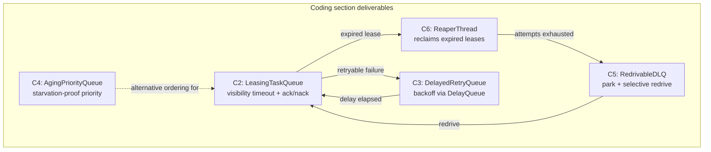
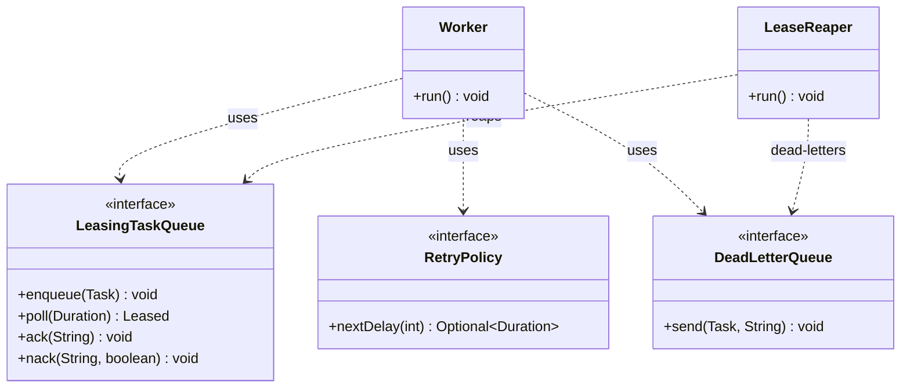

# Queues and Messaging: Exercises

> Where this fits: this is the module-wide problem set for the **queues and messaging layer** of the Task Queue platform. Each chapter in `07-queues-and-messaging/` taught one shape of queue — producer/consumer, message queues, task queues, priority, delayed, scheduling, dead-letter, broker selection. Here you assemble them into the real machinery a worker fleet leans on: a **leasing queue** with visibility timeouts, a **delayed-retry queue** with backoff, a **priority queue with aging**, a **dead-letter queue with redrive**, and a **broker-selection design** problem. Solutions live in **[./solutions.md](./solutions.md)** — try each problem before peeking.

These exercises assume you have read, or can refer back to:

- [./producer-consumer.md](./producer-consumer.md) — the decoupling pattern, backpressure, bounded buffers.
- [./message-queues.md](./message-queues.md) — delivery semantics, acks, the broker layer.
- [./task-queues.md](./task-queues.md) — the `TaskQueue` port, the task lifecycle state machine, leasing.
- [./priority-queues.md](./priority-queues.md) — heaps, `PriorityBlockingQueue`, aging to prevent starvation.
- [./delayed-queues.md](./delayed-queues.md) — `DelayQueue`, visibility timeouts, backoff scheduling.
- [./scheduling-queues.md](./scheduling-queues.md) — `ScheduledExecutorService`, cron-like and one-shot schedules.
- [./dead-letter-queues.md](./dead-letter-queues.md) — poison messages, the `DeadLetterQueue` port, redrive.
- [./broker-comparison.md](./broker-comparison.md) — Redis vs RabbitMQ vs Kafka vs SQS tradeoffs.

It also leans on the concurrency module, especially [../06-concurrency/blocking-queue.md](../06-concurrency/blocking-queue.md) and [../06-concurrency/atomics-and-thread-safety.md](../06-concurrency/atomics-and-thread-safety.md), and forward-references the distributed-systems treatments of [../08-distributed-systems/retries.md](../08-distributed-systems/retries.md), [../08-distributed-systems/dlq.md](../08-distributed-systems/dlq.md), and [../08-distributed-systems/idempotency.md](../08-distributed-systems/idempotency.md).

---

## How to use this file

- Exercises are numbered by **category prefix + sequence**: `K` = Knowledge-Check, `C` = Coding, `R` = Refactoring, `D` = Design, `I` = Interview, `S` = Stretch. The solutions file references these exact IDs (`K3`, `C5`, `D2`, …).
- Each is tagged **Easy / Medium / Hard**. Work top-to-bottom within a category, or jump to the queue shape you want to drill.
- **No solutions here.** They live in [./solutions.md](./solutions.md). Resist peeking; the whole point is to write the code yourself first.
- Several coding problems build on each other. By the end of the Coding section you will have a coherent, testable slice of the queue layer.

### The shared model slice

The canonical domain model is shared across the whole repo. The slice you need for this module:

```java
// The slice of the canonical model used throughout these exercises.
// Do NOT change these signatures unless an exercise explicitly says to.
enum TaskStatus { PENDING, SCHEDULED, RUNNING, SUCCEEDED, FAILED, RETRYING, DEAD }

record Task(String id, String type, String payload, TaskStatus status,
            int attempts, int maxAttempts,
            java.time.Instant createdAt, java.time.Instant scheduledAt, int priority) {

    // Convenience "wither" helpers you may rely on in exercises.
    Task withStatus(TaskStatus s)   { return new Task(id, type, payload, s, attempts, maxAttempts, createdAt, scheduledAt, priority); }
    Task withAttempts(int a)        { return new Task(id, type, payload, status, a, maxAttempts, createdAt, scheduledAt, priority); }
    Task withScheduledAt(java.time.Instant t) { return new Task(id, type, payload, status, attempts, maxAttempts, createdAt, t, priority); }
}

@FunctionalInterface
interface TaskHandler { TaskResult handle(Task task) throws Exception; }

record TaskResult(boolean success, String message, boolean retryable) {}

interface TaskQueue {
    void enqueue(Task t);
    Task dequeue() throws InterruptedException;   // blocking; returns ready work
    int size();
}

interface RetryPolicy { java.util.Optional<java.time.Duration> nextDelay(int attempt); }

interface DeadLetterQueue { void send(Task t, String reason); }

interface RateLimiter { boolean tryAcquire(); }
```

> Consistency with the other 129 files matters — the same `Task` / `TaskQueue` / `Worker` / `DeadLetterQueue` appear in Phases 2–4. If an exercise extends the model, it does so with a **new** type, not by mutating these.

### What you build in the Coding section



---

## Part 1 — Knowledge-Check (conceptual, short answers)

Answer in one to four sentences. These check that you understand *why* the machinery is shaped the way it is.

### K1 (Easy) — dequeue vs lease
Our `TaskQueue.dequeue()` removes a task and hands it to a worker. Why is plain `dequeue` (remove-on-read) unsafe for a durable task queue, and what does **leasing** (a.k.a. visibility timeout) change? What failure does leasing protect against?

### K2 (Easy) — at-least-once is the default
Explain why a leasing task queue gives **at-least-once** delivery rather than exactly-once. Give one concrete sequence of events that causes a task to run twice even though nothing is "broken."

### K3 (Easy) — visibility timeout sizing
A handler's p99 runtime is 8 seconds. You set the visibility timeout to 5 seconds. Describe precisely what goes wrong, and state the rule of thumb for choosing the timeout relative to handler runtime.

### K4 (Easy) — why a DLQ at all
A task fails its `maxAttempts`. Why move it to a **dead-letter queue** instead of (a) deleting it, or (b) retrying forever? Name two operational things the DLQ buys you.

### K5 (Medium) — priority heap is not FIFO
`PriorityBlockingQueue` orders by priority, but within the same priority it makes **no FIFO guarantee**. Why? What single field do you add to `Task`'s comparator to restore FIFO-within-priority, and what is the comparator's secondary key?

### K6 (Medium) — starvation and aging
Define **starvation** in a static-priority queue. Explain how **aging** (effective priority rises with wait time) fixes it, and state one subtle correctness problem aging introduces when implemented on top of a binary heap like `PriorityBlockingQueue`.

### K7 (Medium) — DelayQueue vs sleep-per-task
A naive delayed retry spawns one `Thread.sleep(delay)` per task. Contrast this with a single `DelayQueue`. Give the time and space complexity of each for N pending delayed tasks, and explain why `DelayQueue` wins.

### K8 (Medium) — poison messages
Define a **poison message**. Why can a single poison message attached to a *non-leasing* queue stall an entire worker fleet, and how does a leasing queue with a max-receive count contain the blast radius?

### K9 (Hard) — redrive must be idempotent-aware
You redrive 10,000 parked tasks from the DLQ back into the main queue after fixing a bug. Some of those tasks *partially* executed before failing. What property must the handlers have for redrive to be safe, and where in the model would you enforce a dedupe key? Cross-reference [../08-distributed-systems/idempotency.md](../08-distributed-systems/idempotency.md).

### K10 (Hard) — broker selection drivers
Give the **single most important** selection driver that pushes you toward each of: (a) Kafka, (b) RabbitMQ, (c) Redis lists/streams, (d) Amazon SQS. One phrase each. Then state which of the four gives you a per-message **visibility timeout + DLQ** out of the box.

### K11 (Hard) — ordering vs parallelism
You want strict per-`type` ordering ("all `email.send` tasks for user X run in submission order") AND high parallelism across types. Explain why a single priority queue cannot give you both, and sketch the partitioning idea that can. Cross-reference [../08-distributed-systems/message-ordering.md](../08-distributed-systems/message-ordering.md).

---

## Part 2 — Coding exercises (build the queue layer)

> Target: **Java 21**. Use records, sealed types, `switch` pattern matching, virtual threads where natural. Every solution should compile and be unit-testable with JUnit 5 + AssertJ. Keep classes small and the ports clean.

### C1 (Easy) — a `LeasedTask` envelope and an in-memory `Lease` registry

Before you can lease, you need to model a lease. Implement:

```java
// A lease is "this worker holds task T until `expiresAt`; if it doesn't ack/nack by then, reclaim it."
record Lease(String taskId, String leaseId, java.time.Instant expiresAt) {}
```

Implement a thread-safe `LeaseRegistry` with:

```java
interface LeaseRegistry {
    Lease grant(String taskId, java.time.Duration ttl);   // creates a lease, returns it
    boolean ack(String leaseId);                           // task done; lease consumed -> true if lease was live
    boolean nack(String leaseId);                          // give it back early -> true if lease was live
    java.util.List<String> reapExpired(java.time.Instant now); // returns taskIds whose lease expired
}
```

**Requirements.** `grant` must generate a unique `leaseId` (UUID). `ack`/`nack` on an already-expired or unknown lease must return `false` (and must NOT crash). `reapExpired` must atomically collect and remove expired leases. Make it safe under concurrent `grant`/`ack`/`reapExpired` from many threads — say which concurrent collection or lock you chose and why.

**Test ideas:** ack before expiry returns `true`; ack after `reapExpired` returns `false`; 1,000 concurrent grants produce 1,000 distinct lease IDs.

---

### C2 (Medium) — `LeasingTaskQueue` (visibility timeout, ack/nack)

This is the centerpiece. Build a single-process queue that hands out **leases** instead of removing tasks, so a crashed worker's task becomes visible again.

```java
interface LeasingTaskQueue {
    void enqueue(Task t);
    /** Lease the next ready task for `leaseTtl`. Blocks until one is available. */
    Leased poll(java.time.Duration leaseTtl) throws InterruptedException;
    void ack(String leaseId);                 // success: task leaves the queue for good
    void nack(String leaseId, boolean requeue);// failure: requeue now, or drop
    int inFlight();                           // currently leased
    int available();                          // ready to be leased
}

record Leased(Task task, String leaseId) {}
```

**Requirements.**
1. `poll` returns a task and marks it **in-flight** (invisible to other `poll`s) until the lease expires or is acked/nacked.
2. If a lease expires without `ack`/`nack`, the task becomes available again automatically (you may rely on the reaper from **C6**, or an internal timer — state which).
3. `ack` removes the task permanently; acking an expired/unknown lease is a no-op that does not throw.
4. `available()` + `inFlight()` must be consistent (no task counted in both, none lost).
5. Backpressure: provide a bounded variant `enqueue` that blocks (or returns `false`) when capacity is hit.

**Stretch within C2:** make `poll` fair (FIFO among ready tasks) and document whether you used `PriorityBlockingQueue` (no FIFO) or a `LinkedBlockingDeque` + side index.

**Test ideas:** lease a task, let the TTL expire without ack, assert it can be re-polled; ack within TTL, assert it cannot be re-polled; `inFlight()` drops to 0 after ack.

---

### C3 (Medium) — `DelayedRetryQueue` with pluggable `RetryPolicy`

When a handler returns a retryable failure, the task must come back **later**, not immediately. Build a delayed-retry buffer on top of `java.util.concurrent.DelayQueue`.

```java
final class FixedDelayRetryPolicy implements RetryPolicy {
    private final java.time.Duration delay; private final int maxAttempts;
    // nextDelay(attempt) -> Optional.of(delay) while attempt < maxAttempts, else Optional.empty()
}

final class ExponentialBackoffRetryPolicy implements RetryPolicy {
    // nextDelay(attempt) -> base * 2^attempt, capped at maxDelay, plus full jitter, until maxAttempts
}

final class DelayedRetryQueue {
    DelayedRetryQueue(RetryPolicy policy) { /* ... */ }
    /** Schedule a retry for `t`. Returns false if the policy is exhausted (caller should dead-letter). */
    boolean scheduleRetry(Task t);
    /** Blocks until a task's delay elapses, then returns it (status RETRYING -> ready). */
    Task takeReady() throws InterruptedException;
    int pending();
}
```

**Requirements.**
1. Implement both retry policies. `ExponentialBackoffRetryPolicy` must apply **full jitter** (`random in [0, computedDelay]`) and a `maxDelay` cap — explain in a comment why jitter matters (thundering herd / retry storms).
2. `scheduleRetry` increments `attempts` and sets status `RETRYING`; if the policy returns `Optional.empty()`, return `false`.
3. `takeReady` must block until the earliest task is actually due (no busy-waiting), using `DelayQueue`'s `getDelay`/`compareTo`.
4. Pending count must be accurate.

**Test ideas:** schedule with a 50 ms fixed delay; assert `takeReady` returns it after ~50 ms, not before; exponential policy produces non-decreasing (pre-jitter) delays and stops after `maxAttempts`; jitter keeps delays within `[0, cap]`.

---

### C4 (Medium) — `AgingPriorityQueue` (starvation-proof)

A static priority queue starves low-priority tasks under sustained high-priority load. Build a priority queue whose **effective priority rises with wait time**.

```java
final class AgingPriorityQueue implements TaskQueue {
    /** agingStep = how many seconds of waiting buys +1 effective priority. */
    AgingPriorityQueue(java.time.Duration agingStep) { /* ... */ }
    public void enqueue(Task t) { /* ... */ }
    public Task dequeue() throws InterruptedException { /* highest effective priority, blocking */ }
    public int size() { /* ... */ }

    /** effectivePriority = task.priority + floor(waitedSeconds / agingStepSeconds). Package-private for tests. */
    int effectivePriority(Task t, java.time.Instant now);
}
```

**Requirements.**
1. Order by `effectivePriority` (higher served first); break ties by `createdAt` (older first) for FIFO-within-band.
2. Because effective priority depends on "now", a `PriorityBlockingQueue` can return a head that is no longer truly the max. Handle this honestly: either (a) recompute the head and re-poll if a better candidate exists, or (b) document the staleness bound. State which you chose and the consequence.
3. `dequeue` must block when empty and wake on enqueue.
4. Prove no starvation: write a test where priority-9 tasks arrive continuously yet a priority-1 task is served within a bounded time.

**Test ideas:** enqueue P1 then flood P9; assert the P1 task is dequeued after at most `agingStep * (9-1)` of real or simulated time; tie-break test for two equal-effective-priority tasks dequeues the older first.

---

### C5 (Hard) — `RedrivableDLQ` (park, inspect, selective redrive)

Implement the dead-letter side and the operator's escape hatch.

```java
interface RedrivableDeadLetterQueue extends DeadLetterQueue {
    void send(Task t, String reason);                 // park a dead task with a reason
    java.util.List<DeadRecord> list(int limit);       // inspect parked tasks
    /** Move matching parked tasks back to `target`, resetting attempts. Returns count redriven. */
    int redrive(java.util.function.Predicate<DeadRecord> selector, LeasingTaskQueue target);
    int purge(java.util.function.Predicate<DeadRecord> selector); // delete parked tasks permanently
}

record DeadRecord(Task task, String reason, java.time.Instant parkedAt) {}
```

**Requirements.**
1. `send` parks the task with status `DEAD`, the failure reason, and a timestamp.
2. `redrive(selector, target)` resets `attempts` to 0, sets status `PENDING`, re-enqueues into the target `LeasingTaskQueue`, and **removes** the redriven records from the DLQ. It must be **atomic per record** (a record is either redriven-and-removed, or left parked — never lost).
3. `redrive` must be safe to run while new tasks are still being parked (concurrent `send`).
4. Implement `list` with a `limit` and `purge` for cleanup.

**Stretch within C5:** add `redrive` **rate limiting** — accept a `RateLimiter` so an operator can redrive 10k tasks without overwhelming the workers (cross-link [../08-distributed-systems/rate-limiting.md](../08-distributed-systems/rate-limiting.md)). Also: guard against **redrive loops** — if a redriven task dies again immediately, it should not ping-pong forever (add a `redriveCount` cap to `DeadRecord` and refuse to redrive past it).

**Test ideas:** park 5 tasks with mixed reasons; redrive only those whose reason matches a substring; assert exactly those left the DLQ and arrived in the target; concurrent `send` during `redrive` loses nothing.

---

### C6 (Hard) — `LeaseReaper` background thread

Tie C2 and C5 together. The reaper is the thing that actually makes leasing self-healing.

```java
final class LeaseReaper implements Runnable {
    LeaseReaper(LeasingTaskQueue queue, RedrivableDeadLetterQueue dlq,
                DelayedRetryQueue retries, RetryPolicy policy,
                java.time.Duration sweepInterval) { /* ... */ }
    public void run() { /* sweep loop until interrupted */ }
}
```

**Requirements.**
1. On each sweep, reclaim expired leases. For each reclaimed task, decide its fate by **attempts vs maxAttempts**:
   - retryable and attempts remaining → push into `DelayedRetryQueue` (via `scheduleRetry`);
   - exhausted → `dlq.send(task, reason)`.
2. Drain ready tasks from `DelayedRetryQueue.takeReady()` back into the `LeasingTaskQueue` (you may run this drain on its own virtual thread).
3. Use a virtual thread (`Thread.ofVirtual()`) or a `ScheduledExecutorService` — justify the choice.
4. Clean shutdown: interruptible sweep loop, no leaked threads.

**Test ideas:** lease a task, let it expire, advance one sweep, assert it landed in the retry queue; lease a task already at `maxAttempts`, expire it, assert it lands in the DLQ; shutdown stops the thread within one sweep interval.

---

### C7 (Medium) — wire it into the `Worker` and run an end-to-end Phase-1 demo

Assemble C2–C6 behind the canonical `Worker` and run real tasks.

```java
final class Worker implements Runnable {
    Worker(LeasingTaskQueue queue, java.util.Map<String, TaskHandler> handlers,
           DelayedRetryQueue retries, RetryPolicy policy, RedrivableDeadLetterQueue dlq,
           java.time.Duration leaseTtl) { /* ... */ }
    public void run() {
        // loop: poll(leaseTtl) -> lookup handler by task.type() -> handle ->
        //   success: ack
        //   retryable failure & attempts left: nack(noRequeue) + scheduleRetry
        //   non-retryable or exhausted: nack(noRequeue) + dlq.send
    }
}
```

**Requirements.**
1. Look up the handler by `task.type()`; if no handler is registered, dead-letter immediately with reason `"no handler for type=…"`.
2. Catch `Exception` from `handle` and treat as a retryable failure (configurable). Never let a handler exception kill the worker thread.
3. Run a `WorkerPool` of N virtual-thread workers against the `LeasingTaskQueue`.
4. Demo: register an `email.send` handler that fails the first 2 attempts then succeeds, and a `poison.task` handler that always throws. Submit 100 of each, run the pool + reaper, and assert: all `email.send` SUCCEEDED, all `poison.task` ended DEAD in the DLQ, nothing stuck in-flight.

**Test ideas:** the end-to-end demo above, asserted with AssertJ; metric-style counters for succeeded/dead/retried.

---

## Part 3 — Refactoring exercises (fix broken queue code)

Each block compiles but is wrong, fragile, or naive. Refactor it; the solutions file shows the target.

### R1 (Easy) — remove-on-read loses work

```java
// BROKEN: a worker that loses the task if it crashes mid-handle.
class NaiveWorker implements Runnable {
    private final BlockingQueue<Task> q;
    private final Map<String, TaskHandler> handlers;
    NaiveWorker(BlockingQueue<Task> q, Map<String, TaskHandler> h) { this.q = q; this.handlers = h; }
    public void run() {
        while (true) {
            try {
                Task t = q.take();              // <-- removed from queue right here
                handlers.get(t.type()).handle(t); // <-- if this throws or the JVM dies, t is GONE
            } catch (Exception e) { /* swallowed */ }
        }
    }
}
```

**Task.** Refactor to a leasing model so a crash mid-handle does not lose the task. Identify every bug (silent swallow, NPE on missing handler, lost-work window) and fix each. Explain in two sentences why `take()` is the root cause.

---

### R2 (Medium) — busy-wait delayed retry

```java
// BROKEN: burns a CPU core polling, and one thread per task.
class BusyRetry {
    void retryAfter(Task t, Duration delay, Consumer<Task> sink) {
        new Thread(() -> {
            long until = System.currentTimeMillis() + delay.toMillis();
            while (System.currentTimeMillis() < until) { /* spin */ }   // <-- busy wait
            sink.accept(t);
        }).start();                                                     // <-- thread per task
    }
}
```

**Task.** Replace with a single `DelayQueue`-backed `DelayedRetryQueue` (your C3). State the before/after complexity for N pending retries (CPU and thread count). Explain why even `Thread.sleep` per task is still worse than one `DelayQueue`.

---

### R3 (Medium) — static priority that starves

```java
// BROKEN: low-priority tasks can wait forever under sustained high-priority load.
class StaticPriorityQueue {
    private final PriorityBlockingQueue<Task> pq =
        new PriorityBlockingQueue<>(64, Comparator.comparingInt(Task::priority).reversed());
    void enqueue(Task t) { pq.add(t); }
    Task dequeue() throws InterruptedException { return pq.take(); }
}
```

**Task.** Refactor into the `AgingPriorityQueue` (your C4) so low-priority tasks make progress. Keep the tie-break FIFO by `createdAt`. Add a test that demonstrates the *original* starves and the *new* one does not.

---

### R4 (Medium) — DLQ that deletes poison messages

```java
// BROKEN: "handles" poison messages by throwing them away. Operators can't inspect or recover.
class DeletingDlq implements DeadLetterQueue {
    public void send(Task t, String reason) {
        log.warn("dropping task {} reason {}", t.id(), reason);
        // ...and nothing else. The task is gone forever.
    }
}
```

**Task.** Refactor into the `RedrivableDLQ` (your C5): park with reason + timestamp, support `list`, `redrive`, and `purge`. Explain the operational difference between "drop and log" and "park and redrive" during an incident.

---

### R5 (Hard) — visibility timeout that never reaps

```java
// BROKEN: leases are granted but never reclaimed. A crashed worker's task is stuck "in-flight" forever.
class LeakyLeaseQueue {
    private final BlockingQueue<Task> ready = new LinkedBlockingQueue<>();
    private final Map<String, Task> inFlight = new ConcurrentHashMap<>();
    Leased poll() throws InterruptedException {
        Task t = ready.take();
        String leaseId = UUID.randomUUID().toString();
        inFlight.put(leaseId, t);     // <-- recorded, but no expiry, no reaper
        return new Leased(t, leaseId);
    }
    void ack(String leaseId) { inFlight.remove(leaseId); }
    // no nack, no expiry, no reaper -> tasks of dead workers never return
}
```

**Task.** Add a visibility timeout (store `expiresAt` with each lease), a `nack`, and a `LeaseReaper` (your C6) that returns expired leases to `ready`. Show that after a worker "dies" (never acks), the task is re-leasable within one sweep.

---

## Part 4 — Design exercises (object modeling & tradeoffs)

Write prose + a UML `classDiagram` + key method signatures. No need to fully implement; argue the design.

### D1 (Easy) — model the lease lifecycle as a state machine
Draw the task lifecycle **including leasing** as a `stateDiagram-v2`: `PENDING → (poll) → RUNNING/leased → SUCCEEDED | RETRYING | DEAD`, plus the **lease-expiry edge** back to `PENDING`. Mark which transitions are triggered by the worker vs by the reaper. State the invariant that must hold across the `available`/`inFlight` boundary.

### D2 (Medium) — design the leasing queue's ports
Produce a UML `classDiagram` for the C2–C6 cluster: `LeasingTaskQueue`, `LeaseRegistry`, `DelayedRetryQueue`, `RedrivableDeadLetterQueue`, `LeaseReaper`, `Worker`, `RetryPolicy`. Show which relationships are **composition** (the reaper *owns* its sweep schedule), **aggregation** (the worker *uses* a shared queue), and **dependency** (worker depends on `RetryPolicy`). Explain why each port is an interface and what alternative implementations (in-memory vs Postgres vs broker) plug in behind it.



> Your job in D2: extend this skeleton with `LeaseRegistry`, `DelayedRetryQueue`, and the correct association/aggregation/composition arrows, and write one paragraph defending each relationship choice.

### D3 (Medium) — choose the ordering guarantee
You must support: (1) priority across tasks, (2) FIFO within a priority band, (3) per-`type` ordering for a small set of "ordered" types, (4) high parallelism for everything else. Design the queue topology. Discuss why a **single** priority queue cannot satisfy (3), and propose **per-key partition queues** (a queue per ordering key, workers pinned to keys) for the ordered subset while everything else uses the aging priority queue. Sketch the data structures and the worker-to-partition assignment.

### D4 (Hard) — broker-selection design exercise
You are choosing the **Phase 4** broker behind the `TaskQueue` port. Produce a decision document. Requirements to weigh: ~50k tasks/sec peak, per-task **visibility timeout + DLQ**, at-least-once is fine, occasional **delayed/scheduled** tasks, multi-consumer fan-out is **not** needed, ops team is small (prefers managed), and replay-of-history is **not** required. Compare **Kafka**, **RabbitMQ**, **Redis Streams**, and **Amazon SQS** across at least: native visibility-timeout/redelivery, native DLQ, delayed delivery, throughput ceiling, ordering, operational burden, and cost model. Produce a comparison table, make a **recommendation with justification**, and name the one thing that would flip your decision. Cross-reference [./broker-comparison.md](./broker-comparison.md) and [./message-queues.md](./message-queues.md).

> Constraint: defend your pick against a teammate who insists "just use Kafka for everything." Give the two strongest counter-arguments for the workload above.

### D5 (Hard) — exactly-once illusion
Leasing gives at-least-once. Design how the **system as a whole** can present effectively-exactly-once results to clients, using idempotency keys and an `outbox`/dedupe table. Show where the dedupe check sits relative to the handler, what the dedupe key is for an `email.send` task, and what happens on the second delivery of a task that already succeeded. Cross-reference [../08-distributed-systems/idempotency.md](../08-distributed-systems/idempotency.md).

---

## Part 5 — Interview exercises (whiteboard / discussion style)

Time-box each to 10–20 minutes. Practice talking through tradeoffs out loud.

### I1 (Easy) — "Why does SQS make you delete the message after processing instead of on receive?"
Explain the visibility-timeout model from the consumer's point of view, the failure it protects against, and the at-least-once consequence. Mention what a too-short timeout does.

### I2 (Medium) — "Design a delayed/scheduled task feature for our queue."
Walk from one-off `schedule(task, delay)` to recurring schedules. Compare `DelayQueue` (in-process), `ScheduledExecutorService`, and a DB `scheduled_at` column polled by workers. Cover what survives a restart and what does not. Cross-reference [./scheduling-queues.md](./scheduling-queues.md).

### I3 (Medium) — "A poison message is jamming a worker. Walk me through detection and recovery."
Cover: detecting repeated failures (receive count / `attempts`), the max-receive threshold, moving to a DLQ, alerting, root-causing from the DLQ, and redriving after a fix. What metric would have caught it earlier?

### I4 (Medium) — "Priority queue starves low-priority work. Fix it live."
Define starvation, propose aging, write the comparator, and call out the heap-staleness gotcha. Offer the alternative banded/quota approach and say when you'd prefer it.

### I5 (Hard) — "Kafka vs RabbitMQ vs SQS for a task queue — pick one and defend it."
Drive the conversation with selection drivers (throughput, ordering, native DLQ/visibility, ops burden, delayed delivery, replay). Don't recite features; map them to *this* workload. End with the single factor that flips your choice.

### I6 (Hard) — "We're seeing duplicate task executions. Debug it."
Reason from at-least-once first principles: visibility timeout shorter than p99 runtime, double-poll on reaper race, retry-without-ack, redrive of partially-completed tasks. Propose idempotency as the fix and where to put the dedupe key.

---

## Part 6 — Stretch challenges (extended, multi-concept)

### S1 (Hard) — Postgres-backed leasing queue with `SKIP LOCKED`
Port your C2 `LeasingTaskQueue` to a `PostgresTaskQueue` (Phase 2). Use `SELECT ... FOR UPDATE SKIP LOCKED LIMIT n` to lease, a `locked_until` column as the visibility timeout, and a sweep query to reclaim expired leases. Write the DDL (Flyway-style migration), the lease query, the ack (`DELETE`/status update), and the reaper query. Discuss why `SKIP LOCKED` beats `SELECT ... FOR UPDATE` (no head-of-line blocking) and how it gives you leasing "for free."

```sql
-- starter DDL; you complete the lease/ack/reap queries
CREATE TABLE task (
    id            UUID PRIMARY KEY,
    type          TEXT NOT NULL,
    payload       JSONB NOT NULL,
    status        TEXT NOT NULL,           -- TaskStatus
    attempts      INT  NOT NULL DEFAULT 0,
    max_attempts  INT  NOT NULL DEFAULT 5,
    priority      INT  NOT NULL DEFAULT 0,
    scheduled_at  TIMESTAMPTZ,
    locked_until  TIMESTAMPTZ,             -- the visibility timeout
    created_at    TIMESTAMPTZ NOT NULL DEFAULT now()
);
CREATE INDEX idx_task_pollable ON task (priority DESC, scheduled_at)
    WHERE status IN ('PENDING', 'RETRYING');
```

### S2 (Hard) — unified queue facade with pluggable backend
Define one `TaskQueue` facade and three backends behind it: `InMemoryLeasingQueue` (your C2), `PostgresTaskQueue` (S1), and a `BrokerTaskQueue` stub (Redis Streams or SQS). Use the Strategy/Adapter pattern so the `Worker` is unaware of the backend. Write a single test suite that runs against all backends (parameterized JUnit 5 test) — the same behavioral contract (lease, expiry, ack, dead-letter) must hold for each. This is the Phase-4 pluggable-broker design made concrete.

### S3 (Hard) — backpressure end-to-end
Make the whole pipeline shed load gracefully. Bound the `LeasingTaskQueue`, have the submission API return `429 Too Many Requests` when the queue is saturated (or block with a timeout), add a `TokenBucketRateLimiter` in front of the workers for a downstream dependency, and add a `Resilience4j`-style circuit breaker around a flaky handler. Demonstrate that under a 10x burst the system stays up, drains steadily, and never OOMs. Cross-reference [../08-distributed-systems/backpressure.md](../08-distributed-systems/backpressure.md) and [../08-distributed-systems/circuit-breakers.md](../08-distributed-systems/circuit-breakers.md).

### S4 (Hard) — observability for the queue layer
Instrument C2–C7 with Micrometer-style metrics: gauges for `available`, `in_flight`, `dlq_size`, `retry_pending`; counters for `enqueued`, `acked`, `retried`, `dead_lettered`, `lease_expired`; a timer for handler latency per `type`. Then write the **three alerts** that would page you (queue depth growing unbounded, DLQ rate spiking, lease-expiry rate spiking) and explain the threshold reasoning for each. Cross-reference the observability chapter [../10-system-design/observability-and-ops.md](../10-system-design/observability-and-ops.md).

### S5 (Medium) — chaos test the reaper
Write a chaos harness that randomly "kills" workers mid-handle (skip the ack ~10% of the time) and asserts the system's **eventual correctness**: every submitted non-poison task eventually SUCCEEDED exactly-effectively-once (idempotent handler), every poison task ended DEAD, and `in_flight` returns to 0 when the load stops. Run it for 10,000 tasks. Report the duplicate-execution rate and explain why it is non-zero.

---

## Self-check rubric

Before you read [./solutions.md](./solutions.md), grade yourself:

| Capability | You can… |
|---|---|
| Leasing | Explain visibility timeouts, implement ack/nack + a reaper, and size the timeout vs p99 runtime |
| Delayed retry | Implement backoff with jitter on a single `DelayQueue`, and say why per-task threads are wrong |
| Priority + aging | Implement an aging comparator, prove no starvation, and name the heap-staleness gotcha |
| DLQ + redrive | Park with reason, list/redrive/purge atomically, and guard against redrive loops |
| Broker selection | Map workload drivers to Kafka/RabbitMQ/Redis/SQS and defend a pick against "just use Kafka" |
| Correctness | Articulate at-least-once, where duplicates come from, and how idempotency closes the gap |

If you can check every row, you have earned the solutions.

---

## What We Can Improve In Our Project Using This Concept

These exercises produce the actual Phase-1/Phase-2 queue layer the rest of the project depends on:

- Replace the naive remove-on-read `InMemoryTaskQueue` with the **`LeasingTaskQueue`** from C2 + the **`LeaseReaper`** from C6, eliminating the lost-work-on-crash window.
- Promote the ad-hoc retry handling into the pluggable **`DelayedRetryQueue` + `RetryPolicy`** from C3, with exponential backoff and jitter as the default.
- Swap the starvation-prone static priority queue for the **`AgingPriorityQueue`** from C4.
- Turn the "drop and log" dead-letter path into the operator-friendly **`RedrivableDLQ`** from C5, unlocking incident recovery via redrive.
- Use D4's decision document to lock in the **Phase-4 broker** behind the `TaskQueue` port.

## Project Refactoring Task

Refactor the Phase-1 worker loop end-to-end (exercise **C7**): `Worker` polls a leased task, looks up the `TaskHandler` by `type`, and on success acks; on retryable failure nacks and schedules a backoff retry; on exhaustion or non-retryable failure dead-letters with a reason. Stand up a `WorkerPool` of virtual-thread workers plus a single `LeaseReaper`, and add the parameterized contract test from **S2** so the same behavior is guaranteed when the backend later becomes Postgres or a broker.

## Git Commit For This Chapter

```text
feat(queue): leasing task queue with delayed retries, aging priority, and redrivable DLQ

- add LeasingTaskQueue with visibility timeout, ack/nack, in-flight accounting
- add LeaseReaper to reclaim expired leases and route to retry or DLQ
- add DelayedRetryQueue with Fixed/ExponentialBackoff(+jitter) RetryPolicy
- add AgingPriorityQueue to prevent low-priority starvation
- add RedrivableDeadLetterQueue with list/redrive/purge + redrive-loop guard
- wire Worker + WorkerPool end-to-end; add parameterized backend contract test

Files touched:
  07-queues-and-messaging/exercises.md
  src/main/java/queue/LeasingTaskQueue.java
  src/main/java/queue/LeaseRegistry.java
  src/main/java/queue/LeaseReaper.java
  src/main/java/queue/DelayedRetryQueue.java
  src/main/java/queue/AgingPriorityQueue.java
  src/main/java/queue/RedrivableDeadLetterQueue.java
  src/main/java/queue/Worker.java
  src/test/java/queue/QueueContractTest.java
```

## Architecture Impact

This module converts the `TaskQueue` port from a thin `BlockingQueue` wrapper into a real **delivery layer** with at-least-once semantics, visibility timeouts, backoff retries, priority+aging, and a recoverable dead-letter path. It is the seam where Phase 1 (in-memory), Phase 2 (Postgres `SKIP LOCKED`), and Phase 4 (broker) all plug in behind the same contract — so the `Worker` and the REST API never change as the backend evolves. The reaper introduces the system's first **self-healing** behavior, and the DLQ introduces the first **operator console** surface.

## Interview Takeaways

- A durable task queue **leases**, it does not remove-on-read; the visibility timeout must exceed handler p99, and the consequence is **at-least-once** delivery — design idempotent handlers.
- Delayed retries belong on **one** `DelayQueue`/scheduler, not one thread per task; always add **jitter** to backoff to avoid retry storms.
- Static priority **starves**; **aging** fixes it, but watch the binary-heap staleness gotcha.
- A DLQ exists to **park, inspect, and redrive** — not to drop; guard redrive against loops and pace it with a rate limiter.
- Broker choice is workload-driven: native **visibility timeout + DLQ + delayed delivery + low ops** points at **SQS** for this workload; **Kafka** wins on throughput/replay/ordering-by-partition; map drivers to features rather than reciting them.
