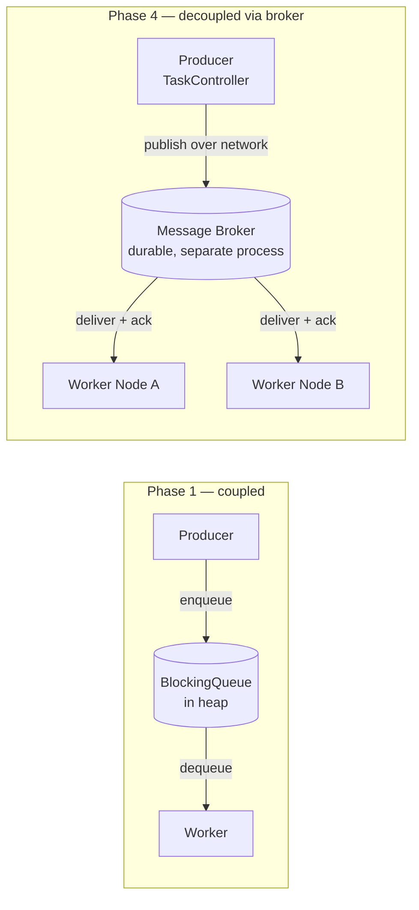
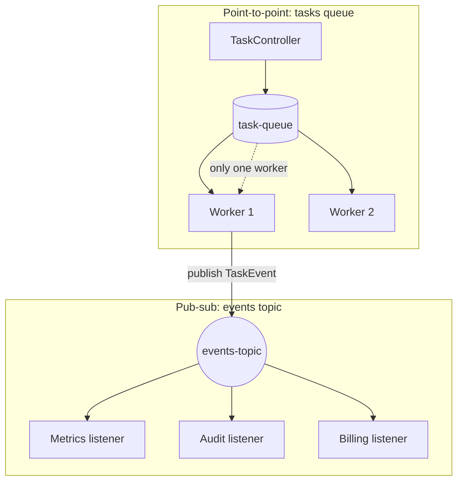
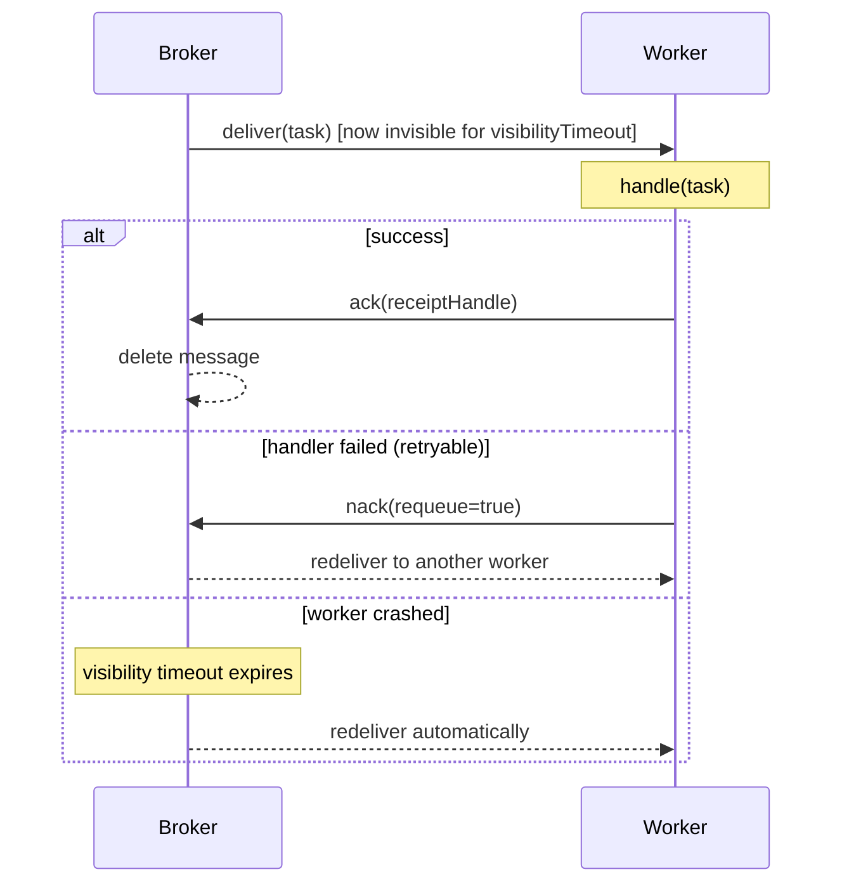

# Message Queues and Messaging Semantics

> Where this fits: our Task Queue platform moves from an in-process `BlockingQueue` (Phase 1) to a real broker (Phase 4). Before we wire in Redis/Kafka/RabbitMQ, we must understand the *semantics* that govern how a `Task` travels from the `TaskController` to a `Worker` — because those semantics decide whether a payment runs once, twice, or never.

This chapter is about the contract between a producer and a consumer when a network and a separate process sit between them. In Phase 1 our queue was a Java object on the heap; "delivery" was a method call and either it happened or the JVM crashed. Once the queue becomes a broker on another machine, delivery becomes a *distributed* problem: messages can be lost, duplicated, reordered, or stuck. The vocabulary in this chapter — queues vs topics, push vs pull, ack/nack, visibility timeout, at-most/at-least/exactly-once, durability, ordering — is the language every backend engineer uses to reason about that contract.

---

## 1. Why this exists — the real problem

Consider our Phase 1 worker loop. The producer (`TaskController`) and consumer (`Worker`) share memory:

```java
// Phase 1: producer and consumer are in the same JVM, sharing one object.
TaskQueue queue = new InMemoryTaskQueue();   // backed by a BlockingQueue
queue.enqueue(task);                          // producer thread
Task t = queue.dequeue();                     // consumer thread, blocks until available
```

This works because the `BlockingQueue` gives us three guarantees for free:

1. **No loss** — once `enqueue` returns, the task is in heap memory; the consumer will see it.
2. **Exactly-once-ish hand-off** — `dequeue` atomically removes the head; two workers can't pull the same task.
3. **Process coupling** — if the producer's JVM dies, so does the queue and every task in it.

Guarantee 3 is the problem. A real platform must survive restarts, deploy a new worker fleet without losing in-flight work, scale producers and consumers independently, and let the API return `202 Accepted` in 5 ms even when workers are saturated for the next hour. The moment you pull the queue out into a separate durable process — a **message broker** — you gain decoupling and durability but you *lose* the three free guarantees. You now have to *choose* them, and each choice costs throughput, latency, or complexity.

> **Historical note.** IBM MQ (1993) and the JMS spec (2001) formalized "point-to-point queues" and "publish-subscribe topics" for enterprise integration. AMQP (RabbitMQ, 2007) made brokers open and language-agnostic. Kafka (LinkedIn, 2011) reframed the broker as a *replicated, ordered, replayable log* rather than a transient mailbox. SQS (AWS, 2006) popularized the *visibility-timeout* model for cloud-scale at-least-once delivery. Every modern choice you make descends from one of these lineages.



---

## 2. The core vocabulary

### 2.1 Queue vs Topic (point-to-point vs publish-subscribe)

| Aspect | **Queue** (point-to-point) | **Topic** (publish-subscribe) |
|---|---|---|
| Consumers per message | Exactly one *competing* consumer wins it | Every *subscriber* gets its own copy |
| Mental model | A work mailbox; load-balanced | A broadcast; fan-out |
| Scaling reads | Add competing consumers → throughput up | Add subscribers → each gets full stream |
| Our use | Delivering a `Task` to one `Worker` | Emitting a `TaskEvent` (`SUCCEEDED`) to metrics + audit + billing |
| JMS type | `javax.jms.Queue` | `javax.jms.Topic` |
| Kafka mapping | A consumer *group* over a topic = queue semantics | Multiple consumer groups = pub-sub |

The key insight for our project: **task delivery is point-to-point** (one worker must run a given task), but **task lifecycle events are publish-subscribe** (the `EventBus` from Phase 4 fans `TaskEvent` out to many `TaskEventListener`s). These are different communication patterns with different brokers/abstractions even if the underlying technology is the same.



### 2.2 Push vs Pull

- **Push**: the broker actively delivers messages to consumers (RabbitMQ `basic.consume`, gRPC streaming). Low latency, but the broker must track consumer capacity or it overwhelms slow consumers — this is why push brokers need *prefetch limits* and flow control. See [../08-distributed-systems/backpressure.md](../08-distributed-systems/backpressure.md).
- **Pull**: the consumer asks for the next batch (Kafka `poll()`, SQS `ReceiveMessage`). Natural backpressure (a slow consumer just polls less often) and easy batching, at the cost of polling latency. Kafka mitigates with *long polling*: the `poll` call blocks up to `fetch.max.wait.ms` until data arrives.

Our `TaskQueue.dequeue()` is a **pull** API and that is deliberate: a `Worker` pulls only when it is free, giving us automatic backpressure without flow-control machinery.

### 2.3 Ack, Nack, and the visibility timeout

When delivery is *at-least-once* over a network, the broker cannot delete a message the instant it sends it — the consumer might crash mid-processing. So the protocol is:

1. Broker **delivers** the message but keeps a copy, marking it *in-flight / invisible* (SQS calls this the **visibility timeout**; RabbitMQ holds it *unacked*).
2. Consumer processes it.
3. Consumer **acks** → broker deletes it. Or consumer **nacks** (or the visibility timeout expires with no ack) → broker **redelivers** it to another consumer.



> **The cardinal rule:** *ack only after the work is durably done* — after the side effect (DB write, email sent) has committed. Acking before processing turns at-least-once into at-most-once; acking after gives at-least-once with possible duplicates. There is no third free option.

### 2.4 Delivery guarantees

| Guarantee | Loss? | Duplicates? | How it's built | Cost |
|---|---|---|---|---|
| **At-most-once** | Possible | Never | Ack/delete *before* processing (fire-and-forget) | Cheapest, lowest latency |
| **At-least-once** | Never | Possible | Ack *after* processing; redeliver on timeout | Requires idempotent consumers |
| **Exactly-once** | Never | Never (effectively) | At-least-once delivery + idempotency *or* transactional dedup | Most complex/expensive |

**Exactly-once is not magic.** Over an unreliable network, true exactly-once *delivery* is impossible (the Two Generals problem). What systems actually deliver is **effectively-once processing**: at-least-once delivery plus a dedup mechanism (idempotency keys, transactional outbox, or Kafka's idempotent producer + transactions). For our platform the practical recipe is: **at-least-once delivery + idempotent `TaskHandler`s keyed by `Task.id`.** See [../08-distributed-systems/idempotency.md](../08-distributed-systems/idempotency.md).

### 2.5 Durability

A message is **durable** if it survives a broker restart. This requires the broker to `fsync` the message to disk (or replicate it to a quorum) *before* acking the producer. Trade-off: durable writes cost a disk seek/replication round-trip (single-digit ms) vs an in-memory enqueue (microseconds). For a `Task` representing a financial action, durability is non-negotiable; for a "user is typing" notification, it is wasteful.

### 2.6 Ordering

- **Total order**: all messages delivered in the order produced. Expensive — usually requires a single partition / single consumer, killing parallelism.
- **Partial order (per-key)**: messages with the same key (e.g. same `tenantId` or `accountId`) are ordered relative to each other, but different keys run in parallel. This is Kafka's model: order is guaranteed *within a partition*, and you route a key to a partition via `hash(key) % partitions`.
- **No order**: maximal parallelism; the default for SQS standard queues and our `BlockingQueue` under multiple workers.

For our tasks, *most* are order-independent, but some are not: two `update-balance` tasks for the same account must run in submission order. We solve this with **per-key ordering**, not global ordering. See [../08-distributed-systems/message-ordering.md](../08-distributed-systems/message-ordering.md).

---

## 3. The naive version

A first-cut "broker" backing our `TaskQueue`. It is in-memory, deletes on dequeue, has no ack:

```java
// NAIVE: fire-and-forget. Looks fine until a worker crashes mid-task.
public final class NaiveBrokerQueue implements TaskQueue {
    private final BlockingQueue<Task> q = new LinkedBlockingQueue<>();

    @Override public void enqueue(Task t) { q.offer(t); }

    @Override public Task dequeue() throws InterruptedException {
        return q.take();   // message GONE the instant we take it
    }

    @Override public int size() { return q.size(); }
}
```

**What's wrong:**

- **At-most-once by accident.** `take()` removes the task permanently. If the `Worker` crashes after `take()` but before finishing `handle(task)`, the task is lost forever — no redelivery.
- **No durability.** A JVM restart drops every pending task.
- **No nack / no retry visibility.** A transient failure can't put the task back for another worker.
- **No ordering control.** Fine here, but there's no knob if we needed per-key order.

This is the implicit semantic of Phase 1, and it's acceptable there *only because* we documented "tasks are lost on crash." It is not acceptable for a production broker.

---

## 4. Improved version

Add an **ack/nack with redelivery** layer on top, so a crashed worker's task comes back. We keep a separate `inFlight` map and a `visibilityTimeout`:

```java
// IMPROVED: at-least-once via in-flight tracking + visibility timeout.
public final class AtLeastOnceQueue implements TaskQueue {
    private record InFlight(Task task, long deadlineMillis) {}

    private final BlockingQueue<Task> ready = new LinkedBlockingQueue<>();
    private final Map<String, InFlight> inFlight = new ConcurrentHashMap<>();
    private final Duration visibilityTimeout;

    public AtLeastOnceQueue(Duration visibilityTimeout) {
        this.visibilityTimeout = visibilityTimeout;
    }

    @Override public void enqueue(Task t) { ready.offer(t); }

    /** Pull a task; it becomes "invisible" until acked or the timeout expires. */
    @Override public Task dequeue() throws InterruptedException {
        requeueExpired();                       // recover crashed-worker tasks
        Task t = ready.take();
        long deadline = System.currentTimeMillis() + visibilityTimeout.toMillis();
        inFlight.put(t.id(), new InFlight(t, deadline));
        return t;
    }

    /** Worker calls this after the side effect has durably committed. */
    public void ack(String taskId) { inFlight.remove(taskId); }

    /** Worker calls this on a retryable failure to return the task immediately. */
    public void nack(String taskId) {
        InFlight f = inFlight.remove(taskId);
        if (f != null) ready.offer(f.task());
    }

    private void requeueExpired() {
        long now = System.currentTimeMillis();
        inFlight.forEach((id, f) -> {
            if (now > f.deadlineMillis() && inFlight.remove(id, f)) {
                ready.offer(f.task());          // crashed worker -> redeliver
            }
        });
    }

    @Override public int size() { return ready.size() + inFlight.size(); }
}
```

**Better:** a crash now triggers redelivery; a retryable failure can `nack` immediately. **Still missing:** durability (a process restart still loses everything in both `ready` and `inFlight`), per-key ordering, and a dead-letter path after too many redeliveries. Also `requeueExpired()` scanning the whole map on every `dequeue` is O(n) — fine for thousands, not millions.

---

## 5. Production-quality version

A staff engineer ships this backed by a real broker. The shape below is an **adapter** that gives our domain `TaskQueue` interface an at-least-once, durable, redrive-aware implementation over a generic broker SDK (modeled on SQS-style semantics; the same shape wraps RabbitMQ or a Redis stream). Note the explicit `ackToken`, the dead-letter handoff after `maxReceiveCount`, and idempotency delegated to the handler.

```java
import java.time.Duration;
import java.util.List;
import java.util.Optional;

/** A message as the broker hands it back: payload plus the token needed to ack/nack. */
public record BrokerMessage(Task task, String ackToken, int receiveCount) {}

/** Minimal broker SPI; one impl per technology (SQS, RabbitMQ, Redis Streams). */
public interface Broker {
    void send(Task task);
    /** Long-poll up to maxWait; returned messages are invisible for visibilityTimeout. */
    List<BrokerMessage> receive(int max, Duration maxWait, Duration visibilityTimeout)
            throws InterruptedException;
    void ack(String ackToken);
    /** Make visible again now (immediate retry). */
    void nack(String ackToken);
    int approximateSize();
}

/**
 * Production TaskQueue: durable, at-least-once, with automatic dead-lettering.
 * Idempotency is the HANDLER's responsibility (keyed by Task.id) — the broker
 * only promises at-least-once, never exactly-once.
 */
public final class BrokerTaskQueue implements TaskQueue {
    private final Broker broker;
    private final DeadLetterQueue dlq;
    private final int maxReceiveCount;       // e.g. 5 redeliveries -> DLQ
    private final Duration visibilityTimeout;
    private final Duration pollWait;

    public BrokerTaskQueue(Broker broker, DeadLetterQueue dlq, int maxReceiveCount,
                           Duration visibilityTimeout, Duration pollWait) {
        this.broker = broker;
        this.dlq = dlq;
        this.maxReceiveCount = maxReceiveCount;
        this.visibilityTimeout = visibilityTimeout;
        this.pollWait = pollWait;
    }

    @Override public void enqueue(Task t) { broker.send(t); }

    /**
     * Pull one task. Poison messages (delivered too many times) are routed to the
     * DLQ and acked here so they never reach a Worker again. We loop until we have
     * a deliverable task or the poll returns empty.
     */
    @Override public Task dequeue() throws InterruptedException {
        while (true) {
            List<BrokerMessage> batch = broker.receive(1, pollWait, visibilityTimeout);
            if (batch.isEmpty()) continue;                 // long-poll returned nothing; retry
            BrokerMessage m = batch.get(0);
            if (m.receiveCount() > maxReceiveCount) {
                dlq.send(m.task(), "exceeded maxReceiveCount=" + maxReceiveCount);
                broker.ack(m.ackToken());                  // remove poison message
                continue;
            }
            // Stash the ackToken so Worker can ack/nack after handling.
            AckRegistry.bind(m.task().id(), m.ackToken());
            return m.task();
        }
    }

    /** Called by Worker after the side effect committed. */
    public void ack(String taskId) {
        AckRegistry.take(taskId).ifPresent(broker::ack);
    }

    /** Called by Worker on a retryable failure; broker will redeliver. */
    public void nack(String taskId) {
        AckRegistry.take(taskId).ifPresent(broker::nack);
    }

    @Override public int size() { return broker.approximateSize(); }
}
```

```java
/** Thread-safe map from Task.id to the broker ackToken for the in-flight message. */
final class AckRegistry {
    private static final java.util.concurrent.ConcurrentMap<String, String> TOKENS =
            new java.util.concurrent.ConcurrentHashMap<>();
    static void bind(String taskId, String ackToken) { TOKENS.put(taskId, ackToken); }
    static Optional<String> take(String taskId) {
        return Optional.ofNullable(TOKENS.remove(taskId));
    }
    private AckRegistry() {}
}
```

Why this is the shippable version:

- **Durable + at-least-once**: the broker `fsync`s/replicates before acking the producer, and only deletes on consumer `ack`.
- **Poison-message safety**: `maxReceiveCount` + `DeadLetterQueue` stops an unprocessable task from looping forever (see [./dead-letter-queues.md](./dead-letter-queues.md)).
- **Pluggable**: `Broker` is an SPI; Phase 4 swaps SQS for Kafka/RabbitMQ/Redis without touching `Worker` or `WorkerPool`.
- **Honest about exactly-once**: idempotency is pushed to the handler, not pretended away at the broker.

---

## 6. Code walkthrough

### 6.1 Beginner — queue (point-to-point) vs topic (pub-sub), in plain Java

```java
import java.util.*;
import java.util.concurrent.*;

public class QueueVsTopicDemo {
    // POINT-TO-POINT: competing consumers; each task goes to exactly ONE.
    static void pointToPoint() throws InterruptedException {
        BlockingQueue<String> queue = new LinkedBlockingQueue<>(List.of("t1", "t2", "t3", "t4"));
        Runnable worker = () -> {
            String t;
            while ((t = queue.poll()) != null) {
                System.out.println(Thread.currentThread().getName() + " handled " + t);
            }
        };
        Thread a = new Thread(worker, "worker-A");
        Thread b = new Thread(worker, "worker-B");
        a.start(); b.start(); a.join(); b.join();
        // Each of t1..t4 printed exactly once, split across A and B.
    }

    // PUB-SUB: every subscriber gets its OWN copy of every event.
    static void pubSub() {
        List<java.util.function.Consumer<String>> subscribers = new ArrayList<>();
        subscribers.add(e -> System.out.println("metrics saw " + e));
        subscribers.add(e -> System.out.println("audit saw " + e));
        for (String event : List.of("SUCCEEDED:t1", "FAILED:t2")) {
            subscribers.forEach(s -> s.accept(event));  // fan-out: N deliveries
        }
    }

    public static void main(String[] args) throws InterruptedException {
        pointToPoint();
        pubSub();
    }
}
```

The difference is stark: in `pointToPoint` four messages produce four total handlings; in `pubSub` two events with two subscribers produce four deliveries. Same data, opposite distribution.

### 6.2 Intermediate — at-most-once vs at-least-once on the *same* queue

The guarantee is determined by *when you ack*, not by the broker. This demo proves it:

```java
import java.util.*;
import java.util.concurrent.*;

public class DeliverySemanticsDemo {
    record Msg(String id, String body) {}

    static final class SimpleBroker {
        private final Deque<Msg> ready = new ArrayDeque<>();
        private final Map<String, Msg> inFlight = new HashMap<>();

        synchronized void send(Msg m) { ready.addLast(m); }
        synchronized Optional<Msg> receive() {           // becomes invisible
            Msg m = ready.pollFirst();
            if (m != null) inFlight.put(m.id(), m);
            return Optional.ofNullable(m);
        }
        synchronized void ack(String id) { inFlight.remove(id); }
        synchronized void nackAll() {                     // simulate timeout: redeliver in-flight
            inFlight.values().forEach(ready::addLast);
            inFlight.clear();
        }
    }

    // AT-MOST-ONCE: ack BEFORE processing. A crash after ack loses the message.
    static void atMostOnce(SimpleBroker b) {
        b.receive().ifPresent(m -> {
            b.ack(m.id());                    // delete first...
            process(m, /*crashAfter=*/true);  // ...then crash -> message lost, never redelivered
        });
    }

    // AT-LEAST-ONCE: ack AFTER processing. A crash before ack triggers redelivery (maybe a dup).
    static boolean atLeastOnce(SimpleBroker b, boolean crash) {
        return b.receive().map(m -> {
            boolean ok = process(m, crash);   // do the work first
            if (ok) { b.ack(m.id()); return true; }
            return false;                      // not acked -> redelivered later
        }).orElse(true);
    }

    static boolean process(Msg m, boolean crash) {
        if (crash) { System.out.println("  CRASH while processing " + m.id()); return false; }
        System.out.println("  processed " + m.id());
        return true;
    }

    public static void main(String[] args) {
        var b = new SimpleBroker();
        b.send(new Msg("m1", "charge $10"));
        System.out.println("At-most-once (crash after ack):");
        atMostOnce(b);
        b.nackAll();
        System.out.println("  after redelivery attempt, ready has: " + b.ready);  // empty -> LOST

        var b2 = new SimpleBroker();
        b2.send(new Msg("m2", "charge $10"));
        System.out.println("At-least-once (crash before ack):");
        atLeastOnce(b2, true);     // crashes, no ack
        b2.nackAll();              // visibility timeout -> redeliver
        atLeastOnce(b2, false);    // succeeds on retry
        System.out.println("  recovered: m2 eventually processed");
    }
}
```

Run it and the lesson is concrete: at-most-once *lost* `m1`; at-least-once *recovered* `m2` but would have *duplicated* it if the side effect (the charge) had already partially happened before the crash. That duplicate risk is exactly why the consumer must be idempotent.

### 6.3 Production-inspired — wiring delivery semantics into `Worker`

This is how the `Worker` from our canonical model collaborates with `BrokerTaskQueue` to get at-least-once + DLQ, while delegating idempotency and retry policy to the right collaborators.

```java
import java.time.Instant;
import java.util.Map;

/** Worker pulls a Task, looks up its handler by type, runs it, and acks/nacks. */
public final class Worker implements Runnable {
    private final BrokerTaskQueue queue;
    private final Map<String, TaskHandler> handlers;   // type -> handler
    private final RetryPolicy retryPolicy;
    private final TaskScheduler scheduler;             // for delayed retries
    private final IdempotencyStore seen;               // dedup by Task.id

    public Worker(BrokerTaskQueue queue, Map<String, TaskHandler> handlers,
                  RetryPolicy retryPolicy, TaskScheduler scheduler, IdempotencyStore seen) {
        this.queue = queue;
        this.handlers = handlers;
        this.retryPolicy = retryPolicy;
        this.scheduler = scheduler;
        this.seen = seen;
    }

    @Override public void run() {
        while (!Thread.currentThread().isInterrupted()) {
            try {
                Task task = queue.dequeue();                 // at-least-once delivery
                process(task);
            } catch (InterruptedException e) {
                Thread.currentThread().interrupt();
                return;
            }
        }
    }

    private void process(Task task) {
        // Effectively-once: skip if we already committed this Task.id's side effect.
        if (seen.alreadyProcessed(task.id())) {
            queue.ack(task.id());                            // duplicate; drop quietly
            return;
        }
        TaskHandler handler = handlers.get(task.type());
        if (handler == null) {
            queue.nack(task.id());                           // unknown type; let DLQ logic catch it
            return;
        }
        try {
            TaskResult result = handler.handle(task);
            if (result.success()) {
                seen.markProcessed(task.id());               // commit dedup marker
                queue.ack(task.id());                        // ONLY now do we delete it
            } else if (result.retryable()) {
                scheduleRetry(task);
                queue.ack(task.id());                        // re-enqueued via scheduler; drop this copy
            } else {
                queue.nack(task.id());                       // non-retryable -> redelivery path -> DLQ
            }
        } catch (Exception e) {
            // Unexpected failure: do NOT ack. Visibility timeout will redeliver.
            queue.nack(task.id());
        }
    }

    private void scheduleRetry(Task task) {
        retryPolicy.nextDelay(task.attempts() + 1).ifPresentOrElse(
            delay -> {
                Task retrying = task.withStatus(TaskStatus.RETRYING)
                                    .withAttempts(task.attempts() + 1)
                                    .withScheduledAt(Instant.now().plus(delay));
                scheduler.schedule(retrying, delay);          // delayed re-enqueue
            },
            () -> { /* attempts exhausted: nack so the broker DLQs it */ queue.nack(task.id()); }
        );
    }
}
```

```java
/** Dedup store: in Phase 4 this is Redis SETNX with a TTL keyed by Task.id. */
public interface IdempotencyStore {
    boolean alreadyProcessed(String taskId);
    void markProcessed(String taskId);
}
```

The critical lines are `queue.ack(...)` *after* `seen.markProcessed(...)`, and `queue.nack(...)` on exception. That ordering is the entire difference between losing tasks and processing them safely.

---

## 7. How this applies to our Task Queue project

| Concept | Canonical model element | Choice we make |
|---|---|---|
| Queue (point-to-point) | `TaskQueue` delivering `Task` to one `Worker` | Competing consumers across `WorkerPool` |
| Topic (pub-sub) | `EventBus.publish(TaskEvent)` → many `TaskEventListener` | Fan-out for metrics/audit/billing |
| Pull delivery | `TaskQueue.dequeue()` | Backpressure for free; workers pull when idle |
| Ack/Nack | `BrokerTaskQueue.ack/nack` | Ack after side effect commits |
| Visibility timeout | `visibilityTimeout` in `BrokerTaskQueue` | Crashed-worker recovery |
| At-least-once | ack-after-processing in `Worker` | Default delivery guarantee |
| Effectively-once | `IdempotencyStore` keyed by `Task.id` | Dedup layer over at-least-once |
| Durability | `Broker.send` fsync/replicate | On for all `Task`s |
| Per-key ordering | partition key = `accountId` (Phase 4 Kafka) | Order where it matters, parallelism elsewhere |
| DLQ | `DeadLetterQueue.send` after `maxReceiveCount` | Poison-message containment |

Across phases:

- **Phase 1** (`InMemoryTaskQueue`): at-most-once, no durability — documented as acceptable for learning.
- **Phase 2** (`PostgresTaskQueue`): durability via a DB row; `pollDue` + a status column gives at-least-once with row-level locking as the "visibility" mechanism.
- **Phase 4** (broker): full `BrokerTaskQueue` with ack/nack, visibility timeout, DLQ, and per-key ordering on Kafka. See [./broker-comparison.md](./broker-comparison.md).

---

## 8. Tradeoffs

| Decision | Option A | Option B | When to pick A |
|---|---|---|---|
| Delivery guarantee | At-least-once | Exactly-once (txn) | Almost always A; B only when dedup is impossible *and* duplicates are catastrophic and unrecoverable |
| Push vs pull | Pull (Kafka/SQS) | Push (RabbitMQ) | A when you want simple backpressure & batching; B for lowest latency with prefetch tuning |
| Ordering | No order | Per-key order | A for max throughput; B when causal sequence per entity matters |
| Durability | Durable (fsync) | In-memory | A for anything with a real side effect; B for ephemeral signals |
| Visibility timeout | Long (5 min) | Short (30 s) | A for slow tasks (avoid premature redelivery); B for fast tasks (faster crash recovery) |
| Broker model | Log (Kafka) | Mailbox (RabbitMQ/SQS) | A for replay/high-throughput/ordered streams; B for complex routing & per-message TTL/priority |

The headline trade-off: **stronger guarantees cost throughput and latency.** Durable + ordered + exactly-once is the slowest configuration; ephemeral + unordered + at-most-once is the fastest. Pick the *weakest* guarantee your business semantics tolerate.

---

## 9. Common mistakes and pitfalls

- **Acking before the work is done.** Turns at-least-once into at-most-once silently. *Fix:* ack only after the side effect durably commits.
- **Assuming the broker gives exactly-once.** No broker delivers true exactly-once over a network. *Fix:* layer idempotency (`IdempotencyStore`) on at-least-once.
- **Visibility timeout shorter than processing time.** The broker redelivers while the first worker is still running → duplicate concurrent execution. *Fix:* set timeout > p99 processing time, or extend the timeout (heartbeat) for long tasks.
- **No poison-message handling.** A task that always throws loops forever, burning CPU and blocking the queue. *Fix:* `maxReceiveCount` → DLQ.
- **Expecting global ordering for free.** Multiple consumers/partitions destroy total order. *Fix:* use per-key partitioning, or accept unordered.
- **Treating a topic like a queue.** Subscribing two services to one *queue* load-balances (each gets half the messages); they need separate *queues*/*consumer groups* to each get the full stream. *Fix:* one consumer group per logical subscriber.
- **Unbounded prefetch on a push broker.** A consumer grabs 10k messages, OOMs, and they all redeliver. *Fix:* set a small prefetch/QoS.
- **Ignoring redelivery in metrics.** Counting "messages received" as "tasks done" double-counts. *Fix:* count acks, not receives.

---

## 10. Refactoring exercise

**Bad** — a "queue" that quietly loses work and can loop forever:

```java
public class BadConsumer {
    private final Queue<Task> q = new java.util.LinkedList<>();
    public void enqueue(Task t) { q.add(t); }

    public void consume() {
        Task t = q.poll();               // removed immediately (at-most-once)
        try {
            handler.handle(t);           // if this throws, t is already gone -> lost
        } catch (Exception e) {
            q.add(t);                    // ...unless it throws, then infinite requeue, no cap
        }
    }
    private TaskHandler handler;
}
```

**Improved** — explicit ack/nack and a redelivery cap:

```java
public class BetterConsumer {
    private final Deque<Task> ready = new ArrayDeque<>();
    private final Map<String, Task> inFlight = new HashMap<>();
    private final int maxAttempts;
    private final TaskHandler handler;
    private final DeadLetterQueue dlq;

    public BetterConsumer(int maxAttempts, TaskHandler handler, DeadLetterQueue dlq) {
        this.maxAttempts = maxAttempts; this.handler = handler; this.dlq = dlq;
    }
    public void enqueue(Task t) { ready.addLast(t); }

    public void consume() {
        Task t = ready.pollFirst();
        if (t == null) return;
        inFlight.put(t.id(), t);                 // invisible, not deleted
        try {
            TaskResult r = handler.handle(t);
            if (r.success()) inFlight.remove(t.id());                 // ack
            else nack(t);
        } catch (Exception e) { nack(t); }
    }
    private void nack(Task t) {
        inFlight.remove(t.id());
        if (t.attempts() + 1 >= maxAttempts) dlq.send(t, "max attempts");  // capped
        else ready.addLast(t.withAttempts(t.attempts() + 1));
    }
}
```

**Production** — delegate semantics to the broker via the `BrokerTaskQueue` from §5, with retry *backoff* (not immediate requeue) via the scheduler, idempotency via `IdempotencyStore`, and DLQ via `maxReceiveCount`. The consumer is exactly the `Worker.process` from §6.3 — note it no longer owns the queue mechanics; it only decides ack vs nack vs schedule-retry. That separation is the real win: **delivery semantics live in one place** (the queue adapter), and **business outcome lives in another** (the handler).

---

## 11. Exercises

### Easy

**E1 (knowledge check).** A producer writes to one queue; you attach two consumers in the same consumer group. A producer writes to one topic; you attach two consumers in *different* groups. In each case, how many times is a single message processed? Why?

**E2 (coding).** Implement a `at-most-once vs at-least-once` toggle: write a method `consume(boolean ackFirst)` that acks before processing when `ackFirst` is true and after when false, and add a unit test (JUnit 5 + AssertJ) proving that a simulated crash loses the message in the first mode but not the second.

### Medium

**M1 (coding).** Extend `AtLeastOnceQueue` (§4) so `requeueExpired()` is O(1) amortized instead of O(n): use a `DelayQueue` of in-flight deadlines so the next-to-expire is found in constant time. Keep the public API unchanged. (Hint: see [./delayed-queues.md](./delayed-queues.md).)

**M2 (refactoring).** Take `BadConsumer` from §10 and refactor it to publish a `TaskEvent` to an `EventBus` on each state change (`RUNNING`, `SUCCEEDED`, `DEAD`) *without* changing the delivery guarantee. Show that metrics and audit listeners each receive every event (pub-sub), while task delivery stays point-to-point.

### Hard

**H1 (design).** Design effectively-once processing for an `update-balance` task where the side effect is a non-idempotent SQL `UPDATE accounts SET balance = balance + ?`. You may use at-least-once delivery only. Describe the dedup mechanism, the table(s), the failure windows, and what happens if the worker crashes (a) before the UPDATE, (b) after the UPDATE but before ack, (c) after ack. Per-key ordering: how do you guarantee two updates for the same account run in order?

**H2 (interview-style).** "We see each task processed 2–3 times under load but only sometimes. CPU is fine. What are the top three causes and how would you confirm each from broker metrics?"

**H3 (stretch).** Build a `Broker` SPI implementation backed by **Redis Streams** (`XADD`, `XREADGROUP`, `XACK`, `XAUTOCLAIM`) that satisfies the §5 interface, including visibility-timeout recovery via `XAUTOCLAIM` and DLQ via a separate stream after `maxReceiveCount` (read from the pending-entries list `XPENDING`). Provide a Testcontainers integration test.

---

## 12. Solutions

### E1

- **Queue, same group:** processed **once**. Consumers in one group *compete*; the broker delivers each message to exactly one member (load balancing / point-to-point).
- **Topic, different groups:** processed **twice** — once per group. Each consumer group maintains its own offset and receives the full stream (publish-subscribe). The rule: *competition is within a group; broadcast is across groups.*

### E2

```java
import org.junit.jupiter.api.Test;
import java.util.*;
import static org.assertj.core.api.Assertions.assertThat;

class DeliverySemanticsTest {
    static final class Q {
        final Deque<String> ready = new ArrayDeque<>(List.of("m1"));
        final Set<String> inFlight = new HashSet<>();
        Optional<String> receive() {
            String m = ready.pollFirst();
            if (m != null) inFlight.add(m);
            return Optional.ofNullable(m);
        }
        void ack(String m) { inFlight.remove(m); }
        void timeout() { ready.addAll(inFlight); inFlight.clear(); } // redeliver
    }

    boolean consume(Q q, boolean ackFirst, boolean crash) {
        return q.receive().map(m -> {
            if (ackFirst) q.ack(m);
            if (crash) return false;          // crash mid-process
            if (!ackFirst) q.ack(m);
            return true;
        }).orElse(false);
    }

    @Test void atMostOnce_losesMessageOnCrash() {
        Q q = new Q();
        consume(q, /*ackFirst=*/true, /*crash=*/true);
        q.timeout();
        assertThat(q.ready).isEmpty();        // LOST: nothing to redeliver
        assertThat(q.inFlight).isEmpty();
    }

    @Test void atLeastOnce_recoversMessageOnCrash() {
        Q q = new Q();
        consume(q, /*ackFirst=*/false, /*crash=*/true);
        q.timeout();
        assertThat(q.ready).containsExactly("m1");   // redelivered
        boolean ok = consume(q, false, false);       // succeeds on retry
        assertThat(ok).isTrue();
        assertThat(q.inFlight).isEmpty();            // acked
    }
}
```

The two tests are the proof: *the only code difference is when `ack` is called*, yet the guarantee flips entirely.

### M1

```java
import java.time.Duration;
import java.util.concurrent.*;

public final class O1AtLeastOnceQueue implements TaskQueue {
    private record Lease(Task task, long deadlineMillis) implements Delayed {
        @Override public long getDelay(java.util.concurrent.TimeUnit u) {
            return u.convert(deadlineMillis - System.currentTimeMillis(), TimeUnit.MILLISECONDS);
        }
        @Override public int compareTo(Delayed o) {
            return Long.compare(deadlineMillis, ((Lease) o).deadlineMillis);
        }
    }
    private final BlockingQueue<Task> ready = new LinkedBlockingQueue<>();
    private final DelayQueue<Lease> leases = new DelayQueue<>();
    private final ConcurrentMap<String, Lease> byId = new ConcurrentHashMap<>();
    private final Duration visibilityTimeout;

    public O1AtLeastOnceQueue(Duration vt) { this.visibilityTimeout = vt; }

    @Override public void enqueue(Task t) { ready.offer(t); }

    @Override public Task dequeue() throws InterruptedException {
        Lease expired;                                    // O(1): poll only the head
        while ((expired = leases.poll()) != null) {       // drains only those actually due
            if (byId.remove(expired.task().id(), expired)) ready.offer(expired.task());
        }
        Task t = ready.take();
        Lease lease = new Lease(t, System.currentTimeMillis() + visibilityTimeout.toMillis());
        byId.put(t.id(), lease);
        leases.offer(lease);
        return t;
    }
    public void ack(String id) {
        Lease l = byId.remove(id);
        if (l != null) leases.remove(l);                  // no longer eligible for redelivery
    }
    public void nack(String id) {
        Lease l = byId.remove(id);
        if (l != null) { leases.remove(l); ready.offer(l.task()); }
    }
    @Override public int size() { return ready.size() + byId.size(); }
}
```

`DelayQueue.poll()` returns only elements whose delay has elapsed and finds them in O(log n) via an internal priority heap — we never scan the whole in-flight set. Recovery work is now proportional to the number of *actually expired* leases, not total in-flight.

### M2

```java
public final class EventfulConsumer {
    private final Deque<Task> ready = new java.util.ArrayDeque<>();
    private final java.util.Map<String, Task> inFlight = new java.util.HashMap<>();
    private final TaskHandler handler;
    private final EventBus bus;
    private final int maxAttempts;
    private final DeadLetterQueue dlq;

    public EventfulConsumer(TaskHandler h, EventBus bus, int maxAttempts, DeadLetterQueue dlq) {
        this.handler = h; this.bus = bus; this.maxAttempts = maxAttempts; this.dlq = dlq;
    }
    public void enqueue(Task t) { ready.addLast(t); }

    public void consume() {
        Task t = ready.pollFirst();
        if (t == null) return;
        inFlight.put(t.id(), t);
        bus.publish(new TaskEvent(t.id(), TaskStatus.RUNNING, java.time.Instant.now()));
        try {
            TaskResult r = handler.handle(t);
            if (r.success()) {
                inFlight.remove(t.id());                                 // ack — unchanged guarantee
                bus.publish(new TaskEvent(t.id(), TaskStatus.SUCCEEDED, java.time.Instant.now()));
            } else { requeueOrDlq(t); }
        } catch (Exception e) { requeueOrDlq(t); }
    }
    private void requeueOrDlq(Task t) {
        inFlight.remove(t.id());
        if (t.attempts() + 1 >= maxAttempts) {
            dlq.send(t, "max attempts");
            bus.publish(new TaskEvent(t.id(), TaskStatus.DEAD, java.time.Instant.now()));
        } else {
            ready.addLast(t.withAttempts(t.attempts() + 1));
            bus.publish(new TaskEvent(t.id(), TaskStatus.RETRYING, java.time.Instant.now()));
        }
    }
}
```

Delivery of the `Task` is still point-to-point (one consumer pulls each). The `TaskEvent`s go to the `EventBus`, which is pub-sub: registering both a metrics and an audit `TaskEventListener` means each receives every event — fan-out independent of task delivery.

### H1 (sketch with the load-bearing details)

- **Dedup table:** `processed_tasks(task_id PK, processed_at)`. The UPDATE and the insert into `processed_tasks` happen in **one transaction**:

```sql
BEGIN;
  INSERT INTO processed_tasks(task_id, processed_at) VALUES (?, now());  -- PK conflict => already done
  UPDATE accounts SET balance = balance + ? WHERE id = ?;
COMMIT;
```

If `task_id` already exists, the `INSERT` violates the primary key, the transaction aborts, and we treat it as "already processed" → ack the message, skip the UPDATE. This makes the non-idempotent UPDATE *effectively* idempotent because it can only commit once per `task_id`.

- **Crash (a) before UPDATE:** transaction never committed; message redelivered; reprocessed cleanly. ✅
- **Crash (b) after UPDATE/commit but before ack:** message redelivered; the `INSERT` now conflicts → we skip the UPDATE and ack. ✅ No double charge.
- **Crash (c) after ack:** message already deleted; nothing to redeliver. ✅
- **Per-account ordering:** partition by `accountId` (Kafka key = `accountId`), so all updates for one account land in one partition consumed by one worker in offset order; different accounts parallelize across partitions. See [../08-distributed-systems/message-ordering.md](../08-distributed-systems/message-ordering.md).

### H2

Top three causes of 2–3x processing under load:
1. **Visibility timeout < p99 processing time.** Under load, tasks run slower; the broker redelivers before the first worker acks. *Confirm:* compare `ApproximateAgeOfOldestMessage`/redelivery count against task duration histograms; the redelivery spike correlates with latency spikes.
2. **Consumer not acking (or acking late) due to GC pauses / thread starvation.** *Confirm:* broker shows acks lagging receives; JVM shows long GC pauses overlapping redeliveries.
3. **Rebalancing storms** (Kafka): a consumer joining/leaving triggers partition reassignment; un-committed offsets cause re-consumption. *Confirm:* spike in `rebalance` events and consumer-group generation churn aligned with the duplicates.

Fixes: raise/extend visibility timeout (heartbeat), commit offsets after processing, tune `max.poll.interval.ms`, and make handlers idempotent so duplicates are harmless regardless.

### H3 (key design points)

A correct Redis Streams `Broker`:
- `send` → `XADD task-stream * payload <json>`.
- `receive` → `XREADGROUP GROUP wg <consumer> COUNT n BLOCK <pollWaitMs> STREAMS task-stream >`; each returned entry's id is the `ackToken`; `receiveCount` comes from `XPENDING`'s delivery counter.
- `ack` → `XACK task-stream wg <id>` then `XDEL`.
- **Visibility recovery** → periodically `XAUTOCLAIM task-stream wg <consumer> <minIdleMs> 0` to reclaim entries idle past the timeout (the visibility-timeout analogue).
- **DLQ** → scan `XPENDING` for entries whose delivery count exceeds `maxReceiveCount`, `XADD` them to `task-stream-dlq`, then `XACK` to clear them from the main stream.

A Testcontainers test starts a Redis container, produces N tasks, has one consumer "crash" (never acks), advances past `minIdleMs`, and asserts a second consumer reclaims and processes them — proving at-least-once recovery — then asserts a poison message lands in the DLQ stream after `maxReceiveCount`.

---

## 13. Interview questions and takeaways

1. **Q: Difference between a queue and a topic?**
   A: A queue is point-to-point — competing consumers, each message handled once. A topic is pub-sub — every subscriber group gets its own copy. Kafka expresses both: one consumer group = queue, many groups = topic.

2. **Q: Is exactly-once delivery possible?**
   A: Not *delivery* over an unreliable network (Two Generals). Systems achieve effectively-once *processing* = at-least-once delivery + idempotency (dedup keys / transactional outbox / Kafka transactions). Push the dedup into the consumer, keyed by a stable message id.

3. **Q: What is a visibility timeout and how do you pick it?**
   A: After delivery, a message is invisible to other consumers until acked or the timeout expires (then it redelivers — that's how crashes are recovered). Set it greater than p99 processing time; for long jobs, heartbeat-extend it rather than picking a huge static value (which delays crash recovery).

4. **Q: Push vs pull — pros/cons?**
   A: Push (RabbitMQ) = low latency but needs prefetch/flow control to avoid overwhelming slow consumers. Pull (Kafka/SQS) = natural backpressure and easy batching, at the cost of polling latency (mitigated by long polling).

5. **Q: How do you keep ordering while still parallelizing?**
   A: Per-key ordering: hash a key (e.g. `accountId`) to a partition; one partition is consumed in order by one consumer, while different partitions run in parallel. Global ordering requires a single partition/consumer and kills throughput.

6. **Q: Your consumers are seeing duplicates. Walk me through the causes.**
   A: Visibility timeout shorter than processing time, late acks (GC/starvation), consumer rebalances, or producer retries. All are normal under at-least-once; the durable fix is idempotent consumers, plus tuning timeouts/offset-commit timing.

7. **Q: When do you reach for a DLQ?**
   A: When a message has been redelivered more than `maxReceiveCount` times — it's a poison message. Route it to a DLQ to unblock the queue and preserve it for inspection/replay rather than dropping it or looping forever.

8. **Q: Where should ack happen relative to the side effect?**
   A: Strictly after the side effect durably commits. Ack-before = at-most-once (can lose work); ack-after = at-least-once (can duplicate, handled by idempotency).

**Takeaways:** the broker only promises *delivery* semantics; *processing* semantics are something you build with idempotency. Choose the weakest guarantee your business tolerates, because stronger guarantees cost throughput, latency, and complexity.

---

## 14. Production considerations

- **Queue depth & age are your earliest signals.** Alert on `ApproximateNumberOfMessages` (backlog growing → consumers can't keep up) and `ApproximateAgeOfOldestMessage` (tasks aging → SLA risk). Export both to Micrometer/Prometheus (see [../10-system-design/observability-and-ops.md](../10-system-design/observability-and-ops.md)).
- **Redelivery rate is a health metric, not noise.** A rising redelivery/receive ratio means timeouts are too short, consumers are slow, or handlers are flaky.
- **DLQ must be monitored and have an owner.** An unwatched DLQ silently swallows failures. Alert on DLQ depth > 0; build a replay tool.
- **Poison-pill containment.** Without `maxReceiveCount`, one bad message can starve a partition/queue indefinitely. Always cap redeliveries.
- **Right-size prefetch / batch size.** Too large → memory pressure and big redelivery storms on crash; too small → throughput loss. Tune against p99 task duration.
- **Backpressure end-to-end.** A pull model gives it for free, but the *producer* side still needs limits (reject/429 when the queue is saturated) — see [../08-distributed-systems/rate-limiting.md](../08-distributed-systems/rate-limiting.md) and [../08-distributed-systems/backpressure.md](../08-distributed-systems/backpressure.md).
- **Idempotency store TTL.** The dedup store grows unbounded unless you expire keys; pick a TTL longer than your max retry window.
- **Ordering vs scaling tension.** Adding partitions for throughput can break in-flight per-key ordering during the resize; plan repartitioning carefully.

---

## What We Can Improve In Our Project Using This Concept

Phase 1's `InMemoryTaskQueue` is at-most-once with no durability. We can introduce a `Broker` SPI and a `BrokerTaskQueue` adapter so that, without touching `Worker` or `WorkerPool`, we gain durable at-least-once delivery, visibility-timeout-based crash recovery, and automatic dead-lettering. We can also formalize the split between **task delivery** (point-to-point via `TaskQueue`) and **event distribution** (pub-sub via `EventBus`), and add an `IdempotencyStore` keyed by `Task.id` to make handlers safe under redelivery.

## Project Refactoring Task

1. Add the `Broker`, `BrokerMessage`, and `IdempotencyStore` interfaces and a `BrokerTaskQueue implements TaskQueue` adapter (§5).
2. Move ack/nack decisions into `Worker.process` (§6.3); the handler returns a `TaskResult`, the worker decides ack vs nack vs schedule-retry.
3. Wire `maxReceiveCount` → `DeadLetterQueue.send` for poison messages.
4. Add a Testcontainers integration test that proves at-least-once recovery (kill a worker mid-task, assert redelivery and exactly-one *effect* via the `IdempotencyStore`).

## Git Commit For This Chapter

```text
feat(queue): introduce Broker SPI with at-least-once BrokerTaskQueue and idempotent Worker

- add Broker, BrokerMessage, IdempotencyStore interfaces
- implement BrokerTaskQueue with ack/nack, visibility timeout, maxReceiveCount -> DLQ
- move ack/nack/retry decisions into Worker.process; ack only after side effect commits
- add AckRegistry to bind Task.id -> broker ackToken
- tests: at-least-once recovery via Testcontainers (kill-mid-task), effectively-once via IdempotencyStore

Files touched:
  src/main/java/.../queue/Broker.java
  src/main/java/.../queue/BrokerMessage.java
  src/main/java/.../queue/BrokerTaskQueue.java
  src/main/java/.../queue/AckRegistry.java
  src/main/java/.../idempotency/IdempotencyStore.java
  src/main/java/.../worker/Worker.java
  src/test/java/.../queue/BrokerTaskQueueIT.java
```

## Architecture Impact

The broker becomes a separate, durable process, decoupling producers (`TaskController`) from consumers (`WorkerPool`) so each scales independently. Delivery semantics move out of `Worker` and into the `BrokerTaskQueue` adapter (single responsibility), while idempotency lives in `IdempotencyStore`. This is the backbone change that enables Phase 4's distributed workers and horizontal scaling: any number of worker nodes can compete on the same durable queue, survive restarts, and recover crashed tasks via the visibility timeout.

## Interview Takeaways

- A broker promises *delivery* semantics (at-most/at-least-once); *processing* semantics (effectively-once) are built by you with idempotency.
- Queue = point-to-point/competing; topic = pub-sub/broadcast. Kafka models both via consumer groups.
- Ack after the side effect commits; nack/timeout drives redelivery; `maxReceiveCount` drives DLQ.
- Visibility timeout > p99 processing time; per-key partitioning gives ordering without sacrificing all parallelism.
- Pick the weakest guarantee your business tolerates — stronger guarantees cost throughput and latency.

---

*Related: [./producer-consumer.md](./producer-consumer.md) · [./task-queues.md](./task-queues.md) · [./dead-letter-queues.md](./dead-letter-queues.md) · [./broker-comparison.md](./broker-comparison.md) · [../06-concurrency/blocking-queue.md](../06-concurrency/blocking-queue.md) · [../08-distributed-systems/idempotency.md](../08-distributed-systems/idempotency.md) · [../08-distributed-systems/message-ordering.md](../08-distributed-systems/message-ordering.md)*
