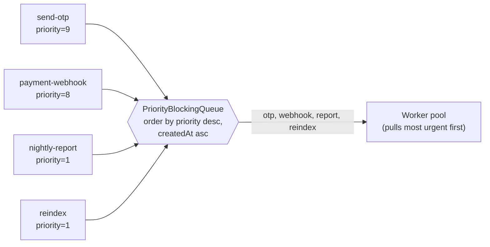
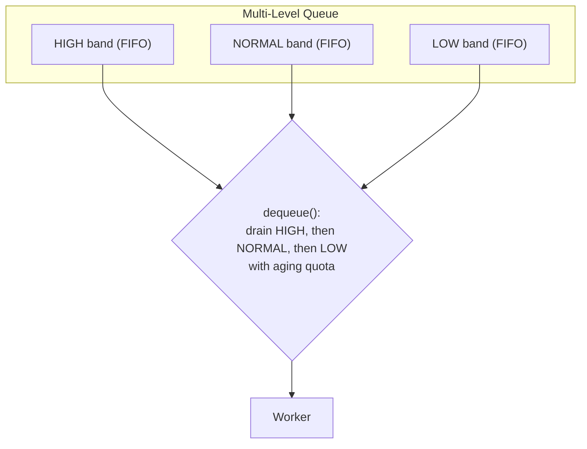
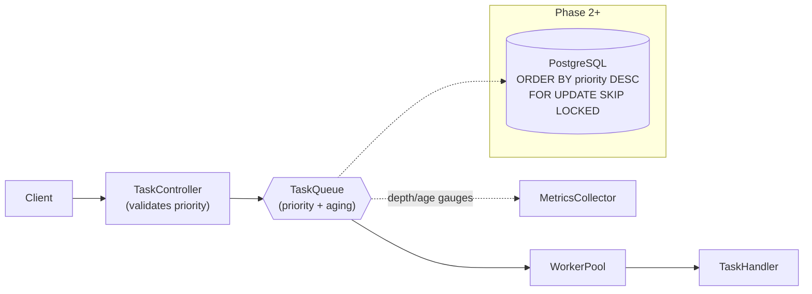

# Priority Queues

> Where this fits: in our Distributed Task Queue platform, not all tasks are equal. A `send-otp` task that a human is waiting on must jump ahead of a `nightly-report` task. This chapter teaches how to order work by `priority` inside the `TaskQueue` — in memory (`PriorityBlockingQueue`) in Phase 1/3 and in PostgreSQL (`ORDER BY priority`) in Phase 2/4 — without letting low-priority work starve forever.

---

## 1. Why this exists

A plain FIFO queue answers exactly one question: *which task arrived first?* That is the wrong question for most production systems. Real workloads have a mix of:

- **Latency-sensitive work** a user is blocking on (password reset email, payment webhook).
- **Bulk / background work** that can wait minutes or hours (re-indexing, analytics rollups, batch notifications).

If both share one FIFO queue, a burst of 100,000 background tasks parks in front of one urgent task. The urgent task now waits behind all of them — your p99 latency for the thing that matters is destroyed by work nobody is waiting for. This is **head-of-line blocking**.

A **priority queue** lets us dequeue by *importance* (and use arrival time only as a tie-breaker), so the worker pool always pulls the most valuable available task next.

**Brief historical context.** Priority queues are one of the oldest scheduling ideas in computing. OS schedulers (Unix `nice` values, Windows priority classes), network QoS (DiffServ / 802.1p priority bits), and disk I/O schedulers all rank work. They also taught us the classic failure mode the hard way: in the 1973 *THE* and later Multics/Unix schedulers, naive static priority caused **starvation** — and the fix, **priority aging**, is exactly the technique we use below. The famous 1997 Mars Pathfinder reset bug was a *priority inversion* incident; the same family of problems. We will inherit both the idea and its scars.

In our canonical model the door is already open for this — `Task` carries an `int priority` field:

```java
public record Task(
        String id,            // UUID
        String type,          // "send-otp", "nightly-report", ...
        String payload,       // JSON
        TaskStatus status,
        int attempts,
        int maxAttempts,
        Instant createdAt,
        Instant scheduledAt,
        int priority          // <-- this chapter is about ordering on THIS field
) {}
```

By convention in this curriculum, **higher `priority` value means more urgent** (10 beats 1). We will be explicit about ordering everywhere because getting the comparator backwards is the single most common bug here.



---

## 2. The naive version

First cut: keep a FIFO `BlockingQueue` and "handle" priority by hoping urgent tasks arrive first. They don't.

```java
// NAIVE: a FIFO queue pretending priority exists. The priority field is ignored.
public final class NaiveFifoTaskQueue implements TaskQueue {
    private final BlockingQueue<Task> queue = new LinkedBlockingQueue<>();

    @Override public void enqueue(Task t) {
        queue.add(t); // priority is silently ignored
    }

    @Override public Task dequeue() throws InterruptedException {
        return queue.take(); // strictly arrival order
    }

    @Override public int size() {
        return queue.size();
    }
}
```

**Limitations:**

- `priority` is dead weight; ordering is pure FIFO.
- A burst of low-priority tasks blocks high-priority tasks (head-of-line blocking).
- No way to express SLAs ("OTP within 1s, report within 1h").

A slightly less naive attempt is to keep an `ArrayList`, add to the tail, and **scan for the max priority on every `dequeue`**:

```java
// STILL BAD: linear scan per dequeue, plus we hand-rolled locking and got it subtly wrong.
public final class ScanningTaskQueue implements TaskQueue {
    private final List<Task> tasks = new ArrayList<>();

    @Override public synchronized void enqueue(Task t) {
        tasks.add(t);
        notifyAll();
    }

    @Override public synchronized Task dequeue() throws InterruptedException {
        while (tasks.isEmpty()) wait();
        // O(n) scan to find the most urgent task
        int best = 0;
        for (int i = 1; i < tasks.size(); i++) {
            if (tasks.get(i).priority() > tasks.get(best).priority()) best = i;
        }
        return tasks.remove(best); // O(n) shift on remove too
    }

    @Override public synchronized int size() { return tasks.size(); }
}
```

This *works* but is O(n) per dequeue and O(n) per remove. With 100k queued tasks and a hot worker pool, every poll walks the whole list. It also makes ties non-deterministic (no FIFO tie-break) and forces us to hand-roll `wait/notify`, which is easy to get wrong (see [../06-concurrency/locks.md](../06-concurrency/locks.md)). We can do far better with a heap.

---

## 3. Improved version

Use a **binary heap** — that is exactly what `java.util.PriorityQueue` is. Enqueue and dequeue are O(log n), and "find the most urgent" is O(1) at the head. We supply a `Comparator<Task>` that encodes "higher priority first, older first on ties."

```java
import java.util.Comparator;
import java.util.PriorityQueue;

// IMPROVED: heap-ordered, correct comparator, O(log n) ops.
// Single-threaded though — not safe to share across the worker pool yet.
public final class HeapTaskQueueSingleThreaded {

    // Higher priority dequeued first; on equal priority, older createdAt first (FIFO tie-break).
    static final Comparator<Task> BY_PRIORITY =
            Comparator.comparingInt(Task::priority).reversed()
                      .thenComparing(Task::createdAt);

    private final PriorityQueue<Task> heap = new PriorityQueue<>(BY_PRIORITY);

    public void enqueue(Task t) { heap.add(t); }      // O(log n)
    public Task dequeue()       { return heap.poll(); } // O(log n), null if empty
    public int size()           { return heap.size(); }
}
```

Two things to internalize about the comparator:

1. `comparingInt(Task::priority)` orders **ascending** (smallest priority first). We want largest first, so we `.reversed()`.
2. `.thenComparing(Task::createdAt)` makes ties deterministic and **FIFO within a priority level** — without it, tasks of equal priority come out in heap-internal order, which is effectively random and surprises everyone.

The remaining problem: `PriorityQueue` is **not** thread-safe and does **not** block when empty. Our `TaskQueue.dequeue()` is declared `throws InterruptedException` precisely because we want a *blocking* dequeue that parks the worker thread until work arrives. That is the production version.

---

## 4. Production-quality version

`java.util.concurrent.PriorityBlockingQueue` gives us all three properties we need:

- **Heap-ordered** by our comparator (O(log n)).
- **Thread-safe** (lock-guarded, safe for many producers and many consumers).
- **Blocking** `take()` that parks the consumer until an element is available.

This is the in-memory implementation of our canonical `TaskQueue` interface, used by the `WorkerPool` in Phase 1 and Phase 3.

```java
import java.time.Instant;
import java.util.Comparator;
import java.util.concurrent.PriorityBlockingQueue;

/**
 * In-memory, priority-ordered, blocking implementation of TaskQueue.
 * Ordering: higher Task.priority() first; FIFO (oldest createdAt) on ties.
 * Used by WorkerPool in Phase 1 / Phase 3.
 */
public final class PriorityInMemoryTaskQueue implements TaskQueue {

    /** Higher priority first, then oldest-created first as a stable FIFO tie-break. */
    public static final Comparator<Task> ORDER =
            Comparator.comparingInt(Task::priority).reversed()
                      .thenComparing(Task::createdAt);

    private final PriorityBlockingQueue<Task> queue;

    public PriorityInMemoryTaskQueue() {
        this(11); // PBQ default initial capacity
    }

    public PriorityInMemoryTaskQueue(int initialCapacity) {
        this.queue = new PriorityBlockingQueue<>(initialCapacity, ORDER);
    }

    @Override
    public void enqueue(Task t) {
        // PBQ is unbounded: add() never blocks and never returns false.
        // Bounding is handled separately (see Production considerations).
        queue.put(t);
    }

    @Override
    public Task dequeue() throws InterruptedException {
        // Blocks the worker thread until a task is available, then returns the most urgent.
        return queue.take();
    }

    @Override
    public int size() {
        return queue.size();
    }
}
```

Why this is the version a staff engineer ships:

- It honors the `TaskQueue` contract exactly (`enqueue`, `dequeue throws InterruptedException`, `size`), so it is a drop-in for `InMemoryTaskQueue` from [task-queues.md](./task-queues.md).
- The comparator is a `public static` constant so tests and the DB layer can reference the *same* ordering rule (single source of truth — see [../04-oop-and-ood/dry-kiss-yagni.md](../04-oop-and-ood/dry-kiss-yagni.md)).
- It relies on a battle-tested JDK class rather than hand-rolled `wait/notify`, which we already saw is error-prone.

> One sharp edge to flag now and fix in §14: `PriorityBlockingQueue` is **unbounded**. Under a producer flood it grows until `OutOfMemoryError`. We address backpressure with a semaphore and link to [../08-distributed-systems/backpressure.md](../08-distributed-systems/backpressure.md).

---

## 5. Code walkthrough

### 5.1 Beginner: the comparator is the whole game

```java
import java.time.Instant;
import java.util.PriorityQueue;

public class PriorityBasics {
    public static void main(String[] args) {
        var heap = new PriorityQueue<Task>(PriorityInMemoryTaskQueue.ORDER);

        Instant now = Instant.now();
        heap.add(task("nightly-report", 1, now));
        heap.add(task("send-otp",       9, now.plusMillis(5))); // arrived LATER
        heap.add(task("payment-hook",   8, now.plusMillis(2)));

        // Despite arriving later, send-otp (priority 9) comes out first.
        while (!heap.isEmpty()) {
            Task t = heap.poll();
            System.out.println(t.type() + " p=" + t.priority());
        }
        // Output:
        // send-otp p=9
        // payment-hook p=8
        // nightly-report p=1
    }

    static Task task(String type, int priority, Instant createdAt) {
        return new Task(java.util.UUID.randomUUID().toString(), type, "{}",
                TaskStatus.PENDING, 0, 3, createdAt, createdAt, priority);
    }
}
```

Takeaway: a heap is only "correct" relative to its comparator. **The comparator is the design.**

### 5.2 Intermediate: blocking producer/consumer with priority

This wires `PriorityInMemoryTaskQueue` into the producer-consumer pattern from [producer-consumer.md](./producer-consumer.md), using an `ExecutorService` (see [../06-concurrency/executor-service.md](../06-concurrency/executor-service.md)).

```java
import java.time.Instant;
import java.util.UUID;
import java.util.concurrent.ExecutorService;
import java.util.concurrent.Executors;
import java.util.concurrent.TimeUnit;

public class PriorityProducerConsumer {
    public static void main(String[] args) throws Exception {
        TaskQueue queue = new PriorityInMemoryTaskQueue();

        // Producer: floods the queue with low-priority work, then drops one urgent task in.
        Runnable producer = () -> {
            Instant base = Instant.now();
            for (int i = 0; i < 1000; i++) {
                queue.enqueue(task("bulk-email", 1, base.plusMillis(i)));
            }
            queue.enqueue(task("send-otp", 9, base.plusMillis(10_000)));
        };

        // Consumer: pulls 3 tasks. The urgent one should be among the first out
        // even though it was enqueued LAST, because it has the highest priority.
        Runnable consumer = () -> {
            try {
                for (int i = 0; i < 3; i++) {
                    Task t = queue.dequeue();          // blocks if empty
                    System.out.println("ran " + t.type() + " p=" + t.priority());
                }
            } catch (InterruptedException e) {
                Thread.currentThread().interrupt();
            }
        };

        ExecutorService pool = Executors.newFixedThreadPool(2);
        pool.submit(producer);
        Thread.sleep(20); // let the producer fill the heap first
        pool.submit(consumer);

        pool.shutdown();
        pool.awaitTermination(2, TimeUnit.SECONDS);
        // Prints: ran send-otp p=9  (then two bulk-email)
    }

    static Task task(String type, int priority, Instant createdAt) {
        return new Task(UUID.randomUUID().toString(), type, "{}",
                TaskStatus.PENDING, 0, 3, createdAt, createdAt, priority);
    }
}
```

### 5.3 Production-inspired: an aging priority queue that prevents starvation

Static priority has a fatal flaw: if priority-9 tasks keep arriving, a priority-1 task can wait **forever**. The classic fix is **aging** — the *effective* priority of a task rises the longer it waits. We implement an `AgingTaskQueue` that wraps each task with a dynamically computed effective priority.

```java
import java.time.Duration;
import java.time.Instant;
import java.util.Comparator;
import java.util.concurrent.PriorityBlockingQueue;
import java.util.concurrent.locks.Condition;
import java.util.concurrent.locks.ReentrantLock;

/**
 * Priority queue with linear aging to prevent starvation of low-priority tasks.
 *
 * effectivePriority(task) = task.priority() + floor(waited_seconds / agingStepSeconds)
 *
 * A task that has waited long enough is treated as if its base priority were higher,
 * so it eventually overtakes a steady stream of higher-priority newcomers.
 *
 * NOTE: PriorityBlockingQueue caches comparisons; effective priority changes over time,
 * so we recompute the head's effective priority and may re-poll. We guard with a lock
 * and use timed waiting so a newly-aged task can't sit indefinitely.
 */
public final class AgingTaskQueue implements TaskQueue {

    private final long agingStepSeconds;
    private final ReentrantLock lock = new ReentrantLock();
    private final Condition notEmpty = lock.newCondition();

    // Ordered by effective priority computed at comparison time.
    private final PriorityBlockingQueue<Task> heap;

    public AgingTaskQueue(long agingStepSeconds) {
        this.agingStepSeconds = agingStepSeconds;
        Comparator<Task> byEffective =
                Comparator.comparingInt((Task t) -> effectivePriority(t)).reversed()
                          .thenComparing(Task::createdAt);
        this.heap = new PriorityBlockingQueue<>(64, byEffective);
    }

    int effectivePriority(Task t) {
        long waitedSeconds = Duration.between(t.createdAt(), Instant.now()).getSeconds();
        long bonus = agingStepSeconds <= 0 ? 0 : waitedSeconds / agingStepSeconds;
        return (int) Math.min(Integer.MAX_VALUE, (long) t.priority() + bonus);
    }

    @Override
    public void enqueue(Task t) {
        lock.lock();
        try {
            heap.put(t);
            notEmpty.signal();
        } finally {
            lock.unlock();
        }
    }

    @Override
    public Task dequeue() throws InterruptedException {
        lock.lock();
        try {
            Task t;
            while ((t = heap.poll()) == null) {
                notEmpty.await();
            }
            return t;
        } finally {
            lock.unlock();
        }
    }

    @Override
    public int size() {
        return heap.size();
    }
}
```

This is *good enough* for a single node and small heaps. Be honest about its limits: because `effectivePriority` depends on "now," the heap's internal ordering can drift slightly from the true ordering between rebalances. For an in-memory queue at moderate scale this is acceptable; for a DB-backed queue we get aging "for free" and more cleanly with `ORDER BY` on a computed expression (§7). The production rule of thumb: **aging belongs in the source of truth, not in a cache.**

---

## 6. Multi-level priority queues

A heap with a comparator is one design. The other classic design is **multi-level queues (MLQ)**: maintain N separate FIFO queues, one per priority band (e.g. `HIGH`, `NORMAL`, `LOW`), and always drain higher bands before lower ones. This is how Linux's `O(1)` scheduler and many web frameworks (e.g. separate "interactive" vs "batch" thread pools) actually work.



Why prefer MLQ over a single heap?

- **O(1) enqueue/dequeue** per band (plain `BlockingQueue`), versus O(log n) for a heap.
- **Per-band policy**: different bands can have different rate limits, different worker pools, even different brokers — a natural fit for [../08-distributed-systems/rate-limiting.md](../08-distributed-systems/rate-limiting.md).
- **Trivial aging via quota**: "serve at most K high-band tasks before forcing one from the next band down" is starvation-proof and dead simple to reason about.

```java
import java.util.List;
import java.util.concurrent.LinkedBlockingQueue;
import java.util.concurrent.BlockingQueue;

/**
 * Three-band multi-level queue with a strict-with-quota policy.
 * After {@code highQuota} consecutive HIGH dequeues, we force one lower-band task
 * to guarantee progress for NORMAL/LOW (anti-starvation).
 */
public final class MultiLevelTaskQueue implements TaskQueue {

    private enum Band { HIGH, NORMAL, LOW }

    private final BlockingQueue<Task> high   = new LinkedBlockingQueue<>();
    private final BlockingQueue<Task> normal = new LinkedBlockingQueue<>();
    private final BlockingQueue<Task> low    = new LinkedBlockingQueue<>();

    private final int highQuota;          // max consecutive HIGH before yielding
    private int consecutiveHigh = 0;

    public MultiLevelTaskQueue(int highQuota) {
        this.highQuota = highQuota;
    }

    private static Band bandOf(Task t) {
        if (t.priority() >= 7) return Band.HIGH;
        if (t.priority() >= 3) return Band.NORMAL;
        return Band.LOW;
    }

    @Override
    public void enqueue(Task t) {
        switch (bandOf(t)) {
            case HIGH   -> high.add(t);
            case NORMAL -> normal.add(t);
            case LOW    -> low.add(t);
        }
    }

    @Override
    public Task dequeue() throws InterruptedException {
        while (true) {
            // Anti-starvation: if we've served too many HIGH in a row, yield to lower bands first.
            boolean preferLower = consecutiveHigh >= highQuota;

            if (!preferLower) {
                Task t = high.poll();
                if (t != null) { consecutiveHigh++; return t; }
            }
            // Try NORMAL, then LOW.
            Task t = normal.poll();
            if (t != null) { consecutiveHigh = 0; return t; }
            t = low.poll();
            if (t != null) { consecutiveHigh = 0; return t; }
            // If lower bands were empty, fall back to HIGH (reset quota since nothing else is waiting).
            t = high.poll();
            if (t != null) { consecutiveHigh = 1; return t; }

            // Everything empty: block until *something* arrives, cheaply, on HIGH.
            // (A production version uses a shared not-empty Condition; see exercise H2.)
            t = high.poll(50, java.util.concurrent.TimeUnit.MILLISECONDS);
            if (t != null) { consecutiveHigh = 1; return t; }
        }
    }

    @Override
    public int size() {
        return high.size() + normal.size() + low.size();
    }

    public List<Integer> depthByBand() {
        return List.of(high.size(), normal.size(), low.size()); // for metrics/gauges
    }
}
```

> The blocking story in MLQ is the genuinely tricky part: with three independent queues you either poll with timeouts (simple, slightly busy) or share one `Condition` across all bands (efficient, more code). Exercise H2 builds the shared-`Condition` version.

---

## 7. Priority in a DB-backed queue (Phase 2 / Phase 4)

Once tasks live in PostgreSQL (`PostgresTaskQueue`, `TaskRepository.pollDue`), priority is just an `ORDER BY`. This is where priority + scheduling + concurrency-safe claiming all meet.

```sql
-- Flyway migration: tasks table with priority and a covering index for the claim query.
CREATE TABLE tasks (
    id           UUID PRIMARY KEY,
    type         TEXT        NOT NULL,
    payload      JSONB       NOT NULL,
    status       TEXT        NOT NULL,            -- PENDING, RUNNING, ...
    attempts     INT         NOT NULL DEFAULT 0,
    max_attempts INT         NOT NULL DEFAULT 3,
    created_at   TIMESTAMPTZ NOT NULL DEFAULT now(),
    scheduled_at TIMESTAMPTZ NOT NULL DEFAULT now(),
    priority     INT         NOT NULL DEFAULT 0
);

-- Index designed for the claim query below: filter by status+scheduled_at,
-- then order by priority desc, created_at asc.
CREATE INDEX idx_tasks_claim
    ON tasks (status, scheduled_at, priority DESC, created_at ASC);
```

The claim query for `pollDue(n)` must do three things atomically: pick the **most urgent due** tasks, **skip rows another worker already claimed**, and **mark them RUNNING**. PostgreSQL's `FOR UPDATE SKIP LOCKED` is the idiomatic tool — it is the relational-DB equivalent of a concurrent dequeue.

```sql
-- Claim up to :n most-urgent due tasks, skipping rows locked by other workers.
WITH claimed AS (
    SELECT id
    FROM tasks
    WHERE status = 'PENDING'
      AND scheduled_at <= now()
    ORDER BY priority DESC, created_at ASC   -- <-- priority ordering lives HERE
    LIMIT :n
    FOR UPDATE SKIP LOCKED                    -- concurrency-safe claiming
)
UPDATE tasks t
SET status = 'RUNNING'
FROM claimed c
WHERE t.id = c.id
RETURNING t.*;
```

```java
import java.util.List;
import org.springframework.jdbc.core.JdbcTemplate;

/** Phase 2 JDBC-backed repository. pollDue does priority-ordered, race-free claiming. */
public final class JdbcTaskRepository implements TaskRepository {
    private final JdbcTemplate jdbc;

    public JdbcTaskRepository(JdbcTemplate jdbc) { this.jdbc = jdbc; }

    private static final String CLAIM_SQL = """
        WITH claimed AS (
            SELECT id FROM tasks
            WHERE status = 'PENDING' AND scheduled_at <= now()
            ORDER BY priority DESC, created_at ASC
            LIMIT ?
            FOR UPDATE SKIP LOCKED
        )
        UPDATE tasks t SET status = 'RUNNING'
        FROM claimed c WHERE t.id = c.id
        RETURNING t.id, t.type, t.payload, t.status, t.attempts,
                  t.max_attempts, t.created_at, t.scheduled_at, t.priority
        """;

    @Override
    public List<Task> pollDue(int n) {
        return jdbc.query(CLAIM_SQL, TaskRowMapper.INSTANCE, n);
    }

    @Override public void save(Task t) { /* upsert, omitted for brevity */ }
    @Override public java.util.Optional<Task> findById(String id) { /* omitted */ return java.util.Optional.empty(); }
}
```

**Aging in SQL is one line.** Instead of static `ORDER BY priority DESC`, age by wait time directly in the query — no background job, no drifting heap:

```sql
-- Effective priority = base priority + minutes waited / 5 (one bonus point per 5 minutes).
ORDER BY (priority + EXTRACT(EPOCH FROM (now() - created_at)) / 300) DESC,
         created_at ASC
```

> This is why "aging belongs in the source of truth" pays off: in the DB-backed queue, aging is a computed column in the `ORDER BY`, evaluated fresh on every claim. No staleness, no extra moving parts.

The two big DB tradeoffs to know cold:

- **`SKIP LOCKED` keeps throughput high** under many workers but means the *exact* ordering across concurrent claims is approximate — worker A may grab priority-9 while worker B simultaneously grabs priority-8, and B might commit first. For task queues this is fine; for strict global ordering it is not (see [../08-distributed-systems/message-ordering.md](../08-distributed-systems/message-ordering.md)).
- **The index matters enormously.** Without `idx_tasks_claim`, the `ORDER BY ... LIMIT n` does a full sort of all `PENDING` rows on every poll. With it, Postgres walks the index and stops after `n` rows.

---

## 8. Tradeoffs

| Approach | Enqueue | Dequeue | FIFO tie-break | Starvation-safe? | Bounded? | Best for |
|---|---|---|---|---|---|---|
| `LinkedBlockingQueue` (FIFO) | O(1) | O(1) | N/A (always FIFO) | N/A | optional | no priority needed |
| `PriorityBlockingQueue` (heap) | O(log n) | O(log n) | only if comparator adds it | No (static) | **No (unbounded!)** | in-memory, few priority levels |
| `AgingTaskQueue` (heap + aging) | O(log n) | O(log n) | yes | **Yes** | No | single-node, fairness matters |
| Multi-level queues | O(1) | O(1) | per-band FIFO | Yes (via quota) | per-band optional | distinct service classes, per-band policy |
| Postgres `ORDER BY` + `SKIP LOCKED` | O(log n) index insert | O(log n) index scan | yes (`created_at`) | Yes (age in SQL) | yes (table) | durable, multi-worker, Phase 2+ |
| Kafka / broker | O(1) append | partition-FIFO | N/A | N/A | yes | no native priority — emulate with topics (§14) |

Headline tradeoffs:

- **Heap vs MLQ.** A heap supports *continuous* priority (any int) but costs O(log n) and needs aging bolted on. MLQ supports a *small fixed* set of classes at O(1) with trivial aging — but you must choose band boundaries up front.
- **In-memory vs DB.** In-memory is microseconds and simple, but loses everything on crash and can't coordinate across nodes. DB is durable and multi-worker but adds a network round-trip per claim and depends on a good index.
- **Strict priority vs fairness.** Strict priority gives the best p99 for urgent work but starves the rest. Aging/quotas trade a little urgent-task latency for a guarantee that nothing waits forever. Almost always, ship fairness.

---

## 9. Common mistakes and pitfalls

- **Backwards comparator.** `Comparator.comparingInt(Task::priority)` puts the *lowest* priority first. You must `.reversed()` (or define priority so that lower int = more urgent and document it loudly). *Fix:* one `public static final Comparator` constant, unit-tested, reused everywhere.
- **No tie-break ⇒ non-FIFO within a level.** Without `.thenComparing(Task::createdAt)`, equal-priority tasks come out in heap order (effectively random). *Fix:* always add a stable tie-break.
- **Assuming `PriorityBlockingQueue` is bounded.** It is **not**. A producer flood OOMs the JVM. *Fix:* gate `enqueue` with a `Semaphore` or switch to a DB/broker (see §14 and [../08-distributed-systems/backpressure.md](../08-distributed-systems/backpressure.md)).
- **Mutating a task's priority after enqueue.** Heaps cache their structure on insert; changing the key in place corrupts ordering and can violate the heap invariant. *Fix:* `Task` is an immutable `record`; to "reprioritize," remove and re-add, or use computed (aging) priority.
- **`iterator()` / `toArray()` order surprises.** Iterating a `PriorityBlockingQueue` does **not** return elements in priority order — only `poll`/`take` do. *Fix:* never rely on traversal order; drain via `take`.
- **Comparator inconsistent with `equals`.** If your comparator says two tasks are "equal" but they aren't, `remove(Object)` and `contains` behave surprisingly. *Fix:* keep the comparator a total order with a unique tie-break (`createdAt`, then `id`).
- **Forgetting the DB index.** `ORDER BY priority DESC LIMIT n` with no supporting index sorts the entire `PENDING` set every poll. *Fix:* the composite index from §7.
- **Starvation ignored until an incident.** Static priority "works in the demo," then a hot tenant starves everyone in prod. *Fix:* design aging in from day one; alert on `oldest_pending_age`.

---

## 10. Refactoring exercise

**Bad** — ignores priority, hand-rolled and racy:

```java
public final class TaskQueueV0 {
    private final java.util.List<Task> tasks = new java.util.ArrayList<>(); // not thread-safe!
    public void enqueue(Task t) { tasks.add(t); }
    public Task dequeue() { return tasks.remove(0); } // FIFO, throws if empty, data races
}
```

**Improved** — correct heap ordering, but single-threaded and non-blocking:

```java
import java.util.Comparator;
import java.util.PriorityQueue;

public final class TaskQueueV1 {
    private final PriorityQueue<Task> heap = new PriorityQueue<>(
            Comparator.comparingInt(Task::priority).reversed()
                      .thenComparing(Task::createdAt));
    public void enqueue(Task t) { heap.add(t); }
    public Task dequeue() { return heap.poll(); } // null when empty, not thread-safe
}
```

**Production** — thread-safe, blocking, aging, bounded, implements the canonical interface:

```java
import java.time.Duration;
import java.time.Instant;
import java.util.Comparator;
import java.util.concurrent.PriorityBlockingQueue;
import java.util.concurrent.Semaphore;
import java.util.concurrent.locks.Condition;
import java.util.concurrent.locks.ReentrantLock;

public final class TaskQueueV2 implements TaskQueue {

    private final long agingStepSeconds;
    private final Semaphore capacity;                 // bound the queue (backpressure)
    private final ReentrantLock lock = new ReentrantLock();
    private final Condition notEmpty = lock.newCondition();
    private final PriorityBlockingQueue<Task> heap;

    public TaskQueueV2(int maxDepth, long agingStepSeconds) {
        this.capacity = new Semaphore(maxDepth);
        this.agingStepSeconds = agingStepSeconds;
        this.heap = new PriorityBlockingQueue<>(64,
                Comparator.comparingInt((Task t) -> effective(t)).reversed()
                          .thenComparing(Task::createdAt));
    }

    private int effective(Task t) {
        long waited = Duration.between(t.createdAt(), Instant.now()).getSeconds();
        long bonus = agingStepSeconds <= 0 ? 0 : waited / agingStepSeconds;
        return (int) Math.min(Integer.MAX_VALUE, (long) t.priority() + bonus);
    }

    @Override
    public void enqueue(Task t) {
        capacity.acquireUninterruptibly();            // blocks producer when full (backpressure)
        lock.lock();
        try {
            heap.put(t);
            notEmpty.signal();
        } finally {
            lock.unlock();
        }
    }

    @Override
    public Task dequeue() throws InterruptedException {
        lock.lock();
        try {
            Task t;
            while ((t = heap.poll()) == null) {
                notEmpty.await();
            }
            capacity.release();                        // free a slot for producers
            return t;
        } finally {
            lock.unlock();
        }
    }

    @Override
    public int size() { return heap.size(); }
}
```

What changed and why: we added thread-safety + blocking (`PriorityBlockingQueue`/`Condition`), fairness (aging in `effective`), backpressure (a bounding `Semaphore`), and conformance to the `TaskQueue` contract — turning a toy into something shippable.

---

## 11. Exercises

### Easy

- **E1 (knowledge check).** Higher `priority` int = more urgent in our model. Write the one-line `Comparator<Task>` that dequeues the most urgent first and breaks ties FIFO by `createdAt`.
- **E2 (coding).** Implement `peekNext()` on a `PriorityBlockingQueue<Task>` that returns the most urgent task *without removing it*, or `null` if empty. (Hint: `PriorityBlockingQueue` has a method for this.)

### Medium

- **M1 (coding).** Write a JUnit 5 + AssertJ test proving that an urgent task enqueued *last* is dequeued *first*, and that two equal-priority tasks come out in `createdAt` order.
- **M2 (refactoring).** Take `ScanningTaskQueue` from §2 and refactor it to a `PriorityBlockingQueue`-backed implementation of `TaskQueue`, preserving FIFO-within-priority.
- **M3 (design).** You have three service classes: `HIGH` (SLA 1s), `NORMAL` (SLA 1min), `LOW` (best-effort). Decide between a single aging heap and a three-band MLQ. Justify with at least three concrete tradeoffs.

### Hard

- **H1 (coding).** Implement aging in the DB layer: write the `ORDER BY` for `pollDue` so effective priority increases by 1 point per 2 minutes waited, and explain why no index can fully cover it (and what partial index still helps).
- **H2 (coding/design).** Build a `MultiLevelTaskQueue` whose `dequeue()` blocks efficiently using a **single shared `Condition`** across all three bands (no busy polling), and still enforces the high-quota anti-starvation rule.
- **H3 (interview-style).** Kafka has no per-message priority. Design a priority scheme on top of Kafka for our platform. Address ordering, starvation, and how a consumer decides which topic to read next.

---

## 12. Solutions

### E1

```java
Comparator<Task> c = Comparator.comparingInt(Task::priority).reversed()
                               .thenComparing(Task::createdAt);
```
`reversed()` flips ascending int order so the largest priority is the head; `thenComparing(createdAt)` makes ties FIFO and deterministic.

### E2

```java
import java.util.concurrent.PriorityBlockingQueue;

static Task peekNext(PriorityBlockingQueue<Task> q) {
    return q.peek(); // returns head (most urgent) without removing; null if empty
}
```
`peek()` is O(1) and non-blocking. Note: only the *head* is in sorted position — `peek` is correct, but iterating the queue is not sorted.

### M1

```java
import static org.assertj.core.api.Assertions.assertThat;
import java.time.Instant;
import java.util.UUID;
import org.junit.jupiter.api.Test;

class PriorityInMemoryTaskQueueTest {

    private Task task(String type, int priority, Instant createdAt) {
        return new Task(UUID.randomUUID().toString(), type, "{}",
                TaskStatus.PENDING, 0, 3, createdAt, createdAt, priority);
    }

    @Test
    void urgentTaskEnqueuedLastIsDequeuedFirst() throws InterruptedException {
        var q = new PriorityInMemoryTaskQueue();
        Instant t0 = Instant.now();
        q.enqueue(task("bulk", 1, t0));
        q.enqueue(task("bulk", 1, t0.plusMillis(1)));
        q.enqueue(task("otp",  9, t0.plusMillis(2))); // last, but highest priority

        assertThat(q.dequeue().type()).isEqualTo("otp");
    }

    @Test
    void equalPriorityComesOutInFifoOrder() throws InterruptedException {
        var q = new PriorityInMemoryTaskQueue();
        Instant t0 = Instant.now();
        Task older   = task("a", 5, t0);
        Task newer   = task("b", 5, t0.plusMillis(1));
        q.enqueue(newer);   // enqueue newer first to prove order is by createdAt, not insertion
        q.enqueue(older);

        assertThat(q.dequeue().id()).isEqualTo(older.id()); // older createdAt wins the tie
        assertThat(q.dequeue().id()).isEqualTo(newer.id());
    }
}
```

### M2

```java
import java.util.Comparator;
import java.util.concurrent.PriorityBlockingQueue;

public final class FixedScanningTaskQueue implements TaskQueue {
    private final PriorityBlockingQueue<Task> queue =
            new PriorityBlockingQueue<>(64,
                Comparator.comparingInt(Task::priority).reversed()
                          .thenComparing(Task::createdAt));

    @Override public void enqueue(Task t)  { queue.put(t); }
    @Override public Task dequeue() throws InterruptedException { return queue.take(); }
    @Override public int size()            { return queue.size(); }
}
```
The O(n) scan and hand-rolled `wait/notify` are gone: dequeue is O(log n), the JDK handles locking/blocking, and FIFO-within-priority is preserved by the tie-break.

### M3

Pick the **three-band MLQ** for hard, distinct SLAs:

1. **Isolation:** `HIGH` cannot be diluted by `LOW` volume — separate FIFO queues mean `LOW` depth literally cannot appear in `HIGH`'s dequeue path. A single heap mixes everything in one structure.
2. **Per-band policy:** you can give `HIGH` its own worker pool and rate limiter, page on `HIGH` depth only, and even route `LOW` to a cheaper/different broker. A heap is one undifferentiated blob.
3. **Simple, provable anti-starvation:** "serve at most K `HIGH` before one `NORMAL`/`LOW`" is trivially correct and tunable per band; aging in a heap is harder to reason about and can drift (§5.3).

Choose the **aging heap** instead only if priority is genuinely continuous (e.g. computed from a cost function across thousands of distinct values) rather than a handful of classes.

### H1

```sql
ORDER BY (priority + EXTRACT(EPOCH FROM (now() - created_at)) / 120) DESC,
         created_at ASC
LIMIT :n
```
No index can fully cover this because the sort key depends on `now()` — it changes every second, so it can't be materialized into a B-tree. What *still* helps: a partial index on the **filter** (`WHERE status='PENDING'`) plus `created_at`, e.g.
```sql
CREATE INDEX idx_pending_age ON tasks (created_at) WHERE status = 'PENDING';
```
This lets Postgres cheaply gather and bound the candidate set; the aging arithmetic then sorts a small set. For most queues, the `PENDING` working set is small, so this is fast in practice.

### H2

```java
import java.util.concurrent.locks.Condition;
import java.util.concurrent.locks.ReentrantLock;
import java.util.ArrayDeque;
import java.util.Deque;

public final class BlockingMultiLevelTaskQueue implements TaskQueue {
    private final Deque<Task> high   = new ArrayDeque<>();
    private final Deque<Task> normal = new ArrayDeque<>();
    private final Deque<Task> low    = new ArrayDeque<>();

    private final ReentrantLock lock = new ReentrantLock();
    private final Condition notEmpty = lock.newCondition();
    private final int highQuota;
    private int consecutiveHigh = 0;

    public BlockingMultiLevelTaskQueue(int highQuota) { this.highQuota = highQuota; }

    private Deque<Task> bandOf(Task t) {
        if (t.priority() >= 7) return high;
        if (t.priority() >= 3) return normal;
        return low;
    }

    @Override
    public void enqueue(Task t) {
        lock.lock();
        try {
            bandOf(t).addLast(t);
            notEmpty.signal();             // wake exactly one waiting consumer
        } finally {
            lock.unlock();
        }
    }

    @Override
    public Task dequeue() throws InterruptedException {
        lock.lock();
        try {
            while (high.isEmpty() && normal.isEmpty() && low.isEmpty()) {
                notEmpty.await();          // efficient block; no busy polling
            }
            boolean yield = consecutiveHigh >= highQuota
                            && (!normal.isEmpty() || !low.isEmpty());
            if (!yield && !high.isEmpty()) { consecutiveHigh++;   return high.pollFirst(); }
            if (!normal.isEmpty())         { consecutiveHigh = 0; return normal.pollFirst(); }
            if (!low.isEmpty())            { consecutiveHigh = 0; return low.pollFirst(); }
            consecutiveHigh++;             // only HIGH left despite quota
            return high.pollFirst();
        } finally {
            lock.unlock();
        }
    }

    @Override
    public int size() {
        lock.lock();
        try { return high.size() + normal.size() + low.size(); }
        finally { lock.unlock(); }
    }
}
```
One lock guards all three deques; one `Condition` parks idle consumers. There is no busy polling, and the quota guarantees that after `highQuota` consecutive `HIGH` dequeues a waiting `NORMAL`/`LOW` task is served.

### H3

Design priority on Kafka with **one topic per priority class** (`tasks.high`, `tasks.normal`, `tasks.low`), since Kafka guarantees order only within a partition and has no per-message priority:

- **Consumer-side selection:** a consumer polls `tasks.high` first; only if it returns nothing (within a short poll timeout) does it poll `tasks.normal`, then `tasks.low`. This makes high-priority effectively preempt lower classes.
- **Starvation fix:** enforce a quota — after N high messages, force one poll of a lower topic — or run dedicated consumer groups per class with reserved capacity, so `LOW` always has *some* throughput. This mirrors the MLQ quota of §6.
- **Ordering caveat:** strict global ordering across classes is impossible (separate partitions/topics). Document that priority here means "class-level preference," not a total order — consistent with [../08-distributed-systems/message-ordering.md](../08-distributed-systems/message-ordering.md).
- **Aging:** Kafka can't reorder a log. To age, either re-publish a stale `LOW` message onto `tasks.high` from a sweeper, or keep the authoritative queue in Postgres (with SQL aging) and use Kafka only as transport.

---

## 13. Interview questions and takeaways

1. **Q: How does `PriorityBlockingQueue` order elements, and is `take()` order the same as `iterator()` order?**
   A: It is a binary min-heap ordered by the supplied comparator (or natural order). `take()`/`poll()` return elements in priority order; `iterator()`/`toArray()` do **not** — only the head is guaranteed to be in sorted position.

2. **Q: Is `PriorityBlockingQueue` bounded?**
   A: No. It grows unboundedly; a producer flood can OOM the JVM. Bound it externally (a `Semaphore`) or use a durable store with backpressure.

3. **Q: What is starvation in a priority queue and how do you prevent it?**
   A: Low-priority tasks never run because higher-priority tasks keep arriving. Fixes: **aging** (effective priority rises with wait time) or **quota/round-robin** across priority bands (MLQ).

4. **Q: Why add a secondary sort key like `createdAt` to the comparator?**
   A: To make ties deterministic and FIFO within a priority level; otherwise equal-priority tasks come out in arbitrary heap order, hurting fairness and reproducibility.

5. **Q: How do you implement priority in a SQL-backed queue with many workers?**
   A: `ORDER BY priority DESC, created_at ASC ... LIMIT n FOR UPDATE SKIP LOCKED`, backed by a composite index on `(status, scheduled_at, priority DESC, created_at)`. `SKIP LOCKED` lets workers claim disjoint rows concurrently.

6. **Q: Single heap vs multi-level queues — when each?**
   A: Heap for continuous priority over many values; MLQ for a small set of service classes where you want O(1) ops, per-band policy/limits, and trivial quota-based anti-starvation.

7. **Q: What is priority inversion and is it relevant here?**
   A: A high-priority task blocked waiting on a resource held by a low-priority task that itself is starved. Classic in locking schedulers (Mars Pathfinder). In a task queue it appears as a high-priority task whose handler waits on a shared resource throttled to low-priority work; mitigate with priority inheritance or by not sharing scarce locks across priority classes.

8. **Q: Can Kafka do per-message priority?**
   A: Not natively. Emulate with per-class topics and consumer-side preference + quotas, accepting that strict cross-class ordering is impossible.

---

## 14. Production considerations

- **Bounding & backpressure.** `PriorityBlockingQueue` is unbounded — always cap depth (semaphore, or move to DB/broker) and apply backpressure so producers slow down instead of OOMing. See [../08-distributed-systems/backpressure.md](../08-distributed-systems/backpressure.md).
- **Starvation monitoring.** Export `oldest_pending_age_seconds` per priority band as a Micrometer gauge and alert when a `LOW`-band task exceeds its SLA. Aging without monitoring just hides the symptom.
- **Metrics to ship:** queue depth per band (gauge), enqueue/dequeue rate (counters), and time-in-queue percentiles per priority (timers). A rising `LOW`-band age with flat `LOW` throughput is the starvation fingerprint.
- **Priority assignment is a product decision, not an int.** Validate `priority` at the API boundary (`TaskController` clamps to an allowed range), or hostile/buggy clients set everything to 10 and your priority scheme collapses to FIFO.
- **DB index drift.** As `PENDING` grows, watch the claim query's plan (`EXPLAIN ANALYZE`); a missing or bloated index turns each poll into a full sort. Autovacuum the `tasks` table aggressively — dead tuples bloat the partial index.
- **Hot-tenant fairness.** Pure priority lets one tenant flood `HIGH` and starve others. Combine priority with per-tenant fair queuing or rate limits ([../08-distributed-systems/rate-limiting.md](../08-distributed-systems/rate-limiting.md)).
- **Reprioritization.** Because `Task` is immutable, "bump this task" means update the row (DB) or remove+re-add (heap). Never mutate a key already inside a heap.
- **Broker reality.** Kafka has no priority; RabbitMQ has `x-max-priority` queues (a small fixed number of levels, with real performance caveats at high level counts). Choose transport with priority needs in mind — see [broker-comparison.md](./broker-comparison.md).

---

## What We Can Improve In Our Project Using This Concept

Today our Phase 1 `InMemoryTaskQueue` (from [task-queues.md](./task-queues.md)) is FIFO, so `Task.priority` is unused dead weight. We can:

- Replace the FIFO `BlockingQueue` with `PriorityInMemoryTaskQueue` (a `PriorityBlockingQueue` + canonical comparator), making urgent tasks preempt bulk work with zero changes to `Worker`/`WorkerPool` (the `TaskQueue` interface is unchanged).
- Add `AgingTaskQueue` behind a config flag so low-priority work can't starve once load spikes.
- In Phase 2's `JdbcTaskRepository.pollDue`, switch the claim query to `ORDER BY priority DESC, created_at ASC ... FOR UPDATE SKIP LOCKED` and add the composite index, getting durable, multi-worker priority + aging for free.

## Project Refactoring Task

1. Add `PriorityInMemoryTaskQueue implements TaskQueue` with a `public static final Comparator<Task> ORDER` (`priority DESC, createdAt ASC`).
2. Wire it into `WorkerPool` via config (`queue.type=priority`); keep `fifo` as the default for backward compatibility.
3. Add the Flyway migration `V3__priority_index.sql` (composite index) and switch `pollDue` to the `SKIP LOCKED` claim query.
4. Implement `AgingTaskQueue` and unit-test that a long-waiting `priority=1` task eventually overtakes a steady stream of `priority=5` tasks.
5. Expose `taskqueue_depth{band=...}` and `task_oldest_pending_seconds{band=...}` via the `MetricsCollector` and add a starvation alert.

## Git Commit For This Chapter

```text
feat(queue): add priority ordering, aging, and SKIP LOCKED claiming

- add PriorityInMemoryTaskQueue (PriorityBlockingQueue, priority DESC + FIFO tie-break)
- add AgingTaskQueue to prevent low-priority starvation
- switch JdbcTaskRepository.pollDue to ORDER BY priority DESC ... FOR UPDATE SKIP LOCKED
- add Flyway V3__priority_index.sql composite index
- expose per-band queue depth + oldest-pending-age metrics

Files:
  src/main/java/.../queue/PriorityInMemoryTaskQueue.java
  src/main/java/.../queue/AgingTaskQueue.java
  src/main/java/.../repo/JdbcTaskRepository.java
  src/main/resources/db/migration/V3__priority_index.sql
  src/test/java/.../queue/PriorityInMemoryTaskQueueTest.java
```

## Architecture Impact



Priority ordering changes the *dispatch policy* but not the *interfaces*: `TaskQueue`, `Worker`, and `WorkerPool` keep their signatures, so this is a contained, low-blast-radius change. The blast radius grows only when we add the DB index and the `SKIP LOCKED` claim, which touch the persistence layer and require a migration. It also introduces a new operational concern — starvation — that the monitoring stack must now track.

## Interview Takeaways

- `PriorityBlockingQueue` = thread-safe blocking binary heap; ordered by comparator, **unbounded**, and only `poll`/`take` are in priority order.
- The comparator *is* the design: `priority DESC` plus a `createdAt` tie-break gives correct, FIFO-within-priority ordering.
- Static priority starves low-priority work; fix with **aging** (heap) or **quota/round-robin** (multi-level queues).
- In SQL, priority is `ORDER BY priority DESC, created_at ASC ... FOR UPDATE SKIP LOCKED` over a composite index — durable and concurrency-safe.
- Brokers differ: Kafka has no priority (emulate with per-class topics + quotas); RabbitMQ has limited `x-max-priority` levels. Choose transport accordingly.
