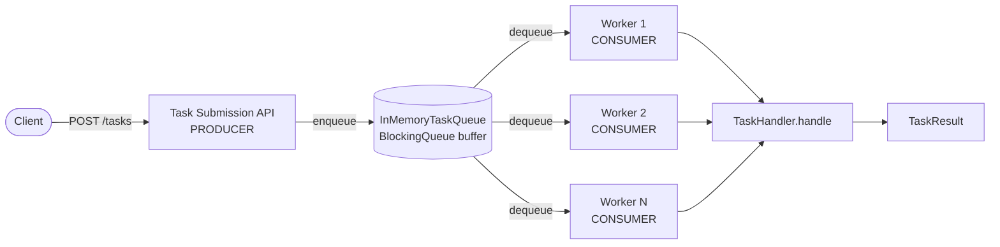
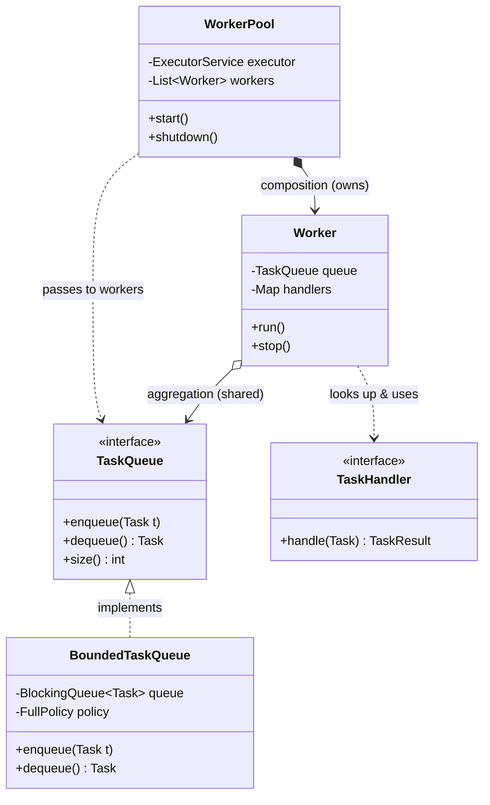

# The Producer-Consumer Pattern

> Where this fits in the project: this is the structural backbone of our Distributed Task Queue. The Task Submission API is the **producer**, the `TaskQueue` is the **buffer**, and the `Worker` pool is the **consumer**. Every later concept — retries, rate limiting, dead-letter queues, distributed brokers — is bolted onto this skeleton. Get this pattern right and the rest of the platform has a place to live.

---

## 1. Why this exists

Imagine the simplest possible version of our platform: a client calls an API, and we run the task inline before responding.

```java
// The whole "platform" in one method. Looks innocent. It is not.
public TaskResult submitAndRun(Task task) throws Exception {
    TaskHandler handler = handlers.get(task.type());
    return handler.handle(task); // client waits here for the ENTIRE execution
}
```

This couples three concerns that change at different rates and run at different speeds:

1. **Accepting work** (cheap, fast, latency-sensitive — clients want a sub-10ms ack).
2. **Doing work** (expensive, slow, CPU/IO-bound — a task might take 30 seconds).
3. **The rate of arrival vs. the rate of completion** (these are almost never equal).

When arrivals briefly exceed completions — a traffic spike, a slow downstream dependency — the inline design has nowhere to put the excess. Threads pile up, memory balloons, and the API falls over precisely when it is most needed.

The **Producer-Consumer pattern** solves this by inserting a **buffer (a queue)** between the side that produces work and the side that consumes it. Producers hand work to the queue and move on; consumers pull work from the queue at their own pace. The queue absorbs short-term mismatches in rate and **decouples** the two sides so each can be scaled, deployed, and reasoned about independently.

Historically this is one of the oldest ideas in systems engineering. Dijkstra formalized the bounded-buffer problem in the 1960s using semaphores; it is the canonical example for synchronization primitives precisely because it is everywhere: keyboards buffering keystrokes for a program, a kernel's network stack buffering packets, a log shipper buffering lines, Kafka buffering events. Our task queue is one more instance of the same timeless shape.

> The single most important property: **producers and consumers never call each other directly.** They only ever talk to the queue. That indirection is the entire point.

---

## 2. The naive version

A first cut that "works" on a laptop demo and fails in production. One producer thread reads requests, one consumer thread runs them, and they share an `ArrayList` guarded by nothing.

```java
// BAD: unbounded, unsynchronized, busy-waiting. Do not ship.
public class NaiveQueue {
    private final List<Task> buffer = new ArrayList<>(); // not thread-safe

    public void enqueue(Task t) {
        buffer.add(t);                 // data race: concurrent add can corrupt the list
    }

    public Task dequeue() {
        while (buffer.isEmpty()) {
            // spin: burns a full CPU core doing nothing
        }
        return buffer.remove(0);       // remove(0) is O(n); also racy
    }
}
```

Everything that can be wrong, is:

- **Data race.** `ArrayList` is not thread-safe. Two threads mutating it concurrently can drop elements, double-count `size`, or throw `ArrayIndexOutOfBoundsException` from deep inside the JDK. The bug is non-deterministic, so it passes your tests and fails on a Tuesday at 2am.
- **Busy-wait.** The consumer spins `while (buffer.isEmpty())`, pinning a CPU at 100% even when there is no work. Multiply by a worker pool and you have a space heater.
- **Unbounded growth.** If producers outrun consumers, `buffer` grows forever until the JVM throws `OutOfMemoryError`. There is **no backpressure**.
- **O(n) removal.** `remove(0)` shifts every remaining element. The queue gets slower as it gets fuller — exactly the wrong scaling behavior.

This is the "naive" baseline every senior engineer has written once and never again.

---

## 3. Improved version

Two independent fixes turn the toy into something usable: use a **thread-safe, blocking, bounded** data structure, and make `dequeue()` **block** instead of spin. Java's `java.util.concurrent` gives us exactly this in `BlockingQueue`.

```java
import java.util.concurrent.ArrayBlockingQueue;
import java.util.concurrent.BlockingQueue;

// BETTER: bounded + thread-safe + blocking. No spin, no OOM, no data race.
public class InMemoryTaskQueue implements TaskQueue {
    private final BlockingQueue<Task> queue;

    public InMemoryTaskQueue(int capacity) {
        this.queue = new ArrayBlockingQueue<>(capacity);
    }

    @Override
    public void enqueue(Task t) throws InterruptedException {
        queue.put(t);          // BLOCKS the producer when the queue is full -> backpressure
    }

    @Override
    public Task dequeue() throws InterruptedException {
        return queue.take();   // BLOCKS the consumer when the queue is empty -> no busy-wait
    }

    @Override
    public int size() {
        return queue.size();
    }
}
```

What changed and why it matters:

- `ArrayBlockingQueue<>(capacity)` is **bounded**. When it is full, `put` parks the producer thread until space frees up. That backpressure is the safety valve that keeps memory finite.
- `take()` parks the consumer thread when the queue is empty and wakes it the instant an element arrives. Zero CPU while idle. (Internally this uses a `ReentrantLock` plus two `Condition` objects, `notEmpty` and `notFull` — see [../06-concurrency/blocking-queue.md](../06-concurrency/blocking-queue.md).)
- All the locking lives **inside** the queue. Producers and consumers stay simple.

This is already production-grade for a single JVM. The remaining work is operational: choosing the right queue, handling shutdown, multiple producers/consumers, and what to do when the buffer is full.

> Note on the SPEC's `TaskQueue` signature: the canonical interface declares `enqueue(Task t)` (which may block under backpressure) and `dequeue() throws InterruptedException`. We honor that exactly. Whether `enqueue` blocks, drops, or rejects is a **policy** we make explicit in the production version below.

---

## 4. Production-quality version

A staff engineer ships more than a correct buffer. They ship a queue that is **observable**, has an **explicit full-queue policy**, supports **graceful shutdown**, and **records latency**. Here is the version that goes to production, still backed by a `BlockingQueue` but with the operational sharp edges filed down.

```java
import java.time.Duration;
import java.time.Instant;
import java.util.concurrent.ArrayBlockingQueue;
import java.util.concurrent.BlockingQueue;
import java.util.concurrent.TimeUnit;
import java.util.concurrent.atomic.LongAdder;

/**
 * Production in-memory queue: bounded, observable, with an explicit
 * "what happens when full" policy and offer-with-timeout for backpressure.
 */
public final class BoundedTaskQueue implements TaskQueue {

    public enum FullPolicy { BLOCK, REJECT, BLOCK_WITH_TIMEOUT }

    private final BlockingQueue<Task> queue;
    private final FullPolicy policy;
    private final Duration offerTimeout;

    // Cheap, contention-friendly counters for observability.
    private final LongAdder enqueued = new LongAdder();
    private final LongAdder rejected = new LongAdder();
    private final LongAdder dequeued = new LongAdder();

    public BoundedTaskQueue(int capacity, FullPolicy policy, Duration offerTimeout) {
        this.queue = new ArrayBlockingQueue<>(capacity);
        this.policy = policy;
        this.offerTimeout = offerTimeout;
    }

    @Override
    public void enqueue(Task t) throws InterruptedException {
        boolean accepted = switch (policy) {
            case BLOCK -> { queue.put(t); yield true; }
            case REJECT -> queue.offer(t); // returns false immediately if full
            case BLOCK_WITH_TIMEOUT ->
                queue.offer(t, offerTimeout.toMillis(), TimeUnit.MILLISECONDS);
        };
        if (accepted) {
            enqueued.increment();
        } else {
            rejected.increment();
            // Fail fast and loud so the caller (the API) can return 429/503.
            throw new QueueFullException(
                "Queue full (size=%d), task %s rejected".formatted(queue.size(), t.id()));
        }
    }

    @Override
    public Task dequeue() throws InterruptedException {
        Task t = queue.take();
        dequeued.increment();
        return t;
    }

    @Override
    public int size() {
        return queue.size();
    }

    // --- observability: scrape these into Micrometer/Prometheus ---
    public long totalEnqueued()  { return enqueued.sum(); }
    public long totalRejected()  { return rejected.sum(); }
    public long totalDequeued()  { return dequeued.sum(); }
    public int  remainingCapacity() { return queue.remainingCapacity(); }

    public static final class QueueFullException extends RuntimeException {
        public QueueFullException(String message) { super(message); }
    }
}
```

The three `FullPolicy` choices are the whole design conversation:

| Policy | Behavior when full | Use when |
| --- | --- | --- |
| `BLOCK` | Producer waits indefinitely | Internal pipelines where dropping work is unacceptable and the producer can afford to wait |
| `REJECT` | Producer gets `QueueFullException` immediately | Public-facing API — translate to HTTP `429 Too Many Requests`; the client retries with backoff |
| `BLOCK_WITH_TIMEOUT` | Producer waits up to `offerTimeout`, then rejects | The pragmatic middle — absorb brief spikes, shed load on sustained overload |

For our **Task Submission API**, `BLOCK_WITH_TIMEOUT` (or `REJECT`) is almost always right. Blocking an HTTP request thread forever is how you turn a slow worker into a total outage: the queue fills, every inbound request parks on `put`, the servlet thread pool exhausts, and now even your health check times out. **Backpressure must surface to the client.**

---

## 5. Code walkthrough

### Beginner: one producer, one consumer

The smallest complete program that exercises the pattern. A `main` thread produces five tasks; a single worker thread consumes them. The `POISON` sentinel is the classic way to tell a blocking consumer "we're done."

```java
import java.time.Instant;
import java.util.UUID;
import java.util.concurrent.ArrayBlockingQueue;
import java.util.concurrent.BlockingQueue;

public class ProducerConsumerDemo {

    // A sentinel value meaning "no more work is coming."
    private static final Task POISON =
        new Task("POISON", "stop", "", TaskStatus.PENDING, 0, 0, Instant.EPOCH, null, 0);

    public static void main(String[] args) throws InterruptedException {
        BlockingQueue<Task> queue = new ArrayBlockingQueue<>(10);

        Thread consumer = new Thread(() -> {
            try {
                while (true) {
                    Task t = queue.take();        // blocks until work arrives
                    if (t == POISON) break;        // graceful exit
                    System.out.println("Consumed " + t.id());
                }
            } catch (InterruptedException e) {
                Thread.currentThread().interrupt();
            }
        }, "consumer");
        consumer.start();

        for (int i = 0; i < 5; i++) {
            Task t = new Task(UUID.randomUUID().toString(), "email", "{}",
                              TaskStatus.PENDING, 0, 3, Instant.now(), null, 0);
            queue.put(t);                          // blocks if the queue is full
            System.out.println("Produced " + t.id());
        }
        queue.put(POISON);                         // signal end-of-stream
        consumer.join();
        System.out.println("Done.");
    }
}
```

The takeaway: `put`/`take` handle all synchronization. The producer never knows the consumer exists; it only knows the queue.

### Intermediate: a `Worker` that is the consumer

This is the canonical `Worker` from our domain model, written as the consumer half of the pattern. It loops, dequeues, looks up a handler by task type, runs it, and reacts to the outcome. It is `Runnable` so a `WorkerPool` can hand it to an `ExecutorService`.

```java
import java.util.Map;
import java.util.concurrent.atomic.AtomicBoolean;

public class Worker implements Runnable {
    private final TaskQueue queue;
    private final Map<String, TaskHandler> handlers;
    private final AtomicBoolean running = new AtomicBoolean(true);

    public Worker(TaskQueue queue, Map<String, TaskHandler> handlers) {
        this.queue = queue;
        this.handlers = handlers;
    }

    @Override
    public void run() {
        while (running.get() && !Thread.currentThread().isInterrupted()) {
            Task task;
            try {
                task = queue.dequeue();           // blocks here when idle
            } catch (InterruptedException e) {
                Thread.currentThread().interrupt(); // restore the flag and exit the loop
                break;
            }
            process(task);
        }
    }

    private void process(Task task) {
        TaskHandler handler = handlers.get(task.type());
        if (handler == null) {
            // Unknown type: in Phase 3 this goes to the dead-letter queue.
            System.err.println("No handler for type " + task.type());
            return;
        }
        try {
            TaskResult result = handler.handle(task);
            if (result.success()) {
                // mark SUCCEEDED in the repository (Phase 2)
            } else if (result.retryable()) {
                // hand to the RetryPolicy + TaskScheduler (Phase 2)
            } else {
                // non-retryable failure -> DEAD
            }
        } catch (Exception ex) {
            // Unexpected exception is treated as a retryable failure.
            System.err.println("Task " + task.id() + " threw: " + ex.getMessage());
        }
    }

    public void stop() { running.set(false); }
}
```

Notice the **interrupt handling**. When the pool shuts down, it interrupts the worker thread. The worker catches `InterruptedException`, restores the interrupt flag with `Thread.currentThread().interrupt()`, and breaks the loop. That is the textbook-correct way to make a blocking consumer shut down cleanly — see [../06-concurrency/blocking-queue.md](../06-concurrency/blocking-queue.md) and [../06-concurrency/executor-service.md](../06-concurrency/executor-service.md).

### Production-inspired: a `WorkerPool` with N consumers and graceful shutdown

Real throughput comes from running many consumers against one queue. The `WorkerPool` owns an `ExecutorService`, starts `n` workers, and shuts them down without losing in-flight work.

```java
import java.util.List;
import java.util.Map;
import java.util.concurrent.ExecutorService;
import java.util.concurrent.Executors;
import java.util.concurrent.TimeUnit;
import java.util.stream.IntStream;

public class WorkerPool {
    private final TaskQueue queue;
    private final Map<String, TaskHandler> handlers;
    private final int size;
    private final ExecutorService executor;
    private final List<Worker> workers;

    public WorkerPool(TaskQueue queue, Map<String, TaskHandler> handlers, int size) {
        this.queue = queue;
        this.handlers = handlers;
        this.size = size;
        // Named threads make stack traces and thread dumps readable in prod.
        this.executor = Executors.newFixedThreadPool(size, runnable -> {
            Thread t = new Thread(runnable);
            t.setName("worker-" + t.getId());
            return t;
        });
        this.workers = IntStream.range(0, size)
            .mapToObj(i -> new Worker(queue, handlers))
            .toList();
    }

    public void start() {
        workers.forEach(executor::submit);
    }

    /** Stop accepting new work, drain what is in flight, then force-stop stragglers. */
    public void shutdown() {
        workers.forEach(Worker::stop);   // flip the running flag
        executor.shutdown();             // no new tasks; let current ones finish
        try {
            if (!executor.awaitTermination(30, TimeUnit.SECONDS)) {
                executor.shutdownNow();  // interrupt blocked take() calls
                if (!executor.awaitTermination(10, TimeUnit.SECONDS)) {
                    System.err.println("Workers did not terminate cleanly");
                }
            }
        } catch (InterruptedException e) {
            executor.shutdownNow();
            Thread.currentThread().interrupt();
        }
    }
}
```

This two-phase shutdown (`shutdown` then `shutdownNow`) is the standard pattern: give in-flight tasks a grace period, then forcibly interrupt the blocking `take()` calls so the JVM can exit. With **virtual threads** (Java 21), you would swap `newFixedThreadPool` for `Executors.newVirtualThreadPerTaskExecutor()` when tasks are IO-bound, removing the fixed thread cap — but keep the bounded *queue* as your backpressure control. The pool size and the queue capacity are independent knobs.

---

## 6. How this applies to our Task Queue project

The end-to-end Phase 1 dataflow *is* the producer-consumer pattern, drawn with the canonical classes:



And the structural relationships as UML. The `WorkerPool` *composes* its `ExecutorService` (owns its lifecycle); workers *aggregate* the shared `TaskQueue` (they reference it but do not own it).



Mapping the abstract pattern onto our names:

- **Producer** = `TaskController` (`POST /tasks`) in Phase 2; in Phase 1, any code calling `queue.enqueue(task)`.
- **Buffer** = `TaskQueue` — `InMemoryTaskQueue`/`BoundedTaskQueue` in Phase 1, `PostgresTaskQueue` in Phase 2, a distributed broker in Phase 4. The *interface* never changes; only the implementation does. That stability is the payoff of the pattern.
- **Consumer** = `Worker` instances managed by `WorkerPool`.

Because the API and the workers communicate **only** through `TaskQueue`, we can later swap the in-memory queue for Postgres or Kafka without touching `TaskController` or `Worker`. See [task-queues.md](./task-queues.md) for the next layer and [message-queues.md](./message-queues.md) for the broker view.

---

## 7. Tradeoffs

| Decision | Option A | Option B | When to pick which |
| --- | --- | --- | --- |
| Buffer bound | **Bounded** (`ArrayBlockingQueue`) | Unbounded (`LinkedBlockingQueue` with no cap) | Always prefer bounded in prod; unbounded trades an OOM crash for a latency death. Use unbounded only when arrival is provably rate-limited upstream. |
| Full policy | Block | Reject (429) | Block for internal trusted producers; reject for public APIs. |
| Consumer model | Shared single queue | Per-consumer queues + work stealing | Single queue is simpler and fair; per-consumer queues reduce contention at high core counts (see below). |
| Threading | Platform threads (fixed pool) | Virtual threads (Loom) | Virtual threads for IO-bound tasks (thousands of blocking calls); platform threads for CPU-bound work where the pool size = cores. |
| Buffer location | In-process (`BlockingQueue`) | Out-of-process (Redis/Kafka) | In-process for a single node; durable broker once you need persistence, multiple nodes, or survival across restarts (Phase 4). |

The deepest tradeoff is **decoupling vs. visibility**. The queue buys you elasticity and independent scaling, but it also hides the true end-to-end state. With inline execution, a 500 error directly tells the client the task failed. With a queue, the client gets a fast `202 Accepted` and must *poll* `GET /tasks/{id}` to learn the outcome. You traded synchronous clarity for asynchronous throughput — usually a good trade, but it pushes complexity (status tracking, idempotency, retries) onto you. That complexity is the subject of the rest of this module.

---

## 8. Common mistakes and pitfalls

- **Unbounded queue "for safety."** It is the opposite of safe. An unbounded `LinkedBlockingQueue` converts transient overload into a permanent `OutOfMemoryError`. *Fix:* always set a capacity; choose a `FullPolicy`.
- **Busy-waiting / polling with `sleep`.** `while (q.isEmpty()) Thread.sleep(10);` adds latency *and* wastes CPU. *Fix:* use `take()`/`poll(timeout)` which block efficiently.
- **Swallowing `InterruptedException`.** `catch (InterruptedException e) {}` makes your workers un-shutdownable. *Fix:* restore the flag (`Thread.currentThread().interrupt()`) and exit the loop.
- **Blocking the HTTP thread on a full queue.** Calling `put()` from a servlet thread means overload silently exhausts your request thread pool. *Fix:* `offer(timeout)` and translate failure to `429`/`503`.
- **Forgetting the poison pill / shutdown signal.** Consumers blocked on `take()` never exit on their own. *Fix:* poison pills, an `ExecutorService.shutdownNow()` interrupt, or a `running` flag checked alongside `poll(timeout)`.
- **Sharing mutable `Task` state across producer and consumer.** If the producer mutates a `Task` after enqueueing, the consumer sees torn state. *Fix:* make `Task` immutable (a `record`) and publish a fresh instance per state change.
- **Assuming FIFO means fairness across producers.** A single fast producer can starve others. *Fix:* per-producer fairness or rate limiting (covered in [../08-distributed-systems/rate-limiting.md](../08-distributed-systems/rate-limiting.md)).
- **`size()` as a load-bearing decision input.** `BlockingQueue.size()` is a momentary, racy snapshot. *Fix:* use it for metrics, not for control logic; rely on `offer`'s return value for admission decisions.

---

## 9. Refactoring exercise

We refactor a real, broken queue into the production version in three steps.

**Bad** — the starting point. Synchronized methods around an `ArrayList`, plus a busy-wait:

```java
public class TaskBuffer {
    private final List<Task> tasks = new ArrayList<>();

    public synchronized void add(Task t) {
        tasks.add(t);            // unbounded: grows forever under load
    }

    public Task next() {
        while (true) {
            synchronized (this) {
                if (!tasks.isEmpty()) {
                    return tasks.remove(0);  // O(n) and we hold the lock while busy-waiting elsewhere
                }
            }
            // outside the lock we spin -> 100% CPU when empty
        }
    }
}
```

**Improved** — use `wait`/`notify` correctly with a bound, so consumers sleep instead of spin and producers block when full:

```java
import java.util.ArrayDeque;
import java.util.Deque;

public class TaskBuffer {
    private final Deque<Task> tasks = new ArrayDeque<>();
    private final int capacity;

    public TaskBuffer(int capacity) { this.capacity = capacity; }

    public synchronized void add(Task t) throws InterruptedException {
        while (tasks.size() == capacity) wait();   // block producer when full
        tasks.addLast(t);
        notifyAll();                               // wake any waiting consumers
    }

    public synchronized Task next() throws InterruptedException {
        while (tasks.isEmpty()) wait();            // block consumer when empty
        Task t = tasks.removeFirst();
        notifyAll();                               // wake any waiting producers
        return t;
    }
}
```

This is correct (note `while` loops around `wait`, never `if`, to guard against spurious wakeups), but it is reinventing `BlockingQueue` and `notifyAll` wakes *every* waiter unnecessarily.

**Production** — delete the hand-rolled synchronization and stand on the JDK, adding observability and an explicit full policy. This is the `BoundedTaskQueue` from Section 4:

```java
import java.util.concurrent.ArrayBlockingQueue;
import java.util.concurrent.BlockingQueue;
import java.util.concurrent.TimeUnit;

public final class TaskBuffer implements TaskQueue {
    private final BlockingQueue<Task> queue;

    public TaskBuffer(int capacity) {
        this.queue = new ArrayBlockingQueue<>(capacity);
    }

    @Override
    public void enqueue(Task t) throws InterruptedException {
        if (!queue.offer(t, 250, TimeUnit.MILLISECONDS)) {
            throw new BoundedTaskQueue.QueueFullException("queue full");
        }
    }

    @Override
    public Task dequeue() throws InterruptedException { return queue.take(); }

    @Override
    public int size() { return queue.size(); }
}
```

The lesson: hand-rolled `wait`/`notify` is a *learning* exercise; in production you almost always want the battle-tested `java.util.concurrent` types. Less code, fewer bugs, better performance (lock striping, condition signaling).

---

## 10. Exercises

### Easy

**E1 (knowledge check).** In one sentence each, explain what `put()` and `take()` do when an `ArrayBlockingQueue` is, respectively, full and empty. Why does this eliminate busy-waiting?

**E2 (coding).** Write a method `drain(BlockingQueue<Task> q, int max)` that removes up to `max` tasks without blocking and returns them as a `List<Task>`. (Hint: there is a one-call JDK solution.)

### Medium

**M1 (coding).** Implement `MultiProducerDemo`: 3 producer threads each enqueue 100 tasks into a shared `BoundedTaskQueue` (capacity 50), and 4 consumer threads drain it. Use poison pills to terminate consumers cleanly and assert that exactly 300 tasks were consumed.

**M2 (refactoring).** Given a consumer that does `catch (InterruptedException e) { /* ignore */ }`, refactor it so the worker shuts down promptly when its thread is interrupted. Explain why ignoring the exception is a bug.

### Hard

**H1 (design).** Design a **work-stealing** consumer pool: each consumer has its own deque, pushes/pops from its own head, and *steals* from the tail of another consumer's deque when its own is empty. Sketch the classes and explain why stealing from the *tail* reduces contention. When does work stealing beat a single shared queue?

**H2 (interview-style).** Our API must never block the HTTP request thread for more than 200ms, yet we also must not silently drop tasks during a 5-second downstream stall. Describe an admission-control design using the producer-consumer pattern that satisfies both. What status code does the client get during the stall, and what should it do?

---

## 11. Solutions

### E1

`put()` on a full queue **blocks the calling (producer) thread**, parking it until another thread removes an element and frees space. `take()` on an empty queue **blocks the calling (consumer) thread**, parking it until an element is added. Both use the JVM's wait/notify machinery (`LockSupport.park`/`unpark` under a `Condition`), so the OS scheduler removes the thread from the run queue entirely — it consumes **zero CPU** while parked, unlike a `while` spin that keeps a core busy.

### E2

```java
import java.util.ArrayList;
import java.util.List;
import java.util.concurrent.BlockingQueue;

public static List<Task> drain(BlockingQueue<Task> q, int max) {
    List<Task> out = new ArrayList<>(max);
    q.drainTo(out, max);   // atomic-ish bulk transfer, never blocks
    return out;
}
```

`drainTo(collection, maxElements)` moves up to `max` available elements into `out` without blocking and returns the count. It is the idiomatic way to grab a batch — useful when a consumer wants to process tasks in groups for efficiency.

### M1

```java
import java.time.Instant;
import java.util.List;
import java.util.UUID;
import java.util.concurrent.ArrayBlockingQueue;
import java.util.concurrent.BlockingQueue;
import java.util.concurrent.CountDownLatch;
import java.util.concurrent.atomic.AtomicInteger;

public class MultiProducerDemo {

    private static final Task POISON = new Task("POISON", "stop", "",
        TaskStatus.PENDING, 0, 0, Instant.EPOCH, null, 0);

    public static void main(String[] args) throws InterruptedException {
        final int producers = 3, perProducer = 100, consumers = 4;
        BlockingQueue<Task> queue = new ArrayBlockingQueue<>(50);
        AtomicInteger consumed = new AtomicInteger();
        CountDownLatch producersDone = new CountDownLatch(producers);

        // Consumers
        Thread[] consumerThreads = new Thread[consumers];
        for (int c = 0; c < consumers; c++) {
            consumerThreads[c] = new Thread(() -> {
                try {
                    while (true) {
                        Task t = queue.take();
                        if (t == POISON) break;
                        consumed.incrementAndGet();
                    }
                } catch (InterruptedException e) {
                    Thread.currentThread().interrupt();
                }
            });
            consumerThreads[c].start();
        }

        // Producers
        for (int p = 0; p < producers; p++) {
            new Thread(() -> {
                try {
                    for (int i = 0; i < perProducer; i++) {
                        queue.put(new Task(UUID.randomUUID().toString(), "noop", "{}",
                            TaskStatus.PENDING, 0, 3, Instant.now(), null, 0));
                    }
                } catch (InterruptedException e) {
                    Thread.currentThread().interrupt();
                } finally {
                    producersDone.countDown();
                }
            }).start();
        }

        producersDone.await();                       // all real work enqueued
        for (int c = 0; c < consumers; c++) queue.put(POISON); // one pill per consumer
        for (Thread t : consumerThreads) t.join();

        assert consumed.get() == producers * perProducer
            : "expected 300, got " + consumed.get();
        System.out.println("Consumed " + consumed.get() + " tasks"); // -> 300
    }
}
```

The key subtlety: send **exactly one poison pill per consumer** *after* all producers finish (gated by the `CountDownLatch`). Because each consumer exits on the first pill it sees, N pills retire N consumers. Sending pills before producers finish could let a consumer eat a pill while real tasks are still in flight.

### M2

```java
// BEFORE (buggy): the worker can never be interrupted out of take().
catch (InterruptedException e) { /* ignore */ }

// AFTER (correct):
try {
    task = queue.dequeue();
} catch (InterruptedException e) {
    Thread.currentThread().interrupt(); // re-assert the flag for callers/loops above
    break;                              // leave the consume loop -> thread ends
}
```

Ignoring the exception is a bug because `InterruptedException` **clears** the thread's interrupt status. By swallowing it and looping back to `take()`, the worker re-blocks and the interrupt is lost forever — `executor.shutdownNow()` can no longer stop it, and the JVM hangs on exit. Restoring the flag and breaking lets the standard two-phase shutdown work.

### H1

```java
import java.util.List;
import java.util.concurrent.ConcurrentLinkedDeque;
import java.util.concurrent.ThreadLocalRandom;

class WorkStealingConsumer implements Runnable {
    private final ConcurrentLinkedDeque<Task> myDeque = new ConcurrentLinkedDeque<>();
    private final List<WorkStealingConsumer> peers; // set after all are constructed
    private final Map<String, TaskHandler> handlers;

    WorkStealingConsumer(List<WorkStealingConsumer> peers, Map<String, TaskHandler> h) {
        this.peers = peers; this.handlers = h;
    }

    void submitLocal(Task t) { myDeque.addFirst(t); } // LIFO from the head

    @Override public void run() {
        while (!Thread.currentThread().isInterrupted()) {
            Task t = myDeque.pollFirst();      // own work: pop from head (hot in cache)
            if (t == null) t = steal();        // nothing local: try to steal
            if (t == null) { Thread.onSpinWait(); continue; }
            handlers.get(t.type()).handle(t);  // (error handling elided)
        }
    }

    private Task steal() {
        for (int i = 0; i < peers.size(); i++) {
            var victim = peers.get(ThreadLocalRandom.current().nextInt(peers.size()));
            if (victim == this) continue;
            Task stolen = victim.myDeque.pollLast(); // steal from the TAIL
            if (stolen != null) return stolen;
        }
        return null;
    }
}
```

The owner works the **head** (LIFO — the most recently pushed task is hottest in cache and most likely to share data with the previous one). Thieves take from the **tail**. Because owner and thieves touch *opposite ends* of the deque, they rarely contend on the same memory, so steals are cheap and lock-free in the common case. This is exactly how `ForkJoinPool` (and `parallelStream`) work.

**When stealing wins:** uneven task durations and high core counts. A single shared queue becomes a contention hotspot when 32 consumers all `take()` from one lock; per-consumer deques spread that out, and stealing keeps idle cores busy. **When a shared queue wins:** uniform task sizes, modest parallelism, or when strict FIFO/fairness ordering matters — work stealing reorders execution and breaks FIFO.

### H2

Use `BLOCK_WITH_TIMEOUT` admission control with a short timeout:

```java
// In TaskController.submit():
try {
    boolean accepted = queue.offer(task, 200, TimeUnit.MILLISECONDS);
    if (!accepted) {
        return ResponseEntity.status(503)                 // Service Unavailable
            .header("Retry-After", "2")
            .body("Queue saturated, retry shortly");
    }
    return ResponseEntity.accepted().body(task.id());     // 202
} catch (InterruptedException e) {
    Thread.currentThread().interrupt();
    return ResponseEntity.status(503).build();
}
```

During a brief stall, `offer(200ms)` absorbs the spike: if a worker frees space within 200ms the task is accepted (202) and nothing is dropped. If the stall outlasts the buffer *and* the 200ms grace, the client gets **503 with `Retry-After: 2`** (429 is equally defensible — pick 503 for "we're overloaded," 429 for "you specifically are sending too much"). The client should **retry with exponential backoff and jitter**, which both respects the hint and avoids a synchronized retry stampede. This satisfies both constraints: the HTTP thread parks at most ~200ms, and tasks are only shed under *sustained* overload, never during a transient 5-second blip if the buffer is sized to cover it.

---

## 12. Interview questions and takeaways

**Q1. Why put a queue between producers and consumers at all?**
To **decouple** rate and concerns. The buffer absorbs short-term mismatches between arrival and completion rates, lets each side scale and deploy independently, and turns a synchronous, fragile call chain into an asynchronous, elastic one. Producers and consumers communicate only through the queue's interface.

**Q2. Bounded vs. unbounded queue — which and why?**
Bounded, almost always. An unbounded queue has no backpressure: sustained overload leads to `OutOfMemoryError`, which crashes the whole JVM and loses everything. A bounded queue gives you a control point — block, reject, or time out — so you degrade gracefully (e.g., return 429) instead of dying.

**Q3. How do you cleanly shut down a pool of consumers blocked on `take()`?**
Two phases: `executor.shutdown()` stops accepting new tasks and lets in-flight ones finish; `awaitTermination` waits a grace period; then `executor.shutdownNow()` **interrupts** the threads, which unblocks `take()` via `InterruptedException`. Workers must restore the interrupt flag and exit. A poison-pill sentinel is an alternative for queues you fully control.

**Q4. What is backpressure and where does it live in this pattern?**
Backpressure is the mechanism by which a slow consumer slows down a fast producer. In a bounded `BlockingQueue` it lives in `put()`/`offer(timeout)`: when the buffer fills, producers block or are rejected, propagating the consumer's "I'm overwhelmed" signal upstream all the way to the client. See [../08-distributed-systems/backpressure.md](../08-distributed-systems/backpressure.md).

**Q5. Single shared queue vs. work stealing?**
Single queue: simple, fair, FIFO, but a contention hotspot at high core counts. Work stealing: per-consumer deques, owner works the head, idle consumers steal from peers' tails to stay busy; lock-free in the common case, scales to many cores, but reorders execution and breaks FIFO. Choose by parallelism level and whether ordering matters.

**Q6. Why is `Task` a `record`/immutable in this design?**
Because it crosses a thread boundary. An immutable `Task` can be safely published from producer to consumer with no risk of one side observing a half-updated object. State transitions create *new* `Task` instances rather than mutating shared state, which removes a whole class of visibility bugs.

**Q7. What does `BlockingQueue.size()` actually tell you?**
A momentary, possibly-stale snapshot. It is fine for metrics and dashboards but must **not** drive admission decisions (use `offer`'s boolean result instead), because between reading `size()` and acting on it the queue may have changed.

**Takeaways:** the queue is the contract; bound it; surface backpressure to the client; shut down via interrupts; keep the payload immutable. These five ideas recur in every messaging system you will ever build.

---

## 13. Production considerations

- **Queue depth is your #1 health metric.** Export `size()`, `remainingCapacity()`, and enqueue/dequeue/reject counters to Micrometer/Prometheus. A steadily rising depth means consumers can't keep up — alert *before* it hits capacity. A depth pinned at 0 means you may be over-provisioned.
- **Latency has two parts now.** Total time = *queue wait time* + *processing time*. Measure them separately. Rising queue wait with flat processing time is a capacity problem; rising processing time is a code/dependency problem. Tag a timer with `task.type()`.
- **In-memory queues are not durable.** If the JVM crashes, every queued `Task` is gone. For Phase 1 that is acceptable; for anything customer-facing you need persistence (`PostgresTaskQueue` in Phase 2, a broker in Phase 4). This is the central reason the pattern *demands* an interface, not a concrete class.
- **The "thundering herd" on recovery.** When a stalled downstream recovers, every blocked producer unblocks at once and floods the consumers. Rate-limit producers and add jitter to client retries.
- **Poison messages.** A `Task` that always throws will be retried forever and can wedge a worker. Cap attempts (`maxAttempts`) and route exhausted tasks to a [dead-letter-queues.md](./dead-letter-queues.md).
- **Thread starvation with blocking handlers.** A fixed pool of N platform threads can fully block if N handlers all wait on a slow dependency — the queue then never drains even though CPU is idle. Virtual threads (Loom) fix this for IO-bound work; a separate bulkhead/circuit breaker fixes it for failing dependencies.
- **Fairness across tenants.** A single noisy producer can monopolize the buffer. In multi-tenant systems, partition the queue or apply per-tenant rate limits ([../08-distributed-systems/rate-limiting.md](../08-distributed-systems/rate-limiting.md)).
- **Graceful drain on deploy.** On SIGTERM, stop the producer (drain mode), let consumers finish the buffer, *then* exit. Otherwise a rolling deploy silently drops in-flight tasks.

---

## What We Can Improve In Our Project Using This Concept

Right now (early Phase 1) our submission path may run handlers inline or push to a naive structure. Applying this concept, we:

1. Introduce the `TaskQueue` **interface** as the single contract between the API and the workers, so the buffer implementation is swappable (in-memory → Postgres → broker) without touching either side.
2. Replace any `ArrayList`/`synchronized` buffer with a **bounded** `ArrayBlockingQueue`-backed `BoundedTaskQueue` that gives us backpressure and kills busy-waiting.
3. Make the full-queue behavior an **explicit policy** (`BLOCK` / `REJECT` / `BLOCK_WITH_TIMEOUT`) so the API can return `429`/`503` instead of falling over.
4. Add **enqueue/dequeue/reject counters and queue-depth gauges** as the foundation for the metrics work in Phase 3.

## Project Refactoring Task

Refactor Phase 1 so the API and workers are fully decoupled:

1. Define `TaskQueue` with `enqueue(Task)`, `dequeue() throws InterruptedException`, `size()`.
2. Implement `BoundedTaskQueue` (capacity-configured, `BLOCK_WITH_TIMEOUT` default, `LongAdder` counters).
3. Convert `Worker` to a pure consumer that loops on `dequeue()`, looks up the `TaskHandler` by `task.type()`, and handles the `TaskResult`.
4. Implement `WorkerPool` with `start()` and a two-phase `shutdown()`.
5. Wire the submission path to call `queue.enqueue(task)` and return `202 Accepted` with the task id; on `QueueFullException` return a 503.
6. Add a JUnit 5 + AssertJ test: 3 producers × 100 tasks, 4 consumers, assert all 300 are processed and the pool shuts down within 30s.

## Git Commit For This Chapter

```text
feat(queue): decouple API and workers via bounded producer-consumer queue

- add TaskQueue interface (enqueue/dequeue/size)
- add BoundedTaskQueue backed by ArrayBlockingQueue with FullPolicy + LongAdder metrics
- refactor Worker into a pure consumer with correct interrupt handling
- add WorkerPool with two-phase graceful shutdown
- API now returns 202 on enqueue, 503 on QueueFullException

Files touched:
  src/main/java/queue/TaskQueue.java
  src/main/java/queue/BoundedTaskQueue.java
  src/main/java/worker/Worker.java
  src/main/java/worker/WorkerPool.java
  src/main/java/api/TaskController.java
  src/test/java/queue/ProducerConsumerTest.java
```

## Architecture Impact

This establishes the **load-bearing seam** of the entire platform: the API (producer) and the worker pool (consumer) now communicate *only* through the `TaskQueue` interface. That seam is what makes every future phase possible — Phase 2 swaps in `PostgresTaskQueue` for durability, Phase 3 inserts a `RateLimiter` and `DeadLetterQueue` around it, and Phase 4 replaces it with a distributed broker behind the same interface. The producer-consumer boundary is also where backpressure, observability, and graceful shutdown naturally attach. Get this interface right and the architecture can evolve for years without a rewrite.

## Interview Takeaways

- The queue is the **contract**; producers and consumers must never call each other directly.
- **Bound the buffer** and make the full-queue policy explicit — that is your backpressure and your defense against OOM.
- Shut down consumers via **interrupts** (`shutdownNow`) or poison pills; always restore the interrupt flag.
- Keep the cross-thread payload (`Task`) **immutable**.
- Measure **queue wait time** and **processing time** separately; queue depth is your earliest overload signal.
