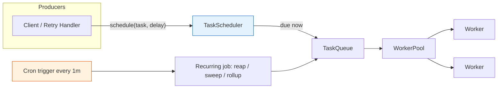
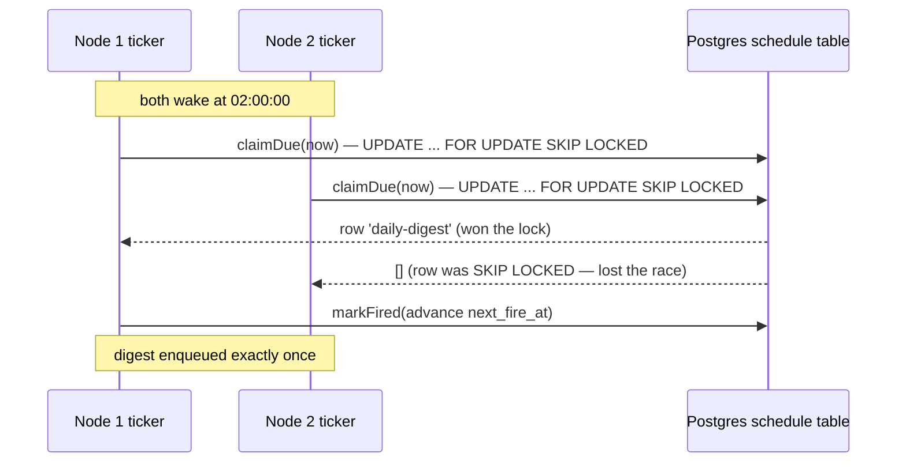
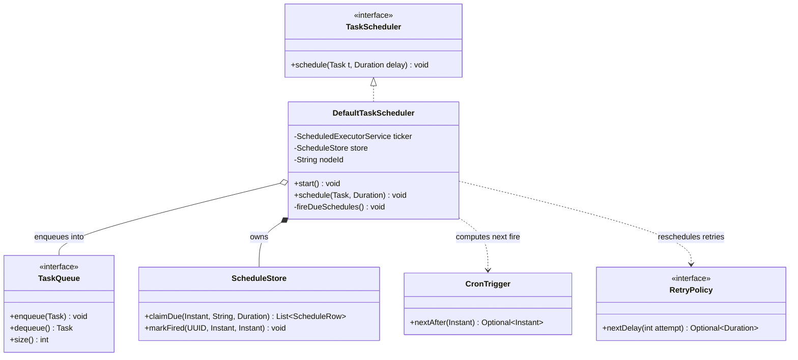

# Scheduling and Cron-like Queues

> Where this fits: our Task Queue platform must run work *later* ("retry in 30s", "send the digest at 02:00") and *repeatedly* ("poll the outbox every 5 seconds", "expire abandoned tasks nightly"). This chapter builds the `TaskScheduler` abstraction, wires it to `ScheduledExecutorService` and cron, and then fixes the hard part: making scheduling correct when *N* identical worker nodes run the same cron and all fire at once.

This chapter is the bridge between the in-memory timing primitives you saw in [delayed queues](./delayed-queues.md) and the distributed-correctness machinery in [leader election](../08-distributed-systems/leader-election.md) and [distributed locks](../08-distributed-systems/distributed-locks.md). Read those for depth; here we focus on *scheduling specifically*.

---

## 1. Why this exists — the real problem it solves

A naive queue answers one question: *what should I do next?* A scheduler answers a harder one: *what should I do next, and when, and how often?*

Three concrete needs drive scheduling in our platform:

1. **Deferred execution.** A `Task` carries `scheduledAt`. A task submitted now with `scheduledAt = now + 10m` must not be dequeued by a `Worker` for ten minutes. The retry path needs the same thing: when a `TaskResult` is `retryable`, the `RetryPolicy` returns a `Duration`, and we must re-enqueue the task *after* that delay, not immediately.
2. **Recurring jobs.** Operational chores: reaping tasks stuck in `RUNNING` past a timeout, sweeping the [dead-letter queue](./dead-letter-queues.md), emitting hourly metric rollups, refilling rate-limiter buckets. These are cron-shaped: "every minute", "every day at 03:00 UTC".
3. **Wall-clock alignment.** "Run at 02:00 in the customer's timezone, every day, except skip Feb 29 sanely, and survive daylight-saving transitions." That is *calendar* scheduling, which `sleep(86_400_000)` cannot express.

### A little history

Unix `cron` (Brian Kernighan-era, 1970s) ran a daemon that woke each minute and compared the wall clock to a table of five-field expressions. It was per-host, fire-and-forget, with no retries and no awareness of other machines. That model — a clock-driven dispatcher reading a schedule table — is still the mental model 50 years later. The Java equivalents (`Timer`, then `ScheduledThreadPoolExecutor`, then Quartz, then Spring's `@Scheduled`) all reproduce it. Every distributed scheduler (Kubernetes `CronJob`, Airflow, Temporal, AWS EventBridge Scheduler) is fundamentally cron plus a story for *exactly-once across a fleet*. That "plus" is the entire difficulty, and most of this chapter.

> **The one-sentence trap:** single-node scheduling is a solved, boring problem; distributed scheduling is an unsolved-by-default problem that *looks* solved until you scale your service to two replicas and every cron job runs twice.



---

## 2. The naive version — `Thread.sleep` in a loop

The first thing everyone writes. Defer a task by sleeping, then enqueue.

```java
// NAIVE: blocks a whole thread per scheduled task. Do not ship this.
class NaiveScheduler {
    private final TaskQueue queue;

    NaiveScheduler(TaskQueue queue) { this.queue = queue; }

    void schedule(Task task, Duration delay) {
        // One thread parked, doing nothing, for the entire delay.
        new Thread(() -> {
            try {
                Thread.sleep(delay.toMillis());
                queue.enqueue(task);
            } catch (InterruptedException e) {
                Thread.currentThread().interrupt();
            }
        }).start();
    }
}
```

For a recurring job, people reach for `java.util.Timer`:

```java
// NAIVE recurring: a single Timer thread, and one bad task kills all jobs.
Timer timer = new Timer("reaper");
timer.scheduleAtFixedRate(new TimerTask() {
    public void run() { reapStuckTasks(); } // if this throws, the Timer thread DIES
}, 0, 60_000);
```

**Why this is bad:**

| Problem | Consequence |
| --- | --- |
| One OS thread parked per deferred task | 10k scheduled tasks = 10k threads ≈ memory exhaustion. Even virtual threads waste a carrier-less park here. |
| `Timer` has a single thread | A slow job delays every other job; one job overrunning its period silently drops fires. |
| `Timer` propagates exceptions | An uncaught exception in any `TimerTask` *kills the timer permanently* and silently. |
| `scheduleAtFixedRate` uses `System.currentTimeMillis()` | An NTP step or daylight-saving jump can fire a burst of catch-up runs or freeze the schedule. |
| No persistence | Process restart loses every pending fire. |
| No cron / calendar support | Cannot express "weekdays at 09:00". |
| No distributed story | Run two replicas and every job fires N times. |

---

## 3. Improved version — `ScheduledExecutorService`

The JDK already solved the "thread per delay" problem in 2004 with `ScheduledThreadPoolExecutor`. It keeps a *bounded* pool and an internal `DelayQueue` ordered by next-fire time, so a handful of threads service thousands of scheduled tasks.

```java
import java.time.Duration;
import java.util.concurrent.*;

class ImprovedScheduler implements TaskScheduler {
    // A small pool: scheduling work is cheap dispatch; real work runs on the WorkerPool.
    private final ScheduledExecutorService exec =
        Executors.newScheduledThreadPool(2, r -> {
            Thread t = new Thread(r, "task-scheduler");
            t.setDaemon(true);
            return t;
        });
    private final TaskQueue queue;

    ImprovedScheduler(TaskQueue queue) { this.queue = queue; }

    @Override
    public void schedule(Task task, Duration delay) {
        exec.schedule(() -> safeEnqueue(task), delay.toNanos(), TimeUnit.NANOSECONDS);
    }

    /** Recurring job with FIXED DELAY: next run starts `period` after the previous run ENDS. */
    void scheduleRecurring(Runnable job, Duration initial, Duration period) {
        exec.scheduleWithFixedDelay(
            () -> guard(job), initial.toNanos(), period.toNanos(), TimeUnit.NANOSECONDS);
    }

    private void safeEnqueue(Task task) {
        try { queue.enqueue(task.withStatus(TaskStatus.PENDING)); }
        catch (Exception e) { /* metrics + log; never let it escape */ }
    }

    /** CRITICAL: swallow throwables so one bad run does not cancel future runs. */
    private void guard(Runnable job) {
        try { job.run(); }
        catch (Throwable t) { /* log + increment a failure counter */ }
    }

    void shutdown() { exec.shutdown(); }
}
```

Two improvements that matter:

- **`scheduleWithFixedDelay` vs `scheduleAtFixedRate`.** Fixed-*rate* tries to fire every `period` regardless of how long each run takes; if a run overruns, you get back-to-back catch-up fires (a thundering herd against your DB). Fixed-*delay* spaces runs by `period` *after completion*, which is what you almost always want for I/O-bound chores. Default to fixed-delay.
- **The `guard` wrapper.** `ScheduledThreadPoolExecutor` silently cancels a recurring task if its `run()` throws. This is the number-one production scheduling bug: a job throws once at 3 a.m., and it never runs again until someone notices a week later. Always wrap.

> See [executor service](../06-concurrency/executor-service.md) for the threading model underneath, and [delayed queues](./delayed-queues.md) for how the internal `DelayQueue` orders fires.

What's still missing: **cron/calendar expressions**, **persistence across restarts**, and **the distributed duplicate-fire problem**. Those define the production version.

---

## 4. Production-quality version — cron parsing, persisted schedules, and a guarded executor

A staff engineer ships scheduling in three layers:

1. **Cron next-fire computation** — turn a cron string + timezone into the next `Instant`.
2. **A persisted schedule store** — recurring schedules live in Postgres so a restart resumes them, and so multiple nodes share one source of truth.
3. **A single-firer guarantee** — only one node actually fires a given occurrence (covered fully in §6).

### 4.1 Cron next-fire

Don't hand-roll a full cron parser; in Spring you get `org.springframework.scheduling.support.CronExpression` for free. But understand the contract: a cron expression is a *predicate over wall-clock fields*, and "schedule" means "find the next `Instant ≥ now` that satisfies it, in a given zone".

```java
import org.springframework.scheduling.support.CronExpression;
import java.time.*;

/** Wraps a Spring CronExpression with an explicit zone. Immutable & thread-safe. */
public record CronTrigger(CronExpression expr, ZoneId zone) {

    public static CronTrigger parse(String cron, String zone) {
        return new CronTrigger(CronExpression.parse(cron), ZoneId.of(zone));
    }

    /** Next fire strictly after `after`, as a UTC Instant. */
    public Optional<Instant> nextAfter(Instant after) {
        ZonedDateTime base = after.atZone(zone);
        ZonedDateTime next = expr.next(base);          // Spring handles DST & calendar rules
        return Optional.ofNullable(next).map(ZonedDateTime::toInstant);
    }
}
```

```java
// "every weekday at 09:30 New York time"
var trigger = CronTrigger.parse("0 30 9 * * MON-FRI", "America/New_York");
Instant fire = trigger.nextAfter(Instant.now()).orElseThrow();
```

> **DST gotcha:** computing the next fire in UTC by adding 24h is *wrong* across a daylight-saving boundary — "every day at 09:00 local" should still be 09:00 local even though the UTC offset shifted by an hour. Always compute in the *target zone* (`ZonedDateTime`), never by integer-adding to an `Instant`. Spring's `CronExpression.next` does this correctly; that is the whole reason to use it.

### 4.2 Persisted recurring schedules

```sql
-- Flyway migration: V7__schedules.sql
CREATE TABLE schedule (
    id            UUID PRIMARY KEY,
    name          TEXT NOT NULL UNIQUE,   -- 'reap-stuck-tasks'
    cron          TEXT NOT NULL,          -- '0 * * * * *'
    zone          TEXT NOT NULL DEFAULT 'UTC',
    task_type     TEXT NOT NULL,          -- maps to a TaskHandler
    payload       JSONB NOT NULL DEFAULT '{}',
    enabled       BOOLEAN NOT NULL DEFAULT TRUE,
    next_fire_at  TIMESTAMPTZ NOT NULL,   -- precomputed; the dispatcher polls on this
    last_fired_at TIMESTAMPTZ,
    locked_until  TIMESTAMPTZ,            -- lease for distributed single-firing (see §6)
    locked_by     TEXT
);
CREATE INDEX idx_schedule_due ON schedule (next_fire_at) WHERE enabled;
```

### 4.3 The production `TaskScheduler`

```java
import java.time.*;
import java.util.concurrent.*;

/**
 * Production TaskScheduler:
 *  - delayed one-shot tasks via ScheduledExecutorService (in-memory, fast path)
 *  - recurring jobs via a 1-Hz tick that claims DUE schedules from Postgres
 *  - distributed single-fire via an atomic UPDATE lease (see fireDueSchedules)
 */
public final class DefaultTaskScheduler implements TaskScheduler, AutoCloseable {

    private final ScheduledExecutorService ticker =
        Executors.newScheduledThreadPool(2, namedDaemon("scheduler"));
    private final TaskQueue queue;
    private final ScheduleStore store;          // JDBC-backed, §4.2
    private final String nodeId;                // e.g. hostname + pid
    private final MetricsCollector metrics;

    public DefaultTaskScheduler(TaskQueue queue, ScheduleStore store,
                                String nodeId, MetricsCollector metrics) {
        this.queue = queue; this.store = store; this.nodeId = nodeId; this.metrics = metrics;
    }

    /** Start the recurring dispatch loop: one tick per second. */
    public void start() {
        ticker.scheduleWithFixedDelay(this::fireDueSchedules, 0, 1, TimeUnit.SECONDS);
    }

    // ---- one-shot deferred tasks (retries, scheduledAt) ----
    @Override
    public void schedule(Task task, Duration delay) {
        long nanos = Math.max(0, delay.toNanos());
        ticker.schedule(() -> safeEnqueue(task), nanos, TimeUnit.NANOSECONDS);
        metrics.increment("scheduler.deferred.submitted");
    }

    // ---- recurring: the distributed-safe tick (detailed in §6) ----
    private void fireDueSchedules() {
        try {
            Instant now = Instant.now();
            for (ScheduleRow s : store.claimDue(now, nodeId, Duration.ofSeconds(30))) {
                Task t = Task.of(s.taskType(), s.payload());           // PENDING, attempts=0
                safeEnqueue(t);
                Instant next = new CronTrigger(s.cron(), s.zone())
                        .nextAfter(now).orElse(null);
                store.markFired(s.id(), now, next);                   // advance next_fire_at
                metrics.increment("scheduler.cron.fired", "name", s.name());
            }
        } catch (Throwable t) {
            metrics.increment("scheduler.tick.error");                // never let the tick die
        }
    }

    private void safeEnqueue(Task task) {
        try { queue.enqueue(task); }
        catch (Throwable t) { metrics.increment("scheduler.enqueue.error"); }
    }

    private static ThreadFactory namedDaemon(String name) {
        var counter = new java.util.concurrent.atomic.AtomicInteger();
        return r -> { var th = new Thread(r, name + "-" + counter.incrementAndGet());
                      th.setDaemon(true); return th; };
    }

    @Override public void close() { ticker.shutdown(); }
}
```

The key shift from §3: **recurring schedules no longer live in the JVM's `ScheduledExecutorService`.** They live in Postgres. The local `ScheduledExecutorService` is reduced to a dumb 1-Hz *ticker* that asks the database "what is due, and may I have it?" This is exactly how Quartz's JDBC job store, Kubernetes `CronJob`, and most production schedulers work — and it is what makes the distributed fix in §6 possible.

---

## 5. Code walkthrough — beginner, intermediate, production

### Beginner: defer one task

```java
import java.util.concurrent.*;
import java.time.Duration;

public class BeginnerSchedule {
    public static void main(String[] args) throws InterruptedException {
        ScheduledExecutorService exec = Executors.newSingleThreadScheduledExecutor();
        System.out.println("submitted at " + System.nanoTime());

        ScheduledFuture<?> f = exec.schedule(
            () -> System.out.println("ran after delay at " + System.nanoTime()),
            2, TimeUnit.SECONDS);

        f.get();              // wait for it (blocks)
        exec.shutdown();
    }
}
```

Takeaway: `schedule(...)` returns a `ScheduledFuture`. You can `cancel(false)` it before it fires — that is how you implement "cancel a scheduled task" without inventing your own bookkeeping.

### Intermediate: a recurring reaper that can't kill itself

```java
import java.util.concurrent.*;
import java.time.*;

/** Marks tasks stuck in RUNNING for > 5 minutes as RETRYING. Runs every minute. */
public class ReaperJob {
    private final TaskRepository repo;
    private final ScheduledExecutorService exec =
        Executors.newSingleThreadScheduledExecutor();

    public ReaperJob(TaskRepository repo) { this.repo = repo; }

    public void start() {
        exec.scheduleWithFixedDelay(this::guardedReap, 0, 1, TimeUnit.MINUTES);
    }

    private void guardedReap() {
        try {
            Instant cutoff = Instant.now().minus(Duration.ofMinutes(5));
            int n = repo.requeueStuckRunning(cutoff);   // UPDATE ... WHERE status='RUNNING'
            if (n > 0) System.out.println("reaped " + n + " stuck tasks");
        } catch (Throwable t) {
            // Swallow: a transient DB blip must not cancel the recurring schedule.
            System.err.println("reaper failed, will retry next minute: " + t);
        }
    }
}
```

The `try/catch(Throwable)` is not defensive paranoia — it is *required* for correctness with `ScheduledExecutorService`, whose recurring tasks self-cancel on the first uncaught throwable.

### Production-inspired: distributed cron with a lease (no duplicates)

```java
import java.time.*;
import java.util.*;

/**
 * The JDBC store that makes cron single-fire across N nodes.
 * The whole correctness argument lives in claimDue's single atomic UPDATE.
 */
public class ScheduleStore {

    private final javax.sql.DataSource ds;
    public ScheduleStore(javax.sql.DataSource ds) { this.ds = ds; }

    /**
     * Atomically claim all schedules whose next_fire_at <= now AND that nobody else
     * currently holds a lease on. Returns only the rows THIS node won.
     *
     * The SELECT ... FOR UPDATE SKIP LOCKED + UPDATE in one transaction means two
     * nodes ticking at the same instant cannot both win the same row.
     */
    public List<ScheduleRow> claimDue(Instant now, String nodeId, Duration lease) {
        String sql = """
            UPDATE schedule
               SET locked_by = ?, locked_until = ?
             WHERE id IN (
                 SELECT id FROM schedule
                  WHERE enabled
                    AND next_fire_at <= ?
                    AND (locked_until IS NULL OR locked_until < ?)
                  ORDER BY next_fire_at
                  FOR UPDATE SKIP LOCKED
                  LIMIT 100
             )
            RETURNING id, name, cron, zone, task_type, payload, next_fire_at
            """;
        Instant leaseUntil = now.plus(lease);
        var rows = new ArrayList<ScheduleRow>();
        try (var c = ds.getConnection();
             var ps = c.prepareStatement(sql)) {
            ps.setString(1, nodeId);
            ps.setObject(2, leaseUntil);
            ps.setObject(3, now);
            ps.setObject(4, now);
            try (var rs = ps.executeQuery()) {
                while (rs.next()) {
                    rows.add(new ScheduleRow(
                        UUID.fromString(rs.getString("id")),
                        rs.getString("name"), rs.getString("cron"),
                        rs.getString("zone"), rs.getString("task_type"),
                        rs.getString("payload"),
                        rs.getObject("next_fire_at", java.time.OffsetDateTime.class).toInstant()));
                }
            }
        } catch (java.sql.SQLException e) {
            throw new RuntimeException("claimDue failed", e);
        }
        return rows;
    }

    /** Advance next_fire_at and release the lease in one shot. */
    public void markFired(UUID id, Instant firedAt, Instant nextFireAt) {
        String sql = """
            UPDATE schedule
               SET last_fired_at = ?, next_fire_at = ?, locked_until = NULL, locked_by = NULL
             WHERE id = ?
            """;
        try (var c = ds.getConnection(); var ps = c.prepareStatement(sql)) {
            ps.setObject(1, firedAt);
            ps.setObject(2, nextFireAt);
            ps.setObject(3, id);
            ps.executeUpdate();
        } catch (java.sql.SQLException e) {
            throw new RuntimeException("markFired failed", e);
        }
    }
}

record ScheduleRow(UUID id, String name, String cron, String zone,
                   String taskType, String payload, Instant nextFireAt) {}
```

`FOR UPDATE SKIP LOCKED` is the same primitive used by the `PostgresTaskQueue` in [task queues](./task-queues.md) — it lets concurrent pollers grab *disjoint* rows without blocking each other. Here it guarantees that of two nodes ticking at the same millisecond, exactly one claims a given schedule row.

---

## 6. The distributed-scheduling problem (the part that actually matters)

Everything up to here works perfectly on one node. Deploy two replicas of your service — which you will, for availability — and every replica runs its own ticker. Naively, both fire the "send daily digest" cron at 02:00. Customers get two emails. The reaper runs twice. Metric rollups double-count.



There are three standard fixes, in increasing order of robustness:

### Fix A — Database lease (shown in §5): "the DB is the lock"

Every node ticks, but firing requires winning an atomic `UPDATE ... FOR UPDATE SKIP LOCKED` plus advancing `next_fire_at`. Because the claim *and* the advance happen in one transaction, a second node that arrives a millisecond later sees `next_fire_at` already pushed forward and finds nothing due. This is the **simplest** correct option and the one I default to when you already have Postgres. It gives **at-most-once dispatch per occurrence** with no extra infrastructure.

> Caveat: it's "single-firer per occurrence," not "exactly-once end-to-end." If a node wins the claim, enqueues the task, then crashes *before* `markFired`, the lease expires (`locked_until`) and another node refires. That's **at-least-once**, which is the right default — pair it with **idempotent** task handlers (see [idempotency](../08-distributed-systems/idempotency.md)) so a duplicate fire is harmless.

### Fix B — Leader election: "only one node schedules"

Elect a single leader; only the leader runs the ticker. The other nodes stay warm and take over if the leader dies. This concentrates *all* scheduling on one node, which is simpler to reason about (no per-row locking) but makes that node a throughput bottleneck and adds election complexity.

```java
/** Skeleton: gate the ticker behind leadership. See ../08-distributed-systems/leader-election.md */
public class LeaderAwareScheduler {
    private final LeaderElector elector;     // ZooKeeper / etcd / Postgres-advisory-lock backed
    private final DefaultTaskScheduler delegate;

    public LeaderAwareScheduler(LeaderElector elector, DefaultTaskScheduler delegate) {
        this.elector = elector; this.delegate = delegate;
    }

    public void start() {
        elector.onBecomeLeader(delegate::start);   // start ticking only when we win leadership
        elector.onLoseLeadership(delegate::close);  // stop immediately when we lose it
        elector.run();
    }
}
```

A cheap, dependency-free leader election in Postgres is an **advisory lock**:

```sql
-- Exactly one connection across the whole fleet can hold this; the rest get FALSE.
SELECT pg_try_advisory_lock(hashtext('scheduler-leader'));
```

The holder is the leader and runs the ticker; it periodically re-checks the lock and releases it on shutdown. See [distributed locks](../08-distributed-systems/distributed-locks.md) and [leader election](../08-distributed-systems/leader-election.md) for the failure modes (lock loss on connection drop, fencing tokens, split-brain).

### Fix C — Externalize scheduling: "let the platform fire"

Hand the timing to infrastructure that already solved single-firing: Kubernetes `CronJob`, AWS EventBridge Scheduler, Temporal, or a managed Quartz cluster. Your service exposes an idempotent endpoint; the platform fires it on schedule. This removes scheduling code from your service entirely at the cost of an operational dependency. Most large systems converge here.

### Comparison

| Approach | Infra needed | Throughput | Failure story | When to use |
| --- | --- | --- | --- | --- |
| DB lease (Fix A) | Postgres (already have it) | High — every node helps | Lease expiry → at-least-once; needs idempotency | **Default.** Phase 2–3 of our project. |
| Leader election (Fix B) | ZK/etcd or PG advisory lock | Lower — one node fires | Leader failover gap (seconds) | When single-firer must be strict-ish and you already run a coordinator. |
| Externalized (Fix C) | K8s / cloud / Temporal | Platform-bounded | Platform's guarantees | Phase 4, large fleets, many teams. |

> **The universal escape hatch:** make every scheduled task *idempotent*. If a duplicate fire is a no-op (because the handler checks "did I already send digest for 2026-06-10?"), then the whole class of duplicate-fire bugs degrades from "customer-visible incident" to "a slightly wasted CPU cycle." Idempotency is cheaper insurance than perfect exactly-once scheduling. This is the single most important takeaway of the chapter.

---

## 7. How this applies to our Task Queue project



Concrete integration points:

- **`Task.scheduledAt` honored.** On submit, if `scheduledAt > now`, `TaskController` calls `scheduler.schedule(task, Duration.between(now, scheduledAt))` instead of enqueuing immediately. The status starts `SCHEDULED` and flips to `PENDING` when the scheduler enqueues it.
- **Retry path.** When a `Worker` gets a `retryable` `TaskResult`, it asks the `RetryPolicy` (`ExponentialBackoffRetryPolicy`) for `nextDelay(attempts)`; if present, it sets status `RETRYING` and calls `scheduler.schedule(task, delay)`. The scheduler is the single choke point for "run later."
- **Recurring chores as schedule rows.** `reap-stuck-tasks` (`0 * * * * *`), `sweep-dlq` (`0 0 * * * *`), `metrics-rollup` (`0 */5 * * * *`) live in the `schedule` table and fire through `fireDueSchedules`, so adding a chore is a SQL insert, not a code deploy.
- **Phase alignment.** Phase 1: in-memory `ScheduledExecutorService` only. Phase 2: schedules persisted in Postgres, the DB-lease single-firer (Fix A). Phase 3: idempotent handlers + metrics on fire latency. Phase 4: optionally externalize to a broker/leader (Fix B/C) as the fleet grows.

---

## 8. Tradeoffs

| Decision | Option A | Option B | Verdict |
| --- | --- | --- | --- |
| Timing primitive | `Timer` | `ScheduledExecutorService` | Always B — pooled, exception-isolated, cancellable. |
| Recurring semantics | `scheduleAtFixedRate` | `scheduleWithFixedDelay` | Default B; A only when you truly need wall-clock cadence and can tolerate catch-up bursts. |
| Schedule storage | In-JVM | Persisted (Postgres) | In-JVM for dev/single-node; persisted the moment you have >1 replica or need restart survival. |
| Distributed single-fire | DB lease | Leader election | DB lease first (you already have Postgres); leader election when strict single-firer matters. |
| Delay precision | `ScheduledExecutorService` (ms) | DelayQueue tick (1s) | `SES` for sub-second/one-shot; 1s DB tick is fine for cron (cron resolution is 1 minute anyway). |
| Correctness model | Exactly-once scheduling | At-least-once + idempotent handlers | Almost always the latter — far cheaper and more robust. |

---

## 9. Common mistakes and pitfalls

- **Letting a recurring task throw.** `ScheduledExecutorService` silently cancels a periodic task on the first uncaught `Throwable`. **Fix:** wrap the body in `try { ... } catch (Throwable t) { log+metric; }`. This is the most common production scheduling outage.
- **Using `scheduleAtFixedRate` for I/O work.** A slow run causes back-to-back catch-up fires (thundering herd on the DB). **Fix:** use `scheduleWithFixedDelay`.
- **Computing next-fire by adding to an `Instant`.** Breaks across DST. **Fix:** compute in the target `ZoneId` via `ZonedDateTime`/`CronExpression`.
- **Assuming one node.** Two replicas → every cron fires twice. **Fix:** DB lease, leader election, or externalized scheduling — and idempotent handlers regardless.
- **Trusting `System.currentTimeMillis()` for elapsed time.** NTP steps move it backward/forward. **Fix:** use `System.nanoTime()` for *durations*; `Instant.now()` only for *wall-clock targets*.
- **No persistence, then a deploy.** A rolling restart silently drops every pending one-shot fire. **Fix:** persist `scheduledAt`/`next_fire_at` and re-derive on startup.
- **Unbounded scheduled backlog.** Scheduling millions of far-future one-shots in `ScheduledThreadPoolExecutor` bloats heap (each is a queued node). **Fix:** keep far-future fires in the DB; only pull near-due ones into the in-JVM scheduler.
- **Lease too short.** If `locked_until` expires before the work finishes/`markFired`, another node refires. **Fix:** size the lease > worst-case fire-handling time, and rely on idempotency for the rare overrun.

---

## 10. Refactoring exercise

**Bad** — `Timer`, fixed-rate, no exception guard, no distributed story:

```java
class DigestScheduler {
    Timer timer = new Timer();
    void start() {
        timer.scheduleAtFixedRate(new TimerTask() {
            public void run() { sendDigests(); } // throws → timer dies forever
        }, 0, 24 * 60 * 60 * 1000L);              // "daily" via 24h millis — DST-broken
    }
}
```

**Improved** — pooled executor, fixed-delay, guarded body, correct calendar:

```java
class DigestScheduler {
    private final ScheduledExecutorService exec = Executors.newScheduledThreadPool(1);
    private final CronTrigger trigger = CronTrigger.parse("0 0 2 * * *", "America/New_York");

    void start() { scheduleNext(); }

    private void scheduleNext() {
        Instant next = trigger.nextAfter(Instant.now()).orElseThrow();
        long delay = Math.max(0, Duration.between(Instant.now(), next).toMillis());
        exec.schedule(() -> { guardedSend(); scheduleNext(); }, delay, TimeUnit.MILLISECONDS);
    }
    private void guardedSend() {
        try { sendDigests(); } catch (Throwable t) { /* log + metric */ }
    }
}
```

**Production** — persisted, distributed-safe, idempotent:

```java
class DigestScheduler {
    private final DefaultTaskScheduler scheduler;   // shared, DB-lease single-firer
    // Register the cron once (idempotent upsert), then let fireDueSchedules() drive it.
    void register(ScheduleStore store) {
        store.upsert(new ScheduleRow(
            UUID.randomUUID(), "daily-digest", "0 0 2 * * *",
            "America/New_York", "send-digest", "{}", /*nextFireAt=*/computeFirst()));
        // The 'send-digest' TaskHandler is idempotent: keyed on (digestDate),
        // so even a duplicate fire from lease-expiry sends at most one email per day.
    }
}
```

Each step removes a class of failure: `Timer`→pool (isolation), fixed-rate→cron (calendar correctness), in-JVM→persisted (restart survival), single-node→DB-lease+idempotent (distributed correctness).

---

## 11. Exercises

### Easy

**E1 (knowledge check).** Why does `scheduleWithFixedDelay` not suffer the "catch-up burst" that `scheduleAtFixedRate` does after a long-running execution?

**E2 (coding).** Write a `ScheduledExecutorService`-based method `everyN(Runnable job, Duration period)` that runs `job` repeatedly and *cannot* be cancelled by an exception thrown inside `job`.

### Medium

**M1 (coding).** Implement `CronTrigger.nextAfter` using `java.time` only (no Spring), supporting the 6-field form `sec min hour dom mon dow` with `*` and single integers (no ranges/steps). Return `Optional<Instant>`.

**M2 (refactoring).** You're given a single-node cron dispatcher that loops `for (Schedule s : all) if (s.dueNow()) fire(s);`. Refactor it to be safe when two replicas run it, using a Postgres lease. Show the SQL and the changed Java.

### Hard

**H1 (design).** Design distributed scheduling for 1,000,000 active schedules across 20 nodes with sub-second one-shot precision and minute-granular cron, surviving node loss with no missed and no duplicate *visible* fires. Sketch the data model, the dispatch loop, and the correctness argument.

**H2 (interview-style).** Your daily-digest cron occasionally sends two emails to some users. Walk through how you'd diagnose it and three independent mitigations, ordered by what you'd ship first.

---

## 12. Solutions

**E1.** `scheduleAtFixedRate` schedules fires at `t0, t0+p, t0+2p, …` against wall time; if one run takes longer than `p`, the executor immediately runs the missed fires back-to-back to "catch up." `scheduleWithFixedDelay` measures `p` from the *end* of each run, so a slow run just pushes the next fire later — no burst.

**E2.**

```java
ScheduledFuture<?> everyN(Runnable job, Duration period) {
    return exec.scheduleWithFixedDelay(() -> {
        try { job.run(); }
        catch (Throwable t) { /* log + metric; swallow so the schedule survives */ }
    }, 0, period.toNanos(), TimeUnit.NANOSECONDS);
}
```

The wrapper guarantees the lambda passed to the executor never throws, so the periodic task is never auto-cancelled.

**M1.**

```java
import java.time.*;
import java.util.*;

record SimpleCron(int sec, int min, int hour, int dom, int mon, int dow, ZoneId zone) {
    // -1 means '*'
    static SimpleCron parse(String s, ZoneId z) {
        String[] f = s.trim().split("\\s+");
        return new SimpleCron(p(f[0]), p(f[1]), p(f[2]), p(f[3]), p(f[4]), p(f[5]), z);
    }
    private static int p(String x) { return x.equals("*") ? -1 : Integer.parseInt(x); }

    Optional<Instant> nextAfter(Instant after) {
        ZonedDateTime t = after.atZone(zone).withNano(0).plusSeconds(1);
        // Bounded search: at most 4 years of seconds is overkill; cap iterations.
        for (int i = 0; i < 4 * 366 * 24 * 60 * 60; i++) {
            if (matches(t)) return Optional.of(t.toInstant());
            t = t.plusSeconds(1);
        }
        return Optional.empty();
    }
    private boolean matches(ZonedDateTime t) {
        return ok(sec, t.getSecond()) && ok(min, t.getMinute()) && ok(hour, t.getHour())
            && ok(dom, t.getDayOfMonth()) && ok(mon, t.getMonthValue())
            && ok(dow, t.getDayOfWeek().getValue() % 7); // 0=Sun
    }
    private static boolean ok(int field, int actual) { return field == -1 || field == actual; }
}
```

> Note the explicit iteration cap so an unsatisfiable expression terminates. Production parsers compute the next match field-by-field instead of second-stepping, but this is correct and clear. Using `ZonedDateTime` makes it DST-correct for free.

**M2.** Replace the in-memory loop with an atomic claim. The whole fix is that `dueNow()` and "advance the schedule" must be one atomic DB operation:

```sql
UPDATE schedule
   SET next_fire_at = :next, last_fired_at = :now
 WHERE id IN (
     SELECT id FROM schedule
      WHERE enabled AND next_fire_at <= :now
      FOR UPDATE SKIP LOCKED
      LIMIT 100)
RETURNING id, task_type, payload;
```

```java
// Only the rows THIS node's UPDATE returned get fired. The advance is part of the
// same statement, so a second replica sees next_fire_at already moved forward.
for (ScheduleRow s : store.claimAndAdvance(now)) {
    queue.enqueue(Task.of(s.taskType(), s.payload()));
}
```

Because the row's `next_fire_at` is advanced inside the claim, the second replica's identical query returns nothing for that row — no duplicate fire. Pair with idempotent handlers to cover the crash-after-claim, before-enqueue window.

**H1.** *Data model:* a `schedule` table partitioned/indexed on `next_fire_at`, holding only recurring cron entries (1M rows is trivial for Postgres). One-shot deferred tasks go in the `task` table with a `scheduledAt` column and a partial index `WHERE status='SCHEDULED'`.

*Dispatch loop:* every node ticks at ~200ms. Each tick runs the `claimDue` lease query (`FOR UPDATE SKIP LOCKED LIMIT 500`) for both tables. Because `SKIP LOCKED` hands disjoint row sets to concurrent nodes, all 20 nodes share the firing load with no coordination beyond the DB — this is *partitioned* dispatch, not leader-based, so it scales linearly. Sub-second precision for one-shots comes from also loading near-due (`scheduledAt < now + 2s`) tasks into the local `ScheduledExecutorService` for fine-grained firing; cron stays minute-granular off the tick.

*Correctness:* (a) *no duplicate visible fire* — the claim advances `next_fire_at`/flips status atomically, so at most one node wins each occurrence; lease-expiry refires are absorbed by idempotent handlers. (b) *no missed fire* — `next_fire_at` is durable; a node dying mid-tick leaves unclaimed rows that the next tick picks up; a node dying after claim but before fire lets the lease expire and another node refires. The system is **at-least-once with idempotency**, which is the only thing that survives node loss without a consensus protocol.

**H2.** *Diagnose:* (1) Confirm it correlates with replica count / a recent scale-up. (2) Check whether the scheduler is in-JVM per node (the classic two-replicas-two-fires bug) vs. DB-leased. (3) Add a unique fire-id log per occurrence and grep for the same `(schedule, occurrence)` firing on two `nodeId`s. *Mitigations, in ship order:* (1) **Make the handler idempotent** — key digests on `(userId, date)` with a unique constraint or an "already sent" check; this stops the customer-visible symptom *today* regardless of root cause. (2) **Add the DB lease** (`FOR UPDATE SKIP LOCKED` + advance `next_fire_at`) so only one node fires each occurrence. (3) **Externalize** to a single platform cron (K8s `CronJob` / EventBridge) hitting an idempotent endpoint, removing per-node tickers entirely. Ship #1 first because it's the cheapest and converts an incident into a non-event.

---

## 13. Interview questions and takeaways

1. **`Timer` vs `ScheduledExecutorService` — when never to use `Timer`?** Always avoid `Timer`: single thread (one slow/blocked task starves the rest), and an uncaught exception kills the timer permanently. `ScheduledThreadPoolExecutor` is pooled and isolates failures per submission. The only reason `Timer` survives is legacy code.

2. **`scheduleAtFixedRate` vs `scheduleWithFixedDelay`?** Fixed-*rate* targets absolute fire times and runs catch-up bursts after overruns; fixed-*delay* spaces runs by the period *after completion*. Default to fixed-delay for I/O chores; fixed-rate only for steady-cadence sampling that tolerates bursts.

3. **How do you stop a cron from firing twice when you scale to two replicas?** DB lease (`FOR UPDATE SKIP LOCKED` + atomically advance `next_fire_at`), or leader election so only one node ticks, or externalize to a platform scheduler. Crucially, also make handlers idempotent so the residual at-least-once duplicates are harmless.

4. **Why is "exactly-once scheduling" essentially impossible, and what do you do instead?** A node can crash between firing and recording that it fired; without distributed consensus you can't atomically "do the side effect and mark it done." So aim for at-least-once dispatch + idempotent handlers, which is cheaper and strictly more robust under partitions.

5. **How do you handle daylight-saving for "every day at 02:00 local"?** Compute the next fire in the *target* `ZoneId` using `ZonedDateTime`/`CronExpression`, never by adding 24h to a UTC `Instant`. Be aware 02:00 may not exist (spring-forward) or occur twice (fall-back); a good cron library resolves these deterministically.

6. **Where should schedules live in a horizontally scaled service?** In durable shared storage (Postgres), with the JVM scheduler reduced to a thin ticker that claims due rows. This survives restarts and enables the DB-lease single-firer.

7. **A periodic task stopped running silently — likely cause?** It threw an uncaught exception once; `ScheduledThreadPoolExecutor` cancels periodic tasks on the first `Throwable`. Wrap the body and alert on consecutive failures.

8. **`System.currentTimeMillis()` vs `System.nanoTime()` for scheduling?** Use `nanoTime` for measuring *durations* (monotonic, immune to NTP steps); use `Instant.now()`/wall clock only for *targeting* a calendar time. Mixing them causes drift or burst-fires on clock adjustments.

---

## 14. Production considerations

- **What breaks at scale.** A single in-JVM scheduler is a throughput and SPOF risk; partition dispatch across nodes via `SKIP LOCKED` (no leader) or accept a leader bottleneck. Millions of far-future one-shots will OOM a `ScheduledThreadPoolExecutor` — keep them in the DB and hydrate only near-due ones.
- **Monitoring.** Emit, via `MetricsCollector`/Micrometer: `scheduler.cron.fired{name}` (counter), `scheduler.fire.latency` (timer: scheduled-time minus actual-fire-time — your *skew*), `scheduler.tick.error`, and a per-schedule **last-success gauge** so you can alert "job X hasn't fired in 2× its period." Alert on rising fire-latency (the scheduler is falling behind) and on any tick error.
- **Clock and time.** Run NTP everywhere; firing logic that compares two nodes' clocks is fragile. Prefer the DB clock (`now()` in SQL) as the single time authority for "is it due?" so nodes don't disagree.
- **Graceful shutdown.** On SIGTERM, stop the ticker first, let in-flight fires finish (bounded by the lease), and release any held leases/advisory locks so failover is instant rather than waiting for lease expiry.
- **Backfill and pausing.** Provide `enabled=false` to pause a schedule without deleting it, and decide policy for missed fires during downtime: skip (don't backfill — usually right for chores) vs. run-once-on-recovery (right for "must run daily" jobs). Make it explicit per schedule.
- **Idempotency everywhere.** Treat it as a hard requirement for any scheduled `TaskHandler`. It is the load-bearing assumption that lets the whole at-least-once design be safe.

---

## What We Can Improve In Our Project Using This Concept

- Replace ad-hoc `Thread.sleep` retry deferral with the central `DefaultTaskScheduler`, so *all* "run later" flows (retries, `scheduledAt`, cron chores) go through one audited, metered choke point.
- Move recurring chores (reaper, DLQ sweep, metrics rollup) out of code and into the `schedule` table, making them DB-driven, pausable, and consistent across replicas.
- Add the DB-lease single-firer so the platform is correct the moment we run more than one API replica — closing the duplicate-fire gap before it becomes a customer-visible bug.

## Project Refactoring Task

1. Add the `schedule` table (`V7__schedules.sql`) and `ScheduleStore` with `claimDue`/`markFired`.
2. Implement `CronTrigger` (Spring `CronExpression`) and `DefaultTaskScheduler` with the 1-Hz guarded ticker.
3. Route the retry path and `scheduledAt` through `scheduler.schedule(task, delay)`; set status `SCHEDULED`/`RETRYING` accordingly.
4. Seed `reap-stuck-tasks`, `sweep-dlq`, `metrics-rollup` as schedule rows; make their handlers idempotent.
5. Add Micrometer metrics: `scheduler.cron.fired`, `scheduler.fire.latency`, last-success gauges; wire alerts.

## Git Commit For This Chapter

```text
feat(scheduler): add cron-capable TaskScheduler with DB-lease single-firing

- add schedule table + Flyway V7__schedules.sql (next_fire_at, lease cols)
- add CronTrigger (Spring CronExpression, zone-aware, DST-correct)
- add DefaultTaskScheduler: guarded 1-Hz ticker + ScheduledExecutorService one-shots
- add ScheduleStore.claimDue (FOR UPDATE SKIP LOCKED) + markFired for distributed single-fire
- route retries and Task.scheduledAt through the scheduler
- seed reaper/dlq-sweep/metrics-rollup schedules; make handlers idempotent
- add Micrometer fire-latency + last-success metrics

Files: db/migration/V7__schedules.sql, scheduler/CronTrigger.java,
scheduler/DefaultTaskScheduler.java, scheduler/ScheduleStore.java,
scheduler/ScheduleRow.java, worker/Worker.java (retry path),
api/TaskController.java (scheduledAt path)
```

## Architecture Impact

Scheduling becomes a first-class layer between producers and the `TaskQueue`, with Postgres as the durable, authoritative schedule store and time source. The DB-lease pattern lets every node share dispatch load without a coordinator (linear scaling), while keeping at-most-once *per occurrence* and at-least-once *end-to-end* — bounded safely by idempotent handlers. This unblocks horizontal scaling (Phase 4) without introducing a scheduling SPOF, and isolates the one place where wall-clock correctness (DST, NTP) must be handled.

## Interview Takeaways

- Single-node scheduling is `ScheduledExecutorService` + fixed-delay + a `try/catch(Throwable)` guard; the rest is detail.
- Distributed scheduling's only real problem is duplicate fires; solve with a DB lease, leader election, or externalized cron — and *always* idempotent handlers.
- "Exactly-once scheduling" is a red flag; the correct framing is at-least-once dispatch plus idempotency.
- Calendar correctness (DST, zones) requires `ZonedDateTime`/`CronExpression`, never integer arithmetic on `Instant`.
- Persist schedules; reduce the in-JVM scheduler to a thin ticker over durable rows.
