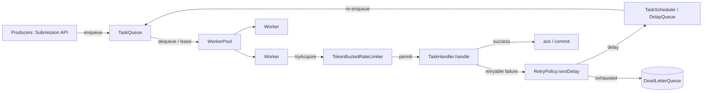
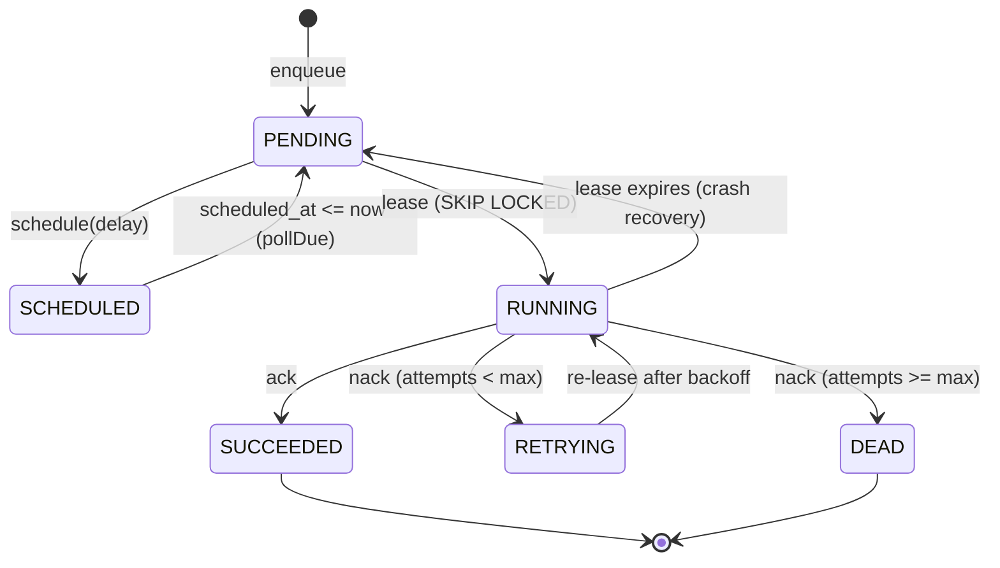

# Queues and Messaging: Solutions

> Where this fits: this is the **module-level answer key** for `07-queues-and-messaging/`. Every numbered exercise from the sibling [exercises.md](./exercises.md) is solved here with **complete, compilable Java 21** (plus the **SQL** for the Postgres-backed queue), the reasoning and tradeoffs behind each design, and the **common wrong approaches** people ship instead. All code targets the canonical Task Queue model so the solutions drop straight into Phase 1–4 of the project.

---

## How to read this file

Each solution restates the exercise prompt (so this file stands alone), then gives:

- **Solution** — full code or SQL, compilable / runnable as written.
- **Why it's correct** — the invariant it maintains and the failure mode it prevents (lost message, double-delivery, head-of-line blocking, starvation, busy-poll, thundering herd, poison message).
- **Tradeoffs** — what we paid for correctness.
- **Common wrong approaches** — the buggy versions that *look* right and how to spot them.

Numbering matches [exercises.md](./exercises.md): **E#** = Easy, **M#** = Medium, **H#** = Hard.

The chapters these draw on, for reference:
[producer-consumer.md](./producer-consumer.md) ·
[message-queues.md](./message-queues.md) ·
[task-queues.md](./task-queues.md) ·
[priority-queues.md](./priority-queues.md) ·
[delayed-queues.md](./delayed-queues.md) ·
[scheduling-queues.md](./scheduling-queues.md) ·
[dead-letter-queues.md](./dead-letter-queues.md) ·
[broker-comparison.md](./broker-comparison.md).

### The shared domain model used throughout

Every solution compiles against this canonical slice. It is shown once here; later solutions assume it is on the classpath.

```java
// ----- canonical model (com.taskqueue.core) -----
import java.time.Duration;
import java.time.Instant;
import java.util.List;
import java.util.Optional;

enum TaskStatus { PENDING, SCHEDULED, RUNNING, SUCCEEDED, FAILED, RETRYING, DEAD }

record Task(String id, String type, String payload, TaskStatus status,
            int attempts, int maxAttempts,
            Instant createdAt, Instant scheduledAt, int priority) {

    // records are immutable: every "mutation" returns a fresh Task. This is the
    // cheapest concurrency primitive there is — shared reads need zero locks.
    Task withStatus(TaskStatus s)  { return new Task(id, type, payload, s, attempts, maxAttempts, createdAt, scheduledAt, priority); }
    Task incrementAttempt()        { return new Task(id, type, payload, status, attempts + 1, maxAttempts, createdAt, scheduledAt, priority); }
    Task scheduledFor(Instant when){ return new Task(id, type, payload, status, attempts, maxAttempts, createdAt, when, priority); }
}

record TaskResult(boolean success, String message, boolean retryable) {
    static TaskResult ok()              { return new TaskResult(true,  "ok", false); }
    static TaskResult retry(String why) { return new TaskResult(false, why, true);  }
    static TaskResult fail(String why)  { return new TaskResult(false, why, false); }
}

@FunctionalInterface
interface TaskHandler { TaskResult handle(Task task) throws Exception; }

interface TaskQueue {
    void enqueue(Task t);
    Task dequeue() throws InterruptedException;
    int  size();
}

interface RetryPolicy { Optional<Duration> nextDelay(int attempt); }
interface DeadLetterQueue { void send(Task t, String reason); }
interface RateLimiter { boolean tryAcquire(); }
interface TaskScheduler { void schedule(Task t, Duration delay); }
interface TaskRepository {
    void save(Task t);
    Optional<Task> findById(String id);
    List<Task> pollDue(int n);
}
```

> Why a `record` for `Task`? Immutability is the cheapest concurrency primitive there is. An immutable object can be shared across threads with **zero synchronization** — there is no write to race on. See [../03-java-memory-model/immutable-objects.md](../03-java-memory-model/immutable-objects.md).

Here is the architecture the exercises build toward — keep it in view:



---

# Easy

## E1 — One producer, one consumer over a `BlockingQueue`

**Exercise.** Implement the smallest correct producer/consumer: one producer enqueues 100 `Task`s, one consumer drains them and prints each id. The consumer must stop cleanly when the producer is done — no busy-wait, no `null` sentinels racing with real work.

### Solution

```java
import java.util.concurrent.*;
import java.time.Instant;

public class E1 {
    // A poison pill: a sentinel Task that means "no more work". Reference-compared.
    private static final Task POISON =
        new Task("__poison__", "__stop__", "{}", TaskStatus.DEAD, 0, 0, Instant.EPOCH, Instant.EPOCH, 0);

    public static void main(String[] args) throws InterruptedException {
        BlockingQueue<Task> queue = new ArrayBlockingQueue<>(16); // bounded => backpressure

        Thread producer = new Thread(() -> {
            try {
                for (int i = 0; i < 100; i++) {
                    Task t = new Task("t-" + i, "email", "{}", TaskStatus.PENDING,
                                      0, 3, Instant.now(), Instant.now(), 5);
                    queue.put(t);            // blocks when full — backpressure, not OOM
                }
                queue.put(POISON);           // signal end-of-stream
            } catch (InterruptedException e) {
                Thread.currentThread().interrupt();
            }
        }, "producer");

        Thread consumer = new Thread(() -> {
            try {
                while (true) {
                    Task t = queue.take();   // blocks when empty — no busy-wait
                    if (t == POISON) break;  // clean termination
                    System.out.println("processed " + t.id());
                }
            } catch (InterruptedException e) {
                Thread.currentThread().interrupt();
            }
        }, "consumer");

        consumer.start();
        producer.start();
        producer.join();
        consumer.join();
    }
}
```

### Why it's correct

- `put`/`take` block instead of spinning — the OS parks the thread, so an idle consumer uses 0% CPU. This is the whole point of `BlockingQueue` over a hand-rolled `synchronized` list (see [../06-concurrency/blocking-queue.md](../06-concurrency/blocking-queue.md)).
- The **bound** (16) gives backpressure: a fast producer cannot outrun a slow consumer into an `OutOfMemoryError`.
- The poison pill is enqueued **through the same queue**, so it is ordered *after* all real work. A separate `volatile boolean done` flag would race: the consumer could see `done == true` while items still sit in the queue.

### Tradeoffs

One poison pill stops exactly one consumer. With N consumers you must enqueue N pills (or use a count + broadcast). We do that in E2.

### Common wrong approaches

- **`while (!queue.isEmpty()) take()`** — `isEmpty()` is a snapshot; between the check and the `take()` the queue can drain, and `take()` blocks forever. Never gate a blocking call on a size check.
- **Unbounded `LinkedBlockingQueue`** — removes backpressure; a burst pins the heap.
- **A `volatile boolean done` instead of a pill** — races with in-flight items as described.

---

## E2 — A `WorkerPool` of N consumers with graceful shutdown

**Exercise.** Wrap an `ExecutorService` so that `start()` launches N `Worker`s pulling from a `TaskQueue`, and `shutdown()` stops them cleanly — finishing in-flight tasks, refusing new dequeues, draining within a timeout.

### Solution

```java
import java.util.concurrent.*;
import java.util.*;
import java.time.Instant;

final class Worker implements Runnable {
    private final TaskQueue queue;
    private final Map<String, TaskHandler> handlers;
    Worker(TaskQueue queue, Map<String, TaskHandler> handlers) {
        this.queue = queue; this.handlers = handlers;
    }
    @Override public void run() {
        while (!Thread.currentThread().isInterrupted()) {
            Task t;
            try {
                t = queue.dequeue();                  // blocks; interruptible
            } catch (InterruptedException e) {
                Thread.currentThread().interrupt();   // restore flag, exit loop
                return;
            }
            TaskHandler h = handlers.get(t.type());
            if (h == null) { System.err.println("no handler for " + t.type()); continue; }
            try {
                h.handle(t);                          // outcome handling expanded in M-series
            } catch (Exception e) {
                System.err.println("handler threw for " + t.id() + ": " + e);
            }
        }
    }
}

final class WorkerPool {
    private final ExecutorService exec;
    private final int size;
    private final TaskQueue queue;
    private final Map<String, TaskHandler> handlers;

    WorkerPool(int size, TaskQueue queue, Map<String, TaskHandler> handlers) {
        this.size = size; this.queue = queue; this.handlers = handlers;
        this.exec = Executors.newFixedThreadPool(size, r -> {
            Thread th = new Thread(r); th.setName("worker"); th.setDaemon(false); return th;
        });
    }

    void start() { for (int i = 0; i < size; i++) exec.submit(new Worker(queue, handlers)); }

    void shutdown() {
        exec.shutdownNow();                            // interrupt blocked dequeue() calls
        try {
            if (!exec.awaitTermination(30, TimeUnit.SECONDS))
                System.err.println("workers did not drain in 30s");
        } catch (InterruptedException e) {
            Thread.currentThread().interrupt();
        }
    }
}
```

### Why it's correct

- `dequeue()` is **interruptible** (it bottoms out in `BlockingQueue.take()`), so `shutdownNow()` actually unblocks idle workers instead of hanging forever.
- Restoring the interrupt flag (`Thread.currentThread().interrupt()`) before returning is the contract — swallowing it silently hides the shutdown signal from any outer code.
- A handler that **throws** does not kill the worker thread; we catch, log, and keep pulling. One poison task must not take down a worker.

### Tradeoffs

`shutdownNow()` interrupts in-flight handlers too. If your handlers must finish, call `shutdown()` (no `Now`) first to stop accepting, then `awaitTermination`, then escalate to `shutdownNow()`. The two-phase drain is shown in [../06-concurrency/executor-service.md](../06-concurrency/executor-service.md).

### Common wrong approaches

- **Catching `InterruptedException` and continuing the loop** — the worker never exits; `awaitTermination` times out.
- **Letting a handler exception propagate** — the worker `Runnable` dies, the pool silently shrinks, throughput quietly degrades until the queue backs up.

---

## E3 — Queue vs Topic (point-to-point vs publish-subscribe)

**Exercise.** Demonstrate the difference in plain Java: a **queue** delivers each message to exactly one of N consumers (competing consumers); a **topic** fans the same message out to *every* subscriber.

### Solution

```java
import java.util.*;
import java.util.concurrent.*;
import java.util.function.Consumer;

public class E3 {
    public static void main(String[] args) throws InterruptedException {
        // ---- Queue: one BlockingQueue, N consumers compete; each Task delivered ONCE ----
        BlockingQueue<String> q = new LinkedBlockingQueue<>();
        ExecutorService consumers = Executors.newFixedThreadPool(3);
        for (int c = 0; c < 3; c++) {
            int id = c;
            consumers.submit(() -> {
                try { while (true) System.out.println("consumer " + id + " got " + q.take()); }
                catch (InterruptedException e) { Thread.currentThread().interrupt(); }
            });
        }
        for (int i = 0; i < 6; i++) q.put("task-" + i);   // 6 tasks split across 3 consumers

        // ---- Topic: a list of subscribers, each gets EVERY message ----
        List<Consumer<String>> subscribers = new CopyOnWriteArrayList<>();
        subscribers.add(m -> System.out.println("audit-log saw " + m));
        subscribers.add(m -> System.out.println("metrics saw " + m));
        subscribers.add(m -> System.out.println("email-alert saw " + m));
        String event = "task-42-SUCCEEDED";
        subscribers.forEach(s -> s.accept(event));        // fan-out: all 3 see it

        Thread.sleep(200);
        consumers.shutdownNow();
    }
}
```

### Why it's correct

- The queue is **competing consumers**: `take()` removes the element, so exactly one thread wins each message. That is the work-distribution pattern our `WorkerPool` relies on.
- The topic is **fan-out**: publishing iterates *all* subscribers. This is the model for our Phase 4 `EventBus` (every listener — metrics, audit, alerting — sees every `TaskEvent`).
- `CopyOnWriteArrayList` lets subscribers register while publishing iterates, without `ConcurrentModificationException`.

### Tradeoffs

A queue gives you horizontal scale-out of *work* (add consumers, throughput rises). A topic gives you decoupled *notification* (add a subscriber without touching the publisher) but no load-sharing — every subscriber pays the full volume. Real brokers (Kafka consumer groups, RabbitMQ exchanges) blend both; see [broker-comparison.md](./broker-comparison.md).

### Common wrong approaches

- Using a topic where you wanted work distribution — every consumer does the same job N times.
- Using a plain `ArrayList` of subscribers and mutating it during fan-out — `ConcurrentModificationException` under registration churn.

---

## E4 — At-least-once vs at-most-once (ack placement)

**Exercise.** Given a lease-based queue (`dequeue` hands you a task, `ack(t)` commits, `nack(t)` returns it), show the two delivery semantics and explain which line of code chooses between them.

### Solution

```java
interface LeasingQueue {
    Task dequeue() throws InterruptedException;
    void ack(Task t);                 // mark done, remove from queue
    void nack(Task t);                // return to queue for redelivery
}

class DeliverySemantics {

    // AT-MOST-ONCE: ack BEFORE doing the work. If the process crashes mid-work,
    // the task is already gone — it is LOST but never duplicated.
    static void atMostOnce(LeasingQueue q, TaskHandler h) throws Exception {
        Task t = q.dequeue();
        q.ack(t);                     // <-- the choosing line
        h.handle(t);                  // crash here => task lost forever
    }

    // AT-LEAST-ONCE: ack AFTER the work succeeds. A crash mid-work leaves the
    // task un-acked; its lease expires and it is REDELIVERED — possibly duplicated.
    static void atLeastOnce(LeasingQueue q, TaskHandler h) throws Exception {
        Task t = q.dequeue();
        try {
            TaskResult r = h.handle(t);
            if (r.success()) q.ack(t); // <-- the choosing line
            else             q.nack(t);
        } catch (Exception e) {
            q.nack(t);                 // crash/throw => redelivered later
        }
    }
}
```

### Why it's correct

The **only** difference is whether `ack` runs before or after `handle`. There is no third option that gives exactly-once *delivery* — exactly-once *effect* is achieved by combining at-least-once delivery with **idempotent** handlers (E-series sets this up; the full treatment is in [../08-distributed-systems/idempotency.md](../08-distributed-systems/idempotency.md)).

### Tradeoffs

| Semantics | On crash | Use when |
|---|---|---|
| At-most-once | task lost | loss is acceptable (best-effort metrics ping) |
| At-least-once | task duplicated | loss is unacceptable (charge a card, send invoice) — and the handler is idempotent |

Almost every real task queue chooses **at-least-once + idempotent handlers**. Losing a payment is worse than occasionally retrying one.

### Common wrong approaches

- Acking before the work "to be safe" — you silently drop tasks on every deploy/restart.
- Claiming "exactly-once" because the broker advertises it — broker exactly-once covers *delivery to the log*, not *your side effects*. You still need idempotency.

---

## E5 — A delayed task with `DelayQueue`

**Exercise.** Wrap a `Task` so it becomes dequeuable only after `scheduledAt`. Enqueue one task delayed 2 seconds and one delayed 0.5 seconds; the consumer must see the 0.5s one first.

### Solution

```java
import java.util.concurrent.*;
import java.time.*;

final class DelayedTask implements Delayed {
    final Task task;
    private final long readyAtNanos;        // System.nanoTime() basis — monotonic
    DelayedTask(Task task) {
        this.task = task;
        long delayMs = Duration.between(Instant.now(), task.scheduledAt()).toMillis();
        this.readyAtNanos = System.nanoTime() + Math.max(0, delayMs) * 1_000_000L;
    }
    @Override public long getDelay(TimeUnit unit) {
        return unit.convert(readyAtNanos - System.nanoTime(), TimeUnit.NANOSECONDS);
    }
    @Override public int compareTo(Delayed o) {
        return Long.compare(getDelay(TimeUnit.NANOSECONDS), o.getDelay(TimeUnit.NANOSECONDS));
    }
}

public class E5 {
    public static void main(String[] args) throws InterruptedException {
        DelayQueue<DelayedTask> dq = new DelayQueue<>();
        Instant now = Instant.now();
        Task slow = new Task("slow", "email", "{}", TaskStatus.SCHEDULED, 0, 3, now, now.plusSeconds(2), 0);
        Task fast = new Task("fast", "email", "{}", TaskStatus.SCHEDULED, 0, 3, now, now.plusMillis(500), 0);
        dq.put(new DelayedTask(slow));
        dq.put(new DelayedTask(fast));

        System.out.println(dq.take().task.id());  // "fast" — ready first
        System.out.println(dq.take().task.id());  // "slow"
    }
}
```

### Why it's correct

- `DelayQueue.take()` returns the head **only when its delay has elapsed**, and the internal heap keeps the soonest-ready element at the head — so ordering is by ready-time, not insert-time.
- We base the deadline on `System.nanoTime()` (monotonic), not `System.currentTimeMillis()` (wall clock). Wall-clock can jump backward (NTP correction) and freeze a delayed task. See [delayed-queues.md](./delayed-queues.md).

### Tradeoffs

`DelayQueue` is **in-memory**: a restart loses every pending delay. For durable delays (survive a deploy) you persist `scheduled_at` and poll the DB — solved in M3 and the Postgres queue below.

### Common wrong approaches

- Returning a fixed value from `getDelay` — the element is never ready or always ready.
- An inconsistent `compareTo` (not aligned with `getDelay`) — corrupts the heap invariant; tasks come out in the wrong order.

---

# Medium

## M1 — A priority `BlockingQueue` that prevents starvation (aging)

**Exercise.** `Task.priority` should bias dequeue order (higher first), but a flood of high-priority tasks must not starve low-priority ones forever. Implement an **aging** priority queue: a task's effective priority rises with how long it has waited.

### Solution

```java
import java.util.concurrent.*;
import java.time.*;

final class AgingPriorityQueue {
    // effective priority = basePriority + floor(waitedSeconds / agePerStep)
    private final long agePerStepSeconds;
    private final PriorityBlockingQueue<Entry> pq;

    private final class Entry {
        final Task task; final Instant enqueuedAt;
        Entry(Task t) { this.task = t; this.enqueuedAt = Instant.now(); }
        long effectivePriority() {
            long waited = Duration.between(enqueuedAt, Instant.now()).toSeconds();
            return task.priority() + waited / agePerStepSeconds;
        }
    }

    AgingPriorityQueue(long agePerStepSeconds) {
        this.agePerStepSeconds = Math.max(1, agePerStepSeconds);
        this.pq = new PriorityBlockingQueue<>(64,
            // higher effective priority first; tie-break by FIFO (older enqueuedAt first)
            (a, b) -> {
                int byPrio = Long.compare(b.effectivePriority(), a.effectivePriority());
                return byPrio != 0 ? byPrio : a.enqueuedAt.compareTo(b.enqueuedAt);
            });
    }

    void enqueue(Task t) { pq.put(new Entry(t)); }
    Task dequeue() throws InterruptedException { return pq.take().task; }
    int size() { return pq.size(); }
}
```

### Why it's correct

- A low-priority task that waits long enough eventually out-scores fresh high-priority arrivals, so it **cannot be starved indefinitely** — its wait time is bounded by `agePerStepSeconds * (maxPriorityGap)`.
- We keep the *base* priority immutable and compute the effective value on demand, so we never mutate heap entries in place (which would corrupt the heap).

### Tradeoffs

`PriorityBlockingQueue` is **unbounded** — it has no backpressure. In production, front it with a `Semaphore` (bounded admission) or cap `size()` at the API. Also, `compareTo` reading the clock means ordering is *eventually* consistent, not instantaneous — acceptable, since aging is about fairness over seconds, not microseconds. The full multi-level alternative is in [priority-queues.md](./priority-queues.md).

### Common wrong approaches

- A plain `PriorityBlockingQueue` ordered by static priority — guaranteed starvation under sustained high-priority load. This is the single most common production incident with priority queues.
- Mutating an entry's priority field after insertion — `PriorityBlockingQueue` does **not** re-heapify on field change; the element sits in the wrong heap position.

---

## M2 — At-least-once `Worker` with retry, backoff, and DLQ routing

**Exercise.** Wire the full failure path into a `Worker`: on a *retryable* failure, compute the next delay via `ExponentialBackoffRetryPolicy` and re-schedule; on exhausting `maxAttempts` (or a non-retryable failure), route to the `DeadLetterQueue`.

### Solution

```java
import java.time.Duration;
import java.util.*;
import java.util.concurrent.ThreadLocalRandom;

final class ExponentialBackoffRetryPolicy implements RetryPolicy {
    private final Duration base, cap;
    private final int maxAttempts;
    ExponentialBackoffRetryPolicy(Duration base, Duration cap, int maxAttempts) {
        this.base = base; this.cap = cap; this.maxAttempts = maxAttempts;
    }
    @Override public Optional<Duration> nextDelay(int attempt) {
        if (attempt >= maxAttempts) return Optional.empty();              // exhausted
        long exp = (long) (base.toMillis() * Math.pow(2, attempt));       // 2^attempt growth
        long capped = Math.min(exp, cap.toMillis());
        long jittered = ThreadLocalRandom.current().nextLong(capped + 1); // full jitter
        return Optional.of(Duration.ofMillis(jittered));
    }
}

final class RetryingWorker implements Runnable {
    private final TaskQueue queue;
    private final Map<String, TaskHandler> handlers;
    private final RetryPolicy policy;
    private final TaskScheduler scheduler;   // re-enqueues after a delay
    private final DeadLetterQueue dlq;

    RetryingWorker(TaskQueue queue, Map<String, TaskHandler> handlers,
                   RetryPolicy policy, TaskScheduler scheduler, DeadLetterQueue dlq) {
        this.queue = queue; this.handlers = handlers;
        this.policy = policy; this.scheduler = scheduler; this.dlq = dlq;
    }

    @Override public void run() {
        while (!Thread.currentThread().isInterrupted()) {
            Task t;
            try { t = queue.dequeue(); }
            catch (InterruptedException e) { Thread.currentThread().interrupt(); return; }
            process(t);
        }
    }

    private void process(Task t) {
        TaskHandler h = handlers.get(t.type());
        if (h == null) { dlq.send(t, "no handler for type=" + t.type()); return; }

        TaskResult result;
        try {
            result = h.handle(t.withStatus(TaskStatus.RUNNING));
        } catch (Exception e) {
            result = TaskResult.retry("threw: " + e.getClass().getSimpleName());
        }

        if (result.success()) return;                       // ack/commit happens in the queue impl

        if (!result.retryable()) {                          // permanent failure: straight to DLQ
            dlq.send(t.withStatus(TaskStatus.FAILED), result.message());
            return;
        }

        Task attempted = t.incrementAttempt();
        Optional<Duration> delay = policy.nextDelay(attempted.attempts());
        if (delay.isEmpty()) {                              // retries exhausted
            dlq.send(attempted.withStatus(TaskStatus.DEAD), "max attempts: " + result.message());
        } else {
            scheduler.schedule(attempted.withStatus(TaskStatus.RETRYING), delay.get());
        }
    }
}
```

### Why it's correct

- The **decision tree** is explicit and total: success → done; non-retryable → DLQ; retryable but exhausted → DLQ (`DEAD`); retryable with budget left → re-schedule with backoff. No silent drops.
- **Full jitter** (`nextLong(0, capped)`) de-synchronizes a fleet that all failed at once (e.g. a downstream blip). Without jitter, every retry fires at exactly `base * 2^n`, producing a synchronized **retry storm** that re-knocks-over the recovering dependency. See [../08-distributed-systems/retries.md](../08-distributed-systems/retries.md).
- Catching the handler exception and *converting it to a retryable result* means a buggy handler doesn't bypass the retry/DLQ machinery.

### Tradeoffs

Re-scheduling through a `TaskScheduler` means the retry is a *new delayed delivery*, not a busy `Thread.sleep` that pins a worker. The cost is one extra hop through the scheduler/queue. That is the right trade: a worker sleeping for a 30-second backoff is a worker doing no work.

### Common wrong approaches

- **`Thread.sleep(backoff)` inside the worker** — blocks the worker thread for the whole backoff; with exponential backoff hitting minutes, your pool stalls.
- **No jitter** — retry storms.
- **Incrementing attempts but never comparing to `maxAttempts`** — infinite retry loop; the poison task wedges a worker forever.
- **DLQ-ing without a reason string** — operators can't triage; always record *why*.

---

## M3 — Durable delays: schedule into Postgres, poll what's due

**Exercise.** In-memory `DelayQueue` loses scheduled work on restart. Back the scheduler with PostgreSQL: `schedule(t, delay)` persists `scheduled_at = now + delay`; a poller claims due tasks. Provide the SQL and the `TaskRepository.pollDue` implementation.

### Solution — SQL

```sql
-- Reuse the tasks table (see the Postgres queue schema in H2). Scheduling is just
-- "set scheduled_at in the future and let the poller pick it up when due".

-- schedule(t, delay): persist a future-dated task.
INSERT INTO tasks (id, type, payload, status, attempts, max_attempts,
                   priority, created_at, scheduled_at)
VALUES (:id, :type, :payload::jsonb, 'SCHEDULED', :attempts, :maxAttempts,
        :priority, now(), now() + (:delaySeconds * interval '1 second'))
ON CONFLICT (id) DO UPDATE
   SET scheduled_at = EXCLUDED.scheduled_at,
       status       = 'SCHEDULED';

-- pollDue(n): claim up to n due rows atomically. SKIP LOCKED lets many pollers
-- run concurrently without double-claiming. This is the same lease pattern the
-- task queue uses; here it powers the *scheduler*.
WITH due AS (
    SELECT id FROM tasks
    WHERE status IN ('SCHEDULED', 'PENDING', 'RETRYING')
      AND scheduled_at <= now()
    ORDER BY priority DESC, scheduled_at ASC
    LIMIT :n
    FOR UPDATE SKIP LOCKED
)
UPDATE tasks t
   SET status = 'PENDING'                 -- promote: now eligible for a worker to lease
FROM due
WHERE t.id = due.id
RETURNING t.*;
```

### Solution — Java

```java
import org.springframework.jdbc.core.JdbcTemplate;
import java.sql.*;
import java.time.*;
import java.util.*;

final class PostgresTaskRepository implements TaskRepository, TaskScheduler {
    private final JdbcTemplate jdbc;
    PostgresTaskRepository(JdbcTemplate jdbc) { this.jdbc = jdbc; }

    @Override public void schedule(Task t, Duration delay) {
        save(t.scheduledFor(Instant.now().plus(delay)).withStatus(TaskStatus.SCHEDULED));
    }

    @Override public void save(Task t) {
        jdbc.update("""
            INSERT INTO tasks (id, type, payload, status, attempts, max_attempts,
                               priority, created_at, scheduled_at)
            VALUES (?, ?, ?::jsonb, ?, ?, ?, ?, ?, ?)
            ON CONFLICT (id) DO UPDATE
               SET status = EXCLUDED.status,
                   scheduled_at = EXCLUDED.scheduled_at,
                   attempts = EXCLUDED.attempts
            """,
            UUID.fromString(t.id()), t.type(), t.payload(), t.status().name(),
            t.attempts(), t.maxAttempts(), t.priority(),
            Timestamp.from(t.createdAt()), Timestamp.from(t.scheduledAt()));
    }

    @Override public Optional<Task> findById(String id) {
        return jdbc.query("SELECT * FROM tasks WHERE id = ?", this::mapRow, UUID.fromString(id))
                   .stream().findFirst();
    }

    @Override public List<Task> pollDue(int n) {
        return jdbc.query("""
            WITH due AS (
                SELECT id FROM tasks
                WHERE status IN ('SCHEDULED','PENDING','RETRYING')
                  AND scheduled_at <= now()
                ORDER BY priority DESC, scheduled_at ASC
                LIMIT ?
                FOR UPDATE SKIP LOCKED
            )
            UPDATE tasks t SET status='PENDING'
            FROM due WHERE t.id = due.id
            RETURNING t.*
            """, this::mapRow, n);
    }

    private Task mapRow(ResultSet rs, int i) throws SQLException {
        return new Task(
            rs.getString("id"), rs.getString("type"), rs.getString("payload"),
            TaskStatus.valueOf(rs.getString("status")),
            rs.getInt("attempts"), rs.getInt("max_attempts"),
            rs.getTimestamp("created_at").toInstant(),
            rs.getTimestamp("scheduled_at").toInstant(),
            rs.getInt("priority"));
    }
}
```

### Why it's correct

- Persisting `scheduled_at` makes delays **survive restarts** — the central limitation of in-memory `DelayQueue`. After a crash, the poller simply finds the same due rows.
- `FOR UPDATE SKIP LOCKED` makes the poller **horizontally scalable**: run it on every node, and each instance claims a disjoint batch with no coordination and no duplicates.
- The partial index (`WHERE status IN (...)`, defined in H2) keeps the poll query reading a tiny slice even as the table accumulates terminal rows.

### Tradeoffs

| | In-memory `DelayQueue` | Postgres poll |
|---|---|---|
| Durability | lost on restart | survives | 
| Latency | sub-ms | poll-interval (e.g. 200ms–1s) |
| Throughput | very high | DB-bound (thousands/s) |
| Ops cost | none | the DB you already run |

Polling adds latency equal to your poll interval. To cut it, use Postgres `LISTEN/NOTIFY` so an inserted task wakes a waiting poller instead of waiting for the next tick.

### Common wrong approaches

- **`Thread.sleep` until each task's deadline, in-process** — loses everything on restart and doesn't scale past one node.
- **Polling without `SKIP LOCKED`** — two pollers lock the same head row; one blocks, serializing the fleet.
- **No index** — `pollDue` degrades to a full table scan as terminal rows pile up; latency creeps until it falls over.

---

## M4 — A `TokenBucketRateLimiter` in front of a downstream

**Exercise.** Workers must not exceed R requests/second to a fragile downstream. Implement a thread-safe `TokenBucketRateLimiter` with `tryAcquire()` (non-blocking) that refills lazily.

### Solution

```java
final class TokenBucketRateLimiter implements RateLimiter {
    private final double capacity;        // max burst
    private final double refillPerNano;   // tokens added per nanosecond
    private double tokens;
    private long lastRefillNanos;

    TokenBucketRateLimiter(double ratePerSecond, double burstCapacity) {
        this.capacity = burstCapacity;
        this.refillPerNano = ratePerSecond / 1_000_000_000.0;
        this.tokens = burstCapacity;
        this.lastRefillNanos = System.nanoTime();
    }

    @Override public synchronized boolean tryAcquire() {
        refill();
        if (tokens >= 1.0) { tokens -= 1.0; return true; }
        return false;
    }

    private void refill() {
        long now = System.nanoTime();
        double added = (now - lastRefillNanos) * refillPerNano;
        if (added > 0) {
            tokens = Math.min(capacity, tokens + added);   // never exceed burst
            lastRefillNanos = now;
        }
    }
}
```

Worker integration — drop the task back with a small re-delay when throttled, so we shed load without busy-spinning:

```java
if (!rateLimiter.tryAcquire()) {
    scheduler.schedule(task, Duration.ofMillis(50));   // try again shortly; worker moves on
    return;
}
TaskResult r = handler.handle(task);
```

### Why it's correct

- **Lazy refill** computes tokens from elapsed time on each call — no background timer thread, no drift. The bucket holds at most `capacity` tokens, so a burst is bounded and the steady-state rate converges to `ratePerSecond`.
- `synchronized` makes the read-modify-write of `tokens` atomic; using a monotonic `nanoTime()` keeps refill immune to clock adjustments.

### Tradeoffs

A single lock can become a contention point at very high QPS across many threads. At that scale, shard the limiter (one bucket per worker, each granted `R/N`) or move to a distributed limiter (Redis token bucket) when the limit must hold across nodes — see [../08-distributed-systems/rate-limiting.md](../08-distributed-systems/rate-limiting.md). A token bucket allows bursts up to `capacity`; if you need a strict smooth rate, use a leaky bucket instead.

### Common wrong approaches

- **A background thread that adds one token per tick** — extra thread, timer drift, and the limiter breaks under clock skew.
- **`AtomicLong` without careful CAS** — refill is a multi-step compute-and-store; a naive atomic decrement double-spends tokens under contention. Keep it simple with a lock or a correct CAS loop.
- **Blocking inside `tryAcquire`** — it must be non-blocking by contract; blocking ties up the worker thread.

---

## M5 — A `DeadLetterQueue` with a redrive path

**Exercise.** Implement a `DeadLetterQueue` that records the failed task plus reason and timestamp, and supports **redrive**: re-enqueue dead tasks back to the main queue after an operator fixes the bug.

### Solution — SQL

```sql
CREATE TABLE dead_letters (
    id          UUID PRIMARY KEY,        -- same id as the original task
    type        TEXT        NOT NULL,
    payload     JSONB       NOT NULL,
    attempts    INT         NOT NULL,
    reason      TEXT        NOT NULL,
    failed_at   TIMESTAMPTZ NOT NULL DEFAULT now(),
    redriven_at TIMESTAMPTZ                -- null until an operator replays it
);

-- redrive: copy un-redriven dead letters back into the live queue, then stamp them.
WITH replay AS (
    SELECT id, type, payload, attempts
    FROM dead_letters
    WHERE redriven_at IS NULL
      AND type = :type            -- redrive a class of failures, not everything
    LIMIT :n
    FOR UPDATE SKIP LOCKED
)
INSERT INTO tasks (id, type, payload, status, attempts, max_attempts,
                   priority, created_at, scheduled_at)
SELECT id, type, payload, 'PENDING', 0, 5, 0, now(), now()
FROM replay
ON CONFLICT (id) DO UPDATE SET status = 'PENDING', attempts = 0, scheduled_at = now();

UPDATE dead_letters SET redriven_at = now()
WHERE id IN (SELECT id FROM dead_letters WHERE redriven_at IS NULL AND type = :type LIMIT :n);
```

### Solution — Java

```java
import org.springframework.jdbc.core.JdbcTemplate;
import java.util.*;

final class PostgresDeadLetterQueue implements DeadLetterQueue {
    private final JdbcTemplate jdbc;
    PostgresDeadLetterQueue(JdbcTemplate jdbc) { this.jdbc = jdbc; }

    @Override public void send(Task t, String reason) {
        jdbc.update("""
            INSERT INTO dead_letters (id, type, payload, attempts, reason)
            VALUES (?, ?, ?::jsonb, ?, ?)
            ON CONFLICT (id) DO UPDATE SET reason = EXCLUDED.reason, failed_at = now()
            """,
            UUID.fromString(t.id()), t.type(), t.payload(), t.attempts(), reason);
    }

    /** Operator action: replay a class of failures after the bug is fixed. */
    int redrive(String type, int n) {
        int moved = jdbc.update("""
            INSERT INTO tasks (id, type, payload, status, attempts, max_attempts,
                               priority, created_at, scheduled_at)
            SELECT id, type, payload, 'PENDING', 0, 5, 0, now(), now()
            FROM dead_letters
            WHERE redriven_at IS NULL AND type = ?
            LIMIT ?
            ON CONFLICT (id) DO UPDATE SET status='PENDING', attempts=0, scheduled_at=now()
            """, type, n);
        jdbc.update("""
            UPDATE dead_letters SET redriven_at = now()
            WHERE id IN (SELECT id FROM dead_letters
                         WHERE redriven_at IS NULL AND type = ? LIMIT ?)
            """, type, n);
        return moved;
    }
}
```

### Why it's correct

- The DLQ is a **terminus, not a black hole**: it captures payload + reason + attempts so you can debug, and redrive lets you replay once fixed. A DLQ you can only write to is an alerting source, not a recovery tool.
- Reusing the original `id` keeps redrive **idempotent**: re-running it `ON CONFLICT` just re-promotes the same row instead of spawning duplicates.

### Tradeoffs

Redrive resets `attempts` to 0 — intentional, because the failure was an external bug, not the task's fault. If the underlying issue isn't actually fixed, redriven tasks loop back to the DLQ; always alert on DLQ depth and *gate redrive behind a human*. See [dead-letter-queues.md](./dead-letter-queues.md).

### Common wrong approaches

- **A DLQ with no metadata** — you know a task died but not why; triage is impossible.
- **Auto-redrive on a timer** — if the bug isn't fixed, you build an infinite-loop firehose that hammers the broken dependency. Redrive is a deliberate, observed operation.
- **New random id on redrive** — breaks idempotency and downstream dedup; the "same" task now looks like a different one.

---

# Hard

## H1 — Graceful, lossless shutdown of the whole pipeline

**Exercise.** On `SIGTERM` (rolling deploy), the platform must stop accepting new submissions, let in-flight tasks finish, and **lose nothing** — any task that can't finish in the grace window must be safely returned to the queue, not dropped.

### Solution

```java
import java.util.concurrent.*;
import java.util.concurrent.atomic.AtomicBoolean;

final class GracefulWorkerPool {
    private final ExecutorService exec;
    private final int size;
    private final LeasingTaskQueue queue;        // dequeue() leases; nack() returns to queue
    private final java.util.Map<String, TaskHandler> handlers;
    private final AtomicBoolean accepting = new AtomicBoolean(true);
    private final CountDownLatch drained;

    GracefulWorkerPool(int size, LeasingTaskQueue queue, java.util.Map<String, TaskHandler> handlers) {
        this.size = size; this.queue = queue; this.handlers = handlers;
        this.drained = new CountDownLatch(size);
        this.exec = Executors.newFixedThreadPool(size);
    }

    void start() {
        for (int i = 0; i < size; i++) exec.submit(this::workerLoop);
        Runtime.getRuntime().addShutdownHook(new Thread(this::shutdown));   // SIGTERM => drain
    }

    private void workerLoop() {
        try {
            while (accepting.get()) {
                Task t;
                try { t = queue.dequeue(); }
                catch (InterruptedException e) { Thread.currentThread().interrupt(); break; }

                try {
                    TaskHandler h = handlers.get(t.type());
                    TaskResult r = (h == null) ? TaskResult.fail("no handler") : h.handle(t);
                    if (r.success()) queue.ack(t);
                    else             queue.nack(t, java.util.Optional.empty());
                } catch (Exception e) {
                    queue.nack(t, java.util.Optional.empty());             // never lose it
                }
            }
        } finally {
            drained.countDown();
        }
    }

    void shutdown() {
        accepting.set(false);                       // stop the loop after the current task
        exec.shutdown();                            // stop accepting new submits to the pool
        try {
            if (!drained.await(25, TimeUnit.SECONDS)) {  // grace window < k8s terminationGracePeriod
                exec.shutdownNow();                 // interrupt stragglers
            }
        } catch (InterruptedException e) {
            Thread.currentThread().interrupt();
            exec.shutdownNow();
        }
    }
}
```

### Why it's correct

- **Lossless** rests on the lease model: a task is `ack`ed only after success. Anything in flight when the worker is interrupted is *never acked*, so its lease expires and it is redelivered — no `nack` needed for the hard-kill case, and an explicit `nack` for the graceful case returns it immediately.
- The grace window (25s) is deliberately **shorter** than Kubernetes' `terminationGracePeriodSeconds` (commonly 30s). If your drain exceeds the platform's kill timer, k8s `SIGKILL`s you mid-write — back to relying on lease expiry. Always leave margin.
- `accepting` flips first, so the loop exits *after* the current task rather than grabbing one more.

### Tradeoffs

Returning tasks to the queue on shutdown means a deploy can cause **redelivery** of in-flight tasks — which is exactly why handlers must be idempotent. The alternative (block until everything finishes) risks blowing past the kill timer and getting `SIGKILL`ed, which is worse.

### Common wrong approaches

- **`System.exit()` on SIGTERM** — drops every in-flight and queued task.
- **Acking before the work finishes** to "speed up shutdown" — loses any task that was in progress.
- **A grace window ≥ the orchestrator's kill timer** — you get hard-killed mid-drain, defeating the whole exercise.

---

## H2 — The full Postgres-backed `TaskQueue` (schema + lease + ack/nack)

**Exercise.** Implement the production Phase 2 queue: a Postgres table, a `FOR UPDATE SKIP LOCKED` lease that supports concurrent workers and crash recovery via visibility timeout, and `ack`/`nack` that drive the status machine. Provide the **complete SQL and Java**.

### Solution — schema (Flyway migration)

```sql
-- V2__create_tasks.sql
CREATE TABLE tasks (
    id            UUID PRIMARY KEY,
    type          TEXT        NOT NULL,
    payload       JSONB       NOT NULL,
    status        TEXT        NOT NULL DEFAULT 'PENDING',
    attempts      INT         NOT NULL DEFAULT 0,
    max_attempts  INT         NOT NULL DEFAULT 5,
    priority      INT         NOT NULL DEFAULT 0,
    created_at    TIMESTAMPTZ NOT NULL DEFAULT now(),
    scheduled_at  TIMESTAMPTZ NOT NULL DEFAULT now(),
    leased_until  TIMESTAMPTZ,                       -- visibility timeout boundary
    locked_by     TEXT                               -- which worker holds the lease
);

-- Hot path: "give me due, unleased work, highest priority first".
-- Partial index excludes terminal rows so the index stays small and the poll stays fast.
CREATE INDEX idx_tasks_pollable
    ON tasks (priority DESC, scheduled_at)
    WHERE status IN ('PENDING', 'SCHEDULED', 'RETRYING');
```

### Solution — the lease query (the centerpiece)

```sql
-- Lease up to :n due tasks atomically. Concurrent workers SKIP these locked rows.
WITH leased AS (
    SELECT id
    FROM tasks
    WHERE status IN ('PENDING', 'RETRYING', 'SCHEDULED')
      AND scheduled_at <= now()
      AND (leased_until IS NULL OR leased_until < now())   -- reclaim expired leases
    ORDER BY priority DESC, scheduled_at ASC
    LIMIT :n
    FOR UPDATE SKIP LOCKED                                  -- the magic
)
UPDATE tasks t
SET status       = 'RUNNING',
    leased_until = now() + (:visibilitySeconds * interval '1 second'),
    locked_by    = :workerId,
    attempts     = t.attempts + 1
FROM leased
WHERE t.id = leased.id
RETURNING t.*;
```

### Solution — Java

```java
import org.springframework.jdbc.core.JdbcTemplate;
import org.springframework.transaction.annotation.Transactional;
import java.sql.*;
import java.time.*;
import java.util.*;

interface LeasingTaskQueue extends TaskQueue {
    void ack(Task t);
    void nack(Task t, Optional<Duration> requeueAfter);
    void extendLease(Task t, Duration by);
}

final class PostgresTaskQueue implements LeasingTaskQueue {
    private final JdbcTemplate jdbc;
    private final String workerId;             // e.g. hostname + pid
    private final int visibilitySeconds;

    PostgresTaskQueue(JdbcTemplate jdbc, String workerId, Duration visibilityTimeout) {
        this.jdbc = jdbc;
        this.workerId = workerId;
        this.visibilitySeconds = (int) visibilityTimeout.toSeconds();
    }

    @Override public void enqueue(Task t) {
        jdbc.update("""
            INSERT INTO tasks (id, type, payload, status, attempts, max_attempts,
                               priority, created_at, scheduled_at)
            VALUES (?, ?, ?::jsonb, ?, ?, ?, ?, ?, ?)
            ON CONFLICT (id) DO UPDATE
               SET status = EXCLUDED.status,
                   scheduled_at = EXCLUDED.scheduled_at,
                   attempts = EXCLUDED.attempts
            """,
            UUID.fromString(t.id()), t.type(), t.payload(), t.status().name(),
            t.attempts(), t.maxAttempts(), t.priority(),
            Timestamp.from(t.createdAt()), Timestamp.from(t.scheduledAt()));
    }

    @Transactional
    List<Task> leaseBatch(int n) {
        return jdbc.query("""
            WITH leased AS (
                SELECT id FROM tasks
                WHERE status IN ('PENDING','RETRYING','SCHEDULED')
                  AND scheduled_at <= now()
                  AND (leased_until IS NULL OR leased_until < now())
                ORDER BY priority DESC, scheduled_at ASC
                LIMIT ?
                FOR UPDATE SKIP LOCKED
            )
            UPDATE tasks t
            SET status='RUNNING',
                leased_until = now() + (? * interval '1 second'),
                locked_by = ?,
                attempts = t.attempts + 1
            FROM leased WHERE t.id = leased.id
            RETURNING t.*
            """, this::mapRow, n, visibilitySeconds, workerId);
    }

    @Transactional
    Task leaseOne() {
        List<Task> b = leaseBatch(1);
        return b.isEmpty() ? null : b.get(0);
    }

    @Override public Task dequeue() throws InterruptedException {
        Task t;
        while ((t = leaseOne()) == null) {
            Thread.sleep(200);   // simple poll; prod: LISTEN/NOTIFY to avoid busy-poll
        }
        return t;
    }

    @Override public void ack(Task t) {
        jdbc.update("""
            UPDATE tasks SET status='SUCCEEDED', leased_until=NULL, locked_by=NULL
            WHERE id=? AND locked_by=?
            """, UUID.fromString(t.id()), workerId);
    }

    @Override public void nack(Task t, Optional<Duration> requeueAfter) {
        if (t.attempts() >= t.maxAttempts()) {
            jdbc.update("UPDATE tasks SET status='DEAD', leased_until=NULL, locked_by=NULL WHERE id=?",
                        UUID.fromString(t.id()));
            return;   // a DLQ consumer/trigger ships DEAD rows onward
        }
        long delay = requeueAfter.map(Duration::toSeconds).orElse(0L);
        jdbc.update("""
            UPDATE tasks
            SET status='RETRYING',
                scheduled_at = now() + (? * interval '1 second'),
                leased_until=NULL, locked_by=NULL
            WHERE id=?
            """, (int) delay, UUID.fromString(t.id()));
    }

    @Override public void extendLease(Task t, Duration by) {
        jdbc.update("""
            UPDATE tasks SET leased_until = leased_until + (? * interval '1 second')
            WHERE id=? AND locked_by=?
            """, (int) by.toSeconds(), UUID.fromString(t.id()), workerId);
    }

    @Override public int size() {
        Integer n = jdbc.queryForObject(
            "SELECT count(*) FROM tasks WHERE status IN ('PENDING','SCHEDULED','RETRYING','RUNNING')",
            Integer.class);
        return n == null ? 0 : n;
    }

    private Task mapRow(ResultSet rs, int i) throws SQLException {
        return new Task(
            rs.getString("id"), rs.getString("type"), rs.getString("payload"),
            TaskStatus.valueOf(rs.getString("status")),
            rs.getInt("attempts"), rs.getInt("max_attempts"),
            rs.getTimestamp("created_at").toInstant(),
            rs.getTimestamp("scheduled_at").toInstant(),
            rs.getInt("priority"));
    }
}
```

### Why it's correct

The lease query does five things in one atomic statement:

1. **Selects** due, unleased (or lease-expired) rows, priority-ordered.
2. `FOR UPDATE` row-locks them so no other transaction can touch them.
3. `SKIP LOCKED` makes a concurrent worker's identical query *skip* these locked rows and grab the next ones — no blocking, no contention, no double-claim. That converts what would be fleet-wide serialization into clean parallelism.
4. **Updates** to `RUNNING`, stamps `leased_until` (visibility timeout) and `locked_by`, bumps `attempts`.
5. `RETURNING` hands the leased rows back in the same round trip.

**Crash recovery is implicit**: a dead worker's rows have `leased_until` in the past, so `OR leased_until < now()` re-leases them on the next poll. No reaper process required. `ack`/`extendLease` are guarded by `AND locked_by = ?`, so a worker whose lease already expired (and was stolen) cannot ack someone else's task — preventing a double-completion race.

### State machine the queue drives:



### Tradeoffs

A Postgres queue gives you durability, transactions (enqueue in the *same* transaction as your business write — the transactional outbox), and ad-hoc SQL to inspect stuck tasks, with **zero new infrastructure**. It strains in the tens-of-thousands-of-tasks/sec range; at that point Phase 4 swaps the implementation behind the same `TaskQueue` port for Kafka/Redis. The `Thread.sleep(200)` poll trades latency for simplicity — replace with `LISTEN/NOTIFY` to push.

### Common wrong approaches

- **`SELECT ... FOR UPDATE LIMIT 1` without `SKIP LOCKED`** — two workers both try to lock the top row; one blocks on the other's transaction, serializing the entire fleet behind one row.
- **No visibility timeout** — a crashed worker's task is stuck in `RUNNING` forever; no recovery.
- **No `locked_by` guard on ack** — after a lease expires and another worker re-leases, the original (slow) worker's late ack marks a now-reassigned task `SUCCEEDED`, dropping the second execution's result. The `AND locked_by = ?` clause closes this.
- **No partial index** — the poll scans terminal rows and degrades as the table grows.

---

## H3 — Choosing a broker for Phase 4 (decision + adapter)

**Exercise.** Phase 4 makes the broker pluggable. (a) Justify, with concrete reasoning, when you'd pick **RabbitMQ vs Kafka vs Redis** behind the `TaskQueue` port. (b) Show the adapter seam that lets you swap them without touching `Worker` or `WorkerPool`.

### Solution — (a) the decision

| Dimension | RabbitMQ | Kafka | Redis (Streams/list) |
|---|---|---|---|
| Model | broker w/ per-message ack, routing | append-only partitioned log | in-memory data structure + Streams |
| Ordering | per-queue (lost with requeue) | strict per-partition | per-stream |
| Delivery | at-least-once; per-message ack/nack/DLX | at-least-once; offset commit | at-least-once (Streams + consumer groups) |
| Replay | no (consumed = gone) | yes (rewind offset) | limited (trim policy) |
| Throughput | tens–hundreds k msg/s | millions msg/s | very high, RAM-bound |
| Per-message DLQ | first-class (dead-letter exchange) | manual (DLQ topic) | manual |
| Best for | **task/job queues**, complex routing, per-msg retry/DLQ | **event streaming**, replay, high fan-out, audit | **low-latency** queues, you already run Redis |

Concrete guidance for *our* platform:

- **RabbitMQ** if the workload is genuinely task-shaped: independent jobs, per-message retry/DLQ semantics, and routing by `type`. Its dead-letter-exchange maps directly onto our `DeadLetterQueue`.
- **Kafka** if we need an immutable **event log** (Phase 4's `EventBus`), replay/reprocessing, ordered per-key streams, and very high fan-out to many independent consumer groups. The cost is heavier ops and that consumption doesn't remove data — you manage offsets, not acks.
- **Redis** when we want the **lowest latency** and already operate Redis; Streams + consumer groups give competing consumers and acks, but durability/replay are weaker than Kafka.

Default recommendation: **RabbitMQ for the work queue, Kafka for the event bus.** They solve different problems; many systems run both. Full table in [broker-comparison.md](./broker-comparison.md).

### Solution — (b) the adapter seam

```java
// The port is unchanged from Phase 1. Workers only ever see this.
// interface TaskQueue { void enqueue(Task t); Task dequeue() throws InterruptedException; int size(); }

import com.rabbitmq.client.*;
import java.nio.charset.StandardCharsets;

/** RabbitMQ adapter: maps enqueue/dequeue onto basicPublish / basicGet+basicAck. */
final class RabbitMqTaskQueue implements TaskQueue {
    private final Channel channel;
    private final String queue;
    private final TaskCodec codec;          // Task <-> byte[] (JSON)

    RabbitMqTaskQueue(Channel channel, String queue, TaskCodec codec) throws Exception {
        this.channel = channel; this.queue = queue; this.codec = codec;
        // durable queue + a dead-letter exchange so exhausted tasks land in our DLQ
        channel.exchangeDeclare("tasks.dlx", "fanout", true);
        channel.queueDeclare(queue, true, false, false,
            java.util.Map.of("x-dead-letter-exchange", "tasks.dlx"));
    }

    @Override public void enqueue(Task t) {
        try {
            channel.basicPublish("", queue,
                MessageProperties.PERSISTENT_BASIC,   // survive broker restart
                codec.toBytes(t));
        } catch (Exception e) { throw new RuntimeException("enqueue failed", e); }
    }

    @Override public Task dequeue() throws InterruptedException {
        try {
            GetResponse r;
            while ((r = channel.basicGet(queue, /*autoAck=*/false)) == null) {
                Thread.sleep(50);
            }
            Task t = codec.fromBytes(r.getBody());
            // ack AFTER the caller commits the result; simplified here to show the seam
            channel.basicAck(r.getEnvelope().getDeliveryTag(), false);
            return t;
        } catch (InterruptedException e) { throw e; }
        catch (Exception e) { throw new RuntimeException("dequeue failed", e); }
    }

    @Override public int size() {
        try { return (int) channel.messageCount(queue); }
        catch (Exception e) { return -1; }
    }
}

interface TaskCodec {
    byte[] toBytes(Task t);
    Task fromBytes(byte[] b);
}
```

### Why it's correct

- The **port stays identical** across all four phases. `Worker`/`WorkerPool` depend on the `TaskQueue` interface, never on a concrete broker — so swapping `InMemoryTaskQueue` → `PostgresTaskQueue` → `RabbitMqTaskQueue` is a wiring change, not a rewrite. This is the Dependency Inversion / Ports-and-Adapters payoff (see [../04-oop-and-ood/hexagonal-architecture.md](../04-oop-and-ood/hexagonal-architecture.md)).
- Persistent messages + a durable queue + a dead-letter exchange map our domain concepts (durability, DLQ) onto RabbitMQ primitives without leaking them upward.

### Tradeoffs

A uniform `dequeue()` port hides broker-specific power. Kafka's replayable offsets and RabbitMQ's routing don't fit a lowest-common-denominator interface perfectly; sometimes you expose a *richer* port (the `LeasingTaskQueue` from H2) for impls that support it, and degrade gracefully for those that don't. That's the honest tension between portability and using each broker's strengths.

### Common wrong approaches

- **Leaking the broker type into business code** (`if (broker == KAFKA) ...`) — defeats the whole adapter pattern; every new broker touches every call site.
- **`autoAck=true`** — acks on delivery, i.e. at-most-once; a crash mid-handle silently drops the task.
- **Picking Kafka because it's "faster"** when you actually need per-message retry/DLQ and routing — you'll reimplement RabbitMQ's features by hand on top of the log.

---

## What We Can Improve In Our Project Using This Concept

These solutions *are* the Phase 2 queue layer. Concretely we can:

- Replace the Phase 1 `InMemoryTaskQueue` with the H2 `PostgresTaskQueue` for durability and crash recovery.
- Route exhausted retries through the M5 `PostgresDeadLetterQueue` with redrive instead of logging and forgetting.
- Add the M1 aging priority queue so high-priority floods don't starve low-priority maintenance tasks.
- Front fragile downstreams with the M4 `TokenBucketRateLimiter`.
- Make Phase-4 broker selection a wiring decision via the H3 adapter seam.

## Project Refactoring Task

Take the Phase 1 `Worker` and migrate it to lease-based at-least-once semantics against `PostgresTaskQueue`: dequeue→lease, success→`ack`, retryable→`nack(delay)`, exhausted→`DEAD`→DLQ. Add the `idx_tasks_pollable` partial index and a 25-second graceful drain (H1). Verify with Testcontainers that a killed worker's leased task is re-leased after the visibility timeout.

## Git Commit For This Chapter

```text
feat(queue): postgres-backed TaskQueue with SKIP LOCKED leasing, DLQ redrive, and rate limiting

- add V2__create_tasks.sql + idx_tasks_pollable partial index
- implement PostgresTaskQueue (lease/ack/nack/extendLease, visibility timeout)
- implement PostgresTaskRepository.pollDue for durable delayed scheduling
- add PostgresDeadLetterQueue with operator redrive
- add TokenBucketRateLimiter and AgingPriorityQueue
- add GracefulWorkerPool with lossless 25s drain on SIGTERM

Files:
  src/main/resources/db/migration/V2__create_tasks.sql
  src/main/java/com/taskqueue/queue/PostgresTaskQueue.java
  src/main/java/com/taskqueue/queue/PostgresTaskRepository.java
  src/main/java/com/taskqueue/dlq/PostgresDeadLetterQueue.java
  src/main/java/com/taskqueue/ratelimit/TokenBucketRateLimiter.java
  src/main/java/com/taskqueue/queue/AgingPriorityQueue.java
  src/main/java/com/taskqueue/worker/GracefulWorkerPool.java
```

## Architecture Impact

The queue moves from process memory to durable storage, so the platform survives restarts and scales horizontally: every node runs identical workers polling the same table, and `SKIP LOCKED` guarantees they claim disjoint work with no coordinator. The `TaskQueue` port stays fixed, so Phase 4 can swap in a broker without touching `Worker`/`WorkerPool`. Failure handling becomes explicit and observable (DLQ + redrive + DLQ-depth metric), and graceful drain makes deploys lossless.

## Interview Takeaways

- `FOR UPDATE SKIP LOCKED` is *the* answer to "build a job queue on Postgres" — it gives concurrent, non-blocking, no-double-claim leasing.
- At-least-once delivery + idempotent handlers, not "exactly-once," is how real systems get correct effects.
- A visibility timeout (lease) plus lease-expiry reclaim gives crash recovery with no separate reaper.
- Priority queues need aging or they starve; rate limiters need monotonic-clock lazy refill, not background timers.
- A DLQ is a recovery tool only if it records *why* and supports gated redrive — otherwise it's just an alert.
- Pick the broker by *shape of the problem*: RabbitMQ for task queues/routing/per-message DLQ, Kafka for replayable event logs, Redis for lowest latency.
