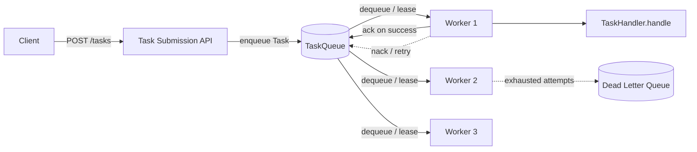
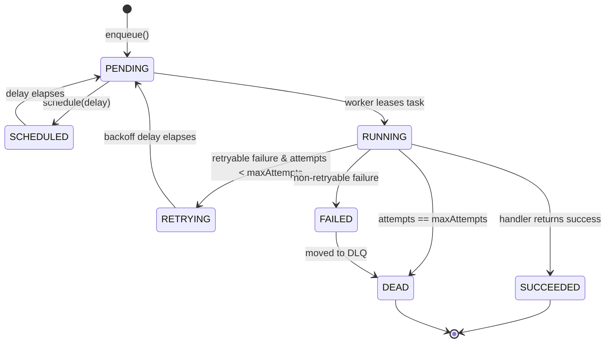
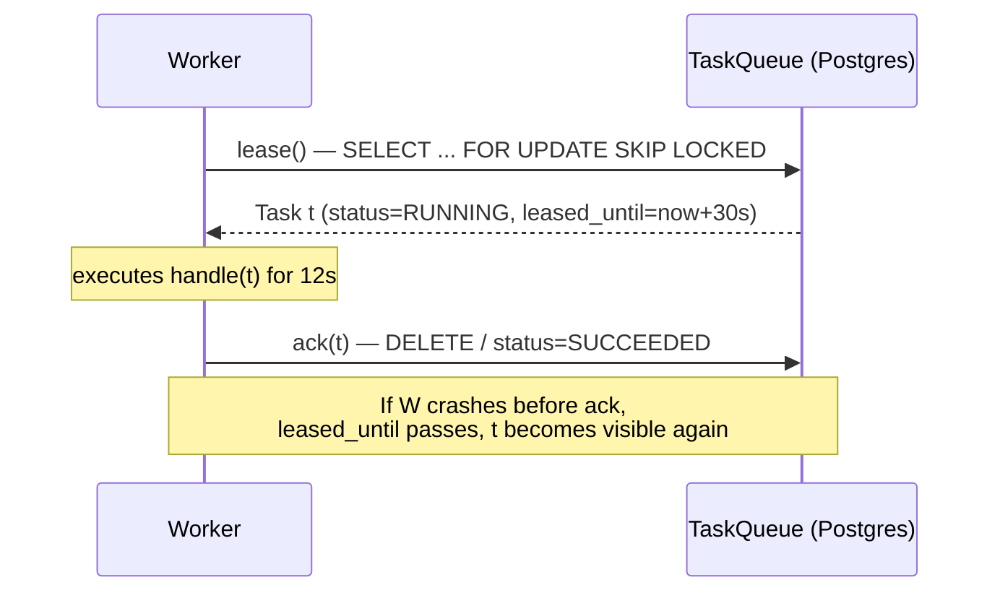

# Task Queues

> Where this fits: this is the beating heart of our Distributed Task Queue and Event Processing Platform. Everything else — the REST API, the worker pool, retries, the dead-letter queue, scheduling — orbits the `TaskQueue` port defined here. In Phase 1 it is a `BlockingQueue` in memory; in Phase 2 it becomes a PostgreSQL table polled with `SELECT ... FOR UPDATE SKIP LOCKED`.

## 1. Why this exists — the real problem it solves

A web request must return in milliseconds. But the *work* a request asks for — sending an email, resizing a 40 MB image, charging a card, recomputing a recommendation model — can take seconds or minutes. If you do that work inside the request thread, you couple the user's latency to the slowest dependency you have, you lose the work entirely if the process crashes mid-flight, and you cannot smooth out bursts: a spike of 10,000 signups in one second becomes 10,000 concurrent SMTP connections.

The fix is older than the web. You **decouple submission from execution**. The producer (your API) writes a durable record describing *what to do*, returns immediately, and a separate fleet of consumers (workers) picks the record up and executes it. The buffer in between is a **task queue**.

Historically this pattern crystallized in the late 2000s job-queue libraries — Resque (2009, GitHub, Ruby + Redis), Celery (2009, Python), Sidekiq (2012, Ruby) — and in cloud services like Amazon SQS (2006). They all solve the same four problems:

1. **Asynchrony** — return fast, do the slow thing later.
2. **Durability** — if a worker dies mid-task, the task is not lost.
3. **Load leveling** — a queue absorbs bursts; workers drain at a steady rate (backpressure).
4. **Horizontal scale** — add workers to drain faster; the queue is the coordination point.

A task queue is the foundation our entire project is built on. Get its contract right and retries, scheduling, rate limiting, and dead-lettering all snap on cleanly. Get it wrong and you will spend Phase 3 fighting double-execution bugs.

### Task queue vs message queue

These terms are used loosely, but the distinction is real and worth nailing down because it changes your design.

| Dimension | **Message queue** (e.g., RabbitMQ, Kafka, SQS) | **Task queue** (e.g., Celery, Sidekiq, our project) |
|---|---|---|
| Primary unit | An opaque **message** (bytes) | A **task**: a named operation + arguments |
| Who interprets it | The consumer decides what a message means | The framework routes by task `type` to a registered handler |
| Semantics it guarantees | Delivery (at-least-once / at-most-once) | Delivery **plus** execution lifecycle: retries, backoff, dead-letter, result tracking |
| State tracked | Usually none beyond "delivered/acked" | Full lifecycle: `PENDING → RUNNING → SUCCEEDED/FAILED/RETRYING/DEAD` |
| Typical API | `publish(topic, bytes)` / `consume()` | `enqueue(Task)` / worker looks up `TaskHandler` by type |
| Built on top of | — | Often a message queue or a database |

The crisp mental model: **a task queue is a message queue plus an execution model.** A message queue moves bytes reliably. A task queue knows those bytes describe *work*, owns the *lifecycle* of that work, and knows what to do when the work fails. In our canonical model, `TaskQueue` is the port; in Phase 4 it can be *backed by* a message broker like Kafka or RabbitMQ — they are layers, not competitors. See [`message-queues.md`](message-queues.md) for the broker layer and [`broker-comparison.md`](broker-comparison.md) for picking one.



## 2. The task lifecycle

Every task moves through a finite state machine. Our canonical `TaskStatus` enum names the states; the lifecycle is the *transitions* between them. If you cannot draw this diagram you cannot reason about correctness.



Walking the happy and unhappy paths:

- **Submit.** API creates a `Task` with `status = PENDING`, `attempts = 0`. If `scheduledAt` is in the future, it is `SCHEDULED` and a `TaskScheduler` will surface it later (see [`scheduling-queues.md`](scheduling-queues.md)).
- **Lease.** A worker *claims* the task. Crucially, claiming is not the same as deleting. The task transitions to `RUNNING` and becomes invisible to other workers for a **visibility timeout** (more below).
- **Execute.** The worker looks up the `TaskHandler` for `task.type()` and calls `handle(task)`.
- **Ack (success).** On `TaskResult(success=true, …)` the worker marks the task `SUCCEEDED` and removes it from the queue. This *acknowledgement* is what makes the lease permanent.
- **Nack (retryable failure).** On a retryable failure with attempts remaining, the worker increments `attempts`, computes a backoff via `RetryPolicy.nextDelay(attempt)`, sets `status = RETRYING`, and re-enqueues with a future `scheduledAt`. See [`retries.md`](../08-distributed-systems/retries.md).
- **Dead-letter.** When `attempts == maxAttempts`, or the failure is non-retryable, the task goes to the `DeadLetterQueue` with a reason and ends in `DEAD`. See [`dead-letter-queues.md`](dead-letter-queues.md).

### Leasing and visibility timeout

This is the single most important idea in the chapter, so slow down here.

When a worker takes a task, it does **not** immediately delete it. If it did, a worker crash between "take" and "finish" would lose the task forever. Instead the worker takes a **lease**: an exclusive, time-limited claim. The task stays in the store but is hidden from other workers until either (a) the worker acks it, or (b) the **visibility timeout** expires, at which point the task becomes visible again and another worker can pick it up.

This single mechanism gives you crash recovery for free. If a worker dies holding a lease, the lease expires and the task is redelivered. The cost is **at-least-once delivery**: a task may run more than once (e.g., worker finished the work but crashed before acking). The defense is **idempotent handlers** — see [`idempotency.md`](../08-distributed-systems/idempotency.md). There is no free lunch here; exactly-once execution across a crash is impossible without idempotency or a transactional outbox.

Choosing the visibility timeout is a real tradeoff:

- **Too short** → a slow-but-healthy task is redelivered while still running → duplicate execution and wasted work.
- **Too long** → a genuinely crashed task sits invisible for ages before recovery → high tail latency.

Rule of thumb: set the visibility timeout to a comfortable multiple (3–6x) of your p99 handler duration, and have long-running handlers *extend* their lease (a "heartbeat") rather than picking one giant timeout. SQS calls this `ChangeMessageVisibility`; we will model it as `extendLease`.



## 3. The naive version (and why it hurts)

First cut, Phase 1, straight out of [`blocking-queue.md`](../06-concurrency/blocking-queue.md):

```java
// NAIVE: a TaskQueue that is really just a message queue. No lifecycle, no lease.
public final class NaiveTaskQueue {
    private final BlockingQueue<Task> queue = new LinkedBlockingQueue<>();

    public void enqueue(Task t) {
        queue.offer(t);
    }

    public Task dequeue() throws InterruptedException {
        return queue.take(); // REMOVES immediately — no lease!
    }
}
```

A worker uses it like this:

```java
// NAIVE worker loop
while (running) {
    Task t = queue.dequeue();      // task is now GONE from the queue
    try {
        handler.handle(t);         // if the JVM dies here, the task is lost forever
    } catch (Exception e) {
        // ...and what now? It's not in the queue, so we can't retry it.
    }
}
```

Everything wrong with this in one place:

- **No durability.** `take()` removes the task. A crash mid-execution loses it. There is no record it ever existed.
- **No lifecycle.** Nobody can ask "what happened to task `abc`?" There is no `status`, no `attempts`.
- **No retry hook.** The catch block has no task to retry — it already left the queue.
- **No backpressure visibility.** `size()` of an unbounded queue lies; it can grow until you OOM.
- **In-process only.** A second JVM cannot see this queue, so you cannot scale horizontally.

It is a fine *teaching* queue and an acceptable Phase 1 prototype. It is not a task queue.

## 4. Improved version — model the lifecycle, keep the lease

Define the **port** as the canonical `TaskQueue` interface, then give an in-memory implementation that actually tracks state and leases. We separate "take a lease" (`dequeue` returns a leased task) from "ack" (`complete`).

```java
import java.time.Duration;
import java.time.Instant;
import java.util.Optional;

/** The canonical port. Phase 1: in-memory. Phase 2: Postgres. Phase 4: a broker. */
public interface TaskQueue {
    void enqueue(Task t);
    /** Blocks until a task is available; returns it with a lease held. */
    Task dequeue() throws InterruptedException;
    int size();
}

/** Extended port for queues that support leasing/acking explicitly. */
public interface LeasingTaskQueue extends TaskQueue {
    void ack(Task t);                          // task done; remove it
    void nack(Task t, Optional<Duration> requeueAfter); // failed; requeue or dead-letter
    void extendLease(Task t, Duration by);     // heartbeat for long tasks
}
```

```java
import java.time.*;
import java.util.*;
import java.util.concurrent.*;

/** Improved in-memory queue: tracks lifecycle and leases. Single-JVM. */
public final class InMemoryTaskQueue implements LeasingTaskQueue {

    private record Leased(Task task, Instant leasedUntil) {}

    private final DelayQueue<DelayedTask> ready = new DelayQueue<>();      // honors scheduledAt
    private final Map<String, Leased> inFlight = new ConcurrentHashMap<>();
    private final Duration visibilityTimeout;
    private final DeadLetterQueue dlq;
    private final RetryPolicy retryPolicy;

    public InMemoryTaskQueue(Duration visibilityTimeout, DeadLetterQueue dlq, RetryPolicy retryPolicy) {
        this.visibilityTimeout = visibilityTimeout;
        this.dlq = dlq;
        this.retryPolicy = retryPolicy;
    }

    @Override public void enqueue(Task t) {
        ready.put(new DelayedTask(t)); // becomes available at t.scheduledAt()
    }

    @Override public Task dequeue() throws InterruptedException {
        reclaimExpiredLeases();                       // recover crashed leases first
        Task t = ready.take().task();                 // blocks until something is due
        Task running = t.withStatus(TaskStatus.RUNNING);
        inFlight.put(running.id(), new Leased(running, Instant.now().plus(visibilityTimeout)));
        return running;
    }

    @Override public void ack(Task t) {
        inFlight.remove(t.id());                       // permanent: lease becomes a commit
    }

    @Override public void nack(Task t, Optional<Duration> requeueAfter) {
        inFlight.remove(t.id());
        Task attempted = t.withAttempts(t.attempts() + 1);
        Optional<Duration> delay = requeueAfter.or(() -> retryPolicy.nextDelay(attempted.attempts()));
        if (attempted.attempts() >= attempted.maxAttempts() || delay.isEmpty()) {
            dlq.send(attempted.withStatus(TaskStatus.DEAD), "max attempts exhausted");
        } else {
            enqueue(attempted.withStatus(TaskStatus.RETRYING)
                             .withScheduledAt(Instant.now().plus(delay.get())));
        }
    }

    @Override public void extendLease(Task t, Duration by) {
        inFlight.computeIfPresent(t.id(),
            (id, l) -> new Leased(l.task(), l.leasedUntil().plus(by)));
    }

    @Override public int size() {
        return ready.size() + inFlight.size();
    }

    private void reclaimExpiredLeases() {
        Instant now = Instant.now();
        for (var e : inFlight.entrySet()) {
            if (e.getValue().leasedUntil().isBefore(now)) {
                inFlight.remove(e.getKey());
                enqueue(e.getValue().task().withStatus(TaskStatus.PENDING)); // redeliver
            }
        }
    }

    /** Wraps a Task so DelayQueue releases it only at scheduledAt. */
    private record DelayedTask(Task task) implements Delayed {
        @Override public long getDelay(TimeUnit unit) {
            long ms = Duration.between(Instant.now(), task.scheduledAt()).toMillis();
            return unit.convert(ms, TimeUnit.MILLISECONDS);
        }
        @Override public int compareTo(Delayed o) {
            return Long.compare(getDelay(TimeUnit.MILLISECONDS), o.getDelay(TimeUnit.MILLISECONDS));
        }
    }
}
```

This is a *real* task queue: durable within the process, lease-based, retry-aware, schedule-aware. Its only remaining limitation is that it lives in one JVM's heap. The moment you want two machines draining the same queue — or durability across a process restart — you need shared storage. That is Phase 2.

## 5. Production-quality version — Postgres with `FOR UPDATE SKIP LOCKED`

For Phase 2 we back `TaskQueue` with PostgreSQL. Why a database and not a "real" broker? Because for most teams, **"the queue is a table in the database you already operate"** is the highest-leverage decision you can make. You get durability, transactions (enqueue a task in the *same* transaction as your business write — a transactional outbox), ad-hoc SQL to inspect stuck tasks, and zero new infrastructure to run. Sidekiq needs Redis; Celery needs a broker. A Postgres-backed queue needs nothing you don't already have. You can outgrow it (tens of thousands of tasks/sec is where it strains), and at that point Phase 4 swaps the implementation behind the same port.

The magic is `FOR UPDATE SKIP LOCKED` (PostgreSQL 9.5+). It lets many workers poll the same table concurrently and each grab a *different* batch of rows without blocking each other or double-claiming.

### The schema (Flyway migration)

```sql
-- V2__create_tasks.sql
CREATE TABLE tasks (
    id            UUID PRIMARY KEY,
    type          TEXT        NOT NULL,
    payload       JSONB       NOT NULL,
    status        TEXT        NOT NULL DEFAULT 'PENDING',
    attempts      INT         NOT NULL DEFAULT 0,
    max_attempts  INT         NOT NULL DEFAULT 5,
    priority      INT         NOT NULL DEFAULT 0,
    created_at    TIMESTAMPTZ NOT NULL DEFAULT now(),
    scheduled_at  TIMESTAMPTZ NOT NULL DEFAULT now(),
    leased_until  TIMESTAMPTZ,                         -- visibility timeout boundary
    locked_by     TEXT                                 -- which worker holds the lease
);

-- The hot path: "give me due, unleased work, highest priority first".
-- A partial index keeps it small by excluding terminal rows.
CREATE INDEX idx_tasks_pollable
    ON tasks (priority DESC, scheduled_at)
    WHERE status IN ('PENDING', 'SCHEDULED', 'RETRYING');
```

### The lease query — the centerpiece

```sql
-- Lease up to :n due tasks atomically. Other workers SKIP these locked rows.
WITH leased AS (
    SELECT id
    FROM tasks
    WHERE status IN ('PENDING', 'RETRYING', 'SCHEDULED')
      AND scheduled_at <= now()
      AND (leased_until IS NULL OR leased_until < now())  -- reclaim expired leases too
    ORDER BY priority DESC, scheduled_at ASC
    LIMIT :n
    FOR UPDATE SKIP LOCKED                                -- the magic
)
UPDATE tasks t
SET status = 'RUNNING',
    leased_until = now() + (:visibilitySeconds || ' seconds')::interval,
    locked_by = :workerId,
    attempts = t.attempts + 1
FROM leased
WHERE t.id = leased.id
RETURNING t.*;
```

Read that carefully — it is doing five things in one atomic statement:

1. **Selects** due, unleased (or lease-expired) rows, priority-ordered.
2. `FOR UPDATE` row-locks them so no other transaction can touch them.
3. `SKIP LOCKED` means a concurrent worker's identical query simply *skips* these locked rows and grabs the next ones — no blocking, no contention, no double-claim.
4. **Updates** them to `RUNNING`, stamps a `leased_until` (the visibility timeout) and `locked_by`, and bumps `attempts`.
5. `RETURNING` hands the full leased rows back to the worker in the same round trip.

Crash recovery is implicit: a dead worker's rows have a `leased_until` in the past, so the `OR leased_until < now()` clause re-leases them on the next poll. No separate reaper process required (though you may add one for metrics).

### The Java implementation

```java
import org.springframework.jdbc.core.JdbcTemplate;
import org.springframework.transaction.annotation.Transactional;
import java.time.*;
import java.util.*;

/** Phase 2 production queue. Backed by Postgres + SKIP LOCKED. Implements the canonical port. */
public final class PostgresTaskQueue implements LeasingTaskQueue {

    private final JdbcTemplate jdbc;
    private final String workerId;        // e.g. hostname + pid
    private final int visibilitySeconds;

    public PostgresTaskQueue(JdbcTemplate jdbc, String workerId, Duration visibilityTimeout) {
        this.jdbc = jdbc;
        this.workerId = workerId;
        this.visibilitySeconds = (int) visibilityTimeout.toSeconds();
    }

    @Override public void enqueue(Task t) {
        jdbc.update("""
            INSERT INTO tasks (id, type, payload, status, attempts, max_attempts,
                               priority, created_at, scheduled_at)
            VALUES (?, ?, ?::jsonb, ?, ?, ?, ?, ?, ?)
            ON CONFLICT (id) DO UPDATE
              SET status = EXCLUDED.status,
                  scheduled_at = EXCLUDED.scheduled_at,
                  attempts = EXCLUDED.attempts
            """,
            UUID.fromString(t.id()), t.type(), t.payload(), t.status().name(),
            t.attempts(), t.maxAttempts(), t.priority(),
            Timestamp.from(t.createdAt()), Timestamp.from(t.scheduledAt()));
    }

    /** Lease a single task (or null if none due). Workers loop on this. */
    @Transactional
    public Task leaseOne() {
        List<Task> batch = leaseBatch(1);
        return batch.isEmpty() ? null : batch.get(0);
    }

    /** Batch leasing amortizes round-trips; this is the throughput path. */
    @Transactional
    public List<Task> leaseBatch(int n) {
        return jdbc.query("""
            WITH leased AS (
                SELECT id FROM tasks
                WHERE status IN ('PENDING','RETRYING','SCHEDULED')
                  AND scheduled_at <= now()
                  AND (leased_until IS NULL OR leased_until < now())
                ORDER BY priority DESC, scheduled_at ASC
                LIMIT ?
                FOR UPDATE SKIP LOCKED
            )
            UPDATE tasks t
            SET status='RUNNING',
                leased_until = now() + (? * interval '1 second'),
                locked_by = ?,
                attempts = t.attempts + 1
            FROM leased WHERE t.id = leased.id
            RETURNING t.*
            """, this::mapRow, n, visibilitySeconds, workerId);
    }

    /** dequeue() satisfies the base port by polling+blocking. */
    @Override public Task dequeue() throws InterruptedException {
        Task t;
        while ((t = leaseOne()) == null) {
            Thread.sleep(200);   // simple poll; production: LISTEN/NOTIFY to avoid busy-poll
        }
        return t;
    }

    @Override public void ack(Task t) {
        // Option A: keep history. Mark terminal, clear lease.
        jdbc.update("UPDATE tasks SET status='SUCCEEDED', leased_until=NULL, locked_by=NULL WHERE id=?",
                    UUID.fromString(t.id()));
        // Option B (high churn): DELETE FROM tasks WHERE id=?  -- keeps the table tiny.
    }

    @Override public void nack(Task t, Optional<Duration> requeueAfter) {
        if (t.attempts() >= t.maxAttempts()) {
            jdbc.update("UPDATE tasks SET status='DEAD', leased_until=NULL, locked_by=NULL WHERE id=?",
                        UUID.fromString(t.id()));
            return; // a DLQ consumer/trigger ships DEAD rows onward
        }
        long delay = requeueAfter.map(Duration::toSeconds).orElse(0L);
        jdbc.update("""
            UPDATE tasks
            SET status='RETRYING',
                scheduled_at = now() + (? * interval '1 second'),
                leased_until=NULL, locked_by=NULL
            WHERE id=?
            """, (int) delay, UUID.fromString(t.id()));
    }

    @Override public void extendLease(Task t, Duration by) {
        jdbc.update("""
            UPDATE tasks SET leased_until = leased_until + (? * interval '1 second')
            WHERE id=? AND locked_by=?
            """, (int) by.toSeconds(), UUID.fromString(t.id()), workerId);
    }

    @Override public int size() {
        Integer n = jdbc.queryForObject(
            "SELECT count(*) FROM tasks WHERE status IN ('PENDING','SCHEDULED','RETRYING','RUNNING')",
            Integer.class);
        return n == null ? 0 : n;
    }

    private Task mapRow(java.sql.ResultSet rs, int i) throws java.sql.SQLException {
        return new Task(
            rs.getString("id"), rs.getString("type"), rs.getString("payload"),
            TaskStatus.valueOf(rs.getString("status")),
            rs.getInt("attempts"), rs.getInt("max_attempts"),
            rs.getTimestamp("created_at").toInstant(),
            rs.getTimestamp("scheduled_at").toInstant(),
            rs.getInt("priority"));
    }
}
```

> **Why `SKIP LOCKED` and not just `LIMIT 1`?** Without `SKIP LOCKED`, two workers running `SELECT ... FOR UPDATE LIMIT 1` would *both* try to lock the same top row; one blocks waiting for the other's transaction, serializing your entire worker fleet behind one row. `SKIP LOCKED` turns that contention into clean parallelism — every worker grabs a disjoint set of rows on the first try.

## 6. Code walkthrough — three escalating examples

### Beginner: enqueue and drain with the in-memory queue

```java
public class Beginner {
    public static void main(String[] args) throws InterruptedException {
        DeadLetterQueue dlq = (t, reason) -> System.out.println("DEAD: " + t.id() + " — " + reason);
        RetryPolicy retry = new FixedDelayRetryPolicy(Duration.ofSeconds(1), 5);
        var queue = new InMemoryTaskQueue(Duration.ofSeconds(30), dlq, retry);

        Task email = new Task(UUID.randomUUID().toString(), "send_email",
                "{\"to\":\"a@b.com\"}", TaskStatus.PENDING,
                0, 5, Instant.now(), Instant.now(), 0);

        queue.enqueue(email);
        Task leased = queue.dequeue();          // pulls it, holds a lease
        System.out.println("Got " + leased.type() + " status=" + leased.status()); // RUNNING
        queue.ack(leased);                       // mark done
        System.out.println("Queue size now: " + queue.size()); // 0
    }
}
```

### Intermediate: a `Worker` that leases, executes, acks, and nacks

This is the canonical `Worker` from our model, wired against the leasing port.

```java
public final class Worker implements Runnable {
    private final LeasingTaskQueue queue;
    private final Map<String, TaskHandler> handlers;   // type -> handler
    private volatile boolean running = true;

    public Worker(LeasingTaskQueue queue, Map<String, TaskHandler> handlers) {
        this.queue = queue;
        this.handlers = handlers;
    }

    @Override public void run() {
        while (running) {
            Task task;
            try {
                task = queue.dequeue();                 // lease
            } catch (InterruptedException e) {
                Thread.currentThread().interrupt();
                return;
            }
            TaskHandler handler = handlers.get(task.type());
            if (handler == null) {
                queue.nack(task, Optional.empty());      // unknown type -> retry/DLQ
                continue;
            }
            try {
                TaskResult result = handler.handle(task);   // execute
                if (result.success()) {
                    queue.ack(task);                         // ack
                } else if (result.retryable()) {
                    queue.nack(task, Optional.empty());      // nack -> backoff requeue
                } else {
                    queue.nack(task, Optional.empty());      // non-retryable -> will DLQ at max
                }
            } catch (Exception e) {
                queue.nack(task, Optional.empty());          // crash mid-task -> retry
            }
        }
    }

    public void stop() { running = false; }
}
```

### Production-inspired: long-running handler with lease heartbeat

A 10-minute video transcode would blow past any sane visibility timeout. Instead of one giant timeout, the handler **extends its lease** while it works — exactly how SQS's `ChangeMessageVisibility` and Sidekiq Pro's heartbeats behave.

```java
public final class TranscodeHandler implements TaskHandler {
    private final LeasingTaskQueue queue;
    private final ScheduledExecutorService heartbeat = Executors.newSingleThreadScheduledExecutor();

    public TranscodeHandler(LeasingTaskQueue queue) { this.queue = queue; }

    @Override public TaskResult handle(Task task) {
        // Extend the lease every 20s so the task is never wrongly redelivered.
        var beat = heartbeat.scheduleAtFixedRate(
            () -> queue.extendLease(task, Duration.ofSeconds(30)),
            20, 20, TimeUnit.SECONDS);
        try {
            transcode(task.payload());   // may take minutes
            return new TaskResult(true, "transcoded", false);
        } catch (TransientIoException e) {
            return new TaskResult(false, e.getMessage(), true);   // retryable
        } catch (UnsupportedCodecException e) {
            return new TaskResult(false, e.getMessage(), false);  // poison -> DLQ
        } finally {
            beat.cancel(true);
        }
    }

    private void transcode(String payload) { /* ffmpeg invocation */ }
}
```

## 7. How this applies to our Task Queue project

Concrete mapping to the canonical model:

- **`TaskQueue`** — the port. `InMemoryTaskQueue` (Phase 1) → `PostgresTaskQueue` (Phase 2) → broker-backed (Phase 4). Every higher layer depends on the *interface*, never the implementation. This is the hexagonal seam described in our architecture overview.
- **`Task` / `TaskStatus`** — the lifecycle state machine in Section 2 *is* the legal `TaskStatus` transitions. The queue owns those transitions.
- **`Worker` / `WorkerPool`** — the lease/ack/nack loop above. `WorkerPool` runs N `Worker` runnables on an `ExecutorService` (see [`executor-service.md`](../06-concurrency/executor-service.md)); with virtual threads you can run thousands cheaply.
- **`RetryPolicy`** — consulted inside `nack` to compute `nextDelay(attempt)`; see [`retries.md`](../08-distributed-systems/retries.md).
- **`DeadLetterQueue`** — the terminal sink when attempts are exhausted; see [`dead-letter-queues.md`](dead-letter-queues.md).
- **`TaskScheduler`** — `scheduledAt` + the `scheduled_at <= now()` predicate make scheduling a first-class queue feature, not a bolt-on; see [`scheduling-queues.md`](scheduling-queues.md).
- **`TaskRepository`** — in Phase 2 the `tasks` table is *both* the queue and the repository. `pollDue(n)` is literally the `leaseBatch(n)` query; `findById` powers `GET /tasks/{id}`.

## 8. Tradeoffs

| Backing store | Throughput | Durability | Ordering | Ops cost | When to use |
|---|---|---|---|---|---|
| In-memory `BlockingQueue` | Highest | None (lost on crash) | FIFO | Zero | Phase 1, tests, single-node bursts |
| **Postgres `SKIP LOCKED`** | ~1k–20k/s | Strong (ACID) | By priority/time, not strict FIFO | None extra | **Phase 2 default** — you already run Postgres |
| Redis (Sidekiq-style) | ~50k+/s | Weak by default (AOF helps) | Per-list FIFO | One Redis | High throughput, can tolerate rare loss |
| Kafka | Very high | Strong (replicated log) | Strict per-partition | High | Event streaming, replay, ordering |
| RabbitMQ / SQS | High | Strong | Per-queue | Medium | Classic work queues, managed (SQS) |

Other honest tradeoffs:

- **At-least-once vs exactly-once.** Leasing buys you at-least-once cheaply. Exactly-once is a myth across crashes; you get *effectively-once* only by making handlers idempotent. Budget for that.
- **Polling vs push.** Postgres polling is dead simple but burns a query every interval. `LISTEN/NOTIFY` reduces idle polling; a broker pushes natively. Start with polling; it is rarely the bottleneck.
- **Single table vs partitioned.** One `tasks` table is simplest. At scale, completed rows bloat it — either `DELETE` on ack or partition by date and drop old partitions.
- **Priority vs fairness.** Strict priority can starve low-priority tasks forever. Add aging (boost priority with wait time) if starvation bites.

## 9. Common mistakes and pitfalls

- **Deleting on dequeue instead of leasing.** The naive bug. A crash loses the task. *Fix:* lease (`status=RUNNING` + `leased_until`), ack only after success.
- **`FOR UPDATE` without `SKIP LOCKED`.** Serializes your whole fleet behind the hottest row. *Fix:* always add `SKIP LOCKED` for queue polling.
- **Visibility timeout shorter than task duration.** Causes duplicate execution of healthy tasks. *Fix:* size it from p99 latency, or heartbeat the lease.
- **Non-idempotent handlers.** At-least-once + side effects = double charges, double emails. *Fix:* idempotency keys; see [`idempotency.md`](../08-distributed-systems/idempotency.md).
- **Incrementing `attempts` in the wrong place.** Increment on *lease*, not on failure — otherwise a worker that crashes before reporting never counts its attempt, and a poison task loops forever. (Our lease query bumps `attempts` atomically.)
- **Busy-polling at 1ms.** Hammers Postgres for nothing. *Fix:* backoff the poll interval or use `LISTEN/NOTIFY`.
- **Unbounded queue + unbounded producers.** OOM (in-memory) or table bloat (DB). *Fix:* backpressure — bound the queue, reject or shed when full. See [`backpressure.md`](../08-distributed-systems/backpressure.md).
- **Forgetting to reclaim expired leases.** Crashed-worker tasks sit `RUNNING` forever. *Fix:* the `leased_until < now()` predicate (or a reaper) re-leases them.

## 10. Refactoring exercise

**Bad** — deletes on take, swallows failures, no lifecycle:

```java
class JobQueue {
    private final Queue<String> jobs = new LinkedList<>();
    void add(String job) { jobs.add(job); }
    String take() { return jobs.poll(); }   // gone forever once taken
    void process() {
        String job = take();
        try { run(job); } catch (Exception e) { /* lost */ }
    }
    void run(String j) { /* ... */ }
}
```

**Improved** — model the task, track status, keep failed work:

```java
class JobQueue {
    private final Deque<Task> ready = new ArrayDeque<>();
    private final Map<String, Task> inFlight = new HashMap<>();

    synchronized void enqueue(Task t) { ready.add(t.withStatus(TaskStatus.PENDING)); }

    synchronized Task lease() {
        Task t = ready.poll();
        if (t == null) return null;
        Task running = t.withStatus(TaskStatus.RUNNING);
        inFlight.put(running.id(), running);   // kept until ack
        return running;
    }
    synchronized void ack(Task t)  { inFlight.remove(t.id()); }
    synchronized void nack(Task t) {                       // requeue with attempt++
        inFlight.remove(t.id());
        enqueue(t.withAttempts(t.attempts() + 1));
    }
}
```

**Production-quality** — the `PostgresTaskQueue` from Section 5: durable, multi-worker via `SKIP LOCKED`, lease-based with a visibility timeout, attempt-aware, retry/DLQ-integrated, and behind the canonical `TaskQueue` port so the rest of the system never knows it changed.

## 11. Exercises

### Easy

1. **(Knowledge check)** In one sentence each, explain the difference between *dequeue/lease*, *ack*, and *nack*. Why does deleting a task at dequeue time break crash recovery?
2. **(Coding)** Add a method `inFlightCount()` to `InMemoryTaskQueue` that returns how many tasks are currently leased but not yet acked.

### Medium

3. **(Coding)** Implement `reclaimExpiredLeases()` as a standalone scheduled job for `PostgresTaskQueue`: a single SQL `UPDATE` that flips any `RUNNING` row whose `leased_until < now()` back to `PENDING` and clears `locked_by`. Explain why this is redundant with the lease query's `OR leased_until < now()` clause — and when you would still want the explicit reaper.
4. **(Refactoring)** The `nack` in `PostgresTaskQueue` hardcodes the retry decision. Refactor it to delegate the delay to an injected `RetryPolicy` (`FixedDelayRetryPolicy` or `ExponentialBackoffRetryPolicy`), and route to a `DeadLetterQueue` when `nextDelay` returns empty.

### Hard

5. **(Design)** Design a fairness layer on top of priority so that a flood of priority-10 tasks cannot starve priority-0 tasks. Sketch the SQL/index changes and discuss the tradeoff vs strict priority.
6. **(Interview-style)** Two workers poll with `FOR UPDATE SKIP LOCKED LIMIT 10`. Walk through, row by row, why they never claim the same task, and what happens to a task whose owning transaction rolls back.
7. **(Stretch)** Replace the 200ms busy-poll in `PostgresTaskQueue.dequeue()` with Postgres `LISTEN/NOTIFY`: producers `NOTIFY tasks_channel` after insert, the worker `LISTEN`s and only polls when notified (with a periodic fallback poll for scheduled/retry tasks). Outline the JDBC code and the failure modes.

## 12. Solutions

**1.** *Dequeue/lease* takes an exclusive, time-limited claim on a task (sets it `RUNNING` + `leased_until`) without removing it. *Ack* confirms success and removes/finalizes the task, making the claim permanent. *Nack* reports failure, releasing the claim so the task can be retried (with backoff) or dead-lettered. Deleting at dequeue time means a crash between dequeue and completion leaves no record of the task, so it can never be recovered or retried — the lease exists precisely so an expired lease redelivers the work.

**2.**
```java
public int inFlightCount() { return inFlight.size(); }
```
(`inFlight` is a `ConcurrentHashMap`, so `.size()` is safe to read without locking.)

**3.**
```sql
-- Explicit reaper, run on a schedule (e.g. every 30s).
UPDATE tasks
SET status = 'PENDING', leased_until = NULL, locked_by = NULL
WHERE status = 'RUNNING' AND leased_until < now();
```
It is redundant for *correctness* because the lease query already re-leases expired rows via `OR leased_until < now()`. You still want the explicit reaper for **observability and metrics** (emit a counter of reclaimed tasks to detect crashing workers), to surface stuck tasks in dashboards as `PENDING` rather than misleadingly `RUNNING`, and to recover tasks promptly even during a period when *no* worker is polling (e.g., the whole fleet restarted).

**4.**
```java
public PostgresTaskQueue(JdbcTemplate jdbc, String workerId, Duration vt,
                         RetryPolicy retryPolicy, DeadLetterQueue dlq) {
    this.jdbc = jdbc; this.workerId = workerId;
    this.visibilitySeconds = (int) vt.toSeconds();
    this.retryPolicy = retryPolicy; this.dlq = dlq;
}

@Override public void nack(Task t, Optional<Duration> requeueAfter) {
    Optional<Duration> delay = requeueAfter.or(() -> retryPolicy.nextDelay(t.attempts()));
    if (t.attempts() >= t.maxAttempts() || delay.isEmpty()) {
        dlq.send(t.withStatus(TaskStatus.DEAD), "retries exhausted");
        jdbc.update("UPDATE tasks SET status='DEAD', leased_until=NULL, locked_by=NULL WHERE id=?",
                    UUID.fromString(t.id()));
        return;
    }
    jdbc.update("""
        UPDATE tasks SET status='RETRYING',
            scheduled_at = now() + (? * interval '1 second'),
            leased_until=NULL, locked_by=NULL
        WHERE id=?
        """, (int) delay.get().toSeconds(), UUID.fromString(t.id()));
}
```
Now the retry curve (fixed vs exponential-with-jitter) is a policy swap, not a code change.

**5.** Add a derived "effective priority" that ages: `effective = priority + floor(EXTRACT(EPOCH FROM (now() - scheduled_at)) / 60)`. Order by that instead of raw priority:
```sql
ORDER BY (priority + (EXTRACT(EPOCH FROM (now() - scheduled_at)) / 60)::int) DESC,
         scheduled_at ASC
```
Index it via an expression index, or precompute and store `effective_priority` and refresh it. **Tradeoff:** strict priority guarantees high-priority tasks always run first (simple, but starves low priority under sustained load); aging guarantees *eventual* execution for everyone (no starvation) at the cost of occasionally running a low-priority task ahead of a fresh high-priority one. Aging also makes the index ordering non-static, which can hurt index efficiency — a common compromise is a small number of discrete priority *lanes* polled round-robin with weights.

**6.** Worker A's query locks the first 10 unlocked due rows (`FOR UPDATE`) inside its transaction. Worker B's identical query encounters those 10 locked rows; `SKIP LOCKED` makes it *skip* them silently and lock the next 10 it can. So the two never overlap — locks are row-level and exclusive, and `SKIP LOCKED` converts "wait for the lock" into "move on." If A's transaction **rolls back** (crash, error), the row locks are released *and* the `UPDATE status='RUNNING'` is undone, so the rows revert to their prior `PENDING/RETRYING` state and become immediately leasable by the next poller. No task is lost; no task is double-leased simultaneously. (After commit, redelivery is still possible later via lease expiry — that is the at-least-once guarantee, separate from concurrent claiming.)

**7.**
```java
// Producer side, after INSERT (same transaction):
jdbc.update("NOTIFY tasks_channel");

// Worker side, using the raw PgConnection:
PgConnection pg = ds.getConnection().unwrap(PgConnection.class);
try (Statement s = pg.createStatement()) { s.execute("LISTEN tasks_channel"); }

while (running) {
    Task t = leaseOne();
    if (t != null) { dispatch(t); continue; }
    // Block up to N ms waiting for a NOTIFY; fall through to poll on timeout.
    PGNotification[] notes = pg.getNotifications(5000);   // 5s fallback for scheduled/retry
    // loop: leaseOne() again whether we got a notify or timed out
}
```
**Failure modes to handle:** (a) NOTIFY fires for a task whose `scheduled_at` is in the future — the lease query correctly ignores it until due, so the fallback poll (every 5s) is what eventually picks up scheduled/retry tasks; never rely on NOTIFY alone for delayed work. (b) A notify can be *missed* if the listener reconnects mid-flight — the periodic fallback poll guarantees liveness anyway. (c) NOTIFY payloads are delivered only after the producing transaction commits, so workers never wake for a task that then rolls back. The pattern eliminates idle busy-polling while keeping correctness from the poll fallback.

## 13. Interview questions and takeaways

1. **Q: What is the difference between a message queue and a task queue?**
   A: A message queue reliably moves opaque bytes between producers and consumers. A task queue is built on top of that idea but adds an *execution model*: named operations routed to handlers, a lifecycle (`PENDING→RUNNING→SUCCEEDED/FAILED/RETRYING/DEAD`), retries with backoff, dead-lettering, and result tracking. Task queue = message queue + lifecycle.

2. **Q: How do you make sure a task isn't lost if a worker crashes mid-execution?**
   A: Leasing. The worker takes a time-limited exclusive claim (visibility timeout) instead of deleting the task. If it crashes before acking, the lease expires and the task is redelivered. This yields at-least-once delivery, which is why handlers must be idempotent.

3. **Q: Explain `SELECT ... FOR UPDATE SKIP LOCKED`.**
   A: `FOR UPDATE` row-locks the selected rows for the transaction; `SKIP LOCKED` makes concurrent queries skip already-locked rows instead of blocking. Together they let many workers poll one table and each grab disjoint batches with no contention and no double-claiming — turning a serialized hot spot into clean parallelism.

4. **Q: How do you pick the visibility timeout?**
   A: Roughly 3–6x the p99 handler duration. Too short causes duplicate execution of healthy tasks; too long delays recovery of genuinely crashed tasks. For variable/long tasks, heartbeat-extend the lease instead of choosing one large value.

5. **Q: Why use Postgres as a queue instead of Redis/Kafka/RabbitMQ?**
   A: Operational simplicity and transactional integrity. You already run Postgres, so there's no new infrastructure; you get ACID durability and can enqueue a task in the same transaction as your business write (transactional outbox). It scales to thousands of tasks/sec, which covers most systems. Beyond that, swap the implementation behind the `TaskQueue` port.

6. **Q: At-least-once vs exactly-once — which do task queues give you?**
   A: At-least-once, practically always. Exactly-once execution across a crash is impossible without idempotency, because a worker can finish the side effect and die before acking. You approximate exactly-once ("effectively-once") with idempotency keys or a deduplication store.

7. **Q: Where do you increment the attempt counter, and why?**
   A: At lease time (atomically in the lease query), not at failure time. If you increment only on reported failure, a worker that crashes before reporting never counts its attempt, so a task that consistently kills its worker (a poison message) loops forever and never reaches the DLQ.

8. **Q: How does scheduling/delay fit into a task queue?**
   A: With a `scheduled_at` column and a `scheduled_at <= now()` predicate in the lease query (or a `DelayQueue` in memory). Retries reuse the exact same mechanism — a nack just sets a future `scheduled_at` from the `RetryPolicy`.

## 14. Production considerations

- **Table bloat.** A busy queue accumulates terminal rows. Either `DELETE` on ack (smallest, fastest table, but loses history) or move completed rows to an archive/partition and `DROP` old partitions. Autovacuum must keep up; monitor dead-tuple ratio. The partial index on pollable statuses keeps the hot index small even when the table is large.
- **Index discipline.** The pollable partial index is the difference between an index scan and a sequential scan over millions of rows. Verify with `EXPLAIN (ANALYZE, BUFFERS)` that the lease query uses it.
- **Connection pressure.** N polling workers = N connections doing frequent short transactions. Use a pooler (PgBouncer / Hikari) and batch-lease (`LIMIT n`) to amortize round-trips. Busy-poll backoff or `LISTEN/NOTIFY` keeps idle workers from flooding the DB.
- **Poison messages.** A task that always crashes its worker must reach the DLQ, which is why `attempts` is bumped on lease. Alert on DLQ growth rate; a sudden spike usually means a bad deploy.
- **Observability.** Export gauges for queue depth by status (`PENDING`, `RUNNING`, `DEAD`), task age (oldest `scheduled_at`), lease reclaim rate, and per-type success/failure counters via Micrometer/Prometheus. Oldest-pending-age is your best single SLO signal — if it climbs, you are not keeping up. See [`observability-and-ops.md`](../10-system-design/observability-and-ops.md).
- **Thundering herd on startup.** If all workers start polling at once they synchronize; add jitter to the poll interval.
- **Clock skew.** `leased_until` uses `now()` on the *database* server, so all workers agree on time even if their own clocks drift. Never compute lease expiry on the worker's clock.
- **Backpressure.** Bound producers or shed load when depth exceeds a threshold; an unbounded queue just moves the failure from "slow" to "OOM/disk full." See [`backpressure.md`](../08-distributed-systems/backpressure.md).

## What We Can Improve In Our Project Using This Concept

Our Phase 1 `InMemoryTaskQueue` deletes-on-take and is single-JVM. Applying this chapter we: (1) introduce a `LeasingTaskQueue` sub-interface with explicit `ack`/`nack`/`extendLease`; (2) make `InMemoryTaskQueue` lease-based with a visibility timeout and expired-lease reclamation; (3) ship `PostgresTaskQueue` using `FOR UPDATE SKIP LOCKED` so multiple workers — and multiple machines — drain one durable queue; (4) move retry/DLQ decisions into `nack` driven by `RetryPolicy` and `DeadLetterQueue`. The rest of the system is untouched because everyone depends on the `TaskQueue` port.

## Project Refactoring Task

Refactor `Worker` to call `dequeue → handle → ack/nack` instead of `dequeue → handle → (nothing)`. Add the Flyway migration `V2__create_tasks.sql` with the partial pollable index. Implement `PostgresTaskQueue` and wire it via Spring as the `TaskQueue` bean in the `phase-2` profile, keeping `InMemoryTaskQueue` for tests. Add a Testcontainers-backed test that starts two `Worker`s against one Postgres and asserts no task is processed twice under concurrent leasing.

## Git Commit For This Chapter

```bash
feat(queue): add leasing TaskQueue port and Postgres SKIP LOCKED implementation

- introduce LeasingTaskQueue (ack/nack/extendLease) over the TaskQueue port
- make InMemoryTaskQueue lease-based with visibility timeout + lease reclaim
- add PostgresTaskQueue using FOR UPDATE SKIP LOCKED for multi-worker draining
- add Flyway V2__create_tasks.sql with partial pollable index
- route exhausted/non-retryable tasks to DeadLetterQueue via RetryPolicy

Files touched:
  src/main/java/.../queue/TaskQueue.java
  src/main/java/.../queue/LeasingTaskQueue.java
  src/main/java/.../queue/InMemoryTaskQueue.java
  src/main/java/.../queue/PostgresTaskQueue.java
  src/main/java/.../worker/Worker.java
  src/main/resources/db/migration/V2__create_tasks.sql
  src/test/java/.../queue/PostgresTaskQueueConcurrencyTest.java
```

## Architecture Impact

The `TaskQueue` port becomes the central hexagonal boundary of the platform. Phase 1 (in-memory) and Phase 2 (Postgres) are interchangeable adapters; Phase 4 will add a broker adapter behind the same interface. Because leasing pushes durability and recovery *into the queue*, the API layer, `WorkerPool`, `RetryPolicy`, and `DeadLetterQueue` all stay simple and storage-agnostic. The queue's chosen delivery semantics (at-least-once) ripple outward as a system-wide requirement: every `TaskHandler` must be idempotent.

## Interview Takeaways

- A task queue is a message queue *plus* an execution lifecycle (routing, retries, DLQ, status).
- **Lease, don't delete.** Visibility timeout + ack/nack give crash recovery and at-least-once delivery.
- `SELECT ... FOR UPDATE SKIP LOCKED` is the canonical pattern for a database-backed, multi-worker queue with no contention.
- At-least-once is the realistic guarantee; idempotent handlers turn it into effectively-once.
- Size the visibility timeout from p99 latency and heartbeat long tasks; increment `attempts` on lease, not on failure.
- Postgres-as-a-queue is the right default until you have proof you need a dedicated broker.
