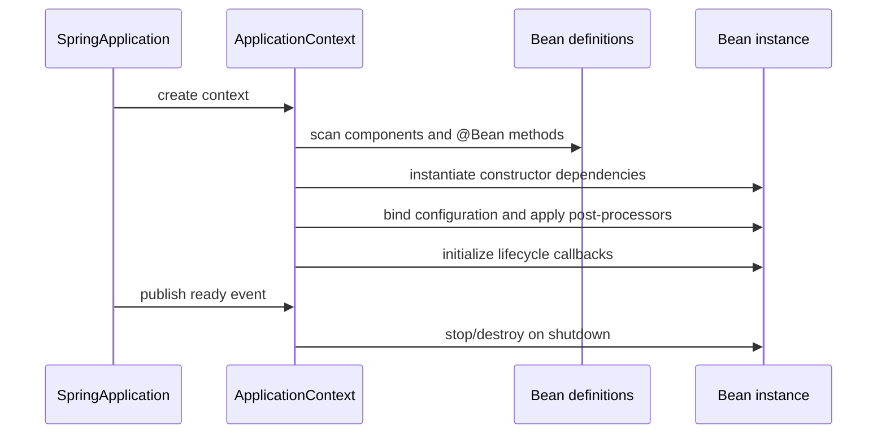

# Why Spring and IoC

> Where this fits: Phase 1 of the Task Queue already works with manual Java wiring. This chapter explains why that wiring becomes a scaling problem for the codebase, then refactors the same `TaskQueue`, `Worker`, `WorkerPool`, `RetryPolicy`, and `TaskHandler` graph into Spring-managed beans without changing the domain model.

Spring is not an annotation collection. Spring is a way to move object creation, configuration, lifecycle, and environment-specific wiring out of business classes and into a composition system. The annotations are just one syntax for telling that system what objects exist.

The rule for this module:

1. Build the feature manually in plain Java.
2. Explain the pain points.
3. Introduce the Spring Boot solution.
4. Explain how Spring works internally.
5. Refactor the Task Queue project.
6. Discuss production tradeoffs.

---

## Why This Exists

The Phase 1 Task Queue starts with a manual composition root:

```java
public final class AppBootstrap {
    public static void main(String[] args) {
        TaskQueue queue = new InMemoryTaskQueue(10_000);
        RetryPolicy retryPolicy = new ExponentialBackoffRetryPolicy();
        DeadLetterQueue deadLetterQueue = new LoggingDeadLetterQueue();
        MetricsCollector metrics = new InMemoryMetricsCollector();

        Map<String, TaskHandler> handlers = Map.of(
                "email.send", new EmailTaskHandler(),
                "image.resize", new ImageResizeTaskHandler());

        Worker worker = new Worker(queue, handlers, retryPolicy, deadLetterQueue, metrics);
        WorkerPool pool = new WorkerPool(4, () -> worker);
        pool.start();
    }
}
```

That is a good first design. `Worker` receives dependencies through its constructor and depends on interfaces. But as the project grows, the composition root becomes crowded:

- Local uses `InMemoryTaskQueue`; production uses `PostgresTaskQueue`.
- Tests use fake repositories; production uses JDBC.
- Phase 3 adds `RateLimiter`, `CircuitBreaker`, `TaskMetrics`, and a DLQ.
- Phase 4 swaps the queue for Redis Streams, RabbitMQ, or Kafka.
- Every environment needs different pool sizes, retry delays, queue capacity, and credentials.

Spring exists because object graphs in real backend services become too large and too environment-sensitive to wire by hand forever.

---

## The Real-World Problem

A backend service has three kinds of code:

| Kind | Example in this project | Should it know Spring? |
| --- | --- | --- |
| Domain model | `Task`, `TaskStatus`, `TaskResult` | No |
| Application logic | `TaskSubmissionService`, `Worker`, `RetryHandler` | Usually no annotations beyond component registration |
| Infrastructure | JDBC repositories, HTTP controllers, metrics adapters | Yes, at the edges |

The problem is not that writing `new` is bad. `new Task(...)` is fine because a `Task` is a value. The problem is hard-coding infrastructure decisions inside application classes:

```java
public final class Worker {
    private final TaskQueue queue = new PostgresTaskQueue(...);
    private final RetryPolicy retryPolicy = new ExponentialBackoffRetryPolicy(...);
}
```

That code cannot be unit-tested cheaply, cannot switch environments cleanly, and cannot evolve when Phase 4 moves the queue behind a broker. We want the application code to ask for ports and let the runtime assemble adapters.

---

## Manual Implementation

Manual dependency injection is the baseline. Keep this version in your head because Spring is just a more capable composition root.

```java
public final class Worker implements Runnable {
    private final TaskQueue queue;
    private final Map<String, TaskHandler> handlers;
    private final RetryPolicy retryPolicy;
    private final DeadLetterQueue deadLetterQueue;

    public Worker(TaskQueue queue,
                  Map<String, TaskHandler> handlers,
                  RetryPolicy retryPolicy,
                  DeadLetterQueue deadLetterQueue) {
        this.queue = Objects.requireNonNull(queue);
        this.handlers = Map.copyOf(handlers);
        this.retryPolicy = Objects.requireNonNull(retryPolicy);
        this.deadLetterQueue = Objects.requireNonNull(deadLetterQueue);
    }

    @Override
    public void run() {
        while (!Thread.currentThread().isInterrupted()) {
            try {
                Task task = queue.dequeue();
                TaskHandler handler = handlers.get(task.type());
                if (handler == null) {
                    deadLetterQueue.send(task, "no handler for type " + task.type());
                    continue;
                }
                TaskResult result = handler.handle(task);
                handleResult(task, result);
            } catch (InterruptedException e) {
                Thread.currentThread().interrupt();
            } catch (Exception e) {
                // A worker loop must not die because one task failed.
            }
        }
    }
}
```

The composition root owns every concrete class:

```java
public final class AppBootstrap {
    public static WorkerPool build() {
        TaskQueue queue = new InMemoryTaskQueue(10_000);
        RetryPolicy retryPolicy = new ExponentialBackoffRetryPolicy(
                Duration.ofSeconds(1), Duration.ofMinutes(1), 5, true);
        DeadLetterQueue dlq = new LoggingDeadLetterQueue();

        Map<String, TaskHandler> handlers = Map.of(
                "email.send", new EmailTaskHandler(),
                "image.resize", new ImageResizeTaskHandler());

        return new WorkerPool(4, () -> new Worker(queue, handlers, retryPolicy, dlq));
    }
}
```

This is correct, explicit, and easy to debug. It is also the point where the project outgrows pure manual wiring.

---

## Pain Points

Manual DI starts hurting when the graph becomes dynamic:

- **Environment branching spreads.** `if (profile.equals("prod"))` appears in bootstrap code.
- **Lifecycle code grows.** You must remember to start and stop pools, schedulers, database pools, metrics exporters, and caches.
- **Duplicate wiring appears in tests.** Every integration test builds a slightly different object graph.
- **Dependencies become order-sensitive.** The repository needs a `DataSource`; the queue needs the repository; the worker pool needs the queue.
- **Discoverability drops.** New handlers must be added to a central map or they never run.

Spring solves these by providing an IoC container: a runtime registry of application objects and their dependencies.

---

## Spring Boot Implementation

In Spring, application classes still use constructor injection. The difference is who calls the constructor.

```java
@Component
public final class Worker implements Runnable {
    private final TaskQueue queue;
    private final Map<String, TaskHandler> handlers;
    private final RetryPolicy retryPolicy;
    private final DeadLetterQueue deadLetterQueue;

    public Worker(TaskQueue queue,
                  List<TaskHandler> handlerBeans,
                  RetryPolicy retryPolicy,
                  DeadLetterQueue deadLetterQueue) {
        this.queue = queue;
        this.handlers = handlerBeans.stream()
                .collect(Collectors.toUnmodifiableMap(TaskHandler::supportedType, h -> h));
        this.retryPolicy = retryPolicy;
        this.deadLetterQueue = deadLetterQueue;
    }
}
```

Concrete infrastructure is declared as beans:

```java
@Configuration
public class QueueConfig {

    @Bean
    TaskQueue taskQueue(TaskRepository repository) {
        return new PostgresTaskQueue(repository);
    }

    @Bean
    RetryPolicy retryPolicy(TaskQueueProperties properties) {
        return new ExponentialBackoffRetryPolicy(
                properties.retry().baseDelay(),
                properties.retry().maxDelay(),
                properties.retry().maxAttempts(),
                true);
    }

    @Bean
    DeadLetterQueue deadLetterQueue(TaskRepository repository) {
        return new PersistentDeadLetterQueue(repository);
    }
}
```

Handlers become independently discoverable:

```java
@Component
public final class EmailTaskHandler implements TaskHandler {
    @Override
    public String supportedType() {
        return "email.send";
    }

    @Override
    public TaskResult handle(Task task) {
        return TaskResult.ok();
    }
}
```

The application entry point starts the container:

```java
@SpringBootApplication
public class TaskQueueApplication {
    public static void main(String[] args) {
        SpringApplication.run(TaskQueueApplication.class, args);
    }
}
```

`main` no longer builds the graph. It starts Spring. Spring builds the graph.

---

## How Spring Works Internally

At startup, Spring Boot does roughly this:

1. Creates an `ApplicationContext`, the IoC container.
2. Scans packages below `TaskQueueApplication` for stereotype annotations like `@Component`, `@Service`, `@Repository`, and `@Controller`.
3. Reads `@Configuration` classes and calls `@Bean` methods.
4. Builds bean definitions: metadata describing type, name, scope, dependencies, and lifecycle hooks.
5. Resolves constructor parameters by type and qualifiers.
6. Instantiates singleton beans in dependency order.
7. Applies post-processors, including validation, `@ConfigurationProperties` binding, proxy creation, and actuator instrumentation.
8. Runs lifecycle callbacks such as `@PostConstruct`, `SmartLifecycle.start()`, and application runners.

The key terms:

| Term | Meaning in this project |
| --- | --- |
| IoC | `Worker` no longer controls which queue implementation it receives. |
| Dependency Injection | Spring passes `TaskQueue`, `RetryPolicy`, and handlers into constructors. |
| Bean | A Spring-managed object such as `PostgresTaskQueue` or `WorkerPool`. |
| Bean scope | Most service beans are singletons; request scope is for HTTP request state, not queue state. |
| Component scanning | Spring finds `EmailTaskHandler` without a manual registry entry. |
| Auto-configuration | Boot creates common infrastructure beans when dependencies and properties are present. |

### Bean Lifecycle



For the worker pool, this matters. Starting workers in a constructor is a mistake because dependencies may not be fully initialized. Use a lifecycle hook:

```java
@Component
public final class WorkerPoolLifecycle implements SmartLifecycle {
    private final WorkerPool workerPool;
    private boolean running;

    public WorkerPoolLifecycle(WorkerPool workerPool) {
        this.workerPool = workerPool;
    }

    @Override
    public void start() {
        workerPool.start();
        running = true;
    }

    @Override
    public void stop() {
        workerPool.shutdown();
        running = false;
    }

    @Override
    public boolean isRunning() {
        return running;
    }
}
```

---

## Constructor vs Field Injection

Use constructor injection for application code.

```java
@Service
public final class TaskSubmissionService {
    private final TaskRepository repository;
    private final Clock clock;

    public TaskSubmissionService(TaskRepository repository, Clock clock) {
        this.repository = repository;
        this.clock = clock;
    }
}
```

Avoid field injection:

```java
@Service
public class BadTaskSubmissionService {
    @Autowired
    private TaskRepository repository;
}
```

Field injection hides required dependencies, prevents `final` fields, makes unit tests awkward, and allows half-constructed objects. Constructor injection makes dependencies explicit and lets tests instantiate the class without Spring.

---

## Project Integration

Refactor Phase 1 to Phase 2 without changing the domain model:

```text
Before:
AppBootstrap -> new InMemoryTaskQueue
             -> new RetryPolicy
             -> new WorkerPool

After:
TaskQueueApplication -> ApplicationContext
                     -> QueueConfig beans
                     -> WorkerPoolLifecycle starts pool
```

Keep these rules:

- `Task`, `TaskResult`, and `TaskStatus` remain framework-free.
- `TaskQueue`, `TaskRepository`, `RetryPolicy`, `DeadLetterQueue`, and `TaskHandler` remain ports.
- Spring annotations live at the application and adapter edges.
- `Worker` may be a bean, but its logic must remain unit-testable without Spring.

---

## Tradeoffs

| Decision | Benefit | Cost |
| --- | --- | --- |
| Manual DI | Maximum explicitness, compile-time wiring | Grows noisy as environments and infrastructure expand |
| Spring container | Centralized graph, lifecycle, configuration, auto-discovery | Startup work, runtime wiring errors, more indirection |
| Component scanning | New handlers are discovered automatically | Package boundaries matter; accidental beans are possible |
| `@Bean` methods | Explicit construction for infrastructure | Configuration classes can become large |
| Constructor injection | Testable and immutable services | Constructors can reveal too many responsibilities |

Spring is worth it when infrastructure and environment variation dominate the composition problem. It is not a substitute for good boundaries.

---

## Production Considerations

- Keep package scanning narrow. Put `TaskQueueApplication` at the root package and avoid scanning unrelated test/demo packages.
- Use one bean of each port type unless a clear qualifier is needed. Ambiguous beans make startup fail.
- Put environment differences in configuration, not in `if` blocks scattered through services.
- Treat auto-configuration as a default, not a mystery. Read the conditions when behavior surprises you.
- Do not start background threads in constructors. Use `SmartLifecycle`, `ApplicationRunner`, or managed executors.
- Make shutdown graceful so workers stop polling, finish or release leases, and close resources.

---

## Exercises

### Easy

1. Draw the object graph for `Worker`, `TaskQueue`, `RetryPolicy`, `DeadLetterQueue`, `MetricsCollector`, and two `TaskHandler`s before and after Spring.
2. Explain IoC and DI in one paragraph using the `Worker` class.
3. Convert a manually wired `EmailTaskHandler` into a Spring component.

### Medium

4. Write a `QueueConfig` class that exposes beans for `TaskQueue`, `RetryPolicy`, `DeadLetterQueue`, and `Clock`.
5. Refactor a manual `Map<String, TaskHandler>` registry into a constructor that accepts `List<TaskHandler>`.
6. Add `WorkerPoolLifecycle` so workers start after the application context is ready and shut down cleanly.

### Hard

7. Introduce two `TaskQueue` beans: `InMemoryTaskQueue` for local and `PostgresTaskQueue` for production. Use profiles or conditions so exactly one is active.
8. Write a unit test for `Worker` with fake dependencies and a Spring context test proving the bean graph starts.

---

## Solutions

### S1-S3

IoC means `Worker` does not decide which queue, retry policy, or DLQ it uses. DI is the concrete technique: those collaborators arrive through the constructor. A handler component is just a normal class registered with the container:

```java
@Component
public final class EmailTaskHandler implements TaskHandler {
    public String supportedType() { return "email.send"; }
    public TaskResult handle(Task task) { return TaskResult.ok(); }
}
```

### S4-S6

```java
@Configuration
public class QueueConfig {
    @Bean Clock clock() { return Clock.systemUTC(); }

    @Bean
    RetryPolicy retryPolicy() {
        return new ExponentialBackoffRetryPolicy(
                Duration.ofSeconds(1), Duration.ofMinutes(1), 5, true);
    }

    @Bean
    TaskQueue taskQueue(TaskRepository repository) {
        return new PostgresTaskQueue(repository);
    }

    @Bean
    DeadLetterQueue deadLetterQueue(TaskRepository repository) {
        return new PersistentDeadLetterQueue(repository);
    }
}
```

The handler registry should be built from all handler beans:

```java
public HandlerRegistry(List<TaskHandler> handlers) {
    this.handlers = handlers.stream()
            .collect(Collectors.toUnmodifiableMap(TaskHandler::supportedType, h -> h));
}
```

Use `SmartLifecycle` for the worker pool so start/stop are part of the application lifecycle.

### S7-S8

Use profiles when environments are intentionally different:

```java
@Bean
@Profile("local")
TaskQueue inMemoryTaskQueue() {
    return new InMemoryTaskQueue(10_000);
}

@Bean
@Profile("prod")
TaskQueue postgresTaskQueue(TaskRepository repository) {
    return new PostgresTaskQueue(repository);
}
```

Unit-test business behavior without Spring; context-test wiring with Spring:

```java
@SpringBootTest
class ContextLoadsTest {
    @Test
    void contextStarts() {
    }
}
```

---

## Project Refactoring Task

Move Phase 1 manual wiring into Spring:

1. Add `TaskQueueApplication`.
2. Add `QueueConfig`.
3. Convert handlers to `@Component`.
4. Convert `TaskSubmissionService`, `Worker`, and `HandlerRegistry` to constructor-injected beans.
5. Add `WorkerPoolLifecycle`.
6. Delete the manual handler map from `AppBootstrap`.

---

## Git Commit For This Chapter

```bash
git add pom.xml src/main/java src/test/java
git commit -m "refactor: move task queue wiring into spring beans"
```

Files touched:

- `TaskQueueApplication.java`
- `QueueConfig.java`
- `Worker.java`
- `WorkerPoolLifecycle.java`
- `HandlerRegistry.java`
- `EmailTaskHandler.java`
- `ImageResizeTaskHandler.java`

---

## Architecture Impact

Spring becomes the composition root for Phase 2. The domain model remains independent. The architecture shifts from:

```text
main method -> manual object graph -> worker pool
```

to:

```text
Spring ApplicationContext -> beans -> managed worker lifecycle
```

That unlocks REST controllers, external configuration, persistence adapters, metrics, and production lifecycle management in later chapters.

---

## Interview Questions

1. What is the difference between IoC and dependency injection?
2. Why is constructor injection preferred over field injection?
3. What is a Spring bean?
4. What does component scanning do?
5. How does Spring know which constructor argument to pass?
6. What happens when two beans implement the same interface?
7. Why should domain records like `Task` not be Spring beans?
8. What is auto-configuration, and why is it useful?
9. Where would you start and stop a background worker pool in Spring?
10. How would you unit-test a Spring-managed service without starting Spring?

## Interview Takeaways

Spring is valuable because it centralizes composition and lifecycle. It does not remove the need for interfaces, constructor injection, testable services, or clean architecture. A good answer always starts with the manual object graph and explains why the container became useful.
