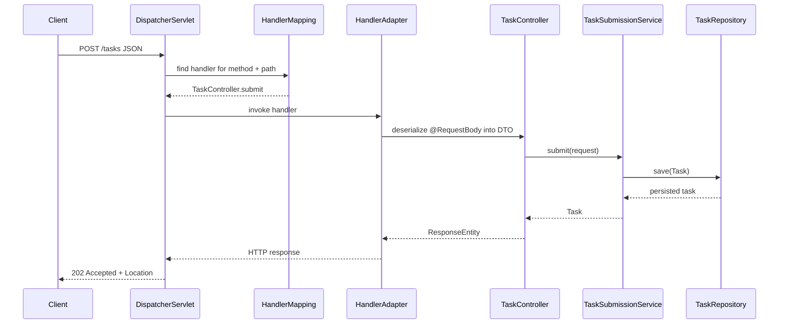

# REST APIs and Request Lifecycle

> Where this fits: Phase 2 turns the Task Queue from an in-process demo into a network service. This chapter builds the task submission API first by hand, explains why HTTP plumbing gets repetitive, then refactors it into Spring MVC while tracing a request through `DispatcherServlet`, controller mapping, DTO validation, service orchestration, and response creation.

The goal is not "learn `@RestController`." The goal is to make `POST /tasks` and `GET /tasks/{id}` correct, testable, and honest about HTTP semantics.

---

## Why This Exists

At the end of Phase 1, a task is submitted by Java code:

```java
queue.enqueue(new Task(...));
```

That is not a backend service yet. Real clients need to submit tasks over HTTP, receive a stable task id, and poll status later:

```bash
curl -X POST localhost:8080/tasks \
  -H 'content-type: application/json' \
  -d '{"type":"email.send","payload":{"to":"a@b.com"},"priority":5}'
```

The API layer has to solve problems the queue layer should not know about:

- Parse JSON.
- Validate request shape.
- Map request DTOs to domain objects.
- Choose HTTP status codes.
- Return headers like `Location`.
- Convert domain errors into error responses.
- Keep controllers thin so task execution logic stays testable.

Spring MVC exists because every HTTP service needs this request pipeline.

---

## Real-World Problem

Task submission is asynchronous. The server should not execute the handler inside the HTTP request. The correct behavior is:

1. Accept a valid task request.
2. Persist or enqueue the task.
3. Return quickly with a task id.
4. Let workers process the task later.
5. Let clients read task state through `GET /tasks/{id}`.

That means HTTP semantics matter:

| Operation | Endpoint | Success | Why |
| --- | --- | --- | --- |
| Submit task | `POST /tasks` | `202 Accepted` or `201 Created` | Work was accepted, not necessarily completed |
| Read task | `GET /tasks/{id}` | `200 OK` | Returns current state |
| Unknown task | `GET /tasks/{id}` | `404 Not Found` | Resource does not exist |
| Bad input | `POST /tasks` | `400 Bad Request` | Request cannot become a task |
| Over capacity | `POST /tasks` | `429 Too Many Requests` | Backpressure at API edge |

For this project, use `202 Accepted` when workers run asynchronously and include a `Location` header for status lookup.

---

## Manual Implementation

A tiny hand-written HTTP server shows what Spring MVC removes. This is not production code; it is a learning baseline.

```java
public final class ManualTaskHttpServer {
    private final HttpServer server;
    private final TaskSubmissionService service;

    public ManualTaskHttpServer(int port, TaskSubmissionService service) throws IOException {
        this.service = service;
        this.server = HttpServer.create(new InetSocketAddress(port), 0);
        this.server.createContext("/tasks", this::handleTasks);
    }

    private void handleTasks(HttpExchange exchange) throws IOException {
        if ("POST".equals(exchange.getRequestMethod())
                && "/tasks".equals(exchange.getRequestURI().getPath())) {
            handleSubmit(exchange);
            return;
        }
        if ("GET".equals(exchange.getRequestMethod())
                && exchange.getRequestURI().getPath().startsWith("/tasks/")) {
            handleGet(exchange);
            return;
        }
        write(exchange, 404, "{\"error\":\"not_found\"}");
    }

    private void handleSubmit(HttpExchange exchange) throws IOException {
        try {
            String body = new String(exchange.getRequestBody().readAllBytes(), StandardCharsets.UTF_8);
            SubmitTaskRequest request = parseJson(body);
            SubmittedTask submitted = service.submit(request.type(), request.payload(), request.priority());
            exchange.getResponseHeaders().add("Location", "/tasks/" + submitted.id());
            write(exchange, 202, "{\"id\":\"" + submitted.id() + "\",\"status\":\"PENDING\"}");
        } catch (IllegalArgumentException e) {
            write(exchange, 400, "{\"error\":\"bad_request\",\"message\":\"" + e.getMessage() + "\"}");
        }
    }
}
```

This code is doing too many jobs:

- Routing.
- Method matching.
- JSON parsing.
- Error formatting.
- Header writing.
- Controller orchestration.

The business operation is one line: `service.submit(...)`. Everything else is HTTP machinery.

---

## Pain Points

Manual HTTP code breaks down fast:

- JSON parsing and escaping are easy to get wrong.
- Repeated `if` statements become a routing framework.
- Errors return inconsistent shapes.
- Path variables must be parsed manually.
- Tests need a running server instead of a controller slice.
- Content negotiation, method-not-allowed, and unsupported media types are missing.

Spring MVC handles this pipeline so your controller can express the API boundary directly.

---

## Spring Boot Implementation

Define request and response DTOs at the edge:

```java
public record SubmitTaskRequest(
        String type,
        JsonNode payload,
        Integer priority,
        Integer maxAttempts,
        Instant scheduledAt) {
}

public record TaskResponse(
        String id,
        String type,
        TaskStatus status,
        int attempts,
        int maxAttempts,
        Instant createdAt,
        Instant scheduledAt,
        int priority) {
    static TaskResponse from(Task task) {
        return new TaskResponse(
                task.id(), task.type(), task.status(), task.attempts(),
                task.maxAttempts(), task.createdAt(), task.scheduledAt(), task.priority());
    }
}
```

Write a thin controller:

```java
@RestController
@RequestMapping("/tasks")
public final class TaskController {
    private final TaskSubmissionService submissionService;
    private final TaskQueryService queryService;

    public TaskController(TaskSubmissionService submissionService,
                          TaskQueryService queryService) {
        this.submissionService = submissionService;
        this.queryService = queryService;
    }

    @PostMapping
    public ResponseEntity<TaskResponse> submit(@RequestBody SubmitTaskRequest request) {
        Task task = submissionService.submit(request);
        URI location = URI.create("/tasks/" + task.id());
        return ResponseEntity.accepted()
                .location(location)
                .body(TaskResponse.from(task));
    }

    @GetMapping("/{id}")
    public ResponseEntity<TaskResponse> get(@PathVariable String id) {
        return queryService.findById(id)
                .map(TaskResponse::from)
                .map(ResponseEntity::ok)
                .orElseGet(() -> ResponseEntity.notFound().build());
    }
}
```

The controller does not know about `PostgresTaskQueue`, `WorkerPool`, JDBC, or retries. It speaks HTTP and delegates to services.

---

## Request Lifecycle Internals

Every Spring MVC request goes through the same high-level path:



Key pieces:

| Component | Job |
| --- | --- |
| `DispatcherServlet` | Front controller for Spring MVC. Every request enters here. |
| `HandlerMapping` | Finds a controller method from HTTP method and path. |
| `HandlerAdapter` | Invokes the method and resolves arguments like `@RequestBody` and `@PathVariable`. |
| `HttpMessageConverter` | Converts JSON bytes to DTOs and DTOs back to JSON. |
| `ResponseEntity` | Lets the controller control status, headers, and body explicitly. |

Spring MVC is a pipeline. Annotations describe how your controller participates in that pipeline.

---

## DTOs and Domain Boundaries

Do not expose the domain object directly as the API contract. A `Task` contains internal fields like attempts, scheduling, and status transitions. A submit request should only contain fields the client is allowed to set.

```java
@Service
public final class TaskSubmissionService {
    private final TaskRepository repository;
    private final Clock clock;

    public Task submit(SubmitTaskRequest request) {
        Instant now = Instant.now(clock);
        Task task = new Task(
                UUID.randomUUID().toString(),
                request.type(),
                request.payload().toString(),
                request.scheduledAt() != null && request.scheduledAt().isAfter(now)
                        ? TaskStatus.SCHEDULED
                        : TaskStatus.PENDING,
                0,
                request.maxAttempts() == null ? 3 : request.maxAttempts(),
                now,
                request.scheduledAt() == null ? now : request.scheduledAt(),
                request.priority() == null ? 0 : request.priority());
        repository.save(task);
        return task;
    }
}
```

The controller owns transport concerns. The service owns use-case behavior. The repository owns persistence.

---

## Project Integration

Add the HTTP adapter as an inbound port:

```text
Client
  -> TaskController
  -> TaskSubmissionService
  -> TaskRepository
  -> PostgresTaskQueue
  -> WorkerPool
```

Keep workers out of the request path. `POST /tasks` should enqueue/persist only. Execution belongs to the background worker pool.

---

## Tradeoffs

| Decision | Benefit | Cost |
| --- | --- | --- |
| `202 Accepted` for submit | Honest async semantics | Client must poll or subscribe for completion |
| DTOs instead of domain objects | Stable API, less leakage | More mapping code |
| Thin controllers | Testable use cases | More service classes |
| `ResponseEntity` | Explicit status and headers | Slightly more verbose than returning a body directly |
| Spring MVC | Mature HTTP pipeline | More framework surface to understand |

---

## Production Considerations

- Return consistent error bodies; Chapter 5 builds this properly.
- Use idempotency keys for client retries so duplicate `POST /tasks` calls do not create duplicate work.
- Put request size limits in place for payloads.
- Use `429` when the queue is saturated instead of letting memory or DB connections collapse.
- Do not block the request waiting for task execution.
- Include a correlation id so submission logs can be tied to worker logs later.

---

## Exercises

### Easy

1. Explain the difference between `201 Created` and `202 Accepted` for `POST /tasks`.
2. Draw the Spring MVC request flow for `GET /tasks/{id}`.
3. Create `SubmitTaskRequest` and `TaskResponse` DTOs.

### Medium

4. Implement `TaskController` with `POST /tasks` and `GET /tasks/{id}`.
5. Move task construction out of the controller into `TaskSubmissionService`.
6. Return `404` for unknown task ids using `ResponseEntity`.

### Hard

7. Add an idempotency-key header design: same key and same request should return the same task id.
8. Write `@WebMvcTest(TaskController.class)` tests for success, not found, and bad JSON.

---

## Solutions

### S1-S3

`201 Created` means a resource was created and is usually ready to read. `202 Accepted` means the request was accepted for asynchronous processing. A task queue normally returns `202` because task execution is not complete.

DTOs:

```java
public record SubmitTaskRequest(String type, JsonNode payload, Integer priority) {}
public record TaskResponse(String id, String type, TaskStatus status) {}
```

### S4-S6

The controller should delegate:

```java
@PostMapping
ResponseEntity<TaskResponse> submit(@RequestBody SubmitTaskRequest request) {
    Task task = submissionService.submit(request);
    return ResponseEntity.accepted()
            .location(URI.create("/tasks/" + task.id()))
            .body(TaskResponse.from(task));
}
```

`GET` should not throw for absence:

```java
@GetMapping("/{id}")
ResponseEntity<TaskResponse> get(@PathVariable String id) {
    return queryService.findById(id)
            .map(TaskResponse::from)
            .map(ResponseEntity::ok)
            .orElseGet(() -> ResponseEntity.notFound().build());
}
```

### S7-S8

Use `Idempotency-Key` as a request header and persist it with a unique index. On duplicate insert, read the existing task and return it. The web test should mock the service, call MVC, and assert status, `Location`, and body.

```java
@WebMvcTest(TaskController.class)
class TaskControllerTest {
    @Autowired MockMvc mvc;
    @MockBean TaskSubmissionService submissionService;
    @MockBean TaskQueryService queryService;

    @Test
    void submitReturnsAcceptedAndLocation() throws Exception {
        when(submissionService.submit(any())).thenReturn(sampleTask("t-1"));

        mvc.perform(post("/tasks")
                .contentType(MediaType.APPLICATION_JSON)
                .content("{\"type\":\"email.send\",\"payload\":{}}"))
           .andExpect(status().isAccepted())
           .andExpect(header().string("Location", "/tasks/t-1"));
    }
}
```

---

## Project Refactoring Task

1. Add `TaskController`.
2. Add `SubmitTaskRequest`, `TaskResponse`, and later `ErrorResponse`.
3. Add `TaskSubmissionService` and `TaskQueryService`.
4. Ensure `POST /tasks` persists/enqueues only.
5. Add controller tests that do not start the full worker pool.

---

## Git Commit For This Chapter

```bash
git add src/main/java src/test/java
git commit -m "feat: expose task submission rest api"
```

---

## Architecture Impact

This chapter adds the first inbound adapter:

```text
HTTP -> Controller -> Application service -> Domain ports
```

The worker side remains asynchronous. The API layer and worker layer communicate through the queue/persistence boundary, not direct method calls.

---

## Interview Questions

1. What is `DispatcherServlet`?
2. What is the difference between `@Controller` and `@RestController`?
3. Why use DTOs instead of exposing entities or domain objects?
4. When should `POST /tasks` return `202 Accepted`?
5. What does `ResponseEntity` give you?
6. How does Spring convert JSON into a Java record?
7. Why should controllers be thin?
8. How would you test a controller without starting the full application?

## Interview Takeaways

The controller is an adapter, not the application. It translates HTTP into a use case call and translates the result back into HTTP. Spring MVC provides the request pipeline; your architecture still decides where business behavior belongs.
