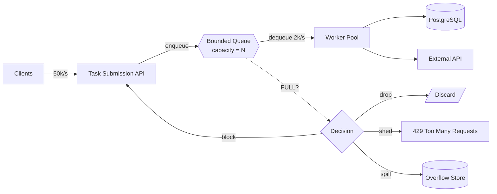
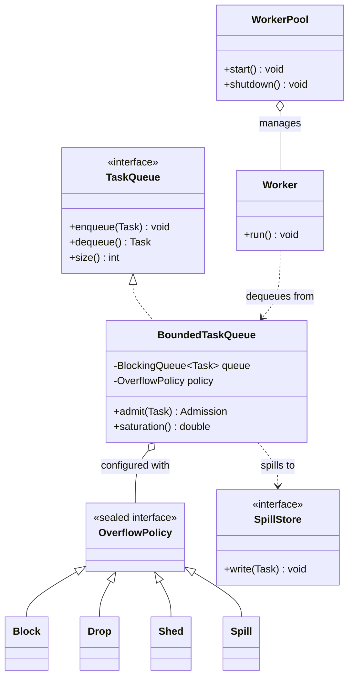
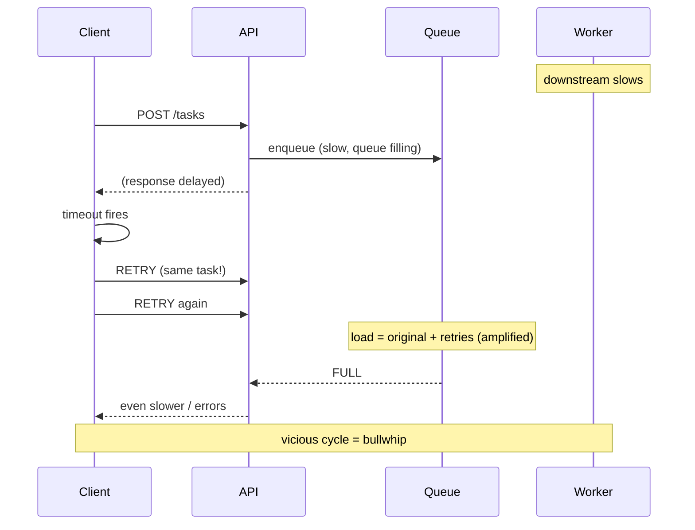

# Backpressure and Flow Control

> Where this fits: between the **Task Submission API** and the **Worker Pool / PostgreSQL** in our Distributed Task Queue. Backpressure is the discipline that keeps a fast producer (clients hammering `POST /tasks`) from drowning a slower consumer (workers, the DB) — so the platform degrades gracefully instead of collapsing.

Backpressure is the single most underappreciated reliability technique in backend systems. Retries, circuit breakers, and rate limiting all *react* to overload; backpressure *prevents* it by making slowness propagate back to the source. This chapter is implementation-first: we will build bounded queues, decide what to do when they fill, shed load deliberately, and wire reactive-streams demand into our task pipeline — all against the canonical `Task`, `TaskQueue`, `Worker`, and `WorkerPool` model.

---

## 1. Why This Exists

Imagine our Phase 1 pipeline: `Client -> Task Submission API -> InMemoryTaskQueue -> Worker Pool -> Task Execution`. Now imagine production traffic: a marketing campaign fires, and clients submit 50,000 tasks per second. Your worker pool can drain maybe 2,000 tasks per second because each task hits PostgreSQL and an external API.

What happens to the other 48,000 tasks per second?

If your queue is **unbounded**, they pile up in memory. The JVM heap grows. GC pauses lengthen. Latency for *every* request climbs because the GC is thrashing. Eventually you `OutOfMemoryError` and the whole node dies — taking the 2,000/s of useful work with it. This is a **metastable failure**: the system was healthy, a load spike pushed it over a threshold, and it cannot recover even after the spike ends because the backlog itself is now the problem.

> **The core insight:** A queue does not create capacity. It only *time-shifts* load. If the average arrival rate exceeds the average service rate, **no queue depth is large enough** — you are just choosing how long to delay the inevitable failure. Backpressure is the mechanism that says "the consumer is full; producer, slow down or stop" before memory and latency explode.

### Historical context

The term comes from fluid dynamics and plumbing: if water flows into a pipe faster than it can drain, pressure builds *backward* toward the source. In software, TCP flow control (1981, the sliding window) was the first widespread backpressure mechanism — a receiver advertises a window size, and a sender may not transmit beyond it. The **Reactive Streams** specification (2015, folded into Java 9 as `java.util.concurrent.Flow`) generalized this to application-level streams: a `Subscriber` *requests* `n` items, and a `Publisher` may never push more than the outstanding demand. We will use both ideas.



---

## 2. The Naive Version

Here is the first-cut `InMemoryTaskQueue` a beginner writes. It compiles, passes the happy-path test, and is a production landmine.

```java
public final class InMemoryTaskQueue implements TaskQueue {
    // UNBOUNDED. This is the bug.
    private final BlockingQueue<Task> queue = new LinkedBlockingQueue<>();

    @Override
    public void enqueue(Task t) {
        queue.add(t);          // never blocks, never rejects, grows forever
    }

    @Override
    public Task dequeue() throws InterruptedException {
        return queue.take();   // blocks until a task arrives
    }

    @Override
    public int size() {
        return queue.size();
    }
}
```

### Why this is dangerous

- `new LinkedBlockingQueue<>()` with no argument is **unbounded** (capacity `Integer.MAX_VALUE`). The producer never feels pain.
- `queue.add(t)` returns instantly regardless of backlog. The API thread happily accepts work it can never finish.
- Under sustained overload, memory grows without limit -> long GC pauses -> rising p99 latency -> `OutOfMemoryError`.
- Even before OOM, you have a **latency time-bomb**: a task enqueued when the backlog is 1,000,000 deep will not run for ~8 minutes (1M / 2k per second). By then the client has timed out and retried — amplifying the load. That is the **bullwhip effect** in miniature (more in §8).

The fundamental mistake: **the producer and consumer are decoupled with no feedback channel**. Backpressure is exactly that missing feedback channel.

---

## 3. Improved Version

Step one is trivial but transformative: **bound the queue**. A bounded `LinkedBlockingQueue` (or `ArrayBlockingQueue`) gives us a natural backpressure point because `put()` *blocks* when the queue is full.

```java
public final class InMemoryTaskQueue implements TaskQueue {
    private final BlockingQueue<Task> queue;

    public InMemoryTaskQueue(int capacity) {
        if (capacity <= 0) throw new IllegalArgumentException("capacity must be > 0");
        this.queue = new ArrayBlockingQueue<>(capacity); // FIXED-SIZE ring buffer
    }

    @Override
    public void enqueue(Task t) throws InterruptedException {
        queue.put(t); // BLOCKS the calling (producer) thread when full -> backpressure
    }

    @Override
    public Task dequeue() throws InterruptedException {
        return queue.take();
    }

    @Override
    public int size() {
        return queue.size();
    }
}
```

Now when the queue is full, the API thread that called `enqueue` *blocks*. The producer's speed is throttled to the consumer's speed automatically. Memory is bounded. No OOM.

But blocking the request thread is a blunt instrument:

- An HTTP request thread blocked inside `put()` is a thread that cannot serve other requests. With a fixed Tomcat thread pool, blocking enough request threads **stalls the entire web server** — including health checks and unrelated endpoints. You converted a memory problem into a thread-starvation problem.
- The client sits there with an open connection, getting slower and slower, with no signal about what is happening. It will eventually time out (and retry).

We need to **choose a strategy** rather than always blocking. That is the production version.

---

## 4. Production-Quality Version

A staff engineer treats "what happens when the queue is full" as a first-class, configurable policy. The four canonical responses:

| Strategy | Behavior when full | When to use | Risk |
|----------|-------------------|-------------|------|
| **Block** | Producer waits (bounded timeout) | Internal producers where slowdown is acceptable; ingestion from a durable upstream | Thread starvation if producer is an HTTP thread |
| **Drop** | Silently discard the new (or oldest) task | Telemetry, metrics, best-effort events where loss is tolerable | Silent data loss; hard to debug |
| **Shed** | Reject loudly — return `429 Too Many Requests` with `Retry-After` | Public APIs; the client can and should retry later | Pushes the problem to the client (correct!) but needs client cooperation |
| **Spill** | Overflow to durable storage (DB, S3, Kafka) | Cannot lose work, but can tolerate slower-tier processing | Adds a slower path; the spill store can itself overflow |

The production `TaskQueue` exposes a non-blocking, bounded `offer` with a clear boolean result, and the *caller* (the API layer) decides the policy. We model the policy as a sealed interface so the choices are exhaustive and switch-pattern-matchable.

```java
import java.time.Duration;
import java.util.concurrent.*;

/** What to do when the bounded queue cannot accept a task. */
public sealed interface OverflowPolicy
        permits OverflowPolicy.Block, OverflowPolicy.Drop, OverflowPolicy.Shed, OverflowPolicy.Spill {

    /** Block the producer up to {@code timeout}. */
    record Block(Duration timeout) implements OverflowPolicy {}

    /** Drop the incoming task (or evict oldest, depending on impl). */
    record Drop() implements OverflowPolicy {}

    /** Reject loudly so the API can return 429. */
    record Shed() implements OverflowPolicy {}

    /** Persist the task to a slower durable store. */
    record Spill(SpillStore store) implements OverflowPolicy {}
}
```

```java
/** Outcome of an admission attempt — lets the API translate to HTTP semantics. */
public enum Admission { ACCEPTED, DROPPED, REJECTED, SPILLED }
```

```java
import java.time.Duration;
import java.util.concurrent.*;

public final class BoundedTaskQueue implements TaskQueue {

    private final BlockingQueue<Task> queue;
    private final OverflowPolicy policy;
    private final MetricsCollector metrics; // counters: enqueued, dropped, rejected, spilled

    public BoundedTaskQueue(int capacity, OverflowPolicy policy, MetricsCollector metrics) {
        this.queue = new ArrayBlockingQueue<>(capacity);
        this.policy = policy;
        this.metrics = metrics;
    }

    /** Policy-aware admission. Returns how the task was handled. */
    public Admission admit(Task t) throws InterruptedException {
        // Fast path: try without blocking.
        if (queue.offer(t)) {
            metrics.increment("queue.enqueued");
            return Admission.ACCEPTED;
        }
        // Slow path: queue is full. Apply the configured policy.
        return switch (policy) {
            case OverflowPolicy.Block b -> {
                boolean ok = queue.offer(t, b.timeout().toMillis(), TimeUnit.MILLISECONDS);
                if (ok) {
                    metrics.increment("queue.enqueued.afterBlock");
                    yield Admission.ACCEPTED;
                }
                metrics.increment("queue.rejected.blockTimeout");
                yield Admission.REJECTED; // even blocking has a ceiling
            }
            case OverflowPolicy.Drop d -> {
                metrics.increment("queue.dropped");
                yield Admission.DROPPED;
            }
            case OverflowPolicy.Shed s -> {
                metrics.increment("queue.rejected.shed");
                yield Admission.REJECTED;
            }
            case OverflowPolicy.Spill sp -> {
                sp.store().write(t);
                metrics.increment("queue.spilled");
                yield Admission.SPILLED;
            }
        };
    }

    // TaskQueue interface methods delegate to the bounded queue.
    @Override public void enqueue(Task t) throws InterruptedException { admit(t); }
    @Override public Task dequeue() throws InterruptedException { return queue.take(); }
    @Override public int size() { return queue.size(); }

    /** Headroom signal for the API layer (0.0 = empty, 1.0 = full). */
    public double saturation() {
        int cap = queue.size() + queue.remainingCapacity();
        return cap == 0 ? 0.0 : (double) queue.size() / cap;
    }
}
```

```java
/** A slower durable overflow tier — could be Postgres, S3, or Kafka. */
public interface SpillStore {
    void write(Task t);
}
```

The web layer maps `Admission` to HTTP status — this is the crucial bit, because **load shedding only works if the client gets an honest signal**:

```java
@RestController
@RequestMapping("/tasks")
public final class TaskController {

    private final BoundedTaskQueue queue;
    private final TaskRepository repo;

    public TaskController(BoundedTaskQueue queue, TaskRepository repo) {
        this.queue = queue;
        this.repo = repo;
    }

    @PostMapping
    public ResponseEntity<?> submit(@RequestBody CreateTaskRequest req) throws InterruptedException {
        Task t = Task.newPending(req.type(), req.payload(), req.priority());
        Admission a = queue.admit(t);
        return switch (a) {
            case ACCEPTED, SPILLED -> {
                repo.save(t);
                yield ResponseEntity.accepted().body(new TaskAccepted(t.id(), a.name()));
            }
            case DROPPED -> ResponseEntity.accepted().build(); // best-effort: pretend success
            case REJECTED -> ResponseEntity.status(429)
                    .header("Retry-After", "2")               // seconds
                    .body(new Problem("queue_full", "System overloaded; retry shortly"));
        };
    }
}
```

> **Why `429` and not `503`?** `503 Service Unavailable` says "the whole service is down." `429 Too Many Requests` says "*you* are sending too fast; back off and retry." For backpressure we want the latter — it pairs naturally with client-side exponential backoff (see [retries.md](./retries.md)) and is the semantically correct shedding signal.

---

## 5. Code Walkthrough

### Beginner example — feel the difference between bounded and unbounded

```java
import java.util.concurrent.*;

public class BoundedVsUnbounded {
    public static void main(String[] args) throws InterruptedException {
        // Unbounded: producer never blocks, backlog grows without limit.
        BlockingQueue<Integer> unbounded = new LinkedBlockingQueue<>();
        for (int i = 0; i < 1_000_000; i++) unbounded.add(i);
        System.out.println("Unbounded size: " + unbounded.size()); // 1,000,000 (memory!)

        // Bounded: offer() returns false instead of growing.
        BlockingQueue<Integer> bounded = new ArrayBlockingQueue<>(10);
        int accepted = 0;
        for (int i = 0; i < 1_000_000; i++) {
            if (bounded.offer(i)) accepted++; // non-blocking; false when full
        }
        System.out.println("Bounded accepted: " + accepted); // 10, rest rejected
    }
}
```

Key takeaway: `offer()` returns a boolean — *that boolean is your backpressure signal*. `add()` throws or grows; `put()` blocks; `offer()` lets you decide.

### Intermediate example — a producer that respects backpressure with bounded blocking

```java
import java.time.Duration;
import java.util.concurrent.*;

public class BackpressuringProducer {

    private final BlockingQueue<Task> queue = new ArrayBlockingQueue<>(1_000);

    /** Submit with a bounded wait. Returns false if the system stayed full. */
    public boolean submit(Task t, Duration maxWait) throws InterruptedException {
        // Blocks up to maxWait. This is "block" overflow policy with a ceiling.
        boolean ok = queue.offer(t, maxWait.toNanos(), TimeUnit.NANOSECONDS);
        if (!ok) {
            // We waited and STILL could not enqueue. Shed instead of waiting forever.
            System.err.printf("Shedding task %s after waiting %s%n", t.id(), maxWait);
        }
        return ok;
    }

    /** A worker drains tasks slower than they arrive, forcing backpressure. */
    public void runWorker() {
        try {
            while (!Thread.currentThread().isInterrupted()) {
                Task t = queue.take();           // backpressure: only pull when ready
                Thread.sleep(5);                 // simulate slow work
                // ... execute t ...
            }
        } catch (InterruptedException e) {
            Thread.currentThread().interrupt();
        }
    }
}
```

The `offer(t, timeout, unit)` overload is the workhorse: it gives the consumer a chance to catch up, but caps the producer's wait so request threads are never pinned indefinitely.

### Production-inspired example — adaptive admission control with a saturation gate

A flat capacity is a cliff: at 99% full you accept, at 100% you shed. Smoother is to **probabilistically shed early** as saturation rises, which keeps headroom for high-priority tasks. This is a simplified CoDel/PID-style controller.

```java
import java.util.concurrent.ThreadLocalRandom;

/** Sheds low-priority tasks proactively as the queue fills, protecting headroom. */
public final class AdaptiveAdmissionController {

    private final BoundedTaskQueue queue;
    private final MetricsCollector metrics;

    public AdaptiveAdmissionController(BoundedTaskQueue queue, MetricsCollector metrics) {
        this.queue = queue;
        this.metrics = metrics;
    }

    public Admission admit(Task t) throws InterruptedException {
        double s = queue.saturation(); // 0.0 .. 1.0

        // Below 70% saturation: accept everything.
        // Above 70%: start shedding LOW priority tasks; keep accepting HIGH priority.
        if (s > 0.70) {
            double shedProbability = (s - 0.70) / 0.30; // 0 at 70%, 1 at 100%
            boolean lowPriority = t.priority() < 5;     // 0..4 = low, 5..9 = high
            if (lowPriority && ThreadLocalRandom.current().nextDouble() < shedProbability) {
                metrics.increment("queue.shed.adaptive");
                return Admission.REJECTED;
            }
        }
        return queue.admit(t);
    }
}
```

This protects the most important property under overload: **high-priority work still flows** while the queue degrades gracefully on low-priority work. It is the difference between "the whole system is slow" and "best-effort work is shed so critical work stays fast."

---

## 6. How This Applies to Our Task Queue Project

Mapping each backpressure decision onto the canonical model:



- **Protecting the worker pool:** the bounded queue is the membrane between the API and the workers. Workers `dequeue()` (a `take()` that blocks when empty) — that is *consumer-side* backpressure pulling at their own pace. The bound on the queue is *producer-side* backpressure.
- **Protecting PostgreSQL (Phase 2):** the DB connection pool (HikariCP) is itself a bounded resource — typically 10–20 connections. If 200 workers all try to `save(Task)` at once, 180 block waiting for a connection, and `connectionTimeout` fires. **The number of workers must be sized against the connection pool**, not against CPU alone. The worker pool size *is* a backpressure parameter on the DB.
- **The two-stage pipeline:** in Phase 2 the flow is `API -> Postgres -> PostgresTaskQueue -> Workers`. Here the queue is durable, so "spill" is the default — we persist first, then the workers `pollDue(n)` at their own rate. The backpressure point moves to the API's write path and the `pollDue` batch size `n`.
- **Rate limiting vs. backpressure:** these are complementary. The [TokenBucketRateLimiter](./rate-limiting.md) caps the *arrival* rate per client *before* the queue. Backpressure handles what arrives *after* the limiter when the consumer is still too slow. Use both: rate limiting for fairness across clients, backpressure for protecting the backend.

A concrete wiring for Phase 1:

```java
public final class TaskPlatform {
    public static BoundedTaskQueue buildQueue(MetricsCollector metrics) {
        // 10k capacity, shed (429) when full, with adaptive early shedding on top.
        return new BoundedTaskQueue(10_000, new OverflowPolicy.Shed(), metrics);
    }
}
```

---

## 7. Tradeoffs

| Concern | Bounded + Block | Bounded + Shed (429) | Bounded + Drop | Bounded + Spill |
|---------|-----------------|----------------------|----------------|-----------------|
| Memory safety | Yes | Yes | Yes | Yes (until store fills) |
| Data loss | None | None (client retries) | **Yes** | None |
| Producer latency under load | High (waits) | Low (fast 429) | Low | Low–medium (write) |
| Thread safety of web tier | **Poor** (pins request threads) | Good | Good | Good |
| Client cooperation needed | No | Yes (must honor 429) | No | No |
| Complexity | Lowest | Low | Lowest | Highest |
| Best for | internal/durable producers | public APIs | telemetry | "must not lose" work |

Other tradeoffs worth internalizing:

- **Queue depth vs. latency.** A deeper queue absorbs bigger bursts but increases worst-case latency (Little's Law: `L = λ × W`, so for a fixed throughput, more items in the system means more time in the system). Size the queue to your **latency SLO**, not to "as big as memory allows." If your SLO is 2s and you drain 2,000/s, your queue should hold at most ~4,000 items, not 4,000,000.
- **Blocking is contagious.** A blocked producer thread is a held resource. If that thread holds a lock or a DB connection while blocked on `put()`, you can deadlock the whole system. Never block while holding a scarce resource.
- **Synchronous vs. asynchronous backpressure.** Blocking is synchronous backpressure (simple, but ties up a thread). Reactive demand (§ below, in the reactive example) is asynchronous backpressure (no thread parked, but more complex). Virtual threads (Loom) make synchronous blocking cheap again — a parked virtual thread costs ~kilobytes, not a full OS thread — which is why blocking-style backpressure is becoming attractive on Java 21.

---

## 8. The Bullwhip Effect

The **bullwhip effect** (from supply-chain theory) is what happens when backpressure is *missing* and each layer reacts to local congestion by amplifying load upstream. In our platform:

1. Workers slow down (a downstream API got slow).
2. The queue fills; the API starts taking longer to enqueue.
3. Clients see slow responses and **time out**.
4. Timed-out clients **retry** — often immediately, often multiple times.
5. Now the queue receives the *original* load plus *all the retries*, amplifying the spike.
6. This makes everything slower, causing more timeouts, causing more retries...



**Backpressure breaks the loop** by converting the slow-response failure mode into a *fast* failure mode: instead of making the client wait (and time out and retry blindly), we return `429` immediately with `Retry-After`. A well-behaved client honoring `Retry-After` with jitter does not amplify — it backs off. This is why backpressure, retries, and idempotency are a package deal:

- **Backpressure** caps in-flight work and fails fast.
- **Bounded, jittered retries** (see [retries.md](./retries.md)) prevent retry storms.
- **Idempotency** (see [idempotency.md](./idempotency.md)) makes the inevitable duplicate submissions harmless.

---

## 9. Common Mistakes and Pitfalls

- **Unbounded queues "for safety."** The most common and most dangerous. An unbounded queue moves the failure from "fast, observable rejection" to "slow, mysterious OOM." Always bound. *Fix:* `new ArrayBlockingQueue<>(capacity)`.
- **Hidden unbounded queues.** `Executors.newFixedThreadPool(n)` uses an **unbounded** `LinkedBlockingQueue` internally. So does `newCachedThreadPool` (which instead spawns unbounded *threads*). *Fix:* build the executor explicitly with a bounded queue and a `RejectedExecutionHandler`.
  ```java
  ThreadPoolExecutor pool = new ThreadPoolExecutor(
      8, 8, 0L, TimeUnit.MILLISECONDS,
      new ArrayBlockingQueue<>(1_000),                 // bounded!
      new ThreadPoolExecutor.AbortPolicy());           // rejects loudly when full
  ```
- **Blocking HTTP request threads on `put()`.** Pins the web server's thread pool and stalls *all* endpoints. *Fix:* use `offer` with a short timeout, then shed (429). Or use virtual threads so blocking is cheap.
- **Shedding silently.** Dropping tasks without a metric/log makes overload invisible until customers complain. *Fix:* increment a counter on *every* drop/shed and alert on the rate.
- **Sizing the queue by memory, not by latency.** A 1M-deep queue "fits in RAM" but guarantees minutes of latency. *Fix:* size by `throughput × latency_SLO`.
- **Treating rate limiting as backpressure.** A rate limiter caps arrival rate but says nothing about whether the *consumer* is keeping up. A perfectly rate-limited stream can still overwhelm a degraded backend. *Fix:* combine both.
- **Ignoring the DB connection pool as a backpressure point.** Tuning the worker pool to 200 threads while HikariCP has 10 connections just moves the queue from your code into the connection pool's wait queue. *Fix:* size workers relative to the pool; let `connectionTimeout` shed.
- **Forgetting downstream backpressure.** Your queue may be fine while the external API you call is the real bottleneck. *Fix:* apply a [circuit breaker](./retries.md) / bulkhead around the slow dependency.

---

## 10. Refactoring Exercise

We will evolve a worker-submission path from broken to shippable.

### Bad

```java
public class IngestService {
    private final ExecutorService pool = Executors.newFixedThreadPool(8); // unbounded queue inside!

    public void ingest(Task t) {
        pool.submit(() -> process(t)); // submit never blocks; backlog grows in the pool's queue
    }
    private void process(Task t) { /* hits DB + external API */ }
}
```

Problems: `newFixedThreadPool` hides an unbounded `LinkedBlockingQueue`. Under load, millions of `Runnable`s queue up in memory. No feedback to the caller. OOM eventually.

### Improved

```java
public class IngestService {
    private final ThreadPoolExecutor pool = new ThreadPoolExecutor(
            8, 8, 0L, TimeUnit.MILLISECONDS,
            new ArrayBlockingQueue<>(1_000),               // bounded
            new ThreadPoolExecutor.CallerRunsPolicy());    // backpressure via caller-runs

    public void ingest(Task t) {
        pool.submit(() -> process(t)); // when full, the CALLER runs the task -> natural slowdown
    }
    private void process(Task t) { /* ... */ }
}
```

Better: the queue is bounded, and `CallerRunsPolicy` provides backpressure — when the pool is saturated, the submitting thread executes the task itself, which naturally slows the producer. But caller-runs blocks the *request* thread (the same web-tier hazard), and gives no clean client signal.

### Production-quality

```java
import java.time.Duration;
import java.util.concurrent.*;

public final class IngestService {

    private final ThreadPoolExecutor pool;
    private final MetricsCollector metrics;

    public IngestService(MetricsCollector metrics) {
        this.metrics = metrics;
        this.pool = new ThreadPoolExecutor(
                8, 8, 0L, TimeUnit.MILLISECONDS,
                new ArrayBlockingQueue<>(1_000),
                new ThreadPoolExecutor.AbortPolicy());   // throws RejectedExecutionException when full
    }

    /** Returns an Admission so the API can translate to HTTP 429. */
    public Admission ingest(Task t) {
        try {
            pool.execute(() -> process(t));
            metrics.increment("ingest.accepted");
            return Admission.ACCEPTED;
        } catch (RejectedExecutionException rejected) {
            // Bounded queue is full AND all threads busy -> shed loudly.
            metrics.increment("ingest.shed");
            return Admission.REJECTED;                   // API -> 429 + Retry-After
        }
    }

    private void process(Task t) {
        Timer.Sample sample = metrics.startTimer();
        try {
            // ... save(t), call external API, update status ...
        } finally {
            metrics.stopTimer(sample, "task.process.duration");
        }
    }

    public void shutdown() {
        pool.shutdown();
        try {
            if (!pool.awaitTermination(30, TimeUnit.SECONDS)) pool.shutdownNow();
        } catch (InterruptedException e) {
            pool.shutdownNow();
            Thread.currentThread().interrupt();
        }
    }
}
```

The final version: bounded queue, explicit `AbortPolicy` that rejects loudly, the rejection translated into a clean `Admission.REJECTED` (→ HTTP 429), metrics on both acceptance and shedding, and a clean shutdown. The web thread is never pinned; the client gets an honest, actionable signal.

---

## 11. Exercises

### Easy

**E1 (Knowledge check).** Explain in two sentences why an unbounded queue does *not* solve an overload where arrival rate persistently exceeds service rate. What property of queues makes this true?

**E2 (Coding).** Implement a `boolean tryEnqueue(Task t)` on a bounded queue that returns `false` immediately when full (no blocking). Use it to count how many of 100 submissions succeed when capacity is 10 and nothing is dequeued.

### Medium

**M1 (Coding).** Implement `enqueueWithDeadline(Task t, Duration budget)` that blocks up to `budget`, then sheds. Return an `Admission`. Prove with a test that a slow consumer causes some submissions to be `REJECTED`.

**M2 (Refactoring).** You are handed `Executors.newCachedThreadPool()` used for task processing. Explain its backpressure failure mode, then refactor to a bounded `ThreadPoolExecutor` with an appropriate rejection policy. Justify the policy choice.

### Hard

**H1 (Design).** Design a two-tier backpressure scheme for Phase 2 (`API -> Postgres -> Workers`). The API must never block, must never lose accepted work, and must shed *new* work under overload while *in-flight* work completes. Specify where each backpressure point lives and what signal each tier emits.

**H2 (Interview-style / stretch).** Implement a minimal Reactive Streams `Publisher`/`Subscriber` pair where the `Subscriber` requests tasks in batches of `n` and the `Publisher` never emits beyond the outstanding demand. Show that a slow subscriber automatically throttles a fast publisher with **no shared bounded queue** — demand *is* the backpressure.

---

## 12. Solutions

### E1

A queue time-shifts load but does not add throughput. If average arrival rate `λ` exceeds average service rate `μ`, the backlog grows without bound for *any* queue depth — the queue only delays, never prevents, the failure. By Little's Law (`L = λ × W`), with `λ > μ` the number in system `L` (and the wait `W`) increases monotonically until memory is exhausted.

### E2

```java
import java.util.concurrent.*;

public final class TryEnqueueDemo {
    private final BlockingQueue<Task> q = new ArrayBlockingQueue<>(10);

    public boolean tryEnqueue(Task t) {
        return q.offer(t); // non-blocking; false when full
    }

    public static void main(String[] args) {
        TryEnqueueDemo d = new TryEnqueueDemo();
        int accepted = 0;
        for (int i = 0; i < 100; i++) {
            if (d.tryEnqueue(Task.newPending("noop", "{}", 0))) accepted++;
        }
        System.out.println("accepted = " + accepted); // 10 (capacity), 90 rejected
    }
}
```

`offer()`'s boolean return is the backpressure signal: it tells the caller "I am full" without growing memory or blocking.

### M1

```java
import java.time.Duration;
import java.util.concurrent.*;

public final class DeadlineQueue {
    private final BlockingQueue<Task> q = new ArrayBlockingQueue<>(4);

    public Admission enqueueWithDeadline(Task t, Duration budget) throws InterruptedException {
        boolean ok = q.offer(t, budget.toNanos(), TimeUnit.NANOSECONDS);
        return ok ? Admission.ACCEPTED : Admission.REJECTED;
    }

    public Task dequeue() throws InterruptedException { return q.take(); }
}
```

```java
import org.junit.jupiter.api.Test;
import java.time.Duration;
import static org.assertj.core.api.Assertions.assertThat;

class DeadlineQueueTest {
    @Test
    void slowConsumerCausesShedding() throws Exception {
        DeadlineQueue dq = new DeadlineQueue();
        // No consumer drains it -> after 4 accepted, the 5th must be rejected.
        Admission a1 = dq.enqueueWithDeadline(Task.newPending("t","{}",0), Duration.ofMillis(50));
        Admission a2 = dq.enqueueWithDeadline(Task.newPending("t","{}",0), Duration.ofMillis(50));
        Admission a3 = dq.enqueueWithDeadline(Task.newPending("t","{}",0), Duration.ofMillis(50));
        Admission a4 = dq.enqueueWithDeadline(Task.newPending("t","{}",0), Duration.ofMillis(50));
        Admission a5 = dq.enqueueWithDeadline(Task.newPending("t","{}",0), Duration.ofMillis(50));
        assertThat(a1).isEqualTo(Admission.ACCEPTED);
        assertThat(a4).isEqualTo(Admission.ACCEPTED);
        assertThat(a5).isEqualTo(Admission.REJECTED); // waited 50ms, still full
    }
}
```

The deadline bounds producer wait: we give the consumer a chance to catch up, but cap the blocking so request threads are never pinned indefinitely.

### M2

`newCachedThreadPool()` uses a `SynchronousQueue` (zero capacity) and an **unbounded thread count**: every submission that cannot be handed off immediately spawns a *new* thread. Under load this creates thousands of threads, exhausting memory and the OS thread limit, then OOM. There is no backpressure on submission — `submit` always "succeeds" by making a thread.

```java
import java.util.concurrent.*;

ThreadPoolExecutor pool = new ThreadPoolExecutor(
        16, 16,                                  // fixed worker count
        0L, TimeUnit.MILLISECONDS,
        new ArrayBlockingQueue<>(2_000),         // bounded backlog
        new ThreadPoolExecutor.AbortPolicy());   // reject loudly when both are full
```

`AbortPolicy` is chosen because this pool serves an API: we want a fast, observable `RejectedExecutionException` that becomes a `429`, rather than `CallerRunsPolicy` (which would block the request thread) or `DiscardPolicy` (silent loss). Worker count is bounded so the DB connection pool downstream is not overwhelmed.

### H1

Two-tier design for `API -> Postgres -> Workers`:

- **Tier 1 — admission at the API (shed new work).** The API never blocks. It first checks a cheap saturation signal: the count of `PENDING` rows (or a Micrometer gauge updated by the worker tier). If `pending > highWatermark`, return `429 + Retry-After`. Otherwise `INSERT` the task with status `PENDING` (durable — so accepted work is never lost) and return `202 Accepted`. Backpressure signal emitted: HTTP `429`.
- **Tier 2 — pull-based draining (protect DB + workers).** Workers do not receive a push. Each worker (or a leader poller) calls `repo.pollDue(n)` in a `SELECT ... FOR UPDATE SKIP LOCKED LIMIT n` query, claiming a *bounded batch* `n`. The batch size `n` and the worker count together cap concurrent DB load. Because draining is pull-based, the workers consume exactly as fast as they can — **inherent consumer-side backpressure**. The DB is protected because no more than `workers × n` rows are ever in flight, and that number is sized against the HikariCP pool.

In-flight work always completes (it is already claimed in the DB), while *new* work is shed at admission. The two backpressure points: the high-watermark gate (producer side) and the bounded `pollDue(n)` batch (consumer side).

### H2

A minimal reactive pull pipeline where **demand is the backpressure** — no shared bounded queue exists:

```java
import java.util.concurrent.Flow.*;
import java.util.concurrent.*;
import java.util.concurrent.atomic.AtomicLong;

/** Emits tasks only up to the subscriber's outstanding demand. */
final class TaskPublisher implements Publisher<Task> {
    private final int total;
    TaskPublisher(int total) { this.total = total; }

    @Override public void subscribe(Subscriber<? super Task> sub) {
        sub.onSubscribe(new Subscription() {
            private final AtomicLong produced = new AtomicLong();
            private volatile boolean cancelled = false;

            @Override public void request(long n) {
                if (cancelled) return;
                // Emit at most n items — never exceed demand. THIS is backpressure.
                for (long i = 0; i < n && produced.get() < total && !cancelled; i++) {
                    long idx = produced.incrementAndGet();
                    sub.onNext(Task.newPending("demo", "{\"i\":" + idx + "}", 0));
                }
                if (produced.get() >= total) sub.onComplete();
            }
            @Override public void cancel() { cancelled = true; }
        });
    }
}

/** A slow subscriber that requests a batch, processes it, then asks for more. */
final class SlowSubscriber implements Subscriber<Task> {
    private static final int BATCH = 4;
    private Subscription sub;
    private int processedInBatch = 0;

    @Override public void onSubscribe(Subscription s) {
        this.sub = s;
        s.request(BATCH);                 // initial demand
    }
    @Override public void onNext(Task t) {
        slowWork(t);                      // pretend each item is expensive
        if (++processedInBatch == BATCH) {
            processedInBatch = 0;
            sub.request(BATCH);           // pull the next batch only when ready
        }
    }
    @Override public void onError(Throwable th) { th.printStackTrace(); }
    @Override public void onComplete() { System.out.println("done"); }

    private void slowWork(Task t) {
        try { Thread.sleep(5); } catch (InterruptedException e) { Thread.currentThread().interrupt(); }
    }
}

public final class ReactiveBackpressureDemo {
    public static void main(String[] args) {
        new TaskPublisher(20).subscribe(new SlowSubscriber());
        // The publisher emits 4, waits for the next request(4), emits 4 more, ...
        // A fast publisher is throttled to the subscriber's pace with NO queue.
    }
}
```

The publisher's loop in `request(n)` *physically cannot* emit more than the subscriber asked for. The subscriber asks for the next batch only after finishing the current one, so the producer's speed is clamped to the consumer's speed. Memory is bounded by `BATCH`, not by the backlog. This is asynchronous, queue-free backpressure — the model behind Project Reactor, RxJava, and R2DBC (reactive PostgreSQL). In real frameworks `request(n)` and `onNext` run on different threads via an `Executor`, but the demand contract is identical.

---

## 13. Interview Questions and Takeaways

**Q1. What is backpressure and why is it different from rate limiting?**
Backpressure is a feedback signal from a slow consumer to a fast producer that throttles or rejects work to prevent overload. Rate limiting caps the *arrival* rate (often per client, for fairness) regardless of consumer health. A rate-limited stream can still overwhelm a *degraded* consumer; backpressure responds to the consumer's actual state. Use both: rate limiting at the edge, backpressure protecting the backend.

**Q2. Why is an unbounded queue dangerous?**
It converts a fast, observable failure (rejection) into a slow, catastrophic one (OOM after minutes of rising latency and GC thrash). It also enables the bullwhip effect because the latency it introduces triggers client timeouts and retries. Always bound queues and size them by latency SLO, not by available memory.

**Q3. When full, should you block, drop, shed, or spill?**
Depends on the producer and the data. Block for internal producers where slowdown is acceptable (and cheap with virtual threads). Drop for best-effort telemetry. Shed (429 + Retry-After) for public APIs where the client can retry. Spill to durable storage when work must not be lost. The key is to *choose explicitly* and emit metrics, never to silently grow or silently drop.

**Q4. What is the bullwhip effect and how does backpressure prevent it?**
Local congestion → slow responses → client timeouts → blind retries → amplified load → more congestion. Backpressure breaks the loop by failing *fast* with a `429 + Retry-After` instead of failing *slow*, so well-behaved clients back off (with jitter) rather than amplifying. It works in concert with bounded jittered retries and idempotency.

**Q5. How do reactive streams implement backpressure?**
The `Subscriber` calls `subscription.request(n)` to signal demand; the `Publisher` must never emit more than the outstanding demand via `onNext`. Demand flows upstream, data flows downstream, and the producer is clamped to the consumer's pace — no shared bounded queue required. This is `java.util.concurrent.Flow` in the JDK, and the basis of Reactor/RxJava/R2DBC.

**Q6. How does the thread pool's queue choice affect backpressure?**
`Executors.newFixedThreadPool` hides an unbounded `LinkedBlockingQueue` (memory risk); `newCachedThreadPool` hides unbounded thread creation (also a memory/OS risk). For backpressure, construct a `ThreadPoolExecutor` with a *bounded* queue and a deliberate `RejectedExecutionHandler` (`AbortPolicy` to shed, `CallerRunsPolicy` to throttle the caller).

**Q7. Where is the backpressure point when PostgreSQL is the bottleneck?**
The DB connection pool. Sizing 200 workers against a 10-connection HikariCP pool just relocates the backlog into the pool's wait queue, and `connectionTimeout` becomes your shedding mechanism. Size the worker count relative to the connection pool and treat the pool's timeout as a backpressure signal.

**Takeaways:** Bound everything. Make overload a fast, observable, deliberate decision. Choose block/drop/shed/spill per data criticality. Fail fast with `429 + Retry-After` to defuse the bullwhip. Demand-based (reactive) backpressure removes the queue entirely. Backpressure, retries, and idempotency are one system.

---

## 14. Production Considerations

- **What breaks at scale.** The first thing to break is *latency*, not throughput — long before OOM, a deepening queue blows your p99. Alert on **queue saturation** (`saturation()` gauge) and **queue residence time**, not just on errors. A queue that is consistently >70% full is a system running without headroom; one bad GC pause from a cascade.
- **Monitoring.** Export per-policy counters: `queue.enqueued`, `queue.dropped`, `queue.rejected.shed`, `queue.spilled`, plus a `queue.saturation` gauge and a `task.queue.residence` timer via Micrometer → Prometheus. Build a Grafana panel for shed-rate; a rising shed-rate is your earliest overload signal.
- **Load shedding fairness.** Naive shedding penalizes whoever submits at the wrong moment. Prefer *priority-aware* shedding (drop low-priority first, as in `AdaptiveAdmissionController`) and consider per-tenant quotas so one noisy tenant cannot consume all admission headroom.
- **Graceful degradation, not collapse.** The goal is a system that, at 3× capacity, serves 1× of its most important traffic well and sheds the rest cleanly — versus a system that serves 0× because it fell over. Test this with load tests that push *past* capacity and assert that high-priority p99 stays within SLO while shed-rate rises.
- **Virtual threads change the calculus.** On Java 21, parking a virtual thread on a blocking `put()`/`take()` is cheap (no pinned OS thread). This makes *synchronous* blocking backpressure attractive again for many workloads, reducing the need for fully reactive pipelines. Caveat: blocking inside a `synchronized` block still pins the carrier thread — use `ReentrantLock` in hot paths.
- **Spill stores overflow too.** "Spill to Kafka/S3" is not infinite. The spill tier needs its own backpressure and its own monitoring; otherwise you have just moved the cliff one layer down.
- **Timeouts everywhere.** Every blocking call — `offer(timeout)`, DB `connectionTimeout`, HTTP client read timeout — must have a finite bound, or backpressure becomes a slow hang. Unbounded waits are unbounded queues in disguise.

---

## What We Can Improve In Our Project Using This Concept

Our Phase 1 `InMemoryTaskQueue` uses an unbounded `LinkedBlockingQueue`, which is a latent OOM. We will (1) replace it with `BoundedTaskQueue` backed by `ArrayBlockingQueue`, (2) add a configurable `OverflowPolicy` (defaulting to `Shed`), (3) translate `Admission` into HTTP `429 + Retry-After` in `TaskController`, (4) add an `AdaptiveAdmissionController` that protects high-priority tasks under saturation, and (5) expose a `queue.saturation` gauge and shed/drop counters through `MetricsCollector`. This converts our most likely production outage (memory exhaustion under a traffic spike) into a graceful, observable degradation.

## Project Refactoring Task

1. Change `InMemoryTaskQueue`'s constructor to require a `capacity` and use `ArrayBlockingQueue`. Update all call sites.
2. Introduce the `OverflowPolicy` sealed interface and `Admission` enum exactly as in §4.
3. Implement `BoundedTaskQueue.admit(Task)` with the `switch` over `OverflowPolicy`.
4. Wire `TaskController.submit` to return `429 + Retry-After` on `Admission.REJECTED`.
5. Add `AdaptiveAdmissionController` and place it in front of the queue for the public submission path.
6. Add Micrometer counters/gauge and a JUnit 5 + AssertJ test asserting that submissions are `REJECTED` once the bounded queue is full with a stalled consumer.

## Git Commit For This Chapter

```text
feat(queue): add bounded backpressure with overflow policies and load shedding

- Replace unbounded InMemoryTaskQueue with BoundedTaskQueue (ArrayBlockingQueue)
- Add sealed OverflowPolicy {Block, Drop, Shed, Spill} and Admission enum
- Map Admission.REJECTED to HTTP 429 + Retry-After in TaskController
- Add AdaptiveAdmissionController for priority-aware early shedding
- Export queue.saturation gauge and shed/drop counters via Micrometer

Files touched:
  src/main/java/.../queue/InMemoryTaskQueue.java
  src/main/java/.../queue/BoundedTaskQueue.java
  src/main/java/.../queue/OverflowPolicy.java
  src/main/java/.../queue/Admission.java
  src/main/java/.../queue/SpillStore.java
  src/main/java/.../admission/AdaptiveAdmissionController.java
  src/main/java/.../api/TaskController.java
  src/test/java/.../queue/BoundedTaskQueueTest.java
```

## Architecture Impact

Backpressure introduces an explicit **admission-control boundary** between the API and the worker pool. The queue stops being a passive buffer and becomes an active control point that emits a saturation signal and a per-request `Admission` decision. Architecturally this (a) makes overload a first-class, observable state rather than an emergent failure, (b) shifts the cost of overload from the server (memory/latency) to the client (a fast 429 it must retry), and (c) establishes the seam where Phase 2's durable `PostgresTaskQueue` and Phase 4's distributed broker plug in — each just supplies a different `OverflowPolicy` (spill-to-DB, spill-to-broker) behind the same `BoundedTaskQueue` contract.

## Interview Takeaways

- Bound every queue; size by **latency SLO**, not memory. Unbounded queues turn fast rejections into slow OOMs.
- Four overflow responses — **block, drop, shed, spill** — chosen by data criticality; always metered, never silent.
- Backpressure defuses the **bullwhip effect** by failing fast (429 + Retry-After) instead of failing slow.
- **Demand-based reactive backpressure** (`request(n)`) needs no shared queue — the producer is clamped to consumer demand.
- The real backpressure points are often hidden: the thread pool's internal queue, the DB connection pool, the slow downstream dependency.

---

### See also

- [blocking-queue.md](../06-concurrency/blocking-queue.md) — the `BlockingQueue` primitives (`put`/`take`/`offer`) that bounded backpressure is built on.
- [executor-service.md](../06-concurrency/executor-service.md) — thread pools and their hidden internal queues.
- [producer-consumer.md](../07-queues-and-messaging/producer-consumer.md) — the core pattern backpressure regulates.
- [rate-limiting.md](./rate-limiting.md) — edge admission control that complements backpressure.
- [retries.md](./retries.md) — jittered, bounded retries that prevent backpressure-triggered retry storms.
- [idempotency.md](./idempotency.md) — makes duplicate submissions (from retries) harmless.
