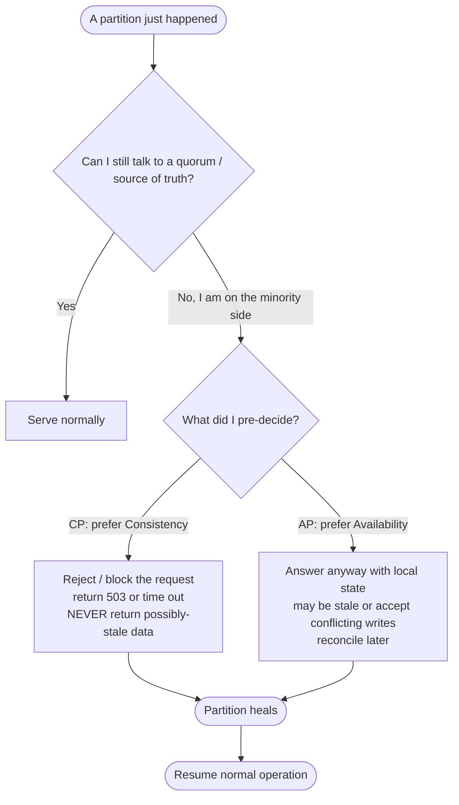
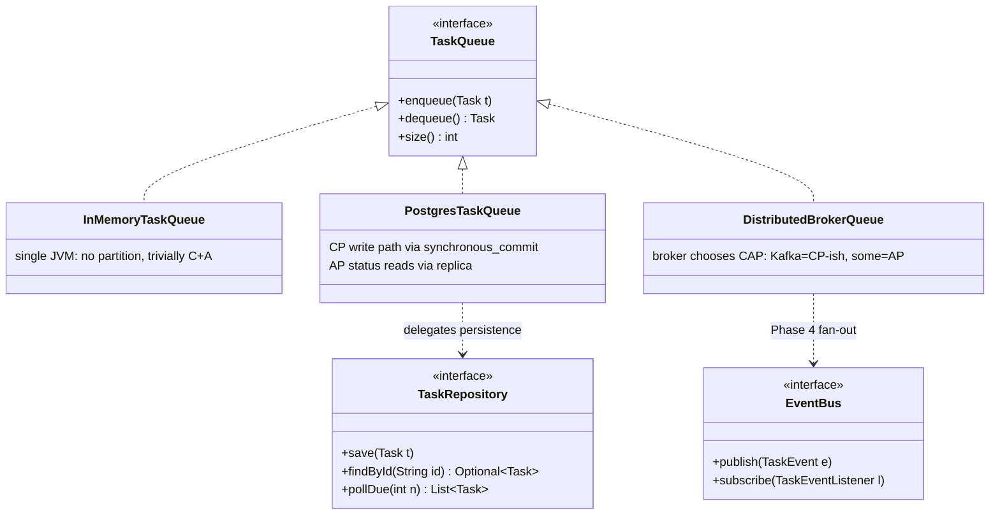

# CAP Theorem (and PACELC)

> Where this fits in the project: the moment our task queue stops being a single JVM with an `InMemoryTaskQueue` and becomes a fleet of API nodes and worker nodes talking to PostgreSQL (Phase 2) and a distributed broker (Phase 4), CAP is the law that governs what happens when the network between them breaks. It decides whether a `POST /tasks` should fail loudly or accept-and-maybe-lose, and whether two workers can ever grab the same `Task`.

---

## 1. Why this exists — the real problem it solves

The naive mental model of a distributed system is: "I have several machines, they coordinate, and to the client it looks like one big reliable computer." That model is a lie, and CAP is the theorem that tells you *which specific lie you are forced to choose* the instant a network link drops.

Here is the concrete pain. In Phase 1 our entire platform is one process:

```text
Client -> Task Submission API -> InMemoryTaskQueue -> Worker Pool -> Task Execution
```

There is exactly one copy of the queue, one source of truth, and "is this task enqueued?" has a single unambiguous answer. There are no partitions because there is no network in the middle of the data path. Life is easy and boring.

In Phase 2 onward we split into multiple API nodes and multiple worker nodes, all sharing a `PostgresTaskQueue` and `TaskRepository`:

```text
Client -> [API node A | API node B] -> PostgreSQL (primary + replica) -> [Worker 1 | Worker 2 | Worker 3]
```

Now there is a network between every pair of boxes. Networks **partition**: a switch reboots, a NIC flaps, a security group rule is misconfigured, a GC pause makes a node look dead, an AWS AZ loses connectivity to another AZ for 90 seconds. When that happens, you cannot have all three of: every read returns the latest write, every request gets a non-error answer, and the system keeps running despite the partition. You get to keep **two**. CAP forces you to pre-decide which one you sacrifice, *before* the outage, because during the outage there is no time to think.

A short history: Eric Brewer stated the conjecture in 2000 (PODC keynote). Gilbert and Lynch proved it formally in 2002 for an asynchronous network model. For a decade it was widely misread as "pick 2 of 3 always," which is wrong. Brewer's 2012 clarification ("CAP Twelve Years Later") and Daniel Abadi's **PACELC** (2010, formalized 2012) fixed the framing: the C-vs-A tradeoff *only* binds during a partition; the rest of the time you are trading **latency vs consistency**, which is what your system does 99.99% of the time. That second tradeoff is the one that actually shapes your p99.

---

## 2. The three letters, defined precisely

Sloppy definitions are why CAP gets misused. Use these.

**C — Consistency** (in CAP this means **linearizability**, the strongest single-object guarantee). There is a single, real-time-ordered view of each object. Once a write completes, every subsequent read — from *any* node — returns that write or a later one. It behaves *as if* there were one copy of the data and operations happened one at a time in an order consistent with wall-clock time. Note: this is **not** the "C" (constraints/ACID consistency) of database transactions. Same letter, different concept.

**A — Availability.** *Every* request received by a *non-failing* node returns a non-error response in finite time. Crucially: a node that is up but refuses to answer (returns an error or hangs) is **not** available under CAP's definition. "Eventually responds" is not enough; it must respond. There is no latency bound in the formal definition, but in practice "available" means "answers reasonably promptly."

**P — Partition tolerance.** The system keeps operating (continues to satisfy its other guarantees as best it can) even when the network drops or delays arbitrarily many messages between nodes. A partition is the network splitting the nodes into groups that cannot talk to each other.

The theorem: **in the presence of a partition (P), you cannot have both C and A.** You must drop one.

The most important and most-missed point: **P is not optional.** Networks partition. You do not get to "choose CP, AP, or CA" as three equal options. CA — consistent and available but not partition-tolerant — describes a single node or a system you only run on a perfect network, i.e. a system that gives *no* guarantees the moment a partition happens. Real distributed systems are partition-tolerant by necessity, so the real choice is binary: **when a partition happens, am I CP (sacrifice availability) or AP (sacrifice consistency)?**



---

## 3. The naive version — pretending partitions do not exist

Here is the first-cut distributed enqueue a learner writes after Phase 1, trying to make the in-memory queue "highly available" by replicating to two nodes. It is wrong in an instructive way.

```java
// NAIVE: replicate the enqueue to a peer, fire-and-forget. "It's available AND consistent!"
public final class NaiveReplicatedQueue implements TaskQueue {
    private final BlockingQueue<Task> local = new LinkedBlockingQueue<>();
    private final PeerClient peer; // HTTP/gRPC client to the other node

    @Override
    public void enqueue(Task t) {
        local.add(t);                 // 1. write locally
        peer.replicateAsync(t);       // 2. tell the peer, do not wait, ignore failures
    }

    @Override
    public Task dequeue() throws InterruptedException {
        return local.take();
    }

    @Override
    public int size() {
        return local.size();
    }
}
```

What's wrong:

- **It silently chose AP and pretended it was CP.** `replicateAsync` does not wait and does not check for an ack. During a partition, node A keeps accepting enqueues that node B never sees. A read on B (`size()`, or a worker on B dequeuing) returns a *different* answer than A. That violates linearizability — but the code reads like it's "keeping both copies in sync."
- **No conflict handling.** When the partition heals, A and B both have queues the other never saw. Which order do tasks run in? Are duplicates created? The code has no answer.
- **Lost writes.** A task enqueued on A during a partition can vanish if A crashes before the partition heals, because B never got it.
- **No idempotency.** When you *do* add retries to `replicateAsync`, the same task gets enqueued twice. (We fix duplicates properly in [idempotency.md](./idempotency.md) and [retries.md](./retries.md).)

This is the canonical mistake: building an AP system by accident while believing you built a CP one.

---

## 4. Improved version — make the choice explicit (CP via quorum)

If correctness matters more than uptime for *this* operation — and for "did we accept your task exactly once?" it usually does — make the system **CP**: an enqueue only succeeds if a quorum of replicas acknowledges it. If you cannot reach a quorum (you are on the minority side of a partition), you **refuse** rather than lie.

```java
// IMPROVED: synchronous quorum write. Explicitly CP: refuse under partition, never accept silently.
public final class QuorumReplicatedQueue implements TaskQueue {
    private final List<ReplicaClient> replicas;   // includes the local node
    private final int quorum;                      // e.g. for 3 replicas, quorum = 2

    public QuorumReplicatedQueue(List<ReplicaClient> replicas) {
        this.replicas = List.copyOf(replicas);
        this.quorum = replicas.size() / 2 + 1;     // majority
    }

    @Override
    public void enqueue(Task t) {
        int acks = 0;
        List<Exception> failures = new ArrayList<>();
        for (ReplicaClient r : replicas) {
            try {
                r.write(t);            // synchronous, with a short timeout inside write()
                acks++;
            } catch (Exception e) {
                failures.add(e);       // a partitioned/dead replica counts as no-ack
            }
        }
        if (acks < quorum) {
            // We are on the minority side. Choosing Consistency: do NOT accept.
            throw new QueueUnavailableException(
                "Only %d/%d replicas acked; quorum=%d. Refusing to risk a lost or split write."
                    .formatted(acks, replicas.size(), quorum));
        }
        // Quorum reached: the write is durable on a majority, safe to ack the client.
    }

    @Override public Task dequeue() throws InterruptedException { /* read from quorum too */ throw new UnsupportedOperationException(); }
    @Override public int size() { return replicas.stream().mapToInt(ReplicaClient::localSize).max().orElse(0); }
}
```

Why this is better:

- The C-vs-A choice is now **visible and deliberate**. Under a partition the minority side throws `QueueUnavailableException` (a 503 to the client) instead of accepting a write it cannot make durable. We sacrifice availability to preserve a single coherent history.
- Quorum reads + quorum writes (R + W > N) guarantee any read sees the latest acked write — linearizable enough for our purposes.
- The client gets a clear signal ("try again / try another node") rather than a false success.

The cost: during a partition, the minority partition is **down** for writes. We have chosen CP.

---

## 5. Production-quality version — let the right datastore make the CAP choice, expose the knob

A staff engineer does **not** hand-roll quorum replication for a task queue. You delegate the CAP decision to a system that has spent a decade getting it right (PostgreSQL with synchronous replication, a Raft-backed broker, etc.), and you expose the *consistency level* as a per-operation policy so different parts of the platform can sit at different points on the spectrum. Different operations have different correctness needs:

| Operation | Correctness need | CAP stance | Why |
|---|---|---|---|
| `POST /tasks` (enqueue) | Strong — must not silently lose or double-accept | **CP** | A "202 Accepted" must mean durably persisted on a majority. Better a 503 than a phantom task. |
| Worker claiming a `Task` (transition `PENDING` → `RUNNING`) | Strong — exactly one worker per task | **CP** | Two workers running the same task = duplicate side effects. Requires a linearizable compare-and-set. |
| `GET /tasks/{id}` status read | Weak — slightly stale is fine | **AP** (read from replica) | A status that is 200ms behind is acceptable; high availability and low latency matter more. |
| Metrics / queue depth gauges | Weak — approximate | **AP** | Nobody pages on a gauge being 50ms stale. |

```java
// PRODUCTION: a policy object that names the CAP stance per operation,
// backed by a datastore (Postgres) that actually enforces it.
public enum ConsistencyLevel {
    /** Linearizable: read/write the primary, synchronous-commit. CP under partition. */
    STRONG,
    /** Read-your-writes within a session, may lag globally. */
    SESSION,
    /** Bounded staleness: read a replica, accept up to N ms lag. AP-leaning. */
    EVENTUAL
}

public final class PostgresTaskRepository implements TaskRepository {

    private final DataSource primary;        // synchronous_commit = on, the linearizable path
    private final DataSource replica;        // async streaming replica, may lag

    /** Enqueue is CP: must hit the primary and durably commit, or fail. */
    @Override
    public void save(Task t) {
        // synchronous_commit=on means commit returns only after WAL is flushed (and,
        // with synchronous_standby_names set, replicated to a standby). Under a
        // partition that isolates the primary from its standby, this BLOCKS or ERRORS
        // -> we have chosen C over A for the write. Exactly what we want for enqueue.
        try (var c = primary.getConnection();
             var ps = c.prepareStatement("""
                 INSERT INTO tasks (id, type, payload, status, attempts, max_attempts,
                                    created_at, scheduled_at, priority)
                 VALUES (?, ?, ?::jsonb, ?, ?, ?, ?, ?, ?)
                 ON CONFLICT (id) DO NOTHING
                 """)) {                                  // ON CONFLICT -> idempotent enqueue
            bind(ps, t);
            ps.executeUpdate();
        } catch (SQLException e) {
            throw new RepositoryUnavailableException("Could not durably persist task " + t.id(), e);
        }
    }

    /** Status read is AP: a slightly-stale replica read is fine and keeps us up + fast. */
    @Override
    public Optional<Task> findById(String id) {
        try (var c = replica.getConnection();
             var ps = c.prepareStatement("SELECT * FROM tasks WHERE id = ?")) {
            ps.setString(1, id);
            try (var rs = ps.executeQuery()) {
                return rs.next() ? Optional.of(map(rs)) : Optional.empty();
            }
        } catch (SQLException e) {
            // Replica unreachable? Fall back to primary: prefer a correct slow answer to no answer.
            return findByIdOnPrimary(id);
        }
    }

    /**
     * Worker claim is CP and must be exactly-once. A single linearizable
     * compare-and-set on the primary: only one worker can flip PENDING -> RUNNING.
     */
    @Override
    public List<Task> pollDue(int n) {
        try (var c = primary.getConnection();
             var ps = c.prepareStatement("""
                 UPDATE tasks SET status = 'RUNNING'
                 WHERE id IN (
                     SELECT id FROM tasks
                     WHERE status IN ('PENDING','SCHEDULED','RETRYING')
                       AND scheduled_at <= now()
                     ORDER BY priority DESC, created_at ASC
                     FOR UPDATE SKIP LOCKED                 -- atomic claim, no two workers collide
                     LIMIT ?
                 )
                 RETURNING *
                 """)) {
            ps.setInt(1, n);
            try (var rs = ps.executeQuery()) {
                var out = new ArrayList<Task>();
                while (rs.next()) out.add(map(rs));
                return out;
            }
        } catch (SQLException e) {
            throw new RepositoryUnavailableException("pollDue failed", e);
        }
    }

    // bind / map / findByIdOnPrimary omitted for brevity
    private void bind(PreparedStatement ps, Task t) { /* set params */ }
    private Task map(ResultSet rs) { return null; /* construct Task */ }
    private Optional<Task> findByIdOnPrimary(String id) { return Optional.empty(); }
}
```

The two load-bearing ideas a staff engineer is encoding here:

1. **`synchronous_commit` + a standby is your CP write path.** The database, not your application, enforces "don't ack until durable on a majority." Under a partition that isolates the primary, those writes correctly stall/fail — availability sacrificed for consistency, by design.
2. **`FOR UPDATE SKIP LOCKED` is the linearizable claim** that makes worker dequeue exactly-once. It is the single most important line for queue correctness across a worker fleet. See [task-queues.md](../07-queues-and-messaging/task-queues.md) and [distributed-locks.md](./distributed-locks.md).

---

## 6. Code walkthrough — beginner → intermediate → production

### Beginner: a `CapStance` enum and a tiny simulator that shows you can't have all three

```java
public enum CapStance { CP, AP }   // CA is not a real runtime option; we omit it deliberately

/** A node holds a local value and a flag for whether it can reach the rest of the cluster. */
final class Node {
    String value = "v0";
    boolean partitioned = false;   // true => cannot talk to peers
    final CapStance stance;

    Node(CapStance stance) { this.stance = stance; }

    /** Returns the value, or throws if we chose CP and cannot guarantee freshness. */
    String read() {
        if (partitioned && stance == CapStance.CP) {
            throw new IllegalStateException("CP node refuses to serve possibly-stale data during a partition");
        }
        return value;   // AP node serves whatever it has (maybe stale); CP node serves only when connected
    }
}
```

Run it in your head: partition both nodes, then write `v1` to node A. A CP node B `read()` *throws* (unavailable, but never wrong). An AP node B `read()` returns the stale `"v0"` (available, but wrong). You just watched the theorem happen. You cannot make B both answer *and* be correct while partitioned.

### Intermediate: a partition-aware enqueue gate for our API layer

```java
/** Decides whether POST /tasks may proceed, given current cluster health and a chosen stance. */
public final class EnqueueGate {

    private final TaskRepository repo;
    private final ClusterHealth health;     // can I reach a write quorum right now?
    private final CapStance writeStance;     // CP for enqueue

    public EnqueueGate(TaskRepository repo, ClusterHealth health, CapStance writeStance) {
        this.repo = repo;
        this.health = health;
        this.writeStance = writeStance;
    }

    /** @return the persisted task. @throws QueueUnavailableException if CP and no quorum. */
    public Task enqueue(Task t) {
        if (writeStance == CapStance.CP && !health.canReachWriteQuorum()) {
            // Minority side of a partition. Choose C: do not accept a write we can't make durable.
            throw new QueueUnavailableException("No write quorum; refusing enqueue to preserve consistency");
        }
        repo.save(t);                    // ON CONFLICT DO NOTHING makes this idempotent on retry
        return t.withStatus(TaskStatus.PENDING);
    }
}
```

This is the real shape of the decision in Phase 2/3: a health probe, a stance, and an explicit refusal. The HTTP layer maps `QueueUnavailableException` to **503 Service Unavailable** with a `Retry-After` header — see [backpressure.md](./backpressure.md).

### Production-inspired: a PACELC-aware read router with bounded staleness

The intermediate example only handled the **partition** case. Production reads spend almost all their life in the **no-partition** case, where the real tradeoff is **latency vs consistency** — that is PACELC's "Else, Latency or Consistency." Here is a router that lets each read pick its point on that line.

```java
/**
 * PACELC in code: if (P)artition then (A)vailability-or-(C)onsistency; (E)lse Latency-or-Consistency.
 * For reads, we pick the data source by the caller's freshness tolerance.
 */
public final class ReadRouter {

    private final DataSource primary;         // fresh, slower (cross-AZ hop, no replica caching)
    private final List<DataSource> replicas;  // fast & local, but may lag by some millis
    private final ReplicationMonitor monitor; // reports each replica's lag

    public ReadRouter(DataSource primary, List<DataSource> replicas, ReplicationMonitor monitor) {
        this.primary = primary;
        this.replicas = List.copyOf(replicas);
        this.monitor = monitor;
    }

    /**
     * @param maxStaleness how much lag the caller will tolerate.
     *   Duration.ZERO  -> STRONG: always hit primary (Consistency-favoring; higher latency).
     *   Duration of Ns -> bounded staleness: use a replica only if its lag <= maxStaleness,
     *                     else fall back to primary (Latency-favoring within a safety bound).
     */
    public Connection routeRead(Duration maxStaleness) throws SQLException {
        if (maxStaleness.isZero()) {
            return primary.getConnection();                 // PACELC "Else -> Consistency"
        }
        return replicas.stream()
            .filter(ds -> monitor.lagOf(ds).compareTo(maxStaleness) <= 0)
            .findFirst()                                     // PACELC "Else -> Latency", but bounded
            .orElse(primary)                                 // no fresh-enough replica? be correct.
            .getConnection();
    }
}
```

Usage that mirrors the table in section 5:

```java
// Status check for a UI: 250ms of staleness is fine; favor latency.
try (var c = router.routeRead(Duration.ofMillis(250))) { /* read task status from a replica */ }

// Reading a task right before re-enqueueing it from an admin tool: must be current.
try (var c = router.routeRead(Duration.ZERO)) { /* read from primary, linearizable */ }
```

This single class is the practical payoff of understanding PACELC: most of your engineering decisions live in the **E** branch, tuning latency against staleness, not in the rare partition.

---

## 7. How this applies to our Task Queue project

Mapping CAP onto the canonical model:



Phase by phase:

- **Phase 1 (`InMemoryTaskQueue`)**: one process, no network in the data path, no partitions. CAP does not bite. C and A are both trivially satisfied because there is exactly one copy. This is *why* Phase 1 feels easy — and why it doesn't scale.
- **Phase 2 (`PostgresTaskQueue` + `TaskRepository`)**: enqueue (`save`) is **CP** (primary, `synchronous_commit`); status reads (`findById`) can be **AP** (replica); worker claims (`pollDue`) are **CP** via `FOR UPDATE SKIP LOCKED`. The single Postgres primary is your linearizable anchor.
- **Phase 3 (rate limiter, DLQ, metrics)**: the `TokenBucketRateLimiter` is a deliberately **AP** component — a globally consistent token count across nodes would need a partition-intolerant coordination round-trip per request, killing throughput. We accept slightly-over-limit during partitions in exchange for availability and low latency. See [rate-limiting.md](./rate-limiting.md). Metrics gauges are AP by nature.
- **Phase 4 (distributed broker, `EventBus`)**: now the *broker* makes the CAP call. Kafka with `acks=all` and `min.insync.replicas` is CP for produces (a partition that drops you below ISR makes produces fail — availability sacrificed). The `DeadLetterQueue` and `EventBus` inherit the broker's stance. Message **ordering** under partitions is its own deep topic — see [message-ordering.md](./message-ordering.md).

The guiding rule for the project: **enqueue and claim are CP; status, metrics, and rate-limit checks are AP.** That sentence is the whole design.

---

## 8. Tradeoffs

| Dimension | CP (sacrifice Availability under partition) | AP (sacrifice Consistency under partition) |
|---|---|---|
| Behavior during partition | Minority side returns errors / blocks | All sides keep answering, possibly stale/conflicting |
| Client experience | Some requests 503; never a wrong answer | Always a fast answer; sometimes wrong/stale |
| Data model fit | Money, inventory, "claim a task once", unique IDs | Likes, view counts, status dashboards, caches |
| Reconciliation work | None — there's one history | You must merge conflicts (LWW, CRDTs, vector clocks) |
| Throughput cost (normal time) | Higher latency (quorum/sync hops) — PACELC "E→C" | Lower latency (local/replica reads) — PACELC "E→L" |
| Our project usage | enqueue, worker claim, exactly-once | status reads, metrics, rate-limit counters |
| Example systems | etcd, ZooKeeper, Spanner, HBase, RDBMS w/ sync replica | Cassandra (tunable), DynamoDB (default), Riak |

PACELC overlay — the part people forget: even a CP system pays a *latency* tax during normal operation for its consistency (the synchronous quorum hop). A "PC/EC" system (e.g. Spanner) is consistent always and pays latency always. A "PA/EL" system (Cassandra default) is available and low-latency, sacrificing consistency in both regimes. Classifying your dependencies as PC/EC, PC/EL, PA/EC, or PA/EL tells you their behavior in *both* the rare partition and the common steady state.

---

## 9. Common mistakes and pitfalls

- **"We chose CA."** There is no runtime CA for a multi-node system. If you think you have CA, you actually have an AP system that loses data on partition (like the naive replicated queue) or a single node. *Fix:* admit P is mandatory; decide CP vs AP per operation.
- **Conflating CAP-C (linearizability) with ACID-C (constraints).** They share a letter and nothing else. A single-node Postgres transaction is ACID-consistent but says nothing about CAP. *Fix:* use "linearizable" when you mean CAP-C.
- **Treating CAP as a whole-system label.** A real platform mixes CP and AP per operation (our enqueue vs status read). *Fix:* decide CAP at the *operation* granularity, not the system granularity.
- **Forgetting PACELC.** Picking "CP" and walking away ignores that you just signed up for a latency tax on every normal request. *Fix:* measure the steady-state latency cost (the E branch) — it dominates your p99, not the rare partition.
- **Believing "eventually consistent" = "no guarantees."** AP systems still offer useful guarantees (read-your-writes, monotonic reads, bounded staleness). *Fix:* specify *which* weak-consistency model.
- **Asynchronous "replication" mistaken for durability.** Fire-and-forget replication is AP and loses writes on crash, even when you wanted CP. *Fix:* synchronous commit / quorum acks for the CP path.
- **Ignoring the minority-vs-majority asymmetry.** In a quorum CP system, the *majority* side stays available; only the minority is down. *Fix:* topology matters — spread replicas so the partition you fear leaves a majority intact.

---

## 10. Refactoring exercise

**Bad — accidental AP masquerading as reliable, no stance, lost writes:**

```java
class TaskService {
    private final List<NodeClient> nodes;
    void submit(Task t) {
        for (NodeClient n : nodes) {
            try { n.save(t); } catch (Exception ignore) { /* swallow */ }
        }
        // returns "success" no matter how many nodes actually saved it (could be zero!)
    }
}
```

**Improved — explicit quorum, explicit failure, but stance is hard-coded and not idempotent:**

```java
class TaskService {
    private final List<NodeClient> nodes;
    private final int quorum;
    TaskService(List<NodeClient> nodes) { this.nodes = nodes; this.quorum = nodes.size()/2 + 1; }

    void submit(Task t) {
        int acks = 0;
        for (NodeClient n : nodes) {
            try { n.save(t); acks++; } catch (Exception ignore) { }
        }
        if (acks < quorum) throw new QueueUnavailableException("no quorum: " + acks + "/" + nodes.size());
    }
}
```

**Production-quality — stance injected per-call, idempotent, parallel with timeout, observable:**

```java
public final class TaskService {

    private final List<NodeClient> nodes;
    private final int quorum;
    private final ExecutorService io = Executors.newVirtualThreadPerTaskExecutor(); // Loom: cheap fan-out
    private final MetricsCollector metrics;

    public TaskService(List<NodeClient> nodes, MetricsCollector metrics) {
        this.nodes = List.copyOf(nodes);
        this.quorum = nodes.size() / 2 + 1;
        this.metrics = metrics;
    }

    /**
     * @param stance CP -> require quorum or fail; AP -> best-effort, never fail the client.
     * @throws QueueUnavailableException only when stance==CP and quorum not reached.
     */
    public Task submit(Task t, CapStance stance) {
        // Idempotent save (ON CONFLICT DO NOTHING) so retries/duplicate fan-out are safe.
        List<Future<Boolean>> futures = nodes.stream()
            .map(n -> io.submit(() -> { n.saveIdempotent(t); return true; }))
            .toList();

        int acks = 0;
        for (Future<Boolean> f : futures) {
            try { if (f.get(200, TimeUnit.MILLISECONDS)) acks++; }
            catch (Exception e) { /* timeout/partition counts as no-ack */ }
        }
        metrics.gauge("enqueue.acks", acks);

        if (stance == CapStance.CP && acks < quorum) {
            metrics.increment("enqueue.rejected.no_quorum");
            throw new QueueUnavailableException(
                "CP enqueue refused: %d/%d acks, quorum=%d".formatted(acks, nodes.size(), quorum));
        }
        return t.withStatus(TaskStatus.PENDING);
    }
}
```

What improved across the three: (1) we stopped lying about success; (2) we made the C-vs-A choice explicit and quorum-based; (3) we made it per-call configurable, idempotent (safe under the retries from [retries.md](./retries.md)), parallel with a timeout (so a partitioned node can't hang us), and observable via `MetricsCollector`.

---

## 11. Exercises

### Easy

**E1 (knowledge check).** A 5-node cluster splits 3-vs-2. You run a CP key-value store with majority quorums. Which side(s) can serve writes, and what do the others return?

**E2 (knowledge check).** Classify each of our project operations as CP or AP and justify in one line: (a) `POST /tasks`, (b) `GET /tasks/{id}`, (c) `TokenBucketRateLimiter.tryAcquire()`, (d) worker claiming a task.

**E3 (coding).** Implement `boolean canServe(boolean partitioned, boolean isMajoritySide, CapStance stance)` returning whether a node may answer a request.

### Medium

**M1 (coding).** Extend `EnqueueGate` so that under a partition with `CP` stance it does not just throw, but emits a `TaskEvent` of type `ENQUEUE_REJECTED` to a local buffer for later audit, then throws.

**M2 (refactoring).** The naive `NaiveReplicatedQueue` from section 3 loses writes. Refactor it into an AP queue that is *honest*: it accepts under partition but tags each task with a `nodeId` and `logicalClock` so duplicates can be reconciled at heal time. Show the reconcile method.

**M3 (design).** Our status read (`findById`) reads a replica (AP). A user enqueues a task, immediately polls `GET /tasks/{id}`, and gets `404` because the replica lagged. Design a fix that preserves low-latency replica reads in the common case. (Hint: read-your-writes.)

### Hard

**H1 (interview-style).** Walk through, end to end, what happens to a `POST /tasks` request and a `GET /tasks/{id}` request during a 60-second partition that isolates the Postgres primary from its synchronous standby. State exactly which requests succeed, fail, or block, and why — and what happens when the partition heals.

**H2 (design).** Phase 4 introduces a distributed `RateLimiter` shared across 10 worker nodes. You want a *global* limit of 1000 req/s. A strictly-consistent global counter would need a coordination hop per request (CP, high latency, partition-fragile). Design an AP token-bucket scheme that approximates the global limit, stays available under partition, and bounds the worst-case overshoot. Quantify the overshoot.

**H3 (stretch).** Prove informally why a single-leader CP system's *minority* partition cannot safely serve writes even if it "knows" it's the minority. Then explain how a system like Spanner sidesteps the latency cost using TrueTime, and what it gives up.

---

## 12. Solutions

**E1.** Only the **3-node majority side** can serve writes (it has quorum, 3 ≥ ⌈5/2⌉+1 = 3). The **2-node minority** cannot reach quorum, so a CP store **refuses** writes there (errors/timeouts) — unavailable but never inconsistent. Reads requiring quorum behave the same way.

**E2.**
- (a) `POST /tasks` → **CP**: a 202 must mean durably accepted; losing or double-accepting a task is unacceptable.
- (b) `GET /tasks/{id}` → **AP**: a few-hundred-ms-stale status is fine; keep it fast and up.
- (c) `tryAcquire()` → **AP**: a globally exact count needs a coordination round-trip per request; we accept slight overshoot for availability + low latency.
- (d) worker claim → **CP**: exactly-one worker per task requires a linearizable compare-and-set (`FOR UPDATE SKIP LOCKED`).

**E3.**

```java
static boolean canServe(boolean partitioned, boolean isMajoritySide, CapStance stance) {
    if (!partitioned) return true;                 // no partition: always serve
    if (stance == CapStance.AP) return true;       // AP: serve even if possibly stale
    return isMajoritySide;                          // CP: only the majority side may serve
}
```

**M1.**

```java
public final class EnqueueGate {
    private final TaskRepository repo;
    private final ClusterHealth health;
    private final CapStance writeStance;
    private final Queue<TaskEvent> auditBuffer = new ConcurrentLinkedQueue<>();

    public EnqueueGate(TaskRepository repo, ClusterHealth health, CapStance writeStance) {
        this.repo = repo; this.health = health; this.writeStance = writeStance;
    }

    public Task enqueue(Task t) {
        if (writeStance == CapStance.CP && !health.canReachWriteQuorum()) {
            auditBuffer.add(new TaskEvent(t.id(), TaskEventType.ENQUEUE_REJECTED, Instant.now(),
                    "no write quorum during partition"));
            throw new QueueUnavailableException("No write quorum; rejected and audited task " + t.id());
        }
        repo.save(t);
        return t.withStatus(TaskStatus.PENDING);
    }

    public List<TaskEvent> drainAudit() {              // flushed to durable store once healed
        var out = new ArrayList<TaskEvent>();
        for (TaskEvent e; (e = auditBuffer.poll()) != null; ) out.add(e);
        return out;
    }
}
```

**M2.**

```java
record VersionedTask(Task task, String nodeId, long logicalClock) {}

public final class HonestApQueue implements TaskQueue {
    private final String nodeId;
    private final AtomicLong clock = new AtomicLong();
    private final Deque<VersionedTask> local = new ConcurrentLinkedDeque<>();
    private final PeerClient peer;

    public HonestApQueue(String nodeId, PeerClient peer) { this.nodeId = nodeId; this.peer = peer; }

    @Override public void enqueue(Task t) {
        var vt = new VersionedTask(t, nodeId, clock.incrementAndGet());
        local.add(vt);                       // ALWAYS accept (AP): available under partition
        peer.replicateBestEffort(vt);        // try to share; ok if it fails during partition
    }

    /** Called on both nodes after the partition heals: merge histories, dedup by task id,
        keep the earliest (nodeId, logicalClock) as the canonical enqueue. */
    public void reconcile(Collection<VersionedTask> peerView) {
        Map<String, VersionedTask> winner = new HashMap<>();
        Stream.concat(local.stream(), peerView.stream()).forEach(vt ->
            winner.merge(vt.task().id(), vt, (a, b) ->
                // deterministic tie-break: lower clock wins, then lexicographically lower nodeId
                (a.logicalClock() != b.logicalClock())
                    ? (a.logicalClock() < b.logicalClock() ? a : b)
                    : (a.nodeId().compareTo(b.nodeId()) <= 0 ? a : b)));
        local.clear();
        local.addAll(winner.values());       // duplicates collapsed, one canonical copy each
    }

    @Override public Task dequeue() throws InterruptedException {
        VersionedTask vt; while ((vt = local.pollFirst()) == null) Thread.onSpinWait();
        return vt.task();
    }
    @Override public int size() { return local.size(); }
}
```

This is honest AP: always available, duplicates allowed *temporarily*, deterministically reconciled at heal time. Downstream idempotency (handler side-effects keyed by `task.id`) makes the temporary duplication safe — see [idempotency.md](./idempotency.md).

**M3.** **Read-your-writes consistency.** On a successful enqueue, return a short-lived token/cookie carrying the task id and the WAL position (LSN) at commit. On the immediate follow-up `GET`, if the request carries such a token, route that read to the **primary** (or to a replica whose `lagLsn >= token.lsn`); otherwise route to any replica. This keeps the steady-state read path on fast replicas while guaranteeing the *just-written* row is visible to its own author. Concretely, our `ReadRouter` gains a `routeReadAfterWrite(Lsn writtenLsn)` that filters replicas by applied LSN and falls back to primary.

**H1.** Topology: one Postgres primary + one **synchronous** standby (`synchronous_standby_names` set), API nodes, worker nodes. Partition isolates primary from standby for 60s.

- `POST /tasks` (calls `save` → primary, `synchronous_commit=on` with a sync standby): the commit cannot be acknowledged by the standby, so **`COMMIT` blocks** (and then errors on timeout). The enqueue **fails / times out** → client gets 503. This is CP working as designed: we refuse to ack a write we cannot make durable on the majority. (If you'd configured `synchronous_commit=local`, writes would succeed on the primary but be at risk if it then died — that's leaning AP, a deliberately different choice.)
- `GET /tasks/{id}` (replica read): the **standby is reachable** by the API nodes (only primary↔standby is cut), so reads **succeed**, serving data as of the last replicated WAL — i.e. slightly stale but available. AP read path keeps working.
- **On heal:** the standby catches up via streaming replication; blocked/failed writes were never acked, so clients retried (idempotent `ON CONFLICT DO NOTHING` means retries don't duplicate). No split brain because there was only ever one primary; the standby never accepted writes. Normal operation resumes.

The lesson: even within *one* logical datastore, your write path chose CP and your read path chose AP, and they behaved differently during the exact same partition.

**H2.** **Local sub-buckets with periodic lease redistribution.** Give each of the 10 nodes a local `TokenBucketRateLimiter` with capacity `1000/10 = 100` tokens/s. Each node serves `tryAcquire()` purely locally — zero coordination, fully available under partition, microsecond latency. A background coordinator periodically (every few seconds, best-effort) rebalances unused allowance from idle nodes to busy ones. Worst-case overshoot during a partition: if all 10 nodes simultaneously burst their full local capacity, you serve at most `10 × 100 = 1000/s` from the steady allocation, plus at most one bucket-depth of burst per node. With burst capacity `B` per node, the absolute ceiling during a partition is `1000 + 10·B` over the burst window, converging back to 1000/s. You trade *exactness* for *availability + sub-microsecond latency*; the overshoot is bounded and tunable via `B`. See [rate-limiting.md](./rate-limiting.md).

**H3.** A single-leader CP system serializes writes through the leader's log. The minority side cannot safely serve writes because it **cannot know whether the majority side has elected a new leader and accepted conflicting writes** — even if it knows it's the minority, accepting a write would create a second, divergent history (split brain) that cannot be merged without violating linearizability. Refusing is the only safe move. **Spanner** sidesteps the *latency* (not the safety) cost using **TrueTime**: GPS+atomic-clock-backed bounded-uncertainty timestamps let it assign globally meaningful commit timestamps and `commit-wait` out the uncertainty (a few ms), giving external consistency without a chatty consensus round on the read path. What it gives up: it pays that commit-wait latency on every write (PACELC **PC/EC** — consistent and latency-paying in *both* regimes) and requires specialized hardware (the clock infrastructure) most teams don't have.

---

## 13. Interview questions and takeaways

1. **"State CAP precisely and explain why CA isn't a real choice."** — C = linearizability, A = every request to a live node gets a non-error response, P = tolerate dropped messages. Networks partition, so P is mandatory; the real choice under partition is CP vs AP. "CA" describes a single node or a system with no partition guarantees.

2. **"What's the difference between CAP-C and ACID-C?"** — CAP-C is linearizability across replicas; ACID-C is preserving invariants/constraints within a transaction. Same letter, unrelated concepts. A single-node ACID DB says nothing about CAP.

3. **"What does PACELC add over CAP?"** — It covers the common case: *Else* (no partition) you trade **Latency vs Consistency**. Classifies systems as PC/EC (Spanner), PA/EL (Cassandra), etc. The E branch usually dominates your p99, so it's the more practical tradeoff.

4. **"Your enqueue API: CP or AP, and what does the client see during a partition?"** — CP. The minority/quorum-less side returns 503 (with `Retry-After`); we never ack a write we can't make durable on a majority. Better a retriable error than a phantom or lost task.

5. **"How do you stop two workers running the same task?"** — A linearizable claim: `UPDATE ... WHERE status='PENDING' ... FOR UPDATE SKIP LOCKED RETURNING *`. This is a CP operation on the primary; exactly one worker wins the row.

6. **"Is eventual consistency 'no consistency'?"** — No. It still offers guarantees (read-your-writes, monotonic reads, bounded staleness). You must specify which one; "eventual" alone is underspecified.

7. **"Where would you deliberately choose AP in this platform, and why?"** — Status reads, metrics gauges, and the rate limiter. Each tolerates small staleness/overshoot, and forcing strong consistency there would add coordination latency and reduce availability for no correctness benefit.

8. **"During a partition, which side of a quorum system stays up?"** — The majority side (it has quorum). The minority is unavailable for writes. So replica placement (spread across failure domains so the feared partition leaves a majority intact) is a real design lever.

Takeaways: P is non-negotiable; choose CP vs AP **per operation**, not per system; PACELC's latency-vs-consistency is the tradeoff you actually pay every day; delegate the hard CP enforcement to a datastore built for it.

---

## 14. Production considerations

- **Partitions are often partial and asymmetric.** A can reach B but B can't reach A; a node is "up" but GC-paused for 8s and looks dead to its peers. Your failure detector's timeout *is* your CAP knob — too aggressive and you declare false partitions (needless unavailability); too lax and you're slow to react. Tune with real network latency data.
- **Monitor the CP write path explicitly.** Alert on `synchronous_standby` lag/disconnect, on `enqueue.rejected.no_quorum` rate, and on commit latency p99 (the PACELC tax creeping up). A rising no-quorum rate is a partition or a dying standby.
- **Beware the "available but useless" trap.** An AP system that serves wildly stale data is technically available and practically broken. Bound staleness and surface it (e.g. an `X-Data-Age` header) so callers can decide.
- **Split brain is the nightmare AP failure.** Two leaders both accepting writes. Guard CP paths with fencing tokens / leases (see [distributed-locks.md](./distributed-locks.md) and [leader-election.md](./leader-election.md)); never let two nodes believe they're the single writer.
- **Retries amplify partitions.** When the minority is rejecting, clients retry, multiplying load on the majority — a metastable failure. Pair CP rejection with backoff + jitter and load shedding ([retries.md](./retries.md), [backpressure.md](./backpressure.md), [circuit-breakers.md](./circuit-breakers.md)).
- **Test it for real.** Inject partitions in CI/staging (iptables drops, Toxiproxy, Jepsen-style tests). A CAP stance you've never exercised under a real partition is a hypothesis, not a guarantee.
- **Capacity under degradation.** During a partition the surviving majority handles 100% of write traffic on fewer replicas. Size for the degraded case, not just the happy path.

---

## What We Can Improve In Our Project Using This Concept

- Make the CAP stance **explicit per operation** instead of implicit: introduce `ConsistencyLevel` / `CapStance` and thread it through `TaskRepository` and the API layer so enqueue/claim are CP and status/metrics are AP by declaration, not by accident.
- Replace any fire-and-forget replication with **synchronous-commit writes** for enqueue, so a 202 truly means durable-on-a-majority.
- Add a partition-aware `EnqueueGate` that returns **503 + Retry-After** under quorum loss rather than silently accepting.
- Route status reads through a **bounded-staleness `ReadRouter`** (replica when fresh enough, primary otherwise), with a read-your-writes fast path keyed by commit LSN.
- Add metrics: `enqueue.acks`, `enqueue.rejected.no_quorum`, replica lag, and commit p99, so we can *see* our CAP behavior.

## Project Refactoring Task

Refactor `PostgresTaskRepository` (Phase 2) to: (1) introduce `enum ConsistencyLevel { STRONG, SESSION, EVENTUAL }`; (2) make `save` STRONG (primary, synchronous commit, `ON CONFLICT DO NOTHING`); (3) make `findById` accept a `ConsistencyLevel` and route via a new `ReadRouter` (replica for EVENTUAL, primary for STRONG, read-your-writes for SESSION); (4) keep `pollDue` STRONG using `FOR UPDATE SKIP LOCKED`; (5) wrap unreachable-primary/quorum failures in `RepositoryUnavailableException` mapped to HTTP 503; (6) emit the four metrics above. Add an integration test using Testcontainers + Toxiproxy that severs primary↔standby and asserts: `save` fails, `findById(EVENTUAL)` still succeeds, and after heal a retried `save` does not duplicate.

## Git Commit For This Chapter

```text
feat(distributed): make CAP stance explicit per operation in PostgresTaskRepository

- add ConsistencyLevel {STRONG, SESSION, EVENTUAL}
- enqueue/claim are CP (primary, synchronous_commit, FOR UPDATE SKIP LOCKED)
- status reads are AP via bounded-staleness ReadRouter with read-your-writes fast path
- partition-aware EnqueueGate returns 503 + Retry-After on quorum loss
- metrics: enqueue.acks, enqueue.rejected.no_quorum, replica lag, commit p99
- Toxiproxy integration test for primary/standby partition + idempotent retry

Files touched:
  src/main/java/.../repo/PostgresTaskRepository.java
  src/main/java/.../repo/ConsistencyLevel.java
  src/main/java/.../repo/ReadRouter.java
  src/main/java/.../api/EnqueueGate.java
  src/test/java/.../repo/PostgresTaskRepositoryPartitionTest.java
```

## Architecture Impact

Phase 1's single-process queue had no CAP surface; the moment we go multi-node (Phase 2+), every data-path edge becomes a partition risk. This chapter pins down the rule for the whole platform: **enqueue and worker-claim are CP (anchored on the Postgres primary), while status reads, metrics, and rate limiting are AP.** That decision propagates outward — the API returns 503 under quorum loss (feeding [backpressure.md](./backpressure.md) and [circuit-breakers.md](./circuit-breakers.md)), the worker fleet relies on linearizable claims ([distributed-locks.md](./distributed-locks.md)), and Phase 4's broker inherits a CP-for-produce stance. PACELC additionally tells us our steady-state p99 is shaped by the consistency tax on the CP write path, which is what capacity planning ([../10-system-design/capacity-estimation.md](../10-system-design/capacity-estimation.md)) must budget for.

## Interview Takeaways

- P is mandatory; the real runtime choice is **CP vs AP**, and you make it **per operation**.
- CAP-C is **linearizability**, not ACID-C — don't conflate them.
- **PACELC** is the tradeoff you pay every day: Else (no partition), Latency vs Consistency — it drives your p99.
- Our platform: **enqueue + claim = CP**, **status + metrics + rate limit = AP**; the CP path is enforced by Postgres synchronous commit and `FOR UPDATE SKIP LOCKED`, not hand-rolled.
- Under a quorum CP partition, the **majority** stays up; design replica placement so the feared partition leaves a majority intact.
