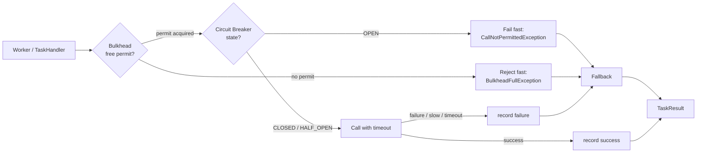
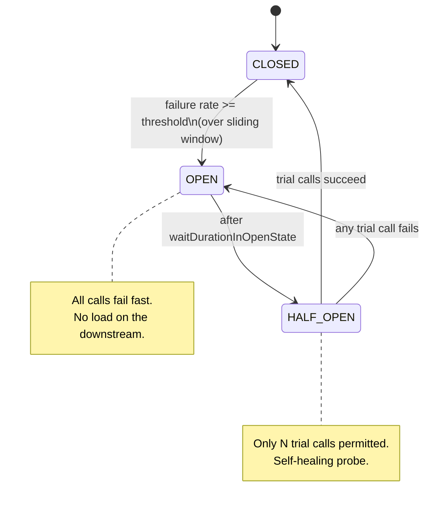
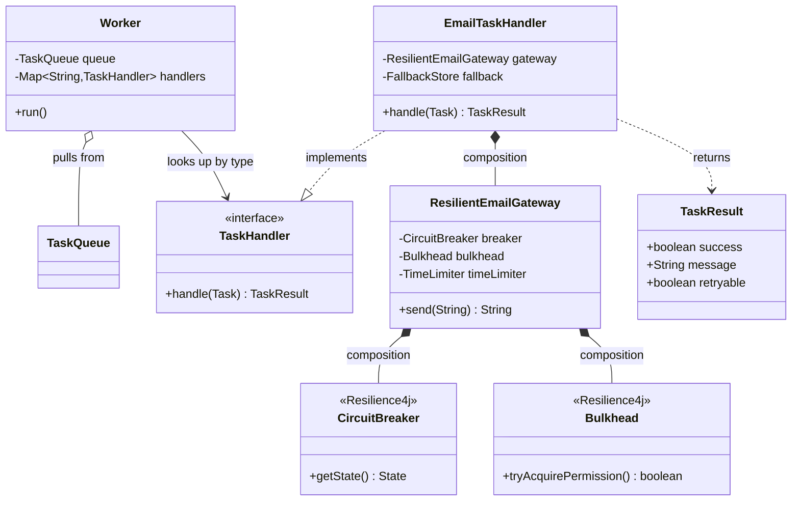

# Circuit Breakers and Bulkheads

> Where this fits in the project: a `TaskHandler` rarely does its work in isolation. It calls a payment API, an email provider, a geocoder, an LLM endpoint — *downstreams* that fail, slow down, and time out. Retries ([`retries.md`](retries.md)) answer "should I try again?" Circuit breakers answer the harder question: **"should I even try at all right now?"** When a downstream is on fire, the most resilient thing your worker can do is *stop calling it* — fail fast, shed the load, and give the downstream room to recover. The circuit breaker is the component that makes "stop calling it" automatic, and the bulkhead is what stops one sick downstream from drowning the whole worker pool.

---

## 1. Why this exists — the real problem

In a single process, when you call a method it either returns or throws, and it does so *now*. There is no in-between state called "the method is technically still running but has been blocked on a socket for 30 seconds and is holding one of your eight worker threads hostage." Distributed systems live in exactly that in-between state, and it is where outages are born.

Picture our Task Queue at 2 a.m. The `email` task type calls a third-party email API through a `TaskHandler`. The provider has a bad deploy and every request now hangs for the full 30-second socket timeout before throwing. Walk the consequences:

1. A `Worker` picks up an `email` task, calls the handler, and blocks for 30 seconds.
2. We have a `WorkerPool` of, say, 16 threads. Within seconds, all 16 are blocked on the dead email API.
3. Now *every* task type is starved — `payment`, `report`, `geocode` — none of them can run, because there are no free workers. **One sick downstream has taken down the entire platform.**
4. Our retry policy kicks in and re-enqueues the failed email tasks, which get picked up and block *again*. We are now spending 100% of our capacity waiting on a service we already know is broken.

This is the failure mode the **circuit breaker** exists to prevent. The name is borrowed literally from electrical engineering: a breaker trips to cut the circuit *before* the wiring catches fire, and it stays tripped until someone (or in our case, a timer) decides it is safe to close it again. Michael Nygard popularized the software version in *Release It!* (2007), and it is now table stakes — Netflix Hystrix made it famous, and **Resilience4j** is its modern, lightweight successor on the JVM.

The breaker is half the answer. The other half is the **bulkhead**, named after the watertight compartments in a ship's hull: if one compartment floods, the bulkheads stop the water from spreading and sinking the whole ship. In software, a bulkhead is a *resource partition* — a dedicated, bounded pool of threads (or permits) per downstream — so that the email API can consume at most, say, 4 of our 16 workers, and the remaining 12 stay free for everyone else. Even if email is completely dead, payments keep flowing.

> The circuit breaker controls **time** (when to stop trying). The bulkhead controls **space** (how much of your capacity any one dependency may consume). You almost always want both.



---

## 2. The states: CLOSED, OPEN, HALF_OPEN

A circuit breaker is a small **state machine** wrapped around a call. Three states, and the transitions between them are the entire idea.

- **CLOSED** — the normal, healthy state. Calls pass through to the downstream. The breaker records every outcome (success/failure/slow) in a sliding window. When the failure rate in that window crosses a **threshold**, the breaker trips to OPEN.
- **OPEN** — the tripped state. **No calls reach the downstream.** Every attempt fails *immediately* with a `CallNotPermittedException`, which is the entire point: you fail in microseconds instead of waiting 30 seconds for a timeout, and you stop hammering a service that is already down. After a configured **wait duration**, the breaker transitions to HALF_OPEN.
- **HALF_OPEN** — the probing state. The breaker allows a *small, fixed number* of trial calls through. If they succeed, the downstream has recovered and the breaker goes back to CLOSED. If they fail, it snaps back to OPEN and waits again. This is how the system *self-heals* without a human.



Two details that separate a toy breaker from a real one:

1. **Slow calls count as failures.** A downstream that returns in 29 seconds is *worse* than one that fails in 100ms, because it holds your thread. Resilience4j has a `slowCallRateThreshold` and `slowCallDurationThreshold` precisely for this. A breaker that only watches exceptions will never trip on the most dangerous failure mode.
2. **The window must have a minimum number of calls.** If you trip OPEN after a single failure on an idle endpoint, you will flap constantly. `minimumNumberOfCalls` says "don't even evaluate the threshold until you've seen at least N calls."

---

## 3. The naive version

Here is the breaker almost everyone writes first — a boolean and a counter, hand-rolled inside the handler.

```java
// NAIVE: a hand-rolled "circuit breaker" that is wrong in three ways.
public class NaiveEmailHandler implements TaskHandler {

    private final EmailClient client;          // the flaky downstream
    private volatile boolean open = false;     // is the circuit tripped?
    private int failures = 0;                  // <-- not thread-safe
    private long openedAt = 0;

    public NaiveEmailHandler(EmailClient client) { this.client = client; }

    @Override
    public TaskResult handle(Task task) {
        if (open) {
            // We tripped 10 minutes ago and... never recover. Bug #1.
            return new TaskResult(false, "circuit open", true);
        }
        try {
            client.send(task.payload());          // Bug #2: no timeout. Blocks forever.
            failures = 0;
            return new TaskResult(true, "sent", false);
        } catch (Exception e) {
            failures++;                           // Bug #3: data race; lost increments.
            if (failures >= 5) {
                open = true;
                openedAt = System.currentTimeMillis();
            }
            return new TaskResult(false, e.getMessage(), true);
        }
    }
}
```

What's wrong:

- **No recovery.** Once `open` flips to `true`, nothing ever sets it back. There is no HALF_OPEN. The circuit stays tripped forever and the `email` task type is dead until a redeploy.
- **No timeout.** `client.send` can block for the full socket timeout. The breaker is supposed to *protect* against slow downstreams, but this one happily lets a worker hang. Slow calls are invisible to it.
- **Not thread-safe.** Every `Worker` thread shares this handler instance; `failures++` is a read-modify-write race, so under load the counter is wrong and the breaker trips at the wrong time (or never).
- **Counts, not rates.** "5 failures ever" is meaningless. On a busy endpoint 5 failures out of 100,000 calls is healthy; on an idle one it might be 5 out of 5. You need a *rate* over a *window*.

This is exactly the kind of "it works in the demo, melts in production" code the rest of this chapter refactors away.

---

## 4. Improved version — a correct hand-rolled breaker

Before reaching for a library, it's worth building a *correct* breaker once, because it makes the library's config options obvious. We use atomics for thread-safety, a real wait-and-probe cycle for recovery, and we wrap the call in a timeout.

```java
// IMPROVED: thread-safe, with OPEN -> HALF_OPEN -> CLOSED recovery and a timeout.
// Still a "count-based" window for clarity; we move to rate-based with Resilience4j.
import java.time.Duration;
import java.util.concurrent.*;
import java.util.concurrent.atomic.AtomicInteger;
import java.util.concurrent.atomic.AtomicLong;
import java.util.concurrent.atomic.AtomicReference;

public final class SimpleCircuitBreaker {

    enum State { CLOSED, OPEN, HALF_OPEN }

    private final int failureThreshold;        // consecutive failures to trip
    private final int halfOpenProbes;          // trial calls in HALF_OPEN
    private final long openMillis;             // how long to stay OPEN
    private final Duration callTimeout;

    private final AtomicReference<State> state = new AtomicReference<>(State.CLOSED);
    private final AtomicInteger consecutiveFailures = new AtomicInteger();
    private final AtomicInteger halfOpenSuccesses = new AtomicInteger();
    private final AtomicLong openedAt = new AtomicLong();
    private final ExecutorService timeoutPool = Executors.newCachedThreadPool();

    public SimpleCircuitBreaker(int failureThreshold, int halfOpenProbes,
                                Duration openFor, Duration callTimeout) {
        this.failureThreshold = failureThreshold;
        this.halfOpenProbes = halfOpenProbes;
        this.openMillis = openFor.toMillis();
        this.callTimeout = callTimeout;
    }

    /** Run {@code call} through the breaker; throw if not permitted or if it fails. */
    public <T> T execute(Callable<T> call) throws Exception {
        State s = currentState();
        if (s == State.OPEN) {
            throw new CallNotPermittedException("circuit OPEN");
        }
        try {
            T result = callWithTimeout(call);
            onSuccess(s);
            return result;
        } catch (Exception e) {
            onFailure();
            throw e;
        }
    }

    private State currentState() {
        State s = state.get();
        if (s == State.OPEN
                && System.currentTimeMillis() - openedAt.get() >= openMillis
                && state.compareAndSet(State.OPEN, State.HALF_OPEN)) {
            halfOpenSuccesses.set(0);           // begin a fresh probe window
            return State.HALF_OPEN;
        }
        return state.get();
    }

    private <T> T callWithTimeout(Callable<T> call) throws Exception {
        Future<T> f = timeoutPool.submit(call);
        try {
            return f.get(callTimeout.toMillis(), TimeUnit.MILLISECONDS);
        } catch (TimeoutException te) {
            f.cancel(true);                     // a slow call IS a failure
            throw te;
        } catch (ExecutionException ee) {
            throw (Exception) ee.getCause();
        }
    }

    private void onSuccess(State observed) {
        consecutiveFailures.set(0);
        if (observed == State.HALF_OPEN
                && halfOpenSuccesses.incrementAndGet() >= halfOpenProbes) {
            state.set(State.CLOSED);            // recovered
        }
    }

    private void onFailure() {
        if (state.get() == State.HALF_OPEN) {
            trip();                             // probe failed -> back to OPEN
        } else if (consecutiveFailures.incrementAndGet() >= failureThreshold) {
            trip();
        }
    }

    private void trip() {
        state.set(State.OPEN);
        openedAt.set(System.currentTimeMillis());
    }

    public State state() { return state.get(); }

    public static final class CallNotPermittedException extends RuntimeException {
        public CallNotPermittedException(String m) { super(m); }
    }
}
```

This is a *real* breaker: it recovers, it treats timeouts as failures, and it is thread-safe. But it still uses a crude "consecutive failures" window (a rate window is better), has no slow-call rate, no metrics, and spins up its own timeout pool. That is exactly the boilerplate Resilience4j exists to delete.

---

## 5. Production-quality version — Resilience4j

In production you do **not** hand-roll this. You use [Resilience4j](https://resilience4j.readme.io/), which gives you a rate-based sliding window, slow-call detection, a bulkhead, a timeout (`TimeLimiter`), Micrometer metrics out of the box, and a clean way to *compose* breaker + bulkhead + retry + rate limiter. Add the dependencies:

```xml
<!-- pom.xml -->
<dependency>
  <groupId>io.github.resilience4j</groupId>
  <artifactId>resilience4j-circuitbreaker</artifactId>
  <version>2.2.0</version>
</dependency>
<dependency>
  <groupId>io.github.resilience4j</groupId>
  <artifactId>resilience4j-bulkhead</artifactId>
  <version>2.2.0</version>
</dependency>
<dependency>
  <groupId>io.github.resilience4j</groupId>
  <artifactId>resilience4j-timelimiter</artifactId>
  <version>2.2.0</version>
</dependency>
<dependency>
  <groupId>io.github.resilience4j</groupId>
  <artifactId>resilience4j-micrometer</artifactId>
  <version>2.2.0</version>
</dependency>
```

Now wrap the flaky email downstream that a `TaskHandler` calls. The breaker config is *all rates and windows*, exactly the lessons from the naive version made declarative:

```java
import io.github.resilience4j.circuitbreaker.*;
import io.github.resilience4j.bulkhead.*;
import io.github.resilience4j.timelimiter.*;
import io.micrometer.core.instrument.MeterRegistry;
import io.github.resilience4j.micrometer.tagged.TaggedCircuitBreakerMetrics;

import java.time.Duration;

/** Builds the resilience stack for one downstream and exposes a guarded send(). */
public final class ResilientEmailGateway {

    private final EmailClient client;
    private final CircuitBreaker breaker;
    private final Bulkhead bulkhead;            // semaphore-based: bounds concurrency
    private final TimeLimiter timeLimiter;      // caps wall-clock per call

    public ResilientEmailGateway(EmailClient client, MeterRegistry registry) {
        this.client = client;

        var cbConfig = CircuitBreakerConfig.custom()
            .slidingWindowType(CircuitBreakerConfig.SlidingWindowType.COUNT_BASED)
            .slidingWindowSize(50)                 // evaluate over the last 50 calls
            .minimumNumberOfCalls(20)              // ...but only once we've seen 20
            .failureRateThreshold(50.0f)           // trip if >=50% fail
            .slowCallRateThreshold(80.0f)          // ...or if >=80% are "slow"
            .slowCallDurationThreshold(Duration.ofSeconds(2)) // "slow" == >2s
            .waitDurationInOpenState(Duration.ofSeconds(10))  // OPEN -> HALF_OPEN delay
            .permittedNumberOfCallsInHalfOpenState(5)         // 5 trial probes
            .recordException(ResilientEmailGateway::isTransient) // only count transient
            .build();

        var registryCb = CircuitBreakerRegistry.of(cbConfig);
        this.breaker = registryCb.circuitBreaker("email");
        TaggedCircuitBreakerMetrics.ofCircuitBreakerRegistry(registryCb).bindTo(registry);

        // Bulkhead: at most 8 concurrent email calls, fail fast if full (don't queue).
        this.bulkhead = Bulkhead.of("email", BulkheadConfig.custom()
            .maxConcurrentCalls(8)
            .maxWaitDuration(Duration.ZERO)        // do not block waiting for a permit
            .build());

        this.timeLimiter = TimeLimiter.of("email", TimeLimiterConfig.custom()
            .timeoutDuration(Duration.ofSeconds(3))
            .cancelRunningFuture(true)
            .build());
    }

    private static boolean isTransient(Throwable t) {
        // Deterministic 4xx-style errors must NOT trip the breaker; they always fail.
        return !(t instanceof InvalidRecipientException);
    }

    /** Decorate the raw call: bulkhead -> circuit breaker. Returns the provider id. */
    public String send(String payload) {
        return Bulkhead.decorateSupplier(bulkhead,
                   CircuitBreaker.decorateSupplier(breaker,
                       () -> client.send(payload)))
               .get();   // throws BulkheadFullException / CallNotPermittedException / cause
    }

    public CircuitBreaker breaker() { return breaker; }
}
```

And the `TaskHandler` that uses it — note that the handler's job is now to *translate* resilience exceptions into a `TaskResult`, deciding retryable vs not, with a **fallback** for graceful degradation:

```java
import io.github.resilience4j.circuitbreaker.CallNotPermittedException;
import io.github.resilience4j.bulkhead.BulkheadFullException;

/** email TaskHandler guarded by circuit breaker + bulkhead + timeout. */
public final class EmailTaskHandler implements TaskHandler {

    private final ResilientEmailGateway gateway;
    private final FallbackStore fallback;   // e.g. spool to durable storage

    public EmailTaskHandler(ResilientEmailGateway gateway, FallbackStore fallback) {
        this.gateway = gateway;
        this.fallback = fallback;
    }

    @Override
    public TaskResult handle(Task task) {
        try {
            String providerId = gateway.send(task.payload());
            return TaskResult.ok("sent: " + providerId);
        } catch (CallNotPermittedException open) {
            // Breaker is OPEN: downstream known-bad. Fail fast, retry LATER, not now.
            return TaskResult.retry("email circuit OPEN, deferring");
        } catch (BulkheadFullException full) {
            // We are at our concurrency budget for email; shed and retry shortly.
            return TaskResult.retry("email bulkhead full, deferring");
        } catch (InvalidRecipientException bad) {
            // Deterministic failure: never retry, never trip the breaker. Straight to DLQ.
            return TaskResult.fatal("invalid recipient: " + bad.getMessage());
        } catch (Exception e) {
            // Genuine transient downstream error: graceful degradation, then retry.
            fallback.spool(task);   // don't lose the email; persist for replay
            return TaskResult.retry("email transient failure: " + e.getMessage());
        }
    }
}
```

A staff engineer ships *this*: rate-based windows, slow-call detection, a bulkhead so email can never eat the whole pool, a hard timeout, exception classification so deterministic errors don't trip the breaker, metrics bound to Micrometer, and a fallback so no work is silently dropped.

> Note on `TaskResult`: the canonical record is `TaskResult(boolean success, String message, boolean retryable)`. Throughout the curriculum we assume small static factories `TaskResult.ok(msg)` → `(true, msg, false)`, `TaskResult.retry(msg)` → `(false, msg, true)`, and `TaskResult.fatal(msg)` → `(false, msg, false)`. They keep call sites readable; substitute the constructor directly if you have not added them yet.

---

## 6. Code walkthrough — beginner, intermediate, production

### Beginner: the smallest correct breaker behavior, observed

This snippet exists to make the three states *tangible*. We drive a deliberately broken downstream and watch the breaker trip and recover.

```java
import io.github.resilience4j.circuitbreaker.*;
import java.time.Duration;
import java.util.function.Supplier;

public class BreakerDemo {
    public static void main(String[] args) throws InterruptedException {
        var cfg = CircuitBreakerConfig.custom()
            .slidingWindowSize(4)
            .minimumNumberOfCalls(4)
            .failureRateThreshold(50f)
            .waitDurationInOpenState(Duration.ofMillis(500))
            .permittedNumberOfCallsInHalfOpenState(2)
            .build();
        CircuitBreaker cb = CircuitBreakerRegistry.of(cfg).circuitBreaker("demo");

        Supplier<String> flaky = CircuitBreaker.decorateSupplier(cb, () -> {
            throw new RuntimeException("downstream down");
        });

        for (int i = 0; i < 4; i++) try { flaky.get(); } catch (Exception ignored) {}
        System.out.println("after 4 failures: " + cb.getState());  // OPEN

        try { flaky.get(); }
        catch (CallNotPermittedException e) {
            System.out.println("fast-fail while OPEN (no downstream call)");
        }

        Thread.sleep(600);                                          // wait out OPEN
        System.out.println("after wait: " + cb.getState());         // HALF_OPEN
    }
}
```

The key observation: while OPEN, the lambda body *never runs* — `CallNotPermittedException` is thrown before the downstream is touched. That microsecond-fast rejection is the whole value proposition.

### Intermediate: a fallback and graceful degradation

Failing fast is good; failing fast *with a sensible default* is better. Resilience4j's `Try`/`Decorators` API lets you attach a fallback. For our platform, the canonical fallback is "spool the task durably and report it as retryable" — never throw the work away.

```java
import io.github.resilience4j.decorators.Decorators;
import io.github.resilience4j.circuitbreaker.CircuitBreaker;
import java.util.function.Supplier;

public final class GeocodeTaskHandler implements TaskHandler {
    private final CircuitBreaker breaker;
    private final GeocodeClient client;

    public GeocodeTaskHandler(CircuitBreaker breaker, GeocodeClient client) {
        this.breaker = breaker;
        this.client = client;
    }

    @Override
    public TaskResult handle(Task task) {
        Supplier<TaskResult> guarded = Decorators
            .ofSupplier(() -> TaskResult.ok(client.geocode(task.payload())))
            .withCircuitBreaker(breaker)
            // fallback receives the throwable and produces a TaskResult instead of throwing
            .withFallback(throwable -> switch (throwable) {
                case io.github.resilience4j.circuitbreaker.CallNotPermittedException open ->
                    TaskResult.retry("geocode OPEN, deferring");
                case IllegalArgumentException bad ->
                    TaskResult.fatal("unparseable address");
                default ->
                    TaskResult.retry("geocode transient: " + throwable.getMessage());
            })
            .decorate();
        return guarded.get();
    }
}
```

This uses Java 21 switch pattern matching on the throwable to route each failure class to the right `TaskResult` — a clean, exhaustive replacement for a chain of `catch` blocks.

### Production-inspired: combining breaker + bulkhead + retry + rate limiter

In real systems these four primitives **compose**, and *the order matters*. The canonical decoration order, from outermost to innermost, is:

```text
RateLimiter  ->  Bulkhead  ->  CircuitBreaker  ->  TimeLimiter  ->  Retry  ->  call
```

Reasoning for the order:

- **RateLimiter outermost** — reject excess work before it consumes any concurrency permits. Why pay for a bulkhead slot you'll only throw away?
- **Bulkhead next** — bound concurrency before entering the breaker so a slow downstream can't pin unlimited threads in HALF_OPEN probing.
- **CircuitBreaker** — fail fast if the downstream is known-bad.
- **TimeLimiter** — cap any single attempt's wall-clock.
- **Retry innermost** — retry the *individual* call, and crucially, the breaker records each retry's outcome.

```java
import io.github.resilience4j.circuitbreaker.CircuitBreaker;
import io.github.resilience4j.bulkhead.Bulkhead;
import io.github.resilience4j.ratelimiter.RateLimiter;
import io.github.resilience4j.retry.Retry;
import io.github.resilience4j.timelimiter.TimeLimiter;
import io.github.resilience4j.decorators.Decorators;

import java.util.concurrent.*;
import java.util.function.Supplier;

/** Full resilience stack around one downstream, assembled once and reused. */
public final class ResilientDownstream<T> {

    private final Supplier<T> guarded;
    private final ScheduledExecutorService scheduler;

    public ResilientDownstream(Supplier<T> call,
                               RateLimiter rateLimiter,
                               Bulkhead bulkhead,
                               CircuitBreaker breaker,
                               TimeLimiter timeLimiter,
                               Retry retry,
                               ScheduledExecutorService scheduler) {
        this.scheduler = scheduler;
        this.guarded = Decorators.ofSupplier(call)
            .withRateLimiter(rateLimiter)       // outermost: shed excess
            .withBulkhead(bulkhead)             // bound concurrency
            .withCircuitBreaker(breaker)        // fail fast if known-bad
            // TimeLimiter needs a CompletionStage; wrap the supplier:
            .withRetry(retry)                   // innermost retry around the call
            .decorate();
    }

    public T call() {
        return guarded.get();
    }
}
```

For the `TimeLimiter` specifically, Resilience4j decorates a `Supplier<CompletionStage<T>>`, so in practice you run the blocking downstream on a bounded executor and decorate the resulting future:

```java
Supplier<CompletionStage<String>> futureSupplier =
    () -> CompletableFuture.supplyAsync(() -> client.send(payload), bulkheadPool);

Callable<String> guarded = TimeLimiter.decorateFutureSupplier(timeLimiter, futureSupplier);
String result = CircuitBreaker.decorateCallable(breaker, guarded).call();
```

The takeaway is not to memorize the API — it is the **mental model**: each decorator is a ring, the call sits at the center, and a request must pass every ring on the way in. This is the [Decorator pattern](../05-design-patterns/decorator.md) applied to cross-cutting reliability concerns, and it is why these libraries are so composable.

---

## 7. How this applies to our Task Queue project

The breaker and bulkhead live **inside the `TaskHandler`**, between the `Worker` and the external world. The `Worker` itself stays blissfully unaware — it pulls a `Task` from the `TaskQueue`, looks up the `TaskHandler` by `task.type`, calls `handle`, and reacts to the returned `TaskResult`. All resilience is encapsulated in the handler.



Concrete mapping to the canonical model:

| Canonical component | Role with circuit breakers/bulkheads |
|---|---|
| `TaskHandler` | Hosts the breaker + bulkhead; translates resilience exceptions to `TaskResult`. |
| `TaskResult.retryable` | `true` when the breaker is OPEN or the bulkhead is full → the `RetryPolicy` defers and re-enqueues. |
| `Worker` | Stays trivial; never blocks on a dead downstream because the breaker fails fast. |
| `WorkerPool` | Protected by bulkheads so one downstream cannot starve all threads. |
| `RetryPolicy` | Sees `CallNotPermittedException` as retryable; backoff + breaker together keep load off the downstream. See [`retries.md`](retries.md). |
| `DeadLetterQueue` | Receives tasks whose failure is *fatal* (e.g. `InvalidRecipientException`), not OPEN-circuit deferrals. See [`dlq.md`](dlq.md). |
| `MetricsCollector` / `MeterRegistry` | Scrapes breaker state, failure rate, and bulkhead saturation for dashboards. |
| `RateLimiter` | The outermost ring; coordinates with the breaker per the decoration order. See [`rate-limiting.md`](rate-limiting.md). |

The crucial design rule: **OPEN-circuit and bulkhead-full are *retryable* outcomes, not dead-letter outcomes.** They mean "not now," not "never." Routing them to the DLQ would be a serious bug — you'd dead-letter perfectly valid work just because a downstream had a bad ten seconds.

---

## 8. Tradeoffs

| Decision | Option A | Option B | When to pick which |
|---|---|---|---|
| Breaker window | Count-based (last N calls) | Time-based (last N seconds) | Count-based for steady traffic; time-based for bursty/low-volume endpoints where N calls could span hours. |
| Bulkhead type | Semaphore (bound concurrency, run on caller) | Thread-pool (separate pool, queue) | Semaphore for non-blocking/virtual-thread code (cheap, no context switch); thread-pool when you need a real timeout boundary on legacy blocking I/O. |
| OPEN wait duration | Short (1–5s) | Long (30–60s) | Short recovers fast but may re-hammer a flapping downstream; long protects the downstream but extends user-visible degradation. Often paired with exponential growth. |
| Fallback strategy | Cached/stale value | Spool + defer (retry later) | Stale value for reads (geocode cache); spool+defer for writes/side-effects (email) where correctness > freshness. |
| Trip granularity | One breaker per downstream | One breaker per (downstream, endpoint) | Per-endpoint is more precise but more config and more windows to keep warm; per-downstream is simpler and usually enough. |
| Where it lives | In the `TaskHandler` (in-process) | At a sidecar/mesh (Envoy/Istio) | In-process gives you exact failure classification; mesh gives you uniform, language-agnostic policy with less code. Many shops run both. |

The honest summary: a circuit breaker **trades availability for stability**. While OPEN, you are *deliberately* unavailable for that downstream — you reject work you might have been able to serve, on the bet that protecting the downstream (and your own threads) is worth more than the marginal successes. That bet is almost always correct under real overload, and almost always feels wrong in a code review by someone who hasn't lived through an outage.

---

## 9. Common mistakes and pitfalls

- **No timeout under the breaker.** A breaker without a `TimeLimiter` cannot protect you from the *most dangerous* failure (slow, not failed). Fix: always pair a breaker with a per-call timeout, and set `slowCallDurationThreshold` so slow counts as failure.
- **Counting deterministic errors as breaker failures.** A `400 Bad Request` or `InvalidRecipientException` will fail every time; if it trips the breaker it punishes *all other* requests for a per-request bug. Fix: `recordException`/`ignoreException` to count only transient failures.
- **Tripping on too few calls.** Without `minimumNumberOfCalls`, one failure on a quiet endpoint trips the breaker and it flaps. Fix: require a warm window before evaluating the threshold.
- **Sharing one breaker across unrelated downstreams.** If email and payments share a breaker, an email outage stops payments. Fix: one breaker (and one bulkhead) per logical dependency.
- **Stacking retries above *and* below the breaker.** Retry-then-breaker-then-retry multiplies load and confuses the failure-rate window. Fix: one retry layer, innermost, per the decoration order; let the breaker observe each attempt.
- **Routing OPEN-circuit failures to the DLQ.** This dead-letters healthy work during a transient blip. Fix: classify OPEN/bulkhead-full as `retryable`.
- **Unbounded thread-pool bulkhead.** A bulkhead with an unbounded queue isn't a bulkhead — it just hides the backpressure. Fix: bound the queue and `maxWaitDuration`; reject fast. See [`backpressure.md`](backpressure.md).
- **No metrics on breaker state.** A breaker that silently sits OPEN for an hour is an invisible outage. Fix: export state and trip events to Micrometer and alert on `state == OPEN`.

---

## 10. Refactoring exercise

**Bad** — resilience tangled into the handler, no recovery, no isolation:

```java
public class PaymentHandler implements TaskHandler {
    private final PaymentClient client;
    private boolean broken = false;
    public PaymentHandler(PaymentClient c) { this.client = c; }

    @Override public TaskResult handle(Task task) {
        if (broken) return new TaskResult(false, "skip", true);
        try {
            client.charge(task.payload());      // no timeout, blocks the worker
            return new TaskResult(true, "charged", false);
        } catch (Exception e) {
            broken = true;                       // trips forever, never recovers
            return new TaskResult(false, e.getMessage(), true);
        }
    }
}
```

**Improved** — extract a real breaker with recovery (the `SimpleCircuitBreaker` from §4):

```java
public class PaymentHandler implements TaskHandler {
    private final PaymentClient client;
    private final SimpleCircuitBreaker breaker =
        new SimpleCircuitBreaker(5, 2, Duration.ofSeconds(10), Duration.ofSeconds(3));

    public PaymentHandler(PaymentClient c) { this.client = c; }

    @Override public TaskResult handle(Task task) {
        try {
            String id = breaker.execute(() -> client.charge(task.payload()));
            return TaskResult.ok("charged: " + id);
        } catch (SimpleCircuitBreaker.CallNotPermittedException open) {
            return TaskResult.retry("payment circuit OPEN");
        } catch (Exception e) {
            return TaskResult.retry("payment failed: " + e.getMessage());
        }
    }
}
```

**Production** — Resilience4j with bulkhead, slow-call detection, classification, metrics, and a fallback:

```java
public final class PaymentHandler implements TaskHandler {
    private final PaymentClient client;
    private final CircuitBreaker breaker;
    private final Bulkhead bulkhead;

    public PaymentHandler(PaymentClient client, CircuitBreakerRegistry cbReg,
                          BulkheadRegistry bhReg) {
        this.client = client;
        this.breaker = cbReg.circuitBreaker("payment");   // shared, configured centrally
        this.bulkhead = bhReg.bulkhead("payment");        // dedicated permit pool
    }

    @Override public TaskResult handle(Task task) {
        try {
            String id = Bulkhead.decorateSupplier(bulkhead,
                CircuitBreaker.decorateSupplier(breaker,
                    () -> client.charge(task.payload()))).get();
            return TaskResult.ok("charged: " + id);
        } catch (CallNotPermittedException open) {
            return TaskResult.retry("payment circuit OPEN");
        } catch (BulkheadFullException full) {
            return TaskResult.retry("payment bulkhead full");
        } catch (CardDeclinedException declined) {       // deterministic: do not retry
            return TaskResult.fatal("declined: " + declined.code());
        } catch (Exception e) {
            return TaskResult.retry("payment transient: " + e.getMessage());
        }
    }
}
```

The progression mirrors the chapter: from "boolean of doom" to a correct hand-rolled state machine to a configured, observable, isolated, classified production component.

---

## 11. Exercises

### Easy

1. **Knowledge check.** Name the three breaker states and the trigger for each transition. Why does HALF_OPEN exist instead of CLOSED → OPEN → CLOSED directly?
2. **Coding.** Using Resilience4j, configure a `CircuitBreaker` named `"sms"` that trips when the failure rate over the last 30 calls reaches 60%, stays OPEN for 5 seconds, and permits 3 probes in HALF_OPEN. Print the state after forcing 30 failures.

### Medium

3. **Coding.** Add a semaphore `Bulkhead` of 4 permits to the `"sms"` breaker so SMS can use at most 4 of the worker pool's threads. Submit 10 concurrent calls to a downstream that sleeps 1s and assert that at least some calls fail with `BulkheadFullException`.
4. **Refactoring.** Take the `NaiveEmailHandler` from §3 and fix exactly two bugs *without* introducing Resilience4j: make the failure counter thread-safe, and add an automatic OPEN → CLOSED recovery after 5 seconds. Keep it under 40 lines.

### Hard

5. **Design.** Our platform has 6 task types, each calling a different downstream, served by a single `WorkerPool` of 16 threads. Design the bulkhead allocation. How do you prevent the *sum* of bulkhead permits from exceeding the pool size, and what happens if you let it? Sketch the config and justify the numbers.
6. **Interview-style.** A downstream returns `200 OK` but with a body that says `{"status":"error"}` — Resilience4j sees a successful call and the breaker never trips. How do you make the breaker treat this as a failure? Show the configuration.
7. **Stretch.** Implement an **adaptive OPEN duration**: instead of a fixed `waitDurationInOpenState`, grow the wait exponentially (5s, 10s, 20s, capped at 60s) each time the breaker re-trips from HALF_OPEN, and reset it to 5s after a clean recovery. Wrap a real Resilience4j breaker with a `CircuitBreaker.EventConsumer`.

---

## 12. Solutions

**1.** States: **CLOSED** (calls pass; failure rate over the window crossing the threshold → OPEN), **OPEN** (calls fail fast; after the wait duration → HALF_OPEN), **HALF_OPEN** (a few probes; all succeed → CLOSED, any fail → OPEN). HALF_OPEN exists so recovery is *tested with a trickle* rather than the full firehose. If you went straight from OPEN to CLOSED, the instant the breaker closed it would dump 100% of pending load onto a downstream that may still be fragile, immediately re-tripping — a thundering-herd recovery. HALF_OPEN lets a handful of probes confirm health first.

**2.**

```java
var cfg = CircuitBreakerConfig.custom()
    .slidingWindowType(CircuitBreakerConfig.SlidingWindowType.COUNT_BASED)
    .slidingWindowSize(30)
    .minimumNumberOfCalls(30)
    .failureRateThreshold(60f)
    .waitDurationInOpenState(Duration.ofSeconds(5))
    .permittedNumberOfCallsInHalfOpenState(3)
    .build();
CircuitBreaker cb = CircuitBreakerRegistry.of(cfg).circuitBreaker("sms");
var fail = CircuitBreaker.decorateRunnable(cb, () -> { throw new RuntimeException("boom"); });
for (int i = 0; i < 30; i++) try { fail.run(); } catch (Exception ignored) {}
System.out.println(cb.getState());   // OPEN
```

**3.**

```java
import io.github.resilience4j.bulkhead.*;
import java.util.concurrent.*;
import java.util.concurrent.atomic.AtomicInteger;

var bh = Bulkhead.of("sms", BulkheadConfig.custom()
    .maxConcurrentCalls(4).maxWaitDuration(Duration.ZERO).build());

var rejected = new AtomicInteger();
var pool = Executors.newFixedThreadPool(10);
var latch = new CountDownLatch(10);
for (int i = 0; i < 10; i++) {
    pool.submit(() -> {
        try {
            Bulkhead.decorateRunnable(bh, () -> {
                try { Thread.sleep(1000); } catch (InterruptedException ignored) {}
            }).run();
        } catch (BulkheadFullException e) {
            rejected.incrementAndGet();
        } finally { latch.countDown(); }
    });
}
latch.await();
pool.shutdown();
// With 4 permits and 10 simultaneous 1s calls, ~6 are rejected immediately.
assert rejected.get() >= 1 : "expected some BulkheadFullException";
System.out.println("rejected: " + rejected.get());
```

The point: `maxWaitDuration(ZERO)` makes the bulkhead reject *instantly* when full rather than queueing — which is what you want, because queueing just re-creates the unbounded-backlog problem the bulkhead was meant to solve.

**4.**

```java
import java.util.concurrent.atomic.AtomicInteger;
import java.util.concurrent.atomic.AtomicLong;

public class NaiveEmailHandler implements TaskHandler {
    private final EmailClient client;
    private volatile boolean open = false;
    private final AtomicInteger failures = new AtomicInteger();   // fix #1: thread-safe
    private final AtomicLong openedAt = new AtomicLong();
    private static final long OPEN_MS = 5_000;                    // fix #2: recovery

    public NaiveEmailHandler(EmailClient client) { this.client = client; }

    @Override public TaskResult handle(Task task) {
        if (open) {
            if (System.currentTimeMillis() - openedAt.get() >= OPEN_MS) {
                open = false; failures.set(0);                    // probe by re-closing
            } else {
                return new TaskResult(false, "circuit open", true);
            }
        }
        try {
            client.send(task.payload());
            failures.set(0);
            return new TaskResult(true, "sent", false);
        } catch (Exception e) {
            if (failures.incrementAndGet() >= 5) {
                open = true; openedAt.set(System.currentTimeMillis());
            }
            return new TaskResult(false, e.getMessage(), true);
        }
    }
}
```

This is a simplified single-probe recovery (no true HALF_OPEN trickle), which is acceptable for the exercise's two-fix scope; production still wants the library.

**5.** With 16 threads and 6 downstreams, the danger is **over-subscription**: if every bulkhead is sized for its peak, the sum exceeds 16 and the pool, not the bulkheads, becomes the real limit — defeating isolation. Two valid strategies:

- *Strict partition (sum ≤ 16):* e.g. payment=4, email=3, report=3, geocode=2, sms=2, webhook=2 (sum = 16). Guarantees no downstream can starve another, but caps total throughput even when downstreams are healthy and idle.
- *Soft over-subscription with a global guard:* size bulkheads generously (e.g. each = 6) but cap the *pool itself* at 16; rely on the per-downstream bulkheads to prevent any single one from grabbing more than its share. This gives better utilization under mixed load but allows transient contention.

If you let the sum exceed the pool *without* a global cap, you get **false isolation**: the bulkheads report capacity that the thread pool can't actually deliver, so a slow downstream still queues behind the pool boundary. The fix is to make the *pool* the hard limit and the bulkheads the *fairness* mechanism. For our platform I'd ship the strict partition first (predictable, easy to reason about), then move to soft over-subscription once metrics show downstreams rarely peak simultaneously.

**6.** Resilience4j only sees the return/throw, so you must *throw* on the error body. Wrap the call so a logical error becomes an exception, then record it:

```java
var cfg = CircuitBreakerConfig.custom()
    .recordException(t -> t instanceof DownstreamLogicalError) // count these
    .build();
CircuitBreaker cb = CircuitBreakerRegistry.of(cfg).circuitBreaker("svc");

Supplier<Response> guarded = CircuitBreaker.decorateSupplier(cb, () -> {
    Response r = client.call(payload);
    if ("error".equals(r.status())) {
        throw new DownstreamLogicalError(r.body());  // turn 200-but-error into a failure
    }
    return r;
});
```

Alternatively, use `recordResult`-style logic via a `Predicate<Object>` in newer configs. The principle: the breaker can only act on signals it can observe, so translate "successful HTTP, failed semantics" into a thrown exception.

**7.**

```java
import io.github.resilience4j.circuitbreaker.*;
import java.time.Duration;
import java.util.concurrent.atomic.AtomicLong;

public final class AdaptiveOpenBreaker {
    private static final long BASE = 5_000, CAP = 60_000;
    private final CircuitBreaker cb;
    private final AtomicLong openMs = new AtomicLong(BASE);

    public AdaptiveOpenBreaker(CircuitBreakerRegistry reg, String name) {
        this.cb = reg.circuitBreaker(name);
        cb.getEventPublisher().onStateTransition(ev -> {
            var to = ev.getStateTransition().getToState();
            if (to == CircuitBreaker.State.OPEN) {
                // re-trip (from HALF_OPEN) or first trip: grow, then apply
                long next = Math.min(openMs.get() * 2, CAP);
                openMs.set(next);
                // Resilience4j 2.x: override wait duration dynamically
                cb.transitionToOpenStateFor(Duration.ofMillis(openMs.get()));
            } else if (to == CircuitBreaker.State.CLOSED) {
                openMs.set(BASE);  // clean recovery resets the backoff
            }
        });
    }

    public CircuitBreaker breaker() { return cb; }
}
```

The event consumer watches state transitions: each time it enters OPEN it doubles the wait (capped at 60s) and re-arms the breaker for that duration; a clean recovery to CLOSED resets to the 5s base. This turns a flapping downstream into one we back off from more and more aggressively — the same "exponential backoff" idea from [`retries.md`](retries.md), applied to the breaker's own recovery cadence.

---

## 13. Interview questions and takeaways

1. **Q: What does an OPEN circuit actually do, and why is failing fast better than failing slow?**
   A: It rejects calls immediately with `CallNotPermittedException` instead of attempting them. Fast failure frees the calling thread in microseconds (vs. a multi-second timeout), stops piling load onto an already-struggling downstream, and lets fallbacks run promptly. Slow failures hold threads, which is how one downstream cascades into total pool exhaustion.

2. **Q: Difference between a circuit breaker and a retry?**
   A: A retry decides whether to attempt *this* call again; a breaker decides whether to attempt calls *at all* given recent aggregate health. Retries operate per-request and can *add* load; breakers operate on a window of requests and *remove* load. They compose — retry innermost, breaker watching each attempt — and a breaker is what stops retries from becoming a retry storm.

3. **Q: What's a bulkhead and how does it differ from a circuit breaker?**
   A: A bulkhead bounds *concurrency* (how many simultaneous calls a dependency may have), isolating resource usage so one slow downstream can't consume the whole thread pool. A breaker bounds *time* (whether to call at all based on recent failures). Bulkhead = space partition; breaker = temporal gate. You want both: the bulkhead contains a slow-but-not-failing downstream that the breaker might not trip on.

4. **Q: Why count slow calls as failures?**
   A: Because the worst downstream failure is not an exception — it's a call that eventually succeeds after 30 seconds while holding your thread the whole time. A breaker that only watches exceptions never trips on latency creep, which is the most common real-world degradation. `slowCallRateThreshold` + `slowCallDurationThreshold` catch it.

5. **Q: Why must some exceptions *not* trip the breaker?**
   A: Deterministic errors (validation failures, `400`, declined cards) will fail every time regardless of downstream health. Counting them in the failure rate makes the breaker trip on a per-request bug and then deny service to *all* other requests. Classify: only transient/systemic failures should move the breaker.

6. **Q: What's the decoration order for rate limiter, bulkhead, breaker, and retry, and why?**
   A: RateLimiter → Bulkhead → CircuitBreaker → TimeLimiter → Retry → call. Shed excess before consuming permits; bound concurrency before entering the breaker; fail fast if known-bad; cap each attempt; retry innermost so the breaker observes every attempt's outcome.

7. **Q: A breaker has been OPEN for an hour. Is that a bug?**
   A: It depends — but you should *know*, which means breaker state must be a monitored metric with alerting. A correctly recovering breaker cycles to HALF_OPEN periodically; if it's pinned OPEN, the downstream is genuinely dead and you have an upstream incident, not a breaker bug. A breaker is an *observability* tool as much as a control one.

**Takeaways:**
- The breaker controls *time*, the bulkhead controls *space* — ship both.
- Fail fast beats fail slow; a timeout/slow-call threshold is mandatory.
- Classify failures: deterministic errors must not trip the breaker.
- OPEN/bulkhead-full are *retryable*, never *dead-letter*.
- Breaker state is a first-class metric; an invisible OPEN is an invisible outage.

---

## 14. Production considerations

- **Cold start and warm windows.** After a deploy, the breaker's window is empty, so it can't evaluate the threshold (`minimumNumberOfCalls` not met). During this period you have *no* protection. For critical paths, consider warming with synthetic health checks or accepting a brief unprotected window — and never set `minimumNumberOfCalls` so high that the breaker effectively never engages.
- **Per-instance vs. shared state.** Resilience4j breakers are *per-JVM*. With a horizontally scaled `WorkerPool` (Phase 4), each node has its own breaker and its own view of downstream health. That's usually fine (and avoids a shared-state bottleneck), but it means a downstream must fail on *each* node before *each* node trips. For coordinated tripping you'd need a shared store (Redis), which adds latency and a new dependency — rarely worth it.
- **Metrics that matter.** Export and alert on: `resilience4j_circuitbreaker_state` (alert on OPEN), `resilience4j_circuitbreaker_failure_rate`, `resilience4j_circuitbreaker_calls` (by kind: successful/failed/not_permitted), and `resilience4j_bulkhead_available_concurrent_calls` (alert when it hits 0 — saturation). Tie these into the dashboards from [observability-and-ops](../10-system-design/observability-and-ops.md).
- **Bulkhead saturation is a leading indicator.** A bulkhead that sits at 0 available permits *before* the breaker trips tells you the downstream is slow (not yet failing) — earlier warning than the breaker gives.
- **Tuning is empirical.** There are no universal thresholds. Start conservative (50% failure rate, 50-call window, 10s OPEN), watch real trip patterns, and adjust. A breaker that trips on every minor blip causes more outages than it prevents (false-positive denial of service).
- **Interaction with autoscaling.** If your platform autoscales on queue depth, an OPEN breaker that re-enqueues tasks inflates the queue and can trigger *scale-out toward a dead downstream* — more workers all fast-failing. Make sure scaling signals account for retryable-deferred work, and back the breaker's recovery with backoff so you don't scale into a wall.
- **Testing.** Use [Testcontainers](https://testcontainers.com/) with a toxiproxy sidecar to inject latency/faults and assert the breaker trips, fast-fails, and recovers. Unit-test the *classification* logic (which exceptions count) separately — it's where the subtle bugs live.

---

## What We Can Improve In Our Project Using This Concept

Today our `TaskHandler` implementations call downstreams directly and our `Worker` can be fully blocked by a single slow dependency. We can:

1. Introduce a `ResilientGateway` per downstream (email, payment, geocode, sms, webhook) encapsulating a Resilience4j `CircuitBreaker`, `Bulkhead`, and `TimeLimiter`.
2. Make every handler translate `CallNotPermittedException` and `BulkheadFullException` into `TaskResult.retry(...)`, and deterministic errors into `TaskResult.fatal(...)`.
3. Wire breaker and bulkhead metrics into the `MeterRegistry` so dashboards show downstream health and pool isolation.
4. Compose the breaker with the existing `RetryPolicy` and the `RateLimiter` in the canonical decoration order so the three reliability primitives reinforce rather than fight each other.

## Project Refactoring Task

1. Add Resilience4j dependencies (`circuitbreaker`, `bulkhead`, `timelimiter`, `micrometer`) to `pom.xml`.
2. Create `com.example.tq.resilience.ResilientEmailGateway` (breaker + bulkhead + timeLimiter) and a generic `ResilientDownstream<T>` builder.
3. Refactor `EmailTaskHandler`/`PaymentTaskHandler` to route through their gateways and classify outcomes into `TaskResult`.
4. Add a `ResilienceConfig` Spring `@Configuration` exposing `CircuitBreakerRegistry` and `BulkheadRegistry` beans with per-downstream config, and bind their metrics to the `MeterRegistry`.
5. Ensure OPEN/bulkhead-full map to `retryable=true` and never reach the `DeadLetterQueue`.
6. Add JUnit 5 + AssertJ tests (with a toxiproxy/Testcontainers fault-injection or a fake flaky client) asserting: trip on failure-rate threshold, fast-fail while OPEN, recovery via HALF_OPEN, bulkhead rejection under concurrency, and correct `TaskResult` classification.

## Git Commit For This Chapter

```text
feat(resilience): circuit breakers and bulkheads around flaky downstreams

- add Resilience4j circuitbreaker/bulkhead/timelimiter/micrometer deps
- add ResilientEmailGateway and ResilientDownstream wrapping breaker+bulkhead+timeout
- classify downstream outcomes: OPEN/bulkhead-full -> retryable, 4xx -> fatal
- add ResilienceConfig with per-downstream CircuitBreaker/Bulkhead registries
- bind breaker state, failure rate, and bulkhead saturation to MeterRegistry
- never dead-letter OPEN-circuit deferrals; route them back through RetryPolicy

Files:
  pom.xml
  src/main/java/com/example/tq/resilience/ResilientEmailGateway.java
  src/main/java/com/example/tq/resilience/ResilientDownstream.java
  src/main/java/com/example/tq/resilience/ResilienceConfig.java
  src/main/java/com/example/tq/handler/EmailTaskHandler.java
  src/main/java/com/example/tq/handler/PaymentTaskHandler.java
  src/main/java/com/example/tq/model/TaskResult.java
  src/test/java/com/example/tq/resilience/CircuitBreakerIntegrationTest.java
  src/test/java/com/example/tq/resilience/BulkheadTest.java
```

## Architecture Impact

The circuit breaker and bulkhead establish a **resilience boundary** between the worker pool and every external dependency. The `Worker` and `WorkerPool` become immune to downstream pathologies: a dead or slow dependency can no longer exhaust the shared thread pool (bulkhead = space isolation) or waste capacity hammering a known-bad service (breaker = temporal gating). Combined with [`retries.md`](retries.md) (controlled re-attempts), [`rate-limiting.md`](rate-limiting.md) (admission control), and [`backpressure.md`](backpressure.md) (flow control), this completes the platform's reliability posture: the system degrades *gracefully and locally* under partial failure instead of cascading globally. The breaker also becomes a key telemetry source, surfacing downstream health to the metrics layer and the scaling controllers in Phase 4.

## Interview Takeaways

- A circuit breaker is a three-state machine (CLOSED/OPEN/HALF_OPEN); OPEN fails fast to protect both the downstream and your own threads.
- Bulkheads isolate *concurrency* per dependency so one sick downstream can't drown the whole pool; breakers gate on *recent failure rate*. Use both.
- Always pair a breaker with a **timeout** and **slow-call threshold** — latency, not exceptions, is the deadliest failure mode.
- **Classify** failures: deterministic errors must not trip the breaker; OPEN/bulkhead-full are *retryable*, never dead-letter.
- Compose RateLimiter → Bulkhead → CircuitBreaker → TimeLimiter → Retry, and monitor breaker state as a first-class metric.
