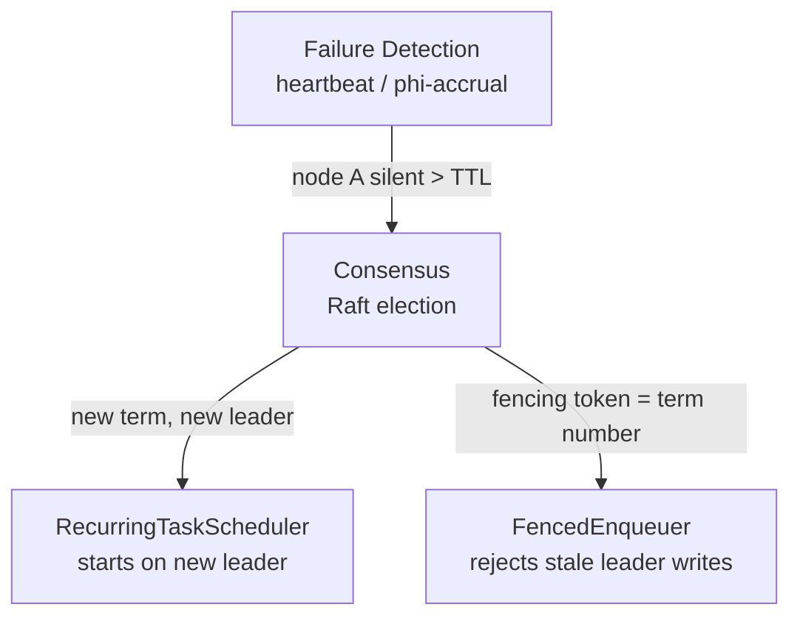
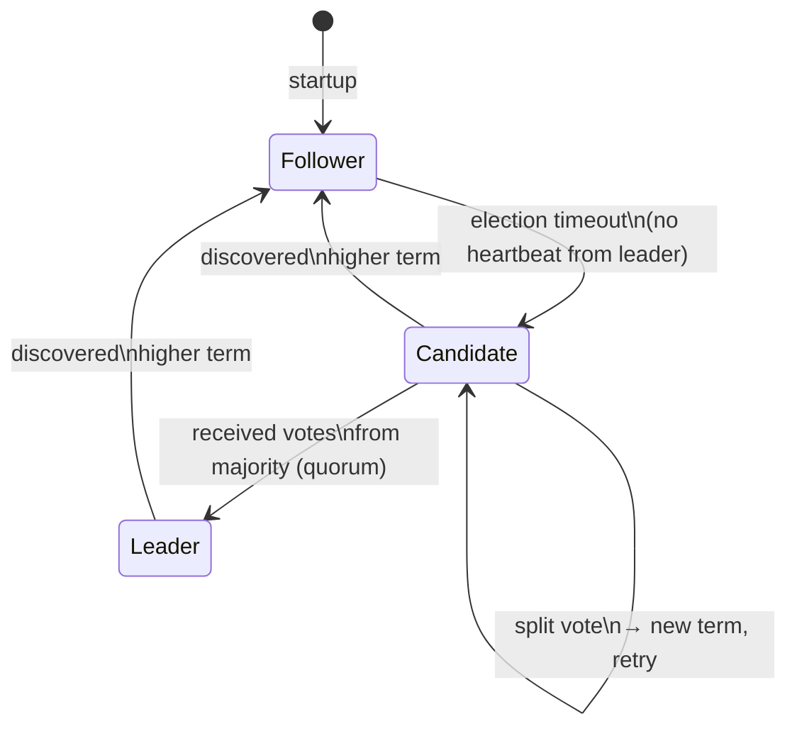
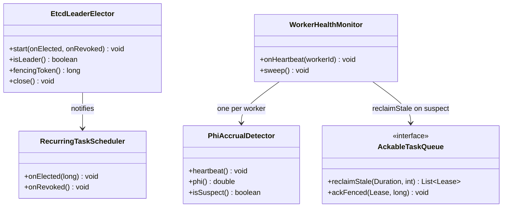

# Consensus and Failure Detection

> Where this fits in the project: [leader-election.md](./leader-election.md) shows you *how* to elect a leader using a TTL lease and a Redis/Postgres lock. It is the recipe. This chapter is the *theory behind the recipe* — why quorum prevents split brain, what Raft actually does step by step, and how the cluster knows a node is dead in the first place (heartbeats, phi-accrual detectors, and gossip). Without this chapter, leader election is a magic incantation. With it, you can derive the correct TTL, explain any split-brain failure in a post-mortem, and defend your design in a system-design interview.

---

## 1. Why this exists

In a single-process program, when a function completes you know it completed — the return value is there on the call stack. In a distributed system, you can **never know for certain** whether a remote node has processed a request. The message may have been lost, the node may have crashed after processing but before replying, or the network may be partitioned in a way that delays the reply indefinitely. This is the **Two Generals Problem** (proven unsolvable) and the **FLP Impossibility** result (no deterministic asynchronous algorithm can achieve consensus with even one crash failure).

Real systems escape FLP by weakening one assumption: they use **timeouts** (adding partial synchrony) and **probabilistic guarantees** (eventually, with high probability). Raft, ZooKeeper's ZAB, and Paxos all exploit partial synchrony this way.

The core problems this chapter solves:

1. **Consensus:** get N nodes to agree on a single value (who is leader, what is the committed log entry) despite failures.
2. **Failure detection:** decide reliably that a node is dead (when all you have is an unresponsive network connection) without triggering false positives that cause churn.

Both problems feed directly into Phase 4 of the Task Queue:



---

## 2. The naive version

First attempt at consensus: "ping the node and if it doesn't reply in 1 second, declare it dead."

```java
// BAD: do not ship this.
public boolean isAlive(String host, int port) {
    try (var s = new Socket()) {
        s.connect(new InetSocketAddress(host, port), 1000); // 1s timeout
        return true;
    } catch (IOException e) {
        return false;
    }
}

// "Leader election": whoever responds first to a broadcast wins.
public String electLeader(List<String> nodes) {
    for (String node : nodes) {
        if (isAlive(node, 8080)) return node; // first live node wins
    }
    throw new RuntimeException("no leader");
}
```

Everything wrong with this:

- **False negatives (false death declarations).** A GC pause, a slow DNS lookup, or a saturated NIC can make a perfectly alive node miss a 1-second timeout. You declare it dead; it wakes up and now you have two "leaders."
- **No agreement.** Node A may ping nodes and elect itself; Node B may independently do the same thing. You have two leaders. This is split brain.
- **No quorum.** There is no concept of a majority. One node's opinion is as valid as five nodes' combined.
- **Static first-wins logic.** The node at the top of the list always wins, so it is a static leader with a thin veneer of health checking. No real failover.

---

## 3. Improved version: heartbeats with a stable detector

The second attempt separates concerns: send heartbeats continuously, and declare failure only when heartbeats stop arriving for longer than a threshold.

```java
// Fixed-threshold heartbeat detector.
public final class HeartbeatFailureDetector {
    private final Map<String, Long> lastSeen = new ConcurrentHashMap<>();
    private final long thresholdMs;

    public HeartbeatFailureDetector(long thresholdMs) {
        this.thresholdMs = thresholdMs;
    }

    public void heartbeatReceived(String nodeId) {
        lastSeen.put(nodeId, System.currentTimeMillis());
    }

    public boolean isSuspect(String nodeId) {
        Long last = lastSeen.get(nodeId);
        if (last == null) return true; // never seen
        return (System.currentTimeMillis() - last) > thresholdMs;
    }
}

// Sender side: every node sends a heartbeat every intervalMs.
public final class HeartbeatSender implements Runnable {
    private final String myNodeId;
    private final List<String> peers;
    private final long intervalMs;

    @Override
    public void run() {
        while (!Thread.currentThread().isInterrupted()) {
            for (String peer : peers) {
                sendHeartbeat(peer, myNodeId); // fire-and-forget UDP or gRPC
            }
            Thread.sleep(intervalMs);
        }
    }
    // ... sendHeartbeat omitted
}
```

Better: failure detection is now decoupled from the election. But the fixed threshold is still fragile — under network congestion, you get false positives; under very slow nodes, you miss true deaths. The threshold also can't adapt to changing network conditions.

---

## 4. Production-quality version

### 4.1 Phi-accrual failure detector

The phi-accrual detector (used by Akka, Cassandra) replaces a hard threshold with a **continuous suspicion level** φ (phi). Instead of "dead or alive," it says "I am φ% confident this node is dead." You choose your own threshold (φ = 8 is typical, meaning p(false accusation) ≈ 0.003%).

```java
import java.util.ArrayDeque;
import java.util.Deque;

/**
 * Phi-accrual failure detector.
 * phi() returns the suspicion level. A node is considered suspect when phi > threshold.
 * Based on: Hayashibara et al. "The φ Accrual Failure Detector" (2004).
 */
public final class PhiAccrualDetector {

    private final int windowSize;
    private final double threshold;            // e.g. 8.0 means p(false) ≈ 0.003%
    private final Deque<Long> intervals = new ArrayDeque<>();
    private long lastTimestamp = -1;

    public PhiAccrualDetector(int windowSize, double threshold) {
        this.windowSize = windowSize;
        this.threshold  = threshold;
    }

    /** Called when a heartbeat arrives from the monitored node. */
    public synchronized void heartbeat() {
        long now = System.currentTimeMillis();
        if (lastTimestamp > 0) {
            intervals.addLast(now - lastTimestamp);
            if (intervals.size() > windowSize) intervals.removeFirst();
        }
        lastTimestamp = now;
    }

    /**
     * Returns the current phi value. phi > threshold => suspect.
     * Returns Double.MAX_VALUE if no heartbeat ever received (definitely suspect).
     */
    public synchronized double phi() {
        if (intervals.isEmpty() || lastTimestamp < 0) return Double.MAX_VALUE;
        long elapsed = System.currentTimeMillis() - lastTimestamp;
        double mean  = intervals.stream().mapToLong(Long::longValue).average().orElse(1);
        // Exponential distribution approximation: phi = elapsed / mean * log10(e)
        return (elapsed / mean) * Math.log10(Math.E);
    }

    public boolean isSuspect() {
        return phi() >= threshold;
    }
}
```

The key insight: the detector adapts its window to actual observed inter-arrival times. A node that normally heartbeats every 100ms and then goes silent for 500ms is at a very different phi than a node that heartbeats every 1000ms and goes silent for the same 500ms.

### 4.2 The Raft consensus algorithm (the theory behind ZooKeeper and etcd)

Raft's key insight: decompose consensus into three mostly-independent sub-problems: **leader election**, **log replication**, and **safety**.

**State machine.** Every node is in one of three states:



**Terms.** Time is divided into terms — monotonically increasing integers. A term is the fencing token at the consensus level. A node with a higher term rejects all messages from lower terms. Two leaders cannot exist in the same term (proven by the quorum overlap argument below).

**Leader election:**

1. A follower that has not heard from the leader within a randomized timeout (e.g. 150–300ms) becomes a **candidate**, increments its term, votes for itself, and sends `RequestVote` RPCs to all peers.
2. A node grants a vote if: it has not voted in this term yet, and the candidate's log is at least as up-to-date as its own.
3. The **first candidate to collect votes from a strict majority** becomes leader for that term.
4. The leader sends empty `AppendEntries` RPCs (heartbeats) every `heartbeatInterval` to suppress further elections.

**Why quorum prevents split brain — the core proof:**

```
Cluster size = 2f + 1 nodes (e.g. 5)
Quorum       = f + 1 nodes  (e.g. 3)

Suppose two leaders L1 and L2 both believe they are leader in the same term T.
L1 needed votes from at least f+1 = 3 nodes.
L2 needed votes from at least f+1 = 3 nodes.
Total votes cast = at least 6, but cluster has only 5 nodes.
By pigeonhole, at least one node voted for BOTH → impossible (a node votes at most once per term).
∴ Two leaders cannot coexist in the same term. QED.
```

**Production implementation (Spring component, backed by etcd):**

```java
import io.etcd.jetcd.Client;
import io.etcd.jetcd.Election;
import io.etcd.jetcd.election.CampaignResponse;
import io.etcd.jetcd.election.LeaderResponse;
import java.util.concurrent.CompletableFuture;
import java.util.concurrent.ExecutorService;
import java.util.concurrent.Executors;
import java.util.concurrent.atomic.AtomicLong;

/**
 * Raft-backed leader election via etcd's Election API.
 * etcd runs Raft internally; the mod-revision of the elected key IS the fencing token.
 * This is the Phase 4 production implementation that replaces the Postgres TTL lease.
 */
public final class EtcdLeaderElector implements AutoCloseable {

    private final Client client;
    private final Election election;
    private final String electionName;
    private final byte[] candidateId;       // this node's identity (hostname + pid)
    private final AtomicLong fencingToken = new AtomicLong(0);
    private volatile boolean leader = false;
    private final ExecutorService campaignThread =
            Executors.newSingleThreadExecutor(r -> {
                Thread t = new Thread(r, "raft-campaign");
                t.setDaemon(true);
                return t;
            });

    public EtcdLeaderElector(Client client, String electionName, String nodeId) {
        this.client       = client;
        this.election     = client.getElectionClient();
        this.electionName = electionName;
        this.candidateId  = nodeId.getBytes();
    }

    public void start(Runnable onElected, Runnable onRevoked) {
        campaignThread.submit(() -> {
            while (!Thread.currentThread().isInterrupted()) {
                try {
                    // campaign() blocks until THIS node wins the election.
                    // Under the hood: etcd creates an ephemeral key tied to a lease.
                    // If this node's lease expires (crash/network), the key is deleted
                    // and another candidate wins. The lease mod-revision is the fencing token.
                    CampaignResponse resp = election
                            .campaign(electionName, /* lease TTL handled by etcd */ candidateId)
                            .get();
                    fencingToken.set(resp.getLeader().getRev());
                    leader = true;
                    onElected.run();    // start singleton duties (scheduler, outbox relay, etc.)

                    // observe() blocks while we ARE leader; returns when we lose it.
                    election.observe(electionName).forEachRemaining(obs -> {
                        if (!java.util.Arrays.equals(obs.getKv().getValue().getBytes(), candidateId)) {
                            leader = false;
                            onRevoked.run();  // stop singleton duties IMMEDIATELY
                        }
                    });
                } catch (InterruptedException e) {
                    Thread.currentThread().interrupt();
                    return;
                } catch (Exception e) {
                    // etcd unreachable: safe-default is to stop acting as leader.
                    leader = false;
                    try { Thread.sleep(1000); } catch (InterruptedException ie) {
                        Thread.currentThread().interrupt();
                        return;
                    }
                }
            }
        });
    }

    public boolean isLeader()      { return leader; }
    public long    fencingToken()  { return fencingToken.get(); }

    @Override
    public void close() {
        campaignThread.shutdownNow();
        client.close();
    }
}
```

### 4.3 Gossip protocols — failure detection at scale

For N > ~20 nodes, pairwise heartbeats become O(N²) messages per second. Gossip (epidemic broadcast) scales to thousands of nodes with O(N log N) messages:

```java
/**
 * Simplified SWIM-style gossip failure detector.
 * Each node periodically picks a random peer and probes it.
 * If the probe fails, it asks K other nodes to probe indirectly (indirect probe).
 * Only if ALL K indirect probes also fail is the node declared suspect/dead.
 * This is how Cassandra, Consul, and Serf do failure detection.
 */
public final class GossipFailureDetector {

    private final String myNodeId;
    private final List<String> knownNodes;            // updated by gossip membership messages
    private final Map<String, NodeState> nodeStates = new ConcurrentHashMap<>();
    private final int indirectProbeCount;             // K, typically 3
    private final long probeIntervalMs;               // typically 1000ms

    public enum NodeState { ALIVE, SUSPECT, DEAD }

    public GossipFailureDetector(String myNodeId, List<String> peers,
                                  int k, long probeIntervalMs) {
        this.myNodeId           = myNodeId;
        this.knownNodes         = new java.util.concurrent.CopyOnWriteArrayList<>(peers);
        this.indirectProbeCount = k;
        this.probeIntervalMs    = probeIntervalMs;
        peers.forEach(p -> nodeStates.put(p, NodeState.ALIVE));
    }

    public void runDetectionLoop() throws InterruptedException {
        while (!Thread.currentThread().isInterrupted()) {
            String target = pickRandom();
            if (target == null) { Thread.sleep(probeIntervalMs); continue; }

            if (!directProbe(target)) {
                // Direct probe failed: try indirect probes through K other nodes
                List<String> helpers = pickRandomK(indirectProbeCount, target);
                boolean anySucceeded = helpers.stream()
                        .anyMatch(h -> indirectProbe(h, target));
                if (!anySucceeded) {
                    nodeStates.put(target, NodeState.SUSPECT);
                    gossipSuspicion(target);
                    // After a protocol period with no refutation: mark DEAD
                    scheduleDeadDeclaration(target, probeIntervalMs * 5);
                }
            } else {
                nodeStates.put(target, NodeState.ALIVE);
            }
            Thread.sleep(probeIntervalMs);
        }
    }

    private String pickRandom() {
        List<String> others = knownNodes.stream()
                .filter(n -> !n.equals(myNodeId)).toList();
        if (others.isEmpty()) return null;
        return others.get(new java.util.Random().nextInt(others.size()));
    }

    private List<String> pickRandomK(int k, String exclude) {
        return knownNodes.stream()
                .filter(n -> !n.equals(myNodeId) && !n.equals(exclude))
                .limit(k).toList();
    }

    // Stubs — real impl sends UDP/gRPC ping/ack:
    private boolean directProbe(String node)             { return true; /* stub */ }
    private boolean indirectProbe(String via, String to) { return true; /* stub */ }
    private void gossipSuspicion(String node)            { /* broadcast SUSPECT */ }
    private void scheduleDeadDeclaration(String n, long ms) { /* timer task */ }

    public NodeState stateOf(String nodeId) {
        return nodeStates.getOrDefault(nodeId, NodeState.DEAD);
    }
}
```

---

## 5. Code walkthrough

### Beginner: visualize what quorum means

```java
// Quorum math — before you write a single line of Raft code, own these numbers.
public final class QuorumMath {
    public static int quorum(int clusterSize) { return clusterSize / 2 + 1; }
    public static int maxFailures(int clusterSize) { return clusterSize / 2; }

    public static void main(String[] args) {
        for (int n : new int[]{1, 2, 3, 4, 5, 6, 7}) {
            System.out.printf("nodes=%d  quorum=%d  tolerated_failures=%d%n",
                    n, quorum(n), maxFailures(n));
        }
        // nodes=1  quorum=1  tolerated_failures=0
        // nodes=2  quorum=2  tolerated_failures=0  <- 2 is WORSE than 1 (no fault tolerance)
        // nodes=3  quorum=2  tolerated_failures=1
        // nodes=4  quorum=3  tolerated_failures=1  <- odd preferred; 4 = 3 in practice
        // nodes=5  quorum=3  tolerated_failures=2
        // nodes=7  quorum=4  tolerated_failures=3
    }
}
```

> **Key insight from the output:** a 2-node cluster has quorum=2, meaning BOTH nodes must agree. One failure = no progress. A 2-node cluster is strictly worse than a 1-node cluster for availability. Always run 3 or 5 nodes for fault tolerance.

### Intermediate: integrate the phi detector with the task queue's worker health monitor

```java
/**
 * WorkerHealthMonitor: each Worker node sends heartbeats; the Monitor uses phi-accrual
 * to detect dead workers so their in-flight tasks (stuck RUNNING in Redis PEL) can be
 * reclaimed by reclaimStale().
 */
@Component
public final class WorkerHealthMonitor {

    private final Map<String, PhiAccrualDetector> detectors = new ConcurrentHashMap<>();
    private final AckableTaskQueue queue;
    private final double phiThreshold;

    public WorkerHealthMonitor(AckableTaskQueue queue,
                               @Value("${taskqueue.phi.threshold:8.0}") double phi) {
        this.queue        = queue;
        this.phiThreshold = phi;
    }

    /** Called when a heartbeat arrives from workerId (via Redis pub/sub or HTTP ping). */
    public void onHeartbeat(String workerId) {
        detectors.computeIfAbsent(workerId,
                id -> new PhiAccrualDetector(128, phiThreshold)).heartbeat();
    }

    /**
     * Scheduled every 5s. For each worker that has become suspect,
     * reclaim its stale PEL entries so another worker can retry them.
     */
    @Scheduled(fixedDelay = 5_000)
    public void sweep() {
        detectors.forEach((workerId, detector) -> {
            if (detector.isSuspect()) {
                List<AckableTaskQueue.Lease> stale =
                        queue.reclaimStale(Duration.ofSeconds(30), 50);
                if (!stale.isEmpty()) {
                    log.warn("reclaimed {} stale leases from suspect worker {}",
                            stale.size(), workerId);
                }
            }
        });
    }

    private static final org.slf4j.Logger log =
            org.slf4j.LoggerFactory.getLogger(WorkerHealthMonitor.class);
}
```

### Production: wiring fencing tokens to the task pipeline

```java
// The term number IS the Raft fencing token.
// Workers include the term in task acknowledgements so a stale leader's ACKs are rejected.

public final class FencedTaskAcknowledger {
    private final AckableTaskQueue queue;
    private final EtcdLeaderElector elector;

    public void ack(AckableTaskQueue.Lease lease) {
        // Include the current fencing token; the queue adapter validates it
        // against the highest token it has seen from a leader.
        long token = elector.fencingToken();
        if (token == 0) {
            // Not the leader (outbox relay role); normal ack, no fencing needed.
            queue.ack(lease);
            return;
        }
        // Leader-only path: fenced ack ensures stale leader cannot double-commit.
        queue.ackFenced(lease, token);
    }
}
```

---

## 6. How this applies to our Task Queue project

| Concept | Where it shows up |
|---|---|
| **Quorum** | etcd/ZooKeeper cluster underlying `EtcdLeaderElector`. Run 3 or 5 nodes — never 2. |
| **Terms / fencing token** | Every `enqueueFenced(task, token, dedupeKey)` call uses the Raft term as the token. A deposed leader's term is lower; its writes are rejected. |
| **Heartbeat timeout** | `WorkerPool` sends heartbeats to `WorkerHealthMonitor`; phi > 8 triggers `reclaimStale()` on that worker's Redis PEL entries. |
| **Gossip** | Phase 4 worker discovery — new worker containers announce themselves via a lightweight gossip or Redis pub/sub `worker.joined` message rather than a static list in config. |
| **Election timeout randomization** | Mirrored in the Postgres TTL lease: each replica's renewal has a ±10% jitter so they don't all decide to campaign simultaneously after a split. |
| **2-node anti-pattern** | Never run the etcd ensemble as 2 nodes. Never run ZooKeeper with 2. See `QuorumMath.main()`. |



---

## 7. Tradeoffs

| Decision | Option A | Option B | Our choice & why |
|---|---|---|---|
| Failure detector | Fixed timeout | Phi-accrual | **Phi-accrual** for production: adaptive to network variance, tunable false-positive rate |
| Consensus backend | Implement Raft yourself | Use etcd/ZooKeeper | **etcd/ZooKeeper** always — consensus is hard to get right; use a battle-tested impl |
| Cluster size | 3 nodes | 5 nodes | **3** for most deployments (1 failure tolerated); 5 when you need 2-failure tolerance |
| Term / fencing token | Optional | Mandatory | **Mandatory** — a lease without a fencing token is unsafe under GC pauses (see leader-election.md §4a) |
| Gossip vs ring heartbeat | Gossip (O(N log N)) | Pairwise (O(N²)) | **Pairwise** up to ~20 worker nodes; gossip for larger fleet |

---

## 8. Common mistakes and pitfalls

- **Running 2 nodes in a "HA" cluster.** Two nodes cannot tolerate any failure (quorum = 2). You've added ops cost with zero fault tolerance gained.
- **Trusting `isLeader()` as a snapshot without fencing the write.** The flag was true when you read it; it may have flipped during the subsequent slow DB write. *Fix: fence at the resource, not at the decision point.*
- **Using wall-clock comparisons for heartbeat timeouts across nodes.** Clock drift is real (up to seconds over hours). *Fix: use the coordinator's server-side clock (`now()` in Postgres, etcd lease TTL) — the timeout is evaluated in one place.*
- **Setting election timeout shorter than p99 GC pause.** Your leader pauses for GC, followers call a new election, new leader is elected, old leader resumes — split brain window. *Fix: election timeout must be > p99 GC pause + p99 network RTT.*
- **Fixed gossip fanout with no indirect probing.** Single link failure causes false death declaration. *Fix: use the SWIM indirect-probe protocol.*
- **Declaring a node DEAD immediately on first timeout.** Transient hiccup → flap → topology churn. *Fix: SUSPECT first, DEAD only after a protocol period with no refutation.*

---

## 9. Refactoring exercise

**Bad** — fixed threshold, no quorum, immediate dead declaration:

```java
// BAD
public String getLeader(List<String> nodes) {
    return nodes.stream()
            .filter(n -> isAlive(n, 1000)) // fixed 1s timeout
            .findFirst()
            .orElseThrow();                // first responder wins, no agreement
}
```

**Improved** — phi-accrual detector, explicit suspicion phase:

```java
// IMPROVED
Map<String, PhiAccrualDetector> detectors = new ConcurrentHashMap<>();
// ... heartbeats updating detectors ...

public Set<String> suspectNodes() {
    return detectors.entrySet().stream()
            .filter(e -> e.getValue().isSuspect())
            .map(Map.Entry::getKey)
            .collect(java.util.stream.Collectors.toSet());
}
```

**Production** — Raft-backed election via etcd + phi-accrual for worker monitoring + fencing:

```java
// PRODUCTION
// EtcdLeaderElector.start(onElected, onRevoked) handles leader election
// WorkerHealthMonitor.sweep() handles worker failure detection
// FencedTaskAcknowledger.ack(lease) protects against split-brain write
```

---

## 10. Exercises

### Easy

**E1.** A 5-node Raft cluster loses 2 nodes simultaneously. Can it still elect a leader? What about a 4-node cluster losing 2? Prove it with `QuorumMath`.

**E2.** Why does Raft randomize election timeouts (e.g., 150–300ms) rather than using a fixed 200ms for every node?

### Medium

**M1.** Implement `PhiAccrualDetector` with a sliding-window mean and prove with a unit test that a node whose heartbeat interval doubles causes phi to rise proportionally.

**M2.** Two worker nodes both try to `enqueueFenced(task, token=42, key)` at the same millisecond (split-brain). Show that the idempotency key + the SQL `ON CONFLICT DO NOTHING` still guarantees exactly-once enqueue. Trace the SQL execution for both.

### Hard

**H1.** Design the leader election failover time formula for your Task Queue: given phi-threshold=8, heartbeat interval=500ms, window=128 samples — what is the expected detection latency? What is the p99? Derive both from first principles.

**H2.** Implement a minimal in-JVM Raft with 3 nodes (threads + queues): randomized timeouts, term tracking, RequestVote, majority wins, step-down on higher term. Write a test proving no two leaders share a term.

---

## 11. Solutions

**E1.** 5-node cluster losing 2: quorum = 3, remaining = 3 ≥ quorum → can elect. 4-node cluster losing 2: quorum = 3, remaining = 2 < quorum → cannot elect. This is why 5 is strictly better than 4 for 2-failure tolerance, and why even-numbered clusters are inefficient — they give the same fault tolerance as the odd number below them.

**E2.** Randomized timeouts ensure that with high probability, only one node's timeout fires first, and it can collect votes before others start competing. A fixed timeout means all followers call elections simultaneously (split vote), increment terms simultaneously, and the cluster may take many rounds to elect a leader (or never converge in a high-packet-loss environment). Randomization makes the first-to-wake advantage probabilistic and effective.
